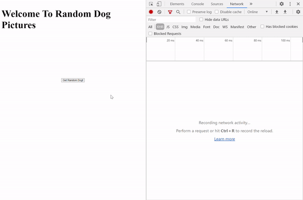

Note:
1. Start learning course on 2020/07/23
1. Finished on
1. As I just finished a course about HTML and CSS during June and July 2020, I will start the CSS session later to review the techniques and skills of HTML and CSS.

# Structure
1. [CSS Animation: Transforms and Transitions](#CSS-Animation:-Transforms-and-Transitions)
1. [CSS Animation: Keyframes](#CSS-Animation:-Keyframes)
1. [Advanced CSS: Layout with Flexbox](#Advanced-CSS:-Layout-with-Flexbox)
1. [Project: Building A Startup Site](#Project:-Building-A-Startup-Site)
1. [Async Foundations](#Async-Foundations)
1. [AJAX Part 1: XHR and Fetch](#AJAX-Part-1:-XHR-and-Fetch)
1. [AJAX Part 2: jQuery and Axios](#AJAX-Part-2:-jQuery-and-Axios)
1. [Testing with Jasmine](#Testing-with-Jasmine)
1. [Advanced Array Methods](#Advanced-Array-Methods)
1. [Closures and the Keyword 'this'](#Closures-and-the-Keyword-'this')
1. [Object Oriented Programming with JavaScript](#Object-Oriented-Programming-with-JavaScript)
1. [Creating JSON API's with Node and Mongo](#Creating-JSON-API's-with-Node-and-Mongo)
1. [Codealong: Single Page Todo List with Express, Mongo, and jQuery](#Codealong:-Single-Page-Todo-List-with-Express,-Mongo,-and-jQuery)
1. [ES2015 Part 1](#ES2015-Part-1)
1. [ES2015 Project - Guess the Password](#ES2015-Project-\--Guess-the-Password)
1. [ES2015 Part 2](#ES2015-Part-2)
1. [ES2016 and ES2017](#ES2016-and-ES2017)
1. [D3 and the DOM](#D3-and-the-DOM)
1. [Data Joins and Update Patterns in D3](#Data-Joins-and-Update-Patterns-in-D3)
1. [SVG and D3](#SVG-and-D3)
1. [D3 Odds and Ends, and Advanced Graph Types](#D3-Odds-and-Ends,-and-Advanced-Graph-Types)
1. [Project: Building a Data Dashboard with D3](#Project:-Building-a-Data-Dashboard-with-D3)
1. [Introduction to React and JSX](#Introduction-to-React-and-JSX)
1. [Create React App and Props](#Create-React-App-and-Props)
1. [State](#State)
1. [The Virtual DOM, Events, and Forms](#The-Virtual-DOM,-Events,-and-Forms)
1. [Component Lifecycle Methods](#Component-Lifecycle-Methods)
1. [Building A Full-stack App with React](#Building-A-Full\-stack-App-with-React)
1. [React Router](#React-Router)
1. [Redux Introduction](#Redux-Introduction)
1. [In Depth Redux Code Walkthrough](#In-Depth-Redux-Code-Walkthrough)
1. [Warbler Introduction and Backend Part 1](#Warbler-Introduction-and-Backend-Part-1)
1. [Warbler Backend Part 2](#Warbler-Backend-Part-2)
1. [Warbler Frontend Part 1](#Warbler-Frontend-Part-1)
1. [Warbler Frontend Part 2](#Warbler-Frontend-Part-2)

# Async Foundations

### Callback Functions

1. Objectives
   1. Define callback functions
   1. Define higher order functios
   1. Use a callback function to make the code more general
   1. Create callbacks using anonymous functions
1. A "**callback function**" is a function that is passed into another function as a parameter then invoked by that other function.
1. A "**higher order function**" is a function that accept a callback as a parameter. 
   ```js
   function callback() {
     console.log("Coming from callback");
   }

   function higherOrder(fn) {
     console.log("About to call callback");
     fn();
     console.log("Callback has been invoked");
   }

   higherOrder(callback);
   ```
1. What are callbacks used for? 
    1. Advanced Array methods
    1. Browser events 
    1. AJAX Requests
    1. React Development 

### Codealong: forEach
1. Objectives 
    1. Describe and use the forEach function
    1. Implement the forEach function
1. `.forEach` method is define as an `Array` method (function on `Array` object) as the followings.
    ```js 
    function forEach(array, callback) {
        //To be implemented
    }

    function callback(curElement, currentIndex, array) {
        // Implemented by the caller of forEach 
    }
    ```
1. Define our own `forEach()` function 
    ```js 
    function forEach(array, callback) {
        for (let i = 0; i < array.length; i++) {
            callback(array[i], i, array);
        }
    }
    ```

### findIndex 
1. Objectives
    1. Describe and use the `.findIndex()` method
    1. Implement `.findIndex()` in practice
1. `.findIndex()` returns the index of the first element in the `Array` for which the callback returns a truthy value. `-1` is returned if the callback never returns a truthy value. `.find()`, `.findIndex()`, and `.filter()` use similar syntax to find either an element that fits the filter or the position of which in an `Array`. 
    ```js 
    function findIndex(array, callback) {
        // finIndex code to be implemented 
    }

    function callback(curElement, curIndex, array) {
        // callback implemented by caller of function
    }
    ```
1. A common mistake developers made in the callback function is forget to `return` the result from the callback function. We try to create the `.findIndex()` method as a function by our own. 
    ```js 
    function findIndex(arr, callback) {
        for (let i = 0; i < arr.length; i++) {
            if(callback(arr[i], i, arr)){
                return i;
            }
        }
        return -1; 
    }
    ```

### The Stack and The Heap
1. Objectives
    1. Describe what a "stack" is 
    1. Describe stack frame
    1. Describe the Heap 
1. "**stack**" is an ordered data structure, keeps track of function invocations, is part of the JavaScript runtime (which we don't access directly). 
    1. Whenever a function is invoked, the details of the invocation (execution context) are saved on the top of the stack (pushed to the top).
    1. Whenever a function returns, the information about the invocation is taken off the top of the stack (popped off of the top).
    1. In summary, stack is an ordered set of stack frames. Most recently invoked function is on the top of the stack. The bottom of the stack is the first function invoekd. The stack is processed from the top to bottom. 
1. "**Heap**" is an area in memory where the data is stored. 

### setTimeout and setInterval
1. Objectives - Use `setTimeout()` and `setInterval()
1. `setTimeout()` is a function that asynchronously invokes a callback after a delay of milliseconds.
    ```js
    let timerId = setTimeout(function () {
        console.log('This function runs in 30 seconds');
    }, 3000);

    setTimeout(() => {
        console.log('Canceling the first setTimeout', timerId);
        clearTimeout(timerId);
    })
    ```
1. `setInterval()` is a function that continually invokes a callback after every x milliseconds, where x is provided to `setInterval()`
    ```js 
    let num = 0;
    let intervalId = setInterval(function () {
        num++;
        console.log(num);
        if (num === 20) {
            clearInterval(intervalId);
        }
    }, 200);
    ```

### The Event Loop and the Queue
1. Objectives 
    1. Define event loop and the queue
    1. Describe how the event loop and the queue work with the stack 
    1. Define JavaScript as a single threaded langugage
1. **Queue** is an ordered list of functions waiting to be placed on the stack. Functions in the queue are processed on a first in, first out basis (FIFO).
1. **Event Loop** is a functionality in JavaScript runtime that checks the queue when the stack is empty. If the stack is empty, the front of the queue is placed in the stack. 
1. JavaScript is single threaded, which means that code execution is linear. Code that is running cannot be interrupted by something else going on in the program. 

### Promise Basics
1. Objectives 
    1. Define a promise 
    1. Add a `.then()` callback to a promise 
    1. Add a `.catch()` callback to a promise 
    1. Wrap a setTimeout call in a promise 
1. **Promise** is an `Object` that represents a task that will be completed in the future. 
    ```js 
    let p1 = new Promise((resolve, reject) => {
        setTimeout(() => {
            let randomInt = Math.floor(Math.random() * 10);
            resolve(randomInt);
        }, 4000)
    });

    p1.then(result => {
        console.log('Success', result);
    }).catch(error => {
        console.log('Error', error);
    })
    ```

### Promise Chaining
1. Objectives 
    1. Describe the disadvantages of using nested callbacks
    1. Return a promise from a `.then()` callback function
    1. Use a promise to make asynchronous code seem sequential 
1. Nest Async Callbacks. For example, we'd like to print number from 1 to 3 in an ascending order. 
1. Disadvantages of nested callbacks
    1. The code is hard to read
    1. Logic is difficult to reason about
    1. The code is not modular
    ```js 
    let counter = 0;
    setTimeout(() => {
        counter++;
        console.log('Counter: ', counter); // 1 
        setTimeout(() => {
            counter++;
            console.log('Counter: ', counter); // 2 
            setTimeout(() => {
                counter++;
                console.log('Counter: ', counter); // 3
            }, 3000);
        }, 2000);
    }, 1000)
    ```
1. We can use **Promise Chaining** to rewrite the callback chain above.
    ```js 
    let counter = 0;
    function incCounter() {
        counter++;
        console.log('Counter: ', counter);
    }

    function runLater(callback, timeInMs) {
        let p = new Promise(function (resolve, reject) {
            setTimeout(function () {
                let res = callback();
                resolve(res);
            }, timeInMs);
        });
        return p;
    }

    runLater(incCounter, 1000).then(function () {
        return runLater(incCounter, 2000);
    }).then(function () {
        return runLater(incCounter, 3000);
    }).then(function () {

    })
    ```
1. In practice, though it's useful to understand how promises work (resolve, reject), we will often use promises returned to us as values, such as retrievling data from database API. 


# AJAX Part 1: XHR and Fetch
### Intro to AJAX
1. AJAX stands for `Asynchronous` `JavaScript` and `XML`. 
1. AJAX is not a library, not a framework, and not a technology. 
1. AJAX is an approach and concept. Back in 2005, people use the followings to build websites. From the developers at the time, they noticed that all these pieces are here for us to make web apps that can update without refreshing. 
    1. HTML
    1. CSS
    1. JavaScript
    1. The DOM
    1. XMLHTTP Requests
1. With AJAX, websites can send and request data from a server in the background without disturbing the current page. This concept of website building introduces mordern single page apps. 
1. We can use the following tools (and more) to make requests with JavaScript 
    1. XMLHTTP request
    1. The `fetch` API
    1. 3rd Praty Libraries: jQuery, Axios, etc. 

### What's the deal with JSON and XML
1. Both JSON and XML are data formats.
1. API's don't respond with HTML but pure data, not structure. The efficient data type are formats like JSON and XML. 
1. `XML` stands for "Extended Markup Language" and is syntacticly similar to HTML, but it doesn't not describe presentation like HTML does. 
1. `JSON` stands for "JavaScript Object Notation" and looks exactly like JavaScript objects. 

### Making the First Request with XMLHTTPRequest
1. We can create a `XMLHttpRequest()` connection, use `.open()` method which takes a type of `HTTP request` and the `endpoint` of the API, and use `.send()` method to make the request. We then can check on `.readuState` of the connection condition. 
1. According to [MDN](https://developer.mozilla.org/en-US/docs/Web/API/XMLHttpRequest/readyState), a XML HTTP request has different states from 0 to 4. We can use `.onreadystatechange` and assign a function to check the condition of the state. If the request has `.readyState` at 4 and `.status` at `200`, it means the connection is good the API endpoint has returned the data. 
1. Library such as `jQuery` and `axios` are built based on these methods. 
1. Note that the request is only available to enpoint that allows the connection or if the request send the API key as well. 
    ```js
    let XHR = new XMLHttpRequest();

    // XHR.readyState can be 0 to 4
    XHR.onreadystatechange = function () {
        if (XHR.readyState == 4) {
            if (XHR.status == 200) {
                // print out the data if it gets 
                console.log(XHR.responseText);
            } else {
                // error handler
                console.log('There was a problem!');
            }
        }
    };
    // An API endpoint on Github that returns zen quote 
    XHR.open("GET", 'https://api.github.com/zen');
    XHR.send();
    ```

### AJAX workflow: Building the Random Image App
1. We can check on some websites such as Pininterst or Facebook main page. Every time we (as the user) scroll the page down to the button, the progarm will make further request to its server and render contents and makes the page never ends. 
1. We can check the async function working in the developer console with the `Network` tab. Every time we scroll to let the page render new contents, a `XHR` is made for the task. 
    
1. We firstly create a very simple webpage for the infrastructure to enable the JS to work and interact with DOM. 
    ```html 
    <!DOCTYPE html>
    <html lang="en">

    <head>
        <title>Test</title>
        <meta charset="UTF-8">
        <meta name="viewport" content="width=device-width, initial-scale=1">
        <link href="#" rel="stylesheet">
        <style>
            img {
                height: 200px;
            }

            .container {
                display: flex;
                flex-direction: column;
                align-items: center;
            }

            button {
                margin: 20px;
            }
        </style>
    </head>

    <body>
        <div class="container">
            <h1>Welcome To Random Dog Pictures</h1>
            
            <button id="btn">Get Random Dog!</button>
        </div>
        <script src="test.js"></script>
    </body>
    </html>
    ```
1. We use [`dog ceo`](https://dog.ceo/api/breeds/image/random) API endpoint to get an image URL to show on the HTML file. `https://dog.ceo/api/breeds/image/random`.
1. As the endpoint respond a JSON file, we need to use `JSON.parse()` to parse the string and turn it into a regular JavaScript object. We then can use DOM to modify the `src` attribute of an `` tag. 
    ```js 
    let btn = document.querySelector('#btn');
    let img = document.querySelector('#photo');

    //listen for clicks
    btn.addEventListener('click', function () {
        //make the request 
        let XHR = new XMLHttpRequest();

        XHR.onreadystatechange = function () {
            if (XHR.readyState == 4 && XHR.status == 200) {
                let url = JSON.parse(XHR.responseText).message;
                img.src = url;
            }
        }

        XHR.open('GET', 'https://dog.ceo/api/breeds/image/random');
        XHR.send();
    });
    ```
    

### Bitcoin Price Exercise
1. We call an API to get the latest price info. from [coindesk](https://www.coindesk.com/). Its API endpoint is `https://api.coindesk.com/v1/bpi/currentprice.json`. After getting the data, we parse it and use DOM to put the data on the webpage when the user click the button to refresh. 
    ```js
    let btn = document.querySelector('#btn');
    let priceDis = document.querySelector('#price');
    const currency = 'USD';

    //listen for clicks
    btn.addEventListener('click', function () {
        //make the request 
        let XHR = new XMLHttpRequest();

        XHR.onreadystatechange = function () {
            if (XHR.readyState == 4 && XHR.status == 200) {
                let data = JSON.parse(XHR.responseText);
                let price = data.bpi[currency].rate;
                priceDis.textContent = price;
            } else {
                alert("Something went wrong")
            }
        }

        const url = 'https://api.coindesk.com/v1/bpi/currentprice.json';
        XHR.open('GET', url);
        XHR.send();
    })
    ```
### Fetch Introduction 
1. Problems with XHR 
    1. Ugly, Bulky syntax 
    1. It's 16 years old and designed for different design concept and environment
    1. No Streaming 
1. `fetch()` API is a newer function to work on the same job. These 2 functions work in a different way that `fetch()` can work through streaming and check the data and stop the process if the purpose is done along the way, while `XHR` must retrieve all the data before it starts to work. The concept is similar to streaming on video media platform such as YouTube that users can start to watch the video before the whole video file is downloaded locally. Besids, assuming that we have huge data center or a "fetch" of data can be billions of items, while we only need a single one from the dataset. It's really unnecessary and inefficient to download the whole set and start to parse it. 
1. `fetch()` API returns a `promoise` that we can work only that much easier than using `XHR`, as `promise` can take `.then()` and `.catch()` method to handle the returned data and error handling. After getting the response from the API, we can use `.json()` method to work on the response and turn it into the JSON file that we can work on. 
    ```js
    const url = 'https://api.coindesk.com/v1/bpi/currentprice.json';

    fetch(url).then(function (data) {
        console.log(data);
        console.log('status code was: ' + data.status);
        return data.json();
    }).then(data => {
        console.log(data);
        console.log(data.bpi.USD.rate);
    });
    ```

### Fetch options
1. `fetch()` API function can not only take an URL as argument but an `option Object` as configurations. The default HTTP method is `"GET"`, while we can change it to `"POST"`. We can use this function to send JSON file to the API endpoint. In the following example, we try to send a JSON that has a `name` and `login` property to the API endpoint. We can check this on the `network` tab in developer console of a browser such as `Chrome`. 
1. We can check the documentation of `fetch()` API options [here](https://developer.mozilla.org/en-US/docs/Web/API/WindowOrWorkerGlobalScope/fetch) 
    ```js 
    fetch(url, {
        method: "POST", 
        body: JSON.stringify({
            name: 'blue',
            login: 'bluecat',
        })
    })
    .then(data => {
        // do something
    })
    .catch(error => {
        // handle error
    })

### Fetch error handling
1. `.catch()` only handles `request` and other problems such as internet or connection issues. However, if the API endpoint returns a valid data (though an error message), the promise will still work on the `resolve` callback function. Therefore, we can put an error handling in `.then()` method for the returned content itself.
1. We can separate the error handling function to make the code succinct. 
    ```js     
    fetch(url)
    .then(handleErrors)
    .then(request => {
        console.log('Everything is Fine!');
        console.log(request);
    })
    .catch(error => {
        console.log('There is a problem!', error);
    })

    function handleErrors (request) {
        if(!request.ok) {
            throw Error(request.status);
        }
        return request;
    }
    ```
### Fetch Random User Profile
1. The API endpoint is `https://randomuser.me/api/`
1. HTML
    ```html
    <h1 class="title"> Random User Generator</h1>
    <div class="user-profile">
        
        <div id="fullname">Jon Snow</div>
        <div id="username">
            kingofnorth
        </div>
        <div class="description">
            <div>Email: <span id="email">jon@hotmail.com</span></div>
            <div>City: <span id="city">Winterfell</span></div>
        </div>
        <div class="footer">
            <button id="btn">Next User!</button>
        </div>
    </div>
    ```
1. CSS
    ```css
    /* CSS design originally by @jofpin, tweaked by Colt Steele */
    @import url(https://fonts.googleapis.com/css?family=Raleway|Varela+Round|Coda);

    body {
        background: #ecf0f1;
        padding: 2.23em;
    }

    .title {
        color: #2c3e50;
        font-family: "Coda", sans-serif;
        text-align: center;
    }

    .user-profile {
        margin: auto;
        width: 27em;
        height: 11em;
        background: #fff;
        border-radius: .3em;
    }

    .user-profile #fullname {
        margin: auto;
        margin-top: -4.40em;
        margin-left: 5.80em;
        color: #16a085;
        font-size: 1.53em;
        font-family: "Coda", sans-serif;
        font-weight: bold;
    }

    #username {
        margin: auto;
        display: inline-block;
        margin-left: 10.43em;
        color: #3498db;
        font-size: .87em;
        font-family: "varela round", sans-serif;
    }

    .user-profile>.description {
        margin: auto;
        margin-top: 1.35em;
        margin-right: 3em;
        width: 18em;
        color: #7f8c8d;
        font-size: .87em;
        font-family: "varela round", sans-serif;
    }

    .user-profile>img#avatar {
        padding: .7em;
        margin-left: .3em;
        margin-top: .3em;
        height: 6.23em;
        width: 6.23em;
        border-radius: 18em;
    }


    .footer {
        margin: 2em auto;
        height: 3.70em;
        background: #16a085;
        text-align: center;
        border-radius: 0 0 .3em .3em;
        display: flex;
        justify-content: center;
        align-items: center;
        transition: background 0.1s;
    }

    button {
        color: white;
        font-family: "Coda", sans-serif;
        text-align: center;
        font-size: 20px;
        background: none;
        outline: none;
        border: 0;
        width: 100%;
        height: 100%;
    }

    button:hover {
        cursor: pointer;
    }

    .footer:hover {
        background: #1abc9c;
    }
    ```
1. JavaScript
    ```js
    const btn = document.querySelector('#btn');
    const url = 'https://randomuser.me/api/';

    const selectors = {
        fullname: '#fullname',
        username: '#username',
        email: '#email',
        city: '#city',
        img: '#avatar',
    }

    btn.addEventListener('click', () => {
        fetch(url)
            .then(errorHandler)
            .then(data => {
                const result = data.results[0];
                const firstName = result.name.first;
                const lastName = result.name.last;
                const username = result.login.username
                const email = result.email;
                const city = result.location.city;
                const img = result.picture.medium;
                console.log(result)
                // fullname
                document.querySelector(selectors.fullname).textContent = `${firstName} ${lastName}`;
                // username
                document.querySelector(selectors.username).textContent = `${username}`;
                // email
                document.querySelector(selectors.email).textContent = `${email}`;
                // city
                document.querySelector(selectors.city).textContent = `${city}`;
                // image
                document.querySelector(selectors.img).src = `${img}`;

            })
            .catch(error => {
                console.log(error);
            })
    });

    function errorHandler(request) {
        if (!request.status) {
            throw Error('Something went wrong');
        }
        return request.json();
    }
    ```
### Problems with Fetch API
1. Internet Explorer doesn't support `fecth()` function. 

# AJAX Part 2: jQuery and Axios
### Introduction to jQuery
1. jQuery is a JavaScript client library that allows developers to use certain functions in less code. 
    1. Without jQuery
    ```js 
    // without jQuery
    var request = new XMLHttpRequest();
    request.open('GET', '/my/url');

    request.onload = function() {
        if (request.status >= 200 && request.status < 400) {
            // Success!
            var data = JSON.parse(request.responseText);
        } else {
            // do something
        }
    };

    request.onerror = function() {
        // There was a connection error
    };

    request.send();
    ```
    1. With jQuery
    ```js
    // with jQuery 
    $.getJSON('/my/url', function (data) {
        // do seomthing 
    });
    ```
1. In this section, we will practice on `$.ajax`, `$.get`, `$.post`, and `$.getJSON`.

### jQuery $.ajax method 
1. `$.ajax()` works similar to a `promise`, while it takes an `Object` includes `method` and `url` property. The "base" jQuery method just creates an XMLHttpRequest under the hood. Besides, jQuery has smart guessing that it will detect the returned data from a HTTP request and "guess" how to parse it. We can check the [dataType](https://api.jquery.com/jQuery.ajax/) part on jQuery documenation. 
1. Besides, we can check in the develper console in the "**Network**" tab to check which kind of request is made by the function. 
    ```js 
    $.ajax({
        method: "GET", 
        url: "some.api.com", 
        dataType: 'json', // how to parse the data 
    })
    .done(function(res) {
        console.log(res); // this 'res' has been "parsed" with JSON.parse() that we can manipulate it directly
    })
    .fail(function(){
        // do something
    })
    ```
### jQuery AJAX shorthand methods 
1. All of the following methods are the shorthands for different HTTP requests. Each of them can be replaced with `$.ajax()` by passing certain HTTP methods, while we can simply pass only url as `Strings` to them and to use `.done()` and `.fail()` directly. 
1. `$.get()` is a shorthand to make a GET HTTP request. 
    ```js 
    $.get('url');

    $.ajax({
        method: "GET", 
        url: ""
    })
    ```
1. `$.post()` is a shorthand to make a POST HTTP request, while this method takes a 2nd argument which is the data to send to the API endpoint. 
    ```js 
    var data = {
        name: 'Allen', 
        city: 'Bangkok',
    }
    $.post('url', data)
    .done(function(){})
    .fail(function(){})
    ```
1. `$.getJSON()` is simialr to `$.get()` that works on a GET HTTP request and converts the returned data from JSON string to JavaScript object which we can use directly. 
    ```js 
    $.getJSON('url')
    .done(function(data) {
        console.log(data);
    })
    .fail(function(){

    });
    ```

### jQuery random cats API exercise 
1. The given random cat API doesn't work, so we use the previous dog CEO API for the image URL. 
    1. JavaScript 
    ```js 
    const url1 = 'https://aws.random.cat/meow';
    const url2 = 'https://cors-anywhere.herokuapp.com/http://aws.random.cat/meow';
    const url3 = 'https://dog.ceo/api/breeds/image/random';

    $('.btn').click(function () {
        $.get(url3)
            .done(function (res) {
                let url = res.message;
                console.log(url);
                $('.img').css("background-image", `url(${url})`)
            })
            .fail(function (err) {
                console.log('Error', err);
            })
    })
    ```
    1. HTML 
    ```html
    <!DOCTYPE html>
    <html lang="en">

    <head>
        <meta charset="UTF-8">
        <meta name="viewport" content="width=device-width, initial-scale=1.0">
        <title>Random Cat</title>
        <script src="https://code.jquery.com/jquery-3.5.1.min.js"
            integrity="sha256-9/aliU8dGd2tb6OSsuzixeV4y/faTqgFtohetphbbj0=" crossorigin="anonymous"></script>
        <style>
            body {
                padding: 0;
                margin: 0;
                background: #ccc;
                box-sizing: border-box;
            }

            .container {
                width: 300px;
                height: 300px;
                margin: 6rem auto;
                display: flex;
                flex-direction: column;
            }

            .img {
                width: 100%;
                height: 100%;
                padding: 0.2rem;
                background: url() center center/cover;
            }

            .btn {
                width: 50%;
                background: steelblue;
                color: #fff;
                padding: 1rem;
                font-size: 1.2rem;
                margin: 1rem auto;
                border: none;
                text-decoration: none;
                border-radius: 5px;
            }

            .btn:hover {
                cursor: pointer;
                background: rgb(54, 115, 165);
            }
        </style>
    </head>

    <body>
        <div class="container">
            <div class="img"></div>
            <button class="btn">Random Dog</button>
        </div>
        <script src="randomCat.js"></script>
    </body>

    </html>
    ```

### axios intro 
1. `axios` is a lightweight HTTP request library. According to [axios](https://github.com/axios/axios) Github, it has the following features 
    1. Make XMLHttpRequests from the browser
    1. Make http requests from node.js
    1. Supports the Promise API
    1. Intercept request and response
    1. Transform request and response data
    1. Cancel requests
    1. Automatic transforms for JSON data
    1. Client side support for protecting against XSRF
1. In this part, we use client side `axios` that we can import the code with CDN as jQuery. `axios` works similar to `fetch()` API function and `promise` objects, while we don't need to use `.json()` the convert the data and we can use `.then()` and `.catch()` methods directly. 
    ```js 
    let url = 'https://opentdb.com/api.php?amount=1';
    axios.get(url)
    .then(function (res) {
        console.log(res.data.results[0].question);
    })
    .catch(function (err) {
        console.log(err);
    });
    ```

### Axios Error Handling 
1. In this case, we try create and append new data on the page. Besides, we use error handler to catch the problems if it is from `request`, `respond`, or something else .
    ```js 
    let btn = document.querySelector('button');
    let section = document.querySelector('#comments');

    btn.addEventListener('click', sendRequest);

    function sendRequest() {
        axios.get('https://jsonplaceholder.typicode.com/comments', {
            params: {
                postId: 1,
            }
        })
            .then(addComments)
            .catch(handleErrors)
    }

    function addComments(res) {
        res.data.forEach(comment => {
            appendComment(comment);
        });
    }

    function appendComment(comment) {
        let newP = document.createElement('p');
        newP.innerText = comment.email;
        section.appendChild(newP);
    }

    function handleErrors(err) {
        if (err.response) {
            console.log('Problems With Response ', err.response.status);
        } else if (err.request) {
            console.log('Problem With Request!');
        } else {
            console.log('Error', err.message);
        }
    }
    ```

### Ron Swanson Exercise 
1. The exercise is try to use `XHR`, `fetch()`, `jQuery`, and `axios` to call an API and get a JSON as request and change the content on the webpage. All the 4 methods give the same result but use different syntax and code to achieve the goal. 
    1. JavaScript 
    ```js 
    const p = document.querySelector('#quote');
    const url = `http://ron-swanson-quotes.herokuapp.com/v2/quotes`;
    document.querySelector('#xhr').addEventListener('click', XHR);
    document.querySelector('#fetch').addEventListener('click', fetchData);
    $('#jquery').on('click', jqueryData);
    document.querySelector('#axios').addEventListener('click', axiosData);

    function XHR() {
        let XHR = new XMLHttpRequest();
        XHR.onreadystatechange = function () {
            if (XHR.readyState == 4) {
                if (XHR.status == 200) {
                    const quote = JSON.parse(XHR.responseText)[0];
                    p.innerText = quote;
                } else {
                    console.log('There was a problem!');
                }
            }
        };
        XHR.open("GET", url);
        XHR.send();
    }

    function fetchData() {
        fetch(url)
            .then(res => res.json())
            .then(data => {
                p.innerText = data[0];
            })
            .catch(err => {
                console.log('Error', err);
            })
    }

    function jqueryData() {
        $.getJSON(url)
            .done(data => {
                p.innerText = data[0];
            })
            .fail(err => {
                console.log(err)
            });
    }

    function axiosData() {
        axios.get(url)
            .then(res => {
                p.innerText = res.data[0];
            })
            .catch(err => {
                console.log('Error', err);
            })
    }
    ```
    1. HTML 
    ```html
    <!DOCTYPE html>
    <html lang="en">

    <head>
        <meta charset="UTF-8">
        <meta name="viewport" content="width=device-width, initial-scale=1.0">
        <script src="https://cdnjs.cloudflare.com/ajax/libs/axios/0.19.2/axios.min.js"></script>
        <script src="https://code.jquery.com/jquery-3.5.1.min.js"
            integrity="sha256-9/aliU8dGd2tb6OSsuzixeV4y/faTqgFtohetphbbj0=" crossorigin="anonymous"></script>
        <title>Axios practice</title>
        <style>
            @import url('https://fonts.googleapis.com/css?family=Roboto');

            body {
                font-family: 'Roboto';
                color: #2c3e50;
                text-align: center;
            }

            #quote {
                font-size: 20px;
            }

            .container {
                display: flex;
                justify-content: space-around;
                flex-wrap: wrap;
            }


            button {
                margin-top: 20px;
                background: red;
                border: none;
                outline: none;
                height: 40px;
                text-align: center;
                width: 130px;
                border-radius: 40px;
                background: #fff;
                border: 2px solid #1abc9c;
                color: #1abc9c;
                letter-spacing: 1px;
                text-shadow: 0;
                font-size: 12px;
                font-weight: bold;
                cursor: pointer;
                -webkit-transition: all 0.25s ease;
                transition: all 0.25s ease;
                font-family: 'Roboto', sans-serif;


            }

            button:hover {
                color: white;
                background: #1abc9c;
            }
        </style>
    </head>

    <body>
        <h1>Ron Swanson Quote Generator</h1>
        <p>(4 ways of writing AJAX requests)</p>
        <section class="container">
            <button id="xhr">XHR</button>
            <button id="fetch">Fetch</button>
            <button id="jquery">jQuery</button>
            <button id="axios">Axios</button>
        </section>
        <p id="quote">Quote Goes Here...</p>
        <script src="test.js"></script>
    </body>

    </html>
    ```

# Testing with Jasmine
### Writing Test in the Browser
1. Objectives 
    1. Understand what Jasmine and unit testing are
    1. Define describe, it, matchers, and spies
    1. Write better tests with before and after hooks
    1. Write asynchronous tests with clocks and done callbacks 
    1. Compare and contrast TDD and BDD and differentiate between unit and other kinds of tests
    1. Write unit tests using Jasmine
1. We can use unit tests, test parts of an application, (or units). Very commonly, each unit is tested individually and independently to ensure an application is running as expected. Therefore, we need 
    1. A framework to write tests
    1. A way of describing the code we are testing 
    1. A tool where we can make assertions or expectations about our code 
1. Jasime library
    1. Comes with everything we need to test our code 
    1. Works well all kinds of JavaScript environments
    1. Simple syntax to quickly get up and running with 
1. In this case, we will use browser as the environment to work on. 
    1. Create an HTML file 
    1. Link CSS and JavaScript tags 
    1. Start writing tests

### Jasmine Syntax and Matchers
1. Essential Keywords
    1. **describe** - let me describe __ to your
    1. **it** - let me tell you about __ 
        1. **expect** lives in `it` function
1. A ceonceptual exercise 
    1. `discribe("Earth")`
    1. `it("is round")`
        1. `expect(earth.isRound.toBe(true))`
    1. `it("is the third planet from the sun")`
        1. `expect(earth.numberFromSun).toBe(3)`
1. In Code, `describe`, `it`, and `expect` are given to us by `Jasmine`.
    ```js 
    var earth = {
        isRound: true,
        numberFromSun: 3
    }

    describe("Earth", function(){
        it("is round", function(){
            expect(earth.isRound).toBe(true)
        });
        it("is the thrid planet from the sun", function(){
            expect(earth.numberFromSun.toBe(3))
        });
    });
    ```
1. There are several `Matchers` we can use in `Jasmine`
    1. `toBe`/`not.toBe`
    1. `toBeCloseTo`
    1. `toBeDefined`
    1. `toBeFalsey`/`toBeTruthy`
    1. `toBeGreaterThan`/`toBeLessThan`
    1. `toContain`
    1. `toEqual` can compare 2 individual objects with their properties though they have different reference in the memory. This is a handy method to compare 2 `Arrays` or `Objects`. 
    1. `jasmine.any()` is to check the type of the data. For example, we can't use `typeof` to check `Array`, as an `Array` is an `Object` in JavaScript. 

### Writing better tests with Hooks
1. If a variable is used multiple times in the flow of testing methods, we can run `beforeEach` before each `it` callback. 
    ```js 
    describe('Arrays', function(){
        var arr; 
        beforeEach(function(){
            arr = [1,3,5];
        });
        
        it('adds elements to an array', function() {
            arr.push(7);
            expect(arr).toEqual([1,3,5,7]);
        });

        it('returns the new length of the array', function(){
            expect(arr.push(7)).toBe(4);
        });

        it('adds anything into the array', function(){
            expect(arr.push({})).toBe(4);
        })
    });
    ```
1. On the other hand, we can use `afterEach` and run after each `it` callback which is useful for teardown. 
    ```js 
    describe('Counting', function(){
        var count = 0; 
        beforeEach(function(){
            count++;
        });

        afterEach(function(){
            count = 0;
        });

        it('has a counter that increments', function(){
            expect(count).toBe(1);
        });

        it('gets reset', function(){
            expect(count).toBe(1);
        });
    });
    ```
1. Besides `beforeEach` and `afterEach`, we can use `beforeAll` and `afterAll` which variables will only be defined once and be shared by each tester. Note that this may have side-effects, as `Array` and `Object` are mutable, and following testers may use the wrong input to test the function. 
    ```js 
    var arr = [];
    beforeAll(function(){
        arr = [1,2,3];
    });
    
    describe('Counting', function(){
        it('starts with an array', function(){
            arr.push(4);
            expect(1).toBe(1);
        });
        it('keeps mutating that array', function(){
            console.log(arr); // [1,2,3,4]
            arr.push(5);
            expect(1).toBe(1);
        });
    });
    
    describe('Again', function(){
        it('keeps mutating the array...again', function(){
            console.log(arr); // [1,2,3,4,5]
            expect(1).toBe(1);
        });
    });
    ```

### Spies
1. Jasmine has test double funcitons called spies
1. A spy can stub (mimic) any function and track calls to it and all arguments 
1. Spies only exists in the `describe` or `it` block in which it is defined. 
1. Spies are removed after each spec. 
1. There are special matchers for interacting with spies. 

### Clocks
1. The Jasmine Clock is available for testing time dependent code. 
1. It is installed by invoking jasmine.clock().install()
1. Be sure to uninstall the clock after you are done to restore the original functions.
1. Testing async code 
    1. Jasmine also has support for running spects that require testing async code 
    1. `beforeAll`, `afterAll`, `beforeEach`, `afterEach`, and it take an optional single argument (commonly called 'done') that should be called when the async work is complete. 
    1. A test will not complete until its 'done' is called. 

### TDD and BDD
1. TDD - Test Driven Development
    1. Write the tests 
    1. See the tests fail 
    1. Write code to pass the tests
    1. Refactor code as necessary 
    1. Repeat
1. BDD - Behavior Driven Development 
    1. BDD is a subset of TDD 
    1. Not mutually exclusive with TDD
    1. Involve being verbose with our style and describing the behavior of the functionality
    1. Helpful when testing the design of the software 

### Different Types of Test
1. Other types of tests
    1. Integration tests 
    1. Acceptance tests 
    1. Stress tests
1. Unit testing involves testing pieces of functionality.
1. Jasmine is a testing framework that allows us to easily write unit tests. 
1. Jasmine has quite a few matchers for testing almost any kind of expectation.
1. Using `beforeEach`, `afterEach`, `beforeAll`, `afterAll` hooks can help reduce duplication and confusion. 
1. Jasmine provides spies for mimicking the behavior of a function.
1. Jasmine provides a clock object for testing timers and a callback function for testing asynchronous code.

# Advanced Array Methods
### forEach
1. Iterates through an `Array`. 
1. Runs a calbback function on each value in the array. 
1. `.forEach()` method returns `undefined`. 
    ```js 
    function halfValue(arr) {
        var newArr = [];
        arr.forEach(function(val){
            newArr.push(val / 2);
        });
        return newArr; 
    }

    halfValues([2,4,6]); // [1,2,3]
    ```
### Coding Exercise 2: Exercise: forEach
```js
/*
Write a function called doubleValues which accepts an array and returns a new array with all the values in the array passed to the function doubled

Examples:
    doubleValues([1,2,3]) // [2,4,6]
    doubleValues([5,1,2,3,10]) // [10,2,4,6,20]

*/
function doubleValues(arr){
    var list = [];
    arr.forEach((el) => {
        list.push(el * 2);
    });
    return list; 
}

/*
Write a function called onlyEvenValues which accepts an array and returns a new array with only the even values in the array passed to the function

Examples:
    onlyEvenValues([1,2,3]) // [2]
    onlyEvenValues([5,1,2,3,10]) // [2,10]

*/
function onlyEvenValues(arr){
    var list = [];
    arr.forEach(el => {
        if ((el % 2) === 0 && el !== 0) {
            list.push(el);
        }
    });
    return list; 
}

/*
Write a function called showFirstAndLast which accepts an array of strings and returns a new array with only the first and last character of each string.

Examples:
    showFirstAndLast(['colt','matt', 'tim', 'udemy']) // ["ct", "mt", "tm", "uy"]
    showFirstAndLast(['hi', 'goodbye', 'smile']) // ['hi', 'ge', 'se']

*/
function showFirstAndLast(arr){
    var list = [];
    arr.forEach(e => {
        list.push(`${e[0]}${(e[e.length-1])}`);
    });
    return list; 
}

/*
Write a function called addKeyAndValue which accepts an array of objects, a key, and a value and returns the array passed to the function with the new key and value added for each object 

Examples:
    addKeyAndValue([{name: 'Elie'}, {name: 'Tim'}, {name: 'Matt'}, {name: 'Colt'}], 'title', 'instructor') 
    
    // [{name: 'Elie', title:'instructor'}, {name: 'Tim', title:'instructor'}, {name: 'Matt', title:'instructor'}, {name: 'Colt', title:'instructor'}]

*/
function addKeyAndValue(arr,key,value){
    const list = arr; 
    arr.forEach(e => {
        e[key] = value;
    });
    return list; 
}

/*
Write a function called vowelCount which accepts a string and returns an object with the keys as the vowel and the values as the number of times the vowel appears in the string. This function should be case insensitive so a lowercase letter and uppercase letter should count

Examples:
    vowelCount('Elie') // {e:2,i:1};
    vowelCount('Tim') // {i:1};
    vowelCount('Matt') // {a:1})
    vowelCount('hmmm') // {};
    vowelCount('I Am awesome and so are you') // {i: 1, a: 4, e: 3, o: 3, u: 1};
*/
function vowelCount(str){
   str = str.toLowerCase();
   const arr = str.split('');
   const obj = {};
   arr.forEach(e => {
       if (e === 'a') {(!obj['a']) ? obj['a'] = 1 : obj['a']++;}
       if (e === 'e') {(!obj['e']) ? obj['e'] = 1 : obj['e']++;}
       if (e === 'i') {(!obj['i']) ? obj['i'] = 1 : obj['i']++;}
       if (e === 'o') {(!obj['o']) ? obj['o'] = 1 : obj['o']++;}
       if (e === 'u') {(!obj['u']) ? obj['u'] = 1 : obj['u']++;}
   });
   return obj;
}

// alternative solution from the lecture 
function vowelCount(str) {
    var splitArr = str.split('');
    var obj = {};
    var vowels = 'aeiou';

    splitArr.forEach(function(letter) {
        if (vowels.indexOf(letter.toLowerCase()) !== -1) {
            if (letter in obj) {
                obj[letter]++
            } else {
                obj[letter] = 1;
            }
        }
    });

    return obj;
}
```

### map 
1. Creates a new array
1. Iterates through an array 
1. Runs a callback function for each value in the array
1. Adds the result of that callback function to the new array
1. Returns the new array 
1. `.map()` method always returns a new array of the same `length`
```js 
function tripeValues(arr) {
    return arr.map(function(value){
        return value * 3;
    });
}
tripleValues([1,2,3]); //[3,6,9]

function onlyFirstName(arr) {
    return arr.map(function(val) {
        return val.first; 
    });
}

onlyFirstName([{first: 'Tim', last: 'Garcia'}, {first: 'Matt', last: 'Lane'}]); // ['Tim', 'Matt']
```

### Coding Exercise 3: Exercise: Map
```js
/*
Write a function called doubleValues which accepts an array and returns a new array with all the values in the array passed to the function doubled

Examples:
    doubleValues([1,2,3]) // [2,4,6]
    doubleValues([1,-2,-3]) // [2,-4,-6]
*/

function doubleValues(arr){
    return arr.map(function(value) {
        return value * 2;
    })
}

/*
Write a function called valTimesIndex which accepts an array and returns a new array with each value multiplied by the index it is currently at in the array.

Examples:
    valTimesIndex([1,2,3]) // [0,2,6]
    valTimesIndex([1,-2,-3]) // [0,-2,-6]
*/

function valTimesIndex(arr){
    return arr.map(function(e, i){
        return e * i;
    })
}

/*
Write a function called extractKey which accepts an array of objects and some key and returns a new array with the value of that key in each object.

Examples:
    extractKey([{name: 'Elie'}, {name: 'Tim'}, {name: 'Matt'}, {name: 'Colt'}], 'name') // ['Elie', 'Tim', 'Matt', 'Colt']
*/

function extractKey(arr, key){
    return arr.map(function(el) {
        return el[key];
    })
}

/*
Write a function called extractFullName which accepts an array of objects and returns a new array with the value of the key with a name of "first" and the value of a key with the name of  "last" in each object, concatenated together with a space. 

Examples:
    extractFullName([{first: 'Elie', last:"Schoppik"}, {first: 'Tim', last:"Garcia"}, {first: 'Matt', last:"Lane"}, {first: 'Colt', last:"Steele"}]) // ['Elie Schoppik', 'Tim Garcia', 'Matt Lane', 'Colt Steele']
*/

function extractFullName(arr){
    return arr.map(function(el){
        return `${el.first} ${el.last}`;
    })
}
```

### Filter
1. Creates a new array.
1. Iterates through an array. 
1. Runs a callback function on each value in the array.
1. If the callback funciton returns `true`, that value will be added to the new array.
1. If the callback function returns `false`, that value will be ignored from the new array. 
1. The result of the callback will always be a boolean.
```js 
var arr = [1,2,3];
var list = arr.filter(function(value, index, array) {
    return value > 2; 
}); 
console.log(list) //[3]


var instructors = [{name: 'Elie'}, {name: 'Tim'}, {name: 'Matt'}, {name: 'Colt'}];
instructors.filter(function(value, index, array){
    return value.name.length > 3;
});


function filter(array, callback) {
    var newArr = [];
    for(var i = 0; i < array.length; i++) {
        if(callback(array[i], i, array)) {
            newArr.push(array[i]);
        }
    }
    return newArr;
}

function onlyFourLetterName(arr) {
    return arr.filter(function(value){
        return value.length === 4;
    });
}
onlyFourLetterName(['Rusty', 'Matt', 'Moxie', 'Colt']) // ['Matt', 'Colt']


function divisibleByThree(arr) {
    return arr.filter(function(value){
        return value % 3 === 0;
    });
}
divisibleByThree([1,2,3,4,5,6,7,8,9]); // [3,6,9]
```

### Coding Exercise 4: Exercise: Filter
```js 
/*
Write a function called filterByValue which accepts an array of objects and a key and returns a new array with all the objects that contain that key.

Examples:
    filterByValue([{first: 'Elie', last:"Schoppik"}, {first: 'Tim', last:"Garcia", isCatOwner: true}, {first: 'Matt', last:"Lane"}, {first: 'Colt', last:"Steele", isCatOwner: true}], 'isCatOwner') // [{first: 'Tim', last:"Garcia", isCatOwner: true}, {first: 'Colt', last:"Steele", isCatOwner: true}]
*/

function filterByValue(arr, key){
    return arr.filter(function(el){
        return !(!el[key]);
    })
}

/*
Write a function called find which accepts an array and a value and returns the first element in the array that has the same value as the second parameter or undefined if the value is not found in the array.

Examples:
    find([1,2,3,4,5], 3) // 3
    find([1,2,3,4,5], 10) // undefined
*/

function find(arr, searchValue){
    const list = arr.filter(function(el) {
        return el === searchValue;
    });
    if (!list.length) return undefined;
    return list[0];
}

// we can shorten the code as the following according to the lecture
// Array[0] will be 'undefined' if the array is empty
function find(arr, searchValue){
    return arr.filter(function(el) {
        return el === searchValue;
    })[0];
}

/*
Write a function called findInObj which accepts an array of objects, a key, and some value to search for and returns the first found value in the arrayt.

Examples:
    findInObj([{first: 'Elie', last:"Schoppik"}, {first: 'Tim', last:"Garcia", isCatOwner: true}, {first: 'Matt', last:"Lane"}, {first: 'Colt', last:"Steele", isCatOwner: true}], 'isCatOwner',true) // {first: 'Tim', last:"Garcia", isCatOwner: true}
*/

function findInObj(arr, key, searchValue){
    const list = arr.filter( el => {
        return el[key] === searchValue;
    });
    return list[0];
}

// we can shorten the code as the following according to the lecture
function findInObj(arr, key, searchValue){
    return arr.filter( el => {
        return el[key] === searchValue;
    })[0];
}

/*
Write a function called removeVowels which accepts a string and returns a new string with all of the vowels (both uppercased and lowercased) removed. Every character in the new string should be lowercased.

Examples:
    removeVowels('Elie') // ('l')
    removeVowels('TIM') // ('tm')
    removeVowels('ZZZZZZ') // ('zzzzzz')
*/

function removeVowels(str){
    const arr = str.toLowerCase().split('');
    const vowels = 'aeiou';
    const list = arr.filter(el => {
        if (vowels.indexOf(el) !== -1) return false;
        return true; 
    });
    const string = list.join('');
    return string;
}

// we can shorten the code as the following according to the lecture
function removeVowels(str){
    const vowels = 'aeiou';
    return str.toLowerCase().split('').filter(el => {
        return vowels.indexOf(el) === -1;
    }).join('');
}

/*
Write a function called doubleOddNumbers which accepts an array and returns a new array with all of the odd numbers doubled (HINT - you can use map and fitler to double and then filter the odd numbers).

Examples:
    doubleOddNumbers([1,2,3,4,5]) // [2,6,10]
    doubleOddNumbers([4,4,4,4,4]) // []
*/

function doubleOddNumbers(arr){
    const list = arr.filter(function(el){
        if ((el % 2) !== 0) return true; 
        return false; 
    });
    
    return list.map(el=>{
        return el * 2;
    })
}

// we can shorten the code as the following according to the lecture
function doubleOddNumbers(arr){
    return arr.filter(function(el){
        return (el % 2) !== 0;
    }).map( function(el) {
        return el * 2;
    });
}
```

### Some
1. Iterates through an array.
1. Runs a callback on each value in the array.
1. If the callback returns `true` for at least one single value, return `true`.
1. Otherwise, return `false`. 
1. The result of the callback will always be a `Boolean`.
```js
var arr = [1,2,3];
arr.some(function(value, index, array) {
    return value < 2;
}); // true 


var arr = [1,2,3];
arr.some(function(value, index, array) {
    return value < 4;
}); // false 


function some(array, callback) {
    for (var i = 0; i < array.length; i++) {
        if(callback(array[i], i, array)) {
            return true; 
        }
    }
    return false;
}


function hasEvenNumber(arr) {
    return arr.some(function(value){
        return value % 2 === 0;
    });
}
hasEvenNumber([1,2,3,4]) // true
hasEvenNumber([1,3,5]) // false


function hasComma(str) {
    return str.split('').some(function(value){
        return value === ',';
    });
}
hasComma('This is wonderful'); //false 
hasComma('This, is wonderful'); // true
```

### Every 
1. Iterates through an array.
1. Runs a callback on each value in the array.
1. If the callback returns `false` for any single value, returns `false`.
1. Otherwise, return `true`. 
1. The result of the callback will always be a `Boolean`. 
```js 
var arr = [-1, -2, -3];
arr.every(function(value, index, array){
    return value < 0;
}); //true 


var arr = [1,2,3];
arr.every(function(value, index, array) {
    return value > 2;
}); // false 


function every(array, callback) {
    for (var i = 0; i < array.length; i++) {
        if (callback(array[i], i, array) === false)
        return false; 
    }
    return true; 
}


function allLowerCase(str) {
    return str.split('').every(function(value){
        return value === value.toLowerCase();
    })
}
allLowerCase('this is really nice'); // true
allLowerCase('this is Really nice'); // false


function allArrays(arr) {
    return arr.every(Array.isArray);
}
allArrays([[1], [2], [3,4]]); // true
allArrays([[1], [2], {}]); // false 
```

### Exercise: Some and Every 
```js 
/*
Write a function called hasOddNumber which accepts an array and returns true if the array contains at least one odd number, otherwise it returns false.

Examples:
    hasOddNumber([1,2,2,2,2,2,4]) // true
    hasOddNumber([2,2,2,2,2,4]) // false
*/

function hasOddNumber(arr){
    return arr.some(function(el){
        return (el % 2) !== 0;
    })
}

/*
Write a function called hasAZero which accepts a number and returns true if that number contains at least one zero. Otherwise, the function should return false

Examples:
    hasAZero(3332123213101232321) // true
    hasAZero(1212121) // false
*/

function hasAZero(num){
    return String(num).split('').some(function(num){
        return num === '0';
    })
}

// According to the lecture, we can use .toString() method to turn a number value into string
function hasAZero(num) {
    return num.toString().split('').some(function(num){
        return num === '0';
    })
}

/*
Write a function called hasOnlyOddNumbers which accepts an array and returns true if every single number in the array is odd. If any of the values in the array are not odd, the function should return false. 

Examples:
    hasOnlyOddNumbers([1,3,5,7]) // true
    hasOnlyOddNumbers([1,2,3,5,7]) // false
*/

function hasOnlyOddNumbers(arr){
    return arr.every(function(num){
        return num % 2 !== 0;
    })
}

/*
Write a function called hasNoDuplicates which accepts an array and returns true if there are no duplicate values (more than one element in the array that has the same value as another). If there are any duplicates, the function should return false.

Examples:
    hasNoDuplicates([1,2,3,1]) // false
    hasNoDuplicates([1,2,3]) // true
*/

function hasNoDuplicates(arr){
    const obj = {};
    arr.forEach(function(el){
        if (!obj[el]) {
            obj[el] = 1;
        } else {
            obj[el]++;
        }
    });
    for (key in obj) {
        if (obj[key] > 1) return false;
    }
    return true;
}

function hasNoDuplicates(arr){
    return arr.every(function(el) {
        return array.filter(e => el === e).length === 1;
    });
}

// Another solution from the lecture
// this method is to use .indexOf to search the string by order and .lastIndexOf to search reversely to check if the same value appears at the same position in the array
function hasNoDuplicates(arr) {
    return arr.every(function(val) {
        return arr.indexOf(val) === arr.lastIndexOf(val);
    });
}

/*
Write a function called hasCertainKey which accepts an array of objects and a key, and returns true if every single object in the array contains that key. Otherwise it should return false.

Examples:
    var arr = [
        {title: "Instructor", first: 'Elie', last:"Schoppik"}, 
        {title: "Instructor", first: 'Tim', last:"Garcia", isCatOwner: true}, 
        {title: "Instructor", first: 'Matt', last:"Lane"}, 
        {title: "Instructor", first: 'Colt', last:"Steele", isCatOwner: true}
    ]
    
    hasCertainKey(arr,'first') // true
    hasCertainKey(arr,'isCatOwner') // false
*/

function hasCertainKey(arr, key){
    return arr.every(el => {
        return !(!el[key]);
    });
}

// According to the lecture, we can use `in` keyword to check as well 
function hasCertainKey(arr, key) {
    return arr.every(function(val) {
        return key in val;
    });
}

/*
Write a function called hasCertainValue which accepts an array of objects and a key, and a value, and returns true if every single object in the array contains that value for the specific key. Otherwise it should return false.

Examples:
    var arr = [
        {title: "Instructor", first: 'Elie', last:"Schoppik"}, 
        {title: "Instructor", first: 'Tim', last:"Garcia", isCatOwner: true}, 
        {title: "Instructor", first: 'Matt', last:"Lane"}, 
        {title: "Instructor", first: 'Colt', last:"Steele", isCatOwner: true}
    ]
    
    hasCertainValue(arr,'title','Instructor') // true
    hasCertainValue(arr,'first','Elie') // false
    
*/

function hasCertainValue(arr, key, searchValue){
    return arr.every(function(el){
        return el[key] === searchValue;
    });
}
```

### Reduce
1. Accepts a callback function and an optional second parameter.
1. Iterates through an array.
1. Runs a callback on each value in the array.
1. The first parameter to the callback is either the first value in the array or the optional second parameter.
1. The first parameter to the callback is often called 'accumulator'.
1. The returned value from the callback becomes the new value of accumulator. 
1. Whatever is returned from the callback function, becomes the new value of the accumulator. 
```js 
var arr = [1,2,3,4,5];
arr.reduce(function(accumulator, nextValue){
    return accumulator + nextValue;
}); // 15

var arr = [1,2,3,4,5];
arr.reduce(function(accumulator, nextValue){
    return accumulator + nextValue;
}, 10); // 25


var names = ['Tim', 'Matt', 'Colt', 'Elie'];
names.reduce(function(accumulator, nextValue){
    return accumulator += ' ' + nextValue;
}, 'The instructors are');


var arr = [5,4,1,4,5];
arr.reduce(function(accumulator, nextValue) {
    if(nextValue in accumulator) {
        accumulator[nextValue]++;
    } else {
        accumulator[nextValue] = 1;
    }
    return accumulator;
}, {});


function sumOddNumbers(arr) {
    return arr.reduce(function(accumulator, nextValue){
        if (nextValue %2 !== 0) {
            accumulator += nextValue;
        }
        return accumulator;
    }, 0);
}
sumOddNumbers([1,2,3,4,5]); // 9


function createFullName(arr) {
    return arr.reduce(function(accumulator, nextValue) {
        accumulator.push(nextValue.first + ' ' + nextValue.last);
        return accumulator;
    }, []);
}
createFullName([{first: 'Colt', last: 'Steele'}, {first: 'Matt', last: 'Lane'}]);
// ['Colt Steel', 'Matt Lane']
```

### Exercise: Reduce
```js 
/*
Write a function called extractValue which accepts an array of objects and a key and returns a new array with the value of each object at the key.

Examples:
    var arr = [{name: 'Elie'}, {name: 'Tim'}, {name: 'Matt'}, {name: 'Colt'}]
    extractValue(arr,'name') // ['Elie', 'Tim', 'Matt', 'Colt']
*/

function extractValue(arr, key){
    return arr.reduce(function(acc, el){
        acc.push(el[key]);
        return acc;
    }, []);
}


/*
Write a function called vowelCount which accepts a string and returns an object with the keys as the vowel and the values as the number of times the vowel appears in the string. This function should be case insensitive so a lowercase letter and uppercase letter should count

Examples:
    vowelCount('Elie') // {e:2,i:1};
    vowelCount('Tim') // {i:1};
    vowelCount('Matt') // {a:1})
    vowelCount('hmmm') // {};
    vowelCount('I Am awesome and so are you') // {i: 1, a: 4, e: 3, o: 3, u: 1};
*/

function vowelCount(str){
    const list = str.toLowerCase().split('');
    const vowels = 'aeiou';
    return list.reduce(function(acc, el){
       if (vowels.indexOf(el) !== -1) {
           if (acc[el]) {
               acc[el]++;
           } else {
               acc[el] = 1;
           }
       } 
       return acc; 
   }, {});
}

// we can shorten the code according to the lecture 
function vowelCount(str) {
    var vowels = "aeiou";
    reutrn str.split("").reduce(function(acc, next){
        if(vowels.indexOf(next.toLowerCase()) !== -1) {
            if (next in acc) {
                acc[next]++;
            } else {
                acc[next] = 1;
            }
        }
        return acc; 
    }, {})
}

/*
Write a function called addKeyAndValue which accepts an array of objects and returns the array of objects passed to it with each object now including the key and value passed to the function.

Examples:
    var arr = [{name: 'Elie'}, {name: 'Tim'}, {name: 'Matt'}, {name: 'Colt'}];
    
    addKeyAndValue(arr, 'title', 'Instructor') // 
      [
        {title: 'Instructor', name: 'Elie'}, 
        {title: 'Instructor', name: 'Tim'}, 
        {title: 'Instructor', name: 'Matt'}, 
        {title: 'Instructor', name: 'Colt'}
       ]
*/

function addKeyAndValue(arr, key, value){
    return arr.reduce(function(acc, el){
        el[key] = value
        acc.push(el);
        return acc;
    }, [])
}

// Solution from the lecture
function addKeyAndValue(arr, key, value) {
    return arr.reduce(function(acc, next, idx) {
        acc[idx][key] = value;
        return acc;
    }, acc);
}

/*
Write a function called partition which accepts an array and a callback and returns an array with two arrays inside of it. The partition function should run the callback function on each value in the array and if the result of the callback function at that specific value is true, the value should be placed in the first subarray. If the result of the callback function at that specific value is false, the value should be placed in the second subarray. 

Examples:
    
    function isEven(val){
        return val % 2 === 0;
    }
    
    var arr = [1,2,3,4,5,6,7,8];
    
    partition(arr, isEven) // [[2,4,6,8], [1,3,5,7]];
    
    function isLongerThanThreeCharacters(val){
        return val.length > 3;
    }
    
    var names = ['Elie', 'Colt', 'Tim', 'Matt'];
    
    partition(names, isLongerThanThreeCharacters) // [['Elie', 'Colt', 'Matt'], ['Tim']]
*/

function partition(arr, callback){
    return arr.reduce(function(acc, el){
        if (callback(el)) {
            acc[0].push(el);
        } else {
            acc[1].push(el);
        }
        return acc; 
    }, [[], []]);
}
```

### Recap 
1. `.forEach()` iterates over an array, runs a callback on each value and returns `undefined`.
1. `.map()` creates a new array, runs a callback on each value and pushes the result of each callback in the new array.
1. `.filter()` creats a new array, runs a callback on each value and if the result of the callback returns `true`, that value is added to the new array.
1. `.some()` iterates through an array and runs a callback on each value, if the callback for at least one value returns `true`, `.some()` returns `true`, otherwise `false`. 
1. `.every()` iterates through an array and runs a callback on each value, if the callback at any time returns `false`, `.every()` returns `false`. 
1. `.reduce()` returns an accumulated value which is determined by the result of what is returned to each callback. 

# Closures and the Keyword 'this'
### Introduction to Closures
1. Objectives 
    1. Understand waht a closure is and what it is not.
    1. Use a closure to emulate private variables. 
    1. List use cases for closures in the real world. 
1. Closure Definition - A closure is a function that makes use of variables defined in outer functions that have previously returned. 
    ```js 
    function outer(a) {
        return function inner(b) {
            // the inner function is making use of the variable "a"
            // which was defined in an outer function called "outer"
            // and by the time inner is called, that outer function has returned 
            // this function called "inner" is a closure
            return a + b;
        }
    }

    outer(5)(5); // 10

    var storeOuter = outer(5); 
    storeOuter(10); // 15
    ```

### Using closures in the wild 
1. Private Variables - In other languages, there exists support for variables that can not be modified externally. We call those private variables, but in JavaScript we don't have that built in. 
    ```js 
    function classRoom() {
        var instructors = ['Elie', 'Colt'];
        return {
            getInstructors: function(){
                return instructors;
            },
            addInstructor: function(instructor){
                instructors.push(instructor);
                return instructors.slice(); // return a copy of the array without modifying it
            }
        }
    }
    ```

### Exercise: Closures
```js 
/* 
Write a function called specialMultiply which accepts two parameters. If the function is passed both parameters, it should return the product of the two. If the function is only passed one parameter - it should return a function which can later be passed another parameter to return the product. You will have to use closure and arguments to solve this.

Examples: 

    specialMultiply(3,4); // 12
    specialMultiply(3)(4); // 12
    specialMultiply(3); // function(){}....
*/

function specialMultiply(a,b){
    if (a && b) {
        return a * b;
    }
    if (a) {
        return function(b){
            return a * b;
        }   
    }
}

// solution from the lecture
function specialMultiply(a, b){
    if (arguments.length === 1) {
        return function(b){
            return a * b;
        }
    }
    return a * b;
}

/* 
Write a function called guessingGame which takes in one parameter amount. The function should return another function that takes in a parameter called guess. In the outer function, you should create a variable called answer which is the result of a random number between 0 and 10 as well as a variable called guesses which should be set to 0.

In the inner function, if the guess passed in is the same as the random number (defined in the outer function) - you should return the string "You got it!". If the guess is too high return "Your guess is too high!" and if it is too low, return "Your guess is too low!". You should stop the user from guessing if the amount of guesses they have made is greater than the initial amount passed to the outer function.

You will have to make use of closure to solve this problem.

Examples (yours might not be like this, since the answer is random every time):

    var game = guessingGame(5)
    game(1) // "You're too low!"
    game(8) // "You're too high!"
    game(5) // "You're too low!"
    game(7) // "You got it!"
    game(1) // "You are all done playing!"

    var game2 = guessingGame(3)
    game2(5) // "You're too low!"
    game2(3) // "You're too low!"
    game2(1) // "No more guesses the answer was 0"
    game2(1) // "You are all done playing!"
*/

function guessingGame(amount){
    var count = 0;
    var num = Math.floor(Math.random()*10);
    var completed = false; 
    return function(guess){
        if (!completed) {
            count++;
            if (guess === amount) {
                completed = true; 
                return "You got it!";
            } else if (guess > num){
                return "You're too high!";
            } else if (guess < num){
                return "You're too low!";
            } else if (guess === amount) {
                completed = true; 
                return "No more guesses the answer was " + num;
            }
        }
        return "You are all done playing!"; 
    }
}
```
### Closures Recap
1. Closure exists when an inner function makes use of variables declared in an outer function which has previously returned.
1. Closure doesn't exist if you do not return an inner function and if that inner function doesn't make use of variables returned by an outer function
1. JavaScript will only remember values that are being used inside of the inner function, not all variables defined in the outer function.
1. We can use closures to create private variables and write better code that isolates our logic and application. 

### Introduction to the keyword 'this' 
### 'this' with functions and 'use strict'
1. Objectives
    1. Define what the keyword `this` is.
    1. Understand the four ways to always figure out what the keyword `this` is.
1. `this`
    1. A reserved keyword in JavaScript
    1. Usually determined by how a function is called (what we call 'execution context')
    1. Can be determined using four rules (global, object/implicit, explicit, new)
1. Global Context 
    1. When `this` is not inside of a declared object, it will refer to the global object of the runtime, such as `window` in browser and `global` in Node.js.
    ```js 
    console.log(this); // window
    function whatIsThis(){
        return this;
    }
    whatIsThis(); // window

    function variablesInThis(){
        this.person = 'Elie';
    }
    variablesInThis(); // the keyword this inside the function is the window
    console.log(person); // Elie
    ```
1. We can use `"use strict"` to invoke strict mode that we can't refer to gobal object by `this`, so we can prevent accidentally creating global variable. 
### Object/Implicit Binding
1. Implicit/Object
    1. When the keyword `this` is inside of a declared object 
    ```js 
    var person = {
        firstName: "Elie", 
        sayHi: function() {
            return "Hi " + this.firstName;
        },
        determineContext: function() {
            return this === person;
        }
    }

    person.sayHi(); // "Hi Elie" 
    person.determineContext(); // true 
    ```
    1. A keyword `this` is defined when a function is run. There is not a function being run here to create a new value of the keyword `this`, so the value of `this` is still the window. 
    ```js
    var person = {
        firstName: "Elie", 
        determineContext: this; 
    }
    person.determineContext; // window 
    ```
    1. A nested object 
    ```js
    var person = {
        firstName: "Colt", 
        sayHi: function() {
            return "Hi " + this.firstName;
        },
        determineContext: function() {
            return this === person;
        },
        dog: {
            sayHello: function() {
                return "Hello " + this.firstName;
            },
            determineContext: function(){
                return this === person;
            }
        }
    }

    person.sayHi(); // 'Hi Colt'
    person.determineContaxt(); // true
    person.dog.sayHello(); // 'Hello undefined' 
    person.dog.determineContext(); // 'false'
    ```

### Explicit Binding
1. Choose what we want the context of 'this' to be using `call`, `apply`, or `bind`. These methods can only be used on functions. 
    ```js
    var person = {
        firstName: "Colt", 
        sayHi: function(){
            return "Hi " + this.firstName; 
        },
        determineContext: function(){
            return this === person; 
        },
        dog: {
            sayHello: function(){
                return "Hello " + this.firstName;
            },
            determineContext: function(){
                return this === person; 
            }
        }
    }

    person.dog.sayHello.call(person); // "Hello Colt" 
    person.dog.determineContext.call(person); // true; 
    ```
    1. Refactor code to be more succinct. We can "borrow" the code from the other object 
    ```js
    var colt = {
        firstName: 'Colt', 
        sayHi: function(){
            return "Hi " + this.firstName;
        }
    }

    var elie = {
        firstName: "Elie",         
    }

    colt.sayHi(); // Hi Colt
    colt.sayHi.call(elie); // Hi Elie    
    ```
    1. Make a `sayHi` function for everyone.
    ```js
    function sayHi() {
        return "Hi " + this.firstName;
    }

    var colt = {
        firstName: "Colt"
    }

    var elie = {
        firstName: "Elie"
    }

    sayHi.call(colt); // Hi Colt
    sayHi.call(elie); // Hi Elie
    ```
### Call
1. By using DOM, we can use `document.getElementsByTagName` method to select all `<div>` tags on the page. However, the returned object is an array-like list that we can't use array methods directly. In this case, we can use `.call()` method to turn the object into an `Array`. In this case, we try to get all the `<div>` tags that have text content 'Hello'.
1. In ES6, we can use `Array.from()` to create or duplicate an `Array` from an `Array` or array-like objects. 
    ```js
    var divs = document.getElementsByTagName('div');
    var divsArray = [].slice.call(divs);
    divsArray.filter(function(val){
        return val.innerText === 'Hello';
    })
    ```
### Apply
1. When a function does not accept an `Array`, `.apply()` will spread out values in an `Array` as the parameters to the function. 
    ```js
    var nums = [5,7,1,4,2];
    Math.max(nums); // NaN

    Math.max.apply(this, nums); // 7
    function sumValues(a,b,c) {
        return a+b+c;
    }
    var values = [4,1,2];
    sumValues(values); // 4,1,2undefinedundefined 
    sumValues.apply(this, [4,1,2]); // 7
    sumValues.apply(null, values); // 7
    ```

### Bind 
1. The parameters works like `.call()`, but `.bind()` returns a function with the context of `this` bound already.
    ```js 
    function addNumbers(a,b,c,d) {
        return this.firstName + " just calculated " + (a+b+c+d);
    }
    var elie = {
        firstName: "Elie"
    }

    var elieCalc = addNumbers.bind(elie,1,2,3,4); 
    elieCalc(); // Elie just calculated 10

    var elieCalc = addNumbers.bind(elie,1,2); 
    elieCalc(3,4); // Elie just calculated 10
    ```
1. The `this` keyword in the async API `setTimeout` refers to the global object in the runtime rather than the object itself, as when the async function is actually called and executed in the global context after all the synchronous functions are executed. Therefore, we can use `.bind()` method to make it an function that can be called later at other time point. 
    ```js
    var colt = {
        firstName: "Colt", 
        sayHi: function() {
            setTimeout(function(){
                console.log('Hi ' + this.firstName);
            }, 1000);
        }
    }

    colt.sayHi(); // Hi undefined (1000 milliseconds later)
    ```
1. Use `.bind()` method to give the correct object for the function to refer. 
    ```js
    var colt = {
        firstName: 'Colt', 
        sayHi: function() {
            setTimeout(function(){
                console.log('Hi ' + this.firstName);
            }.bind(this), 1000)
        }
    }

    colt.sayHi(); // Hi Colt (1000 milliseconds later)
    ```

### Exercise: Call, Apply, and Bind
1. `.apply()` method can the an `Array` or `array-like object` to send the elements as parameters to the function. Therefore in a function of a function, we can use `function.apply(thisArg, arguments))` directly. 
1. `Array.prototype.reverse()` method returns an `Array` in the reverse order. 
1. We can check `length` property of an function which returns the number of arguments a function can take. 
```js
/*
Write a function called arrayFrom which converts an array-like-object into an array.

Examples:
    var divs = document.getElementsByTagName('divs');
    divs.reduce // undefined
    var converted = arrayFrom(divs);
    converted.reduce // function(){}....
*/

function arrayFrom(arrayLikeObject){
    return Array.prototype.slice.call(arrayLikeObject);
}

/* 
// Write a function called sumEvenArguments which takes all of the arguments passed to a function and returns the sum of the even ones.

Examples:
    sumEvenArguments(1,2,3,4) // 6
    sumEvenArguments(1,2,6) // 8
    sumEvenArguments(1,2) // 2
*/

function sumEvenArguments(){
    var arr = [...arguments];
    return arr.reduce(function(acc, el){
        if (el % 2 === 0) return acc + el;
        return acc; 
    }, 0);
}

/* 
Write a function called invokeMax which accepts a function and a maximum amount. invokeMax should return a function that when called increments a counter. If the counter is greater than the maximum amount, the inner function should return "Maxed Out"

Examples:

    function add(a,b){
        return a+b
    }

    var addOnlyThreeTimes = invokeMax(add,3);
    addOnlyThreeTimes(1,2) // 3
    addOnlyThreeTimes(2,2) // 4
    addOnlyThreeTimes(1,2) // 3
    addOnlyThreeTimes(1,2) // "Maxed Out!"

*/

function invokeMax(fn, num){
    var count = 0;
    return function(...args){
        if (count < num) {
            count++;
            return fn.apply(null, args);
        } else {
            return "Maxed Out!";
        }
    }
}

/* 
Write a function called once which accepts two parameters, a function and a value for the keyword 'this'. Once should return a new function that can only be invoked once, with the value of the keyword this in the function set to be the second parameter.

Examples:

    function add(a,b){
        return a+b
    }

    var addOnce = once(add, this);
    addOnce(2,2) // 4
    addOnce(2,2) // undefined
    addOnce(2,2) // undefined
    
    function doMath(a,b,c){
        return this.firstName + " adds " + (a+b+c)
    }
    
    var instructor = {firstName: "Elie"}
    var doMathOnce = once(doMath, instructor);
    doMathOnce(1,2,3) // "Elie adds 6"
    doMathOnce(1,2,3) // undefined
    

*/

function once(fn, thisArg){
    var count = true;
    return function(){
        var args = Array.prototype.slice.call(arguments);
        if (count) {
            count = false;
            return fn.apply(thisArg, args);     
        } 
        return undefined;   
    }
}

// BONUSES! 

/* 
Write a function called bind which accepts a function and a value for the keyword this. Bind should return a new function that when invoked, will invoke the function passed to bind with the correct value of the keyword this. HINT - if you pass more than two parameters to bind, those parameters should be included as parameters to the inner function when it is invoked. You will have to make use of closure!

Examples:

    function firstNameFavoriteColor(favoriteColor){
        return this.firstName + "'s favorite color is " + favoriteColor
    }
    
    var person = {
        firstName: 'Elie'
    }
    
    var bindFn = bind(firstNameFavoriteColor, person);
    bindFn('green') // "Elie's favorite color is green"
    
    var bindFn2 = bind(firstNameFavoriteColor, person, 'blue');
    bindFn2('green') // "Elie's favorite color is blue" 
    
    function addFourNumbers(a,b,c,d){
        return a+b+c+d;
    }

    bind(addFourNumbers,this,1)(2,3,4) // 10
    bind(addFourNumbers,this,1,2)(3,4) // 10
    bind(addFourNumbers,this,1,2,3)(4) // 10
    bind(addFourNumbers,this,1,2,3,4)() // 10
    bind(addFourNumbers,this)(1,2,3,4) // 10
    bind(addFourNumbers,this)(1,2,3,4,5,6,7,8,9,10) // 10

*/

function bind(fn, thisArg){
    var outerArgs = Array.from(arguments).slice(2);
    return function() {
        var innerArgs = Array.from(arguments);
        var allArgs = outerArgs.concat(innerArgs);
        return fn.apply(thisArg, allArgs);
    }
}

/* 
Write a function called flip which accepts a function and a value for the keyword this. Flip should return a new function that when invoked, will invoke the function passed to flip with the correct value of the keyword this and all of the arguments passed to the function REVERSED. HINT - if you pass more than two parameters to flip, those parameters should be included as parameters to the inner function when it is invoked. You will have to make use of closure! 

Flip should return a new function that when invoked takes the correct number of required arguments to that function which are then reversed. HINT - you will need to use the .length property on functions to figure out the correct amount of arguments. For example:

flip(subtractFourNumbers,this,11,12,13,14,15)(1,2,3,4,5,6,7,8,9,10) 


Examples:

    function personSubtract(a,b,c){
        return this.firstName + " subtracts " + (a-b-c);
    }
    
    var person = {
        firstName: 'Elie'
    }
    
    var flipFn = flip(personSubtract, person);
    flipFn(3,2,1) // "Elie subtracts -4"
    
    var flipFn2 = flip(personSubtract, person, 5,6);
    flipFn2(7,8). // "Elie subtracts -4"
    
    function subtractFourNumbers(a,b,c,d){
        return a-b-c-d;
    }

    flip(subtractFourNumbers,this,1)(2,3,4) // -2
    flip(subtractFourNumbers,this,1,2)(3,4) // -2
    flip(subtractFourNumbers,this,1,2,3)(4) // -2
    flip(subtractFourNumbers,this,1,2,3,4)() // -2
    flip(subtractFourNumbers,this)(1,2,3,4) // -2
    flip(subtractFourNumbers,this,1,2,3)(4,5,6,7) // -2
    flip(subtractFourNumbers,this)(1,2,3,4,5,6,7,8,9,10) // -2
    flip(subtractFourNumbers,this,11,12,13,14,15)(1,2,3,4,5,6,7,8,9,10) // -22

*/


function flip(fn, thisArg){
    var outerArgs = Array.from(arguments).slice(2);
    return function(){
        var innerArgs = Array.from(arguments);
        var allArgs = outerArgs.concat(innerArgs).slice(0, fn.length);
        return fn.apply(thisArg, allArgs.reverse());
    }
}
```

### The 'new' keyword and section recap
1. We can set the context of the keyword `this` using the `new` keyword - it does quite a bit more as well which we will discuss further when we talk about OOP. 
    ```js 
    function Person(firstName, lastName){
        this.firstName = firstName;
        this.lastName = lastName;
    }

    var elie = new Person("Elie", "Schoppik");
    elie.firstName; // Elie
    elie.lastName; // Schoppik
    ```
1. The keyword `this` is a reserved keyword in JavaScript and its value is determined at execution. 
1. It is either set using the global context, object binding, explicit binding, or the `new` keyword. 
1. When set in the global context in a function, it is either the global object (window if in the browser) or `undefined` (if we are using `"strict mode"`).
1. To explicitly set the value of the keyword `this`, we use `.call()`, `.apply()`, `.bind()`.
1. We can also use the `new` keyword to set the context of `this`, which we will discuss when we talk about Object Oriented Programming. 

# Object Oriented Programming with JavaScript
### Introduction to Object Oriented Programming with JavaScript
1. Objectives 
    1. Define what OOP (Object Oriented Programming) is 
    1. Revisit the `new` keyword and understand the four things it does 
    1. User constructor functions to reduce duplication in the code 
    1. Use `.call()` and `.apply()` to refactor constructor functions 
1. OOP Defined 
    1. A programming model based around the idea of objects 
    1. These objects are constructed from what are called `classes`, which we can think of like a blueprint. We call these objects created from classes `instances`.
    1. We strive to make our classes abstract and modular. 
1. Object Creation
    1. Imagine we want to make a few house objects, they will all have `bedrooms`, `bathrooms`, and `numSqft`. The approach without classes is repetitive and redundant.
    1. Instead of making an infinite number of different objects, let's see if we can create a function to construct these similar "house" objects. 
    Constructor functions - Let's use a function as a blueprint for what each house should be - we call these kinds of functions `constructor` functions. 
        1. Capitalization of the function name as convention
        1. The keyword `this` is used to point to the object itself. 
        1. We are attaching properties onto the keyword `this`. We would like the keyword `this` to refer to the object we will create from our constructor function, how might we do that?
            1. If we call the function directly, we are not returning anything from the function so our `House` function returns `undefined`.
            1. We are not explicitly binding the keyword `this` or placing it inside a declared object. This means the value of the keyword `this` will be the global object, which is not what we want. 
    ```js 
    function House(bedrooms, bathrooms, numSqft) {
        this.bedroom = bedrooms;
        this.bathrooms = bathrooms;
        this.numSqft = numSqft; 
    }
    ```

### The 'new' keyword 
1. We can use `new` keyword and constructor `function` to create an `Object`. When the `new` keyword is used 
    1. It first creates an empty object.
    1. It then sets the keyword `this` to be that empty object. 
    1. It adds the line `return this` to the end of the function, which follows it. 
    1. It adds a property onto the empty object called `__proto__`, which links the prototype property on the constructor function to the empty object. 
    ```js 
    function House(bedrooms, bathrooms, numSqft) {
        this.bedroom = bedrooms;
        this.bathrooms = bathrooms;
        this.numSqft = numSqft; 
    }

    var firstHouse = new House(2, 2, 1000);
    ```
1. Create a `Dog` class that has `name` and `age` property and a method `bark()`.
    ```js 
    function Dog(name, age){
        this.name = name;
        this.age = age;
        this.bark = function(){
            console.log(`${this.name} just barked`)
        };
    }

    var rusty = new Dog('Rusty', 3);
    var fido = new Dog('Fido', 3);
    
    rusty.bark();
    fido.bark();
    ```

### Multiple Constructors 
1. Let's create two constructor functions, one for Car and one for Motocycle and notice how much duplication is going on in the Motorcycle function. Is there any way to "borrow" the Car function and invoke it inside the Motorcycle function? 
    ```js
    function Car(make, model, year) {
        this.make = make;
        this.model = model;
        this.year = year;
        // we can also set properties on the keyword this
        // that are preset values
        this.numWheels = 4;
    }

    function Motorcycle(make, model, year) {
        this.make = make; 
        this.model = model; 
        this.year = year; 
        this.numWheels = 2;
    }
    ```
1. We can refactor the code with `.call()` and `.apply()`.
    ```js 
    function Car(make, model, year) {
        this.make = make; 
        this.model = model;
        this.year = year;
        this.numWheels = 4; 
    }

    function Motorcycle(make, model, year) {
        // using call 
        Car.call(this, make, model, year);
        this.numWheels = 2;
    }

    function Motorcycle(make, model, year) { // we don't need to even pass in parameters!
        // even better using apply with arguments 
        Car.apply(this, arguments);
        this.numWHeels = 2; 
    }
    ```

### Constructor Function Recap 
1. Object oriented programming is a model based on objects constructed from a blueprint. We use OOP to write more modular and shareable code. 
1. In languages that have built-in support for OOP, we call these blueprints "classes" and the objects created from them "instances". 
1. Since we don't have built-in class support in JavaScript, we mimic classes by using functions. These constructor functions create objects through the use of the `new` keyword. 
1. We can avoid duplication in multiple constructor functions by using `.call()` or `.apply()`. 

### Exercise: Constructor Functions 
```js 
// PART 1

// Create a constructor function for a Person, each person should have a firstName, lastName, favoriteColor and favoriteNumber. Your function MUST be named Person. 

// Write a method called multiplyFavoriteNumber that takes in a number and returns the product of the number and the object created from the Person functions' favorite number.

function Person(firstName, lastName, favoriteColor, favoriteNumber){
    this.firstName = firstName;
    this.lastName = lastName;
    this.favoriteColor = favoriteColor;
    this.favoriteNumber = favoriteNumber;
    this.multiplyFavoriteNumber = function(num){
        return num * this.favoriteNumber; 
    }
}

// PART 2

// Given the following code - refactor the Child function to remove all the duplication from the Parent function. You should be able to remove 4 lines of code in the Child function and replace it with 1 single line.

function Parent(firstName, lastName, favoriteColor, favoriteFood){
    this.firstName = firstName;
    this.lastName = lastName;
    this.favoriteColor = favoriteColor;
    this.favoriteFood = favoriteFood;
}

function Child(firstName, lastName, favoriteColor, favoriteFood){
    Parent.apply(this, arguments);
}
```

### Introduction to Prototypes 
1. Objectives 
    1. Understand what the prototype object is
    1. Describe and diagram the relationship between `__proto__`, prototype, and constructor. 
    1. Add methods and properties on the prototype object to write more efficient code. 
    1. Explain the difference between adding methods and properties to the prototype versus the constructor function. 
    1. Implement inheritance in JavaScript through the prototype object. 
1. The `new` keyword 
    1. Creates an object out of thin air 
    1. Assigns the vlaue of `this` to be that object. 
    1. Adds `return this` to the end of the function. 
    1. Creates a link (which we can access as `__proto__`) between the object created and the prototype property of the constructor function. 
1. Every constructor function has a property on it called `prototype`, which is an `Object`. 
1. The prototype object has a property on it called `constructor`, which points back to the constructor function. 
1. Anytime an object is created using the `new` keyword, a property called `__proto__` gets created, linking the object and the prototype property of the constructor function. 
    ```js 
    function Person(name) {
        this.name = name;
    }

    // these are objects created from the Person constructor
    var elie = new Person("Elie");
    var colt = new Person("Colt");

    elie.__proto__ === Person.prototype; // true 
    Person.prototype.constructor = Person // true 
    ```

### The Prototype Chain 
1. The `prototype` is shared among all objects created by the constructor function. 
    ```js 
    function Person(name) {
        this.name = name;
    }

    // these are objects created from the Person constructor
    var elie = new Person("Elie");
    var colt = new Person("Colt");

    Person.prototype.isInstructor = true; 
    elie.isInstructor; // true
    colt.isInstructor; // true
    ```
1. An instance create by `new` keyword and constructor function can inherit the properties from the prototype from `__proto__`. 
    ```js 
    var arr = new Array; 
    arr.__proto__ = Array.prototype // true 
    ```
1. In JavaScript, every object has a method `.hasOwnProperty()` which returns `true` if the given string as the name of the property exists in the object. We can use `dir()` or `console.dir()` function to check the properties of a JavaScript object. For example, if we check an `Array` with `dir([])`, we can see the first `__proto__` includes the methods and properties as regular arrays. While in these array methods and properties, there is another `__proto__` that includes the methods and properties of an `Object`, as `Arrays` are a type of `Object` in JavaScript. 
1. Since the object properties are the last layer of the prototype of an object, we will find `null`, if we try to access `__proto__` property of an `Object`.

### Adding Methods to the Prototypes
1. Objects created by the same constructor have a shared prototype. However, the code may be inefficient that every time we make an object using the `new` keyword, we have to redefine the method. Therefore, we can assign the method that we'd like to add on the object's prototype. 
    ```js
    function Person(name) {
        this.name = name; 
        /* not so efficient
        this.sayHi = function() {
            return "Hi " + this.name; 
        }
        */
    }

    Person.prototype.sayHi = function(){
        return "Hi " + this.name; 
    }

    elie = new Person("Elie");
    elie.sayHi(); // Hi Elie
    ```
1. Create a constructor function for a vehicle: every object created from this constructor should have a `make`, `model`, and `year` property. Each object should also have a property called isRunning which should set to be `false`. 
1. Every object created from the `Vehicle` constructor should have a function called `turnOn`, which changes the `isRunning` property to `true`.
1. Every object created from the `Vehicle` constructor should have a function called `turnOff`, which changes the isRunning property to `false`.
1. Every object created from the `Vehicle` constructor should have a method called `honk`, which returns the string `beep` ONLY if the `isRunning` property is `true`. 
    ```js 
    function Vehicle(make, model ,year){
        this.make = make;
        this.model = model;
        this.year = year;
        this.isRunning = false;
    }

    Vehicle.prototype.turnOn = function(){
        this.isRunning = true;
    }

    Vehicle.prototype.turnOff = function(){
        this.isRunning = false;
    }

    Vehicle.prototype.honk = function(){
        if (this.isRunning) {
            return 'beep';
        }
    }
    ```

### Exercises: Prototypes
1. We can use `Array.prototype.indexOf()` method to check if an element is in an `Array`. If the element doesn't exist, the method will return `-1`. We can use this feature as conditions to check if an element IS NOT in the array. For example, we can check if `1` is in array `arr` by `if (arr.indexOf(1) === -1) { [do something] }`.
    ```js 
    // 1 - Create a constructor function for a Person. Each person should have a firstName, lastName, favoriteColor, favoriteNumber)

    function Person(firstName, lastName, favoriteColor, favoriteNumber) {
        this.firstName = firstName;
        this.lastName = lastName;
        this.favoriteColor = favoriteColor;
        this.favoriteNumber = favoriteNumber;
        this.family = [];
    }

    /* 2 - Add a function on the Person.prototype called fullName that returns the firstName and lastName property of an object created by the Person constructor concatenated together.
        
    Examples:    
        var person = new Person("Elie", "Schoppik", "purple", 34)
        person.fullName() // "Elie Schoppik"

    */

    Person.prototype.fullName = function(){
        return this.firstName + " " + this.lastName;
    }

    // 3 -  Add a property on the object created from the Person function called family which is an empty array. This will involve you going back and adding an additional line of code to your Person constructor you previously created in exercise 1.

    /* 4 - Add a function on the Person.prototype called addToFamily which adds an object constructed from the Person constructor to the family array. To make sure that the object you are adding is an object construced from the Person constructor (HINT - take a look at the instanceof keyword). Make sure that your family array does not include duplicates! This method should return the length of the family array.


    Examples: 
        
        var person = new Person("Elie", "Schoppik", "purple", 34)
        var anotherPerson = new Person()
        person.addToFamily(anotherPerson); // 1
        person.addToFamily(anotherPerson); // 1
        person.family.length // 1
        
        person.addToFamily("test"); // 1
        person.addToFamily({}); // 1
        person.addToFamily([]); // 1
        person.addToFamily(false); // 1
        person.family.length // 1
    */

    Person.prototype.addToFamily = function(obj){
        if (obj instanceof Person && !this.family.includes(obj)) {
            this.family.push(obj);
        }
    }

    // from the lecture, we can use .indexOf to check if the object is in the array. Besides, we should return the length of the array

    Person.prototype.addToFamily = function(person) {
        if (this.family.indexOf(person) === -1 && person instanceof Person) {
            this.family.push(person);
        }
        return this.family.length; 
    }

    // PART II 

    // 1 - Implement your own version of Array.prototype.map. The function should accept a callback and return a new array with the result of the callback for each value in the array. 

    Array.prototype.map = function(callback){
        const arr = [];
        for (let i = 0; i < this.length; i++) {
            arr.push(callback(this[i], i, this));
        }
        return arr;
    }

    /* 2 - Implement a function called reverse that reverses a string and place it on the String.prototype

    Examples:
        "test".reverse() // "tset"
        "tacocat".reverse() // "tacocat"
    */

    String.prototype.reverse = function(){
        const text = this.toString().split('');
        const arr = [];
        for (let i = text.length - 1; i >= 0; i--){
            arr.push(text[i]);
        }
        return arr.join('');
    }

    // from the lecture, we can keep concatenate string with plus operator 
    String.prototype.reverse = function() {
        var newStr = '';
        for(var i = this.legnth -1; i >= 0; i--) {
            newStr += this[i];
        }
        return newStr; 
    }
    ```

### Prototypal inheritance
1. The passing of methods and properties from one class to another. Though we can assign `.prototype` property of 2 constructor functions, as it is not duplicating the object referencing to the same object, when one object is modified, the other will be affected as well. 
1. We can use `Object.create()` function to inherit properties and methods from another `prototype` without referencing to the same object. Therefore, the newly created object is independant to the original one, and each object will not affect to each other. Besides, we don't use `new` keyword here, as `new` keyword will create a new `Object` instance from the prototype.  
1. If we use `Object.create()` to inherit prototype from another constructor function, the new class will inherit the original constructor function as well, so we need to assign it back to what it should be
    ```js
    function Person(firstName, lastName) {
        this.firstName = firstName;
        this.lastName = lastName;
    }

    function Student(firstName, lastName) {
        return Person.apply(this, arguments);
    }

    Student.prototype = Person.prototype;

    Student.prototype.status = function(){
        return "I am currently a student";
    }

    var colt = new Person('Colt', 'Steele');
    console.log(colt.status()) // I am currently a student
    
    delete Person.prototype.status;

    Student.prototype.sayHi = function(){
        return "Hello " + this.firstName + " " + this.lastName;
    }

    Student.prototype = Object.create(Person.prototype);
    Student.prototype.constructor // Person
    Student.prototype.constructor = Student;
    ```
1. Note that duplicating objects in JavaScript are using different methods 
    1. Spread operator
    1. `Object.assign()` method 
    1. `JSON.parse(JSON.stringify(obj))`
    ```js
    const person = {
        firstName: 'John',
        lastName: 'Doe'
    };

    // using spread ...
    let p1 = {
        ...person
    };

    // using  Object.assign() method
    let p2 = Object.assign({}, person);

    // using JSON
    let p3 = JSON.parse(JSON.stringify(person));
    ```

### Exercise: Inheritance 
```js 
// 1 - Create a constructor function for a Vehicle. Each vehicle should have a make, model and year property.

function Vehicle (make, model, year) {
    this.make = make; 
    this.model = model;
    this.year = year; 
}

// 2 - Add a function to the Vehicle prototype called start which returns the string "VROOM!"

Vehicle.prototype.start = function(){
    return "VROOM!";
}

// 3 - Add a function to the Vehicle prototype called toString which returns the string "The make, model, and year are" concatenated with the make, model and year property

Vehicle.prototype.toString = function(){
    return `The make, model, and year are ${this.make} ${this.model} ${this.year}` 
}

/* Examples 
    var vehicle = new Vehicle("Tractor", "John Deere", 1999)
    vehicle.toString() // 'The make, model, and year are Tractor John Deere 1999'
*/

// 4 - Create a constructor function for a Car. Each object created from the Car function should also have a make, model, and year and a property called numWheels which should be 4. The Car prototype should inherit all of the methods from the Vehicle prototype

function Car (make, model, year){
    this.numWheels = 4;
    return Vehicle.apply(this, arguments);
}

Car.prototype = Object.create(Vehicle.prototype);
Car.prototype.constructor = Car; 

// 5 - Create a constructor function for a Motorcycle. Each object created from the Motorcycle function should also have a make, model, and year and a property called numWheels which should be 2. The Motorcycle prototype should inherit all of the methods from the Vehicle prototype

function Motorcycle(make, model, year){
    this.numWheels = 2; 
    return Vehicle.apply(this, arguments);
}
Motorcycle.prototype = Object.create(Vehicle.prototype);
Motorcycle.prototype.constructor = Motorcycle;
```

### Recap 
1. Every time the `new` keyword is used, a link between the object created and the prototype property of the constructor is established - this link can be accessed using `__proto__`. 
1. The prototype object contains a property called constructor, which points back to the constructor function
1. To share properties and methods for objects created by a constructor function, place them in the prototype as it is the most efficient. 
1. To pass methods and properties from one prototype object to another, we can use inheritance which involves setting the prototype property to be a newly created object using `Object.create` and reseting the constructor property. 

# Creating JSON API's with Node and Mongo
### Preparing for React
1. Build own JSON API
1. Build a SPA (single page application) with the API

### Defining the API Gameplan
1. The API is created to make a todo app. 
1. The data structure of a task in the todo list in `field` - `type`
    1. name - `String`
    1. completed - `Boolean`
    1. created Date - `Date`
1. The routes 
    1. GET - /api/todos - List all todos 
    1. POST - /api/todos - Create new todo
    1. GET - /api/todos/:todoId - Retrieve a todo 
    1. PUT - /api/todos/:todoId - Update a todo
    1. DELETE - /api/todos/:todoId - Delete a todo 

### Installing Node.js 
### Installing Node.js locally
### Creating Our Initial Express Application
### Installing Mongo
1. These sections are skipped as I have learnt from other lectures

### Responding with JSON
1. In a route in `express`, with `res.send()`, if we send text or `String` value, it returns HTML data. If we pass a JavaScript object, the program will return a JSON type data if a user uses the correct HTTP request method to access the endpoint. Besides, we can use `res.json()` to specify that the endpint is responding JSON to requests. Note that if we return a JSON-like String, the program will treat the data as `String`. 

### Defining Schema 
1. In the root directory, we create a new folder `models` to keep the schema and data model files for `mongoose` and MongoDB. 
    1. Set up `debug` mode, which is not neccessary. This will allow `mongoose` printing the result of manipulate in the server console.
    1. Connect to database at local host
    1. Use `Promise` syntax, so we can use ES6 `Promise` rather than using callback functions. 
    ```js
    // ./models/index.js
    var mongoose = require('mongoose');
    mongoose.set('debug', true); // use debug mode 
    mongoose.connect('mongodb://localhost/todo-api'); // connect to local database 

    mongoose.Promise = Promise; // use Promise syntax rather than callback 
    ```
1. Update data schema in `todo.js`.
    1. Use `new mongoose.Schema()` to create a schema in MongoDB. 
    1. Use `mongoose.model()` to turn the schema into a model. 
    ```js 
    var mongoose = require('mongoose');

    var todoSchema = new mongoose.Schema({
        name: {
            type: String,
            required: 'Name cannot be blank!'
        },
        completed: {
            type: Boolean,
            default: false
        },
        created_date: {
            type: Date,
            default: Date.now
        }
    });

    var Todo = mongoose.model('Todo', todoSchema);

    module.exports = Todo;
    ```
1. Since mongoose will look in to `index.js` in the directory rather than the specific file model, we can use `export` to include `todo.js` in `index.js` in `models` folder. 
    ```js 
    module.exports.Todo = require('./todo');
    ```

### Defining the index route
1. We'd categorize and keep all the routes in a separated module, so we can manage it easily. We create `routes` in root directory with a `todos.js`.
    ```js 
    var express = require('express');
    var router = express.Router();

    router.get('/', (req, res) => {
        res.send("Hello From Todos Route")
    });

    module.exports = router;
    ```
1. We then update `index.js` in the root directory. 
    1. Import todo routes from `./routes/todos`.
    1. Use `app.use` to let `express` know that we are using another router module. In this case, by giving `/api/todos` the imported routes in the other modules will have a prefix by defualt. This is used to separated the main root directory and the sub-routers for certain functions. 
        1. If we access the server without any route, we will get to the `root` of the program. 
        1. If we access the server at `/api/todos`, we will get the root of `todos`. 
    ```js 
    var express = require('express');
    var app = express();
    var port = process.env.PORT || 3000;
    var todoRoutes = require('./routes/todos'); // import routes 

    app.get('/', (req, res) => {
        res.send('Hi there from root Express')
    });

    app.use('/api/todos', todoRoutes); // allow express to use another module of route endpoints with prefix

    app.listen(port, () => {
        console.log(`App is running on port ${port}`);
    });
    ```
1. We then can setup the `root` path in `todos.js` router. The program will try to find `index.js` in the folder, so we can simply import the correct directory for the models. 
1. We then use `.find()` to retrieve all the data in the data base. Besides, since we have allowed using `Promise`, we can use `.then()` and `.catch()` rather than callback functions. 
    ```js
    var express = require('express');
    var router = express.Router();
    var db = require('../models'); // import models from ./models/index.js

    router.get('/', (req, res) => {
        db.Todo.find()
            .then(function (todos) {
                res.json(todos);
            })
            .catch(function (error) {
                res.send(error);
            });
    });

    module.exports = router;
    ```

### Defining the Create Route
1. We need npm `body-parser` and use it with `express` to parse the body content of a request. Therefore, in the route handler, we can check the body contents sent with the request by `req.body`. 
    ```js 
    var express = require('express');
    var app = express();
    var bodyParser = require('body-parser');

    app.use(bodyParser.json());
    app.use(bodyParser.urlencoded({ extended: true }));
    ```
1. After setting up `body-parser`, we update the hanlder for POST request in `todos.js`. Besides, we can specify the status code with `201` to indicate that a new data is created. We can use POSTMAN to test the endpoint. 
    ```js
    var express = require('express');
    var router = express.Router();
    var db = require('../models');

    router.get('/', (req, res) => {
        db.Todo.find()
            .then(function (todos) {
                res.json(todos);
            })
            .catch(function (error) {
                res.send(error);
            });
    });

    // add handler for post request
    router.post('/', (req, res) => {
        db.Todo.create(req.body)
            .then(function (newTodo) {
                res.status(201).json(newTodo);
            })
            .catch(function (error) {
                res.send(error);
            })
    })

    module.exports = router;
    ```

### Defining the Show Route
1. In `todos.js`, we update the route for show case of a specific task. After root directory, we can add a placeholder to take the parameters that is passed to the URL. Note that it can be any, but it should be the same name for parameters to be retrieved in `req.params.[parameter]`.
    ```js 
    router.get('/:todoId', (req, res) => {
        db.Todo.findById(req.params.todoId)
            .then(foundTodo => {
                res.json(foundTodo);
            })
            .catch(err => {
                res.send(err);
            })
    });
    ```

### Defining the Update Route
1. We set up a handler for PUT request on a sepcific task. We can pass `req.body` directly with the parameters to update the task object. However, if we use directly with `.findOneAndUpdate()` the endpoint will return the object which is "before" updated. 
    ```js 
    // ./routes/todos.js
    router.put('/:todoId', (req, res) => {
        db.Todo.findOneAndUpdate({ _id: req.params.todoId }, req.body) // this returns 
            .then(function (todo) {
                res.json(todo);
            })
            .catch(function (err) {
                res.send(err);
            });
    });
    ```
1. Therefore, we add another parameter `{new: true}` for the `mongoose` method. 
    ```js 
    // ./routes/todos.js
    router.put('/:todoId', (req, res) => {
        db.Todo.findOneAndUpdate({ _id: req.params.todoId }, req.body, {new: true}) // allow endpoint to return updated data rather than old one
            .then(function (todo) {
                res.json(todo);
            })
            .catch(function (err) {
                res.send(err);
            });
    });
    ```

### Defining the Delete Route 
1. We set up a route handler for DELETE request. 
    ```js 
    router.delete('/:todoId', (req, res) => {
        db.Todo.remove({ _id: req.params.todoId })
            .then(function () {
                res.json({ message: 'We deleted it!' });
            })
            .catch(function (error) {
                res.send(error);
            })
    });
    ```

### Refactoring API
1. We will separate the logic for data handler in the route handler into another module to keep the file clean and separated. 
1. We create `todos.js` in folder `helpers` in the root directory. 
    ```js 
    // ./helpers/todos.js
    var db = require('../models');

    exports.getTodos = (req, res) => {
        db.Todo.find()
            .then(function (todos) {
                res.json(todos);
            })
            .catch(function (error) {
                res.send(error);
            });
    }

    exports.createTodo = (req, res) => {
        db.Todo.create(req.body)
            .then(function (newTodo) {
                res.status(201).json(newTodo);
            })
            .catch(function (error) {
                res.send(error);
            });
    }

    module.exports = exports;
    ```
1. Since the **GET** for retrieving all tasks and **POST** for creating new task are sharing the same path, we can use a shorthand syntax to handle both. This syntax can be used on other paths that requires task IDs as well. 
    ```js 
    // ./routes/todos.js
    var helpers = require('../helpers/todos');

    router.route('/')
        .get(helpers.getTodos)
        .post(helpers.createTodo)
    ```
1. `./routes/todos.js` is shortened to have only 15 lines to handle all the requests. 
    ```js
    var express = require('express');
    var router = express.Router();
    var db = require('../models');
    var helpers = require('../helpers/todos');

    router.route('/')
        .get(helpers.getTodos)
        .post(helpers.createTodo)

    router.route('/:todoId')
        .get(helpers.getTodo)
        .put(helpers.updateTodo)
        .delete(helpers.deleteTodo)

    module.exports = router;
    ```

1. `./helpers/todos.js` has relatively simple structure to manage with. 
    ```js
    var db = require('../models');

    exports.getTodos = (req, res) => {
        db.Todo.find()
            .then(function (todos) {
                res.json(todos);
            })
            .catch(function (error) {
                res.send(error);
            });
    }

    exports.createTodo = (req, res) => {
        db.Todo.create(req.body)
            .then(function (newTodo) {
                res.status(201).json(newTodo);
            })
            .catch(function (error) {
                res.send(error);
            });
    }

    exports.getTodo = (req, res) => {
        db.Todo.findById(req.params.todoId)
            .then(foundTodo => {
                res.json(foundTodo);
            })
            .catch(err => {
                res.send(err);
            })
    }

    exports.updateTodo = (req, res) => {
        db.Todo.findOneAndUpdate({ _id: req.params.todoId }, req.body, { new: true })
            .then(function (todo) {
                res.json(todo);
            })
            .catch(function (err) {
                res.send(err);
            });
    }

    exports.deleteTodo = (req, res) => {
        db.Todo.remove({ _id: req.params.todoId })
            .then(function () {
                res.json({ message: 'We deleted it!' });
            })
            .catch(function (error) {
                res.send(error);
            });
    }

    module.exports = exports;
    ```

# Codealong: Single Page Todo List with Express, Mongo, and jQuery

# ES2015 Part 1

# ES2015 Project - Guess the Password

# ES2015 Part 2

# ES2016 and ES2017

# D3 and the DOM

# Data Joins and Update Patterns in D3

# SVG and D3

# D3 Odds and Ends, and Advanced Graph Types

# Project: Building a Data Dashboard with D3

# Introduction to React and JSX

# Create React App and Props

# State

# The Virtual DOM, Events, and Forms

# Component Lifecycle Methods

# Building A Full-stack App with React

# React Router

# Redux Introduction

# In Depth Redux Code Walkthrough

# Warbler Introduction and Backend Part 1

# Warbler Backend Part 2

# Warbler Frontend Part 1

# Warbler Frontend Part 2