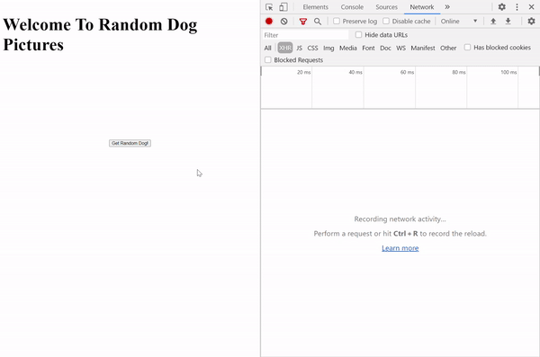

Note:
1. Start learning course on 2020/07/23
1. Finished on
1. As I just finished a course about HTML and CSS during June and July 2020, I will start the CSS session later to review the techniques and skills of HTML and CSS.

# Structure
1. [CSS Animation: Transforms and Transitions](#CSS-Animation:-Transforms-and-Transitions)
1. [CSS Animation: Keyframes](#CSS-Animation:-Keyframes)
1. [Advanced CSS: Layout with Flexbox](#Advanced-CSS:-Layout-with-Flexbox)
1. [Project: Building A Startup Site](#Project:-Building-A-Startup-Site)
1. [Async Foundations](#Async-Foundations)
1. [AJAX Part 1: XHR and Fetch](#AJAX-Part-1:-XHR-and-Fetch)
1. [AJAX Part 2: jQuery and Axios](#AJAX-Part-2:-jQuery-and-Axios)
1. [Testing with Jasmine](#Testing-with-Jasmine)
1. [Advanced Array Methods](#Advanced-Array-Methods)
1. [Closures and the Keyword 'this'](#Closures-and-the-Keyword-'this')
1. [Object Oriented Programming with JavaScript](#Object-Oriented-Programming-with-JavaScript)
1. [Creating JSON API's with Node and Mongo](#Creating-JSON-API's-with-Node-and-Mongo)
1. [Codealong: Single Page Todo List with Express, Mongo, and jQuery](#Codealong:-Single-Page-Todo-List-with-Express,-Mongo,-and-jQuery)
1. [ES2015 Part 1](#ES2015-Part-1)
1. [ES2015 Project - Guess the Password](#ES2015-Project-\--Guess-the-Password)
1. [ES2015 Part 2](#ES2015-Part-2)
1. [ES2016 and ES2017](#ES2016-and-ES2017)
1. [D3 and the DOM](#D3-and-the-DOM)
1. [Data Joins and Update Patterns in D3](#Data-Joins-and-Update-Patterns-in-D3)
1. [SVG and D3](#SVG-and-D3)
1. [D3 Odds and Ends, and Advanced Graph Types](#D3-Odds-and-Ends,-and-Advanced-Graph-Types)
1. [Project: Building a Data Dashboard with D3](#Project:-Building-a-Data-Dashboard-with-D3)
1. [Introduction to React and JSX](#Introduction-to-React-and-JSX)
1. [Create React App and Props](#Create-React-App-and-Props)
1. [State](#State)
1. [The Virtual DOM, Events, and Forms](#The-Virtual-DOM,-Events,-and-Forms)
1. [Component Lifecycle Methods](#Component-Lifecycle-Methods)
1. [Building A Full-stack App with React](#Building-A-Full\-stack-App-with-React)
1. [React Router](#React-Router)
1. [Redux Introduction](#Redux-Introduction)
1. [In Depth Redux Code Walkthrough](#In-Depth-Redux-Code-Walkthrough)
1. [Warbler Introduction and Backend Part 1](#Warbler-Introduction-and-Backend-Part-1)
1. [Warbler Backend Part 2](#Warbler-Backend-Part-2)
1. [Warbler Frontend Part 1](#Warbler-Frontend-Part-1)
1. [Warbler Frontend Part 2](#Warbler-Frontend-Part-2)

# Async Foundations

### Callback Functions

1. Objectives
   1. Define callback functions
   1. Define higher order functios
   1. Use a callback function to make the code more general
   1. Create callbacks using anonymous functions
1. A "**callback function**" is a function that is passed into another function as a parameter then invoked by that other function.
1. A "**higher order function**" is a function that accept a callback as a parameter. 
   ```js
   function callback() {
     console.log("Coming from callback");
   }

   function higherOrder(fn) {
     console.log("About to call callback");
     fn();
     console.log("Callback has been invoked");
   }

   higherOrder(callback);
   ```
1. What are callbacks used for? 
    1. Advanced Array methods
    1. Browser events 
    1. AJAX Requests
    1. React Development 

### Codealong: forEach
1. Objectives 
    1. Describe and use the forEach function
    1. Implement the forEach function
1. `.forEach` method is define as an `Array` method (function on `Array` object) as the followings.
    ```js 
    function forEach(array, callback) {
        //To be implemented
    }

    function callback(curElement, currentIndex, array) {
        // Implemented by the caller of forEach 
    }
    ```
1. Define our own `forEach()` function 
    ```js 
    function forEach(array, callback) {
        for (let i = 0; i < array.length; i++) {
            callback(array[i], i, array);
        }
    }
    ```

### findIndex 
1. Objectives
    1. Describe and use the `.findIndex()` method
    1. Implement `.findIndex()` in practice
1. `.findIndex()` returns the index of the first element in the `Array` for which the callback returns a truthy value. `-1` is returned if the callback never returns a truthy value. `.find()`, `.findIndex()`, and `.filter()` use similar syntax to find either an element that fits the filter or the position of which in an `Array`. 
    ```js 
    function findIndex(array, callback) {
        // finIndex code to be implemented 
    }

    function callback(curElement, curIndex, array) {
        // callback implemented by caller of function
    }
    ```
1. A common mistake developers made in the callback function is forget to `return` the result from the callback function. We try to create the `.findIndex()` method as a function by our own. 
    ```js 
    function findIndex(arr, callback) {
        for (let i = 0; i < arr.length; i++) {
            if(callback(arr[i], i, arr)){
                return i;
            }
        }
        return -1; 
    }
    ```

### The Stack and The Heap
1. Objectives
    1. Describe what a "stack" is 
    1. Describe stack frame
    1. Describe the Heap 
1. "**stack**" is an ordered data structure, keeps track of function invocations, is part of the JavaScript runtime (which we don't access directly). 
    1. Whenever a function is invoked, the details of the invocation (execution context) are saved on the top of the stack (pushed to the top).
    1. Whenever a function returns, the information about the invocation is taken off the top of the stack (popped off of the top).
    1. In summary, stack is an ordered set of stack frames. Most recently invoked function is on the top of the stack. The bottom of the stack is the first function invoekd. The stack is processed from the top to bottom. 
1. "**Heap**" is an area in memory where the data is stored. 

### setTimeout and setInterval
1. Objectives - Use `setTimeout()` and `setInterval()
1. `setTimeout()` is a function that asynchronously invokes a callback after a delay of milliseconds.
    ```js
    let timerId = setTimeout(function () {
        console.log('This function runs in 30 seconds');
    }, 3000);

    setTimeout(() => {
        console.log('Canceling the first setTimeout', timerId);
        clearTimeout(timerId);
    })
    ```
1. `setInterval()` is a function that continually invokes a callback after every x milliseconds, where x is provided to `setInterval()`
    ```js 
    let num = 0;
    let intervalId = setInterval(function () {
        num++;
        console.log(num);
        if (num === 20) {
            clearInterval(intervalId);
        }
    }, 200);
    ```

### The Event Loop and the Queue
1. Objectives 
    1. Define event loop and the queue
    1. Describe how the event loop and the queue work with the stack 
    1. Define JavaScript as a single threaded langugage
1. **Queue** is an ordered list of functions waiting to be placed on the stack. Functions in the queue are processed on a first in, first out basis (FIFO).
1. **Event Loop** is a functionality in JavaScript runtime that checks the queue when the stack is empty. If the stack is empty, the front of the queue is placed in the stack. 
1. JavaScript is single threaded, which means that code execution is linear. Code that is running cannot be interrupted by something else going on in the program. 

### Promise Basics
1. Objectives 
    1. Define a promise 
    1. Add a `.then()` callback to a promise 
    1. Add a `.catch()` callback to a promise 
    1. Wrap a setTimeout call in a promise 
1. **Promise** is an `Object` that represents a task that will be completed in the future. 
    ```js 
    let p1 = new Promise((resolve, reject) => {
        setTimeout(() => {
            let randomInt = Math.floor(Math.random() * 10);
            resolve(randomInt);
        }, 4000)
    });

    p1.then(result => {
        console.log('Success', result);
    }).catch(error => {
        console.log('Error', error);
    })
    ```

### Promise Chaining
1. Objectives 
    1. Describe the disadvantages of using nested callbacks
    1. Return a promise from a `.then()` callback function
    1. Use a promise to make asynchronous code seem sequential 
1. Nest Async Callbacks. For example, we'd like to print number from 1 to 3 in an ascending order. 
1. Disadvantages of nested callbacks
    1. The code is hard to read
    1. Logic is difficult to reason about
    1. The code is not modular
    ```js 
    let counter = 0;
    setTimeout(() => {
        counter++;
        console.log('Counter: ', counter); // 1 
        setTimeout(() => {
            counter++;
            console.log('Counter: ', counter); // 2 
            setTimeout(() => {
                counter++;
                console.log('Counter: ', counter); // 3
            }, 3000);
        }, 2000);
    }, 1000)
    ```
1. We can use **Promise Chaining** to rewrite the callback chain above.
    ```js 
    let counter = 0;
    function incCounter() {
        counter++;
        console.log('Counter: ', counter);
    }

    function runLater(callback, timeInMs) {
        let p = new Promise(function (resolve, reject) {
            setTimeout(function () {
                let res = callback();
                resolve(res);
            }, timeInMs);
        });
        return p;
    }

    runLater(incCounter, 1000).then(function () {
        return runLater(incCounter, 2000);
    }).then(function () {
        return runLater(incCounter, 3000);
    }).then(function () {

    })
    ```
1. In practice, though it's useful to understand how promises work (resolve, reject), we will often use promises returned to us as values, such as retrievling data from database API. 


# AJAX Part 1: XHR and Fetch
### Intro to AJAX
1. AJAX stands for `Asynchronous` `JavaScript` and `XML`. 
1. AJAX is not a library, not a framework, and not a technology. 
1. AJAX is an approach and concept. Back in 2005, people use the followings to build websites. From the developers at the time, they noticed that all these pieces are here for us to make web apps that can update without refreshing. 
    1. HTML
    1. CSS
    1. JavaScript
    1. The DOM
    1. XMLHTTP Requests
1. With AJAX, websites can send and request data from a server in the background without disturbing the current page. This concept of website building introduces mordern single page apps. 
1. We can use the following tools (and more) to make requests with JavaScript 
    1. XMLHTTP request
    1. The `fetch` API
    1. 3rd Praty Libraries: jQuery, Axios, etc. 

### What's the deal with JSON and XML
1. Both JSON and XML are data formats.
1. API's don't respond with HTML but pure data, not structure. The efficient data type are formats like JSON and XML. 
1. `XML` stands for "Extended Markup Language" and is syntacticly similar to HTML, but it doesn't not describe presentation like HTML does. 
1. `JSON` stands for "JavaScript Object Notation" and looks exactly like JavaScript objects. 

### Making the First Request with XMLHTTPRequest
1. We can create a `XMLHttpRequest()` connection, use `.open()` method which takes a type of `HTTP request` and the `endpoint` of the API, and use `.send()` method to make the request. We then can check on `.readuState` of the connection condition. 
1. According to [MDN](https://developer.mozilla.org/en-US/docs/Web/API/XMLHttpRequest/readyState), a XML HTTP request has different states from 0 to 4. We can use `.onreadystatechange` and assign a function to check the condition of the state. If the request has `.readyState` at 4 and `.status` at `200`, it means the connection is good the API endpoint has returned the data. 
1. Library such as `jQuery` and `axios` are built based on these methods. 
1. Note that the request is only available to enpoint that allows the connection or if the request send the API key as well. 
    ```js
    let XHR = new XMLHttpRequest();

    // XHR.readyState can be 0 to 4
    XHR.onreadystatechange = function () {
        if (XHR.readyState == 4) {
            if (XHR.status == 200) {
                // print out the data if it gets 
                console.log(XHR.responseText);
            } else {
                // error handler
                console.log('There was a problem!');
            }
        }
    };
    // An API endpoint on Github that returns zen quote 
    XHR.open("GET", 'https://api.github.com/zen');
    XHR.send();
    ```

### AJAX workflow: Building the Random Image App
1. We can check on some websites such as Pininterst or Facebook main page. Every time we (as the user) scroll the page down to the button, the progarm will make further request to its server and render contents and makes the page never ends. 
1. We can check the async function working in the developer console with the `Network` tab. Every time we scroll to let the page render new contents, a `XHR` is made for the task. 
    
1. We firstly create a very simple webpage for the infrastructure to enable the JS to work and interact with DOM. 
    ```html 
    <!DOCTYPE html>
    <html lang="en">

    <head>
        <title>Test</title>
        <meta charset="UTF-8">
        <meta name="viewport" content="width=device-width, initial-scale=1">
        <link href="#" rel="stylesheet">
        <style>
            img {
                height: 200px;
            }

            .container {
                display: flex;
                flex-direction: column;
                align-items: center;
            }

            button {
                margin: 20px;
            }
        </style>
    </head>

    <body>
        <div class="container">
            <h1>Welcome To Random Dog Pictures</h1>
            
            <button id="btn">Get Random Dog!</button>
        </div>
        <script src="test.js"></script>
    </body>
    </html>
    ```
1. We use [`dog ceo`](https://dog.ceo/api/breeds/image/random) API endpoint to get an image URL to show on the HTML file. `https://dog.ceo/api/breeds/image/random`.
1. As the endpoint respond a JSON file, we need to use `JSON.parse()` to parse the string and turn it into a regular JavaScript object. We then can use DOM to modify the `src` attribute of an `` tag. 
    ```js 
    let btn = document.querySelector('#btn');
    let img = document.querySelector('#photo');

    //listen for clicks
    btn.addEventListener('click', function () {
        //make the request 
        let XHR = new XMLHttpRequest();

        XHR.onreadystatechange = function () {
            if (XHR.readyState == 4 && XHR.status == 200) {
                let url = JSON.parse(XHR.responseText).message;
                img.src = url;
            }
        }

        XHR.open('GET', 'https://dog.ceo/api/breeds/image/random');
        XHR.send();
    });
    ```
    

### Bitcoin Price Exercise
1. We call an API to get the latest price info. from [coindesk](https://www.coindesk.com/). Its API endpoint is `https://api.coindesk.com/v1/bpi/currentprice.json`. After getting the data, we parse it and use DOM to put the data on the webpage when the user click the button to refresh. 
    ```js
    let btn = document.querySelector('#btn');
    let priceDis = document.querySelector('#price');
    const currency = 'USD';

    //listen for clicks
    btn.addEventListener('click', function () {
        //make the request 
        let XHR = new XMLHttpRequest();

        XHR.onreadystatechange = function () {
            if (XHR.readyState == 4 && XHR.status == 200) {
                let data = JSON.parse(XHR.responseText);
                let price = data.bpi[currency].rate;
                priceDis.textContent = price;
            } else {
                alert("Something went wrong")
            }
        }

        const url = 'https://api.coindesk.com/v1/bpi/currentprice.json';
        XHR.open('GET', url);
        XHR.send();
    })
    ```
### Fetch Introduction 
1. Problems with XHR 
    1. Ugly, Bulky syntax 
    1. It's 16 years old and designed for different design concept and environment
    1. No Streaming 
1. `fetch()` API is a newer function to work on the same job. These 2 functions work in a different way that `fetch()` can work through streaming and check the data and stop the process if the purpose is done along the way, while `XHR` must retrieve all the data before it starts to work. The concept is similar to streaming on video media platform such as YouTube that users can start to watch the video before the whole video file is downloaded locally. Besids, assuming that we have huge data center or a "fetch" of data can be billions of items, while we only need a single one from the dataset. It's really unnecessary and inefficient to download the whole set and start to parse it. 
1. `fetch()` API returns a `promoise` that we can work only that much easier than using `XHR`, as `promise` can take `.then()` and `.catch()` method to handle the returned data and error handling. After getting the response from the API, we can use `.json()` method to work on the response and turn it into the JSON file that we can work on. 
    ```js
    const url = 'https://api.coindesk.com/v1/bpi/currentprice.json';

    fetch(url).then(function (data) {
        console.log(data);
        console.log('status code was: ' + data.status);
        return data.json();
    }).then(data => {
        console.log(data);
        console.log(data.bpi.USD.rate);
    });
    ```

### Fetch options
1. `fetch()` API function can not only take an URL as argument but an `option Object` as configurations. The default HTTP method is `"GET"`, while we can change it to `"POST"`. We can use this function to send JSON file to the API endpoint. In the following example, we try to send a JSON that has a `name` and `login` property to the API endpoint. We can check this on the `network` tab in developer console of a browser such as `Chrome`. 
1. We can check the documentation of `fetch()` API options [here](https://developer.mozilla.org/en-US/docs/Web/API/WindowOrWorkerGlobalScope/fetch) 
    ```js 
    fetch(url, {
        method: "POST", 
        body: JSON.stringify({
            name: 'blue',
            login: 'bluecat',
        })
    })
    .then(data => {
        // do something
    })
    .catch(error => {
        // handle error
    })

### Fetch error handling
1. `.catch()` only handles `request` and other problems such as internet or connection issues. However, if the API endpoint returns a valid data (though an error message), the promise will still work on the `resolve` callback function. Therefore, we can put an error handling in `.then()` method for the returned content itself.
1. We can separate the error handling function to make the code succinct. 
    ```js     
    fetch(url)
    .then(handleErrors)
    .then(request => {
        console.log('Everything is Fine!');
        console.log(request);
    })
    .catch(error => {
        console.log('There is a problem!', error);
    })

    function handleErrors (request) {
        if(!request.ok) {
            throw Error(request.status);
        }
        return request;
    }
    ```
### Fetch Random User Profile
1. The API endpoint is `https://randomuser.me/api/`
1. HTML
    ```html
    <h1 class="title"> Random User Generator</h1>
    <div class="user-profile">
        
        <div id="fullname">Jon Snow</div>
        <div id="username">
            kingofnorth
        </div>
        <div class="description">
            <div>Email: <span id="email">jon@hotmail.com</span></div>
            <div>City: <span id="city">Winterfell</span></div>
        </div>
        <div class="footer">
            <button id="btn">Next User!</button>
        </div>
    </div>
    ```
1. CSS
    ```css
    /* CSS design originally by @jofpin, tweaked by Colt Steele */
    @import url(https://fonts.googleapis.com/css?family=Raleway|Varela+Round|Coda);

    body {
        background: #ecf0f1;
        padding: 2.23em;
    }

    .title {
        color: #2c3e50;
        font-family: "Coda", sans-serif;
        text-align: center;
    }

    .user-profile {
        margin: auto;
        width: 27em;
        height: 11em;
        background: #fff;
        border-radius: .3em;
    }

    .user-profile #fullname {
        margin: auto;
        margin-top: -4.40em;
        margin-left: 5.80em;
        color: #16a085;
        font-size: 1.53em;
        font-family: "Coda", sans-serif;
        font-weight: bold;
    }

    #username {
        margin: auto;
        display: inline-block;
        margin-left: 10.43em;
        color: #3498db;
        font-size: .87em;
        font-family: "varela round", sans-serif;
    }

    .user-profile>.description {
        margin: auto;
        margin-top: 1.35em;
        margin-right: 3em;
        width: 18em;
        color: #7f8c8d;
        font-size: .87em;
        font-family: "varela round", sans-serif;
    }

    .user-profile>img#avatar {
        padding: .7em;
        margin-left: .3em;
        margin-top: .3em;
        height: 6.23em;
        width: 6.23em;
        border-radius: 18em;
    }


    .footer {
        margin: 2em auto;
        height: 3.70em;
        background: #16a085;
        text-align: center;
        border-radius: 0 0 .3em .3em;
        display: flex;
        justify-content: center;
        align-items: center;
        transition: background 0.1s;
    }

    button {
        color: white;
        font-family: "Coda", sans-serif;
        text-align: center;
        font-size: 20px;
        background: none;
        outline: none;
        border: 0;
        width: 100%;
        height: 100%;
    }

    button:hover {
        cursor: pointer;
    }

    .footer:hover {
        background: #1abc9c;
    }
    ```
1. JavaScript
    ```js
    const btn = document.querySelector('#btn');
    const url = 'https://randomuser.me/api/';

    const selectors = {
        fullname: '#fullname',
        username: '#username',
        email: '#email',
        city: '#city',
        img: '#avatar',
    }

    btn.addEventListener('click', () => {
        fetch(url)
            .then(errorHandler)
            .then(data => {
                const result = data.results[0];
                const firstName = result.name.first;
                const lastName = result.name.last;
                const username = result.login.username
                const email = result.email;
                const city = result.location.city;
                const img = result.picture.medium;
                console.log(result)
                // fullname
                document.querySelector(selectors.fullname).textContent = `${firstName} ${lastName}`;
                // username
                document.querySelector(selectors.username).textContent = `${username}`;
                // email
                document.querySelector(selectors.email).textContent = `${email}`;
                // city
                document.querySelector(selectors.city).textContent = `${city}`;
                // image
                document.querySelector(selectors.img).src = `${img}`;

            })
            .catch(error => {
                console.log(error);
            })
    });

    function errorHandler(request) {
        if (!request.status) {
            throw Error('Something went wrong');
        }
        return request.json();
    }
    ```
### Problems with Fetch API
1. Internet Explorer doesn't support `fecth()` function. 

# AJAX Part 2: jQuery and Axios
### Introduction to jQuery
1. jQuery is a JavaScript client library that allows developers to use certain functions in less code. 
    1. Without jQuery
    ```js 
    // without jQuery
    var request = new XMLHttpRequest();
    request.open('GET', '/my/url');

    request.onload = function() {
        if (request.status >= 200 && request.status < 400) {
            // Success!
            var data = JSON.parse(request.responseText);
        } else {
            // do something
        }
    };

    request.onerror = function() {
        // There was a connection error
    };

    request.send();
    ```
    1. With jQuery
    ```js
    // with jQuery 
    $.getJSON('/my/url', function (data) {
        // do seomthing 
    });
    ```
1. In this section, we will practice on `$.ajax`, `$.get`, `$.post`, and `$.getJSON`.

### jQuery $.ajax method 
1. `$.ajax()` works similar to a `promise`, while it takes an `Object` includes `method` and `url` property. The "base" jQuery method just creates an XMLHttpRequest under the hood. Besides, jQuery has smart guessing that it will detect the returned data from a HTTP request and "guess" how to parse it. We can check the [dataType](https://api.jquery.com/jQuery.ajax/) part on jQuery documenation. 
1. Besides, we can check in the develper console in the "**Network**" tab to check which kind of request is made by the function. 
    ```js 
    $.ajax({
        method: "GET", 
        url: "some.api.com", 
        dataType: 'json', // how to parse the data 
    })
    .done(function(res) {
        console.log(res); // this 'res' has been "parsed" with JSON.parse() that we can manipulate it directly
    })
    .fail(function(){
        // do something
    })
    ```
### jQuery AJAX shorthand methods 
1. All of the following methods are the shorthands for different HTTP requests. Each of them can be replaced with `$.ajax()` by passing certain HTTP methods, while we can simply pass only url as `Strings` to them and to use `.done()` and `.fail()` directly. 
1. `$.get()` is a shorthand to make a GET HTTP request. 
    ```js 
    $.get('url');

    $.ajax({
        method: "GET", 
        url: ""
    })
    ```
1. `$.post()` is a shorthand to make a POST HTTP request, while this method takes a 2nd argument which is the data to send to the API endpoint. 
    ```js 
    var data = {
        name: 'Allen', 
        city: 'Bangkok',
    }
    $.post('url', data)
    .done(function(){})
    .fail(function(){})
    ```
1. `$.getJSON()` is simialr to `$.get()` that works on a GET HTTP request and converts the returned data from JSON string to JavaScript object which we can use directly. 
    ```js 
    $.getJSON('url')
    .done(function(data) {
        console.log(data);
    })
    .fail(function(){

    });
    ```

### jQuery random cats API exercise 
1. The given random cat API doesn't work, so we use the previous dog CEO API for the image URL. 
    1. JavaScript 
    ```js 
    const url1 = 'https://aws.random.cat/meow';
    const url2 = 'https://cors-anywhere.herokuapp.com/http://aws.random.cat/meow';
    const url3 = 'https://dog.ceo/api/breeds/image/random';

    $('.btn').click(function () {
        $.get(url3)
            .done(function (res) {
                let url = res.message;
                console.log(url);
                $('.img').css("background-image", `url(${url})`)
            })
            .fail(function (err) {
                console.log('Error', err);
            })
    })
    ```
    1. HTML 
    ```html
    <!DOCTYPE html>
    <html lang="en">

    <head>
        <meta charset="UTF-8">
        <meta name="viewport" content="width=device-width, initial-scale=1.0">
        <title>Random Cat</title>
        <script src="https://code.jquery.com/jquery-3.5.1.min.js"
            integrity="sha256-9/aliU8dGd2tb6OSsuzixeV4y/faTqgFtohetphbbj0=" crossorigin="anonymous"></script>
        <style>
            body {
                padding: 0;
                margin: 0;
                background: #ccc;
                box-sizing: border-box;
            }

            .container {
                width: 300px;
                height: 300px;
                margin: 6rem auto;
                display: flex;
                flex-direction: column;
            }

            .img {
                width: 100%;
                height: 100%;
                padding: 0.2rem;
                background: url() center center/cover;
            }

            .btn {
                width: 50%;
                background: steelblue;
                color: #fff;
                padding: 1rem;
                font-size: 1.2rem;
                margin: 1rem auto;
                border: none;
                text-decoration: none;
                border-radius: 5px;
            }

            .btn:hover {
                cursor: pointer;
                background: rgb(54, 115, 165);
            }
        </style>
    </head>

    <body>
        <div class="container">
            <div class="img"></div>
            <button class="btn">Random Dog</button>
        </div>
        <script src="randomCat.js"></script>
    </body>

    </html>
    ```

### axios intro 
1. `axios` is a lightweight HTTP request library. According to [axios](https://github.com/axios/axios) Github, it has the following features 
    1. Make XMLHttpRequests from the browser
    1. Make http requests from node.js
    1. Supports the Promise API
    1. Intercept request and response
    1. Transform request and response data
    1. Cancel requests
    1. Automatic transforms for JSON data
    1. Client side support for protecting against XSRF
1. In this part, we use client side `axios` that we can import the code with CDN as jQuery. `axios` works similar to `fetch()` API function and `promise` objects, while we don't need to use `.json()` the convert the data and we can use `.then()` and `.catch()` methods directly. 
    ```js 
    let url = 'https://opentdb.com/api.php?amount=1';
    axios.get(url)
    .then(function (res) {
        console.log(res.data.results[0].question);
    })
    .catch(function (err) {
        console.log(err);
    });
    ```

### Axios Error Handling 
1. In this case, we try create and append new data on the page. Besides, we use error handler to catch the problems if it is from `request`, `respond`, or something else .
    ```js 
    let btn = document.querySelector('button');
    let section = document.querySelector('#comments');

    btn.addEventListener('click', sendRequest);

    function sendRequest() {
        axios.get('https://jsonplaceholder.typicode.com/comments', {
            params: {
                postId: 1,
            }
        })
            .then(addComments)
            .catch(handleErrors)
    }

    function addComments(res) {
        res.data.forEach(comment => {
            appendComment(comment);
        });
    }

    function appendComment(comment) {
        let newP = document.createElement('p');
        newP.innerText = comment.email;
        section.appendChild(newP);
    }

    function handleErrors(err) {
        if (err.response) {
            console.log('Problems With Response ', err.response.status);
        } else if (err.request) {
            console.log('Problem With Request!');
        } else {
            console.log('Error', err.message);
        }
    }
    ```

### Ron Swanson Exercise 
1. The exercise is try to use `XHR`, `fetch()`, `jQuery`, and `axios` to call an API and get a JSON as request and change the content on the webpage. All the 4 methods give the same result but use different syntax and code to achieve the goal. 
    1. JavaScript 
    ```js 
    const p = document.querySelector('#quote');
    const url = `http://ron-swanson-quotes.herokuapp.com/v2/quotes`;
    document.querySelector('#xhr').addEventListener('click', XHR);
    document.querySelector('#fetch').addEventListener('click', fetchData);
    $('#jquery').on('click', jqueryData);
    document.querySelector('#axios').addEventListener('click', axiosData);

    function XHR() {
        let XHR = new XMLHttpRequest();
        XHR.onreadystatechange = function () {
            if (XHR.readyState == 4) {
                if (XHR.status == 200) {
                    const quote = JSON.parse(XHR.responseText)[0];
                    p.innerText = quote;
                } else {
                    console.log('There was a problem!');
                }
            }
        };
        XHR.open("GET", url);
        XHR.send();
    }

    function fetchData() {
        fetch(url)
            .then(res => res.json())
            .then(data => {
                p.innerText = data[0];
            })
            .catch(err => {
                console.log('Error', err);
            })
    }

    function jqueryData() {
        $.getJSON(url)
            .done(data => {
                p.innerText = data[0];
            })
            .fail(err => {
                console.log(err)
            });
    }

    function axiosData() {
        axios.get(url)
            .then(res => {
                p.innerText = res.data[0];
            })
            .catch(err => {
                console.log('Error', err);
            })
    }
    ```
    1. HTML 
    ```html
    <!DOCTYPE html>
    <html lang="en">

    <head>
        <meta charset="UTF-8">
        <meta name="viewport" content="width=device-width, initial-scale=1.0">
        <script src="https://cdnjs.cloudflare.com/ajax/libs/axios/0.19.2/axios.min.js"></script>
        <script src="https://code.jquery.com/jquery-3.5.1.min.js"
            integrity="sha256-9/aliU8dGd2tb6OSsuzixeV4y/faTqgFtohetphbbj0=" crossorigin="anonymous"></script>
        <title>Axios practice</title>
        <style>
            @import url('https://fonts.googleapis.com/css?family=Roboto');

            body {
                font-family: 'Roboto';
                color: #2c3e50;
                text-align: center;
            }

            #quote {
                font-size: 20px;
            }

            .container {
                display: flex;
                justify-content: space-around;
                flex-wrap: wrap;
            }


            button {
                margin-top: 20px;
                background: red;
                border: none;
                outline: none;
                height: 40px;
                text-align: center;
                width: 130px;
                border-radius: 40px;
                background: #fff;
                border: 2px solid #1abc9c;
                color: #1abc9c;
                letter-spacing: 1px;
                text-shadow: 0;
                font-size: 12px;
                font-weight: bold;
                cursor: pointer;
                -webkit-transition: all 0.25s ease;
                transition: all 0.25s ease;
                font-family: 'Roboto', sans-serif;


            }

            button:hover {
                color: white;
                background: #1abc9c;
            }
        </style>
    </head>

    <body>
        <h1>Ron Swanson Quote Generator</h1>
        <p>(4 ways of writing AJAX requests)</p>
        <section class="container">
            <button id="xhr">XHR</button>
            <button id="fetch">Fetch</button>
            <button id="jquery">jQuery</button>
            <button id="axios">Axios</button>
        </section>
        <p id="quote">Quote Goes Here...</p>
        <script src="test.js"></script>
    </body>

    </html>
    ```

# Testing with Jasmine
### Writing Test in the Browser
1. Objectives 
    1. Understand what Jasmine and unit testing are
    1. Define describe, it, matchers, and spies
    1. Write better tests with before and after hooks
    1. Write asynchronous tests with clocks and done callbacks 
    1. Compare and contrast TDD and BDD and differentiate between unit and other kinds of tests
    1. Write unit tests using Jasmine
1. We can use unit tests, test parts of an application, (or units). Very commonly, each unit is tested individually and independently to ensure an application is running as expected. Therefore, we need 
    1. A framework to write tests
    1. A way of describing the code we are testing 
    1. A tool where we can make assertions or expectations about our code 
1. Jasime library
    1. Comes with everything we need to test our code 
    1. Works well all kinds of JavaScript environments
    1. Simple syntax to quickly get up and running with 
1. In this case, we will use browser as the environment to work on. 
    1. Create an HTML file 
    1. Link CSS and JavaScript tags 
    1. Start writing tests

### Jasmine Syntax and Matchers
1. Essential Keywords
    1. **describe** - let me describe __ to your
    1. **it** - let me tell you about __ 
        1. **expect** lives in `it` function
1. A ceonceptual exercise 
    1. `discribe("Earth")`
    1. `it("is round")`
        1. `expect(earth.isRound.toBe(true))`
    1. `it("is the third planet from the sun")`
        1. `expect(earth.numberFromSun).toBe(3)`
1. In Code, `describe`, `it`, and `expect` are given to us by `Jasmine`.
    ```js 
    var earth = {
        isRound: true,
        numberFromSun: 3
    }

    describe("Earth", function(){
        it("is round", function(){
            expect(earth.isRound).toBe(true)
        });
        it("is the thrid planet from the sun", function(){
            expect(earth.numberFromSun.toBe(3))
        });
    });
    ```
1. There are several `Matchers` we can use in `Jasmine`
    1. `toBe`/`not.toBe`
    1. `toBeCloseTo`
    1. `toBeDefined`
    1. `toBeFalsey`/`toBeTruthy`
    1. `toBeGreaterThan`/`toBeLessThan`
    1. `toContain`
    1. `toEqual` can compare 2 individual objects with their properties though they have different reference in the memory. This is a handy method to compare 2 `Arrays` or `Objects`. 

# Advanced Array Methods
# Closures and the Keyword 'this'
# Object Oriented Programming with JavaScript
# Creating JSON API's with Node and Mongo
# Codealong: Single Page Todo List with Express, Mongo, and jQuery
# ES2015 Part 1
# ES2015 Project - Guess the Password
# ES2015 Part 2
# ES2016 and ES2017
# D3 and the DOM
# Data Joins and Update Patterns in D3
# SVG and D3
# D3 Odds and Ends, and Advanced Graph Types
# Project: Building a Data Dashboard with D3
# Introduction to React and JSX
# Create React App and Props
# State
# The Virtual DOM, Events, and Forms
# Component Lifecycle Methods
# Building A Full-stack App with React
# React Router
# Redux Introduction
# In Depth Redux Code Walkthrough
# Warbler Introduction and Backend Part 1
# Warbler Backend Part 2
# Warbler Frontend Part 1
# Warbler Frontend Part 2