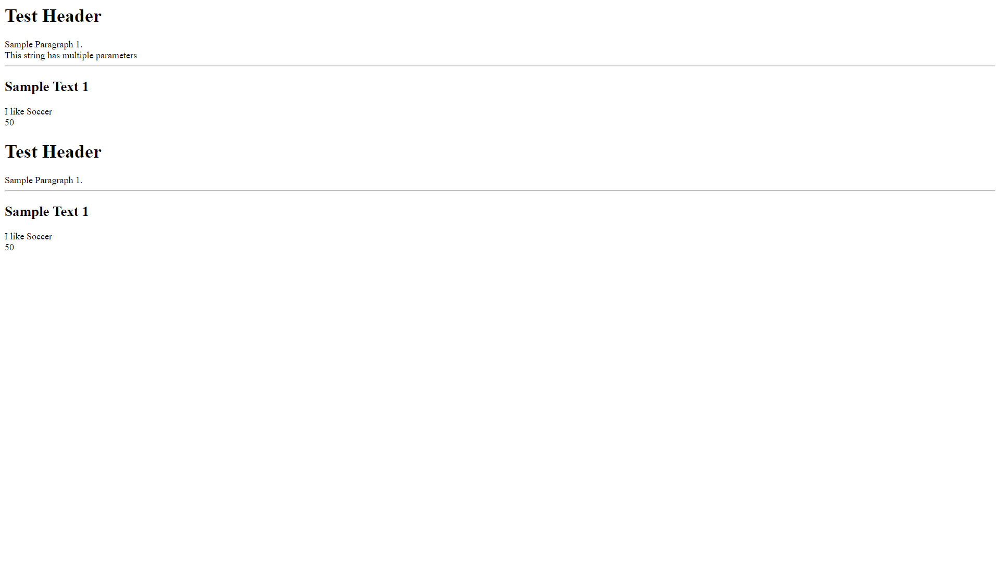

Start: 2020/08/20
End: 

Note: I started this course is mainly for learning PHP with related stacks of technology during the time. I will learn the other sections if required. 


1. [How the Internet Works](#How-the-Internet-Works)
1. [The Web Development Process](#The-Web-Development-Process)
1. [Planning a Website](#Planning-a-Website)
1. [Web Hosting and System Requirements](#Web-Hosting-and-System-Requirements)
1. [Domain Names](#Domain-Names)
1. [Testing Environment](#Testing-Environment)
1. [Production Environment](#Production-Environment)
1. [FTP Setup](#FTP-Setup)
1. [HTML Development](#HTML-Development)
1. [CSS Development](#css-development)
1. [Document Object Model (DOM)](#Document-Object-Model-(DOM))
1. [JavaScript Development](#JavaScript-Development)
1. [jQuery Library](#jQuery-Library)
1. [Bootstrap Framework](#Bootstrap-Framework)
1. [PHP Development](#PHP-Development)
1. [MySQL Database Integration](#MySQL-Database-Integration)
1. [XML | AJAX](#XML-|-AJAX)
1. [Development Project](#Development-Project)
1. [Google Apps for Works](#Google-Apps-for-Works)
1. [Bonues: SSL Certificates - How to Secure your Server](#Bonues:-SSL-Certificates---How-to-Secure-your-Server)

# How the Internet Works
# The Web Development Process
# Planning a Website
# Web Hosting and System Requirements
# Domain Names

# Testing Environment
### Introduction to Testing Servers
1. A testing server allows us to test web application locally rather than uploading to live production server.
1. The testing server is important because any issue can be resolved without causing disruptions on the live server. 
1. PHP and MySQL require a testing server to function
1. Client side languages do not require a testing server (HTML, CSS, jQuery, JavaScript)
1. Pre-Packaged Solutions: WAMP (Windows) MAMP (MAC). 

### Installing WampServer - WAMP

# Production Environment
# FTP Setup
# HTML Development
# CSS Development
# Document Object Model (DOM)
# JavaScript Development
# jQuery Library
# Bootstrap Framework

# PHP Development
### PHP Syntax
1. A PHP statement must end with semi-column `;`.
1. PHP comments can be stated with `//` and `#` for single line comment and `/**/` for multi-line comments. 
1. PHP is not case sensitive with reserved keywords. However, declared variable names are case sensitive.

### PHP Variables 
1. A variable is like a container used to store information. 
1. Variable Name Rules in PHP
    1. Must be declared with a dollar sign `$`.
    1. Must start with a letter or underscore character `_`. 
    1. Cannot start with a number 
    1. Can only contain alpha-numeric characters and underscores (A-z, 0-9, and _).
    1. Variable names are case-sensitive ($var1 and $VAR1 are 2 different variables).
1. Note that PHP variables only need dollar sign to declare without using other keywords, such as `var`, `let`, and `const` in JavaScript. 

### PHP Variable Scope 
1. A Global scope variable is a variable declared outside a function. The variable can only be access outside of a function. This is very different from the execution context in JavaScript.
1. A Local scope variable is a variable declared inside a function.

### PHP Global Keyword 
1. We can use keyword `global` to access global variables out of a function. 
    ```php
    $x = 30; 
    $y = 20;

    function test1(){
        global $x, $y;
        $y = $x + $y; 
    }

    test1(); 
    echo $y; // 50
    ```
1. PHP stores global variables in an array called `$GLOBALS`. We can use index to access the variable at each position. 
    ```php
    $x = 30; 
    $y = 20;

    function test1(){
        $GLOBALS['y'] = $GLOBALS['x'] + $GLOBALS['y'];
    }

    test1(); 
    echo $y; // 50
    ```

### PHP static keyword
1. Keyword `static` can keep the value of a local variable though the function execution has ended. This is similar to using `closure` in JavaScript to keep the value of a variable in a function. Every time the function is called, the value of the variable will be kept. 
    ```php
    function test1() {
        static $x = 10; 
        echo $x; 
        $x++;
    }

    test1(); // 10
    echo "<br>";
    test1(); // 11
    echo "<br>";
    test1(); // 12
    echo "<br>";
    test1(); // 13
    ```
1. Closure in JavaScript 
    ```js
    function closureValue() {
        let num = 0; 
        return function (){
            return ++num;
        }
    }

    const num = closureValue();
    num(); // 1
    num(); // 2
    num(); // 3
    ```

### PHP echo vs print
1. `echo` allows multiple parameters, while `print` does not. However, multiple parameters in an `echo` statement are rarely used. 
    ```php
    // Basic output using echo 
    echo "<h1>Test Header</h1>";
    echo "Sample Paragraph 1. <br>";

    // echo allows multiple parameters - Print Does not 
    echo "This ", "string ", "has ", "multiple parameters ";
    echo "<hr />";

    //Output variables echo 
    $txt1 = "Sample Text 1";
    $txt2 = "Soccer";
    $x = 20; 
    $y = 30;

    echo "<h2>" . $txt1 . "</h2>";
    echo "I like " . $txt2 . "<br>";
    echo $x + $y;

    // Basic output using print
    print "<h1>Test Header</h1>";
    print "Sample Paragraph 1. <br>";
    print "<hr />";

    print "<h2>" . $txt1 . "</h2>";
    print "I like " . $txt2 . "<br>";
    print $x + $y;
    ```
    

### PHP Data Types
1. In PHP, we can use `var_dump()` to print out the variables with its type of value. If we use only `echo`, besides string and integer, PHP only prints the type of the variable. For example, we can use `var_dump()` to print PHP arrays.
1. `String` - PHP strings can be declared with single `'` or double qoutes `"`.
1. `Integer`
    1. PHP integers must have at least one digit.
    1. Must not have a decimal point. In PHP, integers and floats are 2 different types of value, while both of them are `Numbers` in JavaScript.
    1. Can be either positive or negative.
    1. Can be in three formats.
1. `Float` - A float (floating point number) is a number with a decimal point or a number in exponential form.
1. `Array` - We can use `var_dump()` to print out the values of an array.
1. `NULL` - A `null` means empty value in PHP. 
1. `Boolean` 
    1. A boolean represents 2 possible states, `true` or `false`.
    1. There are some falsy values that represents boolean `false`. 
        1. Integer `0`.
        1. Floats `0.0`.
        1. The empty string `""` and the string `"0"`. Note that only empty string is falsy in JavaScript, while a string `'0'` in JavaScript is truethy. 
        1. An array with zero elements. Note that an empty array is boolean `true` in JavaScript.
        1. `null` variables. 
        1. Any other value would be considered `true`. 
    ```php
    // String
    $x = "Hello world!";
    $y = 'Hello world!';
    echo $x;
    echo "<br>";
    echo $y;
    echo "<hr />";

    // Integer
    $num = 6000;
    var_dump($num);
    echo "<hr />";

    // Float 
    $num2 = 20.565;
    var_dump($num2);
    echo "<hr />";

    // Array
    $sports = array('Soccer', 'Tennis', 'Baseball', 'Football');
    var_dump($sports);
    echo "<hr />";

    // NULL
    $color = 'Blue';
    $color = null; 
    var_dump($color);

    // Boolean
    $x = true; 
    $y = false;
    var_dump($x);
    var_dump($y);
    ```

### PHP Objects 
1. An object stores data and information on how to process the data known as a method, a function of an object. 
1. An object `class` is the set of properties (or variables) that are tied to an `object`.
1. Assignment Types
    1. A `public` assignment means the property can be accessed everywhere. 
    1. A `private` assignment means it can only be accessed by the class that defines it. 
    1. A protected assignment means it can be accessed only within the class itself and by inherited parent classes. 
    ```php
    // Create the class
    class Person {
        // Create properties - (Variables tied to objects)
        public $firstname;
        public $lastname;
        public $age;

        // Assigning values to the property variables 
        public function __construct($firstname, $lastname, $age) {
            $this->firstname = $firstname;
            $this->lastname = $lastname;
            $this->age = $age;
        }

        // Create a method (Function tied to an object)
        public function hello(){
            return "I am " . $this->firstname . " " . $this->lastname . ", my age is: " . $this->age . "";
        }
    }

    // Creating a new person named "John Smith", who is 25 years old 
    $person1 = new Person('John', 'Smith', 25);
    $person2 = new Person('Joe', 'Bob', 35);

    // Print out what the hello method returns 
    echo $person1->hello(); // I am John Smith, my age is: 25
    echo "<br>";
    echo $person2->hello(); // I am Joe Bob, my age is: 35
    ```

### PHP Strings
1. Use `str_word_count()` to count the number of words of a string.
1. Use `strreve()` to reverse the order of a string. Note that there's no built-in function to reverse a string value in JavaScript directly. However, we can turn the string into an array and use `.reverse()` method to reverse the order.
1. Use `strpos()` to find position index of a string. This function is similar to `String.indexOf()` method in JavaScript which returns the position of queried string or `-1` if the string is not found. However, `strpos()` returns nothing if the queried string is not found.
1. Use `str_replace()` to replace a substring of a string value. This function is similar to `String.replace()` in JavaScript that the 1st argument is the value to be replaced and the 2nd is the value to replace. However, `str_replace()` is a function, so it has the 3rd argument, which is the whole value which to be parsed with 1st and 2nd arguments.
    ```php
    //Word count 
    echo str_word_count('Hello world'); // 2
    echo "<hr />";

    //Reverse Words
    echo strrev('Hello world!'); // dlrow olleH
    echo "<hr />";

    //Search for text inside a string
    echo strpos('Hello world!', 'world!'); // 6
    echo "<hr />";
    
    //Replace text inside a string 
    echo str_replace('world', 'John', 'Hello world!'); // Hello John!
    echo "<hr />";
    ```

### PHP Constant
1. PHP constant is an identifier for a given value. A constant cannot be changed during the script, as a variable can. In PHP, a constant variable is `public` by default. 
1. A constant doesn't require a dollar sign `$` as a regular variable and can be declared by `define()` function, which takes 3 arguments. 1st is the name for the variable, 2nd is the value, and 3rd takes a boolean value to indicate that whether this constant is case-sensitive. 
    ```php
    //Case-Sensitive
    define('WELCOME', 'Hello my name is John Smith');
    echo WELCOME;

    echo "<hr />";
    //Case-Insensitive
    define('WELCOME2', 'Hello my name is John Smith', true);
    echo welcome2;

    echo "<hr />";
    // Constants are Global
    define('CAR', 'VOLVO');

    function mycar() {
        echo CAR;
    }
    mycar();
    ```

### PHP Operators
1. PHP operators are used to perform various operations on variables and values. In PHP, operators are divided into several groups. 
    1. Arithmetic operators - Providing mathematical operations.
    1. Assignment operators - Using single equal sign `=` to assign a value to a variable. 
    1. Comparison operators
    1. Increament/Decrement operatros
    1. Logical operators
    1. String operators
    1. Array operators
    ```php
    <h2> PHP Arithmetic Operators </h2>
    <?php
        $x = 50; 
        $y = 20;

        // Addition
        echo $x + $y; // 70
        echo "<hr />";

        // Substraction
        echo $x - $y; // 30
        echo "<hr />";

        // Multiplication 
        echo $x * $y; // 1000
        echo "<hr />";

        // Division
        echo $x / $y; // 2.5
        echo "<hr />";

        // Modulus
        echo $x % $y; // 10
    ?>

    <h2> PHP Assignment Operator </h2>
    <?php 
        // The left operand is assigned the value on the right 
        $x = 20;
        echo $x;
    ?>

    <h2> Comparison Operator </h2>
    <?php
        // Equal
        $x = 300;
        $y = '300';
        var_dump($x == $y); // true

        // Identical
        $x = 300;
        $y = '300';
        var_dump($x === $y); // false

        // Not equal
        $x = 300;
        $y = '300';
        var_dump($x != $y); // false

        // Not equal
        $x = 300;
        $y = '300';
        var_dump($x <> $y); // false

        // Not identical
        $x = 300;
        $y = '300';
        var_dump($x !== $y); // true

        // Greater than 
        $x = 300;
        $y = 500;
        var_dump($x > $y); // false

        // Less than 
        $x = 300;
        $y = 500;
        var_dump($x > $y); // true

        // Greater than or equal to
        $x = 300;
        $y = 500;
        var_dump($x >= $y); // false

        // Less than or equal to
        $x = 300;
        $y = 500;
        var_dump($x <= $y); // true
    ?>

    <h2> Increment/Decrement Operators </h2>
    <?php 
        // Post-increment - Return $x, then increments $x by 1
        $x = 50;
        echo $x++;
        echo "<hr />";

        // Pre-increment - Increments $x by 1, then returns $x
        $x = 50;
        echo $x++;
        echo "<hr />";

        // Pre-decrement - Decrements $x by 1, then returns $x
        $x = 50;
        echo --$x;
        echo "<hr />";

        // Post-decrement - Return $x, then decrements $x by 1
        $x = 50;
        echo $x--;
    ?>

    <h2> Logical Operators </h2>
    <?php 
        // And - True if both $x and $y are true
        $x = 200; 
        $y = 300;
        if ($x == 200 and $y == 300){
            echo "True";
            echo "<hr />";
        }

        // Or - True if either $x or $y is true 
        $x = 200; 
        $y = 300;
        if ($x == 200 or $y == 90) {
            echo "True";
            echo "<hr />";
        }

        // And - && - True if both $x and $y are true 
        $x = 200; 
        $y = 300;
        if ($x == 200 && $y == 300){
            echo "True";
            echo "<hr />";
        }

        // Or - $x || $y - True if either $x or $y is true
        $x = 200; 
        $y = 300;
        if ($x == 200 || $y == 90){
            echo "True";
            echo "<hr />";
        }

        // Not - !$x - True if $x is not true
        $x = 200; 
        if ($x != 100){
            echo "True";
            echo "<hr />";
        }
    ?>

    <h2> PHP String Operators </h2>
    <?php
        // Concatenation - Concatenation of $x and $y
        $x = "Hello";
        $y = " world!";
        echo $x . $y;
        echo "<hr />";

        // Concatenation assignment - Appends $txt2 to $txt1
        $x = 'John';
        $y = 'Smith';
        $x .= $y;
        echo $x;
        echo "<hr />";
    ?>

    <h2> Array Operators </h2>
    <?php 
        // Union - Union of $x and $y
        $x = array('a' => 'blue', 'b'=> 'red');
        $y = array('c' => 'pink', 'd'=> 'brown');

        print_r($x + $y); // union
        echo "<hr />";

        // Equality - Return true if $x and $y have the same key/value pairs
        $x = array('a' => 'blue', 'b' => 'red');
        $y = array('a' => 'pink', 'b' => 'brown');

        var_dump($x == $y); // false
        echo "<hr />";

        // Identity - Return true if $x and $y have the same key/value pairs in the same order and of the same types
        $x = array('a' => 'blue', 'b' => 'red');
        $y = array('a' => 'pink', 'b' => 'brown');

        var_dump($x === $y); // false 
        echo "<hr />";

        // Inequality - Returns true if $x is not equal to $y
        $x = array('a' => 'blue', 'b' => 'red');
        $y = array('a' => 'pink', 'b' => 'brown');

        var_dump($x != $y); // true 
        echo "<hr />";

        // Inequality - Returns true if $x is not equal to $y
        $x = array('a' => 'blue', 'b' => 'red');
        $y = array('a' => 'pink', 'b' => 'brown');

        var_dump($x <> $y); // true 
        echo "<hr />";

        // Non-identity - Return true if $x is not identical to $y 
        $x = array('a' => 'blue', 'b' => 'red');
        $y = array('a' => 'pink', 'b' => 'brown');

        var_dump($x !== $y); // true 
        echo "<hr />";
    ?>
    ```

### Conditional Statements
### PHP ElseIf Statement
1. There are 4 types of conditional statements in PHP
    1. `if`
    1. `if-else`
    1. `if-else-elseif`
    1. `switch` - Compare the value of an expression against a set of predefined conditions, also referred to as cases. 
    ```php
    <?php 
        $x = 49;
        if ($x < 50) {
            echo 'Condition Met'; 
        } else {
            echo 'Condition Not Met';
        }
    ?>

    <?php 
        $x = 90;
        if ($x < 50) {
            echo 'F'; 
        } elseif ($x >= 50 && $x < 60) {
            echo 'D';
        } elseif ($x >= 60 && $x < 70) {
            echo 'C';
        } elseif ($x >= 70 && $x < 80) {
            echo 'B';
        } elseif ($x >= 80 && $x < 90) {
            echo 'A';
        } else {
            echo 'A+';
        }
    ?>

    <?php
        $car = 'volvo';

        switch ($car) {
            case 'volvo':
                echo 'You drive a Volvo!';
                break;
            case 'bmw':
                echo 'You drive a BMW!';
                break;
            case 'honda':
                echo 'YOu drive a Honda!';
                break;
            default: 
                echo "You don't drive";
        }
    ?>
    ```

### PHP While Loops
### PHP For Loops
1. Loops allow us to run the same block of code multiple times. There are 4 types of loops in PHP
    1. `while`
    1. `do...while`
    1. `for`
    1. `forEach`
    ```php
    // While loop 
    $x = 1; 

    while($x < 10) {
        echo "The number is $x <br>";
        $x++;
    }
    echo "<hr />";

    // Do while loop 
    $x = 6; 
    do {
        echo "The number is: $x <br>";
        $x++;
    } while ($x <= 5);

    // For Loop
    for($x = 0; $x <= 10; $x++) {
        echo "$x <br>";
    }

    echo "<hr />";

    // Foreach Loop 
    $cars = array('volvo', 'bmw', 'honda', 'ford');
    foreach($cars as $value) {
        echo "$value <br>";
    }
    ```

### PHP Functions
1. A function is a block of statements that can be called upon whenever they are required. 
1. A function will not execute unless we specifically call the function in our script. 
1. We can set default parameters for PHP function. Note that JavaScript only has this feature available after ES6.
    ```php
    // Basic Function 
    function displaytxt() {
        echo "My First Function";
    }
    displaytxt();

    echo "<hr />";

    // Function Arguments
    function myCar($car, $color){
        echo "$car, $color<br>";
    }

    myCar('Volvo', 'blue');
    myCar('BMW', 'red');
    myCar('Honda', 'green');

    // Default argument value
    function myAge($minage = 30) {
        echo "My age is: $minage <br>";
    }

    myAge();
    myAge(50);
    myAge(60);
    myAge(18);

    echo "<hr />";

    // Returning value
    function add($x, $y) {
        $z = $x + $y;
        return $z;
    }

    echo "1 + 2 = " . add(1,2) . "<br>";
    echo "3 + 4 = " . add(3,4) . "<br>";
    echo "5 + 5 = " . add(5,5) . "<br>";
    ```

# MySQL Database Integration
# XML | AJAX
# Development Project
# Google Apps for Works
# Bonues: SSL Certificates - How to Secure your Server