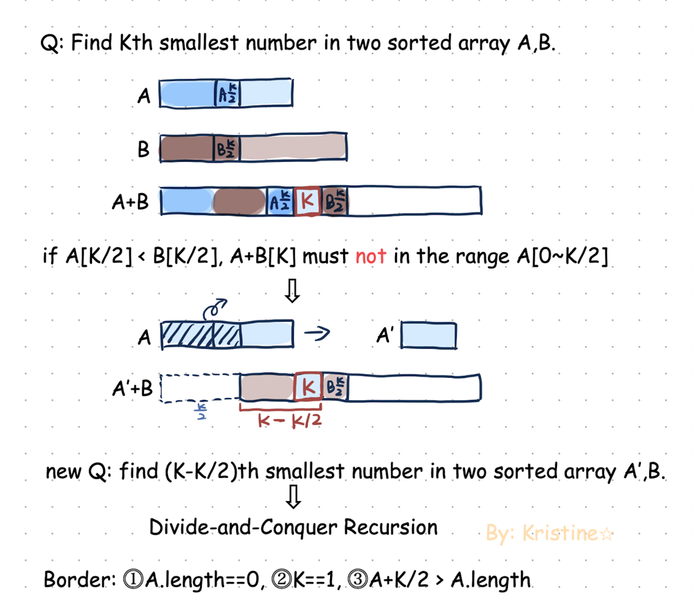

- [1. Hard](#1-hard)
  - [1.1. Median of Two Sorted Arrays](#11-median-of-two-sorted-arrays)
    - [1.1.1. Description](#111-description)
    - [1.1.2. Solution](#112-solution)
  - [1.2. Find Median from Data Stream](#12-find-median-from-data-stream)
    - [1.2.1. Description](#121-description)
    - [1.2.2. Solution](#122-solution)
      - [1.2.2.1. Solution 1](#1221-solution-1)
      - [1.2.2.2. Solution 2](#1222-solution-2)
      - [1.2.2.3. Solution 3](#1223-solution-3)

---

# 1. Hard

## 1.1. Median of Two Sorted Arrays
[4. Median of Two Sorted Arrays](https://leetcode.com/problems/median-of-two-sorted-arrays)

### 1.1.1. Description
Given two sorted arrays `nums1` and `nums2` of size `m` and `n` respectively, return the median of the two sorted arrays.

The overall run time complexity should be `O(log (m+n))`.

Example 1:

Input: `nums1 = [1,3]`, `nums2 = [2]`
Output: `2.00000`
Explanation: merged `array = [1,2,3]` and median is `2`.
Example 2:

Input: `nums1 = [1,2]`, `nums2 = [3,4]`
Output: `2.50000`
Explanation: merged array = [1,2,3,4] and median is `(2 + 3) / 2 = 2.5`.

### 1.1.2. Solution

1. Divide and conquer
   1. big question: Find `K`th smallest number in two sorted array `A`, `B`.
   2. Divide big question into smaller question: find `(K-ak)th` smallest number in two sorted array `A[aK~aLength]`, `B`.
2. The target must be between `A[k/2]` and `B[k/2]`, inclusive.
3. We keep the `A` list shorter and focus on eliminating the left part of the median of list `A` if it's less than the median of list `B`. 
4. If `A[k/2]` < `B[k/2]`, We can remove the left part of `A` as `A' = A.slice(k / 2, A.length)`.
5. Consider the total number of elements in 2 arrays (`num1` and `num2`) is `odd` or `even`.



- `k` - kth smallest number
- `A` - number list 1 `num1`
- `B` - number list 2 `num2`
- `aL` - left border (index) of List `A` 
- `bL` - left border (index) of List `B`
- `a` - length of `A` list (`a == A.length`)
- `b` - length of `B` list (`b == B.length`)

```ts
// typescript

function findMedianSortedArrays(nums1: number[], nums2: number[]): number {
  const mn = nums1.length + nums2.length;
  const boundary = setBoundary(nums1, 0, nums1.length, nums2, 0, nums2.length);

  const res = boundary(Math.ceil(mn / 2));
  if (mn % 2) return res;
  return (res + boundary((mn + 2) / 2)) / 2;
}

const setBoundary = (A: number[], aL: number, a: number, B: number[], bL: number, b: number,) => {
    return (k: number) => FindKthSmallList(A, aL, a, B, bL, b, k);
}

const FindKthSmallList = (A: number[], aL: number, a: number, B: number[], bL: number, b: number, K: number): number => {
  if (a > b) return FindKthSmallList(B, bL, b, A, aL, a, K);

  if (a === 0) return B[bL + K - 1];
  if (K === 1) return Math.min(A[aL], B[bL]);

  const aK = Math.min(a, Math.ceil(K / 2));   // A+K/2 > A length
  const bK = K - aK;   // aK+bK=K (K/2+K/2=K or a+bK=K)

  if (A[aL + aK - 1] < B[bL + bK - 1]) { // array index include 0 so index=length-1
    return FindKthSmallList(A, aL + aK, a - aK, B, bL, b, K - aK); 
  } else {
    return FindKthSmallList(A, aL, a, B, bL + bK, b - bK, K - bK);
  }
};
```

## 1.2. Find Median from Data Stream
[295. Find Median from Data Stream](https://leetcode.com/problems/find-median-from-data-stream)

### 1.2.1. Description
The **median** is the middle value in an ordered integer list. If the size of the list is even, there is no middle value, and the median is the mean of the two middle values.

For example, for `arr = [2,3,4]`, the median is `3`.
For example, for `arr = [2,3]`, the median is `(2 + 3) / 2 = 2.5`.
Implement the MedianFinder class:

- `MedianFinder()` initializes the `MedianFinder` object.
- `void addNum(int num)` adds the integer `num` from the data stream to the data structure.
- `double findMedian()` returns the median of all elements so far. Answers within `10-5` of the actual answer will be accepted.

Example 1:

Input
`["MedianFinder", "addNum", "addNum", "findMedian", "addNum", "findMedian"]`
`[[], [1], [2], [], [3], []]`
Output
`[null, null, null, 1.5, null, 2.0]`

Explanation

```ts
const medianFinder = new MedianFinder();
medianFinder.addNum(1);    // arr = [1]
medianFinder.addNum(2);    // arr = [1, 2]
medianFinder.findMedian(); // return 1.5 (i.e., (1 + 2) / 2)
medianFinder.addNum(3);    // arr[1, 2, 3]
medianFinder.findMedian(); // return 2.0
```

### 1.2.2. Solution

#### 1.2.2.1. Solution 1
1. We can brute force and insert numbers into the list array in order.
2. This ensures the array storing the number list is **sorted**. 
3. Therefore, we can get the median right away from the array. 
4. The time complexity of the operations
   1. `addNum` - O(n)
   2. `findMedian` - O(1)

```ts
// typescript
class MedianFinder {
    list = [];
    constructor() {
    }

    addNum(num: number): void {
      const index = this.getMedianIndex(num);
      this.list.splice(index, 0, num);
    }

    findMedian(): number {
      const length = this.list.length;

      if (!length) return null;

      if (length % 2 !== 0) {
        return this.list[Math.floor(length / 2)];
      }

      const mid = Math.floor(length / 2)
      return (this.list[mid-1] + this.list[mid]) / 2;
    }

    getMedianIndex(numToInsert: number) {
      if (!this.list.length) return 0;

      let index = 0;
      for (const num of this.list) {
        if (this.list[index] >= numToInsert) return index;

        if (this.list[index] < numToInsert && numToInsert <= (this.list[index + 1])) {
          return index + 1;
        }

        index++;
      }

      return index;
    }
}
```

#### 1.2.2.2. Solution 2

1. Instead of iterating through the whole array, we can use binary search which time complexity is `O(logn)`.

```ts
// typescript
class MedianFinder {
    private numList: number[] = [];
    constructor() { }

    addNum(num: number): void {
        const index = this.binaryInsert(num);
        this.numList.splice(index, 0, num);
    }

    findMedian(): number {
        const length = this.numList.length;
        const mid = Math.floor(length / 2);

        const middleNumber = this.numList[mid];
        if (length % 2) {
            return middleNumber;
        }

        return (this.numList[mid - 1] + middleNumber) / 2;
    }

    private binaryInsert(target: number) {
        let start = 0;
        let end = this.numList.length;

        while (start < end) {
            const middle = Math.floor((start + end) / 2);

            if (this.numList[middle] === target) {
                // Insert before the first occurrence (handle duplicates)
                return middle;
            } else if (this.numList[middle] < target) {
                start = middle + 1;
            } else {
                end = middle;
            }
        }

        // Target not found, insert at the calculated position
        return start;
    }
}
```

#### 1.2.2.3. Solution 3

1. We can have 2 heaps (min and max heap) which have approximate the same length.
2. A min heap has the minimum value at its root node, so we can get the minimum value as `O(1)`. 
3. On the other hand, a max heap has the maximum value at its root node, so we can get the maximum value with `O(1)`. 
4. In this case, we will have 2 heaps with the following conditions
   1. a small heap which is a max heap, and 
   2. a large heap which is a min heap
   3. all values in the large heap is larger than or equal to the values in the small heap. 
   4. In other words, it means the minimum value in the large heap should be greater than or equal to the largest value in the small heap as `smallHeap.max <= largeHeap.min`.
   5. both heaps have similar length that is `Math.abs(minHeap.length - maxHeap.length) <= 1`. 
5. Every time we add a new value, 
   1. The value firstly goes to the small heap;
   2. if the value is the largest value in the small heap, check the minium value of the large heap;
   3. If the minimum value in the large heap is smaller than the value, move the value to the large heap;
   4. If both heaps are unbalanced, re-balance the heaps by moving the maximum value from small heap to large heap, or moving the minimum value from the large heap to the small heap. 

        ```ts
        // pseudo code
        const smallHeap: MaxHeap = [];
        const largeHeap: MinHeap = [];

        // add 3
        smallHeap.insert(3);

        // add 2
        smallHeap.insert(2);
        // 2 heaps are unbalanced
        Math.abs(smallHeap.length - largeHeap.length) !== 1;
        // largest value in small heap is larger than the value to insert
        smallHeap.max > 2;
        // move largest value in small heap to large heap
        largeHeap.insert(smallHeap.extractMax);


        // add 7
        smallHeap.insert(7);
        // 7 is large than maximum of small heap and minimum of large heap
        smallHeap.max < 7 && 7 > largeHeap.min;
        // move largest value in small heap to large heap
        largeHeap.insert(smallHeap.extractMax);

        // add 4
        smallHeap.insert(4);
        // 4 is larger than the minimum value of large heap
        4 > largeHeap.min;
        // swap 4 with the minimum value of large heap
        largeHeap.insert(smallHeap.extractMax);
        smallHeap.insert(largeHeap.extractMin);

        // get median
        // since length of small and large heap are the same
        const median = (largeHeap.min + smallHeap.max) / 2;
        ```

6. Since we only care about the minimum value of the large heap and the maximum value of the small heap, we can use `Array` rather than a real `Heap`. 
    ```ts
    // typescript
    const smallHeap = [];
    const largeHeap = [];

    const [smallHeapMax] = smallHeap.slice(-1);
    const largeHeapMin = largeHeap[0];
    ```


```ts
// typescript
class MedianFinder {
    private maxHeap: number[] = [];
    private minHeap: number[] = [];
    constructor() { }

    addNum(num: number): void {
      if (!this.maxHeap.length || num < this.maxHeap[0]) {
        this.maxHeap.push(num);
        this.maxHeapifyUp();
      } else {
        this.minHeap.push(num);
        this.minHeapifyUp();
      }

      if (this.maxHeap.length - this.minHeap.length > 1) {
        this.minHeap.push(this.maxHeap[0]);
        this.maxHeap[0] = this.maxHeap.pop()!;
        this.maxHeapifyDown();
        this.minHeapifyUp();
      } else if (this.minHeap.length - this.maxHeap.length > 1) {
        this.maxHeap.push(this.minHeap[0]);
        this.minHeap[0] = this.minHeap.pop()!;
        this.minHeapifyDown();
        this.maxHeapifyUp();
      }
    }

    findMedian(): number {
      const [min] = this.maxHeap;
      const [max] = this.minHeap;

      if (this.maxHeap.length === this.minHeap.length) {
        return (min + max) / 2;
      }

      if (this.minHeap.length > this.maxHeap.length) {
        return max;
      }

      return min;
    }

    private maxHeapifyUp(): void {
      let currentIndex = this.maxHeap.length - 1;
      while (currentIndex > 0) {
        const parentIndex = Math.floor((currentIndex - 1) / 2);
        if (this.maxHeap[currentIndex] > this.maxHeap[parentIndex]) {
            [this.maxHeap[currentIndex], this.maxHeap[parentIndex]] = [
              this.maxHeap[parentIndex],
              this.maxHeap[currentIndex],
            ];
            currentIndex = parentIndex;
        } else {
            break;
        }
      }
    }

    private maxHeapifyDown(): void {
      let currentIndex = 0;
      while (currentIndex < this.maxHeap.length) {
        const leftChildIndex = 2 * currentIndex + 1;
        const rightChildIndex = 2 * currentIndex + 2;
        let largestIndex = currentIndex;

        if (
          leftChildIndex < this.maxHeap.length &&
          this.maxHeap[leftChildIndex] > this.maxHeap[largestIndex]
        ) {
          largestIndex = leftChildIndex;
        }

        if (
          rightChildIndex < this.maxHeap.length &&
          this.maxHeap[rightChildIndex] > this.maxHeap[largestIndex]
        ) {
          largestIndex = rightChildIndex;
        }

        if (largestIndex !== currentIndex) {
          [this.maxHeap[currentIndex], this.maxHeap[largestIndex]] = [
              this.maxHeap[largestIndex],
              this.maxHeap[currentIndex],
          ];
          currentIndex = largestIndex;
        } else {
          break;
        }
      }
    }

    private minHeapifyUp(): void {
      let currentIndex = this.minHeap.length - 1;
      while (currentIndex > 0) {
        const parentIndex = Math.floor((currentIndex - 1) / 2);
        if (this.minHeap[currentIndex] < this.minHeap[parentIndex]) {
          [this.minHeap[currentIndex], this.minHeap[parentIndex]] = [
              this.minHeap[parentIndex],
              this.minHeap[currentIndex],
          ];
          currentIndex = parentIndex;
        } else {
          break;
        }
      }
    }

    private minHeapifyDown(): void {
      let currentIndex = 0;
      while (currentIndex < this.minHeap.length) {
        const leftChildIndex = 2 * currentIndex + 1;
        const rightChildIndex = 2 * currentIndex + 2;
        let smallestIndex = currentIndex;

        if (
          leftChildIndex < this.minHeap.length &&
          this.minHeap[leftChildIndex] < this.minHeap[smallestIndex]
        ) {
          smallestIndex = leftChildIndex;
        }

        if (
          rightChildIndex < this.minHeap.length &&
          this.minHeap[rightChildIndex] < this.minHeap[smallestIndex]
        ) {
          smallestIndex = rightChildIndex;
        }

        if (smallestIndex !== currentIndex) {
          [this.minHeap[currentIndex], this.minHeap[smallestIndex]] = [
              this.minHeap[smallestIndex],
              this.minHeap[currentIndex],
          ];
          currentIndex = smallestIndex;
        } else {
          break;
        }
      }
    }
}
```