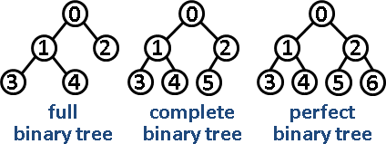

Started: 2021/10/24
End:
Course Material: [Master the Coding Interview: Data Structures + Algorithms](https://www.udemy.com/course/master-the-coding-interview-data-structures-algorithms/)

---

- [1. Big O](#1-big-o)
  - [1.1. What is Good Code?](#11-what-is-good-code)
  - [1.2. Big O and Scalability](#12-big-o-and-scalability)
  - [1.3. O(n)](#13-on)
  - [1.4. O(1)](#14-o1)
  - [1.5. Exercise: Big O Calculation 1](#15-exercise-big-o-calculation-1)
  - [1.6. Exercise: Big O Calculation 2](#16-exercise-big-o-calculation-2)
  - [1.7. Simplifying Big O](#17-simplifying-big-o)
  - [1.8. Big O Rule 1](#18-big-o-rule-1)
  - [1.9. Big O Rule 2](#19-big-o-rule-2)
  - [1.10. Big O Rule 3](#110-big-o-rule-3)
  - [1.11. O(n^2)](#111-on2)
  - [1.12. Big O Rule 4](#112-big-o-rule-4)
  - [1.13. What does this all mean?](#113-what-does-this-all-mean)
  - [1.14. O(n!)](#114-on)
  - [1.15. 3 Pillars of Programming](#115-3-pillars-of-programming)
  - [1.16. Space complexity](#116-space-complexity)
  - [1.17. Exercise: Space complexity](#117-exercise-space-complexity)
  - [1.18. Exercise: Twitter](#118-exercise-twitter)
- [2. How to solve coding problems](#2-how-to-solve-coding-problems)
  - [2.1. What are the companies looking for?](#21-what-are-the-companies-looking-for)
  - [2.2. What we need for coding interviews](#22-what-we-need-for-coding-interviews)
  - [2.3. Exercise Interview Question](#23-exercise-interview-question)
    - [2.3.1. Cheat Sheet](#231-cheat-sheet)
      - [2.3.1.1. Steps to tackle problems](#2311-steps-to-tackle-problems)
      - [2.3.1.2. Good code checklist](#2312-good-code-checklist)
- [3. Data Structure: Introduction](#3-data-structure-introduction)
  - [3.1. What is data structure](#31-what-is-data-structure)
  - [3.2. How computers store data](#32-how-computers-store-data)
  - [3.3. Data structures in different languages](#33-data-structures-in-different-languages)
  - [3.4. Operations on data structure](#34-operations-on-data-structure)
- [4. Data Structure: Array](#4-data-structure-array)
  - [4.1. Arrays Introduction](#41-arrays-introduction)
  - [4.2. Static vs Dynamic arrays](#42-static-vs-dynamic-arrays)
  - [4.3. Implementing an Array](#43-implementing-an-array)
  - [4.4. Strings and Arrays](#44-strings-and-arrays)
  - [4.5. Exercise: Reverse a String](#45-exercise-reverse-a-string)
  - [4.6. Solution: Reverse a String](#46-solution-reverse-a-string)
  - [4.7. Exercise: Merge Sorted Arrays](#47-exercise-merge-sorted-arrays)
  - [4.8. Solution: Merge Sorted Arrays](#48-solution-merge-sorted-arrays)
  - [4.9. Arrays Review](#49-arrays-review)
- [5. Data Structure: Hash Tables](#5-data-structure-hash-tables)
  - [5.1. Hash Tables Introduction](#51-hash-tables-introduction)
  - [5.2. Hash Function](#52-hash-function)
  - [5.3. Hash Collisions](#53-hash-collisions)
  - [5.4. Hash tables in different language](#54-hash-tables-in-different-language)
  - [5.5. Exercise: Implement a hash table](#55-exercise-implement-a-hash-table)
    - [5.5.1. Challenge](#551-challenge)
    - [5.5.2. Solution](#552-solution)
  - [5.6. Keys()](#56-keys)
  - [5.7. Hash tables vs Arrays](#57-hash-tables-vs-arrays)
  - [5.8. Exercise: First Recurring Character](#58-exercise-first-recurring-character)
    - [5.8.1. Challenge](#581-challenge)
    - [5.8.2. Solution](#582-solution)
  - [5.9. Hash Tables Review](#59-hash-tables-review)
- [6. Data Structure: Linked Lists](#6-data-structure-linked-lists)
  - [6.1. Linked Lists](#61-linked-lists)
  - [6.2. Why Linked List?](#62-why-linked-list)
  - [6.3. What is a Pointer?](#63-what-is-a-pointer)
  - [6.4. Our First Linked List](#64-our-first-linked-list)
  - [6.5. append()](#65-append)
  - [6.6. prepend()](#66-prepend)
  - [6.7. Node Class](#67-node-class)
  - [6.8. insert()](#68-insert)
  - [6.9. remove()](#69-remove)
  - [6.10. Doubly Linked Lists](#610-doubly-linked-lists)
  - [6.11. Singly vs Doubly linked list](#611-singly-vs-doubly-linked-list)
  - [6.12. Reverse](#612-reverse)
  - [6.13. Linked List Review](#613-linked-list-review)
- [7. Data Structure: Stack and Queues](#7-data-structure-stack-and-queues)
  - [7.1. Stacks](#71-stacks)
  - [7.2. Queues](#72-queues)
  - [7.3. Stack vs Queue](#73-stack-vs-queue)
  - [7.4. Stack Implementation (Linked Lists)](#74-stack-implementation-linked-lists)
  - [7.5. Stack Implementation (Array)](#75-stack-implementation-array)
  - [7.6. Queue Implementation](#76-queue-implementation)
  - [7.7. Queues usings Stacks](#77-queues-usings-stacks)
  - [7.8. Stacks + Queues Review](#78-stacks--queues-review)
- [8. Data Structure: Trees](#8-data-structure-trees)
  - [8.1. Trees Introduction](#81-trees-introduction)
  - [8.2. Binary tree](#82-binary-tree)
  - [8.3. O(log N)](#83-olog-n)
  - [8.4. Binary Search Trees](#84-binary-search-trees)
  - [8.5. Balanced vs Unbalanced BST](#85-balanced-vs-unbalanced-bst)
  - [8.6. BST Pros and Cons](#86-bst-pros-and-cons)
  - [8.7. Binary Search Tree](#87-binary-search-tree)
- [9. Data Structure: Graphs](#9-data-structure-graphs)
  - [9.1. Graphs Introduction](#91-graphs-introduction)
  - [9.2. Types of graph](#92-types-of-graph)
  - [9.3. Graph Data](#93-graph-data)
  - [9.4. Exercise and solution](#94-exercise-and-solution)
- [10. Recursion](#10-recursion)
- [11. Sorting](#11-sorting)
- [12. Searching, BFS, DFS](#12-searching-bfs-dfs)
  - [12.1. Linear search](#121-linear-search)
  - [12.2. Binary search](#122-binary-search)
  - [12.3. Graph and tree traversal](#123-graph-and-tree-traversal)
  - [12.4. Breadth first search BFS introduction](#124-breadth-first-search-bfs-introduction)
  - [12.5. Depth first search DFS introduction](#125-depth-first-search-dfs-introduction)
  - [12.6. BFS vs DFS](#126-bfs-vs-dfs)
    - [12.6.1. BFS breadth first search](#1261-bfs-breadth-first-search)
    - [12.6.2. DFS depth first search](#1262-dfs-depth-first-search)
  - [12.7. Exercise and solution: BFS vs DFS](#127-exercise-and-solution-bfs-vs-dfs)
  - [12.8. BFS breadth first search](#128-bfs-breadth-first-search)
  - [BFS recursive](#bfs-recursive)
- [13. Dynamic programming](#13-dynamic-programming)

---

# 1. Big O

## 1.1. What is Good Code?

1. There are 2 main points for good code
   1. Readable
   2. Scalable
2. Code is similar to recipe which developers gives it to the machine to execute for some output.

## 1.2. Big O and Scalability

1. The duration of the code execution can vary according to hardware such as the CPU and RAM that the computer has.
2. In most of the cases, especially for programs and apps in production, the app may run on a very different machine that is different from the code we execute on the laptop.
3. Therefore, we have a relatively fair is to count the steps as the complexity and efficiency of the code is as Big O notation.
   

## 1.3. O(n)

1. From the example of finding nemo in an array, the function will iterate through the array which gives a linear time complexity to fulfill the request.
2. In this case, we have to iterate through all the items in the list to finish the process. The more the items in the list the more time the function takes to execute. Its big O notation is `O(n)`.

```js
// Javascript
const nemo = ["nemo"];
const everyone = [
  "nemo",
  "dory",
  "bruce",
  "marlin",
  "gill",
  "bloat",
  "nigel",
  "squirt",
  "darla",
  "hank",
];

const large = new Array(100000).fill("nemo");

function findNemo(array) {
  for (let i = 0; i < array.length; i++) {
    if (array[i] === "nemo") {
      console.log("Found NEMO!");
    }
  }
}

findNemo(large); // O(n) --> Linear Time
```

## 1.4. O(1)

1. `O(1)` represents "**constant time**" which means the function only takes a certain amount of time no matter how large the dataset the function deals with.

## 1.5. Exercise: Big O Calculation 1

1. In some cases, variable assignment and reassignment can be counted as part of the complexity.
2. If we count all the steps that the function takes it can be `3 + n + n + n + n`, or `3 + 4n`.

```js
// Javascript
// What is the Big O of the below function? (Hint, you may want to go line by line)
function funChallenge(input) {
  let a = 10; // O(1)
  a = 50 + 3; // O(1)

  for (let i = 0; i < input.length; i++) {
    // O(n)
    anotherFunction(); // O(n)
    let stranger = true; // O(n)
    a++; // O(n)
  }
  return a; // O(1)
}

// 3 + n + n + n + n
```

## 1.6. Exercise: Big O Calculation 2

1. According to the last example, we can calculate the step and check the complexity of the function.

```js
// Javascript
function anotherFunChallenge(input) {
  let a = 5; // O(1)
  let b = 10; // O(1)
  let c = 50; // O(1)
  for (let i = 0; i < input; i++) {
    let x = i + 1; // O(n)
    let y = i + 2; // O(n)
    let z = i + 3; // O(n)
  }
  for (let j = 0; j < input; j++) {
    let p = j * 2; // O(n)
    let q = j * 2; // O(n)
  }
  let whoAmI = "I don't know"; // O(1)

  // 1 + 1 + 1 + n + n + n + n + n + 1
  // 4 + 5n
}
```

## 1.7. Simplifying Big O

1. When calculating Big O, there are 4 main rules to follow
   1. Worst Case
   2. Remove Constants
   3. Different terms for inputs
   4. Drop Non Dominants

## 1.8. Big O Rule 1

1. Worst Case
2. From the last example to find `nemo` in the array, the function has to iterate through all the items in the list though the desired item has been found in the list.
3. In Javascript, we can use `break` keyword in the for loop to stop iteration if the item in found.
4. However, this doesn't really improve the performance of the function, as in the big O notation, it only considers the worst case.
5. For the function, `nemo` can be the very first item or the last item in the array, so the function could either run through the whole list.

## 1.9. Big O Rule 2

1. Remove Constants
2. In the example below, we have 2 iterations in the function.
3. In this case, we may ignore variable assignments and small calculations.
4. The main complexity can be `O(1 + n/2 + 100)` which can be simplified as `O(n)`.

```js
// Javascript
function printFirstItemThenFirstHalfThenSayHi100Times(items) {
  console.log(items[0]); // O(1)

  var middleIndex = Math.floor(items.length / 2); // O(1)
  var index = 0; // O(1)

  while (index < middleIndex) {
    // O(n/2)
    console.log(items[index]); // O(1)
    index++; // O(1)
  }

  for (var i = 0; i < 100; i++) {
    // O(100)
    console.log("hi"); // O(1)
  }
}
// O(1 + n/2 + 100)
```

## 1.10. Big O Rule 3

1. Different terms for inputs
2. Since there are 2 different inputs, we'd count them separately. In the following example, the input can be 2 different arrays and each can have different numbers of items which cause very different output for the case.

```js
// Javascript
function compressBoxesTwice(boxes, boxes2) {
  boxes.forEach(function (boxes) {
    console.log(boxes);
  });

  boxes2.forEach(function (boxes) {
    console.log(boxes);
  });
}

// O(m + n);
```

## 1.11. O(n^2)

1. In a nested loop or iteration, we use multiplication for the complexity.
2. `O(n^2)` is quadratic time.
3. If iterations execute in the same layer, we can simply add on the complexity, while if the iteration is nested, we can multiply the numbers.

```js
// Javascript
// Log all pairs of array
const boxes = ["a", "b", "c", "d", "e"];

function logAllPairsOfArray(array) {
  for (let i = 0; i < array.length; i++) {
    for (let j = 0; j < array.length; j++) {
      console.log(array[i], array[j]);
    }
  }
}

// O(m * n)
```

## 1.12. Big O Rule 4

1. Drop Non Dominants
2. When calculating complexity, we only consider the dominant terms.
3. For example, when we have `n + n^2`, `n` is like a constant in the equation which doesn't affect much as `n^2`.

```js
// Javascript
function printAllNumbersThenAllPairSums(numbers) {
  console.log("these are the numbers:");
  numbers.forEach(function (number) {
    // O(n)
    console.log(number);
  });

  console.log("and these are their sums:");
  numbers.forEach(function (firstNumber) {
    // O(n^2)
    numbers.forEach(function (secondNumber) {
      console.log(firstNumber + secondNumber);
    });
  });
}

// O(n + n^2)

printAllNumbersThenAllPairSums([1, 2, 3, 4, 5]);
```

## 1.13. What does this all mean?

1. Complexity and big O notation is used to check scalability of the code or funcitons.
2. For example, Javascript has some array methods such as
   1. `push` - add item as the last element in an array.
   2. `pop` - remove the last item in an array.
   3. `shift` - remove the first item in an array.
   4. `unshift` - add item as the first element in an array.
3. Data structure + Algorithms = Programs
4. Learning data structure helps improve the efficiency of functions and code as the fundation.

## 1.14. O(n!)

1. Factorial note `O(n!)`. This means the fucntions use multiple layers of nested loop.
2. In most of the cases, having this type of complexity means something is wrong with the function or code.

## 1.15. 3 Pillars of Programming

1. When programming, we may consider some factors
2. Readability
3. Scalability which includes
   1. Speed - Time complexity
   2. Memory
4. Memory - Space complexity
5. Speed and memory are usually in contrast to each other.
6. A function can either be time efficient, space efficient or balanced in between.

## 1.16. Space complexity

1. Some factors can affect space complexity of a function
2. Variables
3. Data structures
4. Function call
5. Allocations

## 1.17. Exercise: Space complexity

1. The space complexity of the following example is `O(1)`.

```js
// Javascript
function boo(n) {
  for (let i = 0; i < n.length; i++) {
    console.log("boo");
  }
}

boo(new Array(5)); // O(1)
```

2. In the following example, the function returns an array which has a space complexity as `O(n)`.

```js
function arrayOfHiNTimes(n) {
  let hiArray = [];
  for (let i = 0; i < n; i++) {
    hiArray[i] = 'hi';
  }
  return hiArray;
}

arrayOfHiNTimes(6)); // O(n)
// ['hi', 'hi', 'hi', 'hi', 'hi', 'hi',]
```

## 1.18. Exercise: Twitter

1. In different programming languages, the way handling space (memory) is different.
2. For example, when we check the `length` property on a string value in Javascript, the language simply respond the number of characters in the string value.
3. In this case, the space complexity for a string is simply `O(1)`.
4. However, in the other language such as "**C**", the string value is like an array of characters.
5. Therefore, the space complexity vary when using different programming languages.

```js
// Javascript
// Find 1st, Find Nth...
const array = [
  {
    tweet: "hi",
    date: 2012,
  },
  {
    tweet: "my",
    date: 2014,
  },
  {
    tweet: "teddy",
    date: 2018,
  },
]; // space complexity O(n^2)

array[0]; // O(1)

array[array.length - 1]; // O(1)
```

# 2. How to solve coding problems

## 2.1. What are the companies looking for?

1. 4 main skills are critical for career success
2. Analytic skills
3. Coding skills
4. Technical skills
5. Communication skills

## 2.2. What we need for coding interviews

1. Data structures
   1. Arrays
   2. Stacks
   3. Queues
   4. Linked Lists
   5. Trees
   6. Tries
   7. Graphs
   8. Hash Tables
2. Algorithms
   1. Sorting
   2. Dynamic Programming
   3. BFS + DFS (Searching)
   4. Recursion

## 2.3. Exercise Interview Question

1. We can refer to the [Google interview](https://youtu.be/XKu_SEDAykw) on YouTube.
2. Therefore steps we may follow to tackle questions in an interview.

```js
// Javascript
// Given 2 arrays, create a function that let's a user know (true/false) whether these two arrays contain any common items
//For Example:
//const array1 = ['a', 'b', 'c', 'x'];//const array2 = ['z', 'y', 'i'];
//should return false.
//-----------
//const array1 = ['a', 'b', 'c', 'x'];//const array2 = ['z', 'y', 'x'];
//should return true.

// 2 parameters - arrays - no size limit
// return true or false

function containsCommonItem(arr1, arr2) {
  for (let i = 0; i < arr1.length; i++) {
    for (let j = 0; j < arr2.length; j++) {
      if (arr1[i] === arr2[j]) {
        return true;
      }
    }
  }
  return false;
}

//O(a*b)
//O(1) - Space Complexity

const array1 = ["a", "b", "c", "x"];
const array2 = ["z", "y", "a"];

function containsCommonItem2(arr1, arr2) {
  // loop through first array and create object where properties === items in the array
  // can we assume always 2 params?

  let map = {};
  for (let i = 0; i < arr1.length; i++) {
    if (!map[arr1[i]]) {
      const item = arr1[i];
      map[item] = true;
    }
  }
  // loop through second array and check if item in second array exists on created object.
  for (let j = 0; j < arr2.length; j++) {
    if (map[arr2[j]]) {
      return true;
    }
  }
  return false;
}

//O(a + b) Time Complexity
//O(a) Space Complexity

// containsCommonItem2(array1, array2)

function containsCommonItem3(arr1, arr2) {
  return arr1.some((item) => arr2.includes(item));
}

containsCommonItem(array1, array2);
containsCommonItem2(array1, array2);
containsCommonItem3(array1, array2);
```

### 2.3.1. Cheat Sheet

#### 2.3.1.1. Steps to tackle problems

1. When the interviewer says the question, write down the key points at the top (i.e. sorted
   array). Make sure you have all the details. Show how organized you are.
2. Make sure you double check: What are the inputs? What are the outputs?
3. What is the most important value of the problem? Do you have time, and space and memory,
   etc.. What is the main goal?
4. Don't be annoying and ask too many questions.
5. Start with the naive/brute force approach. First thing that comes into mind. It shows that
   you’re able to think well and critically (you don't need to write this code, just speak about it).
6. Tell them why this approach is not the best (i.e. O(n^2) or higher, not readable, etc...)
7. Walk through your approach, comment things and see where you may be able to break things.
   Any repetition, bottlenecks like O(N^2), or unnecessary work? Did you use all the information
   the interviewer gave you? Bottleneck is the part of the code with the biggest Big O. Focus on
   that. Sometimes this occurs with repeated work as well.
8. Before you start coding, walk through your code and write down the steps you are going to
   follow.
9. Modularize your code from the very beginning. Break up your code into beautiful small pieces
   and add just comments if you need to.
10. Start actually writing your code now. Keep in mind that the more you prepare and understand
    what you need to code, the better the whiteboard will go. So never start a whiteboard
    interview not being sure of how things are going to work out. That is a recipe for disaster.
    Keep in mind: A lot of interviews ask questions that you won’t be able to fully answer on time.
    So think: What can I show in order to show that I can do this and I am better than other
    coders. Break things up in Functions (if you can’t remember a method, just make up a function
    and you will at least have it there. Write something, and start with the easy part.
11. Think about error checks and how you can break this code. Never make assumptions about the
    input. Assume people are trying to break your code and that Darth Vader is using your
    function. How will you safeguard it? Always check for false inputs that you don’t want. Here is
    a trick: Comment in the code, the checks that you want to do… write the function, then tell the
    interviewer that you would write tests now to make your function fail (but you won't need to
    actually write the tests).
12. Don’t use bad/confusing names like i and j. Write code that reads well.
13. Test your code: Check for no params, 0, undefined, null, massive arrays, async code, etc… Ask
    the interviewer if we can make assumption about the code. Can you make the answer return
    an error? Poke holes into your solution. Are you repeating yourself?
14. Finally talk to the interviewer where you would improve the code. Does it work? Are there
    different approaches? Is it readable? What would you google to improve? How can
    performance be improved? Possibly: Ask the interviewer what was the most interesting
    solution you have seen to this problem
15. If your interviewer is happy with the solution, the interview usually ends here. It is also
    common that the interviewer asks you extension questions, such as how you would handle the
    problem if the whole input is too large to fit into memory, or if the input arrives as a stream.
    This is a common follow-up question at Google, where they care a lot about scale. The answer
    is usually a divide-and-conquer approach — perform distributed processing of the data and only
    read certain chunks of the input from disk into memory, write the output back to disk and
    combine them later.

#### 2.3.1.2. Good code checklist

1. It works
2. Good use of data structures
3. Code Re-use/ Do Not Repeat Yourself
4. Modular - makes code more readable, maintainable and testable
5. Less than O(N^2). We want to avoid nested loops if we can since they are expensive. Two separate loops are better than 2 nested loops
6. Low Space Complexity --> Recursion can cause stack overflow, copying of large arrays may exceed memory of machine

# 3. Data Structure: Introduction

## 3.1. What is data structure

1. Data structure is a collection of values.
2. Each data structure is specialized for its own thing and is a type of container in different form.
3. For example, in daily life, we can use different containers for various purpose, such as wardrobe, backpacks, folders, and cabinets which can be very different.
4. There are many types of data structures in each category. However, there are only few which are frequently used. The others are very specific for certain scenarios.

## 3.2. How computers store data

1. Computers use mainly 3 parts, CPU, RAM, and Storage to work.
2. When use code to declare a variable, CPU will make a calculation and store in the RAM and pass and store in the "storage" if it's required for permanent usage.
3. In the RAM, we have multiple "addresses" to store the data.
4. CPU also has a small memory as "cache" to store most recent data to boost the overall performance.
5. If the data is stored near in the Ram, the faster the computer can manipulate and work on the data.
6. Computers store types of data differently on the RAM.

## 3.3. Data structures in different languages

1. Each programming language has its own specific data types (primitive types). In most of the cases, the default primitive types of a programming language have covered most of the use case.

## 3.4. Operations on data structure

1. Insertion - add data to memory
2. Deletion - remove data from memory
3. Traversal - check all the data in memory
4. Searching - find a specific data in memory
5. Sorting - sort and order data in memory
6. Access - read data in memory

# 4. Data Structure: Array

## 4.1. Arrays Introduction

1. In Javascript, we have several array methods to work with and manipulate the array.
2. `push` add an item at the end of the array
3. `pop` remove the last item of the array
4. `unshift` add an item as the first item to an array
5. `splice` add or remove an item at an arbitrary position of an array

```js
const strings = ["a", "b", "c", "d"];
// 4*4 = 16 bytes of storage

strings[2];

// push
strings.push("e"); // O(1)
console.log(strings); // ['a', 'b', 'c', 'd', 'e']

// pop
strings.pop(); // O(1)
console.log(strings); // ['a', 'b', 'c', 'd']
strings.pop(); // O(1)
console.log(strings); // ['a', 'b', 'c']

// unshift
strings.unshift("x"); // O(n)
console.log(strings); // ['x', 'a', 'b', 'c']

// splice
strings.splice(2, 0, "alien"); // O(n)
console.log(strings); // ['x', 'a', 'alien', 'b', 'c']
```

## 4.2. Static vs Dynamic arrays

1. Static arrays has static size or fixed number of items.
2. The main difference is if the language is required to manage memory.
3. When adding or removing items from a dynamic array, the computer will duplicate the current one and relocate the array to other chunk of memory to store the data.

## 4.3. Implementing an Array

1. How to build one
2. How to use it

```js
// Javascript
class MyArray {
  constructor() {
    this.length = 0;
    this.data = {};
  }

  get(index) {
    return this.data[index];
  }

  push(item) {
    this.data[this.length] = item;
    this.length++;
    return this.length;
  }

  pop() {
    const lastItem = this.data[this.length - 1];
    delete this.data[this.length - 1];
    this.length--;
    return lastItem;
  }

  delete(index) {
    const item = this.data[index];
    this.shiftItems(index);
  }

  shiftItems(index) {
    for (let i = 0; i < this.length; i++) {
      this.data[i] = this.data[i + 1];
    }
    // drop the very last item in the array
    delete this.data[this.length - 1];
    this.length--;
  }
}

const newArray = new MyArray();
console.log(newArray); // { length: 0, data: {} }
console.log(newArray.get(0)); // undefined

newArray.push("hi");
console.log(newArray); // { length: 0, data: { 0: 'hi' } }
newArray.push("you");
console.log(newArray); // { length: 0, data: { 0: 'hi', 1: 'you' } }

newArray.pop();
console.log(newArray); // { length: 0, data: { 0: 'hi' } }

newArray.push("!");
newArray.push("are");
newArray.push("nice");

newArray.delete(1);
console.log(newArray); // { length: 0, data: { 0: 'hi' } }
```

## 4.4. Strings and Arrays

1. Strings are simply array of characters.

## 4.5. Exercise: Reverse a String

## 4.6. Solution: Reverse a String

1. Tentative solutions

```js
// Javascript
// create a function that reverse a string

// use for loop
function reverseString(string) {
  const array = [];
  for (let i = string.length - 1; i >= 0; i--) {
    array.push(string[i]);
  }
  const str = array.join("");
  return str;
}

// use reduce method
function reverseString(string) {
  let length = string.length;
  return string.split("").reduce((str, char, index, arr) => {
    str += arr[length - 1];
    length--;
    return str;
  }, "");
}

// use reverse method
function reverseString(string) {
  return string.split("").reverse().join("");
}
```

2. Solution from lecture

```js
// Javascript
function reverse(str) {
  // check input
  if (!str || str.length < 2 || typeof str !== "string") {
    return "hmm that is not good";
  }

  const backwards = [];
  const totalItems = str.length - 1;
  for (let i = totalItems; i === 0; i--) {
    backwards.push(str[i]);
  }

  return backwards.join("");
}

function reverse2(str) {
  return str.split("").reverse().join("");
}

const reverse3 = (str) => str.split("").reverse().join("");

const reverse4 = (str) => [...str].reverse().join("");
```

## 4.7. Exercise: Merge Sorted Arrays

## 4.8. Solution: Merge Sorted Arrays

1. Tentative solutions

```js
// Javascript
// destructive assign
const array1 = [0, 3, 4, 31];
const array2 = [4, 6, 30];

function mergeAndSort() {
  const mergedArray = [...arguments].reduce((list, item) => {
    list = [...list, ...item];
    return list;
  }, []);

  return mergedArray.sort((a, b) => a - b);
}

mergeAndSort(array1, array2);
```

2. Solution from the lecture

```js
// Javascript
function mergeSortedArray(array1, array2) {
  const mergedArray = [];
  let array1Item = array1[0];
  let array2Item = array2[0];
  let i = 1;
  let j = 1;

  // check input
  if (!array1.length) {
    return array2;
  }

  if (!array2.length) {
    return array1;
  }

  while (array1Item || array2Item) {
    // we need to check if array2Item is undefined or it will cause infinite loop
    // as the iteration won't stop when array1Item or array2Item is truthy
    if (!array2Item || array1Item < array2Item) {
      mergeArray.push(array1Item);
      array1Item = array1[i];
      i++;
    } else {
      mergeArray.push(array2Item);
      array2Item = array2[j];
      j++;
    }
  }

  return mergedArray;
}

mergedSortedArray([0, 3, 4, 31], [4, 6, 30]);
```

## 4.9. Arrays Review

1. Pros
   1. Fast lookups
   2. Fast push/pop
   3. Ordered
2. Cons
   1. Slow inserts
   2. Slow deletes
   3. Fixed size (if using static array)

# 5. Data Structure: Hash Tables

## 5.1. Hash Tables Introduction

1. Hash table (or objects in Javascript or dictionary in Python) is a common data structure in most of the programming languages.
2. An object has a key/value pair which uses a hash function to store the data in the memory.
3. The way that the data stored in the memory is very different to array.
4. The key is like a pointer to show where the data stored in the memory.

## 5.2. Hash Function

1. A hash function is a function that generate value in a fixed length.
2. There are many types of hash functions, such as "MD5" and "SHA-1".
3. A hashed data is considered one way data flow. Without the critical information, others can't get the original value before it's hashed.
4. Besides, by using the same algorithm to hash a value, the hashed value will always be the same. The same input given to a hash algorithm will always have the same output.
5. The one way data flow to hash value is called "**idempotent**".
6. The main benefit to use hash table (or object) is that we can access the data by almost instantly.
7. In different context, we'd use different hash functions or algorithms to generate a hashed data.
8. For example, when we'd like to access the data, we would want the hash can be generated by a `O(1)` function.

## 5.3. Hash Collisions

1. In a hash table, `insert`, `lookup`, `delete`, and `search` are all `O(1)`.

   ```js
   let user = {
     age: 54,
     name: "Kylie",
     magic: true,
     scream: function () {
       console.log("ahhhhh!");
     },
   };

   user.age; // O(1)
   user.spell = "abra kadabra"; // O(1)
   user.scream(); // O(1)
   ```

2. A main issue on hash tables is that the memory of a computer is limited.
3. The programming language we use may allocate the memory to allow us store data.
4. However, by chances, the algorithm may allocate the data on the same location in the memory.
5. If the collision happens, the performance will be slowed down.
6. The time complexity of hash table is `O(n/k)` where `k` is the size of the hash table.
7. We can therefore make the time complexity as `O(n)` by removing the constant..

## 5.4. Hash tables in different language

1. Programming languages handle hash tables differently, while in most of the cases, the keys and values in hash table can be any type of data.
2. In old Javascript, all the data used as keys in objects will be converted to `String` type values.
3. In ES6, we can use `Map` or `Sets` to have different types of data as the key in objects. [Check more info](https://javascript.info/map-set).
   1. A `Map` is a collection of keyed data items, just like an Object. But the main difference is that Map allows keys of any type.
   2. A `Set` is a special type collection – “set of values” (without keys), where each value may occur only once.
   ```js
   const a = new Map();
   const b = new Sets();
   ```

## 5.5. Exercise: Implement a hash table

### 5.5.1. Challenge

1. Create `set` and `get` method for the following class `HashTable`.
2. `set` takes 2 arguments as `key` and `value`
3. `get` takes 1 argument which is the `key` and return the `value`.

```js
class HashTable {
  constructor(size) {
    this.data = new Array(size);
    // [['grapes', 100000]]
  }

  _hash(key) {
    let hash = 0;
    for (let i = 0; i < key.length; i++) {
      hash = (hash + key.charCodeAt(i) * i) % this.data.length;
    }
    return hash;
  }
}

const myHashTable = new HashTable(50); // create a hash table has 50 buckets
myHashTable._hash("grapes"); // hash 'grapes'
```

### 5.5.2. Solution

1. In other programming languages that supports OOP, a class may have a "private" method which can be access in the class itself.
2. However, this "private" method is not available in Javascript, so by convention, we can give an underscore `_` in the name of the method to indicate that the method should be a private one.
3. Note that this is just a conventional naming pattern while it can't stop the code calling the method.
4. In ES2019, we can add a poundsign `#` to the method to delcare a private method.
5. The `_hash` function iterates through the string and return a number between `0` to the size of the bucket we set, such as `50` in this case.

```js
// tentative solution
class HashTable {
  constructor(size) {
    this.data = new Array(size);
  }

  _hash(key) {
    let hash = 0;
    for (let i = 0; i < key.length; i++) {
      hash = (hash + key.charCodeAt(i) * i) % this.data.length;
    }
    return hash;
  }

  set(key, value) {
    const hash = this._hash(key);
    this.data[hash] = value;
  }

  get(key) {
    const hash = this._hash(key);
    return this.data[hash];
  }
}

const hashTable = new HashTable(50);
hashTable.set("grapes", 500);
hashTable.get("grapes"); // 500
hashTable.get("apple"); // undefined
```

6. To prevent collision overwrite data on the structure, we should put an array (or other types of container) to keep adding the data.

```js
// solution from lecture
class HashTable {
  constructor(size) {
    this.data = new Array(size);
  }

  _hash(key) {
    let hash = 0;
    for (let i = 0; i < key.length; i++) {
      hash = (hash + key.charCodeAt(i) * i) % this.data.length;
    }
    return hash;
  }

  set(key, value) {
    const address = this._hash(key);
    if (!this.data[address]) {
      // this is to prevent collision and cause new data overwrite old data
      this.data[address] = [];
    }
    this.data[address].push([key, value]);
    return this.data;
  }

  get(key) {
    const address = this._hash(key);
    const currentBucket = this.data[address];
    if (currentBucket) {
      // check if the position is an array 'truthy' or undefined 'falsy'
      for (let i = 0; i < currentBucket.length; i++) {
        if (currentBucket[i][0] === key) {
          // return the value if the key matches
          return currentBucket[i][1];
        }
      }
    }
    return undefined;
  }
}

const hashTable = new HashTable(50); // create memory bucket size of 50
hashTable.set("grapes", 100000);
hashTable.set("apple", 54);
hashTable.get("grapes"); // 100000
```

## 5.6. Keys()

1. We can create another method `keys` which iterates through all the keys stored in the hash table.
2. To get the "**keys**" in a hash table, we need to iterate through the whole memory space to check all the keys.
3. In the following example, we have 3 keys with values in a memory space of 50 to retrieve all the data.
4. If we use an array to store 3 items, we can easily get these 3 items.

```js
class HashTable {
  constructor(size) {
    this.data = new Array(size);
  }

  _hash(key) {
    let hash = 0;
    for (let i = 0; i < key.length; i++) {
      hash = (hash + key.charCodeAt(i) * i) % this.data.length;
    }
    return hash;
  }

  set(key, value) {
    const address = this._hash(key);
    if (!this.data[address]) {
      // this is to prevent collision and cause new data overwrite old data
      this.data[address] = [];
    }
    this.data[address].push([key, value]);
    return this.data;
  }

  get(key) {
    const address = this._hash(key);
    const currentBucket = this.data[address];
    if (currentBucket) {
      // check if the position is an array 'truthy' or undefined 'falsy'
      for (let i = 0; i < currentBucket.length; i++) {
        if (currentBucket[i][0] === key) {
          // return the value if the key matches
          return currentBucket[i][1];
        }
      }
    }
    return undefined;
  }

  keys() {
    const keysArray = [];
    for (let i = 0; i < this.data.length; i++) {
      if (this.data[i]) {
        keysArray.push(this.data[i][0][0]);
      }
    }
    return keysArray;
  }
}
const hashTable = new HashTable(50); // create memory bucket size of 50
hashTable.set("grapes", 100000);
hashTable.set("apple", 54);
hashTable.set("orange", 2);
hashTable.keys();
```

## 5.7. Hash tables vs Arrays

1. Arrays
   1. search `O(n)`
   2. lookup `O(1)`
   3. push `O(1)`
   4. insert `O(n)`
   5. delete `O(n)`
2. Hash Tables
   1. search `O(1)`
   2. insert `O(1)`
   3. lookup `O(1)`
   4. delete `O(1)`

## 5.8. Exercise: First Recurring Character

### 5.8.1. Challenge

1. Create a function that return the first duplicate
2. Given an array `[2,5,1,2,3,5,1,2,4]` which returns `2`.
3. Given an array `[2,1,1,2,3,5,1,2,4]` which returns `1`.
4. Given an array `[2,3,4,5]` which returns `undefined`.

```js
// tentative solution
const arr1 = [2, 5, 1, 2, 3, 5, 1, 2, 4];
const arr2 = [2, 1, 1, 2, 3, 5, 1, 2, 4];
const arr3 = [2, 3, 4, 5];

// O(n^2)
function findFirstDuplicate(arr = []) {
  const parsedNum = [];
  for (let i = 0; i < arr.length; i++) {
    for (let j = 0; j < parsedNum.length; j++) {
      if (parsedNum[j] === arr[i]) {
        return parsedNum[j];
      }
    }
    parsedNum.push(arr[i]);
  }
  return undefined;
}

findFirstDuplicate(arr1); // 2
findFirstDuplicate(arr2); // 1
findFirstDuplicate(arr3); // undefined

// O(n)
function findFirstDuplicate2(arr = []) {
  const parsedNum = {};
  for (let i = 0; i < arr.length; i++) {
    if (parsedNum[arr[i]]) {
      return arr[i];
    }
    parsedNum[arr[i]] = arr[i];
  }
  return undefined;
}

findFirstDuplicate2(arr1); // 2
findFirstDuplicate2(arr2); // 1
findFirstDuplicate2(arr3); // undefined
```

### 5.8.2. Solution

1. We can assume the input is an array of numbers.
2. The tentative solution can have problems when there's falsy values in the given array such as number `0`, `null`, or `undefined`.

```js
// solution from the lecture
// naive solution
// O(n^2)
function firstRecurringCharacter(input) {
  for (let i = 0; i < input.length; i++) {
    for (let j = i + 1; j < input.length; j++) {
      // j must be bigger than i or the iteration will consider the number on the same position as duplicate
      if (input[i] === input[j]) {
        return input[i];
      }
    }
  }
  return undefined;
} // O(n^2)

firstRecurringCharacter([2, 5, 1, 2, 3, 5, 1, 2, 4]);
firstRecurringCharacter([2, 1, 1, 2, 3, 5, 1, 2, 4]);
firstRecurringCharacter([1]);
firstRecurringCharacter([1, 1]);

// O(n)
function firstRecurringCharacter2(input) {
  let map = {};
  for (let i = 0; i < input.length; i++) {
    if (map[input[i]] !== undefined) {
      return input[i];
    } else {
      // we have to be careful with the value that it can be falsy in Javascript and cause a bug
      // the value of the key doesn't matter here but it can be truthy to prevent bug in Javascript IF statement
      map[input[i]] = true;
    }
  }
  return undefined;
}

firstRecurringCharacter2([2, 5, 1, 2, 3, 5, 1, 2, 4]);
```

## 5.9. Hash Tables Review

1. Pros
   1. Fast lookups (require good collision resolution)
   2. Fast inserts
   3. Flexible Keys
2. Cons
   1. Unordered
   2. Slow key iteration
3. Hash tables (objects) can usually be used to improve time complexity but require more space (memory).
4. Look at the time vs space tradeoff. Sometimes storing extra state in memory can help the time.

# 6. Data Structure: Linked Lists

## 6.1. Linked Lists

1. A linked list has both "head" and "tail" which is a pointer to the next element in the list.
2. If the tail points to a `null`, it simply means that the end of the linked list.
3. Some programming languages, such as Java, has pre-built "linked list" data structure, while it's not available in JavaScript by default.
4. In some conditions, linked list provides better efficiency to access data.
5. We can visualize a linked list data structure at [https://visualgo.net/](https://visualgo.net/).

## 6.2. Why Linked List?

1. It's relatively simply to insert an item in the middle of a linked list.
2. In an array, if we'd like to insert an item in the middle of the array, we have to shift all the items at behind to clear a position for the new item.
3. The process can be long if the array is huge. The time complexity to insert an item in the middle of an array is O(n).
4. However, to access an item in the middle of a linked list isn't efficient as using an array. It must "**traverse**" through the whole linked list since the beginning.
5. Besides, unlike arrays, we don't know where the "tail" is in a linked list.
6. In most of the cases, we can use `while` loop to traverse through the items in a linked list.
7. A linked has the advantages from hash tables (objects or dictionaries) while keep the data in ordered as an array.
   1. prepend `O(1)`
   2. append `O(1)`
   3. lookup `O(n)`
   4. insert `O(n)`
   5. delete `O(n)`

## 6.3. What is a Pointer?

1. A pointer is a reference to the location of a memory.

   ```js
   // Javascript
   let obj1 = { a: true };
   let obj2 = obj1;

   console.log("1", obj1); // { a: true, }
   console.log("2", obj2); // { a: true, }

   obj1.a = "booya";
   delete obj1;
   console.log("2", obj2); // { a: 'booya' }

   // garbage collect
   obj2 = "hello";
   console.log("2", obj2); // hello
   ```

2. When assign an object to a variable in Javascript and assign the variable to the other variable, the data of the last variable is a "pointer" pointing to the data in the memory created by the first variable.
3. However, if we delete the first object, since the data is pointed by `obj2`, it's not removed from the computer memory.
4. In addition, if `obj2` is assigned to other value, the data initiated by `obj1` will be "**garbage collected**" to release the memory from not accessible data.

## 6.4. Our First Linked List

1. When a linked list data initiates, it must has as value to start with.
2. The very first value in `next` is null as there's no data "linked" to the linked list.

   ```js
   let myLinkedList = {
     head: {
       value: 10,
       next: {
         value: 5,
         next: {
           value: 16,
           next: null,
         }
       }
     }
   }

   class LinkedList {
     constructor(value) {
       this.head {
         value,
         next: null, // initiate when the linked list is created
       }

       this.tail = this.head;

       this.length = 1;
     }
   }

   const myLinkedList = new LinkedList(10); // a linked list must has a value to start with
   ```

## 6.5. append()

1. Tentative solution

   ```js
   class LinkedList {
     constructor(value) {
       this.head = {
         value,
         next: null, // initiate when the linked list is created
       };

       this.tail = this.head;

       this.length = 1;
     }

     append(value) {
       const newValue = {
         value,
         next: null,
       };

       let head = this.head;
       while (head.next) {
         head = head.next;
       }
       head.next = newValue;
       this.length++;

       // update tail to the given data
       this.tail = newValue;
     }
   }

   const myLinkedList = new LinkedList(10); // a linked list must has a value to start with

   myLinkedList.append(5);
   myLinkedList.append(16);
   console.log(myLinkedList);
   ```

2. Solution from lecture
3. In Javascript, when assigning an object to a variable, it is actually pointing the position of the data in the computer memory.
4. When we update the object directly, the other variable referring to the same object will be updated as well.
5. Therefore, when we update `this.tail` and `this.tail.next`, it is updated to `this.head` at the same time.
6. Thus, we don't need to traverse through the object with `while` loop and hold the data in the other variable.

   ```js
   // Javascript
   // solution from lecture
   class LinkedList {
     constructor(value) {
       this.head = {
         value,
         next: null, // initiate when the linked list is created
       };

       this.tail = this.head;

       this.length = 1;
     }

     append(value) {
       const newValue = {
         value,
         next: null,
       };

       this.tail.next = newValue;
       this.tail = newValue;
       this.length++;
     }
   }

   // a linked list must has a value to start with
   const myLinkedList = new LinkedList(10);

   myLinkedList.append(5);
   myLinkedList.append(16);
   console.log(myLinkedList);
   ```

## 6.6. prepend()

1. Tentative solution

   ```js
   class LinkedList {
     constructor(value) {
       this.head = {
         value,
         next: null, // initiate when the linked list is created
       };

       this.tail = this.head;

       this.length = 1;
     }

     append(value) {
       const newValue = {
         value,
         next: null,
       };

       this.tail.next = newValue;
       this.tail = newValue;
       this.length++;
     }

     prepend(value) {
       const head = this.head;
       this.head = {
         value,
         next: head,
       };
       this.length++;
     }
   }

   const myLinkedList = new LinkedList(10); // a linked list must has a value to start with

   myLinkedList.append(5);
   myLinkedList.append(16);
   myLinkedList.prepend(1);
   console.log(myLinkedList);
   ```

## 6.7. Node Class

1. We have seen similar syntax all around the code when we create an instance, append, or prepend a node. The "node" itself can be considered a repetitive code.
2. We can apply object-oriented approach to distract the code and create a new class.

   ```js
   class Node {
     constructor(value) {
       this.value = value;
       this.next = null;
     }
   }

   class LinkedList {
     constructor(value) {
       this.head = {
         value,
         next: null,
       };
       this.tail = this.head;
       this.length = 1;
     }

     append(value) {
       const newNode = new Node(value);
       this.tail.next = newNode;
       this.tail = newNode;
       this.length++;
       return this;
     }

     prepend(value) {
       const newNode = new Node(value);
       newNode.next = this.head;
       this.head = newNode;
       this.length++;
       return this;
     }
   }
   ```

## 6.8. insert()

1. `append` and `prepend` are relatively easy as we can simply refer to the object and modify the data, so their time complexity is at `O(1)`.
2. Tentative solution

   ```js
   // javascript
   class Node {
     constructor(value) {
       this.value = value;
       this.next = null;
     }
   }

   class LinkedList {
     constructor(value) {
       this.head = {
         value,
         next: null,
       };
       this.tail = this.head;
       this.length = 1;
     }

     append(value) {
       const newNode = new Node(value);
       this.tail.next = newNode;
       this.tail = newNode;
       this.length++;
       return this;
     }

     prepend(value) {
       const newNode = new Node(value);
       newNode.next = this.head;
       this.head = newNode;
       this.length++;
       return this;
     }

     printList() {
       const array = [];
       let currentNode = this.head;
       while (currentNode !== null) {
         array.push(currentNode.value);
         currentNode = currentNode.next;
       }

       return array;
     }

     insert(index, value) {
       if (index === 0) {
         this.prepend(value);
       } else if (index > this.length) {
         this.append(value);
       } else {
         let counter = 1;
         let currentNode = this.head;
         while (counter <= index) {
           if (counter === index) {
             const next = currentNode.next;
             currentNode.next = {
               value,
               next,
             };
           } else {
             currentNode = currentNode.next;
           }
           counter++;
         }
       }
       this.length++;
     }
   }

   const myLinkedList = new LinkedList(10);
   myLinkedList.append(5);
   myLinkedList.append(16);
   myLinkedList.prepend(1);
   myLinkedList.printList();
   myLinkedList.insert(2, 99);
   myLinkedList.printList();
   ```

3. Solution from lecture
4. The main idea is to get position at the current chain and reference on the link we want to assign on its `next` and concatenate the followings with

   ```
   prev *       * next
          \   /
            *
   ```

   ```js
   // javascript
   class Node {
     constructor(value) {
       this.value = value;
       this.next = null;
     }
   }

   class LinkedList {
     constructor(value) {
       this.head = {
         value,
         next: null,
       };
       this.tail = this.head;
       this.length = 1;
     }

     append(value) {
       const newNode = new Node(value);
       this.tail.next = newNode;
       this.tail = newNode;
       this.length++;
       return this;
     }

     prepend(value) {
       const newNode = new Node(value);
       newNode.next = this.head;
       this.head = newNode;
       this.length++;
       return this;
     }

     printList() {
       const array = [];
       let currentNode = this.head;
       while (currentNode !== null) {
         array.push(currentNode.value);
         currentNode = currentNode.next;
       }

       return array;
     }

     insert(index, value) {
       if (index >= this.length) {
         return this.append(value);
       }

       const newNode = {
         value,
         next: null,
       };

       const leader = this.traverseToIndex(index - 1);
       const holdingPointer = leader.next;
       leader.next = newNode;
       newNode.next = holdingPointer;
       this.length++;
       return this.printList();
     }

     traverseToIndex(index) {
       let counter = 0;
       let currentNode = this.head;
       while (counter <= index) {
         currentNode = currentNode.next;
         counter++;
       }

       return currentNode;
     }
   }

   const myLinkedList = new LinkedList(10);
   myLinkedList.append(5);
   myLinkedList.append(16);
   myLinkedList.prepend(1);
   myLinkedList.insert(2, 99);
   console.log(myLinkedList.printList());
   ```

## 6.9. remove()

1. Tentative solution

   ```js
   // Javascript
   class Node {
     constructor(value) {
       this.value = value;
       this.next = null;
     }
   }

   class LinkedList {
     constructor(value) {
       this.head = {
         value,
         next: null,
       };
       this.tail = this.head;
       this.length = 1;
     }

     append(value) {
       const newNode = new Node(value);
       this.tail.next = newNode;
       this.tail = newNode;
       this.length++;
       return this;
     }

     prepend(value) {
       const newNode = new Node(value);
       newNode.next = this.head;
       this.head = newNode;
       this.length++;
       return this;
     }

     printList() {
       const array = [];
       let currentNode = this.head;
       while (currentNode !== null) {
         array.push(currentNode.value);
         currentNode = currentNode.next;
       }

       return array;
     }

     insert(index, value) {
       if (index === 0) {
         return this.prepend(value);
       }

       if (index >= this.length) {
         return this.append(value);
       }

       const newNode = {
         value,
         next: null,
       };

       const leader = this.traverseToIndex(index - 1);
       const holdingPointer = leader.next;
       leader.next = newNode;
       newNode.next = holdingPointer;
       this.length++;
       return this.printList();
     }

     traverseToIndex(index) {
       let counter = 0;
       let currentNode = this.head;
       while (counter < index) {
         currentNode = currentNode.next;
         counter++;
       }

       return currentNode;
     }

     remove(index) {
       const node = this.traverseToIndex(index - 1);
       const nextNode = this.traverseToIndex(index + 1);
       node.next = nextNode;
       this.length--;
       return this.printList();
     }
   }

   const myLinkedList = new LinkedList(10);
   myLinkedList.append(5);
   myLinkedList.append(16);
   myLinkedList.prepend(1);
   myLinkedList.insert(2, 99);
   myLinkedList.remove(2);
   console.log(myLinkedList.printList());
   ```

2. Solution from the lecture

   ```js
   // Javascript
   class Node {
     constructor(value) {
       this.value = value;
       this.next = null;
     }
   }

   class LinkedList {
     constructor(value) {
       this.head = {
         value,
         next: null,
       };
       this.tail = this.head;
       this.length = 1;
     }

     append(value) {
       const newNode = new Node(value);
       this.tail.next = newNode;
       this.tail = newNode;
       this.length++;
       return this;
     }

     prepend(value) {
       const newNode = new Node(value);
       newNode.next = this.head;
       this.head = newNode;
       this.length++;
       return this;
     }

     printList() {
       const array = [];
       let currentNode = this.head;
       while (currentNode !== null) {
         array.push(currentNode.value);
         currentNode = currentNode.next;
       }

       return array;
     }

     insert(index, value) {
       if (index === 0) {
         return this.prepend(value);
       }

       if (index >= this.length) {
         return this.append(value);
       }

       const newNode = {
         value,
         next: null,
       };

       const leader = this.traverseToIndex(index - 1);
       const holdingPointer = leader.next;
       leader.next = newNode;
       newNode.next = holdingPointer;
       this.length++;
       return this.printList();
     }

     traverseToIndex(index) {
       let counter = 0;
       let currentNode = this.head;
       while (counter < index) {
         currentNode = currentNode.next;
         counter++;
       }

       return currentNode;
     }

     remove(index) {
       const node = this.traverseToIndex(index - 1);
       const unwantedNode = node.next;
       node.next = unwantedNode.next;
       this.length--;
       return this.printList();
     }
   }

   const myLinkedList = new LinkedList(10);
   myLinkedList.append(5);
   myLinkedList.append(16);
   myLinkedList.prepend(1);
   myLinkedList.insert(2, 99);
   myLinkedList.remove(2);
   console.log(myLinkedList.printList());
   ```

3. The solution from lecture doesn't work correctly, as it doesn't solve the problem when passing `0` as the argument, and `this.head` should be reassigned.

   ```js
   // Javascript
   class Node {
     constructor(value) {
       this.value = value;
       this.next = null;
     }
   }

   class LinkedList {
     constructor(value) {
       this.head = {
         value,
         next: null,
       };
       this.tail = this.head;
       this.length = 1;
     }

     append(value) {
       const newNode = new Node(value);
       this.tail.next = newNode;
       this.tail = newNode;
       this.length++;
       return this;
     }

     prepend(value) {
       const newNode = new Node(value);
       newNode.next = this.head;
       this.head = newNode;
       this.length++;
       return this;
     }

     printList() {
       const array = [];
       let currentNode = this.head;
       while (currentNode !== null) {
         array.push(currentNode.value);
         currentNode = currentNode.next;
       }

       return array;
     }

     insert(index, value) {
       if (index === 0) {
         return this.prepend(value);
       }

       if (index >= this.length) {
         return this.append(value);
       }

       const newNode = {
         value,
         next: null,
       };

       const leader = this.traverseToIndex(index - 1);
       const holdingPointer = leader.next;
       leader.next = newNode;
       newNode.next = holdingPointer;
       this.length++;
       return this.printList();
     }

     traverseToIndex(index) {
       let counter = 0;
       let currentNode = this.head;
       while (counter < index) {
         currentNode = currentNode.next;
         counter++;
       }

       return currentNode;
     }

     remove(index) {
       if (!index) {
         this.head = this.head.next;
       } else {
         const node = this.traverseToIndex(index - 1);
         const unwantedNode = node.next;
         node.next = unwantedNode.next;
       }
       this.length--;
       return this.printList();
     }
   }

   const myLinkedList = new LinkedList(10);
   myLinkedList.append(5);
   myLinkedList.append(16);
   myLinkedList.prepend(1);
   myLinkedList.insert(2, 99);
   myLinkedList.remove(2);
   console.log(myLinkedList.printList());
   ```

## 6.10. Doubly Linked Lists

1. Doubly linked list provides another method to access the previous node in the list.
2. A regular linked list can only access the next item in the list. Therefore, there's no way it can access the previous value or node in the list.
3. Doubly linked list allows to access the list reversely.
4. Technically, "lookup" a value in doubly linked list is more efficient, as we can check which half of the linked list is and decide which way to go and check the desirable value rather than checking the value from the start. It's time complexity is `O(n/2)`.
5. However, it takes more memory as each node has another pointer pointing to the previous node in the list (opposite to `next` property in a regular linked list).
6. Tentative approach

   ```js
   // Javascript
   class Node {
     constructor(value) {
       this.value = value;
       this.prev = null;
       this.next = null;
     }
   }

   class LinkedList {
     constructor(value) {
       this.head = {
         value,
         prev: null,
         next: null,
       };
       this.tail = this.head;
       this.length = 1;
     }

     append(value) {
       const newNode = new Node(value);
       this.tail.next = newNode;
       newNode.prev = this.tail;
       this.tail = newNode;
       this.length++;
       return this;
     }

     prepend(value) {
       const newNode = new Node(value);
       this.head.prev = newNode;
       newNode.next = this.head;
       this.head = newNode;
       this.length++;
       return this;
     }

     printList() {
       const array = [];
       let currentNode = this.head;
       while (currentNode !== null) {
         array.push(currentNode.value);
         currentNode = currentNode.next;
       }

       return array;
     }

     insert(index, value) {
       if (index === 0) {
         return this.prepend(value);
       }

       if (index >= this.length) {
         return this.append(value);
       }

       const newNode = {
         value,
         prev: null,
         next: null,
       };

       const leader = this.traverseToIndex(index - 1);
       const holdingPointer = leader.next;
       leader.next = newNode;
       newNode.prev = leader;
       newNode.next = holdingPointer;
       // this is incorrect
       // because holdingPointer.prev
       // is still pointing to leader rather than the newNode
       this.length++;
       return this.printList();
     }

     traverseToIndex(index) {
       let counter = 0;
       let currentNode = this.head;
       while (counter < index) {
         currentNode = currentNode.next;
         counter++;
       }

       return currentNode;
     }

     remove(index) {
       if (!index) {
         this.head = this.head.next;
         this.head.prev = null;
       } else {
         const node = this.traverseToIndex(index - 1);
         const unwantedNode = node.next;
         node.next = unwantedNode.next;
         node.next.prev = node;
       }
       this.length--;
       return this.printList();
     }
   }

   const myLinkedList = new LinkedList(10);
   myLinkedList.append(5);
   myLinkedList.append(16);
   myLinkedList.prepend(1);
   myLinkedList.insert(2, 99);
   myLinkedList.remove(2);
   console.log(myLinkedList.printList());
   ```

7. Solution from lecture

   ```js
   // Javascript
   class Node {
     constructor(value) {
       this.value = value;
       this.next = null;
       this.prev = null;
     }
   }

   class DoublyLinkedList {
     constructor(value) {
       this.head = {
         value,
         next: null,
         prev: null,
       };
       this.tail = this.head;
       this.length = 1;
     }

     append(value) {
       const newNode = new Node(value);
       newNode.prev = this.tail;
       this.tail.next = newNode;
       this.tail = newNode;
       this.length++;
       return this;
     }

     prepend(value) {
       const newNode = new Node(value);
       newNode.next = this.head;
       this.head.prev = newNode;
       this.head = newNode;
       this.length++;
       return this;
     }

     printList() {
       const array = [];
       let currentNode = this.head;
       while (currentNode !== null) {
         array.push(currentNode.value);
         currentNode = currentNode.next;
       }

       return array;
     }

     insert(index, value) {
       if (index === 0) {
         return this.prepend(value);
       }

       if (index >= this.length) {
         return this.append(value);
       }

       const newNode = {
         value,
         next: null,
         prev: null,
       };

       const leader = this.traverseToIndex(index - 1);
       const follower = leader.next;
       leader.next = newNode;
       newNode.next = follower;
       newNode.prev = leader;
       follower.prev = newNode;
       this.length++;
       return this.printList();
     }

     traverseToIndex(index) {
       let counter = 0;
       let currentNode = this.head;
       while (counter < index) {
         currentNode = currentNode.next;
         counter++;
       }

       return currentNode;
     }

     remove(index) {
       if (!index) {
         this.head = this.head.next;
       } else {
         const node = this.traverseToIndex(index - 1);
         const unwantedNode = node.next;
         node.next = unwantedNode.next;
       }
       this.length--;
       return this.printList();
     }
   }

   const myLinkedList = new LinkedList(10);
   myLinkedList.append(5);
   myLinkedList.append(16);
   myLinkedList.prepend(1);
   myLinkedList.insert(2, 99);
   myLinkedList.remove(2);
   console.log(myLinkedList.printList());
   ```

## 6.11. Singly vs Doubly linked list

1. Singly linked list is simpler to implement and uses less memory to store data.
2. We can't traverse a singly linked list from back to front.
3. Besides, when we lose the head of the linked list, we will lose the whole linked list.
4. Singly linked list can be useful when the memory is limited and should be used carefully.

## 6.12. Reverse

1. Create a new method `reverse` to revert the order of the linked list.
2. This can be used with singly linked list.
3. Tentative solution

   ```js
   // Javascript
   class Node {
     constructor(value) {
       this.value = value;
       this.next = null;
     }
   }

   class LinkedList {
     constructor(value) {
       this.head = {
         value,
         next: null,
       };
       this.tail = this.head;
       this.length = 1;
     }

     append(value) {
       const newNode = new Node(value);
       this.tail.next = newNode;
       this.tail = newNode;
       this.length++;
       return this;
     }

     prepend(value) {
       const newNode = new Node(value);
       newNode.next = this.head;
       this.head = newNode;
       this.length++;
       return this;
     }

     printList() {
       const array = [];
       let currentNode = this.head;
       while (currentNode !== null) {
         array.push(currentNode.value);
         currentNode = currentNode.next;
       }

       return array;
     }

     insert(index, value) {
       if (index === 0) {
         return this.prepend(value);
       }

       if (index >= this.length) {
         return this.append(value);
       }

       const newNode = {
         value,
         next: null,
       };

       const leader = this.traverseToIndex(index - 1);
       const holdingPointer = leader.next;
       leader.next = newNode;
       newNode.next = holdingPointer;
       this.length++;
       return this.printList();
     }

     traverseToIndex(index) {
       let counter = 0;
       let currentNode = this.head;
       while (counter < index) {
         currentNode = currentNode.next;
         counter++;
       }

       return currentNode;
     }

     remove(index) {
       if (!index) {
         this.head = this.head.next;
       } else {
         const node = this.traverseToIndex(index - 1);
         const unwantedNode = node.next;
         node.next = unwantedNode.next;
       }
       this.length--;
       return this.printList();
     }

     reverse() {
       const head = this.head;
       let currentNode = head;

       // get all data and store in an array
       let list = [];
       while (currentNode) {
         list.push(currentNode.value);
         currentNode = currentNode.next;
       }

       currentNode = head;
       // reverse the array and reassign the values
       const reverseList = list.reverse();
       reverseList.forEach((item) => {
         currentNode.value = item;
         currentNode = currentNode.next;
       });

       return this.printList();
     }
   }

   const myLinkedList = new LinkedList(10);
   myLinkedList.append(5);
   myLinkedList.append(16);
   myLinkedList.prepend(1);
   myLinkedList.insert(2, 99);
   myLinkedList.insert(20, 88);
   myLinkedList.remove(2);
   myLinkedList.remove(2);
   myLinkedList.reverse();
   ```

4. Solution from lecture

   ```js
   // Javascript
   class Node {
     constructor(value) {
       this.value = value;
       this.next = null;
     }
   }

   class LinkedList {
     constructor(value) {
       this.head = {
         value,
         next: null,
       };
       this.tail = this.head;
       this.length = 1;
     }

     append(value) {
       const newNode = new Node(value);
       this.tail.next = newNode;
       this.tail = newNode;
       this.length++;
       return this;
     }

     prepend(value) {
       const newNode = new Node(value);
       newNode.next = this.head;
       this.head = newNode;
       this.length++;
       return this;
     }

     printList() {
       const array = [];
       let currentNode = this.head;
       while (currentNode !== null) {
         array.push(currentNode.value);
         currentNode = currentNode.next;
       }

       return array;
     }

     insert(index, value) {
       if (index === 0) {
         return this.prepend(value);
       }

       if (index >= this.length) {
         return this.append(value);
       }

       const newNode = {
         value,
         next: null,
       };

       const leader = this.traverseToIndex(index - 1);
       const holdingPointer = leader.next;
       leader.next = newNode;
       newNode.next = holdingPointer;
       this.length++;
       return this.printList();
     }

     traverseToIndex(index) {
       let counter = 0;
       let currentNode = this.head;
       while (counter < index) {
         currentNode = currentNode.next;
         counter++;
       }

       return currentNode;
     }

     remove(index) {
       if (!index) {
         this.head = this.head.next;
       } else {
         const node = this.traverseToIndex(index - 1);
         const unwantedNode = node.next;
         node.next = unwantedNode.next;
       }
       this.length--;
       return this.printList();
     }

     reverse() {
       if (!this.head.next) {
         return this.head;
       }

       let first = this.head;
       this.tail = this.head;
       let second = first.next;
       while (second) {
         const temp = second.next;
         second.next = first;
         first = second;
         second = temp;
       }

       this.head.next = null;
       this.head = first;

       return this.printList();
     }
   }

   const myLinkedList = new LinkedList(10);
   myLinkedList.append(5);
   myLinkedList.append(16);
   myLinkedList.prepend(1);
   myLinkedList.insert(2, 99);
   myLinkedList.insert(20, 88);
   myLinkedList.remove(2);
   myLinkedList.remove(2);
   myLinkedList.reverse();
   ```

## 6.13. Linked List Review

1. Pros
   1. Fast Insertion
   2. Fast Deletion
   3. Ordered
   4. Flexible Size
2. Cons
   1. Slow lookup
   2. More memory
3. Linked list is a fundamental data structure which can be used in others such as queue, stack, trees, and graphs.

# 7. Data Structure: Stack and Queues

## 7.1. Stacks

1. Stacks are similar to place plates. The plates are kept stacking on top of the other.
2. It's executed in a last in first out "LIFO" manner.
3. Stacks can be used for browser history that the latest records shows first.
4. 4 operations are available `lookup`, `pop`, `push`, and `peek`.
   1. `pop` `O(1)` is to remove the latest data on the top.
   2. `push` `O(1)` is to add new data to the stack (on the top).
   3. `peek` `O(1)` is to check the data on the top of the stack.
   4. `lookup` `O(n)` is to search through the whole stack as linear operations.

## 7.2. Queues

1. Queue data structure is like a line-up in real life that implements first in first out.
2. It has similar operations methods
   1. `enqueue` `O(1)` that adds item to the queue.
   2. `dequeue` `O(1)` removes the first item in the queue.
   3. `peek` `O(1)` checks the first item in the queue.
3. Creating queues from an array isn't an ideal approach because it's not efficient.
4. When we add a new item as `unshift`, we have to modified the rest items in the array as well.

## 7.3. Stack vs Queue

1. Both arrays and linked lists can be used as the base data structure for stack and queue.
2. Linked list is relatively suitable for both stack and queue as the base data structure.

## 7.4. Stack Implementation (Linked Lists)

1. Tentative solution
2. This solution is incorrect, as it forgets to handle `this.bottom` and doesn't consider when the stack is initiated without any value.

   ```js
   class Node {
     constructor(value) {
       this.value = value;
       this.next = null;
     }
   }

   class Stack {
     constructor() {
       this.top = null;
       this.bottom = null;
       this.length = 0;
     }

     peek() {
       return this.top;
     }

     push(value) {
       const newNode = new Node(value);

       newNode.next = this.top;
       this.top = newNode;

       this.length++;
       return this.top;
     }

     pop() {
       if (this.top) {
         this.top = this.top.next;
         this.length--;
       }
       return this.top;
     }

     isEmpty() {
       if (this.top) return false;
       return true;
     }
   }

   const myStack = new Stack();
   myStack.push("discord");
   myStack.isEmpty();
   myStack.pop();
   myStack.push("google");
   myStack.push("udemy");
   myStack.isEmpty();
   ```

3. Solution from lecture

   ```js
   class Node {
     constructor(value) {
       this.value = value;
       this.next = null;
     }
   }

   class Stack {
     constructor() {
       this.top = null;
       this.bottom = null;
       this.length = 0;
     }

     peek() {
       return this.top;
     }

     push(value) {
       const newNode = new Node(value);
       if (this.length === 0) {
         this.top = newNode;
         this.bottom = newNode;
       } else {
         const holdingPointer = this.top;
         this.top = newNode;
         this.top.next = holdingPointer;
       }

       this.length++;
       return this;
     }

     pop() {
       if (!this.top) {
         return null;
       }
       if (this.top === this.bottom) {
         this.bottom = null;
       }
       this.top = this.top.next;
       this.length--;
       return this;
     }

     isEmpty() {
       if (this.top) return false;
       return true;
     }
   }

   const myStack = new Stack();
   myStack.push("google");
   myStack.push("udemy");
   myStack.push("discord");
   myStack.peek(); // discord
   myStack.pop();
   myStack.pop();
   myStack.pop();
   myStack.isEmpty();
   ```

## 7.5. Stack Implementation (Array)

```js
class Stack {
  constructor() {
    this.array = [];
  }

  peek() {
    this.array[this.array.length - 1];
    return this;
  }

  push(value) {
    this.array.push(value);
    return this;
  }

  pop() {
    this.array.pop();
    return this;
  }

  isEmpty() {
    return !this.array.length;
  }
}
```

## 7.6. Queue Implementation

```js
class Node {
  constructor(value) {
    this.value = value;
    this.next = null;
  }
}

class Queue {
  constructor() {
    this.first = null;
    this.last = null;
    this.length = 0;
  }

  peek() {
    return this.first;
  }

  enqueue(value) {
    const newNode = new Node(value);
    if (!this.length) {
      this.first = newNode;
      this.last = newNode;
    } else {
      this.last.next = newNode;
      this.last = newNode;
    }

    this.length++;
    return this;
  }

  dequeue() {
    // nothing in queue
    if (!this.first) {
      return this.first;
    }

    // only one entity in queue
    if (this.first === this.last) {
      this.last = null;
    }

    // remove very first entity
    this.first = this.first.next;
    this.length--;
    return this;
  }
}
```

## 7.7. Queues usings Stacks

1. It'd be easier to use array to implement this solution.

```js
var MyQueue = function () {
  this.stack1 = [];
  this.stack2 = [];
};

/**
 * @param {number} x
 * @return {void}
 */
MyQueue.prototype.push = function (x) {
  this.stack1.push(x);
};

/**
 * @return {number}
 */
MyQueue.prototype.pop = function () {
  while (this.stack1.length) {
    this.stack2.push(this.stack1.pop());
  }

  const pop = this.stack2.pop();

  while (this.stack2.length) {
    this.stack1.push(this.stack2.pop());
  }

  return pop;
};

/**
 * @return {number}
 */
MyQueue.prototype.peek = function () {
  return this.stack1[0];
};

/**
 * @return {boolean}
 */
MyQueue.prototype.empty = function () {
  return !this.stack1.length;
};
```

## 7.8. Stacks + Queues Review

1. Pros
   1. Fast operations
   2. Fast peek
   3. Ordered
2. Cons
   1. Slow lookup

# 8. Data Structure: Trees

## 8.1. Trees Introduction

1. There are many types of trees for different use cases.
2. Tree structure is used everywhere such as a website for HTML DOM. Starting from `body` and down to the least child in the `document`.  
   

## 8.2. Binary tree

1. Each node of the tree can either have either 0, 1, or 2 child nodes.
2. Each child can have only 1 parent.
3. If any node has more than 2 child nodes, the data structure is not a binary tree.
4. When working with binary tree, we aim to look at a "full" tree, which means there's no gap in the tree.
   1. "**Perfect Binary Tree**" has all child nodes having 2 child nodes to the bottom. All the least nodes at the bottom are filled to the same level.
   2. "**Filled Binary Tree**" each node has either 0 or 2 children rather than a single 1 child.
      
5. Perfect Binary tree is very efficient and has an attribute that each layer of the tree has doubled the number of nodes of the previous layer.
   1. Layer 1 - 1 Node
   2. Layer 2 - 2 Nodes
   3. Layer 3 - 4 Nodes
   4. ...
6. Besides, the number of node on a layer is the sum of all of their parent nodes plus 1. For example, layer 4 has 8 nodes which is the sum from layer 1 to layer 3 plus one (1 + 2 + 4 + 1).
7. In this case, if the data is sorted and stored in the binary perfect binary tree, we can only check on half of the tree to search for the data.
8. A binary search tree has the following bigO notation
   1. lookup `O(log N)`
   2. insert `O(log N)`
   3. delete `O(log N)`

## 8.3. O(log N)

1. If there's a 3 layers binary tree, we can have the following nodes
   1. Layer 0: 2^0 = 1
   2. Layer 1: 2^1 = 2
   3. Layer 2: 2^2 = 4
   4. Layer 3: 2^3 = 8
2. The total number of nodes of the tree is `2^(h) - 1` where `h` stands for "height" and is the number of layers. Note that the layer counts from 1 in this case.
3. Therefore `log nodes` is `height`. Example to work with log, `log100 = 2`, as `10^2 = 100`.
4. `log N` means that, based on the height of the tree, the maximum decisions to take when traversing the data.
5. For example, we can implement binary search tree. When searching data in the tree, we can take "divide and conquer" approach rather than traversing through the whole dataset.

## 8.4. Binary Search Trees

1. The main reason to use a tree structure is to build the relationship between entities.
2. Though this data structure is less efficient than hash table, it is more efficient than linear approach for various actions.
3. For example, when adding/removing a node in the tree, the process starts from the root and traverse down to the target with `log N` approach.

## 8.5. Balanced vs Unbalanced BST

1. In some cases, if the dataset is a linear, incremental list, the tree based on the data can be unbalanced and has child nodes only to the right as each entity is larger than then previous one.
2. In such case, the tree becomes a linked list and lose the benefits of efficiency.
3. Therefore, ideally, a binary search tree data should be balanced. Besides, there are algorithms helping to sort and manage the data. This derives `AVL tree` and `Red Black tree` from general BST.

## 8.6. BST Pros and Cons

1. Pros
   1. Better than `O(n)`
   2. Ordered data structure
   3. Flexible size
2. Cons
   1. No `O(1)` operations

## 8.7. Binary Search Tree

1. Tentative solution

```js
class Node {
  constructor(value) {
    this.left = null;
    this.right = null;
    this.value = value;
  }
}

class BinarySearchTree {
  constructor() {
    this.root = null;
  }

  insert(value) {
    const node = new Node(value);

    if (!this.root) {
      this.root = node;
      return this;
    }

    let entry = this.root;
    const isLarger = value > entry.value;
    const side = isLarger ? "right" : "left";

    while (entry) {
      if (!entry[side]) {
        entry[side] = new Node(value);

        entry = null;
      } else {
        entry = entry[side];
      }
    }

    return this;
  }

  lookup(value) {
    let entry = this.root;
    const isLarger = value > entry.value;
    const side = isLarger ? "right" : "left";

    let hasValue = false;

    while (entry) {
      if (entry.value === value) {
        hasValue = true;

        entry = null;
      } else {
        entry = entry[side];
      }
    }

    return hasValue;
  }
}

const tree = new BinarySearchTree();

tree.insert(9);
tree.insert(4);
tree.insert(6);
tree.insert(20);
tree.insert(170);
tree.insert(15);
tree.insert(1);
console.log(JSON.stringify(traverse(tree.root)));

console.log(tree.lookup(10));
console.log(tree.lookup(9));
```

2. Solution from lecture

```js
class Node {
  constructor(value) {
    this.left = null;
    this.right = null;
    this.value = value;
  }
}

class BinarySearchTree {
  constructor() {
    this.root = null;
  }

  insert(value) {
    const newNode = new Node(value);

    if (!this.root) {
      this.root = newNode;
    } else {
      let currentNode = this.root;

      while (true) {
        if (value < currentNode.value) {
          if (!currentNode.left) {
            currentNode.left = newNode;
            return this;
          }
          currentNode = currentNode.left;
        } else {
          if (!currentNode.right) {
            currentNode.right = newNode;
            return this;
          }
          currentNode = currentNode.right;
        }
      }
    }
  }
}

const tree = new BinarySearchTree();
tree.insert(9);
tree.insert(4);
tree.insert(6);
tree.insert(20);
tree.insert(170);
tree.insert(15);
tree.insert(1);
console.log(JSON.stringify(traverse(tree.root)));

function traverse(node) {
  const tree = { value: node.value };
  tree.left = node.left === null ? null : traverse(node.left);
  tree.right = node.right === null ? null : traverse(node.right);
  return tree;
}
```

# 9. Data Structure: Graphs

## 9.1. Graphs Introduction

1. A graph is simply a set of values that are related in a pairwise fashion.
2. In a graph, each item is a `node` or `vertex`.
3. Nodes are connected with `edges`.
4. Graphs are great data structures to model read world relationships representing links.
5. Graphs are ideal for cases where things that are connected to other things.
   1. Relationships like family tree
   2. Networks and the world wide web
   3. Roads connecting different cities on a map
   4. Social network on social media like Facebook
   5. Recommendation engines for e-commerce

  
6. Linked list and trees data structure in the previous section are also types of graph.

## 9.2. Types of graph

1. In general graphs are separated as `directed` and `undirected` ones.
2. Directed graphs show the direction of ways 2 nodes linked to each other.
3. It can be either one-way or bi-direction.
4. For example, relationships on Twitter (X) are considered directed, as though 2 users can follow each other, following one user doesn't mean the other follows back.
5. The other attribute of graphs is the `weight`. A graph can be `weighted` and `unweighted`.
6. Values (weight) can be applied on edges on a graph.
7. A weighted graph can be useful for optimizing routes by considering several aspects such as interests on the location, preference of traveling, traffic, and so on.
8. On the other hand, graphs can be `cyclic` or `acyclic`.
9. A graph is `cyclic` if all nodes (vertices) are connected as a closed circular relationship.
10. `Cyclic` graphs are common for `weighted` graphs as to be used for Google Maps.

  

## 9.3. Graph Data

```ts
// Edge list
const graph = [
  [0, 2],
  [2, 3],
  [2, 1],
  [1, 3],
];

// Adjacent list
const graph = [[2], [2, 3], [0, 1, 3], [1, 2]];

// Adjacent matrix in array
const graph = [
  [0, 0, 1, 0],
  [0, 0, 1, 1],
  [1, 1, 0, 1],
  [0, 1, 1, 0],
];

// Adjacent matrix in object
const graph = {
  0: [0, 0, 1, 0],
  1: [0, 0, 1, 1],
  2: [1, 1, 0, 1],
  3: [0, 1, 1, 0],
};
```


## 9.4. Exercise and solution


```ts
class Graph {
  constructor() {
    this.numberOfNodes = 0;
    this.adjacentList = {};
  }

  addVertex(node) {
    this.adjacentList[node] = [];
    this.numberOfNodes++;
  }

  addEdge(node1, node2) {
    if (!this.adjacentList[node1]) {
      this.addVertex(node1);
    }

    if (!this.adjacentList[node2]) {
      this.addVertex(node2);
    }

    if (!this.adjacentList[node1].includes(node2)) {
      this.adjacentList[node1].push(node2);
    }

    if (!this.adjacentList[node2].includes(node1)) {
      this.adjacentList[node2].push(node1);
    }
  }

  showConnections() {
    const allNodes = Object.keys(this.adjacentList);

    for (let node of allNodes) {
      let nodeConnections = this.adjacentList[node];
      let connections = "";
      for (let vertex of nodeConnections) {
        connections += vertex + " ";
      }
      console.log(node + "-->" + connections);
    }
  }
}
```

# 10. Recursion

# 11. Sorting

# 12. Searching, BFS, DFS

## 12.1. Linear search

1. In Javascript, several methods such as `indexOf`, `includes`, `findIndex`, and `find` are useful to search or find if a element is in an array.
2. However, by linear search an array, which can be either sorted or unsorted, can be very inefficient, especially when the list is huge.
3. In such case, a sorted array with the other searching algorithm can provide better searching efficiency.

## 12.2. Binary search

1. Binary search is like searching an item in a binary search tree (BST), where all items are sorted in the list.

## 12.3. Graph and tree traversal

1. Traversal and search can sometimes consider interchangeable.
2. Traversal can be evaluated as visiting every node in a tree structure.
3. By visiting all nodes in a tree or graph, we can apply the concepts of breadth first search (BFS) and depth first search (DFS).

## 12.4. Breadth first search BFS introduction

1. A BFS approach starts from the top of a tree, goes from left to right, and top to bottom level by level.
2. Breadth first search uses additional memory because it's necessary to track the child nodes of all the nodes on a given level.
3. It means we need to track every node and its children in order.

## 12.5. Depth first search DFS introduction

1. The search follows one branch of the tree down as many levels as possible until the target node is found or the end is reached.
2. When the search can't go on any further, it continues at the nearest ancestor with an unexplored child.
3. Depth first search has a lower memory requirement than breadth first search because it's not necessary to store all the child pointers at each level.

## 12.6. BFS vs DFS

1. Both BFS and DFS have time complexity as o(n) as they both traverse all the nodes in a graph (or tree).

### 12.6.1. BFS breadth first search

1. If you have additional information on the location of the target node and the node is likely in the upper level of a tree, a BFS is better.
2. It's because BFS will search on the closest nodes first from the root node.

| Pros          | Cons        |
| ------------- | ----------- |
| Shortest path | More memory |
| Closer nodes  |             |

### 12.6.2. DFS depth first search

1. If you know that the node is likely at the lower level of a tree, DFS would be a better approach.
2. It can be used to check whether a path from the root node to the target node exists.

| Pros             | Cons         |
| ---------------- | ------------ |
| Less memory      | Can get slow |
| Does path exist? |              |

## 12.7. Exercise and solution: BFS vs DFS

1. If you know a solution is not far from the root of the tree
   1. Ans: BFS
2. If the tree is very deep and solutions are rare
   1. Ans: BFS ~~Ans: DFS~~
   2. Using DFS would take much longer time.
   3. However, since the solution is rare, it can take much memory to traverse the tree.
3. If the tree is very wide
   1. Ans: DFS ~~Ans: BFS~~
   2. Using BFS will need much memory.
4. If solutions are frequent but located deep in the tree
   1. Ans: DFS
5. Determining whether a path exists between 2 nodes
   1. Ans: DFS
6. Finding the shortest path
   1. Ans: BFS

## 12.8. BFS breadth first search

1. In the method, we start from the `root` node and create an array `list` to take all the nodes traversed in the tree.
2. The `queue` is to track the current level we are at, so we can later access the children.

```ts
function breadthFirstSearch(tree) {
  let currentNode = tree.root;
  let list = [];
  let queue = [];

  queue.push(currentNode);

  while (queue.length > 0) {
    currentNode = queue.shift();
    list.push(currentNode.value);

    if (currentNode.left) {
      queue.push(currentNode.left);
    }

    if (currentNode.right) {
      queue.push(currentNode.right);
    }
  }

  return list;
}
```

```ts
class Node {
  constructor(value) {
    this.left = null;
    this.right = null;
    this.value = value;
  }
}

class BinarySearchTree {
  constructor() {
    this.root = null;
  }
  insert(value) {
    const newNode = new Node(value);

    if (this.root === null) {
      this.root = newNode;
    } else {
      let currentNode = this.root;
      while (true) {
        if (currentNode.value > value) {
          // Left
          if (!currentNode.left) {
            currentNode.left = newNode;
            return this;
          }
          currentNode = currentNode.left;
        } else {
          // Right
          if (!currentNode.right) {
            currentNode.right = newNode;
            return this;
          }
          currentNode = currentNode.right;
        }
      }
    }
  }
  lookup(value) {
    if (!this.root) {
      return false;
    }
    let currentNode = this.root;

    while (currentNode) {
      if (currentNode.value > value) {
        // Left
        currentNode = currentNode.left;
      } else if (currentNode.value < value) {
        // Right
        currentNode = currentNode.right;
      } else if (currentNode.value === value) {
        return currentNode;
      }
    }
    return false;
  }

  remove(value) {
    if (!this.root) {
      return false;
    }
    let currentNode = this.root;
    let parentNode = null;
    while (currentNode) {
      if (value < currentNode.value) {
        parentNode = currentNode;
        currentNode = currentNode.left;
      } else if (value > currentNode.value) {
        parentNode = currentNode;
        currentNode = currentNode.right;
      } else if (currentNode.value === value) {
        //We have a match, get to work!

        //Option 1: No right child:
        if (currentNode.right === null) {
          if (parentNode === null) {
            this.root = currentNode.left;
          } else {
            //if parent > current value, make current left child a child of parent
            if (currentNode.value < parentNode.value) {
              parentNode.left = currentNode.left;

              //if parent < current value, make left child a right child of parent
            } else if (currentNode.value > parentNode.value) {
              parentNode.right = currentNode.left;
            }
          }

          //Option 2: Right child which doesnt have a left child
        } else if (currentNode.right.left === null) {
          currentNode.right.left = currentNode.left;
          if (parentNode === null) {
            this.root = currentNode.right;
          } else {
            //if parent > current, make right child of the left the parent
            if (currentNode.value < parentNode.value) {
              parentNode.left = currentNode.right;

              //if parent < current, make right child a right child of the parent
            } else if (currentNode.value > parentNode.value) {
              parentNode.right = currentNode.right;
            }
          }

          //Option 3: Right child that has a left child
        } else {
          //find the Right child's left most child
          let leftmost = currentNode.right.left;
          let leftmostParent = currentNode.right;
          while (leftmost.left !== null) {
            leftmostParent = leftmost;
            leftmost = leftmost.left;
          }

          //Parent's left subtree is now leftmost's right subtree
          leftmostParent.left = leftmost.right;
          leftmost.left = currentNode.left;
          leftmost.right = currentNode.right;

          if (parentNode === null) {
            this.root = leftmost;
          } else {
            if (currentNode.value < parentNode.value) {
              parentNode.left = leftmost;
            } else if (currentNode.value > parentNode.value) {
              parentNode.right = leftmost;
            }
          }
        }
        return true;
      }
    }
  }

  breadthFirstSearch() {
    let currentNode = this.root;
    let list = [];
    let queue = [];

    queue.push(currentNode);

    while (queue.length > 0) {
      currentNode = queue.shift();
      list.push(currentNode.value);

      if (currentNode.left) {
        queue.push(currentNode.left);
      }

      if (currentNode.right) {
        queue.push(currentNode.right);
      }
    }

    return list;
  }
}

const tree = new BinarySearchTree();
tree.insert(9);
tree.insert(4);
tree.insert(6);
tree.insert(20);
tree.insert(170);
tree.insert(15);
tree.insert(1);
tree.remove(170);
JSON.stringify(traverse(tree.root));
console.log(tree.lookup(20));
//     9
//  4     20
//1  6  15  170

function traverse(node) {
  const tree = { value: node.value };
  tree.left = node.left === null ? null : traverse(node.left);
  tree.right = node.right === null ? null : traverse(node.right);
  return tree;
}
```

## BFS recursive

```ts
function breadthFirstSearchR(queue = [], list = []) {
  if (!queue.length) {
    return list;
  }

  let currentNode = queue.shift();
  list.push(currentNode.value);

  if (currentNode.left) {
    queue.push(currentNode.left);
  }

  if (currentNode.right) {
    queue.push(currentNode.right);
  }

  return breadthFirstSearchR(queue, list);
}
```

# 13. Dynamic programming
