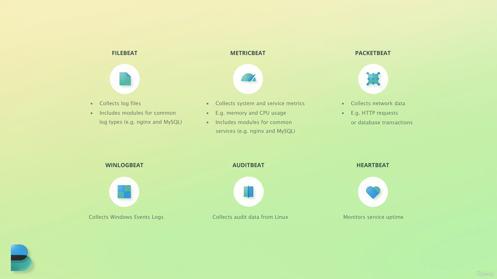
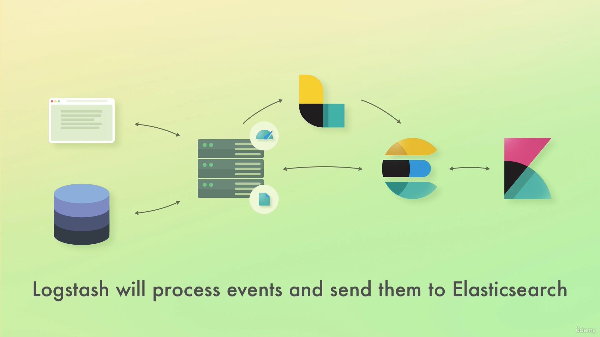

# 1. Introduction

## 1.1. Overview of the Elastic Stack

1. ElasticSearch
2. Kibana
3. LogStash
4. Beats
5. X-Pack

### 1.1.1. Kibana

1. An analytics and visualization platform
2. Dashboard and UI for ElasticSearch
3. Kibana can manage parts of ElasticSearch and LogStash

### 1.1.2. LogStash

1. A data processing pipeline that proceed logs for applications.
2. By combining different plugins, `input`, `filter`, and `output`, we can manipulate data.

   ```
   input {
     file {
       path => "/path/to/apache_access.log"
     }
   }

   filter {
     if [request] in ["/robots.txt", "/favicon.ico] {
       drop { }
     }
   }

   output {
     file {
       path => "%{type}_%{+yyyy_MM_dd}.log"
     }
   }
   ```

3. For example, when reading a log, LogStash reads it as a string such as `184.252.108.229 - joe [20/Sep/2017:13:22:22 +0200] "GET /products/view/123" 200 12798`.
4. The pipeline can process the input and transform to certain schema.
   

### 1.1.3. X-Pack

1. Adding additional features to the ElasticSearch and Kibana.
2. Security (Authentication and Authorization).
   1. Control permissions with fine-grained authorization.
3. Monitoring
   1. Gain insight into how the Elastic stack is running.
4. Alerting
   1. Monitoring on hardware such as CPU usage with certain threshold (e.g. 90%).
5. Reporting
   1. Export Kibana visualization and data.
6. Machine learning
   1. Enables machine learning for ElasticSearch and Kibana.
7. Graph
   1. Analyze the relationship in the data.
   2. Identify uncommonly common signals relevance.
   3. Consider relevance with ElasticSearch.
8. ElasticSearch SQL
   1. Query ElasticSearch with SQL.

### 1.1.4. Beats

1. A collection of data shippers.
   

## 1.2. Walkthrough common architecture

1. Data will be stored both in the database and ElasticSearch.
2. If the existing server has had data in the database, scripts may be required to import data to ElasticSearch.
3. However, other tools may also handle the job.
4. Using beats with server to send data to ElasticSearch.
5. Using LogStash to handle events and send to ElasticSearch.
6. Using Kibana to visualize data.



# 2. Getting Started

## 2.1. Setup ElasticSearch with Docker

1. [https://medium.com/analytics-vidhya/setup-elasticsearch-kibana-via-docker-ce21cf6f5312](https://medium.com/analytics-vidhya/setup-elasticsearch-kibana-via-docker-ce21cf6f5312)
2. The default user name and password is

```yaml
username: elastic
password: password
```

3. Note that if the host Docker is running on a M1 Mac, Docker images with version before `7.0.0` are not available.

```yaml
# docker-compose.yml
version: "3.8"

services:
  elasticsearch:
    image: elasticsearch:7.17.1
    ports:
      - 9200:9200
    environment:
      discovery.type: "single-node"
      xpack.security.enabled: "true"
      ELASTIC_PASSWORD: password
  kibana:
    image: kibana:7.17.1
    volumes:
      - ./kibana.yml:/usr/share/kibana/config/kibana.yml
    ports:
      - 5601:5601
```

```yml
# kibana.yml

# To allow connections from remote users, set this parameter to a non-loopback address.
server.host: "0.0.0.0"
# The URLs of the Elasticsearch instances to use for all your queries.
elasticsearch.hosts: ["http://elasticsearch:9200"]
# If your Elasticsearch is protected with basic authentication, these settings provide
# the username and password that the Kibana server uses to perform maintenance on the Kibana
# index at startup. Your Kibana users still need to authenticate with Elasticsearch, which
# is proxied through the Kibana server.
elasticsearch.username: "elastic"
elasticsearch.password: "password"
```

## 2.2. Understanding the basic architecture

1. A cluster can have multiple nodes which is an instance of ElasticSearch.
2. Nodes within the same cluster are grouped and can communicate to each other to work on different tasks.
3. In most cases, 1 cluster is enough. Though it's possible to search across clusters, it's very rare to do so.
4. When a node is initiated, a cluster is also created to bind it.
5. Each unit of data stored is called a `document`.
6. Documents are JSON objects. When data is given to ElasticSearch, it will be stored with some other metadata according to configuration.
7. Every document in ElasticSearch is stored in an index.
8. An index is a collection of documents.

### 2.2.1. Summary

1. Nodes store the data that we want to ElasticSearch.
2. A cluster is a collection of nodes.
3. Data is stored as `documents`, which are JSON objects.
4. Documents are grouped together with indices.

## 2.3. Inspecting cluster

1. After getting in to Kibana, we can check on the side panel and go `Dev Tools`.
   
2. The endpoint domain is configured in Kibana configuration which is not required to make a call. We can check from the `Kibana.yml` settings in [Setup ElasticSearch with Docker](#21-setup-elasticsearch-with-docker)
3. For example, we can check on the cluster's health. `GET /_cluster/health`.
4. In ElasticSearch, an API starts with an underscore `_` (e.g. `_cluster`), while `health` is the command.

```json
// response from /_cluster/health
{
  "cluster_name": "docker-cluster",
  "status": "green",
  "timed_out": false,
  "number_of_nodes": 1,
  "number_of_data_nodes": 1,
  "active_primary_shards": 10,
  "active_shards": 10,
  "relocating_shards": 0,
  "initializing_shards": 0,
  "unassigned_shards": 0,
  "delayed_unassigned_shards": 0,
  "number_of_pending_tasks": 0,
  "number_of_in_flight_fetch": 0,
  "task_max_waiting_in_queue_millis": 0,
  "active_shards_percent_as_number": 100.0
}
```

5. There are other APIs we can interact with, such as `_cat` (compact aligned text).
6. Note that different versions of ElasticSearch may have different results and output.
7. Indices prefixed with a period `.` are hidden by default like system file.

```bash
# response from /_cat/nodes?v
ip         heap.percent ram.percent cpu load_1m load_5m load_15m node.role   master name
172.20.0.2           15          94   2    0.04    0.05     0.06 cdfhilmrstw *      5ca58ab5ef75
```

```bash
# response /_cat/indices?v
health status index                           uuid                   pri rep docs.count docs.deleted store.size pri.store.size
green  open   .geoip_databases                IK5TpdZ_RV6goHQxzEJJIg   1   0         42            0     40.4mb         40.4mb
green  open   .security-7                     XgdVskMmQ22QVSDOv1cpBA   1   0         53            0    226.8kb        226.8kb
green  open   .apm-custom-link                Fsp_WB-WRomZPuI9HCjOtg   1   0          0            0       226b           226b
green  open   .apm-agent-configuration        qWJ3k50NQ6CRWbRbbl3iNg   1   0          0            0       226b           226b
green  open   .kibana_task_manager_7.17.1_001 IEZEhBc1Rh-HGbHzspQvzg   1   0         18         3361    483.9kb        483.9kb
green  open   .kibana_7.17.1_001              HDqB4wxmSryfHP7Bs4akCQ   1   0         30           15      4.7mb          4.7mb
```

```bash
# response /_cat/indices?v&expand_wildcards=all
health status index                                                         uuid                   pri rep docs.count docs.deleted store.size pri.store.size
green  open   .geoip_databases                                              IK5TpdZ_RV6goHQxzEJJIg   1   0         42            0     40.4mb         40.4mb
green  open   .security-7                                                   XgdVskMmQ22QVSDOv1cpBA   1   0         53            0    226.8kb        226.8kb
green  open   .apm-custom-link                                              Fsp_WB-WRomZPuI9HCjOtg   1   0          0            0       226b           226b
green  open   .kibana-event-log-7.17.1-000001                               L9loky-HRB-z_2njbjh-Zw   1   0          1            0        6kb            6kb
green  open   .apm-agent-configuration                                      qWJ3k50NQ6CRWbRbbl3iNg   1   0          0            0       226b           226b
green  open   .kibana_security_session_1                                    FYbE0xVPSnOeSTVGJq_4uA   1   0          1            0        5kb            5kb
green  open   .kibana_task_manager_7.17.1_001                               IEZEhBc1Rh-HGbHzspQvzg   1   0         18         3390    516.2kb        516.2kb
green  open   .kibana_7.17.1_001                                            HDqB4wxmSryfHP7Bs4akCQ   1   0         30           17      4.8mb          4.8mb
green  open   .ds-.logs-deprecation.elasticsearch-default-2023.10.11-000001 r07lU-IARrSijIZ4luEpVg   1   0          1            0     10.4kb         10.4kb
green  open   .ds-ilm-history-5-2023.10.11-000001                           DsGvg8r3TASU0gL5KzmeUw   1   0          9            0     27.5kb         27.5kb
```

## 2.4. Sending queries with cURL

1. We can try connecting with `cURL`.
2. According to the version of ElasticSearch, it may return an empty reply.
3. Since ver. `8.0.0`, ElasticSearch uses TLS connection by default.
4. In the very first request, it may be denied as local ElasticSearch uses self-signed certificate which is not trusted by the HTTP client.
5. One workaround is to use `cURL`'s `--insecure` flag.
6. The other solution is to pass the local certificate to `cURL` using `--cacert [cert_path]` flag
7. However, the request is denied with `401` as we don't pass token in the request header.
8. We can use `-u` flag to pass username.
9. When we query the endpoint, `cURL` will prompt to collect user password.
10. We can pass password directly after username with a column `:`.
11. To send a request to query indices, we can use `-d` flag to mock submitting a form request in `cURL` which adds `Content-Type: application/x-www-form-urlencoded` in header.
12. Note that for `cURL` on Windows OS, it doesn't accept single quote `'`, we need to wrap the JSON object with double quotes and escape all the double quotes in between.
13. Since we are sending payload as a JSON object, we need to specify the content type as `application/json`.
14. We can use `-H` flag to specify the content type in request header.
15. In this case, we may get a not found exception because we just had the brand new ElasticSearch without any index.

```bash
# elasticsearch may have a self-signed certificate in local config
curl --cacert config/certs/http_ca.crt -u elastic:password -X GET -H "Content-Type:application/json" https://localhost:9200/products/_search -d '{ "query": { "match_all": { } } }'
```

## 2.5. Sharding and Scalability

1. Sharding
   1. Sharding is a way to divide indices into smaller pieces.
   2. Each piece is referred to as a `shard`.
   3. Sharding is done at the index level.
   4. The main purpose is to horizontally scale the data volume.
2. In a case that an index has data about 1TB, while a single node can have only up to 500GB.
   1. It needs at least `2` nodes to contain all data of the index.
   2. We can divide the index into `2` (or more) shards and host with each of them on different node.
   3. Besides, a node can host more than 1 shard from the same index.
3. Deeper in sharding
   1. A shard is an independent index (subset of an index).
   2. Each shard is an Apache Lucene index.
   3. An ElasticSearch index consists of one or more Lucene indices.
   4. A shard has no predefined size; it grows as documents are added to it.
   5. A shard may store up to about `2 billion` documents.
4. Purpose of sharding
   1. Mainly to be able to store more documents.
   2. To easier fit large indices onto nodes.
   3. Improved performance
      1. Parallelization of queries increases the throughput of an index.
5. When checking on `GET /_cat/indices?v`, we can get data with a property `pri` which is for primary shards.
6. Configuring the number of shards
   1. An index contains a single shard by default
   2. Indices in ElasticSearch < `7.0.0` were created with 5 shards
      1. This often led to over-sharding.
   3. Increase the number of shards with the `Split` API.
   4. Reduce the number of shards with the `Shrink` API.

### 2.5.1. Summary

1. Sharding splits indices into smaller pieces.
2. Sharding increases the number of documents an index can store.
3. Sharding makes it easier to fit large indices onto nodes.
4. Sharding may improve query throughput.
5. An index defaults to having one shard.
6. Add a couple of shards for large indices; otherwise use default settings.

## 2.6. Understanding replication

1. Introduction to replication
   1. What happens if a node's hard drive fails?
   2. Hardware can fail at any time, so we need to handle that somehow.
   3. ElasticSearch supports replication for fault tolerance.
   4. Replication is supported natively and enabled by default.
   5. With many databases, setting up replication can be a pain.
   6. Replication is extremely easy with ElasticSearch.
2. How does replication work?
   1. Replication is configured at the index level.
   2. Replication works by creating copies of shards, referred to as `replica` shard.
   3. A shard that has been replicated, is called a `primary` shard.
   4. A primary shard and its replica shards are referred to as a `plication` group.
   5. Replica shards are a complete copy of shard.
   6. A replica shard can serve search requests, exactly like its primary shard.
   7. The number of replicas can be configured at index creation.
3. In common cases to boost availability, replica shards are not stored on the same node of its primary shard.
4. During development, we may have only a single node to function. In this case, replica shards may be created but being unassigned.
5. Concerns for choosing the number of replica shards
   1. How many replica shards are ideal, depends on the use case.
   2. E.g. is the data stored elsewhere, such as in a RDBMS?
   3. Is it ok for data to be unavailable while you restore it?
   4. For mission critical systems, downtime is not acceptable.
   5. Replicate shards once if data loss is not a disaster.
   6. For critical systems, data should be replicated at least twice.

### 2.6.1. Snapshots

1. ElasticSearch supports taking snapshot as backups.
2. Snapshots can be used to restore to a given point in time.
3. Snapshots can be taken at the index level, or for the entire cluster.
4. Use snapshots for backups, and replication for high availability (and performance).
5. Snapshots replicate and copy data at a specific time and serve different purposes as replicate shards.
6. Replicate shards will be synced and modified with the primary shard and serve the latest change.
7. In a case that database is migrating or have specific upgrade.
8. If the final output has any unexpected issue, we can roll it back to certain version by using snapshot.

### 2.6.2. Increasing query throughput

1. To improve traffic handling throughput, we can spin up a different node and host a replicate shard(s).
2. Note that we can have the same replicate shards in a single node, while having the primary shard in the other.
3. Replica shards of a replication group can serve different search requests simultaneously.
   1. This increases the number of requests that can be handled at the same time.
4. ElasticSearch intelligently routes requests to the best shard.
5. CPU parallelization improves performance if multiple replica shards are stored on the same node.

## 2.7. First task on index and shard

1. In the `Dev Tools` on Kibana, we can put `PUT /pages` to create a new index `pages` and keep its default configuration.
2. When we check on `GET /_cluster/health`, we may notice that the `cluster` status becomes `yellow`.
3. We can check from `GET /_cat/indices?v` and notice that there's a `pages` replica that is not assigned to any node.
4. We can check `GET /_cat/shards?v` to get a list of shards.
5. We can notice that through a `pages` primary shard has been `STARTED`, the replica is `UNASSIGNED`.

```bash
# response from /_cat/shards?v
index                                                         shard prirep state      docs   store ip         node
.kibana_security_session_1                                    0     p      STARTED                 172.20.0.2 5ca58ab5ef75
.geoip_databases                                              0     p      STARTED      42  40.4mb 172.20.0.2 5ca58ab5ef75
pages                                                         0     p      STARTED       0    226b 172.20.0.2 5ca58ab5ef75
pages                                                         0     r      UNASSIGNED
.ds-.logs-deprecation.elasticsearch-default-2023.10.11-000001 0     p      STARTED                 172.20.0.2 5ca58ab5ef75
.apm-agent-configuration                                      0     p      STARTED       0    226b 172.20.0.2 5ca58ab5ef75
.security-7                                                   0     p      STARTED      53 226.8kb 172.20.0.2 5ca58ab5ef75
.kibana-event-log-7.17.1-000001                               0     p      STARTED                 172.20.0.2 5ca58ab5ef75
.apm-custom-link                                              0     p      STARTED       0    226b 172.20.0.2 5ca58ab5ef75
.kibana_task_manager_7.17.1_001                               0     p      STARTED      18   5.2mb 172.20.0.2 5ca58ab5ef75
.ds-ilm-history-5-2023.10.11-000001                           0     p      STARTED                 172.20.0.2 5ca58ab5ef75
.kibana_7.17.1_001                                            0     p      STARTED      41   4.7mb 172.20.0.2 5ca58ab5ef75
```

6. To resolve the `yellow` status of cluster, we need to create a new node to assign `pages` replica in this case.

### 2.7.1. Kibana indices

1. Kibana indices are those start with `.kibana` which are system config and would be hidden by default.
2. Though they have `0` replica when there's a single node at the first place, they will be replicated automatically when more nodes are added to the cluster.
3. This behaviors is configured by the setting `auto_expand_replicas`, so when a node is added to the cluster, the shard will be replicated.

### 2.7.2. Summary

1. Replication is used to ensure high availability for indices.
2. A side benefit is increased query throughput.
3. Replication works by copying a given shard's data.
4. A replica shard is never stored on the same node as its primary shard.
5. Replicate shards once if your system isn't critical; replicate at least twice if your system is mission critical.
6. Snapshots can be taken as backups of specific indices, or the whole cluster.

## 2.8. Adding more nodes to the cluster

### 2.8.1. Side notes

1. Sharding enables us to scale an index' data volume.
   1. But eventually we will need to add additional nodes.
   2. Also, replication requires at least two nodes.
2. In this lecture, we will add 2 more nodes to our cluster.
3. This approach may not work if ElasticSearch is deployed on cloud service.

### 2.8.2. Configuration

1. System indices are configured as follows: `index.auto_expand_replicas: 0-1`.
2. In the elasticsearch instance directory, we can find the setting file `/config/elasticsearch.yml`.
3. Set up multi-node with Docker
   1. ver. `7.17` - [https://www.elastic.co/guide/en/elasticsearch/reference/7.17/docker.html#next-getting-started-tls-docker](https://www.elastic.co/guide/en/elasticsearch/reference/7.17/docker.html#next-getting-started-tls-docker)
   2. ver. `8.12` - [https://www.elastic.co/guide/en/elasticsearch/reference/8.12/docker.html#next-getting-started-tls-docker](https://www.elastic.co/guide/en/elasticsearch/reference/8.12/docker.html#next-getting-started-tls-docker)
4. Note that there's a different setup between ver. `7.x` and `8.x` that new nodes need **enrollment-token** from the master node to be added to the same cluster.
5. NOTE THAT this is only for dev setup without proper configuration and security. 

```yml
# docker-compose.yml
version: '3.8'

services:
  es01:
    image: elasticsearch:7.17.1
    container_name: es01
    environment:
      # discovery.type: 'single-node'
      - node.name=es01
      - cluster.name=es-docker-cluster
      - discovery.seed_hosts=es02,es03
      - cluster.initial_master_nodes=es01,es02,es03
      - bootstrap.memory_lock=true
      - 'ES_JAVA_OPTS=-Xms512m -Xmx512m'
      - ELASTIC_PASSWORD=password
    ports:
      - 9200:9200
    ulimits:
      memlock:
        soft: -1
        hard: -1
    volumes:
      - data01:/usr/share/elasticsearch/data
    networks:
      - elastic
  es02:
    image: elasticsearch:7.17.1
    container_name: es02
    environment:
      - node.name=es02
      - cluster.name=es-docker-cluster
      - discovery.seed_hosts=es01,es03
      - cluster.initial_master_nodes=es01,es02,es03
      - bootstrap.memory_lock=true
      - 'ES_JAVA_OPTS=-Xms512m -Xmx512m'
      - ELASTIC_PASSWORD=password
    ulimits:
      memlock:
        soft: -1
        hard: -1
    volumes:
      - data02:/usr/share/elasticsearch/data
    networks:
      - elastic
  es03:
    image: elasticsearch:7.17.1
    container_name: es03
    environment:
      - node.name=es03
      - cluster.name=es-docker-cluster
      - discovery.seed_hosts=es01,es02
      - cluster.initial_master_nodes=es01,es02,es03
      - bootstrap.memory_lock=true
      - 'ES_JAVA_OPTS=-Xms512m -Xmx512m'
      - ELASTIC_PASSWORD=password
    ulimits:
      memlock:
        soft: -1
        hard: -1
    volumes:
      - data03:/usr/share/elasticsearch/data
    networks:
      - elastic
  kibana:
    image: kibana:7.17.1
    volumes:
      - ./kibana.yml:/usr/share/kibana/config/kibana.yml
    ports:
      - 5601:5601
    networks:
      - elastic
volumes:
  data01:
    driver: local
  data02:
    driver: local
  data03:
    driver: local
networks:
  elastic:
    driver: bridge
```

```yml
# kibana.yml
server.host: '0.0.0.0'
# point to main node by container name
elasticsearch.hosts: ['http://es01:9200']
elasticsearch.username: 'elastic'
elasticsearch.password: 'password'
```

## 2.9. Overview of node roles
### 2.9.1. Node roles
1. Master-eligible
   1. Configuration `node.master: true | false`.
   2. The node may be elected as the cluster's master node.
   3. A master node is responsible for creating and deleting indices, among others. 
   4. A node with this role will not automatically become the master node.
      1. Unless there is no other master-eligible nodes.
   5. May be used for having dedicated master nodes.
      1. Useful for large clusters.
2. Data
   1. Configuration `node.data: true | false`.
   2. Enables a node to store data
   3. Storing data includes performing queries related to that data, such as search queries.
   4. For relatively small clusters, this role is almost always enabled. 
   5. Useful for having dedicated master nodes.
   6. Used as part of configuring a dedicated master node. 
3. Ingest
   1. Configuration `node.ingest: true | false`.
   2. Enables a node to run ingest pipelines
   3. Ingest pipelines are a series of steps (processors) that are performed when indexing documents.
      1. Processors may manipulate documents, e.g. resolving an IP to lat/lon. 
   4. A simplified version of Logstash, directly within Elasticsearch. 
4. Machine learning
   1. Configuration
      1. `node.ml: true | false`
      2. `xpack.ml.enabled: true | false`
   2. `node.ml` identifies a node as a machine learning node. 
      1. This lets the node run machine learning jobs
   3. `xpack.ml.enabled` enables or disables the machine learning API for the node. 
   4. Useful for running ML jobs that don't affect other tasks. 
5. Coordination
   1. Configuration
      1. `node.master: false`
      2. `node.data: false`
      3. `node.ingest: false`
      4. `node.ml: false`
      5. `xpack.ml.enabled: false`
   2. Coordination refers to the distribution of queries and the aggregation of results. 
   3. Useful for coordination nodes (for large clusters)
   4. Configured by disabling all other roles
6. Voting-only
   1. Configuration `node.voting_only: true | false`.
   2. Rarely used, and you almost certainly won't use it either.
   3. A node with this role, will participate in the voting for a new master node.
   4. The node cannot be elected as the master node itself.
   5. Only used for large clusters. 

### 2.9.2. Checking node list 
1. We can check from `GET /_cat/nodes?v` to get list of connected nodes in the cluster. 
2. `node.role` shows what the roles of node has. For example, if there's `dim`, which means `data`, `ingest`, `master`. 
3. However, we don't specify the roles in the `docker-compose` so it may take all the eligible roles for this case as `cdfhilmrstw`.
4. Note that if all nodes have `master` role, each of them can be elected as the master node. 

```bash
ip         heap.percent ram.percent cpu load_1m load_5m load_15m node.role   master name
172.21.0.2           65          91   0    0.22    0.17     0.15 cdfhilmrstw *      es03
172.21.0.5           59          91   0    0.22    0.17     0.15 cdfhilmrstw -      es02
172.21.0.3           46          91   0    0.22    0.17     0.15 cdfhilmrstw -      es01
```

5. When to change node roles?
   1. It **depends**.
   2. Useful for large clusters.
   3. Typically done when optimizing the cluster to scale the number of requests.
   4. You will often times change other things first. 
      1. E.g. the number of nodes, shards, replica shards, etc.
   5. Better understand what hardware resources are used for.
   6. Only change roles if you know what you are doing. 

# 3. Managing Documents
## 3.1. Creating and deleting indices
1. In Kibana, we can use `PUT /:index` to create a an index and use `DELETE /:index` to delete an index. 
2. Besides, we can pass a payload to configure the new index

```json
// PUT /products
{
   "settings": {
      "number_of_shards": 2,
      "number_of_replicas": 2
   }
}
```

## 3.2. Indexing document
1. To create a document for an index, we can `POST /:index` with payload for document contents.
2. Note that as we set up `2` shards for the index with `2` replicas, the document is distributed to `1` shard with `2` replicas which gives `_shard` as `3`.

   ```json
   // POST /products/_doc
   {
      "name": "Coffee Maker",
      "price": 64,
      "in_stock": 10
   }

   // response
   {
      "_index" : "products",
      "_type" : "_doc",
      "_id" : "9HNK0Y0BmvAMMQPLQVyL",
      "_version" : 1,
      "result" : "created",
      "_shards" : {
         "total" : 3,
         "successful" : 3,
         "failed" : 0
      },
      "_seq_no" : 0,
      "_primary_term" : 1
   }
   ```
3. Besides, we can specify ID for the document as `POST /:index/:id`

   ```json
   // POST /products/_doc/100
   {
   "name": "Toaster",
   "price": 49,
   "in_stock": 4
   }

   // response
   {
      "_index" : "products",
      "_type" : "_doc",
      "_id" : "100",
      "_version" : 1,
      "result" : "created",
      "_shards" : {
         "total" : 3,
         "successful" : 3,
         "failed" : 0
      },
      "_seq_no" : 1,
      "_primary_term" : 1
   }
   ```

## 3.3. Retrieving documents by ID
1. We can simply use `GET /:index/_doc/:id` to retrieve specific document with given `id`. 
2. There's `found` property in the response which indicates if the document exists. 
   ```json
   // GET /products/_doc/100
   {
      "_index" : "products",
      "_type" : "_doc",
      "_id" : "100",
      "_version" : 1,
      "_seq_no" : 1,
      "_primary_term" : 1,
      "found" : true,
      "_source" : {
         "name" : "Toaster",
         "price" : 49,
         "in_stock" : 4
         }
   }

   // GET /products/_doc/10
   // not_found document
   {
      "_index" : "products",
      "_type" : "_doc",
      "_id" : "10",
      "found" : false
   }
   ```

## 3.4. Updating documents
1. To update a document, we can `POST /:index/_update/:id` with payload.
2. A `result` property is in the response indicating that the document is updated.
   
   ```json
   // POST /products/_update/100
   {
      "doc": {
         "in_stock": 3
      }
   }

   // response
   {
      "_index" : "products",
      "_type" : "_doc",
      "_id" : "100",
      "_version" : 2,
      "result" : "updated",
      "_shards" : {
         "total" : 3,
         "successful" : 3,
         "failed" : 0
      },
      "_seq_no" : 2,
      "_primary_term" : 1
   }
   ```
3. Note that documents in Elasticsearch are immutable.
4. We actually replaced documents in this lecture. 
5. The Update API did some things for us, making it look like we updated documents. 
6. The Update API is simpler and saves some network traffic. 
7. How the Update API works
   1. The current document is retrieved. 
   2. THe field values are changed. 
   3. The existing document is replaced with the modified document. 
   4. We could do the exact same thing at the application level. 

## 3.5. Scripted updates
1. Rather than updating on the `doc`, we can use `script` to update a document by passing `script` in the payload. 
2. In this case, we check from the `source` in the context `ctx` and reduce `in_stock` property of the document with `--`. 
3. We can on the other hand increase `in_stock` with `++`. 
4. In addition, we can directly assign a number to `in_stock`. 

   ```json
   // POST /products/_update/100
   {
   "script": {
      "source": "ctx._source.in_stock--",
      "source": "ctx._source.in_stock = 10",
   }
   }

   //response 
   {
   "_index" : "products",
   "_type" : "_doc",
   "_id" : "100",
   "_version" : 3,
   "result" : "updated",
   "_shards" : {
      "total" : 3,
      "successful" : 3,
      "failed" : 0
   },
   "_seq_no" : 3,
   "_primary_term" : 2
   }
   ```

5. Besides regular assigning values, we can have expression in the script. 

   ```json
   // POST /products/_update/100
   {
   "script": {
      "source": "ctx._source.in_stock -= params.quantity",
      "params": {
         "quantity": 4
      }
   }
   }
   ```

6. `script` also accepts multi-line with `if/else` condition. We can wrap the code snippet with triple double quotes `"""`
```json
// POST /products/_update/100
{
   "script": {
      "source": """
      if (ctx._source.in_stock == 0) {
         ctx.op = 'noop';
      }

      ctx._source.in_stock--;
      """
   }
}

{
   "script": {
      "source": """
      if (ctx._source.in_stock > 0) {
         ctx._source.in_stock--;
      }      
      """
   }
}

{
   "script": {
      "source": """
      if (ctx._source.in_stock <= 1) {
         ctx.op = 'delete';
      }

      ctx._source.in_stock--;
      """
   }
}
```