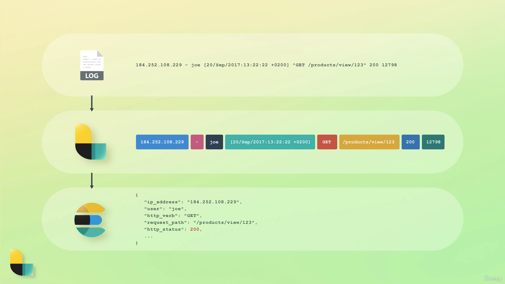

# 1. Introduction

## 1.1. Overview of the Elastic Stack

1. ElasticSearch
2. Kibana
3. LogStash
4. Beats
5. X-Pack

### 1.1.1. Kibana

1. An analytics and visualization platform
2. Dashboard and UI for ElasticSearch
3. Kibana can manage parts of ElasticSearch and LogStash

### 1.1.2. LogStash

1. A data processing pipeline that proceed logs for applications.
2. By combining different plugins, `input`, `filter`, and `output`, we can manipulate data.

   ```
   input {
     file {
       path => "/path/to/apache_access.log"
     }
   }

   filter {
     if [request] in ["/robots.txt", "/favicon.ico] {
       drop { }
     }
   }

   output {
     file {
       path => "%{type}_%{+yyyy_MM_dd}.log"
     }
   }
   ```

3. For example, when reading a log, LogStash reads it as a string such as `184.252.108.229 - joe [20/Sep/2017:13:22:22 +0200] "GET /products/view/123" 200 12798`.
4. The pipeline can process the input and transform to certain schema.
   

### 1.1.3. X-Pack

1. Adding additional features to the ElasticSearch and Kibana.
2. Security (Authentication and Authorization).
   1. Control permissions with fine-grained authorization.
3. Monitoring
   1. Gain insight into how the Elastic stack is running.
4. Alerting
   1. Monitoring on hardware such as CPU usage with certain threshold (e.g. 90%).
5. Reporting
   1. Export Kibana visualization and data.
6. Machine learning
   1. Enables machine learning for ElasticSearch and Kibana.
7. Graph
   1. Analyze the relationship in the data.
   2. Identify uncommonly common signals relevance.
   3. Consider relevance with ElasticSearch.
8. ElasticSearch SQL
   1. Query ElasticSearch with SQL.

### 1.1.4. Beats

1. A collection of data shippers.
   

## 1.2. Walkthrough common architecture

1. Data will be stored both in the database and ElasticSearch.
2. If the existing server has had data in the database, scripts may be required to import data to ElasticSearch.
3. However, other tools may also handle the job.
4. Using beats with server to send data to ElasticSearch.
5. Using LogStash to handle events and send to ElasticSearch.
6. Using Kibana to visualize data.


# 2. Getting Started

## 2.1. Setup ElasticSearch with Docker

1. [https://medium.com/analytics-vidhya/setup-elasticsearch-kibana-via-docker-ce21cf6f5312](https://medium.com/analytics-vidhya/setup-elasticsearch-kibana-via-docker-ce21cf6f5312)
2. The default user name and password is

```yaml
username: elastic
password: password
```

3. Note that if the host Docker is running on a M1 Mac, Docker images with version before `7.0.0` are not available.

```yaml
# docker-compose.yml
version: "3.8"

services:
  elasticsearch:
    image: elasticsearch:7.17.1
    ports:
      - 9200:9200
    environment:
      discovery.type: "single-node"
      xpack.security.enabled: "true"
      ELASTIC_PASSWORD: password
  kibana:
    image: kibana:7.17.1
    volumes:
      - ./kibana.yml:/usr/share/kibana/config/kibana.yml
    ports:
      - 5601:5601
```

```yml
# kibana.yml

# To allow connections from remote users, set this parameter to a non-loopback address.
server.host: "0.0.0.0"
# The URLs of the Elasticsearch instances to use for all your queries.
elasticsearch.hosts: ["http://elasticsearch:9200"]
# If your Elasticsearch is protected with basic authentication, these settings provide
# the username and password that the Kibana server uses to perform maintenance on the Kibana
# index at startup. Your Kibana users still need to authenticate with Elasticsearch, which
# is proxied through the Kibana server.
elasticsearch.username: "elastic"
elasticsearch.password: "password"
```

## 2.2. Understanding the basic architecture

1. A cluster can have multiple nodes which is an instance of ElasticSearch.
2. Nodes within the same cluster are grouped and can communicate to each other to work on different tasks.
3. In most cases, 1 cluster is enough. Though it's possible to search across clusters, it's very rare to do so.
4. When a node is initiated, a cluster is also created to bind it.
5. Each unit of data stored is called a `document`.
6. Documents are JSON objects. When data is given to ElasticSearch, it will be stored with some other metadata according to configuration.
7. Every document in ElasticSearch is stored in an index.
8. An index is a collection of documents.

### 2.2.1. Summary

1. Nodes store the data that we want to ElasticSearch.
2. A cluster is a collection of nodes.
3. Data is stored as `documents`, which are JSON objects.
4. Documents are grouped together with indices.

# 3. Inspecting cluster

1. After getting in to Kibana, we can check on the side panel and go `Dev Tools`.
   
2. The endpoint domain is configured in Kibana configuration which is not required to make a call. We can check from the `Kibana.yml` settings in [Setup ElasticSearch with Docker](#21-setup-elasticsearch-with-docker)
3. For example, we can check on the cluster's health. `GET /_cluster/health`.
4. In ElasticSearch, an API starts with an underscore `_` (e.g. `_cluster`), while `health` is the command.

```json
// response from /_cluster/health
{
  "cluster_name": "docker-cluster",
  "status": "green",
  "timed_out": false,
  "number_of_nodes": 1,
  "number_of_data_nodes": 1,
  "active_primary_shards": 10,
  "active_shards": 10,
  "relocating_shards": 0,
  "initializing_shards": 0,
  "unassigned_shards": 0,
  "delayed_unassigned_shards": 0,
  "number_of_pending_tasks": 0,
  "number_of_in_flight_fetch": 0,
  "task_max_waiting_in_queue_millis": 0,
  "active_shards_percent_as_number": 100.0
}
```

5. There are other APIs we can interact with, such as `_cat` (compact aligned text).
6. Note that different versions of ElasticSearch may have different results and output.
7. Indices prefixed with a period `.` are hidden by default like system file.

```bash
# response from /_cat/nodes?v
ip         heap.percent ram.percent cpu load_1m load_5m load_15m node.role   master name
172.20.0.2           15          94   2    0.04    0.05     0.06 cdfhilmrstw *      5ca58ab5ef75
```

```bash
# response /_cat/indices?v
health status index                           uuid                   pri rep docs.count docs.deleted store.size pri.store.size
green  open   .geoip_databases                IK5TpdZ_RV6goHQxzEJJIg   1   0         42            0     40.4mb         40.4mb
green  open   .security-7                     XgdVskMmQ22QVSDOv1cpBA   1   0         53            0    226.8kb        226.8kb
green  open   .apm-custom-link                Fsp_WB-WRomZPuI9HCjOtg   1   0          0            0       226b           226b
green  open   .apm-agent-configuration        qWJ3k50NQ6CRWbRbbl3iNg   1   0          0            0       226b           226b
green  open   .kibana_task_manager_7.17.1_001 IEZEhBc1Rh-HGbHzspQvzg   1   0         18         3361    483.9kb        483.9kb
green  open   .kibana_7.17.1_001              HDqB4wxmSryfHP7Bs4akCQ   1   0         30           15      4.7mb          4.7mb
```

```bash
# response /_cat/indices?v&expand_wildcards=all
health status index                                                         uuid                   pri rep docs.count docs.deleted store.size pri.store.size
green  open   .geoip_databases                                              IK5TpdZ_RV6goHQxzEJJIg   1   0         42            0     40.4mb         40.4mb
green  open   .security-7                                                   XgdVskMmQ22QVSDOv1cpBA   1   0         53            0    226.8kb        226.8kb
green  open   .apm-custom-link                                              Fsp_WB-WRomZPuI9HCjOtg   1   0          0            0       226b           226b
green  open   .kibana-event-log-7.17.1-000001                               L9loky-HRB-z_2njbjh-Zw   1   0          1            0        6kb            6kb
green  open   .apm-agent-configuration                                      qWJ3k50NQ6CRWbRbbl3iNg   1   0          0            0       226b           226b
green  open   .kibana_security_session_1                                    FYbE0xVPSnOeSTVGJq_4uA   1   0          1            0        5kb            5kb
green  open   .kibana_task_manager_7.17.1_001                               IEZEhBc1Rh-HGbHzspQvzg   1   0         18         3390    516.2kb        516.2kb
green  open   .kibana_7.17.1_001                                            HDqB4wxmSryfHP7Bs4akCQ   1   0         30           17      4.8mb          4.8mb
green  open   .ds-.logs-deprecation.elasticsearch-default-2023.10.11-000001 r07lU-IARrSijIZ4luEpVg   1   0          1            0     10.4kb         10.4kb
green  open   .ds-ilm-history-5-2023.10.11-000001                           DsGvg8r3TASU0gL5KzmeUw   1   0          9            0     27.5kb         27.5kb
```
