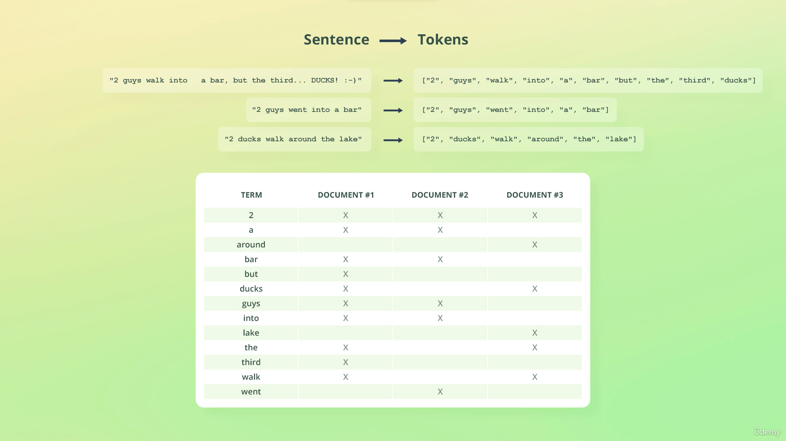

# 1. Introduction

## 1.1. Overview of the Elastic Stack

1. ElasticSearch
2. Kibana
3. LogStash
4. Beats
5. X-Pack

### 1.1.1. Kibana

1. An analytics and visualization platform
2. Dashboard and UI for ElasticSearch
3. Kibana can manage parts of ElasticSearch and LogStash

### 1.1.2. LogStash

1. A data processing pipeline that proceed logs for applications.
2. By combining different plugins, `input`, `filter`, and `output`, we can manipulate data.

   ```
   input {
     file {
       path => "/path/to/apache_access.log"
     }
   }

   filter {
     if [request] in ["/robots.txt", "/favicon.ico] {
       drop { }
     }
   }

   output {
     file {
       path => "%{type}_%{+yyyy_MM_dd}.log"
     }
   }
   ```

3. For example, when reading a log, LogStash reads it as a string such as `184.252.108.229 - joe [20/Sep/2017:13:22:22 +0200] "GET /products/view/123" 200 12798`.
4. The pipeline can process the input and transform to certain schema.
   

### 1.1.3. X-Pack

1. Adding additional features to the ElasticSearch and Kibana.
2. Security (Authentication and Authorization).
   1. Control permissions with fine-grained authorization.
3. Monitoring
   1. Gain insight into how the Elastic stack is running.
4. Alerting
   1. Monitoring on hardware such as CPU usage with certain threshold (e.g. 90%).
5. Reporting
   1. Export Kibana visualization and data.
6. Machine learning
   1. Enables machine learning for ElasticSearch and Kibana.
7. Graph
   1. Analyze the relationship in the data.
   2. Identify uncommonly common signals relevance.
   3. Consider relevance with ElasticSearch.
8. ElasticSearch SQL
   1. Query ElasticSearch with SQL.

### 1.1.4. Beats

1. A collection of data shippers.
   

## 1.2. Walkthrough common architecture

1. Data will be stored both in the database and ElasticSearch.
2. If the existing server has had data in the database, scripts may be required to import data to ElasticSearch.
3. However, other tools may also handle the job.
4. Using beats with server to send data to ElasticSearch.
5. Using LogStash to handle events and send to ElasticSearch.
6. Using Kibana to visualize data.


# 2. Getting Started

## 2.1. Setup ElasticSearch with Docker

1. [https://medium.com/analytics-vidhya/setup-elasticsearch-kibana-via-docker-ce21cf6f5312](https://medium.com/analytics-vidhya/setup-elasticsearch-kibana-via-docker-ce21cf6f5312)
2. The default user name and password is

```yaml
username: elastic
password: password
```

3. Note that if the host Docker is running on a M1 Mac, Docker images with version before `7.0.0` are not available.

```yaml
# docker-compose.yml
version: "3.8"

services:
  elasticsearch:
    image: elasticsearch:7.17.1
    ports:
      - 9200:9200
    environment:
      discovery.type: "single-node"
      xpack.security.enabled: "true"
      ELASTIC_PASSWORD: password
  kibana:
    image: kibana:7.17.1
    volumes:
      - ./kibana.yml:/usr/share/kibana/config/kibana.yml
    ports:
      - 5601:5601
```

```yml
# kibana.yml

# To allow connections from remote users, set this parameter to a non-loopback address.
server.host: "0.0.0.0"
# The URLs of the Elasticsearch instances to use for all your queries.
elasticsearch.hosts: ["http://elasticsearch:9200"]
# If your Elasticsearch is protected with basic authentication, these settings provide
# the username and password that the Kibana server uses to perform maintenance on the Kibana
# index at startup. Your Kibana users still need to authenticate with Elasticsearch, which
# is proxied through the Kibana server.
elasticsearch.username: "elastic"
elasticsearch.password: "password"
```

## 2.2. Understanding the basic architecture

1. A cluster can have multiple nodes which is an instance of ElasticSearch.
2. Nodes within the same cluster are grouped and can communicate to each other to work on different tasks.
3. In most cases, 1 cluster is enough. Though it's possible to search across clusters, it's very rare to do so.
4. When a node is initiated, a cluster is also created to bind it.
5. Each unit of data stored is called a `document`.
6. Documents are JSON objects. When data is given to ElasticSearch, it will be stored with some other metadata according to configuration.
7. Every document in ElasticSearch is stored in an index.
8. An index is a collection of documents.

### 2.2.1. Summary

1. Nodes store the data that we want to ElasticSearch.
2. A cluster is a collection of nodes.
3. Data is stored as `documents`, which are JSON objects.
4. Documents are grouped together with indices.

## 2.3. Inspecting cluster

1. After getting in to Kibana, we can check on the side panel and go `Dev Tools`.
   
2. The endpoint domain is configured in Kibana configuration which is not required to make a call. We can check from the `Kibana.yml` settings in [Setup ElasticSearch with Docker](#21-setup-elasticsearch-with-docker)
3. For example, we can check on the cluster's health. `GET /_cluster/health`.
4. In ElasticSearch, an API starts with an underscore `_` (e.g. `_cluster`), while `health` is the command.

```json
// response from /_cluster/health
{
  "cluster_name": "docker-cluster",
  "status": "green",
  "timed_out": false,
  "number_of_nodes": 1,
  "number_of_data_nodes": 1,
  "active_primary_shards": 10,
  "active_shards": 10,
  "relocating_shards": 0,
  "initializing_shards": 0,
  "unassigned_shards": 0,
  "delayed_unassigned_shards": 0,
  "number_of_pending_tasks": 0,
  "number_of_in_flight_fetch": 0,
  "task_max_waiting_in_queue_millis": 0,
  "active_shards_percent_as_number": 100.0
}
```

5. There are other APIs we can interact with, such as `_cat` (compact aligned text).
6. Note that different versions of ElasticSearch may have different results and output.
7. Indices prefixed with a period `.` are hidden by default like system file.

```bash
# response from /_cat/nodes?v
ip         heap.percent ram.percent cpu load_1m load_5m load_15m node.role   master name
172.20.0.2           15          94   2    0.04    0.05     0.06 cdfhilmrstw *      5ca58ab5ef75
```

```bash
# response /_cat/indices?v
health status index                           uuid                   pri rep docs.count docs.deleted store.size pri.store.size
green  open   .geoip_databases                IK5TpdZ_RV6goHQxzEJJIg   1   0         42            0     40.4mb         40.4mb
green  open   .security-7                     XgdVskMmQ22QVSDOv1cpBA   1   0         53            0    226.8kb        226.8kb
green  open   .apm-custom-link                Fsp_WB-WRomZPuI9HCjOtg   1   0          0            0       226b           226b
green  open   .apm-agent-configuration        qWJ3k50NQ6CRWbRbbl3iNg   1   0          0            0       226b           226b
green  open   .kibana_task_manager_7.17.1_001 IEZEhBc1Rh-HGbHzspQvzg   1   0         18         3361    483.9kb        483.9kb
green  open   .kibana_7.17.1_001              HDqB4wxmSryfHP7Bs4akCQ   1   0         30           15      4.7mb          4.7mb
```

```bash
# response /_cat/indices?v&expand_wildcards=all
health status index                                                         uuid                   pri rep docs.count docs.deleted store.size pri.store.size
green  open   .geoip_databases                                              IK5TpdZ_RV6goHQxzEJJIg   1   0         42            0     40.4mb         40.4mb
green  open   .security-7                                                   XgdVskMmQ22QVSDOv1cpBA   1   0         53            0    226.8kb        226.8kb
green  open   .apm-custom-link                                              Fsp_WB-WRomZPuI9HCjOtg   1   0          0            0       226b           226b
green  open   .kibana-event-log-7.17.1-000001                               L9loky-HRB-z_2njbjh-Zw   1   0          1            0        6kb            6kb
green  open   .apm-agent-configuration                                      qWJ3k50NQ6CRWbRbbl3iNg   1   0          0            0       226b           226b
green  open   .kibana_security_session_1                                    FYbE0xVPSnOeSTVGJq_4uA   1   0          1            0        5kb            5kb
green  open   .kibana_task_manager_7.17.1_001                               IEZEhBc1Rh-HGbHzspQvzg   1   0         18         3390    516.2kb        516.2kb
green  open   .kibana_7.17.1_001                                            HDqB4wxmSryfHP7Bs4akCQ   1   0         30           17      4.8mb          4.8mb
green  open   .ds-.logs-deprecation.elasticsearch-default-2023.10.11-000001 r07lU-IARrSijIZ4luEpVg   1   0          1            0     10.4kb         10.4kb
green  open   .ds-ilm-history-5-2023.10.11-000001                           DsGvg8r3TASU0gL5KzmeUw   1   0          9            0     27.5kb         27.5kb
```

## 2.4. Sending queries with cURL

1. We can try connecting with `cURL`.
2. According to the version of ElasticSearch, it may return an empty reply.
3. Since ver. `8.0.0`, ElasticSearch uses TLS connection by default.
4. In the very first request, it may be denied as local ElasticSearch uses self-signed certificate which is not trusted by the HTTP client.
5. One workaround is to use `cURL`'s `--insecure` flag.
6. The other solution is to pass the local certificate to `cURL` using `--cacert [cert_path]` flag
7. However, the request is denied with `401` as we don't pass token in the request header.
8. We can use `-u` flag to pass username.
9. When we query the endpoint, `cURL` will prompt to collect user password.
10. We can pass password directly after username with a column `:`.
11. To send a request to query indices, we can use `-d` flag to mock submitting a form request in `cURL` which adds `Content-Type: application/x-www-form-urlencoded` in header.
12. Note that for `cURL` on Windows OS, it doesn't accept single quote `'`, we need to wrap the JSON object with double quotes and escape all the double quotes in between.
13. Since we are sending payload as a JSON object, we need to specify the content type as `application/json`.
14. We can use `-H` flag to specify the content type in request header.
15. In this case, we may get a not found exception because we just had the brand new ElasticSearch without any index.

```bash
# elasticsearch may have a self-signed certificate in local config
curl --cacert config/certs/http_ca.crt -u elastic:password -X GET -H "Content-Type:application/json" https://localhost:9200/products/_search -d '{ "query": { "match_all": { } } }'
```

## 2.5. Sharding and Scalability

1. Sharding
   1. Sharding is a way to divide indices into smaller pieces.
   2. Each piece is referred to as a `shard`.
   3. Sharding is done at the index level.
   4. The main purpose is to horizontally scale the data volume.
2. In a case that an index has data about 1TB, while a single node can have only up to 500GB.
   1. It needs at least `2` nodes to contain all data of the index.
   2. We can divide the index into `2` (or more) shards and host with each of them on different node.
   3. Besides, a node can host more than 1 shard from the same index.
3. Deeper in sharding
   1. A shard is an independent index (subset of an index).
   2. Each shard is an Apache Lucene index.
   3. An ElasticSearch index consists of one or more Lucene indices.
   4. A shard has no predefined size; it grows as documents are added to it.
   5. A shard may store up to about `2 billion` documents.
4. Purpose of sharding
   1. Mainly to be able to store more documents.
   2. To easier fit large indices onto nodes.
   3. Improved performance
      1. Parallelization of queries increases the throughput of an index.
5. When checking on `GET /_cat/indices?v`, we can get data with a property `pri` which is for primary shards.
6. Configuring the number of shards
   1. An index contains a single shard by default
   2. Indices in ElasticSearch < `7.0.0` were created with 5 shards
      1. This often led to over-sharding.
   3. Increase the number of shards with the `Split` API.
   4. Reduce the number of shards with the `Shrink` API.

### 2.5.1. Summary

1. Sharding splits indices into smaller pieces.
2. Sharding increases the number of documents an index can store.
3. Sharding makes it easier to fit large indices onto nodes.
4. Sharding may improve query throughput.
5. An index defaults to having one shard.
6. Add a couple of shards for large indices; otherwise use default settings.

## 2.6. Understanding replication

1. Introduction to replication
   1. What happens if a node's hard drive fails?
   2. Hardware can fail at any time, so we need to handle that somehow.
   3. ElasticSearch supports replication for fault tolerance.
   4. Replication is supported natively and enabled by default.
   5. With many databases, setting up replication can be a pain.
   6. Replication is extremely easy with ElasticSearch.
2. How does replication work?
   1. Replication is configured at the index level.
   2. Replication works by creating copies of shards, referred to as `replica` shard.
   3. A shard that has been replicated, is called a `primary` shard.
   4. A primary shard and its replica shards are referred to as a `plication` group.
   5. Replica shards are a complete copy of shard.
   6. A replica shard can serve search requests, exactly like its primary shard.
   7. The number of replicas can be configured at index creation.
3. In common cases to boost availability, replica shards are not stored on the same node of its primary shard.
4. During development, we may have only a single node to function. In this case, replica shards may be created but being unassigned.
5. Concerns for choosing the number of replica shards
   1. How many replica shards are ideal, depends on the use case.
   2. E.g. is the data stored elsewhere, such as in a RDBMS?
   3. Is it ok for data to be unavailable while you restore it?
   4. For mission critical systems, downtime is not acceptable.
   5. Replicate shards once if data loss is not a disaster.
   6. For critical systems, data should be replicated at least twice.

### 2.6.1. Snapshots

1. ElasticSearch supports taking snapshot as backups.
2. Snapshots can be used to restore to a given point in time.
3. Snapshots can be taken at the index level, or for the entire cluster.
4. Use snapshots for backups, and replication for high availability (and performance).
5. Snapshots replicate and copy data at a specific time and serve different purposes as replicate shards.
6. Replicate shards will be synced and modified with the primary shard and serve the latest change.
7. In a case that database is migrating or have specific upgrade.
8. If the final output has any unexpected issue, we can roll it back to certain version by using snapshot.

### 2.6.2. Increasing query throughput

1. To improve traffic handling throughput, we can spin up a different node and host a replicate shard(s).
2. Note that we can have the same replicate shards in a single node, while having the primary shard in the other.
3. Replica shards of a replication group can serve different search requests simultaneously.
   1. This increases the number of requests that can be handled at the same time.
4. ElasticSearch intelligently routes requests to the best shard.
5. CPU parallelization improves performance if multiple replica shards are stored on the same node.

## 2.7. First task on index and shard

1. In the `Dev Tools` on Kibana, we can put `PUT /pages` to create a new index `pages` and keep its default configuration.
2. When we check on `GET /_cluster/health`, we may notice that the `cluster` status becomes `yellow`.
3. We can check from `GET /_cat/indices?v` and notice that there's a `pages` replica that is not assigned to any node.
4. We can check `GET /_cat/shards?v` to get a list of shards.
5. We can notice that through a `pages` primary shard has been `STARTED`, the replica is `UNASSIGNED`.

```bash
# response from /_cat/shards?v
index                                                         shard prirep state      docs   store ip         node
.kibana_security_session_1                                    0     p      STARTED                 172.20.0.2 5ca58ab5ef75
.geoip_databases                                              0     p      STARTED      42  40.4mb 172.20.0.2 5ca58ab5ef75
pages                                                         0     p      STARTED       0    226b 172.20.0.2 5ca58ab5ef75
pages                                                         0     r      UNASSIGNED
.ds-.logs-deprecation.elasticsearch-default-2023.10.11-000001 0     p      STARTED                 172.20.0.2 5ca58ab5ef75
.apm-agent-configuration                                      0     p      STARTED       0    226b 172.20.0.2 5ca58ab5ef75
.security-7                                                   0     p      STARTED      53 226.8kb 172.20.0.2 5ca58ab5ef75
.kibana-event-log-7.17.1-000001                               0     p      STARTED                 172.20.0.2 5ca58ab5ef75
.apm-custom-link                                              0     p      STARTED       0    226b 172.20.0.2 5ca58ab5ef75
.kibana_task_manager_7.17.1_001                               0     p      STARTED      18   5.2mb 172.20.0.2 5ca58ab5ef75
.ds-ilm-history-5-2023.10.11-000001                           0     p      STARTED                 172.20.0.2 5ca58ab5ef75
.kibana_7.17.1_001                                            0     p      STARTED      41   4.7mb 172.20.0.2 5ca58ab5ef75
```

6. To resolve the `yellow` status of cluster, we need to create a new node to assign `pages` replica in this case.

### 2.7.1. Kibana indices

1. Kibana indices are those start with `.kibana` which are system config and would be hidden by default.
2. Though they have `0` replica when there's a single node at the first place, they will be replicated automatically when more nodes are added to the cluster.
3. This behaviors is configured by the setting `auto_expand_replicas`, so when a node is added to the cluster, the shard will be replicated.

### 2.7.2. Summary

1. Replication is used to ensure high availability for indices.
2. A side benefit is increased query throughput.
3. Replication works by copying a given shard's data.
4. A replica shard is never stored on the same node as its primary shard.
5. Replicate shards once if your system isn't critical; replicate at least twice if your system is mission critical.
6. Snapshots can be taken as backups of specific indices, or the whole cluster.

## 2.8. Adding more nodes to the cluster

### 2.8.1. Side notes

1. Sharding enables us to scale an index' data volume.
   1. But eventually we will need to add additional nodes.
   2. Also, replication requires at least two nodes.
2. In this lecture, we will add 2 more nodes to our cluster.
3. This approach may not work if ElasticSearch is deployed on cloud service.

### 2.8.2. Configuration

1. System indices are configured as follows: `index.auto_expand_replicas: 0-1`.
2. In the elasticsearch instance directory, we can find the setting file `/config/elasticsearch.yml`.
3. Set up multi-node with Docker
   1. ver. `7.17` - [https://www.elastic.co/guide/en/elasticsearch/reference/7.17/docker.html#next-getting-started-tls-docker](https://www.elastic.co/guide/en/elasticsearch/reference/7.17/docker.html#next-getting-started-tls-docker)
   2. ver. `8.12` - [https://www.elastic.co/guide/en/elasticsearch/reference/8.12/docker.html#next-getting-started-tls-docker](https://www.elastic.co/guide/en/elasticsearch/reference/8.12/docker.html#next-getting-started-tls-docker)
4. Note that there's a different setup between ver. `7.x` and `8.x` that new nodes need **enrollment-token** from the master node to be added to the same cluster.
5. NOTE THAT this is only for dev setup without proper configuration and security.

```yml
# docker-compose.yml
version: "3.8"

services:
  es01:
    image: elasticsearch:7.17.1
    container_name: es01
    environment:
      # discovery.type: 'single-node'
      - node.name=es01
      - cluster.name=es-docker-cluster
      - discovery.seed_hosts=es02,es03
      - cluster.initial_master_nodes=es01,es02,es03
      - bootstrap.memory_lock=true
      - "ES_JAVA_OPTS=-Xms512m -Xmx512m"
      - ELASTIC_PASSWORD=password
    ports:
      - 9200:9200
    ulimits:
      memlock:
        soft: -1
        hard: -1
    volumes:
      - data01:/usr/share/elasticsearch/data
    networks:
      - elastic
  es02:
    image: elasticsearch:7.17.1
    container_name: es02
    environment:
      - node.name=es02
      - cluster.name=es-docker-cluster
      - discovery.seed_hosts=es01,es03
      - cluster.initial_master_nodes=es01,es02,es03
      - bootstrap.memory_lock=true
      - "ES_JAVA_OPTS=-Xms512m -Xmx512m"
      - ELASTIC_PASSWORD=password
    ulimits:
      memlock:
        soft: -1
        hard: -1
    volumes:
      - data02:/usr/share/elasticsearch/data
    networks:
      - elastic
  es03:
    image: elasticsearch:7.17.1
    container_name: es03
    environment:
      - node.name=es03
      - cluster.name=es-docker-cluster
      - discovery.seed_hosts=es01,es02
      - cluster.initial_master_nodes=es01,es02,es03
      - bootstrap.memory_lock=true
      - "ES_JAVA_OPTS=-Xms512m -Xmx512m"
      - ELASTIC_PASSWORD=password
    ulimits:
      memlock:
        soft: -1
        hard: -1
    volumes:
      - data03:/usr/share/elasticsearch/data
    networks:
      - elastic
  kibana:
    image: kibana:7.17.1
    volumes:
      - ./kibana.yml:/usr/share/kibana/config/kibana.yml
    ports:
      - 5601:5601
    networks:
      - elastic
volumes:
  data01:
    driver: local
  data02:
    driver: local
  data03:
    driver: local
networks:
  elastic:
    driver: bridge
```

```yml
# kibana.yml
server.host: "0.0.0.0"
# point to main node by container name
elasticsearch.hosts: ["http://es01:9200"]
elasticsearch.username: "elastic"
elasticsearch.password: "password"
```

## 2.9. Overview of node roles

### 2.9.1. Node roles

1. Master-eligible
   1. Configuration `node.master: true | false`.
   2. The node may be elected as the cluster's master node.
   3. A master node is responsible for creating and deleting indices, among others.
   4. A node with this role will not automatically become the master node.
      1. Unless there is no other master-eligible nodes.
   5. May be used for having dedicated master nodes.
      1. Useful for large clusters.
2. Data
   1. Configuration `node.data: true | false`.
   2. Enables a node to store data
   3. Storing data includes performing queries related to that data, such as search queries.
   4. For relatively small clusters, this role is almost always enabled.
   5. Useful for having dedicated master nodes.
   6. Used as part of configuring a dedicated master node.
3. Ingest
   1. Configuration `node.ingest: true | false`.
   2. Enables a node to run ingest pipelines
   3. Ingest pipelines are a series of steps (processors) that are performed when indexing documents.
      1. Processors may manipulate documents, e.g. resolving an IP to lat/lon.
   4. A simplified version of Logstash, directly within Elasticsearch.
4. Machine learning
   1. Configuration
      1. `node.ml: true | false`
      2. `xpack.ml.enabled: true | false`
   2. `node.ml` identifies a node as a machine learning node.
      1. This lets the node run machine learning jobs
   3. `xpack.ml.enabled` enables or disables the machine learning API for the node.
   4. Useful for running ML jobs that don't affect other tasks.
5. Coordination
   1. Configuration
      1. `node.master: false`
      2. `node.data: false`
      3. `node.ingest: false`
      4. `node.ml: false`
      5. `xpack.ml.enabled: false`
   2. Coordination refers to the distribution of queries and the aggregation of results.
   3. Useful for coordination nodes (for large clusters)
   4. Configured by disabling all other roles
6. Voting-only
   1. Configuration `node.voting_only: true | false`.
   2. Rarely used, and you almost certainly won't use it either.
   3. A node with this role, will participate in the voting for a new master node.
   4. The node cannot be elected as the master node itself.
   5. Only used for large clusters.

### 2.9.2. Checking node list

1. We can check from `GET /_cat/nodes?v` to get list of connected nodes in the cluster.
2. `node.role` shows what the roles of node has. For example, if there's `dim`, which means `data`, `ingest`, `master`.
3. However, we don't specify the roles in the `docker-compose` so it may take all the eligible roles for this case as `cdfhilmrstw`.
4. Note that if all nodes have `master` role, each of them can be elected as the master node.

```bash
ip         heap.percent ram.percent cpu load_1m load_5m load_15m node.role   master name
172.21.0.2           65          91   0    0.22    0.17     0.15 cdfhilmrstw *      es03
172.21.0.5           59          91   0    0.22    0.17     0.15 cdfhilmrstw -      es02
172.21.0.3           46          91   0    0.22    0.17     0.15 cdfhilmrstw -      es01
```

5. When to change node roles?
   1. It **depends**.
   2. Useful for large clusters.
   3. Typically done when optimizing the cluster to scale the number of requests.
   4. You will often times change other things first.
      1. E.g. the number of nodes, shards, replica shards, etc.
   5. Better understand what hardware resources are used for.
   6. Only change roles if you know what you are doing.

# 3. Managing Documents

## 3.1. Creating and deleting indices

1. In Kibana, we can use `PUT /:index` to create a an index and use `DELETE /:index` to delete an index.
2. Besides, we can pass a payload to configure the new index

```json
// PUT /products
{
  "settings": {
    "number_of_shards": 2,
    "number_of_replicas": 2
  }
}
```

## 3.2. Indexing document

1. To create a document for an index, we can `POST /:index` with payload for document contents.
2. Note that as we set up `2` shards for the index with `2` replicas, the document is distributed to `1` shard with `2` replicas which gives `_shard` as `3`.

   ```json
   // POST /products/_doc
   {
      "name": "Coffee Maker",
      "price": 64,
      "in_stock": 10
   }

   // response
   {
      "_index" : "products",
      "_type" : "_doc",
      "_id" : "9HNK0Y0BmvAMMQPLQVyL",
      "_version" : 1,
      "result" : "created",
      "_shards" : {
         "total" : 3,
         "successful" : 3,
         "failed" : 0
      },
      "_seq_no" : 0,
      "_primary_term" : 1
   }
   ```

3. Besides, we can specify ID for the document as `POST /:index/:id`

   ```json
   // POST /products/_doc/100
   {
   "name": "Toaster",
   "price": 49,
   "in_stock": 4
   }

   // response
   {
      "_index" : "products",
      "_type" : "_doc",
      "_id" : "100",
      "_version" : 1,
      "result" : "created",
      "_shards" : {
         "total" : 3,
         "successful" : 3,
         "failed" : 0
      },
      "_seq_no" : 1,
      "_primary_term" : 1
   }
   ```

## 3.3. Retrieving documents by ID

1. We can simply use `GET /:index/_doc/:id` to retrieve specific document with given `id`.
2. There's `found` property in the response which indicates if the document exists.

   ```json
   // GET /products/_doc/100
   {
      "_index" : "products",
      "_type" : "_doc",
      "_id" : "100",
      "_version" : 1,
      "_seq_no" : 1,
      "_primary_term" : 1,
      "found" : true,
      "_source" : {
         "name" : "Toaster",
         "price" : 49,
         "in_stock" : 4
         }
   }

   // GET /products/_doc/10
   // not_found document
   {
      "_index" : "products",
      "_type" : "_doc",
      "_id" : "10",
      "found" : false
   }
   ```

## 3.4. Updating documents

1. To update a document, we can `POST /:index/_update/:id` with payload.
2. A `result` property is in the response indicating that the document is updated.

   ```json
   // POST /products/_update/100
   {
      "doc": {
         "in_stock": 3
      }
   }

   // response
   {
      "_index" : "products",
      "_type" : "_doc",
      "_id" : "100",
      "_version" : 2,
      "result" : "updated",
      "_shards" : {
         "total" : 3,
         "successful" : 3,
         "failed" : 0
      },
      "_seq_no" : 2,
      "_primary_term" : 1
   }
   ```

3. Note that documents in Elasticsearch are immutable.
4. We actually replaced documents in this lecture.
5. The Update API did some things for us, making it look like we updated documents.
6. The Update API is simpler and saves some network traffic.
7. How the Update API works
   1. The current document is retrieved.
   2. THe field values are changed.
   3. The existing document is replaced with the modified document.
   4. We could do the exact same thing at the application level.

## 3.5. Scripted updates

1. Rather than updating on the `doc`, we can use `script` to update a document by passing `script` in the payload.
2. In this case, we check from the `source` in the context `ctx` and reduce `in_stock` property of the document with `--`.
3. We can on the other hand increase `in_stock` with `++`.
4. In addition, we can directly assign a number to `in_stock`.

   ```json
   // POST /products/_update/100
   {
   "script": {
      "source": "ctx._source.in_stock--",
      "source": "ctx._source.in_stock = 10",
   }
   }

   //response
   {
   "_index" : "products",
   "_type" : "_doc",
   "_id" : "100",
   "_version" : 3,
   "result" : "updated",
   "_shards" : {
      "total" : 3,
      "successful" : 3,
      "failed" : 0
   },
   "_seq_no" : 3,
   "_primary_term" : 2
   }
   ```

5. Besides regular assigning values, we can have expression in the script.

   ```json
   // POST /products/_update/100
   {
     "script": {
       "source": "ctx._source.in_stock -= params.quantity",
       "params": {
         "quantity": 4
       }
     }
   }
   ```

6. `script` also accepts multi-line with `if/else` condition. We can wrap the code snippet with triple double quotes `"""`

```json
// POST /products/_update/100
{
   "script": {
      "source": """
      if (ctx._source.in_stock == 0) {
         ctx.op = 'noop';
      }

      ctx._source.in_stock--;
      """
   }
}

{
   "script": {
      "source": """
      if (ctx._source.in_stock > 0) {
         ctx._source.in_stock--;
      }
      """
   }
}

{
   "script": {
      "source": """
      if (ctx._source.in_stock <= 1) {
         ctx.op = 'delete';
      }

      ctx._source.in_stock--;
      """
   }
}
```

## 3.6. Upsert

1. Upsert is to either insert when the document doesn't exist or update the document if it exists.
2. In the following request, it firstly create a new document for `Blender` while ignoring `script.source` as the document doesn't exist.
3. If we run the same request again, it will run `script` instead and updates `in_stock`.
4. Note that `upsert` in Elasticsearch is different that it needs to work on `/:index/_update` API and with `script` in payload.
5. In this case, `upsert` works like `insert` without directly updating the document.

   ```json
   // POST /products/_update/101
   {
     "script": {
       "source": "ctx._source.in_stock++"
     },
     "upsert": {
       "name": "Blender",
       "price": 399,
       "in_stock": 5
     }
   }
   ```

## 3.7. Replacing documents

1. We can use `PUT /:index/_doc/:id` to replace a document.
2. We earlier added `tags: []` array and updates `in_stock` with `POST /:index/_update/:id` update API.
3. By executing the following request, the document is replaced by the given payload and we can find that both `price` and `in_stock` is updated, and `tags` is removed.

   ```json
   // PUT /products/_doc/100
   {
     "name": "Toaster",
     "price": 79,
     "in_stock": 4
   }
   ```

## 3.8. Deleting documents

1. We can use `DELETE /:index/_doc/:id` to delete a document.

## 3.9. Understanding routing

1. Routing is the process of resolving a shard for a document
   1. Elasticsearch knows where to store documents.
   2. Indexed document can then be found.
2. When a document is indexed, Elasticsearch uses a simple formula to calculate which shard should the document be stored as default routing strategy `shard_num = hash(_routing) % num_primary_shards`.
3. The default routing strategy ensures that documents are distributed evenly.
4. On the other hand, we can apply custom routing rules for various purpose.
5. When we retrieve a document (e.g. `GET /:index/_doc/:id`), the document payload is kept in `_source`.

   ```json
   // GET /products/_doc/100
   {
     "_index": "products",
     "_type": "_doc",
     "_id": "100",
     "_version": 11,
     "_seq_no": 17,
     "_primary_term": 4,
     "found": true,
     "_source": {
       "name": "Toaster",
       "price": 79,
       "in_stock": 4
     }
   }
   ```

6. If a custom routing strategy applies, there will be an extra `routing` property in the response payload.
7. Such property is not included if the index applies default routing strategy.
8. Note that the number of shards can't be changed after the index is created.
9. This is due to the default routing strategy which applies the number for shards in the formula.
10. In addition, changing number of shards after creating an index, it may cause the documents to be distributed unevenly among the shards.
11. In summary, an index' shards cannot be changed as the routing formula would yield unexpected result.

## 3.10. How Elasticsearch read data

1. When a Elasticsearch receives a query, a node in the cluster handles the request as the `coordinating node`.
2. The node starts routing which is used to figure out where does the document store.
3. In the previous section, we mentioned that routing is to resolve a shard which stores the desired document.
4. To be more specific, it resolves to a primary shard of a replication group in which we can always assume that there's replication of shards.
5. As if Elasticsearch just retrieve the document directly from the primary shard, all retrieval would end up on the same shard and hampers the system from scaling.
6. Upon a retrieval, a shard is chose from the replication group.
7. Elasticsearch uses a technique called `Adaptive Replica Selection` or `ARS` for such purpose for scaling.
8. In short, we can count on Elasticsearch to choose the right shard copy for to yield the best performance.

   

## 3.11. How Elasticsearch write data

1. Similar to reading document, the write request hits a `coordinating node` to resolve to a replication group.
2. However, unlike a read request, a write request always goes to a primary shard.
3. The primary shard validates the request such as if the operations is valid (e.g. adding on number to a numeric property) and forwards it to a replica shard to proceed.

### 3.11.1. Recovery process in Elasticsearch

1. Recovery process is critical as the are many async process running in parallel in Elasticsearch, when a lot of things can go wrong.
2. When a primary shard forward write request to proceed the operation and goes down, the remaining replica shards can be out of sync.
3. The operation is only forwarded to a replica shard to proceed, while the other replicas aren't updated as the primary shard is down and one of the other shard is promoted.

### 3.11.2. Primary terms and sequence numbers

1. `Primary terms` is a way to distinguish between old and new primary shards.
2. It's essentially a counter for how many times the primary shard has changed.
3. The primary term is appended to write operations.
4. In the recovery case, the primary term will increase when the primary shard goes down and one of the replica shard is promoted.
5. `_primary_term` is then appended to the write operation from primary to replica shard as a reference.

### 3.11.3. Sequence numbers

1. A sequence number `_seq` is appended to write operations together with the primary term.
2. Essentially a counter that is incremented for each write operation.
3. The primary shard increases the sequence number.
4. This sequence number allows Elasticsearch to order write operations.

### 3.11.4. Recovering when a primary shard fails

1. Primary terms and sequence numbers are key when Elasticsearch needs to recover from a primary shard failure.
   1. E.g. a networking error
   2. This enables Elasticsearch to more efficiently figure out when write operations need to be applied.
2. For large indexes, this process is expensive and costly.
   1. To speed things up, Elasticsearch use **checkpoints**.

### 3.11.5. Global and local checkpoints

1. Both global and local checkpoints are essentially sequence numbers.
2. Each replication group has a **global** checkpoint.
3. Each replica shard has a **local** checkpoint.
4. Global checkpoints
   1. The sequence number that all the active shards within a replication group have been aligned at least up to.
   2. It means that any operations containing `_seq` lower than the global checkpoint has been performed on all shards within the replication group.
5. Local checkpoints
   1. The sequence number for the last write operation that was performed.
   2. It means the replica shard only needs to look up operations having greater sequence number to execute.
6. These mechanism avoid the shards look up and execute the whole history of the replication group.

## 3.12. Understanding document versioning

1. Document versioning in Elasticsearch is not a revision history of documents.
2. Elasticsearch stores an `_version` metadata field with every document.
   1. The value is an integer.
   2. It is incremented when modifying a document.
   3. The value is retained for 60 seconds when deleting a document.
   4. This can be configured with `index.gc_deletes` setting.
   5. The `_version` field is returned when retrieving documents.
3. The default versioning type is `internal` versioning.
4. On the other hand, there's also an `external` versioning type.
   1. External versioning type is useful when maintained outside of Elasticsearch.
   2. E.g. when documents are also stroed in a RDBMS.
5. We can give `version` and `version_type` in query string when making a request.

   ```json
   // PUT /products/_doc/123?version=321&version_type=external
   {
     "name": "Coffee Maker",
     "price": 64,
     "in_stock": 10
   }
   ```

6. By checking the `version`, we can know how many times a document has been modified.
7. However, this feature isn't useful as it was and is hardly used anymore.
8. It was previously the way to optimistic concurrency control.

## 3.13. Optimistic concurrency control

1. This is to prevent an old document to overwrite a recent one.
2. This also prevents overwriting documents inadvertently due to concurrent operations.
3. As Elasticsearch is a distributed system with networking execution write operations out of order and out of sync can happen in many scenarios.
4. Handling concurrent visitors for a web app

   1. Visitor A makes an order and finishes checkout that updates the stock from `6` to `5`.
   2. At the same time, visitor B retrieves the document before visitor A finishes checkout.
   3. However, when visitor B makes an order and tries to checkout, the request may update incorrect `stock` to the database (Elasticsearch) and cause records out of sync.
   4. On the other hand, Elasticsearch may return an error as the stock has been changed to `5` while visitor B still sees the stock with `6`.

   

5. The old solution is to apply `version` in the flow.
6. In the same case, when visitor B tries to make a request with an old version of document, Elasticsearch denies it as it's out of order.

   

7. The new solution for such issue is to apply sequence number `_seq_no` and primary term `_primary_term` in the update request.
8. E.g. `POST /:index/_update/:id?if_primary_term=int&if_seq_no=int`

   ```json
   // POST /products/_update/100?if_primary_term=4&if_seq_no=17
   {
   "doc": {
      "in_stock": 123
   }
   }

   // error response when primary_term and/or
   // seq_no doesn't match
   {
   "error" : {
      "root_cause" : [
         {
         "type" : "version_conflict_engine_exception",
         "reason" : "[100]: version conflict, required seqNo [17], primary term [4]. current document has seqNo [18] and primary term [7]",
         "index_uuid" : "m-Mnis6xQE6Mli8J6nopng",
         "shard" : "0",
         "index" : "products"
         }
      ],
      "type" : "version_conflict_engine_exception",
      "reason" : "[100]: version conflict, required seqNo [17], primary term [4]. current document has seqNo [18] and primary term [7]",
      "index_uuid" : "m-Mnis6xQE6Mli8J6nopng",
      "shard" : "0",
      "index" : "products"
   },
   "status" : 409
   }
   ```

9. By receiving this error, it means the error should be handled at the application level.
   1. Retrieve the document again.
   2. Use `_primary_term` and `_seq_no` for a new update request.
   3. Remember to perform any calculations that use field values again, as the values may have been changed.

## 3.14. Update by query

1. In the previous section, we have learnt how to update `1` document at a time by using
   1. `PUT /:index/_doc/:id` - replace document
   2. `POST /:index/_update/:id` - update document
2. We can update multiple documents with a single query similar to `UPDATE WHERE` in RDBMS.
3. The bulk update query applies 3 concepts
   1. Primary terms
   2. Sequence numbers
   3. Optimistic concurrency control
4. In this case, we use both `source` to run the script and `query` to find target documents to update.
5. We didn't put any condition in `match_all` which then updates all the documents of the index if they are applicable.
6. We can find the number of document being updated in the `total` from result.

   ```json
   // POST /products/_update_by_query
   {
      "script": {
         "source": "ctx._source.in_stock--",
         "query": {
            "match_all": {}
            }
         }
      }

      // response
      {
      "took" : 100,
      "timed_out" : false,
      "total" : 3,
      "updated" : 3,
      "deleted" : 0,
      "batches" : 1,
      "version_conflicts" : 0,
      "noops" : 0,
      "retries" : {
         "bulk" : 0,
         "search" : 0
      },
      "throttled_millis" : 0,
      "requests_per_second" : -1.0,
      "throttled_until_millis" : 0,
      "failures" : [ ]
   }
   ```

7. When the update request hits coordinating node, it firstly takes a snapshot of the target index.
8. The search query is then sent to each of the shards (replication group).
9. If there's any document matches the search query, a bulk request is sent to update those documents.
10. Bulk requests mainly work with `index`, `update`, and `delete` actions.
11. The `batches` key within the result specifies how many batches were used to retrieve the document.
12. The query uses `Scroll API` internally which is used to scroll through result sets and handle many (e.g. thousands) of documents.
13. The requests are sequenced in a `search` and then `bulk` order to mitigate issues from errors.
14. By default, when there's an error of `search` or `bulk` action, Elasticsearch may retry up to `10` times.
15. The number of retires can be specified within the `retries` key for both the `search` and `bulk` queries.
16. If the affected query is not successful, the whole query is aborted, and the failure will be specified in the results within `failures` key.
17. It's important to note that the query is aborted and not rolled back.
18. It means if a number of documents have been updated when error occurs, those documents are remained updated though the request failed.
19. For example, an update query tends to update replication A, B, and C but fails when updating group B.
20. The query is then aborted and only documents in group A are updated.

   

21. `snapshot` is useful as a reference when handling errors of requests.
22. It prevents overwriting changes made after the snapshot was taken.
    1.  The query may take a while to finish if updating many documents.
    2.  During the time, documents could be updated by the other update requests.
23. Each document's `primary term` and `sequence number` are used.
    1.  A document in only updated if the values match the ones from the snapshot.
    2.  If the document has been changed, it will cause a version conflict.
    3.  This also causes the entire query to be aborted.
24. The version conflicts are returned within the `version_conflicts` key.
25. However, we can overwrite the query configuration to prevent aborting with `conflicts=proceed` when version conflict happens.

```json
// GET /products/_search
{
   "query": {
      "match_all": {}
   }
}

// POST /products/_update_by_query
{
"conflicts": "proceed", // proceed though hitting conflicts
"script": {
   "source": "ctx._source.in_stock--",
   "query": {
      "match_all": {}
      }
   }
}
```

## 3.15. Delete by query

1. We can use `DELETE /:index/_doc/:id` to remove a single document at a time.
2. The query is similar to `Update by Query` API.

   ```json
   //POST /products/_delete_by_query
   {
     "query": {
       "match_all": {}
     }
   }
   ```

## 3.16. Batch processing

1. Besides previous APIs introduced to `index`, `update` and `delete` documents, we can use `Bulk` API to work on multiple documents in a single query.
2. The Bulk API accepts a number of lines and expects data formatted using the `NDJSON` specific cation such as `\n` and `\r\n`.

   ```json
   """
   action_and_metadata\n
   optional_source\n
   action_and_metadata\n
   optional_source\n
   """
   ```

3. When working with Bulk, we can pass multiple lines of JSON for the action and request body payload.
   1. The 1st line is the action and its metadata.
   2. The 2nd line is the payload of request body.
   3. We may skip `_id` and let Elasticsearch generates an ID for the document.
4. Besides `index` action, we can use `create` to create a document.
5. The difference between `index` and `create` action is that `create` action fails if the document exists, while `index` action will overwrite the existing document with the new request payload.

   ```json
   // POST /_bulk
   { "index": { "_index": "products", "_id": 200 } }
   { "name": "Espresso Machine", "price": 199, "in_stock": 5 }
   { "create": { "_index": "products", "_id": 201 } }
   { "name": "Milk Frother", "price": 149, "in_stock": 14 }

   // response
   {
   "took" : 25,
   "errors" : false,
   "items" : [
         {
            "index" : {
            "_index" : "products",
            "_type" : "_doc",
            "_id" : "200",
            "_version" : 1,
            "result" : "created",
            "_shards" : {
               "total" : 3,
               "successful" : 3,
               "failed" : 0
            },
            "_seq_no" : 0,
            "_primary_term" : 8,
            "status" : 201
            }
         },
         {
            "create" : {
            "_index" : "products",
            "_type" : "_doc",
            "_id" : "201",
            "_version" : 1,
            "result" : "created",
            "_shards" : {
               "total" : 3,
               "successful" : 3,
               "failed" : 0
            },
            "_seq_no" : 1,
            "_primary_term" : 8,
            "status" : 201
            }
         }
      ]
   }
   ```

6. If we take actions on the same index, we can pass it in the URL parameter without passing in the action metadata.

   ```json
   // POST /products/_bulk
   { "update": { "_id": 201 } }
   { "doc": { "price": 129 } }
   { "delete": { "_id": 202} }

   // response
   {
   "took" : 37,
   "errors" : false,
   "items" : [
         {
            "update" : {
            "_index" : "products",
            "_type" : "_doc",
            "_id" : "201",
            "_version" : 2,
            "result" : "updated",
            "_shards" : {
               "total" : 3,
               "successful" : 3,
               "failed" : 0
               },
            "_seq_no" : 2,
            "_primary_term" : 8,
            "status" : 200
            }
         },
         {
            "delete" : {
            "_index" : "products",
            "_type" : "_doc",
            "_id" : "202",
            "_version" : 1,
            "result" : "not_found",
            "_shards" : {
               "total" : 3,
               "successful" : 3,
               "failed" : 0
               },
            "_seq_no" : 3,
            "_primary_term" : 8,
            "status" : 404
            }
         }
      ]
   }
   ```

### 3.16.1. Things to be aware of using Bulk API

1. The Kibana Dev tool and Elasticsearch SDK handle these caveats for us.
2. The HTTP `Content-Type` header should be
   1. `Content-Type: application/x-ndjson`.
   2. `application/json` is accepted but is an incorrect way.
3. However, when using other HTTP clients, this needs to be taken into concern.
4. Each line **must** end with a newline character `\n` or `\r\n`.
   1. This includes the last line.
   2. It means that in a text editor, the last line should be empty.
5. A failed action will not affect other actions.
   1. Neither will the bulk request as a whole be aborted.
6. The Bulk API returns detailed information about each action.
   1. Inspect the `items` key to see if a given action succeeded.
   2. The order is the same as the actions within the request.
   3. The `errors` key tells if any errors occurred.
7. Perform lots of write operations at the same time.
   1. When importing or modifying lots of data
8. The Bulk API is more efficient than sending individual write requests.
   1. A lot of network round trips are avoided.
9. Bulk API supports optimistic concurrency control
   1. Include `if_primary_term` and `if_seq_no` parameters within the action metadata.

## 3.17. Import data with cURL

1. We can use `cURL` to import the JSON products into Elasticsearch
2. Note that we can only specify the file name to attach in the request payload with `--data-binary`, while the user should on the same directory where the file (`products-bulk.json`) exists.
3. Be surely aware that the JSON file is not a single object but have each action and document payload on multiple lines.
4. Besides, there must be an empty line in the last of the file as mentioned earlier that it needs `\n` or `\r\n` at the end.

```bash
# user should be on the same directory where JSON file is stored
curl -H "Content-Type: application/x-ndjson" -XPOST http://localhost:9200/products/_bulk --data-binary "@products-bulk.json"
```

# 4. Mapping and Analysis
## 4.1. Introduction to analysis
1. The main analysis is referred to `text` analysis as this is mostly applicable to text fields/values.
2. Text values are analyzed when indexing documents.
3. The analysis result is stored in the data structures that are efficient for searching. 
4. The `_source` object is not used when searching for documents. 
5. It contains the exact values specified when indexing document. 
6. Before a text value is indexed, a so-called analyzer is used to process the text.
7. An analyzer consists of three build blocks, `character filters`, a `tokenizer`, and `token filters`.
8. The result of analyzing text values is then stored in a searchable data structure. 

   

### 4.1.1. Character filters
1. Character filters receive the original text and transform the value by adding, removing, or changing characters.
2. Analyzers contain zero or more character filters.
3. Character filters are applied in the order in which they are specified. 
4. For example, `html_strip` filter can remove HTML tags 
   1. Input `<h1>Hello World</h1>`
   2. Output `Hello World`

### 4.1.2. Tokenizers
1. An analyzer contains only `one` tokenizer. 
2. A tokenizer tokenizes text/string values and split the value into tokens. 
3. Characters may be stripped as part of the tokenization. E.g. punctuation, period, and exclamation mark.
   1. Input `"I REALLY like beer!"`
   2. Output `["I", "REALLY", "like", "beer"]`

### 4.1.3. Token filters
1. Token filters take output from tokenizer as input (e.g. tokens).
2. A token filter can add, remove, or modify tokens.
3. An analyzer contains zero or more token filters. 
4. Token filters are applied in the order in which they are specified. 
5. For example, `lowercase` filter
   1. Input  `["I", "REALLY", "like", "beer"]`
   2. Output `["i", "really", "like", "beer"]`

### 4.1.4. Built-in and custom components
1. Elasticsearch is shipped with various built-in analyzers, character filters, tokenizers, and token filters are available.
2. For example, a standard analyzer proceed with no character filters, a `standard` tokenizer, and `lowercase` token filter. 

   

## 4.2. Using the Analyze API
1. We can `POST /_analyze` to analyze of a text value. 
2. A analyzer `standard` is equivalent to no `char_filter`, `tokenizer: standard` and `filter: ["lowercase"]` by default.
3. This `/_analyzer` API is also useful for testing custom components before applying those to documents. 

   ```json
   // POST /_analyze
   {
      "text": "2 guys walk into a bar, but the third... DUCKS! :-)",
      "analyzer": "standard"
   }
   // POST /_analyze
   {
      "text": "2 guys walk into a bar, but the third... DUCKS! :-)",
      "char_filter": [],
      "tokenizer": "standard",
      "filter": ["lowercase"]
   }

   // response
   {
   "tokens" : [
         {
            "token" : "2",
            "start_offset" : 0,
            "end_offset" : 1,
            "type" : "<NUM>",
            "position" : 0
         },
         {
            "token" : "guys",
            "start_offset" : 2,
            "end_offset" : 6,
            "type" : "<ALPHANUM>",
            "position" : 1
         },
         {
            "token" : "walk",
            "start_offset" : 7,
            "end_offset" : 11,
            "type" : "<ALPHANUM>",
            "position" : 2
         },
         {
            "token" : "into",
            "start_offset" : 12,
            "end_offset" : 16,
            "type" : "<ALPHANUM>",
            "position" : 3
         },
         {
            "token" : "a",
            "start_offset" : 17,
            "end_offset" : 18,
            "type" : "<ALPHANUM>",
            "position" : 4
         },
         {
            "token" : "bar",
            "start_offset" : 19,
            "end_offset" : 22,
            "type" : "<ALPHANUM>",
            "position" : 5
         },
         {
            "token" : "but",
            "start_offset" : 24,
            "end_offset" : 27,
            "type" : "<ALPHANUM>",
            "position" : 6
         },
         {
            "token" : "the",
            "start_offset" : 28,
            "end_offset" : 31,
            "type" : "<ALPHANUM>",
            "position" : 7
         },
         {
            "token" : "third",
            "start_offset" : 32,
            "end_offset" : 37,
            "type" : "<ALPHANUM>",
            "position" : 8
         },
         {
            "token" : "ducks",
            "start_offset" : 41,
            "end_offset" : 46,
            "type" : "<ALPHANUM>",
            "position" : 9
         }
      ]
   }
   ```

## 4.3. Understanding inverted indexes
1. A field's values are stored in one of several data structures.
   1. The data structure depends on the field's data type. 
2. Multiple data types can be used for different fields is to ensure efficient data access pattern such as for searching or aggregating data. 
3. These data structures are handled by Apache Lucene, not Elasticsearch. 
4. An inverted index is mapping between `terms` and which `documents` contain them.
5. `terms` are actually `tokens` for analyzers. However, when it's outside the context of analyzer, `terms` is used as the terminology. 
6. Inverted indexes are powerful as they can efficient to query terms and look up the documents where terms live. 

   
   

7. `terms` are sorted alphabetically. 
8. Inverted indexes contain more than just terms and documents IDs. 
   1. E.g. information for relevance scoring.
9. Inverted indexes are created for each field (property) of documents for an index. 
10. E.g. A document has both `name` and `description` property will have different inverted indexes for each of them. 

   

11. On the hand, fields with other data types such as `numeric`, `date`, and `geospatial` are stored in different types of data structure such as `BKD trees`. 

### 4.3.1. Summary
1. Values for a text field are analyzed and the results are stored within an inverted index.
2. Each field has a dedicated inverted index.
3. An inverted index is a mapping between terms and which documents contain them.
4. Terms are sorted alphabetically for performance reasons.
5. Created and maintained by Apache Lucene, not Elasticsearch.
6. Inverted indexes enable fast searches.
7. Inverted indexes contain other data as well
   1. E.g. thing used for relevance scoring
8. Elasticsearch (technically, Apache Lucene) uses other data structures.
   1. E.g. `BKD` trees for numeric values, dates, and geospatial data. 

## 4.4. Introduction to Mapping 
1. Mapping defines the structure of documents (fields and data types).
2. Mapping is also used to configure how values are indexed.
3. Mapping is similar to tables' schema in RDBMS. 

   ```sql
   /* MySQL */
   /* SQL table schema */
   CREATE TABLE employee(
      id INT AUTO_INCREMENT PRIMARY KEY,
      first_name VARCHAR(255) NOT NULL,
      last_name VARCHAR(255) NOT NULL,
      dob DATE,
      description TEXT,
      created_at TIMESTAMP DEFAULT CURRENT_TIMESTAMP
   );
   ```

   ```json
   // Elasticsearch
   // PUT /employees
   {
      "mappings": {
         "properties": {
            "id": { "type": "integer" },
            "first_name": { "type": "text" },
            "last_name": { "type": "text" },
            "dob": { "type": "date" },
            "description": { "type": "text" },
            "created_at": { "type": "date" }
         }
      }
   }
   ```

4. In Elasticsearch, there's `explicit` and `dynamic` mapping approaches.
5. Explicit mapping
   1. We define field mappings ourselves. 
6. Dynamic mapping
   1. Elasticsearch generates fields mappings for us. 
7. Elasticsearch is flexible and allow us to use both `explicit` and `dynamic` mapping in the same index. 

## 4.5. Data Types
1. There are various data types and some of them are mainly for specific uses such as `ip` which is used for storing IP addresses. 
2. Some of the specialized data types are related to specific Elasticsearch features, such as auto-completion and geospatial search. 

### 4.5.1. Object data type
1. `Object` data type is used for any `JSON` object.
2. Objects may be nested. 
3. Objects are mapped using the `property` parameter.
4. Objects are not stored as objects in Apache Lucene.
   1. Objects are transformed to ensure that we can index any valid JSON. 
   2. In particular, objects are flattened. 
5. Each level in the hierarchy is denoted with a dot, such as that there are no longer any objects nested but keep the original hierarchy of data structure.  

   ```json
   // nested object
   {
      "name": "Coffee Maker",
      "price": 64.2,
      "manufacturer": {
         "name": "Nespresso",
         "country": "Switzerland"
      }
   }

   // flattened object
   {
      "name": "Coffee Maker",
      "price": 64.2,
      "manufacturer.name": "Nespresso",
      "manufacturer.country": "Switzerland",
   }
   ```
6. If there's an array of objects in the field, they will be grouped by field name and indexed as an array. 
   1. When query a field, all the values of such field of an array will be searched. 
   2. Such data structure could be useful in some cases but not efficient and effective in the other scenarios. 
   3. For example, searching a product which has reviews from a given author with review rating greater than and equal to a score. 
   4. We try to search a product which is reviewed by `Jane Doe` **AND** has a review rating more than `4.0`.
   5. In this case, the `Coffee Maker` will still be included though the review rating is only `3.5`. 
   6. This is because when the object is indexed and flattened, the field values are mixed together and thus lose the relationship between object keys. 
   7. It means that Elasticsearch doesn't know there's a relationship between `3.5` and `Jane Doe` of the review. 
   8. In summary, the output actually becomes finding a product which is reviewed by `Jane Doe` **OR** has rating greater than or equal to `4.0`. 

   ```json
   // array of objects
   {
      "name": "Coffee Maker",
      "reviews": [
         {
            "rating": 5.0,
            "author": "John Doe",
         },
         {
            "rating": 3.5,
            "author": "Jane Doe",
         }
      ]
   }

   // flattened object
   {
      "name": "Coffee Maker",
      "reviews.rating": [5.0, 3.5],
      "reviews.author": ["John Doe", "Jane Doe"],
   }
   ```
7. For such case above, we may use `nested` data type. 

### 4.5.2. Nested data type
1. `nested` data type is similar to `object` data type but maintains object relationships.
2. `nested` is useful when indexing arrays of objects. 
3. `nested` enables us to query objects independently. 
4. It should be used with `nested` query. 
5. `nested` objects are stored as hidden documents.
6. These documents won't show up in the query result unless we query them directly. 
7. Therefore, when we index a product with `10` reviews, `11` documents will be indexed as `1` for the product itself and the other `10` for the reviews. 

   ```json
   // PUT /products
   {
      "mappings": {
         "properties": {
            "name": { "type": "text" },
            "reviews": { "type": "nested" }
         }
      }
   }
   ```

### 4.5.3. Keyword data type
1. `keyword` data type is used for exact matching of values.
2. `keyword` is typically used for filtering, aggregations, and sorting. 
3. E.g. `keyword` can be used for searching for articles with a status of `PUBLISHED`.
4. For full-text searches, use `text` data type instead.
   1. E.g. searching the body text of an article. 
