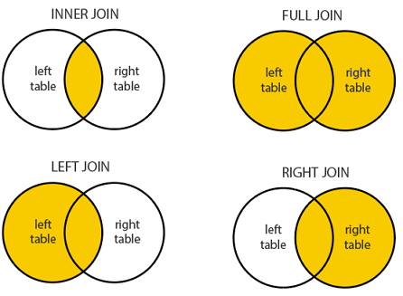

Start Learning: 2020/11/24 
End Learning: 

1. [Creating Databases and Tables](#Creating-Databases-and-Tables)
    1. [Dropping Databases and Tables](#Dropping-Databases)
    1. [Using Databases](#Using-Databases)
    1. [The Basic Datatypes](#The-Basic-Datatypes)
    1. [Creating Your Own Tables](#Creating-Your-Own-Tables)
    1. [Dropping Tables](#Dropping-Tables)
1. [Inserting Data](#Inserting-Data)
    1. [MySQL Warning](#MySQL-Warning)
    1. [NULL and NOT_NULL](#null-and-not_null)
    1. [Setting Default Values](#Setting-Default-Values)
    1. [A Primer of Primary Key](#A-Primer-of-Primary-Key)
1. [CRUD Commands](#CRUD-commands)
    1. [Introduction to SELECT](#Introduction-to-SELECT)
    1. [Introduction to WHERE](#Introduction-to-WHERE)
    1. [Introduction to Aliases](#Introduction-to-Aliases)
    1. [The UPDATE command](#The-UPDATE-command)
    1. [Introduction to DELETE](#Introduction-to-DELETE)
1. [String Functions](#String-Functions)
    1. [Running SQL Files](#Running-SQL-Files)
    1. [Working with CONCAT](#Working-with-CONCAT)
    1. [Introducing REPLACE](#Introducing-REPLACE)
    1. [Using Reverse](#Using-Reverse)
    1. [Changing Case with UPPER and LOWER](#Changing-Case-with-UPPER-and-LOWER)
1. [Refining Selections](#Refining-Selections)
    1. [Seed Data](#Seed-Data)
    1. [Using DISTINCT](#Using-DISTINCT)
    1. [Sorting Data with ORDER BY](#Sorting-Data-with-ORDER-BY)
    1. [Using LIMIT](#Using-LIMIT)
    1. [Better Searches with LIKE](#Better-Searches-with-LIKE)
    1. [Selection Challenges](#Selection-Challenges)
1. [Aggregate Functions](#Aggregate-Functions)
    1. [The COUNT function](#The-COUNT-function)
    1. [GROUP BY](#GROUP-BY)
    1. [Min and Max Basics](#Min-and-Max-Basics)
    1. [The Sum Function](#The-Sum-Function)
    1. [The Avg Function](#The-Avg-Function)
1. [Revisiting Datatypes](#Revisiting-Datatypes)
    1. [CHAR and VARCHAR](#CHAR-and-VARCHAR)
    1. [DECIMAL](#DECIMAL)
    1. [FLOAT and DOUBLE](#FLOAT-and-DOUBLE)
    1. [DATE, TIME, and DATETIME](#DATE,-TIME,-and-DATETIME)
    1. [Formatting DATE](#Formatting-DATE)
    1. [DATE math](#DATE-math)
    1. [Date Type Exercises](#Date-Type-Exercises)
1. [The Power of Logical Operators](#The-Power-of-Logical-Operators)
    1. [Not Equal](#Not-Equal)
    1. [Not Like](#Not-Like)
    1. [Greater Than](#Greater-Than)
    1. [Less Than](#Less-Than)
    1. [Logical OR](#Logical-OR)
    1. [Between](#Between)
    1. [Case Statement](#Case-Statement)
1. [One to Many](#One-to-Many)
    1. [Real World Data is Messy](#Real-World-Data-is-Messy)
    1. [Types of Data Relationship](#Types-of-Data-Relationship)
    1. [One to Many](#One-to-Many)
    1. [Working with Foreign Keys](#Working-with-Foreign-Keys)
    1. [Cross Join](#Cross-Join)
    1. [Inner Join](#Inner-Join)
    1. [Left Join](#Left-Join)

# Creating Databases and Tables
## Creating Databases
1. We can use Groom IDE to set up mysql server and databases in it. We can follow the instructions at [https://gist.github.com/nax3t/2773378c4d1bada8d66d12f4d5210248](https://gist.github.com/nax3t/2773378c4d1bada8d66d12f4d5210248). Note that though I have installed mysql server locally for PHP and Laravel development, it can't be accessed locally after starting `sudo service mysql start`, as it will be deined to access. Further investigation is requried. 
1. After installing we can use `mysql-ctl cli` to start mysql server in the IDE. Note that SQL commands end with semi-column `;`.
    1. In CLI, we can use `show databases` to show all the databases in the MySQL server. 
    1. Use `CREATE DATABASE <database_name>;` to create a new database. The convention for naming is to use underscore `_` as spaces in between. Though we can use whitesapce or camelCase, we can stick on single naming style to avoid confusion. 

## Dropping Databases
1. It's simple that we can sue `DROP DATABSE <database_name>;` to remove a database from DBMS. 

## Using Databases
1. To use an existing database, we can use `USE <database_name>;` to switch to use the database. 
1. We can use `SELECT database();` to check the current using database. 
1. However, if we drop a using database, we can find that we are using `NULL` database rather than any database in the system. 

## Introduction to Tables
1. A database is made of single or multiple tables. This similar to regular 2-dimensional tables in Excel. 
1. Columns are headers, while the Rows are actual data. 

## The Basic Datatypes
1. In SQL databases, we set up schema to ensure the data in the same column has the same datatype. 
1. Numeric Types
    1. INT
    1. SMALLINT
    1. TINYINT
    1. MEDIUMINT
    1. BIGINT
    1. DECIMAL
    1. NUMERIC
    1. FLOAT
    1. DOUBLE 
    1. BIT
1. String Types
    1. CHAR
    1. VARCHAR
    1. BINARY
    1. VARBINARY
    1. BLOB
    1. TINYBLOB
    1. MEDIUMBLOB
    1. LONGBLOB
    1. TEXT
    1. TINYTEXT
    1. MEDIUMTEXT
    1. LONGTEXT
    1. ENUM
1. Date Types
    1. DATE
    1. DATETIME
    1. TIMESTAMP
    1. TIME
    1. YEAR
1. Though there are many types of data, the most common we can use is `INT` and `VARCHAR`. 
    1. `INT` is a whole number.
    1. `VARCHAR` is a variable-length string, unlike `CHAR` which has fixed length for each data. Besides, when using `VARCAHR`, we should specify the maximum length. 

## Creating Your Own Tables
1. We can use `CREATE TABLE <tablename> (column_name datatype);`
    ```sql
    CREATE TABLE tablename 
        (
            name VARCHAR(100),
            age INT
        );
    ```
1. After creating tables, we can use `SHOW TABLES` to check tables in the database. However, this only shows the list of existing tables in the database. 
1. We can use `SHOW COLUMNS FROM <table_name>;` to check the headers (field) and datatypes. `DESC <table_name>;` is the shorthand for the same purpose.

## Dropping Tables
1. To delete a table, we use `DROP TABLE <table_name>`, which is a similar command to drop (remove) a database.


# Inserting Data
## Inserting Data
1. Starting with `INSERT INTO`, we can give `table_name` in the database with "headers" (columns) then `VALUES` for the data that we want to insert. Note that the order of the data matters and should be alinged with the order of given columns.
    ```sql
    INSERT INTO table_name (column, column) VALUES ('VARCHAR', INT);
    ```
1. To check the data in a table, we use `SELECT <columns> FROM <table_name>;`.
    ```sql 
    SELECT * FROM table_name;
    ```
1. We can use comma `,` to separate multiple insert sets.
    ```sql
    INSERT INTO table_name (VARCHAR, INT)
    VALUES ('String', 11)
          ,('String', 5);
    ```

## MySQL Warning
1. If we give incorrect inputs such as exceeding the maximum length of `VARCHAR` or give text type data to a `INT` column, MySQL will return a warning back to the user for the issue. Note that if we have operate any command right after receiving the warning, the message will be removed and can't be checked again. 
1. In some cases, we can set up the default value for a column if the input is missing or incorrect. For exmaple, if a column takes `INT` datatype but receive a text string, it may give `0` as the default value to the input. 

## NULL and NOT_NULL
1. In SQL `NULL` simply means "the value is not known".
1. For example, in the inital schema setting for a table, we can configure that if the table accepts `NULL` as input. 
    ```sql
    CREATE TABLE table_name 
    (
        column1 VARCHAR(20) NOT NULL,
        column2 INT NOT NULL
    );
    ```
1. In this case, if we don't give any value to a column that can't be `NULL` through `INSERT INTO`, the data will be either empty string or 0 according to the default setting and the datatype. 
    ```sql
    INSERT INTO table_name (column1) VALUES ('test');

    /* This will return a warning as the default value of the table can't be default */
    ```

## Setting Default Values
1. We can use `NOT NULL` to specify that the column can't take `NULL` as input when creating the table. Note that 
    ```sql
    CREATE TABLE table_name
    (
        column1 VARCHAR(20) DEFAULT 'no name' NOT NULL,
        column2 INT NOT NULL DEFAULT 10
    );
    ```

## A Primer of Primary Key
1. "**Primary Keys**" are unique identifier for the data in a table. This can be use to differentiate the inputs if the data is exactly the same. For example, we have a table with `name` and `age` column that 2 inputs can have exactly the same name and age. With this "Primary Key", we can easily know the inputs are different and not duplicated. 
1. With `AUTO_INCREMENT`, we can avoid giving input for the column will the system will generate it automatically. 
    ```sql
    CREATE TABLE table_name 
    (
        cat_id INT NOT NULL AUTO_INCREMENT,
        name VARCHAR(20),
        age INT,
        PRIMARY KEY (cat_id)
    );
    ```
1. We can indicate a column as primary key when creating it.
    ```sql
    CREATE TABLE table_name
    (
        id INT NOT NULL AUTO_INCREMENT PRIMARY KEY
    );
    ```


# CRUD Commands
1. CRUD stands for "Create", "Read", "Update", and "Delete" (or Destroy). 

## Introduction to SELECT
1. In the previous section, we use `SELECT * FROM table_name` to read the data from a table. The asterisk `*` actually stands for the wild-card as to retrieve all the columns from the table.
    ```sql
    CREATE TABLE table_name (id INT PRIMARY KEY NOT NULL, name VARCHAR(50));

    SELECT * FROM table_name;

    SELECT name FROM table_name;
    ```

## Introduction to WHERE
1. When selecting data from a table, we can use `WHERE` to specify the condition of data to be read. 
1. We can also use the data in the column itself for the conditions. 
    ```sql
    SELECT * FROM table_name WHERE column >= 'condition';

    SELECT * FROM table_name WHERE column1 = column2;
    ```

## Introduction to Aliases
1. We can specify how the header names are shown. The main syntax is to use `AS` to give the name of a specify column to show.
    ```sql
    SELECT column_id AS id, column FROM table_name;
    ```

## The UPDATE command
1. Use `UPDATE` and `SET` keywords to edit the data in the table. 
    ```sql
    UPDATE table_name SET column1 = 'data1' WHERE column2 = 'data2';
    ```
1. To prevent accidents, always check the data before editing it. We can use `SELECT` to read and check if the data is the target one, then use `UPDATE` and `SET` to update it. 

## Introduction to DELETE
1. To delete data from database, we can use `DELETE FROM` to remove data. Note that if we don't use `WHERE` to specify the data to delete, all the data in the table will be removed. 
    ```sql
    DELETE FROM table_name WHERE column = 'data';

    DELETE FROM table_name;
    /* delete everything from the table */    
    ```


# String Functions
## Running SQL Files
1. In the termianl, we can mvoe the directory where we keep the SQL file, then start MySQL server at the directory. In the command prompt, we can use `source file_name.sql` to run SQL code. Therefore, we can run the preset script without worrying typo or syntax errors. 

## Working with CONCAT
1. `CONCAT` is to combine Data for cleaner output. The syntax is to use `CONCAT(col1, col2, col3...)`. Besides, this should be used with `SELECT FROM` which is to indicate the table which we get data from. 
1. We can use `CONCAT_WS` in case that we want separator in between all columns. In this case, "separator" should be put as the first argument. 
    ```sql
    SELECT CONCAT (col1, 'separator', col2) from table_name;

    SELECT col1 AS header1, col2 AS header2, CONCAT(col1, ' ', col2) AS full FROM table_name;
    /* This returns 3 columns */

    SELECT CONCAT_WS('-', col1, col2) from table_name;
    /* This will give separator in between all columns */
    ```

## Introducing SUBSTRING
1. To take part of a string value, we can use `SUBSTRING()` which takes the string value as the first argument which is followed with starting position and the ending position. Note that position of strings in SQL starts from 1 rather than 0. 
1. If we give only the 2nd argument, which is the starting position, it returns the string since the given starting position to the end.
1. The position index can negative that it starts backward from `-1`. 
1. `SUBSTR()` is a shorthand for `SUBSTRING()`. Both of these functions work exactly the same. 
    ```sql
    SELECT SUBSTRING('text_string', starting_position, ending_position);
    /* Note that position of SQL string starts from 1, not zero */

    SELECT SUBSTRING('text_string', 1, 4);
    /* text */

    SELECT SUBSTRING('text_string', 6);
    /* string */

    SELECT SUBSTRING('text_string', -3);
    /* ing */

    SELECT SUBSTR(col1, 1, 6) AS new_header FROM table_name;
    ```
1. We can combine multiple functions together to create a new table. For example, we use `SUBSTR` to get short title from the table, use `CONCAT` to add triple dots `...` after each substring, and use `AS` to change header name of the new column. 
    ```sql
    SELECT 
        CONCAT
        (
            SUBSTRING(title, 1, 10), 
            '...'
        ) AS 'short title' 
    FROM books;
    ```

## Introducing REPLACE
1. With `REPLACE`, we can replace the given character in the string value. Note that the function is case-sensitive.
1. Note that as most of the other string functions, `REPLACE()` only affects the query output and doesn't affect the actual data in the database.
    ```sql
    SELECT REPLACE('Hello World', 'l', '7');
    /* He77o World*/
    
    SELECT REPLACE('HellO World', 'o', '7');
    /* Hello W7rld*/

    SELECT 
        SUBSTRING(REPLACE(col, 'e', '3'),1,10)
    FROM books;
    /* return table that has only the first 10 characters of replaced data */
    ```

## Using Reverse
1. `REVERSE()` function is very straight forward that it reverse the sequence of the given string value. Besides, we can use it to use with other functions for different purposes. 
    ```sql
    SELECT REVERSE('string_text');
    /* txet_gnirts */

    SELECT CONCAT('woof', REVERSE('woof'));
    /* wooffoow */
    ```

## Working with CHAR LENGTH
1. `CHAR_LENGTH()` function is used to count the number of characters of a string value. 
    ```sql
    SELECT col1, CHAR_LENGTH(col1) AS header from table_name;

    SELECT CONCAT(col1, ' is ', CHAR_LENGTH(col1), ' characters long') FROM table_name;
    /* create a new table of results with text indication */
    ```

## Changing Case with UPPER and LOWER
1. `UPPER()` and `LOWER()` are functions to change case of string. 
    ```sql
    SELECT UPPER('hello world');
    /* HELLO WORLD */

    SELECT LOWER('HELLO WORLD');
    /* hello world */ 
    ```

## String Function Challenge
```sql
CREATE TABLE books 
	(
		book_id INT NOT NULL AUTO_INCREMENT,
		title VARCHAR(100),
		author_fname VARCHAR(100),
		author_lname VARCHAR(100),
		released_year INT,
		stock_quantity INT,
		pages INT,
		PRIMARY KEY(book_id)
	);

INSERT INTO books (title, author_fname, author_lname, released_year, stock_quantity, pages)
VALUES
('The Namesake', 'Jhumpa', 'Lahiri', 2003, 32, 291),
('Norse Mythology', 'Neil', 'Gaiman',2016, 43, 304),
('American Gods', 'Neil', 'Gaiman', 2001, 12, 465),
('Interpreter of Maladies', 'Jhumpa', 'Lahiri', 1996, 97, 198),
('A Hologram for the King: A Novel', 'Dave', 'Eggers', 2012, 154, 352),
('The Circle', 'Dave', 'Eggers', 2013, 26, 504),
('The Amazing Adventures of Kavalier & Clay', 'Michael', 'Chabon', 2000, 68, 634),
('Just Kids', 'Patti', 'Smith', 2010, 55, 304),
('A Heartbreaking Work of Staggering Genius', 'Dave', 'Eggers', 2001, 104, 437),
('Coraline', 'Neil', 'Gaiman', 2003, 100, 208),
('What We Talk About When We Talk About Love: Stories', 'Raymond', 'Carver', 1981, 23, 176),
("Where I'm Calling From: Selected Stories", 'Raymond', 'Carver', 1989, 12, 526),
('White Noise', 'Don', 'DeLillo', 1985, 49, 320),
('Cannery Row', 'John', 'Steinbeck', 1945, 95, 181),
('Oblivion: Stories', 'David', 'Foster Wallace', 2004, 172, 329),
('Consider the Lobster', 'David', 'Foster Wallace', 2005, 92, 343);

/* Solutions for the challenge */
SELECT UPPER(REVERSE('Why does my cat look at me with such hatred'));

SELECT REPLACE(
    CONCAT('I', ' ', 'like', ' ', 'cats'),
    ' ',
    '_'
) AS 'replacement';

SELECT REPLACE(title, ' ', '->') FROM books;

SELECT author_lname AS forwards, REVERSE(author_lname) AS backwards FROM books;

SELECT UPPER(CONCAT(author_fname, ' ', author_lname)) AS 'full name in caps' FROM books;

SELECT CONCAT(title, ' was released in ', released_year) AS blurb FROM books;

SELECT title, CHAR_LENGTH(title) AS 'character count' FROM books;

SELECT CONCAT(SUBSTRING(title, 1, 10), '...') AS 'short title', 
    CONCAT(author_lname, ',', author_fname) AS author, 
    CONCAT(stock_quantity, ' in stock') AS quantity 
FROM books;
```


# Refining Selections
## Seed Data
1. We put more data to the `book_shop` database. 
    ```sql
    CREATE DATABASE book_shop;

    CREATE TABLE books 
	(
		book_id INT NOT NULL AUTO_INCREMENT PRIMARY KEY,
		title VARCHAR(100),
		author_fname VARCHAR(100),
		author_lname VARCHAR(100),
		released_year INT,
		stock_quantity INT,
		pages INT,		
	);

    INSERT INTO books (title, author_fname, author_lname, released_year, stock_quantity, pages)
    VALUES
    ('The Namesake', 'Jhumpa', 'Lahiri', 2003, 32, 291),
    ('Norse Mythology', 'Neil', 'Gaiman',2016, 43, 304),
    ('American Gods', 'Neil', 'Gaiman', 2001, 12, 465),
    ('Interpreter of Maladies', 'Jhumpa', 'Lahiri', 1996, 97, 198),
    ('A Hologram for the King: A Novel', 'Dave', 'Eggers', 2012, 154, 352),
    ('The Circle', 'Dave', 'Eggers', 2013, 26, 504),
    ('The Amazing Adventures of Kavalier & Clay', 'Michael', 'Chabon', 2000, 68, 634),
    ('Just Kids', 'Patti', 'Smith', 2010, 55, 304),
    ('A Heartbreaking Work of Staggering Genius', 'Dave', 'Eggers', 2001, 104, 437),
    ('Coraline', 'Neil', 'Gaiman', 2003, 100, 208),
    ('What We Talk About When We Talk About Love: Stories', 'Raymond', 'Carver', 1981, 23, 176),
    ("Where I'm Calling From: Selected Stories", 'Raymond', 'Carver', 1989, 12, 526),
    ('White Noise', 'Don', 'DeLillo', 1985, 49, 320),
    ('Cannery Row', 'John', 'Steinbeck', 1945, 95, 181),
    ('Oblivion: Stories', 'David', 'Foster Wallace', 2004, 172, 329),
    ('Consider the Lobster', 'David', 'Foster Wallace', 2005, 92, 343);

    INSERT INTO books
        (title, author_fname, author_lname, released_year, stock_quantity, pages)
        VALUES ('10% Happier', 'Dan', 'Harris', 2014, 29, 256), 
            ('fake_book', 'Freida', 'Harris', 2001, 287, 428),
            ('Lincoln In The Bardo', 'George', 'Saunders', 2017, 1000, 367);
    ```

## Using DISTINCT
1. `DISTINCT` can provide us unique values and avoid duplicates. Note that `DISTINCT` should follow right after `SELECT` keyword. 
1. If we use DISTINCT to return multiple columns, MySQL will return only the rows that has unique data. Besides, we can use it with 
    ```sql
    SELECT DISTINCT col from table_name;
    ```

## Sorting Data with ORDER BY
1. The default ordering sequence for the result is ascending. We can use `DESC` for "**descending**" which can order the result reversely.
1. After `ORDER BY`, we can use number for the selected columns to order the result. Note that the position of columns starts at 1. 
1. We can give multiple columns as filter to order the result. The given columns will be in different tiers. The 1st one will be the very first filter to order the results. 
    ```sql
    SELECT col1 FROM table_name ORDER BY col1;

    SELECT col1 FROM table_name ORDER BY col1 DESC;
    /* list results in descending order */ 

    SELECT col1, col2 FROM table_name ORDER BY col3;
    /* result will be ordred by col3 though it's not selected */

    SELECT col1, col2, col3 FROM table_name ORDER BY 2;
    /* result will be ordered by col2 ascending */

    SELECT col1, col2 FROM table_name ORDER BY col1, col2;
    /* result will be ordered by col1 and then col2 */
    ```

## Using LIMIT
1. `LIMIT` allow us the limit the number of results returned. This function comes the last in the statement. 
1. `LIMIT` can take another arugment which is the starting point of the result. For example, if we have 10 results in total, we can use `LIMIT 3, 6` to get from the 4rd result to the 9th which are 6 results in total. Note that the starting position is `0` rather than `1`. 
1. There's no better way to select from a certain position till the last row in the database. We can only do it by hitting the limitation of a table in MySQL. We may give a random huge number which should be greater than the number of entities in the table. 
    ```sql
    SELECT col1, col2 FROM table_name ORDER BY col1 LIMIT 5;
    /* return only 5 results ordred by col1 */

    SELECT * FROM table_name LIMIT 1, 3;
    /* return 3 results since the 2nd entity */

    SELECT col1 FROM table_name LIMIT 1, 1;
    /* return only the 2nd entity from the table */

    SELECT * FROM table_name LIMIT 1, 999999999999999999999999999999999999;
    /* return the 2nd entity till the last in the table */ 
    ```

## Better Searches with LIKE
1. `LIKE` can be used for better searching to find similar entities in the table. 
1. `%` is similar to regular expression that is a wildcard to be used as placeholder in searching. It basically means that there has or doesn't have the given value in between. Therefore, if the given value is at the start or end position, it will match the search with `%`. 
1. Note that `LIKE` search is not case-sensitive.
1. Besides percentage, we can use underscores `_` to search. Underscores are the placeholder for the character. It only matches when there's really character as value. For example, if we'd like to check the quantity of stock, the range could be 2 to 5 digits. Therefore, we can use `__` to search for stock with quantity in 2 digits and `____` for stock with quantity in 4 digits.
1. We can use backslash `\` before `%` or `_` to secape the character, so we can search `%` as the character in the query. 
    ```sql
    WHERE col1 LIKE '%search%';
    /* find any entity in the table that includes 'search' */

    SELECT col1 FROM table_name WHERE col1 LIKE '__'; 
    /* return entities that has exactly 2 characters as value in col1 */
    ```

## Selection Challenges
```sql
SELECT title FROM books WHERE title LIKE '%stories%';

SELECT title, pages FROM books ORDER BY CHAR_LENGTH(title) DESC LIMIT 1;

SELECT CONCAT(title, ' - ', released_year) AS summary FROM books ORDER BY released_year DESC LIMIT 3;

SELECT title, author_lname FROM books WHERE author_lname LIKE '% %';

SELECT title, released_year, stock_quantity FROM books ORDER BY stock_quantity LIMIT 3;

SELECT title, author_lname FROM books ORDER BY author_lname, title;

SELECT UPPER(CONCAT('my favorite author is ', author_lname, '!')) AS yell FROM books ORDER BY author_lname;
```


# Aggregate Functions
## The COUNT function
1. `COUNT()` function is to calculate the number of entities in the same row. 
    ```sql
    SELECT COUNT(*) FROM table_name;
    /* return the number of rows in the table */

    SELECT COUNT(DISTINCT col1, col2) FROM table_name;
    /* return all unqiue values combined by col1 and col2 */

    SELECT COUNT(*) FROM table_name WHERE col1 LIKE '%search%';
    ```
## GROUP BY
1. `GROUP BY` summarize or aggregates identical data into single rows. In this case, if multiple entities have the same value in a field and is grouped, it will be returned as a row. This function is useful when counting the number of a certain type of entity in the table.
    ```sql
    SELECT col1, COUNT(*) FROM table_name GROUP BY col1; 
    ```
1. We can query data from the `books` table in `book_shop` database.
    ```sql
    SELECT 
        CONCAT(
            'In ', 
            released_year, 
            ' ', 
            COUNT(*), 
            ' book(s) released'
        ) AS year 
    FROM 
        books 
    GROUP BY 
        released_year;
    ```

## Min and Max Basics
1. `MAX()` can return the maximum entity from the query results. However, when using with other functions, we should be careful that the row and the entity may not match.
    ```sql
    SELECT Max(col1) FROM table_name;

    SELECT Max(col1), col2 FROM table_name;
    /* col1 and col2 could be from different row!!! */
    ```
1. In the `book_shop` case, we can query for the book that has the most pages in the dataset with its title.
1. One of the solutions is to use sub-query, which is an inner query for the case. The 2nd query, which is in the parenthesis will be executed first. However, this method is executing 2 queries which is slower than regular methods.
1. The other way is to use `ORDER BY` with `LIMIT`.
    ```sql
    SELECT title,pages FROM books WHERE pages = (SELECT Max(pages) FROM books);
    /*  */

    SELECT title, pages FROM books ORDER BY pages ASC LIMIT 1;
    ```
1. In the other example, if we'd like to find the year each author published their first book. 
1. Find the longest page count for each author in the dataset. 
    ```sql
    SELECT author_fname, author_lname, MIN(released_year) FROM books GROUP BY author_lname;

    SELECT author_fname, author_lname, MAX(pages) FROM books GROUP BY author_lname ORDER BY MAX(pages);

    SELECT CONCAT(author_fname, author_lname) AS author, MAX(pages) AS 'longest book' FROM books GROUP BY author_lname, author_fname;
    ```

## The Sum Function
1. `SUM()` can be used to sum up the numbers of a given columns. This function can be useful when using with `GROUP BY`. For example, we can get the total pages of a author in the `book_shop` database. 
    ```sql
    SELECT CONCAT(author_fname, ' ', author_lname) AS author, SUM(pages) FROM books GROUP BY author ORDER BY author;
    /* sum of pages that each author has written */

    SELECT CONCAT(author_fname, ' ', author_lname) AS author, SUM(pages) FROM books GROUP BY author_lname, author_fname ORDER BY author;
    /* This gives identical results as the query above */
    ```

## The Avg Function
1. `Avg()` can be used to calculate the average number of a given column. In the example, we can calculate the average stock quantity for books released in the same year.
1. Note that by default, the averaged nubmer will have 4 digits though the remainder is zero.
    ```sql
    SELECT AVG(col1) FROM table_name GROUP BY col1;

    SELECT released_year, AVG(stock_quantity) FROM books GROUP BY released_year;
    ```

## Aggregate Functions Challenges
1. Tentative solutions
    ```sql
    /* print the number of books in the database */
    SELECT COUNT(DISTINCT title) FROM books;

    /* print out how many books were released in each yaer */
    SELECT released_year, COUNT(released_year) FROM books GROUP BY released_year;

    /* print out the total number of books in stock */
    SELECT SUM(stock_quantity) FROM books; 

    /* Find the average released_year for each author */
    SELECT AVG(released_year) FROM books GROUP BY author_lname, author_fname;

    /* Find the full name of the author who wrote the longest book */
    SELECT CONCAT(author_fname, ' ', author_lname) AS author, MAX(pages) FROM books GROUP BY author ORDER BY MAX(pages) DESC LIMIT 1;

    SELECT released_year AS year, COUNT(released_year) AS '# books', AVG(pages) AS 'avg pages' FROM books GROUP BY released_year;
    ```
1. Solutions from the lecture
    1. The last tentative answers is not correct, as it should be grouped by `released_year` rather than the author because we want the years to be distinctive rather than aggregated. 
    ```sql
    SELECT released_year AS year, COUNT(released_year) AS '# books', AVG(pages) AS 'avg pages' FROM books GROUP BY released_year;
    ```


# Revisiting Datatypes
## CHAR and VARCHAR
1. The main difference between `CHAR` and `VARCHAR` is that `CHAR` type has fixed length for its values. The main point is that every value of `CHAR` type has the same size.
1. If the given value is more than limitation, the exceeding characters will be truncated. On the other hand, if the characters haven't reached the limit, the database will give white spaces to fill the empty characters.
1. `CHAR` is faster for fixed length text. It can be used as abbreviation system such as states in the USA.

## DECIMAL
1. We can declare a decimal number with 2 arguments such as `DECIMAL(5, 2)` which indicates that the number has 5 digits in total which has 2 numbers after decimal.
1. If we insert a number that is greater than the limitation, the system will put the largest number that the column can store to it. 
1. If we put digits over the limitation after decimal, the digits after limitation will be rounded to the closest digit.
    ```sql
    DECIMAL(5, 2);
    /* 999.99 has 5 digits in total with 2 digits after decimal */
    INSERT INTO table_name (col1) VALUE (7);
    INSERT INTO table_name (col1) VALUE (123456789);
    INSERT INTO table_name (col1) VALUE (34.88);
    INSERT INTO table_name (col1) VALUE (298.9999);
    INSERT INTO table_name (col1) VALUE (1.9999);
    INSERT INTO table_name (col1) VALUE (1.991);

    /*
    7.00
    999.99
    34.88
    299.00
    2.00
    1.99
    */
    ```

## FLOAT and DOUBLE
1. `FLOAT` and `DOUBLE` can store larger numbers using less space. However, the constraint of using both of these are that the stored numbers will be precise.
1. `FLOAT` takes 4 bytes to store the data in memory and has precision issues around 7 digits, while `DOUBLE` takes 8 bytes and has precision issues around 15 digits. A `DOUBLE` is larger and more precise than `FLOAT`. 
1. Therefore, we should use `DECIMAL` most of the time. We can use `FLOAT` or `DOUBLE` only if we know that precision doesn't matter to the dataset. 
    ```sql
    USE new_testing_db;
    CREATE TABLE thingies (price FLOAT);
    INSERT INTO thingies (price) VALUES (8877665544.485);

    SELECT * FROM thingies;
    /* 8877670000 */
    /* 8877665544.485 becomes 8877670000 which are very different */
    ```

## DATE, TIME, and DATETIME
1. We can use `sudo dpkg-reconfigure tzdata` to configure the timezone of the server or the Linux OS we are using. Note that the default timezone is the UTC. 
1. `DATE` are values with a date but no time. The format is `'YYYY-MM-DD'`.
1. `TIME` are values with tmie but no date. The format is `'HH:MM:SS'`. However, in practice, this type of data is rarely used. 
1. `DATETIME` are values with a `DATE` and `TIME`. The format is `'YYYY-MM-DD HH:MM:SS'`.
    ```sql
    USE new_testing_db;
    CREATE TABLE people (name VARCHAR(100), birthdate DATE, birthtime TIME, birthdt DATETIME);
    INSERT INTO people (name, birthdate, birthtime, birthdt) VALUES ('Padma', '1983-11-11', '10:07:35', '1983-11-11 10:07:35');
    ```

## CURDATE, CURTIME, and NOW
1. `CURDATE` gives the current date (today); `CURTIME` gives current time (now); and `NOW` gives current date and time. This can be useful to give timestamp automatically when the data is created. 
1. DATE and TIME are useful when checking time difference and calculate it for various of purposes. 
    ```sql
    USE new_testing_db;
    SELECT CURDATE(), CURTIME(), NOW();
    INSERT INTO people (name, birthdate, birthtime, birthdt) VALUES ('Microwave', CURDATE(), CURTIME(), NOW());
    ```

## Formatting DATE
1. There are several functions for `DATE` that can be useful when querying data. 
    1. `DAY()` can extract the day of the date. For example, `DAY('1990-01-01')` is `1`.
    1. `DAYNAME()` gives the day of a week in text. For example, `DAYNAME('1990-01-01')` is `Monday`.
    1. `DAYOFWEEK()` gives the day of a week like `DAYNAME()` but in number. Note that the number is from 1 to 7 which is from Sunday to Saturday.
    1. `DAYOFYEAR()` gives the day of the year. For example, `DAYOFYEAR('1990-01-01')` is `1`, and `DAYOFYEAR('1990-02-01')` is `32`.
1. If the function can't parse the date or time, it returns `NULL` rather than reporting an error. 
    ```sql
    USE new_testing_db;
    SELECT name, birthdate, DAYNAME(birthdate) FROM people;
    SELECT DAYNAME('1990-01-01'); /* Monday */
    SELECT DAYOFWEEK('1990-01-01'); /* 2 */
    SELECT DAYOFYEAR('1990-02-01'); /* 32 */
    ```
1. In addition, we can use [`DATE_FORMAT()`](https://www.w3schools.com/sql/func_mysql_date_format.asp) to change the format of the date and time. 
    ```sql
    SELECT DATE_FORMAT("2017-01-05", "%d/%M/%Y %r");
    /* 05/January/2017 12:00:00 AM */
    SELECT DATE_FORMAT(NOW(), "The time now is %D-%M-%Y %r");
    /* The time now is 3rd-December-2020 10:54:20 PM */
    ```

## DATE math
1. `DATEDIFF(date1, date2)` can be used to calculate the difference between 2 given dates. 
1. `DATE_ADD(date, INTERVAL 1 MONTH)` can be use to add seconds to years according to the given unit.
1. Besides the functions above, we can simply use `+/-` plus or minus sign with `INTERVAL` to add or subtract numbers.
    ```sql
    SELECT DATEDIFF('2020-01-31', '2020-01-01'); /* 30 */
    
    USE new_testing_db;
    SELECT birthdt, DATE_ADD(birthdt, INTERVAL 1 MONTH) FROM people;
    /* add a month to the date */

    SELECT birthdt, birthdt + INTERVAL 15 MONTH + INTERVAL 10 HOUR FROM people;
    ```

## Working with TIMESTAMP
1. Though `DATETIME` and `TIMESTAMP` are mostly identical, `DATETIME` supports range from `1000-01-01 00:00:00` to `9999-12-31 23:59:59`. On the other hand, `TIMESTAMP` supports from `1970-01-01 00:00:00` to `2038-01-19 03:14:07.999999`.
1. Therefore, `TIMESTAMP` is useful when we want to capture the current date and time, such as recording activity logs, as when a data is inserted to the database. 
    ```sql
    USE new_testing_db;
    CREATE TABLE comments (
        content VARCHAR(100),
        created_at TIMESTAMP DEFAULT NOW();
    );

    INSERT INTO comments (content) VALUE('lol what a funny article');
    INSERT INTO comments (content) VALUE('I found this offensive');
    INSERT INTO comments (content) VALUE('abcdefghijklmnopqrstuvwxyz');
    ```
1. We can use `ON UPDATE` with `CURRENT_TIMESTAMP` to update the column when the row is updated. 
    ```sql
    CREATE TABLE comments2 (
        content VARCHAR(100),
        changed_at TIMESTAMP DEFAULT NOW() ON UPDATE CURRENT_TIMESTAMP
    );

    INSERT INTO comments2 (content) VALUE ('abcdefghijklmnopqrstuvwxyz');
    UPDATE comments2 SET content = 'THIS IS NOT GIBBERISH' WHERE content = 'abcdefghijklmnopqrstuvwxyz';
    /* changed at of content will be updated when it is changed from abcdefghijklmnopqrstuvwxyz to THIS IS NOT GIBBERISH */
    ```

## Date Type Exercises
1. Create a case using `CHAR`
1. Create a table for inventory 
    ```sql
    CREATE TABLE inventory (
        item_name VARCHAR(100),
        price DECIMAL(8, 2),
        quantity INT
    );
    ```
1. What's the difference between `DATETIME` and `TIMESTAMP`?
1. Print out the currnet time in MySQL.
1. Print out the current date but without time.
1. Print out the current day of the week. 
1. Print out the current day of the week in day name, such as `Monday`. 
1. Print out the current day and time using `mm/dd/yyyy`.
1. Print out the current day and time using the following format `January 2nd at 3:15` and `April 1st at 10:18`.
1. Create a tweets table that stores `Tweet content`, `Username`, and `Time` is created. 
    ```sql
    /* Print out current time */
    SELECT CURRENT_TIME();
    SELECT NOW();

    /* print out date without time */
    SELECT CURRENT_DATE(NOW());

    /* print out the current day of a week in number*/
    SELECT DAYOFWEEK(NOW());
    /* the following starts from Sunday which is 0 to Saturday which is 6 */
    SELECT DATE_FORMAT(NOW(), "%w");

    /* print out current day of a week in text*/
    SELECT DAYNAME(NOW());
    SELECT DATE_FORMAT(NOW(), "%W");

    /* print out current day and time in mm/dd/yyyy */
    SELECT DATE_FORMAT(NOW(), "%m/%d/%Y");

    /* print out current day and time as January 2nd at 3:15 */
    SELECT DATE_FORMAT(NOW(), "%M %D at %T");

    CREATE TABLE tweets (
        content VARCHAR(140),
        username VARCHAR(20),
        created_at TIMESTAMP DEFAULT NOW()
    );
    ```


# The Power of Logical Operators
## Not Equal
1. Not equal `!=` is a logical operator that can be useful to work on different queries such as 
    1. Select all books NOT published in 2017
    1. Select all birthdays between 1990 and 1992
    1. Select all items that are in stock AND priced below $19.99
    ```sql
    USE book_shop;

    /* select all the books from the books table which are not released in 2017 */
    SELECT title, released_year FROM books WHERE released_year != 2017;
    ```

## Not Like
1. This works in the opposite way of using `LIKE` with placeholder. It works by simply put `NOT` right before `LIKE`.
    ```sql
    USE book_shop;

    /* find all the book titles which has 'w' */
    SELECT title FROM books WHERE title LIKE '%W%';

    /* find all the book titles which does not have 'w' */
    SELECT title FROM books WHERE title NOT LIKE '%W%';
    ```

## Greater Than
1. `>` works as the regular math operator `greater than` which means the number should be greater and not include the given number. 
1. In addition, we can use greater than sign with an equal sign, so the operations can be inclusive.
1. In SQL, the boolean value is presented as `0` (false) and `1` (true).
1. Besides, SQL is not case-sensitive in its query, which shows `'A'` is equal to `'a'`.
    ```sql
    USE book_shop;
    SELECT * FROM books WHERE released_year >= 2000;

    SELECT 100 > 5;
    /* 1 */
    
    SELECT -15 > 15;
    /* 0 */

    SELECT 9 > -10;
    /* 1 */

    SELECT 1 > 1;
    /* 0 */

    SELECT 'a' > 'b';
    /* 0 */

    SELECT 'A' > 'a';
    /* 0 */

    SELECT 'A' = 'a';
    /* 1 */
    ```

## Less Than
1. `<` works similar to greater than but in the opposite way. 

## Logical AND
1. We can use `AND` operator `&&` to combine filters on queries. For example, from the book shop, we can select books written by certain author and is published in a certain year.
1. By using `AND`, the `SELECT` only returns the data that is 
    ```sql
    USE book_shop;
    SELECT * FROM books WHERE author_lname = 'Eggers' AND released_year > 2010;
    SELECT * FROM books WHERE author_lname = 'Eggers' && released_year < 2010;
    SELECT * FROM books WHERE author_lname = 'Eggers' AND released_year > 2010 AND title LIKE '%novel%';
    ```

## Logical OR
1. OR operator can be used with `OR` or `||`. 
    ```sql
    USE book_shop;
    SELECT * FROM books WHERE author_lname = 'Eggers' OR released_year > 2010;
    SELECT title, author_lname, released_year, stock_quantity FROM books WHERE 
    author_lname = 'Eggers' || 
    released_year > 2010 OR 
    stock_quantity > 100;

    SELECT 40 <= 100 || -2 > 0;
    SELECT 10 > 5 || 5 = 5;
    SELECT 'a' = 5 || 3000 > 2000;
    ```

## Between
1. Between allow us to search something in between 2 values. For example, select all books published between 2004 and 2015. However, this can also be achieved by using `AND` and `OR` logical operators. 
1. Besides regular between, we can use `NOT BETWEEN val1 AND val2`
    ```sql
    USE book_shop;
    SELECT title, released_year FROM books WHERE released_year BETWEEN 2004 AND 2015;
    SELECT title, released_year FROM books WHERE released_year >= 2004 AND released_year <= 2015;

    SELECT title, released_year FROM books WHERE released_year NOT BETWEEN 2004 AND 2015;
    ``` 
1. When comparing `DATE` values, we can use `CAST()` to convert the values to be compared in the same data type. 
    ```sql
    SELECT CAST('2017-05-02' AS DATETIME);

    USE new_testing_db;
    SELECT name, birthdt FROM people WHERE birthdt BETWEEN '1980-01-01' AND '2000-01-01';
    /* Though MySQL engine can handle the query, it's still better to convert the data into the same datatype */
    SELECT name, birthdt FROM people WHERE birthdt BETWEEN CAST('1980-01-01' AS DATETIME) AND CAST('2000-01-01' AS DATETIME);
    ```

## In and Not In
1. In the previous lectures, we can use `OR` operator. However, the code is redudant and repetitive. Therefore, we can use `IN` and pass multiple filters as giving an array of values. 
1. `IN` can use with `NOT` to work in the opposite way.
    ```sql
    USE book_shop;

    SELECT title, author_lname FROM books
    WHERE author_lname = 'Carver' OR
          author_lname = 'Lahiri' OR
          author_lname = 'Smith';

    SELECT title, author_lname FROM books
    WHERE author_lname IN ('Carver', 'Lahiri', 'Smith');

    SELECT title, released_year FROM books
    WHERE released_year >= 2000 
    AND released_year NOT IN 
    (2000, 2002, 2004, 2006, 2008, 2010, 2012, 2014, 2016)
    ORDER BY released_year;
    ```
1. In the previous query, we have all the even years from 2000 to 2016. In this case, rather than giving the years repetitively, we can use `%` to check if the remainder of the year to know if the year is even. 
    ```sql
    SELECT title, released_year FROM books
    WHERE released_year >= 2000 AND released_year % 2 != 0;
    ```

## Case Statement
1. We can give statements (values) as in a new column (which is not stored in the DB) and give conditions for the values.  
1. For logical operators, we can use `>`, `<`, `=`, or `BETWEEN AND` for the condition, Besides, as it works similr to regualr `IF/ELSE` statement, we can use multiple `WHEN` for different conditions.
1. In the following case, we give the condition that if the `released_year` of a books is equal to or greater than year 2000, it is a `Modern Lit`. Otherwise, it will be `20th Century Lit`.
1. The 2nd case is to show book in `STOCK` with single asterisk `*` if the `stock_quantity` is less than 50. Note that there's no comma `,` to separate each statement inline.
1. In addition, the conditions works from top to down which is similar to inside out filter that the conditions on the top will be executed first. However, each of the syntax has benefits, as the regular `BETWEEN AND` syntax can be more readable.
1. Note that we have to put comma `,` right after `SELECT` in the beginning of the statement. 
    ```sql
    USE book_shop;
    SELECT title, released_year,
        CASE
            WHEN released_year >= 2000 THEN 'Modern Lit'
            ELSE '20th Century Lit'
        END AS GENRE
    FROM books;

    SELECT title, stock_quantity,
        CASE
            WHEN stock_quantity BETWEEN 0 AND 50 THEN '*'
            WHEN stock_quantity BETWEEN 51 AND 100 THEN '**'
            ELSE '***'
        END AS STOCK
    FROM books;

    SELECT title, stock_quantity,
        CASE
            WHEN stock_quantity <= 50 THEN '*' /* if this condition is put after less or eqaul to 100, this will not be executed due to order of sequence */
            WHEN stock_quantity <= 100 THEN '**' 
            ELSE '***'
        END AS STOCK
    FROM books;
    ```

## Logical Opeartors Exericse
1. Evaluate the following statements to be true or false. 
1. Select all books written before 1980 (non-inclusive).
1. Select all books written by `'Eggers'` or `'Chabon'`.
1. Select all books written by `'Lahiri'`, published after `2000`.
1. Select all books with page counts between `100` and `200`.
1. Select all books where `author_lname` starts with a `C` or a `S`.
1. If title contains `'stories'` -> Short Stories, `'Just kids'` and `'A heartbreaking Work'` -> Memoir, and everything else will be `'Novel'`.
    ```sql
    /* evaluate the following */
    SELECT 10 != 10; /* 0 */
    SELECT 15 > 14 && 99 - 5 <= 94; /* 1 */
    SELECT 1 IN (5, 3) || 9 BETWEEN 8 AND 10; /* 1 */

    /* select all books written before 1980 (non-inclusive) */
    SELECT * FROM books WHERE released_year < 1980;

    /* select all books written by `'Eggers'` or `'Chabon'` */
    SELECT * FROM books WHERE author_lname IN ('Eggers', 'Chabon');

    /* Select all books written by `'Lahiri'`, published after `2000` */
    SELECT * FROM books WHERE author_lname = 'lahiri' && released_year > 2000;

    /* Select all books with page counts between `100` and `200` */
    SELECT * FROM books WHERE pages BETWEEN 100 AND 200;

    /* Select all books where `author_lname` starts with a `C` or a `S` */
    SELECT * FROM books WHERE author_lname LIKE 'C%' OR author_lname LIKE 'S%';

    /* If title contains `'stories'` -> Short Stories, `'Just kids'` and `'A heartbreaking Work'` -> Memoir, and everything else will be `'Novel'` */
    SELECT *, 
        CASE
            WHEN title LIKE '%stories%' THEN 'Short Stories'
            WHEN title LIKE '%just kids%' OR title LIKE '%a hearbreaking work%' THEN 'Memoir'
            ELSE 'Novel'
        END AS genre
    FROM books;

    SELECT title, author_lname,
    CASE 
        WHEN COUNT(author_lname) = 1 THEN CONCAT(COUNT(author_lname), ' ', 'book')
        ELSE CONCAT(COUNT(author_lname), ' ', 'books')
    END AS 'COUNT'
    FROM books GROUP BY CONCAT(author_lname, author_fname);
    ```

## Solution to exercises
1. There some different solutions for 
    1. Select all books where `author_lname` starts with a `C` or a `S`.    
    ```sql
    SELECT title, author_lname FROM books WHERE 
    SUBSTR(author_lname, 1, 1) = 'c' OR
    SUBSTR(author_lname, 1, 1) = 's';

    SELECT title, author_lname FROM books
    WHERE SUBSTR(author_lname, 1, 1) IN ('C', 'S');
    ```
    1. If title contains `'stories'` -> Short Stories, `'Just kids'` and `'A heartbreaking Work'` -> Memoir, and everything else will be `'Novel'`.
    ```sql
    SELECT author_fname, author_lname,
        CASE 
            WHEN COUNT(*) = 1 THEN '1 book'
            ELSE CONCAT(COUNT(*), 'books')
        END AS COUNT
    FROM books GROUP BY author_lname, author_fname;
    ```

# One to Many
## Real World Data is Messy
1. Real world data is messy and interrelated
1. For example, we may have much more scenarios for the books in the previous sections. Considering the conditions for Amazon or real book shops, we may have other factors such as 
    1. Authors
    1. Orders
    1. Versions
    1. Reviews
    1. Customers

## Types of Data Relationship
1. There are several types of data relationships. According to the book shop example, we can have 
    1. One to One Relationship as reviews and customers that each review belongs to a single user in the usual case.
    1. One to Many Relationship as revies and books that each book can have multiple reviews. 
    1. Many to Many Relationship as authors and books that each author can write multiple books, while a book can be written by multiple authors.
1. Though "one to one" relationship can happen sometimes, "one to many" type relationship is the most common one in databases.

## One to Many
1. In order to show and manipulate the case for one to many, we can use the relationship between `orders` and `customers`. A customer can have multiple orders, while an order can be owned by a single customer (in a usual case).
1. In this case, we can set the schema as the followings
    1. A customer's first and last name
    1. A customer's email
    1. The date of the purchase (without time)
    1. The price of the order
1. For customer and order scenario, we can put all the data in a single table. However, it will be very redundant because a customer can have multiple orders and the same data can show in multiple rows as different orders. Therefore, we can try to separate the data into different tables. 
    1. Customers
        1. customer_id
        1. first_name
        1. last_name
        1. email
    1. Orders
        1. order_id
        1. order_date
        1. amount
        1. customer_id
1. In the previous tables and their relationship, `customer_id` and `order_id` is the primary key of the table which stores each of them. 
1. We can refer the `customer_id` from `customer` table to the `customer_id` in `orders` table. In this case, `customer_id` is the primary key in `customer` table and foreign key in `orders` table.
1. The main purpose for `foreign key` in the schema is to prevent dumb or intended hack of data on certain column, as if the data should be related to the other table. 

## Working with Foreign Keys
1. Similar to primary key, we can indicate a column to relate it to other column in the other table that is in the same database. 
1. The syntax to create foreign key is `FOREIGN KEY('column_in_this_table') REFERENCES table_name('column_name')`. Note that the convention to name the foreign key column in a table is to use the `table_name` with the column we are going to refer. 
    ```sql
    CREATE DATABASE orders_and_customers;
    USE orders_and_customers;

    CREATE TABLE customers (
        id INT PRIMARY KEY AUTO_INCREMENT,
        first_name VARCHAR(100),
        last_name VARCHAR(100),
        email VARCHAR(100)
    )

    CREATE TABLE orders (
        id INT PRIMARY KEY AUTO_INCREMENT,
        oreder_date DATE,
        amount DECIMAL (8, 2),
        customer_id INT, 
        FOREIGN KEY(customer_id) REFERENCES customers(id)
    )
    ```

## Cross Join
1. Without using `JOIN` and other fitler clause or simply using `SELECT FROM` on all tables, the we can join tables as "cross join" which is not very useful in most of the cases. "Cross Join" basically works as multiplying the rows from each table. 
    ```sql
    USE customers_and_orders;
    /* Finding Orders Placed By George: 2 Step Process */
    SELECT id FROM customers WHERE last_name = 'George';
    SELECT * FROM orders WHERE customer_id = 1;
    
    /* Finding Orders Placed By George: Using a subquery */
    SELECT * FROM orders WHERE customer_id = (SELECT id FROM customers WHERE last_name = 'George');

    /* cross join all the rows from the tables */
    SELECT * FROM customers, orders;
    SELECT * FROM customers JOIN orders;
    ```

## Inner Join
1. When joining table, we can use **"implicit inner join"** to join the table. 
1. Note that we need to indicate the name of table as the prefix. The table name and column can be combined with dot `.`.
1. "Inner Join" is to select all the entities from tables where teh join condition is met. 
    ```sql
    /* by indicating the id is from which table, we can */
    /* implicit inner join */
    SELECT * FROM customers, orders WHERE customers.id = customer_id;

    /* explicit inner join */
    SELECT * FROM customers 
    INNER JOIN orders
        ON customers.id = customer_id;
    ```
1. In addition, we can also do arbitrary join such as matching `customers.id` and `orders.id`. However, this is not very useful in most of the cases.
    ```sql
    SELECT * FROM customers
        JOIN orders customers.id = orders.id;
    ```
    

## Left Join
1. "Left Join" allows us to select all the data from a table after joining it to the other. 
1. This can be useful in certain scenarios.
    1. Check the customers if each of them has made an order. If not, it shows `NULL` on the columns joined from the other table. 
    ```sql
    /* for customers who don't make any order yet, the columns joined from orders table will show NULL */
    SELECT * FROM customers
    LEFT JOIN orders
        ON customers.id = orders.customer_id;
    ```
1. After joining the table, we can check which customer hasn't made any order yet. We can simply find those who has `NULl` in their `amount` column which is related from `order` table. 
    ```sql
    SELECT 
        first_name,
        last_name,
        SUM(amount)
    FROM customers
    LEFT JOIN orders
        ON customers.id = orders.customer_id
    GROUP BY customers.id;

    /* replace NULL to be 0 */
    SELECT 
        first_name,
        last_name,
        IFNULL(SUM(amount), 0) AS total_spent
    FROM customers
    LEFT JOIN orders
        ON customers.id = orders.customer_id
    GROUP BY customers.id
    ORDER BY total_spent;
    ```