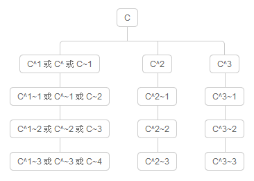

# [Learn-Git-in-30-days (Chinese)](https://github.com/doggy8088/Learn-Git-in-30-days)
Note: Day 1 to Day 3 are skipped as I have learnt the part. This may be added in the future. 

## Day 4 - Common commands 
### Staging files
1. After using `git init` to start a repository, we can use `git add .` to add all the files including hidden ones in the repository. Note that dot "." is a wild-card that matches all the possible files. After adding, we can check with `git status` for the conditions and check if there's any file that hasn't been added. 
1. The added files are "**staged**" which means the files are ready to "**commit**". We can cancel it if by `git reset`. 
1. We can add part of the files or a single certain files with `git add directory/filename`, so the command will stage only the given directory or file. Other commands such as using asterisk. For example, `git add .*` means to add any directory or files that starts with a dot ".". This is useful when we are trying to add all the hidden folders (folders start with dot is hidden in Linux). 

### Commit the update/change 
1. After staging all the files, we can use `git commit -m "message"` to commit the update/change. If the repository just created, it will create and direct us to a [**master**] branch. 

### Check records and versions 
1. After commit, it means we have submit and create a new version in the branch. We then can use `git log` to check previous versions. If the versions are many, we can limit the output by `git log -10` which means to show only the 10 most recent versions. 

### Remove file/directory
1. We can use `rm` in git which will take 2 actions. 
    1. Remove the file from staging and from record. It will show that the file is removed if we check from the records in the future. 
    1. Removed the file in the repository. 

### Change filename
1. `mv` is also available in git. For example, we can change 'text.txt' to 'text1.txt' in the same directory by `git mv text.txt text1.txt`. 

### Resume files
1. We can use `git reset --hard` to resume all the files from the last commit in the branch. 
1. If we make something wrong with a file and wants the previous verion in the record before commit, we can use `git checkout master filename` which will turn the file '**filename**' back from the last commit. In the command 'master' is the [master] branch. Note that if we don't put the file name but only branch, this command will direct us to the given branch. 


## Day 5 - Understanding relationship between repository, working directory, objects, and index 
### Understanding repository 
1. We can use `git init` to initiate and start a repository in a directory. At the directory, GIT will create a `.git` folder which is the repository that keeps all the logs and records of the project we are going to develop. In the repository, we can create "**branches**" 
1. "**objects**" are immutable, which usually have only additional data rather than deleteing or changing the contents. 
1. "**index**" is a mutable file that records the data and contents which are going to be submitted in the next commit. 

### Objects 
1. "objects" are special files that named by SHA1 hashing. When using git version control, all folders/directories and files will be separated into "directory" (tree objects) and "contentes" (blob objects). These objects can't stand alone without each other and are kept in "objects" folder under `.git` directory, as "object storage". 
    1. "tree objects" are used to store what files and related "blob" files are kept in certain folder (directory). 
    1. "blob objects" use the original contents of a file and name it with a "hash id" which is created by SHA1 hashing. 

### Index 
1. "**index**" is a temporary storage file which is usually named "index" under `.git` folder. This file is to record what files are "**staged**" and going to be submitted in the next "**commit**". This "**index**" is as the medium between "**object storage**" and "**working directory**". There are several commands to work with the index file. 
    1. `git add` 
    1. `git mv` 
    1. `git rm` 
    1. `git status`
    1. `git commit`
    1. `git ls-files`
1. Note that "tree object" is similar to directory. Therefore, "working directory" sometimes is written as "working tree". 


## Day 6 - Investigating Git file and object structure 
### Object storage 
1. All files and directory will be stored in "objects" directory under `.git`. All objects are named with a hash value which is created by SHA1 hashing according to the contents of the file. Git will use the first 2 letters of the hash value as the name for directory and the rest as the name for the file. There are 4 types of objects in "object storage". 
    1. blob: the content of a file 
    1. tree: the directory info and records. We can understand this as a snapshot of a directory.
    1. commit: the record that which "tree objects" are in this "commit", timestamp, and activity logs.
    1. tag: a container that keeps metadata related to "commit object". 
1. GIT will create "blob" files for the submitted files in every commit. Therefore, we can resume files and their contents from different commit or branch. 
1. All objects will be compress by "**zlib**" algorithm and uses "**delta compression**" algorithm to increase efficiency and save storage space. The algorithm will find similar blobs and check the difference between them and keep the difference in a "packfile", which is located at `.git` > objects > pack. 
1. To check the contents in a blob file, we can use "**zlib**" to uncompress the file.


## Day 7 - Investigating Git data structure - index structure 
`git status`, `git add`, `git commit`, `git status`, `git rm`, `git mv`
1. In short, index is used to record "what files will be submitted to the next commit". 
1. "Index" has several alias and similar names, such as the followings. Besides, `git diff --cached` and `git diff --staged` are the same. 
    1. "Cache" 
    1. "Directory cache" 
    1. "Current directory cache" 
    1. "Staging area" is the space that waiting to be committed. 
    1. "Staged files" are the files that waiting to be committed. 

    

    1. "untracked" files are the files that are "not tracked" and not added to git repository. 
    1. "unmodified" files are added at the first time in the repository or file content is the same as the "HEAD" content in the repository (which means the file is not changed in any way).
    1. "modified" files are edited or changed and its "HEAD" content is not the same as it in the repository. 
    1. "staged" files are files waited to be committed. These files will be stored in the repository in the next git commit. 
1. We can use `git status` to check the changes and difference between indexed and latest files. There are 3 main categories. 
    1. "Changes to be committed", the files in this category are indexed, the file is the latest version, and will be committed in the next `git commit`. 
    1. "Changes not staged for commit", the files are changed but not added to be committed. Therefore, the latest version of the file will not be committed in the next `git commit`. 
    1. "Untracked files" means that the files are not indexed nor added to be tracked. Therefore, the files won't be stored in the git repository. 
1. `git add` is to add the changes of current working directory to the indexed files. 
1. `git rm filename` can remove the file **BOTH** in the "working directory" and the "git repository". Note that we can use `git rm --cached filename` to remove the file from the "git repository" but keep the file in the "working directory". 
1. `git mv` is simialr to `mv` in terminal command to either move or change the name of a file. 
1. `git commit` will check the difference between indexed and added files and submit the difference as a commit object to store in the repository. 


## Day 8 - Branch basics and usage 
### Branch basics
1. The branch is for developing team and programmers co-working on the same project. However, we can't have infinite branches to work on the same project, as we must merge them into the main (master) when the time goes on. The issue that often happens is that the conflict of versions and code of one or several functions. It's critical of having a good software structure and understanding of using branch and version control. For example, using `git clone` and `git pull` are creating a new branch to develop on the repository from which we copy the program. 
1. A popular practical approach is "**git-flow**" which a branch management module for developers to work on. The module can effectively prevent conflicts (though not all of them) if all programmers follow the workflow. It's critical to understand whether to use "git" to control or not. If the team is small, we can use other management process or skip it if the team members stay close to each other. 
1. "**Start a repository**" - When we use `git init` to create a repository, the user will be on the "**master**" branch by default when access the repository. 
1. "**Create a branch**" - We can use `git branch [branchName]` to create a branch 
1. "**Check branches and location**" - `git branch` to check the list of branches and which branch we are at. 
1. "**Switch a branch**" - After creating a new branch, we can use `git checkout [branchName]` to switch to the "branchName". If we add a `-b` flag, we can create and switch to the new branch at the same time. For example, `git checkout -b [branchName]`. 
1. "**Delete a branch**" - We can use `git branch -d [branchName]` to delete the "branchName". Note that we must switch to other branch to delete a branch. We can't delete a branch if we are still on the branch. For example, if we are on "master" by default and have no other branches, we can't delete the "**master**" branch. 

### Check the whole branches 
1. We can use `git log` to check the previous commits and records of the current branch we are at. We can find each commit has its unique ID that we can use `git checkout [hashedLongID]` to switch to a certain commit. Note that if we switch to an "old" version, git will notice that the user is on "**detached HEAD**" status (which means the user is not on the latest version). 
1. If we use `git commit` on an old commit, the new created commit can't be tracked. Therefore, we should create a branch based on the commit which we switch to by using `git branch [newBranchName]`. Then we should use `git checkout [newBranchName]` to switch to the new branch. Note that we can use `git branch -b [newBranchName]` to create and switch to the new branch at the same time. 
1. We then can use "SourceTree", "Fork" or other GUI git tools to visualize the working trees. 


## Day 9 Difference between files and versions 
1. We can use `git diff id1 id2` to check the difference between 2 commits. We use the following instructions to test by creating 2 text files "a.txt" and "b.txt" and commit twice with different contents in the text files. 
    ```shell
    mkdir git-demo
    cd git-demo
    git init

    echo 1 > a.txt
    echo 2 > b.txt
    git add .
    git commit -m "Initial commit"

    echo 3 > a.txt
    echo 4 > b.txt
    git add .
    git commit -m "Update a.txt and b.txt to 3 and 4"
    ```
1. We can use `git log` to check the commits and use `git diff id1 id2` to check the difference. 
    1. The first line `diff --git` indicates that which file is being compared. 
    1. The 2nd line starting with "index" is the "Header Line" which could have many lines. The "ids" behind is the id of "blob objects" in the object storage. The last "**100644**" is the type of git. 
    ```
    0100000000000000 (040000): Directory
    1000000110100100 (100644): Regular non-executable file
    1000000110110100 (100664): Regular non-executable group-writeable file
    1000000111101101 (100755): Regular executable file
    1010000000000000 (120000): Symbolic link
    1110000000000000 (160000): Gitlink
    ```
    1. In the following line, it indicates files with minus (-) is the old one, while the one with plus (+) is the new one. 
    ```
    diff --git a/a.txt b/a.txt
    index f413f6b..ba86cc4 100644
    --- a/a.txt
    +++ b/a.txt
    @@ -1 +1 @@
    -1
    +3 ^M
    diff --git a/b.txt b/b.txt
    index 33f8ad8..0254308 100644
    --- a/b.txt
    +++ b/b.txt
    @@ -1 +1 @@
    -2
    +4 ^M
    ```
1. When we use `git diff`, git is comparing the "**tree**" object. Before using `git add .`, we can use this command to check what we have changed or updated in this commit. Note that if the all the changed files are added (indexed and staged), there will be no returned message after typing `git diff`. 
1. `git diff HEAD` will check the difference of files between current "**working directory**" (which would not be staged  or commit yet) and "HEAD" (which is the latest verions of the current branch that hasn't been commit yet). Therefore, the returned info will be the same if files "staged (indexed)" and in current "working directory" are the same (it means that we have indexed all the changed files). The information given by `git diff HEAD` and `git diff --cached` should be the same. 
1. We can use `git diff --cached` (same as `git diff --staged` and `git diff --cached HEAD`) command to check what we have done by this commit without giving any commit ID. Besides, we can use `git diff commitID1 commitID2` to check difference between 2 commits. 


## Day 10 - Understanding the absolute name of git object 
1. During version control through git, every version created is a "**commit**" object. Besides, we would create many branches during the development process and make the "**commit graph**" relatively complicated. Therefore, it's critical to understand how to "**identify different versions**" and "**promptly locate the desirable version to extract data**". 
1. Every object created in git system has an "**id**" hashed through "**SHA1**". This "**id**" is the absolute name of the object. If we can access this "id", we can easily access to the data of the version. For example, we can use `git log` to check commits in records. After getting the "**id**", we can use `git cat-file -p commitid` to check the details of the commit. We can use the same method to check with `treeid` and `blobid`. 
1. Though the hashed ID is very long (**40** characters), we can access the commit version by giving id no less than 4 characters. Therefore, it means that the ID will be valid by giving `4` to `40` characters. 
    ```bash 
    git log # list of commits 
    # For example, we take an ID b3f971a8616cb86354d039b4d9ba77f61dd9dc43
    git cat-file -p b3f9 # details of commit ID 
    # tree 85a8903c341d862f133f82357bebccb64fb43038
    # parent d56f227f3b577073eff4d1d774bcda45fe015452
    git cat-file -p 85a8 # access the tree ID 
    # 100644 blob d5c06a97e645b56180c4354dbdf2401e6e9cf6a6    README.md
    # 040000 tree bf3403acd9683388ae157db1b9ace2f8679d5588    git
    # 040000 tree 6915c791d51b408cd2623ad0ca3ef710c397d9ef    html
    # 040000 tree d034306398a3fd59b0d3e93afcf7d62d41f06370    javascriptLearning
    # 040000 tree ef7cba0add134d642bcbab47e986ed4c3655413c    linuxOs
    # 040000 tree e54d4f671279f3ed9f435a608dcb2cb6f830554b    pythonLearning
    ```
1. When checking the records, we can use `git log --pretty=oneline` to keep the records short. By this command, terminal will return only the commit ID and the message left for the commit. 
1. We can make the records even shorter with `git log --pretty=oneline --abbrev-commit`, as the command will return only the first 7 characters of the ID. 


## Day 11 - Git object reference and symbols
`git branch`, `git log --pretty=oneline`, `git log --oneline`, `git cat-file -p [ref or object_id]`, `git update-ref`, `git symbolic-ref`, `git show-ref`
1. In git, "**reference**" is an "**index**" which refers to an object besides the "absolute name" (the 40-character ID). For example, we can use `HEAD` (a symbol reference)to refer to the latest commit in the branch which we are at. Besides, when we use `git branch [brachName]` to create a branch, the "branchName" is the reference. We can find that `git cat-file -p commitid` and `git cat-file -p branchName` return the same results. All the followings return the same results by giving branchName with aligned ID. 
    1. `git cat-file -p commitID`
    1. `git cat-file -p refs/heads/branchName`
    1. `git cat-file -p heads/branchName`
    1. `git cat-file -p branchName`
1. A branch is a commit object which has its own SHA1 hashed ID. We can check the latest commit ID in `.git/refs/heads/master`, which file includes only 1 ID which is the ID of latest commit. Note that if there are other branches, these branches will have folders under `.git/refs/heads` directory. There are 3 main directory in `.git/refs`. 
    1. `heads` has the commits in local repository. 
    1. `remotes` has the commits on the remote repository such as GitHub. 
    1. `tags` 
    
    Linux or OSX bash terminal 
    ```bash 
    cat .git/refs/heads/master # latest commit id
    ```
    Windows command prompt 
    ```bat
    type .git\refs\heads\master rem latest commit id 
    ```
1. Note that when we use git commands with shorthands ("**reference**", such as "**branchName**"), git will search with the following pathes for the file. If it finds, it will return the result. 
    1. `.git/reference`
    1. `.git/refs/reference`
    1. `.git/refs/tag/reference;tagName`
    1. `.git/refs/heads/reference;localbranchName`
    1. `.git/refs/remotes/reference`
    1. `.git/refs/remotes/reference;remotebranchName/HEAD`
1. In git tools, there are several reference will be set in default. 
    1. `HEAD` will always refer to the latest commit of the branch. 
    1. `ORIG_HEAD` is the commit right before the latest one, which is the commit right before the current `HEAD`. 
    1. `FETCH_HEAD` may use `git fetch` to extract objects in the remote repository. This reference keeps the IDs of HEAD from remote repository. 
    1. `MERGE_HEAD` keeps the IDs of merged commits. 
1. We can use `git update-ref reference commitid` to create a reference name such as `branchName` for a ID. Therefore, we can use the reference to access or refer to the object rather than using the id. Note that this function is available for all the git objects, such as `tree`, `parent`, and `blob`. Besides, we can use `git show-ref` to check all the references. 
    ```bash 
    git log --pretty=oneline 
    git update-ref featureUpdate commitid 
    git cat-file -p commitid # check details of a commit object by its ID 
    git cat-file -p featureUpdate # check details of a commit object by its reference name 
    git update-ref -d featureUpdate # delete the reference (not the branch itself)
    ``` 


## Day 12 - Relative name of Git objects 
`git log`, `git cat-file -p [object_id]`, `git rev-parse`
1. Reviewing that each version is a "**commit**" object submitted. Every commit object has an "**absolute name**" (which is the ID that is hashed with SHA1 and has 40 characters). This relative name notation is to allow users to find a commit object by its relative path and location to other commit objects. 

### Relative name notation 
1. There are 2 important characters caret "`^`" and tilde "`~`". 
1. A tilde "`~`" is to refer to the previous version of the commit object. For example, `HEAD~` or `HEAD~1` means the previous one single parent commit object of the current branch. If we give 2 tildes or `2`, such as `HEAD~~` or `HEAD~2`, it find 2 versions before the latest one. 
1. Note that in a repository which has no branch and is never merged, `^1` is the same as `~1` which means the previous versoin. However, these 2 are different in repositories that have branches or used to be merged. 

### Connections between commit objects 
1. In regular Git repositories, there's only a "**root commit object**" in default, which is the very first commit that is submitted after `git init`. Besides, branches can only be created after the first commit is submitted. Therefore, except the "**root commit object**", every commit object must have at least `1` "**parent commit object**". 
1. A commit object may have "**more than 1**" parent commit objects because its parent commit object could be from a merged branch. The commit object created after merge will have multiple parent commit objects. 

### Difference between caret ^ and tilde ~ 
1. A tilde `~` means the previous one single parent commit object. 
1. A caret `^` means to select which of the parent commit objects if there are multiple ones. 
1. For example, we have a reference name `c` of a commit object that has 3 parent commit objects. 

    

1. Note that if a commit object has only 1 single parent commit object, we can't use `HEAD^2` because the commit has only one sigle parent commit object which makes the command `HEAD^2` points to nothing. 

### `git rev-parse` commands
1. Though this command `git rev-parse` aren't often use, these commands can get the absolute name (ID) by the given reference name, such as "master" and "HEAD". 
1. We can use `git rev-parse HEAD` to get the 40-character ID of the latest commit. 


## Day 13 - Git stash and change index 
`git stash`, `git stash -u`, `git stash save`, `git stash save -u`, `git stash list`, `git stash pop`, `git stash apply`, `git stash pop "stash@{id}"`, `git stash apply "stash@{id}"`, `git stash drop "stash@{id}"`, `git stash clear`
1. During development, we may have urgent tasks or must switch to different projects accordingly. In this condition, we can use "**stash**" to temporarily store those unfinished (not ready to commit) tasks. By this case, we can use `git stash` or `git stash save` (which "save" command can be omitted) to create a "**temporary version**" of the current progress, which version is a special commit that is similar to "cache" (stored temporarily but not in storage). 
1. During development, files can be in "**new created**", "**modified**", and "**deleted**" and be "**tracked/staged**" or "**untracked/unstaged**". For example, when editing this git learning note, if we don't use `git add README.md` to stage the modified file, this file will be listed as "**not staged**" when we use `git status` command (which means the file was committed and is differnt from the records in the repository). If we create a new file in the working directory, `git status` will list the new file as "untracked files". 
1. Create a `stash`
    1. There are 2 commands `git stash` and `git stash -u`
        1. `git stash` will pack create a temporary commit that has only the files and contents that are "**tracked**" (indexed). 
        1. `git stash -u` (similar to `git add .` to add all the unstaged(modified)/untracked files). 
    1. Note that the working directory will then resume back to the latest version in `HEAD` and all the modification and deleted files will be resumed, and new files will be removed. 
    1. After creating the "**stash**", the commit object is created similar to other commit but with a reference `stash` (similar to `HEAD` as a symbol reference to the commit). The commit is stored in `.git/refs/stash`. 
    1. We can use `git cat-file -p stash` to check the contents of the object. This stash commit object has 3 parent commits which are 
        1. The original `HEAD` commit (the latest version that is resumed to the current working directory).
        1. The files and contents which are "tracked" (indexed). 
        1. The files and contents which are "untracked" (not indexed). 
    1. Therefore, when we use `git stash -u` the commit is created and creates 2 another branches from the original `HEAD` commit. The 1st is the commit that includes all the files and contents which are "**tracked**" (indexed). The 2nd one is the commit that includes all the fiels and contents which are "**untracked**" (not indexed).
    1. When saving a stash, we can add message directly behind the commnad such as `git stash save -u this is a test message`. Note that we don't need to use `-m` flag or use quotes but simply type the message. Therefore, when we use `git stash list` we can check what stash we stored and description of each. 
1. Resume the `stash`
    1. We can have several "stash" files. However, we should prevent to have too many of them or avoid doing it. 
    1. We can use `git stash pop` to resume the latest version of stash and resume it to current working directory. Note that by using this command, the "popped" version (which commit is resumed to working directory) will be removed. To keep this stash, we should use `git stash apply`. 
    1. After checking stored stashes by `git stash list`, we can use `git stash apply "stash@{n}"` (n is the number of the stash stored in the list. Similar to array, it counts from 0). Note that if we have multiple stashed, other stashes will still be kept in the list. 
1. Delete `stash` 
    1. We can use `git stash drop "stash@{n}"` (n is the number of the stash stored in the list. When we use `git stash list`, it returns a list of stored stash in orders.) This command is used to delete a certain stash object. 
    1. To clean all the stashes, we can use `git stash clear`. 


## Day 14 - Git for Windows 
1. These setting and configurations would be an one-time event though it may take some time for setup. However, it can save a lot of time during development in the future. 
1. We can use `git config --list` to list all the options of git settings in a terminal. 
1. There are 3 layers we can configure the settings, `system`, `user`, and `local` 
    1. **System** - System level configuration `git config --list --system`
        1. By adding `--system`, we can get the options to configure in system level `git config --list --system`. 
        1. All the configurations and settings will be stored in `C:\Program Files (x86)\Git\etc\gitconfig` in default. However, if Windows OS is above "**Windows Vista**" (such as 7, 8, or 10), the directory is under the user. 
        1. This part is skipped and would be revisited after learning more about OS in the future. 
    1. **Global** - User level configuration `git config --list --global`
        1. We can use `git config --list --global` to list the settings. 
        1. Usually, we will configure `user.name` and `user.email` in this level. 
    1. **Local** - Repository level configuration `git config --list --local`
        1. These configurations can be called by `git config --list --local` and are stored in the local repository. 
1. When working on Git, Git will take commands of the priorities as the followings
    1. Local (Repository, Highest)
    1. Global (User)
    1. System (System level, Lowest)
1. Therefore, if we configure a setting in system level and global level, the ultimately configuration to be applied will be the one in global level. 

### Configurations 
1. We can get the list of configurations in different level by the following commands. 
    1. All levels - `git config --list`
    1. System level - `git config --list --system`
    1. User level - `git config --list --global`
    1. Local level - `git config --list --local`
1. "**Get**" the value of a configuration by `git config [config_section.config_name]`. 
    1. For example, `git config user.name` and `git config user.email`. 
1. "**Edit**" configure the value of a setting with `git config [config_section.config_name] [config_value]`. 
    1. For example, `git config user.name "Allen Lin"` and `git config user.email "apple@gmail.com"`. 
1. "**Delete**" a setting with `git config --unset --system [config_section.config_name]`. 

### Frequent used configurations
**Alias settings**
1. We can set up some "shorthands" for frequent used Git commands such as the followings. 
    ```shell 
    git config --global alias.co   checkout
    git config --global alias.ci   commit
    git config --global alias.st   status
    git config --global alias.sts  "status -s"
    git config --global alias.br   branch
    git config --global alias.re   remote
    git config --global alias.di   diff
    git config --global alias.type "cat-file -t"
    git config --global alias.dump "cat-file -p"
    git config --global alias.lo   "log --oneline"
    git config --global alias.ll "log --pretty=format:'%h %ad | %s%d [%Cgreen%an%Creset]' --graph --date=short"
    git config --global alias.lg "log --graph --pretty=format:'%Cred%h%Creset %ad |%C(yellow)%d%Creset %s %Cgreen(%cr)%Creset [%Cgreen%an%Creset]' --abbrev-commit --date=short"
    ```
1. Therefore, we can type `git st` which is the shorthand of `git status`. 

**Change default text editor**
1. When using `git commit`, Git will open "**Vim**" (or **Nano**) text editor in default, if the command is without `-m` flag. We can use `git config --global core.editor` to check current text editor and change the editor by giving the path. For example, we can change to notepad++ (or sublime) with `git config --global core.editor "\"C:\Program Files (x86)\Notepad++\notepad++.exe\""`.

**Access configuration file**
1. We can use the default text editor to edit the files directly by giving `--edit` flag. 
    1. `git config --edit --system`
    1. `git config --edit --global`
    1. `git config --edit --local`

**Auto correction**
1. We may have typos or wrong spelling in CLI. Therefore, we can open `git config --global help.autocorrect 1` for auto correction without typing the command again. For example, Git can fix `git statsu` to `git status` automatically. 

**Message colors**
1. Though this configuration is opened by default, we can switch in on/off by `git config --system color.ui auto`. Note that this is in system level. 

**Custom commit message**
1. We can create a boilerplate for critical information when we submit a "**commit**" to prevent forgetting to insert some critical information or metadata. 
1. We should create a text file at a preferable path. For example, `C:\git-commit-template.txt`. 
1. We then use `git config --local commit.template [filepath]` (such as `git config --local commit.template "C:\git-commit-template.txt"`). Therefore, everytime we use `git commmit`, the terminal will return a template for us to insert for the info of the commit. 
1. Note that we configure the boilerplate in the local level because it may vary for different projects. However, we can use `--global` in user level. 


## Day 15 - Tags, Tagging the important events during version control 
1. During development, we may have some critical version that we'd like to keep an eye on or note as "important" such as milestone or change on direction. We can use `Tag` to highlight the versions to give an alias or an easy-to-remember name of a specific version (commit object). Tags in Git has 2 types
    1. **Lightweight Tag** - We have mentioned "**lightweight**" tag in Day 11, which is the alias of a commit object as a reference name. 
    1. **Annotated Tag** - This is a Git object which is stored in Git object storage (similar to `blob`, `tree`, and `commit` object). Besides, we can store message to it as a commit object. 
1. There's only trivial difference between 2 types of reference in usage. The main difference between 2 types of tags is that the "**lightweight**" one is like a temporary reference. The "**Annotated Tag**" is a permanent object that is stored in the object storage and can store message as other Git objects. 
1. However, when we use `git tag` to list out all the tags, we can't identify if the tag is a "**lightweight**" tag or an "**annotated**" tag. 

### Using lightweight tag 
1. `git tag` to list all the tag objects. 
1. `git tag [tagname]` to create a lightweight tag. 
1. `git tag [tagname] -d` to delete a lightweight tag. 
1. We can check "**contents**" of the tag by `git cat-file -p [tagname]`. 
1. We can check the "**object type**" of the tag by `git cat-file -t [tagname]`. 
1. Note that lightweight tag **IS NOT** a Git object. We can notice that by checking the object type. 

### Using annotated tag 
1. We can put `-a` when create a tag by using `git tag -a [tagname]` to create a "**tag object**". We then can use `-m` to put message when create the object at the same time, `git tag [tagname] -a -m "message"`. 
1. We can make any types of Git object to a "**tag**" object, such as `blob`, `tree`, and `commit`.
1. We will get "**tag**" type when checking the object type with `git cat-file -t [tagname]`. 
1. Note that we should give the object ID to create a tag object to refere to a certain object. Without object ID, it will use the version in "**HEAD**" by default. 
    1. `git tag [tagname]` creates a tag object of the version in HEAD by default. 
    1. We can give an object ID `git tag [tagname] [object_id]` to create a tag object for a specific Git object. 


## Day 16 - Using Git reflog to track modifications 
1. These records are similar to the activity logs. Modifying or editing the `reflog` records doesn't affect to the files and repository and its contents. 
1. We can access the `HEAD` file in `.git/logs/HEAD`. This file records all the commits submitted. We can use `git reflog` to check the file in terminal as well. Note that `git reflog` returns a commit list that starts from the latest commit. However, if we check the `HEAD` file, the commit starts from the first commit. Note that these commits are only the records in the current branch. Besides, from `git reflog` command, we can notice that every commit has a number of order. For example, `HEAD@{0}` is the latest version of the branch. 
1. If we make mistakes or the files go wrong during `git merge` or `git pull`, we can use the reference `HEAD@{0}` to recover the change. Note that all the changes will be recorded, including the hard recovery. For example, if we accidentally commit a change as `wrong commit`, we can use `git reset "HEAD@{1}" --hard` to turn the version back to the version before `wrong commit`. Besides, the change was still recorded, so we can use `git reset "HEAD@{1}" --hard` again to return to `wrong commit` again. 
1. `git reflog` not only list out all the changes and commits but also switch between brancehs. There are several events will be records in `reflog`. Besides, every `branch` and `stash` have thier own `reflog`. All these records are kept in `.git/logs/refs/`. 
    1. `commit`
    1. `checkout`
    1. `pull`
    1. `push`
    1. `merge`
    1. `reset`
    1. `clone`
    1. `branch`
    1. `rebase` 
    1. `stash`

### Show records of a certain branch 
1. We can put branch name behind in the command to show only the records of the branch, such as `git reflog master`. 

### Show details of a version 
1. We can get the abstract of each version with `git reflog`. In addition, we can use `git log -g` to get the complete information of commits in a version. 

### Delete records 
1. `reflog` only records the activity logs of changes and modifications of the repository. Any change to this records doesn't affect to the repository itself. We can ue ` git reflog delete ref@{specifier}` to delete certain records. For example, we can delete the latest change `git reflog delete HEAD@{0}`. 
1. Note that `reflog` isn't synchronized to remote repository by default and stored locally. 

### Setup expiration time of records 
1. During development, the records is being kept. Git, by default, keeps the records in `reflog` for 90 days. If some of the commits aren't in branches, the records will be kept only 30 days. For example, we create a new branch and submit some commits. Though we delete the branch, the commit objects are stil kept in the object storage but can not be accessed through `git log`. These commit objects are "**unreachable**". However, we can set up the expire duration. For example, we keep the files without expiring. 
    1. Avoid deleting the records
        1. `git config --global gc.reflogExpire "never"`
        1. `git config --global gc.reflogExpireUnreachable "never"`
    1. Keep records for only 7 days 
        1. git config --global gc.reflogExpire "7 days"
        1. git config --global gc.reflogExpireUnreachable "7 days" 

### Clear all records 
1. We can use `git reflog expire --expire=now --all` to delete the records and use `git gc` to refresh and clear those unreachable entities.  


## Day 15 - Merge basics and how to use 
1. Git is a DVCS (distributed version control system) that users will keep working "**branch**" and "**merge**" during development. 

### Merge Basics
1. During development, we can separate the branches upon requirements. For example, the main and stable version is on `,master` branch, and we can open a `bugfix` branch to work on bug fixing or `feature` for new functions. After finishing fixing bugs, we can "**merge**" `bugfix` brnach to `master` branch. 
1. Note thate when merging in Git, we can only merge the objects in the same repository, as all the objects are related to each other. Therefore, we can't merge a branch from a repository to one another. 
1. During merge, if the lines in the same file of different branches are different, Git will merge them into a single file. However, when the content on the same line is different as a "**conflict**", Git will ask the user to review and solve the issue. The conflict files will be tagged as "**unmerged**". We can check it from `git status` as well. 
1. Before merging branch, we should be careful with the status 
    1. Which `branch` are we at? (For example, `master` or `feature`)
    1. Ensure the working directory is "**clean**" that all files are indexed and commited. 
    1. Use `git merge [branchName]` to integrate `[branchName]` to current branch. 
    1. We can use `git log` to check records. A new version will be created after branches are merged. 
1. After merging, we can use `git branch -d [branchName]` to delete a branch that is not used in the future. However, with lowercase `-d`, we can only delete branches that are merged to others. Otherwise, we shall use capital `-D` to delete a branch, `git branch -D [branchName]`. 

### Recover deleted branches
1. If we accidentally delete a branch, we can use `git reflog` to find the latest object ID of a branch and execute `git branch [branchName] [objectID]` to recover the branch. 

### Merge with conflicts 
1. If there's conflicts between files during merge, we will get a notice for the issue. Besides, we can also check the status with `git status`. 
1. We can use `git diff` to check what's the difference between conflict files. Git will show the contents of the file in "<" less than sign, ">" greater than sign, and equal sign "=". 

### Solve the conflicts 
1. The easiest way to solve the problem is to index all the modified files and submit a new commit. (This is a very bad solution.)
1. After wrong merging, we can use `git reset --hard ORIG_HEAD` to resume to the previous version, so that we can merge the conflict again. 
1. If there's many files get conflicts during merge, we can use git status to check the "**filepath**" and use `git diff [filepath]` to check difference between the file. 
1. We can use "**SourceTree**", "**fork**", or other Git GUI to resolve the conflicts. After fixing the problems, we can stag the files and commit the version. Note that using GUI to resolve conflicts is much easier than work in CLI. 


## Day 18 - Reset and Amend records 
`git reset --hard "HEAD^"`, `git reset --soft "HEAD^"`, `git reset --hard ORIG_HEAD`, `git commit --amend`
1. One of the most valuable benefit from Git control is to trace back certain version to find the source or root cause of a "**bug**". 
    1. Create and commit a version when building a function, so every functions can be tracked separately. 
    1. Don't accumulate many changes and development and then commit at once. 
    1. Fix and update functions and commit the versions in logical orders, so that the versions are easier to track. 
1. Git allows users to edit the records and activity logs. Therefore, developers can review, summarize, and edit the repository before they share or publish it. There are several details to be concerned. 
    1. A repository may have several branches (the default one is the `master`)
    1. We can share the least Git object is a `branch`.
    1. We can freely change and update all versions on a branch if the branch is not published or shared to others. 
    1. DO NOT edit or change the records of shared branch or repository. 
1. We have prepare the repository for practice with commands below. 
    ```shell 
    mkdir git-reset-demo
    cd git-resst-demo 
    git init

    echo. > a.txt
    git add . 
    git commit -m "Initial commit (a.txt created)"

    echo 1 > a.txt
    git add .
    git commit -m "Update a.txt!" 

    echo 1 > b.txt 
    git add . 
    git commit -m "Add b.txt!" 
    ```

### Delete the most recent version 
1. We can use `git reset --hard "HEAD^"` to delete the `HEAD` version. Therefore, we've change the current version to one previous version, and the latest version is removed from `git log`. However, we still can check the commit object with its object ID. 

### Remove the latest version but keep the changes 
1. From the last practice, though we delete the latest version, we can use `git reset --hard ORIG_HEAD` to recover the deleted version. 
1. Besides, we can use `git reset --soft "HEAD^"` to remove the latest commit but keep the changes. This scenario is useful when we found that the latest version has other issues or hasn't been completed. After changing, we can commit and create another version once again with latest update.

### Re-submit the latest version 
1. If we find some files aren't added or the comment is wrong, we can use `git commit --amend` to edit and update the latest version. The command will added all the files which were staged and commit to the latest version and ask the user to submit the comment again. 
1. For example, we add another file to the repository and use `git commit --amend`. Git will open the default text editor and ask the users to submit the comment again. We can find that the comment is the same as that of the last commit. After saving and quit from the text editor, we can check the status with `git status` and `git log` again. In this case, we can find that the commit object has been changed. 