# HTML Basics 
### Meta tags and search engines
1. We have `<meta>` tags to declare the HTML file that it is responsive to the device, as the content attribute is set up to `content="width=device-width, initial-scale=1.0"`. Besides, there are several meta data we can put in the `<head>` tag for search engine to parse, such as "discription" and "keyword".
    ```html
    <head>
        <meta charset="UTF-8">
        <meta name="viewport" content="width=device-width, initial-scale=1.0">
        <title>Document</title>
    </head>
    ```

### Heading, paragraphs, and typography 
1. In convention, we put only 1 `<h1>` tag on a page. 
1. `<strong>` tag is to make text bold, and `<em>` tag (emphasis) is to make the text italic. 
1. `<br>` tag is to have a "**line break**" (a new line between paragraphs). One `<br>` tag is like a new line character `\n`. To have a line between 2 paragraphs, we need 2 `<br>` tags to fulfill. 
1. `<hr>` tag is "horizontal rule" to have a horizontal line on the page. 
1. After HTML5, the language becomes more semantic and use `<strong>` tag rather than `<b>` tag for bold feature. However, styling features should be separated and use with CSS. The point to have `<strong>` tag is to indicate that the text is import and should stand out. 

### Links, images, and attributes 
1. Anchor tags `<a>`
    1. We put "href" attribute in `<a>` anchor tag to direct the user to the given URL after clicking. 
    1. We can put both "<ins>**URL**</ins>" (remote) and "<ins>**file path**</ins>" (local) to "href" attribute to direct to the HTML file. 
1. Image tags `` 
    1. These tags are similar to anchor tags that they can take both "<ins>**URL**</ins>" (remote) and "<ins>**file path**</ins>" to their "<ins>**src**</ins>" (local) attribute. 
    1. Besides, `` tags have another attribute `alt` which is the "<ins>**alternative text**</ns>" when the image doesn't show up. The tag shows the image's original size in default. 

### Lists and tables 
1. **Lists** 
    1. "**Unordered list**" - We have `<li>` tags wrapped by `<ul>` tags. Besides, there are several styles of unordered list bullet-symbols that we can use inner style or CSS to change it, such as `square`, `disk`(default), `circle` (unfilled circle, empty inside), and `none`. 
    ```html
    <ul style="list-style: square">
        <li>Item1</li>
        <li>Item2</li>
        <li>Item3</li>
        <li>Item4</li>
    </ul>
    ``` 
    1. "**Ordered list**" - Ordered list are wrapped by `<ol>` tags and use `<li>` tags as unordered list does. However, it uses attribute as "**type**" to change the style, such as "1" for numerals (default type), "i" and "I" for roman numerals in lower and uppercase, and "a" and "A" for alphabets in lower and uppercase. 
    ```html
    <ol type="A">
        <li>Item1</li>
        <li>Item2</li>
        <li>Item3</li>
        <li>Item4</li>
    </ol>
    ```
    1. We can also have `<ul>` or `<ol>` nested in the `<li>` for nested tags. 
1. **Tables** 
    1. Tables are usually just used for tabular data. For table like layout on the page, it's better to use CSS flexbox or grid for the feature. We use `<table>` tags to create a table with following elements. 
    1. `<thead>` is the header section of the table. 
        1. `<tr>` is for the row.
        1. `<th>` is for each column in the row.
    1. After header, we can include the main data with `<tbody>`. 
        1. `<tr>` is for the row in the body part. 
        1. `<td>` for the data in the body part, while `<th>` is for the header only. 
    ```html
    <table>
        <thead>
            <tr>
                <th>First Name</th>
                <th>Last Name</th>
                <th>Email</th>
            </tr>
        </thead>
        <tbody>
            <tr>
                <td>John</td>
                <td>Doe</td>
                <td>jdoe@gmail.com</td>
            </tr>
            <tr>
                <td>Kate</td>
                <td>Smith</td>
                <td>kate@gmail.com</td>
            </tr>
            <tr>
                <td>Jeff</td>
                <td>Wilson</td>
                <td>wilson@gmail.com</td>
            </tr>
        </tbody>
    </table>
    ```

### Forms and input 
1. We use `<form>` tag which has attribute as `action` that can manipulate the data collected from the form elements with backend program, such as `process.js` or `process.py`. 
1. In the form, we can use `<div>` tag to create a division for the section of an input. 
1. All `<input>` tags have an attribute `value` which we can set a default value in the textbox or be selected when the page is loaded. 
1. We can use `placeholder` attribute of `<input>` tags to give hint of the type of the data requested to the user. The text is in grey by default and will disappear when any value or character is given to the `<input>` tag. 
    1. In the division, we use `<label>` with attribute `for` which will link to the `<input>` tag that has the an `id` which is the same value as the value for `for` and the name for the input tag. 
    1. After the `<label>` tag, we have an `<input>` tag to collect data from users. We can set up `type` for the type of data to collect of the input element, `name` as the variable which can be parsed and retrieved by backend programs, and `id` of which has the same value as the `for` in `<label>` tag can link them together. 
    1. We can set the `type` of `<input>` tag as "**text**", "**password**" (which input will be masked), and "**email**" that has a simple validation of data pattern on the client side (We can use other mechanism or program to validate email addresses on the backend side). 
    1. We can use `<textarea>` to have a large input section for multiple lines on the page. The element has similar attributes and have `cols` as columns to modify the width of the textbox and `rows` as rows to modify the height of the textbox. 
    1. `<select>` tag is a dropdown menu which we can have multiple `<option>` tags as the items in the selective list. Note that we should set up the attribute `value` for the value of the `<option>` tag. Besides, we can have one of the `<option>` has attribute `selected`, so the option will be in default when the page is loaded. 
    1. If the `type` of `<input>` tag is number as `type="number"` the tag takes only numbers and can be adjusted with a side button. 
    1. With `type="date"`, we can have a "**date selector**" to ensure the user gives a valid date format. 
    1. With `type="radio"`, we can have a single option selector with different values. Note that the radio button itself is an `<input>` tag, while the option is just a pure text in HTML. Therefore, we can have several `<input>` tags to have multiple options as radio buttons to select. Besides, if we set `<input>` tag attribute `checked`, the option will be selecgted when the page is loaded as default value. 
    1. With `type="checkbox"`, we can have checkboxes as multiple selections that is similar to radio buttons. 
    1. To create a "**submit**" button, there are several ways to do so. For example: 
        1. Use input tag - `<input type="submit" value="Submit">` 
        1. Use button tag - `<button type="submit">Submit</button>` 
    1. We can use `<button type="reset">Reset</button>` to clear all the inputs in the same form as default value when the page is loaded. 
    ```html
    <form action="#">
        <!-- text -->
        <div>
            <label for="name">Name</label>
            <input type="text" name="name" id="name" placeholder="First and Lastname">
        </div>
        <br>
        <!-- email -->
        <div>
            <label for="email">Email</label>
            <input type="email" name="email" id="email">
        </div>
        <br>
        <!-- textarea -->
        <div>
            <label for="message">Message</label>
            <textarea name="message" id="message" cols= "20" rows="5"></textarea>
        </div>
        <br>
        <!-- select -->
        <div>
            <label for="sex">Sex</label>
            <select name="sex" id="sex">
                <option value="male" selected>Male</option>
                <option value="female">Female</option>
                <option value="other">Other</option>
            </select>
        </div>
        <br>
        <!-- number -->
        <div>
            <label for="age">Age</label>
            <input type="number" name="age" id="age">
        </div>
        <br>
        <!-- date -->
        <div>
            <label for="birthdate">Birthdate</label>
            <input type="date" name="birthdate" id="birthdate">
        </div>
        <!-- radio -->
        <div>
            <label for="membership">Membership</label>
            <input type="radio" name="membership" id="membership" value="simple"> Simple 
            <input type="radio" name="membership" id="membership" value="standard" checked> Standard 
            <input type="radio" name="membership" id="membership" value="super"> Super 
        </div>
        <!-- checkbox -->
        <div>
            <label for="membership">I Like...</label>
            <input type="checkbox" name="likes"  value="bike"> Bike 
            <input type="checkbox" name="likes" value="car" checked> Car 
            <input type="checkbox" name="likes" value="boat"> Boat 
        </div>
        <!-- buttons -->
        <input type="submit" value="Submit">
        <!-- <button type="submit">Submit</button> -->
        <button type="reset">Rest</button>
    </form>
    ```
1. Note that after clicking the submit button, an action is trigerred that all the input will be submitted or hanlded by a backend program if there's any. It means both "submit" and "reset" to a format works the same that it wipes out all the inputs, while "submit" can have an action to send the data to other programs. 

### Block and inline level elements 
1. We can check the overview at [w3school](https://www.w3schools.com/html/html_blocks.asp)
1. The main difference between "block" and "inline" elements is that block elements will separate themselves into a "block" as a section or paragraph of an article. This makes the element fills the whole width of the screen according to the size fo the monitor. For example, `<p>` tags and `<ul>` and `<li>` tags. 
1. "inline" element, on the other hand, follow each other as a concatenated chain in the same line. For example, `<a>` anchor tags and `<strong>` tags. 
1. We can use CSS to change the attribute to make an element appears as a "block" or "inline" element. 

### Divs and spans, classes, and IDs
1. We can have `<div>` tags to wrap elements in the same block. `<span>` is to group elements in the same line. 
1. "`id`" should be set to a single element in HTML file, while a "`class`" can be assigned to multiple elements at the same time. In convention, an "`id`" shouldn't repeat. 
1. `&copy;` is the © (copyright) symbol in HTML that we can call. There are other symbols we can use as well. 
    ```html
    <div id="main-header" class="card">
        <h1>My Website</h1>
        <p>A site about me</p>
    </div>
    <ul>
        <li><a href="#">Home</a></li>
        <li><a href="#">About</a></li>
        <li><a href="#">Contact</a></li>
    </ul>
    <div id="about" class="card">
        <h3>About</h3>
        <p>Lorem ipsum, dolor sit amet consectetur adipisicing elit. <span class="enhance">Nesciunt deleniti rem nobis dolor unde maiores perferendis molestiae saepe libero </span> suscipit beatae dicta a voluptas, <div class="enhance">obcaecati reprehenderit corporis</div> eaque impedit ad!</p>
    </div>

    <div id="contact" class="card">
        <h3>Contract Me</h3>
        <ul>
            <li>Address: 50 Main st, Boston MA</li>
            <li>Phone: 123-456-7890</li>
            <li>Email: apple@gmail.com</li>
        </ul>
    </div>

    <div id="footer">
        <p>Copyright &copy; 2020</p>
    </div>
    ```

### HTML entities 
1. We can check the list of HTML entities at [w3school](https://www.w3schools.com/html/html_entities.asp). The entities can called by its "**entity name**" or "**numer**". For example, a non-breaking space can be called by `&nbsp` and `&#160` in HTML. 
1. **Non-breaking space** - `&nbsp;` is non-breaking space in HTML that it's a character to represent whitespace in HTML. In default, if we have several white space between text in a `<p>` tag for example, there no different between `<p>I'm happy</p>` and `<p>I'm               happy</p>`, as the browser consider these 2 tags are the same. To have the feature as multiple whitespaces between words, we can use `&nbsp;` such as `<p>I'm &nbsp; &nbsp; &nbsp; &nbsp; happy</p>`. The result will be "I'm     happy" on the page. 
1. **Greater than and Less than** - `&gt;` is the "greater than" sign `>` in HTML, as if we put the character in line directly, so browsers may get confused and rendered wrong result. We can use `&lt;` for "less than" character `<`. 
    ```html
    call HTML entity by entity name 
    5 &gt; 2 
    1 &lt; 3
    call HTML entity by entity number 
    5 &#62; 2 
    1 &#60; 3
    ```
1. `&copy;` for © copyright 
1. `&reg;` for ® trademark 
1. Currency and dollar signs 
    1. `&cent;` for ¢ dollar cents 
    1. `&yen;` for ¥ Japanese Yen 
    1. `&euro;` for € Euros
1. Suit of playing cards 
    1. `&spades;`♠ BLACK SPADE SUIT
    1. `&clubs;` ♣ BLACK CLUB SUIT
    1. `&hearts;`♥ BLACK HEART SUIT
    1. `&diams;` ♦ BLACK DIAMOND SUIT
1. Inline element, computer code tags `<code>`, such as `<code>Hello World!</code>`
1. Inline element, keyboard instructions `<kbd>`, such as `<kbd>Ctrl + S</kbd>` for <kbd>Ctrl + S</kbd>

### HTML Semantic Tags 
1. Each of them represents a section of the webpage. The tags also help search engine and disabled people to understand what's the purpose and part on the page rather than a simple `<div>` tag which has no meaning. 
    1. `<header>` is on the top that has a search bar or other generic buttons. 
    1. `<footer>` is a the bottom that contains copyright, trademark or other information or links of the page. 
    1. `<nav>` is the navigation bar on the top or on the side for users to easier access the services or pages on the website. 
    1. `<main>` is usually the main body and content of the page. However, we can skip this tag and use `<section>` directly. 
    1. `<section>` is similar to `<div>` tag to use to separate elements into section or group elements. 
    1. `<article>` is used for textful elements such as showing part of a blog post rather than using `<p>` tag. 
    1. `<aside>` is the tag to hold elements aside the main contents such as advertisements or other trivial functions on the page. 
```html
<head>
    <meta charset="UTF-8">
    <title>Document</title>
    <style>
        * {
          box-sizing: border-box;
        }
  
        ul {
          padding: 0;
          list-style: none;
        }
  
        body {
          font-family: Arial, Helvetica, sans-serif;
          color: #333;
          line-height: 1.4;
        }
  
        #header {
          margin-bottom: 15px;
          background: #333;
          color: #fff;
          padding: 10px;
        }
  
        #main {
          float: left;
          width: 69%;
        }
  
        #sidebar {
          float: right;
          width: 29%;
        }
  
        .clr {
          clear: both;
        }
  
        #footer {
          background: #333;
          color: #fff;
          padding: 10px;
        }
  
        .text-center {
          display: block;
          text-align: center;
        }
  
        .card {
          border: 1px solid #ddd;
          background: #f4f4f4;
          padding: 20px;
          margin-bottom: 10px;
        }
      </style>
    </head>
    <body>
      <!-- Header -->
      <div id="header" class="card">
        <h1>My Website</h1>
        <p>Just Another Website</p>
      </div>
  
      <!-- Main Content (left) -->
      <div id="main">
        <!-- Welcome Section -->
        <div id="welcome" class="card">
          <h2>Welcome To Our Website</h2>
          <p>
            Lorem ipsum dolor sit amet consectetur adipisicing elit. Fugiat cupiditate itaque possimus numquam corporis odit deserunt voluptas repellat ad ex earum magnam mollitia magni eaque nisi, excepturi nam
            temporibus! Sed. <br/>
            <a href="#" class="text-center">Click For More</a>
          </p>
        </div>
        <!-- Blog Section -->
        <div id="blog">
          <h2>From Our Blog</h2>
          <!-- Article One -->
          <div class="article">
            <h3>Article One</h3>
            <p>
              Lorem ipsum dolor sit amet consectetur adipisicing elit. Autem veniam adipisci necessitatibus quia quisquam? Eligendi vitae quia totam accusantium officiis!
            </p>
          </div>
          <!-- Article Two -->
          <div class="article">
            <h3>Article Two</h3>
            <p>
              Lorem ipsum dolor sit amet consectetur adipisicing elit. Autem veniam adipisci necessitatibus quia quisquam? Eligendi vitae quia totam accusantium officiis!
            </p>
          </div>
        </div>
      </div>
  
      <!-- Sidebar (right) -->
      <div id="sidebar" class="card">
        <h3>Navigation</h3>
        <!-- Navigation -->
        <ul id="main-nav">
          <li><a href="index.html">Home</a></li>
          <li><a href="about.html">About</a></li>
          <li><a href="contact.html">Contact</a></li>
        </ul>
        <hr />
        <h3>Contact Us</h3>
        <ul>
          <li><strong>Address:</strong> 50 Main st, Boston MA</li>
          <li><strong>Phone:</strong> (555) 555-5555</li>
          <li><strong>Email:</strong> me@somethingcool.come</li>
        </ul>
      </div>
  
      <div class="clr"></div>
  
      <!-- Footer -->
      <div id="footer">
        <p class="text-center">Copyright &copy; My Website 2019</p>
      </div>
</body>
```
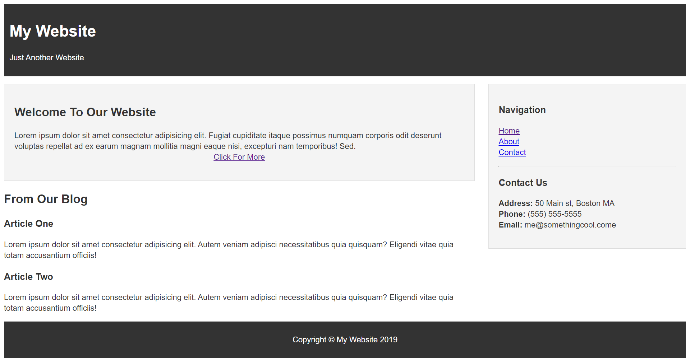

# CSS Basics 
### Implementing CSS 
1. There are several ways to implement CSS on the HTML file. 
    1. We can use "**inline**" CSS in the element tag directly with `style` attribute. This is not recommended as it's hard to read, and it's easier to mangage and maintain the code with a separated file. 
    1. Use `<style>` tag in `<head>` tag on the top and include the CSS selectors with styling. 
    1. Use `<link>` tag to refer to a separated file with 2 attributes `rel` (which indicates the type of the file to refer to, and we use `rel="stylesheet"` for CSS file) and `href` which is the path reference to point to the file to link to. If the CSS file `style.css` is at the same direcotry, we can use `href="style.css"`. Therefore, we can put 
    `<link rel="stylesheet" href="style.css">` in `<head>` tag. 
1. A CSS selector includes several parts. For example, we have a selector to select element "**a**" in HTML file and set its "**background-color**" to "<span style="color:yellow">yellow</span>". 
    ```css 
    a {background-color: yellow;}
    ```
    1. "selector" which is `a` 
    1. Declare the "**property**" and "**value**" pair in curly braces "`{}`". 
    1. Pair and separate "**property**" and "**value**" with a column "`:`" 
    1. Use semi-column "`;`" to separate declarations in the block. 
1. We can add CSS comments with `/*CSS comments*/` which is the same as multi-line comments in JavaScript. 

### Basic CSS selectors 
1. Selector will select all the tags (elemnets) that matches. For example, if we select `<p>` tag, all the `<p>` paragraphs will be selected and modified. 
1. We can give a tag attribute `id`, so it can be selected directly by the selector with certain attribute. 
    1. For exmple, if we have 2 `<h2>` tags on the page but want to select only the first one, we can give an `id` and set the element as `<h2 id="greenColor">` and use CSS selector to modify its contents to <span style="color:green">green</span>. Therefore, only the `<h2>` tag that has attribute `id="greenColor"` will be colored green. 
    1. In convention, `id` attribute is unique for elements. Therefore, we can omit `<h2>` tag and use pound sign "#" to select the element with `id` direclty. 
    1. Note that the element with an attribute should be concatenated without space in between. 
    ```css
    h2#greenColor {
        color: green; 
    } 

    #greenColor {
        background-color: red; 
    } 
    ```
1. **ID and class selector** - Since `id` is unique attribute, we can use `class` instead if we want to reuse the styling. The selector symbol for a `class` is a dot "`.`". 
    ```css
    .aClass {
        color: blue;
    }
    ``` 
1. Naming for the class is essential as it may be confusing for certain purpose, though there's no concrete way for that as it should be changed accordingly. 
1. **Multiple Selectors** - We can put several tags as in selector to modify multiple elements at the same time. We can use comma "`,`" to separate the selectors before the declaration with curly braces. 
    ```css
    #element1, #element2, #element3 {
        border: 1px solid #ccc; 
        padding: 10px; 
        margin-bottom: 5px; 
    }
    ```
1. **Nested Selectors** - This indicates an element that is nested (or the child element) of another element. The selector is reading from left-to-right and separated by whitespace. Therefore, the last element on the right is the element that is nested and to be modified by the selector. Note that all elements that match the selector conditions will be selected and modified. 
    ```css
    /* <span> tag nested in the element that has id="element1" will be colored purple */ 
    #element1 span {
        color: purple; 
    }
    ```
### Fonts in CSS 
1. We can use `<link>` tag to import font family from other source such as Google fonts. After imoprting, we can have `font-family` property in CSS selector and change the font to desirable style. For example, we import `roboto` style with weight 400 and 700 from Google fonts. Besides, font-family is for the whole content of the page, so we can put it in the body element directly. 
    ```css 
    body {
        font-family: 'roboto';
    }
    ```
1. We can also adjust the `font-size` and `line-height` of the contents. There are several units in CSS that we can set. 
    1. <ins>**Aboslute units**</ins> on the page, while we usually se only `px` to set the value. 
        1. `cm` is centimeters. 
        1. `mm` is millimeters. 
        1. `in` is inches. 
        1. `px` is pixels, which is around 1/96th of 1 inch. 
        1. `pt` is points, which is around 1/72th of 1 inch.
        1. `pc` Picas picas, which is 12pt. 
    1. <ins>**Relative units**</ins> are related to other elements such as <ins>**parent**</ins> or <ins>**root**</ins> element. 
        1. `%` is the percentage to <ins>**parent**</ins> element.
        1. `em` refers to font-size of <ins>**parent**</ins> element. 
        1. `rem` refers to font-size of <ins>**root**</ins> element, which is 16px by default. 
        1. `vw` refers to 1% of viewport width. 
        1. `vh` refers to 1% of viewport height. 

### Color types 
1. There are 3 main types of ways to call a color 
    1. **Color name** such as <span style='color:red'>red</span>, <span style='color:blue'>blue</span>, <span style='color:yellow'>yellow</span>, and <span style='color:cyan'>cyan</span>
    1. **RGB numbers** for Red, Green, and Blue from 0 to 255 (256 units of each), such as <span style='color:rgb(0,255,0)'>green</span> by `rgb(0,255,0)`, <span style='color:rgb(0,0,0)'>black</span> by `rgb(0,0,0)`, and <span style='color:rgb(255,255,255)'>white</span> by `rgb(255,255,255)`.
    1. **Hex number** starting with a pound sign "#", such as <span style='color:#f4f4f4'>grey</span> by `#f4f4f4`, which color is usually used for background color for textarea, <span style='color:#000000'>black</span> by `#000000`, or <span style='color:#fff'>white</span> by `#fff`. Note that in computer science, hexadecimal is from 0 to f, which is 16 digits (0 to 9 and 'a' to 'f'). 
1. In VSCode IDE, the program shows color selector if we put a pound sign "#" in CSS file. Besides, we can also check the hexadecimal code on website, such as [color-hex](https://www.color-hex.com/). 

### Backgrounds and borders  
1. We can give properties in CSS selector to chagne the styling such as background color and give a border to the element. 
1. **Background color** can be changed by property `background-color` and give by a color in `color name`, `rgb()`, or `hex`. 
1. **Border** can be set up with 3 parameters, `width`, `color`, and `style`. Note that we need all 3 to make the border styling up. The usual border style to be used is `solid`. There are other styles, such as `dashed`, `inset`, `outset`, and `dotted`. Besides, we can use `border` property and have all 3 parameters in one line (regardless of the order of parameters). 
1. The border wraps up an element on its 4 sides from `top`, `right`, `bottom`, and `left`. We can also set each them in different style for an element. 
1. We can round the border on the corner of an element with `border-radius`. We can also round one of the corners with `border-top/bottom-left/right-radius`, such as the top left corner as `border-top-left-radius: 10px`. 
    ```css 
    /*border property in 3 separated parameters*/
    element {
        border-width: 3px; 
        border-color: red; 
        border-style: solid; 
    }
    /*border property in one line*/
    div {
        border: 5px blue dashed; 
    }
    /*border on each side of an element*/
    div element {
        border-top: blue solid 6px; 
        border-right: green dashed 6px; 
        border-bottom: red dotted 6px; 
        border-left: cyan inset 6px;
    }
    /*round border on the corner of an element*/
    roundCorner {
        border-radius: 10px; 
    }

    /*round border on one of the corners of an element*/
    oneCorner {
        border-top-left-radius: 1em; 
    }
    ```
1. **Background image**
    1. **Background image** - We can use `background-image: url('path')` property to set up the background image with local file or online URL link. For example, we can refer to a local file that stores in the folder `img`. 
    1. **Background repeat** - As the image has a certain size, we can set up to repeat the image if it's smaller than the section it covers (though it's not a good idea). Thus, we can turn off the feature with `background-repeat: no-repeat`. 
    1. **Background position** - If the image is larger than the section it covers, or we want certain part of the picture to be shown in the element block, we can use `background-position: x-axis y-axis` to position the image. The values of the position can be 
        1. Positive that it pushes the image from left-to-right on x-axis and top-to-bottom on y-axis. 
        1. Negative on both x-axis and y-axis that pushes the image from "right-to-left" and "bottom-to-top" and shows different part of the image. 
        1. Relative positions such as `center`, `bottom`, `top`, `left`, and `right`. 
    1. `background-size` is default at `auto` which shows the original size of the image and can be set up as `cover` through `background-size: cover` that the background image will be stretched and fit to the width of the background covering area. For `contain` the image will only cover the background at the size without distorting the image. It means that the image will be fully visible at any resolution. We can also set it by percentage which scales the image by the size of the element that contains it.
    ```css
    body {
        background-image: url('./img/background.png');
        background-repeat: no-repeat; 
        background-position: -10px 100px;
        background-size: cover; 
    }
    ```
1. We can also put all the background properties in the same line as `border`. As other selectors the values can be in any order except that `size` property must be followed by `position` proerty with a slash `/`.
1. As the background image will be at set up position on the page and goes away if we scroll the page when browsing. We can use `background-attachment: fixed` to keep the image at certain position on the page. 
    ```css 
    body { 
        background: url('icon.png') center center no-repeat;
        background-size: 20%;
        background-attachment: fixed;
    }
    ```

### Box model, margin, and padding 
1. Each HTML element has different `margin` and `padding` by default. Any given new properties or values will override the default value setting, while we can check in the developer console in the browser. 
1. Both spaces will add space on 4 sides of an element if it's not specified. It can also be added as border that on `top`, `right`, `bottom`, and `left`. 
1. The values can also be given in one line as a shorthand which follows the order from `top` to `left` clockwise. Thus, the `margin` or `padding` property takes 4 values in order. 
1. The shorthand can be even shorter as the top/bottom and left/right can be paired if the values are the same (which is similar to the idea that given one value and applies to 4 sides). The property takes only 2 values which follows the order `top/bottom` and `left/right`. 
    ```css 
    /* one line shorthand */
    div {
        padding: 10px 20px 30px 40px; 
    }

    /* top/bottom and left/right shorthand*/
    div {
        margin: 30px 20px; 
    }
    ```
1. We can reset the CSS file with "asterisk" "`*`" as the selector, which is a wild selector that selects everything. 
1. **Padding** - Padding is the space inside the border of an element. It's the <span style="color:green">green</span> part of an element if we check it in the developer tools of Google Chrome browser. 
    1. Set up `padding` of an element directly will extend the size of the element as well. To prevent that, we can use `box-sizing: border-box` to the parent element of which element that adds the `padding`, so the extra space will be limited to the setup width and height of the element. 
    1. It means the that element which adds padding will <ins>**remain the same size**</ins> and adds padding inside. However, this may distort the element if the scale is not correct. Besides, if there's no limitation on `width` and `height`, the element will still be streched by `padding`. 
    ```css 
    /*reset all elements on the page*/
    * {
        margin: 0; 
        padding: 0; 
        box-sizing: border-box; 
    } 
    /*element is not going larger as its limited by box-sizing of its parent element*/
    element {
        padding: 120px
    }
    ```
1. **Margin** - Margin is the space out of the border of an element. It's the <span style="color:orange">orange</span> part of an element if we check it in the developer tools of Google Chrome browser. 

### Float and Alignment 
1. The design in the past (around 2000s) may still have webpage alignment on the left as article. However, modern designs have shifted the contents to the center of the page which can be fit to smaller screens such as mobiles. (Note that we have only pure text in this case.)
1. **Alignment and container**
    1. To center the elements, we can have a "**container**" element to wrap/group the elements. For example, we can use `<div class="container">` to wrap all element. We then use CSS and give property `margin: "auto"` which will center its child elements. Note that if we give only one value to `margin`, it applies to all 4 sides of the element. If we give 2 values, the 1st one is for top/bottom and the 2nd one is for left/right. 
    1. Besides, if we give a value to property `width`, it will extend the contain at the fixed width regardless the resolution of the screen. This is poor design that mobile users may have to swipe as the contents are extended, or the contents are too narrow on a bigger screen. Therefore, we can use `max-width` to limit the width. If the screen is smaller, text message will be on the next line as applied `word wrapped`. 
    1. For elements that contain text, we can use `text-align` property to set the alignment of the contents, such as `left`, `right`, `center`, and `justify`. Note that justify is similar to center but keeps each line of texts in the same width, so we don't see text shaped as pyramid or trapezoid. 
1. **Float**
    1. The purpose for `Float` is to align 2 blocks of element on the page, such as a side menu and the main contents. It "**floats**" the element above other contents and align to left or right. 
    1. This is an old-fashion way to design the layout, as we can use "<ins>**flexbox**</ins>" and "<ins>**grid**</ins>" in modern browsers with HTML5 and CSS3. This approach is relatively hard to deal with responsive design for multiple screen sizes. 
    
    1. We can set the width of floated elements with percentage, so the elements can be alinged on the same line. Besides, we can have the percetage not in 100% if we have 2 element and want to keep them separated. For example, one elements can have `width: 68%` and the other has `width: 30%`. 
    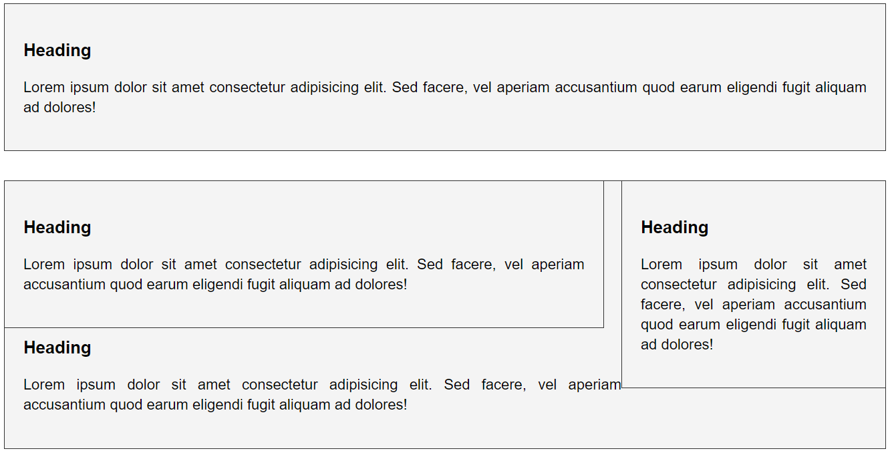
    1. However, as the elements are floated, the following element will be under the floated ones. Therefore, we can add another element with `clear` property and use `clear: both` to deny floating elements on both `left` and `right` on the element. 
    ```html
    <style>
        #box-2 {
            float: left;
            width: 68%;
        }
    /*keep width within 100% to have space between elements*/
        #box-3 {
            float: right; 
            width: 30%;
        }
        .clr {
            clear: both;
        }
    </style>
    <body>
        <div id="box-2" class="box">
            <h3>Heading</h3>
            <p>Lorem ipsum dolor sit amet consectetur adipisicing elit. Sed facere, vel aperiam accusantium quod earum eligendi fugit aliquam ad dolores!</p>
        </div>
        <div id="box-3" class="box">
            <h3>Heading</h3>
            <p>Lorem ipsum dolor sit amet consectetur adipisicing elit. Sed facere, vel aperiam accusantium quod earum eligendi fugit aliquam ad dolores!</p>
        </div> 
        <!-- element that deny floating elements -->
        <div class="clr"></div>
        <div id="box-4" class="box">
            <h3>Heading</h3>
            <p>Lorem ipsum dolor sit amet consectetur adipisicing elit. Sed facere, vel aperiam accusantium quod earum eligendi fugit aliquam ad dolores!</p>
        </div>
    </body>
    ```

### Link State and Button Styling
1. We can style a `<a>` tag as a button. There several state such as `hover` when the mouse cursor is on the element that we can use "**pseudo selector**" to select it. 
    ```css
    /*change font size and color when mouse cursor hovers on*/
    a:hover {
        color: coral;
        font-size: 20px;
    }

    a:visited {
        color: red;
    }

    a:active {
        color: green;
    }
    ```
1. In convention, we can give a `class` to the elements that we'd make them buttons as `class="btn"`. We can use `cursor: pointer` to have the effect that the mouse cursor will become a pointer when its hover on the element. We can also use `pseudo selector` to change the style when the mouse cursor hover on the element. A convention design at the time is making the element darker. 
    ```html 
    <style>
        .btn {
            background: #4c6ca0;
            color: #fff;
            border: none; 
            font-size: 16px; 
            padding: 10px 20px; 
            border-radius: 5px; 
            cursor: pointer; 
        }
        .btn:hover {
            color: #f4f4f4;
            background: #446190;
        }
    </style> 
    <body>
        <br>
        <a class="btn" href="#">My Link</a>
        <br>
        <br>
        <button class="btn">My Button</button>
    </body>
    ```

### Navigation Menu Styling 
1. We create a "**side-menu**" with `<ul>` and `<li>` list and decorate them with CSS. 
    ```css
    /*change font*/
    body {
        font-family: Arial, Helvetica, sans-serif;
    }
    /*change the overall size of the menu*/
    .side-menu {
        list-style: none;
        border: 1px #ddd solid;
        border-radius: 10px;
        width: 300px;
        padding: 20px;
    }
    /*give border and space between each <li> element*/
    .side-menu li {
        font-size: 18px;
        line-height: 2.4em;
        border-bottom: dotted 1px #ddd;
    }
    /*use pseudo selector to remove border of the last element*/
    .side-menu li:last-child {
        border: none;
    }
    /*change color of text and remove underline feature of anchor tag*/
    .side-menu li a {
        color: #333; 
        text-decoration: none;
    }
    /*change color to coral when the mouse cursor hover on the element*/
    .side-menu li a:hover {
        color: coral; 
    }
    ```
1. Similar to side menu, we create <ins>**Navbar**</ins> with `<ul>` and `<li>` and use property `float:left` on the `<li>` items to make them all float on the top. However, this will break the background feature that makes background color disappear. 
    1. We can use `overflow: auto` on the `<ul>` tag or its class to set it up. For each anchor tag `<a>` in the navbar, we can use property `display: block` which allows the elements dispaly as block elements which take the whole width. Note that the element with `display: block` must have padding that takes space. Otherwise, there's no effect on that. 
    1. We then add on an effect when the mouse cursor hover on the element and changes its color. 
    ```css 
    .navbar {
        list-style: none;
        margin: 0;
        padding: 0; 
        background: #4c6ca0;
        border-radius: 5px; 
        overflow: auto; /*enable background color for float elements*/
    }

    .navbar li {
        float: left;
    }

    .navbar li a {
        display: block; /*allow elements take whole width as a block element and must work with padding*/
        color: #fff;
        text-decoration: none;
        padding: 15px 20px; /*give each button-like anchor tags a certain size and works with property display: block*/
    }

    .navbar li a:hover {
        background-color: #446190;
        color: #f4f4f4;
    }
    ```

# Inline, Block, and Inline-block Display 
1. '`display`' property is very important in CSS as that it is used to implement "**flexbox**" and "**grid**". 
1. We create a list with `<ul>` and `<li>` tag and use CSS selector to let all `<li>` tags have `display:inline` which makes all elements float and like `list-style: none` as they don't have bullet point symbols because `<li>` tags are **block elements**. Note that by using `display` property, the bullet points will be removed.
1. To center an image, we have to change its property with `display: block` as `` tag is an inline element which can't be centered with `margin: auto`. However, if we make the element as a block element, it can be centered with `margin: auto` property. 
1. `inline` elements can't use `width`, `padding`, and `margin` properties. However, we can use `display: inline-block` to enable the feature as having the elements as blocks in a line. 
1. However, though we can limit the width of an element by absolute value or percentage, the overall size of the element,including its padding and margin may execced the width of a line. To make the element in line-block and be responsive, we can use `box-sizing: border-box`. Thus, if we limit the width of an element, its padding and margin will be included as part of the width. 
```html 
<style>
    li {
        display: inline; 
    }

    li a {
        padding-right: 20px;
    }

    img {
        /* dispaly the image as block element */
        display: block;
        /* resize the picture */
        width: 40%; 
        /* center the image after being a block element */
        margin: auto;
    }

    .box {
        width: 32%;
        /* makes elements as blocks in line */
        display: inline-block;
        /* allow elements include its own width, padding, and margin as its actual width rather than the own width */
        box-sizing: border-box;
        background: #f4f4f4; 
        padding: 20px;
        margin-bottom: 15px;
    }
</style>
<body>
    <ul>
        <li><a href="#">Techonology</a></li>
        <li><a href="#">Business</a></li>
        <li><a href="#">Fashion</a></li>
    </ul>

    <br><br>

    

    <br><br>

    <div class="box">
        <h3>Heading</h3>
        <p>Lorem ipsum dolor sit amet consectetur adipisicing elit. Suscipit quae repellendus dolore laborum corporis iure? Consequuntur, porro sint rem repellat non officia quisquam praesentium? Labore, at! Tenetur, aliquam aperiam! Placeat.</p>
    </div>
    <div class="box">
        <h3>Heading</h3>
        <p>Lorem ipsum dolor sit amet consectetur adipisicing elit. Suscipit quae repellendus dolore laborum corporis iure? Consequuntur, porro sint rem repellat non officia quisquam praesentium? Labore, at! Tenetur, aliquam aperiam! Placeat.</p>
    </div>
    <div class="box">
        <h3>Heading</h3>
        <p>Lorem ipsum dolor sit amet consectetur adipisicing elit. Suscipit quae repellendus dolore laborum corporis iure? Consequuntur, porro sint rem repellat non officia quisquam praesentium? Labore, at! Tenetur, aliquam aperiam! Placeat.</p>
    </div>
</body>
```

### Positioning 
1. Each HTML element on the page has a property `position` and its value is `static` by default. This property is used to shift the element from it's original viewport (the original given position on the page) to another place. Note that the element is still affected by its padding and margin properties. 
1. However, this property isn't as much as useful as it used to be because the screen size vary. 
1. There are 5 position values we can use. 
    1. `static` (default value)
    1. `relative` is positioned relative to its normal position according to its original viewport on the page. 
    1. `fixed` is positioned relative to the viewport, which means it always stays in the same place even if the page is scrolled. The top, right, bottom, and left properties are used to position the element. Note that it's position is still "relative" to the other HTML elements on the page.  
    1. `absolute` is relative the parent element of the entity. Note that its parent element must have `positioin: relative` to enable `absolute`. In the example, if we don't have a `<div>` tag for the `li` tag that has `absolute` its parent element will be `<body>` tag. 
    1. `sticky` is positioned based on the user's scroll position. This value is usually used on the Navbar to keep the entity on the top when users scroll down the page. For example, we can have `property: sticky` and give `top: 0` to keep the Navbar always on the top. 
1. Besides, elements can be moved from it's current position with property `top`, `right`, `bottom`, and `left`. However, without changing `position` property from `static` to other values, we can't move the element with any of its positioning properties.
1. If an element is covered (or behind) another element, we can use `z-index: 1` to pull the element closer to the screen. Therefore, it will be on top of the other elements without having `z-index` property or which has lower value. The higher value does the element has on its `z-index`, the closer the element to the screen. Note that value of `z-index` can be negative.  
```html 
<style>
.box {
    width: 100px;
    height: 100px;
}

.container {
    position: relative; 
    width: 500px;
    height: 500px; 
    background: #333;
    z-index: 0;
}

#box-1 {
    position: relative;
    top: 50px;
    left: 50px;
    background: red;
    z-index: 1;
}

#box-2 {
    position: absolute;
    top: 100px;
    left: 100px;
    background: yellow;
}

#box-3 {
    position: absolute;
    bottom: 100px;
    right: 100px;
    background: green;
}

#box-4 {
    position: fixed;
    background: blue;
}

#box-5 {
    position: sticky;
    top: 0;
    background: orange;
    z-index: -1;
}
</style>
<body>
    <div id="box-1" class="box"></div>
    <div class="container">
        <div id="box-2" class="box"></div>
        <div id="box-3" class="box"></div>
    </div>
    <div id="box-4" class="box"></div>
    <div id="box-5" class="box"></div>
</body>
```

### Form style challeng and learning points 
1. One main issue about design is that the color of text and content in the form should be different hue grey rather than pure black, which is too intensive. 
1. In `<body>` tag, we can set `line-height: 1.8` to have some spaces between lines. 
1. `<div class="form-wrap">` tag wraps all the elements including the button. We can add padding here to shrink the elements inside, especially the button. If we give the button `width` at 100%, we can use `padding` in its parent element to shrink it down. 
1. For text in body, we can use <span style="color:#333">dark grey (#333)</span> color. 
1. For `<label>` and `<input>` tags in each line, we can use `margin-top: 15px` to separate by giving space between each of them. Besides, for text and elements in a form, we can use <span style="color:#666"> grey (#666)</span> color. 
1. Since `<label>` is inline tag, we can use `display: block` to make them take a whole line if the screen size is small. It will be on the same line with the input tag if the screen size is wide enough. 
1. As the space has been limited with the form grouping element, we can strech the `width` of `<input>` tags to 100% and give some `padding: 10px` to enlarge the text input area. The border can be set in very a very <span style="color:#ddd"> grey (#ddd)</span> color.
1. The overall problems and differences are mainly from how to set up `margin` and `padding` of the box model in a proper layout. 
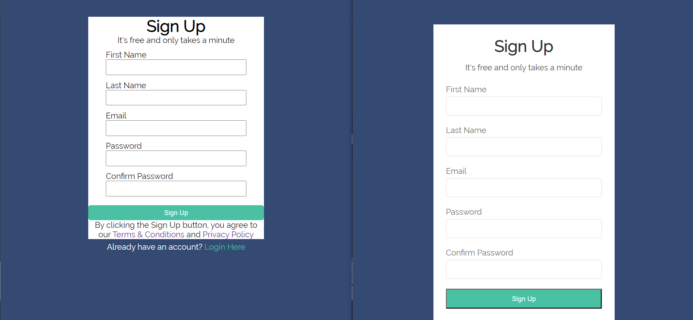

### Visibility, Order, and Negative Margin 
1. To hide an element, we can set its `display: none`. The element is still on the page but not shown. This is useful to design mobile version of page. Note that the element looks "**removed**" but still in the code. 
1. We can use `visibility: hidden` to hide an element. However, this elemenet is like transparent and still occupy its space on the page but become invisible. This propery isn't often used as `display: none`. 
1. Specificity of CSS selector has "<ins>**order**</ins>" of implement the given property. For example, a `class` selector is more specific than `element` selector such as a `<h1>` tag. The property in the more specific selector will override the other. 
1. Note that if we use external CSS file but want specific style to override the others, we can put `!important` after a property in the selector, so it will be prioritized. HOwever, this is not recommended. 
    ```html 
    <style>
        .hello {
            color: red; 
        }
        h1 {
            color: blue !important; 
        } 
        body {
            color: green;
        }
    </style>
    <body>
        <!-- text is blue because of important flag in h1 selector -->
        <h1 class="hello">Hello World!</h1>
    </body>
    ```
1. We can use **negative** `margin` on the side. The element will be moved on the reverse way. However, this feature doesn't work on `padding`. 

# Hotel Website
1. This is a mockup website using only the techniques learnt in previous sections WITHOUT "flexbox" and "grid". Besides, this page is not responsive as well, as some of them elements are stacked when the screen becomes narrow. 
1. For "design and ideas", we can check on the themes from "Bootstrap" to get inspiration. 
1. The webpage is captured in 1920x1080 resolution on full screen of 13-inch monitor.

### File structure and Navbar 


1. We have the landing page named as `index.html` as this will be the very first file that the program searches to render. We can have several other pages in CWD (current working directory). In the case, we have another two, `about.html` and `contact.html`. 
1. We can use `<meta>` tag to have further metadata for search engine to parse and do SEO in the `<head>` tag. 
    ```html 
    <head>
        <meta name="description" content="Welcome to the most extraodinary hotel in Phrom Phong Bangkok">
        <meta name="keywords" content="hotel, bangkok hotel, vintage hotel">
    </head>
    ```
1. We use `<link>` tag to import the CSS file `style.css`, which we create in a sub-folder "css". Besides, we have an initial set up for the page. 
    ```css
    /* Reset */
    * {
        margin: 0;
        padding: 0;
        box-sizing: border-box;
    }

    /* Main Styling */
    html, body {
        font-family: 'Segoe UI', Tahoma, Geneva, Verdana, sans-serif;
        line-height: 1.7em;
    }

    a {
        color: #333;
        text-decoration: none;
    }

    h1, h2, h3 {
        padding-bottom: 20px;
    }

    p {
        margin: 10px 0;
    }
    ```
1. **Navbar** - We can use `<nav>` to create a navbar. In this case, we also give an `id` to the entity. 
    ```html
    <style>
    #navbar {
        background-color: #333;
        color: #fff; 
        overflow: auto;
    }

    #navbar a {
        color: #fff;
    } 

    #navbar h1 {
        float: left; 
        padding-top: 20px;
    }

    #navbar ul {
        list-style: none;
        float: right;
    }

    #navbar ul li {
        float: left;
    }

    #navbar ul li a {
        display: block;
        padding: 20px;
        text-align: center;
    }

    #navbar ul li a:hover,
    #navbar ul li a.current {
        background: #444;
        color: #f7c08a;
    }
    </style>
    <nav id="navbar">
        <h1 class="logo"><a href="index.html">MST</a></h1>
        <ul>
            <li><a class="current" href="index.html">Home</a></li>
            <li><a href="about.html">About</a></li>
            <li><a href="contact.html">Contact</a></li>
        </ul>
    </nav>
    ```
1. **Container** - Since the previous layout has the Navbar go all the way cross the width. However, the Logo `<h1>` will be departed far away from the other 3 links if the screen goes very wide. 
    1. We can add a <ins>**container**</ins> to wrap the Navbar elements. Note that this container tag `<div class="container">` is in the `<nav>` tag. If we wrap the whole Navbar include the `<nav>` tag, the maximum width of the element will be limited when it excees and show the background color of the page (looks not good). 
    1. The container is an utility that we can also use on other elements or sections. 
    ```css 
    /* Utility classes */ 
    .container {
        margin: auto; /* center the elements in the container*/
        max-width: 1100px; /* limit the maximum width of the navbar but not limiting background color of the navbar */
        overflow: auto; /* shows the background if the screen size doesn't fit. However, this feature doesn't have effect to page at this point. */
        padding: 0 20px; /* give some space from edge to the element */
    }
    ```

### Showcase and Home Info
1. We can put the main content right below the Navbar. Besides, we can put them in "**container**" as well, so when the browser stretched, it is limited on its width and stays center. Note that this part is also the header, which is the very first element that users see when visiting the page. 
    ```html
    <style>
    .btn {
        display: inline-block;
        font-size: 18px; 
        color: #fff;
        background-color: #333;
        padding: 13px 20px;
        border: none;
        cursor: pointer; 
    }

    .btn:hover {
        background-color: #f7c08a;
        color: #333;
    }

    /* Showcase */ 
    #showcase {
        background: url('../img/showcase.jpg') no-repeat center center/cover;
        height: 600px;
    }

    #showcase .showcase-content {
        color: #fff; 
        text-align: center;
        padding-top: 170px;
    }

    #showcase .showcase-content h1 {
        font-size: 60px;
        line-height: 1.2em;
    }

    #showcase .showcase-content p {
        padding-bottom: 20px;
        line-height: 1.7em;
    }
    </style>
    <header>
        <div id="showcase">
            <div class="container">
                <div class="showcase-content">
                    <h1><span class="text-primary">Enjoy</span> Your Stay</h1>
                    <p class="lead">Lorem ipsum dolor sit amet, consectetur adipisicing elit. Deleniti a soluta enim sunt, quod debitis!</p>
                    <a class="btn" href="about.html">About Our Hotel</a>
                </div>
            </div>
        </div>
    </header>
    ```
1. We then create the main show case under the main focusing element. This will have one image on the left which takes half the width, and content description. 
1. However, this design still has problem that the button "Read More" disappears when the width is under 580px. If we take off `overflow: hidden`, the button will show at the very bottom but out of the dark background, as it exceeds the size of the container. Note that the height of the section is according to the given image height, as we set the height as 100% to the image. 
1. We can reduce the text content to allow the content floats up. 
    ```html 
    <style>
    /* Home Info */
    #home-info {
        height: 400px;
    }

    #home-info .info-img {
        float: left; 
        width: 50%;
        background: url('../img/photo-1.jpg') no-repeat;
        min-height: 100%;
    } 

    #home-info .info-content {
        float: right; 
        width: 50%; 
        height: 100%; 
        text-align: center;
        padding: 50px 30px; 
        overflow: hidden;
    } 

    #home-info .info-content p {
        padding-bottom: 30px;
    }
    </style>
    <section id="home-info" class="bg-dark">
        <div class="info-img"></div>
        <div class="info-content">
            <h2><span class="text-primary">The History</span> Of Our Hotel</h2>
            <p>Lorem ipsum dolor sit amet consectetur adipisicing elit. Maxime molestias modi cupiditate inventore atque illo. Rerum animi, ipsum, repudiandae placeat maiores delectus quod deserunt quasi numquam voluptate maxime, culpa quia!</p>
            <a href="about.html" class="btn btn-light">Read More</a>
        </div>
    </section>
    ```

### Features and Footer 
1. **Hotel features** - We will add 3 blocks below the image and desciption contents and use "FontAwesome" for icons. We will have each block separate the space in the container and allocate them evenly on the line. We use a structure as `<section>` and to wrap the elements, `<div>`, `<i>`, `<h3>`, and `<p>`. 
    1. We can import "FontAwesome" through CDN `https://cdnjs.cloudflare.com/ajax/libs/font-awesome/5.12.0-2/css/all.min.css` in a `<link>` tag. For Font awesome icons, we can give `class="fa-3x"` to triple the size of the icon. 
    1. Since we have set in the initials that all the elements on the page is with `box-sizing: border-box`, marging and padding is included in the element's whole width and height. To allocate the tags evenly, we can set each of its width at "**33.3%**" for 3 items. Besides, we add `padding: 50px;` to have some space between them. 
    1. We then set different class to each item to have different background. It looks more obvious in different blocks. 
    ```html
    <section class="features">
        <div class="box">
            <i class="fas fa-hotel fa-3x"></i>
            <h3>Great Location</h3>
            <p>Lorem ipsum dolor, sit amet consectetur adipisicing elit. Fugit, itaque?</p>
        </div>
        <div class="box">
            <i class="fas fa-utensils fa-3x"></i>
            <h3>Free Meals</h3>
            <p>Lorem ipsum dolor, sit amet consectetur adipisicing elit. Fugit, itaque?</p>
        </div>
        <div class="box">
            <i class="fas fa-dumbbell fa-3x"></i>
            <h3>Fitness Room</h3>
            <p>Lorem ipsum dolor, sit amet consectetur adipisicing elit. Fugit, itaque?</p>
        </div>
    </section>
    ```
1. **Footer** - We use `<footer>` tag. Note that the 3 elements above footer is "floated", so we have a `<div>` tag that use class which has property `clear: both;`. Therefore, the "floated" items are separated from the `<footer>` tag, and the footer area has its own space. 
    ```html 
    <div class="clr" style="clear: both"></div>
    <footer id="main-footer">
        <p>Hotel BK &copy; 2020, All Rights Reserved</p>
    </footer>
    ```

### About Page 
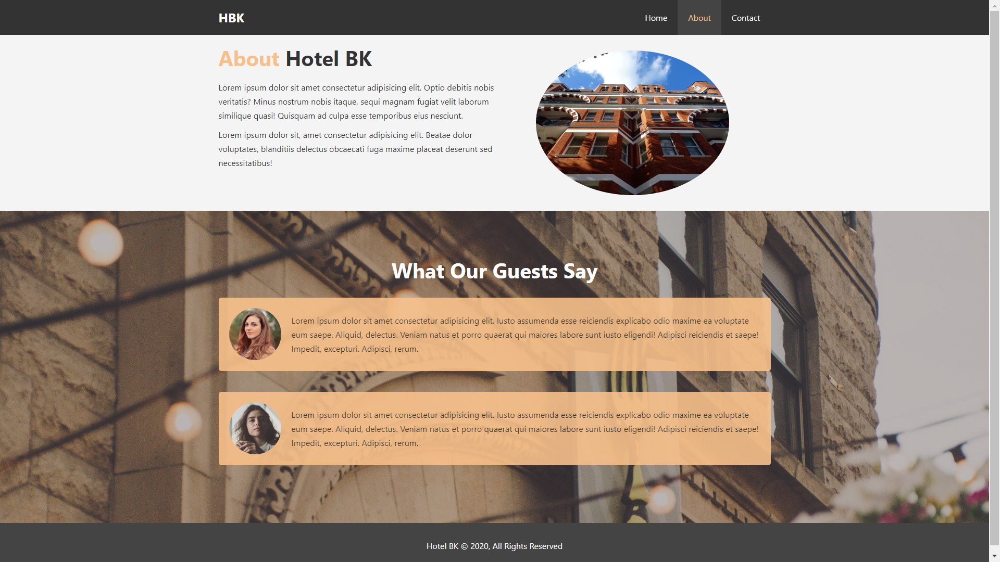

1. **About Info.** - We can copy the layout from `index.html` and keep only `<header>` and `<footer>` tags. Note that in real deployment, the backend framework can keep the header and footer file in separated HTML and import to every page. 
1. On "About" page, we havea `<section>` to put the main contents. In this case, we have 2 sections in blocks as "content" and "image". We can use `float: left` and `float: right` and set each of its `width: 50%` to divide the row into 2 sections. 
1. An `` tag is an inline element. Therefore, we can use `display: block` to make it a block element that can be centered with `margin: auto`. If the image is bigger than its container, we can set its width to 100% on the ``, so it will be resize to fit the width of its container. 
1. We add another class on `<h1>` tag and sets the class as utility that other elements can be used. 
1. Note that this layout isn't good if the width of browser is narrow, as if the height of the image isn't tall enough and the "About" contents (text) is too much. 
    ```html
    <style>
        /* Utility */
        .l-heading {
            font-size: 40px;
        }

        /* Padding */
        .py-1 {padding: 10px 0;}
        .py-2 {padding: 20px 0;}
        .py-3 {padding: 30px 0;}

        /* About Info */
        #about-info .info-right {
            float: right;
            width: 50%;
            min-height: 100%;
        }

        #about-info .info-right img {
            display: block;
            margin: auto;
            width: 70%;
            border-radius: 50%;
        }

        #about-info .info-left {
            float: left;
            width: 50%; 
            min-height: 100%;
        }
    </style>
    <section id="about-info" class="bg-light py-3">
        <div class="container">
            <div class="info-left">
                <h1><span class="text-primary">About</span> Hotel BK</h1>
                <p>Lorem ipsum dolor sit amet consectetur adipisicing elit. Optio debitis nobis veritatis? Minus nostrum nobis itaque, sequi magnam fugiat velit laborum similique quasi! Quisquam ad culpa esse temporibus eius nesciunt.</p>
                <p>Lorem ipsum dolor sit, amet consectetur adipisicing elit. Beatae dolor voluptates, blanditiis delectus obcaecati fuga maxime placeat deserunt sed necessitatibus!</p>
            </div>
            <div class="info-right">
                
            </div>
        </div>
    </section>
    ```
1. **Testimonials** - We can make certain elements in a section or block transparent and see through them with property `opacity` which is from 0 (total transparent) to 1 (solid). For images aligned with text, we can use `float: left` and the text will in `<p>` will be moved and wrap the `<image>`. To make a image as a circle, we can use `border-radius: 50%`. 
    ```html 
    <style>
        /* Testimonials */
        #testimonials {
            height: 600px;
            background: url('../img/test-bg.jpg');
            padding-top: 40px;
        }

        #testimonials h2 {
            color: #fff; 
            text-align: center;
            padding-bottom: 40px;
        }

        #testimonials .testimonial {
            padding: 20px;
            margin-bottom: 40px;
            border-radius: 5px;
            opacity: 0.9;
        }

        #testimonials .testimonial img {
            width: 100px;
            float: left;
            margin-right: 20px;
            border-radius: 50%;
        }
    </style>
    <section id="testimonials">
        <div class="container">
            <h2 class="l-heading">What Our Guests Say</h2>
            <div class="testimonial bg-primary">
                
                <p>Lorem ipsum dolor sit amet consectetur adipisicing elit. Iusto assumenda esse reiciendis explicabo odio maxime ea voluptate eum saepe. Aliquid, delectus. Veniam natus et porro quaerat qui maiores labore sunt iusto eligendi! Adipisci reiciendis et saepe! Impedit, excepturi. Adipisci, rerum.</p>
            </div>

            <div class="testimonial bg-primary">
                
                <p>Lorem ipsum dolor sit amet consectetur adipisicing elit. Iusto assumenda esse reiciendis explicabo odio maxime ea voluptate eum saepe. Aliquid, delectus. Veniam natus et porro quaerat qui maiores labore sunt iusto eligendi! Adipisci reiciendis et saepe! Impedit, excepturi. Adipisci, rerum.</p>
            </div>
        </div>
    </section>
    ```

### Contact Page 
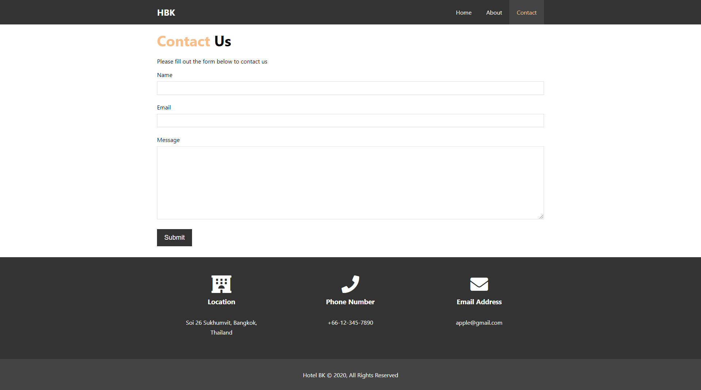

**Contact Page HTML** 
```html
<style>
/* Contact Form */
#contact-form .form-group {
    margin-bottom: 20px; 
}

#contact-form label {
    display: block; 
    margin-bottom: 5px;
}

#contact-form input, 
#contact-form textarea {
    width: 100%; 
    padding: 10px; 
    border: 1px #ddd solid;
}

#contact-form textarea {
    height: 200px; 
}

#contact-form input:focus, 
#contact-form textarea:focus {
    outline: none; 
    border-color: #f7c08a
}
</style>

<section id="contact-form" class="py-3">
    <div class="container">
        <h1 class="l-heading"><span class="text-primary">Contact</span> Us</h1>
        <p>Please fill out the form below to contact us</p>
        <form action="app.js">
            <div class="form-group">
                <label for="name">Name</label>
                <input type="text" name="name" id="name">
            </div>
            <div class="form-group">
                <label for="email">Email</label>
                <input type="email" name="email" id="email">
            </div>
            <div class="form-group">
                <label for="message">Message</label>
                <textarea name="message" id="message"></textarea>
            </div>
            <button type="submit" class="btn">Submit</button>
        </form>
    </div>
</section>

<section id="contact-info" class="bg-dark">
    <div class="container">
        <div class="box">
            <i class="fas fa-hotel fa-3x"></i>
            <h3>Location</h3>
            <p>Soi 26 Sukhumvit, Bangkok, Thailand</p>
        </div>
        <div class="box">
            <i class="fas fa-phone fa-3x"></i>
            <h3>Phone Number</h3>
            <p>+66-12-345-7890</p>
        </div>
        <div class="box">
            <i class="fas fa-envelope fa-3x"></i>
            <h3>Email Address</h3>
            <p>apple@gmail.com</p>
        </div>
    </div>
</section>
```

# Intro to Responsive Layouts 
"**Responsive Design**" is to use HTML/CSS to make a website or app layout adapt to different screen sizes. 
1. Set viewport/scale 
1. Use fluid widths as oppose to fixed 
1. Media queries - Different css styling for different screen sizes 
1. Rem units over px
1. Mobile first method 

Note that we should have this tag `<meta name="viewport" content="width=device-width, initial-scale=1">` in the `<header>` to make the page responsive. Otherwise, the page will render the whole page in default, which can be very small to view on mobile devices if the design is based on PC screen. 

### Starting with Media Queries 
1. We can add `@meda` and set its `min-width` or `max-width` to be responsive. Note that the HTML must have a metadata tag to indicate the viewport. Otherwise the screen will render the whole page rather than being responsive. 
1. However, a setting for larger screen will also be applied on smaller screens. To prevent this, we can use a range by having `min-width` and `max-width`, so the CSS features will be applied only on the given range. Note that the tablet width in convention is "**768px**". 
    ```html
    <!-- make the page responsive -->
    <meta name="viewport" content="width=device-width, initial-scale=1">

    <!-- make the background red if the screen size is narrower than 500px -->
    <style>
        /* any CSS setting in this media query is for certain device size*/

        /* Smartphones */
        @media(max-width: 500px){
            body {
                background: red;
            }

            #smartphone h1 {
                display: block;
            }
        }
        
        /* Tablets */
        @media(min-width:501px) and (max-width: 768px){
            body {
                background: blue;
            }

            #smartphone h1 {
                display: block;
            }
        }

        /* Normal */
        @media(min-width: 769px) and (max-width: 1200px){
            body {
                background: green;
            }

            #normal h1 {
                display: block;
            }
        }

        /* Widescreen */
        @media(min-width: 1201px) {
            body {
                background: black;
            }

            #widescreen h1 {
                display: block;
            }
        }

        /* Landscape */
        @media(max-height: 500px) {
            body {
                background: orange;
            }

            #landscape h1 {
                display: block;
            }
        }
    </style>
    <body>
        <div id="widescreen"><h1>WideScreen</h1></div>
        <div id="normal"><h1>Normal</h1></div>
        <div id="tablet"><h1>Tablet</h1></div>
        <div id="smartphone"><h1>Smartphone</h1></div>
        <div id="landscape"><h1>Landscape</h1></div>
    </body>
    ```
1. We can also separate the CSS files and import them to the HTML. Besides, we can give a range to apply the style as well. We can set an attribute `media="screen and (max-width: 768px)"`, so the CSS will only be applied if the screen width is narrower than 768px. Note that this link tag should be below the main styling sheet. 
    ```html 
    <link rel="stylesheet" media="screen and (max-width: 768px)" href="css/mobile.css">
    ```

### Em and Rem units 
1. `em` unit is according to the parent (which has font-size value. If not, it goes upper until the root, which is the "root em", `rem`.)
1. `<p>` font-size is set to "**1em**" by default which is the same size as its parent element (which is `16px`), while `<h3>` is set to "**1.17em**", which is `18.72px`. We can check this values from developer tool by selecting the element on the page and change to tab `Computed` to check the value(Note that `Style` is the CSS selector). 
1. In the following example, if we give the `<div id="box-1">` tag font-size value, the value of child tags in the `<div>` tag, both `<h3>` and `<p>` is enlarged to `23.4px` and `30px`. However, the element in the other `<div>` tag is not affected. 
1. If we set `padding: 1em` to `<p>`, it adds `30px` to each side of the element. 
1. There's a problem with using `em` is that it always according to the parent element. If we have nested it will mutiple the size up. For example, we in the nested `<ul>` and `<li>` tags. If we select `<ul>` and set font-size to its parent element which is the other `<ul>`. For example, in the 3 layer `<ul>` tags and set `font-size: 1.2em`, the outer `<ul>` has font-size `24pz` because `#box-1` is set to `20px`. However, the inner also multiply 1.2 and becomes `28.8px`, and the 3rd one becomes `34.56px`. 
1. The solution for that is to use `rem` which is according to the "root em" which font-size is `16px` by default. 
    ```html 
    <style>
        #box-1 {
            font-size: 20px;
        }

        #box-1 p {
            font-size: 1.5em;
            padding: 1em; 
        }

        #box-1 ul {
            font-size: 1.2em; 
        }
    </style>
    <body>
        <div id="box-1">
            <h3>Box One</h3>
            <p>Lorem, ipsum dolor sit amet consectetur adipisicing elit. Nemo exercitationem itaque provident atque neque harum ducimus quia ratione quae ex.</p>
            <ul>
            <li>1</li>
            <li>2</li>
            <li>3
                <ul>
                    <li>1</li>
                    <li>2</li>
                    <li>3</li>
                </ul>
            </li>
            <li>4</li>
            </ul>        
        </div>
        <div id="box-2">
            <h3>Box Two</h3>
            <p>Lorem, ipsum dolor sit amet consectetur adipisicing elit. Nemo exercitationem itaque provident atque neque harum ducimus quia ratione quae ex.</p>        
        </div>
    </body>
    ``` 
1. We can change the root font-size by selecting `<html>` tag and change its font-size. We can change `font-size` property to `10px` (or `62.5%`) which is easy to check the value as the `rem` we set is multiply by 10. 
1. `rem` is also better if the user changes setting for the browser for bigger font-size in default. The contents become responsive to the setting and scale with the root value. The setting is at "Setting" > "Appearance" > "Font Size". 

### Viewport Height (VH) and Viewport Width (VW)
1. Viewport is the whole area in the browser that shows the webpage. Each of them has 100 units on each side, so the size is relative to the scale of the side, no matter how large or small the screen is. Note `vh` is used more often than `vw`. 
1. For example, we want an element in the page to take the whole height of the viewport. By setting `height: 100%`, it only covers the height of its content. While usuing `height: 100vh`, it will take the height of the whole viewport from top to bottom. 
1. We can use [Unsplash source](https://source.unsplash.com/) to have random image on the background. Note that in CSS selector, we can have both a color and an image url for property `background`, so the background will be the image on top of the given color. 
    1. Without other setting, the photo will repeat if the screen size is larger than the image. Therefore, we give `no-repeat` to background as well. 
    1. However, if the screen size is larger than the image, the background color will fill up the empty space. We can add `center center/cover` to make the background become responsive. 
    ```css
    header {
        background: #333 url('https://source.unsplash.com/') no-repeat center center/cover;
    }
    ```
1. We can make an anchor tag `<a>` looks like a button by the following CSS without Bootstrap. (There's no hover effect yet)
    ```css
    .btn {
    display: inline-block;
    text-decoration: none;
    background: #f4f4f4;
    color: #333;
    padding: 0.75rem 2rem; 
    }
    ```
1. Note that though we have `<header>` tag (or other element) that takes `100vh`, it only occupies the page in full height when the user access it. The rest of the contents will still be at the below. Taking `100vh` doesn't mean that the page is full and can't put anything. It's just a effect to show a full page (or just a landing page message) before the user start to browse or access other info and let the user focus on the item first. This feature also responds landscape of a mobile device.
1. In the following example, the padding is too much when the screen becomes landscape as mobile device rotates. We can add an media query to change the `padding` from `15rem` to `5rem` if the height is less than `450px`. 
    ```html 
    <style>
    * {
        box-sizing: border-box;
        margin: 0;
        padding: 0;
    }

    body {
        font-family: 'Segoe UI', Tahoma, Geneva, Verdana, sans-serif;
    }

    header {
        background: #333 url('https://source.unsplash.com/daily') no-repeat center center/cover;
        color: #fff;
        height: 100vh;
        text-align: center;
        padding: 2rem;
        padding-top: 15rem;
    }

    header h1 {
        font-size: 3rem;
    }

    header p {
        margin: 1rem 0;
    }

    .btn {
        display: inline-block;
        text-decoration: none;
        background: #f4f4f4;
        color: #333;
        padding: 0.75rem 2rem; 
    }

    section {
        padding: 2rem;
    }

    /* change padding from 15rem to 5rem if height is less than 450px */
    @media(max-height: 450px){
        header {
            padding-top: 5rem;
        }
    }
    </style>
    <body>
        <header>
            <h1>Welcome To Our Website</h1>
            <p>Lorem ipsum dolor, sit amet consectetur adipisicing elit. Eius natus quasi similique sunt doloremque iure cum, veritatis dolorem itaque libero?</p>
            <a href="#" class="btn">Find Out More</a>
        </header>

        <section>
            <h3>About Our Company</h3>
            <p>Lorem, ipsum dolor sit amet consectetur adipisicing elit. In ea reprehenderit eligendi a, similique ipsum eius explicabo autem minima commodi laudantium voluptates molestias vero voluptatum, fuga animi? Reprehenderit repellendus totam dolores architecto tempora voluptates aut beatae delectus repellat, vitae illum! Nostrum tenetur corrupti quis nesciunt accusantium quae nemo neque perspiciatis?</p>
        </section>
    </body>
    ```

### Making hotel website full responsive 
1. As the `style.css` sheet is large, we can create another stylesheet and import to the file. We use a `<link>` tag with attribute `media`. For example, we set the width as 768px, `<link rel="stylesheet" media='screen and (max-width: 768px)' href="./css/mobile.css">`. During editing, we can open 2 scripts to compare in VS Code and edit at the same time. We modify the Navbar to make it stack on each other by cancelling the `float` property. The Navbar becomes responsive. We also stack up the home info and features. 
    ```css
    #navbar h1.logo {
        float: none;
        text-align: center; 
    }

    #navbar ul, #navbar ul li {
        float: none;
    }

    #navbar ul li a {
        padding: 5px;
        border-bottom: #444 dotted 1px;
    }

    /* Showcase */ 
    #showcase {
        height: 100%;
    }

    #showcase .showcase-content {
        padding-top: 70px;
        padding-bottom: 30px;
    }

    /* Home Info */
    #home-info .info-img {
        display: none;
    }

    #home-info .info-content {
        float: none; 
        width: 100%; 
    } 

    /* Boxes */
    .box {
        float: none;
        width: 100%;
    }

    /* About Info */
    #about-info .info-right, #about-info .info-left {
        float: none; 
        width: 100%;
    }

    #about-info .info-right {
        margin-top: 30px;
    }

    .l-heading {
        text-align: center;
    }

    /* Contact */
    #contact-info .box {
        border-bottom: #444 dotted 1px;
    }
    ```

# Intro to Flexbox
### Flexbox Basics 
1. "Flexbox" is a modern layout mode in CSS3. `flex` is a value for `display` property. We can invoke it with CSS selector, `display: flex`. It means that the element with the property becomes a "**flex container**". All direct child elements are "flex items". There are several properties we can use for "**flex items**". 
    1. `justify-content` is to align along the main axis (x-axis, horizontal).
    1. `align-items` is to align items along the cross axis axis (y-axis, vertical).
    1. `align-content` is to align when extra space in cross axis. 
1. In a `<div>` tag, we can change the class property as the flexbox container and make its direct child elements flex items. We can change directions by `flex-direction` to `column` to align items as a vertical column or `column-reverse` to order the elements in a reverse order. Note that the default value is `flex-direction: row`. We can use `flex-wrap: wrap` to allow the elements change lines automatically if the screen width shrinks down. 
    ```html
    <style>
        .flex-container {
            display: flex; /* turn child elements to flex items */
            flex-direction: column; /* change direction */
            flex-wrap: wrap; /* push elements to the next row if the width shrinks down */
            
            /* Cross axis align */
            align-items: center;
            /* Main axis align */
            justify-content: center;
            height: 50vh; 
        }

        .item {
            background: #f4f4f4;
            border: #ccc solid 2px; 
            margin: 10px;
            padding: 10px;
            text-align: center; 
            border-radius: 10px;
            width: 200px;
        }
    </style>
    <body>
        <div class="flex-container">
            <div class="item item-1">
                <h3>Item 1</h3>
            </div>
            <div class="item item-2">
                <h3>Item 2</h3>
            </div>
            <div class="item item-3">
                <h3>Item 3</h3>
            </div>
        </div>
    </body>
    ```
1. There are other properties that can change the element size automatically. 
    1. `flex-shrink: 0` will prevent the item shrinks down when the screen width reduce. 
    1. `flex-grow: 1` will extend the element on its width to fill up the screen. 
    1. We can set both these properties to all the elements which have the class, so they will extend evenly in the same row if the screen size changes. 
1. `flex` property takes 3 values which is `grow`, `shrink`, and `basis`. If we give as `flex: 1 0 200px`, the elemenets applied will deployed evenly on the same row as `grow` property is `1`, without shrinking as being set to `0`, and have minimum width at `200px`. The property is set as `flex: 1 0 200px`. 
1. However, we usually set `flex: 1` as convention to avoid conflicting to other styling such as media-queries. 
1. The main use of "Flexbox" is to design the layout and arrange items in a given pattern by "**row**" or "**column**". 

# EdgeLedger Website (Flexbox)
### Overlay
1. We can use `::before` selector to insert content before an element. In this case, we can make a filter-like overlay to reduce the hue of the background image and make it darker without using photoshop. Note that the parent element must have `position: relative`. 
    ```css 
    header {
        position: relative; 
    }

    header::before {
        content: '';
        position: absolute;
        top: 0;
        left: 0;
        width: 100%;
        height: 100%; 
        background-color: rgba(0,0,0,0.6);
    }
    ```
    1. With filter 
    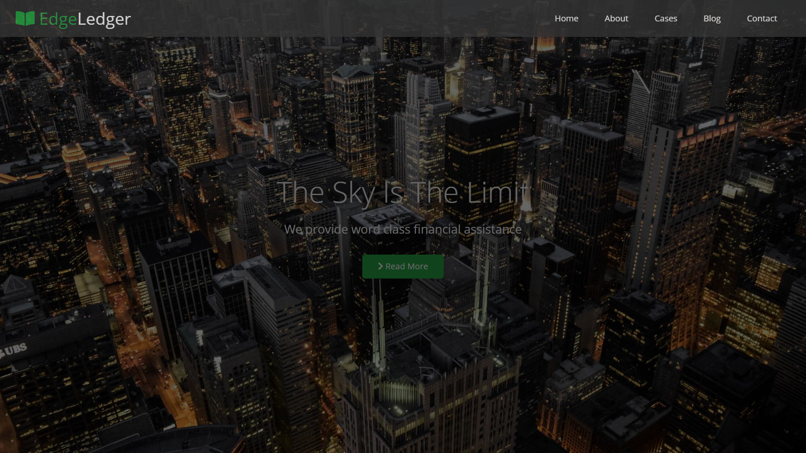
    1. Without filter
    

1. However, the text in the middle is also behind the filter. We can adjust `z-index` property to move the element forward to the screen. Besides, we can use asterisk " **\*** " as the wildcard to select all elements in an element. 
    ```css 
    header * { /* all elements in header tag */
        z-index: 10;
    }
    ```
### Icons and Solutions section 
1. If an image doesn't fit to a block which it is set to, we can use `object-fit: cover`, so the image will be fit to the block without distorting its resolution (though not in the center or whole image as we set up background image). 
    ```css 
    img {
        width: 100%; 
        height: 100%;
        object-fit: cover; 
    }
    ``` 

### Cases and Blog section
1. `<header>` tag can not
1. For the same layout but opposite pattern, we can use `flex-direction: row-reverse`. The elements on the same row will be listed on an reversed order (We can do the same thing if the elements are in a column). Note that for CSS selector we can specify the selector with multiple classes. For example, if a `<div>` tag has multiple classes, we can concatenate the classes with dot "." with NO space in between. 
    ```css 
    .flex-columns.flex-reverse .row {
        flex-direction: row-reverse;
    }
    ``` 

### Responsive Media Queries
1. We add on mobile version with media query by `@media(max-width: 768px)` in this case. 
1. With `flex-direction: column` we can easily change items in a row to be listed in a column. 

### Navbar and Lightbox Effects
1. We can have a class for the Navbar and make its background transparent when its on the very top of the page by `.navbar.top {background: transparent}`. 
1. We can use JavaScript DOM to check an event that if the user scroll down the page. Besides, we can use `setTimeout()` function to return the navbar back to the page after a given period of time. 
    ```js
    const navbar = document.getElementById('navbar'); 
    let scrolled = false; 

    window.onscroll = function(){ //add event listener on global object "window"
        if(window.pageYOffset > 100) { // if the page is scrolled down more than 100 px 
            navbar.classList.remove('top'); // remove top class
            if(!scrolled) { // hide the navbar 
                    navbar.style.transform = 'translateY(-70px)'; 
                    setTimeout(function(){
                        navbar.style.transform = 'translateY(0px)'; 
                    }, 200); 
                    scrolled = true; 
                }
        } else {
            navbar.classList.add('top'); //add top class to the element 
            scrolled = false;
        }
    }
    ```
1. We can add an animation to make the navbar goes up smoothly. with property `transition: 0.5s`. So the navbar will scroll up smoothly in 0.5 second by animation.
    ```css 
    .navbar {
        transition: 0.5s;
    }
    ``` 
1. We can use a "**jQuery**" solution for smooth scrolling effect. With the effect, the page doesn't jump to the section when we click the link in the Navbar but rather move to the section smoothly. 
    ```js 
    // smooth scrolling 
    $('#navbar a, .btn').on('click', function(e){
        if (this.hash !== '') {
            e.preventDefault();

            const hash = this.hash; 

            $('html, body').animate(
                {
                    scrollTop: $(hash).offset().top - 100, 
                },
                800
            );
        }
    });
    ``` 
1. We use another library `lightbox`. We can go to [github](https://github.com/lokesh/lightbox2) and put the files from the library to our webpage directory and import the JavaScript and CSS file to the HTML file. 
    1. `lightbox.min.css`
    1. `lightbox.min.js`
    1. Images - `close.png`, `loading.gif`, `next.png`, and `prev.png`
1. We then put the image tags on the page into an anchor tag `<a>`. 
    ```html 
    <div class="row">
        <div class="column">
            <a href="./img/cases/cases1.jpg" data-lightbox="cases">
                
            </a>
            <a href="./img/cases/cases2.jpg" data-lightbox="cases">
                
            </a>
        </div>
        <div class="column">
            <a href="./img/cases/cases3.jpg" data-lightbox="cases">
                
            </a>
            <a href="./img/cases/cases4.jpg" data-lightbox="cases">
                
            </a>
        </div>
        <div class="column">
            <a href="./img/cases/cases5.jpg" data-lightbox="cases">
                
            </a>
            <a href="./img/cases/cases6.jpg" data-lightbox="cases">
                
            </a>
        </div>
        <div class="column">
            <a href="./img/cases/cases7.jpg" data-lightbox="cases">
                
            </a>
            <a href="./img/cases/cases8.jpg" data-lightbox="cases">
                
            </a>
        </div>
    </div>
    ```
    1. Business cases
    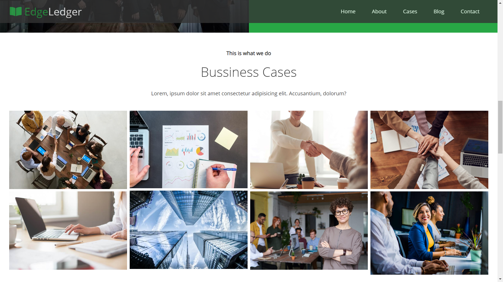
    1. Lightbox effect 
    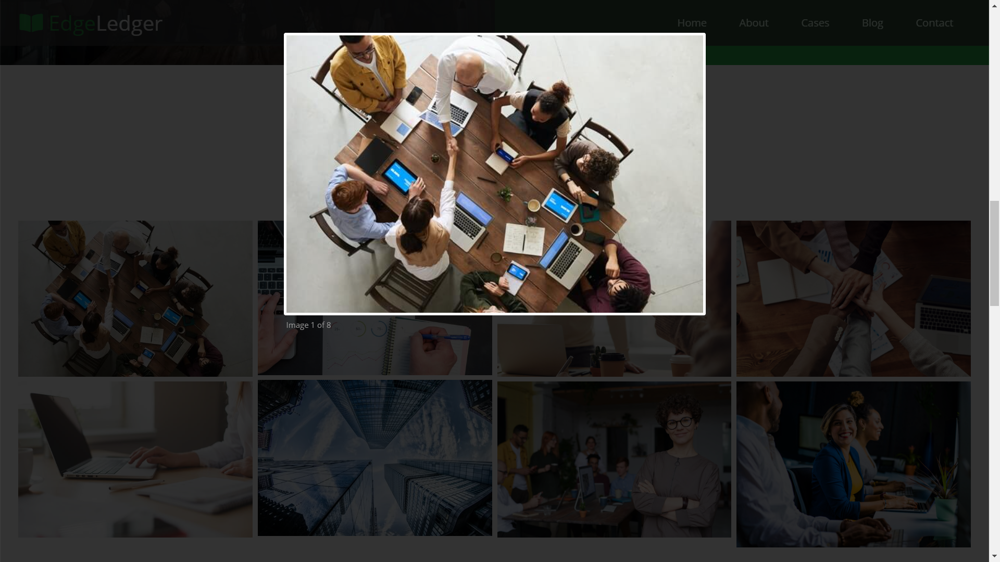

### Favicon 
1. We can add a small icon on the page tab on the browser (where data of `<title>` tag shows). However, we have to convert the image (such as .PNG) into .ICO file. We can use "**dynamic drive favicon**" or [here](https://tools.dynamicdrive.com/favicon/) and convert the `favicon.png` file. We can put the converted `.ico` file in the root directory (with HTML files) and use the link given from the website to import the icon to the page. `<link rel="shortcut icon" type="image/x-icon" href="/favicon.ico">`

# Website Deployment - Shared Host 

### Types of Web Hosting
1. **Shared Hosting** 
    1. One account of many of a server. 
    1. Cheapest (aside from free static hosting)
    1. Used for small websites
    1. Most include email, FTP, PHP, databases, software 
    1. $3 to $15 per month
    
    Examples: Inmotion Hosting, Hosgator, Bluehost
1. **VPS Hosting**
    1. Your own virtualized server 
    1. Can create multiple shared accounts
    1. More access and privileges 
    1. Everything shared hosting offers 
    1. $20 to $100 per month 

    Examples: Inmotion Hosting, Hosgator, Bluehost
1. **Reseller Hosting**
    1. Create and manage multiple shared accounts 
    1. Can sell shared accounts to your own customers
    1. Very similar to a VPS 
    1. Usually comes with reseller software 

    Examples: Inmotion Hosting, Hosgator
1. **Dedicated Server** 
    1. Your own actual server 
    1. You rent out a physical machine 
    1. Full access and privileges 
    1. Harder to manage but very powerful 
    1. $100 to $400 per month 

    Examples: Inmotion Hosting, Hosgator, Bluehost
1. **Cloud Hosting**
    1. Used for web apps 
    1. Multiple servers work together 
    1. Very scalable and great for large apps 
    1. Not for beginners / harder to manage
    1. Pay as you go 

    Examples: Digital Ocean, Linode, Vultr 
1. **Static Hosting** 
    1. Does not come with bells and whistles of managed hosting 
    1. Upload static site via Git 
    1. Great for static websites 
    1. Free, but pay for extra features 

    Examples: Netlify, Github Pages 

### Upload your site through FTP 
1. filezilla client can be used to transfer files through FTP to a server. 
1. Port for FTP is 21 as default. 
1. FTP is useful for small scale website, but for larger webapp and larger website, we can use others such as SSH and GIT to upload files, as FTP is slow and inefficient. 

# More CSS Concepts - Advanced Selectors, Animation, and More 
### Targeted Selectors 
1. A greater than sign "**>**" means a direct child selector for the elements. 
    1. `div p` is to select all `<p>` tags in `<div>` tags, though the `<p>` tag may be nested in other elements such as `<ul>`. 
    1. `div > p` is to select all `<p>` tags that are direct child element (which is not nested in other elements). 
1. A plus sign "**+**" is the element right aftera selected element. For example, `div + p` selects the `<p>` that is right after `<div>` tag in the HTML file (not nested nor any other elements in between). 
1. We can use square bracket notation to select an element with certain attribute with specific value. 
    ```html
    <style>
        div[class="container"] {
            background: #333; 
            color: #fff;
            text-align: center; 
        }
    </style>
    <div class="container">Hello</div>

### [nth-child Pseudo Selector](https://www.w3schools.com/cssref/sel_nth-child.asp) 
1. If we have a list of `<li>` tags, we can use pseudo selector `<element>:first-child` for the first matched element, `<element>:last-child` for the single last matched element, and `<element>:nth-child(expression)` to select multiple elements that match. 
1. The expression for `:nth-child()` can be keyword `odd` and `even` which will select all the "**odd**" or "**even**" elements in the order of the list of matched elements. On the other hand, it can be in the format for `an+b` where `a` and `b` are non-zero values, and the child elements are split into groups of `a` elements, while `b` is the index that the selector starts. Note that the order of groups split by `a` starts from 1. 
    1. If the expression was `2n+1`, the child elements would be split into groups of "**2**". Each element in the group is then given an index, starting at "**1**". The matched element in each group is bth index. In this example, that would be the first element. Therefore, `2n+1` works the same as selecting all the "odd" elements. 
    1. If the expression was `3n+2`, the list items would be grouped into sets of 3 and the second item in each group would be matched.
    ```css
    li {
        padding: 0.25rem; 
        margin: 0.25rem;
        list-style: none;
    }

    /* first-child */
    li:first-child {
        background: red;
    }

    /* last-child */
    li:last-child {
        background: red;
    }

    /* Position 3 */
    li:nth-child(3) {
        background: purple;
    }

    /* Every 3 */
    li:nth-child(3n+0) {
        background: orange;
    }

    /* Every 3 after 7 */
    li:nth-child(3n+7) {
        background: yellow;
    }

    /* Every odd */
    li:nth-child(odd) {
        background: #ccc;
    }

    /* Every even */
    li:nth-child(even) {
        background: #ddd;
    }
    ```

### before & after pseudo selector
1. We can use `before` and `after` to add a pattern to multiple selectors without having the element in the HTML file. For example, we can add an asterisk "*" to all `<label>` tags of `<input>` tags if the field is "**required**". Note that if we check the source code, we can't find the asterisk, as it's added by CSS. (We used this once in the EdgeLedger project to add the dark filter to make the image darker without photoshop)
    ```html
    <style>
        .is-required:after {
            content: '*';
            color: red;
            padding: 2px;
        }
    </style>
    <body>
        <label for="name" class="is-required">Name</label>
        <input type="text" name="name" value="">
    </body>
    ```
1. We can add a background image and set low `opacity` to make the image looks transparent. (Note that we must set an empty content with `content: ''`. Otherwise, we can't have a background.) Besides, we use `position: aboluste`, `top: 0`, and `left: 0` and set the `width` and `height` to make sure the image covers the whole page. As the image is still at the front of the contents, we can use `z-index: -1` to send it backward. 
    ```html
    <style>
    header {
        display: flex;
        flex-direction: column;
        justify-content: center;
        align-items: center;
        text-align: center;
        height: 100vh;
    }

    header:before {
        content: '';
        background: url('https://source.unsplash.com/1600x900/?nature,water') no-repeat center center/cover;
        opacity: 0.2;
        position: absolute;
        top: 0;
        left: 0;
        width: 100%;
        height: 100%;
        z-index: -1;
    }
    </style>
    <body>
        <header>
            <h1>Hello World</h1>
            <p>Lorem ipsum dolor sit amet, consectetur adipisicing elit. Ipsam, amet!</p>
        </header>

        <section>
            <h3>Lorem, ipsum dolor.</h3>
            <p>Lorem ipsum dolor, sit amet consectetur adipisicing elit. Minus nisi quisquam voluptate distinctio cumque? Ut, asperiores voluptatem? Voluptatibus quos ratione harum, quibusdam, ipsum id laudantium perspiciatis praesentium nobis, minima assumenda!</p>
        </section>
    </body>

### Box shadows 
The property adds shadow effect to the a block element.
```css
/* offset-x | offset-y | color */
box-shadow: 10px 10px teal;
/* offset-x | offset-y | blur-radius | color */
box-shadow: 10px 10px 20px teal;
/* Negative values */
box-shadow: -5px -5px 20px teal;
/* offset-x | offset-y | blur-radius | spread-radius | color */
box-shadow: 3px 3px 10px 1px rgba(0,0,0,0.8);
/* inset | offset-x | offset-y | color */
box-shadow: inset -3px -3px teal; /* right and bottom */
/* inset | offset-x | offset-y | color */
box-shadow: inset 3px 3px teal; /* left and top */
/* Multiple Shadows */
box-shadow: 3px 3px teal, -3px -3px 10px olive;
```
<br>
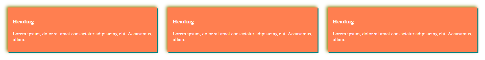

### Text shadows
Similar to box-shadow, we can add shadow effects on text on the webpage. 
```css
h1.a {
    /* h-shadow | v-shadow | color */
    text-shadow: 0.2rem 0.2rem steelblue;
}

h1.b {
    /* h-shadow | v-shadow | blur | color */
    text-shadow: 0.4rem 0.3rem 0.7rem steelblue;
}

h1.c {
    /* White Text */
    color: #fff;
    text-shadow: 0.2rem 0.2rem 1rem steelblue;
}

h1.d {
    /* Negative Values */
    text-shadow: -0.4rem -0.3rem 0.7rem steelblue;
}
```
<br>
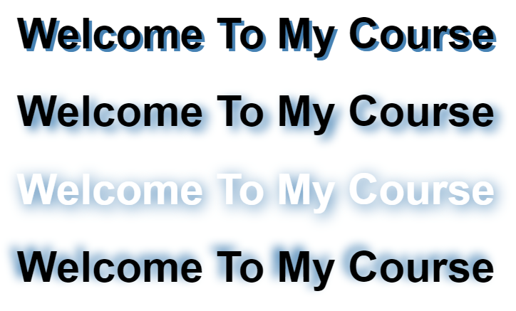

### CSS variables (Custom Properties)
1. We can set up CSS variables by using 2 dashes "--". Besides, we need to set the scope to the variable. We can call the variable by using `var()` in a selector. 
1. CSS variables give benefit that we can change only the variable such as width, style, or color. All the selectors using the variables will be changed at the same time. 
1. With different scope, we can ensure the variable works on certain elements or sections without affecting. However, we can put the varibles in `:root{}` which is as the global variables. 
    ```css
    :root {
        --max-width: 1100px;
        --primary-color: #333;
        --secondary-color: #ccc;
        --light-color: #f4f4f4;
    }

    .box {
        --box-1-width: 1;
        --box-2-width: 2;
    }

    * {
        margin: 0; 
        padding: 0;
    }

    body {
        font-family: Arial, Helvetica, sans-serif;
        line-height: 1.4;
        background: var(--light-color);
    }

    header {
        background-color: var(--primary-color);
        border-bottom: 5px var(--secondary-color) solid;
        color: #fff;
        text-align: center;
    }

    .container {
        display: flex;
        margin: auto;
        max-width: var(--max-width);
    }

    .box {
        background-color: var(--primary-color);
        border-bottom: 5px var(--secondary-color);
        color: #fff;
        padding: 1rem;
        margin: 1rem;
    }

    .box-1 {
        flex: var(--box-1-width)
    }
    .box-2 {
        flex: var(--box-2-width)
    }
    ```

### keyframe Animation 1
1. CSS animation is to animate an element by changing its style properties with CSS. For example, we can create an element as an object and changing it's width in a given timeframe. 1
1. There are several properties we can set up with the animation. 
    1. `animation-name` is a variable-like setting which we can use `@keyframe` to select and give instructions. 
    1. `animation-duration` is how long the animation finishes through each iteration. The unit is in seconds. 
    1. `animation-iteration-count` is how many times the animation iterates. The default number is one. We can set it as `inifinit`, so the animation will keep repeating. 
    1. `animation-fill-mode`, if we set this property as `forwards` the element will stay at its last styling. For example, if we stretch the width of an element from 200px to 600px. The element will return back to 200px after animation ends. However, by changing this "fill-mode" to `forwards`, the element will stay at 600px. 
    1. `animattion-delay` takes either duration in seconds or milliseconds that after the page loads, the animation will start after delay duration ends. 
    1. `animation-direction` has default as `alternate`. We can change its value to `alternate-reverse`, so the animation will start from its ultimate setting reversely from the end to beginning. 
    1. `animation-timing-function` can be set as `ease-in`, `ease-out`, or `ease-in-out`. 
        1. The animation will start slow and go fast at the end in `ease-in`. 
        1. The animation will start fast but end slowly in `ease-out`. 
        1. The animation will be slow at start and the end but go fast in between. 
    ```html 
    <style>
        body {
        background:#333; 
    }

    .box {
        background: white;
        width: 200px;
        height: 200px;
        position: relative; 
        animation-name: animate1;
        animation-duration: 2s; 
        animation-fill-mode: forwards;
        animation-iteration-count: infinite;
        animation-delay: 1000ms;
        animation-timing-function: ease-in-out;
    }

    @keyframes animate1 {
        from {
            width: 200px; /* we can skip this as the width of the element has been 200px */
            top: 0; 
        }
        to {
            width: 600px;
            background-color: red; 
            top: 300px; /* move the element from top to down by 300px */
        }
    }
    </style>
    <body>
        <div class="box"></div>
    </body>
    ```
1. Note that without `from` and change the position, the element will just be "teleported" from its original position to the location in "to". 
1. We can even give the values for the properties for `animation` in one line. We can check the sequence of values at [here](https://www.w3schools.com/cssref/css3_pr_animation.asp) 

### keyframe Animation 2
1. Besides giving absolute position using "from" and "to", we can use percentage which stands for the timeframe of the animation. For example, we give duration as `animation-duration: 5s` and turn the square into a circle through an iteration when loop in a square route. 
```css
body {
    background:#333; 
}

.box {
    background: white;
    width: 200px;
    height: 200px;
    position: relative;
    animation-direction: alternate ;
    animation: animate1 5s forwards ease-in-out;
    top:0; 
    left: 0;
}

@keyframes animate1 {
    25% {
        top: 0;
        left: 300px;
        background: red; 
        border-radius: 50% 0 0 0;
    }

    50% {
        top: 300px; 
        left: 300px;
        background: green; 
        border-radius: 50% 50% 0 0;
    }

    75% {
        top: 300px; 
        left: 0;
        background: blue; 
        border-radius: 50% 50% 50% 0;
    }

    100% {
        top: 0; 
        left: 0;
        background: white; 
        border-radius: 50% 50% 50% 50%;
    }
}
```

# Mini projects with Keyframes, Transitions, etc. 
1. Presentation Website 
1. Hamburger Menu 
1. Knowledge Timeline 

### Presentation Website 
1. A slide-like presentation website which we can use instead of powerpoint. 
1. All the contents are on the same page, but can only view different pages by clicking buttons rather than scrolling the webpage. 
1. We can use `overflow: hidden` to take scroll bar out if the elements is out of the brwoser viewport range. Besides, we can use `height: 100vh` to make the element covers the whole viewport according to the size of the device. Therefore, we can make all contents on the same page, while users can't access other part of the page. 
1. In this project, we can set CSS variables on the very top, so we can change the properties easily such as the background color of each section (page) without accessing or modifying the other details. 
1. We use `transition: all 0.3s ease-in` on the buttons to create animation on "hover" event. The buttons can change their color when the mouse curosr hovers on with a delay at 0.3 second. Besides, since create 2 buttons "prev" and "next" on the page, we can make different styling on each of them. 
1. We can use `transform: translateX()` and `transform: translateY()` to make text fly in animation. For example, we can give the elements with 
1. We can apply "**smooth scrolling**" animation from jQuery when the user click the buttons to go previous or next page. We can change the speed of scrolling by the 2nd argument of `.animate()` method which unit is in millisecond. `.hash` is to check the element has a hash "#" or not, which is the anchor tag that is with "#" to direct to a section with ID. 
    ```js 
    // Smooth Scrolling from jQuery 
    $('.btn').on('click', function(event){
        if (this.hash !== '') {
            event.preventDefault();
            const hash = this.hash;
            $('html, body').animate(
                {
                    scrollTop: $(hash).offset().top
                },
                800
            );
        }
    });
    ```

### Hamburger Menu Overlay 
**Styling in style.css**
1. This part is about the basic html and CSS building <ins>**before**</ins> applying the overlaying menu which is "**floating**" on the page. 
1. We create a "hamburger" sign for menu list and put it on the top corner. It will filter the background, show a list of links we can access on the page and turn the "hamburger" sign into a "X", and all the elements appear and fade with animated effect. Besides, this feature is responsive to all screen sizes. (We can use this feature in the other projects as well). The structure of html is relatively simple, and we will use CSS to achieve it. Note that the following code is only the hamburger menu. 
    ```html
    <body>
        <div class="menu-wrap">
            <input type="checkbox" class="toggler" name="" id="">
            <div class="hamburger"><div></div></div>
            <div class="menu">
                <div>
                    <div>
                        <ul>
                            <li><a href="#">Home</a></li>
                            <li><a href="#">About</a></li>
                            <li><a href="#">Services</a></li>
                            <li><a href="#">Contact</a></li>
                        </ul>
                    </div>
                </div>
            </div>
        </div>
    </body>
    ```
1. We create CSS variable in the "root" and have an "overlay" color setup which is the filter-like whole screen cover. 
1. We can use `box-sizing: border-box` property to limit the size of block elements. With the property, all padding and maring will be limited to its given width and height. 
1. If we use `margin: auto` and give `padding` to a block element, all its child elements will be kept in the middle as be "**centered**". 
1. Since we'd like to add an overlay to the whole screen, we give the main block element `height: 100vh` to cover the whole page. Besides, we set its `position: relative` because the "overlay" filter should be set as `position: absolute`. Remember that to set an element as "**absolute**" its parent element should be "**relative**". 
1. Since we've added the background color with transparency by "rgba", we can add the background image to the section but "before" with the followings. As it's "background" image, we can set negative value to `z-index` property to send the element back. Note that by `css selector:before`, we don't actually create an element but use only CSS features to create the effect. 
    ```css
    #IDSelector:before {
        content: '';
        background: url('showcase.jpg') no-repeat center center/cover; 
        position: absolute; 
        top: 0; 
        left: 0; 
        width: 100%; 
        height: 100%; 
        z-index: -1; 
    }
1. We'd like to keep all the elements in the section be on the middle of the column and the elements in the middle of the `<header>` tag. If we'd using `flexbox` module to do it, we have to ensure the child elements has the same height as its parent. For example, we give the `<header>` tag `height: 100vh`. Therefore, we should make the `<div>` tag has `height: 100%`. 
1. Note that if we set `height: 100vh` on the `<div>` tag directly, the "**flexbox**" module also works as what we want. 
1. We can use `transition: all 1s ease-in-out` for the `btn:hover` animation when mouse hover on the anchor tag that has `class="btn"`. 
    ```html
    <header id="showcase">
        <div class="container showcase-container">
            <h1>Welcome</h1>
            <p>Lorem ipsum dolor sit amet, consectetur adipisicing elit. Tempora natus laborum, dolorem labore omnis similique dolore quam. Repellat, doloribus hic!</p>
            <a href="#" class="btn">Read More</a>
        </div>
    </header>
    ```

**Styling in menu.css - Creating the Hamburger**
1. This part is to build the menu and its animation when the user click the button on top left corner which shows a menu that "**floats**" on the webpage. 
1. The `<input type="checkbox">` is the state of the menu (whether to expand or not). The feature and animation is made from the `<div class="hamburger">`. The hamgurber menue is made by giving a background color to `<div>` tag with a very thin height and weight. Note that the hamburger menu and the list of links are in separated `<div>` tags. Besides, we create the hamburger menu on the empty `<div>` tag. We then use pseudo selector ("before" and "after" to create the line before and after. The final hamburger menu looks like "☰". In this case, we set it up with the followings: 
    Hamgurger Menu structure 
    ```html
    <div class="hamburger"><div></div></div>
    ```
    CSS decoration 
    ```css 
    .menu-wrap .hamburger {
        position: absolute;
        top: 0; 
        left: 0;
        z-index: 1;
        width: 60px;
        height: 60px;
        padding: 1rem;
        background: var(--primary-color);
        display: flex;
        align-items: center;
        justify-content: center;
    }

    /* Hamburger Line */
    .menu-wrap .hamburger > div {
        position: relative; 
        flex: none; 
        width: 100%; 
        height: 2px;
        background: #fff; 
        display: flex;
        align-items: center;
        justify-content: center;
    }

    .menu-wrap .hamburger > div::before, 
    .menu-wrap .hamburger > div::after {
        content: '';
        position: absolute;
        z-index: 1;
        top: -10px;
        width: 100%;
        height: 2px;
        background: inherit;
    } 

    .menu-wrap .hamburger > div::after {
        top: 10px;
    }
    ```

**Styling in menu.css - Animating the Hamburger Lines**
1. In this case, we'd like the hamgurger lines "☰" animate when the checkbox state is changed (such as being clicked). We can use plus "+" sign in CSS selector which means the `<div>` tag right after then "**checked**" element will perform the given property. 
    ```css
    /* Toggler Animation */
    .menu-wrap .toggler:checked + .hamburger > div {
        transform: rotate(135deg);
    }

    /* Turns lines into X */
    .menu-wrap .toggler:checked + .hamburger > div:before, 
    .menu-wrap .toggler:checked + .hamburger > div:after {
        top: 0;
        transform: rotate(90deg);
    }
    ```
1. We can then put `transition: all 0.4s ease` to create a rotation animation when the style changes on the object. Note that this "**transition**" is added to `.menu-wrap .hamburger > div` which is the div tag that creates the hamgurger lines. Therefore, when we click on the menu, the menu rotates. 

**Styling in menu.css - Menu Overlay**
1. We can use `transform: scale(0)` to hide the list of menu when the page loads. 
1. We use a tilde "~" to select the list of menu `<div class="menu">` tag. This tilde sign means to select the following element if the its precede element is in the same parent. Note that the first given element doesn't have to be immediately preceded in HTML. In this case, we'd like to select the menu list when the checkbox is "**checked**".
    ```css 
    .menu-wrap .toggler:checked ~ .menu
    ```
1. The critical concept here is to understand the "**layers**" of elements and "**how to select an element if the other element is in certain state**". These settings are similar to do in jQuery and programming that we can preset the properties and styles in different states and switch between them. Besides, we can use CSS animation to perform the animation during transition from one styling to another. 


### Knowledge Timeline 
1. This project uses some JavaScript to locate where the location of the user is. It's not available to locate without JavaScript.
1. Part 1 - HTML and Base CSS
    1. The main structure of this part is a `<header>` as a banner and `<section>` as the main timeline. 
    1. Each item in the `<section>` (as the elements in timeline) is listed with unordered list and wrapped with `<div>`
    ```html
    <li>
        <div>
            <h3><i class="fas fa-chevron-right"></i>Year: Title</h3>
            <p>Lorem ipsum dolor sit amet consectetur adipisicing elit. Consequatur officia ducimus eaque harum fugiat a? Nesciunt quaerat odit voluptatibus in.</p>
        </div>
    </li>
    ```
    1. If we have a block element such as `<div>`, we can center it by giving `margin: 0 auto`. Note that we can use `text-align:center` to center its child elements of the block element because the `auto` is to give margin space automatically to let the element which has `margin: 0 auto` stay at the center of its parent container. 
    1. We can use this feature on a "**container**" which has other elements inside. Therefore, we can ensure the block of elements will be at the center and we can arrange its child elements in different styles. 
1. Part 2 - Boxes and Arrows 
    1.  We can use pseudo selector to create shapes before or after an element. For example, we can get a sqaure by giving width and square in the same value and use `border-radius` to turn the shape into a round shape. 
    1. Note that its parent element (which is selected by `:before` or `:after`) should have `position: relative` because this shape can be put with `position: absolute` to and `left` or `right` to be separated from the element. 
    ```css
    /* Dots */
    #timeline ul li:after {
        content: '';
        position: absolute;
        left: 50%; 
        bottom: 0%;
        width: 25px; 
        height: 25px;
        background: var(--secondary-color);
        transform: translateX(-50%);
        border-radius: 50%;
        transition: background 0.5s ease-in-out;
    }
    ```
    1. We create an element "**before**" the `<div>` tag and give it border for the effect to create an arrow-like shape that attaches to the text area. Note that we give it `bottom: 5px` to let the arrow on the same line as the dot on the timeline. 
    ```css
    /* Arrows Base */
    #timeline div:before {
        content: '';
        position: absolute;
        bottom: 5px; 
        width: 0;
        height: 0;
        border-style: solid;
    }

    /* Right Side Arrows */
    #timeline ul li:nth-child(odd) div:before {
        left: -15px;
        border-width: 8px 16px 8px 0;
        border-color: transparent var(--secondary-color) transparent transparent;
    }

    /* Left Side Arrows */
    #timeline ul li:nth-child(even) div:before {
        right: -15px;
        border-width: 8px 0px 8px 16px;
        border-color: transparent transparent transparent var(--secondary-color);
    }
    ```
    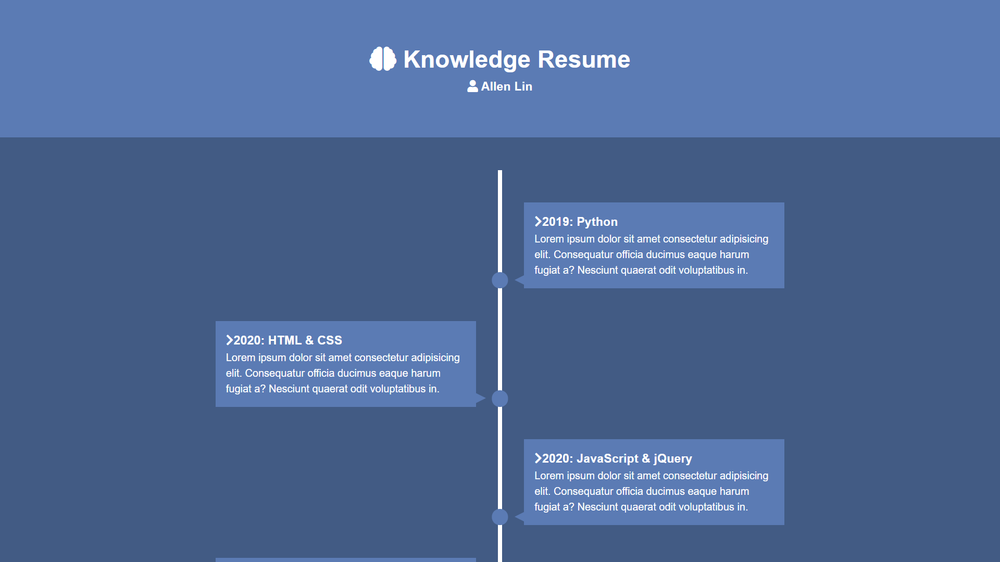
1. Part 3 - Responsive media queries 
    1. At this point, though the maximum width is at `1100px`, the page is not responsive if the screen is small, and the user can't see all the contents. 
    1. Note that the position of the elements require some time to test and check if the layout is ok. We can't get the value directly. 
    1. We add "**media quries**" to change the "width" of text box sizes and location. The white bar for timeline in the middle will be at the left when the screen become smaller. Note that the bar is at middle as its width is only `6px` and used `margin: 0 auto` to be places at the middle. If we change it to `margin-left: 20px`, the white bar will be only 20px away from the viewport on the left. 
    1. For `width` and `height`, we can use `calc()` for dynamic size. For example, we use `calc(100vw - 90px)`. In this case, so the `<div>` tags will be responsive to the screen size (viewport width) and always be 90px shorter than the full viewport width (this can be `80vw` or other value to be responsive as well). 
    ```css
    @media(max-width: 900px) {
        #timeline ul li div {
            width: 250px;
        }

        #timeline ul li:nth-child(even) div {
            left: -284px;
        }
    }

    /* make the white timeline bar from middle to the left*/ 
    @media(max-width: 600px) {
        #timeline ul li {
            margin-left: 20px;
        }

        /* Make the width responsive */
        #timeline ul li div {
            width: calc(100vw - 90px);
        }

        #timeline ul li:nth-child(even) div {
            left: 40px;
        }

        /* Change the direction of arrow */ 
        #timeline ul li:nth-child(even) div:before {
            left: -15px;
            border-width: 8px 16px 8px 0;
            border-color: transparent var(--secondary-color) transparent transparent;
        }
    }
    ```    
    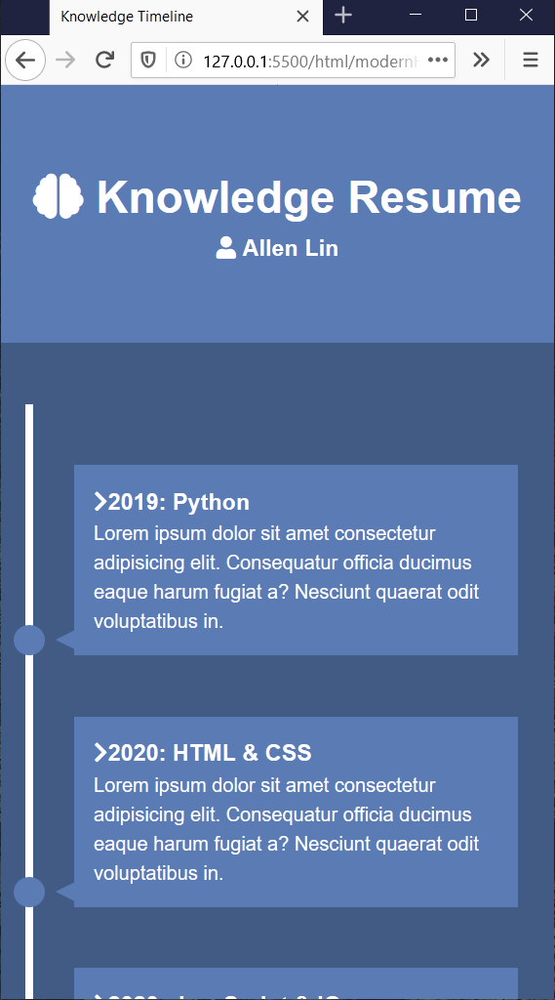

1. Part 4 - Scroll in Animation 
    1. We use JavaScript to add event listener for events as "page load", "resize", and "scroll". This JavaScript code is to add a class "**show**" to `<li>` tag when the user scrolls to the elements. We then make all `<div>` tags in the `<li>` tags to have `visibility: hidden` and `opacity: 0` to make all the elements disappear and shows when "**show**" class is added. 
    ```js 
    const items = document.querySelectorAll('#timeline li');

    const isInViewport = el => {
        const rect = el.getBoundingClientRect();
        return (
            rect.top >= 0 && 
            rect.left >= 0 && 
            rect.bottom <= 
                (window.innerHeight || 
                document.documentElement.clientHeight) && 
            rect.right <= (window.innerWidth ||
            document.documentElement.clientWidth)
        );
    };

    const run = () => 
        items.forEach(item => {
            if (isInViewport(item)) {
                item.classList.add('show');
            }
        });

    // Events 
    window.addEventListener('load', run); 
    window.addEventListener('resize', run); 
    window.addEventListener('scroll', run); 
    ```
    1. We give both "odd" `<div>` tags with `transform: translate(200px, 0)` and "even" `<div>` tags with and `transform: translate(200px, 0)` as the initial position. Note that we don't use its position properties, as we have set it for its relative location on the page. Therefore, we use a different property "**transform**" to move the entities and animate the effects. 
    1. In class "**show**", we move the `<div>` tags back to `transform: translate(0, 0)` and change visibility and opacity back to visible states, so the element will be back on the webpage. 
    ```css 
    /* Show Boxes */
    #timeline ul li.show div {
        transform: none;
        visibility: visible;
        opacity: 1;
    }

    #timeline ul li.show:after {
        background: var(--secondary-color);
    }
    ```
    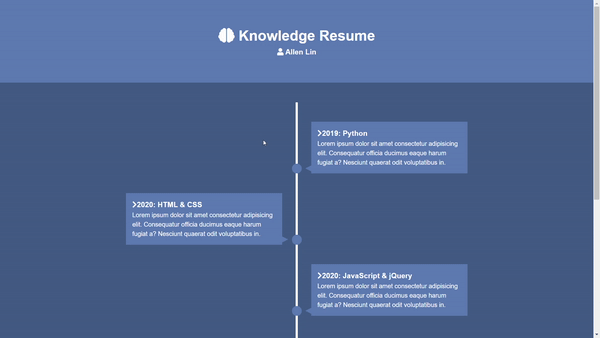

### Quick dropdown menu 
1. The dropdown menu is like a navbar and is responsive, as if the screen size becomes narrow, the navbar changes from "**row**" to "**column**". The following is the structure of the HTML file. 
    ```html
    <nav id="navbar">
        <ul>
            <li><a href="#">Home</a></li>
            <li><a href="#">About</a></li>
            <li>Services <i class="fas fa-angle-down"></i>
                <ul>
                    <li><a href="#">Web Development</a></li>
                    <li><a href="#">Website Design</a></li>
                    <li><a href="#">Mobile Development</a></li>
                    <li><a href="#">SEO</a></li>
                </ul>
            </li>
            <li>Blog <i class="fas fa-angle-down"></i>
                <ul>
                    <li><a href="#">HTML</a> <span>22 Posts</span></li>
                    <li><a href="#">CSS</a> <span>16 Posts</span></li>
                    <li><a href="#">JavaScript</a> <span>10 Posts</span></li>
                    <li><a href="#">Python</a> <span>13 Posts</span></li>
                    <li><a href="#">PHP</a> <span>10 Posts</span></li>
                    <li><a href="#">Design</a> <span>21 Posts</span></li>
                </ul>
            </li>
            <li><a href="#">Contact</a></li>
        </ul>
    </nav>
    ```
1. The followings are the CSS styling that we've learnt in the previous modules. 
    1. The posts in the blog section is made with `float: right` as in the `<li>` tag, we have only `<a>` and `<span>` tag. Note that the parent tag `<ul>` of its wrapper `<li>` tags have fixed width `width: 200px`. Note that these `<li>` should have `display: block` or each of them only takes the width of contents. 
    1. The dropdown list has many nested `<ul>` and `<li>` tags, we should be careful when using the selector and check the event (:hover). 
    1. Note that this design has an issue that the dropdown menu only shows when the mouse cursor hovers on. The `#navbar ul li ul` are selected to have `display: none` in regular condition. 

    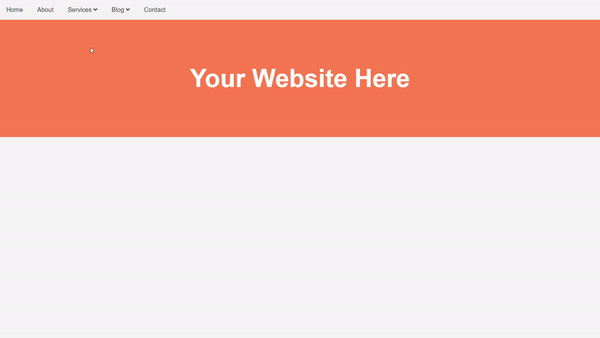

    ```css 
    :root {
        --primary-color: coral;
        --secondary-color: chocolate;
    }

    * {
        margin: 0;
        padding: 0;
        box-sizing: border-box;
    }

    html, 
    body {
        background: #f4f4f4;
        font-family: Arial, Helvetica, sans-serif;
    }

    #navbar ul {
        list-style: none;
    }

    #navbar ul li {
        color: #333;
        display: inline-block;
        padding: 1rem;
        position: relative;
    }

    #navbar ul li a {
        color: #333; 
        text-decoration: none;
    }

    /* Hide nested ul by default */
    #navbar ul li ul {
        display: none;
    }

    #navbar ul li:hover {
        cursor: pointer;
        background: var(--primary-color);
        color: #fff;
    }

    #navbar ul li:hover a {
        color: #fff;
    }

    /* Nested dropdown show */
    #navbar ul li:hover ul {
        display: block;
        position: absolute;
        left: 0;
        width: 200px;
        margin-top: 1rem;
    }

    #navbar ul li:hover ul li {
        display: block;
        background: #e7e7e7;
    }

    #navbar ul li:hover ul li a {
        color: #333;
    }

    #navbar ul li:hover ul li:hover {
        background: #e0e0e0;
        color: inherit;
    }

    #navbar ul li:hover ul li span {
        float: right;
        color: #fff; 
        background: var(--primary-color);
        padding: 0.2rem 0.5rem;
        text-align: center; 
        font-size: 0.8rem;
        border-radius: 5px;
    }

    #navbar ul li:hover ul li:hover span {
        background: var(--secondary-color);
    }

    #showcase {
        display: flex; 
        flex-direction: column;
        height: 300px;
        align-items: center;
        justify-content: center;
        text-align: center;
        padding: 0 2rem;
        background: var(--primary-color);
    }

    #showcase h1 {
        color: #fff;
        font-size: 4rem;
    }

    @media(max-width: 600px){
        #navbar ul li {
            display: block;
        }

        #navbar ul li:hover ul {
            width: 100%;
            position: relative;
        }
    }
    ```

    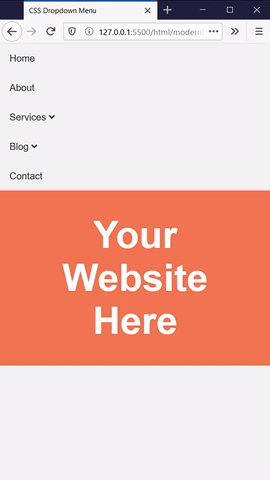

# CSS Grid 
### What is CSS Grid? 
1. CSS Grid is the "Grid layout system for CSS which is similar to "flexbox" (more powerful but a bit more difficult) and capable of two-dimensional layouts. 
1. `align-items` and `justify-content` are also available in CSS Grid. 
1. We can use `display: grid` to start a grid structure. All the child elements in this wrapper which has the property are "**grid items**". 
**Difference between Flexbox and Grid**
1. "**Flexbox**" is one-dimensional, which means the contents can be managed only in a "**row**" or a "**column**".
1. "**Grid**" is two-dimensional that we can give a grid element span on its "**rows**" and "**columns**" to cover a certain area in the grid rather than being aligned by flexbox. 
1. These 2 systems are used for different purposes. For example, "**Flexbox**" is useful for simple alignment such as a dropdown menu, and items in the menu. On the other hand, "**grid**" can be used for outter elements or grid-like layouts. 

## Grid Basics 
### Grid Columns 
1. We give the outter element, the "container", `display: grid`. Note that this doesn't make effect as `display: flex`. We then create the number of columns we want by using `grid-template-columns: 200px 200px 200px`. In this case, we create 3 columns in the grid system, and each of the block has a width at `200px`. 
1. If there are more than 3 items, the 4th item will be put on the 2nd row, so as the 7th will be on the 3rd row and so on. 
1. If we give `auto` as the width of columns, the items will be streched and fill up the width of the screen. In the case above, if we all give 3 column width as `auto`, they will be separated evenly on the row. For example, we have 6 elements in the "**grid**", and it creates a 2*3 table with CSS styling. 
1. Besides, giving numbers of width to the property, we can have `grid-template-columns: repeat(3, auto)`. `repeat()` takes 2 arguments, which is the number of columns of a row and the width of each column. Besides, absolute value `px` and `auto`, fractions `fr` are another often used units to create the size. Note that `repeat(3, 1fr)` and `repeat(3, auto)` create the same effect. 
    ```html
    <style>
        .grid {
            display: grid;
            /*grid-template-columns: auto auto auto; */
            /* grid-template-columns: repeat(3, auto); */
            grid-template-columns: 1fr 2fr 4fr;
        }

        .item {
            padding: 3rem;
            border: #ccc 1px solid;
            background: #f4f4f4;
            font-size: 1.3rem;
            font-weight: bold;
            text-align: center;
        }
    </style>
    <body>
        <div class="grid">
            <div class="item">Item 1</div>
            <div class="item">Item 2</div>
            <div class="item">Item 3</div>
            <div class="item">Item 4</div>
            <div class="item">Item 5</div>
            <div class="item">Item 6</div>
        </div>
    </body>
    ```

    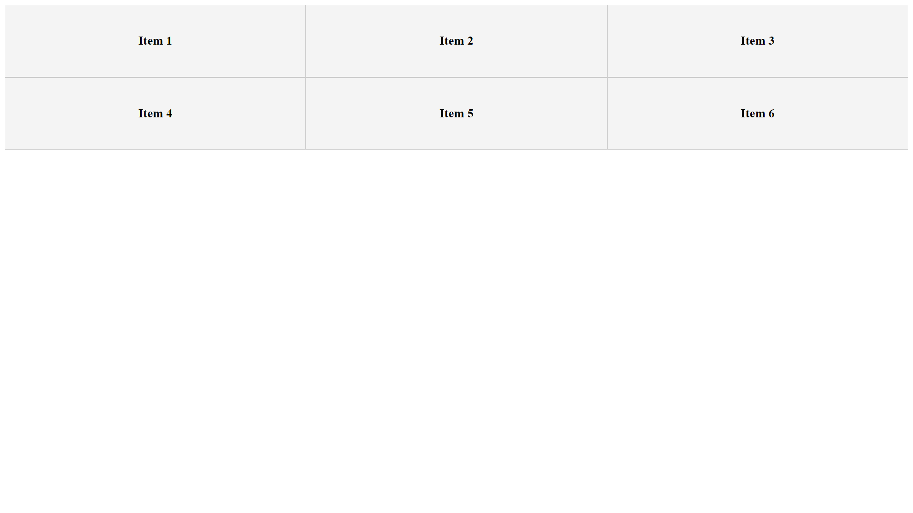
1. We can add gaps between the elements in the grid with `grid-gap: 1rem`, so the elements will be separated as grid box. The gap between the elements will always be the given size regardless of large the screen is. 
    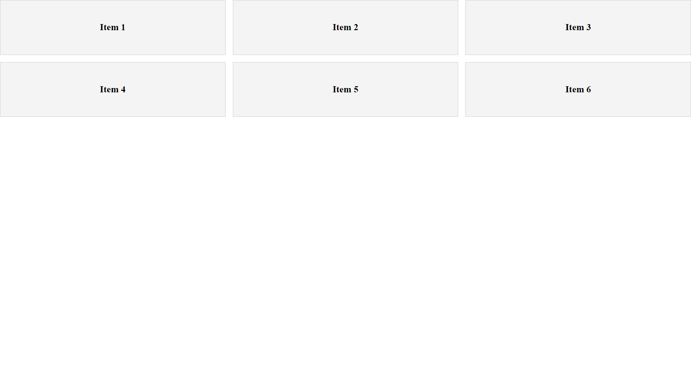

1. By Grid system, it's much easier to separate the layout and columns into desirable scales without testing the width with different values. 

### Grid Rows 
1. Similar to columns, we can set up the "**height**" of elements in a column with `grid-template-rows: 1fr 2fr 3fr`. Note that as we have 6 items in total from the template but set only 3 values, the property will only affect to the first 3 items in the column, while the rest (on the row below) have the original width. 
1. We can use `grid-auto-rows: 3fr` to set the rest of the items that aren't selected to the same given height. 
1. Besides, since `grid` is two-dimensional, we can use both `grid-template-columns` and `grid-template-rows` for the wrapper. 
    ```css 
    .grid {
            display: grid;
            grid-template-columns: repeat(3, 1fr);
            grid-template-rows: 1fr 2fr 3fr;
            grid-auto-rows: 3fr;
        }
    ```

    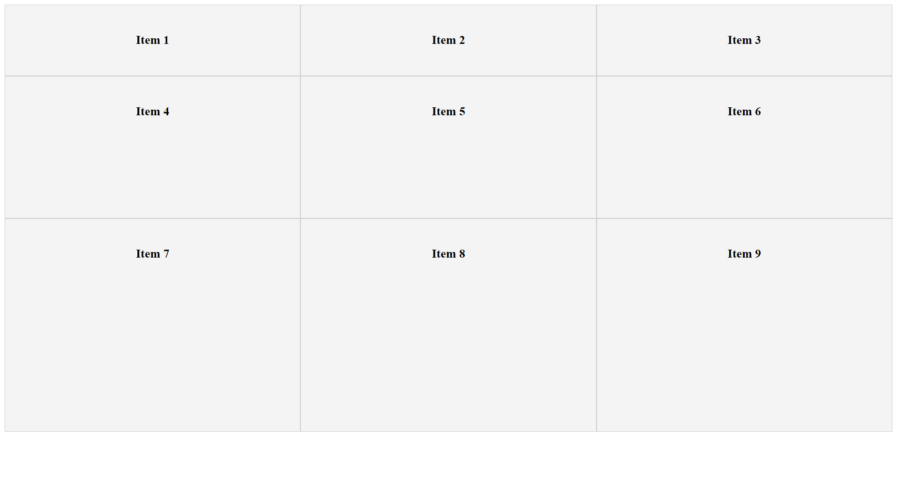

### Spanning Columns and Rows 
1. We can make certain "cell" (element) in the grid span over other elements. For example, we have a grid of 15 items, and would like to have "Item 1" expand to cover from "Item 1" to "Item 7" in below. 
    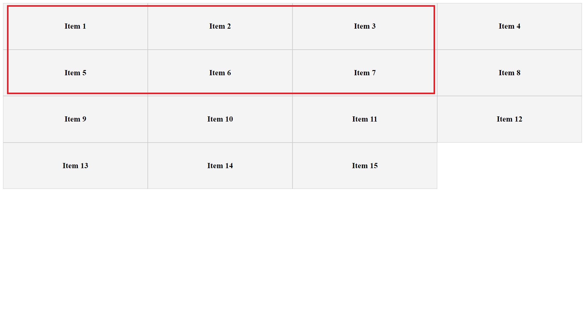
1. After creating the grid, we can specify the property of an element by using `grid-column-start`, `grid-column-end`, `grid-row-start`, `grid-row-end` to expand the element. 
    ```css 
    /* regular way */
    .item:first-child {
        grid-column-start: 1;
        grid-column-end: 4;
        grid-row-start: 1;
        grid-row-end: 3;
    }
    ```
1. On the other hand, we can use the shorthand as other CSS properties to make the code shorter. 
    ```css
    /* shorthand. Works the same as the above */
    .item:first-child {
        grid-column: 1 / span 3;
        grid-row: 1 / span 2;
    }
    ``` 
    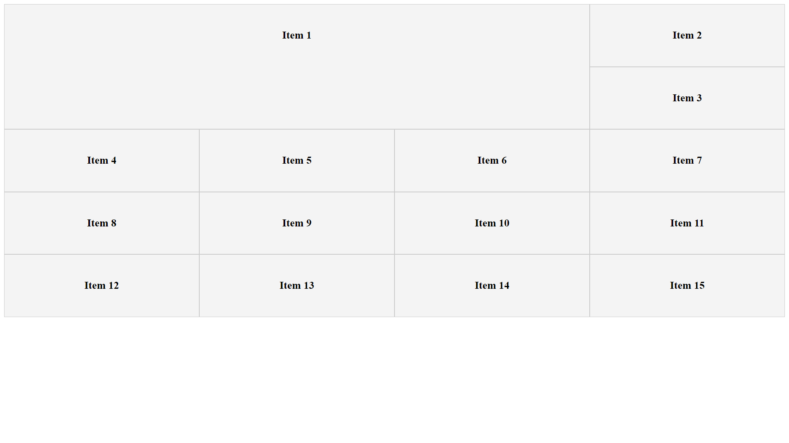

### Auto-Fit & Minmax 
1. We can set up the wrapper tag with `grid-template-columns: repeat(auto-fit, minmax(300px, 1fr))`. It means that when the browser width is resized to its minimum at 300px, the "grid elements" will be stacked up by `1fr` and becomes a column. When the browser width is wide enough, the elements will be queued in a row instead. 
1. This feature would be useful for certain contents, but not all. For example, if we have a grid of photos, this is helpful for the responsive design for the image gallery grid. 
    ```css
    .grid {
        display: grid;
        grid-template-columns: repeat(auto-fit, minmax(300px, 1fr));    
    }
    ```
    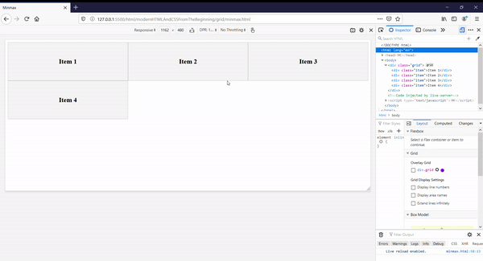

### Grid Template Area 
1. This is to use property `grid-template-areas` to set up the template. 
1. We set up the layout as "**rows**" in different lines with the "tags". However, this only works if we set up the "tags" in their own classes with property `grid-area` as a variable. 

    ```html
    <style>
        .container {
            display: grid;
            grid-template-areas: 
                'header header header'
                'content content sidebar'
                'box-1 box-2 box-2'
                'box-3 box-3 box-3'
                'footer footer footer';
            grid-gap: 1rem;
        }

        .header {
            grid-area: header;
            text-align: center;
        }

        .content {
            grid-area: content;
        }

        .sidebar {
            grid-area: sidebar;
        }

        .box-1 {grid-area: box-1;}
        .box-2 {grid-area: box-2;}
        .box-3 {grid-area: box-3;}

        .footer {
            grid-area: footer;
            text-align: center;
        }

        .header,
        .content,
        .sidebar,
        .box-1,
        .box-2,
        .box-3,
        .footer {
            border: 1px #ccc solid;
            padding: 0.5rem;
        }
    </style>
    <body>
        <div class="container">
            <header class="header">
                <h1>My Website</h1>
            </header>
            <section class="content">
                <h3>Welcome To My Site</h3>
                <p>Lorem ipsum dolor sit amet consectetur adipisicing elit. Magni iusto nesciunt voluptas atque porro repellendus quia? Praesentium veritatis quas corporis, in enim, tenetur dolorem voluptatum labore exercitationem ut perferendis asperiores?</p>
            </section>
            <aside class="sidebar">
                <h3>Contact Us</h3>
                <ul>
                    <li>Some Company</li>
                    <li>Soi 26 Sukhumvit</li>
                    <li>apple@gmail.com</li>
                    <li>999-999-9999</li>
                </ul>
            </aside>
            <div class="box-1">
                <h3>Heading</h3>
                <p>Lorem ipsum dolor sit amet consectetur adipisicing elit. Sequi placeat necessitatibus unde veritatis suscipit. Libero voluptatem earum mollitia dignissimos cumque.</p>
            </div>
            <div class="box-2">
                <h3>Heading</h3>
                <p>Lorem ipsum dolor sit amet consectetur adipisicing elit. Sequi placeat necessitatibus unde veritatis suscipit. Libero voluptatem earum mollitia dignissimos cumque.</p>
            </div>
            <div class="box-3">
                <h3>Heading</h3>
                <p>Lorem ipsum dolor sit amet consectetur adipisicing elit. Sequi placeat necessitatibus unde veritatis suscipit. Libero voluptatem earum mollitia dignissimos cumque.</p>
            </div>
            <footer class="footer"><p>Coptyright &copy; 2020</p></footer>
        </div>
    </body>
    ```

    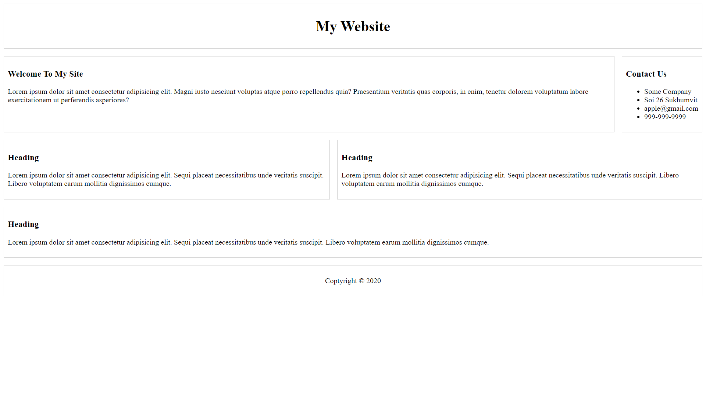

### Media queries & the Grid
1. We can just use media queries to specify the layout in different screen width. 
    ```css 
    /* Wide Screen with 4 columns*/
    .grid {
        display: grid;
        grid-template-columns: repeat(4, 1fr);
        grid-gap: 1rem;
    }

    /* Tablet with 2 columns */
    @media(max-width: 768px) {
        .grid {
            grid-template-columns: repeat(2, 1fr);
        }
    }

    /* Smart Phone with 1 column */
    @media(max-width: 500px) {
        .grid {
            grid-template-columns: 1fr;
        }
    }
    ```
1. We can use media queries with property `grid-area-template` as well. 
    ```css 
    .container {
        display: grid;
        grid-template-areas: 
            'header header header'
            'content content sidebar'
            'box-1 box-2 box-2'
            'box-3 box-3 box-3'
            'footer footer footer';
        grid-gap: 1rem;
    }

    @media(max-width: 500px) {
        .container {
            grid-template-areas: 
            'header'
            'content'
            'sidebar'
            'box-1'
            'box-2'
            'box-3'
            'footer';
        }
    }
    ```

# NewsGrid Website 
1. It's an UI designed for new webpages. The website has a featured news on the landing page and is responsive to tablet and mobile-size screen. We have 3 pages, which is the main landing page, about page, and article pages. 
1. To organize the files, we create 1 "img" folder and "css" to keep images and CSS files separately in the root directory. 

### Setup and Favicon
1. This section is mainly working creating the HTML structure of the navbar on the top of the webpage without CSS. 
1. We separate CSS files into regular (large screen) and mobile version. When we import the CSS in HTML file, we can specify the use of each. For example, in the `<link>` tag, we can add `media="screen and (max-width: 768px)"`. Besides, the mobile version should be under the link of regular version. Therefore, the CSS for mobile version only take effect when the screen width is under 768px. 
1. We can use online service to create a "**favicon**" which has `.ico` as suffix. Besides, the file should be put at the root directory with HTML file rather than in the "**img**" folder. The converting website will generate the `<link>` as well. For example, `<link rel="shortcut icon" type="image/x-icon" href="favicon.ico">`. Note that we should check the file path in `href` property to ensure the icon shows on the webpage tab correctly. 
1. We can add attribute `target="_blank"` to `<a>` tag to create a new tab when users clicking on it `<a target="_blank" href="https://www.youtube.com/">`

### Core styles, variables, and navbar 
1. We narrow down the logo by giving it `180px`, change color of social media icons to grey color (#777), and the color of the buttons. 
1. We can use `justify-self: center` to set the way of a block element alignment in its container. This property works on the element "**itself**" directly. (Note that `justify-content` works on the child elements of a container). 
1. We use the `position: sticky` to keep the navbar stay on the top above every other elements on the page. Besides, we give `z-index: 2` to ensure it's visible over other elements. 
    ```css 
    #main-nav {
        background: #fff;
        position: sticky;
        top: 0;
        z-index: 2;
    }
    ```
1. We can design a "**current**" class on the buttons in the navbar, so users can have a visualized hint that which are they browsing. For example, this website has mainly 2 pages "**home**" and "**about**". We can hightlight the button in red to let users know where they are. 
    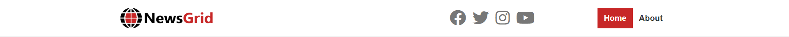

### Showcase with overlay and button styles 
1. We have a `<header>` tag which contains several boxes inside. When we create a backgroudn with an image, we can use psuedo selector `::before` with empty `content: ''`. Note that the element that creates with the background must have `position: relative`, as we will set the image with `position: absolute`, `top: 0`, and `left: 0`. 
    ```css 
    #showcase {
        color: #fff;
        background: #333;
        padding: 2rem;
        position: relative;
    }

    #showcase:before {
        content: '';
        background: url('../img/featured.jpg') no-repeat center center/cover;
        position: absolute;
        top: 0;
        left: 0;
        width: 100%;
        height: 100%;
        opacity: 0.4;
    }
    ```
1. We can make all the button class `.btn:hover` to have `opacity: 0.9`. Therefore, no matter what color the button is, there's an effect when mouse cursor hovers on the button. 
1. We create a `btn-block` class (which is similar in Bootstrap for buttons) that makes the button streched to the width of its container. 
    ```css 
    .btn:hover {
        opacity: 0.9;
    }

    .btn-block {
        display: block;
        width: 100%; 
        text-align: center;
    }
    ```
1. We create a `<div>` with "**container**" class and wrap all the contents of each section on the webpage. Therefore, contents of each section will have the same `width` and `padding` and will be centered as its `margin: auto`. 
    ```css 
    .container {
        max-width: var(--max-width);
        margin: auto;
        padding: 0 2rem;
        overflow: hidden;
    }
    ```
    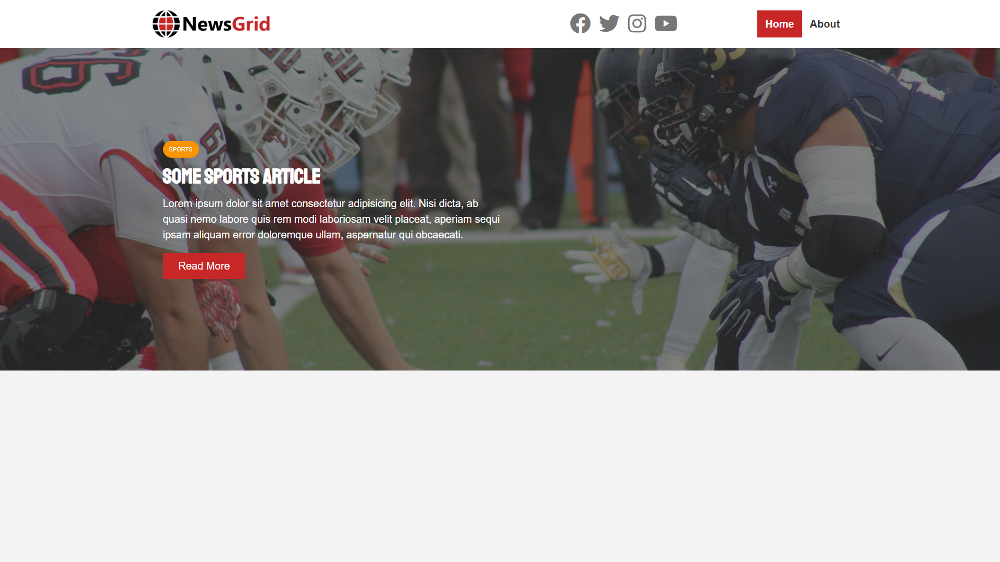


### Home articles grid 
1. In the section, we can use `<section>` tag for the part on the webpage, besides, we put all elements in the `<div class="container">` which has some padding on the edges. Besides, we can put the contents in the container with class `card`, which in bootstrap is used for text contents. 
1. In this section, we also set up the utilities to ensure text color in certain background is styled. 
1. By the structure of HTML, we use asterisk `*` selector to choose the "**articles**" with spanned width, so only the first and last item can cross 2 columns. 
    ```css 
    #home-articles .articles-container > *:first-child, 
    #home-articles .articles-container > *:last-child {
        display: grid;
        grid-template-columns: repeat(2, 1fr);
        grid-gap: 1rem; 
        align-items: center;
        grid-column: 1 / span 2;
    }

    #home-articles .articles-container > *:last-child {
        grid-column: 2 / span 2;
    }
    ```
    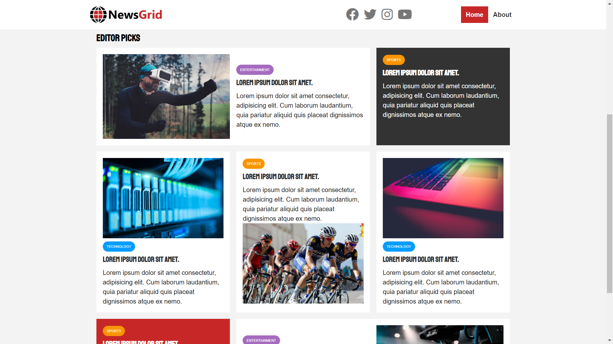

### Footer with grid 
1. We create the footer section on the homepage, which uses "Grid" and has 4 columns on the 4 rows while the last row has a single item span accross the whole row. 
    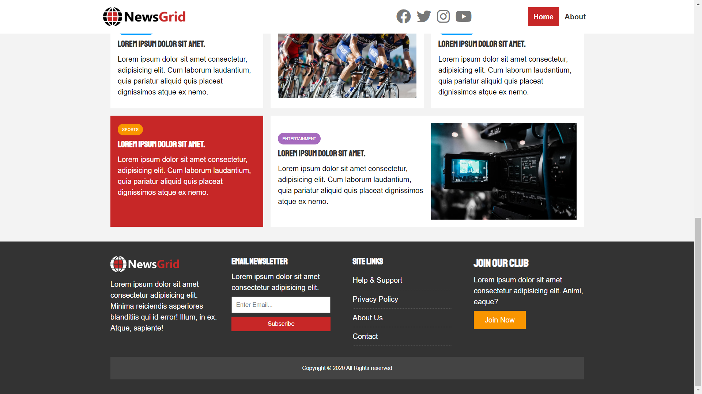

### About Page and Page container 
1. We can store the header navbar and footer as boilerplates. When developing in backend or frontend frameworks, this boilerplate features are usually included in the framework already. 
1. In CSS, we can separate those items will be used in most of the templates as "**utilities**". In this case, we create a article grid pattern. 
1. In this case, we created a grid that has "**main content**" and a "**side column**". In the "**Grid**", we can use asterisk selector to select the 1st child `*:first-child` and give `grid-row: 1 / span 3`, so the first item on the left will extend accross the page and has triple the height of the element aside. Therefore, the number of span gives us the layout of how many items we can align on the side column. For example, if we change span to 2, we can put 2 items aside in the layout as a pattern. 
    ```css 
    /* Inner page container */
    .page-container {
        display: grid;
        grid-template-columns: 5fr 2fr;
        margin: 2rem 0; 
        grid-gap: 1.5rem;
    }

    .page-container > *:first-child {
        grid-row: 1 / span 3;
    }
    ```
    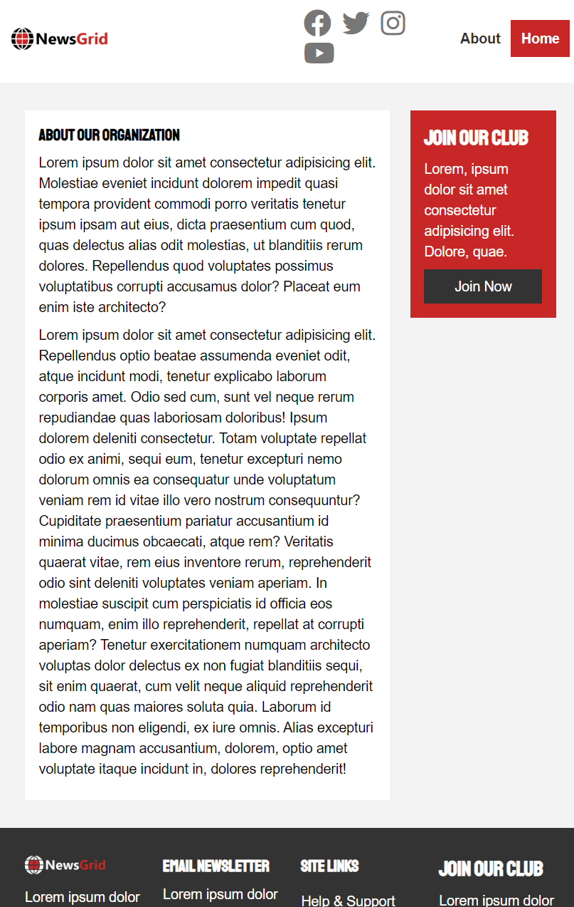

### Article Page
1. The main concept of design and layout is that we can plan for the pattern of the website and preserve some of the designs, such as colors and detailed layout into classes (this lecture uses pattern similar to bootstrap). Therefore, we can call the patterns and layout by giving classes directly. 
1. Here introduced to use `<small>` tag which is used for meta data, such as author info., bio, and when is the article created. This tag will make its content smaller, and is a semantic tag in HTML 5. 
1. The other idea through out the course is that each section is wrapped with specific container with "**id**", so we can locate them easily and integrate all the styling in one CSS file. 
1. We can use "**grid**" system for larger or overall layout, while use "**flexbox**" for inner contents such as contents that is a single column or row. In this case, we use `display: flex` and `justify-contents: space-between` to separate the child elements in `meta data`, such as author name and created time. 
1. Note that in this case, there are only 2 main elements in `<div class="meta">`, as we use `<small>` tag to wrap the icon and text together. Note that in the lecture, the instructor used `#article .category .category-ent` to select the `<div>` tag which is created for category tags on the page. After inspecting, this element has little margin at bottom, and we add `margin-top: 0.4rem`, so the element in centered in the container. However, we can work on that by taking off the margin aroudn the element. This will effect to the overall size of the `meta` container, as its content shrinks down (margin is removed). 
    ```html
    <div class="meta">
        <small>
            <i class="fas fa-user"></i> Written By John Doe January 12, 2020
        </small>
        <div class="category category-ent">Entertainment</div>
    </div>
    ```
    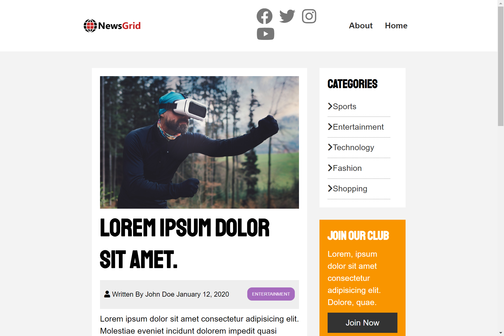

### Responsive media queries (Mobile version)
1. We'd like to have the article grid "Editor Picks" stay in one column when the browser is narrow, as in mobile device. In this case, we've set up "**mobile.css**" for styling and has a media query at `768px`. 
    1. Hide the social icons (facebook, twitter, etc.) 
    1. Use `justify-self: center` to center the logo and navigation butotns. Note that the property affects its child elements and the container itself. (However, we can use other methods such as turning the `container` in the navbar to becomes a flexbox. This method takes much more lines of code and adjustment to the elements.)
    1. When we use `box-sizing: border-box` to the page, the padding adde to the inner elements will cause the elements smaller because the padding size is taken into account the size of the element. 
1. We then fix the location of the contents in showcase and make the footer section responsive. 
    1. We've spanning the elements into several columns in the regular mode. 
    1. In this case to change the layout, we have to change `grid-column` back to 1 rather only changing the `grid-template-column` because that doesn't affect to spanning of elements. 
    1. Note that we have the same header and footer section code in every page. Therefore, the modification on the CSS (which is also shared with other pages) can affect to all the pages as well. 


# Website Deployment with Netlify 
1. Install Git and sign up for Github and Netlify (which can be singed up with Github account). 
1. Initiate a Git repository with `git init`
1. Push the repository to Github. 
1. After deploying to Netlify, the host will create a random URL for us (similar to Heroku). We can go buying a domain name, such as from "Name Cheap". 

### Netlify Deployment and Form Submission
1. Every time we commit a new version and push to the Github repository, the website will be updated automatically. 
1. Netlify can deal with form submission easily and return the list of emails or contacts on its dashboard. We can read the documentation [here](https://docs.netlify.com/forms/setup/#html-forms) to set it up. Basically, we can just add up `method` attribute with `POST`, `data-netlify="true"` and give a `name` attribute. After deploying, Netlify will add another `<input>` tag itself to receive the data. 
    ```html 
    <form name ="contact" method="POST" data-netlify="true">
        <input type="email" name="email" placeholder="Enter Email...">
        <input type="submit" value="Subscribe" class="btn btn-primary">
    </form>
    ```
1. We can check from the NewsGrid deployment from the website and note that we've added an email subscribtion in the "footer" section on the webpage. We can download the email list as CSV from Netlify directly as well. 

### Custom Domain name 
1. After purchasing a domain from DNS hosting providers, we can configure the on both Netlify and DNS provider to link the URLs and IP together. 
1. This may be revisited in real practice when needed in the future. 


# Learning Sass 