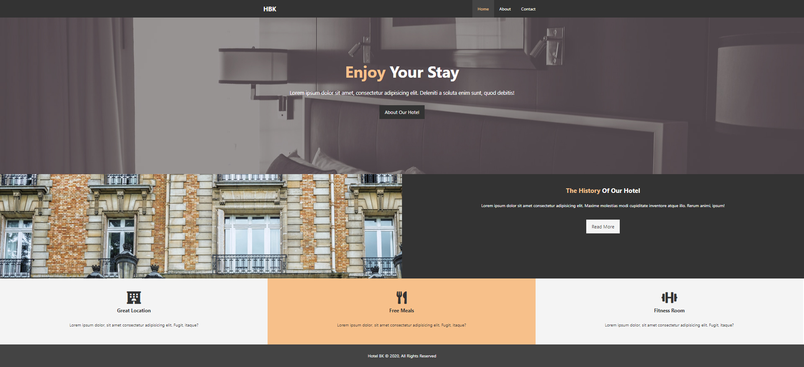

# HTML Basics 
### Meta tags and search engines
1. We have `<meta>` tags to declare the HTML file that it is responsive to the device, as the content attribute is set up to `content="width=device-width, initial-scale=1.0"`. Besides, there are several meta data we can put in the `<head>` tag for search engine to parse, such as "discription" and "keyword".
    ```html
    <head>
        <meta charset="UTF-8">
        <meta name="viewport" content="width=device-width, initial-scale=1.0">
        <title>Document</title>
    </head>
    ```

### Heading, paragraphs, and typography 
1. In convention, we put only 1 `<h1>` tag on a page. 
1. `<strong>` tag is to make text bold, and `<em>` tag (emphasis) is to make the text italic. 
1. `<br>` tag is to have a "**line break**" (a new line between paragraphs). One `<br>` tag is like a new line character `\n`. To have a line between 2 paragraphs, we need 2 `<br>` tags to fulfill. 
1. `<hr>` tag is "horizontal rule" to have a horizontal line on the page. 
1. After HTML5, the language becomes more semantic and use `<strong>` tag rather than `<b>` tag for bold feature. However, styling features should be separated and use with CSS. The point to have `<strong>` tag is to indicate that the text is import and should stand out. 

### Links, images, and attributes 
1. Anchor tags `<a>`
    1. We put "href" attribute in `<a>` anchor tag to direct the user to the given URL after clicking. 
    1. We can put both "<ins>**URL**</ins>" (remote) and "<ins>**file path**</ins>" (local) to "href" attribute to direct to the HTML file. 
1. Image tags `` 
    1. These tags are similar to anchor tags that they can take both "<ins>**URL**</ins>" (remote) and "<ins>**file path**</ins>" to their "<ins>**src**</ins>" (local) attribute. 
    1. Besides, `` tags have another attribute `alt` which is the "<ins>**alternative text**</ns>" when the image doesn't show up. The tag shows the image's original size in default. 

### Lists and tables 
1. **Lists** 
    1. "**Unordered list**" - We have `<li>` tags wrapped by `<ul>` tags. Besides, there are several styles of unordered list bullet-symbols that we can use inner style or CSS to change it, such as `square`, `disk`(default), `circle` (unfilled circle, empty inside), and `none`. 
    ```html
    <ul style="list-style: square">
        <li>Item1</li>
        <li>Item2</li>
        <li>Item3</li>
        <li>Item4</li>
    </ul>
    ``` 
    1. "**Ordered list**" - Ordered list are wrapped by `<ol>` tags and use `<li>` tags as unordered list does. However, it uses attribute as "**type**" to change the style, such as "1" for numerals (default type), "i" and "I" for roman numerals in lower and uppercase, and "a" and "A" for alphabets in lower and uppercase. 
    ```html
    <ol type="A">
        <li>Item1</li>
        <li>Item2</li>
        <li>Item3</li>
        <li>Item4</li>
    </ol>
    ```
    1. We can also have `<ul>` or `<ol>` nested in the `<li>` for nested tags. 
1. **Tables** 
    1. Tables are usually just used for tabular data. For table like layout on the page, it's better to use CSS flexbox or grid for the feature. We use `<table>` tags to create a table with following elements. 
    1. `<thead>` is the header section of the table. 
        1. `<tr>` is for the row.
        1. `<th>` is for each column in the row.
    1. After header, we can include the main data with `<tbody>`. 
        1. `<tr>` is for the row in the body part. 
        1. `<td>` for the data in the body part, while `<th>` is for the header only. 
    ```html
    <table>
        <thead>
            <tr>
                <th>First Name</th>
                <th>Last Name</th>
                <th>Email</th>
            </tr>
        </thead>
        <tbody>
            <tr>
                <td>John</td>
                <td>Doe</td>
                <td>jdoe@gmail.com</td>
            </tr>
            <tr>
                <td>Kate</td>
                <td>Smith</td>
                <td>kate@gmail.com</td>
            </tr>
            <tr>
                <td>Jeff</td>
                <td>Wilson</td>
                <td>wilson@gmail.com</td>
            </tr>
        </tbody>
    </table>
    ```

### Forms and input 
1. We use `<form>` tag which has attribute as `action` that can manipulate the data collected from the form elements with backend program, such as `process.js` or `process.py`. 
1. In the form, we can use `<div>` tag to create a division for the section of an input. 
1. All `<input>` tags have an attribute `value` which we can set a default value in the textbox or be selected when the page is loaded. 
1. We can use `placeholder` attribute of `<input>` tags to give hint of the type of the data requested to the user. The text is in grey by default and will disappear when any value or character is given to the `<input>` tag. 
    1. In the division, we use `<label>` with attribute `for` which will link to the `<input>` tag that has the an `id` which is the same value as the value for `for` and the name for the input tag. 
    1. After the `<label>` tag, we have an `<input>` tag to collect data from users. We can set up `type` for the type of data to collect of the input element, `name` as the variable which can be parsed and retrieved by backend programs, and `id` of which has the same value as the `for` in `<label>` tag can link them together. 
    1. We can set the `type` of `<input>` tag as "**text**", "**password**" (which input will be masked), and "**email**" that has a simple validation of data pattern on the client side (We can use other mechanism or program to validate email addresses on the backend side). 
    1. We can use `<textarea>` to have a large input section for multiple lines on the page. The element has similar attributes and have `cols` as columns to modify the width of the textbox and `rows` as rows to modify the height of the textbox. 
    1. `<select>` tag is a dropdown menu which we can have multiple `<option>` tags as the items in the selective list. Note that we should set up the attribute `value` for the value of the `<option>` tag. Besides, we can have one of the `<option>` has attribute `selected`, so the option will be in default when the page is loaded. 
    1. If the `type` of `<input>` tag is number as `type="number"` the tag takes only numbers and can be adjusted with a side button. 
    1. With `type="date"`, we can have a "**date selector**" to ensure the user gives a valid date format. 
    1. With `type="radio"`, we can have a single option selector with different values. Note that the radio button itself is an `<input>` tag, while the option is just a pure text in HTML. Therefore, we can have several `<input>` tags to have multiple options as radio buttons to select. Besides, if we set `<input>` tag attribute `checked`, the option will be selecgted when the page is loaded as default value. 
    1. With `type="checkbox"`, we can have checkboxes as multiple selections that is similar to radio buttons. 
    1. To create a "**submit**" button, there are several ways to do so. For example: 
        1. Use input tag - `<input type="submit" value="Submit">` 
        1. Use button tag - `<button type="submit">Submit</button>` 
    1. We can use `<button type="reset">Reset</button>` to clear all the inputs in the same form as default value when the page is loaded. 
    ```html
    <form action="#">
        <!-- text -->
        <div>
            <label for="name">Name</label>
            <input type="text" name="name" id="name" placeholder="First and Lastname">
        </div>
        <br>
        <!-- email -->
        <div>
            <label for="email">Email</label>
            <input type="email" name="email" id="email">
        </div>
        <br>
        <!-- textarea -->
        <div>
            <label for="message">Message</label>
            <textarea name="message" id="message" cols= "20" rows="5"></textarea>
        </div>
        <br>
        <!-- select -->
        <div>
            <label for="sex">Sex</label>
            <select name="sex" id="sex">
                <option value="male" selected>Male</option>
                <option value="female">Female</option>
                <option value="other">Other</option>
            </select>
        </div>
        <br>
        <!-- number -->
        <div>
            <label for="age">Age</label>
            <input type="number" name="age" id="age">
        </div>
        <br>
        <!-- date -->
        <div>
            <label for="birthdate">Birthdate</label>
            <input type="date" name="birthdate" id="birthdate">
        </div>
        <!-- radio -->
        <div>
            <label for="membership">Membership</label>
            <input type="radio" name="membership" id="membership" value="simple"> Simple 
            <input type="radio" name="membership" id="membership" value="standard" checked> Standard 
            <input type="radio" name="membership" id="membership" value="super"> Super 
        </div>
        <!-- checkbox -->
        <div>
            <label for="membership">I Like...</label>
            <input type="checkbox" name="likes"  value="bike"> Bike 
            <input type="checkbox" name="likes" value="car" checked> Car 
            <input type="checkbox" name="likes" value="boat"> Boat 
        </div>
        <!-- buttons -->
        <input type="submit" value="Submit">
        <!-- <button type="submit">Submit</button> -->
        <button type="reset">Rest</button>
    </form>
    ```
1. Note that after clicking the submit button, an action is trigerred that all the input will be submitted or hanlded by a backend program if there's any. It means both "submit" and "reset" to a format works the same that it wipes out all the inputs, while "submit" can have an action to send the data to other programs. 

### Block and inline level elements 
1. We can check the overview at [w3school](https://www.w3schools.com/html/html_blocks.asp)
1. The main difference between "block" and "inline" elements is that block elements will separate themselves into a "block" as a section or paragraph of an article. This makes the element fills the whole width of the screen according to the size fo the monitor. For example, `<p>` tags and `<ul>` and `<li>` tags. 
1. "inline" element, on the other hand, follow each other as a concatenated chain in the same line. For example, `<a>` anchor tags and `<strong>` tags. 
1. We can use CSS to change the attribute to make an element appears as a "block" or "inline" element. 

### Divs and spans, classes, and IDs
1. We can have `<div>` tags to wrap elements in the same block. `<span>` is to group elements in the same line. 
1. "`id`" should be set to a single element in HTML file, while a "`class`" can be assigned to multiple elements at the same time. In convention, an "`id`" shouldn't repeat. 
1. `&copy;` is the © (copyright) symbol in HTML that we can call. There are other symbols we can use as well. 
    ```html
    <div id="main-header" class="card">
        <h1>My Website</h1>
        <p>A site about me</p>
    </div>
    <ul>
        <li><a href="#">Home</a></li>
        <li><a href="#">About</a></li>
        <li><a href="#">Contact</a></li>
    </ul>
    <div id="about" class="card">
        <h3>About</h3>
        <p>Lorem ipsum, dolor sit amet consectetur adipisicing elit. <span class="enhance">Nesciunt deleniti rem nobis dolor unde maiores perferendis molestiae saepe libero </span> suscipit beatae dicta a voluptas, <div class="enhance">obcaecati reprehenderit corporis</div> eaque impedit ad!</p>
    </div>

    <div id="contact" class="card">
        <h3>Contract Me</h3>
        <ul>
            <li>Address: 50 Main st, Boston MA</li>
            <li>Phone: 123-456-7890</li>
            <li>Email: apple@gmail.com</li>
        </ul>
    </div>

    <div id="footer">
        <p>Copyright &copy; 2020</p>
    </div>
    ```

### HTML entities 
1. We can check the list of HTML entities at [w3school](https://www.w3schools.com/html/html_entities.asp). The entities can called by its "**entity name**" or "**numer**". For example, a non-breaking space can be called by `&nbsp` and `&#160` in HTML. 
1. **Non-breaking space** - `&nbsp;` is non-breaking space in HTML that it's a character to represent whitespace in HTML. In default, if we have several white space between text in a `<p>` tag for example, there no different between `<p>I'm happy</p>` and `<p>I'm               happy</p>`, as the browser consider these 2 tags are the same. To have the feature as multiple whitespaces between words, we can use `&nbsp;` such as `<p>I'm &nbsp; &nbsp; &nbsp; &nbsp; happy</p>`. The result will be "I'm     happy" on the page. 
1. **Greater than and Less than** - `&gt;` is the "greater than" sign `>` in HTML, as if we put the character in line directly, so browsers may get confused and rendered wrong result. We can use `&lt;` for "less than" character `<`. 
    ```html
    call HTML entity by entity name 
    5 &gt; 2 
    1 &lt; 3
    call HTML entity by entity number 
    5 &#62; 2 
    1 &#60; 3
    ```
1. `&copy;` for © copyright 
1. `&reg;` for ® trademark 
1. Currency and dollar signs 
    1. `&cent;` for ¢ dollar cents 
    1. `&yen;` for ¥ Japanese Yen 
    1. `&euro;` for € Euros
1. Suit of playing cards 
    1. `&spades;`♠ BLACK SPADE SUIT
    1. `&clubs;` ♣ BLACK CLUB SUIT
    1. `&hearts;`♥ BLACK HEART SUIT
    1. `&diams;` ♦ BLACK DIAMOND SUIT
1. Inline element, computer code tags `<code>`, such as `<code>Hello World!</code>`
1. Inline element, keyboard instructions `<kbd>`, such as `<kbd>Ctrl + S</kbd>` for <kbd>Ctrl + S</kbd>

### HTML Semantic Tags 
1. Each of them represents a section of the webpage. The tags also help search engine and disabled people to understand what's the purpose and part on the page rather than a simple `<div>` tag which has no meaning. 
    1. `<header>` is on the top that has a search bar or other generic buttons. 
    1. `<footer>` is a the bottom that contains copyright, trademark or other information or links of the page. 
    1. `<nav>` is the navigation bar on the top or on the side for users to easier access the services or pages on the website. 
    1. `<main>` is usually the main body and content of the page. However, we can skip this tag and use `<section>` directly. 
    1. `<section>` is similar to `<div>` tag to use to separate elements into section or group elements. 
    1. `<article>` is used for textful elements such as showing part of a blog post rather than using `<p>` tag. 
    1. `<aside>` is the tag to hold elemetns aside the main contents such as advertisemetns or other trivial functions on the page. 
```html
<head>
    <meta charset="UTF-8">
    <title>Document</title>
    <style>
        * {
          box-sizing: border-box;
        }
  
        ul {
          padding: 0;
          list-style: none;
        }
  
        body {
          font-family: Arial, Helvetica, sans-serif;
          color: #333;
          line-height: 1.4;
        }
  
        #header {
          margin-bottom: 15px;
          background: #333;
          color: #fff;
          padding: 10px;
        }
  
        #main {
          float: left;
          width: 69%;
        }
  
        #sidebar {
          float: right;
          width: 29%;
        }
  
        .clr {
          clear: both;
        }
  
        #footer {
          background: #333;
          color: #fff;
          padding: 10px;
        }
  
        .text-center {
          display: block;
          text-align: center;
        }
  
        .card {
          border: 1px solid #ddd;
          background: #f4f4f4;
          padding: 20px;
          margin-bottom: 10px;
        }
      </style>
    </head>
    <body>
      <!-- Header -->
      <div id="header" class="card">
        <h1>My Website</h1>
        <p>Just Another Website</p>
      </div>
  
      <!-- Main Content (left) -->
      <div id="main">
        <!-- Welcome Section -->
        <div id="welcome" class="card">
          <h2>Welcome To Our Website</h2>
          <p>
            Lorem ipsum dolor sit amet consectetur adipisicing elit. Fugiat cupiditate itaque possimus numquam corporis odit deserunt voluptas repellat ad ex earum magnam mollitia magni eaque nisi, excepturi nam
            temporibus! Sed. <br/>
            <a href="#" class="text-center">Click For More</a>
          </p>
        </div>
        <!-- Blog Section -->
        <div id="blog">
          <h2>From Our Blog</h2>
          <!-- Article One -->
          <div class="article">
            <h3>Article One</h3>
            <p>
              Lorem ipsum dolor sit amet consectetur adipisicing elit. Autem veniam adipisci necessitatibus quia quisquam? Eligendi vitae quia totam accusantium officiis!
            </p>
          </div>
          <!-- Article Two -->
          <div class="article">
            <h3>Article Two</h3>
            <p>
              Lorem ipsum dolor sit amet consectetur adipisicing elit. Autem veniam adipisci necessitatibus quia quisquam? Eligendi vitae quia totam accusantium officiis!
            </p>
          </div>
        </div>
      </div>
  
      <!-- Sidebar (right) -->
      <div id="sidebar" class="card">
        <h3>Navigation</h3>
        <!-- Navigation -->
        <ul id="main-nav">
          <li><a href="index.html">Home</a></li>
          <li><a href="about.html">About</a></li>
          <li><a href="contact.html">Contact</a></li>
        </ul>
        <hr />
        <h3>Contact Us</h3>
        <ul>
          <li><strong>Address:</strong> 50 Main st, Boston MA</li>
          <li><strong>Phone:</strong> (555) 555-5555</li>
          <li><strong>Email:</strong> me@somethingcool.come</li>
        </ul>
      </div>
  
      <div class="clr"></div>
  
      <!-- Footer -->
      <div id="footer">
        <p class="text-center">Copyright &copy; My Website 2019</p>
      </div>
</body>
```


# CSS Basics 
### Implementing CSS 
1. There are several ways to implement CSS on the HTML file. 
    1. We can use "**inline**" CSS in the element tag directly with `style` attribute. This is not recommended as it's hard to read, and it's easier to mangage and maintain the code with a separated file. 
    1. Use `<style>` tag in `<head>` tag on the top and include the CSS selectors with styling. 
    1. Use `<link>` tag to refer to a separated file with 2 attributes `rel` (which indicates the type of the file to refer to, and we use `rel="stylesheet"` for CSS file) and `href` which is the path reference to point to the file to link to. If the CSS file `style.css` is at the same direcotry, we can use `href="style.css"`. Therefore, we can put 
    `<link rel="stylesheet" href="style.css">` in `<head>` tag. 
1. A CSS selector includes several parts. For example, we have a selector to select element "**a**" in HTML file and set its "**background-color**" to "<span style="color:yellow">yellow</span>". 
    ```css 
    a {background-color: yellow;}
    ```
    1. "selector" which is `a` 
    1. Declare the "**property**" and "**value**" pair in curly braces "`{}`". 
    1. Pair and separate "**property**" and "**value**" with a column "`:`" 
    1. Use semi-column "`;`" to separate declarations in the block. 
1. We can add CSS comments with `/*CSS comments*/` which is the same as multi-line comments in JavaScript. 

### Basic CSS selectors 
1. Selector will select all the tags (elemnets) that matches. For example, if we select `<p>` tag, all the `<p>` paragraphs will be selected and modified. 
1. We can give a tag attribute `id`, so it can be selected directly by the selector with certain attribute. 
    1. For exmple, if we have 2 `<h2>` tags on the page but want to select only the first one, we can give an `id` and set the element as `<h2 id="greenColor">` and use CSS selector to modify its contents to <span style="color:green">green</span>. Therefore, only the `<h2>` tag that has attribute `id="greenColor"` will be colored green. 
    1. In convention, `id` attribute is unique for elements. Therefore, we can omit `<h2>` tag and use pound sign "#" to select the element with `id` direclty. 
    1. Note that the element with an attribute should be concatenated without space in between. 
    ```css
    h2#greenColor {
        color: green; 
    } 

    #greenColor {
        background-color: red; 
    } 
    ```
1. **ID and class selector** - Since `id` is unique attribute, we can use `class` instead if we want to reuse the styling. The selector symbol for a `class` is a dot "`.`". 
    ```css
    .aClass {
        color: blue;
    }
    ``` 
1. Naming for the class is essential as it may be confusing for certain purpose, though there's no concrete way for that as it should be changed accordingly. 
1. **Multiple Selectors** - We can put several tags as in selector to modify multiple elements at the same time. We can use comma "`,`" to separate the selectors before the declaration with curly braces. 
    ```css
    #element1, #element2, #element3 {
        border: 1px solid #ccc; 
        padding: 10px; 
        margin-bottom: 5px; 
    }
    ```
1. **Nested Selectors** - This indicates an element that is nested (or the child element) of another element. The selector is reading from left-to-right and separated by whitespace. Therefore, the last element on the right is the element that is nested and to be modified by the selector. Note that all elements that match the selector conditions will be selected and modified. 
    ```css
    /* <span> tag nested in the element that has id="element1" will be colored purple */ 
    #element1 span {
        color: purple; 
    }
    ```
### Fonts in CSS 
1. We can use `<link>` tag to import font family from other source such as Google fonts. After imoprting, we can have `font-family` property in CSS selector and change the font to desirable style. For example, we import `roboto` style with weight 400 and 700 from Google fonts. Besides, font-family is for the whole content of the page, so we can put it in the body element directly. 
    ```css 
    body {
        font-family: 'roboto';
    }
    ```
1. We can also adjust the `font-size` and `line-height` of the contents. There are several units in CSS that we can set. 
    1. <ins>**Aboslute units**</ins> on the page, while we usually se only `px` to set the value. 
        1. `cm` is centimeters. 
        1. `mm` is millimeters. 
        1. `in` is inches. 
        1. `px` is pixels, which is around 1/96th of 1 inch. 
        1. `pt` is points, which is around 1/72th of 1 inch.
        1. `pc` Picas picas, which is 12pt. 
    1. <ins>**Relative units**</ins> are related to other elements such as <ins>**parent**</ins> or <ins>**root**</ins> element. 
        1. `%` is the percentage to <ins>**parent**</ins> element.
        1. `em` refers to font-size of <ins>**parent**</ins> element. 
        1. `rem` refers to font-size of <ins>**root**</ins> element, which is 16px by default. 
        1. `vw` refers to 1% of viewport width. 
        1. `vh` refers to 1% of viewport height. 

### Color types 
1. There are 3 main types of ways to call a color 
    1. **Color name** such as <span style='color:red'>red</span>, <span style='color:blue'>blue</span>, <span style='color:yellow'>yellow</span>, and <span style='color:cyan'>cyan</span>
    1. **RGB numbers** for Red, Green, and Blue from 0 to 255 (256 units of each), such as <span style='color:rgb(0,255,0)'>green</span> by `rgb(0,255,0)`, <span style='color:rgb(0,0,0)'>black</span> by `rgb(0,0,0)`, and <span style='color:rgb(255,255,255)'>white</span> by `rgb(255,255,255)`.
    1. **Hex number** starting with a pound sign "#", such as <span style='color:#f4f4f4'>grey</span> by `#f4f4f4`, which color is usually used for background color for textarea, <span style='color:#000000'>black</span> by `#000000`, or <span style='color:#fff'>white</span> by `#fff`. Note that in computer science, hexadecimal is from 0 to f, which is 16 digits (0 to 9 and 'a' to 'f'). 
1. In VSCode IDE, the program shows color selector if we put a pound sign "#" in CSS file. Besides, we can also check the hexadecimal code on website, such as [color-hex](https://www.color-hex.com/). 

### Backgrounds and borders  
1. We can give properties in CSS selector to chagne the styling such as background color and give a border to the element. 
1. **Background color** can be changed by property `background-color` and give by a color in `color name`, `rgb()`, or `hex`. 
1. **Border** can be set up with 3 parameters, `width`, `color`, and `style`. Note that we need all 3 to make the border styling up. The usual border style to be used is `solid`. There are other styles, such as `dashed`, `inset`, `outset`, and `dotted`. Besides, we can use `border` property and have all 3 parameters in one line (regardless of the order of parameters). 
1. The border wraps up an element on its 4 sides from `top`, `right`, `bottom`, and `left`. We can also set each them in different style for an element. 
1. We can round the border on the corner of an element with `border-radius`. We can also round one of the corners with `border-top/bottom-left/right-radius`, such as the top left corner as `border-top-left-radius: 10px`. 
    ```css 
    /*border property in 3 separated parameters*/
    element {
        border-width: 3px; 
        border-color: red; 
        border-style: solid; 
    }
    /*border property in one line*/
    div {
        border: 5px blue dashed; 
    }
    /*border on each side of an element*/
    div element {
        border-top: blue solid 6px; 
        border-right: green dashed 6px; 
        border-bottom: red dotted 6px; 
        border-left: cyan inset 6px;
    }
    /*round border on the corner of an element*/
    roundCorner {
        border-radius: 10px; 
    }

    /*round border on one of the corners of an element*/
    oneCorner {
        border-top-left-radius: 1em; 
    }
    ```
1. **Background image**
    1. **Background image** - We can use `background-image: url('path')` property to set up the background image with local file or online URL link. For example, we can refer to a local file that stores in the folder `img`. 
    1. **Background repeat** - As the image has a certain size, we can set up to repeat the image if it's smaller than the section it covers (though it's not a good idea). Thus, we can turn off the feature with `background-repeat: no-repeat`. 
    1. **Background position** - If the image is larger than the section it covers, or we want certain part of the picture to be shown in the element block, we can use `background-position: x-axis y-axis` to position the image. The values of the position can be 
        1. Positive that it pushes the image from left-to-right on x-axis and top-to-bottom on y-axis. 
        1. Negative on both x-axis and y-axis that pushes the image from "right-to-left" and "bottom-to-top" and shows different part of the image. 
        1. Relative positions such as `center`, `bottom`, `top`, `left`, and `right`. 
    1. `background-size` is default at `auto` which shows the original size of the image and can be set up as `cover` through `background-size: cover` that the background image will be stretched and fit to the width of the background covering area. For `contain` the image will only cover the background at the size without distorting the image. It means that the image will be fully visible at any resolution. We can also set it by percentage which scales the image by the size of the element that contains it.
    ```css
    body {
        background-image: url('./img/background.png');
        background-repeat: no-repeat; 
        background-position: -10px 100px;
        background-size: cover; 
    }
    ```
1. We can also put all the background properties in the same line as `border`. As other selectors the values can be in any order except that `size` property must be followed by `position` proerty with a slash `/`.
1. As the background image will be at set up position on the page and goes away if we scroll the page when browsing. We can use `background-attachment: fixed` to keep the image at certain position on the page. 
    ```css 
    body { 
        background: url('icon.png') center center no-repeat;
        background-size: 20%;
        background-attachment: fixed;
    }
    ```

### Box model, margin, and padding 
1. Each HTML element has different `margin` and `padding` by default. Any given new properties or values will override the default value setting, while we can check in the developer console in the browser. 
1. Both spaces will add space on 4 sides of an element if it's not specified. It can also be added as border that on `top`, `right`, `bottom`, and `left`. 
1. The values can also be given in one line as a shorthand which follows the order from `top` to `left` clockwise. Thus, the `margin` or `padding` property takes 4 values in order. 
1. The shorthand can be even shorter as the top/bottom and left/right can be paired if the values are the same (which is similar to the idea that given one value and applies to 4 sides). The property takes only 2 values which follows the order `top/bottom` and `left/right`. 
    ```css 
    /* one line shorthand */
    div {
        padding: 10px 20px 30px 40px; 
    }

    /* top/bottom and left/right shorthand*/
    div {
        margin: 30px 20px; 
    }
    ```
1. We can reset the CSS file with "asterisk" "`*`" as the selector, which is a wild selector that selects everything. 
1. **Padding** - Padding is the space inside the border of an element. It's the <span style="color:green">green</span> part of an element if we check it in the developer tools of Google Chrome browser. 
    1. Set up `padding` of an element directly will extend the size of the element as well. To prevent that, we can use `box-sizing: border-box` to the parent element of which element that adds the `padding`, so the extra space will be limited to the setup width and height of the element. 
    1. It means the that element which adds padding will <ins>**remain the same size**</ins> and adds padding inside. However, this may distort the element if the scale is not correct. Besides, if there's no limitation on `width` and `height`, the element will still be streched by `padding`. 
    ```css 
    /*reset all elements on the page*/
    * {
        margin: 0; 
        padding: 0; 
        box-sizing: border-box; 
    } 
    /*element is not going larger as its limited by box-sizing of its parent element*/
    element {
        padding: 120px
    }
    ```
1. **Margin** - Margin is the space out of the border of an element. It's the <span style="color:orange">orange</span> part of an element if we check it in the developer tools of Google Chrome browser. 

### Float and Alignment 
1. The design in the past (around 2000s) may still have webpage alignment on the left as article. However, modern designs have shifted the contents to the center of the page which can be fit to smaller screens such as mobiles. (Note that we have only pure text in this case.)
1. **Alignment and container**
    1. To center the elements, we can have a "**container**" element to wrap/group the elements. For example, we can use `<div class="container">` to wrap all element. We then use CSS and give property `margin: "auto"` which will center its child elements. Note that if we give only one value to `margin`, it applies to all 4 sides of the element. If we give 2 values, the 1st one is for top/bottom and the 2nd one is for left/right. 
    1. Besides, if we give a value to property `width`, it will extend the contain at the fixed width regardless the resolution of the screen. This is poor design that mobile users may have to swipe as the contents are extended, or the contents are too narrow on a bigger screen. Therefore, we can use `max-width` to limit the width. If the screen is smaller, text message will be on the next line as applied `word wrapped`. 
    1. For elements that contain text, we can use `text-align` property to set the alignment of the contents, such as `left`, `right`, `center`, and `justify`. Note that justify is similar to center but keeps each line of texts in the same width, so we don't see text shaped as pyramid or trapezoid. 
1. **Float**
    1. The purpose for `Float` is to align 2 blocks of element on the page, such as a side menu and the main contents. It "**floats**" the element above other contents and align to left or right. 
    1. This is an old-fashion way to design the layout, as we can use "<ins>**flexbox**</ins>" and "<ins>**grid**</ins>" in modern browsers with HTML5 and CSS3. This approach is relatively hard to deal with responsive design for multiple screen sizes. 
    
    1. We can set the width of floated elements with percentage, so the elements can be alinged on the same line. Besides, we can have the percetage not in 100% if we have 2 element and want to keep them separated. For example, one elements can have `width: 68%` and the other has `width: 30%`. 
    
    1. However, as the elements are floated, the following element will be under the floated ones. Therefore, we can add another element with `clear` property and use `clear: both` to deny floating elements on both `left` and `right` on the element. 
    ```html
    <style>
        #box-2 {
            float: left;
            width: 68%;
        }
    /*keep width within 100% to have space between elements*/
        #box-3 {
            float: right; 
            width: 30%;
        }
        .clr {
            clear: both;
        }
    </style>
    <body>
        <div id="box-2" class="box">
            <h3>Heading</h3>
            <p>Lorem ipsum dolor sit amet consectetur adipisicing elit. Sed facere, vel aperiam accusantium quod earum eligendi fugit aliquam ad dolores!</p>
        </div>
        <div id="box-3" class="box">
            <h3>Heading</h3>
            <p>Lorem ipsum dolor sit amet consectetur adipisicing elit. Sed facere, vel aperiam accusantium quod earum eligendi fugit aliquam ad dolores!</p>
        </div> 
        <!-- element that deny floating elements -->
        <div class="clr"></div>
        <div id="box-4" class="box">
            <h3>Heading</h3>
            <p>Lorem ipsum dolor sit amet consectetur adipisicing elit. Sed facere, vel aperiam accusantium quod earum eligendi fugit aliquam ad dolores!</p>
        </div>
    </body>
    ```

### Link State and Button Styling
1. We can style a `<link>` tag as a button. There several state such as `hover` when the mouse cursor is on the element that we can use "**pseudo selector**" to select it. 
    ```css
    /*change font size and color when mouse cursor hovers on*/
    a:hover {
        color: coral;
        font-size: 20px;
    }

    a:visited {
        color: red;
    }

    a:active {
        color: green;
    }
    ```
1. In convention, we can give a `class` to the elements that we'd make them buttons as `class="btn"`. We can use `cursor: pointer` to have the effect that the mouse cursor will become a pointer when its hover on the element. We can also use `pseudo selector` to change the style when the mouse cursor hover on the element. A convention design at the time is making the element darker. 
    ```html 
    <style>
        .btn {
            background: #4c6ca0;
            color: #fff;
            border: none; 
            font-size: 16px; 
            padding: 10px 20px; 
            border-radius: 5px; 
            cursor: pointer; 
        }
        .btn:hover {
            color: #f4f4f4;
            background: #446190;
        }
    </style> 
    <body>
        <br>
        <a class="btn" href="#">My Link</a>
        <br>
        <br>
        <button class="btn">My Button</button>
    </body>
    ```

### Navigation Menu Styling 
1. We create a "**side-menu**" with `<ul>` and `<li>` list and decorate them with CSS. 
    ```css
    /*change font*/
    body {
        font-family: Arial, Helvetica, sans-serif;
    }
    /*change the overall size of the menu*/
    .side-menu {
        list-style: none;
        border: 1px #ddd solid;
        border-radius: 10px;
        width: 300px;
        padding: 20px;
    }
    /*give border and space between each <li> element*/
    .side-menu li {
        font-size: 18px;
        line-height: 2.4em;
        border-bottom: dotted 1px #ddd;
    }
    /*use pseudo selector to remove border of the last element*/
    .side-menu li:last-child {
        border: none;
    }
    /*change color of text and remove underline feature of anchor tag*/
    .side-menu li a {
        color: #333; 
        text-decoration: none;
    }
    /*change color to coral when the mouse cursor hover on the element*/
    .side-menu li a:hover {
        color: coral; 
    }
    ```
1. Similar to side menu, we create <ins>**Navbar**</ins> with `<ul>` and `<li>` and use property `float:left` on the `<li>` items to make them all float on the top. However, this will break the background feature that makes background color disappear. 
    1. We can use `overflow: auto` on the `<ul>` tag or its class to set it up. For each anchor tag `<a>` in the navbar, we can use property `display: block` which allows the elements dispaly as block elements which take the whole width. Note that the element with `display: block` must have padding that takes space. Otherwise, there's no effect on that. 
    1. We then add on an effect when the mouse cursor hover on the element and changes its color. 
    ```css 
    .navbar {
        list-style: none;
        margin: 0;
        padding: 0; 
        background: #4c6ca0;
        border-radius: 5px; 
        overflow: auto; /*enable background color for float elements*/
    }

    .navbar li {
        float: left;
    }

    .navbar li a {
        display: block; /*allow elements take whole width as a block element and must work with padding*/
        color: #fff;
        text-decoration: none;
        padding: 15px 20px; /*give each button-like anchor tags a certain size and works with property display: block*/
    }

    .navbar li a:hover {
        background-color: #446190;
        color: #f4f4f4;
    }
    ```

# Inline, Block, and Inline-block Display 
1. '`display`' property is very important in CSS as that it is used to implement "**flexbox**" and "**grid**". 
1. We create a list with `<ul>` and `<li>` tag and use CSS selector to let all `<li>` tags have `display:inline` which makes all elements float and like `list-style: none` as they don't have bullet point symbols because `<li>` tags are **block elements**. Note that by using `dispaly` property, the bullet points will be removed.
1. To center an image, we have to change its property with `display: block` as `` tag is an inline element which can be centered with `margin: auto`. However, if we make the element as a block element, it can be centered with `margin: auto` property. 
1. `inline` elements can't use `width`, `padding`, and `margin` properties. However, we can use `display: inline-block` to enable the feature as having the elements as blocks in a line. 
1. However, though we can limite the width of an element by absolute value or percentage, the overall size of the element,including its padding and margin may execced the width of a line. To make the element in line-block and be responsive, we can use `box-sizing: border-box`. Thus, if we limit the width of an element, its padding and margin will be included as part of the width. 
```html 
<style>
    li {
        display: inline; 
    }

    li a {
        padding-right: 20px;
    }

    img {
        /* dispaly the image as block element */
        display: block;
        /* resize the picture */
        width: 40%; 
        /* center the image after being a block element */
        margin: auto;
    }

    .box {
        width: 32%;
        /* makes elements as blocks in line */
        display: inline-block;
        /* allow elements include its own width, padding, and margin as its actual width rather than the own width */
        box-sizing: border-box;
        background: #f4f4f4; 
        padding: 20px;
        margin-bottom: 15px;
    }
</style>
<body>
    <ul>
        <li><a href="#">Techonology</a></li>
        <li><a href="#">Business</a></li>
        <li><a href="#">Fashion</a></li>
    </ul>

    <br><br>

    

    <br><br>

    <div class="box">
        <h3>Heading</h3>
        <p>Lorem ipsum dolor sit amet consectetur adipisicing elit. Suscipit quae repellendus dolore laborum corporis iure? Consequuntur, porro sint rem repellat non officia quisquam praesentium? Labore, at! Tenetur, aliquam aperiam! Placeat.</p>
    </div>
    <div class="box">
        <h3>Heading</h3>
        <p>Lorem ipsum dolor sit amet consectetur adipisicing elit. Suscipit quae repellendus dolore laborum corporis iure? Consequuntur, porro sint rem repellat non officia quisquam praesentium? Labore, at! Tenetur, aliquam aperiam! Placeat.</p>
    </div>
    <div class="box">
        <h3>Heading</h3>
        <p>Lorem ipsum dolor sit amet consectetur adipisicing elit. Suscipit quae repellendus dolore laborum corporis iure? Consequuntur, porro sint rem repellat non officia quisquam praesentium? Labore, at! Tenetur, aliquam aperiam! Placeat.</p>
    </div>
</body>
```

### Positioning 
1. Each HTML element on the page has a property `position` and its value is `static` by default. This property is used to shift the element from it's original viewport (the original given position on the page) to another place. Note that the element is still affected by its padding and margin properties. 
1. However, this property isn't as much as useful as it used to be because the screen size vary. 
1. There are 5 position values we can use. 
    1. `static` (default value)
    1. `relative` is positioned relative to its normal position according to its original viewport on the page. 
    1. `fixed` is positioned relative to the viewport, which means it always stays in the same place even if the page is scrolled. The top, right, bottom, and left properties are used to position the element. Note that it's position is still "relative" to the other HTML elements on the page.  
    1. `absolute` is relative the parent element of the entity. Note that its parent element must have `positioin: relative` to enable `absolute`. In the example, if we don't have a `<div>` tag for the `li` tag that has `absolute` its parent element will be `<body>` tag. 
    1. `sticky` is positioned based on the user's scroll position. This value is usually used on the Navbar to keep the entity on the top when users scroll down the page. For example, we can have `property: sticky` and give `top: 0` to keep the Navbar always on the top. 
1. Besides, elements can be moved from it's current position with property `top`, `right`, `bottom`, and `left`. However, without changing `position` property from `static` to other values, we can't move the element with any of its positioning properties.
1. If an element is covered (or behind) another element, we can use `z-index: 1` to pull the elemetn closer to the screen. Therefore, it will be on top of the other elements without having `z-index` property or which has lower value. The higher value does the element has on its `z-index`, the closer the element to the screen. Note that value of `z-index` can be negative.  
```html 
<style>
.box {
    width: 100px;
    height: 100px;
}

.container {
    position: relative; 
    width: 500px;
    height: 500px; 
    background: #333;
    z-index: 0;
}

#box-1 {
    position: relative;
    top: 50px;
    left: 50px;
    background: red;
    z-index: 1;
}

#box-2 {
    position: absolute;
    top: 100px;
    left: 100px;
    background: yellow;
}

#box-3 {
    position: absolute;
    bottom: 100px;
    right: 100px;
    background: green;
}

#box-4 {
    position: fixed;
    background: blue;
}

#box-5 {
    position: sticky;
    top: 0;
    background: orange;
    z-index: -1;
}
</style>
<body>
    <div id="box-1" class="box"></div>
    <div class="container">
        <div id="box-2" class="box"></div>
        <div id="box-3" class="box"></div>
    </div>
    <div id="box-4" class="box"></div>
    <div id="box-5" class="box"></div>
</body>
```

### Form style challeng and learning points 
1. One main issue about design is that the color of text and content in the form should be different hue grey rather than pure black, which is too intensive. 
1. In `<body>` tag, we can set `line-height: 1.8` to have some spaces between lines. 
1. `<div class="form-wrap">` tag wraps all the elements including the button. We can add padding here to shrink the elements inside, especially the button. If we give the button `width` at 100%, we can use `padding` in its parent element to shrink it down. 
1. For text in body, we can use <span style="color:#333">dark grey (#333)</span> color. 
1. For `<label>` and `<input>` tags in each line, we can use `margin-top: 15px` to separate by giving space between each of them. Besides, for text and elements in a form, we can use <span style="color:#666"> grey (#666)</span> color. 
1. Since `<label>` is inline tag, we can use `display: block` to make them take a whole line if the screen size is small. It will be on the same line with the input tag if the screen size is wide enough. 
1. As the space has been limited with the form grouping element, we can strech the `width` of `<input>` tags to 100% and give some `padding: 10px` to enlarge the text input area. The border can be set in very a very <span style="color:#ddd"> grey (#ddd)</span> color.
1. The overall problems and differences are mainly from how to set up `margin` and `padding` of the box model in a proper layout. 


### Visibility, Order, and Negative Margin 
1. To hide an element, we can set its `display: none`. The element is still on the page but not shown. This is useful to design mobile version of page. Note that the element looks "**removed**" but still in the code. 
1. We can use `visibility: hidden` to hide an element. However, this elemenet is like transparent and still occupy its space on the page but become invisible. This propery isn't often used as `display: none`. 
1. Specificity of CSS selector has "<ins>**order**</ins>" of implement the given property. For example, a `class` selector is more specific than `element` selector such as a `<h1>` tag. The property in the more specific selector will override the other. 
1. Note that if we use external CSS file but want specific style to override the others, we can put `!important` after a property in the selector, so it will be prioritized. HOwever, this is not recommended. 
    ```html 
    <style>
        .hello {
            color: red; 
        }
        h1 {
            color: blue !important; 
        } 
        body {
            color: green;
        }
    </style>
    <body>
        <!-- text is blue because of important flag in h1 selector -->
        <h1 class="hello">Hello World!</h1>
    </body>
    ```
1. We can use **negative** `margin` on the side. The element will be moved on the reverse way. However, this feature doesn't work on `padding`. 

# Hotel Website
1. This is a mockup website using only the techniques learnt in previous sections WITHOUT "flexbox" and "grid". Besides, this page is not responsive as well, as some of them elements are stacked when the screen becomes narrow. 
1. For "design and ideas", we can check on the themes from "Bootstrap" to get inspiration. 
1. The webpage is captured in 1920x1080 resolution on full screen of 13-inch monitor.

### File structure and Navbar 


1. We have the landing page named as `index.html` as this will be the very first file that the program searches to render. We can have several other pages in CWD (current working directory). In the case, we have another two, `about.html` and `contact.html`. 
1. We can use `<meta>` tag to have further metadata for search engine to parse and do SEO in the `<head>` tag. 
    ```html 
    <head>
        <meta name="description" content="Welcome to the most extraodinary hotel in Phrom Phong Bangkok">
        <meta name="keywords" content="hotel, bangkok hotel, vintage hotel">
    </head>
    ```
1. We use `<link>` tag to import the CSS file `style.css`, which we create in a sub-folder "css". Besides, we have an initial set up for the page. 
    ```css
    /* Reset */
    * {
        margin: 0;
        padding: 0;
        box-sizing: border-box;
    }

    /* Main Styling */
    html, body {
        font-family: 'Segoe UI', Tahoma, Geneva, Verdana, sans-serif;
        line-height: 1.7em;
    }

    a {
        color: #333;
        text-decoration: none;
    }

    h1, h2, h3 {
        padding-bottom: 20px;
    }

    p {
        margin: 10px 0;
    }
    ```
1. **Navbar** - We can use `<nav>` to create a navbar. In this case, we also give an `id` to the entity. 
    ```html
    <style>
    #navbar {
        background-color: #333;
        color: #fff; 
        overflow: auto;
    }

    #navbar a {
        color: #fff;
    } 

    #navbar h1 {
        float: left; 
        padding-top: 20px;
    }

    #navbar ul {
        list-style: none;
        float: right;
    }

    #navbar ul li {
        float: left;
    }

    #navbar ul li a {
        display: block;
        padding: 20px;
        text-align: center;
    }

    #navbar ul li a:hover,
    #navbar ul li a.current {
        background: #444;
        color: #f7c08a;
    }
    </style>
    <nav id="navbar">
        <h1 class="logo"><a href="index.html">MST</a></h1>
        <ul>
            <li><a class="current" href="index.html">Home</a></li>
            <li><a href="about.html">About</a></li>
            <li><a href="contact.html">Contact</a></li>
        </ul>
    </nav>
    ```
1. **Container** - Since the previous layout has the Navbar go all the way cross the width. However, the Logo `<h1>` will be departed far away from the other 3 links if the screen goes very wide. 
    1. We can add a <ins>**container**</ins> to wrap the Navbar elements. Note that this container tag `<div class="container">` is in the `<nav>` tag. If we wrap the whole Navbar include the `<nav>` tag, the maximum width of the element will be limited when it excees and show the background color of the page (looks not good). 
    1. The container is an utility that we can also use on other elements or sections. 
    ```css 
    /* Utility classes */ 
    .container {
        margin: auto; /* center the elements in the container*/
        max-width: 1100px; /* limit the maximum width of the navbar but not limiting background color of the navbar */
        overflow: auto; /* shows the background if the screen size doesn't fit. However, this feature doesn't have effect to page at this point. */
        padding: 0 20px; /* give some space from edge to the elemetn */
    }
    ```

### Showcase and Home Info
1. We can put the main content right below the Navbar. Besides, we can put them in "**container**" as well, so when the browser stretched, it is limited on its width and stays center. Note that this part is also the header, which is the very first element that users see when visiting the page. 
    ```html
    <style>
    .btn {
        display: inline-block;
        font-size: 18px; 
        color: #fff;
        background-color: #333;
        padding: 13px 20px;
        border: none;
        cursor: pointer; 
    }

    .btn:hover {
        background-color: #f7c08a;
        color: #333;
    }

    /* Showcase */ 
    #showcase {
        background: url('../img/showcase.jpg') no-repeat center center/cover;
        height: 600px;
    }

    #showcase .showcase-content {
        color: #fff; 
        text-align: center;
        padding-top: 170px;
    }

    #showcase .showcase-content h1 {
        font-size: 60px;
        line-height: 1.2em;
    }

    #showcase .showcase-content p {
        padding-bottom: 20px;
        line-height: 1.7em;
    }
    </style>
    <header>
        <div id="showcase">
            <div class="container">
                <div class="showcase-content">
                    <h1><span class="text-primary">Enjoy</span> Your Stay</h1>
                    <p class="lead">Lorem ipsum dolor sit amet, consectetur adipisicing elit. Deleniti a soluta enim sunt, quod debitis!</p>
                    <a class="btn" href="about.html">About Our Hotel</a>
                </div>
            </div>
        </div>
    </header>
    ```
1. We then create the main show case under the main focusing element. This will have one image on the left which takes half the width, and content description. 
1. However, this design still has problem that the button "Read More" disappears when the width is under 580px. If we take off `overflow: hidden`, the button will show at the very bottom but out of the dark background, as it exceeds the size of the container. Note that the height of the section is according to the given image height, as we set the height as 100% to the image. 
1. We can reduce the text content to allow the content floats up. 
    ```html 
    <style>
    /* Home Info */
    #home-info {
        height: 400px;
    }

    #home-info .info-img {
        float: left; 
        width: 50%;
        background: url('../img/photo-1.jpg') no-repeat;
        min-height: 100%;
    } 

    #home-info .info-content {
        float: right; 
        width: 50%; 
        height: 100%; 
        text-align: center;
        padding: 50px 30px; 
        overflow: hidden;
    } 

    #home-info .info-content p {
        padding-bottom: 30px;
    }
    </style>
    <section id="home-info" class="bg-dark">
        <div class="info-img"></div>
        <div class="info-content">
            <h2><span class="text-primary">The History</span> Of Our Hotel</h2>
            <p>Lorem ipsum dolor sit amet consectetur adipisicing elit. Maxime molestias modi cupiditate inventore atque illo. Rerum animi, ipsum, repudiandae placeat maiores delectus quod deserunt quasi numquam voluptate maxime, culpa quia!</p>
            <a href="about.html" class="btn btn-light">Read More</a>
        </div>
    </section>
    ```

### Features and Footer 
1. **Hotel features** - We will add 3 blocks below the image and desciption contents and use "FontAwesome" for icons. We will have each block separate the space in the container and allocate them evenly on the line. We use a structure as `<section>` and to wrap the elements, `<div>`, `<i>`, `<h3>`, and `<p>`. 
    1. We can import "FontAwesome" through CDN `https://cdnjs.cloudflare.com/ajax/libs/font-awesome/5.12.0-2/css/all.min.css` in a `<link>` tag. For Font awesome icons, we can give `class="fa-3x"` to triple the size of the icon. 
    1. Since we have set in the initials that all the elements on the page is with `box-sizing: border-box`, marging and padding is included in the element's whole width and height. To allocate the tags evenly, we can set each of its width at "**33.3%**" for 3 items. Besides, we add `padding: 50px;` to have some space between them. 
    1. We then set different class to each item to have different background. It looks more obvious in different blocks. 
    ```html
    <section class="features">
        <div class="box">
            <i class="fas fa-hotel fa-3x"></i>
            <h3>Great Location</h3>
            <p>Lorem ipsum dolor, sit amet consectetur adipisicing elit. Fugit, itaque?</p>
        </div>
        <div class="box">
            <i class="fas fa-utensils fa-3x"></i>
            <h3>Free Meals</h3>
            <p>Lorem ipsum dolor, sit amet consectetur adipisicing elit. Fugit, itaque?</p>
        </div>
        <div class="box">
            <i class="fas fa-dumbbell fa-3x"></i>
            <h3>Fitness Room</h3>
            <p>Lorem ipsum dolor, sit amet consectetur adipisicing elit. Fugit, itaque?</p>
        </div>
    </section>
    ```
1. **Footer** - We use `<footer>` tag. Note that the 3 elements above footer is "floated", so we have a `<div>` tag that use class which has property `clear: both;`. Therefore, the "floated" items are separated from the `<footer>` tag, and the footer area has its own space. 
    ```html 
    <div class="clr" style="clear: both"></div>
    <footer id="main-footer">
        <p>Hotel BK &copy; 2020, All Rights Reserved</p>
    </footer>
    ```

### About Page 


1. **About Info.** - We can copy the layout from `index.html` and keep only `<header>` and `<footer>` tags. Note that in real deployment, the backend framework can keep the header and footer file in separated HTML and import to every page. 
1. On "About" page, we havea `<section>` to put the main contents. In this case, we have 2 sections in blocks as "content" and "image". We can use `float: left` and `float: right` and set each of its `width: 50%` to divide the row into 2 sections. 
1. An `` tag is an inline element. Therefore, we can use `display: block` to make it a block element that can be centered with `margin: auto`. If the image is bigger than its container, we can set its width to 100% on the ``, so it will be resize to fit the width of its container. 
1. We add another class on `<h1>` tag and sets the class as utility that other elements can be used. 
1. Note that this layout isn't good if the width of browser is narrow, as if the height of the image isn't tall enough and the "About" contents (text) is too much. 
    ```html
    <style>
        /* Utility */
        .l-heading {
            font-size: 40px;
        }

        /* Padding */
        .py-1 {padding: 10px 0;}
        .py-2 {padding: 20px 0;}
        .py-3 {padding: 30px 0;}

        /* About Info */
        #about-info .info-right {
            float: right;
            width: 50%;
            min-height: 100%;
        }

        #about-info .info-right img {
            display: block;
            margin: auto;
            width: 70%;
            border-radius: 50%;
        }

        #about-info .info-left {
            float: left;
            width: 50%; 
            min-height: 100%;
        }
    </style>
    <section id="about-info" class="bg-light py-3">
        <div class="container">
            <div class="info-left">
                <h1><span class="text-primary">About</span> Hotel BK</h1>
                <p>Lorem ipsum dolor sit amet consectetur adipisicing elit. Optio debitis nobis veritatis? Minus nostrum nobis itaque, sequi magnam fugiat velit laborum similique quasi! Quisquam ad culpa esse temporibus eius nesciunt.</p>
                <p>Lorem ipsum dolor sit, amet consectetur adipisicing elit. Beatae dolor voluptates, blanditiis delectus obcaecati fuga maxime placeat deserunt sed necessitatibus!</p>
            </div>
            <div class="info-right">
                
            </div>
        </div>
    </section>
    ```
1. **Testimonials** - We can make certain elements in a section or block transparent and see through them with property `opacity` which is from 0 (total transparent) to 1 (solid). For images aligned with text, we can use `float: left` and the text will in `<p>` will be moved and wrap the `<image>`. To make a image as a circle, we can use `border-radius: 50%`. 
    ```html 
    <style>
        /* Testimonials */
        #testimonials {
            height: 600px;
            background: url('../img/test-bg.jpg');
            padding-top: 40px;
        }

        #testimonials h2 {
            color: #fff; 
            text-align: center;
            padding-bottom: 40px;
        }

        #testimonials .testimonial {
            padding: 20px;
            margin-bottom: 40px;
            border-radius: 5px;
            opacity: 0.9;
        }

        #testimonials .testimonial img {
            width: 100px;
            float: left;
            margin-right: 20px;
            border-radius: 50%;
        }
    </style>
    <section id="testimonials">
        <div class="container">
            <h2 class="l-heading">What Our Guests Say</h2>
            <div class="testimonial bg-primary">
                
                <p>Lorem ipsum dolor sit amet consectetur adipisicing elit. Iusto assumenda esse reiciendis explicabo odio maxime ea voluptate eum saepe. Aliquid, delectus. Veniam natus et porro quaerat qui maiores labore sunt iusto eligendi! Adipisci reiciendis et saepe! Impedit, excepturi. Adipisci, rerum.</p>
            </div>

            <div class="testimonial bg-primary">
                
                <p>Lorem ipsum dolor sit amet consectetur adipisicing elit. Iusto assumenda esse reiciendis explicabo odio maxime ea voluptate eum saepe. Aliquid, delectus. Veniam natus et porro quaerat qui maiores labore sunt iusto eligendi! Adipisci reiciendis et saepe! Impedit, excepturi. Adipisci, rerum.</p>
            </div>
        </div>
    </section>
    ```

### Contact Page 


**Contact Page HTML** 
```html
<style>
/* Contact Form */
#contact-form .form-group {
    margin-bottom: 20px; 
}

#contact-form label {
    display: block; 
    margin-bottom: 5px;
}

#contact-form input, 
#contact-form textarea {
    width: 100%; 
    padding: 10px; 
    border: 1px #ddd solid;
}

#contact-form textarea {
    height: 200px; 
}

#contact-form input:focus, 
#contact-form textarea:focus {
    outline: none; 
    border-color: #f7c08a
}
</style>

<section id="contact-form" class="py-3">
    <div class="container">
        <h1 class="l-heading"><span class="text-primary">Contact</span> Us</h1>
        <p>Please fill out the form below to contact us</p>
        <form action="app.js">
            <div class="form-group">
                <label for="name">Name</label>
                <input type="text" name="name" id="name">
            </div>
            <div class="form-group">
                <label for="email">Email</label>
                <input type="email" name="email" id="email">
            </div>
            <div class="form-group">
                <label for="message">Message</label>
                <textarea name="message" id="message"></textarea>
            </div>
            <button type="submit" class="btn">Submit</button>
        </form>
    </div>
</section>

<section id="contact-info" class="bg-dark">
    <div class="container">
        <div class="box">
            <i class="fas fa-hotel fa-3x"></i>
            <h3>Location</h3>
            <p>Soi 26 Sukhumvit, Bangkok, Thailand</p>
        </div>
        <div class="box">
            <i class="fas fa-phone fa-3x"></i>
            <h3>Phone Number</h3>
            <p>+66-12-345-7890</p>
        </div>
        <div class="box">
            <i class="fas fa-envelope fa-3x"></i>
            <h3>Email Address</h3>
            <p>apple@gmail.com</p>
        </div>
    </div>
</section>
```

# Intro to Responsive Layouts 