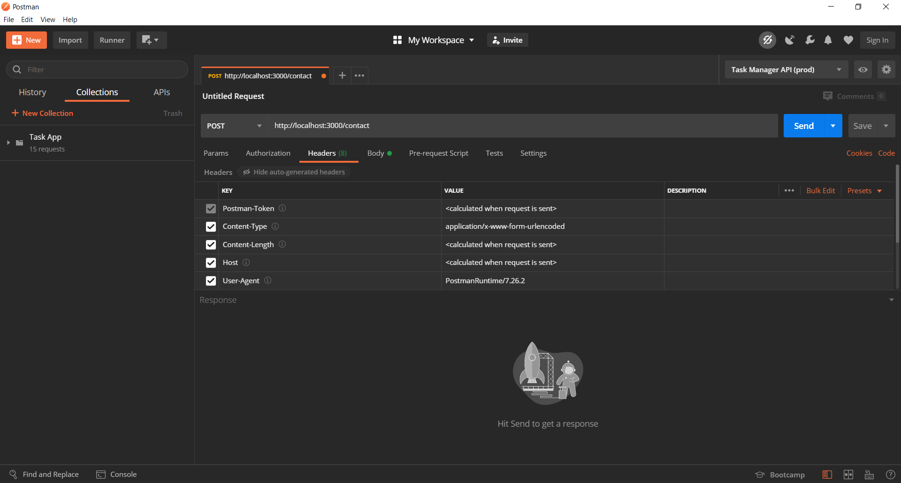

[HTTP](#HTTP)
1. [HTTP Crash Course & Exploration](https://youtu.be/iYM2zFP3Zn0)
---
# HTTP
- Reference 
    1. [HTTP Crash Course & Exploration](https://youtu.be/iYM2zFP3Zn0)
1. What is HTTP?
    1. HTTP stands for Hyper Text Transfer Protocol
    1. Communication between web servers and clients 
    1. HTTP Requests/Responses
    1. Loading pages, form submit, AJAX calls
1. HTTP is stateless 
    1. Every request is completely independant. It means that each request won't affect to each other.
    1. The concept is similar to transactions. 
    1. Programming, Local Storage, Cookies, Sessions are used to create enhanced user experience. 
1. What is HTTPS?
    1. Hyper Text Transfer Protocol Secure
    1. Data sent is encrypted 
    1. SSL (secure sockets layer) / TLS (transport layer security)
    1. HTTPS is enabled by installing certificate on web host
1. HTTP methods 
    1. GET - Retrieve data from the server 
    1. POST - Submit data to the server
    1. PUT - Update data already on the server 
    1. DELETE - Deletes data from the server 
    1. Though there are other methods, the 4 methods above are the most common ones.
1. HTTP header fields - 3 main general sections `General`, `Response` and `Request`
    1. General 
        1. Request URL
        1. Request Method
        1. Status Code 
        1. Remote Address
        1. Referrer Policy
    1. Response
        1. Server
        1. Set-Cookie
        1. Content-Type
        1. Content-Length
        1. Date
    1. Request 
        1. Cookies
        1. Accept-xxx
        1. Content-Type
        1. Content-Length
        1. Authorization
        1. User-Agent
        1. Referrer
    
1. HTTP status codes 
    1. 1xx: Informational - Request recieved / processing
    1. 2xx: Success - Successfully recieved, understood and accepted
    1. 3xx: Redirect - Further action must be taken / redirect    
    1. 4xx: Client Error - Request does not have waht it needs
    1. 5xx: Server Error - Server failed to fulfillan apparent valid request 
1. When visiting a website, we can check the connection between server and browser (client). We can open developer console (such as in Chrome browser) and check "**network**" tab for the different types of data and files that use browser to "**request**" to the server. Besides, we can check the header fields by clicking a document returned from the server. 
1. In addition, we can use POSTMAN to send different types of HTTP request. We can use the check the `body` content, `preview` as if the data is HTML or other types of media such as image. Besides, we can also configure and send other metadata such as `parameters`, `authorization`, `headers`, and `body`.

### Use Node.js express framework 
1. We can set up a local server with by using Node.js with `express` framework. In the argument of a route handler, we can check meta-data of the header in `req.header`, 
    ```js
    const express = require('express');
    const app = express();
    const port = process.env.PORT || 3000;

    app.use(express.json());
    app.use(express.urlencoded({ extended: false }));

    app.get('/', (req, res) => {
        // return header info in the requst send with HTTP GET method 
        res.send(req.header('user-agent'));
        // res.send(req.rawHeader);
    });

    app.listen(port, () => {
        console.log(`Server started on port: ${port}`);
    });
    ```
1. We can give different name of the property to check in the request header. For example, `user-agent` which is the browser or the program we use to send HTTP GET request to the endpoint. Besides, we can use `req.rawHeader` to send the whole header object, which is an `Array` of the field name in the header. 

### Check attached body data of the request 
1. In `express` server, we can set an endpoint and use `res.send()` to render the body of the request send from a client. For example, if a client sends data attched with the request, server can check the data from `req.body`. However, under `express` framework, we should use both `app.use(express.json())` and `app.use(express.urlencoded({ extended: false }))` middleware to read the data. 
1. In this example, we create an endpoint `/contact` to receive `POST` request from users as with the data sending from client to server. 
    ```js 
    app.post('/contact', (req, res) => {
        res.send(req.body);
    });
    ```
1. We can use POSTMAN to simulate the POST request. In the `body` tag, we can choose `x-www-form-urlencoded` to send key/value pairs, as to simulate sending the data from a `<form>` element from HTML. For example, we pass `name: Allen` and `email: apple@gmail.com`. 
    
1. Note that POSTMAN will add `content-type` automatically in the header info. 
    
1. Therefore, if we modify the property of `req.body` to `req.body.name`, we will get only `Allen` from the `name` key. Besides, we can also change the data to be sent on the page when the request is successful. 
    ```js 
    app.post('/contact', (req, res) => {
        res.send(req.header('Content-Type')); // application/x-www-form-urlencoded
    });
    ```
1. We can return status code accoding to the conditions. For example, if the body (data) sent from the client doesn't contain certain `key`, we can return a `400`, as it is a bad request. On the other hand, we can return status code `201`, as it means the data is sent to the server and create the data on the server successfully. 
    ```js 
    app.post('/contact', (req, res) => {
        // if name parameter is not sent from client to server
        if (req.body.name) {
            return res.status(400).send('Name is required');
        }
        
        res.status(201).send(`Thank you ${req.body.name}`);
    });
    ```

### Authentication
1. When we build a fullstack program, we can use JSON token for authentication. For example, we can send the token in `xAuth` token. 
    ```js 
    app.post('/login', (req, res) => {
        if(!req.header('x-auth-token')) {
            return res.status(400).send('No Token');
        }
        
        // '123456' is just a mock-up. This JSON token should be generated with other function or library
        if(req.header('x-auth-token') !== '123456') {
            return res.status(401).send('Not authorized');
        }

        res.send('Logged in');
    });
    ```
1. Therefore, we can use POSTMAN to test the endpoint. If we pass `x-auth-token` the same as it required at the end-opoint, we can get access to the service and get the last statement as `Logged in`.
    
1. Simulate a `PUT` request for editing a blog post. 
    ```js 
    app.put('/post/:id', (req, res) => {
        res.json({
            id: req.params.id,
            title: req.body.title
        });
    });
    ```
    
1. Simluate `DELETE` request for deleting a blog post. 
    ```js
    app.delete('/post/:id', (req, res) => {
        res.json({
            message: `Post ${req.params.id} is deleted`
        });
    });
    ```
    

### Use express to create a static HTML website
1. With `app.use(express.static('public'))`, we can create `public` folder in the root directory and creates a static HTML file `index.js`. Therefore, users use GET request to access the root directory will get teh HTML file returend. Besides, we can put other JavaScript script code and CSS file in the `public` folder and imported to use in the HTML file. 
    ```js 
    const express = require('express');
    const app = express();
    const port = process.env.PORT || 3000;

    app.use(express.json());
    app.use(express.urlencoded({ extended: false }));
    // render static HTML file
    app.use(express.static('public'));

    app.listen(port, function () {
        console.log(`Server started at port: ${port}`);
    });
    ```