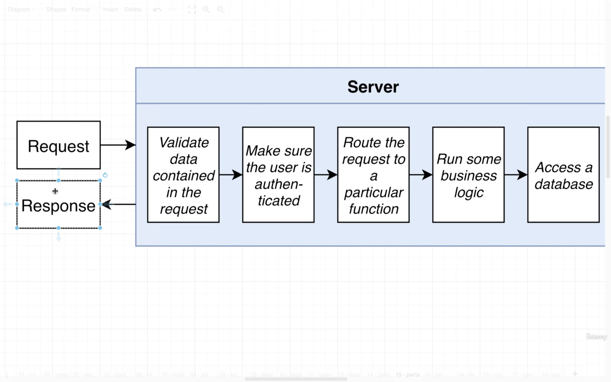
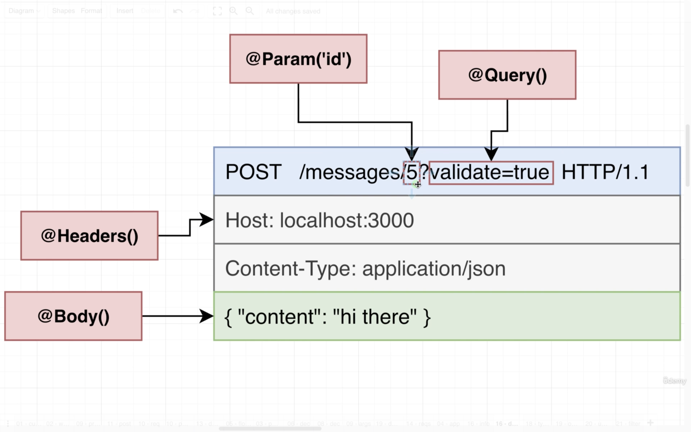

Start learning on 2021/08/28
Finished on

1. Course Link [https://www.udemy.com/course/nestjs-the-complete-developers-guide/](https://www.udemy.com/course/nestjs-the-complete-developers-guide/)

- [1. The Basics of Nest](#1-the-basics-of-nest)
  - [1.1. Project Setup](#11-project-setup)
  - [1.2. Typescript Configuration](#12-typescript-configuration)
  - [1.3. Creating a Controller](#13-creating-a-controller)
  - [1.4. Starting up a Nest App](#14-starting-up-a-nest-app)
  - [1.5. File Naming Convention](#15-file-naming-convention)
  - [1.6. Routing Decorators](#16-routing-decorators)
- [2. Generating Projects with the Nest CLI](#2-generating-projects-with-the-nest-cli)
  - [2.1. App Setup](#21-app-setup)
  - [2.2. Using the Nest CLI to Generate Files](#22-using-the-nest-cli-to-generate-files)
  - [2.3. More on Generating Files](#23-more-on-generating-files)
  - [2.4. Adding Routing Logic](#24-adding-routing-logic)
  - [2.5. Postman Setup](#25-postman-setup)
  - [2.6. VSCode REST Client Extension](#26-vscode-rest-client-extension)
- [3. Validating Request Data with Pipes](#3-validating-request-data-with-pipes)
  - [3.1. Accessing Request Data with Decorators](#31-accessing-request-data-with-decorators)
  - [3.2. Using Pipes for Validation](#32-using-pipes-for-validation)
  - [3.3. Adding Validation Rules](#33-adding-validation-rules)
  - [3.4. Behind the Scenes of Validation](#34-behind-the-scenes-of-validation)
  - [3.5. How Type Info is Preserved](#35-how-type-info-is-preserved)
- [4. Nest Architecture: Services and Repositories](#4-nest-architecture-services-and-repositories)
  - [4.1. Services and Repositories](#41-services-and-repositories)
  - [4.2. Implementing a Repository](#42-implementing-a-repository)
  - [4.3. Reading and Writing to a Storage File](#43-reading-and-writing-to-a-storage-file)
  - [4.4. Implementing a Service](#44-implementing-a-service)
  - [4.5. Manual Testing of the Controller](#45-manual-testing-of-the-controller)
  - [4.6. Reporting Errors with Exceptions](#46-reporting-errors-with-exceptions)
  - [4.7. Understanding Inversion of Control](#47-understanding-inversion-of-control)
  - [4.8. Introduction to Dependency Injection](#48-introduction-to-dependency-injection)
  - [4.9. Refactoring to Use Dependency Injection](#49-refactoring-to-use-dependency-injection)
  - [4.10. Few More Notes on DI](#410-few-more-notes-on-di)

# 1. The Basics of Nest
## 1.1. Project Setup
1. The first project will be a little bit hard.
2. We are going to focus on some behind-the-scene stuff
3. Understanding how Nest works will make all of Nest easy
4. We firstly create a new directory `scratch` and use `npm init -y` to start a NPM project.
5. In regular Nest projects, we may have many dependcies to work with, while we only use few as we will build it from scratch.
6. `npm install @nestjs/common@7.6.17 @nestjs/core@7.6.17 @nestjs/platform-express@7.6.17 reflect-metadata@0.1.13 typescript@4.3.2`

## 1.2. Typescript Configuration
1. We use the dependecies in the `scratch` project.
  
2. NestJS uses some 3rd party models to work with "HTTP Implementation", we can choose either `Express` or `Fastify`.
  
3. We configure tsconfig.json with the following setting.

  ```json
  // tsconfig.json
  {
    "compilerOptions": {
      "module": "commonjs",
      "target": "ES2017",
      "experimentalDecorators": true,
      "emitDecoratorMetadata": true
    }
  }
  ```

## 1.3. Creating a Controller
1. In convention the `request` and `response` cycle is very similar in mostly every programming language and framework.
    
2. In NestJS, there are several tools we can use in the request handling cycle, such as `Pipe`, `Guard`, `Controller`, `Service`, and `Repository`.
    
3. Each NestJS server must have "Controllers" and "Modules". Note that are other tools as well. 
4. NestJS uses much with Typescript decorators. In the following code, we try to make a class `AppController` and use `@Controller` to indicate that it's a "controller".
5. We then import and use another object from `common` library which is the `Get` object that works with HTTP GET request.
6. We then can use `Get` to decorate `getRootRoute` to indicate the value to return when the server receivers a GET request on root route.

  ```ts
  // src/main.ts
  import { Controller, Module, Get } from '@nestjs/common';

  @Controller()
  class AppController {
    @Get()
    getRootRoute() {
      return 'hi there!';
    }
  }
  ```

## 1.4. Starting up a Nest App
1. In most of the cases, we need to import objects and functions from `@nestjs/common`.
2. By convention, we can declare a function `bootstrap` to start up the server.
3. We need to use `NestFacotry` which is a very few case that we import a model from `@nestjs/core` library.
4. Then we use `create` method and pass in the Module to start the server.
  ```ts
  // src/main.ts
  import { Controller, Module, Get } from '@nestjs/common';
  import { NestFactory } from '@nestjs/core';

  @Controller()
  class AppController {
    @Get()
    getRootRoute() {
      return 'hi there!';
    }
  }

  @Module({
    controllers: [AppController],
  })
  class AppModule {}

  async function boostrap() {
    const app = await NestFactory.create(AppModule);

    await app.listen(3000);
  }

  boostrap();
  ```

## 1.5. File Naming Convention
1. NestJS have convention on naming its files. Besides, the controller and modules we just created can be separated into different files.
  
2. We separate the code into `app.controller.ts` and `app.module.ts`.

  ```ts
  // src/app.controller.ts
  import { Controller, Get } from '@nestjs/common';

  @Controller()
  export class AppController {
    @Get()
    getRootRoute() {
      return 'hi there!';
    }
  }
  ```
  ```ts
  // src/app.module.ts
  import { Module } from '@nestjs/common';
  import { AppController } from './app.controller';

  @Module({
    controllers: [AppController],
  })
  export class AppModule {}
  ```
  ```ts
  // main.ts
  import { NestFactory } from '@nestjs/core';
  import { AppModule } from './app.module';

  async function boostrap() {
    const app = await NestFactory.create(AppModule);

    await app.listen(3000);
  }

  boostrap();
  ```

## 1.6. Routing Decorators
1. We can use `Controller` decorator to have a high level route grouping. The routes in the class `AppController` will have a route prefix `/app`.
2. In the `Get` decorator, we can give the route to handle the logic below.
3. In the following case, we can access `/app/asdf` and `/app/bye` on this NestJS server.
  ```ts
  // app.controller.ts
  import { Controller, Get } from '@nestjs/common';

  @Controller('/app')
  export class AppController {
    @Get('/asdf')
    getRootRoute() {
      return 'hi there!';
    }

    @Get('/bye')
    getByeThere() {
      return 'bye there!';
    }
  }
  ```

# 2. Generating Projects with the Nest CLI
## 2.1. App Setup
1. We install `nest` globally with `npm install -g @nestjs/cli`.
2. Then create a project with `nest new [project]` and choose the preferred package manager such as `npm` or `yarn`.
3. The project we are going to build is to store and retrieve messages stored in a plain JSON file. This app will have 3 routes.
   1. List all the messages saved on the server
   2. Retrieve message by its ID
   3. Create a message
4. Each of the route will handle the request and give response with the following functions. 
   1. List all message - `Controller`, `Service`, `Repository`.
   2. Create a message - `Pipe`, `Controller`, `Service`, `Repository`.
5. Though we have different routes to handle different requests, we can share the same `Controller`, `Service`, and `Repository` rather than have 2 copies.
6. In this project, we don't have authentication feature, so we don't need a `Guard` in this case.

## 2.2. Using the Nest CLI to Generate Files
1. After initiating the project, we can check the `scripts` in `package.json`.
2. For example, we can start the development mode with `start:dev`.
3. NestJS uses `eslint` by default. However, since Typescript has been catching most of the possible errors in the code, we can turn this feature off to reduce the noise. We can simply comment out all the configuration in the object in `.eslintrc.js`.
4. We can remove all the other files in `src` besides `main.ts` to have a fresh start.
5. In this project, we have a `MessageModule` which includes `Pipe`, `MessagesController`, `Messages Service`, and `Messages Repository`.
6. We can create each file manually as we did in the last section, or we can use Nest CLI to generate the file with some pre-configured code. 
7. In the terminal, we can use `nest generate module [moduleName]`. Nest CLI will create a new directory and some code inside of it.
8. Note that Nest JS will have a suffix `.module` on the file name and `Module` right after the module name. 
9. For example, we create a `Message` module with Nest CLI by typing `nest generate module message` (message in lowercase). The module name created in `messages.module.ts` is `MessageModule`. Note that the file name is `messages.module.ts`.
  ```ts
  // src/message/messages.module.ts
  // this is nest cli generates for us
  import { Module } from '@nestjs/common';

  @Module({})
  export class MessagesModule {}
  ```
10. We upadte `main.ts` with the new created module.
  ```ts
  // main.ts
  import { NestFactory } from '@nestjs/core';
  import { MessagesModule } from './messages/messages.module';

  async function bootstrap() {
    const app = await NestFactory.create(MessagesModule);
    await app.listen(3000);
  }
  bootstrap();
  ```

## 2.3. More on Generating Files
1. The minimum requirement by NestJS is to have a "Controller" and a "Module" to provide services as a service.
2. We can use Nest CLI to create a controller which Nest will configure the code that can save us some time to wire the files up. From the last section, we have learnt that a controller should work with a module.
3. In this case, we can create the controller with `nest generate controller messages/messages --flat`.
4. By using Nest CLI, the controller has been imported to the module when it's created.
5. The command we give to Nest CLI has 4 parts after `nest generate`
   1. `controller` is the type of class to generate. We use `module` in the last case.
   2. For `messages/messages`, 
      1. The first `messages` is the directory which we want to place the file. In this case, we want the new files stay in `src/messages`. If we have other path, Nest CLI can create a new directory to save the generated files in the root directory.
      2. The second `messages` is the name of the controller class. In this case, we'd like to call the name as `MessagesController`. If we give this as `messages/controllers`, the controller file name will be funny as `controller.controller.ts`.
   3. `--flat` is to indicate to Nest to put controller in the same directory in `messages`. If this flag is not given, Nest CLI will create  a "controllers" directory in the target folder.
6. In this case, as we don't have many controllers and files, we can keep the generated controllers in the same folder with the module. 

## 2.4. Adding Routing Logic
1. To set up the controllers for routes, we have several options. 
   1. Use decorators such as `@Get('route')`, `@Post('route/:id')` on the HTTP method.
   2. Use decorators as the whole class on `@Controller('group')`. This will apply to all routes in the class as a group.
  ```ts
  // src/messages/messages.controller.ts
  import { Controller, Get, Post } from '@nestjs/common';

  @Controller('messages')
  export class MessagesController {
    @Get()
    listMessages() {}

    @Post()
    createMessage() {}

    @Get('/:id')
    getMessage() {}
  }
  ```

## 2.5. Postman Setup
1. We can use either "Postman" or "VSCode Rest Client Extension".
2. This part gives some basic functions, feature and how to use with Postman Desktop App.

## 2.6. VSCode REST Client Extension
1. In this case, we install an extension on VSCode [`REST Client`](https://marketplace.visualstudio.com/items?itemName=humao.rest-client).
2. We create a new file in the root folder to predefine HTTP requests with the extension.
  ```sh
  ### List all messages
  GET http://localhost:3000/messages

  ### Create a new message
  POST http://localhost:3000/messages
  content-type: application/json

  {
    "content": "hello world"
  }

  ### Get a particular message
  GET http://localhost:3000/messages/123
  ```

# 3. Validating Request Data with Pipes
## 3.1. Accessing Request Data with Decorators
1. In the controllers, we need to fetch some data from the requests such as the `body` for POST request and the `id` for a GET request to fetch specific data.
2. For example, we can use `@Param`, `@Query`, `@Headers`, and `@Body` for each part of a HTTP request. All these decorators can be imported from the common library of NestJS.
  
3. These HTTP decorators are used as arguments passing to the request handler. 
4. `Param` is the query string sending with the requested endpoint. In most of the cases, it can simply be a `string`.
5. For `Body`, it can be `any` type as it's very hard to expect that what kind of data will the request include.

  ```ts
  // src/messages/messagse.controller.ts
  import { Controller, Get, Post, Body, Param } from '@nestjs/common';

  @Controller('messages')
  export class MessagesController {
    @Get()
    listMessages() {}

    @Post()
    createMessage(@Body() body: any) { // pass @Body to be any
      console.log(body);
    }

    @Get('/:id')
    getMessage(@Param('id') id: string) { // pass @Param to be string
      console.log(id);
    }
  }
  ```

## 3.2. Using Pipes for Validation
1. We can use a `Pipe` to validate the incoming data before it's sending to the route handler.
2. Though we can create the `Pipe` manually, we can use the built-in one provided by Nest JS. We can import `ValidationPipe` from `@nestjs/common`.
3. After importing the object, we can use `app.useGlobalPipes` and pass an instance of `ValidationPipe`. This will validate all the incoming requests at the global scale.
4. However, the validation pipe won't work on the routes, if we don't provide pipe validation handler to them.

  ```ts
  // main.ts
  import { NestFactory } from '@nestjs/core';
  import { ValidationPipe } from '@nestjs/common';
  import { MessagesModule } from './messages/messages.module';

  async function bootstrap() {
    const app = await NestFactory.create(MessagesModule);
    // apply pipes globally
    app.useGlobalPipes(new ValidationPipe());
    await app.listen(3000);
  }
  bootstrap();
  ```

## 3.3. Adding Validation Rules
1. Steps to set up automatic validation
   1. Tell Nest to use global validation. We have done this in the previous lecture.
   2. Create a class that describe that different properties that the request body should have
   3. Add validation rules to the class
   4. Apply that class to the request handler
2. Most of the time, we can keep repeating steps from 2 to 4. 
3. The class we create in step 2 is called a "**Data Transfer Object**" a.k.a `DTO`.
4. For step 2, we create a new directory `dtos` under `messages` and name the file as `create-message.dto.ts`. In this file, we specify the type structure that we expect sending with the `body` in the request.

  ```ts
  // src/messages/dtos/create-message.dto.ts
  export class CreateMessageDto {
    content: string;
  }
  ```

5. For step 3, we add validation rules to the class. Note that we need to install another 2 libraries `class-validator` and `class-transformer` with `npm`. Besides, in the newer version, these 2 libraries are required when using `ValidationPipe` globally in `main.ts`.
6. We can use `IsString` from `class-validator` as the decorating and check if the content is string.
  ```ts
  // src/messages/dtos/create-message.dto.ts
  import { IsString } from 'class-validator';

  export class CreateMessageDto {
    @IsString()
    content: string;
  }
  ```
7. We then add the handler to the controller. In this case, we change the `body` argument for POST request from `any` to `CreateMessageDto`.
8. If the incoming request doesn't have `content` in body or doesn't contain string type value, it will get a `400` bad request error and the message saying that the "content must be a string".
  ```ts
  // src/messages/messages.controller.ts
  import { Controller, Get, Post, Body, Param } from '@nestjs/common';
  import { CreateMessageDto } from './dtos/create-message.dto';

  @Controller('messages')
  export class MessagesController {
    @Get()
    listMessages() {}

    @Post()
    createMessage(@Body() body: CreateMessageDto) {
      console.log(body);
    }

    @Get('/:id')
    getMessage(@Param('id') id: string) {
      console.log(id);
    }
  }
  ```

## 3.4. Behind the Scenes of Validation
1. A "Dto" carries data between 2 places. We use both `class-validator` and `class-transformer` in this case.
2. We can refer to the documentation of [`class-transformer`](https://github.com/typestack/class-transformer). This library helps to transform plain object into an instance of a class.
3. For example, we have an array of user objects and a `User` class which has useful methods on its instance.
4. [`class-validator`](https://github.com/typestack/class-validator), on the other hand, uses ["decorators"](https://github.com/typestack/class-validator#validation-decorators) to check properties on a class. There are various type decorators we can use to check the types, such as `@IsString` and `@IsBase64`.
5. When the server receives a request, it sends to a validation pipe and runs 3 steps.
   1. Use class-transformer to turn the body into an instance of the DTO class. This turn the `body` as an instance of `CreateMessageDto`.
   2. Use class-validator to validate the instance. This part uses the decorator `@IsString` to check if the content is a `string`.
    ```ts
    // src/messages/dtos/create-message.dto.ts
    import { IsString } from 'class-validator';
    export class CreateMessageDto {
      @IsString() // check as the class validator if the content is a string
      content: string;
    }
    ```
   3. If there are validation errors, respond immediately, otherwise provide body to request handler.

## 3.5. How Type Info is Preserved
1. In regular cases, Typescript files will be compiled and executed as regular Javascript, Note that the type and decorator will eventually vanish as Javascript doesn't support such feature. However, the set up in the previous lectures are still valid when we run the server. 
  ```ts
  // Typescript
  addMessage(@Body() body: AddMessageDto) {}
  ```
  ```js
  // Javascript
  addMessage(body) {}
  ```
2. The main reason is from the configuration in `tsconfig.json`, `experimentalDecorators` and `emitDecoratorMetadata`.
  ```json
  {
    "compilerOptions": {
      "experimentalDecorators": true,
      "emitDecoratorMetadata": true
    }
  }
  ```
3. If we use these feature in Typescript compiler, the decorators will be remain and work in the compiled Javascript file.
  ```js
  // dist/src/messages/messages.controller.js
  // decorators for each route 
  __decorate([
    (0, common_1.Get)(), // get all messages
    __metadata("design:type", Function),
    __metadata("design:paramtypes", []),
    __metadata("design:returntype", void 0)
  ], MessagesController.prototype, "listMessages", null);
  __decorate([
      (0, common_1.Post)(), // create message
      __param(0, (0, common_1.Body)()),
      __metadata("design:type", Function),
      __metadata("design:paramtypes", [create_message_dto_1.CreateMessageDto]),
      __metadata("design:returntype", void 0)
  ], MessagesController.prototype, "createMessage", null);
  __decorate([
      (0, common_1.Get)('/:id'), // get a message by id
      __param(0, (0, common_1.Param)('id')),
      __metadata("design:type", Function),
      __metadata("design:paramtypes", [String]),
      __metadata("design:returntype", void 0)
  ], MessagesController.prototype, "getMessage", null);
  ```

# 4. Nest Architecture: Services and Repositories
## 4.1. Services and Repositories
1. It can be very challenging to understand the difference between `Services` and `Repositories` in NestJS.
  
2. In the current case, we have only 1 service and 1 repository.
3. In this case, we will create a repository from strach. However, in regular cases, we can use libraries to create it. 
  
4. Though `Services` can seem redundant in some cases as its function is not different from calling and sending data from repository directly, we still need `Services` as proxies to interact with `Repositories`.

## 4.2. Implementing a Repository
1. There are commands in Nest that we can easily create the components as `module` and `controller`. However, we create the files manually in this case.
2. We create `messages.repository.ts` and `messages.service.ts`.
3. We then create a file `message.json` to store the data as a local database on the hardrive.
  ```json
  // messages.json
  {
    "12": {
      "content": "hi there",
      "id": 12
    },
    "13": {
      "content": "hi there",
      "id": 13
    },
    "14": {
      "content": "hi there",
      "id": 14
    },
  }
  ```
3. We use `readFile` and `writeFile` from `fs/promise` which is a standard library from NodeJS.
4. Besides, both reading and writing file can be asynchronous function. It's similar when calling to remote API through HTTP.
5. In this case, we assume the `messages.json` is always in the root directory in the project, so the app won't automatically creat a new file if it doesn't exist.
6. We can refer to [`fsPromise.readFile`](https://nodejs.org/api/fs.html#fs_fspromises_readfile_path_options) from NodeJS. We firstly give the filename and the option as how we encode the file.
7. Note that if we don't provide the encoding method, it will returns a `Buffer` object.
  ```ts
  // src/messages/messages.repository.ts
  import { readFile, writeFile } from 'fs/promises';

  export class MessagesRepository {
    async fineOne(id: string) {
      const contents = await readFile('messages.json', 'utf8');
      const messages = JSON.parse(contents);
      /* messages data structure
        {
          [_id]: {
            id: [_id],
            content: [some text and information]
          }
        }
      */

      return messages[id];
    }

    async findAll() {}

    async create(message: string) {}
  }
  ```

## 4.3. Reading and Writing to a Storage File
1. We set up `findAll` and `create` function.
  ```ts
  // src/messages/messages.repository.ts
  import { readFile, writeFile } from 'fs/promises';

  export class MessagesRepository {
    async fineOne(id: string) {
      const contents = await readFile('messages.json', 'utf8');
      const messages = JSON.parse(contents);

      return messages[id];
    }

    async findAll() {
      const contents = await readFile('messages.json', 'utf8');
      const messages = JSON.parse(contents);

      return messages;
    }

    async create(content: string) {
      const contents = await readFile('messages.json', 'utf8');
      const messages = JSON.parse(contents);

      // randomly generate a number from 0 to 999
      const id = Math.floor(Math.random() * 999);

      messages[id] = { id, content };

      await writeFile('messages.json', JSON.stringify(messages));
    }
  }
  ```

## 4.4. Implementing a Service
1. After configuring the `Repository`, we can set up the `Service` for the controller to access data from the data storage.
2. In this case, we import `MessagesRepository` and ensure the `MessagesService` instance can access the repository.
3. Note that we can just call the methods from `MessagesRepository` directly without calling it asynchronously.
4. In regular NestJS, we will use dependency injection rather than linking the classes in the following way. We will use "Dependency Injection" to set up relationship between classes in NestJS.
  ```ts
  // src/messages/messages.service.ts
  import { MessagesRepository } from './messages.repository';

  export class MessagesService {
    messagesRepo: MessagesRepository;

    constructor() {
      // Service is creating its own dependencies
      // DONT DO THIS ON REAL APPS
      // Use dependency injection instead
      this.messagesRepo = new MessagesRepository();
    }

    findOne(id: string) {
      return this.messagesRepo.findOne(id);
    }

    findAll() {
      return this.messagesRepo.findAll();
    }

    create(content: string) {
      return this.messagesRepo.create(content);
    }
  }
  ```

## 4.5. Manual Testing of the Controller

## 4.6. Reporting Errors with Exceptions

## 4.7. Understanding Inversion of Control

## 4.8. Introduction to Dependency Injection

## 4.9. Refactoring to Use Dependency Injection

## 4.10. Few More Notes on DI
