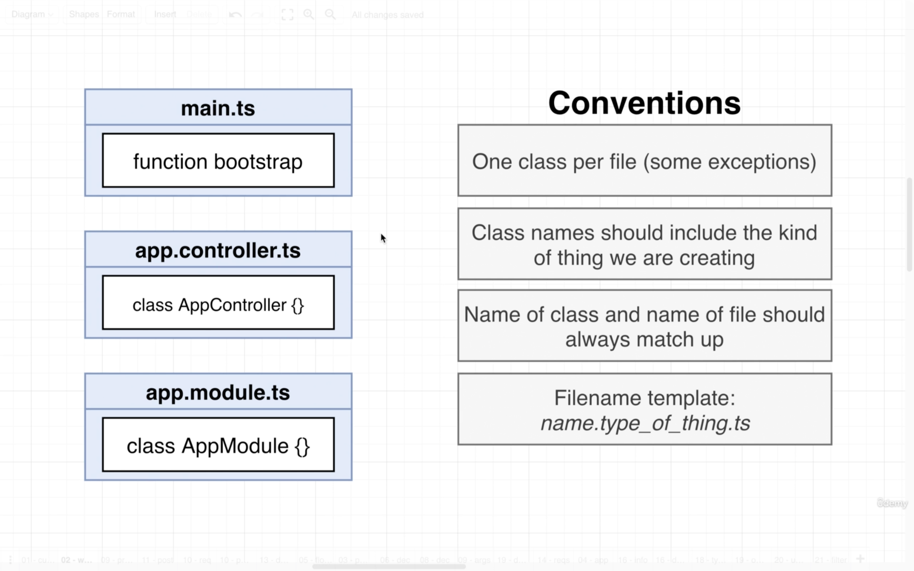

Start learning on 2021/08/28
Finished on

1. Course Link [https://www.udemy.com/course/nestjs-the-complete-developers-guide/](https://www.udemy.com/course/nestjs-the-complete-developers-guide/)
- [1. The Basics of Nest](#1-the-basics-of-nest)
  - [1.1. Project Setup](#11-project-setup)
  - [1.2. Typescript Configuration](#12-typescript-configuration)
  - [1.3. Creating a Controller](#13-creating-a-controller)
  - [1.4. Starting up a Nest App](#14-starting-up-a-nest-app)
  - [1.5. File Naming Convention](#15-file-naming-convention)
  - [1.6. Routing Decorators](#16-routing-decorators)
- [2. Generating Projects with the Nest CLI](#2-generating-projects-with-the-nest-cli)
  - [2.1. App Setup](#21-app-setup)
  - [2.2. Using the Nest CLI to Generate Files](#22-using-the-nest-cli-to-generate-files)
  - [2.3. More on Generating Files](#23-more-on-generating-files)
  - [2.4. Adding Routing Logic](#24-adding-routing-logic)
  - [2.5. Postman Setup](#25-postman-setup)
  - [2.6. VSCode REST Client Extension](#26-vscode-rest-client-extension)
- [3. Validating Request Data with Pipes](#3-validating-request-data-with-pipes)
  - [3.1. Accessing Request Data with Decorators](#31-accessing-request-data-with-decorators)
  - [3.2. Using Pipes for Validation](#32-using-pipes-for-validation)
  - [3.3. Adding Validation Rules](#33-adding-validation-rules)
  - [3.4. Behind the Scenes of Validation](#34-behind-the-scenes-of-validation)
  - [3.5. How Type Info is Preserved](#35-how-type-info-is-preserved)
- [4. Nest Architecture: Services and Repositories](#4-nest-architecture-services-and-repositories)
  - [4.1. Services and Repositories](#41-services-and-repositories)
  - [4.2. Implementing a Repository](#42-implementing-a-repository)
  - [4.3. Reading and Writing to a Storage File](#43-reading-and-writing-to-a-storage-file)
  - [4.4. Implementing a Service](#44-implementing-a-service)
  - [4.5. Manual Testing of the Controller](#45-manual-testing-of-the-controller)
  - [4.6. Reporting Errors with Exceptions](#46-reporting-errors-with-exceptions)
  - [4.7. Understanding Inversion of Control](#47-understanding-inversion-of-control)
  - [4.8. Introduction to Dependency Injection](#48-introduction-to-dependency-injection)
  - [4.9. Refactoring to Use Dependency Injection](#49-refactoring-to-use-dependency-injection)
  - [4.10. Few More Notes on DI](#410-few-more-notes-on-di)
- [5. Nest Architecture: Organizing Code with Modules](#5-nest-architecture-organizing-code-with-modules)
  - [5.1. Project Overview and Generating a Few Files](#51-project-overview-and-generating-a-few-files)
  - [5.2. Setting up DI between modules](#52-setting-up-di-between-modules)
  - [5.3. Consuming multiple modules](#53-consuming-multiple-modules)
- [6. Big Project Time](#6-big-project-time)
  - [6.1. App Overview](#61-app-overview)
  - [6.2. API Design](#62-api-design)
  - [6.3. Module Design](#63-module-design)
  - [6.4. Generating Modules, Controllers, and Services](#64-generating-modules-controllers-and-services)
- [7. Persisting Data with TypeORM](#7-persisting-data-with-typeorm)
  - [7.1. Persisting Data with Nest](#71-persisting-data-with-nest)
  - [7.2. Setting up a database connection](#72-setting-up-a-database-connection)
  - [7.3. Creating an entity and repository](#73-creating-an-entity-and-repository)
  - [7.4. Viewing a DB's content](#74-viewing-a-dbs-content)
  - [7.5. Understanding TypeORM Decorators](#75-understanding-typeorm-decorators)
  - [7.6. One quick note on repositories](#76-one-quick-note-on-repositories)
  - [7.7. A few extra routes](#77-a-few-extra-routes)
  - [7.8. Setting up body validation](#78-setting-up-body-validation)
- [8. Creating and saving User data](#8-creating-and-saving-user-data)
  - [8.1. Creating and saving a user](#81-creating-and-saving-a-user)
  - [8.2. Quick breather and review](#82-quick-breather-and-review)
  - [8.3. More on Create vs Save](#83-more-on-create-vs-save)
  - [8.4. Querying for data](#84-querying-for-data)
  - [8.5. Updating data](#85-updating-data)
  - [8.6. Removing users](#86-removing-users)
  - [8.7. Finding and filtering records](#87-finding-and-filtering-records)
  - [8.8. Removing records](#88-removing-records)
  - [8.9. Updating records](#89-updating-records)
  - [8.10. A few notes on exceptions](#810-a-few-notes-on-exceptions)
- [9. Custom data serialization](#9-custom-data-serialization)
  - [9.1. Excluding response properties](#91-excluding-response-properties)
  - [9.2. Solution to Serialization](#92-solution-to-serialization)
  - [9.3. How to build interceptors](#93-how-to-build-interceptors)
  - [9.4. Serialization in interceptor](#94-serialization-in-interceptor)
  - [9.5. Customizing the interceptor's DTO](#95-customizing-the-interceptors-dto)
  - [9.6. Wrapping the interceptor in a decorator](#96-wrapping-the-interceptor-in-a-decorator)
  - [9.7. Controller-wide serialization](#97-controller-wide-serialization)
  - [9.8. A bit of type safety around serialize](#98-a-bit-of-type-safety-around-serialize)

# 1. The Basics of Nest
## 1.1. Project Setup
1. The first project will be a little bit hard.
2. We are going to focus on some behind-the-scene stuff
3. Understanding how Nest works will make all of Nest easy
4. We firstly create a new directory `scratch` and use `npm init -y` to start a NPM project.
5. In regular Nest projects, we may have many dependcies to work with, while we only use few as we will build it from scratch.
6. `npm install @nestjs/common@7.6.17 @nestjs/core@7.6.17 @nestjs/platform-express@7.6.17 reflect-metadata@0.1.13 typescript@4.3.2`

## 1.2. Typescript Configuration
1. We use the dependecies in the `scratch` project.
  
1. NestJS uses some 3rd party models to work with "HTTP Implementation", we can choose either `Express` or `Fastify`.
  
1. We configure tsconfig.json with the following setting.

  ```json
  // tsconfig.json
  {
    "compilerOptions": {
      "module": "commonjs",
      "target": "ES2017",
      "experimentalDecorators": true,
      "emitDecoratorMetadata": true
    }
  }
  ```

## 1.3. Creating a Controller
1. In convention the `request` and `response` cycle is very similar in mostly every programming language and framework.
    
2. In NestJS, there are several tools we can use in the request handling cycle, such as `Pipe`, `Guard`, `Controller`, `Service`, and `Repository`.
    
3. Each NestJS server must have "Controllers" and "Modules". Note that are other tools as well. 
4. NestJS uses much with Typescript decorators. In the following code, we try to make a class `AppController` and use `@Controller` to indicate that it's a "controller".
5. We then import and use another object from `common` library which is the `Get` object that works with HTTP GET request.
6. We then can use `Get` to decorate `getRootRoute` to indicate the value to return when the server receivers a GET request on root route.

  ```ts
  // src/main.ts
  import { Controller, Module, Get } from '@nestjs/common';

  @Controller()
  class AppController {
    @Get()
    getRootRoute() {
      return 'hi there!';
    }
  }
  ```

## 1.4. Starting up a Nest App
1. In most of the cases, we need to import objects and functions from `@nestjs/common`.
2. By convention, we can declare a function `bootstrap` to start up the server.
3. We need to use `NestFacotry` which is a very few case that we import a model from `@nestjs/core` library.
4. Then we use `create` method and pass in the Module to start the server.
  ```ts
  // src/main.ts
  import { Controller, Module, Get } from '@nestjs/common';
  import { NestFactory } from '@nestjs/core';

  @Controller()
  class AppController {
    @Get()
    getRootRoute() {
      return 'hi there!';
    }
  }

  @Module({
    controllers: [AppController],
  })
  class AppModule {}

  async function boostrap() {
    const app = await NestFactory.create(AppModule);

    await app.listen(3000);
  }

  boostrap();
  ```

## 1.5. File Naming Convention
1. NestJS have convention on naming its files. Besides, the controller and modules we just created can be separated into different files.
  
2. We separate the code into `app.controller.ts` and `app.module.ts`.

  ```ts
  // src/app.controller.ts
  import { Controller, Get } from '@nestjs/common';

  @Controller()
  export class AppController {
    @Get()
    getRootRoute() {
      return 'hi there!';
    }
  }
  ```
  ```ts
  // src/app.module.ts
  import { Module } from '@nestjs/common';
  import { AppController } from './app.controller';

  @Module({
    controllers: [AppController],
  })
  export class AppModule {}
  ```
  ```ts
  // main.ts
  import { NestFactory } from '@nestjs/core';
  import { AppModule } from './app.module';

  async function boostrap() {
    const app = await NestFactory.create(AppModule);

    await app.listen(3000);
  }

  boostrap();
  ```

## 1.6. Routing Decorators
1. We can use `Controller` decorator to have a high level route grouping. The routes in the class `AppController` will have a route prefix `/app`.
2. In the `Get` decorator, we can give the route to handle the logic below.
3. In the following case, we can access `/app/asdf` and `/app/bye` on this NestJS server.
  ```ts
  // app.controller.ts
  import { Controller, Get } from '@nestjs/common';

  @Controller('/app')
  export class AppController {
    @Get('/asdf')
    getRootRoute() {
      return 'hi there!';
    }

    @Get('/bye')
    getByeThere() {
      return 'bye there!';
    }
  }
  ```

# 2. Generating Projects with the Nest CLI
## 2.1. App Setup
1. We install `nest` globally with `npm install -g @nestjs/cli`.
2. Then create a project with `nest new [project]` and choose the preferred package manager such as `npm` or `yarn`.
3. The project we are going to build is to store and retrieve messages stored in a plain JSON file. This app will have 3 routes.
   1. List all the messages saved on the server
   2. Retrieve message by its ID
   3. Create a message
4. Each of the route will handle the request and give response with the following functions. 
   1. List all message - `Controller`, `Service`, `Repository`.
   2. Create a message - `Pipe`, `Controller`, `Service`, `Repository`.
5. Though we have different routes to handle different requests, we can share the same `Controller`, `Service`, and `Repository` rather than have 2 copies.
6. In this project, we don't have authentication feature, so we don't need a `Guard` in this case.

## 2.2. Using the Nest CLI to Generate Files
1. After initiating the project, we can check the `scripts` in `package.json`.
2. For example, we can start the development mode with `start:dev`.
3. NestJS uses `eslint` by default. However, since Typescript has been catching most of the possible errors in the code, we can turn this feature off to reduce the noise. We can simply comment out all the configuration in the object in `.eslintrc.js`.
4. We can remove all the other files in `src` besides `main.ts` to have a fresh start.
5. In this project, we have a `MessageModule` which includes `Pipe`, `MessagesController`, `Messages Service`, and `Messages Repository`.
6. We can create each file manually as we did in the last section, or we can use Nest CLI to generate the file with some pre-configured code. 
7. In the terminal, we can use `nest generate module [moduleName]`. Nest CLI will create a new directory and some code inside of it.
8. Note that Nest JS will have a suffix `.module` on the file name and `Module` right after the module name. 
9. For example, we create a `Message` module with Nest CLI by typing `nest generate module message` (message in lowercase). The module name created in `messages.module.ts` is `MessageModule`. Note that the file name is `messages.module.ts`.
  ```ts
  // src/message/messages.module.ts
  // this is nest cli generates for us
  import { Module } from '@nestjs/common';

  @Module({})
  export class MessagesModule {}
  ```
10. We upadte `main.ts` with the new created module.
  ```ts
  // main.ts
  import { NestFactory } from '@nestjs/core';
  import { MessagesModule } from './messages/messages.module';

  async function bootstrap() {
    const app = await NestFactory.create(MessagesModule);
    await app.listen(3000);
  }
  bootstrap();
  ```

## 2.3. More on Generating Files
1. The minimum requirement by NestJS is to have a "Controller" and a "Module" to provide services as a service.
2. We can use Nest CLI to create a controller which Nest will configure the code that can save us some time to wire the files up. From the last section, we have learnt that a controller should work with a module.
3. In this case, we can create the controller with `nest generate controller messages/messages --flat`.
4. By using Nest CLI, the controller has been imported to the module when it's created.
5. The command we give to Nest CLI has 4 parts after `nest generate`
   1. `controller` is the type of class to generate. We use `module` in the last case.
   2. For `messages/messages`, 
      1. The first `messages` is the directory which we want to place the file. In this case, we want the new files stay in `src/messages`. If we have other path, Nest CLI can create a new directory to save the generated files in the root directory.
      2. The second `messages` is the name of the controller class. In this case, we'd like to call the name as `MessagesController`. If we give this as `messages/controllers`, the controller file name will be funny as `controller.controller.ts`.
   3. `--flat` is to indicate to Nest to put controller in the same directory in `messages`. If this flag is not given, Nest CLI will create  a "controllers" directory in the target folder.
6. In this case, as we don't have many controllers and files, we can keep the generated controllers in the same folder with the module. 

## 2.4. Adding Routing Logic
1. To set up the controllers for routes, we have several options. 
   1. Use decorators such as `@Get('route')`, `@Post('route/:id')` on the HTTP method.
   2. Use decorators as the whole class on `@Controller('group')`. This will apply to all routes in the class as a group.
  ```ts
  // src/messages/messages.controller.ts
  import { Controller, Get, Post } from '@nestjs/common';

  @Controller('messages')
  export class MessagesController {
    @Get()
    listMessages() {}

    @Post()
    createMessage() {}

    @Get('/:id')
    getMessage() {}
  }
  ```

## 2.5. Postman Setup
1. We can use either "Postman" or "VSCode Rest Client Extension".
2. This part gives some basic functions, feature and how to use with Postman Desktop App.

## 2.6. VSCode REST Client Extension
1. In this case, we install an extension on VSCode [`REST Client`](https://marketplace.visualstudio.com/items?itemName=humao.rest-client).
2. We create a new file in the root folder to predefine HTTP requests with the extension.
  ```sh
  ### List all messages
  GET http://localhost:3000/messages

  ### Create a new message
  POST http://localhost:3000/messages
  content-type: application/json

  {
    "content": "hello world"
  }

  ### Get a particular message
  GET http://localhost:3000/messages/123
  ```

# 3. Validating Request Data with Pipes
## 3.1. Accessing Request Data with Decorators
1. In the controllers, we need to fetch some data from the requests such as the `body` for POST request and the `id` for a GET request to fetch specific data.
2. For example, we can use `@Param`, `@Query`, `@Headers`, and `@Body` for each part of a HTTP request. All these decorators can be imported from the common library of NestJS.
    
3. These HTTP decorators are used as arguments passing to the request handler. 
4. `Param` is the query string sending with the requested endpoint. In most of the cases, it can simply be a `string`.
5. For `Body`, it can be `any` type as it's very hard to expect that what kind of data will the request include.

    ```ts
    // src/messages/messagse.controller.ts
    import { Controller, Get, Post, Body, Param } from '@nestjs/common';

    @Controller('messages')
    export class MessagesController {
      @Get()
      listMessages() {}

      @Post()
      createMessage(@Body() body: any) { // pass @Body to be any
        console.log(body);
      }

      @Get('/:id')
      getMessage(@Param('id') id: string) { // pass @Param to be string
        console.log(id);
      }
    }
    ```

## 3.2. Using Pipes for Validation
1. We can use a `Pipe` to validate the incoming data before it's sending to the route handler.
2. Though we can create the `Pipe` manually, we can use the built-in one provided by Nest JS. We can import `ValidationPipe` from `@nestjs/common`.
3. After importing the object, we can use `app.useGlobalPipes` and pass an instance of `ValidationPipe`. This will validate all the incoming requests at the global scale.
4. However, the validation pipe won't work on the routes, if we don't provide pipe validation handler to them.

  ```ts
  // main.ts
  import { NestFactory } from '@nestjs/core';
  import { ValidationPipe } from '@nestjs/common';
  import { MessagesModule } from './messages/messages.module';

  async function bootstrap() {
    const app = await NestFactory.create(MessagesModule);
    // apply pipes globally
    app.useGlobalPipes(new ValidationPipe());
    await app.listen(3000);
  }
  bootstrap();
  ```

## 3.3. Adding Validation Rules
1. Steps to set up automatic validation
   1. Tell Nest to use global validation. We have done this in the previous lecture.
   2. Create a class that describe that different properties that the request body should have
   3. Add validation rules to the class
   4. Apply that class to the request handler
2. Most of the time, we can keep repeating steps from 2 to 4. 
3. The class we create in step 2 is called a "**Data Transfer Object**" a.k.a `DTO`.
4. For step 2, we create a new directory `dtos` under `messages` and name the file as `create-message.dto.ts`. In this file, we specify the type structure that we expect sending with the `body` in the request.

  ```ts
  // src/messages/dtos/create-message.dto.ts
  export class CreateMessageDto {
    content: string;
  }
  ```

5. For step 3, we add validation rules to the class. Note that we need to install another 2 libraries `class-validator` and `class-transformer` with `npm`. Besides, in the newer version, these 2 libraries are required when using `ValidationPipe` globally in `main.ts`.
6. We can use `IsString` from `class-validator` as the decorating and check if the content is string.
  ```ts
  // src/messages/dtos/create-message.dto.ts
  import { IsString } from 'class-validator';

  export class CreateMessageDto {
    @IsString()
    content: string;
  }
  ```
7. We then add the handler to the controller. In this case, we change the `body` argument for POST request from `any` to `CreateMessageDto`.
8. If the incoming request doesn't have `content` in body or doesn't contain string type value, it will get a `400` bad request error and the message saying that the "content must be a string".
  ```ts
  // src/messages/messages.controller.ts
  import { Controller, Get, Post, Body, Param } from '@nestjs/common';
  import { CreateMessageDto } from './dtos/create-message.dto';

  @Controller('messages')
  export class MessagesController {
    @Get()
    listMessages() {}

    @Post()
    createMessage(@Body() body: CreateMessageDto) {
      console.log(body);
    }

    @Get('/:id')
    getMessage(@Param('id') id: string) {
      console.log(id);
    }
  }
  ```

## 3.4. Behind the Scenes of Validation
1. A "Dto" carries data between 2 places. We use both `class-validator` and `class-transformer` in this case.
2. We can refer to the documentation of [`class-transformer`](https://github.com/typestack/class-transformer). This library helps to transform plain object into an instance of a class.
3. For example, we have an array of user objects and a `User` class which has useful methods on its instance.
4. [`class-validator`](https://github.com/typestack/class-validator), on the other hand, uses ["decorators"](https://github.com/typestack/class-validator#validation-decorators) to check properties on a class. There are various type decorators we can use to check the types, such as `@IsString` and `@IsBase64`.
5. When the server receives a request, it sends to a validation pipe and runs 3 steps.
   1. Use class-transformer to turn the body into an instance of the DTO class. This turn the `body` as an instance of `CreateMessageDto`.
   2. Use class-validator to validate the instance. This part uses the decorator `@IsString` to check if the content is a `string`.
    ```ts
    // src/messages/dtos/create-message.dto.ts
    import { IsString } from 'class-validator';
    export class CreateMessageDto {
      @IsString() // check as the class validator if the content is a string
      content: string;
    }
    ```
   3. If there are validation errors, respond immediately, otherwise provide body to request handler.

## 3.5. How Type Info is Preserved
1. In regular cases, Typescript files will be compiled and executed as regular Javascript, Note that the type and decorator will eventually vanish as Javascript doesn't support such feature. However, the set up in the previous lectures are still valid when we run the server. 
  ```ts
  // Typescript
  addMessage(@Body() body: AddMessageDto) {}
  ```
  ```js
  // Javascript
  addMessage(body) {}
  ```
2. The main reason is from the configuration in `tsconfig.json`, `experimentalDecorators` and `emitDecoratorMetadata`.
  ```json
  {
    "compilerOptions": {
      "experimentalDecorators": true,
      "emitDecoratorMetadata": true
    }
  }
  ```
3. If we use these feature in Typescript compiler, the decorators will be remain and work in the compiled Javascript file.
  ```js
  // dist/src/messages/messages.controller.js
  // decorators for each route 
  __decorate([
    (0, common_1.Get)(), // get all messages
    __metadata("design:type", Function),
    __metadata("design:paramtypes", []),
    __metadata("design:returntype", void 0)
  ], MessagesController.prototype, "listMessages", null);
  __decorate([
      (0, common_1.Post)(), // create message
      __param(0, (0, common_1.Body)()),
      __metadata("design:type", Function),
      __metadata("design:paramtypes", [create_message_dto_1.CreateMessageDto]),
      __metadata("design:returntype", void 0)
  ], MessagesController.prototype, "createMessage", null);
  __decorate([
      (0, common_1.Get)('/:id'), // get a message by id
      __param(0, (0, common_1.Param)('id')),
      __metadata("design:type", Function),
      __metadata("design:paramtypes", [String]),
      __metadata("design:returntype", void 0)
  ], MessagesController.prototype, "getMessage", null);
  ```

# 4. Nest Architecture: Services and Repositories
## 4.1. Services and Repositories
1. It can be very challenging to understand the difference between `Services` and `Repositories` in NestJS.
    
2. In the current case, we have only 1 service and 1 repository.
3. In this case, we will create a repository from scratch. However, in regular cases, we can use libraries to create it. 
    
4. Though `Services` can seem redundant in some cases as its function is not different from calling and sending data from repository directly, we still need `Services` as proxies to interact with `Repositories`.

## 4.2. Implementing a Repository
1. There are commands in Nest that we can easily create the components as `module` and `controller`. However, we create the files manually in this case.
2. We create `messages.repository.ts` and `messages.service.ts`.
3. We then create a file `message.json` to store the data as a local database on the hard-drive.
  ```json
  // messages.json
  {
    "12": {
      "content": "hi there",
      "id": 12
    },
    "13": {
      "content": "hi there",
      "id": 13
    },
    "14": {
      "content": "hi there",
      "id": 14
    },
  }
  ```
3. We use `readFile` and `writeFile` from `fs/promise` which is a standard library from NodeJS.
4. Besides, both reading and writing file can be asynchronous function. It's similar when calling to remote API through HTTP.
5. In this case, we assume the `messages.json` is always in the root directory in the project, so the app won't automatically creat a new file if it doesn't exist.
6. We can refer to [`fsPromise.readFile`](https://nodejs.org/api/fs.html#fs_fspromises_readfile_path_options) from NodeJS. We firstly give the filename and the option as how we encode the file.
7. Note that if we don't provide the encoding method, it will returns a `Buffer` object.
  ```ts
  // src/messages/messages.repository.ts
  import { readFile, writeFile } from 'fs/promises';

  export class MessagesRepository {
    async fineOne(id: string) {
      const contents = await readFile('messages.json', 'utf8');
      const messages = JSON.parse(contents);
      /* messages data structure
        {
          [_id]: {
            id: [_id],
            content: [some text and information]
          }
        }
      */

      return messages[id];
    }

    async findAll() {}

    async create(message: string) {}
  }
  ```

## 4.3. Reading and Writing to a Storage File
1. We set up `findAll` and `create` function.
  ```ts
  // src/messages/messages.repository.ts
  import { readFile, writeFile } from 'fs/promises';

  export class MessagesRepository {
    async fineOne(id: string) {
      const contents = await readFile('messages.json', 'utf8');
      const messages = JSON.parse(contents);

      return messages[id];
    }

    async findAll() {
      const contents = await readFile('messages.json', 'utf8');
      const messages = JSON.parse(contents);

      return messages;
    }

    async create(content: string) {
      const contents = await readFile('messages.json', 'utf8');
      const messages = JSON.parse(contents);

      // randomly generate a number from 0 to 999
      const id = Math.floor(Math.random() * 999);

      messages[id] = { id, content };

      await writeFile('messages.json', JSON.stringify(messages));
    }
  }
  ```

## 4.4. Implementing a Service
1. After configuring the `Repository`, we can set up the `Service` for the controller to access data from the data storage.
2. In this case, we import `MessagesRepository` and ensure the `MessagesService` instance can access the repository.
3. Note that we can just call the methods from `MessagesRepository` directly without calling it asynchronously.
4. In regular NestJS, we will use dependency injection rather than linking the classes in the following way. We will use "Dependency Injection" to set up relationship between classes in NestJS.
  ```ts
  // src/messages/messages.service.ts
  import { MessagesRepository } from './messages.repository';

  export class MessagesService {
    messagesRepo: MessagesRepository;

    constructor() {
      // Service is creating its own dependencies
      // DONT DO THIS ON REAL APPS
      // Use dependency injection instead
      this.messagesRepo = new MessagesRepository();
    }

    findOne(id: string) {
      return this.messagesRepo.findOne(id);
    }

    findAll() {
      return this.messagesRepo.findAll();
    }

    create(content: string) {
      return this.messagesRepo.create(content);
    }
  }
  ```

## 4.5. Manual Testing of the Controller
1. We then import `MessagesService` to use in the controller. 
    ```ts
    import { Body, Controller, Get, Param, Post } from '@nestjs/common';
    import { CreateMessageDto } from './dtos/create-message.dto';
    import { MessagesService } from './messages.service';

    @Controller('messages')
    export class MessagesController {
      messagesService: MessagesService;

      constructor() {
        this.messagesService = new MessagesService();
      }

      @Get()
      listMessages() {
        return this.messagesService.findAll();
      }

      @Post()
      createMessage(@Body() body: CreateMessageDto) {
        return this.messagesService.create(body.content);
      }

      @Get('/:id')
      getMessage(@Param('id') id: string) {
        return this.messagesService.findOne(id);
      }
    }
    ```
2. For the mock `messages.json` db on the root directory, we can place a mock data as an empty object `{}`. 

## 4.6. Reporting Errors with Exceptions
1. To prompt an error message for users trying to search for certain message with an ID, we can use `NotFoundException` which helps to prompt an error message with given content.
2. Nest.js has provided several common HTTP related exceptions, such as errors with `4xx` and `5xx`. 
    ```ts
    import {
      Body,
      Controller,
      Get,
      NotFoundException,
      Param,
      Post,
    } from '@nestjs/common';
    import { CreateMessageDto } from './dtos/create-message.dto';
    import { MessagesService } from './messages.service';

    @Controller('messages')
    export class MessagesController {
      messagesService: MessagesService;

      constructor() {
        this.messagesService = new MessagesService();
      }

      @Get()
      listMessages() {
        return this.messagesService.findAll();
      }

      @Post()
      createMessage(@Body() body: CreateMessageDto) {
        return this.messagesService.create(body.content);
      }

      @Get('/:id')
      async getMessage(@Param('id') id: string) {
        const message = await this.messagesService.findOne(id);

        if (!message) {
          throw new NotFoundException('message not found');
        }

        return message;
      }
    }
    ```

## 4.7. Understanding Inversion of Control
1. Inversion of Control Principle -> Classes should not create instances of its dependencies on its own. 
2. When initiating a new instance, the class acquire the required dependencies. 
3. Besides, it requires on an object with an interface which isn't any specific class as in regular workflow. 
4. This thus brings benefits in automated testing such as unit test, as we can easily mock the dependency and execution. 
5. For example, if a service class requires a repository to work on database, by using IoC, we can easily mock the implementation of CRUD rather than interacting with a real database.

## 4.8. Introduction to Dependency Injection
1. Though IoC brings benefits to decouple tightly dependencies of the classes, it creates more burden when declaring each instances as the class needs the dependency to initiate a new instance. 
    ```ts
    // provide dependencies when creating new instances. 
    const repo = new MessageRepository()
    const service = new MessageService(repo)
    const controller = new MessageController(service)
    ```
2. We can introduce `Dependency Injection` (DI) which has a container to hold the dependencies and create instances relying on it. 
3. DI container flow
   1. At startup, register all classes with the container.
   2. Container will figure out what each dependency each class has. 
   3. We then ask the container to create an instance of a class for us. 
   4. Container creates all required dependencies and gives us the instance. 
   5. Container will hold onto the created dependency instances and reuse them if needed. 

## 4.9. Refactoring to Use Dependency Injection
1. By referring the DI container flow in the previous section. 
2. Use the `Injectable` decorator on each class and add them to the modules list of providers.
   1. At startup, register all classes with the container.
   2. Container will figure out what each dependency each class has. 
3. Happens automatically - Nest will try to create controller instances for us. 
   1. We then ask the container to create an instance of a class for us.  
   2. Container creates all required dependencies and gives us the instance. 
4. On each class that can be injected to the others, we can use `Injectable` to mark it, so Nest DI container will know and register it as an injectable. 
    ```ts
    // src/messages/messages.repository.ts
    import { Injectable } from '@nestjs/common';
    import { readFile, writeFile } from 'fs/promises';

    @Injectable()
    export class MessagesRepository {
      async findOne(id: string) {
        const contents = await readFile('messages.json', 'utf-8');
        const messages = JSON.parse(contents);

        return messages[id];
      }

      async findAll() {
        const contents = await readFile('messages.json', 'utf8');
        const messages = JSON.parse(contents);

        return messages;
      }

      async create(content: string) {
        const contents = await readFile('messages.json', 'utf8');
        const messages = JSON.parse(contents);

        // randomly generate a number from 0 to 999
        const id = Math.floor(Math.random() * 999);

        messages[id] = { id, content };

        await writeFile('messages.json', JSON.stringify(messages));
      }
    }
    ```
    ```ts
    // src/messages/messages.service.ts
    import { Injectable } from '@nestjs/common';
    import { MessagesRepository } from './messages.repository';

    @Injectable()
    export class MessagesService {
      constructor(public messagesRepo: MessagesRepository) {}

      findOne(id: string) {
        return this.messagesRepo.findOne(id);
      }

      findAll() {
        return this.messagesRepo.findAll();
      }

      create(content: string) {
        return this.messagesRepo.create(content);
      }
    }
    ```
    ```ts
    // src/messages/messages.controller.ts
    import {
      Body,
      Controller,
      Get,
      NotFoundException,
      Param,
      Post,
    } from '@nestjs/common';
    import { CreateMessageDto } from './dtos/create-message.dto';
    import { MessagesService } from './messages.service';

    @Controller('messages')
    export class MessagesController {
      constructor(public messagesService: MessagesService) {}

      @Get()
      listMessages() {
        return this.messagesService.findAll();
      }

      @Post()
      createMessage(@Body() body: CreateMessageDto) {
        return this.messagesService.create(body.content);
      }

      @Get('/:id')
      async getMessage(@Param('id') id: string) {
        const message = await this.messagesService.findOne(id);

        if (!message) {
          throw new NotFoundException('message not found');
        }

        return message;
      }
    }
    ```
5. We then update `messages.module.ts` to configure the `providers`. 
    ```ts
    // src/messages/messages.module.ts
    import { Module } from '@nestjs/common';
    import { MessagesController } from './messages.controller';
    import { MessagesService } from './messages.service';
    import { MessagesRepository } from './messages.repository';

    @Module({
      controllers: [MessagesController],
      providers: [MessagesService, MessagesRepository],
    })
    export class MessagesModule {}
    ```


## 4.10. Few More Notes on DI
1. The container will re-use the instance for dependables rather than creating new ones.

# 5. Nest Architecture: Organizing Code with Modules
## 5.1. Project Overview and Generating a Few Files
1. We can use `nest` cli tool to generate code snippets. 
    
2. In this case, we are building a `Computer` which is supported by `Disk`, `CPU` and `Power`. 
    ```bash
    # create new nest project
    nest new di
    
    # generate modules
    nest g module disk
    nest g module computer
    nest g module cpu
    nest g module power

    # generate services
    nest g service disk
    nest g service computer
    nest g service cpu
    nest g service power
    ```
3. We then can update `main.ts` to start with `ComputerModule`.
4. To start DI, we firstly give `PowerService` a method 
    ```ts
    // src/power/power.service.ts
    import { Injectable } from '@nestjs/common';

    @Injectable()
    export class PowerService {
      supplyPower(watts: number) {
        console.log(`Supplying ${watts} worth of power.`);
      }
    }
    ```

## 5.2. Setting up DI between modules
1. In this case, `CPU` module requires `Power` module to work on. 
    
2. Besides, we can also do `DI` in the same module.
3. For example, the `Regulator` service requires `Power` service. 
    
4. In the `Power` module, the `Power` service has been included as one of the providers to be injected. 
5. However, the providers of a module is `private`, so we need to put the sharable service in `exports`
    ```ts
    // src/power/power.module.ts
    import { Module } from '@nestjs/common';
    import { PowerService } from './power.service';

    @Module({
      providers: [PowerService],
      exports: [PowerService]
    })
    export class PowerModule {}
    ```
6. In `Cpu` module, we can import and inject the `Power` service from power module. 
    ```ts
    // src/cpu/cpu.module.ts
    import { Module } from '@nestjs/common';
    import { CpuService } from './cpu.service';
    import { PowerModule } from 'src/power/power.module';

    @Module({
      imports: [PowerModule],
      providers: [CpuService],
    })
    export class CpuModule {}
    ```
7. In `Cpu` service, we can declare the injectable `Power` service in the constructor and use it in class methods. 
    ```ts
    // src/cpu/cpu.service.ts
    import { Injectable } from '@nestjs/common';
    import { PowerService } from 'src/power/power.service';

    @Injectable()
    export class CpuService {
      constructor(private powerService: PowerService) {}

      compute(a: number, b: number) {
        console.log('Drawing 10 watts of power from power Service');
        this.powerService.supplyPower(10); // use PowerService from DI
        return a + b;
      }
    }
    ```
8. We can do the same for `Disk` module and service. 
    ```ts
    // src/disk/disk.module.ts
    import { Module } from '@nestjs/common';
    import { DiskService } from './disk.service';
    import { PowerModule } from 'src/power/power.module';

    @Module({
      imports: [PowerModule],
      providers: [DiskService],
    })
    export class DiskModule {}
    ```
    ```ts
    // src/disk/disk.service.ts
    import { Injectable } from '@nestjs/common';
    import { PowerService } from 'src/power/power.service';

    @Injectable()
    export class DiskService {
      constructor(private powerService: PowerService) {}

      getData() {
        console.log('Drawing 20 watts of power from PowerService');
        this.powerService.supplyPower(20);
        return 'data';
      }
    }
    ```

## 5.3. Consuming multiple modules
1. To use both `Disk` and `Cpu` modules in `Computer` controller, we need to export the services from the modules. 
    ```ts
    // src/cpu/cpu.module.ts
    import { Module } from '@nestjs/common';
    import { CpuService } from './cpu.service';
    import { PowerModule } from 'src/power/power.module';

    @Module({
      imports: [PowerModule],
      providers: [CpuService],
      exports: [CpuService],
    })
    export class CpuModule {}
    ```
    ```ts
    // src/disk/disk.module.ts
    import { Module } from '@nestjs/common';
    import { DiskService } from './disk.service';
    import { PowerModule } from 'src/power/power.module';

    @Module({
      imports: [PowerModule],
      providers: [DiskService],
      exports: [DiskService],
    })
    export class DiskModule {}
    ```
2. We then need to import and inject from `Computer` module and refer in the controller class. 
    ```ts
    // src/computer/computer.module.ts
    import { Module } from '@nestjs/common';
    import { ComputerController } from './computer.controller';
    import { CpuModule } from 'src/cpu/cpu.module';
    import { DiskModule } from 'src/disk/disk.module';

    @Module({
      controllers: [ComputerController],
      imports: [CpuModule, DiskModule],
    })
    export class ComputerModule {}
    ```
3. We then can refer `CpuService` and `DiskService` in `Computer.controller`. 
4. However, DO NOTE that though services are only referred as types in the constructor, we need to import the actual code here in this context. 
5. For some reason that it WILL NOT work if the services are imported as only types. 
    ```ts
    // src/computer/computer.controller.ts
    import { Controller, Get } from '@nestjs/common';
    import { CpuService } from 'src/cpu/cpu.service';
    import { DiskService } from 'src/disk/disk.service';

    // import as type DOES NOT work!
    // import type { CpuService } from 'src/cpu/cpu.service';
    // import type { DiskService } from 'src/disk/disk.service';

    @Controller('computer')
    export class ComputerController {
      constructor(
        private cpuService: CpuService,
        private diskService: DiskService,
      ) {}

      @Get()
      run() {
        return [this.cpuService.compute(1, 2), this.diskService.getData()];
      }
    }
    ```

# 6. Big Project Time
## 6.1. App Overview
1. Used car pricing API
   1. Users sign up with email/password.
   2. Users get an estimate for how much their car is worth based on the make/model/year/mileage.
   3. Users can report what they sold their vehicle for.
   4. Admins have to approve reported sales.

## 6.2. API Design
1. POST - `/auth/singup`
   1. BODY `{ email, password }`
   2. Create a new user and sign in
2. POST - `/auth/signin`
   1. BODY `{ email, password }`
   2. Sign in as an existing user
3. GET - `/reports`
   1. QS `make`, `model`, `year`, `mileage`, `longitude`, `latitude`
   2. Get an estimate for the cars value
4. POST - `/reports`
   1. BODY `{ make, model, year, mileage, longitude, latitude, price }`
   2. Report how much a vehicle sold for
5. PATCH - `/reports/:id`
   1. BODY `{ approved }`
   2. Approve or reject a report submitted by a user

## 6.3. Module Design
1. Users Module
   1. Users Controller
   2. Users Service
   3. Users Repository
2. Reports Module
   1. Reports Controller
   2. Reports Service
   3. Reports Repository

## 6.4. Generating Modules, Controllers, and Services
```bash
nest new mycv
nest g module users
nest g module reports
nest g controller users
nest g controller reports
nest g service users
nest g service reports
```


# 7. Persisting Data with TypeORM
## 7.1. Persisting Data with Nest
1. Nest works fine with any ORM, but works well out of the box with `TypeORM` and `Mongoose`. 
2. This project will start up with `SQLite` and migrate to `Postgresql` in the later phase. 

## 7.2. Setting up a database connection
1. App layout
    
2. Configure `app.module.ts` to connect to sqlite.
    ```ts
    // src/app.module.ts
    import { Module } from '@nestjs/common';
    import { TypeOrmModule } from '@nestjs/typeorm';
    import { AppController } from './app.controller';
    import { AppService } from './app.service';
    import { UsersModule } from './users/users.module';
    import { ReportsModule } from './reports/reports.module';

    @Module({
      imports: [
        TypeOrmModule.forRoot({
          type: 'sqlite',
          database: 'db.sqlite',
          entities: [],
          synchronize: true,
        }),
        UsersModule,
        ReportsModule,
      ],
      controllers: [AppController],
      providers: [AppService],
    })
    export class AppModule {}
    ```
3. We can check from the root directory that a `db.sqlite` is created after starting the server. 

## 7.3. Creating an entity and repository
1. Creating an Entity
   1. Create an entity file, and create a class in it that lists all the properties that your entity will have.
   2. Connect the entity to its parent module. This creates a repository.
   3. Connect the entity to the root connection (in app module).

    ```ts
    // src/users/user.entity.ts
    import { Entity, Column, PrimaryGeneratedColumn } from 'typeorm';

    @Entity()
    export class User {
      @PrimaryGeneratedColumn()
      id: number;

      @Column()
      email: string;

      @Column()
      password: string;
    }
    ```
2. To create a repository for a module, we can use `TypeOrmModule.forFeature`.
    ```ts
    // src/users/users.module.ts
    import { Module } from '@nestjs/common';
    import { TypeOrmModule } from '@nestjs/typeorm';
    import { UsersController } from './users.controller';
    import { UsersService } from './users.service';
    import { User } from './user.entity';

    @Module({
      imports: [TypeOrmModule.forFeature([User])],
      controllers: [UsersController],
      providers: [UsersService],
    })
    export class UsersModule {}
    ```
3. Besides, we need to refer this to root module `app.module.ts`.
    ```ts
    // src/app.module.ts
    import { Module } from '@nestjs/common';
    import { TypeOrmModule } from '@nestjs/typeorm';
    import { AppController } from './app.controller';
    import { AppService } from './app.service';
    import { UsersModule } from './users/users.module';
    import { ReportsModule } from './reports/reports.module';
    import { User } from './users/user.entity';

    @Module({
      imports: [
        TypeOrmModule.forRoot({
          type: 'sqlite',
          database: 'db.sqlite',
          entities: [User],
          synchronize: true,
        }),
        UsersModule,
        ReportsModule,
      ],
      controllers: [AppController],
      providers: [AppService],
    })
    export class AppModule {}
    ```

## 7.4. Viewing a DB's content
1. We create an entity for `Report`
    ```ts
    // src/reports/report.entity.ts
    import { Entity, Column, PrimaryGeneratedColumn } from 'typeorm';

    @Entity()
    export class Report {
      @PrimaryGeneratedColumn()
      id: number;

      @Column()
      price: number;
    }
    ```
2. We use the `Report` entity in `ReportModule`. 
    ```ts
    // src/reports/report.module.ts
    import { Module } from '@nestjs/common';
    import { TypeOrmModule } from '@nestjs/typeorm';
    import { ReportsController } from './reports.controller';
    import { ReportsService } from './reports.service';
    import { Report } from './report.entity';

    @Module({
      imports: [TypeOrmModule.forFeature([Report])],
      controllers: [ReportsController],
      providers: [ReportsService],
    })
    export class ReportsModule {}
    ```
3. Refer `Report` entity in `app.module.ts`.
    ```ts
    // src/app.module.ts
    import { Module } from '@nestjs/common';
    import { TypeOrmModule } from '@nestjs/typeorm';
    import { AppController } from './app.controller';
    import { AppService } from './app.service';
    import { UsersModule } from './users/users.module';
    import { ReportsModule } from './reports/reports.module';
    import { User } from './users/user.entity';
    import { Report } from './reports/report.entity';

    @Module({
      imports: [
        TypeOrmModule.forRoot({
          type: 'sqlite',
          database: 'db.sqlite',
          entities: [User, Report],
          synchronize: true,
        }),
        UsersModule,
        ReportsModule,
      ],
      controllers: [AppController],
      providers: [AppService],
    })
    export class AppModule {}
    ```
4. To check data from the `.sqlite` extension, we can install [`sqlite`](https://marketplace.visualstudio.com/items?itemName=alexcvzz.vscode-sqlite) viewer in VSCode extension. 
5. After installing, we can use <kbd>Ctrl + p</kbd> or <kbd>Command + p</kbd> to run sqlite extension to open a sqlite database. 
6. We then can find a `SQLITE EXPLORER` on the left. 

## 7.5. Understanding TypeORM Decorators
1. By setting `synchronize` to `true`, `TypeORM` will check on the entities and update the database schema when the app spins up. 
    ```ts
    // src/app.module.ts
    import { Module } from '@nestjs/common';
    import { TypeOrmModule } from '@nestjs/typeorm';
    import { AppController } from './app.controller';
    import { AppService } from './app.service';
    import { UsersModule } from './users/users.module';
    import { ReportsModule } from './reports/reports.module';
    import { User } from './users/user.entity';
    import { Report } from './reports/report.entity';

    @Module({
      imports: [
        TypeOrmModule.forRoot({
          type: 'sqlite',
          database: 'db.sqlite',
          entities: [User, Report],
          synchronize: true, // run migration for every spin up
        }),
        UsersModule,
        ReportsModule,
      ],
      controllers: [AppController],
      providers: [AppService],
    })
    export class AppModule {}
    ```
2. By specifying `Entity`, it indicates to `TypeORM` that the following class should be handled as a table. 
3. `PrimaryGeneratedColumn` will be read and create `id` to the table and work as primary key that will be auto-incremented.
4. `Column` will create a field for the table. 
    ```ts
    // src/users/user.entity.ts
    import { Entity, Column, PrimaryGeneratedColumn } from 'typeorm';

    @Entity()
    export class User {
      @PrimaryGeneratedColumn()
      id: number;

      @Column()
      email: string;

      @Column()
      password: string;
    }
    ```
5. The synchronize flag should be used only in development environment as it may accidentally removes data from production database. 

## 7.6. One quick note on repositories
1. For repository API, there are several actions we can apply to work with data storage. 

## 7.7. A few extra routes
## 7.8. Setting up body validation
1. For body payload validation, we need to set up a DTO. 
2. To use validation pipe, we need to register it when the app starts up.
3. Besides, we set `whitelist` as `true` to filter out any data that is no relevant to the incoming body. 
    ```ts
    // src/main.ts
    import { NestFactory } from '@nestjs/core';
    import { ValidationPipe } from '@nestjs/common';
    import { AppModule } from './app.module';

    async function bootstrap() {
      const app = await NestFactory.create(AppModule);
      app.useGlobalPipes(
        new ValidationPipe({
          whitelist: true,
        }),
      );
      await app.listen(3000);
    }
    bootstrap();
    ```
4. In this case, our user has `email` and `password`. 
    ```ts
    // src/users/dtos/create-user.dto.ts
    import { IsEmail, IsString } from 'class-validator';

    export class CreateUserDTO {
      @IsEmail()
      email: string;

      @IsString()
      password: string;
    }
    ```
5. We now can use the DTO to validate the incoming body. 
6. By setting up `whitelist: true`, the body on `/users/signup` will have only 2 properties, `email` and `password`, passing to `createUser` method. 
```ts
// src/users.controller.ts
import { Body, Controller, Post } from '@nestjs/common';
import { CreateUserDTO } from './dtos/create-user.dto';

@Controller('users')
export class UsersController {
  @Post('/signup')
  createUser(@Body() body: CreateUserDTO) {
    console.log(body);
  }
}
```


# 8. Creating and saving User data
## 8.1. Creating and saving a user
1. To work with `controller`, we can put the business logic in `service`.
2. For DI pattern, we require `Repository`, `InjectRepository`, and the `User` entity to register in the service class. 
3. After injecting the repository, we create `create` method to work with the repository.
    ```ts
    // src/users/users.service.ts
    import { Injectable } from '@nestjs/common';
    import { Repository } from 'typeorm';
    import { InjectRepository } from '@nestjs/typeorm';
    import { User } from './user.entity';

    // using DI pattern to assign repository
    @Injectable()
    export class UsersService {
      constructor(@InjectRepository(User) private repo: Repository<User>) {}

        create(email: string, password: string) {
          const user = this.repo.create({ email, password });

          return this.repo.save(user);
        }
    }

    @Injectable()
    export class UsersService {
      repo: Repository<User>
      constructor(private repo: Repository<User>) {
        this.repo = repo
      }
    }
    ```
4. On the controller, we can inject the service to handle the incoming request. 
    ```ts
    // src/users.controller.ts
    import { Body, Controller, Post } from '@nestjs/common';
    import { CreateUserDTO } from './dtos/create-user.dto';
    import { UsersService } from './users.service';

    @Controller('users')
    export class UsersController {
      constructor(private userService: UsersService) {}

      @Post('/signup')
      createUser(@Body() body: CreateUserDTO) {
        this.userService.create(body.email, body.password);
      }
    }
    ```

## 8.2. Quick breather and review 


## 8.3. More on Create vs Save
1. `TypeORM` provides some hooks to trigger at certain process or step of a service.
2. However, if the service call `repo.save` directly with an object, the hooks will not execute which can be hard to debug when something goes wrong. 
3. Besides, by calling `repo.insert`, `repo.update`, and `repo.delete` directly, the hooks won't be triggered. 
4. This is the reason why `repo.save` and `repo.remove` are more preferable in most of the cases. 
5. Thus, in the service, we use `repo.create` to create an entity instance and save the instance to the data storage rather than pass the object as argument and `repo.save` directly. 

```ts
// src/users/user.entity.ts
import {
  AfterInsert,
  AfterRemove,
  AfterUpdate,
  Entity,
  Column,
  PrimaryGeneratedColumn,
} from 'typeorm';

@Entity()
export class User {
  @PrimaryGeneratedColumn()
  id: number;

  @Column()
  email: string;

  @Column()
  password: string;

  @AfterInsert()
  logInsert() {
    console.log(`Inserted User with id`, this.id);
  }

  @AfterUpdate()
  logUpdate() {
    console.log(`Updated User with id`, this.id);
  }

  @AfterRemove()
  logRemove() {
    console.log(`Removed User with id`, this.id);
  }
}
```


## 8.4. Querying for data
```ts
// src/users/users.controller.ts
import { Injectable } from '@nestjs/common';
import { Repository } from 'typeorm';
import { InjectRepository } from '@nestjs/typeorm';
import { User } from './user.entity';

@Injectable()
export class UsersService {
  constructor(@InjectRepository(User) private repo: Repository<User>) {}

  create(email: string, password: string) {
    const user = this.repo.create({ email, password });

    return this.repo.save(user);
  }

  findOne(id: number) {
    return this.repo.findOneBy({ id });
  }

  find(email: string) {
    return this.repo.find({ where: { email } });
  }

  update() {}

  remove() {}
}
```

## 8.5. Updating data
1. To update an entity, we can pass 2 arguments, `id` to find the entity and `attrs` for the properties to be updated. 
2. Note that this process is not efficient as it will firstly query to find if an entity exists and update it. 
3. However, if we'd like to enjoy the benefit from hooks, we need to use `repo.save` rather than calling `repo.update` directly. 
```ts
// src/users/users.controller.ts
import { Injectable } from '@nestjs/common';
import { Repository } from 'typeorm';
import { InjectRepository } from '@nestjs/typeorm';
import { User } from './user.entity';

@Injectable()
export class UsersService {
  constructor(@InjectRepository(User) private repo: Repository<User>) {}

  create(email: string, password: string) {
    const user = this.repo.create({ email, password });

    return this.repo.save(user);
  }

  findOne(id: number) {
    return this.repo.findOneBy({ id });
  }

  find(email: string) {
    return this.repo.find({ where: { email } });
  }

  async update(id: number, attrs: Partial<User>) {
    const user = await this.findOne(id);

    if (!user) {
      throw new Error('user not found');
    }

    Object.assign(user, attrs);

    return this.repo.save(user);
  }

  remove() {}
}
```

## 8.6. Removing users
```ts
// src/users/users.service.ts
import { Injectable } from '@nestjs/common';
import { Repository } from 'typeorm';
import { InjectRepository } from '@nestjs/typeorm';
import { User } from './user.entity';

@Injectable()
export class UsersService {
  constructor(@InjectRepository(User) private repo: Repository<User>) {}

  create(email: string, password: string) {
    const user = this.repo.create({ email, password });

    return this.repo.save(user);
  }

  findOne(id: number) {
    return this.repo.findOneBy({ id });
  }

  find(email: string) {
    return this.repo.find({ where: { email } });
  }

  async update(id: number, attrs: Partial<User>) {
    const user = await this.findOne(id);

    if (!user) {
      throw new Error('user not found');
    }

    Object.assign(user, attrs);

    return this.repo.save(user);
  }

  async remove(id: number) {
    const user = await this.findOne(id);

    if (!user) {
      throw new Error('user not found');
    }

    return await this.repo.remove(user);
  }
}
```

## 8.7. Finding and filtering records
```ts
// src/users/users.controller.ts
import {
  Body,
  Controller,
  Post,
  Get,
  Patch,
  Param,
  Query,
} from '@nestjs/common';
import { CreateUserDTO } from './dtos/create-user.dto';
import { UsersService } from './users.service';

@Controller('users')
export class UsersController {
  constructor(private userService: UsersService) {}

  @Post('/signup')
  createUser(@Body() body: CreateUserDTO) {
    this.userService.create(body.email, body.password);
  }

  @Get('/:id')
  findUser(@Param('id') id: string) {
    return this.userService.findOne(parseInt(id));
  }

  @Get('/')
  findAllUsers(@Query('email') email: string) {
    return this.userService.find(email);
  }
}
```

## 8.8. Removing records
```ts
// src/users/users.controller.ts
import {
  Body,
  Controller,
  Post,
  Get,
  Patch,
  Delete,
  Param,
  Query,
} from '@nestjs/common';
import { CreateUserDTO } from './dtos/create-user.dto';
import { UsersService } from './users.service';

@Controller('users')
export class UsersController {
  constructor(private userService: UsersService) {}

  @Post('/signup')
  createUser(@Body() body: CreateUserDTO) {
    this.userService.create(body.email, body.password);
  }

  @Get('/:id')
  findUser(@Param('id') id: string) {
    return this.userService.findOne(parseInt(id));
  }

  @Get('/')
  findAllUsers(@Query('email') email: string) {
    return this.userService.find(email);
  }

  @Delete('/:id')
  removeUser(@Param('id') id: string) {
    return this.userService.remove(parseInt(id));
  }
}
```

## 8.9. Updating records
```ts
// src/users/users.controller.ts
import {
  Body,
  Controller,
  Post,
  Get,
  Patch,
  Delete,
  Param,
  Query,
} from '@nestjs/common';
import { CreateUserDTO } from './dtos/create-user.dto';
import { UpdateUserDTO } from './dtos/update-user.dto';
import { UsersService } from './users.service';

@Controller('users')
export class UsersController {
  constructor(private userService: UsersService) {}

  @Post('/signup')
  createUser(@Body() body: CreateUserDTO) {
    this.userService.create(body.email, body.password);
  }

  @Get('/:id')
  findUser(@Param('id') id: string) {
    return this.userService.findOne(parseInt(id));
  }

  @Get('/')
  findAllUsers(@Query('email') email: string) {
    return this.userService.find(email);
  }

  @Delete('/:id')
  removeUser(@Param('id') id: string) {
    return this.userService.remove(parseInt(id));
  }

  @Patch('/:id')
  updateUser(@Param('id') id: string, @Body() body: UpdateUserDTO) {
    return this.userService.update(parseInt(id), body);
  }
}
```

## 8.10. A few notes on exceptions
1. Though we can throw an error in a service for a HTTP request, Nest controller working with other protocols such as `WebSocket` and `gRPC` cannot handle the exception directly.
2. We can use `NotFoundException` from `@nestjs/common`. 
3. For the API service design, we can either throw the not found error in service or controller for different purposes. 
    ```ts
    // src/users/users.service.ts
    import { Injectable, NotFoundException } from '@nestjs/common';
    import { Repository } from 'typeorm';
    import { InjectRepository } from '@nestjs/typeorm';
    import { User } from './user.entity';

    @Injectable()
    export class UsersService {
      constructor(@InjectRepository(User) private repo: Repository<User>) {}

      create(email: string, password: string) {
        const user = this.repo.create({ email, password });

        return this.repo.save(user);
      }

      findOne(id: number) {
        return this.repo.findOneBy({ id });
      }

      find(email: string) {
        return this.repo.find({ where: { email } });
      }

      async update(id: number, attrs: Partial<User>) {
        const user = await this.findOne(id);

        if (!user) {
          throw new NotFoundException('user not found');
        }

        Object.assign(user, attrs);

        return this.repo.save(user);
      }

      async remove(id: number) {
        const user = await this.findOne(id);

        if (!user) {
          throw new NotFoundException('user not found');
        }

        return await this.repo.remove(user);
      }
    }
    ```
4. While the service can return a `null` when nothing is found, this behavior can be expected in some scenario and be reused in the other controllers or services. 
5. Therefore, we can put the exception only on specific routes.
    ```ts
    // src/users/users.controller.ts
    import {
      Body,
      Controller,
      Post,
      Get,
      Patch,
      Delete,
      Param,
      Query,
      NotFoundException,
    } from '@nestjs/common';
    import { CreateUserDTO } from './dtos/create-user.dto';
    import { UpdateUserDTO } from './dtos/update-user.dto';
    import { UsersService } from './users.service';

    @Controller('users')
    export class UsersController {
      constructor(private userService: UsersService) {}

      @Post('/signup')
      createUser(@Body() body: CreateUserDTO) {
        this.userService.create(body.email, body.password);
      }

      @Get('/:id')
      async findUser(@Param('id') id: string) {
        const user = await this.userService.findOne(parseInt(id));

        if (!user) {
          throw new NotFoundException('user not found');
        }

        return user;
      }

      @Get('/')
      findAllUsers(@Query('email') email: string) {
        return this.userService.find(email);
      }

      @Delete('/:id')
      removeUser(@Param('id') id: string) {
        return this.userService.remove(parseInt(id));
      }

      @Patch('/:id')
      updateUser(@Param('id') id: string, @Body() body: UpdateUserDTO) {
        return this.userService.update(parseInt(id), body);
      }
    }
    ```

# 9. Custom data serialization
## 9.1. Excluding response properties
1. We can control and intercept the data flow from querying from data storage before respond back to a request. 
    
2. In this case, we'd like to exclude `password` from `User` entity.
3. We can use `Exclude` from `class-transformer` when we install `class-validator`. 
    ```ts
    // src/users/user.entity.ts
    import {
      AfterInsert,
      AfterRemove,
      AfterUpdate,
      Entity,
      Column,
      PrimaryGeneratedColumn,
    } from 'typeorm';
    import { Exclude } from 'class-transformer';

    @Entity()
    export class User {
      @PrimaryGeneratedColumn()
      id: number;

      @Column()
      email: string;

      @Column()
      @Exclude()
      password: string;

      @AfterInsert()
      logInsert() {
        console.log(`Inserted User with id`, this.id);
      }

      @AfterUpdate()
      logUpdate() {
        console.log(`Updated User with id`, this.id);
      }

      @AfterRemove()
      logRemove() {
        console.log(`Removed User with id`, this.id);
      }
    }
    ```
4. In the controller, we need to use `UseInterceptors` and `ClassSerializerInterceptor` to apply the `Exclude` of the entity. 
5. However, this approach is not ideal and `Nest.js` has different approach to handle such cases. 

    ```ts
    import {
      Body,
      Controller,
      Post,
      Get,
      Patch,
      Delete,
      Param,
      Query,
      NotFoundException,
      UseInterceptors, 
      ClassSerializerInterceptor,
    } from '@nestjs/common';
    import { CreateUserDTO } from './dtos/create-user.dto';
    import { UpdateUserDTO } from './dtos/update-user.dto';
    import { UsersService } from './users.service';

    @Controller('users')
    export class UsersController {
      constructor(private userService: UsersService) {}

      @Post('/signup')
      createUser(@Body() body: CreateUserDTO) {
        this.userService.create(body.email, body.password);
      }

      // intercept and apply custom serialization before respond
      @UseInterceptors(ClassSerializerInterceptor)
      @Get('/:id')
      async findUser(@Param('id') id: string) {
        const user = await this.userService.findOne(parseInt(id));

        if (!user) {
          throw new NotFoundException('user not found');
        }

        return user;
      }

      @Get('/')
      findAllUsers(@Query('email') email: string) {
        return this.userService.find(email);
      }

      @Delete('/:id')
      removeUser(@Param('id') id: string) {
        return this.userService.remove(parseInt(id));
      }

      @Patch('/:id')
      updateUser(@Param('id') id: string, @Body() body: UpdateUserDTO) {
        return this.userService.update(parseInt(id), body);
      }
    }
    ```

## 9.2. Solution to Serialization
1. In future cases, we may extend the endpoints to serve users on different access and permissions.
2. For example, a user can be a regular user or an `admin`.
3. When different types of users calling the endpoint, the data and properties of the response can be different. 
4. Besides, `DTO` (Data Transfer Object) can not only handle incoming object in request but also outgoing object in response. 
5. In this case, we will create a custom interceptor with a DTO. 
    

## 9.3. How to build interceptors
1. A custom interceptor follow naming convention as `CustomInterceptor` and the class has a `intercept` method. 
2. `intercept` method has 2 arguments `context` and `next`. 

    

    ```ts
    // src/interceptors/serialize.interceptor.ts
    import {
      UseInterceptors,
      NestInterceptor,
      ExecutionContext,
      CallHandler,
    } from '@nestjs/common';
    import { Observable } from 'rxjs';
    import { map } from 'rxjs/operators';
    import { plainToClass } from 'class-transformer';

    export class SerializeInterceptor implements NestInterceptor {
      intercept(
        context: ExecutionContext,
        next: CallHandler,
      ): Observable<any> | Promise<Observable<any>> {
        // Run something before a request is handled
        // by the request handler
        console.log('Im running before the handler', context);

        return next.handle().pipe(
          map((data: any) => {
            // Run something before the response is sent out
            console.log('Im running before the response is sent out', data);
          }),
        );
      }
    }
    ```

3. In this case, we put the interceptor on router handler level. 

    ```ts
    // src/users/users.controller.ts
    import {
      Controller,
      Get,
      Param,
      NotFoundException,
      UseInterceptors,
    } from '@nestjs/common';
    import { UsersService } from './users.service';
    import { SerializeInterceptor } from '../interceptors/serialize.interceptor';

    @Controller('auth')
    export class UsersController {
      constructor(private usersService: UsersService) {}

      @UseInterceptors(SerializeInterceptor)
      @Get('/:id')
      async findUser(@Param('id') id: string) {
        console.log('handler is running');
        const user = await this.usersService.findOne(parseInt(id));
        if (!user) {
          throw new NotFoundException('user not found');
        }
        return user;
      }
    }
    ```

4. By request to the route, we can see terminal prints in the following sequence
  ```bash
  # Im running before the handler
  # handler is running
  # Im running before the response is sent out
  ```

## 9.4. Serialization in interceptor
1. We create a new `UserDTO` for outgoing data structure.
2. We use `Expose` to explicitly annotate which property we'd like to expose.
    ```ts
    // src/users/dtos/user.dto.ts
    import { Expose } from 'class-transformer';

    export class UserDTO {
      @Expose()
      id: number;

      @Expose()
      email: string;
    }
    ```
3. We then use the DTO in the interceptor with `plainToInstance` to refine the object before it sends out. 
4. Note that the lecture introduced using `plainToClass` for the same flow but this function has been deprecated, while the `nest.js` suggested to use `plainToInstance`.
5. Besides, we use `excludeExtraneousValues=true` to indicate that the properties in DTO must explicitly annotate with `Exclude` or `Expose` to be transformed. 
6. In other words, properties without annotated with `Expose` will not be included. 
7. This interceptor is hard-coded with using only `UserDTO`. We will refactor it to be more generic in the following section. 

    ```ts
    // src/interceptors/serialize.interceptors.ts
    import {
      NestInterceptor,
      ExecutionContext,
      CallHandler,
    } from '@nestjs/common';
    import { Observable } from 'rxjs';
    import { map } from 'rxjs/operators';
    import { plainToInstance } from 'class-transformer';

    import { UserDTO } from '../users/dtos/user.dto';

    export class SerializeInterceptor implements NestInterceptor {
      intercept(
        context: ExecutionContext,
        next: CallHandler,
      ): Observable<any> | Promise<Observable<any>> {
        return next.handle().pipe(
          map((data: any) => {
            // UserDTO is hard-coded and makes this interceptor not generic
            return plainToInstance(UserDTO, data, {
              excludeExtraneousValues: true,
            });
          }),
        );
      }
    }
    ```

## 9.5. Customizing the interceptor's DTO
1. Similar to the other decorators, we can pass a instance of a class or the class itself for the decorator to initiate the class.
2. In this case, we refactor `SerializeInterceptor` to have a constructor to accept the DTO we want to modify in the interceptor. 
3. However, though this solution makes the serialize interceptor more generic, it can still be tedious to use it with decorator. 

    ```ts
    // src/interceptors/serialize.interceptor.ts
    import {
      NestInterceptor,
      ExecutionContext,
      CallHandler,
    } from '@nestjs/common';
    import { Observable } from 'rxjs';
    import { map } from 'rxjs/operators';
    import { plainToInstance } from 'class-transformer';

    export class SerializeInterceptor implements NestInterceptor {
      // pass in the DTO we will use
      constructor(private dto: any) {}

      intercept(
        context: ExecutionContext,
        next: CallHandler,
      ): Observable<any> | Promise<Observable<any>> {
        return next.handle().pipe(
          map((data: any) => {
            return plainToInstance(this.dto, data, {
              excludeExtraneousValues: true,
            });
          }),
        );
      }
    }
    ```

    ```ts
    // src/users/users.controller.ts
    import {
      Controller,
      Get,
      Param,
      NotFoundException,
      UseInterceptors,
    } from '@nestjs/common';
    import { UsersService } from './users.service';
    import { SerializeInterceptor } from '../interceptors/serialize.interceptor';
    import { UserDTO } from './dtos/user.dto';

    @Controller('auth')
    export class UsersController {
      constructor(private usersService: UsersService) {}

      @UseInterceptors(new SerializeInterceptor(UserDTO))
      @Get('/:id')
      async findUser(@Param('id') id: string) {
        console.log('handler is running');
        const user = await this.usersService.findOne(parseInt(id));
        if (!user) {
          throw new NotFoundException('user not found');
        }
        return user;
      }
    }
    ```

## 9.6. Wrapping the interceptor in a decorator
1. For now, every time we need to use the `SerializeInterceptor`, we need to declare it with multiple calls like `@UseInterceptors(new SerializeInterceptor(UserDTO))` on the route handler or the controller.
2. Besides, though we can grain-fined the route handler, the other routes in `UsersController` may return `User` entity as well. 
3. In this case, we can apply the interceptor on controller level. 

```ts
// src/interceptors/serialize.interceptors.ts
import {
  NestInterceptor,
  ExecutionContext,
  CallHandler,
  UseInterceptors,
} from '@nestjs/common';
import { Observable } from 'rxjs';
import { map } from 'rxjs/operators';
import { plainToInstance } from 'class-transformer';

// a custom decorator to be used
export function Serialize(dto: any) {
  return UseInterceptors(new SerializeInterceptor(dto));
}

export class SerializeInterceptor implements NestInterceptor {
  constructor(private dto: any) {}

  intercept(
    context: ExecutionContext,
    next: CallHandler,
  ): Observable<any> | Promise<Observable<any>> {
    return next.handle().pipe(
      map((data: any) => {
        return plainToInstance(this.dto, data, {
          excludeExtraneousValues: true,
        });
      }),
    );
  }
}
```

## 9.7. Controller-wide serialization
1. We refactor the class and put the serializer on controller level.
2. Note that we can apply decorator on the wider control like controller level, while put a fine-grained control on route handler.
3. For example, if a specific route in the controller applies a different DTO such as for `admin`. 
4. The decorator on the route handler will overwrite the one on controller (class-wise) level. 

```ts
// src/users/users.controller.ts
import {
  Body,
  Controller,
  Post,
  Get,
  Patch,
  Delete,
  Param,
  Query,
  NotFoundException,
} from '@nestjs/common';
import { CreateUserDto } from './dtos/create-user.dto';
import { UpdateUserDto } from './dtos/update-user.dto';
import { UsersService } from './users.service';
import { Serialize } from '../interceptors/serialize.interceptor';
import { UserDTO } from './dtos/user.dto';

class CustomUserDTO {}

@Controller('auth')
@Serialize(UserDTO) // serializer on controller level
export class UsersController {
  constructor(private usersService: UsersService) {}

  @Post('/signup')
  createUser(@Body() body: CreateUserDto) {
    this.usersService.create(body.email, body.password);
  }

  @Get('/:id')
  // this decorator will overwrite the one on controller level
  @Serialize(CustomUserDTO)
  async findUser(@Param('id') id: string) {
    const user = await this.usersService.findOne(parseInt(id));
    if (!user) {
      throw new NotFoundException('user not found');
    }
    return user;
  }

  @Get()
  findAllUsers(@Query('email') email: string) {
    return this.usersService.find(email);
  }

  @Delete('/:id')
  removeUser(@Param('id') id: string) {
    return this.usersService.remove(parseInt(id));
  }

  @Patch('/:id')
  updateUser(@Param('id') id: string, @Body() body: UpdateUserDto) {
    return this.usersService.update(parseInt(id), body);
  }
}
```

## 9.8. A bit of type safety around serialize
1. In the current implementation, the custom decorator accepts any type of `dto` including primitive values which are not Javascript classes. 

```ts
// src/interceptors/serialize.interceptor.ts
interface ClassInstructor {
  new (...args: any[]): NonNullable<unknown>;
}

export function Serialize(dto: ClassInstructor) {
  return UseInterceptors(new SerializeInterceptor(dto));
}
```
