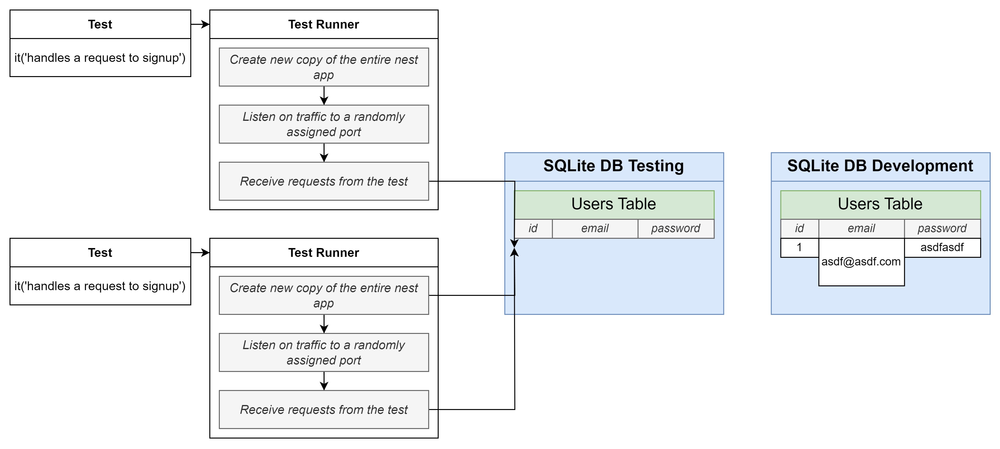
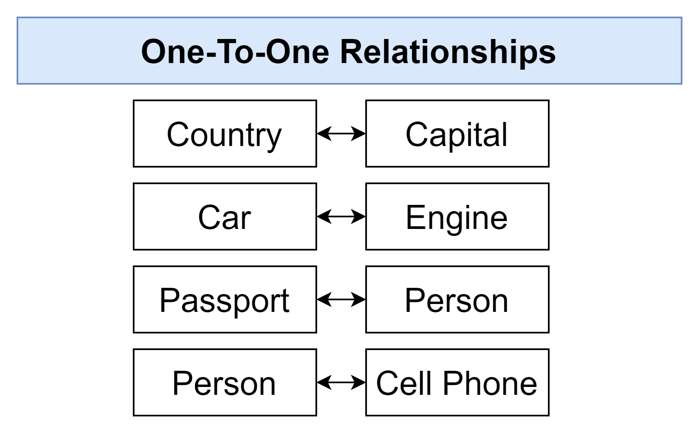
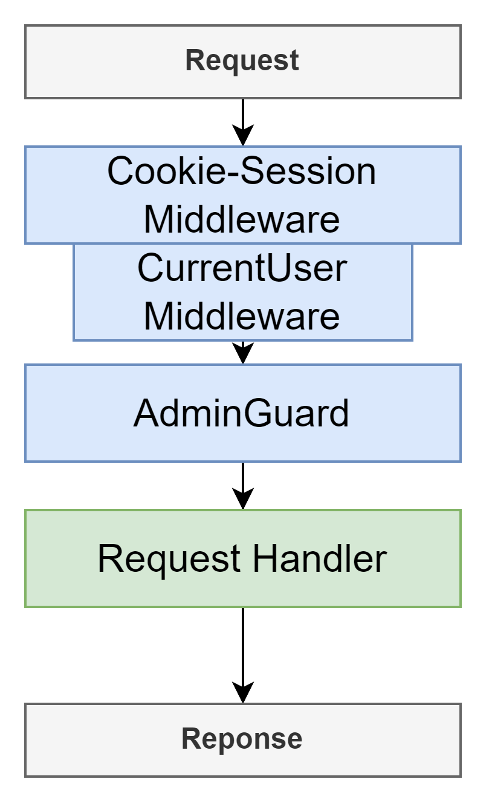

Start learning on 2021/08/28
Finished on 2024/05/21

1. Course Link [https://www.udemy.com/course/nestjs-the-complete-developers-guide/](https://www.udemy.com/course/nestjs-the-complete-developers-guide/)
- [1. The Basics of Nest](#1-the-basics-of-nest)
  - [1.1. Project Setup](#11-project-setup)
  - [1.2. Typescript Configuration](#12-typescript-configuration)
  - [1.3. Creating a Controller](#13-creating-a-controller)
  - [1.4. Starting up a Nest App](#14-starting-up-a-nest-app)
  - [1.5. File Naming Convention](#15-file-naming-convention)
  - [1.6. Routing Decorators](#16-routing-decorators)
- [2. Generating Projects with the Nest CLI](#2-generating-projects-with-the-nest-cli)
  - [2.1. App Setup](#21-app-setup)
  - [2.2. Using the Nest CLI to Generate Files](#22-using-the-nest-cli-to-generate-files)
  - [2.3. More on Generating Files](#23-more-on-generating-files)
  - [2.4. Adding Routing Logic](#24-adding-routing-logic)
  - [2.5. Postman Setup](#25-postman-setup)
  - [2.6. VSCode REST Client Extension](#26-vscode-rest-client-extension)
- [3. Validating Request Data with Pipes](#3-validating-request-data-with-pipes)
  - [3.1. Accessing Request Data with Decorators](#31-accessing-request-data-with-decorators)
  - [3.2. Using Pipes for Validation](#32-using-pipes-for-validation)
  - [3.3. Adding Validation Rules](#33-adding-validation-rules)
  - [3.4. Behind the Scenes of Validation](#34-behind-the-scenes-of-validation)
  - [3.5. How Type Info is Preserved](#35-how-type-info-is-preserved)
- [4. Nest Architecture: Services and Repositories](#4-nest-architecture-services-and-repositories)
  - [4.1. Services and Repositories](#41-services-and-repositories)
  - [4.2. Implementing a Repository](#42-implementing-a-repository)
  - [4.3. Reading and Writing to a Storage File](#43-reading-and-writing-to-a-storage-file)
  - [4.4. Implementing a Service](#44-implementing-a-service)
  - [4.5. Manual Testing of the Controller](#45-manual-testing-of-the-controller)
  - [4.6. Reporting Errors with Exceptions](#46-reporting-errors-with-exceptions)
  - [4.7. Understanding Inversion of Control](#47-understanding-inversion-of-control)
  - [4.8. Introduction to Dependency Injection](#48-introduction-to-dependency-injection)
  - [4.9. Refactoring to Use Dependency Injection](#49-refactoring-to-use-dependency-injection)
  - [4.10. Few More Notes on DI](#410-few-more-notes-on-di)
- [5. Nest Architecture: Organizing Code with Modules](#5-nest-architecture-organizing-code-with-modules)
  - [5.1. Project Overview and Generating a Few Files](#51-project-overview-and-generating-a-few-files)
  - [5.2. Setting up DI between modules](#52-setting-up-di-between-modules)
  - [5.3. Consuming multiple modules](#53-consuming-multiple-modules)
- [6. Big Project Time](#6-big-project-time)
  - [6.1. App Overview](#61-app-overview)
  - [6.2. API Design](#62-api-design)
  - [6.3. Module Design](#63-module-design)
  - [6.4. Generating Modules, Controllers, and Services](#64-generating-modules-controllers-and-services)
- [7. Persisting Data with TypeORM](#7-persisting-data-with-typeorm)
  - [7.1. Persisting Data with Nest](#71-persisting-data-with-nest)
  - [7.2. Setting up a database connection](#72-setting-up-a-database-connection)
  - [7.3. Creating an entity and repository](#73-creating-an-entity-and-repository)
  - [7.4. Viewing a DB's content](#74-viewing-a-dbs-content)
  - [7.5. Understanding TypeORM Decorators](#75-understanding-typeorm-decorators)
  - [7.6. One quick note on repositories](#76-one-quick-note-on-repositories)
  - [7.7. A few extra routes](#77-a-few-extra-routes)
  - [7.8. Setting up body validation](#78-setting-up-body-validation)
- [8. Creating and saving User data](#8-creating-and-saving-user-data)
  - [8.1. Creating and saving a user](#81-creating-and-saving-a-user)
  - [8.2. Quick breather and review](#82-quick-breather-and-review)
  - [8.3. More on Create vs Save](#83-more-on-create-vs-save)
  - [8.4. Querying for data](#84-querying-for-data)
  - [8.5. Updating data](#85-updating-data)
  - [8.6. Removing users](#86-removing-users)
  - [8.7. Finding and filtering records](#87-finding-and-filtering-records)
  - [8.8. Removing records](#88-removing-records)
  - [8.9. Updating records](#89-updating-records)
  - [8.10. A few notes on exceptions](#810-a-few-notes-on-exceptions)
- [9. Custom data serialization](#9-custom-data-serialization)
  - [9.1. Excluding response properties](#91-excluding-response-properties)
  - [9.2. Solution to Serialization](#92-solution-to-serialization)
  - [9.3. How to build interceptors](#93-how-to-build-interceptors)
  - [9.4. Serialization in interceptor](#94-serialization-in-interceptor)
  - [9.5. Customizing the interceptor's DTO](#95-customizing-the-interceptors-dto)
  - [9.6. Wrapping the interceptor in a decorator](#96-wrapping-the-interceptor-in-a-decorator)
  - [9.7. Controller-wide serialization](#97-controller-wide-serialization)
  - [9.8. A bit of type safety around serialize](#98-a-bit-of-type-safety-around-serialize)
- [10. Authentication from Scratch](#10-authentication-from-scratch)
  - [10.1. Authentication overview](#101-authentication-overview)
  - [10.2. Reminder on Service setup](#102-reminder-on-service-setup)
  - [10.3. Implementing signup functionality](#103-implementing-signup-functionality)
  - [10.4. Understanding password hashing](#104-understanding-password-hashing)
  - [10.5. Salting and hashing the password](#105-salting-and-hashing-the-password)
  - [10.6. Creating a user](#106-creating-a-user)
  - [10.7. Handling user sign in](#107-handling-user-sign-in)
  - [10.8. Setting up sessions](#108-setting-up-sessions)
  - [10.9. Changing and fetching session data](#109-changing-and-fetching-session-data)
  - [10.10. Signing in a user](#1010-signing-in-a-user)
  - [10.11. Getting the current user](#1011-getting-the-current-user)
  - [10.12. Signing out a user](#1012-signing-out-a-user)
  - [10.13. Two automation tools](#1013-two-automation-tools)
  - [10.14. Custom param decorators](#1014-custom-param-decorators)
  - [10.15. Why a decorator and interceptor](#1015-why-a-decorator-and-interceptor)
  - [10.16. Communicating from interceptor to decorator](#1016-communicating-from-interceptor-to-decorator)
  - [10.17. Small fix for CurrentUserInterceptor](#1017-small-fix-for-currentuserinterceptor)
  - [10.18. Connecting an interceptor to dependency injection](#1018-connecting-an-interceptor-to-dependency-injection)
  - [10.19. Globally scoped interceptors](#1019-globally-scoped-interceptors)
  - [10.20. Preventing access with authentication guards](#1020-preventing-access-with-authentication-guards)
- [11. Getting started with unit testing](#11-getting-started-with-unit-testing)
  - [11.1. Testing overview](#111-testing-overview)
  - [11.2. Testing setup](#112-testing-setup)
  - [11.3. Yes, testing is confusing](#113-yes-testing-is-confusing)
  - [11.4. Getting TypeScript to Help with Mocks](#114-getting-typescript-to-help-with-mocks)
  - [11.5. Quick note to help speed up your tests](#115-quick-note-to-help-speed-up-your-tests)
  - [11.6. Improving file layout](#116-improving-file-layout)
  - [11.7. Ensuring password gets hashed](#117-ensuring-password-gets-hashed)
  - [11.8. Refactor 'email in use' test to address jest breaking changes](#118-refactor-email-in-use-test-to-address-jest-breaking-changes)
  - [11.9. Changing mock implementations](#119-changing-mock-implementations)
  - [11.10. Refactor 'unused email' test to address jest breaking changes](#1110-refactor-unused-email-test-to-address-jest-breaking-changes)
  - [11.11. Testing the signin flow](#1111-testing-the-signin-flow)
  - [11.12. Refactor 'invalid password' test to address jest breaking changes](#1112-refactor-invalid-password-test-to-address-jest-breaking-changes)
  - [11.13. Checking password comparison](#1113-checking-password-comparison)
  - [11.14. More intelligent mocks](#1114-more-intelligent-mocks)
  - [11.15. Refactor 3 mocks to address jest breaking changes](#1115-refactor-3-mocks-to-address-jest-breaking-changes)
  - [11.16. Refactoring to use intelligent mocks](#1116-refactoring-to-use-intelligent-mocks)
  - [11.17. Unit test a controller](#1117-unit-test-a-controller)
  - [11.18. More mock implementations](#1118-more-mock-implementations)
  - [11.19. Refactor 'user id is not found' test to address jest breaking changes](#1119-refactor-user-id-is-not-found-test-to-address-jest-breaking-changes)
  - [11.20. Not super effective tests](#1120-not-super-effective-tests)
  - [11.21. Testing the signin method](#1121-testing-the-signin-method)
- [12. Integration testing](#12-integration-testing)
  - [12.1. Getting started with end to end testing](#121-getting-started-with-end-to-end-testing)
  - [12.2. Creating an end to end test](#122-creating-an-end-to-end-test)
  - [12.3. App setup issues in spec files](#123-app-setup-issues-in-spec-files)
  - [12.4. Applying a globally scoped pipe](#124-applying-a-globally-scoped-pipe)
  - [12.5. Applying a globally scoped middleware](#125-applying-a-globally-scoped-middleware)
  - [12.6. Solving failures around repeat test runs](#126-solving-failures-around-repeat-test-runs)
  - [12.7. Creating separate test and dev databases](#127-creating-separate-test-and-dev-databases)
- [13. Managing app configuration](#13-managing-app-configuration)
  - [13.1. Understanding Dotenv](#131-understanding-dotenv)
  - [13.2. Applying Dotenv for config](#132-applying-dotenv-for-config)
  - [13.3. Specifying the runtime environment](#133-specifying-the-runtime-environment)
  - [13.4. Solving SQLite error](#134-solving-sqlite-error)
  - [13.5. It works!](#135-it-works)
  - [13.6. A followup test](#136-a-followup-test)
- [14. Relations with TypeORM](#14-relations-with-typeorm)
  - [14.1. Back to reports](#141-back-to-reports)
  - [14.2. Adding properties to reports](#142-adding-properties-to-reports)
  - [14.3. A DTO for report creation](#143-a-dto-for-report-creation)
  - [14.4. Receiving report creation requests](#144-receiving-report-creation-requests)
  - [14.5. Saving a report with the reports service](#145-saving-a-report-with-the-reports-service)
  - [14.6. Testing report creation](#146-testing-report-creation)
  - [14.7. Building associations](#147-building-associations)
  - [14.8. Types of associations](#148-types-of-associations)
  - [14.9. The ManyToOne and OneToMany decorators](#149-the-manytoone-and-onetomany-decorators)
  - [14.10. Important note about deleting database](#1410-important-note-about-deleting-database)
  - [14.11. More on decorators](#1411-more-on-decorators)
  - [14.12. Setting up the association](#1412-setting-up-the-association)
  - [14.13. Formatting the report response](#1413-formatting-the-report-response)
  - [14.14. Transforming properties with a DTO](#1414-transforming-properties-with-a-dto)
- [15. A basic permissions system](#15-a-basic-permissions-system)
  - [15.1. Adding in report approval](#151-adding-in-report-approval)
  - [15.2. Required update for changeApproval method](#152-required-update-for-changeapproval-method)
  - [15.3. Testing report approval](#153-testing-report-approval)
  - [15.4. Authorization vs Authentication](#154-authorization-vs-authentication)
  - [15.5. Adding an authorization guard](#155-adding-an-authorization-guard)
  - [15.6. The guard doesn't work](#156-the-guard-doesnt-work)
  - [15.7. Middlewares, guards, and interceptors](#157-middlewares-guards-and-interceptors)
  - [15.8. Assigning CurrentUser with a middleware](#158-assigning-currentuser-with-a-middleware)
  - [15.9. Fixing a type definition error](#159-fixing-a-type-definition-error)
  - [15.10. Validating query string values](#1510-validating-query-string-values)
  - [15.11. Transforming query string data](#1511-transforming-query-string-data)
  - [15.12. How will we generate an estimate](#1512-how-will-we-generate-an-estimate)
- [16. Query builders with TypeORM](#16-query-builders-with-typeorm)
  - [16.1. Creating a query builder](#161-creating-a-query-builder)
  - [16.2. Writing a query to produce the estimate](#162-writing-a-query-to-produce-the-estimate)
  - [16.3. Testing the estimate logic](#163-testing-the-estimate-logic)
- [17. Production deployment](#17-production-deployment)
  - [17.1. The path to production](#171-the-path-to-production)
  - [17.2. Providing the cookie key](#172-providing-the-cookie-key)
  - [17.3. Understanding the synchronize flag](#173-understanding-the-synchronize-flag)
  - [17.4. The dangers of synchronize](#174-the-dangers-of-synchronize)
  - [17.5. The theory behind migrations](#175-the-theory-behind-migrations)
  - [17.6. Headaches with config management](#176-headaches-with-config-management)
  - [17.7. TypeORM and Nest config is great](#177-typeorm-and-nest-config-is-great)
    - [17.7.1. Using static files](#1771-using-static-files)
    - [17.7.2. Setting ENVs on the local machine](#1772-setting-envs-on-the-local-machine)
    - [17.7.3. Using ts or js config files](#1773-using-ts-or-js-config-files)
  - [17.8. Env-specific database config](#178-env-specific-database-config)
  - [17.9. Installing the TypeORM CLI](#179-installing-the-typeorm-cli)
  - [17.10. Generating and running migrations](#1710-generating-and-running-migrations)
  - [17.11. Required migration update for production](#1711-required-migration-update-for-production)
  - [17.12. Running migrations during e2e tests](#1712-running-migrations-during-e2e-tests)
  - [17.13. Production DB config](#1713-production-db-config)
  - [17.14. Heroku CLI setup](#1714-heroku-cli-setup)
  - [17.15. Heroku specific project config](#1715-heroku-specific-project-config)
  - [17.16. Deploying the app](#1716-deploying-the-app)

# 1. The Basics of Nest
## 1.1. Project Setup
1. The first project will be a little bit hard.
2. We are going to focus on some behind-the-scene stuff
3. Understanding how Nest works will make all of Nest easy
4. We firstly create a new directory `scratch` and use `npm init -y` to start a NPM project.
5. In regular Nest projects, we may have many dependcies to work with, while we only use few as we will build it from scratch.
6. `npm install @nestjs/common@7.6.17 @nestjs/core@7.6.17 @nestjs/platform-express@7.6.17 reflect-metadata@0.1.13 typescript@4.3.2`

## 1.2. Typescript Configuration
1. We use the dependecies in the `scratch` project.
  
1. NestJS uses some 3rd party models to work with "HTTP Implementation", we can choose either `Express` or `Fastify`.
  
1. We configure tsconfig.json with the following setting.

  ```json
  // tsconfig.json
  {
    "compilerOptions": {
      "module": "commonjs",
      "target": "ES2017",
      "experimentalDecorators": true,
      "emitDecoratorMetadata": true
    }
  }
  ```

## 1.3. Creating a Controller
1. In convention the `request` and `response` cycle is very similar in mostly every programming language and framework.
    
2. In NestJS, there are several tools we can use in the request handling cycle, such as `Pipe`, `Guard`, `Controller`, `Service`, and `Repository`.
    
3. Each NestJS server must have "Controllers" and "Modules". Note that are other tools as well. 
4. NestJS uses much with Typescript decorators. In the following code, we try to make a class `AppController` and use `@Controller` to indicate that it's a "controller".
5. We then import and use another object from `common` library which is the `Get` object that works with HTTP GET request.
6. We then can use `Get` to decorate `getRootRoute` to indicate the value to return when the server receivers a GET request on root route.

  ```ts
  // src/main.ts
  import { Controller, Module, Get } from '@nestjs/common';

  @Controller()
  class AppController {
    @Get()
    getRootRoute() {
      return 'hi there!';
    }
  }
  ```

## 1.4. Starting up a Nest App
1. In most of the cases, we need to import objects and functions from `@nestjs/common`.
2. By convention, we can declare a function `bootstrap` to start up the server.
3. We need to use `NestFacotry` which is a very few case that we import a model from `@nestjs/core` library.
4. Then we use `create` method and pass in the Module to start the server.
  ```ts
  // src/main.ts
  import { Controller, Module, Get } from '@nestjs/common';
  import { NestFactory } from '@nestjs/core';

  @Controller()
  class AppController {
    @Get()
    getRootRoute() {
      return 'hi there!';
    }
  }

  @Module({
    controllers: [AppController],
  })
  class AppModule {}

  async function boostrap() {
    const app = await NestFactory.create(AppModule);

    await app.listen(3000);
  }

  boostrap();
  ```

## 1.5. File Naming Convention
1. NestJS have convention on naming its files. Besides, the controller and modules we just created can be separated into different files.
  
2. We separate the code into `app.controller.ts` and `app.module.ts`.

  ```ts
  // src/app.controller.ts
  import { Controller, Get } from '@nestjs/common';

  @Controller()
  export class AppController {
    @Get()
    getRootRoute() {
      return 'hi there!';
    }
  }
  ```
  ```ts
  // src/app.module.ts
  import { Module } from '@nestjs/common';
  import { AppController } from './app.controller';

  @Module({
    controllers: [AppController],
  })
  export class AppModule {}
  ```
  ```ts
  // main.ts
  import { NestFactory } from '@nestjs/core';
  import { AppModule } from './app.module';

  async function boostrap() {
    const app = await NestFactory.create(AppModule);

    await app.listen(3000);
  }

  boostrap();
  ```

## 1.6. Routing Decorators
1. We can use `Controller` decorator to have a high level route grouping. The routes in the class `AppController` will have a route prefix `/app`.
2. In the `Get` decorator, we can give the route to handle the logic below.
3. In the following case, we can access `/app/asdf` and `/app/bye` on this NestJS server.
  ```ts
  // app.controller.ts
  import { Controller, Get } from '@nestjs/common';

  @Controller('/app')
  export class AppController {
    @Get('/asdf')
    getRootRoute() {
      return 'hi there!';
    }

    @Get('/bye')
    getByeThere() {
      return 'bye there!';
    }
  }
  ```

# 2. Generating Projects with the Nest CLI
## 2.1. App Setup
1. We install `nest` globally with `npm install -g @nestjs/cli`.
2. Then create a project with `nest new [project]` and choose the preferred package manager such as `npm` or `yarn`.
3. The project we are going to build is to store and retrieve messages stored in a plain JSON file. This app will have 3 routes.
   1. List all the messages saved on the server
   2. Retrieve message by its ID
   3. Create a message
4. Each of the route will handle the request and give response with the following functions. 
   1. List all message - `Controller`, `Service`, `Repository`.
   2. Create a message - `Pipe`, `Controller`, `Service`, `Repository`.
5. Though we have different routes to handle different requests, we can share the same `Controller`, `Service`, and `Repository` rather than have 2 copies.
6. In this project, we don't have authentication feature, so we don't need a `Guard` in this case.

## 2.2. Using the Nest CLI to Generate Files
1. After initiating the project, we can check the `scripts` in `package.json`.
2. For example, we can start the development mode with `start:dev`.
3. NestJS uses `eslint` by default. However, since Typescript has been catching most of the possible errors in the code, we can turn this feature off to reduce the noise. We can simply comment out all the configuration in the object in `.eslintrc.js`.
4. We can remove all the other files in `src` besides `main.ts` to have a fresh start.
5. In this project, we have a `MessageModule` which includes `Pipe`, `MessagesController`, `Messages Service`, and `Messages Repository`.
6. We can create each file manually as we did in the last section, or we can use Nest CLI to generate the file with some pre-configured code. 
7. In the terminal, we can use `nest generate module [moduleName]`. Nest CLI will create a new directory and some code inside of it.
8. Note that Nest JS will have a suffix `.module` on the file name and `Module` right after the module name. 
9. For example, we create a `Message` module with Nest CLI by typing `nest generate module message` (message in lowercase). The module name created in `messages.module.ts` is `MessageModule`. Note that the file name is `messages.module.ts`.
  ```ts
  // src/message/messages.module.ts
  // this is nest cli generates for us
  import { Module } from '@nestjs/common';

  @Module({})
  export class MessagesModule {}
  ```
10. We upadte `main.ts` with the new created module.
  ```ts
  // main.ts
  import { NestFactory } from '@nestjs/core';
  import { MessagesModule } from './messages/messages.module';

  async function bootstrap() {
    const app = await NestFactory.create(MessagesModule);
    await app.listen(3000);
  }
  bootstrap();
  ```

## 2.3. More on Generating Files
1. The minimum requirement by NestJS is to have a "Controller" and a "Module" to provide services as a service.
2. We can use Nest CLI to create a controller which Nest will configure the code that can save us some time to wire the files up. From the last section, we have learnt that a controller should work with a module.
3. In this case, we can create the controller with `nest generate controller messages/messages --flat`.
4. By using Nest CLI, the controller has been imported to the module when it's created.
5. The command we give to Nest CLI has 4 parts after `nest generate`
   1. `controller` is the type of class to generate. We use `module` in the last case.
   2. For `messages/messages`, 
      1. The first `messages` is the directory which we want to place the file. In this case, we want the new files stay in `src/messages`. If we have other path, Nest CLI can create a new directory to save the generated files in the root directory.
      2. The second `messages` is the name of the controller class. In this case, we'd like to call the name as `MessagesController`. If we give this as `messages/controllers`, the controller file name will be funny as `controller.controller.ts`.
   3. `--flat` is to indicate to Nest to put controller in the same directory in `messages`. If this flag is not given, Nest CLI will create  a "controllers" directory in the target folder.
6. In this case, as we don't have many controllers and files, we can keep the generated controllers in the same folder with the module. 

## 2.4. Adding Routing Logic
1. To set up the controllers for routes, we have several options. 
   1. Use decorators such as `@Get('route')`, `@Post('route/:id')` on the HTTP method.
   2. Use decorators as the whole class on `@Controller('group')`. This will apply to all routes in the class as a group.
  ```ts
  // src/messages/messages.controller.ts
  import { Controller, Get, Post } from '@nestjs/common';

  @Controller('messages')
  export class MessagesController {
    @Get()
    listMessages() {}

    @Post()
    createMessage() {}

    @Get('/:id')
    getMessage() {}
  }
  ```

## 2.5. Postman Setup
1. We can use either "Postman" or "VSCode Rest Client Extension".
2. This part gives some basic functions, feature and how to use with Postman Desktop App.

## 2.6. VSCode REST Client Extension
1. In this case, we install an extension on VSCode [`REST Client`](https://marketplace.visualstudio.com/items?itemName=humao.rest-client).
2. We create a new file in the root folder to predefine HTTP requests with the extension.
  ```sh
  ### List all messages
  GET http://localhost:3000/messages

  ### Create a new message
  POST http://localhost:3000/messages
  content-type: application/json

  {
    "content": "hello world"
  }

  ### Get a particular message
  GET http://localhost:3000/messages/123
  ```

# 3. Validating Request Data with Pipes
## 3.1. Accessing Request Data with Decorators
1. In the controllers, we need to fetch some data from the requests such as the `body` for POST request and the `id` for a GET request to fetch specific data.
2. For example, we can use `@Param`, `@Query`, `@Headers`, and `@Body` for each part of a HTTP request. All these decorators can be imported from the common library of NestJS.
    
3. These HTTP decorators are used as arguments passing to the request handler. 
4. `Param` is the query string sending with the requested endpoint. In most of the cases, it can simply be a `string`.
5. For `Body`, it can be `any` type as it's very hard to expect that what kind of data will the request include.

    ```ts
    // src/messages/messagse.controller.ts
    import { Controller, Get, Post, Body, Param } from '@nestjs/common';

    @Controller('messages')
    export class MessagesController {
      @Get()
      listMessages() {}

      @Post()
      createMessage(@Body() body: any) { // pass @Body to be any
        console.log(body);
      }

      @Get('/:id')
      getMessage(@Param('id') id: string) { // pass @Param to be string
        console.log(id);
      }
    }
    ```

## 3.2. Using Pipes for Validation
1. We can use a `Pipe` to validate the incoming data before it's sending to the route handler.
2. Though we can create the `Pipe` manually, we can use the built-in one provided by Nest JS. We can import `ValidationPipe` from `@nestjs/common`.
3. After importing the object, we can use `app.useGlobalPipes` and pass an instance of `ValidationPipe`. This will validate all the incoming requests at the global scale.
4. However, the validation pipe won't work on the routes, if we don't provide pipe validation handler to them.

  ```ts
  // main.ts
  import { NestFactory } from '@nestjs/core';
  import { ValidationPipe } from '@nestjs/common';
  import { MessagesModule } from './messages/messages.module';

  async function bootstrap() {
    const app = await NestFactory.create(MessagesModule);
    // apply pipes globally
    app.useGlobalPipes(new ValidationPipe());
    await app.listen(3000);
  }
  bootstrap();
  ```

## 3.3. Adding Validation Rules
1. Steps to set up automatic validation
   1. Tell Nest to use global validation. We have done this in the previous lecture.
   2. Create a class that describe that different properties that the request body should have
   3. Add validation rules to the class
   4. Apply that class to the request handler
2. Most of the time, we can keep repeating steps from 2 to 4. 
3. The class we create in step 2 is called a "**Data Transfer Object**" a.k.a `DTO`.
4. For step 2, we create a new directory `dtos` under `messages` and name the file as `create-message.dto.ts`. In this file, we specify the type structure that we expect sending with the `body` in the request.

  ```ts
  // src/messages/dtos/create-message.dto.ts
  export class CreateMessageDto {
    content: string;
  }
  ```

5. For step 3, we add validation rules to the class. Note that we need to install another 2 libraries `class-validator` and `class-transformer` with `npm`. Besides, in the newer version, these 2 libraries are required when using `ValidationPipe` globally in `main.ts`.
6. We can use `IsString` from `class-validator` as the decorating and check if the content is string.
  ```ts
  // src/messages/dtos/create-message.dto.ts
  import { IsString } from 'class-validator';

  export class CreateMessageDto {
    @IsString()
    content: string;
  }
  ```
7. We then add the handler to the controller. In this case, we change the `body` argument for POST request from `any` to `CreateMessageDto`.
8. If the incoming request doesn't have `content` in body or doesn't contain string type value, it will get a `400` bad request error and the message saying that the "content must be a string".
  ```ts
  // src/messages/messages.controller.ts
  import { Controller, Get, Post, Body, Param } from '@nestjs/common';
  import { CreateMessageDto } from './dtos/create-message.dto';

  @Controller('messages')
  export class MessagesController {
    @Get()
    listMessages() {}

    @Post()
    createMessage(@Body() body: CreateMessageDto) {
      console.log(body);
    }

    @Get('/:id')
    getMessage(@Param('id') id: string) {
      console.log(id);
    }
  }
  ```

## 3.4. Behind the Scenes of Validation
1. A "Dto" carries data between 2 places. We use both `class-validator` and `class-transformer` in this case.
2. We can refer to the documentation of [`class-transformer`](https://github.com/typestack/class-transformer). This library helps to transform plain object into an instance of a class.
3. For example, we have an array of user objects and a `User` class which has useful methods on its instance.
4. [`class-validator`](https://github.com/typestack/class-validator), on the other hand, uses ["decorators"](https://github.com/typestack/class-validator#validation-decorators) to check properties on a class. There are various type decorators we can use to check the types, such as `@IsString` and `@IsBase64`.
5. When the server receives a request, it sends to a validation pipe and runs 3 steps.
   1. Use class-transformer to turn the body into an instance of the DTO class. This turn the `body` as an instance of `CreateMessageDto`.
   2. Use class-validator to validate the instance. This part uses the decorator `@IsString` to check if the content is a `string`.
    ```ts
    // src/messages/dtos/create-message.dto.ts
    import { IsString } from 'class-validator';
    export class CreateMessageDto {
      @IsString() // check as the class validator if the content is a string
      content: string;
    }
    ```
   3. If there are validation errors, respond immediately, otherwise provide body to request handler.

## 3.5. How Type Info is Preserved
1. In regular cases, Typescript files will be compiled and executed as regular Javascript, Note that the type and decorator will eventually vanish as Javascript doesn't support such feature. However, the set up in the previous lectures are still valid when we run the server. 
  ```ts
  // Typescript
  addMessage(@Body() body: AddMessageDto) {}
  ```
  ```js
  // Javascript
  addMessage(body) {}
  ```
2. The main reason is from the configuration in `tsconfig.json`, `experimentalDecorators` and `emitDecoratorMetadata`.
  ```json
  {
    "compilerOptions": {
      "experimentalDecorators": true,
      "emitDecoratorMetadata": true
    }
  }
  ```
3. If we use these feature in Typescript compiler, the decorators will be remain and work in the compiled Javascript file.
  ```js
  // dist/src/messages/messages.controller.js
  // decorators for each route 
  __decorate([
    (0, common_1.Get)(), // get all messages
    __metadata("design:type", Function),
    __metadata("design:paramtypes", []),
    __metadata("design:returntype", void 0)
  ], MessagesController.prototype, "listMessages", null);
  __decorate([
      (0, common_1.Post)(), // create message
      __param(0, (0, common_1.Body)()),
      __metadata("design:type", Function),
      __metadata("design:paramtypes", [create_message_dto_1.CreateMessageDto]),
      __metadata("design:returntype", void 0)
  ], MessagesController.prototype, "createMessage", null);
  __decorate([
      (0, common_1.Get)('/:id'), // get a message by id
      __param(0, (0, common_1.Param)('id')),
      __metadata("design:type", Function),
      __metadata("design:paramtypes", [String]),
      __metadata("design:returntype", void 0)
  ], MessagesController.prototype, "getMessage", null);
  ```

# 4. Nest Architecture: Services and Repositories
## 4.1. Services and Repositories
1. It can be very challenging to understand the difference between `Services` and `Repositories` in NestJS.
    
2. In the current case, we have only 1 service and 1 repository.
3. In this case, we will create a repository from scratch. However, in regular cases, we can use libraries to create it. 
    
4. Though `Services` can seem redundant in some cases as its function is not different from calling and sending data from repository directly, we still need `Services` as proxies to interact with `Repositories`.

## 4.2. Implementing a Repository
1. There are commands in Nest that we can easily create the components as `module` and `controller`. However, we create the files manually in this case.
2. We create `messages.repository.ts` and `messages.service.ts`.
3. We then create a file `message.json` to store the data as a local database on the hard-drive.
  ```json
  // messages.json
  {
    "12": {
      "content": "hi there",
      "id": 12
    },
    "13": {
      "content": "hi there",
      "id": 13
    },
    "14": {
      "content": "hi there",
      "id": 14
    },
  }
  ```
3. We use `readFile` and `writeFile` from `fs/promise` which is a standard library from NodeJS.
4. Besides, both reading and writing file can be asynchronous function. It's similar when calling to remote API through HTTP.
5. In this case, we assume the `messages.json` is always in the root directory in the project, so the app won't automatically creat a new file if it doesn't exist.
6. We can refer to [`fsPromise.readFile`](https://nodejs.org/api/fs.html#fs_fspromises_readfile_path_options) from NodeJS. We firstly give the filename and the option as how we encode the file.
7. Note that if we don't provide the encoding method, it will returns a `Buffer` object.
  ```ts
  // src/messages/messages.repository.ts
  import { readFile, writeFile } from 'fs/promises';

  export class MessagesRepository {
    async fineOne(id: string) {
      const contents = await readFile('messages.json', 'utf8');
      const messages = JSON.parse(contents);
      /* messages data structure
        {
          [_id]: {
            id: [_id],
            content: [some text and information]
          }
        }
      */

      return messages[id];
    }

    async findAll() {}

    async create(message: string) {}
  }
  ```

## 4.3. Reading and Writing to a Storage File
1. We set up `findAll` and `create` function.
  ```ts
  // src/messages/messages.repository.ts
  import { readFile, writeFile } from 'fs/promises';

  export class MessagesRepository {
    async fineOne(id: string) {
      const contents = await readFile('messages.json', 'utf8');
      const messages = JSON.parse(contents);

      return messages[id];
    }

    async findAll() {
      const contents = await readFile('messages.json', 'utf8');
      const messages = JSON.parse(contents);

      return messages;
    }

    async create(content: string) {
      const contents = await readFile('messages.json', 'utf8');
      const messages = JSON.parse(contents);

      // randomly generate a number from 0 to 999
      const id = Math.floor(Math.random() * 999);

      messages[id] = { id, content };

      await writeFile('messages.json', JSON.stringify(messages));
    }
  }
  ```

## 4.4. Implementing a Service
1. After configuring the `Repository`, we can set up the `Service` for the controller to access data from the data storage.
2. In this case, we import `MessagesRepository` and ensure the `MessagesService` instance can access the repository.
3. Note that we can just call the methods from `MessagesRepository` directly without calling it asynchronously.
4. In regular NestJS, we will use dependency injection rather than linking the classes in the following way. We will use "Dependency Injection" to set up relationship between classes in NestJS.
  ```ts
  // src/messages/messages.service.ts
  import { MessagesRepository } from './messages.repository';

  export class MessagesService {
    messagesRepo: MessagesRepository;

    constructor() {
      // Service is creating its own dependencies
      // DONT DO THIS ON REAL APPS
      // Use dependency injection instead
      this.messagesRepo = new MessagesRepository();
    }

    findOne(id: string) {
      return this.messagesRepo.findOne(id);
    }

    findAll() {
      return this.messagesRepo.findAll();
    }

    create(content: string) {
      return this.messagesRepo.create(content);
    }
  }
  ```

## 4.5. Manual Testing of the Controller
1. We then import `MessagesService` to use in the controller. 
    ```ts
    import { Body, Controller, Get, Param, Post } from '@nestjs/common';
    import { CreateMessageDto } from './dtos/create-message.dto';
    import { MessagesService } from './messages.service';

    @Controller('messages')
    export class MessagesController {
      messagesService: MessagesService;

      constructor() {
        this.messagesService = new MessagesService();
      }

      @Get()
      listMessages() {
        return this.messagesService.findAll();
      }

      @Post()
      createMessage(@Body() body: CreateMessageDto) {
        return this.messagesService.create(body.content);
      }

      @Get('/:id')
      getMessage(@Param('id') id: string) {
        return this.messagesService.findOne(id);
      }
    }
    ```
2. For the mock `messages.json` db on the root directory, we can place a mock data as an empty object `{}`. 

## 4.6. Reporting Errors with Exceptions
1. To prompt an error message for users trying to search for certain message with an ID, we can use `NotFoundException` which helps to prompt an error message with given content.
2. Nest.js has provided several common HTTP related exceptions, such as errors with `4xx` and `5xx`. 
    ```ts
    import {
      Body,
      Controller,
      Get,
      NotFoundException,
      Param,
      Post,
    } from '@nestjs/common';
    import { CreateMessageDto } from './dtos/create-message.dto';
    import { MessagesService } from './messages.service';

    @Controller('messages')
    export class MessagesController {
      messagesService: MessagesService;

      constructor() {
        this.messagesService = new MessagesService();
      }

      @Get()
      listMessages() {
        return this.messagesService.findAll();
      }

      @Post()
      createMessage(@Body() body: CreateMessageDto) {
        return this.messagesService.create(body.content);
      }

      @Get('/:id')
      async getMessage(@Param('id') id: string) {
        const message = await this.messagesService.findOne(id);

        if (!message) {
          throw new NotFoundException('message not found');
        }

        return message;
      }
    }
    ```

## 4.7. Understanding Inversion of Control
1. Inversion of Control Principle -> Classes should not create instances of its dependencies on its own. 
2. When initiating a new instance, the class acquire the required dependencies. 
3. Besides, it requires on an object with an interface which isn't any specific class as in regular workflow. 
4. This thus brings benefits in automated testing such as unit test, as we can easily mock the dependency and execution. 
5. For example, if a service class requires a repository to work on database, by using IoC, we can easily mock the implementation of CRUD rather than interacting with a real database.

## 4.8. Introduction to Dependency Injection
1. Though IoC brings benefits to decouple tightly dependencies of the classes, it creates more burden when declaring each instances as the class needs the dependency to initiate a new instance. 
    ```ts
    // provide dependencies when creating new instances. 
    const repo = new MessageRepository()
    const service = new MessageService(repo)
    const controller = new MessageController(service)
    ```
2. We can introduce `Dependency Injection` (DI) which has a container to hold the dependencies and create instances relying on it. 
3. DI container flow
   1. At startup, register all classes with the container.
   2. Container will figure out what each dependency each class has. 
   3. We then ask the container to create an instance of a class for us. 
   4. Container creates all required dependencies and gives us the instance. 
   5. Container will hold onto the created dependency instances and reuse them if needed. 

## 4.9. Refactoring to Use Dependency Injection
1. By referring the DI container flow in the previous section. 
2. Use the `Injectable` decorator on each class and add them to the modules list of providers.
   1. At startup, register all classes with the container.
   2. Container will figure out what each dependency each class has. 
3. Happens automatically - Nest will try to create controller instances for us. 
   1. We then ask the container to create an instance of a class for us.  
   2. Container creates all required dependencies and gives us the instance. 
4. On each class that can be injected to the others, we can use `Injectable` to mark it, so Nest DI container will know and register it as an injectable. 
    ```ts
    // src/messages/messages.repository.ts
    import { Injectable } from '@nestjs/common';
    import { readFile, writeFile } from 'fs/promises';

    @Injectable()
    export class MessagesRepository {
      async findOne(id: string) {
        const contents = await readFile('messages.json', 'utf-8');
        const messages = JSON.parse(contents);

        return messages[id];
      }

      async findAll() {
        const contents = await readFile('messages.json', 'utf8');
        const messages = JSON.parse(contents);

        return messages;
      }

      async create(content: string) {
        const contents = await readFile('messages.json', 'utf8');
        const messages = JSON.parse(contents);

        // randomly generate a number from 0 to 999
        const id = Math.floor(Math.random() * 999);

        messages[id] = { id, content };

        await writeFile('messages.json', JSON.stringify(messages));
      }
    }
    ```
    ```ts
    // src/messages/messages.service.ts
    import { Injectable } from '@nestjs/common';
    import { MessagesRepository } from './messages.repository';

    @Injectable()
    export class MessagesService {
      constructor(public messagesRepo: MessagesRepository) {}

      findOne(id: string) {
        return this.messagesRepo.findOne(id);
      }

      findAll() {
        return this.messagesRepo.findAll();
      }

      create(content: string) {
        return this.messagesRepo.create(content);
      }
    }
    ```
    ```ts
    // src/messages/messages.controller.ts
    import {
      Body,
      Controller,
      Get,
      NotFoundException,
      Param,
      Post,
    } from '@nestjs/common';
    import { CreateMessageDto } from './dtos/create-message.dto';
    import { MessagesService } from './messages.service';

    @Controller('messages')
    export class MessagesController {
      constructor(public messagesService: MessagesService) {}

      @Get()
      listMessages() {
        return this.messagesService.findAll();
      }

      @Post()
      createMessage(@Body() body: CreateMessageDto) {
        return this.messagesService.create(body.content);
      }

      @Get('/:id')
      async getMessage(@Param('id') id: string) {
        const message = await this.messagesService.findOne(id);

        if (!message) {
          throw new NotFoundException('message not found');
        }

        return message;
      }
    }
    ```
5. We then update `messages.module.ts` to configure the `providers`. 
    ```ts
    // src/messages/messages.module.ts
    import { Module } from '@nestjs/common';
    import { MessagesController } from './messages.controller';
    import { MessagesService } from './messages.service';
    import { MessagesRepository } from './messages.repository';

    @Module({
      controllers: [MessagesController],
      providers: [MessagesService, MessagesRepository],
    })
    export class MessagesModule {}
    ```


## 4.10. Few More Notes on DI
1. The container will re-use the instance for dependables rather than creating new ones.

# 5. Nest Architecture: Organizing Code with Modules
## 5.1. Project Overview and Generating a Few Files
1. We can use `nest` cli tool to generate code snippets. 
    
2. In this case, we are building a `Computer` which is supported by `Disk`, `CPU` and `Power`. 
    ```bash
    # create new nest project
    nest new di
    
    # generate modules
    nest g module disk
    nest g module computer
    nest g module cpu
    nest g module power

    # generate services
    nest g service disk
    nest g service computer
    nest g service cpu
    nest g service power
    ```
3. We then can update `main.ts` to start with `ComputerModule`.
4. To start DI, we firstly give `PowerService` a method 
    ```ts
    // src/power/power.service.ts
    import { Injectable } from '@nestjs/common';

    @Injectable()
    export class PowerService {
      supplyPower(watts: number) {
        console.log(`Supplying ${watts} worth of power.`);
      }
    }
    ```

## 5.2. Setting up DI between modules
1. In this case, `CPU` module requires `Power` module to work on. 
    
2. Besides, we can also do `DI` in the same module.
3. For example, the `Regulator` service requires `Power` service. 
    
4. In the `Power` module, the `Power` service has been included as one of the providers to be injected. 
5. However, the providers of a module is `private`, so we need to put the sharable service in `exports`
    ```ts
    // src/power/power.module.ts
    import { Module } from '@nestjs/common';
    import { PowerService } from './power.service';

    @Module({
      providers: [PowerService],
      exports: [PowerService]
    })
    export class PowerModule {}
    ```
6. In `Cpu` module, we can import and inject the `Power` service from power module. 
    ```ts
    // src/cpu/cpu.module.ts
    import { Module } from '@nestjs/common';
    import { CpuService } from './cpu.service';
    import { PowerModule } from 'src/power/power.module';

    @Module({
      imports: [PowerModule],
      providers: [CpuService],
    })
    export class CpuModule {}
    ```
7. In `Cpu` service, we can declare the injectable `Power` service in the constructor and use it in class methods. 
    ```ts
    // src/cpu/cpu.service.ts
    import { Injectable } from '@nestjs/common';
    import { PowerService } from 'src/power/power.service';

    @Injectable()
    export class CpuService {
      constructor(private powerService: PowerService) {}

      compute(a: number, b: number) {
        console.log('Drawing 10 watts of power from power Service');
        this.powerService.supplyPower(10); // use PowerService from DI
        return a + b;
      }
    }
    ```
8. We can do the same for `Disk` module and service. 
    ```ts
    // src/disk/disk.module.ts
    import { Module } from '@nestjs/common';
    import { DiskService } from './disk.service';
    import { PowerModule } from 'src/power/power.module';

    @Module({
      imports: [PowerModule],
      providers: [DiskService],
    })
    export class DiskModule {}
    ```
    ```ts
    // src/disk/disk.service.ts
    import { Injectable } from '@nestjs/common';
    import { PowerService } from 'src/power/power.service';

    @Injectable()
    export class DiskService {
      constructor(private powerService: PowerService) {}

      getData() {
        console.log('Drawing 20 watts of power from PowerService');
        this.powerService.supplyPower(20);
        return 'data';
      }
    }
    ```

## 5.3. Consuming multiple modules
1. To use both `Disk` and `Cpu` modules in `Computer` controller, we need to export the services from the modules. 
    ```ts
    // src/cpu/cpu.module.ts
    import { Module } from '@nestjs/common';
    import { CpuService } from './cpu.service';
    import { PowerModule } from 'src/power/power.module';

    @Module({
      imports: [PowerModule],
      providers: [CpuService],
      exports: [CpuService],
    })
    export class CpuModule {}
    ```
    ```ts
    // src/disk/disk.module.ts
    import { Module } from '@nestjs/common';
    import { DiskService } from './disk.service';
    import { PowerModule } from 'src/power/power.module';

    @Module({
      imports: [PowerModule],
      providers: [DiskService],
      exports: [DiskService],
    })
    export class DiskModule {}
    ```
2. We then need to import and inject from `Computer` module and refer in the controller class. 
    ```ts
    // src/computer/computer.module.ts
    import { Module } from '@nestjs/common';
    import { ComputerController } from './computer.controller';
    import { CpuModule } from 'src/cpu/cpu.module';
    import { DiskModule } from 'src/disk/disk.module';

    @Module({
      controllers: [ComputerController],
      imports: [CpuModule, DiskModule],
    })
    export class ComputerModule {}
    ```
3. We then can refer `CpuService` and `DiskService` in `Computer.controller`. 
4. However, DO NOTE that though services are only referred as types in the constructor, we need to import the actual code here in this context. 
5. For some reason that it WILL NOT work if the services are imported as only types. 
    ```ts
    // src/computer/computer.controller.ts
    import { Controller, Get } from '@nestjs/common';
    import { CpuService } from 'src/cpu/cpu.service';
    import { DiskService } from 'src/disk/disk.service';

    // import as type DOES NOT work!
    // import type { CpuService } from 'src/cpu/cpu.service';
    // import type { DiskService } from 'src/disk/disk.service';

    @Controller('computer')
    export class ComputerController {
      constructor(
        private cpuService: CpuService,
        private diskService: DiskService,
      ) {}

      @Get()
      run() {
        return [this.cpuService.compute(1, 2), this.diskService.getData()];
      }
    }
    ```

# 6. Big Project Time
## 6.1. App Overview
1. Used car pricing API
   1. Users sign up with email/password.
   2. Users get an estimate for how much their car is worth based on the make/model/year/mileage.
   3. Users can report what they sold their vehicle for.
   4. Admins have to approve reported sales.

## 6.2. API Design
1. POST - `/auth/singup`
   1. BODY `{ email, password }`
   2. Create a new user and sign in
2. POST - `/auth/signin`
   1. BODY `{ email, password }`
   2. Sign in as an existing user
3. GET - `/reports`
   1. QS `make`, `model`, `year`, `mileage`, `longitude`, `latitude`
   2. Get an estimate for the cars value
4. POST - `/reports`
   1. BODY `{ make, model, year, mileage, longitude, latitude, price }`
   2. Report how much a vehicle sold for
5. PATCH - `/reports/:id`
   1. BODY `{ approved }`
   2. Approve or reject a report submitted by a user

## 6.3. Module Design
1. Users Module
   1. Users Controller
   2. Users Service
   3. Users Repository
2. Reports Module
   1. Reports Controller
   2. Reports Service
   3. Reports Repository

## 6.4. Generating Modules, Controllers, and Services
```bash
nest new mycv
nest g module users
nest g module reports
nest g controller users
nest g controller reports
nest g service users
nest g service reports
```


# 7. Persisting Data with TypeORM
## 7.1. Persisting Data with Nest
1. Nest works fine with any ORM, but works well out of the box with `TypeORM` and `Mongoose`. 
2. This project will start up with `SQLite` and migrate to `Postgresql` in the later phase. 

## 7.2. Setting up a database connection
1. App layout
    
2. Configure `app.module.ts` to connect to sqlite.
    ```ts
    // src/app.module.ts
    import { Module } from '@nestjs/common';
    import { TypeOrmModule } from '@nestjs/typeorm';
    import { AppController } from './app.controller';
    import { AppService } from './app.service';
    import { UsersModule } from './users/users.module';
    import { ReportsModule } from './reports/reports.module';

    @Module({
      imports: [
        TypeOrmModule.forRoot({
          type: 'sqlite',
          database: 'db.sqlite',
          entities: [],
          synchronize: true,
        }),
        UsersModule,
        ReportsModule,
      ],
      controllers: [AppController],
      providers: [AppService],
    })
    export class AppModule {}
    ```
3. We can check from the root directory that a `db.sqlite` is created after starting the server. 

## 7.3. Creating an entity and repository
1. Creating an Entity
   1. Create an entity file, and create a class in it that lists all the properties that your entity will have.
   2. Connect the entity to its parent module. This creates a repository.
   3. Connect the entity to the root connection (in app module).

    ```ts
    // src/users/user.entity.ts
    import { Entity, Column, PrimaryGeneratedColumn } from 'typeorm';

    @Entity()
    export class User {
      @PrimaryGeneratedColumn()
      id: number;

      @Column()
      email: string;

      @Column()
      password: string;
    }
    ```
2. To create a repository for a module, we can use `TypeOrmModule.forFeature`.
    ```ts
    // src/users/users.module.ts
    import { Module } from '@nestjs/common';
    import { TypeOrmModule } from '@nestjs/typeorm';
    import { UsersController } from './users.controller';
    import { UsersService } from './users.service';
    import { User } from './user.entity';

    @Module({
      imports: [TypeOrmModule.forFeature([User])],
      controllers: [UsersController],
      providers: [UsersService],
    })
    export class UsersModule {}
    ```
3. Besides, we need to refer this to root module `app.module.ts`.
    ```ts
    // src/app.module.ts
    import { Module } from '@nestjs/common';
    import { TypeOrmModule } from '@nestjs/typeorm';
    import { AppController } from './app.controller';
    import { AppService } from './app.service';
    import { UsersModule } from './users/users.module';
    import { ReportsModule } from './reports/reports.module';
    import { User } from './users/user.entity';

    @Module({
      imports: [
        TypeOrmModule.forRoot({
          type: 'sqlite',
          database: 'db.sqlite',
          entities: [User],
          synchronize: true,
        }),
        UsersModule,
        ReportsModule,
      ],
      controllers: [AppController],
      providers: [AppService],
    })
    export class AppModule {}
    ```

## 7.4. Viewing a DB's content
1. We create an entity for `Report`
    ```ts
    // src/reports/report.entity.ts
    import { Entity, Column, PrimaryGeneratedColumn } from 'typeorm';

    @Entity()
    export class Report {
      @PrimaryGeneratedColumn()
      id: number;

      @Column()
      price: number;
    }
    ```
2. We use the `Report` entity in `ReportModule`. 
    ```ts
    // src/reports/report.module.ts
    import { Module } from '@nestjs/common';
    import { TypeOrmModule } from '@nestjs/typeorm';
    import { ReportsController } from './reports.controller';
    import { ReportsService } from './reports.service';
    import { Report } from './report.entity';

    @Module({
      imports: [TypeOrmModule.forFeature([Report])],
      controllers: [ReportsController],
      providers: [ReportsService],
    })
    export class ReportsModule {}
    ```
3. Refer `Report` entity in `app.module.ts`.
    ```ts
    // src/app.module.ts
    import { Module } from '@nestjs/common';
    import { TypeOrmModule } from '@nestjs/typeorm';
    import { AppController } from './app.controller';
    import { AppService } from './app.service';
    import { UsersModule } from './users/users.module';
    import { ReportsModule } from './reports/reports.module';
    import { User } from './users/user.entity';
    import { Report } from './reports/report.entity';

    @Module({
      imports: [
        TypeOrmModule.forRoot({
          type: 'sqlite',
          database: 'db.sqlite',
          entities: [User, Report],
          synchronize: true,
        }),
        UsersModule,
        ReportsModule,
      ],
      controllers: [AppController],
      providers: [AppService],
    })
    export class AppModule {}
    ```
4. To check data from the `.sqlite` extension, we can install [`sqlite`](https://marketplace.visualstudio.com/items?itemName=alexcvzz.vscode-sqlite) viewer in VSCode extension. 
5. After installing, we can use <kbd>Ctrl + p</kbd> or <kbd>Command + p</kbd> to run sqlite extension to open a sqlite database. 
6. We then can find a `SQLITE EXPLORER` on the left. 

## 7.5. Understanding TypeORM Decorators
1. By setting `synchronize` to `true`, `TypeORM` will check on the entities and update the database schema when the app spins up. 
    ```ts
    // src/app.module.ts
    import { Module } from '@nestjs/common';
    import { TypeOrmModule } from '@nestjs/typeorm';
    import { AppController } from './app.controller';
    import { AppService } from './app.service';
    import { UsersModule } from './users/users.module';
    import { ReportsModule } from './reports/reports.module';
    import { User } from './users/user.entity';
    import { Report } from './reports/report.entity';

    @Module({
      imports: [
        TypeOrmModule.forRoot({
          type: 'sqlite',
          database: 'db.sqlite',
          entities: [User, Report],
          synchronize: true, // run migration for every spin up
        }),
        UsersModule,
        ReportsModule,
      ],
      controllers: [AppController],
      providers: [AppService],
    })
    export class AppModule {}
    ```
2. By specifying `Entity`, it indicates to `TypeORM` that the following class should be handled as a table. 
3. `PrimaryGeneratedColumn` will be read and create `id` to the table and work as primary key that will be auto-incremented.
4. `Column` will create a field for the table. 
    ```ts
    // src/users/user.entity.ts
    import { Entity, Column, PrimaryGeneratedColumn } from 'typeorm';

    @Entity()
    export class User {
      @PrimaryGeneratedColumn()
      id: number;

      @Column()
      email: string;

      @Column()
      password: string;
    }
    ```
5. The synchronize flag should be used only in development environment as it may accidentally removes data from production database. 

## 7.6. One quick note on repositories
1. For repository API, there are several actions we can apply to work with data storage. 

## 7.7. A few extra routes
## 7.8. Setting up body validation
1. For body payload validation, we need to set up a DTO. 
2. To use validation pipe, we need to register it when the app starts up.
3. Besides, we set `whitelist` as `true` to filter out any data that is no relevant to the incoming body. 
    ```ts
    // src/main.ts
    import { NestFactory } from '@nestjs/core';
    import { ValidationPipe } from '@nestjs/common';
    import { AppModule } from './app.module';

    async function bootstrap() {
      const app = await NestFactory.create(AppModule);
      app.useGlobalPipes(
        new ValidationPipe({
          whitelist: true,
        }),
      );
      await app.listen(3000);
    }
    bootstrap();
    ```
4. In this case, our user has `email` and `password`. 
    ```ts
    // src/users/dtos/create-user.dto.ts
    import { IsEmail, IsString } from 'class-validator';

    export class CreateUserDTO {
      @IsEmail()
      email: string;

      @IsString()
      password: string;
    }
    ```
5. We now can use the DTO to validate the incoming body. 
6. By setting up `whitelist: true`, the body on `/users/signup` will have only 2 properties, `email` and `password`, passing to `createUser` method. 
```ts
// src/users.controller.ts
import { Body, Controller, Post } from '@nestjs/common';
import { CreateUserDTO } from './dtos/create-user.dto';

@Controller('users')
export class UsersController {
  @Post('/signup')
  createUser(@Body() body: CreateUserDTO) {
    console.log(body);
  }
}
```


# 8. Creating and saving User data
## 8.1. Creating and saving a user
1. To work with `controller`, we can put the business logic in `service`.
2. For DI pattern, we require `Repository`, `InjectRepository`, and the `User` entity to register in the service class. 
3. After injecting the repository, we create `create` method to work with the repository.
    ```ts
    // src/users/users.service.ts
    import { Injectable } from '@nestjs/common';
    import { Repository } from 'typeorm';
    import { InjectRepository } from '@nestjs/typeorm';
    import { User } from './user.entity';

    // using DI pattern to assign repository
    @Injectable()
    export class UsersService {
      constructor(@InjectRepository(User) private repo: Repository<User>) {}

        create(email: string, password: string) {
          const user = this.repo.create({ email, password });

          return this.repo.save(user);
        }
    }

    @Injectable()
    export class UsersService {
      repo: Repository<User>
      constructor(private repo: Repository<User>) {
        this.repo = repo
      }
    }
    ```
4. On the controller, we can inject the service to handle the incoming request. 
    ```ts
    // src/users.controller.ts
    import { Body, Controller, Post } from '@nestjs/common';
    import { CreateUserDTO } from './dtos/create-user.dto';
    import { UsersService } from './users.service';

    @Controller('users')
    export class UsersController {
      constructor(private userService: UsersService) {}

      @Post('/signup')
      createUser(@Body() body: CreateUserDTO) {
        this.userService.create(body.email, body.password);
      }
    }
    ```

## 8.2. Quick breather and review 


## 8.3. More on Create vs Save
1. `TypeORM` provides some hooks to trigger at certain process or step of a service.
2. However, if the service call `repo.save` directly with an object, the hooks will not execute which can be hard to debug when something goes wrong. 
3. Besides, by calling `repo.insert`, `repo.update`, and `repo.delete` directly, the hooks won't be triggered. 
4. This is the reason why `repo.save` and `repo.remove` are more preferable in most of the cases. 
5. Thus, in the service, we use `repo.create` to create an entity instance and save the instance to the data storage rather than pass the object as argument and `repo.save` directly. 

```ts
// src/users/user.entity.ts
import {
  AfterInsert,
  AfterRemove,
  AfterUpdate,
  Entity,
  Column,
  PrimaryGeneratedColumn,
} from 'typeorm';

@Entity()
export class User {
  @PrimaryGeneratedColumn()
  id: number;

  @Column()
  email: string;

  @Column()
  password: string;

  @AfterInsert()
  logInsert() {
    console.log(`Inserted User with id`, this.id);
  }

  @AfterUpdate()
  logUpdate() {
    console.log(`Updated User with id`, this.id);
  }

  @AfterRemove()
  logRemove() {
    console.log(`Removed User with id`, this.id);
  }
}
```


## 8.4. Querying for data
```ts
// src/users/users.controller.ts
import { Injectable } from '@nestjs/common';
import { Repository } from 'typeorm';
import { InjectRepository } from '@nestjs/typeorm';
import { User } from './user.entity';

@Injectable()
export class UsersService {
  constructor(@InjectRepository(User) private repo: Repository<User>) {}

  create(email: string, password: string) {
    const user = this.repo.create({ email, password });

    return this.repo.save(user);
  }

  findOne(id: number) {
    return this.repo.findOneBy({ id });
  }

  find(email: string) {
    return this.repo.find({ where: { email } });
  }

  update() {}

  remove() {}
}
```

## 8.5. Updating data
1. To update an entity, we can pass 2 arguments, `id` to find the entity and `attrs` for the properties to be updated. 
2. Note that this process is not efficient as it will firstly query to find if an entity exists and update it. 
3. However, if we'd like to enjoy the benefit from hooks, we need to use `repo.save` rather than calling `repo.update` directly. 
```ts
// src/users/users.controller.ts
import { Injectable } from '@nestjs/common';
import { Repository } from 'typeorm';
import { InjectRepository } from '@nestjs/typeorm';
import { User } from './user.entity';

@Injectable()
export class UsersService {
  constructor(@InjectRepository(User) private repo: Repository<User>) {}

  create(email: string, password: string) {
    const user = this.repo.create({ email, password });

    return this.repo.save(user);
  }

  findOne(id: number) {
    return this.repo.findOneBy({ id });
  }

  find(email: string) {
    return this.repo.find({ where: { email } });
  }

  async update(id: number, attrs: Partial<User>) {
    const user = await this.findOne(id);

    if (!user) {
      throw new Error('user not found');
    }

    Object.assign(user, attrs);

    return this.repo.save(user);
  }

  remove() {}
}
```

## 8.6. Removing users
```ts
// src/users/users.service.ts
import { Injectable } from '@nestjs/common';
import { Repository } from 'typeorm';
import { InjectRepository } from '@nestjs/typeorm';
import { User } from './user.entity';

@Injectable()
export class UsersService {
  constructor(@InjectRepository(User) private repo: Repository<User>) {}

  create(email: string, password: string) {
    const user = this.repo.create({ email, password });

    return this.repo.save(user);
  }

  findOne(id: number) {
    return this.repo.findOneBy({ id });
  }

  find(email: string) {
    return this.repo.find({ where: { email } });
  }

  async update(id: number, attrs: Partial<User>) {
    const user = await this.findOne(id);

    if (!user) {
      throw new Error('user not found');
    }

    Object.assign(user, attrs);

    return this.repo.save(user);
  }

  async remove(id: number) {
    const user = await this.findOne(id);

    if (!user) {
      throw new Error('user not found');
    }

    return await this.repo.remove(user);
  }
}
```

## 8.7. Finding and filtering records
```ts
// src/users/users.controller.ts
import {
  Body,
  Controller,
  Post,
  Get,
  Patch,
  Param,
  Query,
} from '@nestjs/common';
import { CreateUserDTO } from './dtos/create-user.dto';
import { UsersService } from './users.service';

@Controller('users')
export class UsersController {
  constructor(private userService: UsersService) {}

  @Post('/signup')
  createUser(@Body() body: CreateUserDTO) {
    this.userService.create(body.email, body.password);
  }

  @Get('/:id')
  findUser(@Param('id') id: string) {
    return this.userService.findOne(parseInt(id));
  }

  @Get('/')
  findAllUsers(@Query('email') email: string) {
    return this.userService.find(email);
  }
}
```

## 8.8. Removing records
```ts
// src/users/users.controller.ts
import {
  Body,
  Controller,
  Post,
  Get,
  Patch,
  Delete,
  Param,
  Query,
} from '@nestjs/common';
import { CreateUserDTO } from './dtos/create-user.dto';
import { UsersService } from './users.service';

@Controller('users')
export class UsersController {
  constructor(private userService: UsersService) {}

  @Post('/signup')
  createUser(@Body() body: CreateUserDTO) {
    this.userService.create(body.email, body.password);
  }

  @Get('/:id')
  findUser(@Param('id') id: string) {
    return this.userService.findOne(parseInt(id));
  }

  @Get('/')
  findAllUsers(@Query('email') email: string) {
    return this.userService.find(email);
  }

  @Delete('/:id')
  removeUser(@Param('id') id: string) {
    return this.userService.remove(parseInt(id));
  }
}
```

## 8.9. Updating records
```ts
// src/users/users.controller.ts
import {
  Body,
  Controller,
  Post,
  Get,
  Patch,
  Delete,
  Param,
  Query,
} from '@nestjs/common';
import { CreateUserDTO } from './dtos/create-user.dto';
import { UpdateUserDTO } from './dtos/update-user.dto';
import { UsersService } from './users.service';

@Controller('users')
export class UsersController {
  constructor(private userService: UsersService) {}

  @Post('/signup')
  createUser(@Body() body: CreateUserDTO) {
    this.userService.create(body.email, body.password);
  }

  @Get('/:id')
  findUser(@Param('id') id: string) {
    return this.userService.findOne(parseInt(id));
  }

  @Get('/')
  findAllUsers(@Query('email') email: string) {
    return this.userService.find(email);
  }

  @Delete('/:id')
  removeUser(@Param('id') id: string) {
    return this.userService.remove(parseInt(id));
  }

  @Patch('/:id')
  updateUser(@Param('id') id: string, @Body() body: UpdateUserDTO) {
    return this.userService.update(parseInt(id), body);
  }
}
```

## 8.10. A few notes on exceptions
1. Though we can throw an error in a service for a HTTP request, Nest controller working with other protocols such as `WebSocket` and `gRPC` cannot handle the exception directly.
2. We can use `NotFoundException` from `@nestjs/common`. 
3. For the API service design, we can either throw the not found error in service or controller for different purposes. 
    ```ts
    // src/users/users.service.ts
    import { Injectable, NotFoundException } from '@nestjs/common';
    import { Repository } from 'typeorm';
    import { InjectRepository } from '@nestjs/typeorm';
    import { User } from './user.entity';

    @Injectable()
    export class UsersService {
      constructor(@InjectRepository(User) private repo: Repository<User>) {}

      create(email: string, password: string) {
        const user = this.repo.create({ email, password });

        return this.repo.save(user);
      }

      findOne(id: number) {
        return this.repo.findOneBy({ id });
      }

      find(email: string) {
        return this.repo.find({ where: { email } });
      }

      async update(id: number, attrs: Partial<User>) {
        const user = await this.findOne(id);

        if (!user) {
          throw new NotFoundException('user not found');
        }

        Object.assign(user, attrs);

        return this.repo.save(user);
      }

      async remove(id: number) {
        const user = await this.findOne(id);

        if (!user) {
          throw new NotFoundException('user not found');
        }

        return await this.repo.remove(user);
      }
    }
    ```
4. While the service can return a `null` when nothing is found, this behavior can be expected in some scenario and be reused in the other controllers or services. 
5. Therefore, we can put the exception only on specific routes.
    ```ts
    // src/users/users.controller.ts
    import {
      Body,
      Controller,
      Post,
      Get,
      Patch,
      Delete,
      Param,
      Query,
      NotFoundException,
    } from '@nestjs/common';
    import { CreateUserDTO } from './dtos/create-user.dto';
    import { UpdateUserDTO } from './dtos/update-user.dto';
    import { UsersService } from './users.service';

    @Controller('users')
    export class UsersController {
      constructor(private userService: UsersService) {}

      @Post('/signup')
      createUser(@Body() body: CreateUserDTO) {
        this.userService.create(body.email, body.password);
      }

      @Get('/:id')
      async findUser(@Param('id') id: string) {
        const user = await this.userService.findOne(parseInt(id));

        if (!user) {
          throw new NotFoundException('user not found');
        }

        return user;
      }

      @Get('/')
      findAllUsers(@Query('email') email: string) {
        return this.userService.find(email);
      }

      @Delete('/:id')
      removeUser(@Param('id') id: string) {
        return this.userService.remove(parseInt(id));
      }

      @Patch('/:id')
      updateUser(@Param('id') id: string, @Body() body: UpdateUserDTO) {
        return this.userService.update(parseInt(id), body);
      }
    }
    ```

# 9. Custom data serialization
## 9.1. Excluding response properties
1. We can control and intercept the data flow from querying from data storage before respond back to a request. 
    
2. In this case, we'd like to exclude `password` from `User` entity.
3. We can use `Exclude` from `class-transformer` when we install `class-validator`. 
    ```ts
    // src/users/user.entity.ts
    import {
      AfterInsert,
      AfterRemove,
      AfterUpdate,
      Entity,
      Column,
      PrimaryGeneratedColumn,
    } from 'typeorm';
    import { Exclude } from 'class-transformer';

    @Entity()
    export class User {
      @PrimaryGeneratedColumn()
      id: number;

      @Column()
      email: string;

      @Column()
      @Exclude()
      password: string;

      @AfterInsert()
      logInsert() {
        console.log(`Inserted User with id`, this.id);
      }

      @AfterUpdate()
      logUpdate() {
        console.log(`Updated User with id`, this.id);
      }

      @AfterRemove()
      logRemove() {
        console.log(`Removed User with id`, this.id);
      }
    }
    ```
4. In the controller, we need to use `UseInterceptors` and `ClassSerializerInterceptor` to apply the `Exclude` of the entity. 
5. However, this approach is not ideal and `Nest.js` has different approach to handle such cases. 

    ```ts
    import {
      Body,
      Controller,
      Post,
      Get,
      Patch,
      Delete,
      Param,
      Query,
      NotFoundException,
      UseInterceptors, 
      ClassSerializerInterceptor,
    } from '@nestjs/common';
    import { CreateUserDTO } from './dtos/create-user.dto';
    import { UpdateUserDTO } from './dtos/update-user.dto';
    import { UsersService } from './users.service';

    @Controller('users')
    export class UsersController {
      constructor(private userService: UsersService) {}

      @Post('/signup')
      createUser(@Body() body: CreateUserDTO) {
        this.userService.create(body.email, body.password);
      }

      // intercept and apply custom serialization before respond
      @UseInterceptors(ClassSerializerInterceptor)
      @Get('/:id')
      async findUser(@Param('id') id: string) {
        const user = await this.userService.findOne(parseInt(id));

        if (!user) {
          throw new NotFoundException('user not found');
        }

        return user;
      }

      @Get('/')
      findAllUsers(@Query('email') email: string) {
        return this.userService.find(email);
      }

      @Delete('/:id')
      removeUser(@Param('id') id: string) {
        return this.userService.remove(parseInt(id));
      }

      @Patch('/:id')
      updateUser(@Param('id') id: string, @Body() body: UpdateUserDTO) {
        return this.userService.update(parseInt(id), body);
      }
    }
    ```

## 9.2. Solution to Serialization
1. In future cases, we may extend the endpoints to serve users on different access and permissions.
2. For example, a user can be a regular user or an `admin`.
3. When different types of users calling the endpoint, the data and properties of the response can be different. 
4. Besides, `DTO` (Data Transfer Object) can not only handle incoming object in request but also outgoing object in response. 
5. In this case, we will create a custom interceptor with a DTO. 
    

## 9.3. How to build interceptors
1. A custom interceptor follow naming convention as `CustomInterceptor` and the class has a `intercept` method. 
2. `intercept` method has 2 arguments `context` and `next`. 

    

    ```ts
    // src/interceptors/serialize.interceptor.ts
    import {
      UseInterceptors,
      NestInterceptor,
      ExecutionContext,
      CallHandler,
    } from '@nestjs/common';
    import { Observable } from 'rxjs';
    import { map } from 'rxjs/operators';
    import { plainToClass } from 'class-transformer';

    export class SerializeInterceptor implements NestInterceptor {
      intercept(
        context: ExecutionContext,
        next: CallHandler,
      ): Observable<any> | Promise<Observable<any>> {
        // Run something before a request is handled
        // by the request handler
        console.log('Im running before the handler', context);

        return next.handle().pipe(
          map((data: any) => {
            // Run something before the response is sent out
            console.log('Im running before the response is sent out', data);
          }),
        );
      }
    }
    ```

3. In this case, we put the interceptor on router handler level. 

    ```ts
    // src/users/users.controller.ts
    import {
      Controller,
      Get,
      Param,
      NotFoundException,
      UseInterceptors,
    } from '@nestjs/common';
    import { UsersService } from './users.service';
    import { SerializeInterceptor } from '../interceptors/serialize.interceptor';

    @Controller('auth')
    export class UsersController {
      constructor(private usersService: UsersService) {}

      @UseInterceptors(SerializeInterceptor)
      @Get('/:id')
      async findUser(@Param('id') id: string) {
        console.log('handler is running');
        const user = await this.usersService.findOne(parseInt(id));
        if (!user) {
          throw new NotFoundException('user not found');
        }
        return user;
      }
    }
    ```

4. By request to the route, we can see terminal prints in the following sequence
  ```bash
  # Im running before the handler
  # handler is running
  # Im running before the response is sent out
  ```

## 9.4. Serialization in interceptor
1. We create a new `UserDTO` for outgoing data structure.
2. We use `Expose` to explicitly annotate which property we'd like to expose.
    ```ts
    // src/users/dtos/user.dto.ts
    import { Expose } from 'class-transformer';

    export class UserDTO {
      @Expose()
      id: number;

      @Expose()
      email: string;
    }
    ```
3. We then use the DTO in the interceptor with `plainToInstance` to refine the object before it sends out. 
4. Note that the lecture introduced using `plainToClass` for the same flow but this function has been deprecated, while the `nest.js` suggested to use `plainToInstance`.
5. Besides, we use `excludeExtraneousValues=true` to indicate that the properties in DTO must explicitly annotate with `Exclude` or `Expose` to be transformed. 
6. In other words, properties without annotated with `Expose` will not be included. 
7. This interceptor is hard-coded with using only `UserDTO`. We will refactor it to be more generic in the following section. 

    ```ts
    // src/interceptors/serialize.interceptors.ts
    import {
      NestInterceptor,
      ExecutionContext,
      CallHandler,
    } from '@nestjs/common';
    import { Observable } from 'rxjs';
    import { map } from 'rxjs/operators';
    import { plainToInstance } from 'class-transformer';

    import { UserDTO } from '../users/dtos/user.dto';

    export class SerializeInterceptor implements NestInterceptor {
      intercept(
        context: ExecutionContext,
        next: CallHandler,
      ): Observable<any> | Promise<Observable<any>> {
        return next.handle().pipe(
          map((data: any) => {
            // UserDTO is hard-coded and makes this interceptor not generic
            return plainToInstance(UserDTO, data, {
              excludeExtraneousValues: true,
            });
          }),
        );
      }
    }
    ```

## 9.5. Customizing the interceptor's DTO
1. Similar to the other decorators, we can pass a instance of a class or the class itself for the decorator to initiate the class.
2. In this case, we refactor `SerializeInterceptor` to have a constructor to accept the DTO we want to modify in the interceptor. 
3. However, though this solution makes the serialize interceptor more generic, it can still be tedious to use it with decorator. 

    ```ts
    // src/interceptors/serialize.interceptor.ts
    import {
      NestInterceptor,
      ExecutionContext,
      CallHandler,
    } from '@nestjs/common';
    import { Observable } from 'rxjs';
    import { map } from 'rxjs/operators';
    import { plainToInstance } from 'class-transformer';

    export class SerializeInterceptor implements NestInterceptor {
      // pass in the DTO we will use
      constructor(private dto: any) {}

      intercept(
        context: ExecutionContext,
        next: CallHandler,
      ): Observable<any> | Promise<Observable<any>> {
        return next.handle().pipe(
          map((data: any) => {
            return plainToInstance(this.dto, data, {
              excludeExtraneousValues: true,
            });
          }),
        );
      }
    }
    ```

    ```ts
    // src/users/users.controller.ts
    import {
      Controller,
      Get,
      Param,
      NotFoundException,
      UseInterceptors,
    } from '@nestjs/common';
    import { UsersService } from './users.service';
    import { SerializeInterceptor } from '../interceptors/serialize.interceptor';
    import { UserDTO } from './dtos/user.dto';

    @Controller('auth')
    export class UsersController {
      constructor(private usersService: UsersService) {}

      @UseInterceptors(new SerializeInterceptor(UserDTO))
      @Get('/:id')
      async findUser(@Param('id') id: string) {
        console.log('handler is running');
        const user = await this.usersService.findOne(parseInt(id));
        if (!user) {
          throw new NotFoundException('user not found');
        }
        return user;
      }
    }
    ```

## 9.6. Wrapping the interceptor in a decorator
1. For now, every time we need to use the `SerializeInterceptor`, we need to declare it with multiple calls like `@UseInterceptors(new SerializeInterceptor(UserDTO))` on the route handler or the controller.
2. Besides, though we can grain-fined the route handler, the other routes in `UsersController` may return `User` entity as well. 
3. In this case, we can apply the interceptor on controller level. 

```ts
// src/interceptors/serialize.interceptors.ts
import {
  NestInterceptor,
  ExecutionContext,
  CallHandler,
  UseInterceptors,
} from '@nestjs/common';
import { Observable } from 'rxjs';
import { map } from 'rxjs/operators';
import { plainToInstance } from 'class-transformer';

// a custom decorator to be used
export function Serialize(dto: any) {
  return UseInterceptors(new SerializeInterceptor(dto));
}

export class SerializeInterceptor implements NestInterceptor {
  constructor(private dto: any) {}

  intercept(
    context: ExecutionContext,
    next: CallHandler,
  ): Observable<any> | Promise<Observable<any>> {
    return next.handle().pipe(
      map((data: any) => {
        return plainToInstance(this.dto, data, {
          excludeExtraneousValues: true,
        });
      }),
    );
  }
}
```

## 9.7. Controller-wide serialization
1. We refactor the class and put the serializer on controller level.
2. Note that we can apply decorator on the wider control like controller level, while put a fine-grained control on route handler.
3. For example, if a specific route in the controller applies a different DTO such as for `admin`. 
4. The decorator on the route handler will overwrite the one on controller (class-wise) level. 

```ts
// src/users/users.controller.ts
import {
  Body,
  Controller,
  Post,
  Get,
  Patch,
  Delete,
  Param,
  Query,
  NotFoundException,
} from '@nestjs/common';
import { CreateUserDto } from './dtos/create-user.dto';
import { UpdateUserDto } from './dtos/update-user.dto';
import { UsersService } from './users.service';
import { Serialize } from '../interceptors/serialize.interceptor';
import { UserDTO } from './dtos/user.dto';

class CustomUserDTO {}

@Controller('auth')
@Serialize(UserDTO) // serializer on controller level
export class UsersController {
  constructor(private usersService: UsersService) {}

  @Post('/signup')
  createUser(@Body() body: CreateUserDto) {
    this.usersService.create(body.email, body.password);
  }

  @Get('/:id')
  // this decorator will overwrite the one on controller level
  @Serialize(CustomUserDTO)
  async findUser(@Param('id') id: string) {
    const user = await this.usersService.findOne(parseInt(id));
    if (!user) {
      throw new NotFoundException('user not found');
    }
    return user;
  }

  @Get()
  findAllUsers(@Query('email') email: string) {
    return this.usersService.find(email);
  }

  @Delete('/:id')
  removeUser(@Param('id') id: string) {
    return this.usersService.remove(parseInt(id));
  }

  @Patch('/:id')
  updateUser(@Param('id') id: string, @Body() body: UpdateUserDto) {
    return this.usersService.update(parseInt(id), body);
  }
}
```

## 9.8. A bit of type safety around serialize
1. In the current implementation, the custom decorator accepts any type of `dto` including primitive values which are not Javascript classes. 

```ts
// src/interceptors/serialize.interceptor.ts
interface ClassInstructor {
  new (...args: any[]): NonNullable<unknown>;
}

export function Serialize(dto: ClassInstructor) {
  return UseInterceptors(new SerializeInterceptor(dto));
}
```

# 10. Authentication from Scratch
## 10.1. Authentication overview


1. In this case, we can build the `signup` and `signin` flow in `UserService` or a dedicated `AuthService`. 
2. To separate the concerns and keep the project scalable, it's recommended to create a separate `AuthService` which works with `UserService`. 

## 10.2. Reminder on Service setup
1. In `UsersModule`, we have `AuthService` access `UserRepository` through `UserService`. 

    
    

2. In this case, we create `AuthService` and put a `@Injectable` decorator.
  
    ```ts
    // src/users/auth.service.ts
    import { Injectable } from '@nestjs/common';
    import { UsersService } from './users.service';

    @Injectable()
    export class AuthService {
      constructor(private usersService: UsersService) {}
    }
    ```

3. We configure `UsersModule` and put both `UserService` and `AuthService` in providers.

    ```ts
    // src/users/users.module.ts
    import { Module } from '@nestjs/common';
    import { TypeOrmModule } from '@nestjs/typeorm';
    import { UsersController } from './users.controller';
    import { UsersService } from './users.service';
    import { AuthService } from './auth.service';
    import { User } from './user.entity';

    @Module({
      imports: [TypeOrmModule.forFeature([User])],
      controllers: [UsersController],
      providers: [UsersService, AuthService],
    })
    export class UsersModule {}
    ```

## 10.3. Implementing signup functionality

```ts
// src/users/auth.service.ts
import { BadRequestException, Injectable } from '@nestjs/common';
import { UsersService } from './users.service';

@Injectable()
export class AuthService {
  constructor(private usersService: UsersService) {}

  async signup(email: string, password: string) {
    // see if email is in use
    const users = await this.usersService.find(email);

    if (users.length) {
      throw new BadRequestException('email in use');
    }

    // hash the users password
    // create a new user and save it
    // return the user
  }

  signin() {}
}
```

## 10.4. Understanding password hashing
## 10.5. Salting and hashing the password
1. We can use `scrypt` from Node.js standard library without adding extra dependencies. 
2. However, `scrypt` works async and uses callback, so we can use `promisify` to wrap it and use it in async/await syntax. 
3. We use `crypto.randomBytes` to generate random `8` bytes in this case and encode the bytes into hexadecimal string. 
4. Side note that `1 byte` is `8 bits` which means it can be represented as a number from `0` to `255` if it's unsigned.
5. A hexadecimal number can be represented by 16 symbols from `0` to `f` (`0-9` and `a-f` have 16 symbols in total).
6. It means a hexadecimal number is half byte as it's `2^4`, while a byte is 8 bits which is `2^8`.
7. Therefore, you can use 2 hexadecimal numbers to represent a byte.
8. For example, a byte `255` can be represented as `ff` in hexadecimal numbers.
9. After all, when we generate a `salt` based on 8 random bytes and encode it into hexadecimal numbers, which can be represented as a string of `16` characters composed by `0-f`. 

    ```ts
    // src/users/auth.service.ts
    import { BadRequestException, Injectable } from '@nestjs/common';
    import { UsersService } from './users.service';
    import { randomBytes, scrypt as _scrypt } from 'crypto';
    import { promisify } from 'util';

    const scrypt = promisify(_scrypt);

    @Injectable()
    export class AuthService {
      constructor(private usersService: UsersService) {}

      async signup(email: string, password: string) {
        // see if email is in use
        const users = await this.usersService.find(email);

        if (users.length) {
          throw new BadRequestException('email in use');
        }

        // hash the users password
        // Generate a salt
        const salt = randomBytes(8).toString('hex');

        // Hash the salt and the password together
        const hash = (await scrypt(password, salt, 32)) as Buffer;

        // Join the hashed result and salt together
        const result = `${salt}.${hash.toString('hex')}`;

        // create a new user and save it
        // return the user
      }

      signin() {}
    }
    ```

## 10.6. Creating a user
1. After generating hash with a random salt, we can create a user entity. 
2. Besides, we can use `AuthService` to "Sign up" a user rather than create through `UserService` directly. 

```ts
// src/users/auth.service.ts
import { BadRequestException, Injectable } from '@nestjs/common';
import { UsersService } from './users.service';
import { randomBytes, scrypt as _scrypt } from 'crypto';
import { promisify } from 'util';

const scrypt = promisify(_scrypt);

@Injectable()
export class AuthService {
  constructor(private usersService: UsersService) {}

  async signup(email: string, password: string) {
    // see if email is in use
    const users = await this.usersService.find(email);

    if (users.length) {
      throw new BadRequestException('email in use');
    }

    // hash the users password
    // Generate a salt
    const salt = randomBytes(8).toString('hex');

    // Hash the salt and the password together
    const hash = (await scrypt(password, salt, 32)) as Buffer;

    // Join the hashed result and salt together
    const result = `${salt}.${hash.toString('hex')}`;

    // create a new user and save it
    const user = await this.usersService.create(email, result);

    // return the user
    return user;
  }

  signin() {}
}
```

```ts
// src/users/users.controller.ts
import {
  Body,
  Controller,
  Post,
  Get,
  Patch,
  Delete,
  Param,
  Query,
  NotFoundException,
} from '@nestjs/common';
import { CreateUserDto } from './dtos/create-user.dto';
import { UpdateUserDto } from './dtos/update-user.dto';
import { UsersService } from './users.service';
import { Serialize } from '../interceptors/serialize.interceptor';
import { UserDto } from './dtos/user.dto';
import { AuthService } from './auth.service';

@Controller('auth')
@Serialize(UserDto)
export class UsersController {
  constructor(
    private usersService: UsersService,
    private authService: AuthService,
  ) {}

  @Post('/signup')
  createUser(@Body() body: CreateUserDto) {
    return this.authService.signup(body.email, body.password);
  }

  @Get('/:id')
  async findUser(@Param('id') id: string) {
    const user = await this.usersService.findOne(parseInt(id));
    if (!user) {
      throw new NotFoundException('user not found');
    }
    return user;
  }

  @Get()
  findAllUsers(@Query('email') email: string) {
    return this.usersService.find(email);
  }

  @Delete('/:id')
  removeUser(@Param('id') id: string) {
    return this.usersService.remove(parseInt(id));
  }

  @Patch('/:id')
  updateUser(@Param('id') id: string, @Body() body: UpdateUserDto) {
    return this.usersService.update(parseInt(id), body);
  }
}
```

## 10.7. Handling user sign in
1. Similar to sign up a user, we hash the password in the sign in flow to compare with the stored hash and salt.

```ts
// src/users/auth.service.ts
import {
  BadRequestException,
  Injectable,
  NotFoundException,
} from '@nestjs/common';
import { UsersService } from './users.service';
import { randomBytes, scrypt as _scrypt } from 'crypto';
import { promisify } from 'util';

const scrypt = promisify(_scrypt);

@Injectable()
export class AuthService {
  constructor(private usersService: UsersService) {}

  async signup(email: string, password: string) {
    // see if email is in use
    const users = await this.usersService.find(email);

    if (users.length) {
      throw new BadRequestException('email in use');
    }

    // hash the users password
    // Generate a salt
    const salt = randomBytes(8).toString('hex');

    // Hash the salt and the password together
    const hash = (await scrypt(password, salt, 32)) as Buffer;

    // Join the hashed result and salt together
    const result = `${salt}.${hash.toString('hex')}`;

    // create a new user and save it
    const user = await this.usersService.create(email, result);

    // return the user
    return user;
  }

  async signin(email: string, password: string) {
    const [user] = await this.usersService.find(email);

    if (!user) {
      throw new NotFoundException('user not found');
    }

    const [salt, storedHash] = user.password.split('.');

    const hash = (await scrypt(password, salt, 32)) as Buffer;

    if (storedHash !== hash.toString('hex')) {
      throw new BadRequestException('bad password');
    }

    return user;
  }
}
```

## 10.8. Setting up sessions
1. We use `cookie-session` to add a middleware to the app which parse, decode, and validate session credentials stored in the cookie.
2. Note that `cookie-session` doesn't work directly with Typescript, so we use `require` to include the library. 


```ts
// src/main.ts
import { NestFactory } from '@nestjs/core';
import { ValidationPipe } from '@nestjs/common';
import { AppModule } from './app.module';
// eslint-disable-next-line
const cookieSession = require('cookie-session');

async function bootstrap() {
  const app = await NestFactory.create(AppModule);
  (app as any).set('etag', false);
  app.use((req, res, next) => {
    res.removeHeader('x-powered-by');
    res.removeHeader('date');
    next();
  });

  app.use(
    cookieSession({
      keys: [process.env.SESSION_SECRET],
    }),
  );
  app.useGlobalPipes(
    new ValidationPipe({
      whitelist: true,
    }),
  );
  await app.listen(3000);
}
bootstrap();
```

## 10.9. Changing and fetching session data
1. In this, case we can have a route handler to setup properties and session related data in `session` object with `Session` decorator which is similar to `Param` and `Query`. 
2. Besides, we don't need to return any data in the payload but simply configure and update `session` object.
3. To read the data from session, we can also use `Session` decorator. 

## 10.10. Signing in a user
1. We update the controller and add `user.id` to the session when a user signs up or signs in. 

```ts
// src/users/users.controller.ts
import {
  Body,
  Controller,
  Post,
  Get,
  Patch,
  Delete,
  Param,
  Query,
  NotFoundException,
  Session,
} from '@nestjs/common';
import { CreateUserDto } from './dtos/create-user.dto';
import { UpdateUserDto } from './dtos/update-user.dto';
import { UsersService } from './users.service';
import { Serialize } from '../interceptors/serialize.interceptor';
import { UserDto } from './dtos/user.dto';
import { AuthService } from './auth.service';

@Controller('auth')
@Serialize(UserDto)
export class UsersController {
  constructor(
    private usersService: UsersService,
    private authService: AuthService,
  ) {}

  @Post('/signup')
  async createUser(@Body() body: CreateUserDto, @Session() session: any) {
    const user = await this.authService.signup(body.email, body.password);
    session.userId = user.id;
    return user;
  }

  @Post('/signin')
  async signin(@Body() body: CreateUserDto, @Session() session: any) {
    const user = await this.authService.signin(body.email, body.password);
    session.userId = user.id;
    return user;
  }

  @Get('/:id')
  async findUser(@Param('id') id: string) {
    const user = await this.usersService.findOne(parseInt(id));
    if (!user) {
      throw new NotFoundException('user not found');
    }
    return user;
  }

  @Get()
  findAllUsers(@Query('email') email: string) {
    return this.usersService.find(email);
  }

  @Delete('/:id')
  removeUser(@Param('id') id: string) {
    return this.usersService.remove(parseInt(id));
  }

  @Patch('/:id')
  updateUser(@Param('id') id: string, @Body() body: UpdateUserDto) {
    return this.usersService.update(parseInt(id), body);
  }
}
```

## 10.11. Getting the current user
1. We add a new route and handler to check the current signed in user based on session. 

```ts
// src/users/users.controller.ts
import {
  Body,
  Controller,
  Post,
  Get,
  Patch,
  Delete,
  Param,
  Query,
  NotFoundException,
  Session,
} from '@nestjs/common';
import { CreateUserDto } from './dtos/create-user.dto';
import { UpdateUserDto } from './dtos/update-user.dto';
import { UsersService } from './users.service';
import { Serialize } from '../interceptors/serialize.interceptor';
import { UserDto } from './dtos/user.dto';
import { AuthService } from './auth.service';

@Controller('auth')
@Serialize(UserDto)
export class UsersController {
  constructor(
    private usersService: UsersService,
    private authService: AuthService,
  ) {}

  @Get('/whoami')
  whoAmI(@Session() session: any) {
    return this.usersService.findOne(session.userId);
  }

  @Post('/signup')
  async createUser(@Body() body: CreateUserDto, @Session() session: any) {
    const user = await this.authService.signup(body.email, body.password);
    session.userId = user.id;
    return user;
  }

  @Post('/signin')
  async signin(@Body() body: CreateUserDto, @Session() session: any) {
    const user = await this.authService.signin(body.email, body.password);
    session.userId = user.id;
    return user;
  }

  @Get('/:id')
  async findUser(@Param('id') id: string) {
    const user = await this.usersService.findOne(parseInt(id));
    if (!user) {
      throw new NotFoundException('user not found');
    }
    return user;
  }

  @Get()
  findAllUsers(@Query('email') email: string) {
    return this.usersService.find(email);
  }

  @Delete('/:id')
  removeUser(@Param('id') id: string) {
    return this.usersService.remove(parseInt(id));
  }

  @Patch('/:id')
  updateUser(@Param('id') id: string, @Body() body: UpdateUserDto) {
    return this.usersService.update(parseInt(id), body);
  }
}
```

## 10.12. Signing out a user
1. We can add a new route handler `/signout` to clear up `session.userId` by assign it `null`. 
2. However, the current implement for `userService.findOne` doesn't work right that though we give `null` to query from db, it returns the very first record in the db if `user.id` is not given.
3. Therefore, we update `UserService` to return `null` right away if an `id` is not given.

```ts
// src/users/users.controller.ts
import {
  Body,
  Controller,
  Post,
  Get,
  Patch,
  Delete,
  Param,
  Query,
  NotFoundException,
  Session,
} from '@nestjs/common';
import { CreateUserDto } from './dtos/create-user.dto';
import { UpdateUserDto } from './dtos/update-user.dto';
import { UsersService } from './users.service';
import { Serialize } from '../interceptors/serialize.interceptor';
import { UserDto } from './dtos/user.dto';
import { AuthService } from './auth.service';

@Controller('auth')
@Serialize(UserDto)
export class UsersController {
  constructor(
    private usersService: UsersService,
    private authService: AuthService,
  ) {}

  @Get('/whoami')
  whoAmI(@Session() session: any) {
    return this.usersService.findOne(session.userId);
  }

  @Post('/signout')
  signOut(@Session() session: any) {
    session.userId = null;
  }

  @Post('/signup')
  async createUser(@Body() body: CreateUserDto, @Session() session: any) {
    const user = await this.authService.signup(body.email, body.password);
    session.userId = user.id;
    return user;
  }

  @Post('/signin')
  async signin(@Body() body: CreateUserDto, @Session() session: any) {
    const user = await this.authService.signin(body.email, body.password);
    session.userId = user.id;
    return user;
  }

  @Get('/:id')
  async findUser(@Param('id') id: string) {
    const user = await this.usersService.findOne(parseInt(id));
    if (!user) {
      throw new NotFoundException('user not found');
    }
    return user;
  }

  @Get()
  findAllUsers(@Query('email') email: string) {
    return this.usersService.find(email);
  }

  @Delete('/:id')
  removeUser(@Param('id') id: string) {
    return this.usersService.remove(parseInt(id));
  }

  @Patch('/:id')
  updateUser(@Param('id') id: string, @Body() body: UpdateUserDto) {
    return this.usersService.update(parseInt(id), body);
  }
}
```

```ts
// src/users/users/service.ts
import { Injectable, NotFoundException } from '@nestjs/common';
import { Repository } from 'typeorm';
import { InjectRepository } from '@nestjs/typeorm';
import { User } from './user.entity';

@Injectable()
export class UsersService {
  constructor(@InjectRepository(User) private repo: Repository<User>) {}

  create(email: string, password: string) {
    const user = this.repo.create({ email, password });

    return this.repo.save(user);
  }

  findOne(id: number) {
    if (!id) return null;
    return this.repo.findOneBy({ id });
  }

  find(email: string) {
    return this.repo.find({ where: { email } });
  }

  async update(id: number, attrs: Partial<User>) {
    const user = await this.findOne(id);
    if (!user) {
      throw new NotFoundException('user not found');
    }
    Object.assign(user, attrs);
    return this.repo.save(user);
  }

  async remove(id: number) {
    const user = await this.findOne(id);
    if (!user) {
      throw new NotFoundException('user not found');
    }
    return this.repo.remove(user);
  }
}
```

## 10.13. Two automation tools
1. We can create reusable code to achieve targets 
2. Automatically tell a handler who the currently signed in user is. 
   1. Interceptor 
   2. Decorator
3. Reject requests to certain handlers if the user is not signed in. 
   1. Guard


## 10.14. Custom param decorators
1. We create a custom decorator `CurrentUser`. 
2. `createParamDecorator` takes a callback function which has 2 arguments for the `data` and `context`.
3. The `context` is the wrapper of the incoming request which can be different types of abstraction for websocket, incoming message, gRPC, or HTTP request. 
4. We then can use it in a route handler like other decorators `@Param`, `@Query`, etc.

```ts
// src/users/decorators/current-user.decorators.ts
import { createParamDecorator, ExecutionContext } from '@nestjs/common';

export const CurrentUser = createParamDecorator(
  (data: any, context: ExecutionContext) => {},
);
```

## 10.15. Why a decorator and interceptor
1. The data in the custom decorator is the argument passed into the function as `@CurrentUser(object)`.
2. The `data` argument will be the `object` passed to it. 
3. In this case, since we are not passing any argument, we can mark it as `never` to indicate that no argument shall be passed to the decorator.  
    <image src="./images/84-why_a_decorator_and_interceptor.png" />
4. We'd like to access `UserService` to `UserRepo` to query a user from db. 
5. However, both `UserService` and `UserRepo` are injected with DI, while param decorators exist outside the DI system.
    <image src="./images/84-why_a_decorator_and_interceptor_2.png" />
6. Technically, the interceptor is the only middleware we need as we can later use `@Request` decorator to retrieve it from `req` object.
7. In this case, we create `@CurrentUser` to unified the retrieval process with a better reading purpose. 

## 10.16. Communicating from interceptor to decorator
## 10.17. Small fix for CurrentUserInterceptor

```ts
// src/users/interceptor/current-user.interceptor.ts
import {
  NestInterceptor,
  ExecutionContext,
  CallHandler,
  Injectable,
} from '@nestjs/common';
import { UsersService } from '../users.service';

@Injectable()
export class CurrentUserInterceptor implements NestInterceptor {
  constructor(private usersService: UsersService) {}

  async intercept(context: ExecutionContext, handler: CallHandler<any>) {
    const request = context.switchToHttp().getRequest();
    const { userId } = request.session || {};

    if (userId) {
      const user = await this.usersService.findOne(userId);
      request.currentUser = user;
    }

    return handler.handle();
  }
}
```

## 10.18. Connecting an interceptor to dependency injection
1. By use `@Injectable` decorator, we indicate that if a class should be delegated to DI container. 
2. As later this `CurrentUserInterceptor` will be globally used elsewhere in the project, we need it to be accessible from DI. 
3. This is the main reason why we don't provide the `UserSerializer` in the module providers as it's mainly used in `UsersModule`.
4. By listing the interceptor in `providers`, the other controllers referring `UsersModule` can inject the delegated interceptor from DI container. 

    ```ts
    // src/users/users.module.ts
    import { Module } from '@nestjs/common';
    import { TypeOrmModule } from '@nestjs/typeorm';
    import { UsersController } from './users.controller';
    import { UsersService } from './users.service';
    import { AuthService } from './auth.service';
    import { User } from './user.entity';
    import { CurrentUserInterceptor } from './interceptors/current-user.interceptor';

    @Module({
      imports: [TypeOrmModule.forFeature([User])],
      controllers: [UsersController],
      // list CurrentUserInterceptor in providers
      providers: [UsersService, AuthService, CurrentUserInterceptor],
    })
    export class UsersModule {}
    ```

5. We then can use `UseInterceptor` as the `Serialize` wrapper to inject `CurrentUserInterceptor`. 

    ```ts
    // src/users/users.controller.ts
    import {
      Body,
      Controller,
      Post,
      Get,
      Patch,
      Delete,
      Param,
      Query,
      NotFoundException,
      Session,
      UseInterceptors,
    } from '@nestjs/common';
    import { CreateUserDto } from './dtos/create-user.dto';
    import { UpdateUserDto } from './dtos/update-user.dto';
    import { UsersService } from './users.service';
    import { Serialize } from '../interceptors/serialize.interceptor';
    import { UserDto } from './dtos/user.dto';
    import { AuthService } from './auth.service';
    import { CurrentUser } from './decorators/current-user.decorator';
    import { CurrentUserInterceptor } from './interceptors/current-user.interceptor';
    import { User } from './user.entity';

    @Controller('auth')
    @Serialize(UserDto)
    @UseInterceptors(CurrentUserInterceptor)
    export class UsersController {
      constructor(
        private usersService: UsersService,
        private authService: AuthService,
      ) {}

      @Get('/whoami')
      whoAmI(@CurrentUser() user: User) {
        return user;
      }

      @Post('/signout')
      signOut(@Session() session: any) {
        session.userId = null;
      }

      @Post('/signup')
      async createUser(@Body() body: CreateUserDto, @Session() session: any) {
        const user = await this.authService.signup(body.email, body.password);
        session.userId = user.id;
        return user;
      }

      @Post('/signin')
      async signin(@Body() body: CreateUserDto, @Session() session: any) {
        const user = await this.authService.signin(body.email, body.password);
        session.userId = user.id;
        return user;
      }

      @Get('/:id')
      async findUser(@Param('id') id: string) {
        const user = await this.usersService.findOne(parseInt(id));
        if (!user) {
          throw new NotFoundException('user not found');
        }
        return user;
      }

      @Get()
      findAllUsers(@Query('email') email: string) {
        return this.usersService.find(email);
      }

      @Delete('/:id')
      removeUser(@Param('id') id: string) {
        return this.usersService.remove(parseInt(id));
      }

      @Patch('/:id')
      updateUser(@Param('id') id: string, @Body() body: UpdateUserDto) {
        return this.usersService.update(parseInt(id), body);
      }
    }
    ```

## 10.19. Globally scoped interceptors
1. To apply `CurrentUserInterceptor` globally, we can remove the decorator on `UsersController`. 
    
2. We can register the interceptor on global level, so we don't need to configure on controllers and route handlers to intercept communication.
    

    ```ts
    // src/users/users.module.ts
    import { Module } from '@nestjs/common';
    import { APP_INTERCEPTOR } from '@nestjs/core';

    import { TypeOrmModule } from '@nestjs/typeorm';
    import { UsersController } from './users.controller';
    import { UsersService } from './users.service';
    import { AuthService } from './auth.service';
    import { User } from './user.entity';
    import { CurrentUserInterceptor } from './interceptors/current-user.interceptor';

    @Module({
      imports: [TypeOrmModule.forFeature([User])],
      controllers: [UsersController],
      providers: [
        UsersService,
        AuthService,
        {
          provide: APP_INTERCEPTOR,
          useClass: CurrentUserInterceptor,
        },
      ],
    })
    export class UsersModule {}
    ```

## 10.20. Preventing access with authentication guards
1. By convention, a `Guard` is class which has `canActive` method returns a boolean value to indicate whether the incoming request should be proceeded. 
2. In Nest.js, `Guard` can be applied on different level, such as global on all controllers and routes, certain controller and all its routes, and specific route handler. 

    

    ```ts
    // src/guards/auth.guard.ts
    import { CanActivate, ExecutionContext } from '@nestjs/common';

    export class AuthGuard implements CanActivate {
      canActivate(context: ExecutionContext) {
        const request = context.switchToHttp().getRequest();
        return request.session.userId;
      }
    }
    ```
3. We can then try to apply the auth guard on a specific route such as `/whoami`. 

    ```ts
    // src/users/users.controller.ts
    import {
      Body,
      Controller,
      Post,
      Get,
      Patch,
      Delete,
      Param,
      Query,
      NotFoundException,
      Session,
      UseGuards,
    } from '@nestjs/common';
    import { CreateUserDto } from './dtos/create-user.dto';
    import { UpdateUserDto } from './dtos/update-user.dto';
    import { UsersService } from './users.service';
    import { Serialize } from '../interceptors/serialize.interceptor';
    import { UserDto } from './dtos/user.dto';
    import { AuthService } from './auth.service';
    import { CurrentUser } from './decorators/current-user.decorator';
    import { User } from './user.entity';
    import { AuthGuard } from '../guards/auth.guard';

    @Controller('auth')
    @Serialize(UserDto)
    export class UsersController {
      constructor(
        private usersService: UsersService,
        private authService: AuthService,
      ) {}

      @Get('/whoami')
      @UseGuards(AuthGuard)
      whoAmI(@CurrentUser() user: User) {
        return user;
      }

      @Post('/signout')
      signOut(@Session() session: any) {
        session.userId = null;
      }

      @Post('/signup')
      async createUser(@Body() body: CreateUserDto, @Session() session: any) {
        const user = await this.authService.signup(body.email, body.password);
        session.userId = user.id;
        return user;
      }

      @Post('/signin')
      async signin(@Body() body: CreateUserDto, @Session() session: any) {
        const user = await this.authService.signin(body.email, body.password);
        session.userId = user.id;
        return user;
      }

      @Get('/:id')
      async findUser(@Param('id') id: string) {
        const user = await this.usersService.findOne(parseInt(id));
        if (!user) {
          throw new NotFoundException('user not found');
        }
        return user;
      }

      @Get()
      findAllUsers(@Query('email') email: string) {
        return this.usersService.find(email);
      }

      @Delete('/:id')
      removeUser(@Param('id') id: string) {
        return this.usersService.remove(parseInt(id));
      }

      @Patch('/:id')
      updateUser(@Param('id') id: string, @Body() body: UpdateUserDto) {
        return this.usersService.update(parseInt(id), body);
      }
    }
    ```

# 11. Getting started with unit testing
## 11.1. Testing overview
1. Each class can have one or more dependencies.
2. While using DI, we can easily mock and give fake dependencies for testing purpose.
    
    

## 11.2. Testing setup
## 11.3. Yes, testing is confusing
1. In `Test.createTestingModule`, we list the providers we want to access from the module.
2. However, since we want to mock `UsersService` rather than using real `UsersService` class and access real database.


```ts
// src/users/auth.service.spec.ts
import { Test } from '@nestjs/testing';
import { AuthService } from './auth.service';
import { UsersService } from './users.service';

it('can create an instance of auth service', async () => {
  // create a fake copy of the users service
  const fakeUsersService = {
    find: () => Promise.resolve([]),
    create: (email: string, password: string) =>
      Promise.resolve({ id: 1, email, password }),
  };

  const module = await Test.createTestingModule({
    providers: [
      AuthService,
      {
        provide: UsersService,
        useValue: fakeUsersService,
      },
    ],
  }).compile();

  const service = module.get(AuthService);

  expect(service).toBeDefined();
});
```

## 11.4. Getting TypeScript to Help with Mocks
1. In the current setup in `auth.service.spec.ts`, there's no type safe infer for mocked `UsersService` in providers list.
2. It means that we can pass anything to `useValue` property and `fakeUsersService` doesn't need to follow the exact interface of `UsersService` which can bring us more error in runtime. 

```ts
// src/users/auth.service.spec.ts
import { Test } from '@nestjs/testing';
import { AuthService } from './auth.service';
import { UsersService } from './users.service';
import { User } from './user.entity';

it('can create an instance of auth service', async () => {
  // create a fake copy of the users service
  const fakeUsersService: Partial<UsersService> = {
    find: () => Promise.resolve([]),
    create: (email: string, password: string) =>
      Promise.resolve({ id: 1, email, password } as User),
  };

  const module = await Test.createTestingModule({
    providers: [
      AuthService,
      {
        provide: UsersService,
        useValue: fakeUsersService,
      },
    ],
  }).compile();

  const service = module.get(AuthService);

  expect(service).toBeDefined();
});
```

## 11.5. Quick note to help speed up your tests
In the scripts section, find the following line and add `--maxWorkers=1`. 
```json
// package.json
{
  "scripts": {
    // "test:watch": "jest --watch",
    "test:watch": "jest --watch --maxWorkers=1",
  }
}
```

## 11.6. Improving file layout
1. We can wrap test suites with `describe` which simply group the test cases and give a description.
2. `beforeEach` hook will run before every `it` or `test` cases. 
3. We put `service` out as to assign a new, fresh `AuthService` instance for every test case. 
4. This is also the boilerplate when we use `Nest.js` cli tool to generate controller with a `spec` file. 

```ts
// src/users/auth.service.spec.ts
import { Test } from '@nestjs/testing';
import { AuthService } from './auth.service';
import { UsersService } from './users.service';
import { User } from './user.entity';

describe('AuthService', () => {
  let service: AuthService;

  beforeEach(async () => {
    // create a fake copy of the users service
    const fakeUsersService: Partial<UsersService> = {
      find: () => Promise.resolve([]),
      create: (email: string, password: string) =>
        Promise.resolve({ id: 1, email, password } as User),
    };

    const module = await Test.createTestingModule({
      providers: [
        AuthService,
        {
          provide: UsersService,
          useValue: fakeUsersService,
        },
      ],
    }).compile();

    service = module.get(AuthService);
  });

  it('can create an instance of auth service', async () => {
    expect(service).toBeDefined();
  });
});
```

## 11.7. Ensuring password gets hashed

```ts
// src/users/auth.service.spec.ts
import { Test } from '@nestjs/testing';
import { AuthService } from './auth.service';
import { UsersService } from './users.service';
import { User } from './user.entity';

describe('AuthService', () => {
  let service: AuthService;

  beforeEach(async () => {
    // create a fake copy of the users service
    const fakeUsersService: Partial<UsersService> = {
      find: () => Promise.resolve([]),
      create: (email: string, password: string) =>
        Promise.resolve({ id: 1, email, password } as User),
    };

    const module = await Test.createTestingModule({
      providers: [
        AuthService,
        {
          provide: UsersService,
          useValue: fakeUsersService,
        },
      ],
    }).compile();

    service = module.get(AuthService);
  });

  it('can create an instance of auth service', async () => {
    expect(service).toBeDefined();
  });

  it('creates a new user with a salted and hashed password', async () => {
    const user = await service.signup('asdf@asdf.com', 'asdf');

    expect(user.password).not.toEqual('asdf');
    const [salt, hash] = user.password.split('.');
    expect(salt).toBeDefined();
    expect(hash).toBeDefined();
  });
});
```

## 11.8. Refactor 'email in use' test to address jest breaking changes
## 11.9. Changing mock implementations
1. The `done` argument and callback is not used in `jest` from the lecture. 
2. The `done` callback looks like
```ts
it('test case', async (done) => {
  try {
    funcToThrowError();
  } catch (error) {
    done();
  }
})
```

```ts
// src/users/auth.service.spec.ts
import { Test } from '@nestjs/testing';
import { BadRequestException } from '@nestjs/common';
import { AuthService } from './auth.service';
import { UsersService } from './users.service';
import { User } from './user.entity';

describe('AuthService', () => {
  let service: AuthService;
  let fakeUsersService: Partial<UsersService>;

  beforeEach(async () => {
    // create a fake copy of the users service
    fakeUsersService = {
      find: () => Promise.resolve([]),
      create: (email: string, password: string) =>
        Promise.resolve({ id: 1, email, password } as User),
    };

    const module = await Test.createTestingModule({
      providers: [
        AuthService,
        {
          provide: UsersService,
          useValue: fakeUsersService,
        },
      ],
    }).compile();

    service = module.get(AuthService);
  });

  it('can create an instance of auth service', async () => {
    expect(service).toBeDefined();
  });

  it('creates a new user with a salted and hashed password', async () => {
    const user = await service.signup('asdf@asdf.com', 'asdf');

    expect(user.password).not.toEqual('asdf');
    const [salt, hash] = user.password.split('.');
    expect(salt).toBeDefined();
    expect(hash).toBeDefined();
  });

  it('throws an error if user signs up with email that is in use', async () => {
    fakeUsersService.find = () =>
      Promise.resolve([{ id: 1, email: 'a', password: '1' } as User]);

    await expect(service.signup('asdf@asdf.com', 'asdf')).rejects.toThrow(
      BadRequestException,
    );
  });
});
```

1. Alternative implementation

```ts
// src/users/auth.service.spec.ts
import { Test } from '@nestjs/testing';
import { BadRequestException } from '@nestjs/common';
import { AuthService } from './auth.service';
import { UsersService } from './users.service';
import { User } from './user.entity';

describe('AuthService', () => {
  let service: AuthService;
  let fakeUsersService: Partial<UsersService>;

  beforeEach(async () => {
    // create a fake copy of the users service
    fakeUsersService = {
      find: () => Promise.resolve([]),
      create: (email: string, password: string) =>
        Promise.resolve({ id: 1, email, password } as User),
    };

    const module = await Test.createTestingModule({
      providers: [
        AuthService,
        {
          provide: UsersService,
          useValue: fakeUsersService,
        },
      ],
    }).compile();

    service = module.get(AuthService);
  });

  it('can create an instance of auth service', async () => {
    expect(service).toBeDefined();
  });

  it('creates a new user with a salted and hashed password', async () => {
    const user = await service.signup('asdf@asdf.com', 'asdf');

    expect(user.password).not.toEqual('asdf');
    const [salt, hash] = user.password.split('.');
    expect(salt).toBeDefined();
    expect(hash).toBeDefined();
  });

  it('throws an error if user signs up with email that is in use', async () => {
    fakeUsersService.find = () =>
      Promise.resolve([{ id: 1, email: 'a', password: '1' } as User]);

    // catch thrown error 
    await service
      .signup('asdf@asdf.com', 'asdf')
      .catch((error) => expect(error).toBeInstanceOf(BadRequestException));
  });
});
```

## 11.10. Refactor 'unused email' test to address jest breaking changes
## 11.11. Testing the signin flow

```ts
// src/users/auth.service.spec.ts
import { Test } from '@nestjs/testing';
import { BadRequestException, NotFoundException } from '@nestjs/common';
import { AuthService } from './auth.service';
import { UsersService } from './users.service';
import { User } from './user.entity';

describe('AuthService', () => {
  let service: AuthService;
  let fakeUsersService: Partial<UsersService>;

  beforeEach(async () => {
    // create a fake copy of the users service
    fakeUsersService = {
      find: () => Promise.resolve([]),
      create: (email: string, password: string) =>
        Promise.resolve({ id: 1, email, password } as User),
    };

    const module = await Test.createTestingModule({
      providers: [
        AuthService,
        {
          provide: UsersService,
          useValue: fakeUsersService,
        },
      ],
    }).compile();

    service = module.get(AuthService);
  });

  it('can create an instance of auth service', async () => {
    expect(service).toBeDefined();
  });

  it('creates a new user with a salted and hashed password', async () => {
    const user = await service.signup('asdf@asdf.com', 'asdf');

    expect(user.password).not.toEqual('asdf');
    const [salt, hash] = user.password.split('.');
    expect(salt).toBeDefined();
    expect(hash).toBeDefined();
  });

  it('throws an error if user signs up with email that is in use', async () => {
    fakeUsersService.find = () =>
      Promise.resolve([{ id: 1, email: 'a', password: '1' } as User]);

    await expect(service.signup('asdf@asdf.com', 'asdf')).rejects.toThrow(
      BadRequestException,
    );
  });

  it('throws if signin is called with an unused email', async () => {
    await expect(service.signin('asdf@asdf.com', 'asdf')).rejects.toThrow(
      NotFoundException,
    );
  });
});
```

## 11.12. Refactor 'invalid password' test to address jest breaking changes
## 11.13. Checking password comparison
## 11.14. More intelligent mocks

1. We refactor and allow test cases to create entities in runtime.
2. Therefore, we can have dynamic content without explicitly setup static hashed password, which may not be flexible for various test cases.

```ts
// src/users/auth.service.spec.ts
import { Test } from '@nestjs/testing';
import { BadRequestException, NotFoundException } from '@nestjs/common';
import { AuthService } from './auth.service';
import { UsersService } from './users.service';
import { User } from './user.entity';

describe('AuthService', () => {
  let service: AuthService;
  let fakeUsersService: Partial<UsersService>;

  beforeEach(async () => {
    const users: User[] = [];
    // create a fake copy of the users service
    fakeUsersService = {
      find: (email: string) => {
        const filteredUsers = users.filter((user) => user.email === email);
        return Promise.resolve(filteredUsers);
      },
      create: (email: string, password: string) => {
        const user = {
          id: Math.floor(Math.random() * 999999),
          email,
          password,
        } as User;
        users.push(user);

        return Promise.resolve(user);
      },
    };

    const module = await Test.createTestingModule({
      providers: [
        AuthService,
        {
          provide: UsersService,
          useValue: fakeUsersService,
        },
      ],
    }).compile();

    service = module.get(AuthService);
  });

  it('can create an instance of auth service', async () => {
    expect(service).toBeDefined();
  });

  it('creates a new user with a salted and hashed password', async () => {
    const user = await service.signup('asdf@asdf.com', 'asdf');

    const [salt, hash] = user.password.split('.');

    expect(user.password).not.toEqual('asdf');
    expect(salt).toBeDefined();
    expect(hash).toBeDefined();
  });

  it('throws an error if user signs up with email that is in use', async () => {
    await service.signup('asdf@asdf.com', 'asdf');

    await expect(service.signup('asdf@asdf.com', 'asdf')).rejects.toThrow(
      BadRequestException,
    );
  });

  it('throws if signin is called with an unused email', async () => {
    await expect(service.signin('asdf@asdf.com', 'asdf')).rejects.toThrow(
      NotFoundException,
    );
  });

  it('throws if an invalid password is provided', async () => {
    await service.signup('asdf@asdf.com', 'asdfasdf');

    await expect(service.signin('asdf@asdf.com', 'asdf')).rejects.toThrow(
      BadRequestException,
    );
  });

  it('returns a user if correct password is provided', async () => {
    await service.signup('asdf@asdf.com', 'asdf');
    const user = await service.signin('asdf@asdf.com', 'asdf');

    expect(user).toBeDefined();
  });
});
```

## 11.15. Refactor 3 mocks to address jest breaking changes
## 11.16. Refactoring to use intelligent mocks
## 11.17. Unit test a controller
## 11.18. More mock implementations

```ts
// src/users/users.controller.spec.ts
import { Test, TestingModule } from '@nestjs/testing';
import { UsersController } from './users.controller';
import { UsersService } from './users.service';
import { AuthService } from './auth.service';
import { User } from './user.entity';

describe('UsersController', () => {
  let controller: UsersController;
  let fakeUsersService: Partial<UsersService>;
  let fakeAuthService: Partial<AuthService>;

  beforeEach(async () => {
    fakeUsersService = {
      findOne: (id: number) => {
        return Promise.resolve({
          id,
          email: 'asdf@asdf.com',
          password: 'asdf',
        } as User);
      },
      find: (email: string) => {
        return Promise.resolve([{ id: 1, email, password: 'asdf' } as User]);
      },
      // remove: () => {},
      // update: () => {},
    };
    fakeAuthService = {
      // signup: () => {},
      // signin: () => {},
    };

    const module: TestingModule = await Test.createTestingModule({
      controllers: [UsersController],
      providers: [
        {
          provide: UsersService,
          useValue: fakeUsersService,
        },
        {
          provide: AuthService,
          useValue: fakeAuthService,
        },
      ],
    }).compile();

    controller = module.get<UsersController>(UsersController);
  });

  it('should be defined', () => {
    expect(controller).toBeDefined();
  });
});
```

## 11.19. Refactor 'user id is not found' test to address jest breaking changes
## 11.20. Not super effective tests

```ts
// src/users/users.controller.spec.ts
import { Test, TestingModule } from '@nestjs/testing';
import { NotFoundException } from '@nestjs/common';
import { UsersController } from './users.controller';
import { UsersService } from './users.service';
import { AuthService } from './auth.service';
import { User } from './user.entity';

describe('UsersController', () => {
  let controller: UsersController;
  let fakeUsersService: Partial<UsersService>;
  let fakeAuthService: Partial<AuthService>;

  beforeEach(async () => {
    fakeUsersService = {
      findOne: (id: number) => {
        return Promise.resolve({
          id,
          email: 'asdf@asdf.com',
          password: 'asdf',
        } as User);
      },
      find: (email: string) => {
        return Promise.resolve([{ id: 1, email, password: 'asdf' } as User]);
      },
      // remove: () => {},
      // update: () => {},
    };
    fakeAuthService = {
      // signup: () => {},
      // signin: () => {},
    };

    const module: TestingModule = await Test.createTestingModule({
      controllers: [UsersController],
      providers: [
        {
          provide: UsersService,
          useValue: fakeUsersService,
        },
        {
          provide: AuthService,
          useValue: fakeAuthService,
        },
      ],
    }).compile();

    controller = module.get<UsersController>(UsersController);
  });

  it('should be defined', () => {
    expect(controller).toBeDefined();
  });

  it('findAllUsers returns a list of users with the given email', async () => {
    const users = await controller.findAllUsers('asdf@asdf.com');
    expect(users.length).toEqual(1);
    expect(users[0].email).toEqual('asdf@asdf.com');
  });

  it('findUser returns a single user with the given id', async () => {
    const user = await controller.findUser('1');
    expect(user).toBeDefined();
  });

  it('findUser throws an error if user with given id is not found', async () => {
    fakeUsersService.findOne = () => null;
    await expect(controller.findUser('1')).rejects.toThrow(NotFoundException);
  });
});
```

## 11.21. Testing the signin method

```ts
// src/users/users.controller.spec.ts
import { Test, TestingModule } from '@nestjs/testing';
import { NotFoundException } from '@nestjs/common';
import { UsersController } from './users.controller';
import { UsersService } from './users.service';
import { AuthService } from './auth.service';
import { User } from './user.entity';

describe('UsersController', () => {
  let controller: UsersController;
  let fakeUsersService: Partial<UsersService>;
  let fakeAuthService: Partial<AuthService>;

  beforeEach(async () => {
    fakeUsersService = {
      findOne: (id: number) => {
        return Promise.resolve({
          id,
          email: 'asdf@asdf.com',
          password: 'asdf',
        } as User);
      },
      find: (email: string) => {
        return Promise.resolve([{ id: 1, email, password: 'asdf' } as User]);
      },
      // remove: () => {},
      // update: () => {},
    };
    fakeAuthService = {
      // signup: () => {},
      signin: (email: string, password: string) => {
        return Promise.resolve({ id: 1, email, password } as User);
      },
    };

    const module: TestingModule = await Test.createTestingModule({
      controllers: [UsersController],
      providers: [
        {
          provide: UsersService,
          useValue: fakeUsersService,
        },
        {
          provide: AuthService,
          useValue: fakeAuthService,
        },
      ],
    }).compile();

    controller = module.get<UsersController>(UsersController);
  });

  it('should be defined', () => {
    expect(controller).toBeDefined();
  });

  it('findAllUsers returns a list of users with the given email', async () => {
    const users = await controller.findAllUsers('asdf@asdf.com');
    expect(users.length).toEqual(1);
    expect(users[0].email).toEqual('asdf@asdf.com');
  });

  it('findUser returns a single user with the given id', async () => {
    const user = await controller.findUser('1');
    expect(user).toBeDefined();
  });

  it('findUser throws an error if user with given id is not found', async () => {
    fakeUsersService.findOne = () => null;
    await expect(controller.findUser('1')).rejects.toThrow(NotFoundException);
  });

  it('signin updates session and returns user', async () => {
    // ensure userId in session will be changed
    const session = { userId: -10 };
    const user = await controller.signin(
      { email: 'asdf@asdf', password: 'asdf' },
      session,
    );

    expect(user.id).toEqual(1);
    expect(session.userId).toEqual(1);
  });
});
```

# 12. Integration testing
## 12.1. Getting started with end to end testing
1. Each test case is isolated.
1. Each test case will start a server, listen to request, respond to the request, and shut down the server.
  

## 12.2. Creating an end to end test

1. The current setup doesn't work, as the error `expected 201 "Created", got 500 "Internal Server Error"`. 
2. The root cause is that `TypeError: Cannot set properties of undefined (setting 'userId') at UsersController.createUser`.
3. The error comes that there's no `session` object in the `Request` when we'd like to spy and modify it through interceptor. 

```ts
// test/auth.e2e-spec.ts
import { Test, TestingModule } from '@nestjs/testing';
import { INestApplication } from '@nestjs/common';
import * as request from 'supertest';
import { AppModule } from './../src/app.module';

describe('Authentication System', () => {
  let app: INestApplication;

  beforeEach(async () => {
    const moduleFixture: TestingModule = await Test.createTestingModule({
      imports: [AppModule],
    }).compile();

    app = moduleFixture.createNestApplication();
    await app.init();
  });

  it('handles a signup request', () => {
    const email = 'test@test.com';
    return request(app.getHttpServer())
      .post('/auth/signup')
      .send({ email, password: 'password' })
      .expect(201)
      .then((res) => {
        const { id, email } = res.body;
        expect(id).toBeDefined();
        expect(email).toEqual(email);
      });
  });
});
```

## 12.3. App setup issues in spec files
1. The main difference between the test case and regular server start up is that we use `main.ts` to start the server instance which can use `app.use` to apply middlewares and plugins in the server lifecycle. 
2. However, when we start the server with `moduleFixture.createNestApplication`, it doesn't initiate `cookie-session` and `validation-pipe` in our use case. 

    ```ts
    const moduleFixture: TestingModule = await Test.createTestingModule({
      imports: [AppModule],
    }).compile();

    app = moduleFixture.createNestApplication();
    await app.init();
    ```
3. Therefore, when the request hits the interceptor where we want to parse, retrieve, and inject the `userId`, it can't apply validation pipe and find the `session` object on `Request`.
4. One straight forward solution is to follow what we have done in `main.ts`.
5. Though **NOT recommended**, we can extract the setup logic and add middlewares and plugins to `app` server instance.

```ts
// src/main.ts
import { NestFactory } from '@nestjs/core';
import { AppModule } from './app.module';
import { setupApp } from './setup-app.ts';

async function bootstrap() {
  const app = await NestFactory.create(AppModule);
  (app as any).set('etag', false);
  setupApp(app);
  await app.listen(3000);
}
bootstrap();
```

```ts
// src/setup-app.ts
import { INestApplication, ValidationPipe } from '@nestjs/common';
// eslint-disable-next-line
const cookieSession = require('cookie-session');
const SESSION_SECRET = process.env.SESSION_SECRET;

export const setupApp = (app: INestApplication) => {
  app.use((req, res, next) => {
    res.removeHeader('x-powered-by');
    res.removeHeader('date');
    next();
  });

  app.use(
    cookieSession({
      keys: [SESSION_SECRET],
    }),
  );
  app.useGlobalPipes(
    new ValidationPipe({
      whitelist: true,
    }),
  );
}
```

## 12.4. Applying a globally scoped pipe
1. Instead of setting in `main.ts`, we can configure the pipe in `app.module.ts` for global scope.

    ```ts
    // src/app.module.ts
    import { Module, ValidationPipe } from '@nestjs/common';
    import { APP_PIPE } from '@nestjs/core';
    import { TypeOrmModule } from '@nestjs/typeorm';
    import { ConfigModule } from '@nestjs/config';
    import { AppController } from './app.controller';
    import { AppService } from './app.service';
    import { UsersModule } from './users/users.module';
    import { ReportsModule } from './reports/reports.module';
    import { User } from './users/user.entity';
    import { Report } from './reports/report.entity';

    @Module({
      imports: [
        TypeOrmModule.forRoot({
          type: 'sqlite',
          database: 'db.sqlite',
          entities: [User, Report],
          synchronize: true,
        }),
        UsersModule,
        ReportsModule,
        ConfigModule.forRoot(),
      ],
      controllers: [AppController],
      providers: [
        AppService,
        // apply global validation pipe
        {
          provide: APP_PIPE,
          useValue: new ValidationPipe({
            whitelist: true,
          }),
        },
      ],
    })
    export class AppModule {}
    ```

2. We then can remove the setup in `main.ts`. 

    ```ts
    // src/main.ts
    import { NestFactory } from '@nestjs/core';
    import { AppModule } from './app.module';
    // eslint-disable-next-line
    const cookieSession = require('cookie-session');

    const SESSION_SECRET = process.env.SESSION_SECRET;

    async function bootstrap() {
      const app = await NestFactory.create(AppModule);
      (app as any).set('etag', false);
      app.use((req, res, next) => {
        res.removeHeader('x-powered-by');
        res.removeHeader('date');
        next();
      });

      app.use(
        cookieSession({
          keys: [SESSION_SECRET],
        }),
      );
      await app.listen(3000);
    }
    bootstrap();
    ```

## 12.5. Applying a globally scoped middleware
1. Similar to what we setup for global validation pipe, we can move the global middleware in `app.module.ts` to apply to all routs.

```ts
// src/app.module.ts
import { MiddlewareConsumer, Module, ValidationPipe } from '@nestjs/common';
import { APP_PIPE } from '@nestjs/core';
import { TypeOrmModule } from '@nestjs/typeorm';
import { ConfigModule } from '@nestjs/config';
import { AppController } from './app.controller';
import { AppService } from './app.service';
import { UsersModule } from './users/users.module';
import { ReportsModule } from './reports/reports.module';
import { User } from './users/user.entity';
import { Report } from './reports/report.entity';

// eslint-disable-next-line
const cookieSession = require('cookie-session');

const SESSION_SECRET = process.env.SESSION_SECRET;

@Module({
  imports: [
    TypeOrmModule.forRoot({
      type: 'sqlite',
      database: 'db.sqlite',
      entities: [User, Report],
      synchronize: true,
    }),
    UsersModule,
    ReportsModule,
    ConfigModule.forRoot(),
  ],
  controllers: [AppController],
  providers: [
    AppService,
    {
      provide: APP_PIPE,
      useValue: new ValidationPipe({
        whitelist: true,
      }),
    },
  ],
})
export class AppModule {
  // apply middleware similar to app.use()
  configure(consumer: MiddlewareConsumer) {
    consumer
      .apply(
        cookieSession({
          keys: [SESSION_SECRET],
        }),
      )
      .forRoutes('*');
  }
}
```

```ts
// src/main.ts
import { NestFactory } from '@nestjs/core';
import { AppModule } from './app.module';

async function bootstrap() {
  const app = await NestFactory.create(AppModule);
  (app as any).set('etag', false);
  app.use((req, res, next) => {
    res.removeHeader('x-powered-by');
    res.removeHeader('date');
    next();
  });
  await app.listen(3000);
}
bootstrap();
```

## 12.6. Solving failures around repeat test runs
1. In the previous sections, we have refactored and move the global validation pipe and middleware to app module.
2. However, in the e2e case where we actually connect to db and create entities, by creating users with static emails, the solution is not reusable.
3. In this case, we can initiate a new DB instance and clean up with every e2e test run.
4. This DB is separated from the one we used in development mode to avoid pollution and reseeding with fixtures after every test run.

    
    
    

5. On the other hand, a simpler solution would be generating random email and user profile info. to create different entities.
6. However, this approach without cleanup can introduce a lot of garbage to the dev environment. 

## 12.7. Creating separate test and dev databases
1. We can configure database connection in `app.module.ts` in this case. 
2. We are using `TypeOrmModule` to local `sqlite` database.
3. For example, we can check from `process.env.NODE_ENV` to know whether the code is running in `production`, `development`, or `test`.

    ```ts
    import { TypeOrmModule } from '@nestjs/typeorm';
    import { AppController } from './app.controller';
    import { User } from './users/user.entity';
    import { Report } from './reports/report.entity';

    @Module({
      imports: [
        TypeOrmModule.forRoot({
          type: 'sqlite',
          database: process.env.NODE_ENV === 'test' ? 'test.sqlite' : 'db.sqlite',
          entities: [User, Report],
          synchronize: true,
        }),
      ],
      controllers: [AppController],
    })
    export class AppModule {}
    ```

    

4. However, Nest.js suggests a different way to handle the condition (though it can be considered overly complicated).
5. We can re-use the DI container to read environment variables and inject them to the modules.
    

# 13. Managing app configuration
## 13.1. Understanding Dotenv
1. Nest.js and Dotenv have different opinion on managing `.env` files.
   1. Nest.js says multiple `.env` files (with different names) are ok.
   2. Dotenv says never create more than one `.env` file. 

    

## 13.2. Applying Dotenv for config
1. We can refactor `app.module.ts` for the imports to inject `ConfigModule` to read environment variables using `dotenv` and inject to DI container.
2. For `TypeOrm` setup, we can use `forRootAsync` and read ENVs from config service through DI container.
3. However, we need to be aware that if `env.process.NODE_ENV` is not set correctly or set to `undefined`, we can have runtime error which can be easily identified for incorrect envs. 

```ts
// src/app.module.ts
import { MiddlewareConsumer, Module, ValidationPipe } from '@nestjs/common';
import { APP_PIPE } from '@nestjs/core';
import { TypeOrmModule } from '@nestjs/typeorm';
import { ConfigModule, ConfigService } from '@nestjs/config';
import { AppController } from './app.controller';
import { AppService } from './app.service';
import { UsersModule } from './users/users.module';
import { ReportsModule } from './reports/reports.module';
import { User } from './users/user.entity';
import { Report } from './reports/report.entity';

// eslint-disable-next-line
const cookieSession = require('cookie-session');

const SESSION_SECRET = process.env.SESSION_SECRET;

@Module({
  imports: [
    ConfigModule.forRoot({
      isGlobal: true,
      envFilePath: `.env.${process.env.NODE_ENV}`,
    }),
    TypeOrmModule.forRootAsync({
      inject: [ConfigService],
      useFactory: (config: ConfigService) => {
        return {
          type: 'sqlite',
          database: config.get<string>('DB_NAME'),
          synchronize: true,
          entities: [User, Report],
        };
      },
    }),
    UsersModule,
    ReportsModule,
  ],
  controllers: [AppController],
  providers: [
    AppService,
    {
      provide: APP_PIPE,
      useValue: new ValidationPipe({
        whitelist: true,
      }),
    },
  ],
})
export class AppModule {
  configure(consumer: MiddlewareConsumer) {
    consumer
      .apply(
        cookieSession({
          keys: [SESSION_SECRET],
        }),
      )
      .forRoutes('*');
  }
}
```

## 13.3. Specifying the runtime environment
1. We can specify ENVs in `scripts` to run in `package.json`.
2. However, for different machine and OS environment, the setup and commands can be different. 
3. In this case, we can use `cross-env` to simplify ENVs setup. 

```json
// package.json
{
  "scripts": {
    "build": "nest build",
    "format": "prettier --write \"src/**/*.ts\" \"test/**/*.ts\"",
    "start": "cross-env NODE_ENV=development nest start",
    "start:dev": "cross-env NODE_ENV=development nest start --watch",
    "start:debug": "cross-env NODE_ENV=development nest start --debug --watch",
    "start:prod": "node dist/main",
    "lint": "eslint \"{src,apps,libs,test}/**/*.ts\" --fix",
    "test": "cross-env NODE_ENV=test jest",
    "test:watch": "cross-env NODE_ENV=test jest --watch --maxWorkers=1",
    "test:cov": "cross-env NODE_ENV=test jest --coverage",
    "test:debug": "cross-env NODE_ENV=test node --inspect-brk -r tsconfig-paths/register -r ts-node/register node_modules/.bin/jest --runInBand",
    "test:e2e": "cross-env NODE_ENV=test jest --config ./test/jest-e2e.json"
  },
}
```

## 13.4. Solving SQLite error
1. When running tests, `jest` can run the test cases in parallel. 
2. This can cause an issue that multiple test cases are trying to connecting to the test db at the same time. 
3. Note that each e2e or integration test is considered running in an isolated environment but may share certain resources such as database. 
4. In this case, we can give `maxWorker=1` flag to prevent `jest` run tests in parallel. 

```json
// package.json
{
  "scripts": {
    "test:e2e": "cross-env NODE_ENV=test jest --config ./test/jest-e2e.json maxWorker=1"
  },
}
```

## 13.5. It works!
1. To clean up and re-initiate a database, we can configure `jest-e2e.json` for test configuration.

    ```json
    // test/jest-e2e.json
    {
      "moduleFileExtensions": ["js", "json", "ts"],
      "rootDir": ".",
      "testEnvironment": "node",
      "testRegex": ".e2e-spec.ts$",
      "transform": {
        "^.+\\.(t|j)s$": "ts-jest"
      },
      "setupFilesAfterEnv": ["<rootDir>/setup.ts"]
    }
    ```
2. We then create `setup.ts` in the same directory as `jest-e2e.json`.
3. In this case, we place a global `beforeEach` hook to run before any test case rus.
4. This simply remove the existing `SQLite` local database which will then be created when running test cases. 

    ```ts
    // test/setup.ts
    import { rm } from 'fs/promises';
    import { join } from 'path';

    global.beforeEach(async () => {
      try {
        await rm(join(__dirname, '..', 'test.sqlite'));
      } catch {}
    });
    ```

## 13.6. A followup test
1. We add a new test case to check if we can 
   1. `/signup` as a new user
   2. retrieve `cookie` from response for `cookie-session`
   3. check at `/whoami` if user credentials and cookie is valid.
2. With Windows OS, we can't remove the `test.sqlite` right after the test case finishes.
3. This side-effect will affect the 2nd and following test cases that the db is not re-initiated from the previous test case, so the database still keeps the data and entities from previous cases.
4. The following cases can fall such as registering users with the same email.
5. Therefore, we need a `afterEach` hook to run after each test case in this test suites which close the app by `app.close` after each test case.

    ```ts
    // src/test/auth.e2e-spec.ts
    import { Test, TestingModule } from '@nestjs/testing';
    import { INestApplication } from '@nestjs/common';
    import * as request from 'supertest';
    import { AppModule } from './../src/app.module';

    describe('Authentication System', () => {
      let app: INestApplication;

      beforeEach(async () => {
        const moduleFixture: TestingModule = await Test.createTestingModule({
          imports: [AppModule],
        }).compile();

        app = moduleFixture.createNestApplication();
        await app.init();
      });

      // clean up and abort connection to db
      afterEach(() => {
        app.close();
      });

      it('handles a signup request', () => {
        const email = 'email@test.com';
        return request(app.getHttpServer())
          .post('/auth/signup')
          .send({ email, password: 'password' })
          .expect(201)
          .then((res) => {
            const { id, email } = res.body;
            expect(id).toBeDefined();
            expect(email).toEqual(email);
          });
      });

      it('signup as a new user then get the currently logged in user', async () => {
        const email = 'email@test.com';

        const res = await request(app.getHttpServer())
          .post('/auth/signup')
          .send({ email, password: 'password' })
          .expect(201);

        const cookie = res.get('Set-Cookie');

        const { body } = await request(app.getHttpServer())
          .get('/auth/whoami')
          .set('Cookie', cookie)
          .expect(200);

        expect(body.email).toEqual(email);
      });
    });
    ```
6. In addition, we refactor the `cookie-session` middleware to move it from `main.ts` to `app.module.ts` and put it to `configure` method in `AppModule`.
7. However, by the lifecycle of Nest.js app initiation, the ENVs aren't accessible if we try to access it directly in `app.module.ts` because the app hasn't been finished initiation.
8. For such as, we can install `dotenv` dependency and call `require('dotenv').config()` in `app.module.ts` which exposes the ENVs directly in the Node.js runtime when starting up the app.
9. On the other hand, we can apply constructor with DI container to access `ConfigService` in `AppModule`. 

```ts
// src/app.module.ts
import { MiddlewareConsumer, Module, ValidationPipe } from '@nestjs/common';
import { APP_PIPE } from '@nestjs/core';
import { TypeOrmModule } from '@nestjs/typeorm';
import { ConfigModule, ConfigService } from '@nestjs/config';
import { AppController } from './app.controller';
import { AppService } from './app.service';
import { UsersModule } from './users/users.module';
import { ReportsModule } from './reports/reports.module';
import { User } from './users/user.entity';
import { Report } from './reports/report.entity';

// eslint-disable-next-line
const cookieSession = require('cookie-session');

@Module({
  imports: [
    ConfigModule.forRoot({
      isGlobal: true,
      envFilePath: `.env.${process.env.NODE_ENV}`,
    }),
    TypeOrmModule.forRootAsync({
      inject: [ConfigService],
      useFactory: (config: ConfigService) => {
        return {
          type: 'sqlite',
          database: config.get<string>('DB_NAME'),
          synchronize: true,
          entities: [User, Report],
        };
      },
    }),
    UsersModule,
    ReportsModule,
  ],
  controllers: [AppController],
  providers: [
    AppService,
    {
      provide: APP_PIPE,
      useValue: new ValidationPipe({
        whitelist: true,
      }),
    },
  ],
})
export class AppModule {
  // get ConfigService from DI container
  constructor(private readonly config: ConfigService) {}

  configure(consumer: MiddlewareConsumer) {
    const SESSION_SECRET = this.config.get('SESSION_SECRET');

    consumer
      .apply(
        cookieSession({
          keys: [SESSION_SECRET],
        }),
      )
      .forRoutes('*');
  }
}
```

# 14. Relations with TypeORM
## 14.1. Back to reports

## 14.2. Adding properties to reports
1. We add several columns to `Report` entity. 

    ```ts
    // src/reports/report.entity.ts
    import { Entity, Column, PrimaryGeneratedColumn } from 'typeorm';

    @Entity()
    export class Report {
      @PrimaryGeneratedColumn()
      id: number;

      @Column()
      price: number;

      @Column()
      make: string;

      @Column()
      model: string;

      @Column()
      year: number;

      @Column()
      lng: number;

      @Column()
      lat: number;

      @Column()
      mileage: number;
    }
    ```

## 14.3. A DTO for report creation
1. We add a new route handler in `reports.controller.ts` and a DTO to create a report. 

```ts
// src/reports/reports.controller.ts
import { Body, Controller, Post } from '@nestjs/common';
import { CreateReportDto } from './dtos/create-report.dto';

@Controller('reports')
export class ReportsController {
  @Post()
  createReport(@Body() body: CreateReportDto) {}
}
```

```ts
// src/reports/dtos/create-report.dto.ts
export class CreateReportDto {
  make: string;
  model: string;
  year: number;
  mileage: number;
  lng: number;
  lat: number;
  price: number;
}
```

## 14.4. Receiving report creation requests
1. We update `create-report.dto.ts` with decorators.

    ```ts
    // src/reports/dtos/create-report.dto.ts
    import {
      IsString,
      IsNumber,
      Min,
      Max,
      IsLongitude,
      IsLatitude,
    } from 'class-validator';

    export class CreateReportDto {
      @IsString()
      make: string;

      @IsString()
      model: string;

      @IsNumber()
      @Min(1930)
      @Max(2050)
      year: number;

      @IsNumber()
      @Min(0)
      @Max(1000000)
      mileage: number;

      @IsLongitude()
      lng: number;

      @IsLatitude()
      lat: number;

      @IsNumber()
      @Min(0)
      @Max(1000000)
      price: number;
    }
    ```
2. Similar to `UsersController` and service injection, we use `ReportsService` from DI and use `AuthGuard` to authentication the request.

    ```ts
    // src/reports/reports.controller.ts
    import { Body, Controller, Post, UseGuards } from '@nestjs/common';
    import { CreateReportDto } from './dtos/create-report.dto';
    import { ReportsService } from './reports.service';
    import { AuthGuard } from '../guards/auth.guard';

    @Controller('reports')
    export class ReportsController {
      constructor(private reportsService: ReportsService) {}

      @Post()
      @UseGuards(AuthGuard)
      createReport(@Body() body: CreateReportDto) {
        return this.reportsService.create(body);
      }
    }
    ```

## 14.5. Saving a report with the reports service
1. We add update `create` method in `ReportsService` which can be used in `ReportsController`. 

    ```ts
    // src/reports/reports.service.ts
    import { Injectable } from '@nestjs/common';
    import { InjectRepository } from '@nestjs/typeorm';
    import { Repository } from 'typeorm';
    import { Report } from './report.entity';
    import { CreateReportDto } from './dtos/create-report.dto';

    @Injectable()
    export class ReportsService {
      constructor(@InjectRepository(Report) private repo: Repository<Report>) {}

      create(reportDto: CreateReportDto) {
        const report = this.repo.create(reportDto);

        return this.repo.save(report);
      }
    }
    ```

## 14.6. Testing report creation
1. Since we've applied `AuthGuard`, if the user is not logged in, the request will get a `403` error.

    ```http
    POST http://localhost:3000/reports
    Content-Type: application/json

    {
      "make": "toyota",
      "model": "corolla",
      "year": 1980,
      "mileage": 100000,
      "lng": 0,
      "lat": 0,
      "price": 50000
    }
    ```

## 14.7. Building associations
1. To create an association between entities, one entity can refer to the `id` of the other entity. 
2. For example, a `User` can have multiple `Report` in this case, so we can add a `user_id` column to `Report` to indicate the owner (`User`) of a `Report`.

    

## 14.8. Types of associations
1. One-To-One relationship

    

2. One-To-Many and Many-To-One relationship

    

3. Many-To-Many relationship

    


## 14.9. The ManyToOne and OneToMany decorators
1. In this project, a `User` can have multiple `Report`, so we can decorate `OneToMany` from `User` and `ManyToOne` on `Report`. 

    

2. We then update both `user.entity.ts` and `report.entity.ts`.
3. Note that Typescript will prompt error if only one of the entities is updated. 
4. We need to set up relationships on both entities to resolve the error.

    ```ts
    // src/users/user.entity.ts
    import { Entity,  OneToMany } from 'typeorm';
    import { Report } from '../reports/report.entity';

    @Entity()
    export class User {
      @OneToMany(() => Report, (report) => report.user)
      reports: Report[];
    }
    ```

    ```ts
    // src/reports/report.entity.ts
    import { Entity, ManyToOne } from 'typeorm';
    import { User } from '../users/user.entity';

    @Entity()
    export class Report {
      @ManyToOne(() => User, (user) => user.reports)
      user: User;
    }
    ```

## 14.10. Important note about deleting database
1. After setting up the relationship, we need to `migrate` the database.
2. In this case, we can simply remove `db.sqlite` in the root directory and set up a new database by calling any API. 

## 14.11. More on decorators
1. By default, association is not automatically fetched when we fetch a `User`. 
2. It means that if we have a `User` and want to query the user's `Report`s, the app will query to database twice. 
   1. Query for a `User`
   2. Query for `Report`s associated with the `User`. 
3. This same condition is applied to check on `Report` to get its `User`. 
4. This is a typical `N+1` issue for query optimization.

    

5. On the other hand, the syntax for the 1st argument for `ManyToOne` and `OneToMany` is a callback function returning the entity. 

    ```ts
    class Report {
      @OneToMany(() => User, (report) => report.user)
      user: User
    }
    ```

6. This is because when `Nest.js` starts up, it can cause a circular dependency that all modules are initiated one after the other. 
7. In that case, the association may not be established during runtime and cause an error. 
8. For the 2nd argument is to tell `TypeOrm` that how should it model the relationship of the entities.
9. This will heavily related to the business logic of the app.
10. For example, a `Report` can have a owner `User` who creates the report.
11. On the other hand, we can later introduce an `approval` feature which is only allowed for an admin `User` who is not necessarily the owner of the `Report`.

    

## 14.12. Setting up the association


1. To build up association, we will make changes on both `reports.controller.ts` and `reports.service.ts`. 
    
2. However, the current implementation doesn't apply the interceptor on the serializer to remove password in the response when creating a `Report`. 

```ts
// src/reports/reports.controller.ts
import { Body, Controller, Post, UseGuards } from '@nestjs/common';
import { CreateReportDto } from './dtos/create-report.dto';
import { ReportsService } from './reports.service';
import { AuthGuard } from '../guards/auth.guard';
import { CurrentUser } from '../users/decorators/current-user.decorator';
import { User } from '../users/user.entity';

@Controller('reports')
export class ReportsController {
  constructor(private reportsService: ReportsService) {}

  @Post()
  @UseGuards(AuthGuard)
  createReport(@Body() body: CreateReportDto, @CurrentUser() user: User) {
    return this.reportsService.create(body, user);
  }
}
```

```ts
// src/reports/reports.service.ts
import { Injectable } from '@nestjs/common';
import { InjectRepository } from '@nestjs/typeorm';
import { Repository } from 'typeorm';
import { Report } from './report.entity';
import { CreateReportDto } from './dtos/create-report.dto';
import { User } from '../users/user.entity';

@Injectable()
export class ReportsService {
  constructor(@InjectRepository(Report) private repo: Repository<Report>) {}

  create(reportDto: CreateReportDto, user: User) {
    const report = this.repo.create(reportDto);
    report.user = user;
    return this.repo.save(report);
  }
}
```

## 14.13. Formatting the report response
1. The current response when creating a `Report` by a `User` is as the following.

    ```json
    // POST /reports
    {
      "price": 50000,
      "make": "toyota",
      "model": "corolla",
      "year": 1980,
      "lng": 0,
      "lat": 0,
      "mileage": 100000,
      "user": {
        "id": 1,
        "email": "asdf1@asdf.com",
        "password": "aa9a9cd6c88a5d0d.1abda384ce37a6bcbecadb54a8526b9da67289919c86434c1258516544a5ffe2"
      },
      "id": 2
    }
    ```
2. By convention, we don't need to return the whole `User` object back to the user but returns just the `userId`. 
3. We can follow the pattern to use our custom `Serialize` decorator with a dedicated `DTO`. 

## 14.14. Transforming properties with a DTO
1. In this case, we can use `Transform` decorator from `class-transform` to retrieve `userId`. 

```ts
// src/reports/dtos/report.dto.ts
import { Expose, Transform } from 'class-transformer';

export class ReportDto {
  @Expose()
  id: number;

  @Expose()
  price: number;

  @Expose()
  year: number;

  @Expose()
  lng: number;

  @Expose()
  lat: number;

  @Expose()
  make: string;

  @Expose()
  model: string;

  @Expose()
  mileage: number;

  @Transform(({ obj }) => obj.user.id)
  @Expose()
  userId: number;
}
```

# 15. A basic permissions system
## 15.1. Adding in report approval
1. In this case, we add new property `approve` to `Report` entity.
2. We give a default `false` to the column if the entity is created.

    ```ts
    // src/reports/report.entity.ts
    import { Entity, Column } from 'typeorm';

    @Entity()
    export class Report {
      @Column({ default: false })
      approved: boolean;
    }
    ```

3. We update the controller `ReportsController` with a new route to intake any `report_id`.

    ```ts
    // src/reports/reports.controller.ts
    import {
      Body,
      Controller,
      Post,
      UseGuards,
      Patch,
      Param,
    } from '@nestjs/common';
    import { CreateReportDto } from './dtos/create-report.dto';
    import { ReportsService } from './reports.service';
    import { AuthGuard } from '../guards/auth.guard';
    import { CurrentUser } from '../users/decorators/current-user.decorator';
    import { User } from '../users/user.entity';
    import { ReportDto } from './dtos/report.dto';
    import { Serialize } from '../interceptors/serialize.interceptor';
    import { ApproveReportDto } from './dtos/approve-report.dto';

    @Controller('reports')
    export class ReportsController {
      constructor(private reportsService: ReportsService) {}

      @Post()
      @UseGuards(AuthGuard)
      @Serialize(ReportDto)
      createReport(@Body() body: CreateReportDto, @CurrentUser() user: User) {
        return this.reportsService.create(body, user);
      }

      @Patch('/:id')
      approveReport(@Param('id') id: string, @Body() body: ApproveReportDto) {}
    }
    ```

4. We then create `approve-report.dto.ts` to validate the request body.

    ```ts
    // src/reports/dtos/approve-report.dto.ts
    import { IsBoolean } from 'class-validator';

    export class ApproveReportDto {
      @IsBoolean()
      approved: boolean;
    }
    ```

## 15.2. Required update for changeApproval method
1. As per update of `TypeORM`, we need to change the query statement for report. 
    ```ts
    class ReportsService {
      async changeApproval(id: string, approved: boolean) {
        const report = await this.repo.findOne({ where: { id: parseInt(id) } });
      }
    }
    ```

## 15.3. Testing report approval
1. We update `reports.service.ts` and use the service method in `reports.controller.ts`. 

    ```ts
    // src/reports/reports.service.ts
    import { Injectable, NotFoundException } from '@nestjs/common';
    import { InjectRepository } from '@nestjs/typeorm';
    import { Repository } from 'typeorm';
    import { Report } from './report.entity';
    import { CreateReportDto } from './dtos/create-report.dto';
    import { User } from '../users/user.entity';

    @Injectable()
    export class ReportsService {
      constructor(@InjectRepository(Report) private repo: Repository<Report>) {}

      create(reportDto: CreateReportDto, user: User) {
        const report = this.repo.create(reportDto);
        report.user = user;
        return this.repo.save(report);
      }

      async changeApproval(id: string, approved: boolean) {
        const report = await this.repo.findOne({ where: { id: parseInt(id) } });
        if (!report) {
          throw new NotFoundException('report not found');
        }
        report.approved = approved;
        return this.repo.save(report);
      }
    }
    ```

    ```ts
    // src/reports/reports.controller.ts
    import {
      Body,
      Controller,
      Post,
      UseGuards,
      Patch,
      Param,
    } from '@nestjs/common';
    import { CreateReportDto } from './dtos/create-report.dto';
    import { ReportsService } from './reports.service';
    import { AuthGuard } from '../guards/auth.guard';
    import { CurrentUser } from '../users/decorators/current-user.decorator';
    import { User } from '../users/user.entity';
    import { ReportDto } from './dtos/report.dto';
    import { Serialize } from '../interceptors/serialize.interceptor';
    import { ApproveReportDto } from './dtos/approve-report.dto';

    @Controller('reports')
    export class ReportsController {
      constructor(private reportsService: ReportsService) {}

      @Post()
      @UseGuards(AuthGuard)
      @Serialize(ReportDto)
      createReport(@Body() body: CreateReportDto, @CurrentUser() user: User) {
        return this.reportsService.create(body, user);
      }

      @Patch('/:id')
      approveReport(@Param('id') id: string, @Body() body: ApproveReportDto) {
        return this.reportsService.changeApproval(id, body.approved);
      }
    }
    ```

## 15.4. Authorization vs Authentication
1. The idea and implementation is similar to applying `AuthGuard` for authentication and check if the request is from a valid logged in `User`. 
    
    

2. In this case, we are checking not only authentication `authn` but authorization `authz` to see if the `User` is authorized to take certain actions.
3. For example, we only allow a `User` to **approve** a `Report` if s/he is an `admin`. 

    

## 15.5. Adding an authorization guard
1. We update `User.entity.ts` to add a new column `admin`.
2. For testing purpose, we set `admin=true` as default to every new registered user.
3. However, we need to refactor this part later before release the app for production use.

    ```ts
    // src/users/user.entity.ts
    import {
      AfterInsert,
      AfterRemove,
      AfterUpdate,
      Entity,
      Column,
      PrimaryGeneratedColumn,
      OneToMany,
    } from 'typeorm';
    import { Report } from '../reports/report.entity';

    @Entity()
    export class User {
      @PrimaryGeneratedColumn()
      id: number;

      @Column()
      email: string;

      @Column()
      password: string;

      @Column({ default: true })
      admin: boolean;

      @OneToMany(() => Report, (report) => report.user)
      reports: Report[];

      @AfterInsert()
      logInsert() {
        console.log('Inserted User with id', this.id);
      }

      @AfterUpdate()
      logUpdate() {
        console.log('Updated User with id', this.id);
      }

      @AfterRemove()
      logRemove() {
        console.log('Removed User with id', this.id);
      }
    }
    ```

4. We then can add a new `AdminGuard` to check if the current user is an admin. 

    ```ts
    // src/guards/admin.guard.ts
    import { CanActivate, ExecutionContext } from '@nestjs/common';
    import { Observable } from 'rxjs';

    export class AdminGuard implements CanActivate {
      canActivate(
        context: ExecutionContext,
      ): boolean | Promise<boolean> | Observable<boolean> {
        const request = context.switchToHttp().getRequest();
        if (!request.currentUser) {
          return false;
        }

        return request.currentUser.admin;
      }
    }
    ```

## 15.6. The guard doesn't work
1. We apply the `authz` guard to `approveReport` route handler.
2. However, this doesn't work right away as every following request will hit `403 Forbidden` by the current implementation.

```ts
// src/reports/reports.controller.ts
import {
  Body,
  Controller,
  Post,
  UseGuards,
  Patch,
  Param,
} from '@nestjs/common';
import { CreateReportDto } from './dtos/create-report.dto';
import { ReportsService } from './reports.service';
import { AuthGuard } from '../guards/auth.guard';
import { CurrentUser } from '../users/decorators/current-user.decorator';
import { User } from '../users/user.entity';
import { ReportDto } from './dtos/report.dto';
import { Serialize } from '../interceptors/serialize.interceptor';
import { ApproveReportDto } from './dtos/approve-report.dto';
import { AdminGuard } from '../guards/admin.guard';

@Controller('reports')
export class ReportsController {
  constructor(private reportsService: ReportsService) {}

  @Post()
  @UseGuards(AuthGuard)
  @Serialize(ReportDto)
  createReport(@Body() body: CreateReportDto, @CurrentUser() user: User) {
    return this.reportsService.create(body, user);
  }

  @Patch('/:id')
  @UseGuards(AdminGuard)
  approveReport(@Param('id') id: string, @Body() body: ApproveReportDto) {
    return this.reportsService.changeApproval(id, body.approved);
  }
}
```

## 15.7. Middlewares, guards, and interceptors
1. By having a closer look to `Nest.js` request lifecycle, the `currentUser` is assigned by the interceptor which runs after the `AdminGuard`. 
2. Therefore, we will always get `false` from `request.currentUser` in the `AdminGuard`. 
    
3. To handle such issue, we need to turn the interceptor to a middleware, so we can ensure `currentUser` is available when it hits the `AdminGuard`.
    
4. Therefore, we will refactor `src/users/interceptors/current-user.interceptor.ts` to a global middleware.
5. We can take a similar approach as applying `cookie-session` middleware in the `AppModule`. 

## 15.8. Assigning CurrentUser with a middleware
1. We create a new `CurrentUserMiddleware` for the case.
2. There's a type error for `req.currentUser` which will be fixed later in the following section. 
3. We use `@ts-ignore` and `eslint-disable-next-line` to resolve the issue in the IDE first. 

    ```ts
    // src/users/middlewares/current-user.middleware.ts
    import { Injectable, NestMiddleware } from '@nestjs/common';
    import { Request, Response, NextFunction } from 'express';
    import { UsersService } from '../users.service';

    @Injectable()
    export class CurrentUserMiddleware implements NestMiddleware {
      constructor(private readonly usersService: UsersService) {}

      async use(req: Request, res: Response, next: NextFunction) {
        const { userId } = req.session || {};

        if (userId) {
          const user = await this.usersService.findOne(userId);
          // eslint-disable-next-line
          // @ts-ignore
          req.currentUser = user;
        }

        next();
      }
    }
    ```

4. We update `UserModule` and apply the middleware and remove the interceptor.

    ```ts
    // src/users/users.module.ts
    import { Module, MiddlewareConsumer } from '@nestjs/common';
    // import { APP_INTERCEPTOR } from '@nestjs/core';

    import { TypeOrmModule } from '@nestjs/typeorm';
    import { UsersController } from './users.controller';
    import { UsersService } from './users.service';
    import { AuthService } from './auth.service';
    import { User } from './user.entity';
    // import { CurrentUserInterceptor } from './interceptors/current-user.interceptor';
    import { CurrentUserMiddleware } from './middlewares/current-user.middleware';

    @Module({
      imports: [TypeOrmModule.forFeature([User])],
      controllers: [UsersController],
      providers: [
        UsersService,
        AuthService,
        // THIS SHOULD BE REMOVED
        /*
        {
          provide: APP_INTERCEPTOR,
          useClass: CurrentUserInterceptor,
        },
        */
      ],
    })
    export class UsersModule {
      configure(consumer: MiddlewareConsumer) {
        consumer.apply(CurrentUserMiddleware).forRoutes('*');
      }
    }
    ```

## 15.9. Fixing a type definition error
1. As by default, `Request` in `express.js` doesn't have a `currentUser` property. 

```ts
// src/users/middlewares/current-user.middleware.ts
import { Injectable, NestMiddleware } from '@nestjs/common';
import { Request, Response, NextFunction } from 'express';
import { UsersService } from '../users.service';
import { User } from '../user.entity';

declare global {
  // eslint-disable-next-line @typescript-eslint/no-namespace
  namespace Express {
    interface Request {
      currentUser?: User;
    }
  }
}

@Injectable()
export class CurrentUserMiddleware implements NestMiddleware {
  constructor(private readonly usersService: UsersService) {}

  async use(req: Request, _res: Response, next: NextFunction) {
    const { userId } = req.session || {};

    if (userId) {
      const user = await this.usersService.findOne(userId);
      req.currentUser = user;
    }

    next();
  }
}
```

## 15.10. Validating query string values
1. We will create a new route to estimate a car's value based on given attributes.
2. We create `GetEstimateDto` for the handler

    ```ts
    // src/reports/dtos/get-estimate.dto.ts
    import {
      IsString,
      IsNumber,
      Min,
      Max,
      IsLongitude,
      IsLatitude,
    } from 'class-validator';

    export class GetEstimateDto {
      @IsString()
      make: string;

      @IsString()
      model: string;

      @IsNumber()
      @Min(1930)
      @Max(2050)
      year: number;

      @IsNumber()
      @Min(0)
      @Max(1000000)
      mileage: number;

      @IsLongitude()
      lng: number;

      @IsLatitude()
      lat: number;
    }
    ```

3. We can then update the `ReportsController` with a new route handler `createEstimate`. 
4. However, the current implementation given from query strings are in `string` type. 
5. Such behavior will cause `400 Bad request`, as the values are in wrong data type. 

    ```ts
    // src/reports/reports.controller.ts
    import {
      Body,
      Controller,
      Post,
      UseGuards,
      Patch,
      Param,
      Get,
      Query,
    } from '@nestjs/common';
    import { CreateReportDto } from './dtos/create-report.dto';
    import { ReportsService } from './reports.service';
    import { AuthGuard } from '../guards/auth.guard';
    import { CurrentUser } from '../users/decorators/current-user.decorator';
    import { User } from '../users/user.entity';
    import { ReportDto } from './dtos/report.dto';
    import { Serialize } from '../interceptors/serialize.interceptor';
    import { ApproveReportDto } from './dtos/approve-report.dto';
    import { AdminGuard } from '../guards/admin.guard';
    import { GetEstimateDto } from './dtos/get-estimate.dto';

    @Controller('reports')
    export class ReportsController {
      constructor(private reportsService: ReportsService) {}

      @Get()
      createEstimate(@Query() query: GetEstimateDto) {}

      @Post()
      @UseGuards(AuthGuard)
      @Serialize(ReportDto)
      createReport(@Body() body: CreateReportDto, @CurrentUser() user: User) {
        return this.reportsService.create(body, user);
      }

      @Patch('/:id')
      @UseGuards(AdminGuard)
      approveReport(@Param('id') id: string, @Body() body: ApproveReportDto) {
        return this.reportsService.changeApproval(id, body.approved);
      }
    }
    ```

## 15.11. Transforming query string data
1. We can use `Transform` from `class-transform` to convert data type from one to another. 
2. Note that latitude and longitude are usually have decimals.
3. Therefore, rather using `parseInt` to convert the values to integers, we can use `parseFloat` to keep the decimal digits.

```ts
// src/reports/dtos/get-estimate.dto.ts
import {
  IsString,
  IsNumber,
  Min,
  Max,
  IsLongitude,
  IsLatitude,
} from 'class-validator';
import { Transform } from 'class-transformer';

export class GetEstimateDto {
  @IsString()
  make: string;

  @IsString()
  model: string;

  @Transform(({ value }) => parseInt(value))
  @IsNumber()
  @Min(1930)
  @Max(2050)
  year: number;

  @Transform(({ value }) => parseInt(value))
  @IsNumber()
  @Min(0)
  @Max(1000000)
  mileage: number;

  @Transform(({ value }) => parseFloat(value))
  @IsLongitude()
  lng: number;

  @Transform(({ value }) => parseFloat(value))
  @IsLatitude()
  lat: number;
}
```

## 15.12. How will we generate an estimate
1. By getting the parameters from query strings, we will search reports in the database. 
   1. Find reports for the same make/model.
   2. Find latitude and longitude within +/- 5 degrees.
   3. Find the years within 3 years. 
   4. Find by closet mileage. 
2. We will take the top 3 closet reports and average their value to get the estimate.


# 16. Query builders with TypeORM
## 16.1. Creating a query builder
1. Besides regular repo operations, we need a custom `createQueryBuilder` for our complex need.

    

2. We create a new method `createEstimate` in `reports.service.ts` and use in the route handler in `ReportsController`.

    ```ts
    // src/reports/reports.controller.ts
    import {
      Body,
      Controller,
      Post,
      UseGuards,
      Patch,
      Param,
      Get,
      Query,
    } from '@nestjs/common';
    import { CreateReportDto } from './dtos/create-report.dto';
    import { ReportsService } from './reports.service';
    import { AuthGuard } from '../guards/auth.guard';
    import { CurrentUser } from '../users/decorators/current-user.decorator';
    import { User } from '../users/user.entity';
    import { ReportDto } from './dtos/report.dto';
    import { Serialize } from '../interceptors/serialize.interceptor';
    import { ApproveReportDto } from './dtos/approve-report.dto';
    import { AdminGuard } from '../guards/admin.guard';
    import { GetEstimateDto } from './dtos/get-estimate.dto';

    @Controller('reports')
    export class ReportsController {
      constructor(private reportsService: ReportsService) {}

      @Get()
      createEstimate(@Query() query: GetEstimateDto) {
        return this.reportsService.createEstimate(query);
      }

      @Post()
      @UseGuards(AuthGuard)
      @Serialize(ReportDto)
      createReport(@Body() body: CreateReportDto, @CurrentUser() user: User) {
        return this.reportsService.create(body, user);
      }

      @Patch('/:id')
      @UseGuards(AdminGuard)
      approveReport(@Param('id') id: string, @Body() body: ApproveReportDto) {
        return this.reportsService.changeApproval(id, body.approved);
      }
    }
    ```

3. In this case, we call `createQueryBuilder` from the `repo`, chain `select('*')`, and a `where` with `getRawMany()`. 

    ```ts
    // src/reports/reports.service.ts
    import { Injectable, NotFoundException } from '@nestjs/common';
    import { InjectRepository } from '@nestjs/typeorm';
    import { Repository } from 'typeorm';
    import { Report } from './report.entity';
    import { CreateReportDto } from './dtos/create-report.dto';
    import { User } from '../users/user.entity';
    import { GetEstimateDto } from './dtos/get-estimate.dto';

    @Injectable()
    export class ReportsService {
      constructor(@InjectRepository(Report) private repo: Repository<Report>) {}

      createEstimate(estimateDto: GetEstimateDto) {
        return this.repo
          .createQueryBuilder()
          .select('*')
          .where('make = :make', { make: estimateDto.make })
          .getRawMany();
      }

      create(reportDto: CreateReportDto, user: User) {
        const report = this.repo.create(reportDto);
        report.user = user;
        return this.repo.save(report);
      }

      async changeApproval(id: string, approved: boolean) {
        const report = await this.repo.findOne({ where: { id: parseInt(id) } });
        if (!report) {
          throw new NotFoundException('report not found');
        }
        report.approved = approved;
        return this.repo.save(report);
      }
    }
    ```

## 16.2. Writing a query to produce the estimate
1. With a closer look on `where('make = :make', { make: estimateDto.make })`, it indicates the query should look up `make` column of the table with a placeholder `:make` which is then provided in the 2nd argument. 
2. Instead of giving the value for `make` in the raw SQL, this syntax provides a more secure way to query and prevents SQL injection. 
3. In addition, we can destructure the argument with a shorthand syntax to pass the variable. 
4. Note that if we have multiple conditions for query, we cannot chain `where` clause directly as the following `where` call will overwrite the previous one.
5. Therefore, we need to use `andWhere` instead of `where` for the 2nd and so on. 

```ts
// src/reports/reports.service.ts
@Injectable()
export class ReportsService {
  constructor(@InjectRepository(Report) private repo: Repository<Report>) {}

  createEstimate({ make, model, lng, lat, year, mileage }: GetEstimateDto) {
    return this.repo
      .createQueryBuilder()
      .select('AVG(price)', 'price')
      .where('make = :make', { make })
      .andWhere('model = :model', { model })
      .andWhere('lng - :lng BETWEEN -5 AND 5', { lng })
      .andWhere('lat - :lat BETWEEN -5 AND 5', { lat })
      .andWhere('year - :year BETWEEN -3 AND 3', { year })
      .orderBy('ABS(mileage - :mileage)', 'DESC')
      .setParameters({ mileage })
      .limit(3)
      .getRawMany();
  }
}
```

## 16.3. Testing the estimate logic
1. We can use REST client to create multiple reports and test on the route. 

    ```http
    POST http://localhost:3000/reports
    Content-Type: application/json

    {
      "make": "ford",
      "model": "mustang",
      "year": 1982,
      "mileage": 50000,
      "lng": 45,
      "lat": 45,
      "price": 20000
    }

    ### Approve an existing report
    PATCH http://localhost:3000/reports/1
    Content-Type: application/json

    {
      "approved": true
    }

    ### Get an estimate for an existing vehicle
    GET http://localhost:3000/reports?make=ford&model=mustang&year=1981&mileage=20000&lat=45&lng=45
    Content-Type: application/json
    ```

2. Beside, we update the queryBuilder with `approved` is `true`. 

    ```ts
    // src/reports/reports.service.ts
    @Injectable()
    export class ReportsService {
      constructor(@InjectRepository(Report) private repo: Repository<Report>) {}

      createEstimate({ make, model, lng, lat, year, mileage }: GetEstimateDto) {
        return this.repo
          .createQueryBuilder()
          .select('AVG(price)', 'price')
          .where('make = :make', { make })
          .andWhere('model = :model', { model })
          .andWhere('lng - :lng BETWEEN -5 AND 5', { lng })
          .andWhere('lat - :lat BETWEEN -5 AND 5', { lat })
          .andWhere('year - :year BETWEEN -3 AND 3', { year })
          .andWhere('approved IS TRUE')
          .orderBy('ABS(mileage - :mileage)', 'DESC')
          .setParameters({ mileage })
          .limit(3)
          .getRawMany();
      }
    }
    ```

# 17. Production deployment
## 17.1. The path to production
1. Similar for `test` environment, we have 
    
    

## 17.2. Providing the cookie key
1. This has been solved in the previous section.
2. The solution is the use `ConfigService` in constructor by referring from the DI container. 

```ts
// src/app.module.ts
export class AppModule {
  constructor(private readonly config: ConfigService) {}

  configure(consumer: MiddlewareConsumer) {
    const SESSION_SECRET = this.config.get('SESSION_SECRET');

    consumer
      .apply(
        cookieSession({
          keys: [SESSION_SECRET],
        }),
      )
      .forRoutes('*');
  }
}
```

## 17.3. Understanding the synchronize flag
1. When we setup connection to database through `TypeORM` client, we setup various properties.
2. This `synchronize` flag is useful in the development mode, but can be very risky in production, as it will sync up the columns of a table according to the aligned model, such as `UserEntity` in this project.

    ```ts
    TypeOrmModule.forRootAsync({
      inject: [ConfigService],
      useFactory: (config: ConfigService) => {
        return {
          type: 'sqlite',
          database: config.get<string>('DB_NAME'),
          // synchronize flag
          synchronize: true,
          entities: [User, Report],
        };
      },
    }),
    ```


## 17.4. The dangers of synchronize
1. If we now remove `password` column in `UserEntity`, the next time we start up the app, `TypeORM` will check from `UserEntity` and found that the `user` table still has `password` and thus delete it directly. 
2. On the other hand, if have new properties for an entity, `TypeORM` will add the new column to the table. 

    
    

## 17.5. The theory behind migrations
1. In migration, there are typically 2 methods.
   1. `up` - describe how to `update` the structure of the DB.
   2. `down` - describe how to `undo` the steps in `up`.

    
    

2. In addition, we can create multiple migration file and run them all in a row.
    
    

## 17.6. Headaches with config management
1. When migrating and update database schema, we'd follow the steps.
   1. Stop the development server
   2. Use `TypeORM` CLI to generate an empty migration file
   3. Add some code to change our DB in the migration file
   4. Use the `TypeORM` CLI to apply the migration to the DB
   5. DB is updated. Restart the development server

    
    

2. The problem we will face is that `TypeORM` will execute only the entity files and the migration file, then connect to the DB to make the changes. 
3. However, we put the ENVs in the `ConfigService` and `ConfigModule` from `Nest.js` which is not recognized by `TypeORM` CLI.

    

4. Therefore, our target is to provide an unified way to serve ENVs to both `ConfigModule` for `Nest.js` and `TypeORM` CLI for migration. 
5. Besides, we also need to separate ENVs set for different environments such as `production`, `development`, and `test`. 


## 17.7. TypeORM and Nest config is great
1. For `TypeORM` settings and ENVs, we can have a dedicated `ormconfig.json` file. This configuration file can also be in the other format and suffix such as `xml`, `yaml` and `ts`. 
2. However, using `ormconfig.json` is deprecated and dropped by `TypeORM`. 
   1. [https://typeorm.io/changelog#breaking-changes-2](https://typeorm.io/changelog#breaking-changes-2)
   2. [https://typeorm.io/changelog#deprecations](https://typeorm.io/changelog#deprecations)

### 17.7.1. Using static files
1. By using the static configuration file (such as `json` and `yaml` file), we cannot change the settings dynamically. 

### 17.7.2. Setting ENVs on the local machine
1. Though we could set environment variables directly on the machine, in cloud service provider some of the ENVs have specific name which cannot be customized.
2. `TypeORM` has also its own requirements on the ENVs such as all the ENVs it needs should be prefixed with `TYPEORM_`. 
3. On the other hand, PaaS such as `vercel`, `Heroku`, and `Netlify` has their own ENVs naming for specific services such as for attached databases.

### 17.7.3. Using ts or js config files
1. We can create a `ormconfig.ts` in the root directory.

    ```ts
    // ormconfig.ts
    // typescript
    export = {
      type: 'sqlite',
      database: 'db.sqlite',
      entities: ['**/*.entity.ts'],
      synchronize: false,
    }
    ```

2. Without configuring setups for `TypeScript`, giving only the ts file in the root directory doesn't work because the `tsc` transpiler doesn't include and transpile `ormconfig.ts` in build time.
3. Therefore, after the app is compiled and starts running, it tries to refer code from a typescript file which doesn't work directly with the JS runtime. 
4. Therefore, for such case, the easiest solution is to have `ormconfig.js` rather than `TypesScript` suffix.
5. Besides, since we are in `Node.js` runtime, we need to use `commonJS` syntax with `require` and `module.exports`.

    ```js
    // ormconfig.js
    // Javascript, Node.js runtime
    module.exports = {
      type: 'sqlite',
      database: 'db.sqlite',
      entities: ['**/*.entity.ts'],
      synchronize: false,
    }
    ```

6. However, if we take a closer look into the configuration for `entities`, we can notice that all the `entity` files are in `TypeScript` which is still not compatible for the solution. 
7. Though we could hack the way by referring the compiled JS files in the `dist` directory and change the suffix in settings from `ts` to `js`, this solution doesn't work in `test` environment. 

    ```js
    // ormconfig.js
    // Javascript, Node.js runtime
    module.exports = {
      type: 'sqlite',
      database: 'db.sqlite',
      // change to js suffix
      entities: ['**/*.entity.js'],
      synchronize: false,
    }
    ```

8. The previous workaround is only applicable for `development` environment. However, when it comes to `test`, the setup doesn't work because the project transpilation lifecycle is different for each environment. 
9. In `test` mode, `Nest.js` will use `ts-jest` which can read and compile from `TypeScript` files directly. 
10. It therefore doesn't allow us to run `ormconfig.js` but requires `ormconfig.ts`. 
11. In this case, we can either 
    1.  setup `jest` to read a from a different config file, or
    2.  update `tsconfig.json` by setting `allowJs` to `true`.
12. However, by only these setup, it still doesn't work as we still have entities as `.js` in the config file. 

    ```js
    // ormconfig.js
    // Javascript, Node.js runtime
    module.exports = {
      type: 'sqlite',
      database: 'db.sqlite',
      // change to js suffix
      entities: process.env.NODE_ENV === 'development'
        ? ['**/*.entity.js']
        : ['**/*.entity.ts'],
      synchronize: false,
    }
    ```

13. Note that we still have a `production` environment to work with, so having only a ternary isn't enough. 
14. We could chain 2 conditions of ternary or extract the logic outside of the exporting object for readability.

## 17.8. Env-specific database config
1. The lecturer introduced to refactor in `app.module.ts` and have a `ormconfig.js` in the root directory. 
2. However, this doesn't work with a newer version of `TypeORM`, which is `0.3.17` when taking this lesson. 
3. In the lecture, we refactored `AppModule` and use `TypeOrm.forRoot` without passing any parameter.

    ```ts
    // src/app.module.ts
    import { MiddlewareConsumer, Module, ValidationPipe } from '@nestjs/common';
    import { APP_PIPE } from '@nestjs/core';
    import { TypeOrmModule } from '@nestjs/typeorm';
    import { ConfigModule, ConfigService } from '@nestjs/config';
    import { AppController } from './app.controller';
    import { AppService } from './app.service';
    import { UsersModule } from './users/users.module';
    import { ReportsModule } from './reports/reports.module';

    // eslint-disable-next-line
    const cookieSession = require('cookie-session');

    @Module({
      imports: [
        ConfigModule.forRoot({
          isGlobal: true,
          envFilePath: `.env.${process.env.NODE_ENV}`,
        }),
        // ues forRoot without args rather than forRootAsync
        TypeOrmModule.forRoot(),
        UsersModule,
        ReportsModule,
      ],
      controllers: [AppController],
      providers: [
        AppService,
        {
          provide: APP_PIPE,
          useValue: new ValidationPipe({
            whitelist: true,
          }),
        },
      ],
    })
    export class AppModule {
      constructor(private readonly config: ConfigService) {}

      configure(consumer: MiddlewareConsumer) {
        const SESSION_SECRET = this.config.get('SESSION_SECRET');

        consumer
          .apply(
            cookieSession({
              keys: [SESSION_SECRET],
            }),
          )
          .forRoutes('*');
      }
    }
    ```

4. We then have `ormconfig.js` in the root directory.

    ```js
    // ormconfig.js
    const dbConfig = {
      synchronize: false,
    };

    switch (process.env.NODE_ENV) {
      case 'development':
        Object.assign(dbConfig, {
          type: 'sqlite',
          database: 'db.sqlite',
          entities: ['/**/*.entity.js'],
        });
        break;
      case 'test':
        Object.assign(dbConfig, {
          type: 'sqlite',
          database: 'test.sqlite',
          entities: ['/**/*.entity.ts'],
        });
        break;
      case 'production':
        break;
      default:
        throw new Error('unknown environment');
    }

    module.exports = dbConfig;
    ```

5. Note that the above solution only works on ver. `0.2.34` given from the lecture materials. 
6. Besides, we can try to remove the `db.sqlite` and `test.sqlite` in the project. 
7. With the current setup, when the app connects to the database, it may find `SQLITE_ERROR: no such table: user` which error will be handled later in the following migrations. 

## 17.9. Installing the TypeORM CLI
1. [https://typeorm.io/using-cli#if-entities-files-are-in-typescript](https://typeorm.io/using-cli#if-entities-files-are-in-typescript).
2. `TypeOrm` CLI doesn't work directly with typescript files, we need to use `ts-node`. 
3. However, `Nest.js` has been using with `ts-node`, so we don't need to install it globally on the machine.
4. We then add a new script in `package.json` to run migration files.

```json
// package.json
{
  "scripts": {
    "typeorm": "cross-env NODE_ENV=development node --require ts-node/register ./node_modules/typeorm/cli.js"
  }
}
```

## 17.10. Generating and running migrations
1. [https://typeorm.io/migrations#creating-a-new-migration](https://typeorm.io/migrations#creating-a-new-migration)
2. We update `ormconfig.js` with other properties fro migrations.

    ```js
    // ormconfig.js
    const dbConfig = {
      synchronize: false,
      // migration files location and suffix
      migrations: ['migrations/*.js'],
      cli: {
        migrationsDir: 'migrations',
      },
    };
    ```

3. Note that `TypeORM` CLI doesn't work directly with typescript file, we can use `o` flag `--outputJs` to generate migration files. 
4. We then can run the CLI tool to generate a migration file.

    ```shell
    npm run typeorm migration:generate -- -n initial-schema -o
    ```

5. If the process goes well, we can generate migration file with the above command. However, by the time working with this, `TypeORM` version should be `0.2.45`. 
6. We then can run the migration to do the changes. 

    ```shell
    npm run typeorm migration:run
    ```

## 17.11. Required migration update for production
1. The auto-generated migration won't work properly when we move our app to production.

```js
// migrations/initial-migration
const { MigrationInterface, QueryRunner, Table } = require('typeorm');
 
module.exports = class initialSchema1625847615203 {
  name = 'initialSchema1625847615203';
 
  async up(queryRunner) {
    await queryRunner.createTable(
      new Table({
        name: 'user',
        columns: [
          {
            name: 'id',
            type: 'integer',
            isPrimary: true,
            isGenerated: true,
            generationStrategy: 'increment',
          },
          {
            name: 'email',
            type: 'varchar',
          },
          {
            name: 'password',
            type: 'varchar',
          },
          {
            name: 'admin',
            type: 'boolean',
            default: 'true',
          },
        ],
      }),
    );
 
    await queryRunner.createTable(
      new Table({
        name: 'report',
        columns: [
          {
            name: 'id',
            type: 'integer',
            isPrimary: true,
            isGenerated: true,
            generationStrategy: 'increment',
          },
          { name: 'approved', type: 'boolean', default: 'false' },
          { name: 'price', type: 'float' },
          { name: 'make', type: 'varchar' },
          { name: 'model', type: 'varchar' },
          { name: 'year', type: 'integer' },
          { name: 'lng', type: 'float' },
          { name: 'lat', type: 'float' },
          { name: 'mileage', type: 'integer' },
          { name: 'userId', type: 'integer' },
        ],
      }),
    );
  }
 
  async down(queryRunner) {
    await queryRunner.query(`DROP TABLE ""report""`);
    await queryRunner.query(`DROP TABLE ""user""`);
  }
};
```

## 17.12. Running migrations during e2e tests
1. To avoid errors, we can update `tsconfig.json` to `allowJs:true` to use plain Javascript files in the project.

```json
// tsconfig.json
{
  "compilerOptions": {
    "allowJs": true
  }
}
```

```js
// ormconfig.js
const dbConfig = {
  synchronize: false,
  migrations: ['migrations/*.js'],
  cli: {
    migrationsDir: 'migrations',
  },
};

switch (process.env.NODE_ENV) {
  case 'development':
    Object.assign(dbConfig, {
      type: 'sqlite',
      database: 'db.sqlite',
      entities: ['/**/*.entity.js'],
    });
    break;
  case 'test':
    Object.assign(dbConfig, {
      type: 'sqlite',
      database: 'test.sqlite',
      entities: ['/**/*.entity.ts'],
      migrationsRun: true,
    });
    break;
  case 'production':
    break;
  default:
    throw new Error('unknown environment');
}

module.exports = dbConfig;
```

## 17.13. Production DB config
1. We will use `PostgreSQL` in production environment based on `Heroku` cloud service.
2. We will need database client `pg` 

    ```shell
    npm install pg
    ```

3. Besides, we need to update `ormconfig.js` for `production` section. 

    ```js
    // ormconfig.js
    const dbConfig = {
      synchronize: false,
      migrations: ['migrations/*.js'],
      cli: {
        migrationsDir: 'migrations',
      },
    };

    switch (process.env.NODE_ENV) {
      case 'development':
        Object.assign(dbConfig, {
          type: 'sqlite',
          database: 'db.sqlite',
          entities: ['/**/*.entity.js'],
        });
        break;
      case 'test':
        Object.assign(dbConfig, {
          type: 'sqlite',
          database: 'test.sqlite',
          entities: ['/**/*.entity.ts'],
          migrationsRun: true,
        });
        break;
      case 'production':
        Object.assign(dbConfig, {
          type: 'postgres',
          url: process.env.DATABASE_URL,
          migrationsRun: true,
          entities: ['/**/*.entity.js'],
          ssl: {
            rejectUnauthorized: false,
          },
        });
        break;
      default:
        throw new Error('unknown environment');
    }

    module.exports = dbConfig;
    ```

## 17.14. Heroku CLI setup
## 17.15. Heroku specific project config
## 17.16. Deploying the app

- [https://devcenter.heroku.com/articles/getting-started-with-nodejs#set-up](https://devcenter.heroku.com/articles/getting-started-with-nodejs#set-up)

1. To get the port exposed on the PaaS, we can change the app listening port from the ENV. 

    ```ts
    // main.ts
    import { NestFactory } from '@nestjs/core';
    import { AppModule } from './app.module';

    async function bootstrap() {
      const app = await NestFactory.create(AppModule);
      (app as any).set('etag', false);
      app.use((req, res, next) => {
        res.removeHeader('x-powered-by');
        res.removeHeader('date');
        next();
      });
      
      // listen from port from ENV
      await app.listen(process.env.PORT || 3000);
    }
    bootstrap();
    ```

2. `heroku` needs a `Procfile` in the root directory to initiate the app. 
3. Depending on the platform, `heroku` will firstly build the project when we push new commits or PR to the project which triggers a hook in `heroku`. 

    ```procfile
    # Procfile
    web: npm run start:prod
    ```

4. In addition, in `tsconfig.build.json`, we need to specify that `Typescript` should not compile `migrations` and `ormconfig.js`. 
5. We can list the files and directory in `exclude` property.

    ```json
    // tsconfig.build.json
    {
      "extends": "./tsconfig.json",
      "exclude": [
        "ormconfig.js",
        "migrations",
        "node_modules",
        "test",
        "dist",
        "**/*spec.ts"
      ]
    }
    ```

6. By pushing the commits to `Github`, `heroku` should start building the app, while we also need to create an add-on `postgresql` for `PostgreSQL` database. 
7. Besides, we need to setup ENVs such as `SESSION_SECRET` (`COOKIE_KEY`) for the secret of `cookie-session` encryption.
