Started learning on 2021/06/22
Finished 
Course Link [https://www.udemy.com/course/advanced-node-for-developers/](https://www.udemy.com/course/advanced-node-for-developers/)

---
1. [The Internals of Node](#The-Internals-of-Node)
    1. [Starting with Node Internals](#Starting-with-Node-Internals)
    1. [Module Implementations](#Module-Implementations)
    1. [Node Backed by C++](#Node-Backed-by-C++)
    1. [The Basics of Threads](#The-Basics-of-Threads)
    1. [The Node Event Loop](#The-Node-Event-Loop)
    1. [The Event Loop Implementation](#The-Event-Loop-Implementation)
    1. [Event Loop Ticks](#Event-Loop-Ticks)
    1. [Is Node Single Threaded?](#Is-Node-Single-Threaded?)
    1. [Testing for Single Thread](#Testing-for-Single-Thread)
    1. [The Libuv Thread Pool](#The-Libuv-Thread-Pool)
    1. [Threadpools with Multithreading](#Threadpools-with-Multithreading)
    1. [Common Threadpool Questions](#Common-Threadpool-Questions)
    1. [Explaining OS Operations](#Explaining-OS-Operations)
    1. [Libuv OS Delegation](#Libuv-OS-Delegation)
    1. [OS/Async Common Questions](#OS/Async-Common-Questions)
    1. [Review](#Review)
    1. [Crazy Node Behavior](#Crazy-Node-Behavior)
    1. [Unexpected Event Loop Events](#Unexpected-Event-Loop-Events)
1. [Enhancing Node Performance](#Enhancing-Node-Performance)
    1. [Enhancing Performance](#Enhancing-Performance)
    1. [Express Setup](#Express-Setup)
    1. [Blocking the Event Loop](#Blocking-the-Event-Loop)
    1. [Clustering in Theory](#Clustering-in-Theory)
    1. [Forking Children](#Forking-Children)
    1. [Clustering in Action](#Clustering-in-Action)
    1. [Benchmarking Server Performance](#Benchmarking-Server-Performance)
    1. [Benchmark Refactor](#Benchmark-Refactor)
    1. [Need More Children](#Need-More-Children)
    1. [PM2 Installation](#PM2-Installation)
    1. [PM2 Configuration](#PM2-Configuration)
    1. [Webworker Threads](#Webworker-Threads)
    1. [Worker Threads in Actions](#Worker-Threads-in-Actions)
    1. [Benchmarking Workers](#Benchmarking-Workers)
1. [Project setup](#Project-setup)
    1. [The next phase](#The-next-phase)
    1. [Project Walkthrough](#Project-Walkthrough)
---

# The Internals of Node
## Starting with Node Internals
1. NodeJS provide an interface for developers to run script in JavaScript but execute in C++.
1. Developers can use some internal librarys to access file or make HTTP requests.
    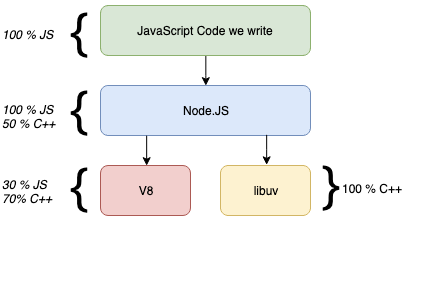

## Module Implementations
## Node Backed by C++
1. We can check [`pbkdf2`](https://github.com/nodejs/node/blob/master/lib/internal/crypto/pbkdf2.js) as referecne.
1. NodeJS uses `.binding` method to connect JavaScript to C++.
    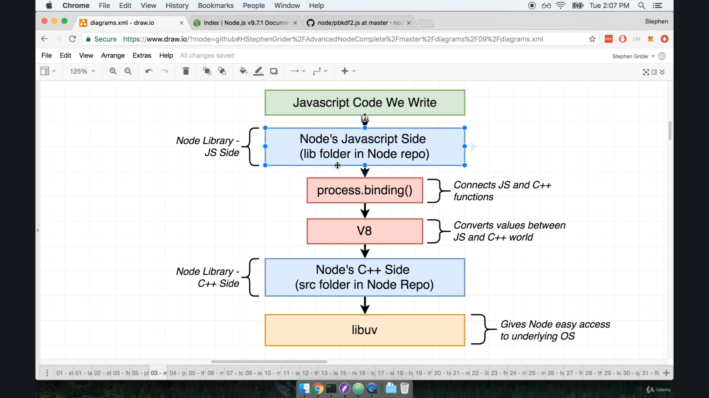

## The Basics of Threads
1. When we run a program on computer, the computer starts a "**process**" which is an instance of running program.
1. In each process, we may have single or multiple threads which stores tasks as a list of to-do list which will be executed by computer CPU. 
1. In the system, "OS scheduler" decides which threads should be processes in different order according to priority, weight, or other factors. 
1. This is crucial to program execution, as poor schedular may cause poor user experience such as not moving mouse cursor or inreactive keyboard pressing. 
    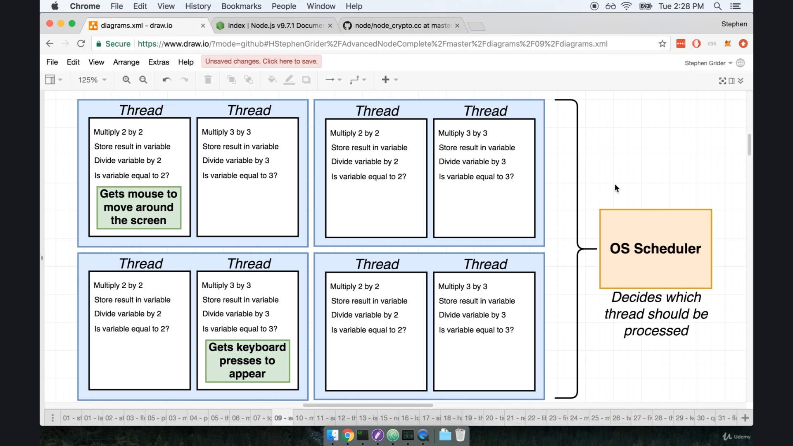
1. To execute multiple threads, we can either increase number of cores of CPU. Technically, a CPU core may process multiple threads at the same time which is called "multi-threading" or "hyper-threading".
1. The other approach is to look into the works handled by each thread. 
1. For example, while thread 1 is reading and waiting the data from the hard-drive, the CPU can execute task in thread 2 rather than being idle and do nothing.
    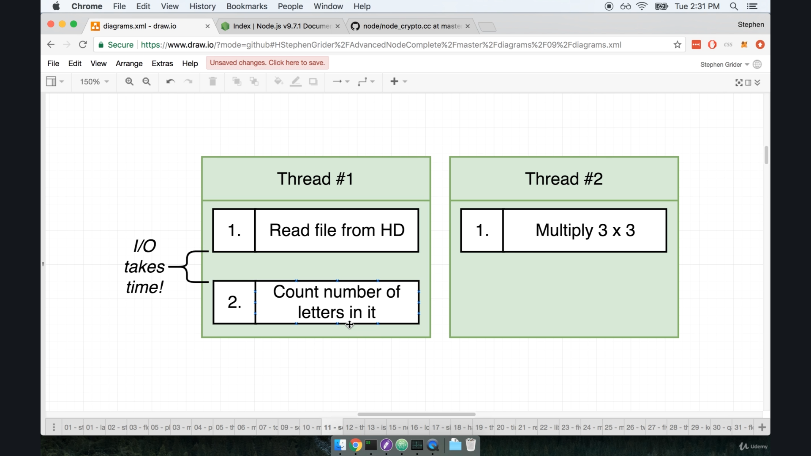

## The Node Event Loop
1. When using NodeJS, it creates a thread when it starts up and use event loop to handle all the tasks in the single thread. The program performance is affected by how the event loop works in NodeJS.
1. For example, we can use the following pseudo code to mock the behavior of event loop.
1. The "**event loop**" is like a `while` loop which check certain conditions to check whether to execute the next iteration or stop. 
    ```js
    // node myFile.js

    myFile.runContents(); // some function to wrong

    function shouldContinue() { // helper function to check

    }

    // Entire body executes in one 'tick'
    while(shouldContinue()) {

    }

    // exit back to terminal
    ```

## The Event Loop Implementation
1. The event loop keeps checking if there's any tasks left in the array to execute. 
    ```js
    // node myFile.js

    const pendingTimers = [];
    const pendingOSTasks = [];
    const pendingOperations = [];

    // New timers, tasks, operations are recorded from myFile running
    myFile.runContents();

    function shouldContinue() {
        // Check one: Any pending setTimeout, setInterval, setImmediate?
        // Check two: Any pending OS tasks? (Like server listening to port)
        // Check three: Any pending long running operations? (Like fs module)
        return pendingTimers.length || pendingOSTasks.length || pendingOperations.length;
    }

    // Entire body executes in one 'tick'
    while (shouldContinue()) {

    }

    // exit back to terminal
    ```

## Event Loop Ticks
1. When the program executes, Node runs event loop in the following order. 
    ```js
    // node myFile.js

    const pendingTimers = [];
    const pendingOSTasks = [];
    const pendingOperations = [];

    // New timers, tasks, operations are recorded from myFile running
    myFile.runContents();

    function shouldContinue() {
        // Check one: Any pending setTimeout, setInterval, setImmediate?
        // Check two: Any pending OS tasks? (Like server listening to port)
        // Check three: Any pending long running operations? (Like fs module)
        return pendingTimers.length || pendingOSTasks.length || pendingOperations.length;
    }

    // Entire body executes in one 'tick'
    while (shouldContinue()) {
        // 1) Node looks at pendingTimers and sees if any funcitons
        // are ready to be called. setTimeout, setInterval

        // 2) Node looks at pendingOSTasks and pendingOperations
        // and call relavent callbacks

        // 3) Pause execution. Continue when...
        // - a new pendingOSTask is done
        // - a new pendingOperation is done
        // - a timer is about to complete

        // 4) Look at pendingTimers. Call any setImmediate

        // 5) Handle any 'close' events
    }

    // exit back to terminal
    ```

## Is Node Single Threaded?
1. A regular Node "Event Loop" is single threaded. 
1. Some of Node Framework/Std Lib are not single threaded. 
1. For example, we can use `pbkdf2` to benchmark the execution time and check how does NodeJS behave. Note that `pbkdf2` is a standard library comes along with NodeJS, so we can import and use it directly. 
    ```js
    const crypto = require('crypto');

    crypto.pbkdf2('a', 'b', 100000, 512, 'sha512', () => {
        
    });
    ```

## Testing for Single Thread
1. We can use a variable to store the starting time and check with a new timestamp in the callback to learn how much time does the execution take.
1. However, we should be aware that the functions are executed nearly at the same time. 
1. In addition, both the funciton calls refer to the same starting timestamp. 
    ```js
    const crypto = require('crypto');

    const start = Date.now();
    crypto.pbkdf2('a', 'b', 100000, 512, 'sha512', () => {
        console.log('1:', Date.now() - start);
    });

    crypto.pbkdf2('a', 'b', 100000, 512, 'sha512', () => {
        console.log('2:', Date.now() - start);
    });
    ```
1. Note that the function `crypto.pbkdf2` takes around 500ms or 0.5 second to execute which is different from the lecturer. 
1. From the testing result, we can notice both the functions have similar execution duration as result. If NodeJS is truely single threaded, we shall see the 2nd execution delayed about 1 second after the first function executed. 
    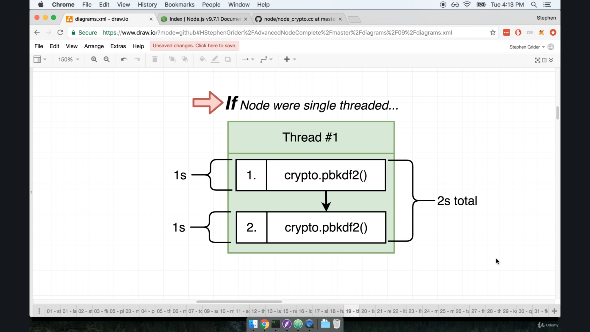
    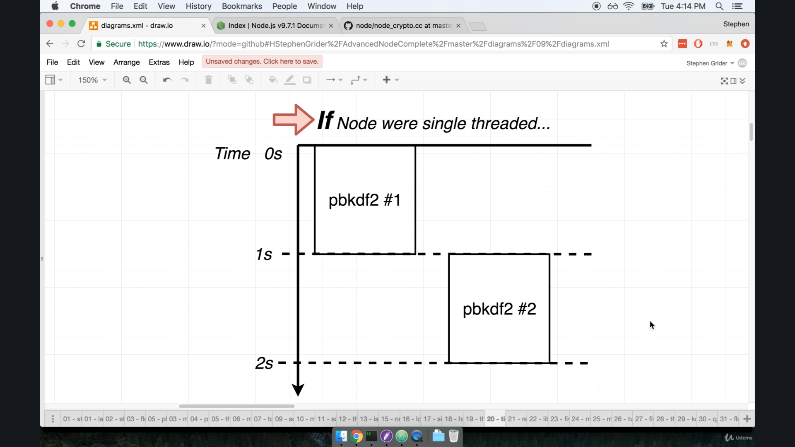
    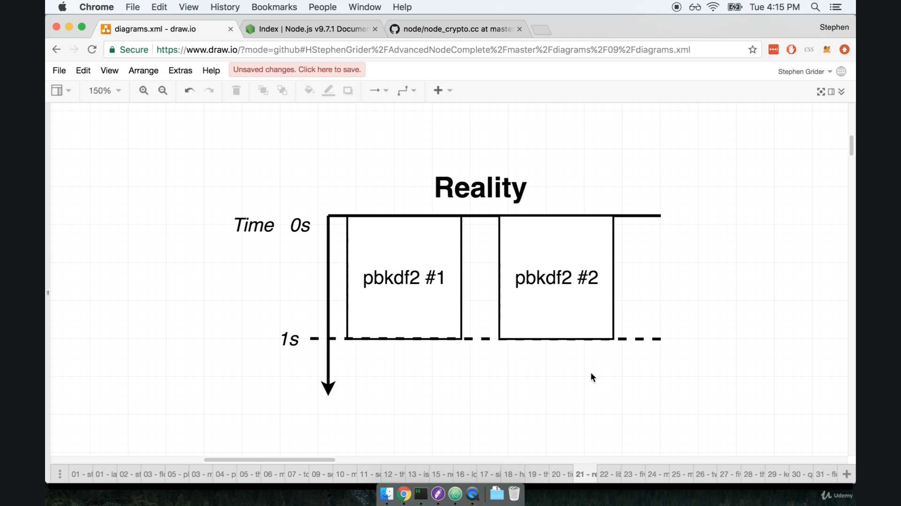

## The Libuv Thread Pool
1. In NodeJS, `libuv` has actually 4 threads in the pool.
    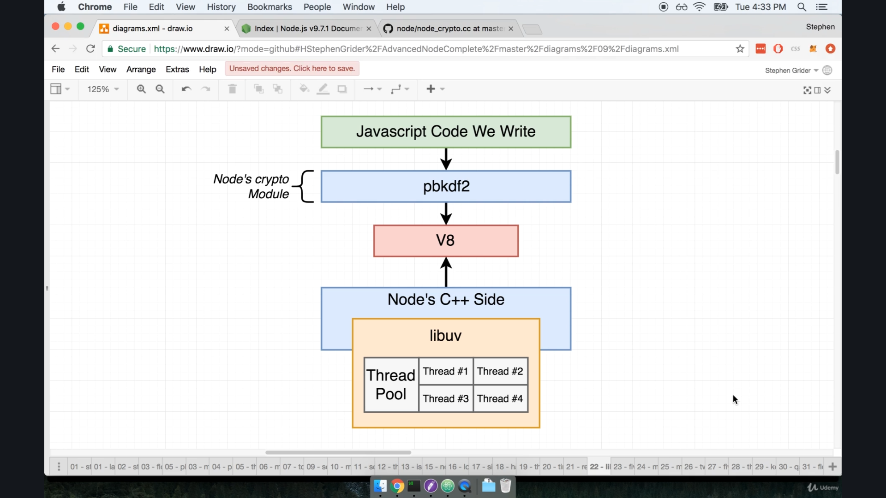

## Threadpools with Multithreading
1. If we duplicate the funciton, we can notice the result that the 5th call of function runs after other functions finish execution.
1. The result also depends on the execution environment of the hardware. For example, the lecturer uses a 2015 Macbook Pro which has dual-core CPU. The first batch takes around twice the time to finish execution, so the 5th call is executed right after the 1st batch.
1. While testing on quad-core CPU, it takes the same execution time to finish the first batch. The 5th call is executed right after it finishes.
1. In addition, number of threads in the thread pool is **4** by default. However, we can modify and configure it for different requirements according to conditions. 
    ```js
    const crypto = require('crypto');

    const start = Date.now();
    crypto.pbkdf2('a', 'b', 100000, 512, 'sha512', () => {
        console.log('1:', Date.now() - start);
    });

    crypto.pbkdf2('a', 'b', 100000, 512, 'sha512', () => {
        console.log('2:', Date.now() - start);
    });

    crypto.pbkdf2('a', 'b', 100000, 512, 'sha512', () => {
        console.log('3:', Date.now() - start);
    });

    crypto.pbkdf2('a', 'b', 100000, 512, 'sha512', () => {
        console.log('4:', Date.now() - start);
    });

    // this runs after the previous 4 calls are done
    crypto.pbkdf2('a', 'b', 100000, 512, 'sha512', () => { 
        console.log('5:', Date.now() - start);
    });
    ```

## Changing Threadpool Size
1. We can change the number of threads in the threadpool with `porcess.env.UV_THREADPOOL_SIZE`.
1. For example, we can change the number of threads to **2**. Therefore, in each batch of execution, only 2 function calls will be executed. Since there are 5 function calls, the execution will be separated into 3 batches.
    ```js
    // set only 2 threads in the threadpool
    process.env.UV_THREADPOOL_SIZE = 2;

    const crypto = require('crypto');

    const start = Date.now();
    crypto.pbkdf2('a', 'b', 100000, 512, 'sha512', () => {
        console.log('1:', Date.now() - start);
    });

    crypto.pbkdf2('a', 'b', 100000, 512, 'sha512', () => {
        console.log('2:', Date.now() - start);
    });

    crypto.pbkdf2('a', 'b', 100000, 512, 'sha512', () => {
        console.log('3:', Date.now() - start);
    });

    crypto.pbkdf2('a', 'b', 100000, 512, 'sha512', () => {
        console.log('4:', Date.now() - start);
    });

    crypto.pbkdf2('a', 'b', 100000, 512, 'sha512', () => {
        console.log('5:', Date.now() - start);
    });
    ```
1. If change the number of threads to 5, the execution time can be executed by the number of cores that the CPU has.
    ```js
    process.env.UV_THREADPOOL_SIZE = 5;

    const crypto = require('crypto');

    const start = Date.now();
    crypto.pbkdf2('a', 'b', 100000, 512, 'sha512', () => {
        console.log('1:', Date.now() - start);
    });

    crypto.pbkdf2('a', 'b', 100000, 512, 'sha512', () => {
        console.log('2:', Date.now() - start);
    });

    crypto.pbkdf2('a', 'b', 100000, 512, 'sha512', () => {
        console.log('3:', Date.now() - start);
    });

    crypto.pbkdf2('a', 'b', 100000, 512, 'sha512', () => {
        console.log('4:', Date.now() - start);
    });

    crypto.pbkdf2('a', 'b', 100000, 512, 'sha512', () => {
        console.log('5:', Date.now() - start);
    });
    ```

## Common Threadpool Questions
1. Can we use the threadpool for JavaScript code or can only NodeJS use it?
    1. We can write custom JS that uses the thread pool.
1. What function in node std library use the threadpool? 
    1. All `fs` module functions. Some crypto stuff. Depends on OS (windows vs unix based)
1. How does this threadpool stuff fit into the event loop?
    1. Tasks running in the threadpool are the `pendingOperations` in our code example. 

## Explaining OS Operations
1. We can use `https` to test and check the responsive duration of requesting to Google website.
1. This function takes around 250ms to finish.
    ```js
    const https = require('https');

    const start = Date.now();

    https.request('https://www.google.com', res => {
        res.on('data', () => { });
        res.on('end', () => {
            console.log(Date.now() - start);
        });
    }).end();
    ```

## Libuv OS Delegation
1. We can wrap the code in a function and execute it multiple times. From the result, we can notice that the functions are executed nearly at the same time.
    ```js
    const https = require('https');

    const start = Date.now();
    function doRequest() {
        https.request('https://www.google.com', res => {
            res.on('data', () => { });
            res.on('end', () => {
                console.log(Date.now() - start);
            });
        }).end();
    }

    doRequest();
    doRequest();
    doRequest();
    doRequest();
    doRequest();
    doRequest();
    doRequest();
    ```
1. In this case, `libuv` actually makes the OS to execute the underlying and low-level execution for HTTP request. Therefore, making HTTP request doesn't touch the threadpool at all, and the tasks are actually handled by the OS, so the event loop is not blocked by HTTP requests.

## OS/Async Common Questions
1. What functions in Node std library use the OS's async features?
    1. Almost everything around networking for all OS's. Some other stuff is OS specific.
1. How does this OS async stuff fit into the event loop?
    1. Tasks using the underlying OS are reflected in our `pendingOSTasks` array.

## Review
1. Execution order
    1. Process and execute code in `index.js` file.
    1. Do we still have work to do? Look at timers, OS tasks, threadpool
    1. Run setTimeout's, setInterval's
    1. Run callbacks for any OS tasks or threadpool tasks that are done. (this is 99% of our code).
    1. Pause and wait for stuff to happen
    1. Run any `setImmediate` functions
    1. Handle close events
    1. Repeat and check from step 2
1. After all the tasks are executed, Node will exit and stop the program
    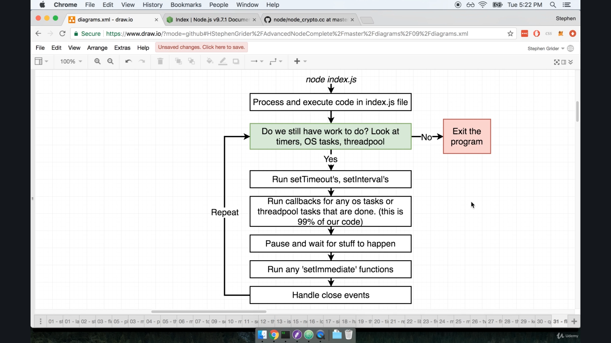

## Crazy Node Behavior
1. We can use the code that have been using previously for to get a hash from `pbkdf2` and HTTP request. Besides, we can use `fs` for file system. 
1. In this case with the following code, we can see the execution order is as the following.
    1. HTTP request 
    1. Hash
    1. File System    
    1. Hash
    1. Hash
    1. Hash
    ```js
    const https = require('https');
    const crypto = require('crypto');
    const fs = require('fs');

    const start = Date.now();

    function doRequest() {
        https.request('https://www.google.com', res => {
            res.on('data', () => { });
            res.on('end', () => {
                console.log(Date.now() - start);
            });
        }).end();
    }

    function doHash() {
        crypto.pbkdf2('a', 'b', 100000, 512, 'sha512', () => {
            console.log('Hash:', Date.now() - start);
        });
    }

    doRequest();

    fs.readFile('multitask.js', 'utf8', () => {
        console.log('FS:', Date.now() - start);
    });

    doHash();
    doHash();
    doHash();
    doHash();
    ```
1. However, if we take all `doHash` functions off, we can notice that the duration to execute funciton for file system is much faster when no hashing functions are called. 
1. The execution time of only file system isn't over 20ms when there's no `doHash` function is called.

## Unexpected Event Loop Events
1. From the previous lectures, we have learned that though several functions are async functions, they are executed by different parts of Node. 
1. For example, "**file system**" module is handled by threadpool, while "**HTTP request**" are handled by local operating system (OS).
    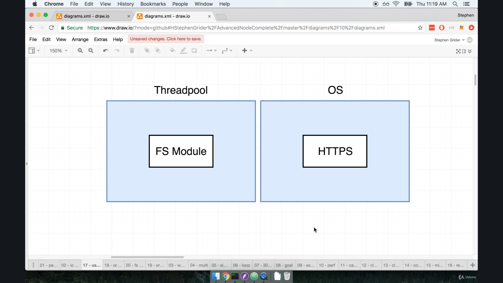
1. When we call `fs.readFile`, Node executes the function by the following order. 
1. To the 3rd and 5th step, Node actually pause and wait response from I/O event and execute other functions in the queue. 
    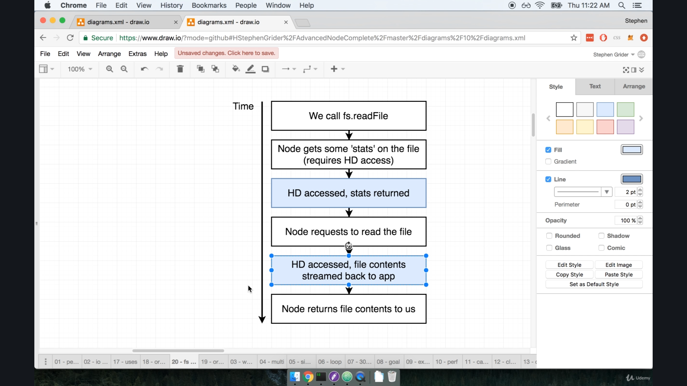
1. When we execute the code, "HTTPS" is the only async function handled by the underlying OS rather than the threadpool. 
1. Therefore, "HTTPS" request is firstly executed and will be printed as soon as when the result is given by underlying OS. We may just understand that "HTTPS" function is out of threadpool. 
1. As the default number of threads in the threadpool is 4, 4 threads will take from FS function to following hashing function and leave 1 unhandled.
1. While FS module proceed to I/O part, it consider to pause to wait response from the harddrive and release the thread to proceed the unhandled task. Therefore, the thread which initiates FS function is assigned to execute the only task that is not executed.
1. During the time, at least one of the other threads has finished execution on hashing and is free to continue process for FS function.
    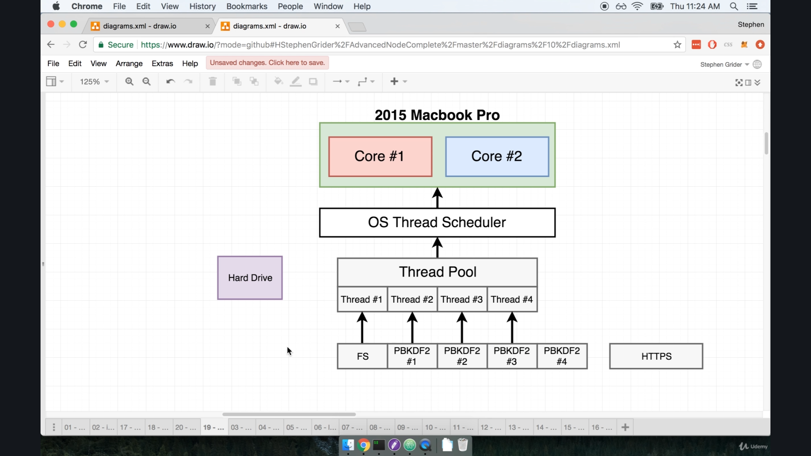
1. Therefore, with the execution order above, we will always see the HTTP request finishes first (as it takes very little time and out of threadpool execution) and have 1 hashing function finishes, so we can have FS function done which followed by other hashing function calls. 
1. In addition, if we configure to have 5 threads in the threadpool, we can notice that the FS function is executed and response at first as there's no handled function left and a single thread can be assigned to execute the FS from the start to the end.
1. On the other hand, if we have only a single thread in the threadpool, FS function will be executed only after all other functions are hanlded, so it will finish execution as the very last one.

# Enhancing Node Performance
## Enhancing Performance
1. We can enhance NodeJS server in 2 ways, "Cluster" mode or "Worker Threads".
1. Cluster mode is to duplicate the Node instance which can provide use multiple event loops and hence increase the number of threads for processing. 
1. Worker threads is a more experimental appraoch that the lecturer recommends to look into and start with "cluster mode". 

## Express Setup
```js
const express = require('express');
const app = express();

app.get('/', (req, res) => {
    res.send('Hi there');
});

app.listen(3000);
```

## Blocking the Event Loop
1. In this case, we can create a function which takes duration to execute the function.
1. For example, we pass "5000", which is 5000ms or 5 seconds that the user can only get the response from server after 5 seconds.
1. Function `doWork` is occupying the event loop and prevent the server from proceeding any other tasks.
    ```js
    const express = require('express');
    const app = express();

    function doWork(duration) {
        const start = Date.now();
        while (Date.now() - start < duration) {}
    }

    app.get('/', (req, res) => {
        doWork(5000); // process in event loop
        res.send('Hi there');
    });

    app.listen(3000);
    ```
1. If we have multiple requests from different browers or users, the server can only handle one request at a time, so it wouldn't be responsive. 
1. For example, the 2nd request will only get the response after 1st request is fulfilled. It may take 10 seconds to get the response. 

## Clustering in Theory
1. To apply clusters, we shall have at least 1 cluster manager which handles multiple single threaded node server. 
    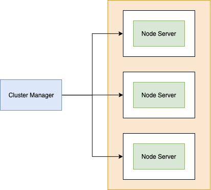
1. In regular conditions, we run `node index.js` to start the server in the terminal and has a single node instance working with one event loop. 
1. When we use cluster manager, it uses `cluster` module from Node standard library. Besides, the cluster manager use `cluster.fork()` method to create worker instance which is a node instance that respond to requests to the server. 

## Forking Children
1. We can use `cluster` in Node JS and use `cluster.isMaster` method to check whether the execution is in master mode.
1. If we simply execute and print the result from `cluster.isMaster`, we will get `true` as the result. 
    ```js
    const cluster = require('cluster');
    console.log(cluster.isMaster); // true
    ```
1. Therefore, we can use `if` statement to check whether the execution is in master mode to decide whether to `fork` a child (slave) instance.
1. In this case, if the instance is a child, we simply execute the instance as a regular express server.
    ```js
    const cluster = require('cluster');

    // console.log(cluster.isMaster);

    // Is the file being executed in master mode?
    if (cluster.isMaster) {
        // Cause index.js to be executed *again* but 
        // in child (slave) mode
        cluster.fork();
    } else {
        // I'm a child, I'm going to act like a server
        // and do nothing else
        const express = require('express');
        const app = express();

        function doWork(duration) {
            const start = Date.now();
            while (Date.now() - start < duration) {}
        }

        app.get('/', (req, res) => {
            doWork(5000); // process in event loop
            res.send('Hi there');
        });

        app.listen(3000);
    }
    ```

## Clustering in Action
1. We create another route `/fast` in the server which simply responds some text.
1. If we executes `cluster.fork()` multiple times, we may get several NodeJS worker instance as different servers.
1. When there are 1 request to `/` and 1 to `/fast` at the same time, we can notice the resolving time on `/fast` route is almost instant, while the root route `/` takes 5 seconds as its configuration. 
1. However, if we have only 1 single worker instance by calling `cluster.fork()` only once, we will notice the requests are queued up. The resolving time on `/fast` is increased to nearly 5 seconds. 
    ```js
    const cluster = require('cluster');

    // Is the file being executed in master mode?
    if (cluster.isMaster) {
        // Cause index.js to be executed *again* but 
        // in child (slave) mode
        cluster.fork();
        // cluster.fork();
        // cluster.fork();
        // cluster.fork();
    } else {
        // I'm a child, I'm going to act like a server
        // and do nothing else
        const express = require('express');
        const app = express();

        function doWork(duration) {
            const start = Date.now();
            while (Date.now() - start < duration) {}
        }

        app.get('/', (req, res) => {
            doWork(5000); // process in event loop
            res.send('Hi there');
        });

        app.get('/fast', (req, res) => {
            res.send('This was fast');
        });

        app.listen(3000);
    }
    ```

## Benchmarking Server Performance
1. Though we can create multiple worker instances by calling `cluster.fork()`, it doesn't promise the server can process the requests fast and smooth. 
1. On MacOS or Linux, we can use apache benchmark by `ab -c 50 -n 500 localhost:3000/fast` which means to make 50 concurrent requests to `localhost:3000/fast` 500 times. 
1. The terminal will then show the benchmark of the execution results. 
    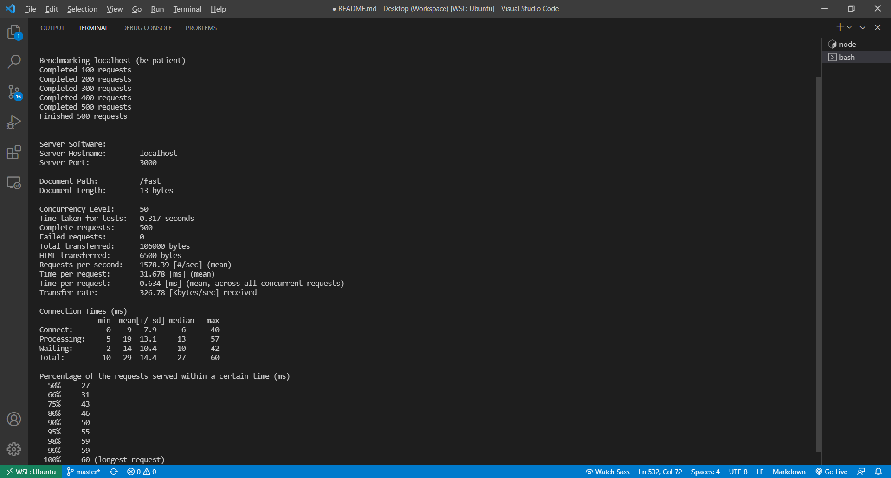

## Benchmark Refactor
1. In this case, we refactor `index.js` and have only one worker instance and use `crypto` library to do hashing.
1. Besides, we can use `process.env.UV_THREADPOOL_SIZE` to force all instances have only single thread in the threadpool. Note that every instance has 4 threads in their threadpool by default.
    ```js
    process.env.UV_THREADPOOL_SIZE = 1; // ensure all instances have only one single thread
    const cluster = require('cluster');

    // Is the file being executed in master mode?
    if (cluster.isMaster) {
        // Cause index.js to be executed *again* but 
        // in child (slave) mode
        cluster.fork();
    } else {
        // I'm a child, I'm going to act like a server
        // and do nothing else
        const express = require('express');
        const crypto = require('crypto');
        const app = express();

        app.get('/', (req, res) => {
            crypto.pbkdf2('a', 'b', 100000, 512, 'sha512', () => {
                res.send('Hi there');
            });
        });

        app.get('/fast', (req, res) => {
            res.send('This was fast');
        });

        app.listen(3000);
    }
    ```

## Need More Children
1. We can start the server with `node index.js` in the terminal and open another terminal window and use `ab -c 1 -n 1 localhost:3000/` which request to the root route. The result is about 0.5 second (though it's 1.1 seconds from the lecture. This number can vary by the machine running the function).
    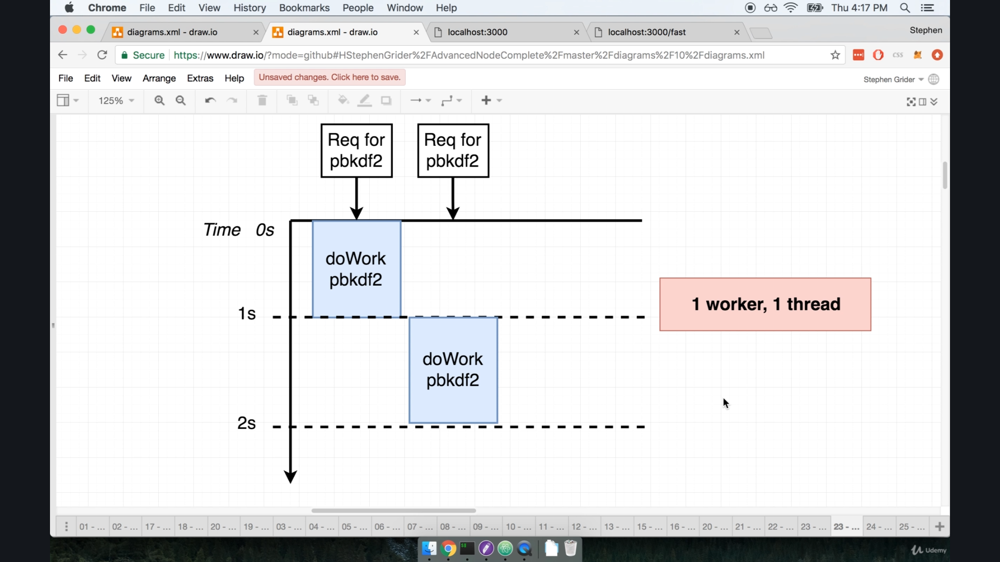
1. In addition, it's suggested to give the root path `/` as part of the URL. 
1. We then modify the request to make 2 requests to the server concurrently and check the performance. The command is `ab -c 2 -n 2 localhost:3000/`. 
1. In this case, we may notice the execution takes around 2 seconds because each function call takes 1 second to finish and is executed in queue. 
1. If we fork twice to have 2 worker instances, we can execute the functions in parallel, so it only takes around 1 second to finish 2 function calls. 
1. Note that when learning this lecture the machine I used is with Intel Core i7 - 8th Gen. which is a 6-core CPU. It provides a very different result from the performance from the lecture which used dual-core CPU. 
    ```js
    // handling 2 concurrent requests at the same time
    // 2 worker instances which has single thread
    process.env.UV_THREADPOOL_SIZE = 1;
    const cluster = require('cluster');
    if (cluster.isMaster) {
        cluster.fork();
        cluster.fork();
    }
    ```
    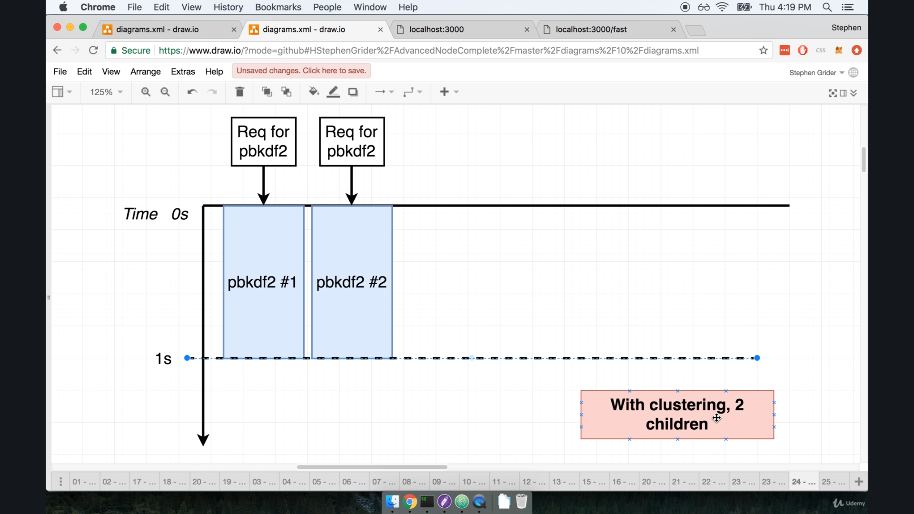
1. However, only replicating worker instance isn't the solution to improve performance due to hardware limitation. For example, on the dual-core machine, we can replicate 6 instances and have 6 concurrent requests. From the lecture, it takes 3.5 seconds to resolve all requests. It is significantly slower than regular process. Therefore, only adding the worker instance can't handle the high traffic with multiple concurrent requests. Such feature can even slow down all the requests and give very poor experience. 
1. This is mainly because all the functions calls are started and respond at the same time according to the worker instance as we set configure the server to handle 6 requests at the same time, while the hardware couldn't support such feature. Therefore, the results of all requests can be responded only after all the functions are executed. 
    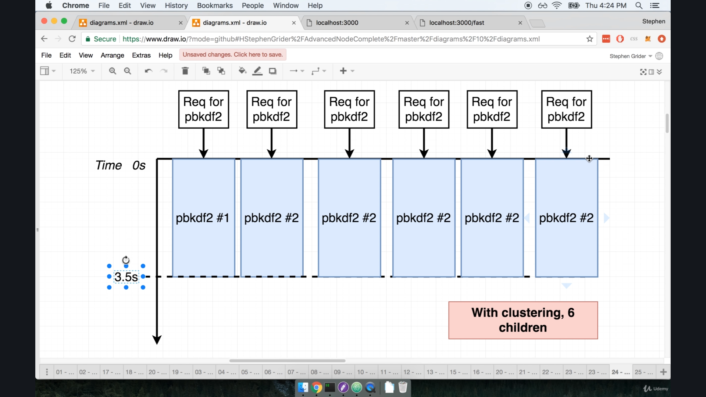
1. On the other hand, if we reduce the instances to only 2, can notice the requests can be fulfilled by every 1 second when the function is executed. As the machine has dual-core CPU, it can resolve 2 requests at the same time and respond the results. The machine can resolve 2 requests at once as batches, which provides a better experience that the 6 requests will receive 2 responses at once for 3 times. 
    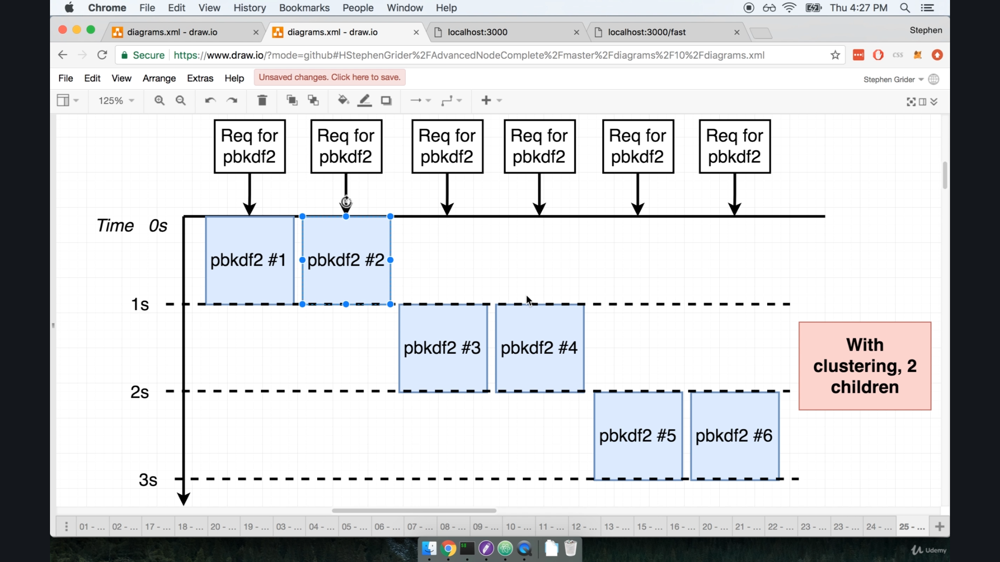
1. Therefore, it's suggested to create instances to match up the number of physical or logical cores of the machine runs the program. 

## PM2 Installation
1. In real-practice, we can use [`PM2`](https://github.com/unitech/pm2) which is a process manager to help us handle the traffic. 
1. To use the software, we can use `npm install -g pm2` to install it globally on the machine.

## PM2 Configuration
1. We rewrite the server code before we start using `pm2`. Since we use the software for process management, we can remove the cluster related functions and let `pm2` manage it. 
    ```js
    const express = require('express');
    const crypto = require('crypto');
    const app = express();

    app.get('/', (req, res) => {
        crypto.pbkdf2('a', 'b', 100000, 512, 'sha512', () => {
            res.send('Hi there');
        });
    });

    app.get('/fast', (req, res) => {
        res.send('This was fast');
    });

    app.listen(3000);
    ```
1. To start a server and manage process with `pm2`, we can use `pm2 start [app] -i [number_instance]`. We can simply give `0` or `max` for the number of instance we want to create. `pm2` will detect the hardware of local machine and create instances at the maximum that the machine can handle. 
1. Note that `pm2` detects the number of "logical cores" rather than "physical cores". For example, the dual-core Intel i5 Macbook pro has dual-core CPU which has 2 threads on each, so it's 4 logical cores in total, while the Intel i7 is a 6-core CPU has 11 logical cores can be used.
1. We can find the command at "Usage" section in `pm2` [documentation](https://pm2.keymetrics.io/docs/usage/cluster-mode/).
1. To stop the `pm2` instances, we can use `pm2 delete [app]`.
1. We may use commands to monitor and manage `pm2` instances.
    1. `pm2 list` shows the list of instances running and managed by `pm2`.
    1. `pm2 show index` shows the status and conditions in details of each instance.
    1. `pm2 monit` shows a dashboard which we can check the logs of each instance.
    1. `pm2 delete [app]` can kill the process from the group of instances. We can check [here](https://pm2.keymetrics.io/docs/usage/process-management/) for other process management commands.
1. `pm2` is usually used in production servers and is rarely used in development environment.

## Webworker Threads
1. This section is about `worker threads` which at the time is still an experimental feature on NodeJS, and an additional option to be used to improve NodeJS performance besides using Node "Cluster Mode".
1. In this case, we use another package `webworker-threads` to work on the project. 
1. We simply use `npm install --save webworker-threads` to install the package.
1. `webworker-threads` npm module can't be installed in WSL1 in windows 10. The testing trail is made in Goorm IDE.However, the hardware is a single-core virtual machine hosted on AWS.

## Worker Threads in Actions
1. One scenario to use worker threads is to separate workload from heavy duty business logic into multiple event loops.
1. We remvoe the `pbkdf2` hashing function and creates a counter which counts from 0 to 10 to the power of 9, which represents as `1e9`. 
    ```js
    // index.js
    const express = require('express');
    const crypto = require('crypto');
    const app = express();
    const Worker = require('webworker-threads').Worker;

    app.get('/', (req, res) => {
        const worker = new Worker(function() {
            // this refers to the working thread, so we can't use arrow function
            this.onmessage = function() {
                let counter = 0;
                while (counter < 1e9) {
                    counter++;
                }
                
                postMessage(counter);
            };
        });
        
        worker.onmessage = function(myCounter) {
            console.log(myCounter);
        }
        
        worker.postMessage();
    });

    app.get('/fast', (req, res) => {
        res.send('This was fast');
    });

    app.listen(3000);
    ```

## Benchmarking Workers
1. We can show the result from the requests to the server. In this case, we can use `ab -c 2 -n 2 http://localhost:3000` to make 2 concurrent requests.
1. However, using the machine from free tier on Goorm IDE couldn't show the benefits from distributing workload to multiple threads, as it has very limited hardware resource to compute and handle the requests.
    ```js
    const express = require('express');
    const crypto = require('crypto');
    const app = express();
    const Worker = require('webworker-threads').Worker;

    app.get('/', (req, res) => {
        const worker = new Worker(function() {
            // this refers to the working thread, so we can't use arrow function
            this.onmessage = function() {
                let counter = 0;
                while (counter < 1e9) {
                    counter++;
                }
                
                postMessage(counter);
            };
        });
        
        worker.onmessage = function(message) {
            console.log(message.data);
            res.send('' + message.data);
        }
        
        worker.postMessage();
    });

    app.get('/fast', (req, res) => {
        res.send('This was fast');
    });

    app.listen(3000);
    ```

# Project setup
## The next phase
1. We will clone an existing NodeJS app with basic routing and auth setup.
1. We then add several features to have a solid, production ready app.
    1. Redis-Backed Caching
    1. Browser Based Integration Testing
    1. Continuous Integration Setup
    1. Scalable File/Image Upload
## Project Walkthrough