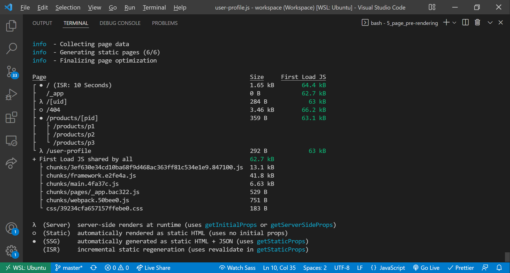

Started: 2022/01/11
- [1. React Refresher](#1-react-refresher)
  - [1.1. What is ReactJS, Demo, React Alternatives, Creating new React Project, and Setting up a code editor](#11-what-is-reactjs-demo-react-alternatives-creating-new-react-project-and-setting-up-a-code-editor)
  - [1.2. Diving into the created project](#12-diving-into-the-created-project)
  - [1.3. How React works and understanding components](#13-how-react-works-and-understanding-components)
  - [1.4. More component works and styling with CSS classes](#14-more-component-works-and-styling-with-css-classes)
  - [1.5. Building and re-using components](#15-building-and-re-using-components)
  - [1.6. Passing Data with Props and dynamic content](#16-passing-data-with-props-and-dynamic-content)
  - [1.7. Handling events](#17-handling-events)
  - [1.8. Adding more components](#18-adding-more-components)
  - [1.9. Introducing State](#19-introducing-state)
  - [1.10. Working with "Event Props"](#110-working-with-event-props)
  - [1.11. Adding Routing](#111-adding-routing)
  - [1.12. Adding links and navigation](#112-adding-links-and-navigation)
  - [1.13. Scoping component styles with CSS modules](#113-scoping-component-styles-with-css-modules)
  - [1.14. Outputting lists of data and components](#114-outputting-lists-of-data-and-components)
  - [1.15. Adding even more components](#115-adding-even-more-components)
  - [1.16. Creating "wrapper" components](#116-creating-wrapper-components)
  - [1.17. Working with forms](#117-working-with-forms)
  - [1.18. Getting user input and handling form submission](#118-getting-user-input-and-handling-form-submission)
  - [1.19. Preparing the App for Http requests and adding a backend](#119-preparing-the-app-for-http-requests-and-adding-a-backend)
  - [1.20. Sending a POST Http Request](#120-sending-a-post-http-request)
  - [1.21. Navigating programmatically](#121-navigating-programmatically)
  - [1.22. Getting started with fetching data](#122-getting-started-with-fetching-data)
  - [1.23. Using the "useEffect" hook](#123-using-the-useeffect-hook)
  - [1.24. Introducing React context](#124-introducing-react-context)
  - [1.25. Updating state based on previous state](#125-updating-state-based-on-previous-state)
  - [1.26. Using context in components](#126-using-context-in-components)
  - [1.27. More context usage](#127-more-context-usage)
- [2. Pages and File-based Routing](#2-pages-and-file-based-routing)
  - [2.1. Starting setup](#21-starting-setup)
  - [2.2. What is 'File-based Routing'? And why is it helpful?](#22-what-is-file-based-routing-and-why-is-it-helpful)
  - [2.3. Adding a first page](#23-adding-a-first-page)
  - [2.4. Adding a Named/Static route file](#24-adding-a-namedstatic-route-file)
  - [2.5. Working with Nested Paths and Routes](#25-working-with-nested-paths-and-routes)
  - [2.6. Adding dynamic paths and routes](#26-adding-dynamic-paths-and-routes)
  - [2.7. Extracting dynamic path segmentdata (dynamic routes)](#27-extracting-dynamic-path-segmentdata-dynamic-routes)
  - [2.8. Building nested dynamic routes and paths](#28-building-nested-dynamic-routes-and-paths)
  - [2.9. Adding catch-all routes](#29-adding-catch-all-routes)
  - [2.10. Navigating with the 'Link' component](#210-navigating-with-the-link-component)
  - [2.11. Navigating to dynamic routes](#211-navigating-to-dynamic-routes)
  - [2.12. A different way of setting link hrefs](#212-a-different-way-of-setting-link-hrefs)
  - [2.13. Navigating programmatically](#213-navigating-programmatically)
  - [2.14. Adding a custom 404 page](#214-adding-a-custom-404-page)
- [3. Project Time: Working with File-based Routing](#3-project-time-working-with-file-based-routing)
  - [3.1. Planning the project](#31-planning-the-project)
  - [3.2. Setting up the main pages](#32-setting-up-the-main-pages)
  - [3.3. Adding dummy data and static files](#33-adding-dummy-data-and-static-files)
  - [3.4. Adding regular react components](#34-adding-regular-react-components)
  - [3.5. Adding more react components and connecting components](#35-adding-more-react-components-and-connecting-components)
  - [3.6. Styling components in Next.js projects](#36-styling-components-in-nextjs-projects)
  - [3.7. Adding buttons and icons](#37-adding-buttons-and-icons)
  - [3.8. Adding the 'Event Detail' page (dynamic route)](#38-adding-the-event-detail-page-dynamic-route)
  - [3.9. Adding a general layout wrapper component](#39-adding-a-general-layout-wrapper-component)
  - [3.10. Working on the 'All Events' page](#310-working-on-the-all-events-page)
  - [3.11. Adding a filter form for filtering events](#311-adding-a-filter-form-for-filtering-events)
  - [3.12. Navigating to the 'Filtered Events' page programmatically](#312-navigating-to-the-filtered-events-page-programmatically)
  - [3.13. Extracting data on the catch-all page](#313-extracting-data-on-the-catch-all-page)
  - [3.14. Final steps](#314-final-steps)
- [4. Page Pre-Rendering and Data Fetching](#4-page-pre-rendering-and-data-fetching)
  - [4.1. The problem with traditional React Apps (and Data fetching)](#41-the-problem-with-traditional-react-apps-and-data-fetching)
  - [4.2. How Next.js prepares and pre-render pages](#42-how-nextjs-prepares-and-pre-render-pages)
  - [4.3. Introducing static generation with "getStaticProps"](#43-introducing-static-generation-with-getstaticprops)
  - [4.4. NextJS pre-renders by default](#44-nextjs-pre-renders-by-default)
  - [4.5. Adding "getStaticProps" to pages](#45-adding-getstaticprops-to-pages)
  - [4.6. Running server-side code and using the file system](#46-running-server-side-code-and-using-the-file-system)
  - [4.7. Look Behind the Scenes](#47-look-behind-the-scenes)
  - [4.8. Utilizing incremental static generation (ISR)](#48-utilizing-incremental-static-generation-isr)
  - [4.9. ISR: A look behind the scenes](#49-isr-a-look-behind-the-scenes)
  - [4.10. A closer look at "getStaticProps" and Configuration Options](#410-a-closer-look-at-getstaticprops-and-configuration-options)
  - [4.11. Working with dynamic parameters](#411-working-with-dynamic-parameters)
  - [4.12. Introducing "getStaticPaths" for dynamic pages](#412-introducing-getstaticpaths-for-dynamic-pages)
  - [4.13. Using getStaticPaths](#413-using-getstaticpaths)
  - [4.14. "getStaticPaths" and link prefetching: Behind the scenes](#414-getstaticpaths-and-link-prefetching-behind-the-scenes)
  - [4.15. Working with fallback pages](#415-working-with-fallback-pages)
  - [4.16. Loading paths dynamically](#416-loading-paths-dynamically)
  - [4.17. Fallback page and "Not found" page](#417-fallback-page-and-not-found-page)
  - [4.18. Intrducing "getServerSideProps" for server-side rendering (SSR)](#418-intrducing-getserversideprops-for-server-side-rendering-ssr)
  - [4.19. Using "getServerSideProps"](#419-using-getserversideprops)
  - [4.20. 'getServerSide' props and its Context](#420-getserverside-props-and-its-context)
  - [4.21. Dynamic pages and 'getServerSideProps'](#421-dynamic-pages-and-getserversideprops)
  - [4.22. 'getServerSideProps' behide the scenes](#422-getserversideprops-behide-the-scenes)
  - [4.23. Introducing client-side data fetching (And when to use it)](#423-introducing-client-side-data-fetching-and-when-to-use-it)
  - [4.24. Implementing client-side data fetching](#424-implementing-client-side-data-fetching)
  - [4.25. Using the 'useSWR' NextJS hook](#425-using-the-useswr-nextjs-hook)
  - [4.26. Combining pre-fetching with client-side fetching](#426-combining-pre-fetching-with-client-side-fetching)
- [5. Adding Authentication](#5-adding-authentication)

---

# 1. React Refresher
## 1.1. What is ReactJS, Demo, React Alternatives, Creating new React Project, and Setting up a code editor
1. React is a client-side Javascript library to build user interface.
2. Mobile and desktop apps are very "reactive". Things happen instantly that you don't need to wait for new pages to load or actions to start.
3. React.js is a lean and focused component-based UI library. Certain featuers (e.g. routing) are added via community packages.
4. `npx create-react-app [my-app]` to create a React with Node.js.
5. `Prettier` is the VS Code extension that is recommended to use in the course.

## 1.2. Diving into the created project
1. We can start a clean React project to remove all the code in `src/index.css`. Besides, we configure both `src/App.js` and `src/index.js`.
   ```js
   // index.js
   import React from 'react';
   import ReactDOM from 'react-dom';

   import './index.css';
   import App from './App';

   ReactDOM.render(<App />, document.getElementById('root'));

   // App.js
   function App() {
     return <div>Hello World!</div>;
   }

   export default App;
   ```

## 1.3. How React works and understanding components
1. A React component is using "JSX" syntax which is a combination of HTML and Javascript. 
2. A functional React component should render JSX elements by default on the screen.

## 1.4. More component works and styling with CSS classes
1. React components will be compiled to regular Javascript. 
2. Thus, though JSX is similar to HTML syntax, we need to use the property name in Javascript such as `className` when we select the DOM. 
    ```js
    function App() {
      return (
        <div>
          <h1>My Todos</h1>
          <div className="card">
            <h2>TITLE</h2>
            <div className="actions">
              <button className="btn">Delete</button>
            </div>
          </div>
        </div>
      );
    }

    export default App;
    ```

## 1.5. Building and re-using components
1. Besides replicating similar codes, we can create components.
2. In convention, we can create `components` folder in `src` to keep the components. Besides, the naming is with a capital letter at the start. This helps to separate the functions and components when importing the code.
3. To use a component, we can use it as a customized HTML tag or have it as self-closing tag.
4. We can import and use the same component more than once.
    ```js
    // src/components/Todo.js
    function Todo() {
      return (
        <div className="card">
          <h2>TITLE</h2>
          <div className="actions">
            <button className="btn">Delete</button>
          </div>
        </div>
      );
    }

    export default Todo;

    // src/App.js
    import Todo from './components/Todo';

    function App() {
      return (
        <div>
          <h1>My Todos</h1>
          <Todo />
        </div>
      );
    }

    export default App;
    ```

## 1.6. Passing Data with Props and dynamic content
1. Similar to using functions that we can pass parameters to work with functions, we can pass `props` to React components from the parent node.
2. In the previous example, we can pass `text` as props to `Todo` component to have customized content in the child (Todo) component.
3. In JSX, we can use curly braces to wrap Javascript code to run it as expression.
    ```js
    // src/components/Todo.js
    function Todo(props) {
      return (
        <div className="card">
          <h2>{props.text}</h2>
          <div className="actions">
            <button className="btn">Delete</button>
          </div>
        </div>
      );
    }

    export default Todo;
    ```

## 1.7. Handling events
1. When assigning an event handler, we don't want to execute the function when the code starts up. 
2. Therefore, we can simply put the function there as a pointer. When the user clicks on the button, the assigned function will handle the "click" event.
    ```js
    // src/components/Todo.js
    function Todo(props) {
      function deleteHandler() {
        console.log('Clicked');
        console.log(props.text);
      }

      return (
        <div className="card">
          <h2>{props.text}</h2>
          <div className="actions">
            <button className="btn" onClick={deleteHandler}>Delete</button>
          </div>
        </div>
      );
    }

    export default Todo;
    ```

## 1.8. Adding more components
1. In general, we'd like to keep every component and its JSX as simple as possible.
2. However, we now have another issue that the components are static without state.
3. For example, when `App` loads up, `Modal` is loaded and cover the page as well which isn't an ideal behavior for user experience.
```js
// src/components/Modal.js
function Modal() {
  return (
    <div className="modal">
      <p>Are you sure?</p>
      <button className="btn btn--alt">Cancel</button>
      <button className="btn">Confirm</button>
    </div>
  );
}

export default Modal;

// src/components/Backdrop.js
function Backdrop() {
  return (
    <div className="backdrop"/>
  );
}

export default Backdrop;

// src/App.js
import Todo from './components/Todo';
import Modal from './components/Modal';
import Backdrop from './components/Backdrop';

function App() {
  return (
    <div>
      <h1>My Todos</h1>
      <Todo text="Learn React" />
      <Todo text="Master React" />
      <Todo text="Explore the full React course" />
      <Modal />
      <Backdrop />
    </div>
  )
}

export default App;
```

## 1.9. Introducing State
1. In this case, the `Modal` should only shows up when the user click the "delete" button on a task in the Todo list.
2. Therefore, we can use `state` to control the behavior of components.
3. `useState` hook will always return an array of 2 variables.
   1. The state itself
   2. A function to set/change the state
4. Besides, we can pass a value (in any data type) as the initial value of the state.
5. We can use tenary expression to show `Modal` component only when `modalIsOpen` is `true`.
6. In addition, we can use AND `&&` operator to check and Javascript will return the 2nd value if both the values are "**truthy**".
    ```js
    // src/components/Todo.js
    import { useState } from 'rect';

    import Modal from './Modal';
    import Backdrop from './Backdrop';

    function Todo(props) {
      // react hook that can only be used in React functional components
      const [ modalIsOpen, setModalIsOpen ] = useState(false);

      function deleteHandler() {
        setModalIsOpen(true);
      }

      return (
        <div className="card">
          <h2>{props.text}</h2>
          <div className="actions">
            <button className="btn" onClick={deleteHandler}>Delete</button>
          </div>
          { modalIsOpen ? <Modal /> : null }
          { modalIsOpen && <Backdrop /> }
        </div>
      );
    }

    export default Todo;
    ```

## 1.10. Working with "Event Props"
1. To work with customize components, we can't put event handler to work on it direclty.
2. We need to access the component and handle events from its `props`.
3. Note that the event passing from the parent component can be customized.
4. For example, we can change the event to `onCancel` when in `Todo`, while in `Backdrop`, we can listen to `onCancel` event from `props` and pass to a regular HTML tag.
    ```js
    // src/components/Todo.js
    import { useState } from 'rect';

    import Modal from './Modal';
    import Backdrop from './Backdrop';

    function Todo(props) {
      // react hook that can only be used in React functional components
      const [ modalIsOpen, setModalIsOpen ] = useState(false);

      function deleteHandler() {
        setModalIsOpen(true);
      }

      function closeModalHandler() {
        setModalIsOpen(false);
      }

      return (
        <div className="card">
          <h2>{props.text}</h2>
          <div className="actions">
            <button className="btn" onClick={deleteHandler}>Delete</button>
          </div>
          { modalIsOpen ? <Modal /> : null }
          { modalIsOpen && <Backdrop onCancel={closeModalHandler} /> }
        </div>
      );
    }

    export default Todo;

    // src/components/Backdrop.js
    function Backdrop(props) {
      return <div onClick={props.onCancel} className="backdrop" />
    }

    export default Backdrop;

    // src/components/Modal.js
    function Modal(props) {
      function cancelHandler() {
        props.onCancel();
      }

      function confirmHandler() {
        props.onConfirm();
      }

      return (
        <div className="modal">
          <p>Are you sure?</p>
          <button className="btn btn--alt" onClick={cancelHandler}>Cancel</button>
          <button className="btn" onClick={confirmHandler}>Confirm</button>
        </div>
      );
    }
    ```

## 1.11. Adding Routing
1. We clone the code and work in `reactRefresher_routing` in the repo.
2. SPA routing is very different from regular routing or redirect process that the user never really goes to another HTML page but rather changing the elements on the same HTML file.
3. However, the URL in the search bar does change and when the user type in certain URL, the framework with the routing library is smart enough to render the components on the specific route.
4. In convention, we can have `pages` folder to keep the components on different routes which is similar to `components` to keep the reusable components.
5. In this case, we create 3 main page components, `AllMeetups`, `Favorites`, and `NewMeetups`.
6. For browser routing, we can import `{BrowserRouter}` from `react-router-dom`. Note that we use version 5 in this case. We then wrap the `App` component with `BrowserRouter`.
   ```js
   import React from 'react';
   import ReactDOM from 'react-dom';
   import { BrowserRouter } from 'react-router-dom';

   import './index.css';
   import App from './App';

   ReactDOM.render(
     <BrowserRouter>
       <App />
     </BrowserRouter>,
     document.getElementById('root'),
   );
   ```
7. To install a specific version, we can use `npm install react-router-dom@5`.
8. We then can configure the routes in `App` components.
    ```js
    import { Route } from 'react-router-dom';

    import AllMeetupsPage from './pages/AllMeetups';
    import NewMeetupPage from './pages/NewMeetup';
    import FavoritesPage from './pages/Favorites';

    function App() {
      return (
        <div>
          <Route path="/">
            <AllMeetupsPage />
          </Route>
          <Route path="/new-meetup">
            <NewMeetupPage />
          </Route>
          <Route path="/favorites">
            <FavoritesPage />
          </Route>
        </div>
      );
    }

    export default App;
    ```
9. However, the current setup will show both `AllMeetupsPage` with other components as sub-components. 
10. This is because React router, by default, matches all the routes including the root route `/`. 
11. This feature could be useful in some conditions to have the main component as the wrapper or layer and changing only some parts in the view.
12. To render only a single route and component, we can use `Switch` from `react-router-dom`. 
13. However, this still isn't enough for having the correct match as the route will be checked and if it matches any by the order, React router will render the first match.
14. For example, `/favorites` is part of `/`, and since `/` route is the first item in the list, `AllMeetupsPage` will be rendered. 
15. Therefore, we can either re-order the sequence of routes in the list or give an `exact` attribute to the root route, so `AllMeetupsPage` will only be rendered when the user is on `/`.
16. Note that `exact` can be a standalone attribute, while we can give boolean values as conditions to enable/disable the `exact` route.
    ```js
    // src/App.js
    import { Route, Switch } from 'react-router-dom';

    import AllMeetupsPage from './pages/AllMeetups';
    import NewMeetupPage from './pages/NewMeetup';
    import FavoritesPage from './pages/Favorites';

    function App() {
      return (
        <div>
          <Switch>
            <Route path="/" exact={true}>
              <AllMeetupsPage />
            </Route>
            <Route path="/new-meetup">
              <NewMeetupPage />
            </Route>
            <Route path="/favorites">
              <FavoritesPage />
            </Route>
          </Switch>
        </div>
      );
    }

    export default App;
    ```

## 1.12. Adding links and navigation
1. Though we can use `<a>` tag to navigate between different routes, its default behavior is sending request to the server and request documents and files such as HTML, JS, and CSS to render the page.
2. Since we are using React and creating a SPA, we'd like the user to stay on the same page but changing the browser URL.
3. We can use `Link` component from `react-router-dom` which is similar to `router-link` in Vue.js. This component does navigate the users to different routes without refreshing the page for new files and documents from the server.
    ```js
    // src/components/layout/MainNavigation.js
    import { Link } from 'react-router-dom';

    function MainNavigation() {
      return (
        <header>
          <div>React Meetups</div>
          <nav>
            <ul>
              <li>
                <Link to="/">All Meetups</Link>
              </li>
              <li>
                <Link to="/new-meetup">Add New Meetup</Link>
              </li>
              <li>
                <Link to="/favorites">My Favorites</Link>
              </li>
            </ul>
          </nav>
        </header>
      );
    }

    export default MainNavigation;
    ```

## 1.13. Scoping component styles with CSS modules
1. To scope and limit styling of a CSS file to certain React component, we can name the CSS file with a `module` in the middle as `[file_name].module.css`.
2. We then can import the CSS module to the React component that we want to style.
3. Note that this is a build-in React feature to import CSS module in Javascript with Webpack or the other bundling tools. This can't be used in regular Javascript code.
4. The imported CSS will be a Javascript object which includes all the classes in CSS as its properties.
    ```js
    // src/components/layout/MainNavigation.js
    import { Link } from 'react-router-dom';

    import classes from './MainNavigation.module.css';

    function MainNavigation() {
      return (
        <header className={classes.header}>
          <div>React Meetups</div>
          <nav>
            <ul>
              <li>
                <Link to="/">All Meetups</Link>
              </li>
              <li>
                <Link to="/new-meetup">Add New Meetup</Link>
              </li>
              <li>
                <Link to="/favorites">My Favorites</Link>
              </li>
            </ul>
          </nav>
        </header>
      );
    }

    export default MainNavigation;
    ```

## 1.14. Outputting lists of data and components
1. In React, an array of JSX values can be rendered directly on the screen.
2. Thus, to work with array of data, we can use the built-in Javascript `Array.map` method to work create a list of JSX.
3. The idea is very similar to its coutner part in Vue as `v-for` in the parent tag, while having all the child components nested in the wrapper with `v-for`. 
4. Besides, similar to Vue, each child in the list should have a unique `key` or the engine will make a warning in the deverlop console.
  ```js
  // src/components/AllMeetups.js
  const DUMMY_DATA = [
    {
      id: 'm1',
      title: 'This is a first meetup',
      image:
        'https://upload.wikimedia.org/wikipedia/commons/thumb/d/d3/Stadtbild_M%C3%BCnchen.jpg/2560px-Stadtbild_M%C3%BCnchen.jpg',
      address: 'Meetupstreet 5, 12345 Meetup City',
      description:
        'This is a first, amazing meetup which you definitely should not miss. It will be a lot of fun!',
    },
    {
      id: 'm2',
      title: 'This is a second meetup',
      image:
        'https://upload.wikimedia.org/wikipedia/commons/thumb/d/d3/Stadtbild_M%C3%BCnchen.jpg/2560px-Stadtbild_M%C3%BCnchen.jpg',
      address: 'Meetupstreet 5, 12345 Meetup City',
      description:
        'This is a first, amazing meetup which you definitely should not miss. It will be a lot of fun!',
    },
  ];

  function AllMeetupsPage() {
    return (
      <section>
        <h1>All Meetups</h1>
        <ul>
          {DUMMY_DATA.map((meetup) => {
            return <li key={meetup.id}>{meetup.title}</li>;
          })}
        </ul>
      </section>
    );
  }

  export default AllMeetupsPage;
  ```

## 1.15. Adding even more components
1. We can breakdown components to smaller chunks which can be easier to manage.
    ```js
    // src/pages/AllMeetups.js
    import MeetupList from '../components/meetups/MeetupList';

    const DUMMY_DATA = [
      {
        id: 'm1',
        title: 'This is a first meetup',
        image:
          'https://upload.wikimedia.org/wikipedia/commons/thumb/d/d3/Stadtbild_M%C3%BCnchen.jpg/2560px-Stadtbild_M%C3%BCnchen.jpg',
        address: 'Meetupstreet 5, 12345 Meetup City',
        description:
          'This is a first, amazing meetup which you definitely should not miss. It will be a lot of fun!',
      },
      {
        id: 'm2',
        title: 'This is a second meetup',
        image:
          'https://upload.wikimedia.org/wikipedia/commons/thumb/d/d3/Stadtbild_M%C3%BCnchen.jpg/2560px-Stadtbild_M%C3%BCnchen.jpg',
        address: 'Meetupstreet 5, 12345 Meetup City',
        description:
          'This is a first, amazing meetup which you definitely should not miss. It will be a lot of fun!',
      },
    ];

    function AllMeetupsPage() {
      return (
        <section>
          <h1>All Meetups</h1>
          <MeetupList meetups={DUMMY_DATA} />
        </section>
      );
    }

    export default AllMeetupsPage;
    ```
2. Receiving `meetups` from `AllMeetups` component and pass down to `MeetupItem`.
3. We can choose to pass each property one by one or pass the whole object and break it down in the child component. 
    ```js
    // src/components/meetups/MeetupList.js
    import MeetupItem from './MeetupItem';
    import classes from './MeetupList.module.css';

    function MeetupList(props) {
      return (
        <ul className={classes.list}>
          {props.meetups.map((meetup) => (
            <MeetupItem
              key={meetup.id}
              id={meetup.id}
              image={meetup.image}
              title={meetup.title}
              address={meetup.address}
              description={meetup.description}
            />
          ))}
        </ul>
      );
    }

    export default MeetupList;

    // src/components/meetups/MeetupItem.js
    import classes from './MeetupItem.module.css';

    function MeetupItem(props) {
      return (
        <li className={classes.item}>
          <div className={classes.image}>
            
          </div>
          <div className={classes.content}>
            <h3>{props.title}</h3>
            <address>{props.address}</address>
            <p>{props.description}</p>
          </div>
          <div className={classes.actions}>
            <button>To Favorites</button>
          </div>
        </li>
      );
    }

    export default MeetupItem;
    ```

## 1.16. Creating "wrapper" components
1. Though we can modify css of all components to create card-like view.
2. In this case, we can create a "wrapper" component `Card` to wrap the tags which we want to style as the content in a card.
    ```js
    import classes from './Card.module.css';

    function Card() {
      return <div className={classes.card}></div>;
    }

    export default Card;
    ```
3. However, the wrapper component doesn't take any content yet, so any elements in the wrapper will "disappear" on the screen.
4. To solve this issue, we can use `children` property in `props` to render the contents in the wrapper. This is much similar to `slot` tag in Vue template which takes the content wrapped in the component.
5. After setting up reusable components, we can handle the whole layout and add up more white space to align the view.
6. We create `Layout.js` component in `src/components/layout` which wraps `MainNavigation`.
    ```js
    // src/components/layout/Layout.js
    import MainNavigation from './MainNavigation';
    import classes from './Layout.module.css';

    function Layout() {
      return (
        <div>
          <MainNavigation />
          <main></main>
        </div>
      );
    }

    export default Layout;
    ```
7. We then can update the layout in `App` component.
    ```js
    // src/App.js
    import { Route, Switch } from 'react-router-dom';

    import AllMeetupsPage from './pages/AllMeetups';
    import NewMeetupPage from './pages/NewMeetup';
    import FavoritesPage from './pages/Favorites';
    import Layout from './components/layout/Layout';

    function App() {
      return (
        <Layout>
          <Switch>
            <Route path="/" exact>
              <AllMeetupsPage />
            </Route>
            <Route path="/new-meetup">
              <NewMeetupPage />
            </Route>
            <Route path="/favorites">
              <FavoritesPage />
            </Route>
          </Switch>
        </Layout>
      );
    }

    export default App;
    ```

## 1.17. Working with forms
1. We can use form to collect data from users and store on backend server with a database.
    ```js
    // src/components/meetup/NewMeetupForm.js
    import Card from '../ui/Card';
    import classes from './NewMeetupForm.module.css';

    function NewMeetupForm() {
      return (
        <Card>
          <form className={classes.form}>
            <div className={classes.control}>
              <label htmlFor="title">Meetup Title</label>
              <input type="text" required id="title" />
            </div>
            <div className={classes.control}>
              <label htmlFor="image">Meetup Image</label>
              <input type="url" required id="image" />
            </div>
            <div className={classes.control}>
              <label htmlFor="address">Address</label>
              <input type="text" required id="address" />
            </div>
            <div className={classes.control}>
              <label htmlFor="description">Description</label>
              <textarea required id="description" rows="5"></textarea>
            </div>
            <div className={classes.actions}>
              <button type="submit">Add Meetup</button>
            </div>
          </form>
        </Card>
      );
    }

    export default NewMeetupForm;
    ```

## 1.18. Getting user input and handling form submission
1. By default, when a user submits a form, the page will send a request to the backend and be refreshed.
2. To collect data input from users, we can handle `change` event whenever the input value is changed by the user in the `input` tag.
3. However, we'd like to know only the final input values from the user.
4. We can use `useRef` to create a reference on a html element. This concept is pretty much similar in Vue to use `ref` attribute on a HTML tag.
5. We then can access the DOM and its value with the `ref` API. 
6. Though we can both access to "read" and "edit" the value of the ref object, it's suggested to read on the value only with `useRef` API and use `useState` to modify the values.
    ```js
    import { useRef } from 'react';

    const titleInputRef = useRef();

    function submitHandler(event) {
      event.preventDefault();
      // useRef is suggested to use for read-only purpose
      // to modify the value, use useState
      const enteredTitle = titleInputRef.current.value;
    }

    return (
      <form onSubmit={submitHandler}>
      <input name="title" id="title" ref="titleInputRef" />
      </form>
    )
    ```
7. There are several ways to extract data from elements in a `form` tag. Besides the following solution, we can access from 
   1. `event.target.elements` to get all the element in the form.
   2. `document.forms` to get a list of forms or `document.forms[index]` to access a specific form.

```js
// src/components/meetups/NewMeetupForm.js
import { useRef } from 'react';
import Card from '../ui/Card';
import classes from './NewMeetupForm.module.css';

function NewMeetupForm() {
  const titleInputRef = useRef();
  const imageInputRef = useRef();
  const addressInputRef = useRef();
  const descriptionInputRef = useRef();

  function submitHandler(event) {
    event.preventDefault();

    const enteredTitle = titleInputRef.current.value;
    const enteredImage = imageInputRef.current.value;
    const enteredAddress = addressInputRef.current.value;
    const enteredDescription = descriptionInputRef.current.value;

    const meetupData = {
      title: enteredTitle,
      image: enteredImage,
      address: enteredAddress,
      description: enteredDescription,
    };

    console.log(meetupData);
  }

  return (
    <Card>
      <form className={classes.form} onSubmit={submitHandler}>
        <div className={classes.control}>
          <label htmlFor="title">Meetup Title</label>
          <input
            type="text"
            name="title"
            required
            id="title"
            ref={titleInputRef}
          />
        </div>
        <div className={classes.control}>
          <label htmlFor="image">Meetup Image</label>
          <input
            type="url"
            name="image"
            required
            id="image"
            ref={imageInputRef}
          />
        </div>
        <div className={classes.control}>
          <label htmlFor="address">Address</label>
          <input
            type="text"
            name="address"
            required
            id="address"
            ref={addressInputRef}
          />
        </div>
        <div className={classes.control}>
          <label htmlFor="description">Description</label>
          <textarea
            required
            name="description"
            id="description"
            rows="5"
            ref={descriptionInputRef}
          ></textarea>
        </div>
        <div className={classes.actions}>
          <button type="submit">Add Meetup</button>
        </div>
      </form>
    </Card>
  );
}

export default NewMeetupForm;
```

## 1.19. Preparing the App for Http requests and adding a backend
1. We can create a realtime database on [Firbase](https://firebase.google.com/) (Google Service).
2. To keep the code clean, we can pass a function to handle HTTP request from `NewMeetup` rather than sending the request from `NewMeetupForm` itself.
3. We can use custom event and pass a function from the parent to its child component, which is `NewMeetup` -> `NewMeetupForm` in this case.
    ```js
    // src/pages/NewMeetup.js
    import NewMeetupForm from '../components/meetups/NewMeetupForm';

    function NewMeetupPage() {
      function addMeetupHandler(meetupData) {}

      return (
        <section>
          <h1>Add New Meetup</h1>
          <NewMeetupForm onAddMeetup={addMeetupHandler} />
        </section>
      );
    }

    export default NewMeetupPage;
    ```

## 1.20. Sending a POST Http Request
1. After creating a realtime database in Firebase, we can send requests to the endpoint.
2. Accoridng to [Firebase documentation](https://firebase.google.com/docs/reference/rest/database), we can add a desired name of collection to store data. If the collection doesn't exist, Firebase will create a new collection automatically.

## 1.21. Navigating programmatically
1. We have setup the navigation between the tabs using React router.
2. In the other use case, we'd like to navigate to the other links programmatically. 
3. For example, after the user submits a form, we'd like to redirect the user to success page. 
4. We can use `useHistory` method from `react-router-dom`. Note that there are several methods we can use on the object.
5. A regular use is with `push` to move the user forward to a given page. However, since we are submitting a form and wouldn't want the use to "get back" to the submit page, we can use `replace` instead.
    ```js
    // src/pages/NewMeetups.js
    import { useHistory } from 'react-router-dom';

    const history = useHistory();

    function addMeetupHandler(meetupData) {
      fetch(
        `https://react-getting-started-66326-default-rtdb.asia-southeast1.firebasedatabase.app/meetups.json`,
        {
          method: 'POST',
          headers: {
            'Content-Type': 'application/json',
            Accept: 'application/json',
          },
          body: JSON.stringify(meetupData),
        },
      ).then(() => {
        history.replace('/');
      });
    }
    ```

## 1.22. Getting started with fetching data
1. After enabling creating new places, we can fetch all the created data to replace the dummay data in `AllMeetups` component.
2. We can use `fetch` API to call the firebase endpoint directly without any setting. 
3. Besides, we can't turn the React component into async/await function as it will return a `Promise`. The react component must be in sync code. 
4. One of the solutions is to show a placeholder such as a loading spinner and use `state` with `useState` from `react` to manage the data and rerender the component once the data is received/updated. 
5. In this case, we can create 2 states `isLoading` and `loadedMeetups` to handle the states and data.
6. In addition, we cannot `fetch` in the component directly as it will cause an infinite loop.
7. Once the state is updated the component will re-render and the `fetch` API will be called again which triggers another re-render.
8. Therefore, we need to use lifecycle hook and run the `fetch` only once when the component is firsly rendered.
9. Note that data coming from firebase is an `Object` rather than an array to carry all the data.
    ```js
    // src/pages/AllMeetups.js
    // DO NOT run this
    // calling 'fetch' directly with state will cause an infinite loop
    import { useState } from 'react';

    import MeetupList from '../components/meetups/MeetupList';

    function AllMeetupsPage() {
      const [isLoading, setIsLoading] = useState(true);
      const [loadedMeetups, setLoadedMeetups] = useState([]);

      // DO NOT call fetch API directly
      fetch(
        `https://react-getting-started-66326-default-rtdb.asia-southeast1.firebasedatabase.app/meetups.json`,
      )
        .then((res) => res.json())
        .then((data) => {
          // this cause an infinite loop
          setIsLoading(false);
          // firebase returns an object rather than array of data
          setLoadedMeetups(Object.values(data));
        });

      if (isLoading) {
        return (
          <section>
            <p>Loading...</p>
          </section>
        );
      }

      return (
        <section>
          <h1>All Meetups</h1>
          <MeetupList meetups={loadedMeetups} />
        </section>
      );
    }

    export default AllMeetupsPage;
    ```

## 1.23. Using the "useEffect" hook
1. We can use `useEffect` lifecycle hook from `react` package to work with `fetch` API.
2. `useEffect` takes a callback function to work with and a 2nd argument which is optional and takes an array of state that we want to track with.
3. If we give an empty array, the lifecycle hooks will run only once when the component is firstly rendered. 
    ```js
    // src/pages/AllMeetups.js
    import { useState, useEffect } from 'react';

    import MeetupList from '../components/meetups/MeetupList';

    function AllMeetupsPage() {
      const [isLoading, setIsLoading] = useState(true);
      const [loadedMeetups, setLoadedMeetups] = useState([]);

      useEffect(() => {
        setIsLoading(true);

        fetch(
          `https://react-getting-started-66326-default-rtdb.asia-southeast1.firebasedatabase.app/meetups.json`,
        )
          .then((res) => res.json())
          .then((data) => {
            const meetups = [];

            for (const key in data) {
              const meetup = {
                id: key,
                ...data[key],
              }

              meetups.push(meetup);
            }

            setIsLoading(false);
            setLoadedMeetups(meetups);
          });
      }, []);

      if (isLoading) {
        return (
          <section>
            <p>Loading...</p>
          </section>
        );
      }

      return (
        <section>
          <h1>All Meetups</h1>
          <MeetupList meetups={loadedMeetups} />
        </section>
      );
    }

    export default AllMeetupsPage;
    ```

## 1.24. Introducing React context
1. We'd like to add a meetup into the favorite list once we click the "Favorite" button on the card.
2. One solution to manage the state is to pass state as props from the parent component, such as `App` in this case. 
3. Therefore, we can pass the states from one to another and manage them all in the same component.
4. However, this approach has a obvious downside that when the app becomes bigger, there are much more states to manage and can make `App` component very complicated to manage.
5. For such scenario, we can use `Redux` (3rd party library) to manage global states, while we can use native React `context` hooks for global state management as well. 
6. In this case, we create `favorites-context.js` in a new folder `store` in `src`.
7. We firstly import `createContext` and give the initial value by calling the method.
8. We then create a React component as a wrapper and pass `value` as props to the component. This is similar to `getters` function in `vuex` that provide data from the store.
9. Besides, we can use `useState` for local state management to work with the component. 
    ```js
    // src/store/favorites-context.js
    import { createContext, useState } from 'react';

    const FavoriteContext = createContext({
      favorites: [],
      totalFavorites: 0,
    });

    function FavoriteContextProvider(props) {
      const [userFavorites, setUserFavorites] = useState([]);

      const context = {
        favorites: userFavorites,
        totalFavorites: userFavorites.length,
      };

      return (
        <FavoriteContext.Provider value={context}>
          {props.children}
        </FavoriteContext.Provider>
      );
    }
    ```

## 1.25. Updating state based on previous state
1. When updating states with methods from `useState`, we can pass a callback function to ensure the state has the latest data.
2. When a state can be changed by multiple functions, the execution order in the context can be confusing and thus causing bugs for data updates.
3. Note that none of the functions are used and wired up with the provider component.
    ```js
    // src/store/favorites-context.js
    import { createContext, useState } from 'react';

    const FavoriteContext = createContext({
      favorites: [],
      totalFavorites: 0,
    });

    function FavoriteContextProvider(props) {
      const [userFavorites, setUserFavorites] = useState([]);

      function addFavoriteHandler(favoriteMeetup) {
        // use callback function to ensure userFavorites has the latest data
        setUserFavorites((prevUserFavorites) => {
          return prevUserFavorites.concat(favoriteMeetup);
        });

        // not good practice as userFavorites is a snapshot
        // and may not have the latest data
        setUserFavorites(userFavorites.concat(favoriteMeetup));
      }

      function removeFavoriteHandler(meetupId) {
        setUserFavorites((prevUserFavorites) => {
          return prevUserFavorites.filter((meetup) => meetup.id !== meetupId);
        });
      }

      function itemIsFavoriteHandler(meetupId) {
        return userFavorites.some((meetup) => meetup.id === meetupId);
      }

      const context = {
        favorites: userFavorites,
        totalFavorites: userFavorites.length,
      };

      return (
        <FavoriteContext.Provider value={context}>
          {props.children}
        </FavoriteContext.Provider>
      );
    }
    ```

## 1.26. Using context in components
1. We then wire up and export the "provider component" with the `context`.
    ```js
    // src/store/favorites-context.js
    import { createContext, useState } from 'react';

    const FavoriteContext = createContext({
      favorites: [],
      totalFavorites: 0,
      addFavorite: (favoriteMeetup) => {},
      removeFavorite: (meetupId) => {},
      itemIsFavorite: (meetupId) => {},
    });

    export function FavoriteContextProvider(props) {
      const [userFavorites, setUserFavorites] = useState([]);

      function addFavoriteHandler(favoriteMeetup) {
        // use callback function to ensure userFavorites has the latest data
        setUserFavorites((prevUserFavorites) => {
          return prevUserFavorites.concat(favoriteMeetup);
        });

        // not good practice as userFavorites is a snapshot
        // and may not have the latest data
        setUserFavorites(userFavorites.concat(favoriteMeetup));
      }

      function removeFavoriteHandler(meetupId) {
        setUserFavorites((prevUserFavorites) => {
          return prevUserFavorites.filter((meetup) => meetup.id !== meetupId);
        });
      }

      function itemIsFavoriteHandler(meetupId) {
        return userFavorites.some((meetup) => meetup.id === meetupId);
      }

      const context = {
        favorites: userFavorites,
        totalFavorites: userFavorites.length,
        addFavorite: addFavoriteHandler,
        removeFavorite: removeFavoriteHandler,
        itemIsFavorite: itemIsFavoriteHandler,
      };

      return (
        <FavoriteContext.Provider value={context}>
          {props.children}
        </FavoriteContext.Provider>
      );
    }

    export default FavoriteContext;
    ```
2. In `src/index.js` we use `FavoriteContextProvider` to wrap both `BrowserRouter` and `App` component.
    ```js
    // src/index.js
    import React from 'react';
    import ReactDOM from 'react-dom';
    import { BrowserRouter } from 'react-router-dom';

    import './index.css';
    import App from './App';
    import { FavoriteContextProvider } from './store/favorites-context';

    ReactDOM.render(
      <FavoriteContextProvider>
        <BrowserRouter>
          <App />
        </BrowserRouter>
      </FavoriteContextProvider>,
      document.getElementById('root'),
    );
    ```
3. In `MeetupItem` component, we import `useContext` from `react` and start with the initial states from `FavoriteContext`.
4. Note that we export `FavoriteContext` by default from `src/store/favorites-context.js`.
5. We can use `itemIsFavorite` method from the context and check if the item has been set as "favorite".
6. We decalre the other helper function `toggleFavoriteStatusHandler` to handle the button click event to either add or remove the "meetup" from the favorite list.
7. Note that we haven't updated `/favorites` route with the context and data, so nothing is shown there though we toggle the favorite context.
    ```js
    // src/components/meetups/MeetupItem.js
    import { useContext } from 'react';
    import FavoriteContext from '../../store/favorites-context';

    import Card from '../ui/Card';
    import classes from './MeetupItem.module.css';

    function MeetupItem(props) {
      const favoriteCtx = useContext(FavoriteContext);

      const itemIsFavorite = favoriteCtx.itemIsFavorite(props.id);

      function toggleFavoriteStatusHandler() {
        if (itemIsFavorite) {
          favoriteCtx.removeFavorite(props.id);
        } else {
          favoriteCtx.addFavorite({
            id: props.id,
            title: props.title,
            description: props.description,
            image: props.image,
            address: props.address,
          });
        }
      }

      return (
        <li className={classes.item}>
          <Card>
            <div className={classes.image}>
              
            </div>
            <div className={classes.content}>
              <h3>{props.title}</h3>
              <address>{props.address}</address>
              <p>{props.description}</p>
            </div>
            <div className={classes.actions}>
              <button onClick={toggleFavoriteStatusHandler}>
                {itemIsFavorite ? 'Remove from favorites' : 'To Favorites'}
              </button>
            </div>
          </Card>
        </li>
      );
    }

    export default MeetupItem;
    ```

## 1.27. More context usage
1. We then wire up and use `useContext` in `Favorites.js` component.
2. Note that the state and context is only store in memory which will reset to initial conditions every time the user refresh the browser.
    ```js
    // src/pages/Favorites.js
    import { useContext } from 'react';

    import FavoritesContext from '../store/favorites-context';
    import MeetupList from '../components/meetups/MeetupList';

    function FavoritesPage() {
      const favoriteCtx = useContext(FavoritesContext);

      let content;

      if (!favoriteCtx.totalFavorites) {
        content = <p>You got no favorites yet. Start adding some?</p>;
      } else {
        content = <MeetupList meetups={favoriteCtx.favorites}></MeetupList>;
      }

      return (
        <section>
          <h1>My Favorites</h1>
          {content}
        </section>
      );
    }

    export default FavoritesPage;
    ```
3. We then add an indicator in `MainNavigation`, the top navigation bar, to show how many favorite meetups are in the list.
    ```js
    // src/components/layout/MainNavigation.js
    import { useContext } from 'react';
    import { Link } from 'react-router-dom';

    import classes from './MainNavigation.module.css';
    import FavoritesContext from '../../store/favorites-context';

    function MainNavigation() {
      const favoriteCtx = useContext(FavoritesContext);

      return (
        <header className={classes.header}>
          <div className={classes.logo}>React Meetups</div>
          <nav>
            <ul>
              <li>
                <Link to="/">All Meetups</Link>
              </li>
              <li>
                <Link to="/new-meetup">Add New Meetup</Link>
              </li>
              <li>
                <Link to="/favorites">
                  My Favorites{' '}
                  <span className={classes.badge}>
                    {favoriteCtx.totalFavorites}
                  </span>
                </Link>
              </li>
            </ul>
          </nav>
        </header>
      );
    }

    export default MainNavigation;
    ```

# 2. Pages and File-based Routing
## 2.1. Starting setup
1. We download and setup the starting code from [https://github.com/mschwarzmueller/nextjs-course-code/tree/b9a1b050037ad1e023ac74bc833ad6da5f44d4e9](https://github.com/mschwarzmueller/nextjs-course-code/tree/b9a1b050037ad1e023ac74bc833ad6da5f44d4e9)

## 2.2. What is 'File-based Routing'? And why is it helpful?
1. Besides setting out the React router, we can create React component files and let NextJS infer the routes from the folder structure starting from `/pages`. 
2. This is much similar to `Nuxt.js` that we can skip setting up the router and let the framework to handle it.
3. Unlike `Nuxt.js` uses underscore for variables in the path, `Next.js` uses square brackets `[]` for variables.
       

## 2.3. Adding a first page
1. We can create `index.js` in `/pages`. This will be the root route on the React App.
2. If we try to visit the other routes, it will return an error of 404. 
3. Note that the name of exported function doesn't really matter in the case. It can be `HomePage` as in the example, or any arbritrary name.
    ```js
    // pages/index.js
    function HomePage() {
      return (
        <div>
          <h1>The Home Page</h1>
        </div>
      );
    }

    export default HomePage;
    ```

## 2.4. Adding a Named/Static route file
1. To have a static page, we can simple create the file with the path.
2. Note that the route is case sensitive. 
    ```jsx
    // pages/about.js
    function AboutPage() {
      return (
        <div>
          <h1>The About Page</h1>
        </div>
      );
    }

    export default AboutPage;
    ```

## 2.5. Working with Nested Paths and Routes
```jsx
// pages/portfolio/index.js
function PortfolioPage() {
  return (
    <div>
      <h1>The Portfolio Page</h1>
    </div>
  );
}

export default PortfolioPage;

// pages/portfolio/list.js
function ListPage() {
  return (
    <div>
      <h1>The List Page</h1>
    </div>
  );
}

export default ListPage;
```

## 2.6. Adding dynamic paths and routes
## 2.7. Extracting dynamic path segmentdata (dynamic routes)
1. To check the variable passing from the path, we can use `useRouter` for functional component or `withRouter` for class-based component from `next/router`.
2. We need to check the `query` property from router to get the value passing from the path.
    ```js
    // pages/portfolio/[projectid].js
    import { useRouter } from 'next/router';

    function PortfolioProjectPage() {
      const router = useRouter();

      console.log(router.pathname); // /portfolio/[projectid]
      console.log(router.query); // { projectid: value_in_the_path }

      return (
        <div>
          <h1>The Portfolio Project Page</h1>
        </div>
      );
    }

    export default PortfolioProjectPage;
    ```

## 2.8. Building nested dynamic routes and paths
```jsx
// /pages/clients/[id]/[clientprojectid].js
import { useRouter } from 'next/router';

function SelectedClientProjectPage() {
  const router = useRouter();

  console.log(router.query); // 2 properties in the object

  return (
    <div>
      <h1>The Project Page for a specific project for a selected client</h1>
    </div>
  );
}

export default SelectedClientProjectPage;
```

## 2.9. Adding catch-all routes
1. We can have multiple parameters passing to the path.
2. To catch multiple parameters, we can name the variable similar to spread assigning operator `...` in Javascript. 
3. For example, if we access blog post in December 2021, we can visit `/blog/2021/12` at `[...slug].js`.
4. `2021` and `12` will be passed to `router.query` as in `slug` with 2 different properties in the path query object.
    ```jsx
    // pages/blog/[...slug].js
    import { useRouter } from 'next/router';

    function BlogPostsPage() {
      const router = useRouter();

      // /blog/2021/12
      console.log(router.query); // { slug: ['2021', '12'] }

      return (
        <div>
          <h1>The Blog Posts</h1>
        </div>
      );
    }

    export default BlogPostsPage;
    ```

## 2.10. Navigating with the 'Link' component
1. We don't want to use anchor tag `a` to make another GET request to the server at the path. Such event will refresh the browser and reset all the states.
2. We can use `Link` from `next/link` which is similar to that from `react` library.
3. Note that we use `to` attribute on `Link` component from `react` and use `href` as a regular anchor tag for `Link` from `next/link`.
4. The link component can also do preload the contents when the user hovers on the element before clicking it.

## 2.11. Navigating to dynamic routes
```jsx
// pages/clients/index.js
import Link from 'next/link';

function ClientPage() {
  const clients = [
    { id: 'max', name: 'Maximilian' },
    { id: 'manu', name: 'Manuel' },
  ];

  return (
    <div>
      <h1>The Clients Page</h1>
      <ul>
        {clients.map((client) => (
          <li key={client.id}>
            <Link href={`/clients/${client.id}`}>{client.name}</Link>
          </li>
        ))}
      </ul>
    </div>
  );
}

export default ClientPage;
```

## 2.12. A different way of setting link hrefs
1. Besides, giving the path directly for `href` in `Link`, we can pass an object. 
```jsx
// pages/clients/index.js
import Link from 'next/link';

function ClientPage() {
  const clients = [
    { id: 'max', name: 'Maximilian' },
    { id: 'manu', name: 'Manuel' },
  ];

  return (
    <div>
      <h1>The Clients Page</h1>
      <ul>
        {clients.map((client) => (
          <li key={client.id}>
            <Link
              href={{ pathname: '/clients/[id]', query: { id: client.id } }}
            >
              {client.name}
            </Link>
          </li>
        ))}
      </ul>
    </div>
  );
}

export default ClientPage;
```

## 2.13. Navigating programmatically
1. In some scenarios, we'd like to redirect the user after certain events, such as finishing registration or submit the form. 
2. We can use `push` method on `router` from `next/router` to redirect the user to the given path.
3. Besides `push`, we can use `replace` which can also redirect the user while it doesn't allow the user to get back to the last page.
    ```jsx
    // /clients/[id]/index.js
    import { useRouter } from 'next/router';

    function ClientProjectsPage() {
      const router = useRouter();

      console.log(router.query);

      function loadProjectHandler() {
        // load data...
        router.push(`/clients/${'max'}/projecta`); // redirect by string
        router.replace(`/clients/${'max'}/projecta`); // similar to push but the user can't get back to last page

        // use an object to pass parameters
        router.push({
          pathname: '/clients/[id]/[clientprojectid]',
          query: { id: 'max', clientporjectid: 'projecta' },
        });
      }

      return (
        <div>
          <h1>The Projects of a Given Client</h1>
          <button onClick={loadProjectHandler}>Load Project A</button>
        </div>
      );
    }

    export default ClientProjectsPage;
    ```

## 2.14. Adding a custom 404 page
1. We can create a `404.js` at the root level of `pages` for a catch-all pages.
2. Note that `404.js` is a reserved name in `Next.js` to handle have a custom 404 page. 
    ```jsx
    // /pages/404.js
    function NotFoundPage() {
      return (
        <div>
          <h1>Page not found!</h1>
        </div>
      );
    }

    export default NotFoundPage;
    ```

# 3. Project Time: Working with File-based Routing
## 3.1. Planning the project
1. `/` - Starting page (show featured events)
2. `/events` - Events page (show all events)
3. `/events/<some-id>` - Event detail page (show selected event)
4. `/events/...slug` - Filtered events page (show filtered events)

## 3.2. Setting up the main pages
1. We create `events` folder with `index.js` as we will have sub-routes for events.
2. We can have other files for the paths
   1. `index.js`
   2. `[...slug].js`
   3. `[eventid].js`

## 3.3. Adding dummy data and static files
```js
// dummy-data.js
const DUMMY_EVENTS = [
  {
    id: 'e1',
    title: 'Programming for everyone',
    description:
      'Everyone can learn to code! Yes, everyone! In this live event, we are going to go through all the key basics and get you started with programming as well.',
    location: 'Somestreet 25, 12345 San Somewhereo',
    date: '2021-05-12',
    image: 'images/coding-event.jpg',
    isFeatured: false,
  },
  {
    id: 'e2',
    title: 'Networking for introverts',
    description:
      "We know: Networking is no fun if you are an introvert person. That's why we came up with this event - it'll be so much easier. Promised!",
    location: 'New Wall Street 5, 98765 New Work',
    date: '2021-05-30',
    image: 'images/introvert-event.jpg',
    isFeatured: true,
  },
  {
    id: 'e3',
    title: 'Networking for extroverts',
    description:
      'You probably need no help with networking in general. But focusing your energy correctly - that is something where most people can improve.',
    location: 'My Street 12, 10115 Broke City',
    date: '2022-04-10',
    image: 'images/extrovert-event.jpg',
    isFeatured: true,
  },
];

export function getFeaturedEvents() {
  return DUMMY_EVENTS.filter((event) => event.isFeatured);
}

export function getAllEvents() {
  return DUMMY_EVENTS;
}

export function getFilteredEvents(dateFilter) {
  const { year, month } = dateFilter;

  let filteredEvents = DUMMY_EVENTS.filter((event) => {
    const eventDate = new Date(event.date);
    return eventDate.getFullYear() === year && eventDate.getMonth() === month - 1;
  });

  return filteredEvents;
}

export function getEventById(id) {
  return DUMMY_EVENTS.find((event) => event.id === id);
}
```
1. We can get images from unsplash.
   1. Coding event
       
   2. Introvert event
       
   3. Extrovert event
       

## 3.4. Adding regular react components
## 3.5. Adding more react components and connecting components
```js
// /pages/index.js
import { getFeaturedEvents } from '../dummy-data';
import EventList from '../components/events/EventList';

function HomePage() {
  const featruedEvents = getFeaturedEvents();

  return (
    <div>
      <EventList items={featruedEvents} />
    </div>
  );
}

export default HomePage;
```
```js
// components/EventList.js
import EventItem from './EventItem';

function EventList(props) {
  const { items } = props;

  return (
    <ul>
      {items.map((event) => (
        <EventItem
          key={event.id}
          id={event.id}
          title={event.title}
          location={event.location}
          date={event.date}
          image={event.image}
        />
      ))}
    </ul>
  );
}

export default EventList;
```
```js
// components/EventItem.js
import Link from 'next/link';

function EventItem(props) {
  const { title, image, date, location, id } = props;

  const humanReadableDate = new Date(date).toLocaleDateString('en-US', {
    day: 'numeric',
    month: 'long',
    year: 'numeric',
  });

  const formattedAddress = location.replace(', ', '\n');

  const exploreLink = `/events/${id}`;

  return (
    <li>
      
      <div>
        <div>
          <h2>{title}</h2>
          <div>
            <time>{humanReadableDate}</time>
          </div>
          <div>
            <address>{formattedAddress}</address>
          </div>
        </div>
        <Link href={exploreLink}>Explore Event</Link>
      </div>
    </li>
  );
}

export default EventItem;
```

## 3.6. Styling components in Next.js projects
1. To import scoped css styling, we can put the css file in the same directory of the component file.
2. Besides, we need to name the css file as `[component].module.css`.
3. In the component, we need to apply the class by using the object imported from the css module.
4. The code will be compiled and apply a hashed classes name given by the engine.
    ```jsx
    // components/EventItem.js
    import Link from 'next/link';
    import classes from './EventItem.module.css';

    function EventItem(props) {
      const { title, image, date, location, id } = props;

      const humanReadableDate = new Date(date).toLocaleDateString('en-US', {
        day: 'numeric',
        month: 'long',
        year: 'numeric',
      });

      const formattedAddress = location.replace(', ', '\n');

      const exploreLink = `/events/${id}`;

      return (
        <li className={classes.item}>
          
          <div className={classes.content}>
            <div className={classes.summary}>
              <h2>{title}</h2>
              <div className={classes.date}>
                <time>{humanReadableDate}</time>
              </div>
              <div className={classes.address}>
                <address>{formattedAddress}</address>
              </div>
            </div>
            <div className={classes.actions}>
              <Link href={exploreLink}>Explore Event</Link>
            </div>
          </div>
        </li>
      );
    }

    export default EventItem;
    ```

## 3.7. Adding buttons and icons
1. To create custom `Link` from `next/link`, we can pass an anchor tag to indicate that we want an anchor tag in custom styling.
    ```jsx
    // components/ui/Button.js
    import Link from 'next/link';
    import classes from './button.module.css';

    function Button(props) {
      return (
        <Link href={props.link}>
          <a className={classes.btn}>{props.children}</a>
        </Link>
      );
    }

    export default Button;
    ```
2. We can add icons as components as well
    ```jsx
    // components/events/EventItem.js
    import Link from 'next/link';

    import Button from '../ui/Button';
    import DateIcon from '../icons/date-icon';
    import AddressIcon from '../icons/address-icon';
    import ArrowRightIcon from '../icons/arrow-right-icon';
    import classes from './EventItem.module.css';

    function EventItem(props) {
      const { title, image, date, location, id } = props;

      const humanReadableDate = new Date(date).toLocaleDateString('en-US', {
        day: 'numeric',
        month: 'long',
        year: 'numeric',
      });

      const formattedAddress = location.replace(', ', '\n');

      const exploreLink = `/events/${id}`;

      return (
        <li className={classes.item}>
          
          <div className={classes.content}>
            <div className={classes.summary}>
              <h2>{title}</h2>
              <div className={classes.date}>
                <DateIcon />
                <time>{humanReadableDate}</time>
              </div>
              <div className={classes.address}>
                <AddressIcon />
                <address>{formattedAddress}</address>
              </div>
            </div>
            <div className={classes.actions}>
              <Button link={exploreLink}>
                <span>Explore Event</span>
                <span className={classes.icon}>
                  <ArrowRightIcon />
                </span>
              </Button>
            </div>
          </div>
        </li>
      );
    }

    export default EventItem;
    ```

## 3.8. Adding the 'Event Detail' page (dynamic route)
```js
// pages/events/[eventid].js
import { Fragment } from 'react';
import { useRouter } from 'next/router';

import { getEventById } from '../../dummy-data';
import EventSummary from '../../components/event-detail/event-summary';
import EventLogistics from '../../components/event-detail/event-logistics';
import EventContent from '../../components/event-detail/event-content';

function EventDetailPage() {
  const router = useRouter();

  const { eventid } = router.query;
  const event = getEventById(eventid);

  if (!event) {
    return <p>No event found!</p>;
  }

  return (
    <Fragment>
      <EventSummary title={event.title} />
      <EventLogistics
        date={event.date}
        address={event.location}
        image={event.image}
        imageAlt={event.title}
      />
      <EventContent>
        <p>{event.description}</p>
      </EventContent>
    </Fragment>
  );
}

export default EventDetailPage;
```

## 3.9. Adding a general layout wrapper component
1. To have a general layout, we can check `_app.js` on `/pages`. 
2. We can wrap the components for all the routes.
    ```jsx
    // components/layout/main-header.js
    import Link from 'next/link';
    import classes from './main-header.module.css';

    function MainHeader() {
      return (
        <header className={classes.header}>
          <div className={classes.logo}>
            <Link href='/'>NextEvents</Link>
          </div>
          <nav className={classes.navigation}>
            <ul>
              <li>
                <Link href='/events'>Browse All Events</Link>
              </li>
            </ul>
          </nav>
        </header>
      );
    }

    export default MainHeader;
    ```
    ```jsx
    // components/layout/layout.js
    import { Fragment } from 'react';
    import MainHeader from './main-header';

    function Layout(props) {
      return (
        <Fragment>
          <MainHeader />
          <main>{props.children}</main>
        </Fragment>
      );
    }

    export default Layout;
    ```
    ```jsx
    // pages/_app.js
    import '../styles/globals.css';
    import Layout from '../components/layout/layout';

    function MyApp({ Component, pageProps }) {
      return (
        <Layout>
          <Component {...pageProps} />
        </Layout>
      );
    }

    export default MyApp;
    ```

## 3.10. Working on the 'All Events' page
```jsx
// pages/events/index.js
import { getAllEvents } from '../../dummy-data';
import EventList from '../../components/events/EventList';

function AllEventsPage() {
  const events = getAllEvents();

  return (
    <div>
      <EventList items={events} />
    </div>
  );
}

export default AllEventsPage;
```

## 3.11. Adding a filter form for filtering events
```jsx
// components/events/EventsSearch.js
import Button from '../ui/Button';
import classes from './EventsSearch.module.css';

function EventsSearch(props) {
  return (
    <form className={classes.form}>
      <div className={classes.controls}>
        <div className={classes.control}>
          <label htmlFor='year'>Year</label>
          <select id='year'>
            <option value='2021'>2021</option>
            <option value='2022'>2022</option>
          </select>
        </div>
        <div className={classes.control}>
          <label htmlFor='month'>Month</label>
          <select id='month'>
            <option value='1'>January</option>
            <option value='2'>February</option>
            <option value='3'>March</option>
            <option value='4'>April</option>
            <option value='5'>May</option>
            <option value='6'>June</option>
            <option value='7'>July</option>
            <option value='8'>August</option>
            <option value='9'>September</option>
            <option value='10'>October</option>
            <option value='11'>November</option>
            <option value='12'>December</option>
          </select>
        </div>
      </div>
      <Button>Find Events</Button>
    </form>
  );
}

export default EventsSearch;
```
```jsx
// pages/events/index.js
import { Fragment } from 'react';
import { getAllEvents } from '../../dummy-data';
import EventList from '../../components/events/EventList';
import EventsSearch from '../../components/events/EventsSearch';

function AllEventsPage() {
  const events = getAllEvents();

  return (
    <Fragment>
      <EventsSearch />
      <EventList items={events} />
    </Fragment>
  );
}

export default AllEventsPage;
```

## 3.12. Navigating to the 'Filtered Events' page programmatically
```jsx
// components/events/EventsSearch.js
import { useRef } from 'react';

import Button from '../ui/Button';
import classes from './EventsSearch.module.css';

function EventsSearch(props) {
  const yearInputRef = useRef();
  const monthInputRef = useRef();

  function submitHandler(event) {
    event.preventDefault();

    const selectedYear = yearInputRef.current.value;
    const selectedMonth = monthInputRef.current.value;

    props.onSearch(selectedYear, selectedMonth);
  }

  return (
    <form className={classes.form} onSubmit={submitHandler}>
      <div className={classes.controls}>
        <div className={classes.control}>
          <label htmlFor='year'>Year</label>
          <select id='year' ref={yearInputRef}>
            <option value='2021'>2021</option>
            <option value='2022'>2022</option>
          </select>
        </div>
        <div className={classes.control}>
          <label htmlFor='month'>Month</label>
          <select id='month' ref={monthInputRef}>
            <option value='1'>January</option>
            <option value='2'>February</option>
            <option value='3'>March</option>
            <option value='4'>April</option>
            <option value='5'>May</option>
            <option value='6'>June</option>
            <option value='7'>July</option>
            <option value='8'>August</option>
            <option value='9'>September</option>
            <option value='10'>October</option>
            <option value='11'>November</option>
            <option value='12'>December</option>
          </select>
        </div>
      </div>
      <Button>Find Events</Button>
    </form>
  );
}

export default EventsSearch;
```
```jsx
// pages/events/index.js
import { Fragment } from 'react';
import { useRouter } from 'next/router';

import { getAllEvents } from '../../dummy-data';
import EventList from '../../components/events/EventList';
import EventsSearch from '../../components/events/EventsSearch';

function AllEventsPage() {
  const events = getAllEvents();
  const router = useRouter();

  function findEventsHandler(year, month) {
    const fullPath = `/events/${year}/${month}`;
    router.push(fullPath);
  }

  return (
    <Fragment>
      <EventsSearch onSearch={findEventsHandler} />
      <EventList items={events} />
    </Fragment>
  );
}

export default AllEventsPage;
```

## 3.13. Extracting data on the catch-all page
```jsx
// pages/events/[...slug].js
import { useRouter } from 'next/router';
import { getFilteredEvents } from '../../dummy-data';

function FilteredEventsPage() {
  const router = useRouter();

  const filterData = router.query.slug;

  if (!filterData) {
    return <p className='center'>Loading...</p>;
  }

  const [filteredYear, filteredMonth] = filterData;

  const numYear = +filteredYear;
  const numMonth = +filteredMonth;

  if (
    isNaN(numYear) ||
    isNaN(numMonth) ||
    numYear > 2030 ||
    numYear < 2021 ||
    numMonth > 12 ||
    numMonth < 1
  ) {
    return <p>Invalid filter. Please adjust your values!</p>;
  }

  const filteredEvents = getFilteredEvents({ year: numYear, month: numMonth });

  if (!filteredEvents || !filteredEvents.length) {
    return <p>No events found for the chosen filter!</p>;
  }

  return (
    <div>
      <h1>Filtered Events</h1>
    </div>
  );
}

export default FilteredEventsPage;
```

## 3.14. Final steps
```jsx
// pages/events/[...slug].js
import { useRouter } from 'next/router';
import { Fragment } from 'react';
import { getFilteredEvents } from '../../dummy-data';
import EventList from '../../components/events/EventList';
import ResultsTitle from '../../components/events/results-title';
import Button from '../../components/ui/Button';
import ErrorAlert from '../../components/ui/error-alert';

function FilteredEventsPage() {
  const router = useRouter();

  const filterData = router.query.slug;

  if (!filterData) {
    return <p className='center'>Loading...</p>;
  }

  const [filteredYear, filteredMonth] = filterData;

  const numYear = +filteredYear;
  const numMonth = +filteredMonth;

  if (
    isNaN(numYear) ||
    isNaN(numMonth) ||
    numYear > 2030 ||
    numYear < 2021 ||
    numMonth > 12 ||
    numMonth < 1
  ) {
    return (
      <Fragment>
        <ErrorAlert>Invalid filter. Please adjust your values!</ErrorAlert>
        <div className='center'>
          <Button link='/events'>Show All Events</Button>
        </div>
      </Fragment>
    );
  }

  const filteredEvents = getFilteredEvents({ year: numYear, month: numMonth });

  if (!filteredEvents || !filteredEvents.length) {
    return (
      <Fragment>
        <ErrorAlert>No events found for the chosen filter!</ErrorAlert>
        <div className='center'>
          <Button link='/events'>Show All Events</Button>
        </div>
      </Fragment>
    );
  }

  const date = new Date(numYear, numMonth - 1);

  return (
    <Fragment>
      <ResultsTitle date={date} />
      <EventList items={filteredEvents}></EventList>
    </Fragment>
  );
}

export default FilteredEventsPage;
```

# 4. Page Pre-Rendering and Data Fetching
## 4.1. The problem with traditional React Apps (and Data fetching)
1. If we inspect the source code, we can notice that the data and content is not loaded.
2. Users needs to wait for loading before they can access the service.
3. All data and business logical are controlled by frontend Javascript.
4. Search engine wouldn't parse any useful information by the time the crawler visits the website.

## 4.2. How Next.js prepares and pre-render pages
1. When the user request to the server on a route, Next.js will return a pre-rendered page.
2. When the web app is hosted and served with Next.js, it hanldes request by returning pre-rendered page.
3. It means the required data and contents are served as HTML file to the client. The feature is good for SEO.
4. Besides, it provides the features and advantages from React as it is hydrated with React code once loaded, so the app is still interactive as all the other React apps.
5. Next.js has 2 forms fo pre-rendering
   1. Static generation - everything is generated at the build-time.
   2. Server-side Rendering - contents are generated on the fly when clients request.

## 4.3. Introducing static generation with "getStaticProps"
1. Pre-generate a page (with data prepared on the server-side) during build time.
2. Pages are prepared ahead to time and can be cached by the server / CDN serving the app.
3. To use the data to pre-generate, we can use a special function from Next.js. 
4. This function can be used for credential and sensitive data such as API keys or environment variables which shouldn't be exposed to clients directly. 
  ```js
  // Next.js specific function for static generation
  export async function getStaticProps(context) { /*...*/ }
  ```

## 4.4. NextJS pre-renders by default
## 4.5. Adding "getStaticProps" to pages
## 4.6. Running server-side code and using the file system
1. By using Next.js, static contents are generated when we develop and build the app. Next.js has made the feature as default. 
2. `getStaticProps` is a preserved Next.js specific function that will run on the build time and is not visible on the client side.
3. Besides, Next.js is smart to avoid adding server side (Node.js) modules when build the code.
4. Therefore, we can use both `path` and `fs` which are native Node.js modules to work on file path and file system.
5. Note that besides regular `fs`, we can use `fs/promise` module which returns a Javascript `Promise` that we can use `async/await` syntax to work with the code directly.
    ```js
    // pages/index.js
    import path from 'path';
    import fs from 'fs/promises';

    function HomePage(props) {
      const { products } = props;

      return (
        <ul>
          {products.map((product) => (
            <li key={product.id}>{product.title}</li>
          ))}
        </ul>
      );
    }

    // this won't be visible on the client side
    export async function getStaticProps() {
      const filePath = path.join(process.cwd(), 'data', 'dummy-backend.json');
      const jsonData = await fs.readFile(filePath);
      const data = JSON.parse(jsonData);

      return {
        props: {
          products: data.products,
        },
      };
    }

    export default HomePage;
    ```

## 4.7. Look Behind the Scenes
1. If we run `npm run build`, we can check the building process by Next.js.
2. There are different modes with different function hooks such as 
   1. SSR - `getInitialProps` and `getServerSideProps`
   2. SSG - `getStaticProps`
3. The build process creates a 404 page by default if there's no such file.

## 4.8. Utilizing incremental static generation (ISR)
1. In regular process, we can generate the code at build time which compile and transpile the project into Javascript code. 
2. This cause a potential issue that if there's any difference on the code though 1 byte is changed, the project will be rebuilt (though not every part will be rebuilt due to building process optimization).
3. Besides, we can use `getStaticProps` to run certain code when building the project such as fetching the latest data from the server. However, this can still cause a delay to the latest content.
4. Next.js has a feature to pre-generate the page that the feature can re-generate the page by a given period (such as 60 seconds) and cache the data on the server. 
5. Therefore, the clients can either vist the cached current, "older" version or the latest content that the server just generates.
6. To use the feature, we can give another property `revalidate` to the object returned by `getStatisProps`.
7. `revalidate` takes number (in seconds) as the value which indicates the interval gap to regenerate the content.
8. Note that in the developing mode, the content will be udpated every time the file is modified and saved.
9. This feature is useful in the production mode after deployment as the content will be updated routinely by the given interval.
  ```js
  // pages/index.js
  export async function getStaticProps() {
    const filePath = path.join(process.cwd(), 'data', 'dummy-backend.json');
    const jsonData = await fs.readFile(filePath);
    const data = JSON.parse(jsonData);

    return {
      props: {
        products: data.products,
      },
      revalidate: 10 // in seconds
    };
  }
  ```

## 4.9. ISR: A look behind the scenes
1. When we run `npm run build`, Next.js will build the project into static code and files. We can notice that ISR feature is triggered and run every 10 seconds as given in `getStaticProps` in `/pages/index.js`.
    
2. If we run `npm run start`, Next.js will create a local server and works as it is in the production mode.
3. We can notice that the server will execute `getStaticProps`every 10 seconds.

## 4.10. A closer look at "getStaticProps" and Configuration Options
1. We can give `notFound` property in the returned object from `getStaticProps` and set it to `true` which can be used when there's no data from the endpoint.
2. Besides, we can use `redirect` the user. This can be useful when the server or service providing data on the backend isn't available. In this case, we can redirect the user to somewhere else.
    ```js
    // pages/index.js
    export async function getStaticProps(context) {
      const filePath = path.join(process.cwd(), 'data', 'dummy-backend.json');
      const jsonData = await fs.readFile(filePath);
      const data = JSON.parse(jsonData);

      // can't fetch data
      if (!data) {
        return { redirect: { destination: '/no-data' } };
      }

      // receive no data
      if (!data.products.length) {
        return { notFound: true };
      }

      return {
        props: {
          products: data.products,
        },
        revalidate: 10, // in seconds
      };
    }

    export default HomePage;
    ```

## 4.11. Working with dynamic parameters
1. Besides passing parameters in the query string or using parameters from routers, we can check from the `context` object from `getStaticProps`.
    ```js
    // pages/[pid].js
    import path from 'path';
    import fs from 'fs/promises';
    import { Fragment } from 'react';

    function ProductDetailPage(props) {
      const { loadedProduct } = props;
      return (
        <Fragment>
          <h1>{loadedProduct.title}</h1>
          <p>{loadedProduct.description}</p>
        </Fragment>
      );
    }

    export async function getStaticProps(context) {
      const { params } = context;

      const productId = params.pid;

      const filePath = path.join(process.cwd(), 'data', 'dummy-backend.json');
      const jsonData = await fs.readFile(filePath);
      const data = JSON.parse(jsonData);

      const product = data.products.find((product) => product.id === productId);

      return {
        props: {
          loadedProduct: product,
        },
      };
    }

    export default ProductDetailPage;
    ```
2. Besides, we can udpate `index.js` as list of links 
    ```js
    // pages/index.js
    import path from 'path';
    import fs from 'fs/promises';

    import Link from 'next/link';

    function HomePage(props) {
      const { products } = props;

      return (
        <ul>
          {products.map((product) => (
            <li key={product.id}>
              <Link href={`/${props.id}`}>{product.title}</Link>
            </li>
          ))}
        </ul>
      );
    }

    // this won't be visible on the client side
    export async function getStaticProps(context) {
      const filePath = path.join(process.cwd(), 'data', 'dummy-backend.json');
      const jsonData = await fs.readFile(filePath);
      const data = JSON.parse(jsonData);

      if (!data) {
        return { redirect: { destination: '/no-data' } };
      }

      if (!data.products.length) {
        return { notFound: true };
      }

      return {
        props: {
          products: data.products,
        },
        revalidate: 10, // in seconds
      };
    }

    export default HomePage;
    ```
3. Note that though the code above is generally correct, it still doesn't work and returns an error.
    

## 4.12. Introducing "getStaticPaths" for dynamic pages
1. By default, Next.js pre-generate all the pages in the build process.
2. This can cause problems on dynamic pages as the path and files can be very different according to the data fetching from the server.
3. Therefore, dynamic pages won't be generated as static files and will be generated only when there's a request.
4. Therefore, we can indicate to Next.js that which part or instances of a dyanmic page should be pre-generated.
      

## 4.13. Using getStaticPaths
1. We can use `getStaticPaths` and show what values are available and should be generated.
    ```js
    // pages/[pid].js
    export async function getStaticPaths() {
      return {
        paths: [
          { params: { pid: 'p1' } },
          { params: { pid: 'p2' } },
          { params: { pid: 'p3' } },
        ],
        fallback: false,
      };
    }
    ```

## 4.14. "getStaticPaths" and link prefetching: Behind the scenes
1. We can run `npm run build` and use `npm run start` to check the data.
2. By opening "network" tab, we can notice that 3 product html and related json files are fetched when visiting the page. 
3. Note that the timing when Next.js fetch the data is determined by Next.js such as when the user hovering mouse on the page. 

## 4.15. Working with fallback pages
1. In some case, we don't generate and prebuilt all the files for such rarely used resource and items aren't necessary.
2. Therefore, we can use the `fallback` feature.
3. For example, we only pre-generate `p1` which is the most frequent visited page and set `fallback` to `true`.
    ```js
    // pages/[pid].js
    export async function getStaticPaths() {
      return {
        paths: [{ params: { pid: 'p1' } }],
        fallback: true,
      };
    }
    ```
4. However, though we have the fallback feature, if the user types in the URL directly, it will still return an error.
5. Therefore, in the main conditions, we can add a fallback part when product hasn't be loaded. 
    ```js
    // pages/[pid].js
    function ProductDetailPage(props) {
      const { loadedProduct } = props;

      if (!loadedProduct) {
        return <p>Loading...</p>;
      }

      return (
        <Fragment>
          <h1>{loadedProduct.title}</h1>
          <p>{loadedProduct.description}</p>
        </Fragment>
      );
    }
    ```
6. On the other hand, we can give `fallback` a string value `blocking` which the user must wait for the response on the server side before receiving or rendering any UI on the page. 
    ```js
    // pages/[pid].js
    import path from 'path';
    import fs from 'fs/promises';
    import { Fragment } from 'react';

    function ProductDetailPage(props) {
      const { loadedProduct } = props;

      // if (!loadedProduct) {
      //   return <p>Loading...</p>;
      // }

      return (
        <Fragment>
          <h1>{loadedProduct.title}</h1>
          <p>{loadedProduct.description}</p>
        </Fragment>
      );
    }

    export async function getStaticProps(context) {
      const { params } = context;

      const productId = params.pid;

      const filePath = path.join(process.cwd(), 'data', 'dummy-backend.json');
      const jsonData = await fs.readFile(filePath);
      const data = JSON.parse(jsonData);

      const product = data.products.find((product) => product.id === productId);

      return {
        props: {
          loadedProduct: product,
        },
      };
    }

    export async function getStaticPaths() {
      return {
        paths: [{ params: { pid: 'p1' } }],
        // fallback: true,
        fallback: 'blocking',
      };
    }

    export default ProductDetailPage;
    ```

## 4.16. Loading paths dynamically
```js
// pages/[pid].js
import path from 'path';
import fs from 'fs/promises';
import { Fragment } from 'react';

function ProductDetailPage(props) {
  const { loadedProduct } = props;

  // if (!loadedProduct) {
  //   return <p>Loading...</p>;
  // }

  return (
    <Fragment>
      <h1>{loadedProduct.title}</h1>
      <p>{loadedProduct.description}</p>
    </Fragment>
  );
}

async function getData() {
  const filePath = path.join(process.cwd(), 'data', 'dummy-backend.json');
  const jsonData = await fs.readFile(filePath);
  const data = JSON.parse(jsonData);

  return data;
}

export async function getStaticProps(context) {
  const { params } = context;

  const productId = params.pid;

  const data = await getData();

  const product = data.products.find((product) => product.id === productId);

  return {
    props: {
      loadedProduct: product,
    },
  };
}

export async function getStaticPaths() {
  const data = await getData();

  const ids = data.products.map((product) => product.id);
  const pathsWithParams = ids.map((id) => ({ params: { pid: id } }));

  return {
    paths: pathsWithParams,
    fallback: false,
  };
}

export default ProductDetailPage;
```

## 4.17. Fallback page and "Not found" page
1. By the case that we turn `fallback` to `true`, we should also open the fallback scenario in the main condition as if it can load up data which is not pre-generated and will wait for response from the server.
2. However, if we visit a product ID which doesn't exist, it eventually will return an error as the data doesn't exist.
    ```js
    // pages/[pid].js
    import path from 'path';
    import fs from 'fs/promises';
    import { Fragment } from 'react';

    function ProductDetailPage(props) {
      const { loadedProduct } = props;

      if (!loadedProduct) {
        return <p>Loading...</p>;
      }

      return (
        <Fragment>
          <h1>{loadedProduct.title}</h1>
          <p>{loadedProduct.description}</p>
        </Fragment>
      );
    }

    async function getData() {
      const filePath = path.join(process.cwd(), 'data', 'dummy-backend.json');
      const jsonData = await fs.readFile(filePath);
      const data = JSON.parse(jsonData);

      return data;
    }

    export async function getStaticProps(context) {
      const { params } = context;

      const productId = params.pid;

      const data = await getData();

      const product = data.products.find((product) => product.id === productId);

      return {
        props: {
          loadedProduct: product,
        },
      };
    }

    export async function getStaticPaths() {
      const data = await getData();

      const ids = data.products.map((product) => product.id);
      const pathsWithParams = ids.map((id) => ({ params: { pid: id } }));

      return {
        paths: pathsWithParams,
        fallback: true,
      };
    }

    export default ProductDetailPage;
    ```
3. Therefore, in this case, we can update `getStaticProps` to return an object with property `notFound` is `true` if the data doesn't exist.
    ```js
    // pages/[pid].js
    export async function getStaticProps(context) {
      const { params } = context;

      const productId = params.pid;

      const data = await getData();

      const product = data.products.find((product) => product.id === productId);

      if (!product) {
        return { notFound: true };
      }

      return {
        props: {
          loadedProduct: product,
        },
      };
    }
    ```

## 4.18. Intrducing "getServerSideProps" for server-side rendering (SSR)
1. Server-side rendering - Sometimes, you need to pre-render for every request OR you need to access to the request object (e.g. for cookies).
2. Next.js allows you to run "real server-side code" as well.
3. `export async function getServerSideProps() {}`

## 4.19. Using "getServerSideProps"
1. `getServerSideProps` 
    ```js
    function UserProfilePage(props) {
      return <h1>{props.username}</h1>;
    }

    export default UserProfilePage;

    // only works on server side and won't be pre-generated
    export async function getServerSideProps(context) {
      return {
        props: {
          username: 'Max', // hard coded value
        },
      };
    }
    ```

## 4.20. 'getServerSide' props and its Context
1. In `getServerSide`, the `context` argument has not only the params and other data as it is in `getStaticProps` but also the "request" object sending from the client.
2. In this case, as the function "respond" to the "request", we can manipulate the headers of the response.
3. We can destructure `req` and `res` objects from `context` (similar to use in the callback function in the Express.js framewrk with Node.js).
4. Note that we can print the `req` and `res` objects in the local terminal. `getServerSide` is a server side function and will run only when the user visit the route.
    ```js
    // pages/user-profile.js
    function UserProfilePage(props) {
      return <h1>{props.username}</h1>;
    }

    export default UserProfilePage;

    export async function getServerSideProps(context) {
      const { params, req, res } = context;

      return {
        props: {
          username: 'Max',
        },
      };
    }
    ```

## 4.21. Dynamic pages and 'getServerSideProps'
1. When we build the project, the following dynamic page `/[uid].js` doesn't pre-generate content (html file) and will be a dynamic route which creates on the fly.
    ```js
    // pages/[uid].js
    function UserIdPage(props) {
      return <h1>{props.id}</h1>;
    }

    export default UserIdPage;

    export async function getServerSideProps(context) {
      const { params } = context;

      const uesrId = params.uid;

      return {
        props: {
          id: 'userid-' + uesrId,
        },
      };
    }
    ```

## 4.22. 'getServerSideProps' behide the scenes
1. When building the project we can find some routes are labeled with lambda sign ``.
2. It means the route doesn't have pre-generated data but served by the server directly.
    
3. After building the project, we can run `npm start` to serve the web app locally.
4. When we visit `/user-profile`, we can notice the `console.log` prints the message on the local server.
    ```js
    // pages/user-profile.js
    function UserProfilePage(props) {
      return <h1>{props.username}</h1>;
    }

    export default UserProfilePage;

    export async function getServerSideProps(context) {
      const { params, req, res } = context;

      console.log('Server side code');

      return {
        props: {
          username: 'Max',
        },
      };
    }
    ```

## 4.23. Introducing client-side data fetching (And when to use it)
1. Some data doesn't need to be pre-rendered
   1. Data changing with high frequency (e.g. stock data)
   2. Highly user-specific data (e.g. last orders in an online shop)
   3. Partial data (e.g. data that's only used on a part of an page)
2. Pre-fetching the data for page generation might not work or be required.
3. "Traditional" client-side data feching (e.g. `useEffect` with `fetch` is fine)

## 4.24. Implementing client-side data fetching
1. Here is a regular React component with native react hooks and conditions
    ```js
    // pages/last-sales.js
    import { useEffect, useState } from 'react';

    function LastSalesPage() {
      const [sales, setSales] = useState();
      const [isLoading, setIsLoading] = useState(false);

      useEffect(() => {
        setIsLoading(true);

        const url =
          'https://nextjs-course-ab63f-default-rtdb.asia-southeast1.firebasedatabase.app/sales.json';

        fetch(url)
          .then((res) => res.json())
          .then((data) => {
            const transformedSales = [];

            for (const key in data) {
              transformedSales.push({
                id: key,
                username: data[key].username,
                volume: data[key].volume,
              });
            }

            setSales(transformedSales);
            setIsLoading(false);
          });
      }, []);

      if (isLoading) {
        return <p>Loading...</p>;
      }

      if (!sales) {
        return <p>No data yet</p>;
      }

      return (
        <ul>
          {sales.map((sale) => (
            <li key={sale.id}>
              {sale.username} - ${sale.volume}
            </li>
          ))}
        </ul>
      );
    }

    export default LastSalesPage;
    ```

## 4.25. Using the 'useSWR' NextJS hook
1. We can extract the The client-side fetching logic by [`swr`](https://swr.vercel.app/) hook.
2. Note that `swr` is an additional package out from regular Next.js.
3. We can use `useSWR` hook from `swr` which uses `fetch` API to fetch data by default.
4. `useSWR` hook mainly takes 2 arguments. 1st is the url and 2nd is a fetcher function works with fetching data.
```js
// pages/last-sales.js
import { useEffect, useState } from 'react';
import useSWR from 'swr';

function LastSalesPage() {
  const [sales, setSales] = useState();
  const [isLoading, setIsLoading] = useState(false);

  const url =
    'https://nextjs-course-ab63f-default-rtdb.asia-southeast1.firebasedatabase.app/sales.json';

  const { data, error } = useSWR(url, (url) =>
    fetch(url).then((res) => res.json())
  );

  useEffect(() => {
    if (data) {
      const transformedSales = [];

      for (const key in data) {
        transformedSales.push({
          id: key,
          username: data[key].username,
          volume: data[key].volume,
        });
      }

      setSales(transformedSales);
    }
  }, [data]);

  if (error) {
    return <p>Failed to load.</p>;
  }

  if (!data || !sales) {
    return <p>Loading...</p>;
  }

  // useEffect(() => {
  //   setIsLoading(true);

  //   fetch(url)
  //     .then((res) => res.json())
  //     .then((data) => {
  //       const transformedSales = [];

  //       for (const key in data) {
  //         transformedSales.push({
  //           id: key,
  //           username: data[key].username,
  //           volume: data[key].volume,
  //         });
  //       }

  //       setSales(transformedSales);
  //       setIsLoading(false);
  //     });
  // }, []);

  if (isLoading) {
    return <p>Loading...</p>;
  }

  if (!sales) {
    return <p>No data yet</p>;
  }

  return (
    <ul>
      {sales.map((sale) => (
        <li key={sale.id}>
          {sale.username} - ${sale.volume}
        </li>
      ))}
    </ul>
  );
}

export default LastSalesPage;
```

## 4.26. Combining pre-fetching with client-side fetching
1. In some cases, we can use `getStaticProps` to fetch data and build static contents.
2. After the user visits the route, the app can use `SWR` on the client-side to fetch and render the latest data.
3. With the featuers, we can have a snapshot to ensure there are some contents pre-generated and rendered on the app while it will fetch and show the latest data.
    ```js
    // pages/last-sales.js
    import { useEffect, useState } from 'react';
    import useSWR from 'swr';

    const url =
      'https://nextjs-course-ab63f-default-rtdb.asia-southeast1.firebasedatabase.app/sales.json';

    function LastSalesPage(props) {
      const [sales, setSales] = useState(props.sales);
      // const [isLoading, setIsLoading] = useState(false);

      const { data, error } = useSWR(url, (url) =>
        fetch(url).then((res) => res.json())
      );

      useEffect(() => {
        if (data) {
          const transformedSales = [];

          for (const key in data) {
            transformedSales.push({
              id: key,
              username: data[key].username,
              volume: data[key].volume,
            });
          }

          setSales(transformedSales);
        }
      }, [data]);

      if (error) {
        return <p>Failed to load.</p>;
      }

      if (!data && !sales) {
        return <p>Loading...</p>;
      }

      if (!sales) {
        return <p>No data yet</p>;
      }

      return (
        <ul>
          {sales.map((sale) => (
            <li key={sale.id}>
              {sale.username} - ${sale.volume}
            </li>
          ))}
        </ul>
      );
    }

    export async function getStaticProps() {
      const data = await fetch(url).then((res) => res.json());

      const transformedSales = [];

      for (const key in data) {
        transformedSales.push({
          id: key,
          username: data[key].username,
          volume: data[key].volume,
        });
      }

      return { props: { sales: transformedSales }, revalidate: 10 };
    }

    export default LastSalesPage;
    ```

# 5. Adding Authentication
1. SPAs work with tokens instead of server-side sessions. 
2. Pages are served directly and populated with logic without hitting the server.
3. Backend API work in a stateless way. 
4. Server don't save information about authenticated clients.
5. Instead, clients should get information that allows them to prove their authentication.
