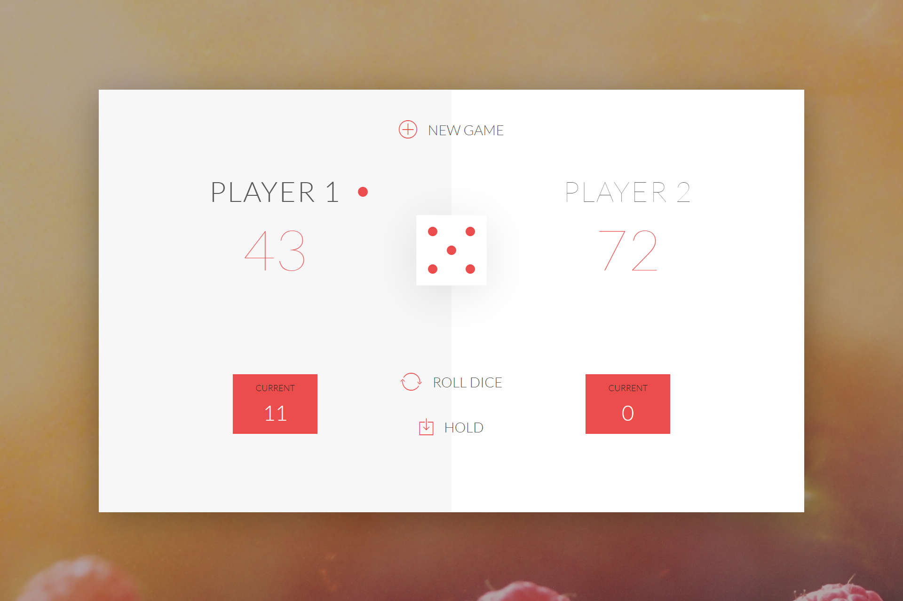
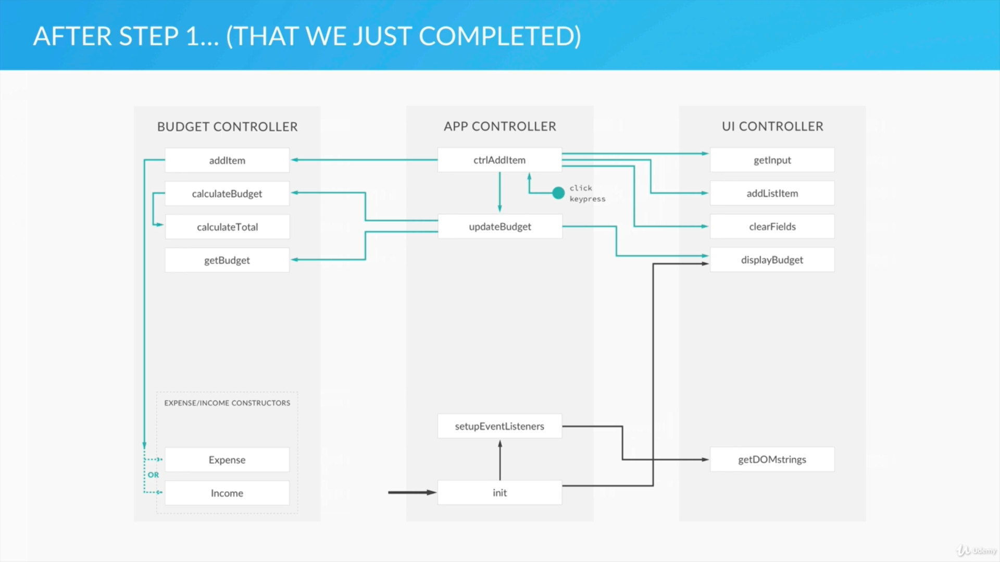
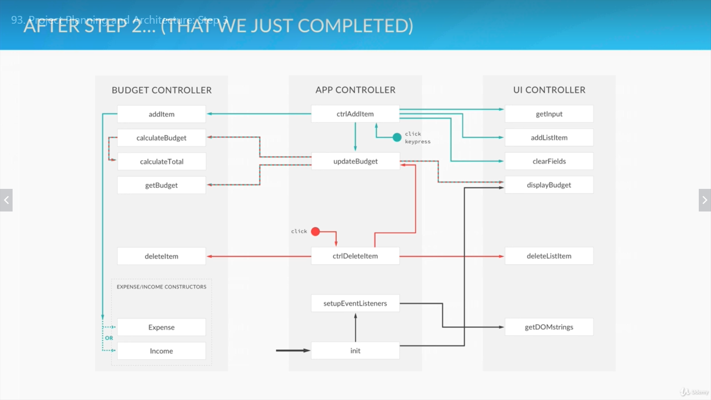
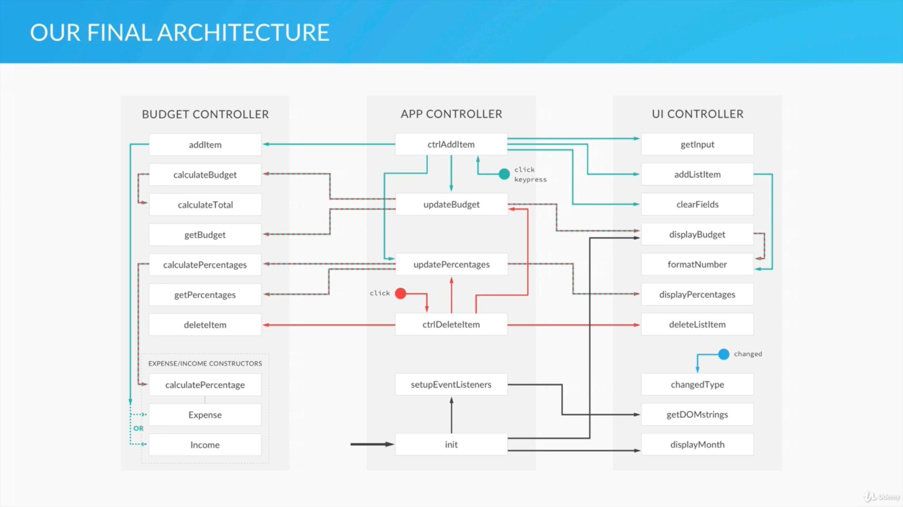
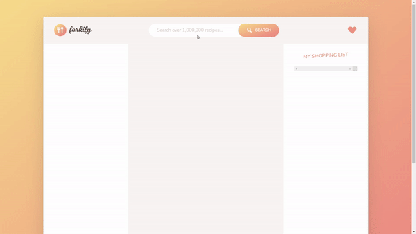

# Intro and course structure

1. JavaScript Basics
1. How JavaScript works behind the Scenes
1. JavaScript in the Browser: DOM Manipulation and Events
1. Advanced JavaScript: Objects and Functions
1. Putting it all together: The Budget App Project
1. Next Generation JavaScript: Into to ES6/ES2015
1. Asynchronous JavaScript: Promises, Async/Await and AJAX
1. Modern JavaScript: Using ES6, NPM, Babel and Webpack (ES7 and ES8)

Note: I started learning the course since 2020/07/04. Some of the basic parts are skipped because I've learnt from other courses and modules. These skipped sections would be checked and reviewed in the future.

1. JavaScript Basics
1. How JavaScript works behind the Scenes

All the files are in "complete-javascript-course-master" directory which is copied from [complete-javascript-course](https://github.com/jonasschmedtmann/complete-javascript-course)

# JavaScript in the Browser: DOM Manipulation and Events

1. DOM stands for Document Object Model and is used to connect webpages and scripts like JavaScript. For each HTML box, there's an object in the DOM that we can access and interact with.
1. We will learning the materials and build a "pigGame" proejct by learning "**DOM**".
1. HTML and CSS of the game is not the main part of learning.

GAME RULES:

- The game has 2 players, playing in rounds
- In each turn, a player rolls a dice as many times as he whishes. Each result get added to his ROUND score
- BUT, if the player rolls a 1, all his ROUND score gets lost. After that, it's the next player's turn
- The player can choose to 'Hold', which means that his ROUND score gets added to his GLBAL score. After that, it's the next player's turn
- The first player to reach 100 points on GLOBAL score wins the game
  

### First DOM Access and Manipulation

1. We build up the variables to use in the initial stage.
1. Use `Math.random()` to create a random number from 0 to 1 (not including 1) and use `.floor()` to chop off the decimals. For the dice points, we can use `Math.floor(Math.random()*6) + 1` to get a random number from 1 to 6.
1. DOM starts with `document` object in JavaScript and has various methods to work on the object. One of the usual selector is `querySelector()` as the method takes syntax extactly the same as CSS to select a single HTML element.
1. After selecting an element, we can use `textContent` method to change the text value of the element or `innerHTML` to change the HTML value. The main difference between how the methods affect to the HTML elements on the page. These selectors and methods allow us to check values of HTML elements or change the value that renders on the page.
1. We can use the selector change CSS properties as well. Give `.style` to the selector object after selecting an object and give the property name. For example, we can change an element's `display` property as `none` to hide the element from the page. `document.querySelector('element').style.dispaly = 'none'`.

### Events and Event Handling: Rolling the Dice

1. `Events` are notification that send to notify the code that something happened on the webpage. Events are tricked by user activities, such as clicking button, resizing browser, scrolling, and pressing a key.
1. `Event listener` is a function that performs an action based on a certain event. The function will be added to an object and wait a specific event to happen.
1. A `callback` function is called only when the event listener catches an event and gets trigerred. This function can be set in advance (but remember that it should not be called and passed as a function value). Besides, we can pass an anonymous function, which is only for one-time use for the event.
1. Besides `querySelector()`, we can use `getElementById()` to select an element by its "id". In this case, though the scores in HTML is given, we can use JavaScript and DOM to reset the values to 0.

### Updating scores and changing the active player

1. In this section, we will use ternary operator `?`, so we can have one-line succinct code rather than using `IF/ELSE`, and use DOM to toggle HTML classes.
1. We can use `document.querySelector('element').classList.toggle('class')` to turn on/off (add/remove) a class to an element. This method will add the class to element that doesn't have it or remove the class if the element has it.

### Implementing "Hold" function and the DRY principle

1. If a section of code can be used in different part or event, we can make it as a "**function**" to be called accordingly and reduce repetitive code.
1. In this secion, we focus on changing the record of accumulated points of rolling dice and let the DOM selector edit HTML elements accordingly.

### Creating a Game Initialization Function

1. The part is to create a function to initilize the game to the initial state, such as reseting scores and player state.
1. By using DRY concept, we can have a section of code used in different part part of the program or be called according to events.

### State Variables

1. A state variable is to tell the user the condition of the system. In this case, we set this variable to prevent the game keeping going after one of the player wins. Therefore, we can use the state to know if the game is playing or not.
1. In this game, the state control is relatively simple that there are only "playing" or "not playing" state for the game. Therefore, we can set up a single variable that holds `true` or `false` to indicate the state of the program. Besides, we can use this variable to be the indicator that whether some of the functions should be working by using `IF` statement.

# Advanced JavaScript: Objects and Functions

### Everything is an Object: Inheritance and the Prototype Chain

1. In JavaScript there are "Primitives" and "Objects"
   1. **Primitives** include `Numbers`, `Strings`, `Booleans`, `Undefined`, and `Null`.
   1. **Objects** include `Arrays`, `Functions`, `Objects`, `Dates`, and Wrappers for Numbers, Strings, Booleans.
1. **Object-Oriented Programming**
   1. Objects interacting with one another through methods and properties.
   1. Objects are used to store data, structure applications into modules and keeping code clean.
1. In JavaScript we can use a "**constructor**" to create a type of objects (which is a "**class**" in other programming languages). By the constructor, we can create instances which inherits the properties from the "**class**". Besides, we can have a class inherits the properties from another as its prototype.
1. **Prototype Chain**: When we try to access a property of method of an `Object`, JavaScript will firstly check on the `Object` itself. If there's no such property or method, it will access its "**prototype**" until it reaches `null`, which is the prototype of `Object` and returns that the `Object` has no property or method.
1. Every JavaScript object has a "prototype property", which makes inheritance possible in JavaScript.
1. The prototype property of an object is where we put methods and properties that we want other objects to inherit.
1. The constructor's prototype property is **NOT** the prototype of the constructor itself, it's the prototype of **ALL** instances that are created through it.

### Creating Objects: Function Constructors

1. By convention, the variable name of constructor function starts with an uppercase.
1. When we use keyword `new`, an empty `Object` is created and the constructor function is called. The properties with `this` are assigned to the `Object` and given to the variable.
1. **Inheritance** - To extend the properties or method that aren't created in the constructor function, we can use `Constructor.prototype.method = function(){}` to add the method to all instances (descendants) which are created by the constructor function.

   ```js
   let Person = function (name, yearOfBirth, job) {
     this.name = name;
     this.yearOfBirth = yearOfBirth;
     this.job = job;
   };

   Person.prototype.calculateAge = function () {
     console.log(2020 - this.yearOfBirth);
   };

   let john = new Person("John", 1990, "teacher");
   let jane = new Person("Jane", 1969, "designer");
   let mark = new Person("Mark", 1948, "retired");

   john.calculateAge();
   jane.calculateAge();
   mark.calculateAge();
   ```

### The Prototype Chain in the Console

1. We can check with `__proto__` of an `Object` to check its constructor properties.
1. `.hasOwnProperty()` method can be used to check if the `Object` has a property or method by the `Object` itself, or is from its constructor.
1. key word `instanceof` can be used to check if an `Object` is an instance of another `Object`, such as `ObjectA instanceof ObjectB`.

### Creating Objects: Object.create()

1. Besides using `new` keyword, we can use `Object.create()` which takes a function as argument to create an `Object` as using the function as prototype.

   ```js
   // Object.create
   let personProto = {
     calculateAge: function () {
       console.log(2020 - this.yearOfBirth);
     },
   };

   let john = Object.create(personProto);
   john.name = "John";
   john.yearOfBirth = 1990;
   john.job = "teacher";

   let jane = Object.create(personProto, {
     name: { value: "Jane" },
     yearOfBirth: { value: 1969 },
     job: { value: "designer" },
   });
   ```

### Primitives vs Objects

1. Variables assigned with "**primitive**" values keeps the values. However, variables assigned with "**objects**" only point to the location of the storage in memory rather than having the copy of the `Object`.

   ```js
   // Primitives vs objects

   // Primitives
   let a = 23;
   let b = a;
   a = 46;
   console.log(a); // 46
   console.log(b); // 23

   // Objects
   let obj1 = {
     name: "John",
     age: 26,
   };

   let obj2 = obj1;
   obj1.age = 30;
   console.log(obj1.age); // 30
   console.log(obj2.age); // 30

   // Functions
   function change(a, b) {
     a = 30;
     b.city = "San Francisco";
   }

   change(age, obj);
   console.log(age);
   console.log(obj.city);
   ```

### First Class Functions: Passing Functions as Arguments

1. A function is an instance of the Object type.
1. A function behaves like any other object.
1. We can store functions in a variable.
1. We can pass a function as an argument to another function.
1. We can return a function from a function.
1. "**callback**" functions are function that are passed as arguments to another function and only runs in the function scope. Note that we should be careful with the syntax that the callback function usually not execute for the result and be passed as argument. It'd be pass as function value and execute as a callback.

### First Class Functions: Functions returning Functions

1. We can make a function that returns another function and assign the value to a variable. The variable can be called and passed arguments.
1. If a function return a function as value, we can use another parenthesis to pass argument and to execute the returned function directly.

   ```js
   function interviewQuestion(job) {
     if (job === "designer") {
       return function (name) {
         console.log(name + ", can you please explain what UX design is?");
       };
     } else if (job === "teacher") {
       return function (name) {
         console.log("What subject do you teach, " + name + "?");
       };
     } else {
       return function (name) {
         console.log("Hello " + name + ", what do you do?");
       };
     }
   }

   let teacherQuestion = interviewQuestion("teacher");
   teacherQuestion("John");
   // What subject do you teach, John?
   let designerQuestion = interviewQuestion("designer");
   designerQuestion("John");
   // John, can you please explain what UX design is?
   interviewQuestion("teacher")("John");
   // What subject do you teach, John?
   ```

### Immediately invoked function expression (IIFE)

1. IIFEs are used to keep data privacy, as the variables in the function scope can't be reached from outside.
   ```js
   function game() {
     let score = Math.random() * 10;
     console.log(score >= 5);
   }
   game();
   (function () {
     let score = Math.random() * 10;
     console.log(score >= 5);
   })();
   (function (goodLuck) {
     let score = Math.random() * 10;
     console.log(score >= 5 - goodLuck);
   })(5);
   ```

### Closures

1. Closure is an inner function has always access to the variables and parameters of its outer function, even after the outer function has returned.

   ```js
   function retirement(retirementAge) {
     let a = " years left until retirement.";
     return function (yearOfBirth) {
       let age = 2020 - yearOfBirth;
       console.log(retirementAge - age + a);
     };
   }

   let retirementUS = retirement(66);
   let retirementGermany = retirement(65);
   let retirementIceland = retirement(67);

   retirementUS(1990);
   retirementGermany(1990);
   retirementIceland(1990);

   let score = 10;
   function display() {
     let score = 0;
     let addUp = function () {
       return score++;
     };
     return addUp;
   }

   let finalScore = display();
   console.log(finalScore()); // 0
   console.log(finalScore()); // 1
   console.log(score); // 10
   ```

### Bind, Call, and Apply

1. With `.bind()`, `.call()`, and `.apply()` method can borrow methods from other `Objects` to work on an `Object`.

   1. `.call(obj, arguments...)` takes an `Object` as argument and call the method immediately.
   1. `.apply(obj, Arr[])` is similar to `.call()` that it calls the method immediately, but it takes arguments to pass to the method as `Array`
   1. `.bind(obj, arguments...)` creates a function that we can keep as a function value and call it at other places.

   ```js
   let john = {
     name: "John",
     age: 26,
     job: "teacher",
     presentation: function (style, timeOfDay) {
       if (style === "formal") {
         console.log(
           "Good " +
             timeOfDay +
             ", Ladies and gentlemen! I'm " +
             this.name +
             ", I'm a " +
             this.job +
             " and I'm " +
             this.age +
             " years old."
         );
       } else if (style === "friendly") {
         console.log(
           "Hey! What's up? I'm " +
             this.name +
             ", I'm a " +
             this.job +
             " and I'm " +
             this.age +
             " years old. Have a nice " +
             timeOfDay +
             "."
         );
       }
     },
   };

   let emily = {
     name: "Emily",
     age: 35,
     job: "designer",
   };

   john.presentation("formal", "morning");

   john.presentation.call(emily, "friendly", "afternoon");
   john.presentation.apply(emily, ["friendly", "afternoon"]);
   let johnFriendly = john.presentation.bind(john, "friendly");
   johnFriendly("morning");
   johnFriendly("night");

   let emilyFormal = john.presentation.bind(emily, "formal");
   emilyFormal("afternoon");
   ```

1. We can use `.bind()` method to create a new function with a preset argument. For example, if we have a function `fn(arg1, arg2)` that takes 2 arguments, we can use `fn.bind(this, preset)` to create another function that takes the "**preset**" argument. Thereofre, the new function takes only `arg2`. Note that the keyword `this` here represents the function object itself.

   ```js
   let years = [1990, 1965, 1937, 2005, 1998];

   function arrayCalc(arr, fn) {
     let arrRes = [];
     for (let i = 0; i < arr.length; i++) {
       arrRes.push(fn(arr[i]));
     }
     return arrRes;
   }

   function calculateAge(el) {
     return 2020 - el;
   }

   function isFullAge(limit, el) {
     return el >= limit;
   }

   let ages = arrayCalc(years, calculateAge);

   let fullJapan = arrayCalc(ages, isFullAge.bind(this, 20));

   console.log(ages);
   console.log(fullJapan);
   ```

### Coding Challenge 7

1. Build a function constructor called Question to describe a question. A question should include:
   1. question itself
   1. the answers from which the player can choose the correct one (choose an adequate data structure here, array, object, etc.)
   1. correct answer (I would use a number for this)
1. Create a couple of questions using the constructor
1. Store them all inside an array
1. Select one random question and log it on the console, together with the possible answers (each question should have a number) (Hint: write a method for the **Question** objects for this task).
1. Use the 'prompt' function to ask the user for the correct answer. The user should input the number of the correct answer such as you displayed it on Task 4.
1. Check if the answer is correct and print to the console whether the answer is correct or not (Hint: wirte another method for this).
1. Suppose this code would be a plugin for other programmers to use in their code. So make sure that all your code is private and doesn't interfere with other programmers code (Hint: we learned a special technique to do exactly that).

**Expert Level**

8. After you display the result, display the next random question, so that the game never ends (Hint: write a function for this and call it right after displaying the result)
1. Be careful: after Task 8, the game literally never ends. So include the option to quit the game if the user writes 'exit' instead of the answer. In this case, DON'T call the function from task 8.
1. Track the user's score to make the game more fun! So each time an answer is correct, add 1 point to the score (Hint: I'm going to use the power of closures for this, but you don't have to just do this)
1. Display the score in the console. Use yet another method for this.

### Solutions - Basics

1. Note that data collect from `prompt()` method is a `String`. We can use plus sign `+`, `Number()`, or `parseInt()` to turn a `String` value into a `Number`.
1. We use "**IIFE**" to wrap the values and variables into a function, so it won't affect to the variables outside the scope, and can't be accessed as well.

   ```js
   (function () {
     function Question(question, answers, correct) {
       this.question = question;
       this.answers = answers;
       this.correct = correct;
     }

     Question.prototype.displayQuestion = function () {
       console.log(this.question);

       for (var i = 0; i < this.answers.length; i++) {
         console.log(i + ": " + this.answers[i]);
       }
     };

     Question.prototype.checkAnswer = function (ans) {
       if (ans === this.correct) {
         console.log("Correct answer!");
       } else {
         console.log("Wrong answer. Try again:)");
       }
     };

     let q1 = new Question(
       "Is JavaScript the coolest programming language in the world?",
       ["Yes", "No"],
       0
     );

     let q2 = new Question(
       "What is the name of this course's teacher?",
       ["John", "Michael", "Jonas"],
       2
     );

     let q3 = new Question(
       "What does best describe coding?",
       ["Boring", "Hard", "Fun", "Tediuous"],
       2
     );

     let questions = [q1, q2, q3];

     let n = Math.floor(Math.random() * questions.length);

     questions[n].displayQuestion();

     let answer = +prompt("Please select the correct answer.");

     questions[n].checkAnswer(answer);
   })();
   ```

### Solutions - Expert

1. We use a closure here to record the score if the user give a correct answer. The variable `sc` can't be accessed not modified from the outside. Therefore, we can ensure the score is correct and can't be "**hacked**".
   ```js
   function score() {
     let sc = 0;
     return function (correct) {
       if (correct) {
         sc++;
       }
       return sc;
     };
   }
   ```

# The Budget App Project

1. The project is to create a dashboard that allows users to
   1. Add "**income**" of the month
   1. Add "**Expense**" of the month
   1. Check summary of income
   1. Check summary of expense
   1. List the items of incomes
   1. List the items of expenses
1. In this project, we focus on the JavaScript part of the project only. HTML and CSS styling are given.
1. One goal to achieve here is to learn how to plan and structure the plan to develop a program.

### Project planning and architecture: Step 1

1. To-do list
   1. Add event handler
   1. Get input values
   1. Add the new item to our data structure
   1. Add the new item to the UI
   1. Calculate budget
   1. Update the UI
1. Structuring code with modules
   1. Important aspect of any robust application's architecture.
   1. Keep the units of code for a project both cleanly separated and organized.
   1. Encapsulate some data into privacy and expose other data publicily.
1. In this project, we mainly separate the code into 3 modules. From the To-do list, we can separate the tasks into these modules.

   1. UI Module
      1. Get input values
      1. Add the new item to the UI
      1. Update the UI
   1. Data Module
      1. Add the new item to our data structure
      1. Calculate budget
   1. Controller Module
      1. Add event handler

### Implementing the Module Pattern

1. Learning Objects
   1. Learn how to use module pattern
   1. Understand more about private and public data, encapsulation and separation of concerns.
1. We learn to encapsulate the functions, methods, variables, and data as to prevent injection or being overwritten by other code. To encapsulate the code, we use concepts of "**IIFEs**" and "**Closure**".
1. In this case, we set up a variable as the controller module which value is an `IIFE`. By the feature of "closure", we can't access variable `x` and function expression `add` directly from the outsite. As `budgetController` is an `IIFE`, it return the an `Object` which has method `publicTest` that we can use. Therefore, we can use call the `add` function only from `publicTest` method.
1. Note that "IIFE" syntax is `let var = (function(arg...){code...})()` that a function is wrapped by parenthesis and put a pair of parenthesis to call the function immediately.

   ```js
   let budgetController = (function () {
     let x = 23;
     let add = function (a) {
       return x + a;
     };
     return {
       publicTest: function (b) {
         return add(b);
       },
     };
   })();

   console.log(budgetController.publicTest(5)); // 28
   ```

1. By applying the concept, we can create another variable with "**IIFE**" to separate the modules for different functions. Note that these modules are independent and doesn't affect to each other. "**Separation concerns**" is that each module should focus on working only 1 thing by itself.
1. We can set up another module to manipulate and connect the modules with thier public "**API**". For example, from the code above, `budgetController` can return an `Object` which has method `publicTest` to use the inner `add` function. We can set up another module "controller" that connect to `publicTest` to use the module.

   ```js
   let controller = (function (budgetCtrl) {
     let z = budgetCtrl.publicTest(5);
     return {
       anotherPublic: function () {
         return z;
       },
     };
   })(budgetController);

   console.log(controller.anotherPublic());
   ```

### Setting up first event listener

1. Learning Objects
   1. Set up event listeners for keypress events
   1. Use event object
1. Besides hitting the button to add a new item of the budget, we can allow users to press <kbd>Enter</kbd> key to add the new item as well. Therefore, we add an event listener for key press. In this case, the <kbd>Enter</kbd> key can be trigerred anywhere on the webpage because there's no other element to work as input. Therefore, we can put hte event listener on the global `document` object directly without selecting a specific element.
1. We add the event listener with `keypress` (check other events [here](https://developer.mozilla.org/en-US/docs/Web/Events)) and use a callback function to react to the event. We can pass the function an argument which will automatically capture the event object. We can check with its property to setup event handling function only certain keys. In this case, the event listener should only react to <kbd>Enter</kbd> key.
1. Since the function can be used to react to both "**click**" and "**keypress**" events, we can create another function which can be called by different event listener without duplicate the code directly.

   ```js
   // Global App controller
   let controller = (function (budgetCtrl, UICtrl) {
     let ctrlAddItem = function () {
       // 1. Get the filled input data
       // 2. Add the item to the budget controller
       // 3. Add the item to the UI
       // 4. Calculate the budget
       // 5. Display the budget on the UI
     };

     document.querySelector(".add__btn").addEventListener("click", ctrlAddItem);

     document.addEventListener("keypress", function (event) {
       if (event.keyCode === 13 || event.which === 13) {
         ctrlAddItem();
       }
     });
   })(budgetController, UIController);
   ```

### Reading input data

1. Learning Objects: Read data from different HTML input types.
1. The same concepts of using closure and IIFEs are used here. We can set up the `UIController` to get the input from the webpage. Therefore, it returns an `Object` that contains the input from the user which we can manipulate it in the `controller` function.
1. Since we could change the "class" name applied to HTML elements, we can store the names as `Strings` in an `Object`. Therefore, every time when we update the HTML structure, we can only edit the `Object` which holds the class names for selectors without editing the whole code which may cause serious bug.
1. Besides, we can pass the `DOMstrings` object in the as a property in the returned `Object` from `UIcontroller`. Therefore, in the controller module, we can use `UICtrl.getDOMstrings` to get the values without duplicate the works.

   ```js
   // UI controller
   let UIController = (function () {
     let DOMstrings = {
       inputType: ".add__type",
       inputDescription: ".add__description",
       inputValue: ".add__value",
       inputBtn: ".add__btn",
     };

     return {
       getInput: function () {
         return {
           type: document.querySelector(DOMstrings.inputType).value, // Will be either inc or exp
           description: document.querySelector(DOMstrings.inputDescription)
             .value,
           value: document.querySelector(DOMstrings.inputValue).value,
         };
       },

       getDOMstrings: function () {
         return DOMstrings;
       },
     };
   })();
   ```

### Creating an initialization function

1. In the `controller` function, we create an `init` function which can be called by its API. The `controller` function that returns an `Object` which has a method for outside to call the function. Therefore, without this initiation, the event listeners aren't applied.

   ```js
   // Global App controller
   let controller = (function (budgetCtrl, UICtrl) {
     let setupEventListeners = function () {
       let DOM = UICtrl.getDOMstrings();

       document
         .querySelector(DOM.inputBtn)
         .addEventListener("click", ctrlAddItem);

       document.addEventListener("keypress", function (event) {
         if (event.keyCode === 13 || event.which === 13) {
           ctrlAddItem();
         }
       });
     };

     let ctrlAddItem = function () {
       // 1. Get the filled input data
       let input = UICtrl.getInput();
       // 2. Add the item to the budget controller

       // 3. Add the item to the UI

       // 4. Calculate the budget

       // 5. Display the budget on the UI
     };

     return {
       init: function () {
         console.log("Application has started.");
         setupEventListeners();
       },
     };
   })(budgetController, UIController);

   controller.init();
   ```

### Creating income and expense function constructors

1. Learning Objects
   1. Choose function constructors that meet our application's needs.
   1. Set up a proper data structure for budget controller.
1. When would like to create multiple `Objects`, we can use function constructors to make prototypes (as the blueprint). Therefore, in the budget controller, we set up the function constructors for both "**expense**" and "**income**".

   ```js
   // Budget controller
   let budgetController = (function () {
     function Expense(id, description, value) {
       this.id = id;
       this.description = description;
       this.value = value;
     }

     function Income(id, description, value) {
       this.id = id;
       this.description = description;
       this.value = value;
     }

     let allExpenses = [];
     let allIncomes = [];
     let totalExpenses = 0;

     let data = {
       allItems: {
         exp: [],
         inc: [],
       },
       totals: {
         exp: 0,
         inc: 0,
       },
     };
   })();
   ```

### Adding a new item to budget controller

1. Learning Objects
   1. Avoid conflicts in the data structure.
   1. Understand how and why to pass data from one module to another.
1. After adding some data (either income or expense from the input from, we can start to check and manipulate the data based on the previous section (which we've created the data structure). Each item will have an ID property that is started from 0.
1. The program, at this point, starts with

   1. `init()` function from `controller` module, which adds listeners to HTML elements on the webpage.
   1. In the listeners, there's a function from `UIController` that takes the input from the user which parse and extract the value input.
   1. After getting the values, it passed to the function which is called from `budgetController` module to create an `ID` for the item and store in the variable in the "**closure**" which can be accessed and edited directly from the outside.

   ```js
   // Budget controller
   let budgetController = (function(){
       function Expense (id, description, value){
           this.id = id;
           this.description = description;
           this.value = value;
       };

       function Income (id, description, value) {
           this.id = id;
           this.description = description;
           this.value = value;
       };
   ```


        let allExpenses = [];
        let allIncomes = [];
        let totalExpenses = 0;

        let data = {
            allItems: {
                exp: [],
                inc: [],
            },
            totals: {
                exp: 0,
                inc: 0,
            }
        };

        return {
            addItem: function(type, des, val){
                let newItem, ID;

                // Create new ID
                if (data.allItems[type].length > 0) {
                    ID = data.allItems[type][data.allItems[type].length - 1].id + 1;
                } else {
                    ID = 0;
                }

                // Create new item based on 'inc' or 'exp' type
                if (type === 'exp') {
                    newItem = new Expense(ID, des, val);
                } else if (type === 'inc'){
                    newItem = new Income(ID, des, val);
                }

                // Push it into our data structure
                data.allItems[type].push(newItem);

                // Return the new element
                return newItem;
            },

        };

    })();
    ```

1. Note that all this data are only in the backend can be checked only on the console, as we haven't use the data to update the HTML elements.

### Adding a new item to the UI

1. Learning Objects
   1. A technique for adding big chunks of HTML into the DOM.
   1. Replace parts of `Strings`.
   1. Do DOM manipulation using the `insertAdjacentHTML` method.
1. We create another function in `UIController` which works on the DOM manipulation to change the HTML elements. In this case, we keep the predefined HTML elements as `Strings`. We then change the value that we'd like to be updated from DOM.
   ```html
   <div class="item clearfix" id="expense-0">
     <div class="item__description">Car Rental</div>
     <div class="right clearfix">
       <div class="item__value">500</div>
       <div class="item__percentage">21%</div>
       <div class="item__delete">
         <button class="item__delete--btn">
           <i class="ion-ios-close-outline"></i>
         </button>
       </div>
     </div>
   </div>
   ```
1. The lecturer uses regualr strings with placeholders (such as %id%, %description%, and %value%), which are similar to the syntax in `express` framework when handling `.ejs` files.
1. However, these placeholders can be named in any other way which is easy for JavaScript `.replace()` method to check and replace with the other given values. Besides, we can use backticks "\`" with variable holder `${}` as well. The structure would be different from each of the methods. The other benefit from backtick "\`" is that we can have multi-line `String` value and input variables into the `String` directly. However, this feature isn't supported by some of the browsers.
1. We then insert the HTML `String` by DOM. In this case, we use `.insertAdjacentElement()` method with `'beforeend'` as its argument to append the new items into the list of income/expense statement. In this project, income and expense statements are separated into a 2 column table as the layout. Therefore, we should insert the new HTML in the `<div>` tag which takes 2 sections (as columns) of the statements. Besides, the new items should be added as the last row of the column.
1. We can check more info. about `.inserAdjacentElement()` method [here](https://developer.mozilla.org/en-US/docs/Web/API/Element/insertAdjacentElement).

   ```js
   let DOMstrings = {
       inputType: '.add__type',
       inputDescription: '.add__description',
       inputValue: '.add__value',
       inputBtn: '.add__btn',
       incomeContainer: '.income__list',
       expensesContainer: '.expenses__list',
   };

   addListItem: function(obj, type){
       // Create HTML string with placeholder text
       let html, newHtml;

       if(type === 'inc') {
           element = DOMstrings.incomeContainer;
           html =
           `<div class="item clearfix" id="income-%id%">
               <div class="item__description">%description%</div>
               <div class="right clearfix">
                   <div class="item__value">%value%</div>
                   <div class="item__delete">
                       <button class="item__delete--btn"><i class="ion-ios-close-outline"></i></button>
                   </div>
               </div>
           </div>`;
       } else if (type === 'exp') {
           element = DOMstrings.expensesContainer;
           html =
           `<div class="item clearfix" id="expense-%id%">
               <div class="item__description">%description%</div>
               <div class="right clearfix">
                   <div class="item__value">%value%</div>
                   <div class="item__percentage">21%</div>
                   <div class="item__delete">
                       <button class="item__delete--btn"><i class="ion-ios-close-outline"></i></button>
                   </div>
               </div>
           </div>`;
       }

       // Replace the placeholder text with some actual data
       newHtml = html.replace('%id', obj.id);
       newHtml = newHtml.replace('%description%', obj.description);
       newHtml = newHtml.replace('%value%', obj.value);

       // Insert the HTML into the DOM
       document.querySelector(element).insertAdjacentHTML('beforeend', newHtml);

   }
   ```

### Clearing our input fields

1. Learning Objects
   1. Clear HTML fields
   1. Use querySelectorAll
   1. Convert a list to an array
   1. A better way to loop over an array then for loop `.forEach()`
1. In the public returned `Object`, we add a method `clearFields` to clear the input tags.
1. By using DOM, `.querySelectorAll()` method returns a "**list**" which is an array-like data but an `Object`. We can then use a trick to turn the "**list**" into an array. `.slice()` method works on `Array` values. We can use `Array.prototype.slice()` to turn the "**list**" object into an `Array`. This is very useful, as we can manipulate the list of elements directly. However, we can also use `querySelector()` to deal with each of the elements one by one.
1. After cleaning the input, we can use `.focus()` method to turn the focus back to the description input on the webpage to provide a better UX.

   ```js
   clearFields: function(){
       let fields, fieldsArr;

       fields = document.querySelectorAll(DOMstrings.inputDescription + ', ' + DOMstrings.inputValue);

       fieldsArr = Array.prototype.slice.call(fields);

       fieldsArr.forEach(function(item, index, array){
           item.value = '';
       });

       fieldsArr[0].focus();

   },
   ```

### Updating the budget: Controller

1. Learning Objects
   1. Convert field inputs to numbers
   1. Prevent false inputs
1. Note that until this point, we collect value with `document.querySelector(DOMstrings.inputValue).value` which collects the data as `String`. We can use `parseFloat()`, `Number()`, or plus sign `+` to turn the value into a `Number`, so that we can operate the number.
   1. However, both plus sign and `Number()` aren't a good solution as it will turn empty string `""` or `null` into number `0`, while the other 2 methods will turn empty `String` into `0`.
   1. We can't use `parseInt()` function here because the input may have decimals. `parseInt()` function will take off the decimals of the `String` value.
1. Besides, the input form still takes empty inputs, as we haven't set up the conditions for the listeners to handle the conditions.
1. We can check and ensure both "**description**" and "**value**" are given. If the number of value is in the incorrect syntax or pattern, `parseFloat()` will turn it into a `NaN` value, which we can check by `isNaN()` function if an `IF` statement. Therefore, we update the `CtrlAddItem` function in the `controller` module.
1. Note that in the lecture, `input.description` is checked if it is equal to empty `String`. However, we can put the variable there directly without any operator because an empty `String` is falsy that `Booelan("")` is `false`.
1. Besides, we should also check the value is greater than 0, as income/expense should be lower than 0 by its part.
1. At this point `udpateBudget` function hasn't been created.

   ```js
   let updateBudget = function () {
     // 1. Calculate the budget
     // 2. Return the budget
     // 3. Display the budget on the UI
   };

   let ctrlAddItem = function () {
     let input, newItem;
     // 1. Get the filled input data
     input = UICtrl.getInput();

     if (input.description && !isNaN(input.value) && input.value > 0) {
       // 2. Add the item to the budget controller
       newItem = budgetCtrl.addItem(input.type, input.description, input.value);

       // 3. Add the item to the UI
       UIController.addListItem(newItem, input.type);

       // 4. Clear the fields
       UIController.clearFields();

       // 5. Calculate and update budget
       updateBudget();
     }
   };
   ```

### Update the budget: Budget Controller

1. Learning Objects
   1. Understand how and why create simple, reusable functions with only one purpose.
   1. Sum all elements of an array using the `.forEach()` method.
1. In `budgetController`, we set up the calculate for the income and expense from the data stored in the `data` object.
   ```js
   let calculateTotal = function (type) {
     let sum = 0;
     data.allItems[type].forEach(function (item) {
       sum += item.value;
     });
     data.totals[type] = sum;
   };
   ```
1. Besides, the `data.percentage` calculation isn't correct, as if we have expense first without income, expense will be divided by 0, which JavaScript will return an `Infinity`. Therefore, we can fix the problem. We can use `IF` statement to avoid the operation when the `data.totals.inc` is equal or less than 0.

   ```js
   calculateBudget: function(){
       // Calculate total income and expenses
       calculateTotal('exp');
       calculateTotal('inc');

       // Calculate the budget: income - expenses
       data.budget = data.totals.inc - data.totals.exp;

       // Calculate the percentage of income that we spent
       if (data.totals.inc > 0) {
           data.percentage = Math.round((data.totals.exp / data.totals.inc) * 100);
       } else {
           data.percentage = -1;
       }
   }
   ```

### Updating the budget: UI Controller

1. Learning Objects: Practice DOM manipulation by updating the budget and total values.
1. In `UIController`, we create the DOM manipulation to change the text contents of the HTML elements. However, the `obj.percentage` returns `-1` when the income is 0. Therefore, we can have another `IF` statement to deal with the conditions. We can set the condition as if `obj.percentage` is greater than `0`, so it includes both 0 and negative numbers such as `-1`. This is why we set the percentage as `-1` when the income is 0.
   ```js
   displayBudget: function(obj){
       document.querySelector(DOMstrings.budgetLabel).textContent = obj.budget;
       document.querySelector(DOMstrings.incomeLabel).textContent = obj.totalInc;
       document.querySelector(DOMstrings.expensesLabel).textContent = obj.totalExp;
       document.querySelector(DOMstrings.percentageLabel).textContent = obj.percentage;
       if(obj.percentage > 0) {
           document.querySelector(DOMstrings.percentageLabel).textContent = obj.percentage + '%';
       } else {
           document.querySelector(DOMstrings.percentageLabel).textContent = '---';
       }
   }
   ```
1. Besides, we have some default value set up in the HTML file for the number. We can update the `init()` function to reset the numbers to 0 when the page loads.
   ```js
   return {
     init: function () {
       console.log("Application has started.");
       UICtrl.displayBudget({
         budget: 0,
         totalInc: 0,
         totalExp: 0,
         percentage: -1,
       });
       setupEventListeners();
     },
   };
   ```

### Summary of Step 1



### Project planning and architecture: Step 2

1. The main target here is to enable the "**delete**" button and the aligned manipulations with the event.
1. To-do list
   1. Add event handler
   1. Delete the item from our data structure
   1. Delete the item to the UI
   1. Re-calculate budget
   1. Update the UI

### Event delegation

1. "**Event Bubbling**" - For example, when a button on the webpage is "**clicked**", its parent elements (which holds the button element until `HTML` tag) will also be triggered with the event.
1. By this feature, we can put the event listener on the parent element and wait for the event bubbles up. This is called "**event delegation**".
1. This feature is useful in some scenarios, such as
   1. When we have an element with lots of child elements that we are interested in. Therefore, we don't need to add event listeners to each of them one by one.
   1. When we want an event handler attached to an element that is not yet in the DOM when the page is loaded. For example, a submit button element is only added after filling up an input form. We can put the listener on its parent rather than the new button itself, so the button element will still work, though the element doesn't exist when the page loads.

### Setting up the delete event listener using event delegation

1. Learning Objects
   1. Use event delegation in practice
   1. Use IDs in HTML to connect the UI with data model
   1. Use the parentNode property for DOM traversing
1. In this case, we have both `income` and `expense` section on the webpage. The direct element that is the parent element of both sections is the `<div class="container clearfix">` tag. Therefore, we can add an event listener here and wait for the "**click**" event bubbles up.
1. By the structure of the JS file, we can add the class name into the object for elements in `UIController` model.
1. We can check with the callback function with its event argument by `event.target` to know which element trigers the event. If we add an item to the list and click the preset "**delete**" button, we can get `<i class="ion-ios-close-outline"></i>` printed in the console.
1. Therefore, we can set up the callback function to check and delete element(s) we want only when certain elements get the event. For example, the "**delete**" function only works when the `<i>` tag is "**clicked**". Thus, we can set the event listener in advance and be able to catch the event working on certain element.
1. We then use DOM traversing to move between parent/child elements in the target object.
1. For DOM object, we can check `.parentNode` property to find the direct parent element of the element we select.
   ```js
   let ctrlDeleteItem = function (event) {
     let itemID, splitID, type, ID;
     itemID = event.target.parentNode.parentNode.parentNode.parentNode.id;
     if (itemID) {
       // id of the element will be either in pattern as inc-1 or exp-1
       splitID = itemID.split("-");
       type = splitID[0];
       ID = splitID[1]; // note that this is a string
       // 1. Delete the item from the data structure
       // 2. Delete the item from the UI
       // 3. Update and show the new budget
     }
   };
   ```

### Deleting an item from the budget controller

1. Learning Objects
   1. Another method to loop over an `Array`: `.map()`.
   1. Remove elements from an array using the `.splice()` method.
1. In the lecture, we uses `.map()` array method to copy an array. Though `.slice()` method without any argument can return a duplicate array as well, the items in the data structure are actually `Objects` that we should access to their `id` property. We then can use `.indexOf()` to find the position of a certain value in the `Array`. Note that `.indexOf()` method returns `-1` if the element is not found in the array.
1. Therefore, we can use an `IF` statement to check if the index we get is not equal to `-1` and use `.splice()` method to delete an element from the array. Note that when we passing values between variables, we should be careful with its primitive types.

   ```js
   // Budget controller
   deleteItem: function(type, id){
       let ids, index;
       ids = data.allItems[type].map(function(item){
           return item.id;
       });

       index = ids.indexOf(id);

       if (index !== -1) {
           data.allItems[type].splice(index, 1);
       }
   }
   ```

### Deleting an item from the UI

1. Learning Object: Remove an element from the DOM
1. In DOM, we can only use `.removeChild()` method to delete an element. Therefore, we have to select the parent element of the element we want to delete and pass the selected element again. We can save the parent element object in a variable first as well.
   ```js
   // UI controller
   deleteListItem: function(selectorID){
       let el;
       el = document.getElementById(selectorID);
       el.parentNode.removeChild(el);
   }
   ```

### Summary of Step 2



### Project planning and architecture: Step 3

1. The main target here is to update the percentage of an expense item of total income.
1. To-do list
   1. Calculate percentage
   1. Update percentages in UI
   1. Display the current month and year
   1. Number formatting
   1. Improve input field UX

### Updating the percentages: Controller

1. Learning Object: Reinforce concepts and techniques we have learnt so far.
1. This task is simple that we just add the function and execute it in other function sets, such as run the function after we add or delete an item.

### Updating the percentages: Budget Controller

1. Learning Object: Make the budget controller interact with the `Expense` prototype.
1. We update the function constructor of `Expense` by giving a new property `percentage`. This property is set to be default at `-1`. We then create 2 methods that can be called on each expense object. Therefore, the percentage will be calculated everytime a new item (either income or expense) is added.

   ```js
   // Budget controller
   function Expense (id, description, value){
       this.id = id;
       this.description = description;
       this.value = value;
       this.percentage = -1;
   };

   Expense.prototype.calcPercentage = function(totalIncome){
       if (totalIncome > 0) {
           this.percentage = Math.round((this.value / totalIncome) * 100);
       } else {
           this.percentage = -1;
       }
   };

   Expense.prototype.getPercentages = function(){
       return this.percentage;
   };

   // Returned public object
   calculatePercentages: function(){
       data.allItems.exp.forEach(function(item){
           item.calcPercentage(data.totals.inc);
       });
   },

   getPercentages: function(){
       let allPerc = data.allItems.exp.map(function(item){
           return item.getPercentages();
       });
       return allPerc;
   },
   ```

### Updating the percentages: UI Controller

1. Learning Object: Create own `.forEach()` method but for `nodeLists` instead of arrays.
1. Since there may be multiple items in the list and should all be updated, we can use `.querySelectorAll()` method to parse and update all the contents of percentage at the same time. In this case, we make a customized `forEach()` function which can loop through a DOM "**list**". Note that though a `list` object is not an array, it still has `length` property.

   ```js
   displayPercentages: function(percentages){
       let fields = document.querySelectorAll(DOMstrings.expensesPercLabel);
       console.log(fields);
       let nodeListForEach = function(list, callback){
           for (let i = 0; i < list.length; i++) {
               callback(list[i], i);
           }
       };

       nodeListForEach(fields, function(item, index){
           if (percentages[index] > 0){
               item.textContent = percentages[index] + '%';
           } else {
               item.textContent = '---';
           }
       });
   }
   ```

### Formatting budget numbers: String manipulation

1. Learning Object: Use different String methods to manipulate strings.
1. There are 3 patterns for the numbers in the App
   1. All numbers are will 2 decimals.
   1. Income (positive) numbers have a plus sign "+" at the beginning, while expenses (negative) numbers have a minus "-" sign.
   1. A comma separator is given when every thousand unit (triple zeros).
1. This part mainly manipulates the data in `UIController` as here manage the data that creates the "view" to users.

   ```js
   let formatNumber = function (num, type) {
     let numSplit, int, dec;
     // + or - before number
     // exactly 2 decimal points
     // comma separating the thousands
     num = Math.abs(num);
     num = num.toFixed(2);
     numSplit = num.split(".");

     int = numSplit[0];

     if (int.length > 3) {
       int =
         int.substr(0, int.length - 3) +
         "," +
         int.substr(int.length - 3, int.length);
     }

     dec = numSplit[1];

     return (
       (type === "exp" ? (sign = "-") : (sign = "+")) + " " + int + "." + dec
     );
   };
   ```

### Displaying the current month and year

1. Learning Object: Get the current date by using the Date object constructor
1. Since `.getMonth()` method returns a zero based number, we can create an `Array` which includes all months and be called by the result from `.getMonth()` as the index.

   ```js
   displayMonth: function(){
       let now, year, month, months;
       now = new Date();
       months = ['January', 'February', 'March', 'April', 'May', 'June', 'July', 'August', 'September', 'October', 'November', 'December'];

       month = now.getMonth();
       year = now.getFullYear();
       document.querySelector(DOMstrings.dateLabel).textContent = months[month] + ' ' + year;
   }
   ```

### Finishing touches: Improving the UX

1. Learning Objects: How and when to use '**change**' events.
1. We will change the color of inputs in the form when it is focus and according to whether it's an "**income**" or "**expense**" by checking whether the sign in the beginning is a '+' or '-' sign.
1. In the UI controller, we can use `.classList` property and `.toggle()` method on DOM object to turn on/off a given CSS class (which is '**red-focus**' in this case).
1. Besides, this function can be added to "controller" model in the `init` method which should be done when the page is loaded in the beginning.

   ```js
   // UI controller
   changedType: function(){
           let fields = document.querySelectorAll(
               DOMstrings.inputType + ',' +
               DOMstrings.inputDescription + ',' +
               DOMstrings.inputValue);

           nodeListForEach(fields, function(item){
               item.classList.toggle('red-focus');
           });
       }
   ```

1. Final Structure
   

# ES6/ES2015 JavaScript

1. The new version of JavaScript works on modern browsers but may not be available on old version, such as IE 9 or under. Besides, there's only new features and syntax different that most of the old usage and functions are still available. In this section, we will check the new versoin in the following topics.
   1. Variable Declarations with `let` and `const`.
   1. Blocks and IIFEs
   1. `Strings`
   1. Arrow Functions
   1. Destructuring
   1. `Arrays`
   1. The Spread Operator
   1. Rest and Default Parameters
   1. Maps
   1. Classes and subclasses

### Variable declarations with `let` and `const`

### Blocks and IIFEs

1. When we declare a variable with keyword `const`, the variable is immutable that we can't change the value of the variable.
1. The main difference between ES5 `var` and ES6 variable declaration `let and const` is that `var` is function scoped, and `let and const` are block scoped, which means that a variable declared by `var` can be accesses anywhere in the function. For `let and const` the scope is only limited to the curly braces `{}` where the variables are at.
1. Therefore, if ES5 and previous version, we can use IIFEs with `(function(){})()` to call an anonymous function immediately and limited accessibility for variables declared by `var`.

### Strings in ES6 / ES2015

1. In ES6, we can use backticks "\`" and dollar sign with curly braces `${}` to make multi-line strings and pass variables directly in `${}`.

### Arrow functions: Basics

1. In ES5, we can only use keyword `function` to use a function in JavaScript. However, Since ES6, we can use a shorthand "**arrow function**" notation. We can use arrow function notation for IIFEs or anonymous functions.
1. For example, we'd like to return a `'hi'` string.

   ```js
   let name = "Allen";
   () => "hi" + name;

   let text = "hi";
   (text) => text + name;

   (text) => {
     text = "Hello";
     return text + name;
   };
   ```

### Arrow functions: Lexical `this` keyword

1. In ES5, if we would like to add an event listener to an element, keyword `this` may refer to the wrong `Object` (usually global object). We have 2 ways for the solution by either save the `this` object first or use `.bind()` method.

   ```js
   // Use .bind() method
   var box5 = {
     color: "green",
     position: 1,
     clickMe: function () {
       document.querySelector(".green").addEventListener(
         "click",
         function () {
           var str =
             "This is box number " + this.position + " and it is " + this.color;
           alert(str);
         }.bind(box5)
       );
     },
   };

   // Save this out of function scope first
   var box5 = {
     color: "green",
     position: 1,
     clickMe: function () {
       var self = this;
       document.querySelector(".green").addEventListener(
         "click",
         function () {
           var str =
             "This is box number " + self.position + " and it is " + self.color;
           alert(str);
         }.bind(box5)
       );
     },
   };
   ```

1. Arrow functions, on the other hand, have no problems with the function scoping issue that the `this` keyword in the callback function will refer to the `Object` which takes the method as the outside world.
   ```js
   let box7 = {
     color: "green",
     position: 1,
     clickMe: function () {
       document.querySelector(".green").addEventListener("click", () => {
         let str =
           "This is box number " + this.position + " and it is " + this.color;
         alert(str);
       });
     },
   };
   ```
1. However, we usually use arrow functions as the argument for callback functions, as its lexical `this` keyword is now refer to the global object.
1. The same with the previous example, if we'd like to use constructor function to create a prototype, the `this` in the callback function may refer to the wrong object. With the same solution, we can either create a variable to hold the `this` object out of the function scope or use `.bind()` method to create a function that use the correct `Object`.

   ```js
   // Constructor function
   function Person(name) {
     this.name = name;
   }

   Person.prototype.myFriends5 = function (friends) {
     var self = this;
     var arr = friends.map(function (el) {
       return self.name + " is friends with " + el;
     });

     console.log(arr);
   };

   var friends = ["Bob", "Jane", "Mark"];

   new Person("John").myFriends5(friends);
   // ["John is friends with Bob", "John is friends with Jane", "John is friends with Mark"]
   ```

1. We can also use arrow function notation and refer to `this` directly.

   ```js
   Person.prototype.myFriends5 = function (friends) {
     let arr = friends.map((el) => this.name + " is friends with " + el);

     console.log(arr);
   };

   let friends = ["Bob", "Jane", "Mark"];

   new Person("John").myFriends5(friends);
   ```

### Destructuring

1. We can use `Array` and `Objects` to create variables in the other way as the followings.

   ```js
   const [name, age] = ["John", 26];
   console.log(name, age);

   const obj = {
     firstName: "John",
     lastName: "Smith",
   };
   const { firstName, lastName } = obj;
   console.log(firstName, lastName);
   const { firstName: a, lastName: b } = obj;
   console.log(a, b);

   function calcAgeRetirement(year) {
     const age = new Date().getFullYear() - year;
     return [age, 65 - age];
   }

   const [age, retirement] = calcAgeRetirement(1990);
   console.log(age);
   console.log(retirement);
   ```

### Arrays in ES6/ES2015

1. In ES5, we can use `Array.prototype.slice.call(DOMList)` to turn an DOM list into a JavaScript `Array`. In ES6, we can use `Array.from(DOMList)` to create an `Array` from the DOM list directly.

   ```js
   const boxes = document.querySelectorAll(".box");

   // ES5
   var boxesArr5 = Array.prototype.slice.call(boxes);

   boxesArr5.forEach(function (item) {
     item.style.backgroundColor = "dodgerblue";
   });

   // ES6
   Array.from(boxes).forEach(
     (item) => (item.style.backgroundColor = "dodgerblue")
   );
   ```

1. We can use `for of` loop instead of regular `for` loop with a counter. Therefore, we can create a variable that changes to the element of the loop during each iteration.

   ```js
   const boxes = document.querySelectorAll(".box");

   let boxesArr6 = Array.from(boxes);
   boxesArr6.forEach((item) => (item.style.backgroundColor = "dodgerblue"));

   // ES5
   for (var i = 0; i < boxesArr5.length; i++) {
     if (boxesArr5[i].className === "box blue") {
       continue;
     }
     boxesArr5[i].textContent = "I changed to blue";
   }

   // ES6
   for (const item of boxesArr6) {
     if (item.className === "box blue") {
       continue;
     }
     item.textContent = "I changed to blue";
   }
   ```

1. If we'd like to find an element which is fit to certain conditions, we can use the following functions.
1. In ES6, we can use `.findIndex()` and `.find()` method (both of which takes a callback function) to get the index of the value of elements in an `Array`.

   ```js
   // ES5
   var ages = [12, 17, 8, 21, 14, 11];

   var full = ages.map(function (item) {
     return item >= 18;
   });
   console.log(full);
   console.log(full.indexOf(true));
   console.log(ages[full.indexOf(true)]);

   // ES6
   console.log(ages.findIndex((item) => item >= 18));
   console.log(ages.find((item) => item >= 18));
   ```

(This solution is useful but not mentioned in the lecture)

1. If we'd like to check all the position (index) of elements in an `Array`, we can use `.reduce()` method to do so. For example, we'd like to check which number is greater than or equal to 10 in an `Array`. For example, we'd like to add an asterisk right after the element which is greater than or equal to 10.

   ```js
   let arr = [8, 10, 123, 55, 12, 1, 3, 13];

   let filterArr = arr.reduce(function (prev, cur, index) {
     if (cur >= 10) {
       prev.push(index);
     }
     return prev;
   }, []);

   function addAsterisk(arr1, arr2) {
     let i = 0;
     for (let num of arr2) {
       arr1.splice([num + 1 + i], 0, "*");
       i++;
     }
     return arr1;
   }

   console.log(addAsterisk(arr, filterArr));
   // [8, 10, "*", 123, "*", 55, "*", 12, "*", 1, 3, 13, "*"]
   ```

### The spread operator

1. Triple dots `...` is the spread operator which can takes all the elements out from an `Array` and pass it to a function as arguments.
1. In ES5, we can use `.apply(null, array)` to pass elements of an `Array` to a function.
1. In ES6, we can use spread operator, so the elements will be given to a function as arguments one by one. Besides, it can be used to duplicate an `Array` with identical elements (similar to using `.slice()` method).
1. It can be used to "**join**" 2 arrays into a single array without using `.push()` method to add up elements by loop.
1. Besides, spread operators can also work on "**array-like**" objects such as DOM list. Therefore, besides `Array.from(DOMList)`, we can also use `let arr = [...DOMList]` to turn a DOM list into an `Array`.

   ```js
   function addFourAges(a, b, c, d) {
     return a + b + c + d;
   }

   var sum1 = addFourAges(18, 30, 12, 21);
   // console.log(sum1);

   // ES5
   var ages = [18, 30, 12, 21];
   var sum2 = addFourAges.apply(null, ages);
   console.log(sum2);

   // ES6
   const max3 = addFourAges(...ages);
   console.log(max3);

   let ages1 = ages.slice();
   let ages2 = [...ages];
   console.log(ages1);
   // [18, 30, 12, 21]
   console.log(ages2);
   // [18, 30, 12, 21]

   let familySmith = ["John", "Jane", "Mark"];
   let familyMiller = ["Mary", "Bob", "Ann"];
   let bigFamily = [...familySmith, "Lily", ...familyMiller];
   console.log(bigFamily);
   // ["John", "Jane", "Mark", "Lily", "Mary", "Bob", "Ann"]
   ```


    const h = document.querySelector('h1');
    const boxes = document.querySelectorAll('.box');

    let all = [h, ...boxes];
    all.forEach( e => e.style.color = '#333');
    ```

### Rest parameters

1. "**Rest parameters**" is similar to "**spread operators**" that using triple dots.
1. In a function, we can use keyword `arguments` to represent an "**array-like**" object that holds all the arguments passed to the function. With spread operator, we can turn them into a real `Array`.
1. We can pass the rest parameters notation, as the parameters in a function declaration. Thus, the function will create a variable which is an `Array` of the arguments that are passed to the function.
1. Note that in practice, the rest parameters notation will be put as the last argument in a function declaration to avoid issues, as the function may not know which is the end of the arguments to create the `Array`.

   ```js
   // ES5
   function isFullAge5() {
     var argsArr = Array.prototype.slice.call(arguments);

     argsArr.forEach(function (item) {
       console.log(2020 - item >= 18);
     });
   }

   isFullAge5(1990, 1999, 1965);
   isFullAge5(1990, 1999, 1965, 2016, 1987);

   // ES6
   function isFullAge6(...years) {
     years.forEach((item) => console.log(2020 - item >= 18));
   }

   isFullAge6(1990, 1999, 1965, 2016, 1987);
   ```

1. If we'd like to give arguments that should not be included in the `Array`, we can use the following syntax.
1. In ES5, we can simply pass 1 to `.slice()` method to cut off the very first argument in the array.
1. In ES6, the argument and "rest parameters" notation can be separated directly by giving distinctive arguments.

   ```js
   // ES5
   function isFullAge5(limit) {
     var argsArr = Array.prototype.slice.call(arguments, 1);

     argsArr.forEach(function (item) {
       console.log(new Date().getFullYear() >= limit);
     });
   }

   isFullAge5(21, 1990, 1999, 1965);
   isFullAge5(21, 1990, 1999, 1965, 2016, 1987);

   // ES6
   function isFullAge6(limit, ...years) {
     years.forEach((item) => console.log(new Date().getFullYear() >= limit));
   }

   isFullAge6(21, 1990, 1999, 1965, 2016, 1987);
   ```

### Default parameters

1. We can predefine the value of variables or properties of a function by giving condition in the function constructor to work on prototypes.
1. In a function declaration, the paramters without given value when being called, the parameters will be assigned with `undefined` value. Therefore, in ES5, we can use the feature to give default values to parameters if they are not given when called.
1. In ES6, we can give parameters a default value when setting up the parameters.

   ```js
   // ES5
   function SmithPerson(firstName, yearOfBirth, lastName, nationality) {
     lastName === undefined ? (lastName = "Smith") : (lastName = lastName);
     nationality === undefined
       ? (nationality = "american")
       : (nationality = nationality);

     this.firstName = firstName;
     this.lastName = lastName;
     this.yearOfBirth = yearOfBirth;
     this.nationality = nationality;
   }

   var john = new SmithPerson("John", 1990);
   var emily = new SmithPerson("Emily", 1983, "Diaz", "spanish");
   ```


    // ES6
    function SmithPerson(firstName, yearOfBirth, lastName = 'Smith', nationality = 'american') {
        this.firstName = firstName;
        this.lastName = lastName;
        this.yearOfBirth = yearOfBirth;
        this.nationality = nationality;
    }

    let john = new SmithPerson('John', 1990);
    let emily = new SmithPerson('Emily', 1983, 'Diaz', 'spanish');
    ```

### Maps

1. `Objects` in JavaScript are usually used as "**hash maps**" as key/value pairs. However, `Objects` takes only `String` values as its property names.
1. `Maps` which are introduced in ES6 can take any type of value as the "**key**" of the key/value pair. We can even use another `function` or `Object` as a key.
1. We can use several methods on a `Map` object.
   1. `.set(key, value)` takes 2 arguments to set the key/value pair.
   1. `.get(key)` returns the value of the given `key`.
   1. `.size` returns the number of keys of the `Map` object.
   1. `.has(key)` checks if the given `key` is in the `Map` object and returns boolean `true` or `false`.
   1. `.delete(key)` removes the given key/value pair from the `Map` object.
   1. `.clear()` removes ALL the elements of the `Map` object.
1. For example, we can use `IF` statement to delete a `key` if it exists.

   ```js
   const question = new Map();

   question.set(
     "question",
     "What is the official name of the latest major JavaScript version?"
   );
   question.set(1, "ES5");
   question.set(2, "ES6");
   question.set(3, "ES2015");
   question.set(4, "ES7");
   question.set("correct", 3);
   question.set(true, "Correct answer :D");
   question.set(false, "Wrong, please try again!");

   console.log(question.get("question"));
   console.log(question.size);

   if (question.has(4)) {
     console.log("Answer 4 is here");
   }
   ```

1. We can use `.forEach()` method can also works on a `Map` object. Note that this method takes a callback function that takes 2 arguments which are value and key (value first).
1. We can also use `for of` loop with `Map` objects. The variable will hold the pair and turn them into an `Array` with 2 elements, which `array[0]` is the `key`, and `array[1]` is the `value`.
1. If we'd like to have both `key` and `value` from the `Map` object to be iterated, we can use "**destructuring**" feature with `.entries()` method, which returns all the key value pairs of the `Map` objects. This method is similar to using `.forEach()` method.
1. Besides, since `Map` object takes any type of value as its key, we can use the feature to check with condition and return the value only when the key is certain type of value.

   ```js
   question.forEach((value, key) =>
     console.log(`This is '${key}', and it's set to '${value}'`)
   );

   let count = 0;
   for (let pair of question) {
     console.log(count + ".");
     console.log("Key is " + pair[0]);
     console.log("Value is " + pair[1]);
     count++;
   }

   // Turn the Map object into a regular object
   let obj = {};
   for (let [key, value] of question.entries()) {
     obj[key] = value;
   }

   // Return only the key whose type is number
   for (let [key, value] of question.entries()) {
     if (typeof key === "number") {
       console.log(`Answer ${key}: ${value}`);
     }
   }
   ```

1. We can also use the features to take input from users, such as using `prompt()` function. Besides, since `Map` object can use any type of value as its key, we can use it as operators and get the value of the pair which key is the boolean `true.

   ```js
   // collect answer from user and turn the string collected by prompt function into number
   const ans = parseInt(prompt("Write the correct answer"));

   // print the result either it's true or false
   console.log(question.get(ans === question.get("correct")));
   ```

### Classes

1. Keyword `class` in JavaScript is only the "**syntactic sugar**" that is easier to read and write. However, it works and functions exactly the same as using function constructor and with `.prototype` property to add methods to create a "**type**" of `Objects`.
1. We can also add `static` function which WILL NOT inherit by the instances of the class, but we can call it from the Prototype object.

   ```js
   // ES5
   function Person5(name, yearOfBirth, job) {
     this.name = name;
     this.yearOfBirth = yearOfBirth;
     this.job = job;
   }

   Person5.prototype.calculateAge = function () {
     var age = new Date().getFullYear() - this.yearOfBirth;
     console.log(age);
   };

   var john5 = new Person5("John", 1990, "teacher");
   ```


    // ES6
    class Person6 {
        constructor (name, yearOfBirth, job) {
            this.name = name;
            this.yearOfBirth = yearOfBirth;
            this.job = job;
        }

        calculateAge(){
            let age = new Date().getFullYear - this.yearOfBirth;
            console.log(age);
        }

        static greeting(){
            console.log('Hey there!');
        }
    }

    const john6 = new Person6('John', 1990, 'teacher');
    Person6.greeting(); // Hey there
    ```

### Classes with subclasses

1. To create a subclass from a prototype as extensions, we can create another constructor function and have the same parameters with additional ones. We then use `.call(this, ...parameters)` with additional properties. Recalling that keyword `new` creates an empty `Object` when it is called and `this` in the new constructor function refers to the new empty `Object`, while we can use `.call()` method to refer the original prototype.
1. After that we connect `.prototype` property by `Object.create()` to ensure the properties share the same methods on the prototype. However, we use the function `Object.create()` is to duplicate the methods rather than linking them. Therefore, modifying methods on the `.prototype` of the new subclass will not affect to its superclass. Note that this has can only be made after we duplicate the methods from `.property` of its superset.

   ```js
   // ES5
   function Person5(name, yearOfBirth, job) {
     this.name = name;
     this.yearOfBirth = yearOfBirth;
     this.job = job;
   }

   Person5.prototype.calculateAge = function () {
     var age = new Date().getFullYear() - this.yearOfBirth;
     console.log(age);
   };

   var john5 = new Person5("John", 1990, "teacher");

   var Athlete5 = function (name, yearOfBirth, job, olympicGames, medals) {
     Person5.call(this, name, yearOfBirth, job);
     this.olympicGames = olympicGames;
     this.medals = medals;
   };

   Athlete5.prototype = Object.create(Person5.prototype);

   Athlete5.prototype.wonMedal = function () {
     this.medals++;
     console.log(this.medals);
   };

   var johnAthlete5 = new Athlete5("John", 1990, "swimmer", 3, 10);

   johnAthlete5.calculateAge(); // 30
   johnAthlete5.wonMedal(); // 11
   ```

1. In ES6, have extension from a superclass is much easier than in its previous versions. We can simply create another class with `class` keyword and use `extends` to inherit the properties and methods from the superclass. In the `constructor`, we put the same parameters and additional for extensions and use keyword `super` to indicate that which parameters are from the superset.
1. We don't need to connect the `.prototype` property to inherit the methods and can create new methods as creating a method in a "**class**" directly.

   ```js
   class Person6 {
     constructor(name, yearOfBirth, job) {
       this.name = name;
       this.yearOfBirth = yearOfBirth;
       this.job = job;
     }

     calculateAge() {
       let age = new Date().getFullYear() - this.yearOfBirth;
       console.log(age);
     }

     static greeting() {
       console.log("Hey there!");
     }
   }

   const john6 = new Person6("John", 1990, "teacher");

   class Athlete6 extends Person6 {
     constructor(name, yearOfBirth, job, olympicGames, medals) {
       super(name, yearOfBirth, job);
       this.olympicGames = olympicGames;
       this.medals = medals;
     }

     wonMedal() {
       this.medals++;
       console.log(this.medals);
     }
   }

   const johnAthlete6 = new Athlete6("John", 1990, "swimmer", 3, 10);

   johnAthlete6.wonMedal();
   johnAthlete6.calculateAge();
   ```

### Coding Challenge 8

1. Suppose that you're working in a small town administration, and you're in charge of two town elements.
   1. Parks
   1. Streets
1. It's a very small town, so right now there are only 3 parks and 4 streets. All parks and streets have a name and a build year.
1. At an end-of-year meeting, your boss wants a final report with the following:
   1. Tree density of each park in the town (formula: nubmer of trees/park area)
   1. Average age of each town's park (formula: sum of all ages/number of parks)
   1. The name of the park that has more than 1,000 trees
   1. Total and average length of the town's streets
   1. Size classification of all streets: tiny/small/normal/big/huge. If the size is unknown, the default is normal.
1. All the report data should be printed to the console.
1. Hint: Use some of the ES6 features: classes, subclasses, template strings, default parameters, maps, arrow functions, destructuring, etc.

### Coding Challenge 8 (Solution)

1. Create a superclass for both elements, which has 2 properties in common that are "**name**" and "**buildYear**"
1. We then use `extends` keyword to have subclass from the superclass.
1. In the "**Street**" subclass, we can use `Map` object to set up the classification from `tiny` to `huge` with numbers.
   ```js
   classifyStreet() {
       const classification = new Map();
       classification.set(1, 'tiny');
       classification.set(2, 'small');
       classification.set(3, 'normal');
       classification.set(4, 'big');
       classification.set(5, 'hug');
   }
   ```
1. Besides, we can use default parameter in the class function constructor to give the "**size**" as `3`, which is the key of "**normal**" in the `Map` object.
1. We then use `new` keyword with function constructors to create new objects in an `Array` to store the entities.
1. We can use `.map()` and `.reduce()` methods on `Array` to work on the elements.

   ```js
   class Element {
     constructor(name, buildYear) {
       this.name = name;
       this.buildYear = buildYear;
     }
   }

   class Park extends Element {
     constructor(name, buildYear, area, numTrees) {
       super(name, buildYear);
       this.area = area; //km^2
       this.numTrees = numTrees;
     }

     treeDensity() {
       const density = this.numTrees / this.area;
       console.log(
         `${this.name} has a tree density of ${density.toFixed(
           2
         )} trees per square km.`
       );
     }
   }

   class Street extends Element {
     constructor(name, buildYear, length, size = 3) {
       super(name, buildYear);
       this.length = length;
       this.size = size;
     }

     classifyStreet() {
       const classification = new Map();
       classification.set(1, "tiny");
       classification.set(2, "small");
       classification.set(3, "normal");
       classification.set(4, "big");
       classification.set(5, "hug");
       console.log(
         `${this.name}, built in ${this.buildYear}, is a ${classification.get(
           this.size
         )} street.`
       );
     }
   }

   const allParks = [
     new Park("Green Park", 1987, 0.2, 215),
     new Park("National Park", 1894, 2.9, 3541),
     new Park("Oak Park", 1953, 0.4, 1949),
   ];

   const allStreets = [
     new Street("Ocean Avenue", 1999, 1.1, 4),
     new Street("Evergreem Street", 2008, 2.7, 2),
     new Street("4th Street", 2015, 0.8),
     new Street("Sunset Boulevard", 1982, 2.5, 5),
   ];

   function calc(arr) {
     const sum = arr.reduce(function (prev, cur, index) {
       return prev + cur;
     }, 0);
     return [sum, sum / arr.length];
   }

   function reportParks(p) {
     console.log("------Parks report------");
     // Density
     p.forEach((el) => el.treeDensity());

     // Average age
     const ages = p.map((el) => new Date().getFullYear() - el.buildYear);
     const [totalAge, avgAge] = calc(ages);
     console.log(
       `Our ${p.length} parks have an average of ${avgAge.toFixed(2)} years.`
     );

     // Which park has more than 1000 trees
     const i = p.map((el) => el.numTrees).findIndex((el) => el >= 1000);
     console.log(`${p[i].name} has more than 1000 trees.`);
   }

   function reportStreets(s) {
     console.log("------Streets report------");

     // Total and average length of the town's streets
     const [totalLength, avgLength] = calc(s.map((el) => el.length));
     console.log(
       `Our ${s.length} streets have a total length of ${totalLength.toFixed(
         2
       )} km, with an average of ${avgLength.toFixed(2)} km.`
     );

     // Classify sizes
     s.forEach((el) => el.classifyStreet());
   }

   reportParks(allParks);
   reportStreets(allStreets);
   ```

# Asynchronous JavaScript: Promise, Async/Await and AJAX

1. A regualr **synchronous** code is that the engine reading the script and execute it in a top-down order.
1. An example for asynchronous JavaScript is to use `setTimeout()` function which takes 2 arguments, a "**callback function**" and "**duration**" in milli-seconds. Therefore, in the following code, the function `second` will print the text to console after 2 seconds.
1. Note that though `second` function is executed before `first` function with `setTimeout` function

   ```js
   const second = () => {
     setTimeout(() => {
       console.log("Async Hey there");
     }, 2000);
   };

   const first = () => {
     console.log("Hey there");
     second();
     console.log("The end");
   };

   first();
   ```

### Understanding Synchronous JavaScript: The event loop

1. The engine allows asynchronous functions to run in the "**background**".
1. We pass in callback functions that run once the function has finished its work.
1. It allows the code to proceed without blocking.
1. In JavaScript engine, there are mainly 3 parts to execute the code.
   1. Execution stack
   1. Web APIs
   1. Message Queue
1. When the program starts, the engine will execute the code and put the execution context in the execution stack.
1. `setTimeout()` is similar to DOM methods that is actually WEB APIs, and the funciton calls will be put into the "**message queue**". Therefore, the execution stacks can keep going.
1. Note that tasks in "**execution stack**" is a stack (first in last out), and "**message queue**" is a queue (first in first out).
1. Tasks in "**message queue**" are pushed back to "**execution stack**" as `event loop`.

### The Old Way: Asychronous JavaScript with Callbacks

1. `setTimeout()` function takes 3 arguments
   1. Callback function to be called after the duration of time.
   1. Duration in milliseconds when the callback function should be executed.
   1. Argument to be passed to the callback function.
1. We put the fetch process (which request data from server) in callback functions to ensure they will be proceeded one after another. However, the nested structure is not easy to read and manage.
1. This has a nickname "**callback hell**" because callback functions are kept nested in other callback function.
1. In ES6, we can use `promises` to replace this type of function.

   ```js
   function getRecipe() {
     setTimeout(function () {
       const recipeID = [523, 883, 432, 974];
       console.log(recipeID);

       setTimeout(
         (id) => {
           const recipe = {
             title: "Fresh tomato pasta",
             publisher: "Jonas",
           };
           console.log(`${id}: ${recipe.title}`);

           setTimeout(
             (publisher) => {
               const recipe = {
                 title: "Italian Pizza",
                 publisher: "Jonas",
               };
               console.log(recipe);
             },
             1500,
             recipe
           );
         },
         1000,
         recipeID[2]
       );
     }, 1500);
   }
   getRecipe();
   ```

### From Callback Hell to Promises

1. A `promise` is an `Object` that keeps track about whether a certain event has happened already or not.
1. It determines what happens after the event has happened.
1. It implements the concept of a future value that we're expecting.
1. A `promise` has different states
   1. pending
   1. settled/resolved
   1. fulfilled
   1. rejected
1. We have a variable and use `new` keyword to create a `promise` object. The object takes 2 arguments which is the `resolve` function and `reject` function. The `resolve` function works as if the process of getting data from the server works, while `reject` function works if the process fails.
1. We then use `.then()` and `.catch()` method to handled the data sent back from the server. Each of the methods takea a callback function with an argument which is the `Object` of return data, so we can handle both scenarios.
1. Note that since `setTimeout()` never fails, there's only resolve function in the example.

   ```js
   const getIDs = new Promise((resolve, reject) => {
     setTimeout(() => {
       resolve([523, 883, 432, 974]);
     }, 1500);
   });

   getIDs
     .then((IDs) => {
       console.log(IDs);
     })
     .catch((error) => {
       console.log("Error!");
     });
   ```

1. In `promise` object, we can use `return` in `.then()` method chain to work on the the return data in flow.

   ```js
   const getIDs = new Promise((resolve, reject) => {
     setTimeout(() => {
       resolve([523, 883, 432, 974]);
     }, 1500);
   });

   const getRecipe = (recID) => {
     return new Promise((resolve, reject) => {
       setTimeout(
         (ID) => {
           const recipe = {
             title: "Fresh tomato pasta",
             publisher: "Jonas",
           };
           resolve(`${ID}: ${recipe.title}`);
         },
         1500,
         recID
       );
     });
   };

   const getRelated = (publisher) => {
     return new Promise((resolve, reject) => {
       setTimeout(
         (pub) => {
           const recipe = {
             title: "Italian Pizza",
             publisher: "Jonas",
           };
           resolve(`${recipe.publisher}: ${recipe.title}`);
         },
         1500,
         publisher
       );
     });
   };

   getIDs
     .then((IDs) => {
       console.log(IDs);
       return getRecipe(IDs[2]);
     })
     .then((recipe) => {
       console.log(recipe);
       return getRelated(recipe.publisher);
     })
     .then((recipe) => {
       console.log(recipe);
     })
     .catch((error) => {
       console.log("Error!");
     });
   ```

### From Promise to Async/Await

1. Though `promise` has made the tasks easier to manage, it's still complicated to work on. Therefore, new syntax `async` and `await` are introduced in ES8/ES2017.
1. Based on `promise` objects, we can use keyword `async` to create a "**asynchronous function**" and use `await` to get the `promise` object. Therefore, the execution context will wait the functions called with `await` to be finished before it goes further.
1. Note that `await` keyword can only work in `async` function.
1. Besides, `async` functions actually works on the background. In the following case, the variable get the returned value only shows `Promise {<pending>}` as the `async` function hasn't finished.

   ```js
   async function getRecipeAW() {
     const IDs = await getIDs;
     console.log(IDs);
     const recipe = await getRecipe(IDs[2]);
     console.log(recipe);
     const related = await getRelated(recipe.publisher);
     console.log(related);

     return recipe;
   }

   const rec = getRecipeAW();
   console.log(rec); // Promise {<pending>}
   ```

1. Recalling that an `async` function actually returns a `promise` object. Therefore, we can use `.then()` method directly with a callback function to handle the returned data.

   ```js
   async function getRecipeAW() {
     const IDs = await getIDs;
     console.log(IDs);
     const recipe = await getRecipe(IDs[2]);
     console.log(recipe);
     const related = await getRelated(recipe.publisher);
     console.log(related);

     return recipe;
   }
   getRecipeAW().then((result) => console.log(`${result} is the best ever`));
   ```

### AJAX and APIs

1. AJAX stands for "**Asynchronous JavaScript and XML**"
1. We can use a JavaScript app on the browser to request data from the server and handle the data asynchronously on the background, so the user can use the App without reload the page.
1. API stands for "**Application Programming Interface**"
1. API is part of the remote server service that it can be own API or 3rd party APIs, such as from Google Maps, Youtube video, and movies data.

### Making AJAX calls with Fetch and Promises

1. We can use `fetch()` function to request data from a server. However, this has an issue fo fetching data from different domain, as the engine blocks the event with CORS policy to protect the data. However, we can use [crossorigin.me](https://corsproxy.github.io/) to solve the problem.
1. It's very simple that we just add `https://crossorigin.me/` at the front of the URL given to `fetch()` function. (Note that at the time when learning this course. The original link didn't work. The URL has changed to "https://cors-anywhere.herokuapp.com/"). Therefore, we can use https://cors-anywhere.herokuapp.com/`[URL to fetch]`.
1. Note that this fetch process is relatively slow that it may take more than 10 seconds to return the result.
1. `fetch()` function returns a `promise` object. Therefore, we can use `.then()` and `.catch()` on the result of the function directly.
   ```js
   function getWeather(woeid) {
     fetch(
       `https://cors-anywhere.herokuapp.com/https://www.metaweather.com/api/location/${woeid}/`
     )
       .then((result) => {
         console.log(result);
         return result.json();
       })
       .then((data) => {
         // console.log(data);
         const today = data.consolidated_weather[0];
         console.log(
           `Temperatures in ${data.title} stay between ${today.min_temp} and ${today.max_temp}`
         );
       })
       .catch((error) => {
         console.log(error);
       });
   }
   getWeather(2487956); //San Francisco
   getWeather(44418); // London
   getWeather(121231278931); // Example for .catch() method
   ```

### Making AJAX Calls with Fetch and Async/Await

1. We can use `try` and `catch` which are JavaScript function to handle errors. This is similar to `try` and `except` in Python. So the code will not stop executing though it gets an error.
1. Note that `async` functions return `promise` object, so we can use `.then()` and `.catch()` method to manipulate it asynchronously.

   ```js
   function getWeather(woeid) {
     fetch(
       `https://cors-anywhere.herokuapp.com/https://www.metaweather.com/api/location/${woeid}/`
     )
       .then((result) => {
         // console.log(result);
         return result.json();
       })
       .then((data) => {
         // console.log(data);
         const today = data.consolidated_weather[0];
         console.log(
           `Temperatures today in ${data.title} stay between ${today.min_temp} and ${today.max_temp}`
         );
       })
       .catch((error) => {
         console.log(error);
       });
   }
   getWeather(2487956); //San Francisco
   getWeather(44418); // London

   async function getWeatherAW(woeid) {
     try {
       const result = await fetch(
         `https://cors-anywhere.herokuapp.com/https://www.metaweather.com/api/location/${woeid}/`
       );
       const data = await result.json();
       const tomorrow = data.consolidated_weather[1];
       console.log(
         `Temperatures tomorrow in ${data.title} stay between ${tomorrow.min_temp} and ${tomorrow.max_temp}`
       );
       return data;
     } catch (error) {
       console.log(error);
     }
   }
   getWeatherAW(2487956);
   getWeatherAW(44418).then((data) => {
     let dataLondon = data;
     console.log(dataLondon);
   });
   ```

# Modern JavaScript: Using ES6, NPM, Babel and Webpack

### Project Overview

1. A search platform that users can search for food recipes.
1. Link the front-end page to an API to all data.
1. We can use local cache to store the data, so the user can keep the input and data for a while.

### An Overview of Modern JavaScript

**3rd-party packages**

1. Node.js
1. npm
1. npm packages
   1. ES6/ESNext
      1. **Babel** (Transform ES6 and new version to ES5)
   1. ES6 Modules
      1. **webpack** (bundle all modules)


### A Brief introduction to the command line

This section is skipped, as I've learnt it from other materials.

### Installing Node.js and NPM

This section is skipped, as I've learnt it from other materials.

### Configuring Webpack

1. We create a `webpack.config.js` file in the root directory of the website. In the file, we simply use `module.exports = {}` to export an `Object` with our configurations.
   ```js
   module.exports = {};
   ```
1. We then import `path` package to use. The following is a standard pattern of a webpack `Object`. The `output` part is where we will generate the new file at and has a standard name `bundle.js`.
1. Besides, webpack has different mode for compression efficiency. In this case, as we are still developing the program. We can use `mode: 'development'`.

   ```js
   // webpack.config.js in root directory
   const path = require("path");

   module.exports = {
     entry: "./src/js/index.js",
     output: {
       path: path.resolve(__dirname, "dist/js"),
       filename: "bundle.js",
     },
     mode: "development",
   };
   ```

1. In a JavaScript file, we can use it as a module by `export default [value/variable/function]` to export the selected value, variable, or function. Note that `process.exports` is a method can be used in Node.js only.
1. In the other file, we can use `import var from '[filePath]'` to import the JavaScript module. Note that this syntax only works with console in browser, while doesn't work on Node.js.

   ```js
   // test.js
   console.log("Imported module");
   export default 23;

   // index.js
   import x from "./test";
   console.log(x); // 23
   ```

1. We then install npm packages `webpacke` and `webpack-cli`. We then use `npm run dev` to start packing.
1. We then can import the `bundle.js` into a HTML file and check in the console to see if it works.
1. In `package.json`, we can change the `script` property for different use. For example, we've change `"scripts"` property from `"test"` to `"dev"`, so when we run `npm run dev`, npm knows that we'd like to pack the files. We can have another property as "**build**", so when we type `npm run build`, webpack will compress and bundle the files in production mode which compress the files much smaller.
   ```json
   {
     "name": "forkify",
     "version": "1.0.0",
     "description": "",
     "main": "webpack.config.js",
     "scripts": {
       "dev": "webpack --mode development", // update from "test" to "dev"
       "build": "webpacke --mode production"
     },
     "author": "",
     "license": "ISC",
     "devDependencies": {
       // install both webpack and webpack-cli
       "webpack": "^4.43.0",
       "webpack-cli": "^3.3.12"
     }
   }
   ```
1. By this configuration, we can take `mode: 'development'` in the last line in `webpack.config.js`.

### The Webpack Dev Server

1. In the root directory, we usually separate code into to direcotries `src` (source) is for development purpose, while `dist` (distribution) is for production (shipped to clients).
1. We then change the code in `webpack.config.js` to add the contents when the live-server is on. `devServer` with an `Object` with `contentBase: 'filePath'`.

   ```js
   const path = require("path");

   module.exports = {
     entry: "./src/js/index.js",
     output: {
       path: path.resolve(__dirname, "dist/js"),
       filename: "bundle.js",
     },
     devServer: {
       contentBase: "./dist",
     },
   };
   ```

1. In `package.json`, we change add `start` in the "**script**". Therefore, we can run `npm run start` to start a local server which is similar to HTTP server and update automatically everytime we make a change and save the file.
   ```json
   "scripts": {
       "dev": "webpack --mode development",
       "build": "webpacke --mode production",
       "start": "webpack-dev-server --mode development --open"
   }
   ```
1. This "**Dev Server**" simulates a real HTTP server locally on the machine.
1. However, it is not working as the live server still takes the source code from compressed `bundle.js`. We can change the file path in `webpack.config.js`. Therefore, live server will use the source code which we are manipulating rather than from the compressed version.
1. Note that even we delete the `bundle.js` the live server can still work.

   ```js
   const path = require("path");

   module.exports = {
     entry: "./src/js/index.js",
     output: {
       path: path.resolve(__dirname, "dist"), // change from dist/js to dist only
       filename: "js/bundle.js", // add js/before bundle.js
     },
     devServer: {
       contentBase: "./dist",
     },
   };
   ```

1. We can use webpack and import the JavaScript file to the HTML file automatically with npm package `html-webpack-plugin`. After downloading the package through npm, we can use `require()` function to import this package in `webpack.config.js`. We add a new property `plugins` which takes value in `Array`, and we create an `Object` by passing another `Object` as argument.
   1. `filename` is the file which we'd like to create in the `dist` directory. This files hasn't existed or can be overwritten with a new file.
   1. `template` is from the source code and we give the from the `src` directory.
   ```js
   plugins: [
       new HtmlWebpackPlugin({
           filename: 'index.html',
           template: './src/index.html'
       }),
   ],
   ```
1. We then can use `npm run start` again and will see the live server opens the HTML file generated from the source code and has assigned with `<script>` tag that has a `src` attribute with `js/bundle.js`. Note that though this file is generated from the source code, the rendered version isn't actually stored in the `dist` directory.
1. If we use `npm run dev`, a new HTML file generated from the template source code will be generated in the `dist` directory.

### Babel

npm module `babel-core`, `babel-loader`, `babel-polyfill`, and `babel-preset-env`

1. One main issue here is that the package version `babel-loader` should be `7.x.x`. At the time of learning, the latest version is `8.x.x` noted on 2020/07/20.
1. We use `npm i babel-core babel-loader@7.1.4 babel-preset-env --save-dev` as dependencies in development mode.
1. We add a new property `module` in `webpack.config.js`. We use regular expression to turn all JavaScript code files with suffix `.js` into ES5 and exclude the whole `node_modules` folder and spcify the loader as `babel-loader`.
   ```js
   // webpackg.config.js
   module: {
       rules: [
       {
           test: /\.js$/,
           exclude: /node_modules/,
           use: {
            loader: "babel-loader",
           },
       },
       ],
   }
   ```
1. We then create a `.babelrc` file in the root folder, which is a JSON contains JSON data.
   ```json
   {
     "presets": [
       [
         "env",
         {
           "targets": {
             "browsers": ["last 5 versions", "ie >= 8"]
           }
         }
       ]
     ]
   }
   ```
1. We then install `babel-polyfill` package in regular mode as this package will be used in production version.
1. There are 3 main steps to use babel
   1. We install all npm babel packages and set up module in `webpack.config.js
      1. `babel-core`
      1. `babel-loader@7.1.4`
      1. `babel-preset-env`
   1. Setup `.babelrc` and indicate what files that we want to convert to ES5.
   1. Install and include `babel-polyfill` to be able to convert some features which don't exist in ES5.

### Planning our Project Architecture with MVC

1. MVC stands for `Model`, `Controller`, and `View`.
1. Though we've used the concept in the budetApp with IFFEs and closure, we can use `module` which is a new feature in ES6 to implement to concept in an easier way.
1. For a certain function in the web app, we can separate it into 2 parts, model and view, and get them integrated with the controller module.
   

### How ES6 module works

1. Learning objectives
   1. How to use ES6 modules
   1. Default and named exports and imports
1. We create `searchViews.js`in `views` directory and `Search.js` in `models`in the `js` in `src`. Note that in convention, we name model scripts with capital letter.
1. In `Search.js`, we have one line code `export default "I am a exported string"` to test export function.
1. In `index.js`, we add `import str from "./models/Search"`. Note that this syntax isn only available in modern browsers.
1. If we'd like to export multiple values, we can have multiple lines of `exports` in the script. In `index.js`, we can import an `Object` for the values. After importing the code, we can run `npm run dev` in the terminal to use webpack and babel to convert the files. Besides, we can use `as` keyword to change the name of variables we import from other files. (This is similar to import modules in Python.)
   ```js
   import str from "./models/Search";
   import { add as a, multiply as m, ID } from "./views/searchViews";
   console.log(
     // `Using imported functions! ${add(ID, 2)} and ${multiply(3, 5)}. ${str}`
     `Using imported functions! ${a(ID, 2)} and ${m(3, 5)}. ${str}`
   );
   ```
1. We can also use asterisk and assign a variable as the `Object` to import all variables at once. The exported function values can work as "methods" of the `Object`.

   ```js
   import str from "./models/Search";

   // import { add as a, multiply as m, ID } from "./views/searchViews";

   import * as searchViews from "./views/searchViews";

   console.log(
     `Using imported functions! ${searchViews.add(
       searchViewsID,
       2
     )} and ${searchViews.multiply(3, 5)}. ${str}`
   );
   ```

### Changes to Project API

1. The original `food2fork` API isn't working, so the instructor made another `forkify-api` that we can work with.
   1. No API key is required
   1. No proxy is required
   1. The URL is [forkify-api.herokuapp.com](forkify-api.herokuapp.com)
1. In `Search.js` we use
   ```js
   const res = await axios(
     `https://forkify-api.herokuapp.com/api/search?&q=${this.query}`
   );
   ```
1. In `Recipe.js`, we use
   ```js
   const res = await axios(`https://forkify-api.herokuapp.com/api/get?rId=${this.id});
   ```

### Making our first API calls

The API endpoint to call [forkify-api.herokuapp.com](forkify-api.herokuapp.com)

1. When using limited API, we usually must register an account and get an API key generated by the platform. The API key is like an ID for the server to identify which user is making a call and gives limited access. For example, services for API calls usually charge based on the traffic that a user or program made to its server and have different plan for accoding to the traffic. (However, since food2fork doesn't work, we don't need to use API key to make a call.)
1. In this case, we avoid using `fetch()` API function, as it may not work on old browsers. We use a npm package `axois` which is similar to `request` to make a HTTP request. We use `npm i axois` to install the package as regular dependency.
1. We then import the package in the code. As the package is installed with `npm`, we can import the package with its name directly. Besides, `fecth()` is a relatively low level function that we have to convert the files to/from JSON format. `axios` does the job for us automatically and has a better error handling feature.

   ```js
   import axios from 'axios`;

   async function getResult(query) {
     const key; // API key if it has
     const result = await axios(`https://forkify-api.herokuapp.com/search?&q=${query}`);
     console.log(result);
   }
   getResult();
   ```

1. We can use `try` and `catch` to handle the error directly. In the video lecture, the we can request `tomato pasta` directly without using `encodeURIComponent()` to turn the `String` value into URL characters. In addition, `axios` seemed to handle the converting issue as it changes `tomato pasta` into `tomato%20pasta`. However, this `String` doesn't work on the forkify-api endpoint and keeps returning `error 400` bad request. After checking the documentation on [API pharses](https://forkify-api.herokuapp.com/phrases.html), `tomato pasta` is not supported from the endpoint.

   ```js
   import axios from "axios";

   async function getResults(query) {
     try {
       const result = await axios(
         `https://forkify-api.herokuapp.com/search?q=${query}`
       );
       const recipes = result.data.recipes;
       console.log(recipes);
     } catch (error) {
       alert(error);
     }
   }

   // getResults("pizza");
   getResults("tomato pasta"); // this is not working
   getResults("sweet potato"); // this is supported
   ```

### Building the Search Model

1. Learning Object: Build a simple data model using ES6 classes.
1. In `Search.js`, we build the class `Search` with an async function to call data from the API. We then `import` the class to the controller `index.js` and make a call.

   1. `Search.js`

   ```js
   // Search.js
   import axios from "axios";

   export default class Search {
     constructor(query) {
       this.query = query;
     }

     async getResults() {
       try {
         const result = await axios(
           `https://forkify-api.herokuapp.com/search?q=${this.query}`
         );
         this.result = result.data.recipes;
         console.log(this.result);
       } catch (error) {
         alert(error);
       }
     }
   }
   ```

   1. `index.js` This will print the queried result on the browser console.

   ```js
   import Search from "./models/Search";

   const search = new Search("pizza");
   console.log(search);
   ```

### Building the Search Controller

1. Learning Object:
   1. The concept of application state
   1. A simple way of implementing state
1. As the application keeps retrieving data from the server and API, we can create an `Object` to check all the "**states**" of the app in different parts. Therefore, we can check the "**state**" of the app at any given moment. For example, `redux` which is a popular library usually used with `react` framework. However, we use a simple `Object` to store the data, as this project is relatively easy.
1. In this app, we have 4 main states. All the data of the states in be kept in a single `Object` variable `state` in the controller.

   1. `Search` contains the data of query term and result of the query.
   1. Current `Recipe`
   1. Shopping `List`
   1. `Liked` Recipes

1. We add an event listener to the search bar in the HTML (which is a `<form>` tag that has event `submit`). Usually event listener will be added in the controller model which is `index.js` in this case. Besides, every time we submit a form, the page will refresh. To prevent the feature, we can add `event.preventDefault()` in the callback function.

   ```js
   import Search from "./models/Search";

   /** Global state of the app
    * - Search object
    * - Current recipe object
    * - Shopping list object
    * - Liked Recipes
    */
   const state = {};

   const controlSearch = async function () {
     // 1) Get query from view
     const query = "pizza"; //1000

     if (query) {
       // 2) New search object and add to state
       state.search = new Search(query);

       // 3) Prepare UI for results

       // 4) Search for recipes
       await state.search.getResults();

       // 5) render results on UI
       console.log(state.search.result);
     }
   };

   document
     .querySelector(".search")
     .addEventListener("submit", function (event) {
       event.preventDefault(); // prevent refreshing page after submitting the form
       controlSearch();
     });
   ```

### Building the Search View - Part 1

1. Learning Objects
   1. Advanced DOM manipulation techniques
   1. Use ES6 template strings to render entire HTML components
   1. Create loading spinner
1. Create a separated DOM selector (`base.js`) and pass data to controller model.
   1. As we will have multiple DOM element selector, we separate the DOM selectors in a separated JS file in views called `base.js` and export the selectors as properties of an `Object`.
   ```js
   export const elements = {
     searchForm: document.querySelector(".search"),
     searchInput: document.querySelector(".search__field"),
   };
   ```
   1. We can `import` the `Object` from `base.js` to both `searchView.js` and `index.js`. Note that as `base.js` export an `Object` we should use destructor to import the variable.
   ```js
   import { elements } from "./base";
   ```
   1. We then can import the selector which checkes the value in the input text bar from `searchViews.js`. Since this only a regular DOM selector, we don't need to use `await` to parse the value.
   ```js
   import * as searchView from "./views/searchViews";
   ```
1. Render received data to on the page through DOM.

   1. In this case, we have had a template with `<ul>` tags that can take `<li>` takes as items in the list. We will use `searchViews.js` to render the received data sent from the API on the HTML page.
   1. In this HTML page, we have 3 sections (`<div>` tags) after `<header>`

      1. Result list
      1. Recipe list
      1. Shopping list

      

1. According to the HTML template, each `<li>` item is in the following structure. We then udpate `searchViews.js` to with `.forEach()` to iterate through the data `Array` and parse the `Objects`. We update the selector in `base.js` and use `.insertAdjacentHTML()` method to the `<ul>` tag. We can check documentation of the [method](https://developer.mozilla.org/en-US/docs/Web/API/Element/insertAdjacentHTML). Note that in `.forEach()` we can use pass the callback function directly with out any argument, as we usually use an anonymous function that it would be confusing at the first place.
1. After rendering the query result according to the input, we can clear the input out and get ready for the next search with `elements.searchInput.value = ""`.
1. Besides input, we should clear the results of the previous query before the page render the new result. Otherwise, the result section will be a huge long list of every query of the user session.

   1. `base.js`

   ```js
   // base.js
   // select the <ul> tag
   searchResultList: document.querySelector(".results__list");
   ```

   1. `searchViews.js`

   ```js
   // searchViews.js
   import { elements } from "./base";

   export const getInput = function () {
     return elements.searchInput.value;
   };

   // clear the results of previous query
   export const clearResults = function () {
     elements.searchResultList.innerHTML = "";
   };

   // clear the input text bar
   export const clearInput = function () {
     elements.searchInput.value = "";
   };

   const renderRecipe = function (recipe) {
     const markup = `
        <li>
            <a class="results__link" href="#${recipe.recipe_id}">
                <figure class="results__fig">
                    
                </figure>
                <div class="results__data">
                    <h4 class="results__name">${recipe.title}</h4>
                    <p class="results__author">${recipe.publisher}</p>
                </div>
            </a>
        </li>
        `;
     // add the html before the end of <ul> tag
     elements.searchResultList.insertAdjacentHTML("beforeend", markup);
   };

   export const renderResults = function (recipes) {
     recipes.forEach(renderRecipe);
   };
   ```

   1. `index.js`

   ```js
   import Search from "./models/Search";
   import * as searchView from "./views/searchViews";
   import { elements } from "./views/base";
   /** Global state of the app
    * - Search object
    * - Current recipe object
    * - Shopping list object
    * - Liked Recipes
    */
   const state = {};

   const controlSearch = async function () {
     // 1) Get query from view
     // const query = "pizza"; //TODO
     const query = searchView.getInput();
     console.log(query);

     if (query) {
       // 2) New search object and add to state
       state.search = new Search(query);

       // 3) Prepare UI for results
       searchView.clearInput();
       searchView.clearResults();

       // 4) Search for recipes
       await state.search.getResults();

       // 5) render results on UI
       searchView.renderResults(state.search.result);
     }
   };

   elements.searchForm.addEventListener("submit", (e) => {
     e.preventDefault();
     controlSearch();
   });
   ```

### Building the Search View - Part 2

1. The main target is to reduce the title of returned title of recipe if it's longer than 1 line. For example, when we search for "pizza", some recipes (such as `BALSAMIC STRAWBERRY AND CHICKEN PIZZA WITH SWEET ONIONS AND SMOKED BACON CLOSET COOKING`) have very long title.
1. In `searchView.js`, we updat a function `limitRecipeTitle` which is closed and limited to use only in `searchViews.js`.
1. This simple algorithm works on `String` to check if the overall `String` is longer than 17 characters (including whitespace) by default. We can pass other value such as 12 and have detector that if the user screen is shorter than certain width. This algorithm will return a phrase that characters won't be more than 17 characters in total.

   ```js
   // limit title words to be rendered in the list
   const limitRecipeTitle = function (title, limit = 17) {
     const newTitle = [];
     if (title.length > limit) {
       title.split(" ").reduce(function (acc, cur) {
         if (acc + cur.length <= limit) {
           newTitle.push(cur);
         }
         return acc + cur.length;
       }, 0);

       // return the result
       return `${newTitle.join(" ")} ...`;
     }
     return title;
   };
   ```

### Rendering an AJAX Loading Spinner

1. This loading spinner is an animation to notice the user when the `async` functions is working. In this case, this animaiton should be placed in both query result list and recipe list. This is using svg icons with CSS animation.
1. Since this code will be used in other sections, we will put in `base.js` to be shared. Besides, we add a new selector in the `elements` object.

   ```js
   // base.js
   export const elements = {
     searchResult: document.querySelector(".results"),
   };

   export const renderLoader = function (parent) {
     const loader = `
           <div class="loader">
               <svg>
                   <use href="img/icons.svg#icon-cw"></use>
               </svg>
           </div>
       `;
     parent.insertAdjacentHTML("afterbegin", loader);
   };
   ```

   1. CSS

   ```css
   .loader {
     margin: 5rem auto;
     text-align: center;
   }
   .loader svg {
     height: 5.5rem;
     width: 5.5rem;
     fill: #f59a83;
     transform-origin: 44% 50%;
     animation: rotate 1.5s infinite linear;
   }

   @keyframes rotate {
     0% {
       transform: rotate(0);
     }
     100% {
       transform: rotate(360deg);
     }
   }
   ```

    

1. We have to take the loader icon off once the data is returned. We create a new funciton to check if loader exist. However, we can't use the selector directly, as at the time the loader may not be created. Therefore, we create another `Object` to store the class name. If DOM checks that the loader icon exist, we use `obj.parentElement.removeChild(obj)` to remove the element.

   ```js
   // base.js
   export const elementStrings = {
     loader: "loader",
   };

   export const clearLoader = function () {
     const loader = document.querySelector(`.${elementStrings.loader}`);
     if (loader) {
       loader.parentElement.removeChild(loader);
     }
   };
   ```

1. We then update and call the function in the controller in `index.js`
   ```js
   import { elements, renderLoader, clearLoader } from "./views/base";
   // call the function right before the controller render the result list to the section
   clearLoader();
   ```

### Implementing Search Results Pagination

1. Learning Objects
   1. Use the `.closest` method for easier event handling
   1. How and why to use `data-*` attributes in HTML5.
1. The target to acieve in this section is to separate the results into "**different pages**" if the items from the result is more than certain number, such as 10 or 15. Therefore, in this case, the search result won't be a long list that affects user experience.
1. In `searchViews.js`, we update the `renderResults` function with 2 more parameters.
   1. `page` is the page to show.
   1. `resultPerPage` is the number of items shown in a page.
1. We use `.slice()` method to chop off part of the `Array` of recipe `Objects`. In the function, we can set up 2 variables `start` and `end` as the arguments for `.slice()` method.
1. In `createButton()` function, we return the HTML `<button>` tag with attribute `data-goto` which can allow JavaScript to parse and to know which page should it render. Therefore, rather than parsing the value from the element such as the number of page, we can check the attribute and go to the correct page.

   ```js
   // type: 'prev' or 'next'
   const createButton = function (page, type) {
     return `
       <button class="btn-inline results__btn--${type}" data-goto=${
       type === "prev" ? page - 1 : page + 1
     }>
           <svg class="search__icon">
               <use href="img/icons.svg#icon-triangle-${
                 type === "prev" ? "left" : "right"
               }"></use>
           </svg>
           <span>Page ${type === "prev" ? page - 1 : page + 1}</span>
       </button>
     `;
   };

   // check and show next, prev, or both buttons on the page
   const renderButtons = function (page, numResults, resultPerPage) {
     // use Math.ceil() to ensure that we will have enough pages to render the list
     // If we have 45 items and show 10 items in a page, we should have 5 pages in total
     const pages = Math.ceil(numResults / resultPerPage);

     // create a "button" variable that is mutable
     let button;
     if (page === 1 && pages > 1) {
       // Only button to go to next page, as the user is on the first page
       button = createButton(page, "next");
     } else if (page < pages) {
       // Both buttons
       button = `
           ${createButton(page, "prev")}
           ${createButton(page, "next")}
           `;
     } else if (page === pages && pages > 1) {
       // Only button to go to prev page, as the user is on the last page
       button = createButton(page, "prev");
     }

     elements.searchResultPages.insertAdjacentHTML("afterbegin", button);
   };

   export const renderResults = function (
     recipes,
     page = 1,
     resultPerPage = 10
   ) {
     // render results of current page
     const start = (page - 1) * resultPerPage;
     const end = page * resultPerPage;

     recipes.slice(start, end).forEach(renderRecipe);

     // render pagination buttons
     renderButtons(page, recipes.length, resultPerPage);
   };
   ```

1. We then add an event listeners in the controller `index.js`. However, as the buttons are generated dynamically, we can't add event listener on the element directly. We use event delegation (event bubbling) to catch the event, as we will put the new button in a container `<div class="results__pages">`.
1. However, as the button(s) doesn't exist in the beginning, and a button is built up by `span`, `svg`, `use` elements. We can try and check with the following code in `index.js`. We will see different results every time we try to click on the button. Note that we can change the default page rendering function `renderResults` to 2 in `searchViews.js` to show both buttons to test.
   ```js
   elements.searchResultPages.addEventListener("click", function (event) {
     console.log(event.target);
   });
   ```
1. Therefore, we can use [`.closet()`](https://developer.mozilla.org/en-US/docs/Web/API/Element/closest) method to get a given element in the DOM node. The method will traverse the DOM of the selector from root to the ultime ancestor (which usually is the `<html>` tag) and return the element that matches at the nearest. If the button is found, it will have a DOM object. Otherwise, the variable will have `null`.
1. We then can check with `.dataset.go` property of the button object. It will return the number of the page we should "**go to**". Note that the value here is a `Strign`, so we should use `parseInt()` function to turn into a number.
   ```js
   elements.searchResultPages.addEventListener("click", function (event) {
     const btn = event.target.closest(".btn-inline");
     console.log(btn);
     /*
       <button class="btn-inline results__btn--prev" data-goto="1">
         <svg class="search__icon">
             <use href="img/icons.svg#icon-triangle-left"></use>
         </svg>
         <span>Page 1</span>
       </button>
     */
     if (btn) {
       const goToPage = parseInt(btn.dataset.goto);
       console.log(goToPage); // page 1
     }
   });
   ```
1. After all, we call `renderResults()` method from `searchView.js` to change the result. Besides, we need to clear results of the previous page we visit. However, we keep adding new buttons to the page, so in `searchVeiws.js`, we should add `elements.searchResultPages.innerHTML = ""` in `clearResults()` function which not only clear the item list but the buttons.
   ```js
   elements.searchResultPages.addEventListener("click", function (event) {
     const btn = event.target.closest(".btn-inline");
     if (btn) {
       const goToPage = parseInt(btn.dataset.goto);
       searchView.clearResults(); // clear the results of the other page and the buttons
       searchView.renderResults(state.search.result, goToPage);
       // console.log(goToPage);
     }
   });
   ```
