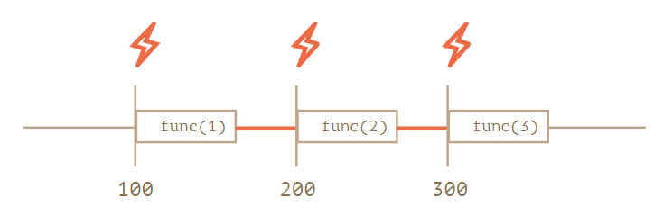
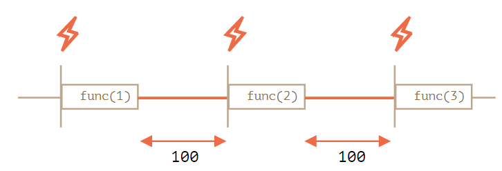

# The JavaScript language
# JavaScript Fundamentals 
### **Interaction in browser** - alert, prompt, confirm 
1. `prompt()` takes 2 arguments, the 1st is the message to hint the user for the inpout, while the 2nd is the default value given in the input bar. Note that in WINDOWS IE, the default value will be undefined if the user doesn't give any input. Therefore, it's suggested to have `prompt("Test", '')`, so it will return an empty string. 
1. `confirm() will sho` a prompt and asked YES or NO. If the user click YES, the event returns a boollean `true`, otherwise it returns `false`. 

### **Conditional operators** - if, '?'
1. If the expression is very simple and in one line, we can put it right after the IF conditions without using curly braces. However, it's still suggested to have curly braces all the time though the following code is only one line. 
1. We can use variables with their bollean types. For example, `0`, `null`, `undefined`, `NaN`, and `false` are boolean `false`. If we put them in the condition of an IF statement, the code won't run. 
1. Question mark "?" is a trinary operator which can represent a simple IF/ELSE statement. For example, `let result = condition ? value1 : value2;`. We can use multiple question marks, while they are like nested IF or ELSE IF statement. 

### **Logical operators** - ||, &&, ! 
1. Each of the following characters have their meaning `||` for OR, `&&` for AND, and `!` for NOT. 
1. In IF statement, the condition will be changed to booelan value by its value type. 
1. If we use "||" in a statement, it will check operands from the left to the right, turn all operands into Boolean type. If it reaches a boolean `true`, it stops and return the operand. If all operand are falsy, such as undefined, NaN, null, false, it will return the last operand it checks. 
1. `&&` AND, on the opposite, checks all operands from the left to right as well, but returns the first falsy operand it reaches. If all operands are true, it returns the last operand it reaches. For example, `alert(1 && null &&2)` returns null, as `null` is the only falsy value. 
1. AND `&&` is in higher priority than OR `||`. Thus, `a && b || c && d` is equivalent to `(a && b) || (c && d)`. 
1. We can use double exclmation marks to turn a value into Boolean type, such as `!!0` becomes `false` as it's a falsy value. 

### **Nullish coalescing operator '??'**
```js
let height = 0;

alert(height || 100); // 100
alert(height ?? 100); // 0
```
1. The nullish coalescing operator `??` provides a short syntax for selecting a first “defined” variable from the list. `x = a ?? b` is equivalent to `x = (a !== null && a !== undefined) ? a : b;`. 
1. As it returns a the first **defined** variable, it can be used as OR `||` in different conditions, especially dealing with falsy values such as `0`. 
1. `??` operator's precedence is rather low but higher than `=` and `?`. When we use it in a complex expression, it's better to give parentheses. 
1. Besides, it can't not be used with `&&` and `||` in the same expression, or it returns a syntax error. 
```js
let height = null;
let width = null;

// important: use parentheses
let area = (height ?? 100) * (width ?? 50);

alert(area); // 5000

// not correct without parentheses 
let area = height ?? (100 * width) ?? 50;
```

### **Loops: while and for**
1. A single execution of the loop body is called an **_iteration_**. 
1. If the loop body has a single statement, we can omit the curly braces `{}`
1. We can move the condition to check in `do..while`. The loop body will be executed at least once, if the condition in while loop is true, the code will be executed again. However, the regualr `while` loop is more preferable. 
1. Note that there must be 2 semi-columns in the for loop condition. Otherwise, there would be a syntax error. 
1. We can use keyword `break` and `continute` if IF/ELSE statement to check if to continue or jump out from the loop. However, we can not use `break/continue` with ternary operator `?` as one of the returned statement. This is a reason not to use question mark operator `?` instead of `if`. 
1. We can label a `for` loop and have the label after keyword `break` as if we have nested `for` loops in a statement. `continue` can also be used as 

### **The switch statement**
1. switch statement will check the variable in the condition if it is strictly equal (the same as triple equals `===`) to any of the following value in each case. Otherwise, it will return the default if there's any. Besides, each case should end with a keyword `break` or `return`. If there's no `break` or `return`, it will keep continuing the code until hitting the next `break` or end of the statement. Note that we can put the value as an expression in the case condition to be compared with the given value. 
1. We can "**categorize**" the cases without having `break` in the expression. Besides, the comparison between the condition and value in the cases are strict. A String "`3`" and Number `3` are different. 
```js
switch (browser) {
  case 'Edge':
    alert( "You've got the Edge!" );
    break;

  case 'Chrome':
  case 'Firefox':
  case 'Safari':
  case 'Opera':
    alert( 'Okay we support these browsers too' );
    break;

  default:
    alert( 'We hope that this page looks ok!' );
}
```

### **Function basics**
1. If a same-named variable is declared inside the function then it shadows the outer one when the outter variable name is the same. 
1. When invoking a function, if a parameter is not provided, then its value becomes `undefined`. Besides, parameters can be given as expression. For example, we can give default value, if there's no any. If the argument is given, it will be overwritten with the given argument. The default value can be a function as well. 
1. However, in older JavaScript, the argument can not be given in expression. 
1. A function can `return` a value back into the calling codeas the result. The keyword `return` can be put any where in the code, while when the execution reaches it, the function stops. Note that we can use `return` without a value, and it causes the function to exit immediately. 
1. A function with an empty `return` or without it returns `undefined`. 
1. We can have an expression in different lines in parenthesis. Note that without parenthesis and changing the line, JavaScript will assume there's a semi-column and returns only the expression after `return` in the same line. 
1. Functions are actions, so their name is usually a verb. Besides, one function should take only one action to prevent confusion. 

### **Function expression** 
1. There are 2 ways to create a `function` by using **_function declaration_** and **_function expression_**. By both ways, the function will be assigned to a variable as the declared name or the variable created with the expression. Besides, the function is the value to the variable. (Note that if we call only the variable without parenthesis, the console will return only the function statement rather than call the function itself. However, in some other languages, the function will execute when it is called, though without parenethesis). Therefore, we can assign the function value to the other variable when assigning without parenthesis. If there are parenthesis, it means the function is called and the variable will get assigned with the output of the function. 

### **Callback functions**
1. **_Callback functions_** are function passed to other funcitons as arguments. Therefore, when we call the main function, it can return the callback when a certain condition is fulfilled. 
1. The functions can be anonymous as an one-time function, which only stays in the main function we called or created. 
1. Note that regular values such as `Strings` and `Numbers` represent the **data**, while a function is an **action**. 

### **Difference between function expression and function declaration**
1. When using a function expression, the function should be created before it is called.
1. For a global function declaration, it can be called any where in the code even though before the function is declared. When JavaScript starts and read the code, it will check all the function declaration before it starts working in its "**initialization stage**". 
1. Function declaration can be scoped as other value and variables. If a function is declared in a code block, it's parent or other outer parts can't call be function. However, if we use function expression to let a variable carry function value, the function can be called out from the code block. 
1. In the following example, the variable welcome will be assign to either version of welcome according to the IF/ELSE statement which check the value of variable `age`. 
```js
let age = prompt("What is your age?", 18);

let welcome;

if (age < 18) {

  welcome = function() {
    alert("Hello!");
  };

} else {

  welcome = function() {
    alert("Greetings!");
  };

}

welcome()
```

### Arrow functions (Basics)
1. Arrow function expression is a simpler and more succinct way to create a function. 
    ```js 
    function sum (a, b) {
        return a + b; 
    } 

    let sumUp = (a, b) => a + b; 
    sum(1,2) === sumUp(1,2) //true 
    ```
1. If the function has only one parameter, we can omit the parenthesis. If the function doesn't take parameter, we can keep an empty parenthesis `()`. 
    ```js 
    //omit parenthesis  
    let double = n => n * 2; 
    double(2); //4 

    //empty parenethsis for function that has no parameter 
    let sayHi = () => console.log('Hello!');
    sayHi();
    ```
1. Arrow functions can be used as function expression that creates a function dynamically. We can use curly braces `{}` as code block to have arrow function with multi-line code body. However, we must have a `return` to return the value of the function as a regular function "**statement**". However, the code is only one line, arrow function will return the "**expression**" after `=>` arrow without having `return`. This feature makes arrow function useful when the function has only one line. 
    ```js 
    let sum = (a, b) => {
        let result = a + b; 
        return result; 
    };
    sum(1,2); //3 
    ``` 
# Code Quality 
### [Debugging in Chrome](https://javascript.info/debugging-chrome) 
### Code Styling 


1. **Curly braces** 
    1. In most JavaScript projects, curly braces `{}` are written in '**Egyptian**' style that the opening brace is on the same line as the corresponding keyword. 
    1. We can omit curly braces follows an `IF` statement, if the `expression` or `statement` is short and can be presented in a single line. However, we shouldn't omit curly braces if the statement has multiple lines because JavaScript may add semicolumn automatically at the end of a line and cause error. Though we still can add curly braces if it's on the same line, it's easier to read without curly braces. 
    1. After all, with curly braces, it's easier to know if there's a code block and allow the reader focus on different section easily. 
1. **Line Length**
    1. We can use backtick " \` " to divide a long `String` in multiple lines. 
    1. In `IF` statement, we can separate the expression in different lines when using AND `&&` or OR `||`. 
    ```js 
    //a long String value in multiple lines 
    let str = `ECMA International's TC39 is a group of JavaScript developers,
    implementers, academics, and more, collaborating with the community
    to maintain and evolve the definition of JavaScript. 
    `; 

    //if statement with multiple expressions 
    if (
        id === 123 &&
        codeStatus === 200 &&
        dataParsed //this is true if the variable is not null or undefined
    ) {
        function(){}
        statements();
    }
    ```
1. **Indents** 
    1. JavaScript, unlike Python, is not space sensitive. We can use either 2 whitespace, 4 whitespaces (same as Python), or a tab (which is equal spacing as 4 whitespaces, but uses different spacing character. `\s` and `\t`). 
    1. It's suggested to use <kbd>space</kbd> rather than <kbd>Tab</kbd>, as it's more flexible to change the spacing. 
1. **Nesting levels** 
    1. We can avoid having to many nesting levels which makes the code hard to read and debug. 
    1. For example, if we have an `IF` statement in a `for` loop to run a code if an expression is `true`, we can use keyword `continue` to skip the code and use `!` to check the expression to avoid having another nested level. 
    ```js 
    //a nested level in for loop 
    for (let i = 0; i < 10; i++) {
        if (cond) {
            statement(); 
        }
    }

    //avoid having a nested code block 
    for (let i = 0; i < 10; i++) {
        if (!cond) continue; 
        statement(); 
    }
    ```
    1. Besides `continue`, we can use keyword `return` and return nothing for a condition if an `IF/ELSE` statement. 
    ```js 
    //an IF/ELSE statement 
    function pow(x, n) {
        if (n < 0) {
            alert("Negative 'n' not supported");
        } else {
            let result = 1;

            for (let i = 0; i < n; i++) {
                result *= x;
            }

            return result;
        }
    }

    //using return and without ELSE
    function pow(x, n) {
        if (n < 0) { //handle n < 0
            alert("Negative 'n' not supported");
            return; //stop and leave the function 
        }

        let result = 1;

        for (let i = 0; i < n; i++) {
            result *= x;
        }

        return result;
    }
    ```
1. **Function placement** 
    1. We can either declare function on the top or at the bottom. 
    1. It's suggested to put the declaration at the bottom, as we can read the code and check the logic from the top. If the functions are named properly, we can even avoid what the functions do. 
1. **Automated Linters**
    1. We can use some extensions such as `linters` to check for pattern issues. 
    1. At the time of learning, <ins>**ESLint**</ins> is the lastest and modern one. 

# Objects Basics
### Objects 
1. An `Object` can be created with curly braces with an optional list of properties. A property is a key/value pair (similar to python dictionaries type data). `key` is a `String` which can also be called property name, while the `value` can be any types of data, such as a `String`, `Number`, `Array`, `Boolean`, `Object`. We can use dot notation to retrive the value of a property from an `Object`. 
1. Keyword `delete` can remvoe a property from an `Object`. Note that `delete` returns a boolean value to indicate if a property is deleted. 
1. We can use multiple words to name a property but the `String` should be quoted. Howveer the property with space in its name should be called with square brackets notation. Besides, to call a property by square brackets the `String` should be quoted as it can take a variable. 
    ```js 
    // create an object 
    let obj = new Object(); 
    let obj = {};

    let user = {
        name: 'John', //key is 'name' and value is 'John'
        age: 30, //key is 'age' and value is '30'
    }
    console.log(user.name) //John
    delete user.age; //true 
    console.log(user) 
    //{name: 'John'} 
    let user = {
        name: 'John',
        age: 30,
        'like birds': true, 
    }
    delete user['like birds'] //true
    ``` 
1. We can use square brackets to give new property in an declaration. The element in the square brackets can be a variable from its parent or global scope. However, if we put a quoted string in the declration, 
    ```js 
    let fruit = 'apple'; 
    let bag = {
        [fruit]: 5, //fruit in square brackets is a variable 
        ['fruit']: 'This is "fruit" property',
        veg: 'This is "veg" property',
    };
    console.log(bag.apple) //5 
    console.log(bag)
    // {apple: 5, fruit: 'This is "fruit" property', veg: 'This is "veg" property'}
    ```
1. If we use a function to create an `Object`, we can use a shorthand to assign both property and value at the same time. 
    ```js 
    function makeUser(name, age){
        return {
            name, 
            age
        }
    }
    let user = makeUser('John',  30);
    console.log(user.name); //John
    ```
1. Property names (keys) of an `Object` should be a `String` or `Symbol`. Any other types will turned into `String` type value. This is actually how `Array` in JavaScript is made. JavaScript doesn't actually has `Array` type value but use `Objects` to mimic the attributes of `Array` in other programming language. Besides, properties (keys) in JavaScript `Object` is in order. If the property is a number, it will follow an ascending order. If the key is other data types, it will be ordered by its created time from old to new. Note that if the number has fractions or other symbols, it is not ordered as integer properties. 
    ```js 
    let obj = {
        0: 'test',
    }
    obj[0] === obj['0'] // true
    let arr = []; 
    typeof(arr) //object
    ```
1. Keyword `in` can check if a property is in an `Object`. Though we can also check if a property exists with `=== undefined`, if the property exists and has value as `undefined`, we can't know exactly if the property exists. Nevertheless, in convention, we use `null` to make variable or property empty rather than giving `undefined`. Besides, we can use keyword `in` in `for` loop to loop through the properties of an `Object`. We can use `in` to check if an `Object` is empty. 
    ```js 
    let user = {
        name: 'John',
        age: 30,
        country: 'TH',
        loveCats: undefined,
    }; 
    'name' in user; // true
    'language' in user; // false
    'loveCats' in user // true 
    user.loveCats === undefined // true 
    user.loveCats === user.gender // true (loveCats is a property while gender is not)
    for (let key in user) {
        console.log(key);
    }
    
    // check if a given object has any property
    function isEmpty(obj){
        for (let key in obj) {
            return false; // key has value if there's any key
        }
        return true; // otherwise return true as its empty because for loop doesn't work
    }
    ``` 
1. If we assign an `Object` to a variable, the variable doesn't copy the value of the `Object` but refer to the destination of the `Object` on computer memory. It means that if the `Object` is changed, all the variable assigned to it is changed. However, if the `Object` is assign with the same value rather than the variable, the variables are equal but not identical. However, if we assign `undefined` or `null` to one of the variables, the other object holds the same value. 
    ```js 
    let obj1 = {}; 
    let obj2 = obj1; 
    let obj3 = {}; 
    obj1 === obj2; // true 
    obj1 == obj3; // false 
    obj2 == obj3; // false 
    obj1 = null; 
    console.log(obj2) //{}
    ``` 

### Symbol 
1. `Object` property keys can be either `String` or `Symbol` type. Othher property names, such as numbers and boolean values will be transferred to `String`. `Symbols` are guaranteed to be unique. 2 `Symbols` that with the same description are not equal. `Symbol` is not `String` type and can't be converted into `String` directly. However, we can use `.toString()` method or `.description` (not a method) to check the description of a `Symbol`. 
    ```js 
    let id1 = Symbol('id');
    let id2 = Symbol('id');
    id1 == id2 // false 
    console.log(id1.toString()) // Symbol(id) 
    console.log(id1.description) // id
    ```
1. We can hide the property name if it's set up by `Symbol`. The only way to call and modify the value of the property is to call the variable that carries the `Symbol` as property. Besides, we can't get the variable that carries the `Symbol` by `for` `in` loop and `Object.keys(obj)` method because the property is "**hidden**". However, if we use `Object.assign()` method, the whole obj including symbols will be duplicated. 
    ```js
    let id = Symbol('id');
    let id1 = Symbol('id');
    let user = {
        name: "John",
        [id]: 123, 
        [id1]: 456,
        id: 'abc',
    };

    console.log(user); // { name: 'John', id: 'abc', [Symbol(id)]: 123, [Symbol(id)]: 456 }
    console.log(user[id]); //123
    console.log(user['id']); //abc 
    console.log(Object.keys(user)); // ['name', 'id']
    for (let key in user) {
    console.log(key); 
    } 
    // name 
    // id

    let obj = {
        [id]: 123, 
    }; 

    let obj1 = Object.assign({}, obj);
    console.log(obj1); // { [Symbol(id)]: 123 }
    console.log(obj == obj1); // false 
    ```
1. **Global symbols** - Though all `Symbols` are unique and different, We can use `Symbol.for(key)` to refer the same symbol value to variables. The `Symbols` created will be stored in `global symbol registry`.  This function will create a `Symbol` by the key it doesn't exist. If the key has been created, it will refer to the `Symbol` with the key. 
    ```js 
    let id = Symbol.for('id');
    let idAgain = Symbol.for('id');
    console.log(id === idAgain); // true 
    ``` 
1. At the opposite, we can use `Symbol.keyFor(sym)` method that takes a variable which has `Symbol` as value and return the `key` of the `Symbol`. Note that the `Symbol` must be in global scope or the method can't find the `Symbol` and returns `undefined` . 
    ```js 
    let sym = Symbol.for('name');
    let sym2 = Symbol.for('id');

    console.log(Symbol.keyFor(sym)); // name 
    console.log(Symbol.keyFor(sym2)); // id
    ```
1. **Summary of `Symbol`** - `Symbol` is a primitive type for unique identifiers which is created with `Symbol()` with an optional description as the argument. Besides, they are always different values though we assign the same description. We can use "**global registry**" and `Symbol.for(key)` to have same-named symbols to be equal. 

### Object methods, "this"
1. We can use either "function expression" or "function declaration" to add a method to an `Object`. 
1. IF we want to call the and use the properties of the `Object` in a method of the `Object` itself, we can use keyword `this` to refer to the `Object`. `this` will refer to different `Object` according to how the method and `this` is called. It means that `this` is dynamic and knows which object it refers to when the code runs. This feature give is both pros and cons that the function using `this` can be reuse, but without pointing to a specific object, it may return wrong value. 
1. Arrow functions have no `this`. These functions will refer to `Object` from its outer element. 
1. In each method of an `Object`, we can `return this` to make the methods chainable. 
    ```js 
    let ladder = {
        step: 0,
        up() {
            this.step++;
            return this;
        },
        down() {
            this.step--;
            return this;
        },
        showStep: function() { // shows the current step
            console.log( this.step );
            return this;
        }
    };

    ladder.up().up().down().up().down().showStep(); // 1 
    ```

### Object to primitive conversion 
1. All objects are `true` in a boolean context. We can check with `Boolean({})` that it returns true. Therefore, an `Object` can only be converted to "**numeric**" or "**string**" type. The numeric conversion happens when we subtract objects or apply mathematical functions. We can use `Number(obj)` or `+obj` with a plus sign to convert an `Object` to a number. 
1. As for the string conversion – it usually happens when we output an object like `console.log(obj)`. We can also pass an `Object` in square bracket notation as the property key of another `Object`. 

# Data types 
### Constructor and operator new
1. Constructor functions technically are regular functions, while they have 2 conventions
    1. They are named with capital letter first. 
    1. They should be executed only with keyword `new`. 
1. When a function is executed with `new`, it does the following steps:
    1. A new empty object is created and assigned to `this`.
    1. The function body executes. Usually it modifies `this`, adds new properties to it.
    1. The value of this is returned.
    ```js 
    let user1 = new User('Jack'); 

    function User(name) {
        // this = {};  (implicitly)

        // add properties to this
        this.name = name;
        this.isAdmin = false;

        // return this;  (implicitly)
    }
    ```
1. We can use `new.target` in a constructor. If we create an `Object` by this constructor function without `new`, it will use `new` keyword to create the `Object`. However, this is not often used, as it's better to have the keyword in the code to know that we've created a new `Object` by the constructor function. 
    ```js 
    function User(name) {
        if (!new.target) { // if you run me without new
            return new User(name); // ...I will add new for you
        }

        this.name = name;
    }
    ```
1. In the constructor function, if we have a `return`, and it returns an `Object`, the constructor function will return the `Object`. If `return` doesn't return anything, it returns an `Object` with `this`. Note that usually constructor function doesn't have `return` statement. 
    ```js 
    function BigUser() {

        this.name = "John";

        return { name: "Godzilla" };  // <-- returns this object
    }

    console.log( new BigUser().name );  // Godzilla, got that object

    function SmallUser() {

        this.name = "John";

        return; // <-- returns this
    }

    console.log( new SmallUser().name );  // John
    ```
1. Besides properties, we can add methods in constructor functions as well. 
    ```js 
    function User(name) {
        this.name = name;

        this.sayHi = function() {
            alert( "My name is: " + this.name );
        };
    }

    let john = new User("John");

    john.sayHi(); // My name is: John
    ```

### Methods of primitives 
1. `Primitives` are not `Objects`. A `Primitive` is a primitive type. There are 7 primitive types in JavaScript: 
    1. `string`
    1. `number`
    1. `bigint`
    1. `boolean`
    1. `symbol`
    1. `null`
    1. `undefined` 
1. An `Object`, on the other hand, can store multiple values as properties. An `Object` can even take a function as a value. 
1. For different primitive values, there are several different kinds of methods that we can use of each of them, though some of the methods are similar. However, we have to understand that primitive values are just values which are considered to be simple, ligh-weighted, and can work as fast as possible. JavaScript allows us to access properties and methods of `string`, `number`, `boolean`, and `symbol` type value through "**object wrappers**". 
    1. In JavaScript, we can also use function constructor such as `Number()`, `String()`, and `Boolean()` with keyword `new` to create `Objects` for primitive values. However, these values are `Object` rather than primitives and some problems occur such as `new Number(0)` is actually an `Object` and its boolean value is `true` which is totally different from a `0`. However, we can use the function without `new` keyword to turn primitive values to one another. 
    1. Note that `null` and `undefined` type value has no "**object wrappers**". 
    ```js 
    let zero = new Number(0); 
    if (zero) console.log("why 0 is true?");
    4 === Number('4'); // true 
    true === Boolean(' ') //true
    '4' === String(4) // true
    ```

### Numbers 
1. In modern JavaScript, there are 2 types of numbers. 
    1. Regular numbers which we use most of the time. 
    1. BigInt that can represent integer at any length between (-2^53) and 2^53. 
1. To createa a variable with large number value, we can give zeros directly, such as creating 1 billion as `100000000`, or we can use `1e9` which means that there are 9 zeros after 1. 
    ```js 
    let billion = 1000000000; 
    let bn = 1e9;
    let ms = 1e-6; 

    console.log(billion);
    console.log(bn);
    console.log(ms);
    console.log((1/1000) === 1e-3); // true 
    ```
1. "**Hex**", "**Binary**", and "**Octal**" numbers are also available in JavaScript though less in use. 
    1. Hexadecimal numbers are usually used for color, encode characters, and many other things. It counts from 0 to 'f' which are 16 digits in total. We can start a number value with `0x` and follows with digits. 
    1. We can use `0b` for binary and `0o` for octal numbers. 
1. For `Numbers`, we can use `num.toString(base)` method which returns a string representation of `num` in the numeral system with the given `base`. Note that the `base` can vary from "**2**" to "**36**". `base=36` system is usually used for shortening a long numeric identifier, such as for shortening URL. 
    ```js 
    let num = 255; 
    console.log(num.toString(16)); // ff 
    console.log(num.toString(2)); // 11111111 
    ```
1. To call a method on a number, we can use double dots ".." without assigning the number to a variable. For example, `16..toString(16)` which is `10` in hexadecimal system. 

**Rounding**
1. To round numbers, there are several commands
    1. `Math.floor()` which rounds "**down**" all the decimals. For example, `Math.floor(3.1)` is `3`, and `Math.floor(-1.1)` is `-2`.
    1. `Math.ceil()` which rounds "**up**" all the decimals. For example, `Math.ceil(3.1)` is `4`.
    1. `Math.round()` which rounds to the "**nearest**" integer. For example, `Math.round(3.1)` is `3`, while `Math.round(3.5)` is `4`.
    1. `Math.trunc()` which takes off anything after the decimal point without rounding. For example, `Math.trunc(3.1)` is `3`, and `Math.trunc(-1.1)` is `-1`. Note that this method is not available in "Internet Explorer" browser. 
1. There are 2 ways to round the number to `n-th` digit after the decimal. We can use expression or `.toFixed()` method to get the number. Note that if the decimal part is shorter than requried, zeros are appended to the end.  
    ```js 
    let num = 1.23456;
    // Multiply and divide 
    console.log(Math.floor(num * 100) / 100); // 1.23456 -> 123.456 -> 123 -> 1.23
    // use toFixed()
    console.log(num.toFixed(2)); // 1.23
    console.log(num.toFixed(4)); // 1.2346
    let n = 1.23;
    console.log(n.toFixed(4)); // 1.2300 
    ```
1. JavaScript, so as other programming languages, has the problem of "**imprecise calculations**". We can fix the problem with `.toFixed()` method that takes off the decimals.  
    ```js 
    console.log((0.1 + 0.2) == 0.3); // false 

    // chop off the decimals 
    let num = (0.1+0.2); 
    console.log(Number(num.toFixed(2)) === 0.3); // true 
    ```
1. Tests: `isFinite` and `isNaN`. `Infinity` and `-Infinity` are special numeric value that is greater and less than anything, while `NaN` represents an error. 
    1. `isNaN()` is a function that converts its argument to a number and tests it for being `NaN`. We can't use `=== NaN` directly because `NaN` is special that it's not enven equal to itself. 
    ```js 
    console.log(isNaN(NaN)); // true
    console.log(isNaN('str')); // true
    console.log(isNaN(NaN === NaN)); // false
    ```
    1. `isFinite()` is a function that converts its argument to a number and return `true` if it's regular number, not `NaN`/`Infinity`/`-Infinity`. Sometimes, `isFinite` is used to validate whether a string value is a regular number. 
    ```js 
    console.log(isFinite('15')); // true 
    console.log(isFinite('str')); // false, because a special value: NaN 
    console.log(isFinite(Infinity)); // false, because a specialvalue: Infinity
    ```
1. We can use `Object.is()` to compare to values. The function is similar to `===`. However, there are 2 special cases. 
    ```js 
    console.log(Object.is(NaN, NaN)); // true 
    console.log(Object.is(0, -0)); // false 
    console.log(Object.is('1', 1)); // false 
    ```
1. Though we can use `+` or `Number()` to convert a value to a number, if the value isn't pure digits, the conversion will fail. We can use `parseInt()` to get a "integer" and `parseFloat()` to get a "float" from a `String`. Note that `parseInt(str, radix)` function have the 2nd argument `radix` which is the base of numeric system. For example, we can check for "hexadecimal" and "octal" numbers. 
    ```js 
    console.log(parseInt('123rem')); // 123
    console.log(parseInt('123.0')); // 123
    console.log(parseFloat('123.456')); // 123.456 
    console.log(parseFloat('123.456.42')); // 123.456 
    console.log(parseInt('ff', 16)); // 255 
    ```
**Math** Object 
1. `Math` is an internal `Object` that has several mathmetical functions. 
1. `Math.random()` returns a fraction from 0 to 1 (not including 1). 
1. `Math.max(a,b,c)` returns the maximum number from the given values. 
1. `Math.min(a,b,c)` returns the minimum number from the given values. 
1. `Math.pow(n, power)` returns `n` raised the given power. For example, `Math.pow(2,10)` is 1024. 

Note: We should be very careful with the calculation by programming language due to "**impercision**" that makes the calculation incorrect. For example, in the exercise, `6.35.toFixed(1)` is `6.3` rather than rounded as `6.4`. We have to use multiplication `console.log(Math.round(6.35 * 10) / 10)` to make the number correct. 

### Strings 
1. In JavaScript the textual data is stored as `Strings`. There is no separate type for a single character, such as "char" type in C language, while "string" is an array of chars. 
1. The internal format for strings is always UTF-16, it is not tied to the page encoding, which could be "UTF-8" or other types. 

**Quotes**
1. `Strings` can be enclosed within either single quotes ('), double quotes ("), and backticks (`). Note that singel and double quotes are essentially the same. We can use one another in the String as part of the value. 
    ```js 
    console.log("I'm Allen");
    ```
1. Backticks, on the other hand, allow us to embed any expression into the string with `${expression}`. Besides, it can allow a string to span multiple lines, which is similar to triple quotes in Python. Backticks also can be used for "template function" with syntax ``func`string` ``.

**Special characters** 
1. We can create multiline strings with single and double quotes with "newline character" `\n`. If we use backticks to make a multilline string, it's the same as using "newline character" to create a `String` with single or double quotes. There are several other special characters such as `\r` (this isn't used alone and should be used with \r\n to represent a line break in Windows text files), `\t` for a tab. Note that all special characters start with a backslash `\`, which is also called "**escape character**". 
    1. `\xXX` is for unicode characters with given hexadecimal unicode `XX`. For example, `\x7A` is the same as `z`. 
    1. `\uXXXX` is a unicode symbol with the hex code `XXXX` in UTF-16 encoding, for instance `\u00A9` is a unicode for the copyright symbol `©`. It must be exactly 4 hex digits. 
    1. `\u{X...XXXXXX}` A unicode symbol with the given UTF-32 encoding (from 1 to 6 hex characters). Some rare characters are encoded with two unicode symbols, taking 4 bytes. This way we can insert long codes.
    ```js 
    let str1 = "Hello\nWorld"; 
    let str2 = `Hello
    World`; 

    console.log(str1 == str2); // true 

    console.log('I\'m Allen'); // escape single quote with backslash 

    console.log("\u00A9"); // ©
    console.log("\u{20331}"); // 佫, a rare Chinese hieroglyph (long unicode)
    console.log("\u{1F60D}"); // 😍, a smiling face symbol (another long unicode)
    ```

**String length** 
1. We can use `.length` to check a `String` value length. Note that `\n` is a single character. Besides, `.length` is a numeric property which is not a function. When calling `.length` we don't put parenthesis. 

**Accessing characters**
1. We can pass a position (index) to either square bracket notation `[]`  or `.charAt()` method to get a character at the given position. Note that the 1st character of the sequnece starts from zero position. Besides, square brackets return `undefined`, while `.charAt()` method returns an empty string when there's no character found. 
1. Similar to `Array`, we can use `for (of)` to loop through each character of a `String`. 

**Strings are immutable**
1. Strings can't be changed in JavaScript. It is impossible to change a character. The usual workaround is to create a whole new string and assign it to the variable instead of the old one. 
    ```js 
    let str = 'Hi'; 
    str[0] = 'h'; // error
    console.log(str[0]); // H

    str = 'h' + str[1]; 
    console.log(str); // hi
    ```

**Changing the case**
1. We can use `.toLowerCase()` method and `toUpperCase()` method to change the case. Note that the methods return a new value without modifying the `String` value. To keep the value, we can assign it to a variable. 

**Searching for substring**
1. `.indexOf()` method takes 2 arguments. The 1st one is the substring we want to find from the `String` value, and the 2nd one is the position to start the search. The method returns the position of the character in the `String`. If the character isn't found, it returns `-1`. Besides, we can use a `while` loop with a counter to check character in the string. The loop keeps iterating until the substring isn't found in the `String` and it `break`. 
    ```js 
    let str = 'Widget with id'; 
    console.log(str.indexOf('Widget')); // 0
    console.log(str.indexOf('id', 2)); // 12

    let str = 'As sly as a fox, as strong as an ox';
    let target = 'as'; // let's look for it
    let pos = 0;
    while (true) {
        let foundPos = str.indexOf(target, pos);
        if (foundPos == -1) break; // stop iteration if substring isn't found
        console.log( `Found at ${foundPos}` );
        pos = foundPos + 1; // continue the search from the next position
    }

    pos = 0; //reset counter
    while ((pos = str.indexOf(target, pos + 1)) != -1) {
        console.log(pos);
    }
    // Found at 7
    // Found at 17
    // Found at 27
    ``` 

**The bitwise NOT trick**
1. This is a very old trick that usually exists in old code. If a number starts with a tilde `~`, the number will be converted to a 32-bit integer (its decimal part will be removed if exists) and reserves all bits in its binary representation. It means for 32-bit integers `~n` equals `-(n+1)`. Therefore, `~n` can only be zero when `n == -1`. We can use this trick to work on `IF` statement. However, this trick is mostly not used, as modern JavaScript introduces other useful methods, such as `.include()`. 
    ```js 
    let str = 'Widget'; 
    if (~str.indexOf('Widget')) {
        console.log('Found it!'); // Found it! 
    }
    ```

**includes, startsWith, endsWith**
1. We can use `.includes()`, `.startsWith()`, and `.endsWith()` methods to check if a substring is in the `String` value. `.includes()` method takes 2 arguments, which is the substring and the starting position. All methods return a boolean value `true` or `false`. 
    ```js 
    let str = 'Widget with id'; 
    console.log(str.includes('Widget')); // true 
    console.log(str.startsWith('Widget')); // true 
    console.log(str.endsWith('Widget')); // false 
    ```

**Get a substring**
1. We can use either `.substring()`, `.substr()`, or `.slice()` to get substring from a `String`. 
1. `.slice()` takes 2 arguments, the first one is the starting position, while the 2nd is the ending (but not included) position. If we give only 1 argument, the method returns a substring from the given starting position till the end. 
1. Besides, we can give negative values to let the method starts reversely. Note that since `-0` is considered the same as `0`, the negavtive value starts from `-1` to count the sequence reversely. 
    ```js 
    let str = 'stringify'; 
    console.log(str.slice(0, 5)); // strin
    console.log(str.slice(0, 1)); // s
    console.log(str.slice(2)); // ringify
    console.log(str.slice(-4, -1)) // gif
    ``` 
1. `.substring()` method is similar to `.slice()` method, as it returns a substring between the given positions. However, it can take starting and ending position reversely. Besides, `.substring()` method doesn't work as `.slice()` as to take negative values to work reversely. 
    ```js 
    let str = 'stringify'; 
    console.log(str.substring(2, 6)) // ring
    console.log(str.substring(6, 2)) // ring
    ```
1. `.substr()` method takes 2 arguments which is the starting position and length of the substring. This allows the user to specify the desireable "**length**" after the given position.
1. Overall, since `.slice()` is more flexible and takes negative arguments and is shorter, it's worthy to remember and use solely with this method over the others. 

**Comparing strings** (#compareString)
1. We know that strings are compared character-by-character in alphabetical order according to "ASCII" or modern "UNICODE" for encoding. In JavaScript, all strings are encoded using "**UTF-16**". It means that each character has a corresponding numeric code. There are special methods that allow to get the character for the code and back. We can use `.codePointAt()` method to check the code of a character. 
1. We can use this method on `String` class `Object` (simialr as using `Object.keys()` or other built-in object related methods). 
    ```js 
    // check code for the character at position '0' 
    console.log('z'.codePointAt(0)); // 122
    console.log('Z'.codePointAt(0)); // 90
    
    // create a character with method 
    console.log(String.codePointAt(90)); // Z

    // 90 is 5a in hexadecimal system
    console.log('\u005a'); // Z

    let str = '';
    for (let i = 0; i <= 220; i++) {
        str += String.fromCodePoint(i);
    }
    console.log(str); // all characters starting from capital A
    ```
1. Most modern browsers support ECMA-402 which allows to compare characters in different language. We can use `str1.localCompare(str2)`. 
    1. If `str1` is greater than `str2`, the method returns a "**positive**" number. 
    1. If `str1` is less than `str2`, the method returns a "**negative**" number. 
    1. If `str1` is the same as `str2`, the method returns `0`. 
    ```js 
    console.log('Österreich'.localeCompare('Zealand')); // -1
    ```

**Internals, Unicode**
1. This part is not used by me at the moment. Therefore, this section is skipped and would be reviewed in the future. The part is mainly about how JavaScript and Unicode handling characters from different languages or emojis. Mostly these special characters are used 2-byte codes, which, however, can have only up to 65,536 combinations ("256 * 256" from "16\*16 \* 16\*16"). 


### Arrays 
**Decalartion**
1. An `Array` in JavaScript can be declared by creating an `Array` "Object" or with square brackets notation. 
    ```js 
    let arr = new Array(); 
    let arr = [];
    ```
1. We can use square brackets notation to add, edit, or remove an element in an `Array`. 
1. To count the length, we can check `.length` property of the `Array`. 
1. An `Array` can store any type of value as its element, such as primitive values, `Object`, and functions. 
    ```js 
    let arr = ['Apple', {name: 'John'}, true, function(){console.log('hello')}];
    
    console.log(arr[1].name);

    arr[3]();
    ```
1. Similar to object, elements in an `Array` are separated by comma. Besides, we can comman on the last element before closing. 

**Methods pop/push, shift/unshift**
1. A "**queue**" (first in first out) is one of the most common uses of an array. For example, we can use `.push()` to append an element to the very end of an `Array` or `.shift()` to remove the element at `arr[0]` which is the very beginning of the `Array` and advance the queue, so the 2nd element becomes the 1st one. 
1. Note that these methods modify the `Array` without returning the `Array` itself. For example, `.push()` method returns the length of the `Array` after adding the new element. Therefore, if we'd like to have the array, we have to assign the array itself to other variables. However, `Arrays` are mutable which means that if the array is modified, the variable pointing to the same array will also change. 
    ```js 
    let arr = [1,2,3,4,5,6]; 
    let list = arr; 
    console.log(arr.push(7)); // 7
    let array = arr.push(8); 
    console.log(array); // 8
    console.log(list); // [1,2,3,4,5,6,7,8]
    ```
1. JavaScript `Array` also supports "**stack**" (last in first out, as dining trays at canteen). We can use `.push()` to add an element at the very end, and `.pop()` to take off the very last element of an `Array`. Note that `.push()` method works as using square bracket notation of `arr[arr.length]`, as we can pass expression to square bracket notation. 
1. `.unshift()` and `.push()` methods takes more than 1 argument to add to an `Array`. 

**Internals**
1. `Array` in JavaScript is a special kind of `Object`, where it uses square brackets to access a property and follows `Object` syntax. In other programming languages, `Array` are data structure that store its elements in a continuous chunk of computer memories with high execution efficiency. However, since `Arrays` are `Objects` in JavaScript, we can also add an element over the `Array` length or a property with dot or square bracket notation. 
    ```js 
    typeof []; // 'object'

    let arr = [1,2,3,4,5]; 
    let obj = {
        0: 1, 
        1: 2, 
        2: 3, 
        3: 4, 
        4: 5, 
    };
    arr[0] === obj[0] // true 
    arr.test = 100;
    console.log(arr) // [1,2,3,4,5,test:100]
    ```
1. Though with the features, `Array` are mostly used to handle ordered data. 

**Performance**
1. Methods `push/pop` run fast, while `shift/unshift` are slow because of the tasks behind the scenes when calling the methods. 
1. When calling `.shift()`, the program not only remove the first element but also renumber all the rest elements in the `Array` and change the property `length`. Therefore, if there are many element in an `Array`, it takes more memory to work when calling `.shift()` or `.unshift()` method. 
1. On the other hand, `.pop()` and `.push()` only add/remove the last element and update property `length`. 

**Loops**
1. Besides using `for` loop with counters, we can use `for of` keyword to call each element in an `Array`. Technically, `Arrays` are `Objects` in JavaScript. We can use square bracket notation with `for in` to loop through the elements as well. 
1. However, it's not good to use `for in` to loop through elements of an `Array` as it may call some prototype methods which we don't want. 
    ```js 
    let fruits = ['Apple', 'Oragne', 'Pear'];
    for (let i = 0; i < arr.length; i++) {
        console.log(fruits[i]);
    }

    for (let fruit of fruits) {
        console.log(fruit);
    }

    for (let key in fruits) {
        console.log(fruits[key]);
    }
    ```

**About length property**
1. `.length` property will be updated automatically when we modify an `Array`. However, it doesn't represent the number of elements in an `Array`, but the last index number plus 1. For example, if we have an `Array` that has only one element but with a very large index number. The `.length` of the `Array` is large as well. 
1. As a property of an `Object`, we can modify `.length` property of an `Array` directly to cut off the elements. However, the process can't be recovered. Though we may add the length back, the elements still are gone. Therefore, we can empty an `Array` with `arr.length = 0`. 
1. Since we can modify `.length` directly, we can add length to an `Array`. The empty slots will be assigned with `undefined`. 
    ```js 
    let arr = [];
    arr[123] = 'abc';
    console.log(arr.length) // 124 

    let array = [1,2,3,4,5]; 
    array.length = 2; 
    console.log(array) // [1,2] 
    array.length = 0;
    console.log(array) // [] 
    ```

**Multidimensional arrays**
1. We can save arrays in another array to create multidimensional arrays. 
    ```js 
    let matrix = [
        [1,2,3],
        [4,5,6],
        [7,8,9],
    ]

    console.log(matrix[1][1]) // 5
    ```

**toString**
1. If we use `.toString()` method on an `Array`, the elements of the `Array` are concatenated but separated with comma. `Arrays` have no `Symbol.toPrimitive` nor `valueOf` and has only `toString()` method. Therefore, `[]` becomes an empty `String`. 
    ```js 
    let arr = [1,2,3]; 
    console.log(String(arr) === '1,2,3'; // true 

    console.log([]+1); // 1 
    console.log([1]+1); // 11 
    console.log([1,2]+1); // 1,21 
    ``` 

**Exercise** 
1. One of the exercises in this section is the "[A maximal subarray](https://en.wikipedia.org/wiki/Maximum_subarray_problem)". The following is the first approach which use nested `for` loop to create `Arrays` and calculate the results. However, this method has O(n^2). Besides, the code has several redudant parts. For example, we can calculate the sum result in the very first nested for loops without having the 2nd set. 
    ```js 
    let numArr = [1, -2, 3, 4, -9, 6]; 

    console.log(getMaxSubSum(numArr));
    console.log(getMaxSubSum([-1, 2, 3, -9])); //5
    console.log(getMaxSubSum([2, -1, 2, 3, -9])); // 6 
    console.log(getMaxSubSum([-1, 2, 3, -9, 11])); // 11
    console.log(getMaxSubSum([-2, -1, 1, 2])); // 3
    console.log(getMaxSubSum([100, -9, 2, -3, 5])); // 100
    console.log(getMaxSubSum([1, 2, 3])); // 6

    function getMaxSubSum(arr) {
        let number = 0; 
        let numbers = [];
        for (let i = 0; i < arr.length; i++) {
            let list = [];
            for (let j = i; j < arr.length; j++) {
                list.push(arr[j]);
            }
            numbers.push(list); 
        }
        // return numbers;
        let empty = [];
        numbers.forEach(function(ele){
            let num = 0;
            ele.forEach(function(element){
                num += element;
                empty.push(num);
            })
        })
        // return empty;
        for (let e of empty) {
            if (e > number) {
                number = e;
            }
        }
        return number; 
    }
    ```
1. A better solution is to have 2 variables to "remember" the numbers and use `Math.max()` function to keep the larger number as the result. The algorithm is optimized and has `O(n)` as time complexity. 
    ```js 
    function getMaxSubSum(arr) {
    let maxSum = 0;
    let partialSum = 0;

    for (let item of arr) { // for each item of arr
        partialSum += item; // add it to partialSum
        maxSum = Math.max(maxSum, partialSum); // remember the maximum
        if (partialSum < 0) partialSum = 0; // zero if negative
    }

    return maxSum;
    }

    console.log(getMaxSubSum([-1, 2, 3, -9]) ); // 5
    console.log(getMaxSubSum([-1, 2, 3, -9, 11]) ); // 11
    console.log(getMaxSubSum([-2, -1, 1, 2]) ); // 3
    console.log(getMaxSubSum([100, -9, 2, -3, 5]) ); // 100
    console.log(getMaxSubSum([1, 2, 3]) ); // 6
    console.log(getMaxSubSum([-1, -2, -3]) ); // 0
    ```

### Array Methods 
**Methods that modifies**
1. Since `Array` is an `Object` in JavaScript, we can use keyword `delete` to delete an element of an `Array`. However, though we delete an element from the `Array`, the `length` property of `Array` is still the same, as the method doesn't affect to `length` property. 
1. We can use `.splice()` (which is like a swiss army knife that can "insert", "remove", and "replace" elements. The syntax is as `arr.splice(index[, deleteCount, elem1, ..., elemN])`. The method starts from `index`, removes `deleteCount` elements, inserts `elem1, ..., elemN`, and return the `Array` of removed elements. (This method is similar to other methods that it doesn't return the modified `Array` itself.)
1. We can also use `.splice()` method to insert elements without any removals by setting `deleteCount` to 0 and giving the position to insert the elements. 
    ```js 
    let arr = ['I', 'study', 'JavaScript', 'right', 'now'];
    let removed = arr.splice(0,2); 
    console.log(arr) // ['I', 'study'] which is the list of removed elements

    arr.splice(2, 0, 'complex', 'language'); 
    console.log(arr) // ['JavaScript', 'right', 'complex', 'language', 'now']
    ```
1. We can give negative indexes as the starting position of an `Array`, which will be counted reversely by the end. Note that if we want to add to the end of the `Array`, we can sue `.push()` method. In other programming language, such as Python, negative 1 `-1` starts to count from the last element of the list reversely. Besides, `.push()`, we can use `.concat()` method to extend an `Array`. 
    ```js 
    let arr = [1,2,5];
    arr.splice(-1, 0, 3, 4); 
    console.log(arr) //[1,2,3,4,5]
    ```

**Methods that return a new Array**
1. `.slice()` is another method that returns a new `Array` copying the items from `start` to `end` (not including). Both `start` and `end` can be negative. If we don't give any argument, the method will return a copy of `Array`. Note that since `Array` is mutable and we can use the method to make a copy to another variable to store the same `Array` value without affecting to one another by regular variable assignment. 
    ```js
    let arr = ['t', 'e', 's', 't']; 
    console.log(arr.slice(1,3)) // ['e','s'] (copy from 1 to 3)
    console.log(arr.slice(-2)) // ['s', 't'] (copy from -2 till the end)
    console.log(arr.slice()) // ['t', 'e', 's', 't'] (a copy of array)
    ```
1. `.concat()` method takes `Array` as arguments and returns a new `Array` that concate the first `Array` with the given ones. Note that `.concat()` method also takes arguments other than `Array`. It works as `.push()` method that it adds the given arguments as elements at behind of the `Array`. If we give an `Object` as argument, the `Object` value will become an element of the `Array`. 
    ```js 
    let arr = [1,2]; 
    console.log(arr.concat([3,4])); // [1,2,3,4]
    console.log(arr.concat([3,4], [5,6])); // [1,2,3,4,5,6]
    ```
1. If an array-like object has a special `Symbol.isConcatSpreadable` property, the object will be treated as an array by `.concat()` method and the elements of the `Object` will be added to the array.   
    ```js 
    let arr = [1,2];
    let arrayLike = {
        0: 'something', 
        1: 'else',
        [Symbol.isConcatSpreadable]: true, 
        length: 2,
    }; 
    console.log(arr.concat(arrayLike)); // [1,2,'something','else'] 
    ```

**forEach**
1. `.forEach()` method takes a function as argument to allow every element in the `Array` runs the function. The syntax of the function is `function(item, index, array)`, which "**item**" is the element in the `Array` in every iteration, "**index**" is the position of the element in the `Array`, and "**array**" is the `Array` it self. 
    ```js 
    ["Bilbo", "Gandalf", "Nazgul"].forEach((item, index, array) => {
        console.log(`${item} is at index ${index} in ${array}`);
    });
    // Bilbo is at index 0 in Bilbo,Gandalf,Nazgul
    // Gandalf is at index 1 in Bilbo,Gandalf,Nazgul
    // Nazgul is at index 2 in Bilbo,Gandalf,Nazgul
    ```

**Searching in array** 
1. `.indexOf()`, `.lastIndexOf()`, and `.includes()` have the same syntax and work essentially the same as their `String` counterparts. 
    1. `arr.indexOf(item, from)` – looks for item starting from index from, and returns "**the index**" where it was found, otherwise `-1`.
    1. `arr.lastIndexOf(item, from)` – works the same as `.indexOf()`, but looks for from right to left.
    1. `arr.includes(item, from)` – looks for item starting from index from, returns a boolean `true` if found. 
1. These methods use `===` comparison, so it does a strict match to find a boolean `false` is in the `Array` rather than `0` or empty string `''`. 
1. Note that `.indexOf()` and `.lastIndexOf()` can't return `NaN` in an `Array` though it exists. Both methods will return `-1` as not found. However, `.includes()` method can correctly handle the value 
    ```js 
    let arr = [1, 0, false]; 
    console.log(arr.indexOf(0)); // 1
    console.log(arr.indexOf(false)); // 2
    console.log(arr.indexOf(null)); // -1

    console.log(arr.includes(1)); // true 

    arr = [NaN]; 
    console.log(arr.indexOf(NaN)); // -1 
    console.log(arr.includes(NaN)); // true  
    ```

**find and findIndex**
1. If we have an array of objects, we can use `.find()` method to check if any of the objects matches a specific condition. If the method returns `true`, the search (iteration) stops and the `item` (which is the `Object`) is returned. If there's nothing found, the method returns `undefined`. Though `.find()` method takes a function that can have `index` and `array` as parameter, these arugments are seldom passed and used. 
1. `.findIndex()` is similar to `.find()`. However, `.findIndex()` returns the index of the matched `Object` element rather than the `Object` itself. 
    ```js 
    let users = [
        {id: 1, name: 'John'},
        {id: 2, name: 'Pete'},
        {id: 3, name: 'Mary'},
    ]; 
    let user = users.find(item => item.id == 1);
    console.log(user.name); // John
    ``` 

**filter**
1. `.filter()` is similar to `.find()`. However, unlike `.find()` that returns only the first matched element, `.filter()` returns an `Array` of all matched elements. 
    ```js 
    let users = [
        {id: 1, name: 'John'},
        {id: 2, name: 'Pete'},
        {id: 3, name: 'Mary'},
    ]; 
    let someUsers = users.filter(item => item.id < 3); 
    console.log(someUsers.length) // 2
    ``` 

**Transform an array**
1. `.map()` method takes a function as its argument and call the function to work on each of the elements and returns an `Array` of the result. 
    ```js 
    let lengths = ['Bilbo', 'Gandalf', 'Nazgul'].map(item => item.length); 
    console.log(lengths); // [5, 7, 6]
    ``` 
1. `.sort()` method sorts the `Array` it works on, change the `Array`'s elements order, and return the sorted `Array`. Note that the method modify the `Array` and return the sorted `Array` (both arrays are the same). However, the elements are sorted as `Strings` by default. In addition, we can pass a function to `.sort()` method to sort the elements of the array on preference. 
1. To sort the array with ascending order, we can pass a function that returns positive number of an expression. On the other hand, if the function returns a negative number, the order will be descending. 
    ```js 
    let arr = [1, -2, 15, 2, 0, 8]; 
    arr.sort(function(a, b) {
        return a - b;
    });

    console.log(arr); // [ -2, 0, 1, 2, 8, 15 ]

    arr.sort(function(a, b) {
        return b - a;
    });

    console.log(arr); // [ 15, 8, 2, 1, 0, -2 ]
    ```
1. On the other hand, if we'd like to compare and sort `Strings`, we'd use `str.localeCompare()` method to sort the letters. We can refer to the section of `Strings`. 

**Reverse**
1. `.reverse()` method reverses the order of element in an `Array`. 
    ```js 
    let arr = [1,2,3,4,5]; 
    arr.reverse(); 
    console.log(arr); // [ 5, 4, 3, 2, 1 ]
    ```

**Split and Join**
1. `.split()` method take a delimiter `delim` that separate the given `String` and return an `Array` of separated elements. Note that this method take a 2nd argument to limit the array length, though it's rarely used. Besides, if we pass an empty `String`, the method will separate every character in the in the `String`, including whitespace. 
    ```js 
    let names = 'Bilbo, Gandalf, Nazgul';
    let arr = names.split(', ');
    console.log(arr); // ['Bilbo', 'Gandalf', 'Nazgul']

    for (let name of arr) {
        console.log( `A message to ${name}.` ); // A message to Bilbo  (and other names)
    }
        
    // A message to Bilbo.
    // A message to Gandalf.
    // A message to Nazgul.

    let list = 'Bilbo, Gandalf, Nazgul, Saruman';
    let arr = names.split(', ', 2); 
    console.log(arr); // ['Bilbo', 'Gandalf']
    ```
1. `.join()` is contrast to `.split()` that it concatenate elements from an `Array` into a single `String`. Besides, we can pass a delimiter to in between the elements. Note that this method returns a `String` rather than modify the `Array`. 
    ```js 
    let arr = ['Bilbo', 'Gandalf', 'Nazgul'];
    let str = arr.join(';'); // glue the array into a string using ;
    console.log( str ); // Bilbo;Gandalf;Nazgul
    ```

**reduce/reduceRight**
1. Besides `.forEach()`, `for`, `for..of`, and `map` methods to loop iterate through `Array`, we can use `.reduce()` method to calculate a single value by manipulating through an `Array`. The syntax is as the followings `let value = arr.reduce(function(accumulator, item, index, array){...}, [initial])`. 
    1. `accumulator` is the result of manipulation from the last iteration. Its value will be `initial` in the first iteration if the argument is given. 
    1. `item` is the current array element. 
    1. `index` is its position. 
    1. `array` is the `Array` itself. 
1. `initial` value is an optional argument to pass into the function. If we don't give the argument, the method will use the first element of the `Array` as the `initial`. Note that this can break the program, as using `.reduce()` method of an empty `Array` will cause error. Besides, the method will have one fewer iterations because the 1st element is not manipulated.  
    ```js 
    let arr = [1,2,3,4,5]; 
    let counter = 0; 
    let result = arr.reduce(function(sum, current) {
        counter++;
        return sum + current; 
    }); 
    console.log(counter); // 4 
    console.log(result); // 15 

    counter = 0; 
    result = arr.reduce(function(sum, current) {
        counter++;
        return sum + current; 
    }, 0); 
    console.log(counter); 
    console.log(result); // 15 

    let giveSix = arr.reduce((sum, current) => sum + current, 6); 
    // console.log(giveSix); // 15 

    let empty = []; 
    let res = empty.reduce((sum, current) => sum + current, 0); 
    // console.log(res);
    ```
1. `.reduceRight()` method works exactly the same as `.reduce()`, while it work from right to left. 

**Array.isArray**
1. Since `Array` in JavaScript is built from `Object`, we can't use `typeof` to check the type directly. Therefore, we can use `Array.isArray(arr)` to check if `arr` is an `Array` in JavaScript. This method returns `true` if the variable is an `Array`.
    ```js 
    console.log(Array.isArray([])); // true 
    console.log(Array.isArray({})); // false 
    ```

**Most methods support "thisArg"**
1. Almost all array methods that call functions, such as `.find()`, `.filter()`, and `.map()`, accept an optional additional parameter `thisArg` (which is passed as the last argument). The value of `thisArg` parameter becomes `this` for the function. 
1. For example, in the example below, if we don't pass `army` object to the method, `army.canJoin` becomes a standalone function which has no `this` to refer to, as `this` is `undefined`. However, we can use `users.filter(user => army.canJoin(user))` which does the same as passing the object. 
    ```js 
    let army = {
        minAge: 18, 
        maxAge: 27, 
        canJoin(user) {
            return user.age >= this.minAge && user.age < this.maxAge; 
        }
    }; 

    let users = [
        {age: 16},
        {age: 20},
        {age: 23},
        {age: 30},
    ]

    let soldiers = users.filter(army.canJoin, army); 
    console.log(soldiers.length); // 2
    console.log(soldiers[0].age); // 20

    let soldiers2 = users.filter(user => army.canJoin(user)); 
    console.log(soldiers2.length); // 2
    console.log(soldiers2[0].age); // 20
    ```

#### Exercise 1 - Translate border-left-width to borderLeftwidth 
1. Write the function camelize(str) that changes dash-separated words like “my-short-string” into camel-cased “myShortString”.
1. Attemptive solution. This approach doesn't work, as it also takes the first text to change the first letter to uppercase. Besides, if the input `String` starts with a dash sign "-", the method `.toUpperCase()` returns an error because the method can't work on emtpy `String`. 
    ```js 
    function camelize(str) {
        let list = str.split('-'); 
        let arr = [];
        let arr = list.map(function(item){
            return item[0].toUpperCase() + item.slice(1); 
        });
        let string = arr.join('');
        return string; 
    }
    ```
1. Solution 
    ```js 
    function camelize(str) {
        let list = str.split('-'); 
        let arr = [];
        for (let i = 1; i < list.length; i++) {
            let text = list[i][0].toUpperCase() + list[i].slice(1);
            arr.push(text); 
        }
        arr.unshift(list[0]); 
        let string = arr.join('');
        return string; 
    }
    ```
1. Answer 
    ```js 
    function camelize(str) {
        return str.split('-').map((word, index) => index == 0 ? word : word[0].toUpperCase() + word.slice(1)).join('');
    }
    ```

#### Exercise 2 - Filter range
1. Write a function filterRange(arr, a, b) that gets an array arr, looks for elements between a and b in it and returns an array of them. The function should not modify the array. It should return the new array.
1. Attemptive solution. `.filter()` takes a function and push the element to a new `Array` if the function returns `true` when iterates the element. 
    ```js 
    function filterRange(arr, a, b) {
        let list = []; 
        arr.forEach(function(e){
            if (e >= a && e <= b) {
                list.push(e); 
            }
        });
        return list; 
    }
    let arr = [5, 3, 8, 1];
    let filtered = filterRange(arr, 1, 4);
    ```
1. Solution
    ```js 
    // long version
    function filterRange(arr, a, b) {
        let list = arr.filter(function(e){
            if (e >= a && e <= b) return true; 
        }); 
        return list; 
    }

    // shorthad 
    function filterRange(arr, a, b) {
        return arr.filter(item => (a <= item && item <= b)); 
    }
    ```

#### Exercise 3 - Sort in decreasing order 
1. Sort elements of an `Array` to decreasing order. 
1. Attemptive solution. `.sort()` method takes a function and check adjacent elements one by one. If the function returns positive nubmer, the `Array` will be sorted in "**descending**" order. If the function returns negative, the `Array` will be sorted in "**ascending**" order. 
    ```js 
    let arr = [5, 2, 1, -10, 8];
    arr.sort((a, b) => ((a-b) < 0) ? 1 : -1 );
    console.log(arr) // [ 8, 5, 2, 1, -10 ]
    ``` 
1. Solution 
    ```js 
    let arr = [5, 2, 1, -10, 8];
    arr.sort((a, b) => b - a);
    console.log(arr) // [ 8, 5, 2, 1, -10 ]
    ```

#### Exercise 4 - Copy and sort array 
1. We'd like to get a copy of `Array` sorted without modifying the `Array`. 
1. Attemptive solution. `.slice()` return a copy of `Array` by giving starting and ending position. If there's no start/end point given, the method returns a copy of the whole `Array`. `.sort()` method is similar that it also returns a sorted `Array` by comparing `Strings`. However, from the notes, it'd be better to use `.localCompare` to ensure the letters are compared correctly if there's special characters, such as letters from the other language. 
    ```js 
    function copySorted(arr){
        let list = arr.slice(); 
        list.sort(function(a, b){
            return a.localeCompare(b);
        });
        return list; 
    }
    ```
1. Solution 
    ```js 
    function copySorted(arr) {
       return arr.slice().sort();
    }
    ```

#### Exercise 5 - Create an extendable calculator 
1. First, implement the method calculate(str) that takes a string like "1 + 2" in the format “NUMBER operator NUMBER” (space-delimited) and returns the result. Should understand plus + and minus -. 
1. Attemptive solution. When solving this problem, we should be careful about the data structure. The Attemptive solution is an deadend for the following solution because it's not extendable. The Attemptive solution was going to use `.call()` method which is not the right direction. The solution uses very basic features of `Objects`. Besides, the value of a key/value pair in `Object` can be any thing, even an expression. 
    ```js 
    function Calculator(){
        this.calculate = function(exp){
            let arr = exp.split(' '); 
            // return arr;
            if (arr[1] == '+') return +arr[0] + +arr[2]; 
            if (arr[1] == '-') return +arr[0] - +arr[2]; 
        }
    }
    ```
1. Solution 
    ```js 
    function Calculator(){
        this.methods = {
            '-': (a,b) => a - b,
            '+': (a,b) => a + b,
        }; 

        this.calculate = function(exp){
            let arr = exp.split(' '); 
            a = +arr[0];
            op = arr[1];
            b = +arr[2];

            if (!this.methods[op] || isNaN(a) || isNaN(b)) {
                return NaN;
            }

            return this.methods[op](a, b);
        }; 

        this.addMethod = function(name, func) {
            this.methods[name] = func;
        };
    }
    ```

#### Exercise 6 - Map to names  
1. You have an array of user objects, each one has user.name. Write the code that converts it into an array of names.
    ```js 
    let john = { name: "John", age: 25 };
    let pete = { name: "Pete", age: 30 };
    let mary = { name: "Mary", age: 28 };
    let users = [ john, pete, mary ];

    let names // your code 
    console.log(names); // ['John', 'Pete', 'Mary']
    ```
1. Attemptive solution. 
    ```js 
    let names = users.map(function(e){
        return e.name;
    })
    ```
1. Solution 
    ```js 
    let names = users.map(item => item.name); 
    ```

#### Exercise 7 - Map to objects 
1. You have an array of `user` objects, each one has `name`, `surname` and `id`. Write the code to create another array from it, of objects with `id` and `fullName`, where `fullName` is generated from `name` and `surname`.
    ```js 
    let john = { name: "John", surname: "Smith", id: 1 };
    let pete = { name: "Pete", surname: "Hunt", id: 2 };
    let mary = { name: "Mary", surname: "Key", id: 3 };
    let users = [ john, pete, mary ];
    let usersMapped // your code 
    /*
    usersMapped = [
        { fullName: "John Smith", id: 1 },
        { fullName: "Pete Hunt", id: 2 },
        { fullName: "Mary Key", id: 3 }
    ]
    */
    console.log(usersMapped[0].id) // 1
    console.log(usersMapped[0].fullName) // John Smith
    ```
1. Attemptive solution 
    ```js 
    let usersMapped = users.map(function(e){
        let obj = {}; 
        obj.fullName = e.name + ' ' + e.surname;
        obj.id = e.id;
        return obj;
    });
    ``` 
1. Solution. Note that for arrow function notation, we need additional parenthesis to return the expression value. 
    ```js 
    let usersMapped = users.map(user => ({
        fullName: `${user.name} ${user.surname}`,
        id: user.id
    }));
    ```

#### Exercise 8 - Sort users by age 
1. Write the function sortByAge(users) that gets an array of objects with the age property and sorts them by age.
    ```js 
    let john = { name: "John", age: 25 };
    let pete = { name: "Pete", age: 30 };
    let mary = { name: "Mary", age: 28 };

    let arr = [ pete, john, mary ];

    sortByAge(arr);

    // now: [john, mary, pete]
    alert(arr[0].name); // John
    alert(arr[1].name); // Mary
    alert(arr[2].name); // Pete
    ```
1. Attemptive solution. `.sort()` method returns a new sorted `Array`. Note that `.sort()` takes a function that check adjacent elements of a given `Array` and sort the elements in ascending/descending orders according to the relationship between 2 compared elements. 
    ```js 
    function sortByAge(users) {
        users.sort(function(a, b){
            if(a.age > b.age) return 1; 
            return -1;
        });
    }
    ```
1. Solution 
    ```js 
    function sortByAge(users){users.sort((a, b) => (a.age > b.age) ? 1 : -1)};
    ```

#### Exercise 9 - Shuffle an array
1. Write the function shuffle(array) that shuffles (randomly reorders) elements of the array. Multiple runs of shuffle may lead to different orders of elements. All element orders should have an equal probability.
    ```js 
    let arr = [1, 2, 3];

    shuffle(arr);
    // arr = [3, 2, 1]

    shuffle(arr);
    // arr = [2, 1, 3]

    shuffle(arr);
    // arr = [3, 1, 2]
    // ...
    ```
1. Attemptive solution. The main idea is to use `Math.random()` to randomly generate a positive/negative number for `.sort()` method to reorder the array. Note that we can skip the variable that keeps the returned `Array` because `.sort()` not only return a sorted `Array` but modified the given `Array`. 
    ```js 
    function shuffle(array){
        let list = array.sort(function(){
            let num = Math.floor(Math.random() * (2) -1);
            return num;
        }); 
        return list; 
    }

    // Reference for generate a random number between given min and max 
    function generateRandom(min, max){
        return Math.floor(Math.random() * (max - min) + min); 
    }
    ```
1. Solution. The regular method to use `.sort()` isn't good enough, as we don't know exactly how the algorithm works according to its runtime (JavaScript engine). Therefore, we can use `Fisher-Yates shuffle`. The idea is to walk the array in the reverse order and swap each element with a random one before it. 
    ```js 
    // Bias shuffle 
    function shuffle(array) {
        array.sort(() => Math.random() - 0.5);
    }

    // Fisher-Yates shuffle
    function shuffle(array) {
        for (let i = array.length - 1; i > 0; i--) {
            let j = Math.floor(Math.random() * (i + 1)); // random index from 0 to i

            // swap elements array[i] and array[j]
            // we use "destructuring assignment" syntax to achieve that
            // you'll find more details about that syntax in later chapters
            // same can be written as:
            // let t = array[i]; array[i] = array[j]; array[j] = t
            [array[i], array[j]] = [array[j], array[i]];
        }
    }
    ```

#### Exercise 10 - Get average age 
1. Write the function getAverageAge(users) that gets an array of objects with property age and returns the average age. The formula for the average is `(age1 + age2 + ... + ageN) / N`.
    ```js 
    let john = { name: "John", age: 25 };
    let pete = { name: "Pete", age: 30 };
    let mary = { name: "Mary", age: 29 };

    let arr = [ john, pete, mary ];

    console.log( getAverageAge(arr) ); // (25 + 30 + 29) / 3 = 28
    ```
1. Attemptive solution. The main idea is to learn how to use `.reduce()` method. 
    ```js 
    // Long version
    function getAverageAge(users) {
        let total = users.reduce(function(acc, e){
            return (acc + e.age);
        }, 0)
        return (total/users.length); 
    }

    // Short version
    function getAverageAge(users) {
        return (users.reduce((acc, item) => acc + item.age, 0)/users.length);
    }
    ```
1. Solution 
    ```js 
    function getAverageAge(users) {
        return users.reduce((prev, user) => prev + user.age, 0) / users.length;
    }
    ```

#### Exercise 11 - Filter unique array members
1. Let `arr` be an array. Create a function `unique(arr)` that should return an array with unique items of `arr`. 
    ```js 
    let strings = ["Hare", "Krishna", "Hare", "Krishna",
        "Krishna", "Krishna", "Hare", "Hare", ":-O"
    ];

    console.log( unique(strings) ); // Hare, Krishna, :-O
    ```
1. Attemptive solution. The idea is to check if an element has appeared or not. 
    ```js 
    function unique(arr){
        let list = [] 
        for (let e of arr) {
            if (!list.includes(e)) {
                list.push(e); 
            }
        }
        return list;
    }
    ```
1. Solution. This is only a solution for small array set as its time complexity is O(n), as it has to go through all the elements in the `Array`. If we use another `for` loop in iteration, it will use O(n^2) time solve the problem. The optimal solution will be introduced in a later section "Map and Set". 
    ```js 
    function unique(arr) {
        let result = [];
        for (let str of arr) {
            if (!result.includes(str)) {
            result.push(str);
            }
        }
        return result;
    }

#### Exercise 12 - Create keyed object from array 
1. Let’s say we received an array of users in the form `{id:..., name:..., age... }`. Create a function `groupById(arr)` that creates an object from it, with `id` as the key, and array items as values and use `.reduce()` method to solve the problem. 
    ```js 
    let users = [
        {id: 'john', name: "John Smith", age: 20},
        {id: 'ann', name: "Ann Smith", age: 24},
        {id: 'pete', name: "Pete Peterson", age: 31},
    ];

    let usersById = groupById(users);

    /*
    // after the call we should have:

    usersById = {
    john: {id: 'john', name: "John Smith", age: 20},
    ann: {id: 'ann', name: "Ann Smith", age: 24},
    pete: {id: 'pete', name: "Pete Peterson", age: 31},
    }
    */
    ```
1. Attemptive solution. The main idea is to assign a property to the `Object` and assign the whole object as value ot the property. The other critical feature here is that we can use square brackets which takes expression to assign a property to an `Object`. Besides, since the square brackets take expression, we can skip getting the property from an `Object` and assign to a variable. 
    ```js 
    // without using reduce method 
    function groupById(users) {
        let obj = {};
        users.forEach(function(e){
            let id = e.id; // we can actual put e.id in the square brackets directly to shortern the code 
            obj[id] = e;
        });
        return obj;
    }

    // using reduce 
    function groupById(users) {
        return users.reduce(function(acc, item){
            let id = item.id
            acc[id] = item;
            return acc;
        }, {})
    }
    ```
1. Solution
    ```js 
    function groupById(array) {
        return array.reduce((obj, value) => {
            obj[value.id] = value;
            return obj;
        }, {})
    }
    ```

### Iterables 
1. "Iterable" object is the concept for `Objects` which can be iterated through `for of` loop. Not only `Arrays` but many other built-in objects are iterable, such as `String`. 

**Symbol.iterator**
1. We can add a method `Symbol.iterator` which is special built-in symbol to make an `Object` be iterable. This `symbol.iterator` method should return a "**iterator**" (which is an `Object` with method `next()`) to make `for of` loop works on the `Ojbect` that is returned by `next()` method. The result returned by `next()` method should be an `Object` which structure is `{done: Boolean, value: any}`. When `done=true`, it means iterations are over or the `value` will be the next value. 
1. For example, we can make the `range` and iterate through 1 to 5. 
    ```js 
    let range = {
        from: 1, 
        to: 5,
    }; 

    // 1. call to for..of initially calls this
    range[Symbol.iterator] = function() {
        // ...it returns the iterator object:
        // 2. Onward, for..of works only with this iterator, asking it for next values
        return {
            current: this.from,
            last: this.to,

            // 3. next() is called on each iteration by the for..of loop
            next() {
                // 4. it should return the value as an object {done:.., value :...}
                if (this.current <= this.last) {
                    return { done: false, value: this.current++ };
                } else {
                    return { done: true };
                }
            }
        };
    };

    // now it works!
    for (let num of range) {
        console.log(num); // 1, then 2, 3, 4, 5
    }
    ```
1. In the example above, we know that the object `range` doesn't have `next()` method itself and use `range[Symbol.iterator]()` to create another `Object` (which is the "iterator" and its `next()` method will return the value). Therefore, technically, the "**iterator**" and the `Object` which is iterated are different `Objects`. Nevertheless, we can merge them make `range` `Object` to work as "**iterator**". 
    ```js 
    let range = {
        from: 1,
        to: 5,

        [Symbol.iterator]() {
            this.current = this.from;
            return this;
        },

        next() {
            if (this.current <= this.to) {
            return { done: false, value: this.current++ };
            } else {
            return { done: true };
            }
        }
    };
    ```
1. If we set `range.to = Infinity`, `range` `Object` will generate infinite sequence of pseudorandom numbers. Though `for of` will iterate endlessly, we can use `break` to stop the iterations.

**String is iterable**
1. Arrays and strings are most widely used built-in iterables. `for of` loop will go through every character of a `String` value. This also works with surrogate pairs. 
    ```js 
    let str = '𝒳😂';
    for (let char of str) {
        console.log( char ); // 𝒳, and then 😂
    }
    ```

**Calling an iterator explicitly**
1. We’ll iterate over a string in exactly the same way as `for..of`, but with direct calls. This code creates a string iterator and gets values from it "**manually**". That is rarely needed, but gives us more control over the process than `for..of`. For instance, we can split the iteration process: iterate a bit, then stop, do something else, and then resume later.
    ```js 
    let str = "Hello";

    // does the same as
    // for (let char of str) alert(char);

    let iterator = str[Symbol.iterator]();

    while (true) {
        let result = iterator.next();
        if (result.done) break;
        console.log(result.value); // outputs characters one by one
    }
    ```

**Iterables and array-like**
1. `Iterables` are objects that implement the `SYmbol.iterator` method
1. `Array-like` are objects that have indexes and `length` property which makes the object look like arrays. 
1. For instance, `Strings` are both "**iterable**" (`for..of` works on them) and "**array-like**" (they have numeric indexes and length).
1. Both `iterables` and `array-likes` are usually not arrays, they don’t have `push`, `pop` method etc. That’s rather inconvenient if we have such an object and want to work with it as with an array.

**Array.from**
1. For **iterables** and **array-like** `Objects`, we can use `Array.from(obj)` method to create an `Array` which takes properties of the `obj`. `Array.from` at the line `(*)` takes the object, examines it for being an **iterable** or **array-like**, then makes a new array and copies all items to it.
    ```js 
    // works on array-like object 
    let arrayLike = {
        0: "Hello",
        1: "World",
        length: 2
    };

    let arr = Array.from(arrayLike); // (*)
    console.log(arr.pop()); // World (method works)
    console.log(arr); // ['Hello']

    // works on iterables
    let range = {
        from: 1,
        to: 5,

        [Symbol.iterator]() {
            this.current = this.from;
            return this;
        },

        next() {
            if (this.current <= this.to) {
            return { done: false, value: this.current++ };
            } else {
            return { done: true };
            }
        }
    };

    let arr = Array.from(range); 
    console.log(arr); // [1, 2, 3, 4, 5]
    ```
1. `Array.from()` method take another 2 arguments which is `mapFn` and `thisArg`. `mapFn` is a function that can be applied to all the elements before they are pushed to the new `Array`. We can also use the method to turn a `String` into an `Array`. 
    ```js 
    let range = {
        from: 1,
        to: 5,

        [Symbol.iterator]() {
            this.current = this.from;
            return this;
        },

        next() {
            if (this.current <= this.to) {
            return { done: false, value: this.current++ };
            } else {
            return { done: true };
            }
        }
    };
    let arr = Array.from(range, num => num * num); 
    console.log(arr) // [1, 4, 9, 16, 25]
    

    let str = 'abcde'; 
    let arr = Array.from(str); 

    console.log(arr); // [ 'a', 'b', 'c', 'd', 'e' ]

    let text = 'abcde'; 
    let array = []; 
    for (let char of text) {
        array.push(char); 
    }
    console.log(array); // [ 'a', 'b', 'c', 'd', 'e' ]

    // check if 2 arrays are identical
    let counter = 0; 
    for (let i = 0; i < arr.length; i++){
        if (arr[i] === array[i]) {
            counter++;
        }
    }
    console.log(counter === 5); // true 
    ```

### Map and Set
1. Map is a collection of keyed data items, just like an Object. But the main difference is that Map allows keys of any type. A regular object will turn its key into strings. For example, if we give a boolean `true` as the key of an object, the key will be turn into `true` as a string value. (Note that we can still use boolean `true` to access the value of the property of the object. However, the property can also be access with dotnotation or square brackets with string values). We can use following methods to manipulate `Map` objects in JavaScript.
    1. `new Map()` - Create a new `Map` object
    1. `map.set(key, value) - Set a value to the `Map` object according to the key.
    1. `map.get(key)` - Retrieve the value of the given key on the `Map` object. This method returns `undefined` if the key doesn't exist.
    1. `map.has(key)` - Check if a key has been used in the `Map` object. This method returns a boolean `true` or `false`.
    1. `map.delete(key)` - Remove the value of the given key in the `Map` object.
    1. `map.clear()` - Remove all the values of the `Map` object. 
    1. `map.size` - This method is similar to `.length` property to check the number of elements of the `Map` object. 
1. Therefore, a Number `1` and String `'1'` can be 2 different keys in a `Map` object. Besides, though we can use square brackets to set and retreive values of a key, JavaScript considers this method as regular Object method and manipulate the `Map` object as a regular object. In addition, a `Map` object can use not only  primitive types as its key but also `Arrays` and `Objects`.
1. `Map` objects use `SameValueZero` algorithm to compare their keys for equivalence, which is similar to strict equality `===`. However, in this algorithm, `NaN` is considered equal to `NaN`. Besides, this algorithm can't be changed or customized. 
1. We can chain the methods of a `Map` object to manipulate its keys and values.
    ```js
    map.set('1', 'str1')
      .set(1, 'num1')
      .set(true, 'bool1');
    ```

**Iteration over `Map`**
1. There 3 methods to iterate through elements of a `Map` object. These methods are similar to those built-in methods of regular objects. However, all the iterables are array-like objects which can only be iterated through `for...of` loop. We can't use square brackets and position index to access elements. 
    1. `map.keys()` returns an iterable for keys. This is similar to `Object.keys([object])` to create an array of keys of an object.
    1. `map.values()` returns an iterable for values. This is similar to `map.keys()` while this method returns a list of values rather than keys.
    1. `map.entries()` returns an array of `[key, value]`.
    ```js
    let recipeMap = new Map([
        ['cucumber', 500],
        ['tomatoes', 350],
        ['onion',    50]
    ]);

    // iterate over keys (vegetables)
    for (let vegetable of recipeMap.keys()) {
        console.log(vegetable); // cucumber, tomatoes, onion
    }

    // iterate over values (amounts)
    for (let amount of recipeMap.values()) {
        console.log(amount); // 500, 350, 50
    }

    // iterate over [key, value] entries
    for (let entry of recipeMap) { // the same as of recipeMap.entries()
        console.log(entry); // cucumber,500 (and so on)
    }
    ```
1. Elements in `Map` objects follow the order that each element is inserted. Note that elements (key/value) pairs don't follow certain order to be listed in an object. 
1. Besides the 3 methods listed above `.keys()`, `.values()`, and `.entries()`, we can use `.forEach()` method to iterate through a `Map` object directly.
    ```js
    recipeMap.forEach((value, key, map) => {
        console.log(`${key}: ${value}`); 
    })
    ```

**Object.entries: Map from Object**
1. We can pass two-dimension array to create a `Map` Object. The inner array should have 2 elements, 1st is the key, and the 2nd is the value. 
    ```js
    let map = new Map([['1', 'str1'], [1, 'num1'], [true, 'bool1']]);
    console.log(map.get('1')); // str1
    ```
1. Since `Object.entries()` also return two-dimension arrays, we can turn a regular `Object` into a `Map` object by the method
    ```js
    let obj = {name: 'John', age: 30}
    let map = new Map(Object.entries(obj));
    console.log(map.get('name')); // John
    ```

**Object.fromEntries: Object from Map**
1. We can use `Object.fromEntries(map.entries())` to create an object from a two-dimension array. 

**Set**
1. A `Set` is a special type collection "set of values", where each value may occur only once.
    1. `new Set([iterable])` - Creates the set, and if an `iterable` object is provided (usually an array), copies values from it into the set. 
    1. `set.add(value)` - Adds a value, returns the set itself.
    1. `set.delete(value)` - Removes the value, returns `true` if `value` existed at the moment of the call, otherwise `false`. 
    1. `set.has(value)` - Returns `true` if the value exists in the set, otherwise `false`. 
    1. `set.clear()` - Removes everything from the set. 
    1. `set.size` - Returns the elements count, similar to `length` property of objects. 
1. As a `Set` can take certain value once in the collection, `set.add(value)` does nothing if we call the function multiple times with the same value. 
1. `Set` is usually used when we want to keep unique value once in the collection. Though we can use regular `Array` with `Array.find` method to perform the function, the performance won't be as good as using `Set`. 

**Iteration over Set**
1. We can use either `for...of` or `forEach` to iterat through a `Set`. 
    ```js
    let set = new Set(['oranges', 'apples', 'bananas']);

    for (let value of set) console.log(value);

    // the same with forEach
    set.forEach((value, valueAgain, set) => {
        console.log(value);
    });
    ```
1. We can notice that the arguments in the callback function in `forEach` of a `Set` object has the value twice. This feature is to make converting a `Set` to `Map` easily when using the method. 
1. We can also use those methods on `Map` objects to iterate through a `Set`.
    1. `set.keys()` - Returns an iterable object for values.
    1. `set.values()` - same as `set.keys()`, for compatibility with `Map`.
    1. `set.entries()` - returns an iterable object for entries `[value, value]`, exists for compatibility with `Map`.

#### Exercise 1 - Filter unique array members
1. Let `arr` be an array.
1. Create a function `unique(arr)` that should return an array with unique items of `arr`.
    ```js
    function unique(arr) {
        let set = new Set();
        arr.forEach(el=>{
            set.add(el);
        });
        let list = [];
        set.forEach(e=>{
            list.push(e);
        });
        return list;    
    }

    let values = ["Hare", "Krishna", "Hare", "Krishna", "Krishna", "Krishna", "Hare", "Hare", ":-O"];

    console.log(unique(values));
    ```
1. Solution 
    ```js
    function unique(arr) {
        return Array.from(new Set(arr));
    }
    ```

#### Exercise 2 - Filter anagrams
1. "**Anagrams**" are words that have the same number of same letters, but in different order.
    1. nap - pan
    1. ear - are - era
    1. cheaters - hectares - teachers
    ```js
    let arr = ["nap", "teachers", "cheaters", "PAN", "ear", "era", "hectares"];

    console.log(aclean(arr)); // "nap,teachers,ear" or "PAN,cheaters,era"
    ```
1. From every anagram group should remain only one word, no matter which one. From the concept of the solution, we can use object directly without using `Map` object.
    ```js
    function aclean(arr) {
        let obj = {};
        for (let word of arr) {
            let text = word.toLowerCase().trim().split('').sort().join('');
            obj[text] = word;
        }
        return Object.values(obj);
    }

    let arr = ["nap", "teachers", "cheaters", "PAN", "ear", "era", "hectares"];

    console.log(aclean(arr));
    ```
1. Solution 
    ```js
    function aclean(arr) {
        let map = new Map();
        for (let word of arr) {
            let text = word.toLowerCase().trim().split('').sort().join('');
            map.set(text, word);
        }
        return Array.from(map.values());
    }
    ```

#### Exercise 3 - Iterable keys
1. We’d like to get an array of `map.keys()` in a variable and then do apply array-specific methods to it, e.g. `Array.push`, but that doesn't work. 
    ```js
    let map = new Map();

    map.set("name", "John");

    let keys = map.keys();

    // Error: keys.push is not a function
    keys.push("more");
    ```
1. `map.keys()` returns a Map iterable which is a array-like object rather than an array. However, we can use `Array.from()` to create an array from Map iterable. Besides, we can use spread operator `...` as well. 
    ```js
    let map = new Map();

    map.set("name", "John");

    // either of the followings work
    let keys = Array.from(map.keys());
    let keysArr = [...map.keys()];
    keys.push('more');
    keysArr.push('more');
    ```

### WeakMap and WeakSet
**WeakMap**
1. In JavaScript, `Arrays` and `Objects` are reference (pointer) to the data in memory. If we assign the variable a `null` to overwrite its previous value, the object will be removed. However, if we keep the `Object` in another `Object`, though the variable thats keeps the object can be overwritten by other value, the `Object` will still be in the `Object`.
    ```js
    let john = {name: 'John'};
    let array = [john];

    john = null;
    console.log(array[0]); // {name: 'John'}    
    ```
1. We can also keep an `Object` in a `Map`, so the object will be stored though its reference variable is overwritten. 
    ```js 
    let john = { name: "John" };
    let map = new Map();
    map.set(john, "...");

    john = null;
    console.log(Array.from(map.keys())[0]); // { name: "John" }
    ```
1. On the other hand, a `WeakMap` works in the other way that the `Object` as the key will be garbage-collected if the variable is removed. In addition, a `WeakMap` doesn't take a `String` value as its key. 
    ```js
    let weakMap = new WeakMap();
    let obj = {};
    weakMap.set(obj, "ok"); 

    // can't use a string as the key
    weakMap.set("test", "Whoops"); // Error, because "test" is not an object

    let john = { name: "John" };
    weakMap.set(john, "...");
    john = null; // overwrite the reference
    // john is removed from memory!
    ```
1. A `WeakMap` object has only few methods and doesn't support iteration methods `.keys()`, `.values()`, and `.entries()` method as a regular `Map`. 
    1. `weakMap.get(key)`
    1. `weakMap.set(key, value)`
    1. `weakMap.delete(key)`
    1. `weakMap.has(key)`

**Use case: additional data**
1. If we are working with an `Object` that is belonged to other code and would like to store data associate with it, `WeakMap` is good for the purpose, as if the object from a 3rd party is expired or gone, the associated data will be removed. 
1. For instance, we have code that keeps a visit count for users. The information is stored in a `Map`: a user object is the key and the visit count is the value. When a user leaves (its object gets garbage collected), we don’t want to store their visit count anymore.
    ```js
    // 📁 visitsCount.js
    let visitsCountMap = new Map(); // map: user => visits count

    // increase the visits count
    function countUser(user) {
        let count = visitsCountMap.get(user) || 0;
        visitsCountMap.set(user, count + 1);
    }

    // 📁 main.js
    let john = { name: "John" };

    countUser(john); // count his visits

    // later john leaves us
    john = null;
    ```
1. We need to clean visitsCountMap when we remove users, otherwise it will grow in memory indefinitely. Such cleaning can become a tedious task in complex architectures. Now we don’t have to clean `visitsCountMap`. After `john` object becomes unreachable by all means except as a key of `WeakMap`, it gets removed from memory, along with the information by that key from `WeakMap`.
    ```js
    // 📁 visitsCount.js
    let visitsCountMap = new WeakMap(); // weakmap: user => visits count

    // increase the visits count
    function countUser(user) {
        let count = visitsCountMap.get(user) || 0;
        visitsCountMap.set(user, count + 1);
    }
    ```
**Use case: caching**
1. Another common example is caching: when a function result should be remembered (“cached”), so that future calls on the same object reuse it. 
    ```js
    // 📁 cache.js
    let cache = new Map();

    // calculate and remember the result
    function process(obj) {
    if (!cache.has(obj)) {
        let result = /* calculations of the result for */ obj;

        cache.set(obj, result);
    }

    return cache.get(obj);
    }

    // Now we use process() in another file:

    // 📁 main.js
    let obj = {/* let's say we have an object */};

    let result1 = process(obj); // calculated

    // ...later, from another place of the code...
    let result2 = process(obj); // remembered result taken from cache

    // ...later, when the object is not needed any more:
    obj = null;

    alert(cache.size); // 1 (Ouch! The object is still in cache, taking memory!)
    ```
1. For multiple calls of `process(obj)` with the same object, it only calculates the result the first time, and then just takes it from `cache`. The downside is that we need to clean `cache` when the object is not needed any more. If we replace `Map` with `WeakMap`, then this problem disappears: the cached result will be removed from memory automatically after the object gets garbage collected.
    ```js
    // 📁 cache.js
    let cache = new WeakMap();

    // calculate and remember the result
    function process(obj) {
    if (!cache.has(obj)) {
        let result = /* calculate the result for */ obj;

        cache.set(obj, result);
    }

    return cache.get(obj);
    }

    // 📁 main.js
    let obj = {/* some object */};

    let result1 = process(obj);
    let result2 = process(obj);

    // ...later, when the object is not needed any more:
    obj = null;

    // Can't get cache.size, as it's a WeakMap,
    // but it's 0 or soon be 0
    // When obj gets garbage collected, cached data will be removed as well
    ```

**WeakSet**
1. It is analogous to `Set`, but we may only add objects to `WeakSet` (not primitives).
1. An object exists in the set while it is reachable from somewhere else.
1. Like `Set`, it supports `add`, has and `delete`, but not `size`, `keys()` and no iterations.
    ```js
    let visitedSet = new WeakSet();

    let john = { name: "John" };
    let pete = { name: "Pete" };
    let mary = { name: "Mary" };

    visitedSet.add(john); // John visited us
    visitedSet.add(pete); // Then Pete
    visitedSet.add(john); // John again

    // visitedSet has 2 users now

    // check if John visited?
    alert(visitedSet.has(john)); // true

    // check if Mary visited?
    alert(visitedSet.has(mary)); // false

    john = null;

    // visitedSet will be cleaned automatically
    ```

#### Exercise 1 - Store "Unread" Flags
1. There’s an array of messages:
    1. Your code can access it, but the messages are managed by someone else’s code. New messages are added, old ones are removed regularly by that code, and you don’t know the exact moments when it happens.
    1. When a message is removed from messages, it should disappear from your structure as well.
    1. We shouldn’t modify message objects, add our properties to them. As they are managed by someone else’s code, that may lead to bad consequences.
    ```js
    let messages = [
        {text: "Hello", from: "John"},
        {text: "How goes?", from: "John"},
        {text: "See you soon", from: "Alice"}
    ];
    ```
1. The solution is to loop through the items of the messages array and check if each item (a message in the array) is read. In this case, I set the status of the message with `false` by default.
    ```js 
    let readMessages = new WeakMap();

    readMessage(messages);
    function readMessage(messages) {
        messages.forEach(function(message){
            if (readMessages.get(message)) {
                let status = readMessages.get(message);
                readMessages.set(message, status);
            } else {
                readMessages.set(message, false);
            }
        });
        return readMessages;
    }
    ```
1. Solution
    ```js
    let messages = [
        {text: "Hello", from: "John"},
        {text: "How goes?", from: "John"},
        {text: "See you soon", from: "Alice"}
    ];

    let readMessages = new WeakSet();

    // two messages have been read
    readMessages.add(messages[0]);
    readMessages.add(messages[1]);
    // readMessages has 2 elements

    // ...let's read the first message again!
    readMessages.add(messages[0]);
    // readMessages still has 2 unique elements

    // answer: was the message[0] read?
    alert("Read message 0: " + readMessages.has(messages[0])); // true

    messages.shift();
    // now readMessages has 1 element (technically memory may be cleaned later)
    ```
1. In addition, we can add `isRead` property to each instance, though it's not encouraged, as the data is managed by other code. Therefore, we can use `Symbol` which will only be recognized by current code. 
    ```js
    // the symbolic property is only known to our code
    let isRead = Symbol("isRead");
    messages[0][isRead] = true;
    ```

#### Exercise 2 - Store Read Dates
1. There’s an array of messages as in the previous task. The situation is similar.
    1. The question now is: which data structure you’d suggest to store the information: “when the message was read?”.
    1. In the previous task we only needed to store the “yes/no” fact. Now we need to store the date, and it should only remain in memory until the message is garbage collected.
    1. Dates can be stored as objects of built-in `Date` class, that we’ll cover later.
    ```js
    let messages = [
        {text: "Hello", from: "John"},
        {text: "How goes?", from: "John"},
        {text: "See you soon", from: "Alice"}
    ];

    let weakMap = new WeakMap();

    addMessageReadDate(messages[0], messages);
    function addMessageReadDate(message, messages){
        weakMap.set(message, new Date());
        messages.forEach(function(message){
            weakMap.set(message, new Date());
        });
        return weakMap;
    }
    ```
1. Solution
    ```js
    let messages = [
        {text: "Hello", from: "John"},
        {text: "How goes?", from: "John"},
        {text: "See you soon", from: "Alice"}
    ];

    let readMap = new WeakMap();

    readMap.set(messages[0], new Date(2017, 1, 1));
    ```

### Object.keys, values, entries
1. We have been using `.keys()`, `.values()`, and `.entreis()` methods for `Map` objects in previous sections. These methods are generic and can be used for other types of data, such as `Map`, `Set`, and `Array`. 
    1. `Object.keys(obj)` returns an array of keys of the `obj`.
    1. `Object.values(obj)` returns an array of values of the `obj`.
    1. `Object.entries(obj)` returns an array of `[key, value]` of the `obj`.
1. Note that to use the methods on `Objects`, we should use it on the `Object` class and pass the object that we want to check. The main reason for the design is that we can use the methods as the object's own methods. Besides, the methods return a real `Array` rather than an iterable object.
1. In addition, if the object property uses `Symbol` as the key, these keys will be ingnored when using these methods. 
1. Though we don't have iteration methods such as `.map()`, `.reduce()`, and `.filter()` as `Array` for `Objects`, we can use `Object.entries(obj)` to create key/value pair array or use `Object.fromEntries(array)` to create a new object from the key/value pairs.
    ```js
    let prices = {
        banana: 1,
        orange: 2,
        meat: 4,
    };

    let doublePrices = Object.fromEntries(
    // convert to array, map, and then fromEntries gives back the object
    Object.entries(prices).map(([key, value]) => [key, value * 2])
    );

    console.log(doublePrices.meat);
    ```

#### Exercise 1 - Sum the Properties
1. There is a `salaries` object with arbitrary number of salaries. Write the function `sumSalaries(salaries)` that returns the sum of all salaries using `Object.values` and the `for..of` loop. If `salaries` is empty, then the result must be 0.
    ```js
    let salaries = {
        "John": 100,
        "Pete": 300,
        "Mary": 250
    };

    function sumSalaries(salaries){
        const allSalaries = Object.values(salaries);
        let totalSalaries = 0;
        for (let salary of allSalaries){
            totalSalaries += salary;
        }
        return totalSalaries;
    }
    ```
1. Solution
    ```js
    function sumSalaries(salaries) {
        let sum = 0;
        for (let salary of Object.values(salaries)) {
            sum += salary;
        }
        return sum; // 650
    }

    let salaries = {
        "John": 100,
        "Pete": 300,
        "Mary": 250
    };

    console.log(sumSalaries(salaries)); // 650
    ```

#### Exercise 2 - Count Properties
1. Write a function `count(obj)` that returns the number of properties in the object:
    ```js
    let user = {
        name: 'John',
        age: 30
    };

    function count(obj){
        return Object.keys(obj).length;
    }

    console.log(count(user)); // 2
    ```
1. Solution
    ```js
    function count(obj) {
        return Object.keys(obj).length;
    }
    ```

### Destructuring Assignment
1. `Destructuring assignment` is a special syntax that allows us to "unpack" arrays or objects into a bunch of variables, as sometimes that’s more convenient. Destructuring also works great with complex functions that have a lot of parameters, default values, and so on.

**Array Destructuring**
1. We can use destructuring assignment for arrays
    ```js
    let arr = ["Ilya", "Kantor"];

    // destructuring assignment
    // sets firstName = arr[0]
    // and surname = arr[1]
    let [firstName, surname] = arr;

    console.log(firstName); // Ilya
    console.log(surname);  // Kantor

    let [firstName, surname] = "Ilya Kantor".split(' ');
    console.log(firstName); // Ilya
    console.log(surname);  // Kantor
    ```
1. Note that Destructuring doesn't mean destructive. This way of assigning is a shorthand rather than affecting the original objects.
    ```js
    let arr = ["Ilya", "Kantor"];
    // let [firstName, surname] = arr;
    let firstName = arr[0];
    let surname = arr[1];
    ```
1. Besides, we can ignore unwanted elements in the array with extra comma. 
    ```js
    let [firstName, , title] = ["Julius", "Caesar", "Consul", "of the Roman Republic"];
    console.log(title);
    ```
1. `Destructuring Assignment` works with any iterable, which object may not be an `Array`, on the right-side.
    ```js
    let [a, b, c] = "abc"; // ["a", "b", "c"]
    let [one, two, three] = new Set([1, 2, 3]);
    ```
1. We can assign to anything at the left-side
    ```js
    let user = {};
    [user.name, user.surname] = "Ilya Kantor".split(' ');

    console.log(user.name); // Ilya
    ```
1. With destructuring assignment, we can work on `.entries()` with objects with shorted code. This is also available for `Map` objects.
    ```js
    let user = {
        name: "John",
        age: 30
    };

    // loop over keys-and-values
    for (let [key, value] of Object.entries(user)) {
        console.log(`${key}:${value}`); // name:John, then age:30
    }

    user = new Map();
    user.set("name", "John");
    user.set("age", "30");

    for (let [key, value] of user) {
        console.log(`${key}:${value}`); // name:John, then age:30
    }
    ```
1. This feature can be used to swap values of variables
    ```js
    let guest = "Jane";
    let admin = "Pete";

    // Swap values: make guest=Pete, admin=Jane
    [guest, admin] = [admin, guest];

    console.log(`${guest} ${admin}`); // Pete Jane (successfully swapped!)
    ```

**The rest `...`**
1. If we want not just to get first values, but also to gather all that follows – we can add one more parameter that gets "the rest" using three dots `...`. In the following example, the value of `rest` is the array of the remaining array elements. We can use any other variable name in place of `rest`, just make sure it has three dots before it and goes last in the destructuring assignment.
    ```js
    let [name1, name2, ...rest] = ["Julius", "Caesar", "Consul", "of the Roman Republic"];

    console.log(name1); // Julius
    console.log(name2); // Caesar

    // Note that type of `rest` is Array.
    console.log(rest[0]); // Consul
    console.log(rest[1]); // of the Roman Republic
    console.log(rest.length); // 2
    ```

**Default Values**
1. If there are fewer values in the array than variables in the assignment, there will be no error. Absent values are considered `undefined`. If we want a "**default**" value to replace the missing one, we can provide it using `=`
    ```js
    let [firstName, surname] = [];

    console.log(firstName); // undefined
    console.log(surname); // undefined

    // default values
    let [name = "Guest", surname = "Anonymous"] = ["Julius"];

    console.log(name);    // Julius (from array)
    console.log(surname); // Anonymous (default used)
    ```
1. Default values can be more complex expressions or even function calls. They are evaluated only if the value is not provided. For instance, here we use the `prompt` function for two defaults. But it will run only for the missing one.
    ```js
    let [name = prompt('name?'), surname = prompt('surname?')] = ["Julius"];

    console.log(name);    // Julius (from array)
    console.log(surname); // whatever prompt gets
    ```

**Object Destructuring**
1. The basic syntax for object destructuring is `let {var1, var2} = {var1:…, var2:…}`. We have an existing object at the right side, that we want to split into variables. The left side contains a “pattern” for corresponding properties. In the simple case, that’s a list of variable names in the curly bracse `{}`. Besides, the order does not matter.
    ```js
    let options = {
        title: "Menu",
        width: 100,
        height: 200
    };

    let {width, height, title} = options;

    console.log(title);  // Menu
    console.log(width);  // 100
    console.log(height); // 200
    ```
1. If we want to assign a property to a variable with another name, for instance, `options.width` to go into the variable named `w`, then we can set it using a colon `:`.
    ```js
    let options = {
        title: "Menu",
        width: 100,
        height: 200
    };

    // { sourceProperty: targetVariable }
    let {width: w, height: h, title} = options;

    // width -> w
    // height -> h
    // title -> title

    console.log(title);  // Menu
    console.log(w);      // 100
    console.log(h);      // 200
    ```
1. For object destructuring assignment, we can also assign default value if the value is given to be assigned. Besides, this can be combined with column `:` if we'd like to change the name of the variable.
    ```js
    let options = {
        title: "Menu"
    };

    let {width: w = 100, height = 200, title} = options;

    console.log(title);  // Menu
    console.log(w);  // 100
    console.log(height); // 200
    ```
1. Just like with arrays or function parameters, default values can be any expressions or even function calls. They will be evaluated if the value is not provided. For example, `prompt` asks for `width`, but not for `title`. 
    ```js
    let options = {
        title: "Menu"
    };

    let {width = prompt("width?"), title = prompt("title?")} = options;

    console.log(title);  // Menu
    console.log(width);  // (whatever the result of prompt is)
    ```
1. We can only extract the values we need from the object rather than all the properties of it.
    ```js
    let options = {
        title: "Menu",
        width: 100,
        height: 200
    };

    // only extract title as a variable
    let { title } = options;

    console.log(title); // Menu
    ```

**The rest pattern `...`**
1. What if the object has more properties than we have variables? Can we take some and then assign the "rest" somewhere? We can use the rest pattern, just like we did with arrays. It’s not supported by some older browsers (IE, use Babel to polyfill it), but works in modern ones.
    ```js
    let options = {
        title: "Menu",
        height: 200,
        width: 100
    };

    // title = property named title
    // rest = object with the rest of properties
    let {title, ...rest} = options;

    // now title="Menu", rest={height: 200, width: 100}
    console.log(rest.height);  // 200
    console.log(rest.width);   // 100
    ```
1. There's a special catch when using object destructuring assignment that we can use the variables that are accessible in the current working context. However, JavaScript assume elements in curly braces `{}` as running in a code block if there's no clear specification for the statement, such as declaring an object. Therefore, we should put the code into parenthesis, so JavaScript will treat it as destructuring assignment for objects.
    ```js
    let title, width, height;

    try { 
        ({title, width, height} = {title: "Menu", width: 200, height: 100});
    } 
    
    console.log(title); // Menu

    // this doesn't work as runtime report syntax error
    {title, width, height} = {title: "Menu", width: 200, height: 100};
    ```

**Nested Destructuring**
1. If an object or an array contain other nested objects and arrays, we can use more complex left-side patterns to extract deeper portions. In the code below `options` has another object in the property `size` and an array in the property `items`. The pattern at the left side of the assignment has the same structure to extract values from them. Note that there are no variables for size and items, as we take their content instead. 
    ```js
    let options = {
        size: {
            width: 100,
            height: 200
        },
        items: ["Cake", "Donut"],
        extra: true
    };

    // destructuring assignment split in multiple lines for clarity
    let {
        size: { // put size here
            width,
            height
        },
        items: [item1, item2], // assign items here
        title = "Menu" // not present in the object (default value is used)
    } = options;

    console.log(title);  // Menu
    console.log(width);  // 100
    console.log(height); // 200
    console.log(item1);  // Cake
    console.log(item2);  // Donut
    ```

**Smart Function Parameters**
1. We can pass parameters as an object, and the function immediately destructurizes them into variables. In this case, we can use both default value and destructuring assignment at the same time. Besides, we can also use more complex destructuring with nested objects and colon mappings. 
    ```js
    let options = {
        title: "My menu",
        items: ["Item1", "Item2"]
    };

    function showMenu({
        title = "Untitled",
        width: w = 100,  // width goes to w
        height: h = 200, // height goes to h
        items: [item1, item2] // items first element goes to item1, second to item2
    }) {
    console.log( `${title} ${w} ${h}` ); // My Menu 100 200
    console.log( item1 ); // Item1
    console.log( item2 ); // Item2
    }

    showMenu(options);
    ```
1. Note that such destructuring assumes that `showMenu()` does have an argument. If we want all values by default, then we should specify an empty object. In addition, we can give an empty object as the default value as well.  
    ```js
    showMenu({}); // ok, all values are default
    showMenu(); // this would give an error

    function showMenu({ title = "Menu", width = 100, height = 200 } = {}) {
        console.log( `${title} ${width} ${height}` );
    }
    showMenu(); // Menu 100 200
    ```

#### Destructuring Assignment
1. We have an `user` object. Write the destructuring assignment that reads:
    1. `name` property into the variable `name`.
    1. `years` property into the variable `age`.
    1. `isAdmin` property into the variable `isAdmin` (false, if no such property)
    ```js
    let user = {
        name: "John",
        years: 30
    };

    let {
        name,
        years: age,
        isAdmin = false,
    } = user;

    console.log(name); // John
    console.log(age); // 30
    console.log(isAdmin); // false
    ```
1. Solution
    ```js
    let user = {
        name: "John",
        years: 30
    };

    let {name, years: age, isAdmin = false} = user;

    console.log(name); // John
    console.log(age); // 30
    console.log(isAdmin); // false
    ```

#### The Maximal Salary
1. We have a `salaries` object. Create the function `topSalary(salaries)` that returns the name of the top-paid person.
    1. If `salaries` is empty, it should return `null`.
    1. If there are multiple top-paid persons, return any of them.
    1. Use `Object.entries` and destructuring to iterate over key/value pairs.
    ```js
    let salaries = {
        "John": 100,
        "Pete": 300,
        "Mary": 250,
    };

    function topSalary(salaries = {}) {
        if (Object.keys(salaries).length === 0) {
            return null;
        }
        let topMan = [];
        let topSalary = Math.max.apply(null, Object.values(salaries));
        for (let [key, value] of Object.entries(salaries)) {
            if (value >= topSalary) {
                topSalary = value;
                topMan.push(key);
            }
        }
        let random = Math.floor(Math.random() * topMan.length);
        return topMan[random];
    }
    console.log(topSalary(salaries));
    ```
1. Solution
    ```js
    function topSalary(salaries) {

    let max = 0;
    let maxName = null;

    for(const [name, salary] of Object.entries(salaries)) {
        if (max < salary) {
            max = salary;
            maxName = name;
        }
    }

    return maxName;
    }
    ```

### Date and Time 
1. A Date object is a built-in class which can store the date and time and provide methods for date/time management. 

**Creation**
1. We can use `new` keyword to create a new `Date` object as `new Date()`. If we create a date object without any argument, the object will be created with current date and time.
1. The argument for `Date` object should be milliseconds since 1970/01/01 00:00 UTC+0. 
    ```js
    let now = new Date();
    console.log(now); //shows current date and time

    let Jan01_1970 = new Date(0);
    console.log(Jan01_1970);

    // now add 24 hours
    let Jan02_1970 = new Date(24 * 3600 * 1000);
    cnosole.log(Jan02_1970);
    ```
1. An integer number representing the number of milliseconds that has passed since the beginning of 1970 is called a "**timestamp**". If we'd like to get the date and time before 1970/01/01, we can pass negative argument (in milliseconds to Date object).
    ```js
    // 31 Dec 1969
    let Dec31_1969 = new Date(-24 * 3600 * 1000);
    cnosole.log(Dec31_1969);
    ```
1. We can use `.getTime()` method on a `Date` object which will the total number of milliseconds since 1970/01/01 until the time of the date object. In addition, we can pass a date string in `yyyy-mm-dd` to create a `Date` object on the given date. Besides, we can use `Date.parse()` to check the total amount of time since 1970/01/01 as `.getTime()`. 
1. Note that we should be aware of the time zone when using the methods. `getTime()` returns the timestamp for the date – a number of milliseconds passed from the January 1st of 1970 UTC+0.
    ```js
    // beware of the time zone 
    new Date('2020-10-01').getTime() === Date.parse('2020-10-01'); // true 
    ```
1. We can use create a `Date` object by passing several arguments in `Number` type. This will create the time with local time zone. 
    1. `year` must have 4 digits. Abbreviations such as `20` for `2020` is not available.
    1. `month` count starts from `0` (January), up to `11` (December).
    1. `date` parameter is actually the day of a month, if this is not given, it will have `1` by default. 
    1. If `hour/minute/second/ms` is absent, they are assumed to be `0`.
    ```js
    new Date(year, month, date, hours, minutes, seconds, ms);
    new Date(2011, 0, 1, 0, 0, 0, 0); // 1 Jan 2011, 00:00:00
    new Date(2011, 0, 1); // the same, hours etc are 0 by default
    ```

**Access Date Components**
1. We can use the following methods to access the details of a `Date` object.
    1. `.getFullYear()` returns the year in 4 digits.
    1. `.getMonth()` returns the month which starts from `0` to `11`. 
    1. `.getDate()` returns the day from 1 to 31.
    1. `.getHours()`, `getMinutes()`, `.getSeconds()`, and `getMilliseconds()` return the corresponding time components.
1. In addition, we can use `.getDay()` which returns the day of a week on the given date. Note that this starts from `0` which is Sunday to `6` (Saturday).
1. Note that all the methods above returns corresponding time components according to local time zone of the machine. There are also their UTC-counterparts, that return day, month, year and so on for the time zone UTC+0: `getUTCFullYear()`, `getUTCMonth()`, `getUTCDay()`. Just insert the "`UTC`" right after "`get`".
1. `.getTimezoneOffset()` returns the difference between UTC and the local time zone, in "**minutes**".
    ```js
    // current date
    let date = new Date();

    // the hour in your current time zone
    console.log(date.getHours());

    // the hour in UTC+0 time zone (London time without daylight savings)
    console.log(date.getUTCHours());

    // if you are in timezone UTC+7, outputs -420
    console.log(new Date().getTimezoneOffset());
    ```

**Setting Date Components**
1. The following methods allow to set date/time components. Every one of them except `setTime()` has a UTC-variant, for instance: `setUTCHours()`.
    1. `.setFullYear(year, [month], [date])`
    1. `.setMonth(month, [date])`
    1. `.setDate(date)`
    1. `.setHours(hour, [min], [sec], [ms])`
    1. `.setMinutes(min, [sec], [ms])`
    1. `.setSeconds(sec, [ms])`
    1. `.setMilliseconds(ms)`
    1. `.setTime(milliseconds)` (sets the whole date by milliseconds since 01.01.1970 UTC)
    ```js
    let today = new Date();

    today.setHours(0);
    console.log(today); // still today, but the hour is changed to 0

    today.setHours(0, 0, 0, 0);
    console.log(today); // still today, now 00:00:00 sharp.
    ```

**Autocorrection**
1. The autocorrection is a very handy feature of Date objects. We can set out-of-range values, and it will auto-adjust itself.
    ```js
    let date = new Date(2013, 0, 32); // January has only 31 days
    console.log(date); // the date becomes February 1st
    ```
1. This feature is convenient that we can simply add 2 days to the `Date` object to find the date 2 days later. Besides, we can also set zero or even negative values.
    ```js
    let date = new Date(2020, 1, 28);
    date.setDate(date.getDate() + 2);

    console.log(date); // 1 Mar 2020

    date = new Date(2020, 0, 2); // 2 Jan 2020

    date.setDate(1); // set day 1 of month
    console.log(date);

    date.setDate(0); // min day is 1, so the last day of the previous month is assumed
    console.log(date); // 31 Dec 2020
    ```

**Date to Number, Date Diff**
1. When a `Date` object is converted to number, it becomes the timestamp same as `date.getTime()`. Note that we can also use `Date.now()` to check current time in milliseconds.
    ```js
    +(new Date()) === new Date().getTime(); // true
    new Date().getTime() === Date.now(); // true
    ```
1. The important side effect: dates can be subtracted, the result is their difference in ms. This can be used for time measurements. For example, the following loop takes around `20` ms to finish iteration.
    ```js
    let start = new Date(); // start measuring time

    // do the job
    for (let i = 0; i < 100000; i++) {
        let doSomething = i * i * i;
    }

    let end = new Date(); // end measuring time

    console.log( `The loop took ${end - start} ms` );
    ```
**Date.now()**
1. If we only want to measure time, we don’t need the Date object. There’s a special method `Date.now()` that returns the current timestamp. It is semantically equivalent to `new Date().getTime()`, but it doesn’t create an intermediate Date object. So it’s faster and doesn’t put pressure on garbage collection.
    ```js
    let start = Date.now(); // milliseconds count from 1 Jan 1970

    // do the job
    for (let i = 0; i < 100000; i++) {
    let doSomething = i * i * i;
    }

    let end = Date.now(); // done

    console.log( `The loop took ${end - start} ms` ); // subtract numbers, not dates
    ```

**Benchmarking**
1. We can measure two functions that calculate the difference between two dates. Such performance measurements are often called "**benchmarks**". These two do exactly the same thing, but one of them uses an explicit date.getTime() to get the date in ms, and the other one relies on a date-to-number transform.
    ```js
    function diffSubtract(date1, date2) {
        return date2 - date1;
    }

    function diffGetTime(date1, date2) {
        return date2.getTime() - date1.getTime();
    }

    function bench(f) {
        let date1 = new Date(0);
        let date2 = new Date();

        let start = Date.now();
        for (let i = 0; i < 100000; i++) f(date1, date2);
        return Date.now() - start;
    }

    console.log( 'Time of diffSubtract: ' + bench(diffSubtract) + 'ms' ); // around 70 ms
    console.log( 'Time of diffGetTime: ' + bench(diffGetTime) + 'ms' ); // around 20 ms
    ```
1. From the testing, `diffSubtract` takes around `70` ms, while `diffGetTime` takes only around `20` ms. However, if we want a reliable benchmark of CPU-hungry function, we should be careful. Imagine that at the time of running `bench(diffSubtract)` CPU was doing something in parallel, and it was taking resources. And by the time of running `bench(diffGetTime)` that work has finished. A pretty real scenario for a modern multi-process OS. As a result, the first benchmark will have less CPU resources than the second. That may lead to wrong results.
1. Modern JavaScript engines start applying advanced optimizations only to “hot code” that executes many times (no need to optimize rarely executed things). So, in the example above, first executions are not well-optimized. We may want to add a heat-up run.
    ```js
    function diffSubtract(date1, date2) {
        return date2 - date1;
    }

    function diffGetTime(date1, date2) {
        return date2.getTime() - date1.getTime();
    }

    function bench(func) {
        let date1 = new Date(0);
        let date2 = new Date();

        let start = Date.now();
        for (let i = 0; i < 100000; i++) func(date1, date2);
        return Date.now() - start;
    }

    let time1 = 0;
    let time2 = 0;

    // added for "heating up" prior to the main loop
    bench(diffSubtract);
    bench(diffGetTime);

    // run bench(upperSlice) and bench(upperLoop) each 10 times alternating
    for (let i = 0; i < 10; i++) {
        time1 += bench(diffSubtract);
        time2 += bench(diffGetTime);
    }

    console.log('Total time for diffSubtract: ' + time1 ); // around 660 ms
    console.log('Total time for diffGetTime: ' + time2 ); // around 70 ms
    ```

**Date.parse from a String**
1. `Date.parse(str)` can read a date from a string. The string format should be `YYYY-MM-DDTHH:mm:ss.sssZ`.
    1. `YYYY-MM-DD` – is the date: year-month-day.
    1. The character "`T`" is used as the delimiter.
    1. `HH:mm:ss.sss` – is the time: hours, minutes, seconds and milliseconds.
    1. The optional '`Z`' part denotes the time zone in the format `+-hh:mm`. A single letter `Z` that would mean UTC+0.
1. Shorter variants are also possible, like `YYYY-MM-DD` or `YYYY-MM` or even `YYYY`. The call to `Date.parse(str)` parses the string in the given format and returns the timestamp (number of milliseconds from 1 Jan 1970 UTC+0). If the format is invalid, returns `NaN`.
    ```js
    let ms = Date.parse('2020-01-26T13:51:50.417-07:00');
    console.log(ms); // 1580071910417

    Date.parse('2020-10-06:23:59:59.999') === new Date(2020,9,6,23,59,59,999).getTime() // true 
    ```

**Summary**
1. Note that unlike many other systems, timestamps in JavaScript are in milliseconds, not in seconds.
1. Sometimes we need more precise time measurements. JavaScript itself does not have a way to measure time in microseconds (1 millionth of a second), but most environments provide it. For instance, browser has performance.now() that gives the number of milliseconds from the start of page loading with microsecond precision (3 digits after the point)
1. Node.js has `microtime` module and other ways. Technically, almost any device and environment allows to get more precision, it’s just not in `Date`.

#### Exercise 1 - Create a Day
1. Create a Date object for the date: Feb 20, 2012, 3:12am. The time zone is local. Show it using `console.log`.
    ```js
    let date = new Date('2012-02-20T03:12');
    console.log(date);
    ```
1. Solution. Note that if we use string for `Date` object to parse, we can use the regular month number directly which starts from `1` for January.
    ```js
    //new Date(year, month, date, hour, minute, second, millisecond)
    let d1 = new Date(2012, 1, 20, 3, 12);
    console.log(d1);

    //new Date(datastring)
    let d2 = new Date("February 20, 2012 03:12:00");
    console.log(d2);
    ```

#### Exercise 2 - Show a Weekday
1. Write a function getWeekDay(date) to show the weekday in short format: ‘MO’, ‘TU’, ‘WE’, ‘TH’, ‘FR’, ‘SA’, ‘SU’.
    ```js
    let date = new Date(2012, 0, 3);  // 3 Jan 2012

    function getWeekDay(date) {
        let day = date.getDay();
        let week = ['SU', 'MO', 'TU', 'WE', 'TH', 'FR', 'SA'];
        return week[day];
    }

    function getWeekDayBySwitch(date){
        let day = date.getDay();
        switch (day) {
            case 0:
                return 'SU';
            break;
            case 1:
                return 'MO';
            break;
            case 2:
                return 'TU';
            break;
            case 3:
                return 'WE';
            break;
            case 4:
                return 'TH';
            break;
            case 5:
                return 'FR';
            break;
            case 6:
                return 'SA';
            break;
            default:
            break;
        }
    }
    console.log(getWeekDay(date)); // should output "TU"
    console.log(getWeekDayBySwitch(date)); // should output "TU"
    ```
1. Solution
    ```js
    function getWeekDay(date) {
    let days = ['SU', 'MO', 'TU', 'WE', 'TH', 'FR', 'SA'];

    return days[date.getDay()];
    }

    let date = new Date(2014, 0, 3); // 3 Jan 2014
    console.log( getWeekDay(date) ); // FR
    ```

#### Exercise 3 - European Weekday
1. European countries have days of week starting with Monday (number 1), then Tuesday (number 2) and till Sunday (number 7). Write a function `getLocalDay(date)` that returns the “European” day of week for `date`.
    ```js
    let date = new Date(2012, 0, 3);  // 3 Jan 2012
    function getLocalDay(date) {
        const weekNum = [7,1,2,3,4,5,6];
        return weekNum[date.getDay()];
    }
    console.log(getLocalDay(date)); // tuesday, should show 2
    ```
1. Solution. This solution is also valid in easier concept, as besides Sunday, other numbers have been alinged.
    ```js
    let date = new Date(2012, 0, 3);  // 3 Jan 2012
    function getLocalDay(date) {
        let day = date.getDay();
        if (day == 0) { // weekday 0 (sunday) is 7 in european
            day = 7;
        }
        return day;
    }
    console.log(getLocalDay(date));
    ```

#### Exercise 4 - Which Day of Month Was Many Days Ago?
1. Create a function `getDateAgo(date, days)` to return the day of month `days` ago from the `date`. 
1. For instance, if today is 20th, then `getDateAgo(new Date(), 1)` should be 19th and `getDateAgo(new Date(), 2)` should be 18th. Should work reliably for days=365 or more. 
1. The function should not modify the given `date`.
    ```js
    let date = new Date(2015, 0, 2);

    function getDateAgo(date, days){
        let duplicateDate = new Date(date);
        duplicateDate.setDate(date.getDate() - days);
        return duplicateDate.getDate();
    }

    console.log(getDateAgo(date, 1)); // 1, (1 Jan 2015)
    console.log(getDateAgo(date, 2)); // 31, (31 Dec 2014)
    console.log(getDateAgo(date, 365)); // 2, (2 Jan 2014)
    ```
1. Solution. Note that we avoid modifying the given date object, so we can use `new Date()` to duplicate another one. As we are using the built-in date class, we can ingore the minor conditions such as the leap year.
    ```js
    function getDateAgo(date, days) {
        let dateCopy = new Date(date);
        dateCopy.setDate(date.getDate() - days);
        return dateCopy.getDate();
    }

    let date = new Date(2015, 0, 2);

    console.log(getDateAgo(date, 1)); // 1, (1 Jan 2015)
    console.log(getDateAgo(date, 2)); // 31, (31 Dec 2014)
    console.log(getDateAgo(date, 365)); // 2, (2 Jan 2014)
    ```

#### Exercise 5 - Last Day of Month?
1. Write a function `getLastDayOfMonth(year, month)` that returns the last day of month. Sometimes it is 30th, 31st or even 28/29th for Feb.
1. Parameters:
    1. `year` – four-digits year, for instance 2012.
    1. `month` – month, from 0 to 11.
1. For instance, `getLastDayOfMonth(2012, 1) = 29` (leap year, Feb).
    ```js
    function getLastDayOfMonth(year, month){
        let date = new Date(year, month + 1);
        return new Date(date.setDate(date.getDate()-1)).getDate();
        //date1 = new Date(year, month+1).setDate(date.getDate() - 1);
        //return (new Date(date1).getDate());
    }

    console.log(getLastDayOfMonth(2012, 1)); // 29
    ```
1. Solution. Normally, dates start from 1, but technically we can pass any number, the date will autoadjust itself. So when we pass 0, then it means "one day before 1st day of the month", in other words: "the last day of the previous month". This feature is by autocorretion.
    ```js
    function getLastDayOfMonth(year, month) {
        let date = new Date(year, month + 1, 0);
        return date.getDate();
    }

    console.log(getLastDayOfMonth(2012, 0)); // 31
    console.log(getLastDayOfMonth(2012, 1)); // 29
    console.log(getLastDayOfMonth(2013, 1)); // 28
    ```

#### Exercise 6 - How Many Seconds Have Passed Today?
1. Write a function `getSecondsToday()` that returns the number of seconds from the beginning of today.
1. For instance, if now were `10:00 am`, and there was no daylight savings shift, then `getSecondsToday() == 36000 // (3600 * 10)`.
    ```js
    function getSecondsToday(){
        let yearToday = new Date().getFullYear();
        let monthToday = new Date().getMonth();
        let dateToday = new Date().getDate();
        return Math.round((Date.now() - new Date(yearToday, monthToday, dateToday))/1000);
    }
    console.log(getSecondsToday());
    ```
1. Solution
    ```js
    function getSecondsToday() {
        let now = new Date();

        // create an object using the current day/month/year
        let today = new Date(now.getFullYear(), now.getMonth(), now.getDate());

        let diff = now - today; // ms difference
        return Math.round(diff / 1000); // make seconds
    }

    console.log(getSecondsToday());

    // an alternative
    function getSecondsToday() {
        let d = new Date();
        return d.getHours() * 3600 + d.getMinutes() * 60 + d.getSeconds();
    }

    console.log(getSecondsToday());
    ```

#### Exercise 7 - How Many Seconds Till Tomorrow?
1. Create a function `getSecondsToTomorrow()` that returns the number of seconds till tomorrow.
1. For instance, if now is `23:00`, then `getSecondsToTomorrow() == 3600`.
    ```js
    function getSecondsToTomorrow(){
        let yearToday = new Date().getFullYear();
        let monthToday = new Date().getMonth();
        let dateToday = new Date().getDate();
        return Math.round((new Date(yearToday, monthToday, dateToday+1) - Date.now()) / 1000);
    } 
    console.log(getSecondsToTomorrow());
    ```
1. Solution
    ```js
    function getSecondsToTomorrow() {
        let now = new Date();

        // tomorrow date
        let tomorrow = new Date(now.getFullYear(), now.getMonth(), now.getDate()+1);

        let diff = tomorrow - now; // difference in ms
        return Math.round(diff / 1000); // convert to seconds
    }

    // an alternative
    function getSecondsToTomorrow() {
        let now = new Date();
        let hour = now.getHours();
        let minutes = now.getMinutes();
        let seconds = now.getSeconds();
        let totalSecondsToday = (hour * 60 + minutes) * 60 + seconds;
        let totalSecondsInADay = 86400;

        return totalSecondsInADay - totalSecondsToday;
    }
    ```

#### Exercise 8 - Format the Relative Date
1. Write a function `formatDate(date)` that should format date as follows
    1. If since `date` passed less than 1 second, then "`right now`".
    1. Otherwise, if since `date` passed less than 1 minute, then "`n sec. ago`".
    1. Otherwise, if less than an hour, then "`m min. ago`".
    1. Otherwise, the full date in the format "`DD.MM.YY HH:mm`". That is: "`day.month.year hours:minutes`", all in 2-digit format, e.g. `31.12.16 10:00`.
    ```js
    function formatDate(date){
        let diff = (Date.now() - date);
        if (diff < 1000) {
            return new Date();
        } else if ((diff >= 1000) && (diff < 60 * 1000)) {
            return `${date.getSeconds()} sec. ago`;
        } else if ((diff >= 60 * 1000) && (diff < 60 * 60 * 1000)) {
            return `${date.getSeconds()} min. ago`;
        } else {
            let year2 = date.getFullYear().toString().slice(2);
            let month2 = date.getMonth() + 1;
            let date2 = date.getDate();
            let hour2 = date.getHours();
            let mins = date.getMinutes();
            return `${date2}.${month2}.${year2} ${hour2}:${mins}`;
        }
    }

    console.log(formatDate(new Date(new Date - 1))); // "right now"
    console.log(formatDate(new Date(new Date - 30 * 1000))); // "30 sec. ago"
    console.log(formatDate(new Date(new Date - 5 * 60 * 1000))); // "5 min. ago"
    // yesterday's date like 31.12.16 20:00
    console.log(formatDate(new Date(new Date - 86400 * 1000)));
    ```
1. Solution
    ```js
    function formatDate(date) {
        let diff = new Date() - date; // the difference in milliseconds

        if (diff < 1000) { // less than 1 second
            return 'right now';
        }

        let sec = Math.floor(diff / 1000); // convert diff to seconds

        if (sec < 60) {
            return sec + ' sec. ago';
        }

        let min = Math.floor(diff / 60000); // convert diff to minutes
        if (min < 60) {
            return min + ' min. ago';
        }

        // format the date
        // add leading zeroes to single-digit day/month/hours/minutes
        let d = date;
        d = [
            '0' + d.getDate(),
            '0' + (d.getMonth() + 1),
            '' + d.getFullYear(),
            '0' + d.getHours(),
            '0' + d.getMinutes()
        ].map(component => component.slice(-2)); // take last 2 digits of every component

        // join the components into date
        return d.slice(0, 3).join('.') + ' ' + d.slice(3).join(':');
    }

    // an alternative solution 
    function formatDate(date) {
        let dayOfMonth = date.getDate();
        let month = date.getMonth() + 1;
        let year = date.getFullYear();
        let hour = date.getHours();
        let minutes = date.getMinutes();
        let diffMs = new Date() - date;
        let diffSec = Math.round(diffMs / 1000);
        let diffMin = diffSec / 60;
        let diffHour = diffMin / 60;

        // formatting
        year = year.toString().slice(-2);
        month = month < 10 ? '0' + month : month;
        dayOfMonth = dayOfMonth < 10 ? '0' + dayOfMonth : dayOfMonth;
        hour = hour < 10 ? '0' + hour : hour;
        minutes = minutes < 10 ? '0' + minutes : minutes;

        if (diffSec < 1) {
            return 'right now';
        } else if (diffMin < 1) {
            return `${diffSec} sec. ago`
        } else if (diffHour < 1) {
            return `${diffMin} min. ago`
        } else {
            return `${dayOfMonth}.${month}.${year} ${hour}:${minutes}`
        }
    }

    console.log(formatDate(new Date(new Date - 1))); // "right now"
    console.log(formatDate(new Date(new Date - 30 * 1000))); // "30 sec. ago"
    console.log(formatDate(new Date(new Date - 5 * 60 * 1000))); // "5 min. ago"
    // yesterday's date like 31.12.2016 20:00
    console.log(formatDate(new Date(new Date - 86400 * 1000)));
    ```

### JSON Methods, toJSON
**JSON.stringify**
1. JSON data type stands for JavaScript Object Notation which is created to serve pain that we'd like to convert the data into `String` when delivering it over a network. Besides, most of the other programming languages on the server-side have libraries to handle data in JSON format. There are 2 main methods we can use. 
    1. `JSON.stringify()` is to turn an Object into JSON.
    1. `JSON.parse()` is to convert a JSON back into an object.
1. By using `JSON.stringify()`, an object will be JSON-encoded, serialized, stringified, or marshalled the be ready to send over the network. 
1. In JSON format, strings can only be quoted with double quotes `"`. Besides, the property (key) is also double-quoted. In addition, `JSON.stringify()` can be applied to primitives as well, such as `String`, `Number`, `Boolean`, and `null`.
1. JSON is data-only language-independent specification, so some JavaScript-specific properties will be skipped when using `JSON.stringify()`, namely funcitons in objects (methods), `Symbol` properties, and properties that have `undefined` as value. 
    ```js
    let user = {
        sayHi() { // ignored
            alert("Hello");
        },
        [Symbol("id")]: 123, // ignored
        something: undefined // ignored
    };

    console.log(JSON.stringify(user)); // {} (empty object)
    ```
1. Note that we can use circular references in JSON
    ```js
    let room = {
        number: 23
    };

    let meetup = {
        title: "Conference",
        participants: ["john", "ann"]
    };

    meetup.place = room;       // meetup references room
    room.occupiedBy = meetup; // room references meetup

    JSON.stringify(meetup); // Error: Converting circular structure to JSON
    ```

**Excluding and Transforming: `replacer`**
1. The full syntax of JSON.stringify is `let json = JSON.stringify(value[, replacer, space])`.
    1. `value` is the value to be encoded in JSON format.
    1. `replacer` is an array of properties to encode or a mapping function `function(key, value)`. Note that if we specify the properties, the function will only turn the given property name in the array into JSON. The function will do a recursive parse to check all the properties of each value, including the nested ones. 
    1. `space` is the amount of space to use for formatting.
    ```js
    let room = {
        number: 23
    };

    let meetup = {
        title: "Conference",
        participants: [{name: "John"}, {name: "Alice"}],
        place: room // meetup references room
    };

    room.occupiedBy = meetup; // room references meetup

    // Here we are probably too strict. The property list is applied to the whole object structure. So the objects in participants are empty, because name is not in the list.
    console.log(JSON.stringify(meetup, ['title', 'participants']));
    // {"title":"Conference","participants":[{},{}]}
    ```
1. Therefore, we can include in the list every property except `room.occupiedBy` that would cause the circular reference. 
    ```js
    let room = {
        number: 23
    };

    let meetup = {
        title: "Conference",
        participants: [{name: "John"}, {name: "Alice"}],
        place: room // meetup references room
    };

    room.occupiedBy = meetup; // room references meetup

    console.log(JSON.stringify(meetup, ['title', 'participants', 'place', 'name', 'number']));
    /*
    {
    "title":"Conference",
    "participants":[{"name":"John"},{"name":"Alice"}],
    "place":{"number":23}
    }
    */
    ```
1. Now everything except `occupiedBy` is serialized. But the list of properties is quite long. Thus, we can use a function instead of an array as the `replacer`. The function will be called for every `(key, value)` pair and should return the "replaced" value, which will be used instead of the original one. Or `undefined` if the value is to be skipped. In our case, we can return `value` "as is" for everything except `occupiedBy`. To ignore `occupiedBy`, the code below returns `undefined`.
    ```js
    let room = {
        number: 23
    };

    let meetup = {
        title: "Conference",
        participants: [{name: "John"}, {name: "Alice"}],
        place: room // meetup references room
    };

    room.occupiedBy = meetup; // room references meetup

    console.log(JSON.stringify(meetup, function replacer(key, value) {
        console.log(`${key}: ${value}`);
        return (key == 'occupiedBy') ? undefined : value;
    }));

    /* key:value pairs that come to replacer:
    :             [object Object]
    title:        Conference
    participants: [object Object],[object Object]
    0:            [object Object]
    name:         John
    1:            [object Object]
    name:         Alice
    place:        [object Object]
    number:       23
    */
    ```
1. Note that `replacer` function gets every key/value pair including nested objects and array items. It is applied recursively. The value of `this` inside `replacer` is the object that contains the current property.
1. The first call is special. It is made using a special "wrapper object": `{"": meetup}`. In other words, the first `(key, value)` pair has an empty key, and the value is the target object as a whole. That’s why the first line is `":[object Object]"` in the example above.

**Formatting: space**
1. The third argument of `JSON.stringify(value, replacer, space)` is the number of spaces to use for pretty formatting. Previously, all stringified objects had no indents and extra spaces. That’s fine if we want to send an object over a network. The `space` argument is used exclusively for a nice output. Here `space = 2` tells JavaScript to show nested objects on multiple lines, with indentation of 2 spaces inside an object. The `space` parameter is used solely for logging and nice-output purposes. 
    ```js
    let user = {
        name: "John",
        age: 25,
        roles: {
            isAdmin: false,
            isEditor: true
        }
    };

    console.log(JSON.stringify(user, null, 2));
    /* two-space indents:
    {
    "name": "John",
    "age": 25,
    "roles": {
        "isAdmin": false,
        "isEditor": true
    }
    }
    */

    /* for JSON.stringify(user, null, 4) the result would be more indented:
    {
        "name": "John",
        "age": 25,
        "roles": {
            "isAdmin": false,
            "isEditor": true
        }
    }
    */
    ```

**Custom `toJSON`**
1. Like `.toString()` for string conversion, an object may provide method `.toJSON()` for to-JSON conversion. `JSON.stringify` automatically calls it if available. For example, a `Date` object will be transferred to string automatically when encoded with `JSON.stringify()`
    ```js
    let room = {
        number: 23
    };

    let meetup = {
        title: "Conference",
        date: new Date(Date.UTC(2017, 0, 1)),
        room
    };

    console.log(JSON.stringify(meetup));
    /*
    {
        "title":"Conference",
        "date":"2017-01-01T00:00:00.000Z",  // (1)
        "room": {"number":23}               // (2)
    }
    */
    ```
1. In the example below, if we modify the object and add `toJson` method to it, `toJSON` is used both for the direct call `JSON.stringify(room)` and when `room` is nested in another encoded object.
    ```js
    let room = {
        number: 23,
        toJSON() {
            return this.number;
        }
    };

    let meetup = {
        title: "Conference",
        room
    };

    console.log(JSON.stringify(room)); // 23
    console.log(JSON.stringify(meetup));
    /*
    {
        "title":"Conference",
        "room": 23
    }
    */
    ```

**JSON.parse**
1. To decode a JSON-string, we need another method named `JSON.parse`. The syntax is `let value = JSON.parse(str, [reviver]);`. The JSON may be as complex as necessary, objects and arrays can include other objects and arrays. But they must obey the same JSON format.
    1. `str` is the JSON-string to be parsed.
    1. `reviver` is an optional `function(key,value)` that will be called for each `(key, value)` pair and can transform the value.
    ```js
    // stringified array
    let numbers = "[0, 1, 2, 3]";

    numbers = JSON.parse(numbers);

    console.log(numbers[1]); // 1
    ```
1. There’s another format named `JSON5`, which allows unquoted keys, comments etc. But this is a standalone library, not in the specification of the language. The regular JSON is that strict not because its developers are lazy, but to allow easy, reliable and very fast implementations of the parsing algorithm.

**Using reviver**
1. If we got a stringified `meetup` object from the server and need to deserialize it to turn it back into regular JavaScript object. The value of `meetup.date` is a string, not a `Date` object. 
    ```js
    // title: (meetup title), date: (meetup date)
    let str = '{"title":"Conference","date":"2017-11-30T12:00:00.000Z"}';
    let meetup = JSON.parse(str);
    console.log(meetup.date.getDate()); // Error!
    ```
1. In this case, we can use `reviver`. The value will be turned back into desirable object. Besides, this function runs recursively as `replacer` for `JSON.stringify()` that it will work on nested objects as well. 
    ```js
    let str = '{"title":"Conference","date":"2017-11-30T12:00:00.000Z"}';

    let meetup = JSON.parse(str, function(key, value) {
        if (key == 'date') return new Date(value);
        return value;
    });

    console.log(meetup.date.getDate()); // now works!

    let schedule = `{
        "meetups": [
            {"title":"Conference","date":"2017-11-30T12:00:00.000Z"},
            {"title":"Birthday","date":"2017-04-18T12:00:00.000Z"}
        ]
    }`;

    schedule = JSON.parse(schedule, function(key, value) {
        if (key == 'date') return new Date(value);
        return value;
    });

    console.log(schedule.meetups[1].date.getDate()); // works!
    ```

#### Exercise 1 - Turn the Object into JSON and Back
1. Turn the `user` into JSON and then read it back into another variable.
    ```js
    let user = {
        name: "John Smith",
        age: 35
    };

    let user2 = JSON.parse(JSON.stringify(user));
    console.log(user2);
    ```
1. Solution
    ```js
    let user = {
        name: "John Smith",
        age: 35
    };

    let user2 = JSON.parse(JSON.stringify(user));
    ```

#### Exercise 2 - Exclude Backreferences
1. In simple cases of circular references, we can exclude an offending property from serialization by its name. But sometimes we can’t just use the name, as it may be used both in circular references and normal properties. So we can check the property by its value. Write `replacer` function to stringify everything, but remove properties that reference `meetup`. 
    ```js
    let room = {
        number: 23
    };

    let meetup = {
        title: "Conference",
        occupiedBy: [{name: "John"}, {name: "Alice"}],
        place: room
    };

    // circular references
    room.occupiedBy = meetup;
    meetup.self = meetup;

    console.log(JSON.stringify(meetup, function replacer(key, value) {
        if (key === 'self') {
            return undefined;
        } 
        if (key === 'place') {
            return value.number;
        }
        return value;
    }));

    /* result should be:
    {
    "title":"Conference",
    "occupiedBy":[{"name":"John"},{"name":"Alice"}],
    "place":{"number":23}
    }
    */
    ```
1. Solution. Here we also need to test `key==""` to exclude the first call where it is normal that value is meetup. The tentative solution is wrong because `place` property has only the number, but the property `number` is removed. Therefore, we should check the `value` in `replacer` function and ignore the very first iteration in the recursion, which `key` is empty as `""`.
    ```js
    let room = {
        number: 23
    };

    let meetup = {
        title: "Conference",
        occupiedBy: [{name: "John"}, {name: "Alice"}],
        place: room
    };

    room.occupiedBy = meetup;
    meetup.self = meetup;

    console.log(JSON.stringify(meetup, function replacer(key, value) {
        return (key != "" && value == meetup) ? undefined : value;
    }));

    /*
    {
    "title":"Conference",
    "occupiedBy":[{"name":"John"},{"name":"Alice"}],
    "place":{"number":23}
    }
    */
    ```

# Advanced working with functions
## Recursion and Stack
1. Recursion is a programming pattern that is useful in situations when a task can be naturally split into several tasks of the same kind, but simpler. Or when a task can be simplified into an easy action plus a simpler variant of the same task. Or, as we’ll see soon, to deal with certain data structures. 
1. When a function solves a task, in the process it can call many other functions. A partial case of this is when a function calls itself. That’s called recursion.

### Two Ways of Thinking
1. For something simple to start with – let’s write a function `pow(x, n)` that raises `x` to a natural power of `n`. In other words, multiplies x by itself n times.
1. Iterative thinking: the `for` loop
    ```js
    function pow(x, n) {
        let result = 1;
        // multiply result by x n times in the loop
        for (let i = 0; i < n; i++) {
            result *= x;
        }
    return result;
    }

    console.log(pow(2, 2)) // 4
    console.log(pow(2, 3)) // 8
    console.log(pow(2, 4)) // 16
    ```
1. Recursive thinking: simplify the task and call self
    1. If `n == 1`, then everything is trivial. It is called the base of recursion, because it immediately produces the obvious result: `pow(x, 1)` equals `x`. 
    1. Otherwise, we can represent `pow(x, n)` as `x * pow(x, n - 1)`. In maths, one would write `x^n = x * x^(n-1)`. This is called a recursive step: we transform the task into a simpler action (multiplication by `x`) and a simpler call of the same task (`pow` with lower `n`). Next steps simplify it further and further until `n` reaches `1`.
    ```js
    function pow(x, n) {
        if (n == 1) {
            return x;
        } else {
            return x * pow(x, n - 1);
        }
    }

    console.log(pow(2, 2)) // 4
    console.log(pow(2, 3)) // 8
    console.log(pow(2, 4)) // 16
    ```
1. For example, to calculate `pow(2, 4)` the recursive variant does these steps:
    1. pow(2, 4) = 2 * pow(2, 3)
    1. pow(2, 3) = 2 * pow(2, 2)
    1. pow(2, 2) = 2 * pow(2, 1)
    1. pow(2, 1) = 2
1. Recursion is usually shorter. A recursive solution is usually shorter than an iterative one. 
    ```js
    function pow(x, n) {
        return (n == 1) ? x : (x * pow(x, n - 1));
    }
    ```
1. The maximal number of nested calls (including the first one) is called recursion depth. In our case, it will be exactly `n`. 
1. The maximal recursion depth is limited by JavaScript engine. We can rely on it being 10000, some engines allow more, but 100000 is probably out of limit for the majority of them. There are automatic optimizations that help alleviate this (“tail calls optimizations”), but they are not yet supported everywhere and work only in simple cases. 
1. That limits the application of recursion, but it still remains very wide. There are many tasks where recursive way of thinking gives simpler code, easier to maintain.

### The Execution Context and Stack
1. The information about the process of execution of a running function is stored in its "**execution context**". The execution context is an internal data structure that contains details about the execution of a function: where the control flow is now, the current variables, the value of `this`, and few other internal details.
1. When a function makes a nested call, the following happens:
    1. The current function is paused.
    1. The execution context associated with it is remembered in a special data structure called "**execution context stack**".
    1. The nested call executes.
    1. After it ends, the old execution context is retrieved from the stack, and the outer function is resumed from where it stopped.
1. Note the memory requirements. Contexts take memory. In the case above, raising to the power of `n` actually requires the memory for `n` contexts, for all lower values of `n`. A loop-based algorithm is more memory-saving. The iterative `pow` uses a single context changing `i` and `result` in the process. Its memory requirements are small, fixed and do not depend on `n`.
    ```js
    function pow(x, n) {
        let result = 1;
        for (let i = 0; i < n; i++) {
            result *= x;
        }
        return result;
    }
    ```
1. Any recursion can be rewritten as a loop. The loop variant usually can be made more effective. However, sometimes the rewrite is non-trivial, especially when function uses different recursive subcalls depending on conditions and merges their results or when the branching is more intricate. And the optimization may be unneeded and totally not worth the efforts. Recursion can give a shorter code, easier to understand and support. Optimizations are not required in every place, mostly we need a good code, that’s why it’s used.

### Recursive Traversals
1. Another great application of the recursion is a recursive traversal. For example, we have a company. The staff structure can be presented as an object. In other words, a company has departments.
    1. A department may have an array of staff. For instance, `sales` department has 2 employees, John and Alice.
    1. Or a department may split into subdepartments, like `development` has two branches, `sites` and `internals`. Each of them has their own staff.
    1. It is also possible that when a subdepartment grows, it divides into subsubdepartments (or teams).
    1. For instance, the `sites` department in the future may be split into teams for `siteA` and `siteB`. And they, potentially, can split even more. 
    ```js
    let company = {
        sales: [{
            name: 'John',
            salary: 1000
        }, {
            name: 'Alice',
            salary: 1600
        }],

        development: {
            sites: [{
            name: 'Peter',
            salary: 2000
            }, {
            name: 'Alex',
            salary: 1800
            }],

            internals: [{
            name: 'Jack',
            salary: 1300
            }]
        }
    };
    ```
1. In this case, it's not easy to summarize the total salary of all the employees in the company by using iterative solutions because the data strcutrue is not simple. Besides, we have to rewrite the loop every time the `company` objects have further sub-departments. 
1. With recursive solution, we can check the only 2 possible cases in this data structure.
    1. Either it’s a "**simple**" department with an `array` of people – then we can sum the salaries in a simple loop.
    1. Or it’s an object with `N` subdepartments – then we can make N recursive calls to get the sum for each of the subdeps and combine the results.
1. The 1st case is the base of recursion, the trivial case, when we get an `array`.
1. The 2nd case when we get an `object` is the recursive step. A complex task is split into subtasks for smaller departments. They may in turn split again, but sooner or later the split will finish at (1). It also works for any level of subdepartment nesting.
    1. Method `arr.reduce` is to get the sum of the array.
    1. Loop `for(val of Object.values(obj))` to iterate over object values. `Object.values` returns an array of them.
    ```js
    let company = { // the same object, compressed for brevity
        sales: [{name: 'John', salary: 1000}, {name: 'Alice', salary: 1600 }],
        development: {
            sites: [{name: 'Peter', salary: 2000}, {name: 'Alex', salary: 1800 }],
            internals: [{name: 'Jack', salary: 1300}]
        }
    };

    // The function to do the job
    function sumSalaries(department) {
        if (Array.isArray(department)) { // case (1)
            return department.reduce((prev, current) => prev + current.salary, 0); // sum the array
        } else { // case (2)
            let sum = 0;
            for (let subdep of Object.values(department)) {
                sum += sumSalaries(subdep); // recursively call for subdepartments, sum the results
            }
            return sum;
        }
    }

    console.log(sumSalaries(company)); // 7700
    ```

### Recursive Structures
1. A recursive (recursively-defined) data structure is a structure that replicates itself in parts. In the example of the `company` departments above. A company department is 
    1. Either an array of people.
    1. Or an object with departments.

### Linked list
1. Linked list is also a type of recursive structure which is useful in certain cases. For example, we want to store an ordered list of objects. 
    ```js
    let arr = [obj1, obj2, obj3];
    ```
1. But there’s a problem with arrays. The "delete element" and "insert element" operations are expensive. For instance, `arr.unshift(obj)` operation has to renumber all elements to make room for a new obj, and if the array is big, it takes time. Same with `arr.shift()`. The only structural modifications that do not require mass-renumbering are those that operate with the end of array: `arr.push/pop`. So an array can be quite slow for big queues, when we have to work with the beginning.
1. Alternatively, if we really need fast insertion/deletion, we can choose another data structure called a linked list. The linked list element is recursively defined as an object with the followings.
    1. `value` which is the `obj` that we want to keep.
    1. `next` is the property that referencing the next `linked list` element or `null` if that's the end.
    ```js
    let list = {
        value: 1,
        next: {
            value: 2,
            next: {
                value: 3,
                next: {
                    value: 4,
                    next: null
                }
            }
        }
    };

    // an alternative code for creation
    let list = { value: 1 };
    list.next = { value: 2 };
    list.next.next = { value: 3 };
    list.next.next.next = { value: 4 };
    list.next.next.next.next = null;
    ```
1. In this case, the `list` variable is the first object in the chain, so following `next` pointers from it we can reach any element. The list can be easily split into multiple parts and later joined back. 
    1. We can insert or remove items in any place. For instance, to prepend a new value, we need to update the head of the list. 
    1. To remove a value from the middle, change next of the previous one.
    ```js
    let list = { value: 1 };
    list.next = { value: 2 };
    list.next.next = { value: 3 };
    list.next.next.next = { value: 4 };
    list.next.next.next.next = null;

    let secondList = list.next.next;
    list.next.next = null;

    // to join 
    list.next.next = secondList;

    // prepend the new value to the list
    list = { value: "new item", next: list };

    // to remove a value from the middle, change next of the previous one
    list.next = list.next.next;
    ```
1. Unlike arrays, there’s no mass-renumbering, we can easily rearrange elements.
1. Naturally, lists are not always better than arrays. Otherwise everyone would use only lists.
1. The main drawback is that we can’t easily access an element by its number. In an array that’s easy: `arr[n]` is a direct reference. But in the list we need to start from the first item and go `next N` times to get the Nth element.
1. Lists can be enhanced.
    1. We can add property `prev` in addition to `next` to reference the previous element, to move back easily.
    1. We can also add a variable named `tail` referencing the last element of the list (and update it when adding/removing elements from the end).

### Exercise 1 - Sum all numbers till the given one
1. Write a function `sumTo(n)` that calculates the sum of numbers `1 + 2 + ... + n`. Make 3 solution variants:
    1. Using a for loop.
    1. Using a recursion, cause `sumTo(n) = n + sumTo(n-1) for n > 1`.
    1. Using the arithmetic progression formula.
1. P.S. Which solution variant is the fastest? The slowest? Why?
1. P.P.S. Can we use recursion to count `sumTo(100000)`?
    ```js
    // recursion
    function sumTo(n) { 
        if (n === 1) {
            return n;
        } else {
            return n + sumTo(n-1);
        }
    }
    console.log(sumTo(100)); // 5050

    function sumToFor(n) {
        let num = 0;
        for (let i = 0; i <= n; i++) {
            num += i;
        }
        return num;
    }
    console.log(sumToFor(100)); // 5050
    
    /*
    sumTo(1) = 1
    sumTo(2) = 2 + 1 = 3
    sumTo(3) = 3 + 2 + 1 = 6
    sumTo(4) = 4 + 3 + 2 + 1 = 10
    ...
    sumTo(100) = 100 + 99 + ... + 2 + 1 = 5050
    */
    ```
1. Solution
    ```js
    // solution with loop 
    function sumTo(n) {
        let sum = 0;
        for (let i = 1; i <= n; i++) {
            sum += i;
        }
        return sum;
    }

    // solution with recursion
    function sumTo(n) {
        if (n == 1) return 1;
        return n + sumTo(n - 1);
    }

    // solution with math formula 
    function sumTo(n) {
       return n * (n + 1) / 2;
    }    
    ```

#### Exercise 2 - Calculate factorial
1. The factorial of a natural number is a number multiplied by "number minus one", then by "number minus two", and so on till 1. The factorial of `n` is denoted as `n!`. 
1. P.S. Hint: `n!` can be written as `n * (n-1)!` For instance, `3! = 3*2! = 3*2*1! = 6`.
    ```js 
    function factorial(n) {
        if (n === 1) {
            return n;
        } else {
            return n * factorial(n - 1);
        }
    }

    console.log(factorial(5)); // 120

    function factorialFor(n) {
        let total = 1;
        for (let i = 1; i <= n; i++) {
            total *= i;
        }
        return total;
    }
    console.log(factorialFor(5)); // 120
    /*
    n! = n * (n - 1) * (n - 2) * ...*1
    1! = 1
    2! = 2 * 1 = 2
    3! = 3 * 2 * 1 = 6
    4! = 4 * 3 * 2 * 1 = 24
    5! = 5 * 4 * 3 * 2 * 1 = 120
    */
    ```
1. Solution
    ```js
    // recursion 
    function factorial(n) {
        return (n != 1) ? n * factorial(n - 1) : 1;
    }

    // allow 0 as input 
    function factorial(n) {
        return n ? n * factorial(n - 1) : 1;
    }
    ```

#### Exercise 3 - Fibonacci numbers
1. The sequence of Fibonacci numbers has the formula Fn = Fn-1 + Fn-2. In other words, the next number is a sum of the two preceding ones.
    1. First two numbers are `1`, then `2(1+1)`, then `3(1+2)`, `5(2+3)` and so on: `1, 1, 2, 3, 5, 8, 13, 21...`.
    1. Fibonacci numbers are related to the Golden ratio and many natural phenomena around us.
    1. Write a function `fib(n)` that returns the `n-th` Fibonacci number.
    1. P.S. The function should be fast. The call to `fib(77)` should take no more than a fraction of a second.
    ```js
    function fib(n) {
        if (n <= 2){
            return 1;
        } else {
            return (fib(n - 1) + fib(n - 2));
        }
    }
    console.log(fib(3)); // 2
    console.log(fib(7)); // 13
    // this is very slow because there are many sub-calls
    console.log(fib(77)); // 5527939700884757

    function fibFor(n){
        let a = 1;
        let b = 1;
        for (let i = 3; i <= n; i++) {
            let c = a + b;
            a = b;
            b = c;
        }
        return b;
    }
    
    console.log(fibFor(3)); // 2
    console.log(fibFor(7)); // 13
    console.log(fibFor(77)); // 5527939700884757
    ```
1. Solution
    ```js
    function fib(n) {
        return n <= 1 ? n : fib(n - 1) + fib(n - 2);
    }
    console.log(fib(3)); // 2
    console.log(fib(7)); // 13
    console.log(fib(77)); // 5527939700884757

    function fib(n){
        let a = 1;
        let b = 1;
        for (let i = 3; i <= n; i++) {
            let c = a + b;
            a = b;
            b = c;
        }
        return b;
    }
    
    console.log(fib(3)); // 2
    console.log(fib(7)); // 13
    console.log(fib(77)); // 5527939700884757
    ```

#### Exercise 4 - Output a single-linked list
1. Output a single-linked list from the previous task Output a single-linked list in the reverse order.
1. Write a function `printList(list)` that outputs list items one-by-one.
1. Make two solutions: using a loop and using a recursion.
    ```js
    let list = {
        value: 1,
        next: {
            value: 2,
            next: {
                value: 3,
                next: {
                    value: 4,
                    next: null
                }
            }
        }
    };

    function printList(list) {
        if (!list.next){
            console.log(list.value);
            return;
        } else {
            console.log(list.value);
            return printList(list.next);
        }
    }

    // this can be rewrite to be more succinct
    function printList(list) {
        console.log(list.value);
        if(list.next) {
            print(list.next);
        }
    }

    printList(list);

    function printListFor(list) {
        let temp = list; 
        while (temp) {
            console.log(temp.value);
            temp = temp.next;
        }
    }

    printListFor(list);
    ```
1. Solution 
    ```js
    let list = {
        value: 1,
        next: {
            value: 2,
            next: {
                value: 3,
                next: {
                    value: 4,
                    next: null
                }
            }
        }
    };

    function printList(list) {
        console.log(list.value); // output the current item
        if (list.next) {
            printList(list.next); // do the same for the rest of the list
        }
    }

    printList(list);

    function printListFor(list) {
        let temp = list; 
        while (temp) {
            console.log(temp.value);
            temp = temp.next;
        }
    }

    printListFor(list);
    ```

#### Exercise 5 - Output a single-linked list in the reverse order
1. Output a single-linked list from the previous task Output a single-linked list in the reverse order.
1. Make two solutions: using a loop and using a recursion.
    ```js
    let list = {
        value: 1,
        next: {
            value: 2,
            next: {
                value: 3,
                next: {
                    value: 4,
                    next: null
                }
            }
        }
    };

    // this solution is over complicated. We can simple change the order of execution logic
    function printReverseList(list, values = []) {
        if (list.next){
            values.unshift(list.value);
            return printReverseList(list.next, values);
        } else {
            values.unshift(list.value);
            for (let value of values) {
                console.log(value);
            }
        }
    }

    printReverseList(list);

    function printReverseListFor(list) {
        let temp = list; 
        let values = [];
        while (temp) {
            values.unshift(temp.value);
            temp = temp.next;
        }
        for (let value of values) {
            console.log(value);
        }
    }

    printReverseListFor(list);
    ```
1. Solution. 
    1. For recusive solution, it is relatively simple that we can just change the order of execution to let the `IF` statement goes first.
    1. For iterative solution by looping, we can use another array to store the data of each layer. We can use either `.push()` or `.unshift` to create the array. Note that `.unshift` will put the new element at the beginning of the array which will shift all the other elements by 1 order. This method consumes much computing power.
    ```js
    let list = {
        value: 1,
        next: {
            value: 2,
            next: {
                value: 3,
                next: {
                    value: 4,
                    next: null
                }
            }
        }
    };

    function printReverseList(list) {
        if (list.next) {
            printReverseList(list.next);
        }
        console.log(list.value);
    }

    printReverseList(list);

    function printReverseListFor(list) {
        let arr = [];
        let tmp = list;
        while (tmp) {
            arr.push(tmp.value);
            tmp = tmp.next;
        }
        for (let i = arr.length - 1; i >= 0; i--) {
            console.log(arr[i]);
        }
    }

    printReverseListFor(list);
    ```

## Rest Parameters and Spread Syntax
### Rest Parameters
1. A function can be called with any number of arguments, no matter how it is defined. There will be no error because of "excessive" arguments. But of course in the result only the first two will be counted.
1. The rest of the parameters can be included in the function definition by using three dots `...` followed by the name of the array that will contain them. The dots literally mean "gather the remaining parameters into an array".
    ```js
    // only the first 2 count
    function sum(a, b) {
        return a + b;
    }

    // all arguments can be manipulated from the array
    function sumAll(...args) { // args is the name for the array
        let sum = 0;
        for (let arg of args) sum += arg;
        return sum;
    }

    console.log(sumAll(1)); // 1
    console.log(sumAll(1, 2)); // 3
    console.log(sumAll(1, 2, 3)); // 6
    ```
1. The rest parameters must be at the end. The rest parameters gather all remaining arguments, so the following does not make sense and causes an error.
    ```js
    function f(arg1, ...rest, arg2) { // arg2 after ...rest ?!
        // error
    }
    ```

### The "arguments" variable
1. There is also a special array-like object named `arguments` that contains all arguments by their index.
1. In old times, rest parameters did not exist in the language, and using `arguments` was the only way to get all arguments of the function. And it still works, we can find it in the old code.
1. But the downside is that although `arguments` is both array-like and iterable, it’s not an array. It does not support array methods, so we can’t call `arguments.map(...)` for example.
    ```js
    function showName() {
        console.log(arguments.length);
        console.log(arguments[0]);
        console.log(arguments[1]);

        // it's iterable
        // for(let arg of arguments) alert(arg);
    }

    // shows: 2, Julius, Caesar
    showName("Julius", "Caesar");

    // shows: 1, Ilya, undefined (no second argument)
    showName("Ilya");
    ```
1. Arrow functions do not have `arguments`. If we access the `arguments` object from an arrow function, it takes them from the outer "normal" function. As we remember, arrow functions don’t have their own `this`. Now we know they don’t have the special `arguments` object either.
    ```js
    function f() {
        let showArg = () => console.log(arguments[0]);
        showArg();
    }

    f(1); // 1
    ```

### Spread Syntax
1. This is opposite to use `...rest` to retrieve all parameters from function arguments except the declared ones or `arguments` to retrieve all parametesr as a single array. We can use spread syntax to pass an array to a function that takes multiple arguments. 
    1. We can pass multiple iterables to a function. 
    1. We can even combine the spread syntax with normal values.
    1. The spread syntax can be used to merge or duplicate arrays.
    ```js
    let arr = [3, 5, 1];
    console.log(Math.max(...arr));

    let arr1 = [1, -2, 3, 4];
    let arr2 = [8, 3, -8, 1];
    // pass multiple iterables
    console.log(Math.max(...arr1, ...arr2)); // 8

    // combine spread syntax with normal values
    console.log(Math.max(1, ...arr1, 2, ...arr2, 25)); // 25 

    let arr = [3, 5, 1];
    let arr2 = [8, 9, 15];
    let merged = [0, ...arr, 2, ...arr2];
    console.log(merged); // 0,3,5,1,2,8,9,15 (0, then arr, then 2, then arr2)
    ```
1. Spread syntax can not only work with `Array` but any iterables such as `String`. This is similar to `Array.from()` taht we can use it to convert iterable, such as `String` to an `Array`.
    ```js
    let str = 'Hello';
    console.log([...str]); // H,e,l,l,o

    console.log(Array.from(str));
    ```
1. Note that there's a subtle difference between `Array.from(obj)` and `[..obj]`. `Array.from` operates on both array-like and iterables, while spread syntax works only with iterables.

### Get a new copy of an array/object
1. In the pervious chapter about `Object`, we learnt how to use `Object.assign` to duplicate an object. We can also use spread syntax to copy it.
    ```js
    let obj = {
        a: 1, 
        b: 2, 
    }

    let obj1 = Object.assign({}, obj);
    console.log(obj1); // {a: 1, b:2}
    console.log(obj1 === obj) // false

    let arr = [1,2,3];
    let arrCopy = [...arr];
    console.log(arr === arrCopy) // false
    arr.push(4);
    console.log(arr); // 1,2,3,4
    console.log(arrCopy); // 1,2,3

    let obj = { a: 1, b: 2, c: 3 };
    let objCopy = { ...obj }; 
    // spread the object into a list of parameters
    // then return the result in a new object
    obj.d = 4;
    console.log(JSON.stringify(obj)); // {"a":1,"b":2,"c":3,"d":4}
    console.log(JSON.stringify(objCopy)); // {"a":1,"b":2,"c":3}
    ```
1. This way of copying an object is much shorter than `let objCopy = Object.assign({}, obj);` or for an array `let arrCopy = Object.assign([], arr);` so we prefer to use it whenever we can. 

## Variable Scope, Closure
1. There are 3 keywords can be used to declare, `let`, `const`, and `var`.

### Code Blocks
1. If a variable is declared inside a code block `{...}`, it’s only visible inside that block. However, this is not the case for `var`. Further details will be introduced in the next section. There’d be an error without blocks. 
    ```js
    {
        // do some job with local variables that should not be seen outside

        let message = "Hello"; // only visible in this block

        console.log(message); // Hello
    }

    console.log(message); // Error: message is not defined

    {
        // show message
        let message = "Hello";
        console.log(message);
    }

    {
        // show another message
        let message = "Goodbye";
        console.log(message);
    }

    // show message
    let message = "Hello";
    console.log(message);

    // show another message
    let message = "Goodbye"; // Error: variable already declared
    console.log(message);
    ```
1. The code block scope is applied to `if` statement and `for` and `while` loop. This feature is useful that we won't create the counter for `for` loop in the global context.
    ```js
    for (let i = 0; i < 3; i++) {
        // the variable i is only visible inside this for
        console.log(i); // 0, then 1, then 2
    }

    console.log(i); // Error, no such variable
    ```

### Nested Functions
1. A function is called "**nested**" when it is created inside another function. This feature is easy to use in JavaScript. A nested function can be returned either as a property of a new object or as a result by itself. It can then be used somewhere else. No matter where, it still has access to the same outer variables.
    ```js
    function sayHiBye(firstName, lastName) {
        // helper nested function to use below
        function getFullName() {
            return firstName + " " + lastName;
        }
        console.log("Hello, " + getFullName());
        console.log("Bye, " + getFullName());
    }

    // a closure is created that only the inner declared function can modify the variable.
    function makeCounter() {
        let count = 0;

        return function() {
            return count++;
        };
    }

    let counter = makeCounter();

    console.log(counter()); // 0
    console.log(counter()); // 1
    console.log(counter()); // 2
    ```

### Lexical Environment
**Step 1. Variables**
1. In JavaScript, every running function, code block `{...}`, and the script as a whole have an internal (hidden) associated object known as the "**_Lexical Environment_**". The Lexical Environment object consists of two parts:
    1. Environment Record – an object that stores all local variables as its properties (and some other information like the value of `this`).
    1. A reference to the "**_outer lexical environment_**", the one associated with the outer code.
1. A "**variable**" is just a property of the special internal object, "**Environment Record**". "To get or change a variable" means "to get or change a property of that object". For example, all the variables in the current **_global_** Lexical Environment is a property of global object, which varies according to the environment, such as if it is browser or Nodejs.
    1. When the script starts, the Lexical Environment is pre-populated with all declared variables. Initially, they are in the "**_Uninitialized_**" state. That’s a special internal state, it means that the engine knows about the variable, but it cannot be referenced until it has been declared with `let`. It’s almost the same as if the variable didn’t exist.
    1. Then let phrase definition appears. There’s no assignment yet, so its value is undefined. We can use the variable from this point forward.
    1. `phrase` is assigned a value.
    1. `phrase` changes the value.
    ```js
    let phrase = 'Hello';
        phrase = 'Bye';
    ```

**Step 2. Function Declarations**
1. A function is also a value, like a variable. The difference is that a Function Declaration is instantly fully initialized. When a Lexical Environment is created, a Function Declaration immediately becomes a ready-to-use function (unlike let, that is unusable till the declaration). This feature is called "**hoisting**".
1. Note that this behavior only applies to "**_Function Declarations_**", not "**_Function Expression_**" where we assign a funciton to a variable, such as `let say = function(){}`.

**Step 3. Inner and outer Lexical Enviornment**
1. When a function runs, at the beginning of the call, a new Lexical Environment is created automatically to store local variables and parameters of the call. During the function call we have two Lexical Environments: the inner one (for the function call) and the outer one (global). 
    1. The inner Lexical Environment corresponds to the current execution of `say`. It has a single property: name, the function argument. We called `say("John")`, so the value of the `name` is `"John"`.
    1. The outer Lexical Environment is the global Lexical Environment. It has the `phrase` variable and the function itself.
    ```js
    let phrase = 'Hello';
    function say(name){
        console.log(`${phrase}, ${name}`);
    }

    say('John'); // Hello, John
    ```
1. When the code wants to access a variable – the inner Lexical Environment is searched first, then the outer one, then the more outer one and so on until the global one.
    1. For the `name` variable, the `console.log` inside say finds it immediately in the inner Lexical Environment.
    1. When it wants to access `phrase`, then there is no `phrase` locally, so it follows the reference to the outer Lexical Environment and finds it there.

**Step 4. Returning a function**
1. At the beginning of each `makeCounter()` call, a new Lexical Environment object is created, to store variables for this `makeCounter` run.
    1. `counter.[[Environment]]` has the reference to `{count: 0}` Lexical Environment. That’s how the function remembers where it was created, no matter where it’s called. The `[[Environment]]` reference is set once and forever at function creation time.
    1. Later, when `counter()` is called, a new Lexical Environment is created for the call, and its outer Lexical Environment reference is taken from `counter.[[Environment]]`.
    1. Now when the code inside `counter()` looks for `count` variable, it first searches its own Lexical Environment (empty, as there are no local variables there), then the Lexical Environment of the outer `makeCounter()` call, where it finds and changes it.
    ```js
    function makeCounter() {
        let count = 0;
        return function() {
            return count++;
        };
    }

    let counter = makeCounter(); 
    counter(); // 1
    counter(); // 2
    counter(); // 3
    ```
1. A variable is updated in the Lexical Environment where it lives. If we call `counter()` multiple times, the `count` variable will be increased to 2, 3 and so on, at the same place.

### Closure
1. A closure is a function that remembers its outer variables and can access them. In some languages, that’s not possible, or a function should be written in a special way to make it happen. But as explained above, in JavaScript, all functions are naturally closures (there is only one exception, to be covered in The "**`new Function`**" syntax, which is used for "**classes**"). 
1. In JavaScript, functions automatically remember where they were created using a hidden `[[Environment]]` property, and then their code can access outer variables.

### Garbage Collection
1. Usually, a Lexical Environment is removed from memory with all the variables after the function call finishes. That’s because there are no references to it. As any JavaScript object, it’s only kept in memory while it’s reachable. However, if there’s a nested function that is still reachable after the end of a function, then it has `[[Environment]]` property that references the lexical environment. In that case the Lexical Environment is still reachable even after the completion of the function, so it stays alive.
    ```js
    function f() {
        let value = 123;
        return function() {
            console.log(value);
        }
    }

    let g = f(); // g.[[Environment]] stores a reference to the Lexical Environment
    // of the corresponding f() call
    g(); // 123
    ```
1. Note that if `f()` is called many times, and resulting functions are saved, then all corresponding Lexical Environment objects will also be retained in memory. In the code below, all 3 of them:
    ```js
    function f() {
        let value = Math.random();
        return function() {console.log(value);};
    }

    // 3 functions in array, every one of them links to Lexical Environment
    // from the corresponding f() run
    let arr = [f(), f(), f()];
    // a random number generated from Math.random() but has been stored in this array
    arr[0](); // a random number 
    arr[0](); // same random number 
    arr[1](); // another random number 
    arr[2](); // another random number 

    ```
1. A Lexical Environment object dies when it becomes unreachable (just like any other object). In other words, it exists only while there’s at least one nested function referencing it. In the code below, after the nested function is removed, its enclosing Lexical Environment (and hence the value) is cleaned from memory.
    ```js
    function f() {
        let value = 123;
        return function() {
            alert(value);
        }
    }
    let g = f(); // while g function exists, the value stays in memory
    g = null; // ...and now the memory is cleaned up
    ```

### Real-life Optimization
1. In theory while a function is alive, all outer variables are also retained. But in practice, JavaScript engines try to optimize that. They analyze variable usage and if it’s obvious from the code that an outer variable is not used – it is removed. 
    1. An important side effect in V8 (Chrome, Edge, Opera) is that such variable will become unavailable in debugging. 
    ```js
    function f() {
        let value = Math.random();
        function g() {
            debugger; // in console: type alert(value); Error! No such variable!
        }
        return g;
    }

    let g = f();
    g();
    ```
    1. The debugger will return the value of the variable in global context rather than the closest value in the direct outter one.
    ```js
    let value = "Surprise!";

    function f() {
        let value = "the closest value";
        function g() {
            debugger; // in console: type alert(value); 'Surprise!' not 'the closest value'
        }
        return g;
    }

    let g = f();
    g();
    ```

#### Exercise 1 - Does function pickup latest changes
1. The function sayHi uses an external variable name. When the function runs, which value is it going to use? Such situations are common both in browser and server-side development. A function may be scheduled to execute later than it is created, for instance after a user action or a network request.
    ```js
    let name = "John";

    function sayHi() {
        console.log("Hi, " + name);
    }

    name = "Pete";

    sayHi(); // what will it show: "John" or "Pete"?
    ```
1. Solution. The function should return `'Pete'` as in the execution context, variable `name` has been changed from `'John'` to `'Pete'`.

#### Exercise 2 - Which variables are available?
1. The function `makeWorker` below makes another function and returns it. That new function can be called from somewhere else. Will it have access to the outer variables from its creation place, or the invocation place, or both?
    ```js
    function makeWorker() {
        let name = "Pete";

        return function() {
            console.log(name);
        };
    }

    let name = "John";

    // create a function
    let work = makeWorker();

    // call it
    work(); // what will it show?
    ```
1. Solution. The function will return `'Pete'` because the closest variable to the executed lexical context is in the direct outter scope. The value will only become `'John'` if there's no `name` variable in the function declaration. 

#### Exercise 3 - Are counters independent?
1. Here we make two counters: `counter` and `counter2` using the same makeCounter function. Are they independent? What is the second counter going to show? `0,1` or `2,3` or something else?
    ```js
    function makeCounter() {
        let count = 0;
        return function() {
            return count++;
        };
    }

    let counter = makeCounter();
    let counter2 = makeCounter();

    console.log(counter()); // 0
    console.log(counter()); // 1

    console.log(counter2()); // ?
    console.log(counter2()); // ?
    ```
1. Solution. The 2nd section for function execution with variable `counter2` will have its own lexical environment which is separated from the other `counter`. Therefore, the result will be `0,1`.

#### Exercise 4 - Counter object
1. Here a counter object is made with the help of the constructor function. Will it work? What will it show?
    ```js
    function Counter() {
        let count = 0;
        this.up = function() {
            return ++count;
        };
        this.down = function() {
            return --count;
        };
    }

    let counter = new Counter();

    console.log(counter.up()); // ?
    console.log(counter.up()); // ?
    console.log(counter.down()); // ?
    ```
1. Solution. Both nested functions are created within the same outer Lexical Environment, so they share access to the same `count` variable. Note that we can only use `new` keyword to create a new object that as both functions as its methods.

#### Exercise 5 - Function in if
1. Look at the code. What will be the result of the call at the last line?
    ```js
    let phrase = "Hello";
    if (true) {
        let user = "John";
        function sayHi() {
            console.log(`${phrase}, ${user}`);
        }
    }

    sayHi();
    ```
1. Solution. `sayHi()` function should return `'Hello, John'`. This part is a bit weird, as by theory, the function is declared in the code block which shouldn't be visible in global context. However, we still can execute `sayHi` function in both chrome, edge, firefox and Node.js runtime. Tested on 2020/OCT/11.

#### Exercise 6 - Sum with closures
1. Write function `sum` that works like this: `sum(a)(b) = a+b`. Yes, exactly this way, using double parentheses (not a mistype).
    ```js
    function sum(n){
        return function (num){
            return n + num;
        }
    }

    sum(1)(2) // 3
    sum(5)(-1) // 4
    ```
1. Solution.
    ```js
    function sum(a) {
        return function(b) {
            return a + b; // takes "a" from the outer lexical environment
        };
    }
    ```

#### Exercise 7 - Is variable visible?
1. What will be the result of this code?
    ```js
    let x = 1;
    function func() {
        console.log(x); // ?
        let x = 2;
    }

    func();
    ```
1. Solution. The result is an "Error" of `ReferenceError` as the function can't access variable `x` before it's declared. A variable starts in the "**_uninitialized_**" state from the moment when the execution enters a code block (or a function). And it stays uninitalized until the corresponding `let` statement. In other words, a variable technically exists, but can’t be used before `let`. 
1. This zone of temporary unusability of a variable (from the beginning of the code block till `let`) is sometimes called the "**_dead zone_**".
    ```js
    function func() {
        // the local variable x is known to the engine from the beginning of the function,
        // but "unitialized" (unusable) until let ("dead zone")
        // hence the error
        console.log(x); // ReferenceError: Cannot access 'x' before initialization
        let x = 2;
    }
    ```

#### Exercise 8 - Filter through function
1. We have a built-in method `arr.filter(f)` for arrays. It filters all elements through the function `f`. If it returns `true`, then that element is returned in the resulting array.
1. Make a set of “ready to use” filters:
    1. `inBetween(a, b)` – between a and b or equal to them (inclusively).
    1. `inArray([...])` – in the given array.
1. The usage must be like this:
    1. `arr.filter(inBetween(3,6))` – selects only values between 3 and 6.
    1. `arr.filter(inArray([1,2,3]))` – selects only elements matching with one of the members of `[1,2,3]`.
    ```js
    /* .. your code for inBetween and inArray */
    let arr = [1, 2, 3, 4, 5, 6, 7];
    function inBetween(a, b){
        return function(num) {
            if (num >= a && num <=b) {
                return num;
            }
        }
    }

    function inArray(arr){
        return function(num){
            for (let e of arr) {
                if (num === e) {
                    return num
                }
            }
        }
    }

    console.log(arr.filter(inBetween(3, 6))); // 3,4,5,6
    console.log(arr.filter(inArray([1, 2, 10]))); // 1,2
    ```
1. Solution. Though the tentative solutions are also available, `Array.filter` method takes a callback function which has condition to return the element if it returns `true`. The exercise is to input another value as the parameter to be the filter. The tentative solutions also work simply because the returned value is considered boolean `true`. However, if there's empty string `""` or `0` as part of the elements, it wouldn't work correctly. For example, if there's `0` in the array, the callback function does return `0`, but as JavaScript consider `Boolean(0)` as `false`, `0` is not in the returned array.
    ```js
    function inBetween(a, b) {
        return function(x) {
            return x >= a && x <= b;
        };
    }

    let arr = [1, 2, 3, 4, 5, 6, 7];
    console.log(arr.filter(inBetween(3, 6))); // 3,4,5,6

    function inArray(arr) {
        return function(x) {
            return arr.includes(x);
        };
    }

    let arr = [1, 2, 3, 4, 5, 6, 7];
    console.log(arr.filter(inArray([1, 2, 10]))); // 1,2

    // 
    function inBetween(a, b){
        return function(num) {
            if (num >= a && num <=b) {
                return num;
            }
        }
    }
    let arr = [0, 1, 2, 3, 4, 5, 6, 7];
    // this is not correct because 0 should also be returned
    console.log(arr.filter(inBetween(0, 2))); // 1,2 
    ```

#### Exercise 9 - Sort by field
1. We’ve got an array of objects to sort:. 
    ```js
    let users = [
        { name: "John", age: 20, surname: "Johnson" },
        { name: "Pete", age: 18, surname: "Peterson" },
        { name: "Ann", age: 19, surname: "Hathaway" }
    ];

    // The usual way
    // by name (Ann, John, Pete)
    users.sort((a, b) => a.name > b.name ? 1 : -1);

    // by age (Pete, Ann, John)
    users.sort((a, b) => a.age > b.age ? 1 : -1);

    function byField(prop){
        return function(a, b) {
            return a[prop] > b[prop] ? 1 : -1;
        }
    }

    let users = [
        { name: "John", age: 20, surname: "Johnson" },
        { name: "Pete", age: 18, surname: "Peterson" },
        { name: "Ann", age: 19, surname: "Hathaway" }
    ];
    users.sort(byField('name'));
    users.sort(byField('age'));
    ```
1. Solution
    ```js
    function byField(fieldName){
       return (a, b) => a[fieldName] > b[fieldName] ? 1 : -1;
    }
    ```

#### Exercise 10 - Army of functions
1. The following code creates an array of `shooters`. Every function is meant to output its number. But something is wrong...
1. Why do all of the shooters show the same value? Fix the code so that they work as intended.
    ```js
    function makeArmy() {
        let shooters = [];

        let i = 0;
        while (i < 10) {
            let shooter = function() { // create a shooter function,
                console.log(i); // that should show its number
            };
            shooters.push(shooter); // and add it to the array
            i++;
        }

        // ...and return the array of shooters
        return shooters;
    }

    function makeArmy(){
        let shooters = [];
        for (let i = 0; i < 10; i++){
            let shooter = function(){
                console.log(i);
            }
            shooters.push(shooter);
        }
        return shooters;
    }

    function makeArmy(){
        let shooters = [];
        let i = 0;
        while (i < 10) {
            let j = i; // a new j is created and holds the current value of i in every iteration
            let shooter = function() { 
                console.log(j); // j is different in every iteration
            };
            shooters.push(shooter); 
            i++;
        }
        return shooters;
    }

    let army = makeArmy();

    // all shooters show 10 instead of their numbers 0, 1, 2, 3...
    army[0](); // 10 from the shooter number 0
    army[1](); // 10 from the shooter number 1
    army[2](); // 10 ...and so on.
    ```
1. Solution. In the `while` loop, as the counter variable `i` is 2 layers away from the function that refers the variable. Therefore, the variable keeps changing from 0 to 9 and after the `while` loop ends, all the `i` refer to the last number which is `9`. Therefore, we have 2 solutions 
    1. We can either use `for` loop and use `let` to declare the counter `i` or use another function to limit the scope for the counter.
    1. We can use another varible to hold the current value of counter `i`, which will disappear every time the `while` loop iterates. The concept of using `for` loop is similar to this that every time the counter `i` is recreated and holds a different number, so the inner function can hold a different value from it.
    ```js
    function makeArmy(){
        let shooters = [];
        let i = 0;
        while (i < 10) {
            let j = i;
            let shooter = function() { // create a shooter function,
                console.log(j); // that should show its number
            };
            shooters.push(shooter); // and add it to the array
            i++;
        }
        return shooters;
    }
    ```

## The Old "var"
1. Since there are several ways to declare variables, we can use `let`, `const` or `var` to declare a variable. Though `var` and `let` are very similar, they actually work very differently by defining the context and scope of the declared variable.

### "var" has no block scope
1. Variables, declared with `var`, are either "**function-scoped**" or "**global-scoped**". They are visible through blocks. The same thing for loops. `var` cannot be block- or loop-local.
1. var pierces through `if`, `for` or other **code blocks**. That’s because a long time ago in JavaScript, blocks had no Lexical Environments, and `var` is a remnant of that.
    ```js
    if (true) {
        var test = true; // use "var" instead of "let"
    }
    console.log(test); // true, the variable lives after if

    for (var i = 0; i < 10; i++) {
        var one = 1;
        // ...
    }
    console.log(i);   // 10, "i" is visible after loop, it's a global variable
    console.log(one); // 1, "one" is visible after loop, it's a global variable

    function sayHi() {
        if (true) {
            var phrase = "Hello";
        }

        console.log(phrase); // works
    }

    sayHi();
    console.log(phrase); // Error: phrase is not defined (Check the Developer Console)
    ```

### "var" tolerates redeclarations
1. If we declare the same variable with `let` twice in the same scope, that’s an error. With `var`, we can redeclare a variable any number of times. If we use `var` with an already-declared variable, it’s just ignored.

### "var" variables can be declared below their use
1. `var` declarations are processed when the function starts (or script starts for globals).
1. In other words, `var` variables are defined from the beginning of the function, no matter where the definition is (assuming that the definition is not in the nested function).
1. This behavior "hoisting" (raising), because all `var` are "hoisted" (raised) to the top of the function. In the example, `if (false)` branch never executes, but that doesn’t matter. The `var` inside it is processed in the beginning of the function, so at the moment of `(*)` the variable exists.
    ```js
    // all the declaration below work the same 
    function sayHi() {
        phrase = "Hello";
        console.log(phrase);
        var phrase;
    }
    sayHi();

    function sayHi() {
        var phrase;
        phrase = "Hello";
        console.log(phrase);
    }
    sayHi();

    function sayHi() {
        phrase = "Hello"; // (*)
        if (false) {
            var phrase;
        }
        console.log(phrase);
    }
    sayHi();
    ```
1. Declarations are hoisted, but assignments are not. The line `var phrase = "Hello"` has two actions in it:
    1. Variable declaration `var`
    1. Variable assignment `=`.
1. Because all `var` declarations are processed at the function start, we can reference them at any place. But variables are undefined until the assignments.
1. In the examples, `console.log` runs without an error, because the variable `phrase` exists. But its value is not yet assigned, so it shows `undefined`.
    ```js
    function sayHi() {
        console.log(phrase);
        var phrase = "Hello";
    }

    sayHi(); // undefined
    ```

### IIFE
1. In the past, as there was only `var`, and it has no block-level visibility, programmers invented a way to emulate it. What they did was called "**immediately-invoked function expressions**" (abbreviated as IIFE).
1. A Function Expression is created and immediately called. So the code executes right away and has its own private variables.
    ```js
    (function() {
        var message = "Hello";
        console.log(message); // Hello
    })();
    ```
1. The Function Expression is wrapped with parenthesis `(function {...})`, because when JavaScript engine encounters "`function`" in the main code, it understands it as the start of a Function Declaration. But a Function Declaration must have a name, so this kind of code will give an error. 
1. Even if we say: “okay, let’s add a name”, that won’t work, as JavaScript does not allow Function Declarations to be called immediately.
1. the parentheses around the function is a trick to show JavaScript that the function is created in the context of another expression, and hence it’s a Function Expression: it needs no name and can be called immediately.
1. There exist other ways besides parentheses to tell JavaScript that we mean a Function Expression.
    ```js
    (function() {
        console.log("Parentheses around the function");
    })();

    (function() {
        console.log("Parentheses around the whole thing");
    }());

    !function() {
        console.log("Bitwise NOT operator starts the expression");
    }();

    +function() {
        console.log("Unary plus starts the expression");
    }();
    ```


## Global Object
1. The global object provides variables and functions that are available anywhere. By default, those that are built into the language or the environment.
1. In a browser it is named `window`, for Node.js it is `global`, for other environments it may have another name.
1. Recently, `globalThis` was added to the language, as a standardized name for a global object, that should be supported across all environments. It’s supported in all major browsers.
    ```js
    console.log("Hello");
    // is the same as
    window.console.log("Hello");
    ```
1. In a browser, global functions and variables declared with var (not let/const!) become the property of the global object.
    ```js
    var gVar = 5;
    console.log(window.gVar); // 5 (became a property of the global object)
    ```
1. If we used `let` instead, such thing wouldn’t happen.
    ```js
    let gLet = 5;
    console.log(window.gLet); // undefined (doesn't become a property of the global object)
    ```
1. If a value is so important that you’d like to make it available globally, write it directly as a property.
    ```js
    // make current user information global, to let all scripts access it
    window.currentUser = {
        name: "John"
    };

    // somewhere else in code
    console.log(currentUser.name);  // John

    // or, if we have a local variable with the name "currentUser"
    // get it from window explicitly (safe!)
    console.log(window.currentUser.name); // John
    ```
1. Using global variables is generally discouraged. There should be as few global variables as possible. The code design where a function gets “input” variables and produces certain “outcome” is clearer, less prone to errors and easier to test than if it uses outer or global variables.

### Using for Polyfills
1. We use the global object to test for support of modern language features. For instance, test if a built-in `Promise` object exists (it doesn’t in really old browsers).
1. If there’s none (say, we’re in an old browser), we can create "**polyfills**": add functions that are not supported by the environment, but exist in the modern standard.
    ```js
    if (!window.Promise) {
        console.log("Your browser is really old!");
    }

    if (!window.Promise) {
        window.Promise = ... // custom implementation of the modern language feature
    }
    ```

## Function Object, NFE
1. a function in JavaScript is a value. Every value in JavaScript has a type. In JavaScript, functions are `objects`. A good way to imagine functions is as callable "action objects". We can not only call them, but also treat them as objects: add/remove properties, pass by reference etc.

### The "name" property
1. Function objects contain some useable properties. The name-assigning logic is smart. It also assigns the correct name to a function even if it’s created without one, and then immediately assigned. In the specification, this feature is called a “contextual name”. If the function does not provide one, then in an assignment it is figured out from the context. 
    ```js
    function sayHi(){
        console.log('Hi');
    }

    console.log(sayHi.name); // sayHi

    let sayHi = function(){
        console.log('Hi');
    }

    console.log(sayHi.name); // sayHi

    function f(sayHi = function() {}) {
        console.log(sayHi.name); // sayHi
    }

    f();
    ```
1. Object methods have `name` property too.
    ```js
    let user = {
        sayHi() {
            // ...
        },
        sayBye: function() {
            // ...
        }
    }

    console.log(user.sayHi.name); // sayHi
    console.log(user.sayBye.name); // sayBye
    ```
1. There’s no magic though. There are cases when there’s no way to figure out the right name. In that case, the name property is empty.
    ```js
    // function created inside array
    let arr = [function() {}];

    console.log(arr[0].name); // <empty string>
    // the engine has no way to set up the right name, so there is none
    ```

### The "length" property
1. There is another built-in property "length" that returns the number of function parameters. Note that rest parameters are not counted in `many` function of the example below.
    ```js
    function f1(a) {}
    function f2(a, b) {}
    function many(a, b, ...more) {}

    console.log(f1.length); // 1
    console.log(f2.length); // 2
    console.log(many.length); // 2
    ```
1. The `length` property is sometimes used for introspection in functions that operate on other functions. For instance, in the code below the `ask` function accepts a `question` to ask and an arbitrary number of handler functions to call. Once a user provides their answer, the function calls the handlers. We can pass two kinds of handlers.
    1. A zero-argument function, which is only called when the user gives a positive answer.
    1. A function with arguments, which is called in either case and returns an answer.
1. To call `handler` the right way, we examine the `handler.length` property.
1. The idea is that we have a simple, no-arguments handler syntax for positive cases (most frequent variant), but are able to support universal handlers as well.
    ```js
    function ask(question, ...handlers) {
        let isYes = confirm(question);

        for(let handler of handlers) {
            if (handler.length == 0) {
                if (isYes) handler();
            } else {
                handler(isYes);
            }
        }
    }

    // for positive answer, both handlers are called
    // for negative answer, only the second one
    ask("Question?", () => console.log('You said yes'), result => console.log(result));
    ```
1. This is a particular case of so-called "**polymorphism**" – treating arguments differently depending on their type or, in our case depending on the length. The idea does have a use in JavaScript libraries.

### Custom Properties
1. We can also add properties of our own. Here we add the `counter` property to track the total calls count.
    ```js
    function sayHi() {
        console.log("Hi");
        // let's count how many times we run
        sayHi.counter++;
    }
    sayHi.counter = 0; // initial value
    sayHi(); // Hi
    sayHi(); // Hi
    console.log( `Called ${sayHi.counter} times` ); // Called 2 times
    ```
1. A property is not a variable. A property assigned to a function like `sayHi.counter = 0` does not define a local variable `counter` inside it. In other words, a property `counter` and a variable `let counter` are two unrelated things.
1. We can treat a function as an object, store properties in it, but that has no effect on its execution. Variables are not function properties and vice versa. These are just parallel worlds.
1. Function properties can replace closures sometimes. For instance, we can rewrite the counter function example from the chapter [Variable scope, closure](#variable-scope,-closure) to use a function property.
    ```js
    function makeCounter() {
        // instead of:
        // let count = 0
        function counter() {
            return counter.count++;
        };
        counter.count = 0;
        return counter;
    }

    let counter = makeCounter();
    console.log(counter()); // 0
    console.log(counter()); // 1
    ```
1. The count is now stored in the function directly, not in its outer Lexical Environment. The main difference is that if the value of `count` lives in an outer variable, then external code is unable to access it. Only nested functions may modify it. And if it’s bound to a function, then such a thing is possible.
    ```js
    function makeCounter() {
        function counter() {
            return counter.count++;
        };
        counter.count = 0;
        return counter;
    }

    let counter = makeCounter();

    counter.count = 10;
    console.log(counter()); // 10
    ```

### Named Function Expression
1. Named Function Expression, or NFE, is a term for Function Expressions that have a name. 
1. Note that for function expression, we can still can add a name on it. We still have a Function Expression. Adding the name "`func`" after function did not make it a _Function Declaration_, because it is still created as a part of an assignment expression. Adding such a name also did not break anything. The function is still available as `sayHi()`.
    ```js
    let sayHi = function(who){
        console.log(`Hello, ${who}`);
    }

    // add function name to the expression
    let sayHi = function func(who) {
        console.log(`Hello, ${who}`);
    };
    ```
1. 1. There are two special things about the name `func`, that are the reasons for it. 
    1. It allows the function to reference itself internally.
    1. It is not visible outside of the function.
1. For instance, the function `sayHi` below calls itself again with "`Guest`" if no `who` is provided.
    ```js
    let sayHi = function func(who) {
        if (who) {
            console.log(`Hello, ${who}`);
        } else {
            func("Guest"); // use func to re-call itself
        }
    };

    sayHi(); // Hello, Guest

    // But this won't work:
    func(); // Error, func is not defined (not visible outside of the function)
    ```
1. This feature brings a benefit that if the variable that takes function expression is modified or refers to something else, the inner function call to itself won't work.
    ```js
    // function expression can call itself in a inner call
    let sayHi = function(who) {
        if (who) {
            console.log(`Hello, ${who}`);
        } else {
            sayHi("Guest");
        }
    };

    let welcome = sayHi;
    sayHi = null;

    welcome(); // Error, the nested sayHi call doesn't work any more!
    ````
1. Therefore, if we give a name to function expression, we can assign it to another variable though the original one is modified or removed.
    ```js
    let sayHi = function func(who) {
        if (who) {
            alert(`Hello, ${who}`);
        } else {
            func("Guest"); // Now all fine
        }
    };

    let welcome = sayHi;
    sayHi = null;

    welcome(); // Hello, Guest (nested call works)
    ```
1. The "internal name" feature described here is only available for Function Expressions, not for Function Declarations. For Function Declarations, there is no syntax for adding an "internal" name.
1. Sometimes, when we need a reliable internal name, it’s the reason to rewrite a Function Declaration to Named Function Expression form.
1. If the function is declared as a Function Expression (not in the main code flow), and it carries the name, then it is called a Named Function Expression. The name can be used inside to reference itself, for recursive calls or such. 
1. Functions may carry additional properties. Many well-known JavaScript libraries make great use of this feature.
1. They create a "main" function and attach many other "helper" functions to it. For instance, the **jQuery** library creates a function named `$`. The **lodash** library creates a function `_`, and then adds `_.clone`, `_.keyBy` and other properties to it (see the docs when you want learn more about them). Actually, they do it to lessen their pollution of the global space, so that a single library gives only one global variable. That reduces the possibility of naming conflicts.

#### Exercise 1 - Set and decrease for counter
1. Modify the code of `makeCounter()` so that the counter can also decrease and set the number:
    1. `counter()` should return the next number (as before).
    1. `counter.set(value)` should set the counter to value.
    1. `counter.decrease()` should decrease the counter by 1.
    1. See the sandbox code for the complete usage example.
1. P.S. You can use either a closure or the function property to keep the current count. Or write both variants.
    ```js
    function makeCounter() {
        function counter() {
            return counter.count++;
        };
        counter.count = 0;
        counter.set = function(value) {
            counter.count = value;
            return counter.count;
        }
        counter.decrease = function(){
            return counter.count--;
        }
        return counter;
    }

    let counter = makeCounter();

    counter.count = 10;
    console.log(counter()); // 10

    function makeCounterClosure() {
        let count = 0;
        function counter() {
            return count++;
        };
        counter.set = function(value) {
            count = value;
            return count;
        }
        counter.decrease = function(){
            return count--;
        }
        return counter;
    }

    let counter = makeCounterClosure();

    counter.count = 10;
    console.log(counter()); // 10
    ```
1. Solution
    ```js
    function makeCounter() {
        let count = 0;
        function counter() {
            return count++;
        }
        counter.set = value => count = value;
        counter.decrease = () => count--;
        return counter;
    }
    ```

#### Exercise 2 - Sum with an arbitrary amount of brackets
1. Write function sum that would work that it can be called multiple times. 
1. P.S. Hint: you may need to setup custom object to primitive conversion for your function.
    ```js
    let sum = function (){}

    sum(1)(2) == 3; // 1 + 2
    sum(1)(2)(3) == 6; // 1 + 2 + 3
    sum(5)(-1)(2) == 6
    sum(6)(-1)(-2)(-3) == 0
    sum(0)(1)(2)(3)(4)(5) == 15
    ```
1. Solution. 
1. For the whole thing to work anyhow, the result of `sum` must be function.
1. That function must keep in memory the current value between calls.
1. According to the task, the function must become the number when used in `==`. Functions are objects, so the conversion happens as described in the chapter Object to primitive conversion, and we can provide our own method that returns the number.
1. Please note that the `sum` function actually works only once. It returns function `f`.
1. Then, on each subsequent call, `f` adds its parameter to the sum `currentSum`, and returns itself.
    ```js
    function sum(a) {

        let currentSum = a;

        function f(b) {
            currentSum += b;
            return f;
        }

        // we can use either toString or valueOf to convert the value
        f.toString = function() {
            return currentSum;
        };

        return f;
    }

    +sum(1)(2)(3) === 6; // true
    ```

## The "new Function" Syntax
1. There’s one more way to create a function. It’s rarely used, but sometimes there’s no alternative.

### Syntax
1. The function is created with the arguments `arg1...argN` and the given `functionBody`.

    ```js
    // syntax
    let func = new Function ([arg1, arg2, ...argN], functionBody);

    let sum = new Function('a', 'b', 'return a + b');
    console.log(sum(1, 2)); // 3

    // 
    let sayHi = new Function('console.log("Hello")');
    sayHi(); // Hello
    ```
1. The major difference from other ways we’ve seen is that the function is created literally from a string, that is passed at run time. All previous declarations required us, programmers, to write the function code in the script. But `new Function` allows to turn any string into a function. For example, we can receive a new function from a server and then execute it.
1. It is used in very specific cases, like when we receive code from a server, or to dynamically compile a function from a template, in complex web-applications.
    ```js
    let str = ... receive the code from a server dynamically ...

    let func = new Function(str);
    func();
    ```

### Closure
1. Usually, a function remembers where it was born in the special property `[[Environment]]`. It references the Lexical Environment from where it’s created (we covered that in the chapter [Variable scope, closure](#variable,-closure)).
1. But when a function is created using new Function, its `[[Environment]]` is set to reference not the current Lexical Environment, but the global one. So, such function doesn’t have access to outer variables, only to the global ones.
    ```js
    function getFunc() {
        let value = "test";
        let func = new Function('alert(value)');
        return func;
    }

    getFunc()(); // error: value is not defined
    ```
1. This feature is useful in certain circumstances. Imagine that we must create a function from a string. The code of that function is not known at the time of writing the script (that’s why we don’t use regular functions), but will be known in the process of execution. We may receive it from the server or from another source.
1. Before JavaScript is published to production, it’s compressed using a minifier – a special program that shrinks code by removing extra comments, spaces and – what’s important, renames local variables into shorter ones.
1. For instance, if a function has `let userName`, minifier replaces it `let a` (or another letter if this one is occupied), and does it everywhere. That’s usually a safe thing to do, because the variable is local, nothing outside the function can access it. And inside the function, minifier replaces every mention of it. Minifiers are smart, they analyze the code structure, so they don’t break anything. They’re not just a dumb find-and-replace.
1. So if `new Function` had access to outer variables, it would be unable to find renamed `userName`. If `new Function` had access to outer variables, it would have problems with minifiers. Besides, such code would be architecturally bad and prone to errors. To pass something to a function, created as `new Function`, we should use its arguments.

## Scheduling: setTimeout and setInterval
1. We may decide to execute a function not right now, but at a certain time later. That’s called "**scheduling a call**".
    1. `setTimeout` allows us to run a function once after the interval of time.
    1. `setInterval` allows us to run a function repeatedly, starting after the interval of time, then repeating continuously at that interval.
1. These methods are not a part of JavaScript specification. But most environments have the internal scheduler and provide these methods. In particular, they are supported in all browsers and Node.js.

### setTimeout
1. The syntax of `setTimeout`.
    1. `func | code` - Function or a string of code to execute. Usually, that’s a function. For historical reasons, a string of code can be passed, but that’s not recommended.
    1. `delay` - The delay before run, in milliseconds (1000 ms = 1 second), by default 0.
    1. `arg1, arg2, ...` - Arguments for the function (not supported in IE9-)
    ```js
    let timerId = setTimeout(func|code, [delay], [arg1], [arg2], ...)

    // run sayHi after 1 second
    function sayHi() {
        console.log('Hello');
    }

    setTimeout(sayHi, 1000);

    // with arguments
    function sayHi(phrase, who) {
        console.log( phrase + ', ' + who );
    }

    setTimeout(sayHi, 1000, "Hello", "John"); // Hello, John
    ```
1. If the first argument for `setTimeout` is a string, JavaScript will create a function from it. However, in modern JavaScript engine, `eval` methods are closed by default. Besides, it's not suggested to create functions from strings.
1. Novice developers sometimes make a mistake by adding brackets `()` after the function. This is similar to put callback function to high order functions such as array methods that we declare anonymous functions or pass a declared function without running it.
    ```js

    ```
1. That doesn’t work, because `setTimeout` expects a reference to a function. And here `sayHi()` runs the function, and the result of its execution is passed to `setTimeout`. In our case the result of `sayHi()` is `undefined` (the function returns nothing), so nothing is scheduled.

### Canceling with clearTimeout
1. A call to `setTimeout` returns a "timer identifier" `timerId` that we can use to cancel the execution.
    ```js
    let timerId = setTimeout(...);
    clearTimeout(timerId);
    
    let timerId = setTimeout(() => console.log("never happens"), 1000);
    console.log(timerId); // timer identifier

    clearTimeout(timerId);
    console.log(timerId); // same identifier (doesn't become null after canceling)
    ```
1. As we can see from `console.log` output, in a browser the timer identifier is a number. In other environments, this can be something else. For instance, Node.js returns a timer object with additional methods.
1. Again, there is no universal specification for these methods, so that’s fine.
1. For browsers, timers are described in the timers section of HTML5 standard.

### setInterval
1. The `setInterval` method has the same syntax as `setTimeout`. 
    1. All arguments have the same meaning. But unlike `setTimeout` it runs the function not only once, but regularly after the given interval of time.
    1. To stop further calls, we should call `clearInterval(timerId)`.
    ```js
    let timerId = setInterval(func|code, [delay], [arg1], [arg2], ...);
    ```
1. If we use `alert` to show the message in browser, time goes on while alert is shown. In most browsers, including Chrome and Firefox the internal timer continues "ticking" while showing `alert/confirm/prompt`. 
1. So if you run the code above and don’t dismiss the `alert` window for some time, then in the next `alert` will be shown immediately as you do it. The actual interval between `alert`s will be shorter than 2 seconds.

### Nested setTimeout
1. There are two ways of running something regularly. One is `setInterval`. The other one is a nested `setTimeout`.
    ```js
    /** instead of:
    let timerId = setInterval(() => alert('tick'), 2000);
    */

    let timerId = setTimeout(function tick() {
        console.log('tick');
        timerId = setTimeout(tick, 2000); // (*)
    }, 2000);
    ```
1. The `setTimeout` above schedules the next call right at the end of the current one (*).
1. The nested `setTimeout` is a more flexible method than `setInterval`. This way the next call may be scheduled differently, depending on the results of the current one.
1. For instance, we need to write a service that sends a request to the server every 5 seconds asking for data, but in case the server is overloaded, it should increase the interval to 10, 20, 40 seconds...
    ```js
    // pseudocode
    let delay = 5000;

    let timerId = setTimeout(function request() {
        //...send request...

    if (/*request failed due to server overload*/) {
        // increase the interval to the next run
        //delay *= 2;
    }

    timerId = setTimeout(/*request*/, delay);

    }, delay);
    ```
1. If the functions that we’re scheduling are CPU-hungry, then we can measure the time taken by the execution and plan the next call sooner or later.

**Nested `setTimeout` allows to set the delay between the executions more precisely than setInterval**
1. We can compare `setTimeout` and `setInterval`.
    ```js
    let i = 1;
    setInterval(function() {
        func(i++);
    }, 100);

    let j = 1;
    setTimeout(function run() {
        func(j++);
        setTimeout(run, 100);
    }, 100);
    ```
1. For `setInterval` the internal scheduler will run `func(i++)` every 100ms. The real delay between func calls for setInterval is less than in the code!
1. That's normal, because the time taken by `func`'s execution "consumes" a part of the interval. It is possible that `func`'s execution turns out to be longer than we expected and takes more than 100ms.
In this case the engine waits for `func` to complete, then checks the scheduler and if the time is up, runs it again **_immediately_**. 
1. In the edge case, if the function always executes longer than delay ms, then the calls will happen without a pause at all.
    

**The nested setTimeout guarantees the fixed delay (here 100ms)**
    
#### Garbage collection and setInterval/setTimeout callback
1. When a function is passed in `setInterval/setTimeout`, an internal reference is created to it and saved in the scheduler. It prevents the function from being garbage collected, even if there are no other references to it.
    ```js
    // the function stays in memory until the scheduler calls it
    setTimeout(function() {...}, 100);
    ```
1. For `setInterval` the function stays in memory until `clearInterval` is called.
1. There’s a side-effect. A function references the outer lexical environment, so, while it lives, outer variables live too. They may take much more memory than the function itself. So when we don’t need the scheduled function anymore, it’s better to cancel it, even if it’s very small.

### Zero delay setTimeout
1. There’s a special use case: `setTimeout(func, 0)`, or just `setTimeout(func)`. This schedules the execution of `func` as soon as possible. But the scheduler will invoke it only after the currently executing script is complete.
1. So the function is scheduled to run "right after" the current script. For instance, this outputs "Hello", then immediately "World". This feature is often used to represent the contact of executing asynchronous JavaScript.
    ```js
    setTimeout(() => console.log("World"));
    console.log("Hello");
    // Hello
    // World
    ```
1. The first line “puts the call into calendar after 0ms”. But the scheduler will only “check the calendar” after the current script is complete, so `"Hello"` is first, and `"World"` – after it.
There are also advanced browser-related use cases of zero-delay timeout, that we'll discuss in the chapter [Event loop: microtasks and macrotasks](#event-loop:-microtasks-and-macrotasks).

**Zero delay is in fact not zero (in a browser)**
1. In the browser, there’s a limitation of how often nested timers can run. The HTML5 standard says: "after five nested timers, the interval is forced to be at least 4 milliseconds.".
1. Let’s demonstrate what it means with the example below. The `setTimeout` call in it re-schedules itself with zero delay. Each call remembers the real time from the previous one in the `times` array.
    ```js
    let start = Date.now();
    let times = [];

    setTimeout(function run() {
    times.push(Date.now() - start); // remember delay from the previous call

    if (start + 100 < Date.now()) alert(times); // show the delays after 100ms
    else setTimeout(run); // else re-schedule
    });

    // an example of the output:
    // 1,1,1,1,9,15,20,24,30,35,40,45,50,55,59,64,70,75,80,85,90,95,100
    ```
1. First timers run immediately (just as written in the spec), and then we see `9, 15, 20, 24...`. The 4+ ms obligatory delay between invocations comes into play.
1. The similar thing happens if we use `setInterval` instead of `setTimeout: setInterval(f)` runs `f` few times with zero-delay, and afterwards with 4+ ms delay.
1. That limitation comes from ancient times and many scripts rely on it, so it exists for historical reasons.
1. For server-side JavaScript, that limitation does not exist, and there exist other ways to schedule an immediate asynchronous job, like setImmediate for Node.js. So this note is browser-specific.
1. All scheduling methods do not guarantee the exact delay. For example, the in-browser timer may slow down for a lot of reasons:
    1. The CPU is overloaded.
    1. The browser tab is in the background mode.
    1. The laptop is on battery.

#### Exercise 1 - Output every second
1. Write a function `printNumbers(from, to)` that outputs a number every second, starting from `from` and ending with `to`.
    1. Using `setInterval`.
    1. Using nested `setTimeout`.
    ```js
    // setInterval
    function printNumbers(from, to) {
        let number = from;
        let interval = setInterval(function(){
            if (number === to) {
                clearInterval(interval);
            }
            console.log(number);
            number++;
        }, 1000);
    }

    printNumbers(1, 10);

    // setTimeout
    function printNumber(from, to) {
        let number = from;
        let setTime = setTimeout(function repeat(num, to){
            if (num < to) {
                setTimeout(repeat, 1000);
            } else {
                clearTimeout(repeat);
            }
        }, 1000, number++, to);
    }

    printNumbers(1, 10);
    ```
1. Solution
    1. Use `setInterval`
    ```js
    function printNumbers(from, to) {
        let current = from;

        let timerId = setInterval(function() {
            console.log(current);
            if (current == to) {
                clearInterval(timerId);
            }
            current++;
        }, 1000);
    }

    // usage:
    printNumbers(5, 10);
    ```
    1. Use `setTimeout`. We actually don't need to use `clearTimeout` in the `else` statement because there's no `setTimeout` called in the context.
    ```js
    function printNumbers(from, to) {
        let current = from;

        setTimeout(function go() {
            console.log(current);
            if (current < to) {
                setTimeout(go, 1000);
            }
            current++;
        }, 1000);
    }

    // usage:
    printNumbers(5, 10);
    ```
1. Note that in both solution has an initial delay before teh first output. The function is called after `1000ms` the first time.
    ```js
    function printNumbers(from, to) {
        let current = from;

        function go() {
            console.log(current);
            if (current == to) {
                clearInterval(timerId);
            }
            current++;
        }

        go();
        let timerId = setInterval(go, 1000);
    }

    printNumbers(5, 10);
    ```

#### Exercise 2 - What will setTimeout show?
1. In the code below there’s a `setTimeout` call scheduled, then a heavy calculation is run, that takes more than 100ms to finish. When will the scheduled function run?
    1. After the loop.
    1. Before the loop.
    1. In the beginning of the loop.
1. What is `console.log` going to show?
    ```js
    let i = 0;

    setTimeout(() => console.log(i), 100); // ?

    // assume that the time to execute this function is >100ms
    for(let j = 0; j < 100000000; j++) {
        i++;
    }
    ```
1. Solution. `setTimeout` only runs after the current context finishes execution. However, the function will refer to the current lexical after the current context finishes running. Therefore, in the example above, the variable `i` will refer to the latest one which is `100000000`. 


## Decorators and Forwarding, call/apply
1. JavaScript gives exceptional flexibility when dealing with functions. They can be passed around, used as objects, and now we’ll see how to **_forward_** calls between them and **_decorate_** them.

### Transparent caching
1. If we have a function `slow(x)` which is CPU-heavy, but its results are stable. In other words, for the same `x` it always returns the same result.
1. If the function is called often, we may want to cache (remember) the results to avoid spending extra-time on recalculations.
1. But instead of adding that functionality into `slow()` we’ll create a wrapper function, that adds caching. As we’ll see, there are many benefits of doing so.
    ```js
    function slow(x) {
        // there can be a heavy CPU-intensive job here
        console.log(`Called with ${x}`);
        return x;
    }

    function cachingDecorator(func) {
        let cache = new Map();

        return function(x) {
            if (cache.has(x)) {    // if there's such key in cache
                return cache.get(x); // read the result from it
            }

            let result = func(x);  // otherwise call func

            cache.set(x, result);  // and cache (remember) the result
            return result;
        };
    }

    slow = cachingDecorator(slow);

    console.log(slow(1)); // slow(1) is cached
    console.log("Again: " + slow(1)); // the same

    console.log(slow(2)); // slow(2) is cached
    console.log("Again: " + slow(2)); // the same as the previous line
    ```
1. In the code above `cachingDecorator` is a decorator: a special function that takes another function and alters its behavior.
1. The idea is that we can call `cachingDecorator` for any function, and it will return the caching wrapper. That’s great, because we can have many functions that could use such a feature, and all we need to do is to apply `cachingDecorator` to them.
1. By separating caching from the main function code we also keep the main code simpler.
1. The result of `cachingDecorator(func)` is a "wrapper": `function(x)` that "wraps" the call of `func(x)` into caching logic. 
1. From an outside code, the wrapped `slow` function still does the same. It just got a caching aspect added to its behavior. To summarize, there are several benefits of using a separate `cachingDecorator` instead of altering the code of `slow` itself. 
    1. The `cachingDecorator` is reusable. We can apply it to another function.
    1. The caching logic is separate, it did not increase the complexity of `slow` itself (if there was any).
    1. We can combine multiple decorators if needed (other decorators will follow).

### Using "func.call" for the context
1. The caching decorator mentioned above is not suited to work with object methods. For instance, in the code below `worker.slow()` stops working after the decoration.
    ```js
    // we'll make worker.slow caching
    let worker = {
        someMethod() {
            return 1;
        },

        slow(x) {
            // scary CPU-heavy task here
            console.log("Called with " + x);
            return x * this.someMethod(); // (*)
        }
    };

    // same code as before
    function cachingDecorator(func) {
        let cache = new Map();
        return function(x) {
            if (cache.has(x)) {
                return cache.get(x);
            }
            let result = func(x); // (**)
            cache.set(x, result);
            return result;
        };
    }

    console.log(worker.slow(1)); // the original method works

    worker.slow = cachingDecorator(worker.slow); // now make it caching

    console.log(worker.slow(2)); // Whoops! Error: Cannot read property 'someMethod' of undefined
    ```
1. The error occurs in the line `(*)` that tries to access `this.someMethod` and fails. 
1. The reason is that the wrapper calls the original function as `func(x)` in the line `(**)`. And, when called like that, the function gets `this = undefined`.
1. Similar problem will occur when we assign the method to a variable and try to call the method because there's no object for `this` to refer to.
    ```js
    let func = worker.slow;
    func(2); // Uncaught TypeError: this.someMethod is not a function
    ```
1. There’s a special built-in function method `func.call(context, ...args)` that allows to call a function explicitly setting `this`. The syntax is as the following.
1. It runs `func` providing the first argument as `this`, and the next as the arguments.
    ```js
    func.call(context, arg1, arg2, ...)

    // these 2 calls do almost the same while the 'this' each of them refer to is different.
    func(1, 2, 3);
    func.call(obj, 1, 2, 3)
    ```
1. As an example, in the code below we call `sayHi` in the context of different objects: `sayHi.call(user)` runs `sayHi` providing `this=user`, and the next line sets `this=admin`.
    ```js
    function sayHi() {
        console.log(this.name);
    }

    let user = {name: "John"};
    let admin = {name: "Admin"};

    // use call to pass different objects as "this"
    sayHi.call(user); // John
    sayHi.call(admin); // Admin

    function say(phrase) {
        console.log(this.name + ': ' + phrase);
    }

    let user = {name: "John"};

    // user becomes this, and "Hello" becomes the first argument
    say.call(user, "Hello"); // John: Hello
    ```
1. When `this` is passed along: 
    1. After the decoration `worker.slow` is now the wrapper `function (x) { ... }`.
    1. So when `worker.slow(2)` is executed, the wrapper gets 2 as an argument and this=worker (it’s the object before dot).
    1. Inside the wrapper, assuming the result is not yet cached, `func.call(this, x)` passes the current `this (=worker)` and the current argument (`=2`) to the original method.
    ```js
    let worker = {
        someMethod() {
            return 1;
        },

        slow(x) {
            console.log("Called with " + x);
            return x * this.someMethod(); // (*)
        }
    };

    function cachingDecorator(func) {
        let cache = new Map();
        return function(x) {
            if (cache.has(x)) {
                return cache.get(x);
            }
            let result = func.call(this, x); // "this" is passed correctly now
            cache.set(x, result);
            return result;
        };
    }

    worker.slow = cachingDecorator(worker.slow); // now make it caching

    console.log(worker.slow(2)); // works
    console.log(worker.slow(2)); // works, doesn't call the original (cached)
    ```

### Going multi-argument
1. In this case, we have a method that takes multiple arguments.
    ```js
    let worker = {
        slow(min, max) {
            return min + max; // scary CPU-hogger is assumed
        }
    };

    // should remember same-argument calls
    worker.slow = cachingDecorator(worker.slow);
    ```
1. We have several solutions for such case.
    1. Implement a new (or use a third-party) map-like data structure that is more versatile and allows multi-keys.
    1. Use nested maps: `cache.set(min)` will be a Map that stores the pair `(max, result)`. So we can get `result` as `cache.get(min).get(max)`.
    1. Join two values into one. In our particular case we can just use a string `"min, max"` as the `Map` key. For flexibility, we can allow to provide a hashing function for the decorator, that knows how to make one value from many.
1. Also we need to pass not just `x`, but all arguments in `func.call`. Let’s recall that in a `function()` we can get a pseudo-array of its arguments as `arguments`, so `func.call(this, x)` should be replaced with `func.call(this, ...arguments)`.
    1. In the line `(*)` it calls hash to create a single key from `arguments`. Here we use a simple “joining” function that turns arguments `(3, 5)` into the key `"3,5"`. More complex cases may require other hashing functions.
    1. Then `(**)` uses `func.call(this, ...arguments)` to pass both the context and all arguments the wrapper got (not just the first one) to the original function.
    ```js
    let worker = {
        slow(min, max) {
            console.log(`Called with ${min},${max}`);
            return min + max;
        }
    };

    function cachingDecorator(func, hash) {
        let cache = new Map();
        return function() {
            let key = hash(arguments); // (*)
            if (cache.has(key)) {
                return cache.get(key);
            }

            let result = func.call(this, ...arguments); // (**)

            cache.set(key, result);
            return result;
        };
    }

    function hash(args) {
        return args[0] + ',' + args[1];
    }

    worker.slow = cachingDecorator(worker.slow, hash);

    console.log(worker.slow(3, 5)); // works
    console.log("Again " + worker.slow(3, 5)); // same (cached)
    ```

### func.apply
1. Instead of `func.call(this, ...arguments)` we could use `func.apply(this, arguments)`.
    ```js
    func.apply(context, args)
    ```
1. It runs the func setting this=context and using an array-like object args as the list of arguments.
1. The only syntax difference between call and apply is that call expects a list of arguments, while apply takes an array-like object with them.
    ```js
    func.call(context, ...args); // pass an array as list with spread syntax
    func.apply(context, args);   // is same as using call
    ```
1. There’s only a subtle difference:
    1. The spread syntax `...` allows to pass iterable `args` as the list to `call`.
    1. The `apply` accepts only array-like `args`.
1. So, where we expect an iterable, `call` works, and where we expect an array-like, `apply` works. And for objects that are both iterable and array-like, like a real array, we can use any of them, but `apply` will probably be faster, because most JavaScript engines internally optimize it better. Passing all arguments along with the context to another function is called call forwarding.

### Borrowing a method
1. If we'd like to glue any number of arguments passed to a function, we can use `Array.join()` method. Therefore, we can use `arguments` keyword to take the arguments as array-like object and run `.join()` method. However, `arguments` doesn't really create an array, so `.join()` methods can't be used directly.
    ```js
    function hash() {
        console.log(arguments.join()); // error, as 'arguments' doesn't create an array
    }

    hash(1,2);
    ```
1. If we can turn `arguments` into an array, we can run `join` method on the object. In this case, we can use `Array.from` to turn `arguments` into a real array, or use `call` which bind to an empty array as the type of object which has the `join` method and pass the object that we want to run into it.
    ```js
    function hash() {
        console.log([].join.call(arguments)); // 1,2
    }

    hash(1, 2);
    ```
1. In addition, we can also look into the mechanism of how does a regular `array.join` method work.
    1. Let `glue` be the first argument or, if no arguments, then a comma `","`.
    1. Let `result` be an empty string.
    1. Append `this[0]` to `result`.
    1. Append `glue` and `this[1]`.
    1. Append `glue` and `this[2]`.
    1. …Do so until `this.length` items are glued.
    1. Return `result`.

### Decorators and function properties
1. It is generally safe to replace a function or a method with a decorated one, except for one little thing. If the original function had properties on it, like `func.calledCount` or whatever, then the decorated one will not provide them. Because that is a wrapper. So one needs to be careful if one uses them.
1. E.g. in the example above if `slow` function had any properties on it, then `cachingDecorator(slow)` is a wrapper without them.
1. Some decorators may provide their own properties. E.g. a decorator may count how many times a function was invoked and how much time it took, and expose this information via wrapper properties.
1. There exists a way to create decorators that keep access to function properties, but this requires using a special `Proxy` object to wrap a function. We’ll discuss it later in the article [Proxy and Reflect](#Proxy-and-Reflect).

#### Exercise 1 - Spy decorator
1. Create a decorator `spy(func)` that should return a wrapper that saves all calls to function in its `calls` property. Every call is saved as an array of arguments.
1. P.S. That decorator is sometimes useful for unit-testing. Its advanced form is sinon.spy in Sinon.JS library.
    ```js
    function work(a, b) {
        console.log(a + b); // work is an arbitrary function or method
    }

    function spy(func) {
        let array = [];
        return function spied(){
            spied.calls = array;
            spied.calls.push([...arguments]);
            return func(...arguments);
        }
    }

    work = spy(work);

    work(1, 2); // 3
    work(4, 5); // 9

    for (let args of work.calls) {
        console.log('call:' + args.join()); // "call:1,2", "call:4,5"
    }
    ```
1. Solution. The critical point to solve this problem is to modify the returned fucntion as an object and assign a property in array to store the arguments when the function is called.
    ```js
    function spy(func) {

        function wrapper(...args) {
            // using ...args instead of arguments to store "real" array in wrapper.calls
            wrapper.calls.push(args);
            return func.apply(this, args);
        }

        wrapper.calls = [];

        return wrapper;
    }
    ```

#### Exercise 2 - Delaying Decorator
1. Create a decorator `delay(f, ms)` that delays each call of `f` by `ms` milliseconds.
1. In other words, `delay(f, ms)` returns a "delayed by `ms`" variant of `f`.
1. In the code above, `f` is a function of a single argument, but your solution should pass all arguments and the context `this`.
    ```js
    // delay function with single argument
    function delay(func, ms) {
        function delayed (...args){
            setTimeout(delayedFunc, ms, ...args);
        }

        return delayed;
    }

    function f(...args) {
        console.log(...args);
    }

    function delay(func, ms){
        function delayed (...args){
            return setTimeout.apply(this, [func, ms, ...args]);
        }

        return delayed;
    }

    // create wrappers
    let f1000 = delay(f, 1000);
    let f1500 = delay(f, 1500);

    f1000("test"); // shows "test" after 1000ms
    f1500("test"); // shows "test" after 1500ms
    ```
1. Solution. The tentative solution isn't 100% correct. Though it works similar to the solution, `this` isn't passed to the given `func` but `setTimeout` instead. Therefore, the given function `f` isn't called in the same way.
    ```js
    function delay(f, ms) {
        return function() {
            setTimeout(() => f.apply(this, arguments), ms);
        };
    }

    let f1000 = delay(alert, 1000);

    f1000("test"); // shows "test" after 1000ms
    ```

#### Exercise 3 - Debounce decorator
1. The result of `debounce(f, ms)` decorator is a wrapper that suspends calls to `f` until there’s `ms` milliseconds of inactivity (no calls, “cooldown period”), then invokes `f` once with the latest arguments.
1. In other words, `debounce` is like a secretary that accepts “phone calls”, and waits until there’s `ms` milliseconds of being quiet. And only then it transfers the latest call information to “the boss” (calls the actual `f`).
1. For instance, we had a function `f` and replaced it with `f = debounce(f, 1000)`.
1. Then if the wrapped function is called at 0ms, 200ms and 500ms, and then there are no calls, then the actual f will be only called once, at 1500ms. That is: after the cooldown period of 1000ms from the last call.
1. ...And it will get the arguments of the very last call, other calls are ignored.
1. Here’s the code for it (uses the debounce decorator from the Lodash library):
    ```js
    let f = _.debounce(alert, 1000);
    f("a");
    setTimeout( () => f("b"), 200);
    setTimeout( () => f("c"), 500);
    // debounced function waits 1000ms after the last call and then runs: alert("c")

    function debounce(func, ms) {
        let timer;
        return function(...args){
            clearTimeout(timer);
            timer = setTimeout(()=>func.apply(this, args), ms);
        }
    }
    ```
1. Now a practical example. Let’s say, the user types something, and we’d like to send a request to the server when the input is finished.
1. There’s no point in sending the request for every character typed. Instead we’d like to wait, and then process the whole result.
1. In a web-browser, we can setup an event handler – a function that’s called on every change of an input field. Normally, an event handler is called very often, for every typed key. But if we debounce it by 1000ms, then it will be only called once, after 1000ms after the last input.
1. So, debounce is a great way to process a sequence of events: be it a sequence of key presses, mouse movements or something else.
1. It waits the given time after the last call, and then runs its function, that can process the result.
1. The task is to implement debounce decorator.
1. Hint: that’s just a few lines if you think about it :)
1. Solution. The critical points to solve the problem are to use `closure` and `clearTimeout()`. Note that `setTimeout` can only be cleared when it's assigned to a variable.
    ```js
    function debounce(func, ms) {
        let timeout;
        return function() {
            clearTimeout(timeout);
            timeout = setTimeout(() => func.apply(this, arguments), ms);
        };
    }
    ```

#### Exercise 4 - Throttle decorator
1. Create a "throttling" decorator `throttle(f, ms)` – that returns a wrapper.
1. When it’s called multiple times, it passes the call to `f` at maximum once per `ms` milliseconds.
1. The difference with debounce is that it’s completely different decorator:
    1. `debounce` runs the function once after the “cooldown” period. Good for processing the final result.
    1. `throttle` runs it not more often than given `ms` time. Good for regular updates that shouldn't be very often.
1. In other words, `throttle` is like a secretary that accepts phone calls, but bothers the boss (calls the actual `f`) not more often than once per `ms` milliseconds.
1. Let’s check the real-life application to better understand that requirement and to see where it comes from.

**For instance, we want to track mouse movements**
1. In a browser we can setup a function to run at every mouse movement and get the pointer location as it moves. During an active mouse usage, this function usually runs very frequently, can be something like 100 times per second (every 10 ms). We’d like to update some information on the web-page when the pointer moves.
1. ...But updating function `update()` is too heavy to do it on every micro-movement. There is also no sense in updating more often than once per 100ms.
1. So we’ll wrap it into the decorator: use `throttle(update, 100)` as the function to run on each mouse move instead of the original `update()`. The decorator will be called often, but forward the call to `update()` at maximum once per 100ms.
1. Visually, it will look like this:
    1. For the first mouse movement the decorated variant immediately passes the call to `update`. That’s important, the user sees our reaction to their move immediately.
    1. Then as the mouse moves on, until `100ms` nothing happens. The decorated variant ignores calls.
    1. At the end of `100ms` – one more `update` happens with the last coordinates.
    1. Then, finally, the mouse stops somewhere. The decorated variant waits until `100ms` expire and then runs `update` with last coordinates. So, quite important, the final mouse coordinates are processed.
    ```js
    function f(a) {
        console.log(a);
    }

    function throttle(func, ms) {
        let timeout;        
        function timer (...args){
            if (timeout) {
                clearTimeout(timeout);
                timeout = setTimeout(()=>func.apply(this, args), ms);
            } else {
                timeout = setTimeout(()=>func.apply(this, args), ms);
                return func.apply(this, args);
            }
        }
        return timer;
    }

    // f1000 passes calls to f at maximum once per 1000 ms
    let f1000 = throttle(f, 1000);

    f1000(1); // shows 1
    f1000(2); // (throttling, 1000ms not out yet)
    f1000(3); // (throttling, 1000ms not out yet)

    // when 1000 ms time out...
    // ...outputs 3, intermediate value 2 was ignored
    ```
1. P.S. Arguments and the context `this` passed to `f1000` should be passed to the original `f`.
1. Solution. The tentative solution has a problem that it only works when the function is firstly declared. After that, `timer` in closure will always have a value, so the even the cooldown time passes. If we make a sequence of function calls, the 1st function call won't be executed, as the state isn't cleared.
    1. A call to `throttle(func, ms)` returns `wrapper`.
        1. During the first call, the `wrapper` just runs `func` and sets the cooldown state (`isThrottled = true`).
        1. In this state all calls are memorized in `savedArgs/savedThis`. Please note that both the context and the arguments are equally important and should be memorized. We need them simultaneously to reproduce the call.
        1. After `ms` milliseconds pass, `setTimeout` triggers. The cooldown state is removed (`isThrottled = false`) and, if we had ignored calls, `wrapper` is executed with the last memorized arguments and context.
    1. The 3rd step runs not `func`, but `wrapper`, because we not only need to execute `func`, but once again enter the cooldown state and setup the timeout to reset it.
    ```js
    function f(a) {
        console.log(a);
    }

    function throttle(func, ms) {
        let isThrottled = false,
            savedArgs,
            savedThis;

        function wrapper() {

            if (isThrottled) { // (2)
                savedArgs = arguments;
                savedThis = this;
                return;
            }

            func.apply(this, arguments); // (1)

            isThrottled = true;

            setTimeout(function() {
                isThrottled = false; // (3)
                if (savedArgs) {
                    wrapper.apply(savedThis, savedArgs);
                    savedArgs = savedThis = null;
                }
            }, ms);
        }

        return wrapper;
    }

    // f1000 passes calls to f at maximum once per 1000 ms
    let f1000 = throttle(f, 1000);

    f1000(1); // shows 1
    f1000(2); // (throttling, 1000ms not out yet)
    f1000(3); // (throttling, 1000ms not out yet)

    // when 1000 ms time out...
    // ...outputs 3, intermediate value 2 was ignored
    ```

## Function binding
## Arrow Functions Revisited

# Object Properties Configuration
## Property Flags and Descriptors
## Property Getters and Setters

# Prototypes, Inheritance
## Prototypal Inheritance
## F.Prototype
## Native Prototypes
## Prototype Methods, Object without __proto__

# Classes 
## Class Basic Syntax
## Class Inheritance
## Static Properties and Methods
## Private and Protected Properties and Methods
## Extending Built-in Classes
## Class checking: "instanceof"
## Mixins

# Promises, async/await
## Introduction: callbacks
## Promise
## Promises Chaining
## Error Handling with Promises
## Promisification
## Microtasks
## Async/await

# Generators, advanced iteration
## Generators 
## Async iteration and generators

# Modules
## Modules, Introduction
## Export and Import
## Dynamic Imports

# Miscellaneous
## Proxy and Reflect
## Eval: run a code string
## Currying
## Reference Type
## BigInt

# Browser: Document, Events, Interfaces
# Document
## Browser Environment, Specs
## DOM Tree
## Searching: getElement*, querySelector*
## Node Properties: Type, Tag and Contents
## Attributes and Properties
## Modifying the Document
## Styles and Classes
## Element Size and Scrolling
## Window Sizes and Scrolling
## Coordinates

# Introduction to Events
## Introduction to Browser Events
## Bubbling and Capturing
## Event Delegation
## Browser Default Actions
## Dispatching Custom Events

# UI Events
## Mouse Events
## Moving the Mouse: mouseover/out, mouseenter/leave
## Drag'n'Drop with mouse events
## Pointer Events
## Keyboard: keydown and keyup
## Scrolling

# Forms, Controls
## Form Properties and Methods
## Focusing: focus/blur
## Events: change, input, cut, copy, paste
## Forms: event and method submit

# Document and Resource Loading
## Page: DOMContentLoaded, load, beforeunload, unload
## Scripts: async, defer
## Resource Loading: onload and onerror

# Miscellaneous
## Mutation Observer
## Selection and Range
## Event Loop: Microtasks and Macrotasks

# Additional Articles
# Frames and Windows
## Popups and Window Methods
## Cross-window Communication
## The Clickjacking Attack

# Binary Data, Files
## ArrayBuffer, Binary Arrays
## TextDecoder and TextEncoder
## Blob
## File and FileReader

# Network Requests
## Fetch 
## FormData
## Fetch: Download progress
## Fetch: Abort
## Fetch: Cross-Origin Requests
## Fetch API
## URL objects
## XMLHttpRequest
## Resumable File Upload
## Long Polling
## WebSocket
## Server Sent Events

# Storing Data in the Browser
## Cookies, document.cookie
## LocalStorage, sessionStorage
## IndexedDB

# Animation
## Bezier Curve
## CSS-animations
## JavaScript animations

# Web Components
## From the Orbital Height
## Custom Elements
## Shadow DOM
## Template Element
## Shadow DOM Slots, Composition
## Shadow DOM Styling
## Shadow DOM and Events

# Regular Expressions
## Patterns and Flags
## Character Classes
## Unicode: flag "u" and class \p{...}
## Anchors: string start ^ and end $
## Multiline Mode of Anchors ^ $, flag "m"
## Word Boundary: \b
## Escaping, Special Characters
## Sets and Ranges [...]
## Quantifiers +, *, ? and {n}
## Greedy and Lazy Quantifiers
## Capturing Groups
## Backreferences in Pattern: \N and \k<name>
## ALternation (OR) |
## Lookahead and lookbehind
## Catastrophic backgtracking
## Sticky Flag "y", Searching at Position
## Methods of RegExp and String