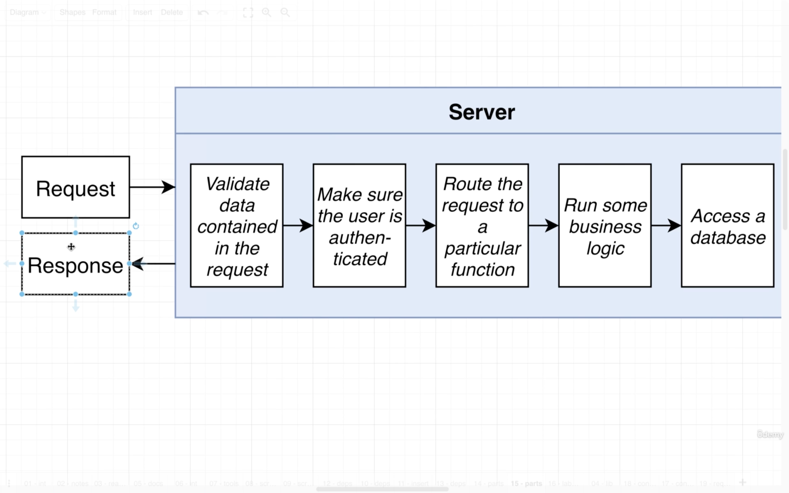
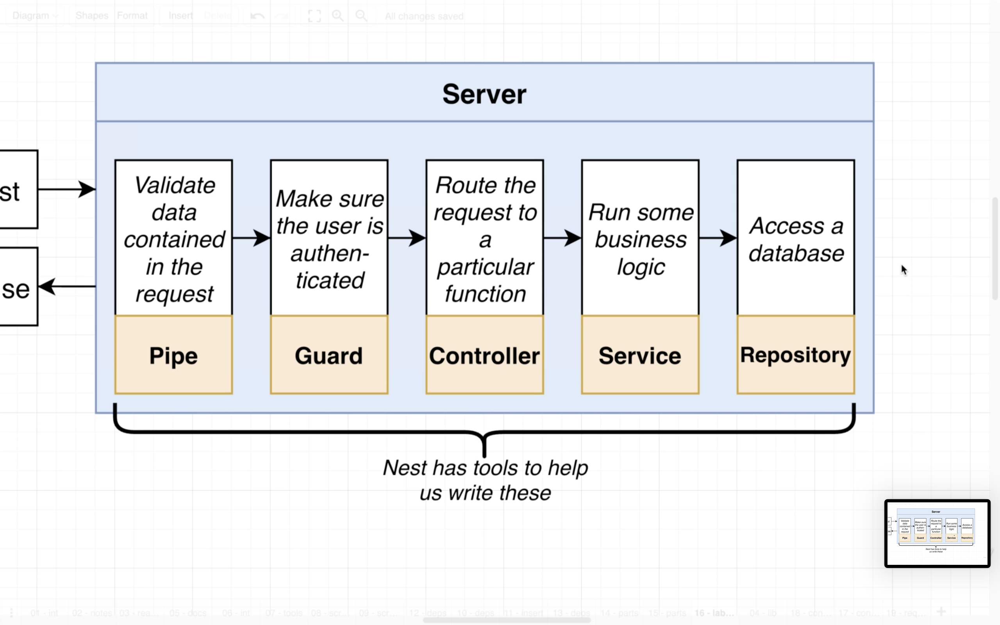
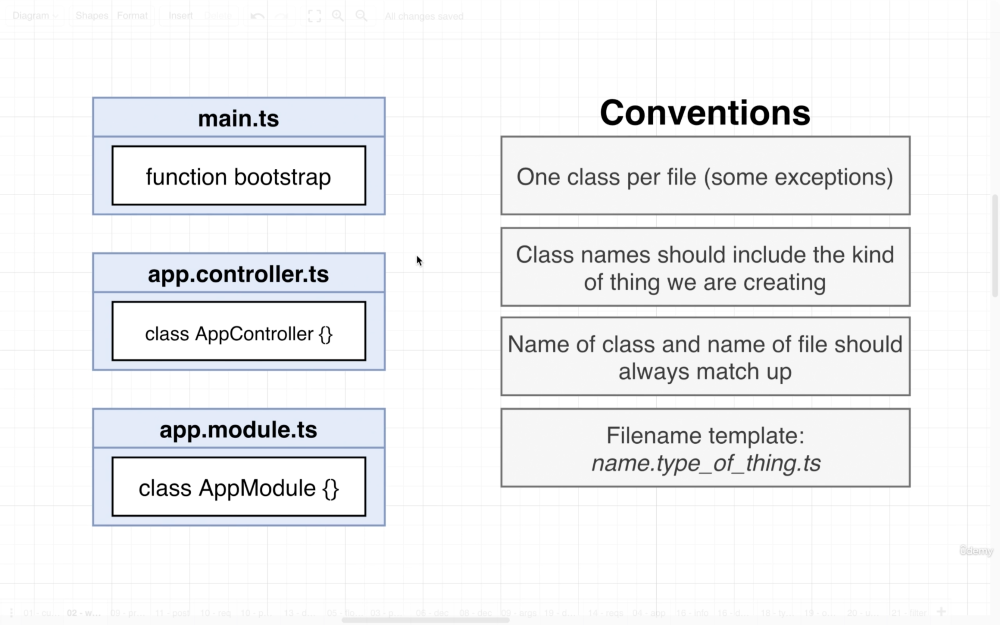

Start learning on 2021/08/28
Finished on

1. Course Link [https://www.udemy.com/course/nestjs-the-complete-developers-guide/](https://www.udemy.com/course/nestjs-the-complete-developers-guide/)

- [1. The Basics of Nest](#1-the-basics-of-nest)
  - [1.1. Project Setup](#11-project-setup)
  - [1.2. Typescript Configuration](#12-typescript-configuration)
  - [1.3. Creating a Controller](#13-creating-a-controller)
  - [1.4. Starting up a Nest App](#14-starting-up-a-nest-app)
  - [1.5. File Naming Convention](#15-file-naming-convention)
  - [1.6. Routing Decorators](#16-routing-decorators)

# 1. The Basics of Nest
## 1.1. Project Setup
1. The first project will be a little bit hard.
2. We are going to focus on some behind-the-scene stuff
3. Understanding how Nest works will make all of Nest easy
4. We firstly create a new directory `scratch` and use `npm init -y` to start a NPM project.
5. In regular Nest projects, we may have many dependcies to work with, while we only use few as we will build it from scratch.
6. `npm install @nestjs/common@7.6.17 @nestjs/core@7.6.17 @nestjs/platform-express@7.6.17 reflect-metadata@0.1.13 typescript@4.3.2`

## 1.2. Typescript Configuration
1. We use the dependecies in the `scratch` project.
  
2. NestJS uses some 3rd party models to work with "HTTP Implementation", we can choose either `Express` or `Fastify`.
  
3. We configure tsconfig.json with the following setting.
  ```json
  // tsconfig.json
  {
    "compilerOptions": {
      "module": "commonjs",
      "target": "ES2017",
      "experimentalDecorators": true,
      "emitDecoratorMetadata": true
    }
  }
  ```

## 1.3. Creating a Controller
1. In convention the `request` and `response` cycle is very similar in mostly every programming language and framework.
  
2. In NestJS, there are several tools we can use in the request handling cycle, such as `Pipe`, `Guard`, `Controller`, `Service`, and `Repository`.
  
3. Each NestJS server must have "Controllers" and "Modules". Note that are other tools as well. 
4. NestJS uses much with Typescript decorators. In the following code, we try to make a class `AppController` and use `@Controller` to indicate that it's a "controller".
5. We then import and use another object from `common` library which is the `Get` object that works with HTTP GET request.
6. We then can use `Get` to decorate `getRootRoute` to indicate the value to return when the server receivers a GET request on root route.
  ```ts
  // src/main.ts
  import { Controller, Module, Get } from '@nestjs/common';

  @Controller()
  class AppController {
    @Get()
    getRootRoute() {
      return 'hi there!';
    }
  }
  ```

## 1.4. Starting up a Nest App
1. In most of the cases, we need to import objects and functions from `@nestjs/common`.
2. By convention, we can declare a function `bootstrap` to start up the server.
3. We need to use `NestFacotry` which is a very few case that we import a model from `@nestjs/core` library.
4. Then we use `create` method and pass in the Module to start the server.
  ```ts
  // src/main.ts
  import { Controller, Module, Get } from '@nestjs/common';
  import { NestFactory } from '@nestjs/core';

  @Controller()
  class AppController {
    @Get()
    getRootRoute() {
      return 'hi there!';
    }
  }

  @Module({
    controllers: [AppController],
  })
  class AppModule {}

  async function boostrap() {
    const app = await NestFactory.create(AppModule);

    await app.listen(3000);
  }

  boostrap();
  ```

## 1.5. File Naming Convention
1. NestJS have convention on naming its files. Besides, the controller and modules we just created can be separated into different files.
  
2. We separate the code into `app.controller.ts` and `app.module.ts`
  ```ts
  // src/app.controller.ts
  import { Controller, Get } from '@nestjs/common';

  @Controller()
  export class AppController {
    @Get()
    getRootRoute() {
      return 'hi there!';
    }
  }
  ```
  ```ts
  // src/app.module.ts
  import { Module } from '@nestjs/common';
  import { AppController } from './app.controller';

  @Module({
    controllers: [AppController],
  })
  export class AppModule {}
  ```
  ```ts
  // main.ts
  import { NestFactory } from '@nestjs/core';
  import { AppModule } from './app.module';

  async function boostrap() {
    const app = await NestFactory.create(AppModule);

    await app.listen(3000);
  }

  boostrap();
  ```

## 1.6. Routing Decorators
1. We can use `Controller` decorator to have a high level route grouping. The routes in the class `AppController` will have a route prefix `/app`.
2. In the `Get` decorator, we can give the route to handle the logic below.
3. In the following case, we can access `/app/asdf` and `/app/bye` on this NestJS server.
  ```ts
  // app.controller.ts
  import { Controller, Get } from '@nestjs/common';

  @Controller('/app')
  export class AppController {
    @Get('/asdf')
    getRootRoute() {
      return 'hi there!';
    }

    @Get('/bye')
    getByeThere() {
      return 'bye there!';
    }
  }
  ```