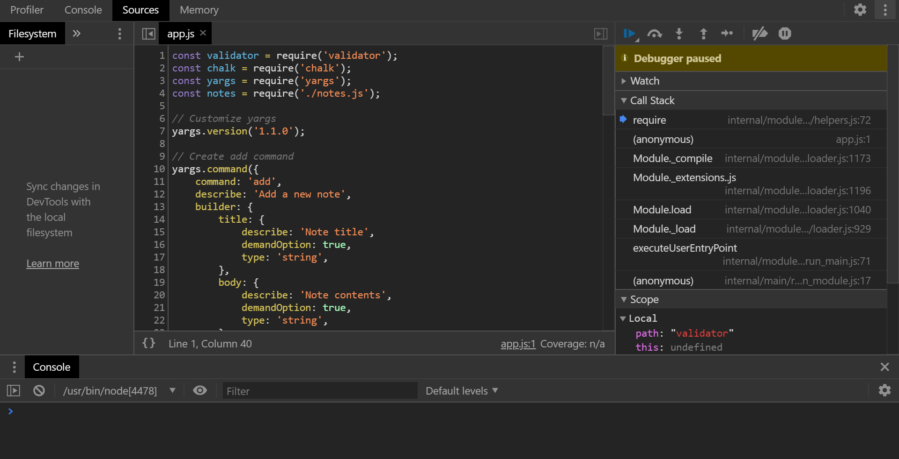

# The Complete Node.js Developer Course

# Installing and exploring Node.js

1. Node.js is powered with Google V8 engine which is a JavaScript runtime written in "**C++**". Therefore, the code can work on the OS system or the elements on the browser fur different prupose.
1. There's a global variable which we can access the properties of the environment where we run the code.
1. Global objects
   1. `window` which is the global object in a **browser**.
   1. `global` which is the global object in **Node.js**.
   1. `document` DOM object which we can use other methods such as selector to manipulate HTML elements on the webpage. For example, `document.querySelector('css selector')`.
   1. `process` process object that we can work with Node.js itself. For example, we type `process.exit()` to leave Node.js from the terminal.
1. Node.js is useful as it has **non-blocking** I/O. It means that during the code is running on the backend with functions for other purposes, we can still manipulate the environment to work on something else.
1. `requrie()` is a very important and often used function in Node.js that it allows Node.js to retrieve code for functions from files in the OS.

# Node.js Module System (Notes App)

Module `fs`, `requrie()`

1. This section is focusing on using [`file system`](https://nodejs.org/api/fs.html) module, which can be imported with `require()` function and allow user to manipulate the files in the OS. In this case, we use `.writeFileSync()`. There's asynchornous method `.writeFile()` which will be introduced in the later sections.
1. After importing the module to use, we can use `.writeFileSync()` method on the object. The method takes 2 arguments, which is the file name with suffix and its contents. The following code will creat a new text file in the same directory with the 2nd argument as the content.
1. If we duse the same method on the same file with different contents, the file will be overwritten with the new given content.
   ```js
   const fs = require("fs");
   fs.writeFileSync("notes.txt", "This file was created by Node.js!");
   fs.writeFileSync("notes.txt", "My name is Allen"); // Content of notes.txt is changed to the new given argument
   ```

### Importing own files

1. We can use `require('filePath')` to import another JavaScript file at the given path. For example, if we have another JavaScript file in the same directory, we can use `./script.js` to work as the relative path. Note that when we require the file, the file will be in the order of line we import to execute as a large set of code.
1. For example, if we have a single function `console.log('this is script.js')` in the file and import to `app.js`. When we use `node app.js` to execute the script in the terminal, the line in `script.js` executes first, as the `require()` function is above other code.
   ```js
   require("./script.js");
   const name = "Allen";
   console.log(name);
   ```
1. Each module (imported JS files) has its own scope, so that we can't access the variables directly from the other modules. To use the variables or functions in a module, we need to use `module.exports` to allow the outside world access the variables. Usually this method is used for exporting functions between files.
1. Note that the functions in the imported file will still be executed. In the following case, when we execute `app.js` with `node` it prints 2 strings in terminal, which is the `console.log()` in `utils.js` and `app.js`.

   ```js
   // in utils.js
   console.log("utils.js");
   const name = "Allen";
   module.exports = name;

   // in app.js
   const firstName = require("./utils.js");
   console.log(firstName);

   // utlis.js
   // Allen
   ```

### Importing NPM modules

1. In a JSON file, the `Strings` should be wrapped with double qoutes rather than single quotes.
1. In terminal, we can use `npm install [package]` to install a module from npm. Note that we can specify the version at behind by using at sign `@`. In this case, we can use `npm install validator@10.8.0`.
1. In this case, we use `validator` package to verify the data given by the user, such as phone number, address, and credit card numbers. Note that we can check the methods and details of a module on the npm website. For example, [https://www.npmjs.com/package/validator](https://www.npmjs.com/package/validator).
1. For example, `validator` module has a method `isEmail` that can check if a given email is valid. We can also use `.isURL()` method to check if a given URL is valid or not.

   ```js
   const validator = require("validator");
   const getNotes = require("./notes.js");

   const msg = getNotes();

   console.log(msg);
   console.log(validator.isEmail("allen@email.com")); // true
   console.log(validator.isEmail("email.com")); // false
   console.log(validator.isURL("https://www.google.com/")); // true
   ```

### Printing in Color

1. When transfering the app data, we can only send the `package.json` and `package-lock.json` for dependency referecne rather than sending the whole module package. This is much more efficient and prevent chances that the script in `node_modules` is modified. After we get the JSON files, we can simply use `npm install` without any other flag or command to install the modules listed in the JSON file. `npm` will generate the `node_modules` after typing the command.
1. In this section, we will use `chalk` package which can print the message in console in different colors.
1. If we install the wrong version of npm package, we can use `npm install [packageName]@version` to overwrite the module.

   ```js
   const validator = require("validator");
   const chalk = require("chalk");
   const getNotes = require("./notes.js");
   const log = console.log;

   const msg = getNotes();

   log(chalk.green("Success!"));
   log(chalk.inverse.bold.yellow("hi"));
   ```

### Global npm modules and nodemon

1. We can use `nodemon` module to keep node turns on while we modifying the script. However, we should install this module in the global scope to be able to use in the terminal in the global scope.
1. We put a `-g` flag when install the module `npm install nodemon -g`.
1. The lecture noticed how to solve the problem if we run `nodemon -v` in PowerShell in Windows.
1. After installing we can use `nodemon app.js` instead of `node app.js`.
1. We install version `1.18.5` in this case.

# File System and Command Line Args (Note App)

### Getting input from users

1. We can use `process.argv` (which argv stands for argument vector) to catch the argument passed in the command line with `node app.js`. This method returns an `Array` of 3 elements. Note that the `Array` can be longer if we pass mroe than one argument.
   1. The path of the executable `node` in the OS system.
   1. The path of the script where it is in the OS system.
   1. The arugment passed when execute the script.
   1. Other arguments passed in through execution.
   1. Commands in a shell
   ```shell
   node app.js Allen
   ```
   1. JavaScript code
   ```js
   // app.js
   console.log(`My name is ${process.argv[2]}.`);
   // My name is Allen.
   ```
1. We can use this feature to allow user to put command when execute the program.

   1. Command in shell

   ```shell
   node app.js add
   node app.js remove
   ```

   1. JavaScript code

   ```js
   const chalk = require("chalk");
   const getNotes = require("./notes.js");

   const command = process.argv[2];

   console.log(process.argv);

   if (command === "add") {
     console.log("Adding note!");
   } else if (command === "remove") {
     console.log("Removing note!");
   }
   ```

### Argument Parsing with Yargs: Part 1

1. Module [`Yargs`](https://www.npmjs.com/package/yargs) helps building interactive command line tools, by parsing arguments and generating an elegant user interface. Therefore, we don't need to write the `String` parser all by ourselves.
1. `yargs` turn the argumetns with certain patterns into properties of its `Object`. Therefore, we can access the argument in an easier way.
   1. Commands in shell
   ```shell
   node app.js add --title="Things to buy"
   ```
   1. JavaScript code
   ```js
   const yargs = require("yargs");
   console.log(yargs.argv);
   // { _: [ 'add' ], title: 'Things to buy', '$0': 'app.js' }
   ```
1. `yargs` module has a default function `--help` which we can check what commands are available of the JS App.
1. We then can use `.command()` method to set up the commands. We can also change the version of the program when users checks it. `.command()` method takes an `Object` as argument which contains `command` (with a `String` value), `describe` (with a `String` value), and `handler` (a method).

   ```js
   // Customize yargs
   yargs.version("1.1.0");

   // Create add command
   yargs.command({
     command: "add",
     describe: "Add a new note",
     handler: function () {
       console.log("Adding a new note!");
     },
   });

   // Create remove command
   yargs.command({
     command: "remove",
     describe: "Remove a note",
     handler: function () {
       console.log("Removing the note!");
     },
   });

   // Create list command
   yargs.command({
     command: "list",
     describe: "List all the notes!",
     handler: function () {
       console.log("Listing the note!");
     },
   });

   // Create read command
   yargs.command({
     command: "read",
     describe: "Read only mode",
     handler: function () {
       console.log("You can read the notes only!");
     },
   });
   ```

1. If we type `node app.js --help`, it shows all the commands that we have set up.

   ```shell
   app.js [command]

   Commands:
   app.js add     Add a new note
   app.js remove  Remove a note
   app.js list    List all the notes!
   app.js read    Read only mode

   Options:
   --help     Show help                                                 [boolean]
   --version  Show version number                                       [boolean]
   ```

### Argument Parsing with Yargs: Part 2

1. We can set up `builder` property (whose value is an `object`) in each command to allow the user to configure each command. For example, in `add` command, we add a builder that includes `title`. Besides, we can add `demandOPtion` property in the builder object to indicate if the input is required (default is `false`). Therefore, if a user doesn't give the input correctly, the program returns an error message that the input is missing.
1. Besides, since the command can take any type of value as argument, it doesn't return error though we pass an empty title to the case, and it holds the value as a boolean `true` which means the `--title` is given. However, this is not what we want.
1. We can have a 3rd property in `builder` that is `type`. We can set it up as `string`, so even the input is an empty `String`, the module doesn't hold a boolean `true` for the case.

   1. JavaScript code

   ```js
   // Create add command
   yargs.command({
     command: "add",
     describe: "Add a new note",
     builder: {
       title: {
         describe: "Note title",
         demandOption: true,
         type: "string",
       },
     },
     handler: function (argv) {
       console.log("Adding a new note!", argv);
     },
   });
   ```

   1. Commands in shell

   ```shell
   node app.js add --title="Shopping list"
   # Adding a new note! { _: [ 'add' ], title: 'Shopping list', '$0': 'app.js' }

   node app.js add --title="Shopping list" # without type property in builder
   # Adding a new note! { _: [ 'add' ], title: true, '$0': 'app.js' }

   node app.js add --title="Shopping list" # set type as 'string' in builder
   # Adding a new note! { _: [ 'add' ], title: '', '$0': 'app.js' }
   ```

1. If we don't use `console.log(yargs.argv)` in the code, the module will assume that the modules isn't used, so the commands won't work. To prevent such condition, we can simply put `yargs.argv` anywhere in the code or call `yargs.parse()` method, so the code can work normally.

   1. JavaScript code

   ```js
   yargs.command({
     command: "add",
     describe: "Add a new note",
     builder: {
       title: {
         describe: "Note title",
         demandOption: true,
         type: "string",
       },
       body: {
         describe: "Note contents",
         demandOption: true,
         type: "string",
       },
     },
     handler: function (argv) {
       console.log(`Title: ${argv.title}`);
       console.log(`Body: ${argv.body}`);
     },
   });
   ```

   1. Commands in shell

   ```shell
   # Use add command without arguments
   node app.js add

   # Returned from the command
   Add a new note

   Options:
   --help     Show help                                                 [boolean]
   --version  Show version number                                       [boolean]
   --title    Note title                                      [string] [required]
   --body     Note contents                                   [string] [required]

   Missing required arguments: title, body

   # Use add command with proper arguments
   node app.js --title="This is the title" --body="This is content of the note"
   # Returned from the command
   Title: This is the title
   Body: This is content of the note
   ```

### Storing Data with JSON

`fs.writeFileSync()`, `fs.readFileSync()`,`JSON.stringify()`, `JSON.parse()`

1. We can use preset functions in JavaScript to turn an `Object` into JSON by `JSON.stringify(JSObject)` and parse a JSON file by `JSON.parse(JSONfile)`.
1. We then can use `fs` module and `fs.writeFileSync(fileName, variable)` method to create a JSON file locally.
1. We can use `fs.readFileSync(filePath)` to read a file from the OS system. The returned data is actually binary data. Therefore, we can use `.toString()` to turn the binary data into its regular JSON format. However, since its a JSON data, we can also use `JSON.parse()` to read the data directly.

   ```js
   const fs = require("fs");
   const book = {
     title: "Ego is the Enemy",
     author: "Ryan Holiday",
   };

   const bookJSON = JSON.stringify(book);
   fs.writeFileSync("1-json.json", bookJSON);

   const dataBuffer = fs.readFileSync("1-json.json");
   console.log(JSON.parse(dataBuffer)); // {"title":"Ego is the Enemy","author":"Ryan Holiday"}
   console.log(JSON.parse(dataBuffer.toString())); // {"title":"Ego is the Enemy","author":"Ryan Holiday"}

   const dataJSON = dataBuffer.toString();
   const data = JSON.parse(dataJSON);
   console.log(data.title); //'Ego is the Enemy'
   ```

### Adding a Note

1. To export multiple variables or functions from a file, we can use `module.exports = {}` to export an `Object` rather than a single variable.
1. If we don't have to JSON file to read and write, Node.js will return an error for the issue. Thus, we can use `try` and `catch` blocks to deal with it. When there's no such file avaiable, we just let the program return an empty `Array` as there's no data and prevent overwriting the other data.
1. Note that JSON file is default in an `Array` while its elements are `Objects`. Therefore, without very first array on the outside, the JSON files doesn't work.
   ```js
   const loadNotes = function () {
     try {
       const dataBuffer = fs.readFileSync("notes.json");
       const dataJSON = dataBuffer.toString();
       return JSON.parse(dataJSON);
     } catch (err) {
       return [];
     }
   };
   ```
1. We can add some code to check if a title is used in the note. We use `.filter()` array method here and check if the returned `Array` from the method has any element. If so, it means the given title has been used.

   ```js
   const addNote = function (title, body) {
     const notes = loadNotes();

     const duplicateNotes = notes.filter(function (note) {
       return note.title === title;
     });

     if (duplicateNotes.length === 0) {
       notes.push({
         title: title,
         body: body,
       });
       saveNotes(notes);
       console.log("New ntoe added");
     } else {
       console.log("Note title taken!");
     }
   };
   ```

### Removing a note

1. In this case, we have several tasks
   1. Setup the remove command to take a requried "--title" option in terminal when use the App.
   1. Create and export a removeNote function from notes.js
   1. Call removeNote in remove command handler
   1. Have removeNote log the title of the note to be removed
   1. Test your work using: node app.js remove --title="givenTitle"
1. In `app.js`, we can add `builder` property to indicate the use of parameters for remove command.
   ```js
   yargs.command({
     command: "remove",
     describe: "Remove a note",
     builder: {
       title: "Note title",
       demandOption: true,
       type: "string",
     },
     handler: function (argv) {
       notes.removeNotes(argv.title);
     },
   });
   ```
1. For the function in `notes.js`, I firstly write the code in this way.

   ```js
   const removeNote = function (title) {
     const notes = loadNotes();

     const index = notes.map((note, index) => {
       if (note.title === title) {
         return index;
       }
       return false;
     });

     if (index.length !== 0) {
       console.log(notes[index[0]].title + " is removed!");
       notes.splice(index[0], 1);
     } else {
       console.log("No such title!");
     }
     saveNotes(notes);
   };
   ```

1. The solution given in the lecture is much more succinct and simple. Array `.filter()` method is used to check if the item in the array fits to certain condition.
1. We use `chalk` module to print a prompt in the terminal to the user for the status.

   ```js
   const removeNote = function (title) {
     const notes = loadNotes();

     const notesToKeep = notes.filter(function (note) {
       return note.title !== title;
     });

     if (notes.length > notesToKeep.length) {
       console.log(chalk.green.inverse(`Note "${title}" is removed!`));
       saveNotes(notesToKeep);
     } else {
       console.log(chalk.red.inverse(`Note "${title}" is not found!`));
     }
   };
   ```

### ES6 Aside: Arrow Functions and Refactoring to use Arrow Functions

1. We can replace some one-line function with arrow function notation as shorthand.
1. To use arrow function notation, we should be careful with the scope of the function at where it is.

### Listing Notes

1. This is similar to other function while this part is relatively easy. We just add the following code in `notes.js` and export to be used in `app.js` in the handler to add "list" command. Therefore, we can give `node app.js list` to use the function.
   ```js
   const listNotes = () => {
     const notes = loadNotes();
     console.log(chalk.inverse("Listing the note!"));
     notes.forEach((note) => {
       console.log(chalk.blue.inverse(note.title));
       console.log(chalk.yellow.inverse(note.body), "\n");
     });
   };
   ```

### Reading a note

1. We rewrite the function of "**add**" in `notes.js` with array function `.find()` instead for `.filter()` to improve efficiency. The purpose is only to check if the given title has been in the array we are trying to find. However, `.filter()` method won't stop and will iterate through all the elements in the `Array`. If we have a huge dataset, this will dramatically reduce the efficiency. Therefore, we can use `.find()` method that the method will return the very first match of the element in the array. Since we don't have duplicate titles in this program, we can change to use `.find()` method to improve efficiency.
1. Similar to other functions, we can set up the commands in `app.js`.

   ```js
   // app.js
   yargs.command({
     command: "read",
     describe: "Read only mode",
     builder: {
       title: {
         describe: "Note title",
         demandOption: true,
         type: "string",
       },
     },
     handler(argv) {
       notes.readNote(argv.title);
     },
   });

   // notes.js
   const readNote = function (title) {
     const notes = loadNotes();
     const note = notes.find((note) => note.title === title);
     if (note) {
       console.log(`Reading Title: '${chalk.inverse(note.title)}'`);
       console.log(`${note.body}`);
     } else {
       console.log(chalk.red.inverse(`'${title}' is not found!`));
     }
   };
   ```

# Debugging Node.js

1. There are basically 2 types of erros
   1. Error thrown back to the console.
   1. Logical errors that don't crash the app but malfunciton.

### Debugging Node.js (Notes App)

1. Debuggers `console.log()`, `debugger`
   1. Use `console.log()` to debug by printing out certain variables or test function in terminal directly.
   1. Use `debugger` keyword, so the engine will stop the code at the point where we put the `debugger` in the script. Besides, we need to put another command `inspect` to make debugger works.
      1. In Mac or Linux OS, we can use `node inspect app.js add [title] [body]` for the command.
      1. In Windows OS, if we get a `Timeout` error in `comand prompt` or `PowerShell`, we can use `-brk` in the command as `node --inspect-brk app.js add [title] [body]`.
   1. Note that we don't give any command to terminal at this point and will switch to Chrome browser.
   1. Open Chrome browser and type `chrome://inspect/` in the search bar. We will get the option as "Remote Target". Note that this also works with WSL, tested on 2020/07/15. Besides, we can check with "**Configure**" in "**Devices**" section on the top. For example, `localhost: 9229` and `127.0.0.1:9229`.
   1. We then click "**inspect**" in the "**Remote Target**". Chrome will open another console for us to run debugger.
   1. We can use the navigator panel on the left to add the folder to this debugger console (though it's not neccessary).
      
   1. After inspecting the program, we can type `restart` in terminal to resume the debugger in Chrome again.
   1. If we've finished and would like to quit, we can type <kbd>Ctrl + c</kbd> twice to leave node in the terminal.
   1. We can use the function to look into the variables by a closer look to identify the possisble issues when there's any problem with the program.

### Error Messages

1. Usually the very first line of the error message returns the critical info. that which part of the code is wrong. It also returns the line of the code in the file for programmers easier to locate.

# Asynchronous Node.js (Weather App)

### Asynchronous basics, call stack, callback queue, and event loop

1. A **call stack** is the where the regular sychronous functions stack up. Every task has its own execution context and scope and follow the order of "**first in last out**".
1. This part is the best to check the video and watch how the parts in the engine works together.
1. In short, "**async**" tasks are actually "**events**" and are API functions that will be put into another section when called.
1. "**event loop**" keeps checking if "call stack" has any task left and push the async tasks in the "**queue**" to execute.

### Making HTTP request

1. The course has changed to use [WeatherStack](https://weatherstack.com/), as the other "dark sky" isn't available anymore.
   1. We can register Weather Stack for free with 1,000 API calls per month without giving credit card.
   1. After registering, we will get an API key (32 characters), which should be kept carefully as other password.
   1. We can use browser search bar to connect the API at [http://api.weatherstack.com/](http://api.weatherstack.com/). There are mainly 5 endpoints from this API.
      1. Current Weather: Get current weather data.
      1. Historical Weather: Get historical weather data.
      1. Historical Time-Series: Get historical time-series weather data.
      1. Weather Forecast: Get weather forecast for up to 14 days.
      1. Location Lookup: Look up one or multiple locations.
   1. The paremeters setting is as "http://api.weatherstack.com/`?access_key=[yourAPIKey]&query=[latitude,longitude]`
   1. We can use ampersand "&" to connect the key/value pairs. It doesn't matter with the order given.
   1. For example, we can use http://api.weatherstack.com/current?access_key=[yourAPIkey]&query=37.8267,-122.4233 to check current weather at "**North Beach, California, USA**".
1. In the lecture, we use a npm package "[request](https://www.npmjs.com/package/request)" (`request` package is deprecated since 2020/02/11. However, we still use the package. Besides, we can use package [postman-request](https://www.npmjs.com/package/postman-request) or [axios](https://www.npmjs.com/package/axios) instead.)
1. When we set up npm in a project with `npm init` we can put a `-y` flag to give "yes" to all the questions in default to avoid inserting the info. manually.
1. We `require()` "**request**" package and use its methods. The `Object` takes 2 argument, which is the "**option**" that takes an `Object` and a callback function after we receive the data. Its syntax is `request(option, callbackFunction)`.

   1. In the "**option**", we can check all the avilable [options](https://www.npmjs.com/package/request#requestoptions-callback). It takes a property `json` that we can set it to `true`, so the package will parse JSON data automatically.
   1. The callback function also has 2 parameters `error` and `response`. `error` will catch and return the error message such as server status as `503` or `404`, while `response` is the data returned from the server.
   1. In this case, the `body` property` of the returned data (**response**) is the JSON file that we want to parse.

   ```js
   const request = require("request");

   const url =
     "http://api.weatherstack.com/current?access_key=[yourAPIKey]&query=37.8267,-122.4233";

   request({ url: url, json: true }, function (error, response) {
     // const data = JSON.parse(response.body);
     const data = response.body.current;
   });
   ```

### Customizing HTTP requests

1.  We can use Chrome extension (such as JSON formatter or JSON viewer) or other tools to visualize JSON data in a better format to read.
1.  This section is about how to parse the data from a JSON file.
1.  By reading the [documentation](https://weatherstack.com/documentation) from Weather Stack, we can learn to put different paremeters. For example, we can use ampersand `&` and add up key/value pair `unit=f` to change degree unit from Celsius to Fahrenheit. `http://api.weatherstack.com/current?access_key=[yourAPIKey]&query=37.8267,-122.4233&unit=f`.

### A HTTP request Challenge (Geocoding)

1. The user can just put an address in for the program to call a **Geocoding** API to search.
1. The Geocoding API should return a "**coordination**" with latitude and longitude.
1. We can put the coordinate as the parameter to be used to call "**Weather stack**" API to get the weather forecast or other data.

**Mapbox Geocoding**

1. In this case, we use [Mapbox](https://www.mapbox.com/) service for Geocoding. We can check the [API documentation](https://docs.mapbox.com/api/). Besides, we will use its ["Search Service"](https://docs.mapbox.com/api/search/).
1. On Mapbox, there are `forward geocoding` and `reverse geocoding`. We can check [Forward geocoding](https://docs.mapbox.com/api/search/#forward-geocoding) for the section.
   1. `forward` is to turn an address string to coordinate.
   1. `reverse` is to turn a coordinate to address string.
   1. We can check examples [here](https://docs.mapbox.com/api/search/#example-request-forward-geocoding)
   1. Here is the sample [JSON file]("https://api.mapbox.com/geocoding/v5/mapbox.places/Los%20Angeles.json?access_token=pk.eyJ1IjoiYWxsZW5saW45MCIsImEiOiJja2NvZGE3Y3QwM3JuMzBxaTV6Ym81eWV2In0.7nYUE26c5bCIpZFkOxPIpA")
1. There are some parameters would be useful in the case.

   1. `language` - We can change the returned language according to the user preference.
   1. `limit` - We can limit the related location returned back from the service. This default is 5 and can be set up to 10. Note that we use only 1 single address, so we can set this parameter as `1` in our case. With less data to be transferred, the process can speed up.
   1. For example, we set up limit to **1** and language to **traditional Chinese** `https://api.mapbox.com/geocoding/v5/mapbox.places/Los%20Angeles.json?access_token=pk.eyJ1IjoiYWxsZW5saW45MCIsImEiOiJja2NvZGE3Y3QwM3JuMzBxaTV6Ym81eWV2In0.7nYUE26c5bCIpZFkOxPIpA&limit=1&language=zh-Hant`. The key token here is provided as the public one from Mapbox.

   ```js
   const request = require("request");

   const url = [
     "http://api.weatherstack.com/current?access_key=08d4f0c107bfb486eafb2bc98d318866&query=37.8267,-122.4233",
   ];

   request({ url: url, json: true }, function (error, response) {
     //   const data = JSON.parse(response.body);
     const data = response.body.current;
     console.log(
       `${data.weather_descriptions[0]}. It is currently ${data.temperature} degrees out. It feels like ${data.feelslike} degrees out. `
     );
   });

   const geocodeURL = [
     "https://api.mapbox.com/geocoding/v5/mapbox.places/Los%20Angeles.json?access_token=pk.eyJ1IjoiYWxsZW5saW45MCIsImEiOiJja2NvZGE3Y3QwM3JuMzBxaTV6Ym81eWV2In0.7nYUE26c5bCIpZFkOxPIpA&limit=1",
   ];

   request({ url: geocodeURL[0], json: true }, function (error, response) {
     const coord = response.body.features[0].center;
     console.log(
       `Coordinate of Los Angeles is Longitude: ${coord[0]}, Latitude: ${coord[1]}`
     );
   });
   ```

### Handling Errors

1. When there's an error, only the `error` argument of the callback function will have value. If can set up conditions to avoid crashing the program and return an useful message to users for better UX.
1. However, not only the `error` argument can return error, also the `response` from the server can be an error message as well. For example, we give wrong coordinate or other parameters as well, such as invalid token or address string.
1. In this case, we also check the `response.body` if its length is 0 which means there's no data returned from the API.

```js
request({ url: geocodeURL[0], json: true }, function (error, response) {
  if (error) {
    console.log("Unable to connect to Mapbox");
  } else if (response.body.features.length === 0) {
    console.log("No location match");
  } else {
    const coord = response.body.features[0].center;
    console.log(
      `Coordinate of ${response.body.features[0].text} is Longitude: ${coord[0]}, Latitude: ${coord[1]}`
    );
  }
});
```

### Callback Function

1. We tried to use `setTimeout()` function to simulate asynchronous functions. In this case, without using callback function, the function will be executed synchronously without waiting the return from the callback thus cause error. This is similar to put request for server and wait for its response, while regular synchornous part is non-blocking and executing without waiting for the data returned from the server. Therefore, we can use callback function which is a synchronous function that the function must wait for the data returned from the server to execute further of its tasks.

```js
// Goal: Mess around with the callback pattern
//
// 1. Define an add function that accepts the correct arguments
// 2. Use setTimeout to simulate a 2 second delay
// 3. After 2 seconds are up, call the callback function with the sum
// 4. Test your work!

add(1, 4, (sum) => {
  console.log(sum); // Should print: 5
});

function add(num1, num2, callback) {
  setTimeout(function () {
    let sum = num1 + num2;
    callback(sum);
  }, 2000);
}
```

### Callback Abstraction
