Start learning on 2021/08/16
Finished on

1. Course Link [https://www.udemy.com/course/typescript-the-complete-developers-guide/](https://www.udemy.com/course/typescript-the-complete-developers-guide/)

- [1. Getting Started with TypeScript](#1-getting-started-with-typescript)
  - [1.1. Environment Setup](#11-environment-setup)
  - [1.2. Executing TypeScript Code](#12-executing-typescript-code)
  - [1.3. Catching Error with TypeScript](#13-catching-error-with-typescript)
- [2. What is a type system?](#2-what-is-a-type-system)
  - [2.1. Course Overview](#21-course-overview)
  - [2.2. Types](#22-types)
  - [2.3. More on Types](#23-more-on-types)
  - [2.4. Example of Types](#24-example-of-types)
  - [2.5. Where do we use Types](#25-where-do-we-use-types)
- [3. Type annotation in actions](#3-type-annotation-in-actions)
  - [3.1. Type annotation and type interface](#31-type-annotation-and-type-interface)
  - [3.2. Annotations with variables](#32-annotations-with-variables)
  - [3.3. Object literal annotations](#33-object-literal-annotations)
  - [3.4. Annotations around functions](#34-annotations-around-functions)
  - [3.5. Understanding inference](#35-understanding-inference)
  - [3.6. The 'Any' type](#36-the-any-type)
  - [3.7. Fixing the 'Any' type](#37-fixing-the-any-type)
  - [3.8. Delayed initialization](#38-delayed-initialization)
  - [3.9. When inference doesn't work](#39-when-inference-doesnt-work)
- [4. Annotations with functions and objects](#4-annotations-with-functions-and-objects)
  - [4.1. More on Annotations around Functions](#41-more-on-annotations-around-functions)
  - [4.2. Inference around functions](#42-inference-around-functions)
  - [4.3. Annotations for anonymous functions](#43-annotations-for-anonymous-functions)
  - [4.4. Void and Never](#44-void-and-never)
  - [4.5. Destructuring with Annotation](#45-destructuring-with-annotation)
  - [4.6. Annotations around Objects](#46-annotations-around-objects)
- [5. Mastering Typed Arrays](#5-mastering-typed-arrays)
  - [5.1. Arrays in Typescript](#51-arrays-in-typescript)
  - [5.2. Why Typed Arrays](#52-why-typed-arrays)
  - [5.3. Multiple Types in Arrays](#53-multiple-types-in-arrays)
  - [5.4. When to use Typed Arrays](#54-when-to-use-typed-arrays)
- [6. Tuples in TypeScript](#6-tuples-in-typescript)
  - [6.1. Tuples in TypeScript](#61-tuples-in-typescript)
  - [6.2. Tuples in Action](#62-tuples-in-action)
  - [6.3. Why Tuples?](#63-why-tuples)
- [7. The All-important Interface](#7-the-all-important-interface)
  - [7.1. Interfaces](#71-interfaces)
  - [7.2. Long Type Annotatoins](#72-long-type-annotatoins)
  - [7.3. Fixing Long Annotations with Interfaces](#73-fixing-long-annotations-with-interfaces)
  - [7.4. Syntax Around Interfaces](#74-syntax-around-interfaces)
  - [7.5. Functions in Interfaces](#75-functions-in-interfaces)
  - [7.6. Code Reuse with Interfaces](#76-code-reuse-with-interfaces)
  - [7.7. General Plan with Interfaces](#77-general-plan-with-interfaces)
- [8. Building Functionality with Classes](#8-building-functionality-with-classes)
  - [8.1. Classes](#81-classes)
  - [8.2. Basic Inheritance](#82-basic-inheritance)
  - [8.3. Instance Method Modifiers](#83-instance-method-modifiers)
  - [8.4. Fields in Classes](#84-fields-in-classes)
  - [8.5. Fields with Inheritance](#85-fields-with-inheritance)
  - [8.6. Where to use Classes](#86-where-to-use-classes)
- [9. Design Patterns with Typescript](#9-design-patterns-with-typescript)
  - [9.1. App Overview](#91-app-overview)
  - [9.2. Bundling with Parcel](#92-bundling-with-parcel)
  - [9.3. Project Structure](#93-project-structure)
  - [9.4. Generating Random Data](#94-generating-random-data)
  - [9.5. Type Definition Files](#95-type-definition-files)
  - [9.6. Using Type Definition Files](#96-using-type-definition-files)
  - [9.7. Export Statements in Typescript](#97-export-statements-in-typescript)
  - [9.8. Defining a Company](#98-defining-a-company)
  - [9.9. Adding Google Maps Support](#99-adding-google-maps-support)
  - [9.10. Google Maps Integration](#910-google-maps-integration)
  - [9.11. Exploring Type Definition Files](#911-exploring-type-definition-files)
  - [9.12. Hiding Functionality](#912-hiding-functionality)
  - [9.13. Why Use Private Modifiers?](#913-why-use-private-modifiers)
  - [9.14. Adding Markers](#914-adding-markers)
  - [9.15. Duplicate Code](#915-duplicate-code)
  - [9.16. One Possible Solution](#916-one-possible-solution)
  - [9.17. Restricting Access with Interface](#917-restricting-access-with-interface)
  - [9.18. Implicit Type Checks](#918-implicit-type-checks)
  - [9.19. Showing Popup Windows](#919-showing-popup-windows)
  - [9.20. Updating Interface Definitions](#920-updating-interface-definitions)
  - [9.21. Optional Implements Clauses](#921-optional-implements-clauses)
  - [9.22. App Wrapup](#922-app-wrapup)
- [10. More on Design Patterns](#10-more-on-design-patterns)
  - [10.1. App Overview](#101-app-overview)
  - [10.2. Configuring the TS Compiler](#102-configuring-the-ts-compiler)
  - [10.3. Concurrent Compilation and Execution](#103-concurrent-compilation-and-execution)
  - [10.4. A Simple Sorting Algorithm](#104-a-simple-sorting-algorithm)
  - [10.5. Sorter Scaffolding](#105-sorter-scaffolding)
  - [10.6. Sorting Implementation](#106-sorting-implementation)
  - [10.7. Two Huge Issues](#107-two-huge-issues)
  - [10.8. Typescript is Really Smart](#108-typescript-is-really-smart)
  - [10.9. Type Guards](#109-type-guards)
  - [10.10. Why is This Bad?](#1010-why-is-this-bad)
  - [10.11. Extracing Key Logic](#1011-extracing-key-logic)
  - [10.12. Separating Swapping and Comparison](#1012-separating-swapping-and-comparison)
  - [10.13. The Big Reveal](#1013-the-big-reveal)
  - [10.14. Interface Definition](#1014-interface-definition)
  - [10.15. Sorting Arbitrary Collection](#1015-sorting-arbitrary-collection)
  - [10.16. Linked List Implementation](#1016-linked-list-implementation)
  - [10.17. Just One More Fix](#1017-just-one-more-fix)
  - [10.18. Integrating the Sort Method](#1018-integrating-the-sort-method)
  - [10.19. Issues with Inheritance](#1019-issues-with-inheritance)
  - [10.20. Abstract Classes](#1020-abstract-classes)
  - [10.21. Why Use Abstract Classes?](#1021-why-use-abstract-classes)
  - [10.22. Solving All Issues with Abstract Classes](#1022-solving-all-issues-with-abstract-classes)
  - [10.23. Interfaces vs Abstract Classes](#1023-interfaces-vs-abstract-classes)
- [11. Resuable Code](#11-resuable-code)
  - [11.1. Project Overview](#111-project-overview)
  - [11.2. Project Setup](#112-project-setup)
  - [11.3. CSV](#113-csv)
  - [11.4. Type Definition Files - Again!](#114-type-definition-files---again)
  - [11.5. Reading CSV Files](#115-reading-csv-files)
  - [11.6. Running an Analysis](#116-running-an-analysis)
  - [11.7. Losing Dataset Context](#117-losing-dataset-context)
  - [11.8. Using Enums](#118-using-enums)
  - [11.9. When to use Enums](#119-when-to-use-enums)
  - [11.10. Extracting CSV Reading](#1110-extracting-csv-reading)
  - [11.11. Date Types](#1111-date-types)
  - [11.12. Converting Data Strings to Dates](#1112-converting-data-strings-to-dates)
  - [11.13. Converting Row Values](#1113-converting-row-values)
  - [11.14. Type Assertions](#1114-type-assertions)
  - [11.15. Describing a Row with a Tuple](#1115-describing-a-row-with-a-tuple)
  - [11.16. Not Done with FileReader Yet!](#1116-not-done-with-filereader-yet)
  - [11.17. Understanding Refactor #1](#1117-understanding-refactor-1)
  - [11.18. Creating Abstract Classes](#1118-creating-abstract-classes)
  - [11.19. Variable Types with Generics](#1119-variable-types-with-generics)
  - [11.20. Applying a Type to a Generic Class](#1120-applying-a-type-to-a-generic-class)
  - [11.21. Alternate Refactor](#1121-alternate-refactor)
  - [11.22. Interface-Based Approach](#1122-interface-based-approach)
  - [11.23. Extracting Match References - Again!](#1123-extracting-match-references---again)
  - [11.24. Transforming Data](#1124-transforming-data)
  - [11.25. Updating Reader References](#1125-updating-reader-references)
  - [11.26. Inheritance vs Composition](#1126-inheritance-vs-composition)
  - [11.27. More on Inheritance vs Composition](#1127-more-on-inheritance-vs-composition)
  - [11.28. A Huge Misconception Around Composition](#1128-a-huge-misconception-around-composition)
  - [11.29. Goal Moving Forward](#1129-goal-moving-forward)
  - [11.30. A Composition-Based Approach](#1130-a-composition-based-approach)
  - [11.31. Implementing an Analyzer Class](#1131-implementing-an-analyzer-class)
  - [11.32. Building the Reporter](#1132-building-the-reporter)
  - [11.33. Putting it all together](#1133-putting-it-all-together)
  - [11.34. Generating HTML Reports](#1134-generating-html-reports)
  - [11.35. One Last Thing!](#1135-one-last-thing)
  - [11.36. Oops, MyBad](#1136-oops-mybad)
  - [11.37. App Wrapup](#1137-app-wrapup)
- [12. Advanced Generics](#12-advanced-generics)
  - [12.1. More on Generics](#121-more-on-generics)
  - [12.2. Type Inference with Generics](#122-type-inference-with-generics)
  - [12.3. Function Generics](#123-function-generics)
  - [12.4. Generic Constraints](#124-generic-constraints)
- [13. Let's Build a Web Framework](#13-lets-build-a-web-framework)
  - [13.1. App Overview](#131-app-overview)
  - [13.2. Parcel Setup](#132-parcel-setup)
  - [13.3. Framework Structure](#133-framework-structure)
  - [13.4. Designing the User](#134-designing-the-user)
  - [13.5. Retrieving User Properties](#135-retrieving-user-properties)
  - [13.6. Optional Interface Properties](#136-optional-interface-properties)
  - [13.7. An Eventing System](#137-an-eventing-system)
  - [13.8. Listener Support](#138-listener-support)
  - [13.9. Storing Event Listeners](#139-storing-event-listeners)
  - [13.10. Dynamic Array Creation](#1310-dynamic-array-creation)
  - [13.11. Triggering Event Callbacks](#1311-triggering-event-callbacks)
  - [13.12. Adding JSON Server](#1312-adding-json-server)
  - [13.13. Understanding REST conventions](#1313-understanding-rest-conventions)
  - [13.14. Adding Fetch Functionality](#1314-adding-fetch-functionality)
  - [13.15. Successfully Fetching Model Data](#1315-successfully-fetching-model-data)
  - [13.16. Saving User Data](#1316-saving-user-data)
  - [13.17. Refactoring with Composition](#1317-refactoring-with-composition)
  - [13.18. Re-Integrating](#1318-re-integrating)
  - [13.19. Composition with Nested Objects](#1319-composition-with-nested-objects)
  - [13.20. A More Complicated Extraction](#1320-a-more-complicated-extraction)
  - [13.21. Options for Adapting Sync](#1321-options-for-adapting-sync)
  - [13.22. Refactoring Sync](#1322-refactoring-sync)
  - [13.23. Generic Constraints Around Sync](#1323-generic-constraints-around-sync)
  - [13.24. Connecting Sync Back to User](#1324-connecting-sync-back-to-user)
  - [13.25. Optional Properties](#1325-optional-properties)
  - [13.26. Extracing an Attributes Class](#1326-extracing-an-attributes-class)
  - [13.27. The Get Method's Shortcoming](#1327-the-get-methods-shortcoming)
  - [13.28. Two Important Rules](#1328-two-important-rules)
  - [13.29. An Advanced Generic Constraint](#1329-an-advanced-generic-constraint)
  - [13.30. Re-Integrating Attributes](#1330-re-integrating-attributes)
  - [13.31. Composition is Delegation](#1331-composition-is-delegation)
  - [13.32. Reminder on Accessors](#1332-reminder-on-accessors)
  - [13.33. Passthrough Methods](#1333-passthrough-methods)
  - [13.34. A Context Issue](#1334-a-context-issue)
  - [13.35. Setting Data While Triggering](#1335-setting-data-while-triggering)
  - [13.36. Fetching User Data](#1336-fetching-user-data)
  - [13.37. Saving Data](#1337-saving-data)
  - [13.38. Composition vs Inheritance...Again!](#1338-composition-vs-inheritanceagain)
  - [13.39. Extracting a Model Class](#1339-extracting-a-model-class)
  - [13.40. Extending the User](#1340-extending-the-user)
  - [13.41. Final User Refactor](#1341-final-user-refactor)
  - [13.42. Model Wrapup](#1342-model-wrapup)
  - [13.43. Shortened Passthrough Methods](#1343-shortened-passthrough-methods)
  - [13.44. Users Collection](#1344-users-collection)
  - [13.45. Implementing a Users Collection](#1345-implementing-a-users-collection)
  - [13.46. Parsing User JSON](#1346-parsing-user-json)
  - [13.47. Generic User Collection](#1347-generic-user-collection)
  - [13.48. A Class Method for Collections](#1348-a-class-method-for-collections)
  - [13.49. View Classes](#1349-view-classes)
  - [13.50. Building the UserForm](#1350-building-the-userform)
  - [13.51. The UserForm's Render Method](#1351-the-userforms-render-method)
  - [13.52. Rendering HTML](#1352-rendering-html)
  - [13.53. Defining an Events Map](#1353-defining-an-events-map)
  - [13.54. Binding Event Handlers](#1354-binding-event-handlers)
  - [13.55. Adding Model Properties](#1355-adding-model-properties)
  - [13.56. Binding Events on Class Name](#1356-binding-events-on-class-name)
  - [13.57. Adding Methods to the User](#1357-adding-methods-to-the-user)
  - [13.58. Re-Rendering on Model Change](#1358-re-rendering-on-model-change)
  - [13.59. Reading Input Text](#1359-reading-input-text)
  - [13.60. Strict Null Checks](#1360-strict-null-checks)
  - [13.61. Reusable View Logic](#1361-reusable-view-logic)
  - [13.62. Extracting a View Class](#1362-extracting-a-view-class)
  - [13.63. Extending with Generic Constraints](#1363-extending-with-generic-constraints)
  - [13.64. Saving Data From a View](#1364-saving-data-from-a-view)
  - [13.65. UserEdit and UserShow](#1365-useredit-and-usershow)
  - [13.66. Nesting with Regions](#1366-nesting-with-regions)
  - [13.67. Mapping Regions](#1367-mapping-regions)
  - [13.68. Testing Region Mapping](#1368-testing-region-mapping)
  - [13.69. View Nesting](#1369-view-nesting)
  - [13.70. Collection Views](#1370-collection-views)
  - [13.71. CollectionView Implementation](#1371-collectionview-implementation)
  - [13.72. App Wrapup](#1372-app-wrapup)
- [14. Express + Typescript Integration](#14-express--typescript-integration)
  - [14.1. Typescript with JS Libraries](#141-typescript-with-js-libraries)
  - [14.2. App Overview](#142-app-overview)
  - [14.3. Project Setup](#143-project-setup)
  - [14.4. Basic Routes with Express](#144-basic-routes-with-express)
  - [14.5. Using an Express Router](#145-using-an-express-router)
  - [14.6. Parsing Form Bodies](#146-parsing-form-bodies)
  - [14.7. Why Doesn't Express Play Nicely with TS?](#147-why-doesnt-express-play-nicely-with-ts)
  - [14.8. Issues with Type Definition Files](#148-issues-with-type-definition-files)
  - [14.9. Dealing with Poor Type Defs](#149-dealing-with-poor-type-defs)
  - [14.10. Wiring Up Sessions](#1410-wiring-up-sessions)
  - [14.11. Checking Login Status](#1411-checking-login-status)
  - [14.12. Loggin out](#1412-loggin-out)
  - [14.13. Protecting Routes](#1413-protecting-routes)
  - [14.14. A Closer Integration](#1414-a-closer-integration)
  - [14.15. The Refactoring Process](#1415-the-refactoring-process)
  - [14.16. Prototypes Reminder](#1416-prototypes-reminder)

# 1. Getting Started with TypeScript
## 1.1. Environment Setup

1. Install `typescript` and `ts-node` globally with `npm install typescript ts-node -g`.
2. Install `prettier` plugin in VS Code
   1. Check "format on save" in settings to ensure the code is formatted every time the file is saved.
   2. Search for "single quotes" to turn all quotes into single quotes.
   3. Change "tab size" to 2 spaces.
3. After install `typescript`, we can check with `tsc --help` to ensure typescript compiler is availabe.
4. To execute TypeScript code, we must compile the code to regular JavaScript. We can use `tsc [filename].ts` to comiple it on the same path.
5. After compiling the code, we can execute with NodeJS or in browser.
6. In addition, we can combine the compiling and executing commands by using `ts-node`.

## 1.2. Executing TypeScript Code
1. For a simple demo, we can install `axios` and make a HTTP request to [https://jsonplaceholder.typicode.com/](https://jsonplaceholder.typicode.com/).
  ```ts
  import axios from 'axios';

  const url = 'https://jsonplaceholder.typicode.com/todos/1';

  axios
    .get(url)
    .then((res) => console.log(res.data))
    .catch((err) => console.log(err));
  ```

2. After compiling the TS code, it can be as the following
  ```js
  'use strict';
  exports.__esModule = true;
  var axios_1 = require('axios');
  var url = 'https://jsonplaceholder.typicode.com/todos/1';
  axios_1['default']
    .get(url)
    .then(function (res) {
      return console.log(res.data);
    })
    ['catch'](function (err) {
      return console.log(err);
    });
  ```

## 1.3. Catching Error with TypeScript
1. We can use `interface` keyword to declare the properties and structure of an object.
2. We then can use `as` to describe the type of the object we are going to receive.
3. Therefore, if we give a incorrect property and type, the code editor will give a hint before we execute the code.
  ```ts
  import axios from 'axios';

  const url = 'https://jsonplaceholder.typicode.com/todos/1';

  interface Todo {
    id: number;
    title: string;
    completed: boolean;
  }

  axios
    .get(url)
    .then((res) => {
      const todo = res.data as Todo;

      const id = todo.id;
      const title = todo.title;
      const completed = todo.completed;

      console.log(`
      The todo with id: ${id}
      Has a title of: ${title}
      Is it finished? ${completed}
    `);
    })
    .catch((err) => console.log(err));
  ```
4. Besides, using `interface`, we can give types for parameters when decalring a function.
  ```ts
  import axios from 'axios';

  const url = 'https://jsonplaceholder.typicode.com/todos/1';

  interface Todo {
    id: number;
    title: string;
    completed: boolean;
  }

  axios
    .get(url)
    .then((res) => {
      const todo = res.data as Todo;

      const id = todo.id;
      const title = todo.title;
      const completed = todo.completed;

      logTodo(id, title, completed);
    })
    .catch((err) => console.log(err));

  const logTodo = (id: number, title: string, completed: boolean) => {
    console.log(`
      The todo with id: ${id}
      Has a title of: ${title}
      Is it finished? ${completed}
    `);
  };
  ```

# 2. What is a type system?
## 2.1. Course Overview
1. When using TypeScript, we not only learn its "syntax and features" such as using `interface` for data type and structure but also "design patterns" to write reusable code.
2. The overview and learning path of this course are as the followings
   1. Syntax and features
      1. Understand basic types in TS
      2. Function typing + annotations
      3. Type definition files
      4. Arrays in TS
      5. Modules systems
      6. Classes + Refresher on OOP
   2. Design Patterns
      1. Projects

## 2.2. Types
1. Type means an easy way to refer to the different properties and functions that a value has.
2. It means the value has a type which includes all the properties and functions can be used on the type of value in JavaScript.
3. For example, primitive `String` value in JavaScript has methods such as `.concat` and `.charAt`. It will be very inefficient if we need to give all the description and definition of a type of value.
4. Therefore, we can simply summarize and give the type of a value according to its definition in JavaScript.
5. By decalring types, we are actually labeling variables and parameters as certain types according to the definition in JavaScript.

## 2.3. More on Types
1. There are 2 main categories of types, `primitive` and `object` types.
   1. Primitive
      1. string
      2. number
      3. boolean
      4. symbol
      5. void
      6. null
      7. undefined
   2. Object
      1. functions
      2. arrays
      3. objects
      4. classes
2. By having types, it can be helpful when multiple programmers working together or review the code in the future.
3. Types are used by the TypeScript compiler to analyze the code for errors.
4. Types allow other engineers to understand what values are flowing around the codebase.

## 2.4. Example of Types
## 2.5. Where do we use Types
1. By declaring types on variables, TypeScript can prompt methods that can use on the object or send errors if there's any.
  ```ts
  const today = new Date();
  today.getMonth();

  const person = {
    age: 20,
  };

  class Color {}

  const red = new Color();
  ```
2. TypeScript will try to parse and check all the types in the codebase.

# 3. Type annotation in actions
## 3.1. Type annotation and type interface
1. Type annotations - Code we add to tell TypeScript what type of value a variable will refer to.
2. Type inference - TypeScript tries to figure out what type of value a variable refers to.

## 3.2. Annotations with variables
  ```ts
  let apples: number = 5;
  let speed: string = 'fast';
  let hasName: boolean = true;

  let nothingMuch: null = null;
  let nothing: undefined = undefined;

  // built in objects
  let now: Date = new Date();
  ```

## 3.3. Object literal annotations
1. We can decalre an array with certain types in it, so the array can only contain values with the given type.
1. To declare object structure and property types, we'd need to create an object-like syntax and separate properties with types with semi-column `;`.
  ```ts
  // Arrays
  let colors: string[] = ['red', 'green', 'blue'];
  let myNumbers: number[] = [1, 2, 3];
  let truths: boolean[] = [true, true, false];

  // Classes
  class Car {}
  let car: Car = new Car();

  // Object literal
  let point: { x: number; y: number } = {
    x: 10,
    y: 20,
  };
  ```

## 3.4. Annotations around functions
1. After the column, we can give an array function-like notation to indicate the type of arguments sending to the function and the value that the function returns.
2. In the following example, the function provides actions and doesn't return any value, so we can simply give `void` to indicate that the function doesn't return a value.
  ```ts
  // Function
  const logNumber: (i: number) => void = (i: number) => {
    console.log(i);
  };
  ```
3. Besides type annotation which is declaring type of a value in advance, if a variable has a certain type of value, Typescript will bind the first type of value that is assigned to the variable.

## 3.5. Understanding inference
1. When declaring a variable, if declaration and initialization are on the same line, Typescript will figure out the type of variable for us.
2. Note that this feature won't work if declaration and initialization are on different lines.
  ```ts
  // declaration and initialization on the same line
  let apples = 5; // type of variable apple will be number
  let pinapples: number = 6; // this is similar to declare as above

  // declaration and initialization on different lines
  let oranges;
  oranges = 3; // Typescript doesn't know the type of variable oranges
  ```
3. Type inference will always be triggered and checked by Typescript, while in some cases, we need to manually declare and add type annotations.

## 3.6. The 'Any' type
1. In some cases such as `JSON.parse`, the function can return `any` type dependingon the input.
2. Typescript wouldn't know and can't expect what type of value will be returned by the function.
3. Therefore, in Typescript, `any` type means the returned value can be any type and Typescript can't do error checking for the case.
  ```ts
  // When to use annotaions
  // 1) Function that returns the 'any' type
  const json = '{ "x": 10, "y": 20 }';
  const coordinates = JSON.parse(json);
  coordinates.hello_word; // property doesn't exist but typescript can't do error checking
  console.log(coordinates);
  ```

## 3.7. Fixing the 'Any' type
1. We can add annotation to the variable returned by the function
  ```ts
  const json = '{ "x": 10, "y": 20 }';
  const coordinates: { x: number; y: number } = JSON.parse(json);
  console.log(coordinates);
  ```

## 3.8. Delayed initialization
1. When we declare a variable but don't assign a value, the variable will have `any` type as Typescript doesn't know which type the variable will use.
2. We can either add annotation to declare the type or assign a default value, so Typescript can detect and fix the type of value.
  ```ts
  // 2) When we declare a variable on one line and initialize it later
  let words = ['red', 'green', 'blue'];
  let foundWord: boolean;
  let foundWord = false;

  for (let i = 0; i < words.length; i++) {
    if (words[i] === 'green') {
      foundWord = true;
    }
  }
  ```

## 3.9. When inference doesn't work
1. In some cases, we may need the variable be assigned with different type of values.
2. We can use pipe character `|` as an "or" to indicate that the variable can be either `number` or `boolean` in this case.
  ```ts
  // 3) Variable whose type cannot be inferred correctly
  let numbers = [-10, -1, 12];
  let numberAboveZero: boolean | number = false;

  for (let i = 0; i < numbers.length; i++) {
    if (numbers[i] > 0) {
      numberAboveZero = numbers[i];
    }
  }
  ```

# 4. Annotations with functions and objects
## 4.1. More on Annotations around Functions
1. Type annotation for functions - Code we add to tell Typescript what type of arguments a function will receiver and what type of values it will return.
2. Type inference for functions
   1. Typescript tries to figure out what type of value a function will return.
   2. This only checks the return value from the function without checking the arguments passing to the function.
  ```ts
  // declare the type of value that the function will return as number
  const add = (a: number, b: number): number => {
    return a + b;
  };
  ```

## 4.2. Inference around functions
1. Typescript can help checking the value that a function returns, but it doesn't help checking if the logic in the function is correct or not.
  ```ts
  // the following is true as long as the output of the function is a number, though we want to "add" rather than "substract"
  const add = (a: number, b: number): number => {
    return a - b;
  };
  ```

2. On the other hand, we can remove the annotation to returned value if we have given annotation on the types on arguments to the function. Typescript will read the body and knows what type of value will be returned.
  ```ts
  // typescript still know the function will return a number
  const add = (a: number, b: number) => {
    return a + b;
  };
  ```

3. In addition, Typescript can check if function returns value correctly if we give annotation
  ```ts
  // typescript returns an error as there's no value returned
  const substract = (a: number, b: number): number => {
    a - b;
  };
  ```

## 4.3. Annotations for anonymous functions
  ```ts
  const add = (a: number, b: number): number => {
    return a + b;
  };

  const substract = (a: number, b: number): number => {
    return a - b;
  };

  function divide(a: number, b: number): number {
    return a / b;
  }

  const multiply = (a: number, b: number): number => {
    return a * b;
  };
  ```

## 4.4. Void and Never
1. If we set a returned value as `void`, it indicates that the function returns nothing. 
2. Therefore, if we accidentally returned any value, Typescript will prompt an error.
  ```ts
  const logger = (message: string): void => {
    console.log(message);
  };
  ```
3. Besides `void`, we can use `never` to indicate that the function will never return a value back though a `void`. Note that it can be very rare to use this scenario. 
  ```ts
  const throwError = (message: string): never => {
    throw new Error(message);
  };

  const promptError = (message: string) => {
    if (!message) throw new Error();
    return message;
  }

  const reportError = (message: string): void => {
    if (!message) throw new Error();
  }
  ```

## 4.5. Destructuring with Annotation
1. We can use destructuring notation to declare arguments passing to a function
  ```ts
  const logWeather = ({ date, weather }: { date: Date; weather: string; }): void => {
    console.log(date);
    console.log(weather);
  };
  ```

## 4.6. Annotations around Objects
1. To use destructuing notation to declare the type, we need annotate with object structure
  ```ts
  const profile = {
    name: 'alex',
    age: 20,
    coords: {
      lat: 0,
      lng: 15,
    },
    setAge(age: number): void {
      this.age = age;
    },
  };
  
  const { age }: { age: number } = profile;

  const { coords: { lat, lng }, }: { coords: { lat: number; lng: number } } = profile;
  ```
1. We can't simply use a single type annotation to declare. Besides, it doesn't work when we multiple variables to declare.
  ```ts
  // invalid annotation
  const { age }: number = profile;
  const { name, age }: number = profile; // name is string
  ```

# 5. Mastering Typed Arrays
## 5.1. Arrays in Typescript
1. Typed arrays are arrays where each element is some consistent type of value.
2. If we give an empty array without any annotation, the array can store any type of value in it. 
  ```ts
  // array that contains only string type values
  const carMakers: string[] = ['ford', 'toyota', 'chevy'];
  const dates: Date[] = [new Date(), new Date()];
  const carsByMake: string[][] = [['f150'], ['corolla'], ['camaro']];

  const list = []; // this array can store any type of value which should be avoided
  ```

## 5.2. Why Typed Arrays
## 5.3. Multiple Types in Arrays
1. Typescript can do type inference when extracting values from an array.
  ```ts
  // Help with inference when extracting values
  // both variables are string type
  const car = carMakers[0]; 
  const myCar = carMakers.pop();
  ```
2. Typescript can prevent us from adding incomplete values to the array.
  ```ts
  const carMakers: string[] = ['ford', 'toyota', 'chevy'];

  // Prevent incompatible values
  carMakers.push(100); // ts prompts error because the array shall contain only string type value
  ```
3. We can get help `map`, `forEach`, `reduce` array functions. Since Typescript will know the value type by inference, we can call the methods along with the type of the value. For example, the value type is `String`, so we can call `toUpperCase` to turn all characters into capital letters.
  ```ts
  // Help with 'map'
  carMakers.map((car: string): string => {
    return car.toUpperCase();
  });
  ```
4. Flexible - arrays can still contain multiple different types.
  ```ts
  // Flexible types
  const importantDates: (string | Date)[] = [new Date()];
  importantDates.push('2030-10-10');
  ```

## 5.4. When to use Typed Arrays
1. We use typed arrays when we need to represent a collection of records with some arbitrary sort order.

# 6. Tuples in TypeScript
## 6.1. Tuples in TypeScript
1. A `Tuple` is an array-like structure where each element represents some property of a record.
2. Each value in the array is "label" with properties in certain order. If the order of value changes, the array become meaningless.
  ```ts
  const soda = {
    color: 'brown',
    carbonated: true,
    sugar: 40,
  }

  const drink = ['brown', true, 40];
  ```

## 6.2. Tuples in Action
1. We can either decalre then value type in the array structure to turn the array as a `Tuple`, or declare a "type" as "alias" that we can simply use it to indicate the type structure of an array.
  ```ts
  const drink = {
    color: 'brown',
    carbonated: true,
    sugar: 40,
  };

  type Drink = [string, boolean, number];

  const pepsi: [string, boolean, number] = ['brown', true, 40];
  const sprite: Drink = ['clear', true, 40];
  const tea: Drink = ['brown', false, 0];
  ```

## 6.3. Why Tuples?
1. One most used scenario is to handle data from sheets or CSV files, as the data in a row should have certain types in each files on the row. 
2. However, in most of the cases, `Tuples` only indicates the type of the value rather than the meaning of it.
3. By using object with properties/keys, it can be more straight forward to ge the purpose and relation ship between the property and the model itself.
  ```ts
  const carSpecs: [number, number] = [400, 3354]; // we don't know what does 400 and 3354 means

  const carState = {
    horsePower: 400,
    weight: 3354,
  };
  ```

# 7. The All-important Interface
## 7.1. Interfaces
1. An interface creates a new type, describing the property names and value types of an object.

## 7.2. Long Type Annotatoins
1. Though regular annotations can work on declaring value and property types, the annotation can be very long and hard to read.
2. Besides, every time we declare a function to work with the object, we need to add annotation on each function.
  ```ts
  const oldCivic = {
    name: 'civic',
    year: 2000,
    broken: true,
  };

  const printVehicle = (vehicle: {
    name: string;
    year: number;
    broken: boolean;
  }): void => {
    console.log(`Name: ${vehicle.name}`);
    console.log(`Year: ${vehicle.year}`);
    console.log(`Broken: ${vehicle.broken}`);
  };

  printVehicle(oldCivic);
  ```

## 7.3. Fixing Long Annotations with Interfaces
1. We can use `interface` to create new data type for object. In the following function, we can simply refer to the data type and object structure by the interface.
  ```ts
  interface Vehicle {
    name: string;
    year: number;
    broken: boolean;
  }

  const oldCivic = {
    name: 'civic',
    year: 2000,
    broken: true,
  };

  const logVehicle = (vehicle: Vehicle): void => {
    console.log(`Name: ${vehicle.name}`);
    console.log(`Year: ${vehicle.year}`);
    console.log(`Broken: ${vehicle.broken}`);
  };

  logVehicle(oldCivic);
  ```

## 7.4. Syntax Around Interfaces
1. We can not only assign primitive type values but also complicated object data structure or functions
  ```ts
  interface Vehicle {
    name: string;
    year: Date;
    broken: boolean;
    summary(): string; // requrie a method which returns string type value
  }

  const oldCivic = {
    name: 'civic',
    year: new Date(),
    broken: true,
    summary(): string {
      return `Name: ${this.name}`;
    },
  };

  const printVehicle = (vehicle: Vehicle): void => {
    console.log(`Name: ${vehicle.name}`);
    console.log(`Year: ${vehicle.year}`);
    console.log(`Broken: ${vehicle.broken}`);
  };

  printVehicle(oldCivic);
  ```

## 7.5. Functions in Interfaces
1. If we remove all the other properties in the interfaces, Typescript will still see the code as valid because there's only one single condition is checked if the object as a method as defined in the interface.
2. Thus, the naming to the `interface` can be tricky as in the following example, "Vehicle" doesn't seem to be proper without other properties. 
  ```ts
  interface Vehicle {
    summary(): string; // check if the object has 'summary' method
  }

  const oldCivic = {
    name: 'civic',
    year: new Date(),
    broken: true,
    summary(): string {
      return `Name: ${this.name}`;
    },
  };

  const printVehicle = (vehicle: Vehicle): void => {
    console.log(vehicle.summary());
  };

  printVehicle(oldCivic);
  ```
3. We can refactor and change the name of each variable for its purpose.
  ```ts
  interface Reportable {
    summary(): string;
  }

  const oldCivic = {
    name: 'civic',
    year: new Date(),
    broken: true,
    summary(): string {
      return `Name: ${this.name}`;
    },
  };

  const printSummary = (item: Reportable): void => {
    console.log(item.summary());
  };

  printSummary(oldCivic);
  ```

## 7.6. Code Reuse with Interfaces
1. We can create general `interface` to be used for different kinds of objects. 
2. For example, we can use `printSummary` function on both the "drink" and "oldCivic" though these objects are very different items and may server different purposes in the code. 
  ```ts
  interface Reportable {
    summary(): string;
  }

  const oldCivic = {
    name: 'civic',
    year: new Date(),
    broken: true,
    summary(): string {
      return `Name: ${this.name}`;
    },
  };

  const drink = {
    color: 'brown',
    carbonated: true,
    sugar: 40,
    summary() {
      return `My drink has ${this.sugar} grams of sugar`;
    },
  };

  const printSummary = (item: Reportable): void => {
    console.log(item.summary());
  };

  printSummary(oldCivic);
  printSummary(drink);
  ```

## 7.7. General Plan with Interfaces
1. In this case, we can use the `interface` as the gate keeper to check if all the objects used in the code are following certain standard or requirements. 
2. In the previous example, `Reportable` interface is the gatekeeper for `printSummary` function to ensure all the objects passing to the function will have `summary` method which returns string type value.
3. On the other hand, both `oldCivic` and `drink` must satisfy the `Reportable` interface to work with `printSummary`.
4. In summary, general strategy for reusable code in Typescript
   1. Create functions that accept arguments that are typed with interfaces
   2. Objects/Classes can decide to 'implement' a given interface to work with a function

# 8. Building Functionality with Classes
## 8.1. Classes
1. A class is a blueprint to create objects with some fields (values) and methods (functions) to represent a thing.
  ```ts
  class Vehicle {
    driver(): void {
      console.log('chugga chugga');
    }

    honk(): void {
      console.log('beep');
    }
  }

  const vehicle = new Vehicle();
  vehicle.driver();
  vehicle.honk();
  ```

## 8.2. Basic Inheritance
1. We can "extend" the methods or properties from a class to create a sub-class.
2. Note that this is not Typescript specific that it's the same syntax and features of JavaScript.
  ```ts
  class Vehicle {
    driver(): void {
      console.log('chugga chugga');
    }

    honk(): void {
      console.log('beep');
    }
  }

  class Car extends Vehicle {}

  const car = new Car();
  car.driver();
  car.honk();
  ```

## 8.3. Instance Method Modifiers
1. In Javascript, we can use "modifiers" on methods in classes for different attributes
   1. `public` makes the method can be called any where, any time. This is the default modifier for methods in a class.
   2. `private` makes the method can only be called by other methods in this class.
   3. `protected` makes the method can be called by other methods in this class, or by other methods in child classes.
2. The main purpose for `private` and `protected` is to prevent other code accidently break the program by calling the method in the wrong way but has no actually effect on security. 
  ```ts
  class Vehicle {
    public drive(): void { // this cause an error because 'drive' in Car class is private
      console.log('chugga chugga');
    }

    private honk(): void {
      console.log('beep');
    }
  }

  class Car extends Vehicle {
    private drive(): void { // this 
      console.log('vroom');
    }

    startDrivingProcess(): void {
      this.drive();
    }
  }

  const car = new Car();
  car.startDrivingProcess();
  car.honk(); // this can't be called because it's private
  ```

## 8.4. Fields in Classes
1. When declare a class, we can give property with default value and assign a type to it.
2. With `constructor`, we can pass argument and give a property when create an instance from the class.
  ```ts
  class Vehicle {
    color: string = 'red'; // red will be default value

    constructor(color: string) { // this will overwrite the property and require parameter when creating a new instance
      this.color = color;
    }

    public honk(): void {
      console.log('beep');
    }
  }

  const vehicle = new Vehicle('orange');
  console.log(vehicle.color);
  ```
2. We can use shorthand to decalre the class as code above.
3. Though there's no code in the `constructor` with the shorthand syntax, we still need to delcare it with empty code block.
  ```ts
  class Vehicle {
    constructor(public color: string) {} // code block is empty as property is declared in shorthand syntax

    protected honk():void {
      console.log('beep');
    }
  }
  ```

## 8.5. Fields with Inheritance
1. When a class is extended from another class as sub-class, it inherit all the properties and features from the parenet class.
2. In the previous case, we need to provide `color` parameter when create a new car instance.
  ```ts
  class Vehicle {
    constructor(public color: string) {}

    public honk(): void {
      console.log('beep');
    }
  }

  const vehicle = new Vehicle('orange');
  console.log(vehicle.color);

  class Car extends Vehicle {
    constructor(public wheels: number, color: string) {
      super(color);
    }

    private drive(): void {
      console.log('vroom');
    }

    startDrivingProcess(): void {
      this.drive();
    }
  }

  const car = new Car(4, 'red');
  car.startDrivingProcess();
  ```
3. When creating a new class by extending from a parent class, we need to call `super` to use the constructor in parent class.
4. We don't provide moidifier in the sub-class as to prevent duplicates on the property from the parent class. 
5. We can refer to regular Javascript `class` syntax and conditions form the [note of other course](https://github.com/allenlin90/programmingLearning/tree/master/javascriptLearning/completeJavaScriptCourse2020#5012-classes).
  ```ts
  class Vehicle {
    constructor(public color: string) {}

    public honk(): void {
      console.log('beep');
    }
  }

  const vehicle = new Vehicle('orange');
  console.log(vehicle.color);

  class Car extends Vehicle {
    constructor(public wheels: number, color: string) { // color has no modifier as it's from the parent class
      super(color); // satisfy parent class constructor
    }

    private drive(): void {
      console.log('vroom');
    }

    startDrivingProcess(): void {
      this.drive();
    }
  }

  const car = new Car(4, 'red');
  car.startDrivingProcess();
  ```

## 8.6. Where to use Classes
1. We use both the features and benefits from "interfaces" and "classes" when coding with Typescript, so we can create more reusable code.

# 9. Design Patterns with Typescript
## 9.1. App Overview
1. The web app will random generate 2 entities
   1. User - random name, age, etc.
   2. Company - random name, business, etc.
2. Each entity will have a location property stated as latitude and longitude which can be marked on map such as Google Map.

## 9.2. Bundling with Parcel
1. We install `parcel-bundler` globally on the machine.
2. In this case, we create `index.html` on the root directory and keep our Typescript code in `src` as `index.ts`.
3. After finishing coding, we can use `parcel index.html` which will run the parcel functions to read and compile the Typescript file into regular JavaScript. 
4. Parcel will run a local server to host the HTML file at port `1234` by default.

## 9.3. Project Structure
1. We separate the entities into different models, have an additional file to conduct the map view to show markers of each entity on Google Map.
2. `index.ts`
   1. `Map.ts`
   2. `User.ts`
   3. `Company.ts`
3. By convnetion, when we use a file to export a class or a model, we name the file with first letter in uppercase.

## 9.4. Generating Random Data
1. In this case, we use [`faker`](https://www.npmjs.com/package/faker) library to generate random data for `User`.
  ```ts
  // User.ts
  import faker from 'faker';

  class User {
    name: string;
    location: {
      lat: number;
      lng: number;
    };

    constructor() {}
  }
  ```

## 9.5. Type Definition Files
1. When using regualr npm libraries, we are importing regular Javascript files into the Typescript code. Therefore, there would be error prompts as Typescript doesn't know exactly what's going on in the JS code.
2. Therefore, we can use "Type Definition File" to resolve the error.
3. For most of the libraries on npm, there's already a "type definition file" for the library. For example, we can install the type definition fiel for faker by `npm install @types/faker`.
4. Some of the popular libraries have already had the type definition file included when installing the package, such as `axios`.
  ```sh
  npm install @types/[package]
  ```

## 9.6. Using Type Definition Files
1. By convention, type definition file is named with `.d.ts` as suffix.
2. We can press either <kbd>command</kbd> on Mac or <kbd>Ctrl</kbd> on Windows and mouse click the imported variable to access the type definition file.
3. We can use this type definition file as documentation to check what type of value should be used at certain functions or methods.
4. The type definition on the top doesn't initiate the value but only indicates the type of the value should be on the property. 
5. For example, though `location` property is declared that it has an object which has `lat` and `lng` and both should be number type, we can't assign it with faker directly but should assign an object on it first.
  ```ts
  import faker from 'faker';

  class User {
    // these only declare the type rather than intiate the data
    name: string;
    location: {
      lat: number;
      lng: number;
    };

    constructor() {
      this.name = faker.name.firstName();
      this.location.lat = faker.address.latitude(); // this is calling .lat on undefined because this.location is now empty
      this.location = {
        lat: parseFloat(faker.address.latitude()),
        lng: parseFloat(faker.address.longitude()),
      };
    }
  }
  ```

## 9.7. Export Statements in Typescript
1. When exporting variable or objects with Javascript module system, we can use either `export` or `export default`.
   1. `export`
  ```ts
  // User.ts
  export class User {}
  
  // index.ts
  import { User } from './User';
  ```
   1. `export default`
  ```ts
  // User.ts
  export default class User {}
  
  // index.ts
  import User from './User';
  ```

## 9.8. Defining a Company
1. Define `Company` class
  ```ts
  import faker from 'faker';

  export class Company {
    companyName: string;
    catchPhrase: string;
    location: {
      lat: number;
      lng: number;
    };

    constructor() {
      this.companyName = faker.company.companyName();
      this.catchPhrase = faker.company.catchPhrase();
      this.location = {
        lat: parseFloat(faker.address.latitude()),
        lng: parseFloat(faker.address.longitude()),
      };
    }
  }
  ```
1. Import and use both `User` and `Company` in `index.ts`.
  ```ts
  import { User } from './User';
  import { Company } from './Company';

  const user = new User();
  console.log(user);

  const company = new Company();
  console.log(company);
   ```

## 9.9. Adding Google Maps Support
1. To enable Google Maps API
   1. Create a new project at [Google Cloud Console](https://console.cloud.google.com/)
   2. Enable Google Maps JavaScript API.
   3. Create a key as credentials to access the API service
   4. We can restrict the API to be called with certain service, domain, and IP to prevent abuse.
2. Connect to Google Maps JavaScript API at `https://maps.googleapis.com/maps/api/js?key=[cerdential]`.

## 9.10. Google Maps Integration
1. Use imported Google Maps JavaScript library
   1. To use the imported Javascript library with Typescript, we can import type definition files by `npm install @types/google.maps`. 
   2. Besides, we need to add a triple slash directive `/// <reference types="@types/google.maps" />` in `index.ts`.
   3. We can refer to [https://developers.google.com/maps/documentation/javascript/using-typescript#Module_Import](https://developers.google.com/maps/documentation/javascript/using-typescript#Module_Import) for more information.
2. We can check by typing `google` in the developer console in the broweser.

## 9.11. Exploring Type Definition Files
1. After importing the "Definition type file", we can click with <kbd>command</kbd> on Mac or <kbd>Ctrl</kbd> on Windows to check its `index.d.ts` file. 
2. In that we can click <kbd>command + Shift + p</kbd> on Mac or <kbd>Ctrl + Shift + p</kbd> on Windows to call the command pallet in VS Code for different commands.
3. In this case, we'd like to fold all the code block on level 2 so we can search "Fold Level 2" in command pallet and execute the function. We then can check all the exporting objects on its highest level.
4. `Map` is one of the method to focus as we will use it to create map view.
5. `Marker` will be the other method to focus, as we'd like to pinpoint users and companies on the map view. 
6. We add `<div id="map" style="height: 100vh"></div>` to `index.html`.
7. We can refer to `index.d.ts` to check the methods and arguments that each method takes. In this case, we pass `zoom` and `center` for center of th coordinate when showing the map.
8. Note that we can refer to the arguments and parameters when checking the methods in `index.d.ts`
  ```ts
  /// <reference types="@types/google.maps" />
  import { User } from './User';
  import { Company } from './Company';

  const mapDiv = document.querySelector('#map');
  const mapOpt = {
    zoom: 1, // zoom
    center: { // latlngliteral
      lat: 0,
      lng: 0,
    },
  };

  new google.maps.Map(mapDiv, mapOpt);
  ```
  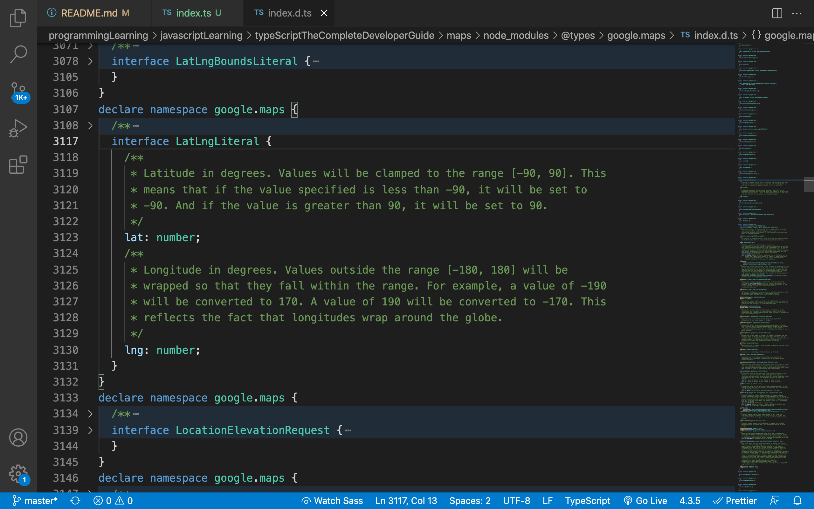

## 9.12. Hiding Functionality
1. Our application may use only certain methods from the instances of `Map`.
2. To prevent other engineers calling methods or functions that can break the application, we can "hide" the methods which is originally provided by Google Maps and allow only certain methods available in the new custom `Map` class.


## 9.13. Why Use Private Modifiers? 
1. We create another model as `CustomMap.ts` rather than create the instance from google maps directly.
2. Besides, we'd like the code to be more reusable, so we can take argument from the constructor when creating the instance. 
  ```ts
  export class CustomMap {
    // this prevent the methods to be called directly on the instance
    private googleMap: google.maps.Map;

    constructor(divId: string) {
      this.googleMap = new google.maps.Map(document.querySelector(`#${divId}`), {
        zoom: 1,
        center: {
          lat: 0,
          lng: 0,
        },
      });
    }
  }
  ```
1. In `index.ts`, we can notice that we can't call on other Google Maps method on the instance directly.
  ```ts
  import { CustomMap } from './CustomMap';

  const customMap = new CustomMap('map');
  ```

## 9.14. Adding Markers
1. A class in Typescript can be either used to create an instance of the class or be referred as the type of an object.
2. The following is part of the process of explain why the code is not ideal when defining classes as `addUserMarker` and `addCompanyMarker` can be very similar that we can actually merge it.
  ```ts
  // CustomMap.ts
  // class can be called to create instance or referred as a type
  import { User } from './User'; 
  import { Company } from './Company';

  export class CustomMap {
    private googleMap: google.maps.Map;

    constructor(divId: string) {
      this.googleMap = new google.maps.Map(document.querySelector(`#${divId}`), {
        zoom: 1,
        center: {
          lat: 0,
          lng: 0,
        },
      });
    }

    // the following isn't good approach!
    addUserMarker(user: User): void {
      new google.maps.Marker({
        map: this.googleMap,
        position: {
          lat: user.location.lat,
          lng: user.location.lng,
        },
      });
    }

    addCompanyMarker(company: Company): void {}
  }
  ```
3. After adding the method, we can call it in `index.ts` and render a random marker on the map every time we open the page.
  ```ts
  // index.ts
  /// <reference types="@types/google.maps" />
  import { User } from './User';
  import { Company } from './Company';
  import { CustomMap } from './CustomMap';

  const user = new User();
  const customMap = new CustomMap('map');

  customMap.addUserMarker(user);
  ```

## 9.15. Duplicate Code
1. We can find the code for both `addUserMarker` and `addCompanyMarker` are very similar.
2. The following code will create 2 markers on the map for the "User" and the "company".
  ```ts
  // CustomMap.ts
  import { User } from './User';
  import { Company } from './Company';

  export class CustomMap {
    private googleMap: google.maps.Map;

    constructor(divId: string) {
      this.googleMap = new google.maps.Map(document.querySelector(`#${divId}`), {
        zoom: 1,
        center: {
          lat: 0,
          lng: 0,
        },
      });
    }

    // the following isn't good approach!
    addUserMarker(user: User): void {
      new google.maps.Marker({
        map: this.googleMap,
        position: {
          lat: user.location.lat,
          lng: user.location.lng,
        },
      });
    }

    addCompanyMarker(company: Company): void {
      new google.maps.Marker({
        map: this.googleMap,
        position: {
          lat: company.location.lat,
          lng: company.location.lng,
        },
      });
    }
  }
  ```
  ```ts
  // index.ts
  /// <reference types="@types/google.maps" />
  import { User } from './User';
  import { Company } from './Company';
  import { CustomMap } from './CustomMap';

  const user = new User();
  const company = new Company();
  const customMap = new CustomMap('map');

  customMap.addUserMarker(user);
  customMap.addCompanyMarker(company);
  ```
  

## 9.16. One Possible Solution
1. One of the solution is to turn the method to be more generic by binding the argument with either `User` or `Company` with pipe character `|`.
2. However, this approach is still not ideal as if the number of classes increases, we have to keep binding the new class as the type of the argument.
3. On the other hand, if we only allow exactly the instances from either `User` or `Company` rather than other similar class, we can use this approach to prevent any other classes to call this method.
  ```ts
  // relatively generic approach
  import { User } from './User';
  import { Company } from './Company';
  import { name } from 'faker';

  export class CustomMap {
    private googleMap: google.maps.Map;

    constructor(divId: string) {
      this.googleMap = new google.maps.Map(document.querySelector(`#${divId}`), {
        zoom: 1,
        center: {
          lat: 0,
          lng: 0,
        },
      });
    }

    addMarker(mappable: User | Company): void {
      new google.maps.Marker({
        map: this.googleMap,
        position: {
          lat: mappable.location.lat,
          lng: mappable.location.lng,
        },
      });
    }
  }
  ```

## 9.17. Restricting Access with Interface
## 9.18. Implicit Type Checks
1. The other way to work aroudn is to ensure all the objects that we want to execute "addMarker" can be the argument of the method.
2. In this case, we can use `interface` as the gatekeeper to check if the arugment is aplicable to `addMarker` function.
  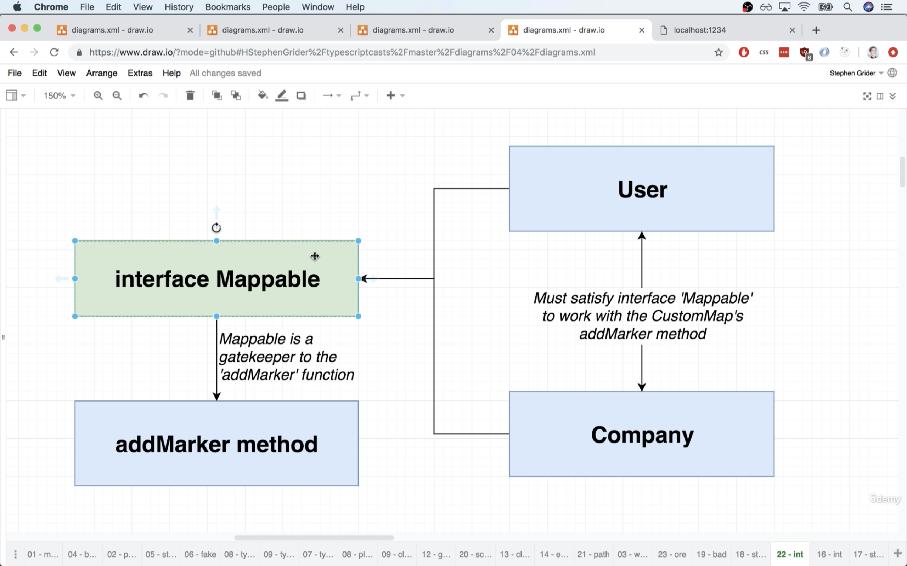
  ```ts
  // CustomMap.ts
  // Instruction to every other class
  // on how they can be an argument to 'addMarker'
  interface Mappable {
    location: {
      lat: number;
      lng: number;
    };
  }

  export class CustomMap {
    private googleMap: google.maps.Map;

    constructor(divId: string) {
      this.googleMap = new google.maps.Map(document.querySelector(`#${divId}`), {
        zoom: 1,
        center: {
          lat: 0,
          lng: 0,
        },
      });
    }

    addMarker(mappable: Mappable): void {
      new google.maps.Marker({
        map: this.googleMap,
        position: {
          lat: mappable.location.lat,
          lng: mappable.location.lng,
        },
      });
    }
  }
  ```

3. We then refactor the `index.ts` for the change.
4. After configuring the code, Typescript will check all the objects implicitly when we pass an argument to the method. If the object doesn't satisfy the requirements from `Mappable`, Typescript will prompt an error.
  ```ts
  // index.ts
  /// <reference types="@types/google.maps" />
  import { User } from './User';
  import { Company } from './Company';
  import { CustomMap } from './CustomMap';

  const user = new User();
  const company = new Company();
  const customMap = new CustomMap('map');

  // both user and company satisfy Mappable interface
  customMap.addMarker(user);
  customMap.addMarker(company);
  ```

## 9.19. Showing Popup Windows
1. We can check the details from the [official documentation](https://developers.google.com/maps/documentation/javascript/infowindows).
2. According to the documentation
   1. Create a string with HTML elements that we want to show in the information window
   2. Call `.InfoWindow` method on the google map instance and pass the HTML content string
   3. Call `.Marker` method and pass `position` (latlngLiteral), `map` (the google map instance), and `title` (a string to show the title of the marker)
   4. Add `click` event listener on the marker to open the information window when users click on it.
  ```ts
  // Instruction to every other class
  // on how they can be an argument to 'addMarker'
  interface Mappable {
    location: {
      lat: number;
      lng: number;
    };
  }

  export class CustomMap {
    private googleMap: google.maps.Map;

    constructor(divId: string) {
      this.googleMap = new google.maps.Map(document.querySelector(`#${divId}`), {
        zoom: 1,
        center: {
          lat: 0,
          lng: 0,
        },
      });
    }

    addMarker(mappable: Mappable): void {
      const marker = new google.maps.Marker({
        map: this.googleMap,
        position: {
          lat: mappable.location.lat,
          lng: mappable.location.lng,
        },
      });

      marker.addListener('click', () => {
        const infoWindow = new google.maps.InfoWindow({
          content: 'Hello World',
        });

        infoWindow.open(this.googleMap, marker);
      });
    }
  }
  ```

## 9.20. Updating Interface Definitions
1. To show content properly when adding marker on the map view, we can update the `interface` to require a `markerContent` method which returns string value when calling it.
2. Update `Company.ts`
  ```ts
  // Company.ts
  import faker from 'faker';

  export class Company {
    companyName: string;
    catchPhrase: string;
    location: {
      lat: number;
      lng: number;
    };

    constructor() {
      this.companyName = faker.company.companyName();
      this.catchPhrase = faker.company.catchPhrase();
      this.location = {
        lat: parseFloat(faker.address.latitude()),
        lng: parseFloat(faker.address.longitude()),
      };
    }

    markerContent(): string {
      return `
        <div>
          <h1>Company Name: ${this.companyName}</h1>
          <h3>Catchphrase: ${this.catchPhrase}</h3>
        </div>
      `;
    }
  }
  ```
3. Update `User.ts`
  ```ts
  // User.ts
  import faker from 'faker';

  export class User {
    name: string;
    location: {
      lat: number;
      lng: number;
    };

    constructor() {
      this.name = faker.name.firstName();
      this.location = {
        lat: parseFloat(faker.address.latitude()),
        lng: parseFloat(faker.address.longitude()),
      };
    }

    markerContent(): string {
      return `User Name: ${this.name}`;
    }
  }
  ```
4. Update `CustomMap.ts`
  ```ts
  // CustomMap.ts
  // Instruction to every other class
  // on how they can be an argument to 'addMarker'
  interface Mappable {
    location: {
      lat: number;
      lng: number;
    };
    markerContent(): string;
  }

  export class CustomMap {
    private googleMap: google.maps.Map;

    constructor(divId: string) {
      this.googleMap = new google.maps.Map(document.querySelector(`#${divId}`), {
        zoom: 1,
        center: {
          lat: 0,
          lng: 0,
        },
      });
    }

    addMarker(mappable: Mappable): void {
      const marker = new google.maps.Marker({
        map: this.googleMap,
        position: {
          lat: mappable.location.lat,
          lng: mappable.location.lng,
        },
      });

      marker.addListener('click', () => {
        const infoWindow = new google.maps.InfoWindow({
          content: mappable.markerContent(),
        });

        infoWindow.open(this.googleMap, marker);
      });
    }
  }
  ```

## 9.21. Optional Implements Clauses
1. When we update the `interface` in `CustomMap.ts`, Typescript may prompt an error in `index.ts` as our `User` and `Company` instance is not updated with the latest requirement in the interface. 
2. However, `index.ts` is not the root cause of the issue as because we are tryign to give `User` and `Company` instance which doesn't satisfy the requirements. Therefore, if we'd still like to pass `User` and `Company` instance, we have to change the class definition of each class.
3. We can export the `interface` required in `CustomMap.ts` and use it in `User.ts` when declaring the class.
  ```ts
  // CustomMap.ts
  export interface Mappable {
    location: {
      lat: number;
      lng: number;
    };
    markerContent(): string;
    color: string;
  }
  ```
  ```ts
  // User.ts
  import faker from 'faker';
  import { Mappable } from './CustomMap';

  export class User implements Mappable {
    name: string;
    location: {
      lat: number;
      lng: number;
    };
    color: string = 'red';

    constructor() {
      this.name = faker.name.firstName();
      this.location = {
        lat: parseFloat(faker.address.latitude()),
        lng: parseFloat(faker.address.longitude()),
      };
    }

    markerContent(): string {
      return `User Name: ${this.name}`;
    }
  }
  ```

## 9.22. App Wrapup
1. `private` class modifier
   1. We use `private` modifier to declare properties and methods in class to prevent accidental or intentional calls on the functions that may break the app. 
   2. Though the `private` or `protected` modifier on classes can't really prevent abusing the code if the other programmers intend to do so, it sure limits the change to accidentally miscall or execute inproper methods.
2. Use `interface` to set up general requirements
   1. We can use `interface` to merge the requirements and "schema" to the method that can be called by multiple types of instances.
   2. It only helps checking the "type" but not the exact content can be passed to it. 
3. Use `interface` on different classes
   1. We can export and import an `interface` and `implements` it on a class to ensure instances from the class are declared and defined as the requirements from `interface`.

# 10. More on Design Patterns
## 10.1. App Overview
1. The app can sort the data and values in different data strcuture such as `array`, `string` and `linked list`. 
2. The Goal is to create a sorting algorithm to reorder values in all given types of data.

## 10.2. Configuring the TS Compiler
1. In this case, we won't use `parcel` to work in browser environment. We'd use `NodeJS` as the environment instead.
2. Every time we use `tsc` package to compile Typescript to Javascript, it generates a new Javascript file on the same directory by default. 
3. Therefore, we can separate the source code (Typescript) in `src` and compiled code (Javascript) in `build`. 
4. To configure the `tsc` compiler, we can run `tsc --init`, so `tsc` will create a `tsconfig.json` file.
5. In this case, we will modify `rootDir` and `outDir` to configure the entry and output point. 
  ```json
  // tsconfig.json
  {
    "outDir": "./build",
    "rootDir": "./src"
  }
  ```
6. After configuring the compiler, we can run `tsc` directly without indicating the file name.
7. In addition, we can add `-w` flag when using `tsc`, so the compiler will keep watching and compiling the changes to the source code. It's very similar to run Javascript code with `nodemon` that will re-run and watch the chanages to the latest Javascript code.
  ```shell
  tsc -w
  ```

## 10.3. Concurrent Compilation and Execution
1. Though the compiler can watch and keep recompile Typescript when there's a change, we still need to open another terminal and run `node [yourfile.js]` to execute the code.
2. We can set up a new project with `npm init -y` and install `nodemon` and `concurrently` which allows to execute multiple commands at the same time.
3. This process is similar to use `webpack` to compile and bundle Javascript code with `babel` and run a local server which reacts to the changes of the code. We can check the reference in [Webpack Dev Server](https://github.com/allenlin90/programmingLearning/tree/master/javascriptLearning/completeJavaScriptCourse2020#706-the-webpack-dev-server)
  ```json
  // package.json
  {
    "name": "sort",
    "version": "1.0.0",
    "description": "",
    "main": "index.js",
    "scripts": {
      "start:build": "tsc -w",
      "start:run": "nodemon build/index.js",
      "start": "concurrently npm:start:*"
    },
    "keywords": [],
    "author": "",
    "license": "ISC",
    "dependencies": {
      "concurrently": "^6.2.1",
      "nodemon": "^2.0.12"
    }
  }
  ```

## 10.4. A Simple Sorting Algorithm
1. In this case, we will use "Bubble Sort" as the base algorithm to sort the data from the input.
2. The core concept of bubble sort is to compare values right next to each other and put the smaller value at front, or the greater value will be moved to the right. 
3. Each pair will be compared and the greatest value will be removed from the dataset and as the value on the right most in the new dataset. 
4. This process will keep going until all values are compared, so the algorithm is "finished".
5. Therefore, all data will be sorted and ordered from the smallest to the largest.
6. Note that this sorting algorithm isn't the best or most efficient way to sort, but suits for the requirments of this projects to sort multiple types of data structure.

## 10.5. Sorter Scaffolding
1. We create a `Sorter` class which has `collection` as the data (array of numbers) to be sorted and a method `sort` which returns nothing but sort the data stored in `collection` property.
  ```ts
  // index.ts
  class Sorter {
    constructor(public collection: number[]) {}

    sort(): void {}
  }

  const sorter = new Sorter([4, 2, 10, -2]);
  sorter.sort();
  console.log(sorter.collection);
  ```

## 10.6. Sorting Implementation
1. We use a nested for loop to iterate through the array.
2. The first for loop ensure all elements in the array are iterated.
3. The 2nd for loop checks the rest elements and put the largest value to the right.
  ```ts
  class Sorter {
    constructor(public collection: number[]) {}

    sort(): void {
      const { length } = this.collection;

      for (let i = 0; i < length; i++) {
        for (let j = 0; j < length - i - 1; j++) {
          if (this.collection[j] > this.collection[j + 1]) {
            const leftHand = this.collection[j];
            this.collection[j] = this.collection[j + 1];
            this.collection[j + 1] = leftHand;
          }
        }
      }
    }
  }

  const sorter = new Sorter([4, 2, 10, -2]);
  sorter.sort();
  console.log(sorter.collection);
  ```

## 10.7. Two Huge Issues
1. In the current condition, we may try to layout the algorithm for each type of data and sort with bubble sort.
2. In the previous example, we sort an array of numbers, while in this case, we are trying to sort and re-order a string value in alphabatic order. 
3. However, in Javascript, we can't re-order or assign a string value directly. 
4. In addition, each character in Javascript is associated with a number which can be checked with `.charCodeAt` method. For example, uppercase letters has smaller numbers than lowercase letters. 
5. Therefore, every time we compare 2 different characters, Javascript actually checks the number associated with the characte and compare the numbers. 
6. Thus, uppercase `X` can be smaller than lowercase `a`, though "x" is alphabetically behind "a".
7. In summary the current solution has 2 problems
   1. It only works with array of items.
   2. It can't work with characters but only numbers.

## 10.8. Typescript is Really Smart
1. One of the solutions (though NOT ideal), is to use "Union Types" by checking the type of the argument passing to the method. In this case, we'd allow `colleciton` argument to be either `:number []` which is an array of numbers or `:string` that is a string.
  ```ts
  class Sorter {
    constructor(public collection: number[] | string) {}
  }
  ```
2. However, according to [previous section](https://github.com/allenlin90/programmingLearning/tree/master/javascriptLearning/typeScriptTheCompleteDeveloperGuide#916-one-possible-solution), it is not ideal because we can then only access the common properties or methods that both the given types have .
3. In this case, though we can use array notation to retrieve data at certain position in an array, we can't edit or write the element at the position for a string value because strings aren't mutalbe in Javascript.
4. Therefore, we will find error message indicating that "Index signature in type 'string | number[]' only permits reading."

## 10.9. Type Guards
1. In this case, we can use a "Type Guard" to check if the data we will manipuldate falls in to certain type of value.
2. We can check `this.collection` is an `instanceof` array, while in the following code, we can use `typeof` to check if the collection is `string` type value.
3. In each `IF` statement block, we can use associated methods which are only available on arrays or strings.
  ```ts
  class Sorter {
    constructor(public collection: number[] | string) {}

    sort(): void {
      const { length } = this.collection;

      for (let i = 0; i < length; i++) {
        for (let j = 0; j < length - i - 1; j++) {
          // All of this only works if collection is number[]
          // If collection is an array of numbers
          if (this.collection instanceof Array) { // Type Guard
            // collection === number[]
            if (this.collection[j] > this.collection[j + 1]) {
              const leftHand = this.collection[j];
              this.collection[j] = this.collection[j + 1];
              this.collection[j + 1] = leftHand;
            }
          }

          // Only going to work if colelciton is a string
          // If collection is a string, do this logic instead:
          // ~~~logic to compare and swap characters in a string
          if (typeof this.collection === 'string') {
            
          }
        }
      }
    }
  }

  const sorter = new Sorter([4, 2, 10, -2]);
  sorter.sort();
  console.log(sorter.collection);
  ```
4. In Javascript, we can use `typeof` to check primitive type values such as `number`, `string`, `boolean`, and `symbol`.
5. In addition, we can use `instanceof` to check if the object falls into certain type which is created by a constructure function (which is similar to a `class`).
6. Note that before ES6, Javascript uses "**constructor functions**" as "class" to create objects as its instances. ["class"](https://github.com/allenlin90/programmingLearning/tree/master/javascriptLearning/completeJavaScriptCourse2020#5012-classes) is the syntatic sugar and shorthand to represent such feature in Javascript.
7. Besides, `Array`, `Function,` and `Object` are all `object` type value when we check with `typeof`. Therefore, besdies primitive values, we'd use `instanceof` to check if an object follows certain type of class. 

## 10.10. Why is This Bad?
1. This has the same problems as the previous project that we have to keep adding different types of value in the class constructor.
2. Besides, each type needs a specific type guard to check and execute similar bubble sorting process to iterate through the data.

## 10.11. Extracing Key Logic
1. There are 2 main operations to iterate the data with bubble sorting process which can vary according to different data type or structure. 
   1. "**Comparison**" between 2 values and check which is larger/smaller.
   2. "**The swaping logic**" to move the larger value to the right and smaller value to the left. 
2. We therefore extract the logics as sub-classes to deal with different types of data.
3. Other structure in the class such as nested for loops can sit as what it is, such as the nested for loop.
4. We firstly clean up the code and put the `Sorter` class in `Sorter.ts` in the same directory.

## 10.12. Separating Swapping and Comparison
1. As we extracts the logic for "comparison" and "swapping", we define a new class to work on array of numbers.
2. In Javascript classes, we can use `get` modifier on a class method to turn the method like a property-like feature. When the [getter function](https://javascript.info/class#getters-setters) is called, we don't need to execute the function but call it as a regular property of the object.
  ```ts
  // NumbersCollection.ts
  export class NumbersCollection {
    constructor(public data: number[]) {}

    get length(): number { // getter function 
      return this.data.length;
    }

    compare(leftIndex: number, rightIndex: number): boolean {
      return this.data[leftIndex] > this.data[rightIndex];
    }

    swap(leftIndex: number, rightIndex: number): void {
      const leftHand = this.data[leftIndex];
      this.data[leftIndex] = this.data[rightIndex];
      this.data[rightIndex] = leftHand;
    }
  }

  const collection = new NumbersCollection([1, 2, 3]);
  collection.length; // get data as calling an object property rather than a method
  ```
3. We update `Sorter` class to work with the new class `NumbersCollection`.
  ```ts
  import { NumbersCollection } from './NumbersCollection';
  export class Sorter {
    constructor(public collection: NumbersCollection) {}

    sort(): void {
      const { length } = this.collection;

      for (let i = 0; i < length; i++) {
        for (let j = 0; j < length - i - 1; j++) {
          if (this.collection.compare(j, j + 1)) {
            this.collection.swap(j, j + 1);
          }
        }
      }
    }
  }
  ```
4. Finally, we update `index.ts` to ensure all the classes and methods are defined correctly and can work together.
  ```ts
  // index.ts
  import { Sorter } from './Sorter';
  import { NumbersCollection } from './NumbersCollection';

  const numberCollection = new NumbersCollection([4, 2, 10, -2]);
  const sorter = new Sorter(numberCollection);
  sorter.sort();
  console.log(numberCollection.data);
  ```


## 10.13. The Big Reveal
1. In the previous section, we update the type of collection data in `Sorter` from `:number[]` to `NumberCollection`.
2. However, this still has the issue that we have to keep adding on new data type or structure for different types of values.
3. Thus, we can use `interface` as in the previous design pattern, we can have a general types that only the types giving to `Sorter` class fits, so it works.
  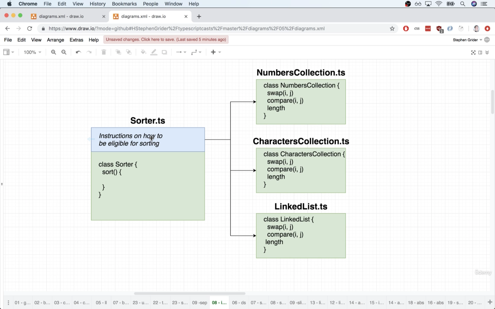

## 10.14. Interface Definition
1. We can create an `interface` as `Sortable`. The getter function can be considered as a property of the instance.
2. We then can work on other types of data such as string and linked list to be sorted. 
  ```ts
  // Sorter.ts
  interface Sortable {
    length: number;
    compare(leftIndex: number, rightIndex: number): boolean;
    swap(leftIndex: number, rightIndex: number): void;
  }

  export class Sorter {
    constructor(public collection: Sortable) {}

    sort(): void {
      const { length } = this.collection;

      for (let i = 0; i < length; i++) {
        for (let j = 0; j < length - i - 1; j++) {
          if (this.collection.compare(j, j + 1)) {
            this.collection.swap(j, j + 1);
          }
        }
      }
    }
  }
  ```

## 10.15. Sorting Arbitrary Collection
1. We create a new class `CharacterCollections`. 
2. In this case, we need to turn all letters into lowercase to ensure the characters are fairly compared.
  ```ts
  // CharactersCollection.ts
  export class CharacterCollections {
    constructor(public data: string) {}

    get length(): number {
      return this.data.length;
    }

    compare(leftIndex: number, rightIndex: number): boolean {
      return (
        this.data[leftIndex].toLowerCase() > this.data[rightIndex].toLowerCase()
      );
    }

    swap(leftIndex: number, rightIndex: number): void {
      const characters = this.data.split('');
      const leftHand = characters[leftIndex];
      characters[leftIndex] = characters[rightIndex];
      characters[rightIndex] = leftHand;

      this.data = characters.join('');
    }
  }
  ```
1. We can test the new type `CharactersCollection` in `index.ts` to test it out.
  ```ts
  // index.ts
  import { Sorter } from './Sorter';
  import { NumbersCollection } from './NumbersCollection';
  import { CharacterCollection } from './CharactersCollection';

  // const numberCollection = new NumbersCollection([4, 2, 10, -2]);
  // const sorter = new Sorter(numberCollection);
  // sorter.sort();
  // console.log(numberCollection.data);

  const charactersCollection = new CharacterCollection('Xaayb');
  const sorter = new Sorter(charactersCollection);
  sorter.sort();
  console.log(charactersCollection);
  ```

## 10.16. Linked List Implementation
1. Each node in the linked list has a "**value**" and "**next**" which is the pointer to the next node in the data. 
2. In this case, the linked list instance can have the following properties
   1. `add(number)` - add a new node to the data
   2. `at(number)` - return the node at specific position by index on in the chain
   3. `length(number)` - return total number of nodes
   4. `swap(number, number)`
   5. `compare(number number)`
   6. `print()` - print all values in nodes in the chain
3. In `swap` function, we actually swap the data of the node rather swap the whole node directly as the pointer `next` should be reassigned and the process can be very complicated.
  ```ts
  // LinkedList.ts
  class Node {
  next: Node | null = null;

  constructor(public data: number) {}
    compare() {}
    swap() {}
  }

  export class LinkedList {
    head: Node | null = null;

    add(data: number): void {
      const node = new Node(data);
      if (!this.head) {
        this.head = node;
        return;
      }

      let tail = this.head;
      while (tail.next) {
        tail = tail.next;
      }
      tail.next = node;
    }

    get length(): number {
      if (!this.head) return 0;
      let length = 1;
      let node = this.head;
      while (node.next) {
        length++;
        node = node.next;
      }
      return length;
    }

    at(index: number): Node {
      if (!this.head) {
        throw new Error('Index out of bounds');
      }

      let counter = 0;
      let node: Node | null = this.head; // either Node or null as the tail node
      while (node) {
        if (counter === index) {
          return node;
        }

        counter++;
        node = node.next;
      }

      // if the function never hits the "return" in while loop
      throw new Error('Index out of bounds');
    }

    compare(leftIndex: number, rightIndex: number): boolean {
      if (!this.head) {
        throw new Error('List is empty');
      }

      return this.at(leftIndex).data > this.at(rightIndex).data;
    }

    swap(leftIndex: number, rightIndex: number): void {
      const leftNode = this.at(leftIndex);
      const rightNode = this.at(rightIndex);

      const leftHand = leftNode.data;
      leftNode.data = rightNode.data;
      rightNode.data = leftHand;
    }

    print(): void {
      if (!this.head) {
        return;
      }

      let node: Node | null = this.head; // either Node or null as the tail node
      while (node) {
        console.log(node.data);
        node = node.next;
      }
    }
  }
  ```

## 10.17. Just One More Fix
1. We can test the new class `LinkedList`.
  ```ts
  // index.ts
  import { Sorter } from './Sorter';
  import { NumbersCollection } from './NumbersCollection';
  import { CharacterCollection } from './CharactersCollection';
  import { LinkedList } from './LinkedList';

  // const numberCollection = new NumbersCollection([4, 2, 10, -2]);
  // const sorter = new Sorter(numberCollection);
  // sorter.sort();
  // console.log(numberCollection.data);

  // const charactersCollection = new CharacterCollection('Xaayb');
  // const sorter = new Sorter(charactersCollection);
  // sorter.sort();
  // console.log(charactersCollection);

  const linkedList = new LinkedList();
  linkedList.add(500);
  linkedList.add(-10);
  linkedList.add(-3);
  linkedList.add(4);

  const sorter = new Sorter(linkedList);
  sorter.sort();
  linkedList.print();
  ```
2. However, it will be more intuitive if each type of data collection can have its own `sorter` function rather than creating an instnace of `Sorter` and run in the general class.
  ```ts
  // sort on each data collection directly
  numberCollection.sort();
  characterColleciton.sort();
  linkedList.sort();
  ```

## 10.18. Integrating the Sort Method
1. As `sort` can be the general function in `Sorter` that uses `compare` and `swap` function of each colleciton.
2. Therefore, we can make `Sorter` as the parent class of other type of data structure.
3. We can refactor the code in `Sorter` that we don't need to declare `length` but rather calling `this.compare()` and `this.swap()` in the nested for loop directly.

## 10.19. Issues with Inheritance
1. As we can remove the `interface` and collection in `Sorter`, Typescript doesn't know exactly this class will be extended and its instance just want to use the function inherited from this `Sorter` class. 
2. The sorter itself doesn't have `length`, `compare` and `swap` that only its instance will inherit the function and use directly in the child instances.
  ```ts
  // Sorter.ts
  export class Sorter {
    sort(): void {
      const { length } = this; // this returns an error

      for (let i = 0; i < length; i++) {
        for (let j = 0; j < length - i - 1; j++) {
          if (this.compare(j, j + 1)) { // this returns an error
            this.swap(j, j + 1); // this returns an error
          }
        }
      }
    }
  }
  ```

## 10.20. Abstract Classes
1. In regular Typescript, it checks if the class has the properties or methods that can be called inside of it on its own. 
2. In this case, `Sorter` has only `sort` method in the class declaration, so Typescript returns error, as there's no `length`, `compare`, and `swap` found in the class.
3. An abstract class
   1. Can't be used to create an object directly
   2. Only used as a parent class
   3. Can contain real implementation for some methods
   4. The implemented methods can refer to other methods that don't actually exist yet (we still have to provide names and types for the un-implemented methods)
   5. Can make child classes promise to implement some other method
4. The abstract class `Sorter` in this case has to notice Typescript that though `length`, `compare` and `swap` is not in the class but will eventually exist.

## 10.21. Why Use Abstract Classes?
1. We can refactor `Sorter` class with keyword `abstract`.
  ```ts
  // Sorter.ts
  export abstract class Sorter {
    abstract length: number;
    abstract compare(leftIndex: number, rightIndex: number): boolean;
    abstract swap(leftIndex: number, rightIndex: number): void;

    sort(): void {
      const { length } = this;

      for (let i = 0; i < length; i++) {
        for (let j = 0; j < length - i - 1; j++) {
          if (this.compare(j, j + 1)) {
            this.swap(j, j + 1);
          }
        }
      }
    }
  }
  ```

## 10.22. Solving All Issues with Abstract Classes
1. We can refactor `NumbersCollection`, `CharactersCollection`, and `LinkedList` class and the code to execute in `index.ts`.
2. It's simply adding `extends Sorter` to ensure the class is a sub-class of `Sorter`.  
  ```ts
  import { Sorter } from './Sorter';

  export class NumbersCollection extends Sorter {...}
  export class CharactersCollection extends Sorter {...}
  export class LinkedList extends Sorter {...}
  ```
2. Testing in `index.ts`.
  ```ts
  // index.ts
  import { NumbersCollection } from './NumbersCollection';
  import { CharacterCollection } from './CharactersCollection';
  import { LinkedList } from './LinkedList';

  const numberCollection = new NumbersCollection([4, 2, 10, -2]);
  numberCollection.sort();
  console.log(numberCollection.data);

  const charactersCollection = new CharacterCollection('Xaayb');
  charactersCollection.sort();
  console.log(charactersCollection);

  const linkedList = new LinkedList();
  linkedList.add(500);
  linkedList.add(-10);
  linkedList.add(-3);
  linkedList.add(4);

  linkedList.sort();
  linkedList.print();
  ```

## 10.23. Interfaces vs Abstract Classes
1. In this case, `interface` won't be used as "**abstract class**" has been enough for the requirements.
2. Interfaces
   1. Sets up a contract between different classes
   2. **Use when we have a very different objects that we want to work together**
   3. Promotes loose coupling
3. Inheritance/Abstract Classes
   1. Sets up a contract between different classes
   2. **Use when we are trying to build up a definition of an object**
   3. Strongly couples classes together

# 11. Resuable Code
## 11.1. Project Overview
1. The project is to import (load) data, parse, and analyze data from CSV file and create report.

## 11.2. Project Setup
1. Similar to previous case, we use `nodemon` and `concurrently` and setup both `package.json` for npm scripts and `tsconfig.json` for the app.
  ```json
  // package.json
  {
    "scripts": {
      "start:build": "tsc -w",
      "start:run": "nodemon build/index.js",
      "start": "concurrently npm:start:*"
    }
  }
  ```

## 11.3. CSV 
1. We can use `NodeJS` file system module [`fs.readFileSync`](https://nodejs.org/api/fs.html#fs_fs_readfilesync_path_options) to read a local file.

## 11.4. Type Definition Files - Again!
1. Typescript doesn't support Node standard library as other Javascript libraries. Therefore, we may use "Type Definition File" as when using other libraries.
2. Note that every "TDF" for `NodeJS` has been included in a single package, so we can simply install with `npm install @types/node`.

## 11.5. Reading CSV Files
1. We then can use file system module to read data from the CSV file.
2. However, the following code doesn't provide useful information as it's simply printing out all the data line by line.
  ```ts
  // index.ts
  import fs from 'fs';

  const matches = fs.readFileSync('football.csv', {
    encoding: 'utf-8', // buffer data will be returned if this is not specified
  });

  console.log(matches);
  ```
3. We can parse the data by its pattern. For example, we can 
   1. Split the string by change line character `\n`. The output will be array of strings. Each element is a row in the CSV file.
   2. Split the string with comma. The output will be 2 dimensional array each element in the nested array is a string separated by the comma.
  ```ts
  import fs from 'fs';

  const matches = fs
    .readFileSync('football.csv', {
      encoding: 'utf-8', // buffer data will be returned if this is not specified
    })
    .split('\n')
    .map((row: string): string[] => {
      return row.split(',');
    });

  console.log(matches);
  ```

## 11.6. Running an Analysis
1. We can count on the number winnig games of a given team from the dataset.
  ```ts
  import fs from 'fs';

  const matches = fs
    .readFileSync('football.csv', {
      encoding: 'utf-8', // buffer data will be returned if this is not specified
    })
    .split('\n')
    .map((row: string): string[] => {
      return row.split(',');
    });

  let manUnitedWins = 0;

  for (let match of matches) {
    if (match[1] === 'Man United' && match[5] === 'H') {
      manUnitedWins++;
    } else if (match[2] === 'Man United' && match[5] === 'A') {
      manUnitedWins++;
    }
  }

  console.log(`Man United won ${manUnitedWins} games`);
  ```

## 11.7. Losing Dataset Context
1. In the previous example, we compare `match[5]` to check if the team either wins at home or away.
2. However, such expression can be misleading and consfusing for other developers if they aren't familiar with the dataset. Besides, we'd like to indicate in the code that there are actually 3 types of options for the variable.
3. Though we can turn the string into a meaningful variable, we don't check "draw" games in the dataset in the code above.
4. Typescript will indicate that the variable is not in use, so there's high chances that other developers may delete the redundant code to clean up the code base.
  ```ts
  import fs from 'fs';

  const matches = fs
    .readFileSync('football.csv', {
      encoding: 'utf-8', // buffer data will be returned if this is not specified
    })
    .split('\n')
    .map((row: string): string[] => {
      return row.split(',');
    });

  const homeWin = 'H';
  const awayWin = 'A';
  const draw = 'D'; // Typescript can indicate this variable is not in use 

  let manUnitedWins = 0;

  for (let match of matches) {
    if (match[1] === 'Man United' && match[5] === homeWin) {
      manUnitedWins++;
    } else if (match[2] === 'Man United' && match[5] === awayWin) {
      manUnitedWins++;
    }
  }

  console.log(`Man United won ${manUnitedWins} games`);
  ```

## 11.8. Using Enums
1. We can use either objects in Javascript way or use `enum` (enumeration) in Typescript to indicate a specific type.
  ```ts
  // Javascript approach
  const matchResult = {
    homeWin: 'H',
    awayWin: 'A',
    draw: 'D',
  }

  matchResult.homeWin
  matchResult.awayWin
  matchResult.draw

  // Typescript
  enum MatchResult { // enum as a type
    HomeWin = 'H';
    AwayWin = 'A';
    Draw = 'D';
  }

  MatchResult.HomeWin;
  MatchResult.AwayWin;
  MatchResult.Draw;

  const returnMatchResult = (): MatchResult => {
    if (match[5] === 'H') {
      return MatchResult.HomeWin;
    }

    return MatchResult.AwayWin;
  }
  ```

## 11.9. When to use Enums
1. Enums 
   1. follow near-identical syntax rules as normal objects.
   2. creates an object with the same keys and values when converted from TS to JS.
   3. Primary goal is to signal to other engineers that these are all closely related values.
   4. Use whenever we have a small fixed set of values that are all closely related and known at compile time.

## 11.10. Extracting CSV Reading
1. We can separate the function of reading data from CSV file and change the structure of the code. For example, the CSV reading process can be changed to fetching data from an API.
  ```ts
  // CsvFileReader.ts
  import fs from 'fs';

  export class CsvFileReader {
    data: string[][] = [];

    constructor(public filename: string) {}

    read(): void {
      this.data = fs
        .readFileSync(this.filename, {
          encoding: 'utf-8', // buffer data will be returned if this is not specified
        })
        .split('\n')
        .map((row: string): string[] => {
          return row.split(',');
        });
    }
  }
  ```
2. We then can refactor the code in `index.ts`.
  ```ts
  // index.ts 
  import { CsvFileReader } from './CsvFileReader';

  const reader = new CsvFileReader('football.csv');
  reader.read();

  // enum - enumeration
  enum MatchResult {
    HomeWin = 'H',
    AwayWin = 'A',
    Draw = 'D',
  }

  let manUnitedWins = 0;

  for (let match of reader.data) {
    if (match[1] === 'Man United' && match[5] === MatchResult.HomeWin) {
      manUnitedWins++;
    } else if (match[2] === 'Man United' && match[5] === MatchResult.AwayWin) {
      manUnitedWins++;
    }
  }

  console.log(`Man United won ${manUnitedWins} games`);
  ```

## 11.11. Date Types
1. We'd like to convert data on each row to be aligned data type such as `Date`, `Number`, and `MatchResult`.
2. For example, we have date stored as `dd/mm/yyyy`, we can turn it into a `Date` type data

## 11.12. Converting Data Strings to Dates
1. We can use native `Date` class in Javascript to work with `Date` type objects.
2. Create `utils.ts` as utilities for the code to convert date string to date object.
  ```ts
  // utils.ts
  export const dateStringToDate = (dateString: string): Date => {
    // 28/10/2018
    const dateParts = dateString.split('/').map((value: string): number => {
      return parseInt(value);
    });

    return new Date(dateParts[2], dateParts[1] - 1, dateParts[0]);
  };
  ```

## 11.13. Converting Row Values
1. We can chain another `map` to convert the array of string as each row after fetching data from the CSV file. 
  ```ts
  // CsvFileReader.ts
  import fs from 'fs';

  export class CsvFileReader {
    data: string[][] = [];

    constructor(public filename: string) {}

    read(): void {
      this.data = fs
        .readFileSync(this.filename, {
          encoding: 'utf-8', // buffer data will be returned if this is not specified
        })
        .split('\n')
        .map((row: string): string[] => {
          return row.split(',');
        })
        .map((row: string[]): any => {
          return [
            dateStringToDate(row[0]),
            row[1],
            row[2],
            parseInt(row[3]),
            parseInt(row[4]),
            ... // not finished
          ];
        });
    }
  }
  ```

## 11.14. Type Assertions
1. We can use keyword `as` to apply "Type Assertions" to overwrite the type checking by Typescript by default. 
2. However, we still define the data 
  ```ts
  // CsvFileReader.ts
  import fs from 'fs';
  import { dateStringToDate } from './utils';
  import { MatchResult } from './MatchResult';

  export class CsvFileReader {
    data: string[][] = [];

    constructor(public filename: string) {}

    read(): void {
      this.data = fs
        .readFileSync(this.filename, {
          encoding: 'utf-8', // buffer data will be returned if this is not specified
        })
        .split('\n')
        .map((row: string): string[] => {
          return row.split(',');
        })
        .map((row: string[]): any => { // this shouldn't be "any" type
          return [
            dateStringToDate(row[0]),
            row[1],
            row[2],
            parseInt(row[3]),
            parseInt(row[4]),
            row[5] as MatchResult, // use keyword 'as' to use type assertion to change default Typescript type
            row[6],
          ];
        });
    }
  }
  ```
  ```ts
  // index.ts
  import { CsvFileReader } from './CsvFileReader';
  import { MatchResult } from './MatchResult';

  const reader = new CsvFileReader('football.csv');
  reader.read();

  console.log(reader.data);

  let manUnitedWins = 0;

  for (let match of reader.data) {
    if (match[1] === 'Man United' && match[5] === MatchResult.HomeWin) {
      manUnitedWins++;
    } else if (match[2] === 'Man United' && match[5] === MatchResult.AwayWin) {
      manUnitedWins++;
    }
  }

  console.log(`Man United won ${manUnitedWins} games`);
  ```

## 11.15. Describing a Row with a Tuple
1. One way to replace `any` type is to use logic "OR" `|` that the type of data in the array can be `Date`, `string`, `number,` or `MatchResult`.
2. However, this type of annotation has a problem that we need to use type guard to check each value to manipuldate the data.
3. In this case, we can use `Tuple` which can specify the type of value in each position in an array.
4. We firstly define the tuple as a new type.
  ```ts
  // CsvFileReader.ts
  import fs from 'fs';
  import { dateStringToDate } from './utils';
  import { MatchResult } from './MatchResult';

  // define a tuple
  type MatchData = [Date, string, string, number, number, MatchResult, string];

  export class CsvFileReader {
    data: MatchData[] = []; // array of MatchData type (still 2D array)

    constructor(public filename: string) {}

    read(): void {
      this.data = fs
        .readFileSync(this.filename, {
          encoding: 'utf-8', // buffer data will be returned if this is not specified
        })
        .split('\n')
        .map((row: string): string[] => {
          return row.split(',');
        })
        .map((row: string[]): MatchData => {
          return [
            dateStringToDate(row[0]),
            row[1],
            row[2],
            parseInt(row[3]),
            parseInt(row[4]),
            row[5] as MatchResult, // use keyword 'as' to use type assertion to change default Typescript type
            row[6],
          ];
        });
    }
  }
  ```

## 11.16. Not Done with FileReader Yet!
1. The current code can still have issues that the `CsvFileReader` class is not general and can't work with other types of data if the it doesn't follow the pattern in `footbal.csv`.
2. We can back up the current code and create a new version of csv reader.

## 11.17. Understanding Refactor #1
1. We first extract the `mapRow` method as the last `map` to parse the data in each row to turn elements type aligning to `MatchResult`.
  ```ts
  import fs from 'fs';
  import { dateStringToDate } from './utils';
  import { MatchResult } from './MatchResult';

  type MatchData = [Date, string, string, number, number, MatchResult, string];

  export class CsvFileReader {
    data: MatchData[] = [];

    constructor(public filename: string) {}

    read(): void {
      this.data = fs
        .readFileSync(this.filename, {
          encoding: 'utf-8', // buffer data will be returned if this is not specified
        })
        .split('\n')
        .map((row: string): string[] => {
          return row.split(',');
        })
        .map(this.mapRow);
    }

    mapRow(row: string[]): MatchData {
      return [
        dateStringToDate(row[0]),
        row[1],
        row[2],
        parseInt(row[3]),
        parseInt(row[4]),
        row[5] as MatchResult, // use keyword 'as' to use type assertion to change default Typescript type
        row[6],
      ];
    }
  }
  ```
2. As we'd like to reuse the code, we can turn `CsvFileReader` into an "abstract class". Therefore, the reader will only focus on reading the file from the file system while we can create other types of `MatchReader` to manipuldate and parse different types of data structure. 

## 11.18. Creating Abstract Classes
1. We can extract code and create `MatchReader.ts`
  ```ts
  // MatchReader.ts
  import { CsvFileReader } from "./CsvFileReader";
  import { dateStringToDate } from "./utils";
  import { MatchResult } from "./MatchResult";

  export class MatchReader extends CsvFileReader {
    mapRow(row: string[]): MatchData { // this still returns an error as there's no 'MatchData' interface to refer
      return [
        dateStringToDate(row[0]),
        row[1],
        row[2],
        parseInt(row[3]),
        parseInt(row[4]),
        row[5] as MatchResult, // use keyword 'as' to use type assertion to change default Typescript type
        row[6],
      ];
    }
  }
  ```
2. Then turn `CsvFileReader` into a "abstract class".
3. However, this still has a problem that the "data" stored in the class is still aligned to `MatchData` which doesn't make the code really "general".
4. Besides, though we may simply replace `MatchData` to `any` to temprary solve the issue, it is not ideal for Typescript structure to have any arbitrary type.
  ```ts
  // CsvFileReader.ts
  import fs from 'fs';
  import { MatchResult } from './MatchResult';

  // mapRow method still refers to MatchData type
  type MatchData = [Date, string, string, number, number, MatchResult, string];

  export abstract class CsvFileReader {
    data: MatchData[] = [];

    constructor(public filename: string) {}

    abstract mapRow(row: string[]): MatchData; // mapRow method still refers to MatchData type

    read(): void {
      this.data = fs
        .readFileSync(this.filename, {
          encoding: 'utf-8', // buffer data will be returned if this is not specified
        })
        .split('\n')
        .map((row: string): string[] => {
          return row.split(',');
        })
        .map(this.mapRow);
    }
  }
  ```

## 11.19. Variable Types with Generics
1. We can use `generics` to solve the issue when creating a new abstract class. Generics are 
   1. like funciton arguments, but for types in class/function definitions.
   2. allow us to define the type of a property/argument/return value at a future point.
   3. used heavily when writing reusable code.
  ```ts
  // samples for generics
  const addOne = (a: number):number => {
    return a + 1;
  }

  const addTwo = (a: number):number => {
    return a + 2;
  }

  addOne(10);
  addTwo(10);

  const add = (a: number, b: number): number => {
    return a + b;
  }

  add(10, 1);
  add(10, 2);
  add(10, 3);

  class HoldNumber {
    data: number
  }

  class HoldString {
    data: string
  }

  const holdNumber = new HoldNumber();
  holdNumber.data = 123;

  const holdString = new HoldString();
  holdString.data = 'abcdeefg';

  // using generics
  class HoldAnyThing<TypeOfData> {
    data: TypeOfData;
  }

  const holdNumber = new HoldAnyThing<number>();
  holdNumber.data = 123;

  const holdString = new HoldAnyThing<string>();
  holdString.data = 'abcdefg';
  ```
2. By convention, we use capital `T` to represent the generic type when declaring a class.
  ```ts
  // CsvFileReader.ts
  import fs from 'fs';
  import { MatchResult } from './MatchResult';

  export abstract class CsvFileReader<T> {
    data: T[] = [];

    constructor(public filename: string) {}

    abstract mapRow(row: string[]): T;

    read(): void {
      // ...
    }
  }
  ```

## 11.20. Applying a Type to a Generic Class
1. We then can update `MatchReader`
  ```ts
  // MatchReader.ts
  import { CsvFileReader } from './CsvFileReader';
  import { dateStringToDate } from './utils';
  import { MatchResult } from './MatchResult';

  type MatchData = [Date, string, string, number, number, MatchResult, string];

  export class MatchReader extends CsvFileReader<MatchData> {
    mapRow(row: string[]): MatchData {
      return [
        dateStringToDate(row[0]),
        row[1],
        row[2],
        parseInt(row[3]),
        parseInt(row[4]),
        row[5] as MatchResult, // use keyword 'as' to use type assertion to change default Typescript type
        row[6],
      ];
    }
  }
  ```
2. We then can update `index.ts` to execute the functions. We now don't refer to `CsvFileReader` directly but rather `MatchReader` which is extended from `CsvFileReader`.
  ```ts
  // index.ts
  import { MatchReader } from './MatchReader';
  import { MatchResult } from './MatchResult';

  const reader = new MatchReader('football.csv');
  reader.read();

  let manUnitedWins = 0;

  for (let match of reader.data) {
    if (match[1] === 'Man United' && match[5] === MatchResult.HomeWin) {
      manUnitedWins++;
    } else if (match[2] === 'Man United' && match[5] === MatchResult.AwayWin) {
      manUnitedWins++;
    }
  }

  console.log(`Man United won ${manUnitedWins} games`);
  ```

## 11.21. Alternate Refactor
1. Though we have extracted the reader function and extends it to different types of data, the data source can be changed as well. For example, the current data is coming from reading data from a CSV file. The data source can be changed to other types of dataset such as Excel and calling from a remote API.
2. We can then create general `interface` as `DataReader` that all readers shall follow its requirements, so can work further with the data type reader such as `MatchReader`.
  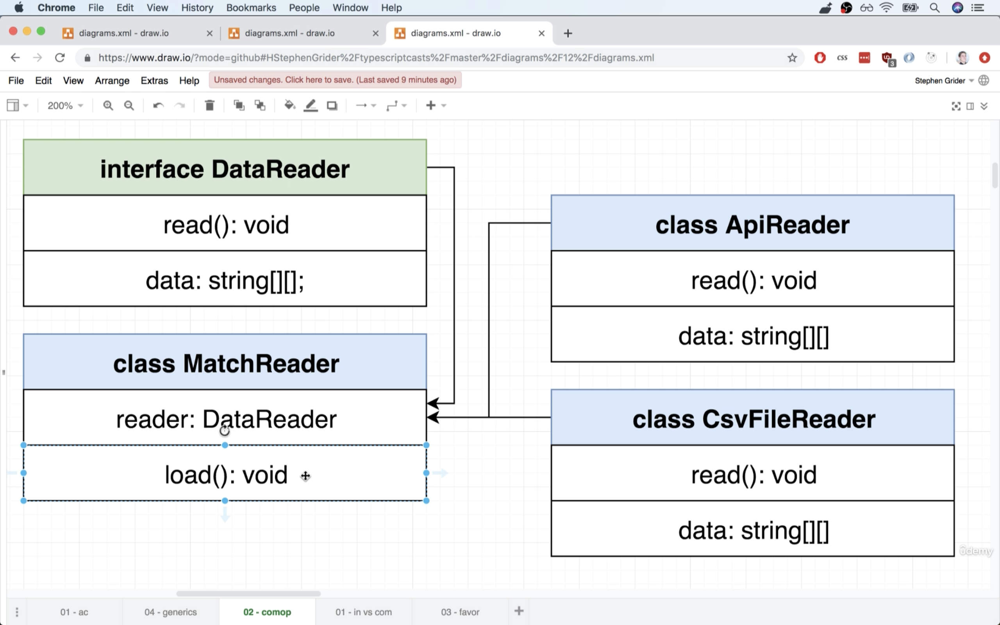

## 11.22. Interface-Based Approach
1. We create another `MatchReader` to use general `DataReader` that may read data from different types of source or format.
  ```ts
  // MatchReader.ts
  interface DataReader {
    read(): void;
    data: string[][];
  }

  export class MatchReader {
    constructor(public reader: DataReader) {}
  }
  ```

## 11.23. Extracting Match References - Again!
1. We refactor `CsvFileReader` to be general that can be used in every conditions and it only reads data from CSV files.
  ```ts
  // CsvFileReader.ts
  import fs from 'fs';

  export class CsvFileReade {
    data: string[][] = [];

    constructor(public filename: string) {}

    read(): void {
      this.data = fs
        .readFileSync(this.filename, {
          encoding: 'utf-8', // buffer data will be returned if this is not specified
        })
        .split('\n')
        .map((row: string): string[] => {
          return row.split(',');
        });
    }
  }
  ```

## 11.24. Transforming Data
1. We then add `load` method in `MatchReader` which can use the data reader and import the data to class instance.
  ```ts
  // MatchReader.ts
  import { dateStringToDate } from './utils';
  import { MatchResult } from './MatchResult';

  type MatchData = [Date, string, string, number, number, MatchResult, string];

  interface DataReader {
    read(): void;
    data: string[][];
  }

  export class MatchReader {
    matches: MatchData[] = [];
    constructor(public reader: DataReader) {}

    load(): void {
      this.reader.read();
      this.matches = this.reader.data.map((row: string[]): MatchData => {
        return [
          dateStringToDate(row[0]),
          row[1],
          row[2],
          parseInt(row[3]),
          parseInt(row[4]),
          row[5] as MatchResult, // use keyword 'as' to use type assertion to change default Typescript type
          row[6],
        ];
      });
    }
  }
  ```

## 11.25. Updating Reader References
```ts
// index.ts
import { MatchReader } from './MatchReader';
import { CsvFileReader } from './CsvFileReader';
import { MatchResult } from './MatchResult';

// create an object that satisfies the 'DataReader' interface
const csvFileReader = new CsvFileReader('football.csv');

// create an instance of MatchReader and pass in something satisfying
// the 'DataReader' interface
const matchReader = new MatchReader(csvFileReader);
matchReader.load();

let manUnitedWins = 0;

for (let match of matchReader.matches) {
  if (match[1] === 'Man United' && match[5] === MatchResult.HomeWin) {
    manUnitedWins++;
  } else if (match[2] === 'Man United' && match[5] === MatchResult.AwayWin) {
    manUnitedWins++;
  }
}

console.log(`Man United won ${manUnitedWins} games`);
```

## 11.26. Inheritance vs Composition
1. "Inheritance" is the case that we create an `abstract` class and create sub-classes that extends from it. 
2. "Composition", on the other hand, requires a class refer to `interface`
3. The main points to decide whether to use "Inheritance" and "Composition" are 
   1. `Inheritance` - Characterized by an "is a" relationship between 2 classes.
   2. `Composition` - Characterized by a "has a" relationship between 2 classes.

## 11.27. More on Inheritance vs Composition
1. To compare "inheritance" and "composition", we can take building a model for "window" of a house as an example.
2. Inheritance - class Window
   1. `open: boolean`
   2. `toggleOpen(): void`
   3. `height: number`
   4. `width: number`
   5. `area(): number`
3. If we'd like to create another class as components of a house, such as a `Wall`, we can find some properties or functions can be shared between the classes. 
4. For example, a `Wall` instance may have
   1. `color: string`
   2. `height: number`
   3. `width: number`
   4. `area(): number`
5. In this case, both `Wall` and `Window` share `color`, `height`, `width`, and `area`.
6. Therefore, we may create a class `Rectangle` which has the properties that both `Wall` and `Window` have. Thus, `Wall` and `Window` can be sub-classes that extends from `Rectangle` class.
7. However, this approach may have problems when there are different types of windows. For example, windows can be "circle" which has `radius` instead `width` and `height`.
8. In this case, we may need to create 2 different types of windows `RectangleWindow` and `CircleWindow` which extends from different parent class but shares the same properties.
  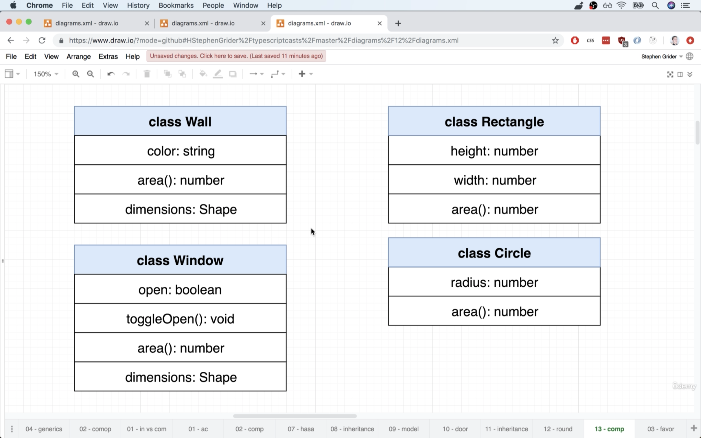
9. On the other hand, we can use "composition" concept and create `Wall` and `Windows` class.
10. Each class can refer to other classes when calling certain functions. For exmaple, when calling `dimension` method, it may be different if the class is a "rectangle" or a "circle".
  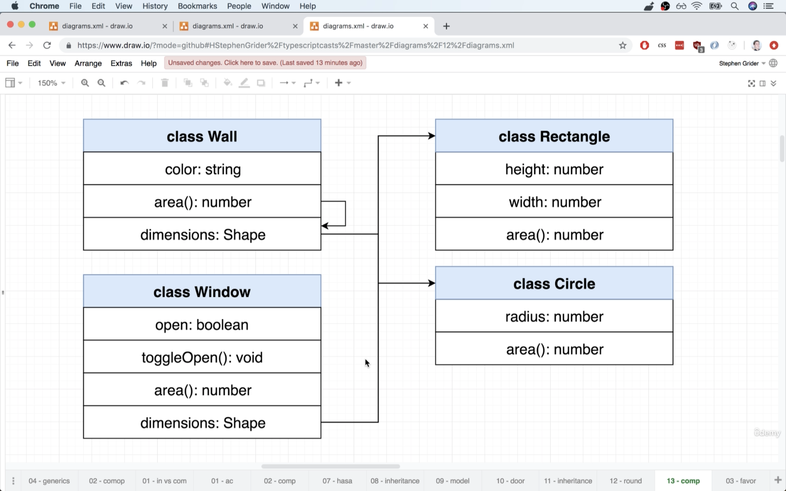

## 11.28. A Huge Misconception Around Composition
1. The "Composition" in this case, is "**Object Composition**" which is creating an object which refers to other objects. 
1. Literal "**composition**" by English wording it like creating a new object by multiple other objects which are composed to create the new one.
2. This approach can create fragile instances when the naming of methods or properties having conflict.
3. Besides, this is actaully "Multiple Inheritance" rather than "Composition".
  ```js
  // this IS NOT good pattern!
  const rectangular = (state) => {
    return {
      area: () => {
        return state.height * state.width;
      }
    };
  };

  const openable = (state) => {
    return {
      toggleOpen: () => {
        state.open = !state.open;
      }
    };
  };

  const buildRectangleWindow = (state) => {
    return Object.assign(state, rectangular(state), openable(state));
  }

  const rectangleWindow = buildRectangleWindow({
    height: 20,
    width: 20,
    open: false,
  });
  ```
  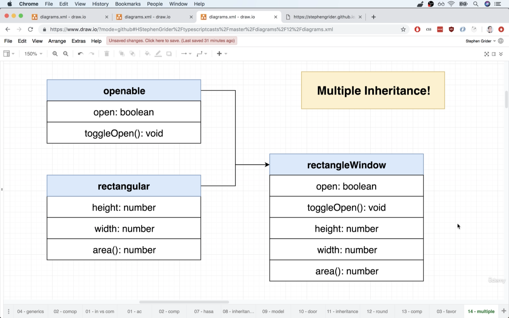

## 11.29. Goal Moving Forward
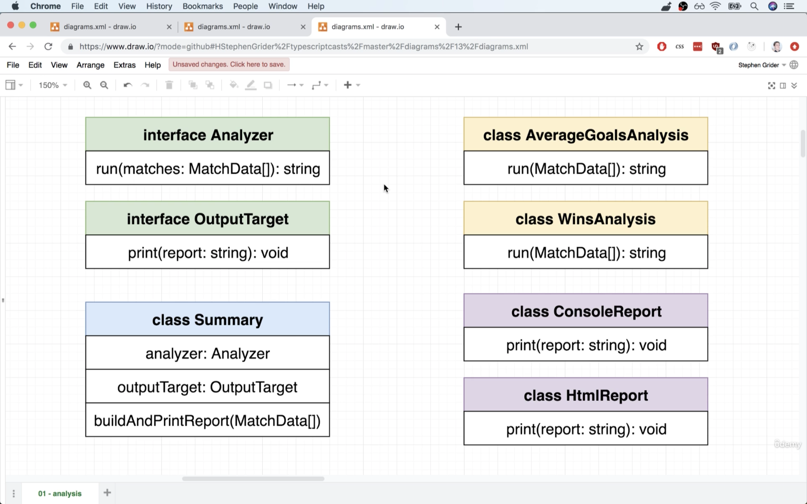

## 11.30. A Composition-Based Approach
1. We can extract the `MatchData` tuple data type and have its own file.
  ```ts
  // MatchData.ts
  import { MatchResult } from './MatchResult';

  // this is a tuple
  export type MatchData = [
    Date,
    string,
    string,
    number,
    number,
    MatchResult,
    string
  ];
  ```
2. We create a `Summary` class which has `Analyzer` and `OutputTarget` `interface`.
  ```ts
  // Summary.ts
  import { MatchData } from './MatchData';

  export interface Analyzer {
    run(matches: MatchData[]): string;
  }

  export interface OutputTarget {
    print(report: string): void;
  }

  export class Summary {
    constructor(public analyzer: Analyzer, public outputTarget: OutputTarget) {}
  }
  ```

## 11.31. Implementing an Analyzer Class
1. We create a new class `WinsAnalysis` and move the nested for loop from `index.ts` to here.
2. Similar to this class, we can create other classes for different types of analysis upon requirements.
  ```ts
  // WinsAnalysis.ts
  import { Analyzer } from '../Summary';
  import { MatchData } from '../MatchData';
  import { MatchResult } from '../MatchResult';

  export class WinsAnalysis implements Analyzer {
    constructor(public team: string) {}

    run(matches: MatchData[]): string {
      let wins = 0;

      for (let match of matches) {
        if (match[1] === 'Man United' && match[5] === MatchResult.HomeWin) {
          wins++;
        } else if (
          match[2] === 'Man United' &&
          match[5] === MatchResult.AwayWin
        ) {
          wins++;
        }
      }

      return `Team ${this.team} won ${wins} games`;
    }
  }
  ```

## 11.32. Building the Reporter
1. We create a new directory `reportTarget` for different types of report output, such as printint data in console directly or generate HTML files.
  ```ts
  // reportTarget/ConsoleReport.ts
  import { OutputTarget } from '../Summary';

  export class ConsoleReport implements OutputTarget {
    print(report: string): void {
      console.log(report);
    }
  }
  ```
2. We can then update the `Summary` class with `buildAndPrintReport` method.
3. In this case, we can clearly notice that `Summary` class is like a coordinator rather working much by itself and heavily relies on the objects passing and creating it.
  ```ts
  // Summary.ts
  import { MatchData } from './MatchData';

  export interface Analyzer {
    run(matches: MatchData[]): string;
  }

  export interface OutputTarget {
    print(report: string): void;
  }

  export class Summary {
    constructor(public analyzer: Analyzer, public outputTarget: OutputTarget) {}

    buildAndPrintReport(matches: MatchData[]): void {
      const output = this.analyzer.run(matches);

      this.outputTarget.print(output);
    }
  }
  ```

## 11.33. Putting it all together
```ts
// index.ts
import { MatchReader } from './MatchReader';
import { CsvFileReader } from './CsvFileReader';
import { ConsoleReport } from './reportTargets/ConsoleReport';
import { WinsAnalysis } from './analyzers/WinsAnalysis';
import { Summary } from './Summary';

// create an object that satisfies the 'DataReader' interface
const csvFileReader = new CsvFileReader('football.csv');

// create an instance of MatchReader and pass in something satisfying
// the 'DataReader' interface
const matchReader = new MatchReader(csvFileReader);
matchReader.load();

const summary = new Summary(
  new WinsAnalysis('Man United'),
  new ConsoleReport()
);

summary.buildAndPrintReport(matchReader.matches);
```

## 11.34. Generating HTML Reports
```ts
// .reportTarget/HtmlReports.ts
import fs from 'fs';
import { OutputTarget } from '../Summary';

export class HtmlReport implements OutputTarget {
  print(report: string): void {
    const html = `
    <div>
      <h1>Analysis Output</h1>
      <div>${report}</div>
    </div>
    `;

    fs.writeFileSync('report.html', html);
  }
}
```
```ts
// index.ts
import { MatchReader } from './MatchReader';
import { CsvFileReader } from './CsvFileReader';
import { ConsoleReport } from './reportTargets/ConsoleReport';
import { WinsAnalysis } from './analyzers/WinsAnalysis';
import { Summary } from './Summary';
import { HtmlReport } from './reportTargets/HtmlReport';

// create an object that satisfies the 'DataReader' interface
const csvFileReader = new CsvFileReader('football.csv');

// create an instance of MatchReader and pass in something satisfying
// the 'DataReader' interface
const matchReader = new MatchReader(csvFileReader);
matchReader.load();

const summary = new Summary(new WinsAnalysis('Man United'), new HtmlReport());

summary.buildAndPrintReport(matchReader.matches);
```

## 11.35. One Last Thing!
## 11.36. Oops, MyBad
1. In the previous code, we should always use instances from 2 classes to create a `Summary` instance. We can rephrase the code the create a `static` method, which can be called without creating an instance with `new` keyword.
  ```ts
  // Summary.ts
  import { MatchData } from './MatchData';
  import { WinsAnalysis } from './analyzers/WinsAnalysis';
  import { HtmlReport } from './reportTargets/HtmlReport';

  export interface Analyzer {
    run(matches: MatchData[]): string;
  }

  export interface OutputTarget {
    print(report: string): void;
  }

  export class Summary {
    static winsAnalysisWithHtmlReport(team: string): Summary {
      return new Summary(new WinsAnalysis(team), new HtmlReport());
    }

    constructor(public analyzer: Analyzer, public outputTarget: OutputTarget) {}

    buildAndPrintReport(matches: MatchData[]): void {
      const output = this.analyzer.run(matches);
      this.outputTarget.print(output);
    }
  }
  ```
2. Update `MatchReader` and preload `CsvFileReader` in advance.
  ```ts
  // MatchReader.ts
  import { dateStringToDate } from './utils';
  import { MatchResult } from './MatchResult';
  import { MatchData } from './MatchData';
  import { CsvFileReader } from './CsvFileReader';

  interface DataReader {
    read(): void;
    data: string[][];
  }

  export class MatchReader {
    static fromCsv(filename: string): MatchReader {
      return new MatchReader(new CsvFileReader(filename));
    }

    matches: MatchData[] = [];
    constructor(public reader: DataReader) {}

    load(): void {
      this.reader.read();
      this.matches = this.reader.data.map((row: string[]): MatchData => {
        return [
          dateStringToDate(row[0]),
          row[1],
          row[2],
          parseInt(row[3]),
          parseInt(row[4]),
          row[5] as MatchResult, // use keyword 'as' to use type assertion to change default Typescript type
          row[6],
        ];
      });
    }
  }
  ```
  ```ts
  // index.ts
  import { MatchReader } from './MatchReader';
  import { Summary } from './Summary';

  const matchReader = MatchReader.fromCsv('football.csv');
  const summary = Summary.winsAnalysisWithHtmlReport('Man United');

  matchReader.load();
  summary.buildAndPrintReport(matchReader.matches);
  ```

## 11.37. App Wrapup
1. List of topics
   1. `enum` - `MatchResult.ts`
   2. Inheritance concept
      1. `generic` types `<T>`
      2. `extends` `abstract` class
   3. Composition concept
      1. `interface`
      2. `tuple`
2. In this project, we learnt `enum` and used it in `MatchResult.ts`. An `enum` describe a set of values which are closely related.
3. We use `tuple` in `MatchData.ts`. A tuple is used to describe the order of types of values in an array-like data structure. 
4. Inheritance concept
   1. `generic` class is used to create types of the data structure on the fly, as we don't know the type exactly before the instance is created. We can check the reference in `inheritance/CsvFileReader.ts` that we give `<T>` as the generic type.
   2. We extended the `abstract` class `CsvFileReader` in `inheritance/MatchReader.ts` which we finally provide the type `<MatchData>` to the generic type given in `CsvFileReader`.
5. Composition concept
   1. We create `MatchReader` referring to `DataReader` as the source of information which is defined with `interface`.
   2. Besides, we use `enum` `MatchResult` as a helper and keyword `as` to use type assertion and change the default type given by Typescript.
   3. The main function of a `MatchReader` is to convert the data aligned to the data type given in the `tuple` `MatchData`. 
   4. We keep all the classes integrated in `Summary`

# 12. Advanced Generics
## 12.1. More on Generics
1. When we are working with an array of certain type of values, we can create a general class which can take any types of data.
2. We consider the `generic` type is an argument passing to the class and give type definition on the fly.
  ```ts
  // features/generics.ts
  class ArrayOfNumbers {
    constructor(public collection: number[]) {}

    get(index: number): number {
      return this.collection[index];
    }
  }

  class ArrayOfStrings {
    constructor(public collection: string[]) {}

    get(index: number): string {
      return this.collection[index];
    }
  }

  class ArrayOfAnything<T> {
    constructor(public collection: T[]) {}

    get(index: number): T {
      return this.collection[index];
    }
  }

  new ArrayOfAnything<string>(['a', 'b', 'c']);
  ```

## 12.2. Type Inference with Generics
1. We can create an instance without specifying the type of the data in the array. Typescript can check automatically when we create it because of "**Type Inference**".
  ```ts
  // generics.ts
  // typescript knows we create an array of strings
  const arr = new ArrayOfAnything(['a', 'b', 'c']); 
  ```

## 12.3. Function Generics
1. `generic` type can be used on functions as well. Note that the generic type arugment changes the whole type. It means that if we pass `<string[]>`, it means the data should be a 2D array.
2. Though returned value type is not required by Typescirpt by default, adding it can help the developers to check if we accidentally returned something not required.
  ```ts
  // features/generics.ts
  function printStrings(arr: string[]): void {
    for (let i = 0; i < arr.length; i++) {
      console.log(arr[i]);
    }
  }

  function printNumbers(arr: number[]): void {
    for (let i = 0; i < arr.length; i++) {
      console.log(arr[i]);
    }
  }

  function printAnything<T>(arr: T[]): void {
    for (let i = 0; i < arr.length; i++) {
      console.log(arr[i]);
    }
  }

  printAnything<string>(['a', 'b', 'c']);

  printAnything(['a', 'b', 'c']); // this also works
  ```

## 12.4. Generic Constraints
1. In this case, we'd like to iterate an array of elements which has had `print` feature on it, so we don't need to use `console.log` to print them out.
2. We can use keyword `extends` to tell the "generic" type to follow certain constraints like `Printable` `interface` in this case.
  ```ts
  class Car {
    print() {
      console.log('I am a car');
    }
  }

  class House {
    print() {
      console.log('I am a house');
    }
  }

  interface Printable {
    print(): void;
  }

  // this can't gurantee that every T data has a 'print' method can be called
  function printHousesOrCars<T>(arr: T[]): void { 
    for (let i = 0; i < arr.length; i++) {
      arr[i].print();
    }
  }

  function printHousesOrCars<T extends Printable>(arr: T[]): void {
    for (let i = 0; i < arr.length; i++) {
      arr[i].print();
    }
  }

  // printHoursesOrCars([1, 2, 3, 4]); // this doesn't fit to Printable
  printHousesOrCars<House>([new House(), new House()]);
  printHousesOrCars<Car>([new Car(), new Car()]);
  ```

# 13. Let's Build a Web Framework
## 13.1. App Overview
1. This web framework is similar to other front-end web framework such as "React" and "Vue".

## 13.2. Parcel Setup
1. We firstly ensure `parcel-bundler` is installed globally on the machine.

## 13.3. Framework Structure
1. In this project, we will build `Model` and `View` classes
   1. Model Class - Handle data, used to represent `Users`, `Blog Posts`, `Image`, etc.
   2. View Class - Handle HTML and events caused by the user (like clicks)
2. When looking into the requirements, we'd notice that we may need to create a class to represent a `User` and all of its data (like name and age).
3. `User` class needs to have the ability to store some data, retrieve it, and change it.
4. `User` class needs to have the ability to store some data, retrieve it, and change it and notify the rest of the app when some data is changed.
5. `User` needs to be able to persist data to an outside server, and then retrieve it at some future point.
6. Extraction Approach
   1. Build class `User` as a "mega" class with tons of methods
   2. Refactor `User` to use composition
   3. Refactor `User` to be a reusable class that can represent any piece of data, not just a `User`.
  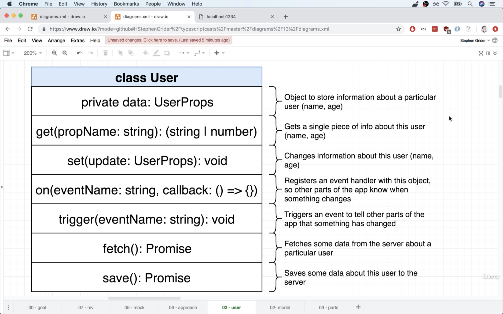

## 13.4. Designing the User
1. A `User` class can have the following properties and methods
   1. `private data: UserProps` - Object to store information about a particular user (name, age).
   2. `get('name'): (string | number)` - Gets a single piece of info about this user (name, age).
   3. `set(update: UserProps):void` - Changes information about this user (name, age).
   4. `on(eventName: string, callback: () => {}` - Register an event handler with this object, so other parts of the app know when something changes.
   5. `trigger(eventName: string): void` - Triggers an event to tell other parts of the app that something has changed.
   6. `fetch(): Promise` - Fetches some data from the server about a particular user.
   7. `save(): Promise` - Saves some data about this user to the server.

## 13.5. Retrieving User Properties
1. We create a new model `Users` in `models` directory in `src`
  ```ts
  // src/models/User.ts
  interface UserProps {
    name: string;
    age: number;
  }

  export class User {
    constructor(private data: UserProps) {}

    get(propName: string): number | string {
      return this.data[propName];
    }
  }
  ```
2. We can try to create an instance and test the class.
  ```ts
  // index.ts
  import { User } from './models/User';

  const user = new User({ name: 'Allen', age: 30 });

  console.log(user.get('name'));
  console.log(user.get('age'));
  ```

## 13.6. Optional Interface Properties
1. In the previous setup, we can't update only a specific property after we create the instance.
2. We can use anther feature in `Typescript` for "**optional interface properties**" by giving a question mark before the column in `interface`. It indicates that the property is optional.
3. Besides, we can create an empty `User` without any initial value bond to the instance when the user is filling the registration form to sign up. 
  ```ts
  // src/models/User.ts
  interface UserProps {
    name?: string;
    age?: number;
  }

  export class User {
    constructor(private data: UserProps) {}

    get(propName: string): number | string {
      return this.data[propName];
    }

    set(update: UserProps): void {
      Object.assign(this.data, update);
    }
  }
  ```

## 13.7. An Eventing System
1. This is similar to use the DOM event handler in frontend JavaScript. 
2. In `User` class, each instance has a `on` and `trigger` methods that work accordingly to the events and data change during the user session.

## 13.8. Listener Support
1. We can use type alias with keyword `type` to declare a type as variable.
2. It can be very confusing to put an empty arrow function as type annotation when declaring a property or method
  ```ts
  // src/models/User.ts
  interface UserProps {
    name?: string;
    age?: number;
  }

  // type annotation makes the code more readable
  // and prevent confusing on passing
  // an empty function to a property or method
  type Callback = () => {};

  export class User {
    constructor(private data: UserProps) {}

    get(propName: string): number | string {
      return this.data[propName];
    }

    set(update: UserProps): void {
      Object.assign(this.data, update);
    }

    on(eventName: string, callback: Callback): void {}

    // this can be very confusing to pass 
    // empty arrow function while it's only a type annotation
    on(eventName: string, callback: () => {}): void {}
  }
  ```

## 13.9. Storing Event Listeners
1. We create anther property `events` to store the events that a `User` instance can handle.
2. In this case, we'd like to keep event handler general so the `key` as the property name is `string`, while it takes an array of callback functions that can be triggered by order when the event happens.
  ```ts
  // src/models/User.ts
  interface UserProps {
    name?: string;
    age?: number;
  }

  // type annotation makes the code more readable
  // and prevent confusing on passing
  // an empty function to a property or method
  type Callback = () => {}; // this is not correct!

  export class User {
    // property to store events to handle
    events: { [key: string]: Callback[] } = {};

    constructor(private data: UserProps) {}

    get(propName: string): number | string {
      return this.data[propName];
    }

    set(update: UserProps): void {
      Object.assign(this.data, update);
    }

    on(eventName: string, callback: Callback): void {}
  }
  ```

## 13.10. Dynamic Array Creation
1. In Typescript, the type annotation with an empty function that returns nothing, we should give `type Callback = () => void` rather than `() => {}` which actaully means the function will return an empty object.
  ```ts
  // src/models/User.ts
  interface UserProps {
    name?: string;
    age?: number;
  }

  // type annotation makes the code more readable
  // and prevent confusing on passing
  // an empty function to a property or method
  type Callback = () => void;

  export class User {
    events: { [key: string]: Callback[] } = {};

    constructor(private data: UserProps) {}

    get(propName: string): number | string {
      return this.data[propName];
    }

    set(update: UserProps): void {
      Object.assign(this.data, update);
    }

    on(eventName: string, callback: Callback): void {
      const handlers = this.events[eventName] || []; // assign an empty array if this.events[eventName] is undefined
      handlers.push(callback);
      this.events[eventName] = handlers;
    }
  }
  ```

## 13.11. Triggering Event Callbacks
1. Add `trigger` method in `User` class.
  ```ts
  // src/models/User.ts
  interface UserProps {
    name?: string;
    age?: number;
  }

  // type annotation makes the code more readable
  // and prevent confusing on passing
  // an empty function to a property or method
  type Callback = () => void;

  export class User {
    events: { [key: string]: Callback[] } = {};

    constructor(private data: UserProps) {}

    get(propName: string): number | string {
      return this.data[propName];
    }

    set(update: UserProps): void {
      Object.assign(this.data, update);
    }

    on(eventName: string, callback: Callback): void {
      const handlers = this.events[eventName] || []; // assign an empty array if this.events[eventName] is undefined
      handlers.push(callback);
      this.events[eventName] = handlers;
    }

    trigger(eventName: string): void {
      const handlers = this.events[eventName];

      if (!handlers || !handlers.length) return;

      handlers.forEach((callback) => {
        callback();
      });
    }
  }
  ```

## 13.12. Adding JSON Server
1. We set up a server which allows read and store data in JSON foramt. 
2. We install `npm install -g json-server` and create `db.json` in the root directory.
  ```json
  {
    "users": []
  }
  ```
3. Start the server with `json-server -w db.json` which points the json file as the entry point.
4. By starting the server, json server knows there's a `users` collection to serve.
5. In addition, we now need 2 terminal windows to run `json-server -w db.json` and `parcel index.html`. We can also set up the scripts in `package.json`.
  ```json
  // package.json
  {
    "scripts": {
      "start:db": "json-server -w db.json",
      "start:parcel": "parcel index.html"
    }
  }
  ```

## 13.13. Understanding REST conventions
1. JSON server follow RESTful API conventions so we can easily manipulate with the endpoints.
   1. `GET` - `/posts` - Retrieve all posts
   2. `GET` - `posts/:id` - Retrieve post with the given ID
   3. `POST` - `posts` - Create a new post
   4. `PUT` - `/posts/:id` - Update a post
   5. `DELETE` - `/posts/:id` - Delete a post
2. We can use `axios` to make `POST` and `GET` request to create or fetch data of a user by ID.
  ```ts
  // index.ts
  import axios from 'axios';

  axios.post('http://localhost:3000/users', {
    name: 'myname',
    age: 20,
  });

  axios.get('http://localhost:3000/users/1');
  ```
3. The new users create into `db.json` will automatically assign a unique ID. We can use this property to differentiate if the data has been stored in the database or is just created by the `User` model.
4. Therefore, in the `UserProps` `interface`, it should also indicate that the instance may have an `id`.

## 13.14. Adding Fetch Functionality
1. The first thing is to add `id` property in `UserProps` in `User` class. 
2. We add `fetch` method on `User` class which users `set` method to assign incoming data to the instance and update all its properties.
  ```ts
  // src/models/User.ts
  import axios, { AxiosResponse } from 'axios';

  interface UserProps {
    id?: number;
    name?: string;
    age?: number;
  }

  // type annotation makes the code more readable
  // and prevent confusing on passing
  // an empty function to a property or method
  type Callback = () => void;

  export class User {
    events: { [key: string]: Callback[] } = {};

    constructor(private data: UserProps) {}

    get(propName: string): number | string {
      return this.data[propName];
    }

    set(update: UserProps): void {
      Object.assign(this.data, update);
    }

    on(eventName: string, callback: Callback): void {
      const handlers = this.events[eventName] || []; // assign an empty array if this.events[eventName] is undefined
      handlers.push(callback);
      this.events[eventName] = handlers;
    }

    trigger(eventName: string): void {
      const handlers = this.events[eventName];

      if (!handlers || !handlers.length) return;

      handlers.forEach((callback) => {
        callback();
      });
    }

    fetch(): void {
      axios
        .get(`http://localhost:3000/users/${this.get('id')}`)
        .then((response: AxiosResponse): void => {
          this.set(response.data);
        });
    }
  }
  ```

## 13.15. Successfully Fetching Model Data
1. We can pretend that we have got the `id` and use it to fetch data from the server. 
2. Note that this is incorrect that we don't get ID in advance and fetch its data. This issue will be solved in the future, but now we just hard code this part to check if `fetch` method works on the instance.
  ```ts
  // index.ts
  import { User } from './models/User';

  const user = new User({ id: 1 });

  user.fetch();
  ```

## 13.16. Saving User Data
1. Note that we can check if a `User` instance has had an ID which means if user is just created or has been stored in the database.
2. According to the type and state of the user, we can decide whether to send a `POST` request to create a user or `PUT` request to update the user data.
  ```ts
  // src/models/User.ts
  import axios, { AxiosResponse } from 'axios';

  interface UserProps {
    id?: number;
    name?: string;
    age?: number;
  }

  // type annotation makes the code more readable
  // and prevent confusing on passing
  // an empty function to a property or method
  type Callback = () => void;

  export class User {
    events: { [key: string]: Callback[] } = {};

    constructor(private data: UserProps) {}

    get(propName: string): number | string {
      return this.data[propName];
    }

    set(update: UserProps): void {
      Object.assign(this.data, update);
    }

    on(eventName: string, callback: Callback): void {
      const handlers = this.events[eventName] || []; // assign an empty array if this.events[eventName] is undefined
      handlers.push(callback);
      this.events[eventName] = handlers;
    }

    trigger(eventName: string): void {
      const handlers = this.events[eventName];

      if (!handlers || !handlers.length) return;

      handlers.forEach((callback) => {
        callback();
      });
    }

    fetch(): void {
      axios
        .get(`http://localhost:3000/users/${this.get('id')}`)
        .then((response: AxiosResponse): void => {
          this.set(response.data);
        });
    }

    save(): void {
      const id = this.get('id');
      if (id) {
        // put
        axios.put(`http://localhost:3000/users/${id}`, this.data);
      } else {
        // post
        axios.post('http://localhost:3000/users', this.data);
      }
    }
  }
  ```
3. We can test either to update a user data or create a user
  ```ts
  // index.ts 
  import { User } from './models/User';

  const user = new User({ id: 1 });

  user.set({ name: 'NEW NAME', age: 33 });

  user.save();

  const user2 = new User({ name: 'new record', age: 0 });

  user2.save();
  ```

## 13.17. Refactoring with Composition
1. We extract the `on` and `trigger` method from `User` class.
  ```ts
  //src/models/Eventing.ts
  type Callback = () => void;

  export class Eventing {
    events: { [key: string]: Callback[] } = {};

    on(eventName: string, callback: Callback): void {
      const handlers = this.events[eventName] || []; // assign an empty array if this.events[eventName] is undefined
      handlers.push(callback);
      this.events[eventName] = handlers;
    }

    trigger(eventName: string): void {
      const handlers = this.events[eventName];

      if (!handlers || !handlers.length) return;

      handlers.forEach((callback) => {
        callback();
      });
    }
  }
  ```

## 13.18. Re-Integrating 
1. After extracting `on` and `trigger` method, we have to integrate it back to ensure `User` class runs normal. 
  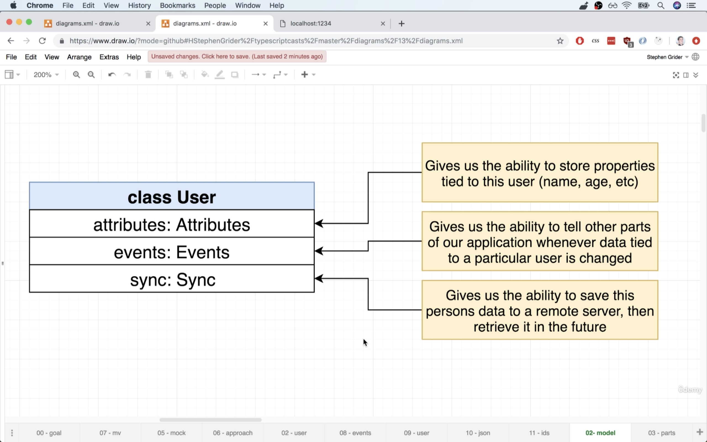
2. We have 3 options to solve this issue.
   1. Accept dependencies as second constructor argument
    ```ts
    // refer Eventing in constructor
    export class User {
      constructor(
        private data: UserProps,
        private events: Eventing
      ) {}
    }

    // need to pass an Eventing instance as 2nd argument
    new User({id: 1}, new Eventing());
    ```
   2. Only accept dependecies into constructor and define a `static` class method to preconfigure `User` and assign properties afterwards.
    ```ts
    export class User {
      static fromData(data: UserProps): User {
        const user = new User(new Eventing());
        user.set(data);
        return user;
      }

      private data: UserProps;

      constructor(private events: Eventing) {}
    }
    ```
   3. Only accept properties into constructor and hard code dependencies as class properties. 
      1. In this case, though `User` can only the same module fromr `Eventing`, we hardly change the class, as there's nearly no scenraio that we may use other class than `Eventing`.
      2. The only downside is that we can't change the module used in `User`.
    ```ts
    export class User {
      events: Eventing = new Eventing();
    }
    ```

## 13.19. Composition with Nested Objects
1. We implement the 3 option from the previous section.
  ```ts
  // src/models/User.ts
  import axios, { AxiosResponse } from 'axios';
  import { Eventing } from './Eventing';

  interface UserProps {
    id?: number;
    name?: string;
    age?: number;
  }

  export class User {
    public events: Eventing = new Eventing();

    constructor(private data: UserProps) {}

    get(propName: string): number | string {
      return this.data[propName];
    }

    set(update: UserProps): void {
      Object.assign(this.data, update);
    }

    fetch(): void {
      axios
        .get(`http://localhost:3000/users/${this.get('id')}`)
        .then((response: AxiosResponse): void => {
          this.set(response.data);
        });
    }

    save(): void {
      const id = this.get('id');
      if (id) {
        // put
        axios.put(`http://localhost:3000/users/${id}`, this.data);
      } else {
        // post
        axios.post('http://localhost:3000/users', this.data);
      }
    }
  }
  ```
2. After refactoring, we need to call the method by accessing it in the nested object `events`.
  ```ts
  // index.ts
  import { User } from './models/User';

  const user = new User({ name: 'new record', age: 0 });

  user.events.on('change', () => {
    console.log('change');
  });

  user.events.trigger('change');
  ```

## 13.20. A More Complicated Extraction
1. We extract `fetch` and `save` method from `User`.
2. In this case, we have to map the relationship between `Sync` and `User`, as `Sync` instances use `set` and `get` method from `User`.
  ```ts
  // src/Models/Sync.ts
  import axios, { AxiosResponse } from 'axios';

  export class Sync {
    fetch(): void {
      axios
        .get(`http://localhost:3000/users/${this.get('id')}`)
        .then((response: AxiosResponse): void => {
          this.set(response.data);
        });
    }

    save(): void {
      const id = this.get('id');
      if (id) {
        // put
        axios.put(`http://localhost:3000/users/${id}`, this.data);
      } else {
        // post
        axios.post('http://localhost:3000/users', this.data);
      }
    }
  }
  ```

## 13.21. Options for Adapting Sync
1. We can solve the integrating issue in several ways.
   1. Sync gets function arguments that we set `UserProps` as the arugment, whilte the downside is that the method will be bond and can use only on instance from `User`.
      1. `save(id: number, data: UserProps):void`
      2. `fetch(id: number): UserProps`
   2. Sync expects arguments that satisfy interfaces `Serialize` and `Deserialze`.
      1. Serialize - Convert Data from and object into some save-able format (json).
      2. Deserialize - Put data on an object using some previously saved data (json).
   3. Sync is a generic class to customize the type of 'data' coming into `save`.
    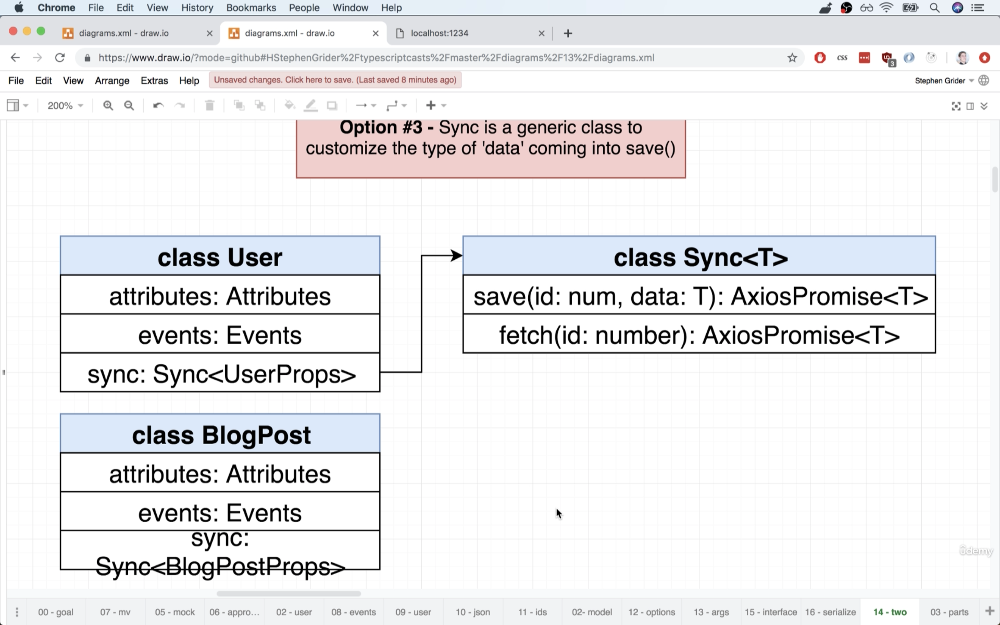

## 13.22. Refactoring Sync
1. We assume that `Sync` instance only works with `User` instance at the moment and take out data handling logic, so `Sync` instances only returns a `Promise` back for the model to handle.
  ```ts
  // src/models/Sync.ts
  import axios, { AxiosPromise } from 'axios';
  import { UserProps } from './User';

  export class Sync {
    constructor(public rootUrl: string) {}

    fetch(id: number): AxiosPromise {
      // only return a promise rather than set the data
      return axios.get(`${this.rootUrl}/${id}`);
    }

    save(data: UserProps): AxiosPromise {
      const { id } = data;
      if (id) {
        // put
        return axios.put(`${this.rootUrl}/${id}`, data);
      } else {
        // post
        return axios.post(this.rootUrl, data);
      }
    }
  }
  ```

## 13.23. Generic Constraints Around Sync
1. After we convert `User` as generic class, we should use `<T>` for the class. 
2. However, in `save` method below, Typescript doesn't know if the generic type has a specific property or method.
3. Therefore, we can use `interface` and `extends` the generic type to ensure the incoming data must have the `interface` that has a `id` property.
  ```ts
  // src/models/Sync.ts
  import axios, { AxiosPromise } from 'axios';

  interface HasId {
    id: number;
  }

  export class Sync<T extends HasId> {
    constructor(public rootUrl: string) {}

    fetch(id: number): AxiosPromise {
      // only return a promise rather than set the data
      return axios.get(`${this.rootUrl}/${id}`);
    }

    save(data: T): AxiosPromise {
      const { id } = data;

      if (id) {
        // put
        return axios.put(`${this.rootUrl}/${id}`, data);
      } else {
        // post
        return axios.post(this.rootUrl, data);
      }
    }
  }
  ```

## 13.24. Connecting Sync Back to User
1. According to the setup in the previous lecture, we can import `Sync` to use in `User` model.
2. However, this configuration in `User.ts` is not done yet.
  ```ts
  // src/models/User.ts
  import { Eventing } from './Eventing';
  import { Sync } from './Sync';

  export interface UserProps {
    id?: number;
    name?: string;
    age?: number;
  }

  const rootUrl = `http://localhost:3000/users`;

  export class User {
    public events: Eventing = new Eventing();
    public sync: Sync<UserProps> = new Sync<UserProps>(rootUrl);

    constructor(private data: UserProps) {}

    get(propName: string): number | string {
      return this.data[propName];
    }

    set(update: UserProps): void {
      Object.assign(this.data, update);
    }
  }
  ```

## 13.25. Optional Properties
1. As to resolve the error of missing `id` property in `Sync` instance, we can turn the property as optional. Note that the only type `id` can be is `number`.
  ```ts
  // src/models/Sync.ts
  interface HasId {
    id?: number;
  }
  ```
2. We can use `tsc --init` in the terminal to generate a `tsconfig.json` for the compiling setting of Typescript. 
3. By default, Typescript will turn on `"strict": true` which includes `"strictNullChecks": true`. This setting will turn an optional property in `interface` to undefined when the instance doesn't have the property.
4. Therefore, if we check the `id` type in the methods, it can be either `number` or `undefined` after we add `tsconfig.ts` and have `strict` mode turning on.
5. However, we don't want the whole project having strict mode turning on which cause have other undesirable behaviors from Typescript.

## 13.26. Extracing an Attributes Class
1. We extract the attributes `get` and `set` method from `User` to create a generic class. 
  ```ts
  // src/models/Attributes.ts
  export class Attributes<T> {
    constructor(private data: T) {}

    get(propName: string): number | string {
      return this.data[propName];
    }

    set(update: T): void {
      Object.assign(this.data, update);
    }
  }
  ```

## 13.27. The Get Method's Shortcoming
1. In `Attribute`, we have type annotation for `get` method as the returned value can be either `number`, `string`, or `boolean`.
2. However, we'd like to manipulate the variable on certain type, we can only use "Type Guards" or have the common methods shared between `number`, `string`, and `boolean`.
  ```ts
  // src/models/Attributes.ts
  import { UserProps } from './User';

  export class Attributes<T> {
    constructor(private data: T) {}

    get(propName: string): number | string | boolean {
      return this.data[propName];
    }

    set(update: T): void {
      Object.assign(this.data, update);
    }
  }

  const attrs = new Attributes<UserProps>({ id: 5, name: 'aname', age: 20 });

  // 'name' can be either number, string, or boolean
  const name = attrs.get('name');

  // this is not ideal as all attribute will be turned into numbers
  const id = attrs.get('id') as number;
  ```

## 13.28. Two Important Rules
1. In Typescript, strings can be types
   1. Keyword `type` can not only define array of types as "tuples" but other structure. 
   2. In the following case, we can only call `printName` function if the given string is aligned to the one in `BestName` alias type.
     ```ts
     type BestName = 'aname';
     const printName = (name: BestName):void => {};

     printName('aname');
     printName('bname'); // this will return error
     ```
2. In Javascript, all object keys are strings
  ```js
  const colors = {};
  colors.red = 'red';
  colors[5] = 'red';
  console.log(colors);
  // { red: 'red', '5': 'red' }
  colors['5'] === colors[5] // true
  ```

## 13.29. An Advanced Generic Constraint
1. To make `Attributes` generic, we can use a type constraint with `extends` and `keyof`.
2. `K` in this case represents any of the properties from type `T`. For example, if we pass `UserProps` as `T`, `K` can be `name` as `string`, `age` as `number`, or `id` as `number`. 
3. `T[K]` represents object parsing as calling value from a property from the object. 
  ```ts
  // src/models/Attributes.ts
  import { UserProps } from './User';

  export class Attributes<T> {
    constructor(private data: T) {}

    get<K extends keyof T>(key: K): T[K] {
      return this.data[key];
    }

    set(update: T): void {
      Object.assign(this.data, update);
    }
  }

  const attrs = new Attributes<UserProps>({
    id: 5,
    age: 20,
    name: 'name',
  });

  const name = attrs.get('name');
  const age = attrs.get('age');
  const id = attrs.get('id');

  // T[K] 
  const color = { color: 'red' };
  color['color'] === 'red'; // true
  ```
  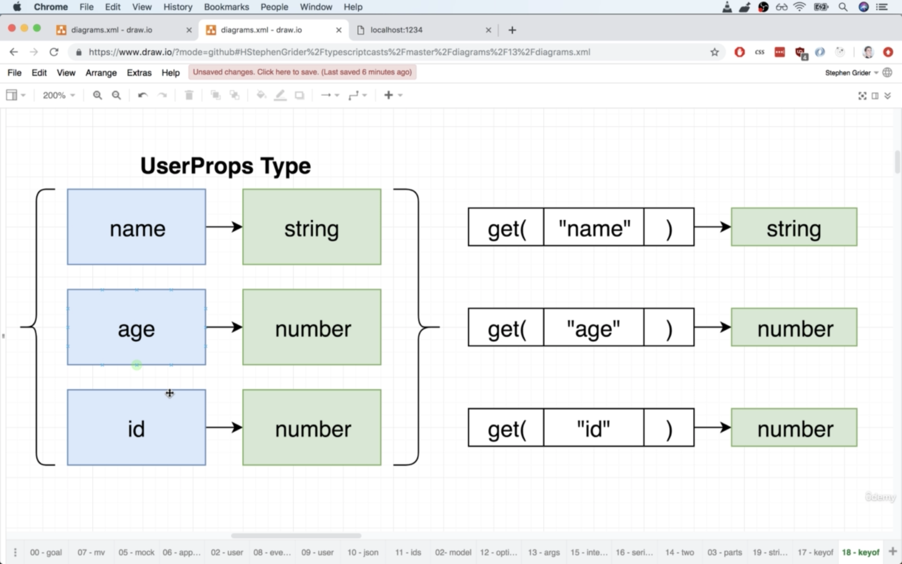

## 13.30. Re-Integrating Attributes
```ts
// src/models/User.ts
import { Eventing } from './Eventing';
import { Sync } from './Sync';
import { Attributes } from './Attributes';

export interface UserProps {
  id?: number;
  name?: string;
  age?: number;
}

const rootUrl = `http://localhost:3000/users`;

export class User {
  public events: Eventing = new Eventing();
  public sync: Sync<UserProps> = new Sync<UserProps>(rootUrl);
  public attributes: Attributes<UserProps>;

  constructor(attrs: UserProps) {
    this.attributes = new Attributes<UserProps>(attrs);
  }
}
```

## 13.31. Composition is Delegation
1. After we refactor the code, the process will become cumbersome than we firstly built up the model.
  ```ts
  // index.ts
  import { User } from './models/User';

  const user = new User({ name: 'another record', age: 30 });

  const id = user.attributes.get('id');
  const name = user.attributes.get('name');
  const age = user.attributes.get('age');

  user.sync.save({ id, name, age });

  // Before
  user.save(); 
  ```
2. We can set up `Caller` in `User`, so when we try to access the methods, we don't need to touch the properties or methods from the composition object reference.
3. Therefore, we can call the methods on the instance directly with the concept `delegation`.
  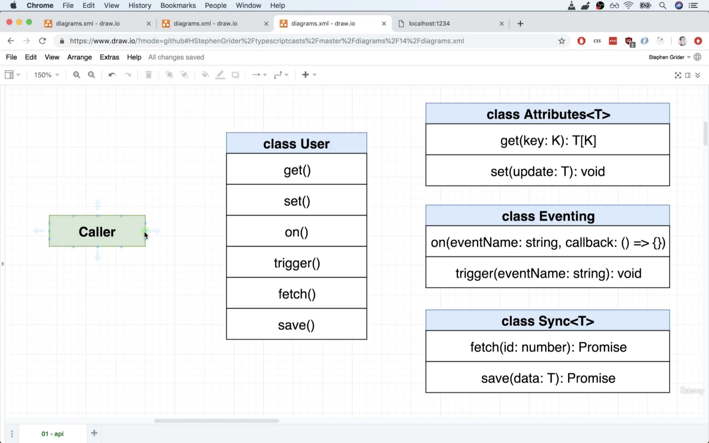

## 13.32. Reminder on Accessors
1. There are 2 types of methods to implement on `User`.
2. Direct passthrough of arguments - `get`, `on`, and `trigger`.
3. Need coordination between different modules in `User` - `set`, `fetch`, and `save`.
4. We can use keyword `get` before declaring the method to turn it into a property-like method.
  ```ts
  class Person {
    constructor(public firstName: string, public lastName: string) {}

    get fullName(): string {
      return `${this.firstName} ${this.lastName}`;
    }
  }

  const person = new Person('firstname', 'lastname');
  console.log(person.fullName);
  ```

## 13.33. Passthrough Methods
1. It's not ideal to call the method by passing through the class directly as if the method changes the way of calling, we need to update all the classes composed with the class (`Eventing` in this case).
2. Therefore, we can use a getter with keyword `get` which simply returns the method from the referred model, which can be called and have simliar syntax as using a native method.
  ```ts
  // src/models/User.ts
  import { Eventing } from './Eventing';
  import { Sync } from './Sync';
  import { Attributes } from './Attributes';

  export interface UserProps {
    id?: number;
    name?: string;
    age?: number;
  }

  const rootUrl = `http://localhost:3000/users`;

  export class User {
    public events: Eventing = new Eventing();
    public sync: Sync<UserProps> = new Sync<UserProps>(rootUrl);
    public attributes: Attributes<UserProps>;

    constructor(attrs: UserProps) {
      this.attributes = new Attributes<UserProps>(attrs);
    }

    // this is not ideal as if the on method changes in `Eventing`, all the classes using this method will need to be udpated
    on(eventName: string, callback: Callback): void {
      this.events.on(eventName, callback);
    }

    get on() {
      return this.events.on;
    }
  }
  ```
3. We can call `on` directly on the instance.
  ```ts
  // index.ts
  import { User } from './models/User';

  const user = new User({ name: 'name', age: 20 });

  // user.on returns the method referring to Eventing class
  const on = user.on;

  on.('change', () => {});

  // shorthand to call the method directly
  user.on('change', () => {
    console.log('user was changed');
  });
  ```
4. We can add getter functions in `User`.
  ```ts
  // src/models/User.ts
  import { Eventing } from './Eventing';
  import { Sync } from './Sync';
  import { Attributes } from './Attributes';

  export interface UserProps {
    id?: number;
    name?: string;
    age?: number;
  }

  const rootUrl = `http://localhost:3000/users`;

  export class User {
    public events: Eventing = new Eventing();
    public sync: Sync<UserProps> = new Sync<UserProps>(rootUrl);
    public attributes: Attributes<UserProps>;

    constructor(attrs: UserProps) {
      this.attributes = new Attributes<UserProps>(attrs);
    }

    get on() {
      return this.events.on;
    }

    get trigger() {
      return this.events.trigger;
    }

    get get() { // this isn't correct yet
      return this.attributes.get;
    }
  }
  ```

## 13.34. A Context Issue
1. In Javascript, if we decalre a variable with the method using `this` from an object, the `this` will refer to nothing, as there's no object that `this` pointing to.
2. When an object refering `this` and calls a method, the conext is similar to replace `this` with the object that the method calls.
  ```js
  const colors = {
    color: 'red',
    printColor() {
      console.log(this.color); // 'this.color' is like 'colors.color'
    },
  };

  colors.printColor();

  const printColor = colors.printColor; // 'this' is no longer bond to 'colors'

  printColor(); // printColor has nothing to refer on the left
  ```
3. Therefore, when we are trying to call `user.get('name')`, `get` method is referring to `User` instance. However, if we look back into `Attributes`, the data is on `this.data[key]`, while in the previous case, we were trying to call the property out from `user.data[key]`, which the instance has no such property.
4. We can change the method in `Attributes` into an arrow function which technically changes the contect for `this`, so `this` will refer to the correct object holding which is the` Attribute` instance.
5. We then update the methods in `Eventing`
  ```ts
  // src/models/Attributes.ts
  export class Attributes<T> {
    constructor(private data: T) {}

    get = <K extends keyof T>(key: K): T[K] => {
      return this.data[key];
    };

    set(update: T): void {
      Object.assign(this.data, update);
    }
  }

  // src/models/Eventing.ts
  type Callback = () => void;

  export class Eventing {
    events: { [key: string]: Callback[] } = {};

    on = (eventName: string, callback: Callback): void => {
      const handlers = this.events[eventName] || []; // assign an empty array if this.events[eventName] is undefined
      handlers.push(callback);
      this.events[eventName] = handlers;
    };

    trigger = (eventName: string): void => {
      const handlers = this.events[eventName];

      if (!handlers || !handlers.length) return;

      handlers.forEach((callback) => {
        callback();
      });
    };
  }
  ```

## 13.35. Setting Data While Triggering
1. We then can test by giving a `set` method in `User`, when the user uses "set", it means some data of the `User` instance is changed.
2. As we register in `index.ts`, it prints a hint that something is changed.
  ```ts
  // user/models/User.ts
  import { Eventing } from './Eventing';
  import { Sync } from './Sync';
  import { Attributes } from './Attributes';

  export interface UserProps {
    id?: number;
    name?: string;
    age?: number;
  }

  const rootUrl = `http://localhost:3000/users`;

  export class User {
    public events: Eventing = new Eventing();
    public sync: Sync<UserProps> = new Sync<UserProps>(rootUrl);
    public attributes: Attributes<UserProps>;

    constructor(attrs: UserProps) {
      this.attributes = new Attributes<UserProps>(attrs);
    }

    get on() {
      return this.events.on;
    }

    get trigger() {
      return this.events.trigger;
    }

    get get() {
      return this.attributes.get;
    }

    set(update: UserProps): void {
      this.attributes.set(update);
      this.events.trigger('change');
    }
  }
  ```
3. In this case, we register a printing function, to log a message when a `User` instance is changed. 
  ```ts
  // index.ts
  import { User } from './models/User';

  const user = new User({ name: 'another record', age: 30 });

  console.log(user.get('name'));

  // register a function on 'change'
  user.on('change', () => {
    console.log('User was changed, we probably need to update some HTML');
  });

  user.set({ name: 'New name' });
  ```

## 13.36. Fetching User Data
1. In this case, we can use the method directly on the instance (the passthrough method) as it is integrated with trigger that we set up. Note that we can still call it from `this.attributes` directly to set the update.
  ```ts
  // src/models/User.ts
  import { Eventing } from './Eventing';
  import { Sync } from './Sync';
  import { Attributes } from './Attributes';
  import { AxiosResponse } from 'axios';

  export interface UserProps {
    id?: number;
    name?: string;
    age?: number;
  }

  const rootUrl = `http://localhost:3000/users`;

  export class User {
    public events: Eventing = new Eventing();
    public sync: Sync<UserProps> = new Sync<UserProps>(rootUrl);
    public attributes: Attributes<UserProps>;

    constructor(attrs: UserProps) {
      this.attributes = new Attributes<UserProps>(attrs);
    }

    get on() {
      return this.events.on;
    }

    get trigger() {
      return this.events.trigger;
    }

    get get() {
      return this.attributes.get;
    }

    set(update: UserProps): void {
      this.attributes.set(update);
      this.events.trigger('change');
    }

    fetch(): void {
      const id = this.attributes.get('id'); // we can use this.get('id') as well to use the method directly form this instance

      if (typeof id !== 'number') {
        throw new Error('Cannot fetch without an id');
      }

      this.sync.fetch(id).then((response: AxiosResponse): void => {
        // we don't refer directly as to enjoy the trigger being added in this model
        // this.attributes.set(response.data);
        this.set(response.data);
      });
    }
  }
  ```
2. We can try to fetch user data by giving the user `id`.
  ```ts
  // index.ts
  import { User } from './models/User';

  const user = new User({ id: 1 });

  user.on('change', () => {
    console.log(user);
  });

  user.fetch(); // the user instance fetched from server will be printed out 
  ```

## 13.37. Saving Data
1. We don't have any method that can return all the properties and data that an instance has from `Attributes`, so we create a new method to return all data at once.
  ```ts
  // src/models/Attributes.ts
  export class Attributes<T> {
    constructor(private data: T) {}

    get = <K extends keyof T>(key: K): T[K] => {
      return this.data[key];
    };

    set(update: T): void {
      Object.assign(this.data, update);
    }

    getAll(): T {
      return this.data;
    }
  }
  ```
2. We add `save` method in `User` to handle and update data to a specific server in database.
3. Besides, we can trigger `save` and `error` in case the process succeed or fails.
  ```ts
  // src/models/Users.ts
  import { Eventing } from './Eventing';
  import { Sync } from './Sync';
  import { Attributes } from './Attributes';
  import { AxiosResponse } from 'axios';

  export interface UserProps {
    id?: number;
    name?: string;
    age?: number;
  }

  const rootUrl = `http://localhost:3000/users`;

  export class User {
    public events: Eventing = new Eventing();
    public sync: Sync<UserProps> = new Sync<UserProps>(rootUrl);
    public attributes: Attributes<UserProps>;

    constructor(attrs: UserProps) {
      this.attributes = new Attributes<UserProps>(attrs);
    }

    get on() {
      return this.events.on;
    }

    get trigger() {
      return this.events.trigger;
    }

    get get() {
      return this.attributes.get;
    }

    set(update: UserProps): void {
      this.attributes.set(update);
      this.events.trigger('change');
    }

    fetch(): void {
      const id = this.attributes.get('id'); // we can use this.get('id') as well to use the method directly form this instance

      if (typeof id !== 'number') {
        throw new Error('Cannot fetch without an id');
      }

      this.sync.fetch(id).then((response: AxiosResponse): void => {
        // we don't refer directly as to enjoy the trigger being added in this model
        // this.attributes.set(response.data);
        this.set(response.data);
      });
    }

    save(): void {
      this.sync
        .save(this.attributes.getAll())
        .then((response: AxiosResponse): void => {
          this.trigger('save');
        })
        .catch(() => {
          this.trigger('error');
        });
    }
  }
  ```
4. However, at this point, the model is heavily rely on the `User` that we can't use it on other types of instance such as "blog post" or other entities.

## 13.38. Composition vs Inheritance...Again!
1. Some issues now are that 
   1. The nested objects are "public", while they probably shouldn't be.
   2. The nested objects are hardcoded and don't use `interface`.
   3. We don't want to have to reimplement all these methods for each new "model" we create.
2. Creating another class `Model` for `User` and the other new entities to refer to with composition concept.
3. However, all methods have to be re-implemented as we set up for passthrough method we create in `User`. 
4. The other way to work around is to set all methods from the generic `Model` `public`, so it can be accessed from the instance, while this turns out anthother problems that some methods are available on the `Instance`, and some are only available on `Instance.model`. This can make the coding syntax very confusing.
5. Therefore, we may use "**Inheritance**" rather than "**Composition**" in this case.

## 13.39. Extracting a Model Class
1. Rather than referring to other objects, we use `interface` to define the class `Model`.
  ```ts
  // src/models/Model.ts
  import { AxiosPromise } from 'axios';

  type Callback = () => void;

  interface ModelAttributes<T> {
    set(update: T): void;
    getAll(): T;
    get<K extends keyof T>(key: K): T[K];
  }

  interface Sync<T> { // the returned value can be other types other than AxiosPromise
    fetch(id: number): AxiosPromise;
    save(data: T): AxiosPromise;
  }

  interface Events {
    on(eventName: string, callback: Callback): void;
    trigger(eventName: string): void;
  }

  export class Model {}
  ```

## 13.40. Extending the User
1. We then can take the methods declared in `User` to be used in `Model`.
2. Note that since `T` type data doesn't know if `id` exists from the by incoming data structure, we can create an `interface` and have an optional `id` property and use `T extends HasId` to indicate to Typescript that the incoming data may or may not have `id` property.
  ```ts
  // src/models/Model.ts
  import { AxiosPromise, AxiosResponse } from 'axios';
  import { Attributes } from './Attributes';

  type Callback = () => void;

  interface ModelAttributes<T> {
    set(update: T): void;
    getAll(): T;
    get<K extends keyof T>(key: K): T[K];
  }

  interface Sync<T> {
    fetch(id: number): AxiosPromise;
    save(data: T): AxiosPromise;
  }

  interface Events {
    on(eventName: string, callback: Callback): void;
    trigger(eventName: string): void;
  }

  interface HasId {
    id?: number;
  }

  export class Model<T extends HasId> {
    constructor(
      private attributes: ModelAttributes<T>,
      private events: Events,
      private sync: Sync<T>
    ) {}

    get on() {
      return this.events.on;
    }

    get trigger() {
      return this.events.trigger;
    }

    get get() {
      return this.attributes.get;
    }

    set(update: T): void {
      this.attributes.set(update);
      this.events.trigger('change');
    }

    fetch(): void {
      const id = this.attributes.get('id');

      if (typeof id !== 'number') {
        throw new Error('Cannot fetch without an id');
      }

      this.sync.fetch(id).then((response: AxiosResponse): void => {
        this.set(response.data);
      });
    }

    save(): void {
      this.sync
        .save(this.attributes.getAll())
        .then((response: AxiosResponse): void => {
          this.trigger('save');
        })
        .catch(() => {
          this.trigger('error');
        });
    }
  }
  ```
2. After configuring `Model`, we can extend `User` class from it.
3. In this case, we pass the `UserProps` interface as the data type when declaring with the generic model.
  ```ts
  // src/models/User.ts
  import { Model } from './Model';

  export interface UserProps {
    id?: number;
    name?: string;
    age?: number;
  }

  const rootUrl = `http://localhost:3000/users`;

  export class User extends Model<UserProps> {}
  ```

## 13.41. Final User Refactor
1. We rename the `Sync.ts` model to `ApiSync.ts`.
2. We then can create a `static` method that builds a `User` instance rather than passing multiple `new <Class>` to create the instance.
  ```ts
  // src/models/User.ts
  import { Model } from './Model';
  import { Attributes } from './Attributes';
  import { ApiSync } from './ApiSync';
  import { Eventing } from './Eventing';

  export interface UserProps {
    id?: number;
    name?: string;
    age?: number;
  }

  const rootUrl = `http://localhost:3000/users`;

  export class User extends Model<UserProps> {
    static buildUser(attrs: UserProps): User {
      return new User(
        new Attributes<UserProps>(attrs),
        new Eventing(),
        new ApiSync<UserProps>(rootUrl)
      );
    }
  }

  const user = User.buildUser({ id: 1 });
  user.get('id');
  user.get('name');
  user.get('age');
  user.fetch();
  ```

## 13.42. Model Wrapup
1. After the refactor, we can test out and create a `User` instance with `user.buildUser()`.
  ```ts
  // index.ts
  import { User } from './models/User';

  const user = User.buildUser({ id: 1 });

  user.on('change', () => {
    console.log(user);
  });

  user.fetch();
  ```
2. In addition, if we'd like to create an `User` instance and keep the data stored locally such as at `localStorage`, we can creat another method in `User`.
3. Note that the following methods `buildLocalUser` and `isAdminUser` are only for exmaple.
  ```ts
  //src/model/User.ts
  import { Model } from './Model';
  import { Attributes } from './Attributes';
  import { ApiSync } from './ApiSync';
  import { Eventing } from './Eventing';

  export interface UserProps {
    id?: number;
    name?: string;
    age?: number;
  }

  const rootUrl = `http://localhost:3000/users`;

  export class User extends Model<UserProps> {
    static buildUser(attrs: UserProps): User {
      return new User(
        new Attributes<UserProps>(attrs),
        new Eventing(),
        new ApiSync<UserProps>(rootUrl)
      );
    }

    // this is for example
    static buildLocalUser(attrs: UserProps): User {
      return new User(
        new Attributes<UserProps>(attrs),
        new Eventing(),
        new LocalSync<UserProps>()
      );
    }

    // this is for example
    static isAdminUser(): boolean {
      return this.get('id') === 1; // if the admin is the user which has user id as 1
    }
  }
  ```

## 13.43. Shortened Passthrough Methods
1. We can rephrase the methods with shorthands without using a getter with keyword `get`.
  ```ts
  import { AxiosPromise, AxiosResponse } from 'axios';

  type Callback = () => void;

  interface ModelAttributes<T> {
    set(update: T): void;
    getAll(): T;
    get<K extends keyof T>(key: K): T[K];
  }

  interface ApiSync<T> {
    fetch(id: number): AxiosPromise;
    save(data: T): AxiosPromise;
  }

  interface Events {
    on(eventName: string, callback: Callback): void;
    trigger(eventName: string): void;
  }

  interface HasId {
    id?: number;
  }

  export class Model<T extends HasId> {
    constructor(
      private attributes: ModelAttributes<T>,
      private events: Events,
      private sync: ApiSync<T>
    ) {}

    // rephrase the methods with the shorthands
    on = this.events.on;
    trigger = this.events.trigger;
    get = this.attributes.get;
  }
  ```
2. Note that we couldn't do this rephrase in regular conditions, as when Typescript compile the code, the order of code execution can cause error after it's compiled.
3. If the following example, we can notice that the method `start` is called before `engine` is initialized.
  ```ts
  // Typescript
  class Engine {
    start() {
      console.log('Started');
    }
  }

  class Car {
    engine: Engine;

    constructor() {
      this.engine = new Engine();
    }

    start = this.engine.start;
  }
  ```
  ```js
  // Javascript ES5
  "use strict";
  var Engine = /** @class */ (function () {
      function Engine() {
      }
      Engine.prototype.start = function () {
          console.log('Started');
      };
      return Engine;
  }());
  var Car = /** @class */ (function () {
      function Car() {
          this.start = this.engine.start; // this is called before engine is initialized
          this.engine = new Engine();
      }
      return Car;
  }());
  ```
4. However, if we put the property in the constructor, the property can be initialized before the method call.
  ```ts
  // Typescript
  class Engine {
    start() {
      console.log('Started');
    }
  }

  class Car {
    constructor(public engine: Engine) {}

    start = this.engine.start;
  }
  ```
  ```js
  // Javascript
  "use strict";
  var Engine = /** @class */ (function () {
      function Engine() {
      }
      Engine.prototype.start = function () {
          console.log('Started');
      };
      return Engine;
  }());
  var Car = /** @class */ (function () {
      function Car(engine) {
          this.engine = engine;
          this.start = this.engine.start;
      }
      return Car;
  }());
  ```

## 13.44. Users Collection
1. In the current workflow, method `fetch` in `ApiSync` has a problem that we don't know the user ID before calling to the API, while the API needs an ID to fetch certain data.
2. In this case, we can fetch all users from `/users` with a GET request according to RESTful API convention. Besides, we can create a new model `UserColleciton` with `events` and `fetch` method to handle the requests.
3. Note that we may restructure this `UserCollection` to be `ClassCollection` or `ModelCollection` to make it general that can work on different types of models.

## 13.45. Implementing a Users Collection
1. In this case, we create a new model `Collection` but use it for `User` model at the moment.
  ```ts
  // src/models/Collection.ts
  import { User } from './User';
  import { Eventing } from './Eventing';

  export class Collection {
    models: User[] = [];
    events: Eventing = new Eventing();

    get on() {
      return this.events.on;
    }

    get trigger() {
      return this.events.trigger;
    }
  }
  ```

## 13.46. Parsing User JSON
1. We update `Collection` and try to fetch the list of users from json server.
  ```ts
  // src/models/Collection.ts
  import axios, { AxiosResponse } from 'axios';
  import { User, UserProps } from './User';
  import { Eventing } from './Eventing';

  export class Collection {
    models: User[] = [];
    events: Eventing = new Eventing();

    constructor(public rootUrl: string) {}

    get on() {
      return this.events.on;
    }

    get trigger() {
      return this.events.trigger;
    }

    fetch(): void {
      axios.get(this.rootUrl).then((response: AxiosResponse) => {
        response.data.forEach((value: UserProps) => {
          const user = User.buildUser(value);
          this.models.push(user);
        });

        this.trigger('change');
      });
    }
  }
  ```
2. We can try executing the model in `index.ts`. 
  ```ts
  // index.ts
  import axios, { AxiosResponse } from 'axios';

  axios.get('http://localhost:3000/users').then((response: AxiosResponse) => {
    console.log(response.data);
  });

  import { Collection } from './models/Collection';

  const collection = new Collection('http://localhost:3000/users');

  collection.on('change', () => {
    console.log(collection);
  });

  collection.fetch();
  ```

## 13.47. Generic User Collection
1. The generic type passing to declaring the class can have multiple arguments. In this case, we pass not only `T` (`User`) but `K` (`UserProps`).
2. Besides, the class needs another argument which is a callback function deserialize the data fetching from the API. 
  ```ts
  // src/models/Collection.ts
  import axios, { AxiosResponse } from 'axios';
  import { Eventing } from './Eventing';

  export class Collection<T, K> {
    models: T[] = [];
    events: Eventing = new Eventing();

    constructor(public rootUrl: string, public deserialize: (json: K) => T) {}

    get on() {
      return this.events.on;
    }

    get trigger() {
      return this.events.trigger;
    }

    fetch(): void {
      axios.get(this.rootUrl).then((response: AxiosResponse) => {
        response.data.forEach((value: K) => {
          this.models.push(this.deserialize(value));
        });

        this.trigger('change');
      });
    }
  }
  ```
2. We then can create a new `Collection` instance by passing the data type to work with, such as `User` and `UserProps` in this case.
3. However, the process can still be tedious that we need to pass both `rootUrl` and the callback function when creating a new `Colleciton` instance.
  ```ts
  // index.ts
  import { Collection } from './models/Collection';
  import { User, UserProps } from './models/User';

  const collection = new Collection<User, UserProps>(
    'http://localhost:3000/users',
    (json: UserProps) => User.buildUser(json)
  );

  collection.on('change', () => {
    console.log(collection);
  });

  collection.fetch();
  ```

## 13.48. A Class Method for Collections
1. We can create a `static` method back in `User` which refers to `Collection` class.
  ```ts
  // src/models/User.ts
  import { Model } from './Model';
  import { Attributes } from './Attributes';
  import { ApiSync } from './ApiSync';
  import { Eventing } from './Eventing';
  import { Collection } from './Collection';

  export interface UserProps {
    id?: number;
    name?: string;
    age?: number;
  }

  const rootUrl = `http://localhost:3000/users`;

  export class User extends Model<UserProps> {
    static buildUser(attrs: UserProps): User {
      return new User(
        new Attributes<UserProps>(attrs),
        new Eventing(),
        new ApiSync<UserProps>(rootUrl)
      );
    }

    static buildUserCollection(): Collection<User, UserProps> {
      return new Collection<User, UserProps>(rootUrl, (json: UserProps) =>
        User.buildUser(json)
      );
    }
  }
  ```
2. Therefore, we can call `User.buildUserCollection` directly without passing the arguments.
  ```ts
  // index.ts
  import { User } from './models/User';

  const collection = User.buildUserCollection();

  collection.on('change', () => {
    console.log(collection);
  });

  collection.fetch();
  ```

## 13.49. View Classes
1. After we set up the controller and models, we can set up the models for "**views**". 
2. In this case, we may separate them into `UserEdit`, `UserShow`, and `UserForm` for rendering HTML, while `UserShow` and `UserForm` are the sub-class of `UserEdit`.
   1. Each view must produce HTML.
   2. We should be able to nest one view's HTML in another.
   3. We need to have a good way to handle user events (clicking, typing, etc.).
   4. There will probably be a tight coupling between a view and a model.
   5. We need to be able to reach into the HTML produced by a view and get a specific element.
3. In this case, we may implement `UserForm` and extract reusable logic from it and use that to build `UserShow` and `UserEdit`.
  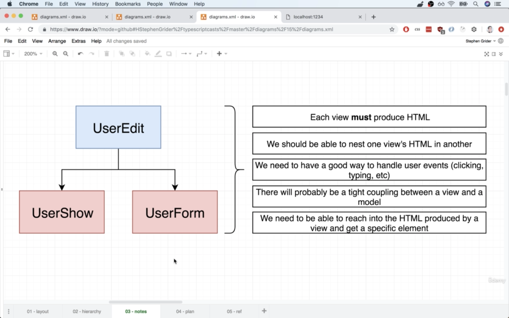

## 13.50. Building the UserForm
1. The class `UserForm` can have 3 properties `parent` which the model inherits from, `template` which returns `string` value that contains HTML code, and `render` which is a function that prints the content from `template` on the screen.
2. This is a very similar approach to other popular web frontend frameworks, such as React, Vue, and Angular.
3. We create a new model `UserForm` in `src/views`. The parent is the HTML element that we want to inject the created elements. 
4. Note that `Element` is a default type in Typescript which is the "Node" for front-end Javascript DOM manipulation.
  ```ts
  // src/views/UserForm.ts
  export class UserForm {
    parent: Element;

    template(): string {
      return `
      <div>
        <h1>User Form </h1>
        <input />
      </div>
      `;
    }

    render(): void {
      
    }
  }
  ```

## 13.51. The UserForm's Render Method
1. We can use a specific `template` element in HTML to create the elements as the DOM nodes. 
  ```ts
  // src/views/UserForm.ts
  export class UserForm {
    constructor(public parent: Element) {}

    template(): string {
      return `
      <div>
        <h1>User Form </h1>
        <input />
      </div>
      `;
    }

    render(): void {
      const templateElement = document.createElement('template');
      templateElement.innerHTML = this.template();

      this.parent.append(templateElement.content);
    }
  }
  ```

## 13.52. Rendering HTML
1. We can test the `UserForm` model in `index.ts`.
  ```ts
  import { UserForm } from './views/UserForm';

  const userForm = new UserForm(document.querySelector('#root'));

  userForm.render();
  ```

## 13.53. Defining an Events Map
1. To bind event handler with the elements, we can declare a method in the model and use event mapping to map the element and the function.
2. We use `{ [key: string]: () => void }` which means an object have unknown property name as the key, while each property is a function which returns nothing and working by itself.
  ```ts
  // src/views/UserForm.ts
  export class UserForm {
    constructor(public parent: Element) {}

    eventsMap(): { [key: string]: () => void } {
      return {
        'click:button': this.onButtonClick,
      };
    }

    onButtonClick(): void {
      console.log('hello world');
    }

    template(): string {
      return `
      <div>
        <h1>User Form </h1>
        <input />
        <button>Click Me</button>
      </div>
      `;
    }

    render(): void {
      const templateElement = document.createElement('template');
      templateElement.innerHTML = this.template();

      this.parent.append(templateElement.content);
    }
  }
  ```

## 13.54. Binding Event Handlers
1. When we use a selector on `document` to parse the DOM, the selector catches a reference to a `DocumentFragment`.
2. We name the keys as the event name concatenate with a column `:` and the element binding to that event.
3. Create a method `bindEvents` which checks the object in `eventsMap` and split up the keys by column and add the event handler by the giving element. 
4. Note that `querySelectorAll` returns an array-like, iteratable object but IS NOT an array, so only some of the array methods can be applied, including `forEach`. 
5. We then update `render` method to map all the events and handlers on the HTML node.
  ```ts
  // src/views/UserForm.ts
  export class UserForm {
    constructor(public parent: Element) {}

    eventsMap(): { [key: string]: () => void } {
      return {
        'click:button': this.onButtonClick,
        'mouseenter:h1': this.onHeaderHover,
      };
    }

    onHeaderHover(): void {
      console.log('H1 was hovered over');
    }

    onButtonClick(): void {
      console.log('hello world');
    }

    template(): string {
      return `
      <div>
        <h1>User Form </h1>
        <input />
        <button>Click Me</button>
      </div>
      `;
    }

    bindEvents(fragment: DocumentFragment): void {
      const eventsMap = this.eventsMap();

      for (let eventKey in eventsMap) {
        const [eventName, selector] = eventKey.split(':');

        fragment.querySelectorAll(selector).forEach((element) => {
          element.addEventListener(eventName, eventsMap[eventKey]);
        });
      }
    }

    render(): void {
      const templateElement = document.createElement('template');
      templateElement.innerHTML = this.template();

      this.bindEvents(templateElement.content);

      this.parent.append(templateElement.content);
    }
  }
  ```

## 13.55. Adding Model Properties
1. We'd like to show properties and data from the user instance directly.
2. In `UserForm`, we can add the user data in the string literal. 
  ```ts
  // src/views/UserForm.ts
  import { User } from '../models/User';

  export class UserForm {
    constructor(public parent: Element, public model: User) {}

    eventsMap(): { [key: string]: () => void } {
      return {
        'click:button': this.onButtonClick,
        'mouseenter:h1': this.onHeaderHover,
      };
    }

    onHeaderHover(): void {
      console.log('H1 was hovered over');
    }

    onButtonClick(): void {
      console.log('hello world');
    }

    template(): string {
      return `
      <div>
        <h1>User Form </h1>
        <div>User name: ${this.model.get('name')}</div>
        <div>User age: ${this.model.get('age')}</div>
        <input />
        <button>Click Me</button>
      </div>
      `;
    }

    bindEvents(fragment: DocumentFragment): void {
      const eventsMap = this.eventsMap();

      for (let eventKey in eventsMap) {
        const [eventName, selector] = eventKey.split(':');

        fragment.querySelectorAll(selector).forEach((element) => {
          element.addEventListener(eventName, eventsMap[eventKey]);
        });
      }
    }

    render(): void {
      const templateElement = document.createElement('template');
      templateElement.innerHTML = this.template();

      this.bindEvents(templateElement.content);

      this.parent.append(templateElement.content);
    }
  }
  ```
3. In `index.ts`, we create a new user with `User` and pass it to render the `UserForm` view.
  ```ts
  // index.ts
  import { UserForm } from './views/UserForm';
  import { User } from './models/User';

  const user = User.buildUser({ name: 'NAME', age: 20 });

  const userForm = new UserForm(document.querySelector('#root'), user);

  userForm.render();
  ```

## 13.56. Binding Events on Class Name
1. We'd like to add a new function which allows the user to click a button and regenerate a random age on the `User` instance.
2. We first add a button on to the view `UserForm`.
3. In the `eventsMap`, we can give the target to select with regular CSS selector, so it can select only certain elements with specific class or id. 
  ```ts
  // src/view/UserForm.ts
  import { User } from '../models/User';

  export class UserForm {
    constructor(public parent: Element, public model: User) {}

    eventsMap(): { [key: string]: () => void } {
      return {
        'click:.set-age': this.onSetAgeClick,
      };
    }

    onSetAgeClick(): void {
      console.log('button was clicked');
    }

    template(): string {
      return `
      <div>
        <h1>User Form </h1>
        <div>User name: ${this.model.get('name')}</div>
        <div>User age: ${this.model.get('age')}</div>
        <input />
        <button>Click Me</button>
        <button class="set-age">Set Random Age</button>
      </div>
      `;
    }

    bindEvents(fragment: DocumentFragment): void {
      const eventsMap = this.eventsMap();

      for (let eventKey in eventsMap) {
        const [eventName, selector] = eventKey.split(':');

        fragment.querySelectorAll(selector).forEach((element) => {
          element.addEventListener(eventName, eventsMap[eventKey]);
        });
      }
    }

    render(): void {
      const templateElement = document.createElement('template');
      templateElement.innerHTML = this.template();

      this.bindEvents(templateElement.content);

      this.parent.append(templateElement.content);
    }
  }
  ```

## 13.57. Adding Methods to the User
1. As the "random age" feature can be used on other view or functions that using `User` model, we can have this feature on `User` instance directly.
  ```ts
  // src/models/User.ts
  export class User extends Model<UserProps> {
    /* ... */

    setRandomAge(): void {
      const age = Math.round(Math.random() * 100);
      this.set({ age });
    }
  }
  ```
2. In `Userform`, we can call the method in the new `onSetAgeClick`.
3. Besides, we need to turn `onSetAgeClick` to arrow function to have `this` referring to the correct context when the function is assigned as the event handler in `bindEvents`. Otherwise, it will return an error when we click on the "random age" button. 
4. Though there's no error happening for the event handling and the data is surely update, we have no reactive behavior that update the data render on the HTML as well, so the user may not understand what has happened after they click the button.
  ```ts
  // src/view/UserForm.ts
  import { User } from '../models/User';

  export class UserForm {
    constructor(public parent: Element, public model: User) {}

    eventsMap(): { [key: string]: () => void } {
      return {
        'click:.set-age': this.onSetAgeClick,
      };
    }

    // declare as arrow function
    onSetAgeClick = (): void => {
      this.model.setRandomAge();
    };

    template(): string {
      return `
      <div>
        <h1>User Form </h1>
        <div>User name: ${this.model.get('name')}</div>
        <div>User age: ${this.model.get('age')}</div>
        <input />
        <button>Click Me</button>
        <button class="set-age">Set Random Age</button>
      </div>
      `;
    }

    bindEvents(fragment: DocumentFragment): void {
      const eventsMap = this.eventsMap();

      for (let eventKey in eventsMap) {
        const [eventName, selector] = eventKey.split(':');

        fragment.querySelectorAll(selector).forEach((element) => {
          element.addEventListener(eventName, eventsMap[eventKey]);
        });
      }
    }

    render(): void {
      const templateElement = document.createElement('template');
      templateElement.innerHTML = this.template();

      this.bindEvents(templateElement.content);

      this.parent.append(templateElement.content);
    }
  }
  ```

## 13.58. Re-Rendering on Model Change
1. In `Model`, when the event `change` is triggered, it has to update the date in the model that it holds to ensure the `view` or other related models will be udpated accordingly.
2. In the `set` method, a `change` will be triggered every time when something in the model is set.
  ```ts
  // src/models/Model.ts
  import { AxiosPromise, AxiosResponse } from 'axios';

  type Callback = () => void;

  interface ModelAttributes<T> {
    set(update: T): void;
    getAll(): T;
    get<K extends keyof T>(key: K): T[K];
  }

  interface ApiSync<T> {
    fetch(id: number): AxiosPromise;
    save(data: T): AxiosPromise;
  }

  interface Events {
    on(eventName: string, callback: Callback): void;
    trigger(eventName: string): void;
  }

  interface HasId {
    id?: number;
  }

  export class Model<T extends HasId> {
    constructor(
      private attributes: ModelAttributes<T>,
      private events: Events,
      private sync: ApiSync<T>
    ) {}

    on = this.events.on;
    trigger = this.events.trigger;
    get = this.attributes.get;

    set(update: T): void {
      this.attributes.set(update);
      this.events.trigger('change');
    }

    fetch(): void {
      const id = this.attributes.get('id');

      if (typeof id !== 'number') {
        throw new Error('Cannot fetch without an id');
      }

      this.sync.fetch(id).then((response: AxiosResponse): void => {
        this.set(response.data);
      });
    }

    save(): void {
      this.sync
        .save(this.attributes.getAll())
        .then((response: AxiosResponse): void => {
          this.trigger('save');
        })
        .catch(() => {
          this.trigger('error');
        });
    }
  }
  ```
2. We have to register event handler to `change` to let `Model` knows if something has happened and what function to execute as a callback.
3. In this case, we can simply add a helper method and execute it in the `constructor`.
4. However, the current version will keep adding a new block of form on the HTML, as we are using `append` rather than replacing the content in the target DOM.
  ```ts
  // src/view/UserForm.ts
  import { User } from '../models/User';

  export class UserForm {
    constructor(public parent: Element, public model: User) {
      this.bindModel();
    }

    bindModel(): void {
      this.model.on('change', () => {
        this.render();
      });
    }

    // render is not update, so it keeps adding new elements to the parent node
  }
  ```
5. Therefore, we can remove the content in the parent node which we are going to inject the content.
  ```ts
  // src/views/UserForm.ts
  import { User } from '../models/User';

  export class UserForm {
    constructor(public parent: Element, public model: User) {
      this.bindModel();
    }

    bindModel(): void {
      this.model.on('change', () => {
        this.render();
      });
    }

    render(): void {
      this.parent.innerHTML = ``;

      const templateElement = document.createElement('template');
      templateElement.innerHTML = this.template();

      this.bindEvents(templateElement.content);

      this.parent.append(templateElement.content);
    }
  }
  ```

## 13.59. Reading Input Text
1. When click the button to "chagne name", the callback function works on the the button element itself, and we can't access the value in the `input` element directly.
2. We can refer to the `parent` which is DOM node containing the HTML content of the current model. We can access `input` element with `querySelector`. 
  ```ts
  // src/models/UserForm.ts
  import { User } from '../models/User';

  export class UserForm {
    constructor(public parent: Element, public model: User) {
      this.bindModel();
    }

    bindModel(): void {
      this.model.on('change', () => {
        this.render();
      });
    }

    eventsMap(): { [key: string]: () => void } {
      return {
        'click:.set-age': this.onSetAgeClick,
        'click:.set-name': this.onSetNameClick,
      };
    }

    onSetNameClick = (): void => {
      const input = this.parent.querySelector('input');

      const name = input.value;

      this.model.set({ name });
    };

    onSetAgeClick = (): void => {
      this.model.setRandomAge();
    };

    template(): string {
      return `
      <div>
        <h1>User Form </h1>
        <div>User name: ${this.model.get('name')}</div>
        <div>User age: ${this.model.get('age')}</div>
        <input />
        <button class="set-name">Change Name</button>
        <button class="set-age">Set Random Age</button>
      </div>
      `;
    }

    bindEvents(fragment: DocumentFragment): void {
      const eventsMap = this.eventsMap();

      for (let eventKey in eventsMap) {
        const [eventName, selector] = eventKey.split(':');

        fragment.querySelectorAll(selector).forEach((element) => {
          element.addEventListener(eventName, eventsMap[eventKey]);
        });
      }
    }

    render(): void {
      this.parent.innerHTML = ``;

      const templateElement = document.createElement('template');
      templateElement.innerHTML = this.template();

      this.bindEvents(templateElement.content);

      this.parent.append(templateElement.content);
    }
  }
  ```

## 13.60. Strict Null Checks
1. If we use `tsc --init` in the terminal, Typescript compiler will generate a tsconfig.json file to configure the settings of the compiler.
2. As the "strict" is turning on, we may notice the prompted hint in `UserForm` that the `input` which is selected from `querySelector` can be a `null` object.
  ```ts
  // src/Views/UserForm.ts
  class UserForm {
    onSetNameClick = (): void => {
      // 'input' variable could be null
      const input = this.parent.querySelector('input');
      const name = input.value;
      this.model.set({ name });
    };
  }
  ```
3. `querySelector` method returns either a HTML node object that is or nested in the target DOM or a `null`. 
4. Therefore, we don't turn on "strict" mode in Typescript, the error prompt wouldn't show up. 
5. In this case, we can fix the issue by adding a "type guard".
  ```ts
  // src/Views/UserForm.ts
  class UserForm {
    onSetNameClick = (): void => {
      // 'input' variable could be null
      const input = this.parent.querySelector('input');
      if (input) {
        const name = input.value;
        this.model.set({ name });
      }
    };
  }
  ```
6. Similar conditions is applied to `index.ts`. We can use a type guard to check and ensure if `root` variable has selected the correct HTML node.
  ```ts
  // index.ts
  import { UserForm } from './views/UserForm';
  import { User } from './models/User';

  const user = User.buildUser({ name: 'NAME', age: 20 });

  const root = document.querySelector('#root');

  if (root) {
    const userForm = new UserForm(root, user);

    userForm.render();
  } else {
    throw new Error('Root element not found');
  }
  ```

## 13.61. Reusable View Logic
1. Some of the methods, including `render`, are strictly bond to `UserFrom` model. In the current structure, we have the following properties and methods in `UserForm`.
   1. `parent: Element`
   2. `model: User`
   3. `template(): string`
   4. `render(): void`
   5. `eventsMap(): { key: () => void }`
   6. `bindEvents(): void`
   7. `bindModel(): void`
   8. `onSetNameClick(): void`
   9. `onSetAgeClick(): void`
   10. `renderer: HtmlRenderer`
2. We may have a generic class `HtmlRenderer` to form up HTML and render the view related code. We can firstly split up some properties and methods which can be general in `HtmlRenderer`.
   1. `parent: Element`
   2. `model: User`
   3. `render(): void`
   4. `bindEvents(): void`
   5. `bindModel(): void`
3. On the other hand, `UserForm` has the following items
   1. `template(): string`
   2. `eventsMap(): { key: () => void }`
   3. `onSetNameClick(): void`
   4. `onSetAgeClick(): void`
   5.  `renderer: HtmlRenderer`
4. Therefore, we have `UserForm` and `HtmlRenderer` separated as different classes. However, we need a bi-directional relationship between these 2 models. Such as phenomenon is showing that "composition" isn't the proper approach to build up the structure.
  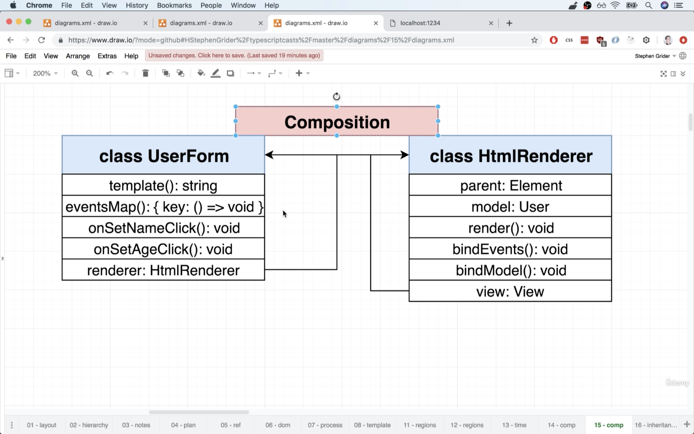
5. In this case, `HtmlRenderer` may need an `interface` to check if the class follows certain requirements to ensure it can work normally. For example, the model referring to `HtmlRenderer` must have `template` to return HTML code, `eventsMap` to bind the event handlers.
6. One of the solution is to have its own `bindEvents` and `render` method in `UserForm` class and have these methods referring back to `HtmlRender`. However, it's not an ideal solution to use this approach in a framework that other users can use.
7. On the other hand, we may use "Inheritance" approach that we create an `abstract` class and extends the class based on that.
  

## 13.62. Extracting a View Class
1. We can extract some of the logic from `UserForm`. However, `View` is still bond directly to `User` model that we should convert it to be more generic.
  ```ts
  // src/views/View.ts
  import { User } from '../models/User';

  export abstract class View {
    constructor(public parent: Element, public model: User) {
      this.bindModel();
    }

    abstract eventsMap(): { [key: string]: () => void };
    abstract template(): string;

    bindModel(): void {
      this.model.on('change', () => {
        this.render();
      });
    }

    bindEvents(fragment: DocumentFragment): void {
      const eventsMap = this.eventsMap();

      for (let eventKey in eventsMap) {
        const [eventName, selector] = eventKey.split(':');

        fragment.querySelectorAll(selector).forEach((element) => {
          element.addEventListener(eventName, eventsMap[eventKey]);
        });
      }
    }

    render(): void {
      this.parent.innerHTML = ``;

      const templateElement = document.createElement('template');
      templateElement.innerHTML = this.template();

      this.bindEvents(templateElement.content);

      this.parent.append(templateElement.content);
    }
  }
  ```

## 13.63. Extending with Generic Constraints
1. To turn `View` to be more generic, we can remove the reference to `User` and use a general `T` instead. 
2. However, the `T` type doesn't gurantee if the object passing in as an `on` method.
3. We can therefore create an `interface` and extends `T` from the `interface`. However, by this approach, we have to keep adding the methods could be use in the `interface` which could be very tedious.
4. Note that `generics` is like passing arguments that we may pass more than one type when calling the class. In this case, the `Model` we'd like to extend is also a generic type, which requires another type to declare.
5. Therefore, we can pass a 2nd argument which is as the argument passing to extend `Model` class.
  ```ts
  // src/views/View.ts
  import { Model } from '../models/Model';

  // not only `on` could be required but also other methods
  // we have to keep extending 'HasOn' when working wither other types
  interface HasOn {
    on(eventName: string, () => void): void;
  }

  // Model class extends from K
  export abstract class View<T extends Model<K>, K> {
    constructor(public parent: Element, public model: T) {
      this.bindModel();
    }

    abstract eventsMap(): { [key: string]: () => void };
    abstract template(): string;

    // the model is not guranteed to have an `on` method
    bindModel(): void {
      this.model.on('change', () => {
        this.render();
      });
    }

    /* ... */
  }
  ```
6. In `UserForm`, we can refer `View` class to both `User` and `UserProps`.
  ```ts
  // src/views/UserForm.ts
  import { User, UserProps } from '../models/User';
  import { View } from './View';

  export class UserForm extends View<User, UserProps> {
    /* ... */
  }
  ```

## 13.64. Saving Data From a View
1. We update a new method `onSaveClick` and add new property to `eventsMap`.
  ```ts
  // src/views/UserForm.ts
  import { User, UserProps } from '../models/User';
  import { View } from './View';

  export class UserForm extends View<User, UserProps> {
    eventsMap(): { [key: string]: () => void } {
      return {
        'click:.set-age': this.onSetAgeClick,
        'click:.set-name': this.onSetNameClick,
        'click:.save-model': this.onSaveClick,
      };
    }

    onSaveClick = (): void => {
      this.model.save();
    };

    onSetNameClick = (): void => {
      const input = this.parent.querySelector('input');

      if (input) {
        const name = input.value;

        this.model.set({ name });
      }
    };

    onSetAgeClick = (): void => {
      this.model.setRandomAge();
    };

    template(): string {
      return `
      <div>
        <input placeholder="${this.model.get('name')}"/>
        <button class="set-name">Change Name</button>
        <button class="set-age">Set Random Age</button>
        <button class="save-model">Save User</button>
      </div>
      `;
    }
  }
  ```

## 13.65. UserEdit and UserShow
1. In `UserShow`, some methods such as `eventsMap` is not required.
2. We can therefore update in `View` to turn `eventsMap` from an `abstract` method to a regular method and return an empty object by default.
3. Once it's registered with other methods, the object will be updated with key and alinged methods.
  ```ts
  // src/views/View.ts
  import { Model } from '../models/Model';

  export abstract class View<T extends Model<K>, K> {
    constructor(public parent: Element, public model: T) {
      this.bindModel();
    }

    abstract template(): string;

    // this turns eventsMaps to an optional method
    eventsMap(): { [key: string]: () => void } {
      return {};
    }
    
    /* ... */
  }
  ```
2. We then can update `UserShow.ts` with a template returns HTML code in string.
  ```ts
  // src/views/UserShow.ts
  import { View } from './View';
  import { User, UserProps } from '../models/User';

  export class UserShow extends View<User, UserProps> {
    template() {
      return `
        <div>
          <h1>User Detail</h1>
          <div>User Name: ${this.model.get('name')}</div>
          <div>User Age: ${this.model.get('age')}</div>
        </div>
      `;
    }
  }
  ```
3. We create a 3rd model `UserEdit`.
  ```ts
  // src/views/UserShow.ts
  import { View } from './View';
  import { User, UserProps } from '../models/User';

  export class UserEdit extends View<User, UserProps> {
    template(): string {
      return `
        <div>
          <div class="user-show"></div>
          <div class="user-form"></div>
        </div>
      `;
    }
  }
  ```

## 13.66. Nesting with Regions
1. In `UserEdit`, we can have 2 `div` elements as `Regions` which can contain futher details according to conditions.
2. We can create a generic method `regionMap` that maps the `Region` which is the container. 

## 13.67. Mapping Regions
1. When the model call the `render` method, the following steps are executed.
   1. Render calls `template`, gets HTML string
   2. Render inserts HTML string into a template element
   3. Bind event handlers to the HTML in the template element
   4. Call `regionMap` for list of regions that need to be created
   5. Render method populates values in `regions`
   6. We somehow insert new `child` views in those regions
   7. Render inserts content of template into DOM
2. In `View`, we update `regions` property which has unset key name with HTML node, and `regionsMap` method that works similar to `eventsMap` that binds the HTML element.
  ```ts
  // src/views/View.ts
  import { Model } from '../models/Model';

  export abstract class View<T extends Model<K>, K> {
    // regions with empty object by default
    regions: { [key: string]: Element } = {};

    constructor(public parent: Element, public model: T) {
      this.bindModel();
    }

    abstract template(): string;

    regionsMap(): { [key: string]: string } {
      return {};
    }

    eventsMap(): { [key: string]: () => void } {
      return {};
    }

    bindModel(): void {
      this.model.on('change', () => {
        this.render();
      });
    }

    bindEvents(fragment: DocumentFragment): void {
      const eventsMap = this.eventsMap();

      for (let eventKey in eventsMap) {
        const [eventName, selector] = eventKey.split(':');

        fragment.querySelectorAll(selector).forEach((element) => {
          element.addEventListener(eventName, eventsMap[eventKey]);
        });
      }
    }

    // helper method to map regions
    mapRegions(fragment: DocumentFragment): void {
      const regionsMap = this.regionsMap();
      for (let key in regionsMap) {
        const selector = regionsMap[key];
        const element = fragment.querySelector(selector);
        if (element) {
          this.regions[key] = element;
        }
      }
    }

    render(): void {
      this.parent.innerHTML = ``;

      const templateElement = document.createElement('template');
      templateElement.innerHTML = this.template();

      this.bindEvents(templateElement.content);
      // call helper method to map regions
      this.mapRegions(templateElement.content);

      this.parent.append(templateElement.content);
    }
  }
  ```

## 13.68. Testing Region Mapping
1. We rephrase `index.ts` and check results from `UserEdit`.
2. We will see nothing in the browser as there's no content injecting to `user-from` and `user-edit`. 
  ```ts
  // index.ts
  import { UserEdit } from './views/UserEdit';
  import { User } from './models/User';

  const user = User.buildUser({ name: 'NAME', age: 20 });

  const root = document.querySelector('#root');

  if (root) {
    const userEdit = new UserEdit(root, user);

    userEdit.render();

    console.log(userEdit);
  } else {
    throw new Error('Root element not found');
  }
  ```

## 13.69. View Nesting
1. In the `render` method, we need the nested nodes to inject content to themselves, so we simply add `onRender` method and call it in `render` method.
2. Note that the method can does nothing in the generic `View`, as we need it to execute the method in its sub-class.
  ```ts
  // src/views/View.ts
  import { Model } from '../models/Model';

  export abstract class View<T extends Model<K>, K> {
    regions: { [key: string]: Element } = {};

    constructor(public parent: Element, public model: T) {
      this.bindModel();
    }

    abstract template(): string;

    regionsMap(): { [key: string]: string } {
      return {};
    }

    eventsMap(): { [key: string]: () => void } {
      return {};
    }

    bindModel(): void {
      this.model.on('change', () => {
        this.render();
      });
    }

    bindEvents(fragment: DocumentFragment): void {
      const eventsMap = this.eventsMap();

      for (let eventKey in eventsMap) {
        const [eventName, selector] = eventKey.split(':');

        fragment.querySelectorAll(selector).forEach((element) => {
          element.addEventListener(eventName, eventsMap[eventKey]);
        });
      }
    }

    mapRegions(fragment: DocumentFragment): void {
      const regionsMap = this.regionsMap();
      for (let key in regionsMap) {
        const selector = regionsMap[key];
        const element = fragment.querySelector(selector);
        if (element) {
          this.regions[key] = element;
        }
      }
    }

    // this just to keep out the error 
    // we can't set this as abstract
    onRender(): void {}

    render(): void {
      this.parent.innerHTML = ``;

      const templateElement = document.createElement('template');
      templateElement.innerHTML = this.template();

      this.bindEvents(templateElement.content);
      this.mapRegions(templateElement.content);

      // simply execute this method from the sub-model
      this.onRender();

      this.parent.append(templateElement.content);
    }
  }
  ```
3. In `UserEdit`, we just allow the class to call `onRender` to have the nested models render HTML content in its node, so all the nested nodes will be injected with the contents according to its class and injected into the `parent` node.
  ```ts
  // src/views/UserEdit.ts
  import { View } from './View';
  import { User, UserProps } from '../models/User';
  import { UserForm } from './UserForm';
  import { UserShow } from './UserShow';

  export class UserEdit extends View<User, UserProps> {
    regionsMap(): { [key: string]: string } {
      return {
        userShow: `.user-show`,
        userForm: `.user-form`,
      };
    }

    onRender(): void {
      new UserShow(this.regions.userShow, this.model).render();
      new UserForm(this.regions.userForm, this.model).render();
    }

    template(): string {
      return `
        <div>
          <div class="user-show"></div>
          <div class="user-form"></div>
        </div>
      `;
    }
  }
  ```

## 13.70. Collection Views
1. We have had a model `Collection` which fetches all the data from json server of the whole user list. However, we don't have a view class that can render that dataset yet.
2. `Collection` view can be a collection of models and can render the view for each model we have fetched, so this class may have an `abstract` method `renderItem` which may handle different types of data according to declaration.

## 13.71. CollectionView Implementation
```ts
// src/views/CollectionView.ts
import { Collection } from '../models/Collection';

export abstract class CollectionView<T, K> {
  constructor(public parent: Element, public collection: Collection<T, K>) {}

  abstract renderItem(mode: T, itemParent: Element): void;

  render(): void {
    this.parent.innerHTML = ``;

    const templateElement = document.createElement('template');

    for (let model of this.collection.models) {
      const itemParent = document.createElement('div');
      this.renderItem(model, itemParent);

      templateElement.content.append(itemParent);
    }

    this.parent.append(templateElement.content);
  }
}
```
```ts
// src/views/UserList.ts
import { User, UserProps } from '../models/User';
import { CollectionView } from './CollectionView';
import { UserShow } from './UserShow';

export class UserList extends CollectionView<User, UserProps> {
  renderItem(model: User, itemParent: Element): void {
    new UserShow(itemParent, model).render();
  }
}
```
```ts
// index.ts
import { UserList } from './views/UserList';
import { Collection } from './models/Collection';
import { User, UserProps } from './models/User';

const users = new Collection(
  'http://localhost:3000/users',
  (json: UserProps) => {
    return User.buildUser(json);
  }
);

users.on('change', () => {
  const root = document.querySelector('#root');

  if (root) {
    new UserList(root, users).render();
  }
});

users.fetch();
```

## 13.72. App Wrapup
1. The idea of the code structure in this section of web framework such as `backbone.js` and `marionettejs`.

# 14. Express + Typescript Integration
## 14.1. Typescript with JS Libraries
1. Typescript has a distinct OOP style.
2. Many popular JS libs were written before JS had any solid idea of "classes".
3. Integrating JS with popular JS libs can be tough
4. When use Typescript with JS libs
   1. Use the lib normally, adding in basic type annotations where possible
   2. Use a Typescript adpater library that has helpers for using your lib with Typescript
   3. Twist your lib to work with Typescript classes
5. For example, we can check [`Ts.ED`](https://tsed.io/) or from [`npm`](https://www.npmjs.com/package/ts-express-decorators).
6. In this section, we'd try to twist the lib to work with Typescript class.

## 14.2. App Overview
1. We'd build a authentication based app that allows users to login and show if the user is logged in.
2. We have hard coded user and password set for testing purpose.
3. 3 routes are provided from this service
   1. `/` - show if the user is logged in
   2. `/login` - a form to allow users to login
   3. `/protected` - show only if the user is logged in

## 14.3. Project Setup
1. We will use `concurrently` and `nodemon` in this case.
2. Use `npm init -y` to start an npm project. 
3. Use `tsc --init` to create `tsconfig.json` file.
4. Create `src` and `build` directory and update `rootDir` and `outDir` in `tsconfig.ts`
5. Update `scripts` in `package.json`
  ```json
  {
    "scripts": {
      "start:build": "tsc -w",
      "start:run" : "nodemon build/index.js",
      "start:*": "concurrnetly npm start:*"
    }
  }
  ```

## 14.4. Basic Routes with Express
1. We install `express` and other middlewares `body-parser` and `cookie-session`.
2. Since we are using Typescript, each library requires their type definition file, so we can install it with `npm install @types/express @types/cookie-session @types/body-parser`.
  ```ts
  // index.ts
  import express, { Request, Response, Errback } from 'express';

  const app = express();

  app.get('/', (req: Request, res: Response) => {
    res.send(`
      <div>
        <h1>Hi there!</h1>
      </div>
    `);
  });

  app.listen(3000, () => {
    console.log(`Listening on port 3000`);
  });
  ```

## 14.5. Using an Express Router
1. We create `routes` directory under `src` and create `loginRoute` for the new router.
  ```ts
  import { Router } from 'express';

  const router = Router();

  router.get('/', (req, res) => {
    res.send('login router');
  });

  export { router };
  ```

## 14.6. Parsing Form Bodies
1. To read the data from a request, we need to use `body-parser`.
2. We can register and use it in the global scale in `index.ts`.
  ```ts
  // src/index.ts
  import express, { Request, Response, Errback } from 'express';
  import { router } from './routes/loginRoutes';
  import bodyParser from 'body-parser';

  const app = express();

  app.use(bodyParser.urlencoded({ extended: true }));
  app.use(router);

  app.get('/', (req: Request, res: Response) => {
    res.send(`
      <div>
        <h1>Hi there!</h1>
      </div>
    `);
  });

  app.listen(3000, () => {
    console.log(`Listening on port 3000`);
  });
  ```
  ```ts
  // src/routes/loginRoutes.ts
  import { Router, Request, Response } from 'express';

  const router = Router();

  router.get('/login', (req: Request, res: Response) => {
    res.send(`
      <form method="POST">
        <div>
          <label>Email</label>
          <input name="email" />
        </div>
        <div>
          <label>Password</label>
          <input name="password" type="password" />
        </div>
        <button>Submit</button>
      </form>
    `);
  });

  router.post('/login', (req: Request, res: Response) => {
    const { email, password } = req.body;
    // this is only for testing that returns the incoming data and show on screen
    res.send(email + password);
  });

  export { router };
  ```

## 14.7. Why Doesn't Express Play Nicely with TS?
1. The `body-parser` will check the incoming request from the browser frontend in HTTP(s) protocol.
2. Without `body-parser`, the there's no `body` property in the `request` object by default. The middleware will parse the request and add the property with data accordingly.
3. "middlewares" in general has 3 arguments, `request`, `response`, and `next`.
4. "middlewares" does some processing of `Request` and `Response` and calls `Next` function when complete. 
5. However, middleware behavior breaks the way how Typescript works as the properties and data strcuture is not static as Typescript requires.
6. The type definition files doesn't provide Typescript that what properties are added after the middleware process on it.
7. Besides, as Typescript couldn't handle mutable objects, some properties are given as `any` in the type definition file, which can cause unexpected errors.
8. For example, the `body` property in the `Request` has `any` type in the type definition file. However, we couldn't access the data if we don't use the middleware.
9. While Typescript couldn't know if we have applied the middleware to read `body` data either globally or on the spot.

## 14.8. Issues with Type Definition Files
1. Integration issues between Typescript and Express
   1. Cons 
      1. Type definition files alone can't express what's going on in the JS world accurately (example: middleware).
      2. Type definition files provided to us aren't always accurate.
      3. Inputs to a server (or any program with external inputs) are not guaranteed to exist, or be of the correct type.
   2. Pros
      1. Addressing these type issues with Typescript can force us to write better code.
2. We can modify the code and set a type guard in `loginRoutes`.
  ```ts
  // src/routes/loginRoutes.ts
  import { Router, Request, Response } from 'express';

  const router = Router();

  router.get('/login', (req: Request, res: Response) => {
    res.send(`
      <form method="POST">
        <div>
          <label>Email</label>
          <input name="email" />
        </div>
        <div>
          <label>Password</label>
          <input name="password" type="password" />
        </div>
        <button>Submit</button>
      </form>
    `);
  });

  router.post('/login', (req: Request, res: Response) => {
    const { email, password } = req.body;

    if (email) {
      res.send(email.toUpperCase());
    } else {
      res.send('You must provide an email property');
    }
  });

  export { router };
  ```

## 14.9. Dealing with Poor Type Defs
1. Rather than modifying the type definition file, we can create a custom `interface` and extends it from the poor typed model.
  ```ts
  // //src/routes/loginRoutes.ts
  import { Router, Request, Response } from 'express';

  interface RequestWithBody extends Request {
    body: { [key: string]: string | undefined };
  }

  const router = Router();

  router.get('/login', (req: Request, res: Response) => {
    res.send(`
      <form method="POST">
        <div>
          <label>Email</label>
          <input name="email" />
        </div>
        <div>
          <label>Password</label>
          <input name="password" type="password" />
        </div>
        <button>Submit</button>
      </form>
    `);
  });

  router.post('/login', (req: RequestWithBody, res: Response) => {
    const { email, password } = req.body;

    if (email) {
      res.send(email.toUpperCase());
    } else {
      res.send('You must provide an email');
    }
  });

  export { router };
  ```

## 14.10. Wiring Up Sessions
1. We register and use `cookie-session` as the middleware to add `session` property to request.
  ```ts
  // index.ts
  import express, { Request, Response, Errback } from 'express';
  import { router } from './routes/loginRoutes';
  import bodyParser from 'body-parser';
  import cookieSession from 'cookie-session';

  const app = express();

  app.use(bodyParser.urlencoded({ extended: true })); // add body to request
  app.use(cookieSession({ keys: ['abcdefg'] })); // add session to request
  app.use(router);

  app.get('/', (req: Request, res: Response) => {
    res.send(`
      <div>
        <h1>Hi there!</h1>
      </div>
    `);
  });

  app.listen(3000, () => {
    console.log(`Listening on port 3000`);
  });
  ```

## 14.11. Checking Login Status
1. We add on the root route and check if the user has logged in or not and return the message and view accordingly.
  ```ts
  // src/routes/loginRoutes.ts
  import { Router, Request, Response } from 'express';

  interface RequestWithBody extends Request {
    body: { [key: string]: string | undefined };
  }

  const router = Router();

  router.get('/login', (req: Request, res: Response) => {
    res.send(`
      <form method="POST">
        <div>
          <label>Email</label>
          <input name="email" />
        </div>
        <div>
          <label>Password</label>
          <input name="password" type="password" />
        </div>
        <button>Submit</button>
      </form>
    `);
  });

  router.post('/login', (req: RequestWithBody, res: Response) => {
    const { email, password } = req.body;

    if (email && password && email === 'hi@hi.com' && password === 'password') {
      // mark this person as logged in
      req.session = { loggedIn: true };
      // redirect them to the root route
      res.redirect('/');
    } else {
      res.send('Invalid email or password');
    }
  });

  router.get('/', (req: Request, res: Response) => {
    if (req.session && req.session.loggedIn) {
      res.send(`
        <div>
          <div>You are logged in</div>
          <a href="/logout">Logout</a>
        </div>
      `);
    } else {
      res.send(`
        <div>
          <div>You are not logged in</div>
          <a href="/login">Login</a>
        </div>
      `);
    }
  });

  export { router };
  ```

## 14.12. Loggin out
1. We add another route `/logout` to allow user log out and clear the data in `session`.
  ```ts
  // src/routes/loginRoutes.ts
  import { Router, Request, Response } from 'express';

  interface RequestWithBody extends Request {
    body: { [key: string]: string | undefined };
  }

  const router = Router();

  router.get('/login', (req: Request, res: Response) => {
    res.send(`
      <form method="POST">
        <div>
          <label>Email</label>
          <input name="email" />
        </div>
        <div>
          <label>Password</label>
          <input name="password" type="password" />
        </div>
        <button>Submit</button>
      </form>
    `);
  });

  router.post('/login', (req: RequestWithBody, res: Response) => {
    const { email, password } = req.body;

    if (email && password && email === 'hi@hi.com' && password === 'password') {
      // mark this person as logged in
      req.session = { loggedIn: true };
      // redirect them to the root route
      res.redirect('/');
    } else {
      res.send('Invalid email or password');
    }
  });

  router.get('/', (req: Request, res: Response) => {
    if (req.session && req.session.loggedIn) {
      res.send(`
        <div>
          <div>You are logged in</div>
          <a href="/logout">Logout</a>
        </div>
      `);
    } else {
      res.send(`
        <div>
          <div>You are not logged in</div>
          <a href="/login">Login</a>
        </div>
      `);
    }
  });

  router.get('/logout', (req: Request, res: Response) => {
    req.session = undefined;
    res.redirect('/');
  });

  export { router };
  ```

## 14.13. Protecting Routes
1. In an `express` way, it's better to use a middleware to check if request is authenticated and thus "guard" or protect a certain route.
2. We create a middleware `requireAuth` to check if the user is logged in and authenticated.
  ```ts
  import { Router, Request, Response, NextFunction } from 'express';

  interface RequestWithBody extends Request {
    body: { [key: string]: string | undefined };
  }

  function requireAuth(req: Request, res: Response, next: NextFunction): void {
    if (req.session && req.session.loggedIn === true) {
      next();
      return;
    }

    res.status(403).send('Unauthorized');
  }

  const router = Router();

  router.get('/login', (req: Request, res: Response) => {
    res.send(`
      <form method="POST">
        <div>
          <label>Email</label>
          <input name="email" />
        </div>
        <div>
          <label>Password</label>
          <input name="password" type="password" />
        </div>
        <button>Submit</button>
      </form>
    `);
  });

  router.post('/login', (req: RequestWithBody, res: Response) => {
    const { email, password } = req.body;

    if (email && password && email === 'hi@hi.com' && password === 'password') {
      // mark this person as logged in
      req.session = { loggedIn: true };
      // redirect them to the root route
      res.redirect('/');
    } else {
      res.send('Invalid email or password');
    }
  });

  router.get('/', (req: Request, res: Response) => {
    if (req.session && req.session.loggedIn) {
      res.send(`
        <div>
          <div>You are logged in</div>
          <a href="/logout">Logout</a>
        </div>
      `);
    } else {
      res.send(`
        <div>
          <div>You are not logged in</div>
          <a href="/login">Login</a>
        </div>
      `);
    }
  });

  router.get('/logout', (req: Request, res: Response) => {
    req.session = undefined;
    res.redirect('/');
  });

  router.get('/protected', requireAuth, (req: Request, res: Response) => {
    res.send('Welcome to protected route, logged in user');
  });

  export { router };
  ```

## 14.14. A Closer Integration
1. One way to integrate `express` and Typescript is to put the code into a class, though the approach could be unneccessary and confusing.
2. Massaging TS and Express to work better together will take a lot of time and effort. If there's not a good reason to do such as the following benefits, there's no point to use it.
   1. Get better type safety (help TS do a better job of catching errors)
   2. Significantly enhance the developer experience.
  ```ts
  // index.ts
  // this isn't useful to use Typescript with Express
  class Server {
    app: express.Express = express();

    constructor() {
      this.app.use(bodyParser.urlencoded({ extended: true })); 
      this.app.use(cookieSession({ keys: ['abcdefg'] }));
      this.app.use(router);
    }

    start(): void {
      this.app.listen(3000, () => {
        console.log(`Listening on port 3000`);
      });
    }
  }

  new Server().start();
  ```

## 14.15. The Refactoring Process
1. The other approach is not only stick a bunch of express code into classes but use some advanced features of TS, such as `decorators`.
2. In this case, we can use decorators from [`ts-express-decorators`](https://www.npmjs.com/package/ts-express-decorators).
3. The goal for coming sections
   1. Get a quick reminder on what contructors + prototypes are in normal Javascript.
   2. Do a quick aside on decorators in Typescript.
   3. Refactor our express app to use classes + decorators.

## 14.16. Prototypes Reminder
1. Keyword `class` in Javascript is a syntactic sugar or as a shorthand to create an object that has a similar syntax when working with other programming languages that support OOP.
2. In Javascript, `class` instances are objects created by functions and each object has a special property `prototype` which allows the object to trace back to its parent class. 
3. Therefore, though some properties and methods aren't visible on the instance directly, we still can call and use the data or methods by calling it.
  ```ts
  class Boat {
    color: string = 'red';

    pilot():void {
      console.log('switch');
    }
  }
  ```
  ```js
  "use strict";
  var Boat = /** @class */ (function () {
      function Boat() {
          this.color = 'red';
      }
      Boat.prototype.pilot = function () {
          console.log('switch');
      };
      return Boat;
  }());
  ```
4. However, it has a special feature that we can keep adding on new properties and methods after the instance is created through `prototype` property.
  ```js
  class Boat() {}

  const boat = new Boat();
  boat.sink(); // error as boat has not sink method

  // add new methods after the class is declared
  Boat.prototype.sink = function() { console.log('boat is sinking') }
  boat.sink(); // boat is sinking
  ```