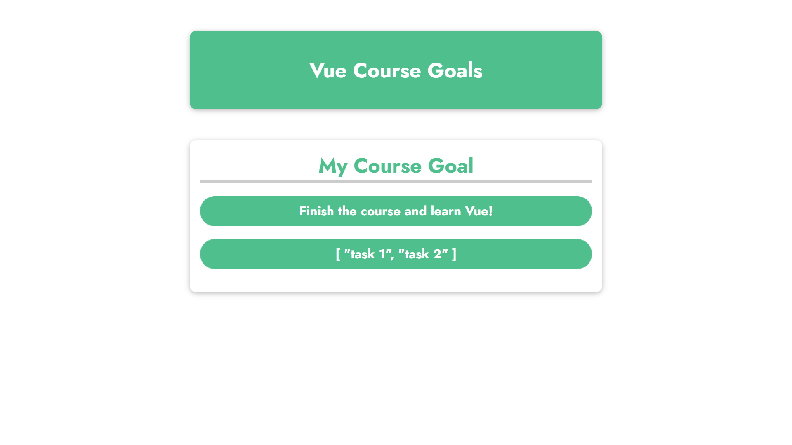
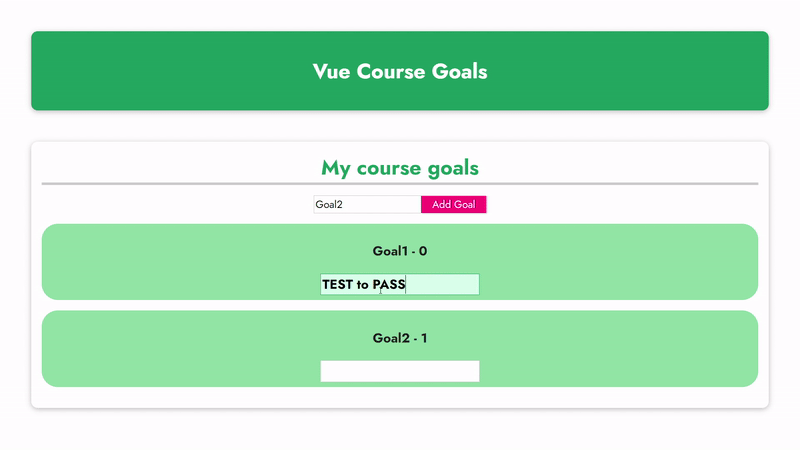
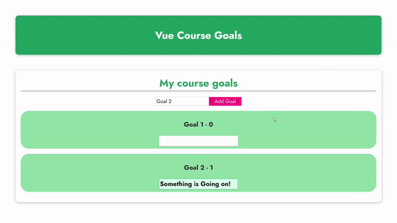
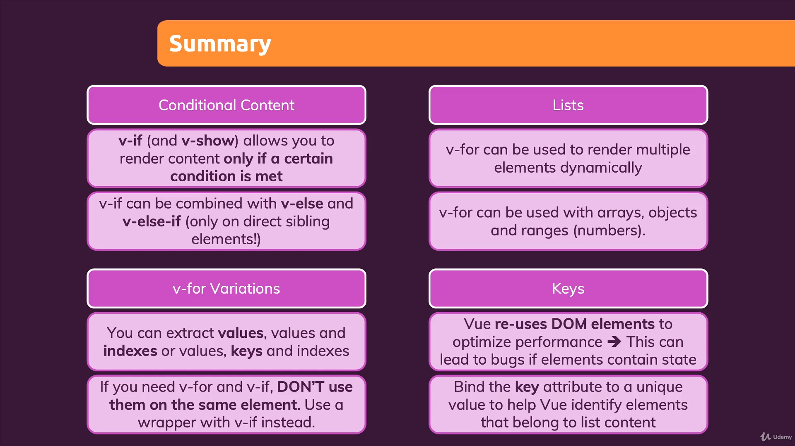
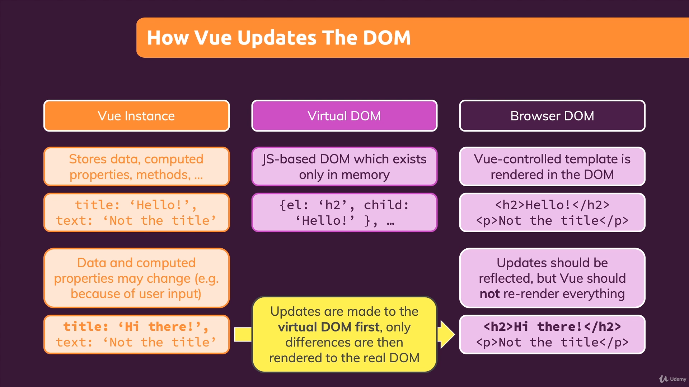
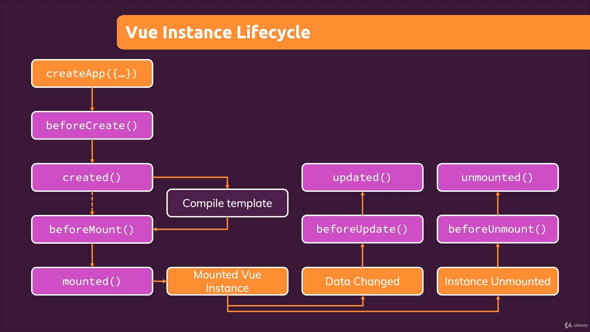
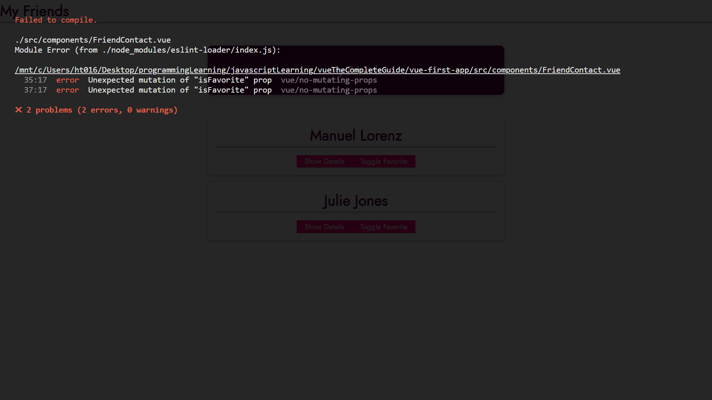

Start learning on 2021/04/19
Finished on 

Course Link [https://www.udemy.com/course/vuejs-2-the-complete-guide/](https://www.udemy.com/course/vuejs-2-the-complete-guide/)
---
1. [Basics and Core Concepts - DOM Interaction with Vue](#Basics-and-Core-Concepts---DOM-Interaction-with-Vue)
    1. [Creating and Connecting Vue App Instance](#Creating-and-Connecting-Vue-App-Instance)
    1. [Interpolation and Data Binding](#Interpolation-and-Data-Binding)
    1. [Binding Attributes with the "v-bind" Directive](#binding-attributes-with-the-v-bind-directive)
    1. [Understanding "methods" in Vue Apps](Understanding-methods-in-Vue-Apps)
    1. [Working with Data inside of a Vue App](#Working-with-Data-inside-of-a-Vue-App)
    1. [Outputting Raw HTML Content with v-html](#Outputting-Raw-HTML-Content-with-v-html)
    1. [A First Summary](#A-First-Summary)
    1. [Understanding the Event Binding](#Understanding-the-Event-Binding)
    1. [Events and Methods](#Events-and-Methods)
    1. [Working with Event Arguments](#Working-with-Event-Arguments)
    1. [Using the Native Event Object](#Using-the-Native-Event-Object)
    1. [Exploring Event Modifiers](#Exploring-Event-Modifiers)
    1. [Locking Content with v-once](#Locking-Content-with-v-once)
    1. [Data Binding + Event Binding = Two-way Binding](#data-binding--event-binding--two-way-binding)
    1. [Methods used for Data Bindings: How it works](#methods-used-for-data-bindings-how-it-works)
    1. [Introducing Computed Properties](#Introducing-Computed-Properties)
    1. [Working with Watchers](#Working-with-Watchers)
    1. [Methods vs Computed Properties vs Watchers](#Methods-vs-Computed-Properties-vs-Watchers)
    1. [v-bind and v-on Shorthands](#v-bind-and-v-on-Shorthands)
    1. [Dynamic Styling with Inline Styles](#Dynamic-Styling-with-Inline-Styles)
    1. [Adding CSS Classes Dynamically](#Adding-CSS-Classes-Dynamically)
    1. [Classes & Computed Properties](#classes--computed-properties)
    1. [Dynamic Classes: Array Syntax](#dynamic-classes-array-syntax)
1. [Redenering Conditional Content & Lists](#Redenering-Conditional-Content--Lists)
    1. [Understanding the Problem](#Understanding-the-Problem)
    1. [Rendering Content Conditionally](#Rendering-Content-Conditionally)
    1. [v-if, v-else and v-else-if](#v-if,-v-else-and-v-else-if)
    1. [Using v-show Instead of v-if](#Using-v-show-Instead-of-v-if)
    1. [Rendering Lists of Data](#Rendering-Lists-of-Data)
    1. [Diving Deeper Into v-for](#Diving-Deeper-Into-v-for)
    1. [Removing List Items](#Removing-List-Items)
    1. [Lists & Keys](#Lists--Keys)
1. [Coure Project: The Monster Slayer Game](#Coure-Project-The-Monster-Slayer-Game)
    1. [Project Setup & First Methods](#Project-Setup--First-Methods)
    1. [Updating the Health Bars](#Updating-the-Health-Bars)
    1. [Adding a "Special Attack"](#adding-a-special-attack)
    1. [Adding a "Heal" Functionality](#Adding-a-Heal-Functionality)
    1. [Adding a "Game Over" Screen](#Adding-a-Game-Over-Screen)
    1. [Finshing the Core Functionality](#Finshing-the-Core-Functionality)
    1. [Adding a Battle Log](#Adding-a-Battle-Log)
1. [Vue: Behind the Scenes](#Vue-Behind-the-Scenes)
    1. [An Introduction to Vue's Reactivity](#An-Introduction-to-Vue's-Reactivity)
    1. [Vue Reactivity: A Deep Dive](#Vue-Reactivity-A-Deep-Dive)
    1. [One App vs Multiple Apps](#One-App-vs-Multiple-Apps)
    1. [Understanding Templates](#Understanding-Templates)
    1. [Working with Refs](#Working-with-Refs)
    1. [How Vue Updates the DOM](#How-Vue-Updates-the-DOM)
    1. [Vue App Lifecycle - Theory](#Vue-App-Lifecycle---Theory)
    1. [Vue App Lifecycle - Practice](#Vue-App-Lifecycle---Practice)
1. [Introducing Components](#Introducing-Components)
    1. [Understanding the Problem](#Understanding-the-Problem)
    1. [Introducing Components](#Introducing-Components)
    1. [The Why: Building Complex User Interfaces With Components](#The-Why-Building-Complex-User-Interfaces-With-Components)
1. [Moving to a Better Development SEtup & Workflow with the Vue CLI](#Moving-to-a-Better-Development-SEtup--Workflow-with-the-Vue-CLI)
    1. [Why We Need A Development Server](#Why-We-Need-A-Development-Server)
    1. [WHy We Want A Better Developer Experience](#WHy-We-Want-A-Better-Developer-Experience)
    1. [Installing & Using the Vue CLI](#Installing--Using-the-Vue-CLI)
    1. [Inspecting the Created Project](#Inspecting-the-Created-Project)
    1. [Inspecting the Vue Code & ".vue" Files](#inspecting-the-vue-code--vue-files)
    1. [Adding the "Vetur" Extension to VS Code](#adding-the-vetur-extension-to-vs-code)
    1. [More on ".vue" Files](#more-on-vue-files)
    1. [A New Vue Project](#A-New-Vue-Project)
    1. [Creating a Basic Vue App](#Creating-a-Basic-Vue-App)
    1. [Adding a Component](#Adding-a-Component)
    1. [Adding Styling](#Adding-Styling)
1. [Component Communication](#Component-Communication)
    1. [Introducing "Props" (Parent => Child Communication)](#introducing-props-parent--child-communication)
    1. [Prop Behavior & Changing Props](#Prop-Behavior--Changing-Props)
    1. [Validating Props](#Validating-Props)
    1. [Working with Dynamic Props Values](#Working-with-Dynamic-Props-Values)
    1. [Emitting Custom Events (Child => Parent Communication)](#Eemitting-custom-events-child--parent-communication)
    1. [Defining & Validating Custom Events](#Defining--Validating-Custom-Events)
    1. [Prop / Event Fallthrough & Binding All Props](#Prop--Event-Fallthrough--Binding-All-Props)
    1. [Demo: Adding Components & Connecting Them](#Demo-Adding-Components--Connecting-Them)
    1. [Demo: Adding More Component Communication](#Demo-Adding-More-Component-Communication)
    1. [A Potential Problem](#A-Potential-Problem)
    1. [Provide + Inject To The Rescue](#Provide--Inject-To-The-Rescue)
    1. [Provide + Inject for Functions / Methods](#Provide--Inject-for-Functions--Methods)
    1. [Provide + Inject vs Props & Custom Events](#Provide--Inject-vs-Props--Custom-Events)
1. [Diving Deeper Into Components](#Diving-Deeper-Into-Components)
    1. [Project Setup](#Project-Setup)
    1. [Global vs Local Components](#Global-vs-Local-Components)
    1. [Scoped Styles](#Scoped-Styles)
    1. [Introducing Slots](#Introducing-Slots)
    1. [Named Slots](#Named-Slots)
    1. [Slot Styles & Compilation](#Slot-Styles--Compilation)
    1. [More on Slots](#More-on-Slots)
    1. [Scoped Slots](#Scoped-Slots)
    1. [Dynamic Components](#Dynamic-Components)
    1. [Keeping Dynamic Components Alive](#Keeping-Dynamic-Components-Alive)
    1. [Applying What We Know & A Problem](#Applying-What-We-Know--A-Problem)
    1. [Teleporting Elements](#Teleporting-Elements)
    1. [Working with Fragments](#Working-with-Fragments)
    1. [The Vue Style Guide](#The-Vue-Style-Guide)
    1. [Moving to a Different Folder Structure](#Moving-to-a-Different-Folder-Structure)
1. [Course Projct: The Learning Resources App](#Course-Projct-The-Learning-Resources-App)
    1. [Setup & First Steps](#Setup--First-Steps)
    1. [First Components & Props](#First-Components--Props)
    1. [Styling and More Components](#Styling-and-More-Components)
    1. [Header & BaseCard Components](#Header--BaseCard-Components)
    1. [Adding a Base Button](#Adding-a-Base-Button)
    1. [Dynamic Components & Attribute Fallthrough](#Dynamic-Components--Attribute-Fallthrough)
    1. [Adding & Styling Tabs](#Adding--Styling-Tabs)
    1. [Adding a Form](#Adding-a-Form)
    1. [Fetching User Input](#Fetching-User-Input)
    1. [Adding a Modal Dialog](#Adding-a-Modal-Dialog)
    1. [Deleting Items](#Deleting-Items)
    1. [Adding "Teleport"](#Adding-Teleport)
1. [Form](#Form)
    1. [v-model & Inputs](#v-model--Inputs)
    1. [Working with v-model Modifiers and Numbers](#Working-with-v-model-Modifiers-and-Numbers)
    1. [v-model and Dropdowns](#v-model-and-Dropdowns)
    1. [Using v-model with Checkboxes & Radiobuttons](#Using-v-model-with-Checkboxes--Radiobuttons)
    1. [Adding Basic Form Validation](#Adding-Basic-Form-Validation)
    1. [Building a Custom Control Component](#Building-a-Custom-Control-Component)
    1. [Using v-model on Custom Components](#Using-v-model-on-Custom-Components)
1. [Sending Http Requests](#Sending-Http-Requests)
    1. [Starting App & Why we need a Backend](#Starting-App--Why-we-need-a-Backend)
    1. [Adding a Backend](#Adding-a-Backend)
    1. [How to (Not) Send Http Requests](#How-to-Not-Send-Http-Requests)
    1. [Sending a POST Request to Store Data](#Sending-a-POST-Request-to-Store-Data)
    1. [Getting Data (GET Request) & Transforming Response Data](#Getting-Data-GET-Request--Transforming-Response-Data)
    1. [Loading Data When a Component Mounts](#Loading-Data-When-a-Component-Mounts)
    1. [Showing a "Loading..." Message](#Showing-a-Loading...-Message)
    1. [Handling the "No Data" State](#Handling-the-No-Data-State)
    1. [Handling Technical / Browser-side Errors](#Handling-Technical--Browser-side-Errors)
    1. [Handling Error Responses](#Handling-Error-Responses)
1. [Routing: Building "Multi-Page" Single Page Application](#Routing-Building-Multi-Page-Single-Page-Application)
    1. [What & Why?](#What--Why?)
    1. [Routing Setup](#Routing-Setup)
    1. [Registering & Rendering Routes](#Registering--Rendering-Routes)
    1. [Navigating with router-link](#Navigating-with-router-link)
    1. [Styling Active Links](#Styling-Active-Links)
    1. [Programmatic Navigation](#Programmatic-Navigation)
    1. [Passing Data with Route Params (Dynamic Segments)](#Passing-Data-with-Route-Params-Dynamic-Segments)
    1. [Navigation & Dynamic Paths](#Navigation--Dynamic-Paths)
    1. [A Vue Bug](#A-Vue-Bug)
    1. [Updating Params Data with Watchers](#Updating-Params-Data-with-Watchers)
    1. [Passing Params as Props](#Passing-Params-as-Props)
    1. [Redirecting & "Catch All" Routes](#Redirecting--Catch-All-Routes)
    1. [Using Nested Routes](#Using-Nested-Routes)
    1. [More Fun with Named Routes & Location Objects](#More-Fun-with-Named-Routes--Location-Objects)
    1. [Using Query Params](#Using-Query-Params)
    1. [Rendering Multiple Routers with Named Router Views](#Rendering-Multiple-Routers-with-Named-Router-Views)
    1. [Controlling Scroll Behavior](#Controlling-Scroll-Behavior)
    1. [Introducing Navigation Guards](#Introducing-Navigation-Guards)
    1. [Diving Deeper Into Navigation Guards](#Diving-Deeper-Into-Navigation-Guards)
    1. [The Global "afterEach" Guard](#The-Global-afterEach-Guard)
    1. [Beyond Entering: Route Leave Guards](#Beyond-Entering-Route-Leave-Guards)
    1. [Utilizing Route Metadata](#Utilizing-Route-Metadata)
    1. [Organizing Route Files](#Organizing-Route-Files)
1. [Animations & Transitions](#Animations--Transitions)
    1. [Animation Basics & CSS Transitions](#Animation-Basics--CSS-Transitions)
    1. [Understanding CSS Animations](#Understanding-CSS-Animations)
    1. [Why is "Just CSS" Not Enough?](#Why-is-Just-CSS-Not-Enough?)
    1. [Playing CSS Animations with Vue's Help](#Playing-CSS-Animations-with-Vue's-Help)
    1. [Using the Transition Component](#Using-the-Transition-Component)
    1. [CSS Animations with the Transition Component](#CSS-Animations-with-the-Transition-Component)
    1. [Using Custom CSS Class Names](#Using-Custom-CSS-Class-Names)
    1. [Example: Animating a Modal](#Example-Animating-a-Modal)
    1. [Transitioning Between Multiple Elements](#Transitioning-Between-Multiple-Elements)
    1. [Using Transition Events](#Using-Transition-Events)
    1. [Building JavaScript Transitions (instead of CSS)](#Building-JavaScript-Transitions-instead-of-CSS)
    1. [Disabling CSS Transitions](#Disabling-CSS-Transitions)
    1. [Getting Started with Animated Lists](#Getting-Started-with-Animated-Lists)
    1. [Animating Lists with "transition-group"](#Animating-Lists-with-transition-group)
    1. [Animate List Item Movement](#Animate-List-Item-Movement)
    1. [Animate Route Changes](#Animate-Route-Changes)
1. [Vuex](#Vuex)
    1. [What & Why?](#What--Why?)
    1. [Creating & Using a Store](#Creating--Using-a-Store)
    1. [Connecting Components to State](#Connecting-Components-to-State)
    1. [Introducing Mutations - A Better Way of Changing Data](#Introducing-Mutations---A-Better-Way-of-Changing-Data)
    1. [Passing Data to Mutations with Payloads](#Passing-Data-to-Mutations-with-Payloads)
    1. [Introducing Getters - A Better Way Of Getting Data](#Introducing-Getters---A-Better-Way-Of-Getting-Data)
    1. [Running Async Code with Actions](#Running-Async-Code-with-Actions)
    1. [Understanding the Action "Context"](#Understanding-the-Action-Context)
    1. [Using Mapper Helpers](#Using-Mapper-Helpers)
    1. [Organizing your Store with Modules](#Organizing-your-Store-with-Modules)
    1. [Understanding Local Module State](#Understanding-Local-Module-State)
    1. [Namespacing Modules](#Namespacing-Modules)
    1. [Structuring Vuex Code & Files](#Structuring-Vuex-Code--Files)
1. [Main Project: "Find a Coach" Web App](#Main-Project-Find-a-Coach-Web-App)
    1. [Planning the Project / Web App](#Planning-the-Project--Web-App)
    1. [Planning the Data Requirements](#Planning-the-Data-Requirements)
    1. [Planning the Layout / Components](#Planning-the-Layout--Components)
    1. [Registering Routes](#Registering-Routes)
    1. [Adding Route Page Components](#Adding-Route-Page-Components)
    1. [Working on the Main Layout & Styling](#Working-on-the-Main-Layout--Styling)
    1. [Wiring Up Pages](#Wiring-Up-Pages)
    1. [Adding Vuex and Coach Data](#Adding-Vuex-and-Coach-Data)
    1. [Working on the Coaches List and List Items](#Working-on-the-Coaches-List-and-List-Items)
    1. [Adding a Couple of Base Components (Base Card, Base Button, Base Badge)](#Adding-a-Couple-of-Base-Components-Base-Card,-Base-Button,-Base-Badge)
    1. [Building the Coach Detail Component](#Building-the-Coach-Detail-Component)
    1. [Filtering Coaches](#Filtering-Coaches)
    1. [Registering as a Coach: The Form](#Registering-as-a-Coach-The-Form)
    1. [Adding Coaches to Vuex](#Adding-Coaches-to-Vuex)
    1. [Adding Form Validation](#Adding-Form-Validation)
    1. [Working on the Contact Form](#Working-on-the-Contact-Form)
    1. [Storing Requests (Messages) with Vuex](#Storing-Requests-Messages-with-Vuex)
    1. [Outputting Incoming Requests (Messages)](#Outputting-Incoming-Requests-Messages)
    1. [Filtering Requests for teh Active Coach](#Filtering-Requests-for-teh-Active-Coach)
    1. [Sending a PUT Http Request to Store Coach Data](#Sending-a-PUT-Http-Request-to-Store-Coach-Data)
    1. [Fetching Coach Data (GET Http Request)](#Fetching-Coach-Data-GET-Http-Request)
    1. [Rendering a Loading Spinner](#Rendering-a-Loading-Spinner)
    1. [Adding Http Error Handling](#Adding-Http-Error-Handling)
    1. [Sending Coaching Requests Http Requests](#Sending-Coaching-Requests-Http-Requests)
    1. [Caching Http Response Data](#Caching-Http-Response-Data)
    1. [Adding Route Transitions](#Adding-Route-Transitions)
    1. [The "Not Found" Page & Summary](#The-Not-Found-Page--Summary)
1. [Vue & Authentication](#Vue--Authentication)
    1. [How Authentication Works in Vue Apps (or any SPA)](#How-Authentication-Works-in-Vue-Apps-or-any-SPA)
    1. [Locking / Protecting Backend Resources](#Locking--Protecting-Backend-Resources)
    1. [Adding an Authentication Page (Login & Signup)](#Adding-an-Authentication-Page-Login--Signup)
    1. [Preparing Vuex](#Preparing-Vuex)
    1. [Adding a "Signup" Action & Flow](#Adding-a-Signup-Action--Flow)
    1. [Better UX: Loading Spinner & Error Handling](#Better-UX-Loading-Spinner--Error-Handling)
    1. [Adding a "Login" Action & Flow](#Adding-a-Login-Action--Flow)
    1. [Attaching the Token to Outgoing Requests](#Attaching-the-Token-to-Outgoing-Requests)
    1. [Updating the UI Based on Auth State](#Updating-the-UI-Based-on-Auth-State)
    1. [Adding a "Logout" Action & Flow](#Adding-a-Logout-Action--Flow)
    1. [Authentication & Routing (incl. Navigation Guards)](#Authentication--Routing-incl.-Navigation-Guards)
    1. [Adding "Auto Login"](#Adding-Auto-Login)
    1. [Adding "Auto Logout"](#Adding-Auto-Logout)
1. [Optimizing & Deploying Vue Apps](#Optimizing--Deploying-Vue-Apps)
    1. [What To Deploy?](#What-To-Deploy?)
    1. [Optimization: Using Asynchronous Components](#Optimization-Using-Asynchronous-Components)
    1. [Building the Project For Production](#Building-the-Project-For-Production)
    1. [Deploying a Vue App](#Deploying-a-Vue-App)
1. [The Composition API - Replacing the Options API](#The-Composition-API---Replacing-the-Options-API)
    1. [Which Problem Does the Composition API Solve?](#Which-Problem-Does-the-Composition-API-Solve?)
    1. [Replacing "data" with "refs"](#Replacing-data-with-refs)
    1. [Building "reactive" Objects](#Building-reactive-Objects)
    1. [Reactivity: A Deep Dive](#Reactivity-A-Deep-Dive)
    1. [Replacing "methods" with regular Functions](#Replacing-methods-with-regular-Functions)
    1. [Replacing "Computed Properties" with the "computed" Function](#Replacing-Computed-Properties-with-the-computed-Function)
    1. [Two-Way-Binding and the Composition API](#Two-Way-Binding-and-the-Composition-API)
    1. [Working with Watchers](#Working-with-Watchers)
    1. [A First Summary](#A-First-Summary)
    1. [How to Use Templates Refs](#How-to-Use-Templates-Refs)
    1. [Components, Props, & The Composition API](#Components,-Props,--The-Composition-API)
    1. [Emitting Custom Events](#Emitting-Custom-Events)
    1. [Working with Provide / Inject](#Working-with-Provide--Inject)
    1. [Lifecycle Hooks in the Composition API](#Lifecycle-Hooks-in-the-Composition-API)
    1. [Migrating from Options API to Composition API - an Example Project](#Migrating-from-Options-API-to-Composition-API---an-Example-Project)
    1. [Migrating a First Component](#Migrating-a-First-Component)
    1. [Migrating a Big Component](#Migrating-a-Big-Component)
    1. [Migrating the Remaining Components](#Migrating-the-Remaining-Components)
    1. [Routing, Params & The Composition API](#Routing,-Params--The-Composition-API)
    1. [The Route & Router Objects and the Composition API](#The-Route--Router-Objects-and-the-Composition-API)
    1. [Using Vuex with the Composition API](#Using-Vuex-with-the-Composition-API)
1. [Reusing Funcitonality: Mixins & Custom Composition Functions](#Reusing-Funcitonality-Mixins--Custom-Composition-Functions)
    1. [Reusability Concepts](#Reusability-Concepts)
    1. [Using Mixins](#Using-Mixins)
    1. [Understanding Mixin Merging](#Understanding-Mixin-Merging)
    1. [Global Mixins](#Global-Mixins)
    1. [Disadvantages of Mixins](#Disadvantages-of-Mixins)
    1. [Custom Hooks / Composables & The Composition API](#Custom-Hooks--Composables--The-Composition-API)
    1. [More Custom Composition Functions](#More-Custom-Composition-Functions)
    1. [Why Hookks / Composables Beat Mixins](#Why-Hookks--Composables-Beat-Mixins)
    1. [Example: Creating a "Search" Hook](#Example-Creating-a-Search-Hook)
    1. [Custom Hooks Gotchas](#Custom-Hooks-Gotchas)
    1. [More Thoughts on Custom Hooks / Composables](#More-Thoughts-on-Custom-Hooks--Composables)
    1. [Example: A Custom "Sort" Hook](#Example-A-Custom-Sort-Hook)
---

# Basics and Core Concepts - DOM Interaction with Vue
## Creating and Connecting Vue App Instance
1. Starter HTML
    ```html
    <!DOCTYPE html>
    <html lang="en">
    <head>
        <meta charset="UTF-8" />
        <meta name="viewport" content="width=device-width, initial-scale=1.0" />
        <title>Vue Basics</title>
        <link
        href="https://fonts.googleapis.com/css2?family=Jost:wght@400;700&display=swap"
        rel="stylesheet"
        />
        <link rel="stylesheet" href="styles.css" />
        <script src="https://unpkg.com/vue@next" defer></script>
        <script src="app.js" defer></script>
    </head>
    <body>
        <header>
        <h1>Vue Course Goals</h1>
        </header>
        <section id="user-goal">
        <h2>My Course Goal</h2>
        <p></p>
        </section>
    </body>
    </html>
    ```
1. To use Vue, we need to specify in HTML that which element will be handled by Vue. 
1. To initiate Vue, we should create a `Vue App` in the JS code, and it requires an JavaScript object which as `data` method as a must property.
1. The `data` method should always return another JavaScript object which may have arbitrarily named keys. 
1. We then can use `app.mount()` selector to manipulate the HTML element on the page.
    ```js
    // Vue framework should be imported
    const app = Vue.createApp({
        data() { // must return an object
            return { // key/value pair can be named arbitrarily
                courseGoal: 'Finish the course and learn Vue!'
            };
        }
    });

    app.mount('#user-goal');
    ```

## Interpolation and Data Binding
1. We can put the placeholder in HTML which should match to the property that we want to return its value in `data` method.
1. Note that we can have multiple placeholder in the component, and all of them will show the same value. 
    1. HTML 
        ```html
        <section id="user-goal">
            <h2>My Course Goal</h2>
            <p>{{ courseGoal }}</p> <!-- placeholder for Vue selector to identify-->
            <p>{{ goalList }}</p>
        </section>
        ```
    1. JavaScript
        ```js
        const app = Vue.createApp({
            data() { // must return an object
                return { // key/value pair can be named arbitrarily
                    courseGoal: 'Finish the course and learn Vue!',
                    goalList: ['task 1', 'task 2']
                };
            }
        });

        app.mount('#user-goal');
        ```
1. If we use the placeholder somewhere else that isn't selected by Vue selector, it will be regular string in HTML.
1. The Vue component can not only show text but also other primitive values or JavaScript array or object, which will be stringified as JSON to be shown as string.
    

## Binding Attributes with the "v-bind" Directive
1. Though we can use double curly braces as placeholder for Vue component to import values, it doesn't work with attributes on HTML tags such as `href` of an anchor tag.
1. We then can use `v-bind` on the attribute to indicate that the HTML attribute should work with Vue. Note that the placeholder for the attribute doesn't require double curly braces.
    ```html
    <section id="user-goal">
        <h2>My Course Goal</h2>
        <p>{{ courseGoal }}</p>
        <p>Learn more <a v-bind:href="vueLink">about Vue</a>.</p>
    </section>
    ```

## Understanding "methods" in Vue Apps
1. To execute function as the event handler on a HTML element, we need to firstly set up the `methods` in the Vue app. 
1. Besides `data`, we can pass another property `methods` which holds the callback functions to handle events on HTML elements.
1. Note that the methods we want to call by Vue app should be declared in `methods` property only. Both `data` and `methods` are reserved properties for a Vue app.
    ```js
    const app = Vue.createApp({
        data() { 
            return { 
                courseGoal: 'Finish the course and learn Vue!',
                vueLink: 'https://vuejs.org/'
            };
        },
        methods: {
            outputGoal() {
                const randomNumber = Math.random();
                if (randomNumber < 0.5) {
                    return 'Learn Vue!';
                } else {
                    return 'Master Vue!';
                }
            }
        }
    });
    ```
1. The placeholder with double curly braces in HTML can take not only variables from Vue but also JavaScript expressions. Note that it doesn't take complicated structure such as an IF/ELSE statement, but it works with ternary operator.
    ```html
    <section id="user-goal">
        <h2>My Course Goal</h2>
        <p>{{ outputGoal() }}</p>
        <p>{{ 1 + 1 }}</p>
        <p>{{ (1 + 1) > 1 ? true : false }}</p>
        <p>Learn more <a v-bind:href="vueLink">about Vue</a>.</p>
    </section>
    ```

## Working with Data inside of a Vue App
1. Vue provides a shorthand that we can access the properties and methods on the Vue app object directly by `this` (which is not intuitive for regular Javascript objects!). 
1. The feature just turn all the properties which `data` method can return and methods in `methods` globally accessible with `this`.
    ```js
    const app = Vue.createApp({
        data() { // must return an object
            return { // key/value pair can be named arbitrarily
                courseGoalA: 'Finish the course and learn Vue!',
                courseGoalB: 'Master Vue and build amazing apps!',
                vueLink: 'https://vuejs.org/'
            };
        },
        methods: {
            outputGoal() {
                const randomNumber = Math.random();
                if (randomNumber < 0.5) {
                    return this.courseGoalA;
                } else {
                    return this.courseGoalB;
                }
            }
        }
    });

    app.mount('#user-goal');
    ```

## Outputting Raw HTML Content with v-html
1. Regular interpolation (double curly braces) can only handle the value as text (similar to `innerText` property on a HTML DOM).
    ```js
    const app = Vue.createApp({
        data() {
            return {
                courseGoalA: 'Finish the course and learn Vue!',
                courseGoalB: '<h2>Master Vue and build amazing apps!</h2>',
                vueLink: 'https://vuejs.org/'
            };
        },
        methods: {
            outputGoal() {
                const randomNumber = Math.random();
                if (randomNumber < 0.5) {
                    return this.courseGoalA;
                } else {
                    return this.courseGoalB;
                }
            }
        }
    });
    ```
1. For the case, we can use `v-html` as an attribute on the HTML element that we want to inject raw HTML tags as using `innerHTML`. The syntax is similar to `v-bind` which works with regular HTML attributes.
    ```html
    <section id="user-goal">
        <h2>My Course Goal</h2>
        <p v-html="outputGoal"></p>
        <p>Learn more <a v-bind:href="vueLink">about Vue</a>.</p>
    </section>
    ```
1. However, it's not recommended to have this method as default because it may be vulnerable to XXS attacks.

## A First Summary
1. If we use `app = Vue.createApp()` and select a specific HTML element by `app.mount()`, Vue can work on the selected HTML element and its child, while won't affect other HTML elements on the page. 
1. To manipulate the elements, we can use "**interpolation**" (double curly braces) and `v-html` and `v-bind` on HTML attributes. 

## Understanding the Event Binding
1. To add event listener on Vue component, we can use `v-on` and follow with a column and the event, such as `v-on:click`, on the HTML element.
1. We then can add Javascript expression or give the event handler function for the element.
1. However, `v-on` takes either expression or function and can't execution as a code block. For example, if we try to put `console.log('Hello World')` to execute direclty, browser will return an error.
    ```html
    <!-- HTML -->
    <section id="events">
        <h2>Events in Action</h2>
        <button v-on:click="increase">Add</button>
        <button v-on:click="counter-->Reduce</button>
        <p>Result: {{ counter }}</p>
    </section>
    ```
    ```js
    // JavaScript
    const app = Vue.createApp({
        data() {
            return {
                counter: 0,
            };
        },
        methods: {
            increase() {
                this.counter++;
            }
        }
    });

    app.mount('#events');
    ```

## Events and Methods
1. Though we can give expressions and logic at `v-on` in HTML element, it's not a good practice, as we should separate the purpose of each type of file.
1. Therefore, we can create a function in the JavaScript. This function should be a method in the Vue component. 
1. Besides, we can either pass the method or call the method in `v-on` directly. Either approach will work, as Vue can handle the conditions.
    ```html
    <!-- HTML -->
    <section id="events">
        <h2>Events in Action</h2>
        <!-- either assign method execute it will work as long as it's a method in the Vue component -->
        <button v-on:click="add()">Add</button>
        <button v-on:click="reduce">Reduce</button>button>
        <p>Result: {{ counter }}</p>
    </section>
    ```
    ```js
    // JavaScript
    const app = Vue.createApp({
        data() {
            return {
                counter: 0,
            };
        },
        methods: {
            add() {
                this.counter += 1;
            },
            reduce() {
                this.counter -= 1;
            }
        }
    });

    app.mount('#events');
    ```

## Working with Event Arguments
1. Since `v-on` can either take an expression or assign a method, we can pass an argument(s) to the method. 
1. Therefore, we can make our method dynamic and change the ouptut or feature on the Vue component very fast.
    ```html
    <!-- HTML -->
    <section id="events">
        <h2>Events in Action</h2>
        <!-- Pass arguments to methods -->
        <button v-on:click="add(5)">Add</button>
        <button v-on:click="reduce(5)">Reduce</button>
        <p>Result: {{ counter }}</p>
    </section>
    ```
    ```js
    // JavaScript
    const app = Vue.createApp({
        data() {
            return {
            counter: 0,
            };
        },
        methods: { // both methods take arguments
            add(num) {
            this.counter += num;
            },
            reduce(num) {
            this.counter -= num;
            }
        }
    });

    app.mount('#events');
    ```

## Using the Native Event Object
1. In regular cases, browser will provide an `event` argument to the callback function of the event handler. 
1. If we don't pass any argument to the event handler callback function it takes `event` argument by default. Therefore, we can use it as regular JavaScript to check the properties in the event object. 
1. In this case, we can track on the value that the user gives to an `input` tag by checking the `input` event. 
    ```html
    <!-- HTML -->
    <section id="events">
        <h2>Events in Action</h2>
        <input type="text" v-on:input="setName">
        <p>Your Name : {{ name }}</p>
    </section>
    ```
    ```js
    // JavaScript
    const app = Vue.createApp({
        data() {
            return {
                name: '',
            };
        },
        methods: {
            setName(event) {
                this.name = event.target.value;
            },
        }
    });

    app.mount('#events');
    ```
1. Besides, only the part that is handled by Vue is changed in the HTML document. This feature is similar to vanilla JavaScript to manipulate DOM. 
1. In addition, we can still pass an argument(s) to the event handler but keep the event object. Vue provides a reserved variable `$event` that we can pass to the function for `v-on` as well. 
    ```html
    <!-- HTML -->
    <input type="text" v-on:input="setName($event, 'Another Name')">
    ```
    ```js
    // JavaScript
    const app = Vue.creatApp({
        data() {
            return {
                name: '',
            },
        },
        methods: {
            setName(event, secondName) {
                return event.target.value + ' ' + secondName;
            } 
        }
    })
    ```

## Exploring Event Modifiers
1. In regular `form` element, the browser will return when the user submits the form as it send a HTTP request to server.
1. However, we'd like to prevent the default feature and stop browser from reloading the page.
1. We can use regular way in JavaScript to use `event.preventDefault()` in the callback funciton to prevent the browser reloads the page. 
    ```html
    <!-- HTML -->
    <section id="events">
        <h2>Events in Action</h2>
        <form v-on:submit="submitForm" action="">
        <input type="text" name="" id="">
        <button type="submit">Sign Up</button>
        </form>
    </section>
    ```
    ```js
    // JavaScript
    const app = Vue.createApp({
        methods: {
            submitForm(event) {
                event.preventDefault();
            }
        }
    })
    ```
1. On the other hand, we can use Vue feature to modify the event on HTML directly. In this case, we can simply modify Vue event handler with `v-on:submit.prevent`.
    ```html
    <!-- HTML -->
    <section id="events">
        <h2>Events in Action</h2>
        <form v-on:submit.prevent="submitForm" action="">
        <input type="text" name="" id="">
        <button type="submit">Sign Up</button>
        </form>
    </section>
    ```
1. Besides `.prevent`, we can do `click.right` for click event to change default from left click on a mouse to right click, so the function will only be trigerred when the user right clicks on the element.
    ```html
    <!-- HTML -->
    <section id="events">
        <h2>Events in Action</h2>
        <button v-on:click="add(5)">Add</button>
        <button v-on:click.right="reduce(5)">Reduce</button>
        <p>Result: {{ counter }}</p>
    </section>
    ```
1. In this case, we'd like to manipulate the input to the `p` tag below only when the user hits <kbd>enter</kbd>. Note that we can use `v-on` to apply multiple event handler on the same element. 
    ```html
    <!-- HTML -->
    <section id="events">
        <input 
            type="text" name="" id=""
            v-on:input="setName($event, 'Last Name')" 
            v-on:keyup.enter="confirmInput">
        <p>Your Name : {{ confirmedName }}</p>
    </section>
    ```
    ```js
    // JavaScript
    const app = Vue.createApp({
        data() {
            return {
                name: '',
                confirmedName: '',
            }
        },
        methods: {
            setName(event, secondName) {
                this.name = event.target.value + ' ' + secondName
            }, 
            confirmInput() {
                this.confirmedName = this.name;
            }
        }
    })
    ```
1. We may refer to [event modifier](https://vuejs.org/v2/guide/events.html#Event-Modifiers) from Vue officail document.

## Locking Content with v-once
1. In some scenarios, we'd like the Vue controled element to render interpolation at once when the app initiates. 
1. We can give `v-once` to indicate that the interpolation in the element will only happen when the element is firstly rendered. This is similar to the lifecycle method in React to prevent the element being re-rendered when the value or state changes.
    ```html
    <!-- HTML -->
    <section id="events">
        <h2>Events in Action</h2>
        <button v-on:click="add($event, 5)">Add</button>
        <button v-on:click="reduce($event, 5)">Reduce</button>
        <p v-once>Starting Counter: {{ counter }}</p>
        <p>Result: {{ counter }}</p>
    </section>
    ```
    ```js
    // JavaScript
    const app = Vue.createApp({
        data() {
            return {
                counter: 10,
            }
        },
        methods: {
            add(event, num = 1) {
                return counter += num;
            }

            reduce(event, num = 1) {
                return counter -= num;
            }
        }
    })
    ```

## Data Binding + Event Binding = Two-way Binding
1. If we'd like to reset the data when the user clicks a button on the page, we can use regular JavaScript with DOM selector to handle the event.
1. We can use `v-bind` to bind the attribute with Vue interpolation. In this case, we bind the `value` attribute of the `input` tag with `name` interpolation of Vue. Therefore, when the user clicks on the "reset" button, not only the content in the `p` tag below will be removed but also the data in the `input` tag.
    ```html
    <!-- HTML -->
    <section id="events">
        <h2>Events in Action</h2>
        <button v-on:click="add(10)">Add 10</button>
        <button v-on:click="reduce(5)">Subtract 5</button>
        <p>Result: {{ counter }}</p>
        <button v-on:click="resetInput">Reset Input</button>
        <!-- bind value -->
        <input type="text" v-bind:value="name" v-on:input="setName($event, 'lastName')">
        <!-- use v-model for two-way binding -->
        <input type="text" v-model="name">
        <p>Your Name: {{ name }}</p>
    </section>
    ```
    ```js
    // JavaScript
    const app = Vue.createApp({
        data() {
            return {
                name: '',
            }
        }, 
        methods: {
            setName(event, lastName){
                this.name = event.target.value;
            },
            resetInput(){
                this.name = '';
            }
        }
    });

    app.mount('#events');
    ```
1. On the other hand, we can use [`v-model`](https://vuejs.org/v2/guide/forms.html#Basic-Usage) which is a syntax sugar to use on `input`, `textarea`, and `select`. In this case, we don't event need to setup methods on the element to realize render the data. 
    ```html
    <!-- HTML -->
    <section id="events">
        <input type="text" v-model="input">
        <p>Your Name: {{ input }}</p>
    </section>
    ```
    ```js
    // JavaScript
    const app = Vue.createApp({
        data() {
            return {
                input: '',
            }
        }
    });
    
    app.mount('#events');
    ```

## Methods used for Data Bindings: How it works
1. When we execute any method of a Vue component, all the elements that has `v-model` or use `v-bind` will be rerendered, and the methods will be executed again to get the lastest value. This is similar to React framework that the whole component will be re-rendered and updated. 
1. However, this feature wouldn't be useful in some scenario and we don't want this always happens. In the following setup, we can notice that every time we click "add" or "reduce" button, `outputFullName` will be executed.
1. Note that Vue will update the whole component rather than only the specific item in the component. 
    ```html
    <!-- HTML -->
    <section id="events">
        <h2>Events in Action</h2>
        <button v-on:click="add(10)">Add 10</button>
        <button v-on:click="reduce(5)">Subtract 5</button>
        <p>Result: {{ counter }}</p>
        <button v-on:click="resetInput">Reset Input</button>        
        <input type="text" v-model="name">
        <p>Your Name: {{ outputFullname("Last Name) }}</p>
    </section>
    ```
    ```js
    // JavaScript
    const app = Vue.createApp({
        data() {
            return {
                counter = 0,
                name: '',
            }
        },
        methods: {
            outputFullName(lastName) {
                console.log('Run outputFullName');
                if (this.name === '') {
                    return '';
                } else {
                    return this.name + ' ' + lastName;
                }
            },
            add(num) {
                return this.counter += num;
            },
            reduce(num) {
                return this.counter -= num;
            }
        }
    });

    app.mount('#events');
    ```

## Introducing Computed Properties
1. In the other case, we can use `computed` (another reserved property) which works similar to `methods`. The main difference between them is that `methods` will be re-rendered when there's any thing changes on the page. On the other hand, `computed` only changes when any of its dependency is modified.
1. To use methods in `computed`, we just put the method name in the interpolation in HTML **WITHOUT** parenthesis. Vue will call the method instead.
1. With this approach, the `fullname` method in the following case won't be trigereed every time when other dependency is modified. 
    ```html
    <!-- HTML -->
    <section id="events">
        <h2>Events in Action</h2>
        <button v-on:click="add(10)">Add 10</button>
        <button v-on:click="reduce(5)">Subtract 5</button>
        <p>Result: {{ counter }}</p>
        <button v-on:click="resetInput">Reset Input</button>
        <input type="text" v-model="name">
        <p>Your Name: {{ fullname }}</p>
    </section>
    ```
    ```js
    // JavaScript
    const app = Vue.createApp({
        data() {
            return {
                name: '',
            }
        },
        computed: {
            fullname() {
                if (this.name === '') {
                    return '';
                }
                return this.name + ' ' + 'last name';
            }
        },
        method: {
            outputFullname() {
                if (this.name === '') {
                    return '';
                }
                return this.name + ' ' + 'last name';
            }
        }
    })
    ```

## Working with Watchers
1. Though "**watchers**" is similar to `computed` or `methods` in Vue, it's binding with the properties in data and don't return the value to use directly. `watch` is the reserved keyword as `computed`, `data`, and `methods` in Vue.
1. `watch` is bound to the properties in `data` returned and will listen to the change of it. 
    1. The methods created in `watch` should be exactly the same as the property name in `data`. 
    1. We don't return any value as it directly manipulate the value of the property in `data`. 
    1. Methods in `watch` can take 2 arguments (new value after change and old value before change). If only one argument is given, it represents the new value. 
1. `computed` as mentioned in the [last section](#Introducing-Computed-Properties) that it listens to the properties given to the methods when it's called. 
1. Though `watch` and `computed` work in similar behavior, `watch` is more suitable to track on single property in `data` and giving constraints. On the other hand, `computed` is good at tracking on multiple dependencies (multiple properties from `data`) and computed for the result. 
    ```html
    <!-- HTML -->
    <section id="events">
        <h2>Events in Action</h2>
        <button v-on:click="resetInput">Reset Input</button>
        <input type="text" v-model="name">
        <input type="text" v-model="lastName">
        <p>Your Name: {{ fullname }}</p>
    </section>
    ```
    ```js
    // JavaScript 
    const app = Vue.createApp({
        data() {
            return {
                name: '',
                lastName: '',
                fullname: '' // this should be taken off if fullname in computed is declared
            }
        },
        watch: { // following methods works exactly the same as fullname method in computed
            name(value){
                if (value === '') {
                    this.fullName = '';
                } else {
                    this.fullName = value + ' ' + this.lastName;
                }
            },
            lastName(value) {
                if (value === '') {
                    this.fullName = '';
                } else {
                    this.fullName = this.name + ' ' + value;
                }
            }
        },
        computed: {
            fullname() {
                if (this.name === '') {
                    return '';
                }
                return this.name + ' ' + this.lastName;
            }
        },
    })
    ```
1. In short summary, methods in `watch` and properties in `data` should have exactly the same name to bound the data, while both of them will get conflict if it's declared in `computed` or `methods`. For example, we can set `setTimeout` to reset the counter when the number is over 50 after 2 seconds. 
    ```html
    <!-- HTML -->
    <section id="events">
        <h2>Events in Action</h2>
        <button v-on:click="add()">Add</button>
        <button v-on:click="reduce()">Subtract</button>
        <p>Result: {{ counter }}</p>
    </section>
    ```
    ```js
    // JavaScript
    const app = Vue.createApp({
        data() {
            return {
                counter: 0
            };
        },
        watch: {
            counter(value) {
            if (value > 50) {
                setTimeout(() => {
                        this.counter = 0;
                    }, 2000);
                }
            }
        }, 
        methods: {
            add(event, num = 1) {
                this.counter += num;
            },
            reduce(event, num = 1) {
                this.counter -= num;
            }
        }
    });

    app.mount('#events');    
    ```

## Methods vs Computed Properties vs Watchers
1. `methods`
    1. Use with **event** binding OR **data** binding.
    1. Data binding: Method is executed for every "re-render" cycle of the component.
    1. Use for events or data that really needs to be re-evaluated all the time.
1. `computed`
    1. Use with **data** binding.
    1. Computed properties are only re-evaluated if one of their "**used values**" changed.
    1. Use for data that depends on other data.
1. `watch`
    1. Not used directly in template.
    1. Allows you to run any code in reaction to some changed data (e.g. send Http request etc.)
    1. Use for any non-data update you want to make.

## v-bind and v-on Shorthands
1. In Vue, we can use a shorthand to indicate `v-on` attribute in HTML as an `@` sign. Note that we can still put modifiers on the event handler, such as `.right` to listen to right click for "click" event. 
    ```html
    <!-- HTML -->
    <button v-on:click="add(5)">Add</button>
    <button @click.right="reduce(5)">Subtract</button>
    ```
1. For `v-bind`, we can simply use a column `:` to replace the attribute.
    ```html
    <!-- HTML -->
    <a v-bind:href="variable">A Link</a>
    <a :href="variable">A Link</a>
    ```

## Assignmetns 3: Time to practice: Reactivity
1. HTML source code
    ```html
    <body>
    <header>
        <h1>Reactivity in Action</h1>
    </header>
    <section id="assignment">
        <button>Add 5</button>
        <button>Add 1</button>
        <!-- 1) Connect the buttons and calculate a value (a number) -->
        <!-- Show "Not there yet" until you reach a result of exactly 37 -->
        <!-- Show "Too much!" if the result is greater than 37 -->
        <p>Result: RESULT</p>
        <!-- 2) Watch for changes in "result" and reset the value to 0 after 5 seconds -->
    </section>
    </body>
    ```
1. First approach by using only methods. Note that we must call the method in interpolation.
    ```html
    <!-- HTML -->
    <section id="assignment">
        <button @click="add(5)">Add 5</button>
        <button @click="add(1)">Add 1</button>
        <p>Result: {{ result() }}</p>
        <!-- the method must be called -->
    </section>
    ```
    ```js
    // JavaScript
    const app = Vue.createApp({
        data() {
            return {
                number: 0,
                text: '',
            }
        },
        methods: {
            add(num = 1) {
                this.number += num;
            },
            result() {
                if (this.number > 37) {
                    this.text = 'Too much';
                    setTimeout(() => {
                        this.number = 0;
                    }, 1500);
                } else {
                    this.text = 'Not there yet';
                }
                return this.text;
            }
        }
    });

    app.mount('#assignment');
    ```
1. Second approach that uses all `methods`, `computed`, and `watch`. Note that as `result` is a computed method, it is consumed as a variable by Vue, so we can't call it in the interpolation.
    ```html
    <!-- HTML -->
    <section id="assignment">
        <button @click="add(5)">Add 5</button>
        <button @click="add(1)">Add 1</button>
        <p>Result: {{ result }}</p>
        <!-- the method can't be called -->
    </section>
    ```
    ```js
    // JavaScript
    const app = Vue.createApp({
        data() {
            return {
                number: 0,
                text: 'Not there yet',
            }
        },
        watch: {
            number(value) {
                if (value > 37) {
                    this.text = 'Too much';
                } else {
                    this.text = 'Not there yet';
                }
            }
        },
        computed: {
            result() {
                if (this.number > 37) {
                    setTimeout(() => {
                        this.number = 0;
                    }, 1500);
                }
                return this.text
            }
        },
        methods: {
            add(num = 1) {
                this.number += num;
            }
        }
    });

    app.mount('#assignment');
    ```
1. Third approach uses only `methods` and `computed`.
    ```js
    // JavaScript
    const app = Vue.createApp({
        data() {
            return {
                number: 0,
                text: 'Not there yet',
            }
        },
        computed: {
            result() {
                if (this.number > 37) {
                    this.text = 'Too much';
                    setTimeout(() => {
                        this.number = 0;
                    }, 1500);
                } else {
                    this.text = 'Not there yet';
                }
                return this.text
            }
        },
        methods: {
            add(num = 1) {
                this.number += num;
            }
        }
    });

    app.mount('#assignment');
    ```
1. Solution from the lecture. A watcher can also "watch" on the methods in `computed`. 
    ```html
    <!-- HTML -->
    <section id="assignment">
        <button @click="add(5)">Add 5</button>
        <button @click="add(1)">Add 1</button>
        <p>Result: {{ result }}</p>
        <!-- the method can't be called -->
    </section>
    ```
    ```js
    // JavaScript
    const app = Vue.createApp({
        data() {
            return {
                number: 0,
            }
        },
        watch: {
            result() {
                setTimeout(() => {
                    this.number = 0;
                }, 1500);
            }
        },
        computed: {
            result() {
                if (this.number > 37) {
                    return 'Too much';
                } else if (this.number === 37) {
                    return this.number;
                } else {
                    return 'Not there yet';
                }
            }
        },
        methods: {
            add(num = 1) {
                this.number += num;
            }
        }
    });

    app.mount('#assignment');
    ```

## Dynamic Styling with Inline Styles
1. We can use `v-bind` or its shorthand column `:` to select `style` attribute of a HTML tag. Besides, passing a regular CSS property such as `border-color` we can use curly braces to wrap it and use "**camelCase**" on the property.
1. We then can refer to the `data` for the Vue component and use tenary statement to check what value to return for the style. Note that we can pass the data variable directly in the curly braces.
1. Though we can use `methods` to manulate the style with JavaScript DOM, as we can get the `event` object and change the property with DOM selector `event.target.style.borderColor`. 
    1. However, the first click will only turn the color to red by inline style as the "**state**" just changes, and the component is re-rendered.
    1. Since the "state" has changed and won't change by the 2nd click, the `method` can work on the DOM manipulate and turn the `border-color` into the other given color. 
    ```html
    <!-- HTML -->
    <body>
        <header>
            <h1>Vue Dynamic Styling</h1>
        </header>
        <section id="styling">
            <div class="demo" 
                :style="{borderColor: boxASelected ? 'red' : '#ccc'}" 
                @click="boxSelected($event, 'A')">
            </div>
            <div class="demo" @click="boxSelected('B')"></div>
            <div class="demo" @click="boxSelected('C')"></div>
        </section>
    </body>
    ```
    ```js
    // JavaScript
    const app = Vue.createApp({
        data() {
            return {
                boxASelected: false,
                boxBSelected: false,
                boxCSelected: false,
            };
        },
        methods: {
            boxSelected(event, box) {
                if (box === 'A') {
                    this.boxASelected = true;
                    event.target.style.borderColor = 'blue';
                } else if (box === 'B') {
                    this.boxBSelected = true;
                } else if (box === 'B') {
                    this.boxCSelected = true;
                }
            }
        }
    });

    app.mount('#styling');
    ```

## Adding CSS Classes Dynamically
1. In a Vue component, we can use both `v-bind:class` and a regular "**class**" attribute in HTML tag. Therefore, we can keep both dynamic and static classes in the same element. 
1. With bound attribute, we can use Vue interpolation to check whether th apply the class to the element. 
1. A bound class can take a JavaScript object which has the name of the class as the property and a boolean value to indicate whether to apply the class or not.
    ```html
    <!-- HTML -->
    <div :class="{active: true}">
    ```
1. Besides, to toggle the properties, we can give an initial value and set it as the reversed value by an exclamation mark `!`. 
    ```html
    <!-- HTML -->
    <section id="styling">
        <div class="demo" :class="{active: boxASelected}" @click="boxSelected('A')">
        </div>
        <div class="demo" :class="{active: boxBSelected}" @click="boxSelected('B')"></div>
        <div class="demo" :class="{active: boxCSelected}" @click="boxSelected('C')"></div>
  </section>
    ```
    ```js
    // JavaScript
    const app = Vue.createApp({
        data() {
            return {
                boxASelected: false,
                boxBSelected: false,
                boxCSelected: false,
            };
        },
        methods: {
            boxSelected(box) { // toggle the property
                if (box === 'A') {
                    this.boxASelected = !this.boxASelected;
                } else if (box === 'B') {
                    this.boxBSelected = !this.boxBSelected;
                } else if (box === 'C') {
                    this.boxCSelected = !this.boxCSelected;
                }
            }
        }
    });

    app.mount('#styling');
    ```

## Classes & Computed Properties
1. Since we can pass an object to bound `class`, we can use `computed` to return an object.
    ```html
    <!-- HTML -->
    <section id="styling">
    <div class="demo" :class="boxAClasses" @click="boxSelected('A')">
    </div>
    <div class="demo" :class="{active: boxBSelected}" @click="boxSelected('B')"></div>
    <div class="demo" :class="{active: boxCSelected}" @click="boxSelected('C')"></div>
  </section>
    ```
    ```js
    // JavaScript
    const app = Vue.createApp({
        data() {
            return {
                boxASelected: false,
            }
        },
        computed: {
            boxAClasses() {
                return {
                    active: this.boxASelected
                }
            }
        },
        methods: {
            boxSelected(box) {
                if (box === 'A') {
                    this.boxAselected = !this.boxAselected;
                }
            }
        }
    });
    ```
    ```css
    /* CSS */
    .active {
        border-color: red;
        background-color: salmon;
    }
    ```

## Dynamic Classes: Array Syntax
1. Besides passing an object, we can also pass an array of classes (in `string` or `object`). Therefore, we can have only a bound class attribute in the HTML tag.
    ```html
    <!-- HTML -->
    <section id="styling">
        <div :class="['demo', boxAClasses]" @click="boxSelected('A')">
        </div>
        <div :class="['demo', {active: boxBSelected}]" @click="boxSelected('B')"></div>
        <div class="demo" :class="{active: boxCSelected}" @click="boxSelected('C')"></div>
  </section>
    ```
    ```js
    // JavaScript
    const app = Vue.createApp({
        data(){
            return {
                boxASelected: false;
                boxBSelected: false;
                boxCSelected: false;
            }
        },
        computed: {
            boxAClasses() {
                return {
                    active: boxASelected
                }
            },
            boxBClasses() {
                return {
                    active: boxBSelected
                }
            },
            boxCClasses() {
                return {
                    active: boxCSelected
                }
            }
        },
        methods: {
            boxSelected(box) {
                if (box === 'A') { 
                    this.boxASelected = !this.boxASelected
                }
                else if (box === 'B') { 
                    this.boxBSelected = !this.boxBSelected
                }
                else if (box === 'C') { 
                    this.boxCSelected = !this.boxCSelected
                }
            }
        }
    });

    app.mount('#styling');
    ```

## Assignment 4: Time to practice: Dynamic Styling
1. HTML source code 
    ```html
    <!DOCTYPE html>
    <html lang="en">
        <head>
            <meta charset="UTF-8" />
            <meta name="viewport" content="width=device-width, initial-scale=1.0" />
            <title>Vue Basics</title>
            <link
            href="https://fonts.googleapis.com/css2?family=Jost:wght@400;700&display=swap"
            rel="stylesheet"
            />
            <link rel="stylesheet" href="styles.css" />
            <script src="https://unpkg.com/vue@next" defer></script>
            <script src="app.js" defer></script>
        </head>
    <body>
        <header>
            <h1>Vue Styling</h1>
        </header>
        <section id="assignment">
            <!-- 1) Fetch the user input and use it as a CSS class -->
            <!-- The entered class should be added to the below paragraph -->
            <input type="text" />
            <!-- (available classes: "user1", "user2) -->
            <p>
                Style me!
            </p>
            <button>Toggle Paragraph</button>
            <!-- 2) Use the "visible" and "hidden" classes to show/ hide the above paragraph -->
            <!-- Clicking the button should toggle between the two options -->

            <!-- 3) Add dynamic inline styling to the below paragraph and let the user enter a background-color -->
            <input type="text" />
            <p>Style me inline!</p>
        </section>
    </body>
    </html>
    ```
1. Approaches for task 1
    1. use only `watch` and `v-model` in HTML
        ```html
        <!-- HTML -->
        <section id="assignment">
            <input type="text" v-model="user" />
            <p :class="userClass">
            Style me!
            </p>
        </section>
        ```
        ```js
        // JavaScript
        const app = Vue.createApp({
            data() {
                return {
                    user: '',
                    userClass: null
                }
            },
            watch: {
                user(value) {
                    if (value === 'user1') {
                        this.userClass = { user1: true };
                    } else if (value === 'user2') {
                        this.userClass = { user2: true };
                    } else {
                        this.userClass = null;
                    }
                }
            }
        });

        app.mount('#assignment');
        ```
    1. use only `methods` and `v-on` in HTML
        ```html
        <!-- HTML -->
        <section id="assignment">
            <input type="text" v-on:input="userInput" />
            <p :class="userClass">
            Style me!
            </p>
        </section>
        ```
        ```js
        // JavaScript
        const app = Vue.createApp({
            data() {
                return {
                    user: '',
                    userClass: null
                }
            },
            methods: {
                userInput(event) {
                    this.user = event.target.value;
                    if (this.user === 'user1') {
                        this.userClass = { user1: true };
                    } else if (this.user === 'user2') {
                        this.userClass = { user2: true };
                    } else {
                        this.userClass = null;
                    }
                }
            }
        });

        app.mount('#assignment');
        ```
    1. use only `computed` and `v-model`
        ```html
        <!-- HTML -->
        <section id="assignment">
            <input type="text" v-model="user" />
            <p :class="userClass">
            Style me!
            </p>
        </section>
        ```
        ```js
        // JavaScript
        const app = Vue.createApp({
            data() {
                return {
                    user: '',
                }
            }
            computed: {
                userClass() {
                    if (this.user === 'user1') {
                        return { user1: true }
                    } else if (this.user === 'user2') {
                        return { user2: true }
                    } else {
                        return null
                    }
                }
            }
        });

        app.mount('#assignment');
        ```
1. Approaches for task 2
    1. Use `computed` and `methods`
        ```html
        <!-- HTML -->
        <section id="assignment">
            <p :class="[toggle]">
            Style me!
            </p>
            <button @click="toggleParagraph">Toggle Paragraph</button>
        </section>
        ```
        ```js
        // JavaScript
        const app = Vue.createApp({
            data() {
                return {
                    show: true,
                }
            },
            computed: {
                toggle() {
                    return {
                        visible: this.show,
                        hidden: !this.show
                    }
                }
            },
            methods: {
                toggleParagraph() {
                    this.show = !this.show;
                }
            }
        });

        app.mount('#assignment');
        ```
    1. Use only `methods`
        ```html
        <!-- HTML -->
        <section id="assignment">
            <p :class="[toggle()]">
            Style me!
            </p>
            <button @click="toggleParagraph">Toggle Paragraph</button>
        </section>
        ```
        ```js
        // JavaScript
        const app = Vue.createApp({
            data() {
                return {
                    show: true,
                }
            },
            methods: {
                toggleParagraph() {
                    this.show = !this.show;
                },
                toggle() {
                    return {
                        visible: this.show,
                        hidden: !this.show
                    }
                }
            }
        });

        app.mount('#assignment');
        ```
    1. Use `watch` and `methods`
        ```html
        <section id="assignment">
            <p :class="[userClass, visibleClass]">
            Style me!
            </p>
            <button @click="toggleParagraph">Toggle Paragraph</button>
        </section>
        ```
        ```js
        // JavaScript
        const app = Vue.createApp({
            data() {
                return {
                    user: '',
                    show: true,
                    visibleClass: null
                }
            },
            watch: {
                show(value) {
                    this.visibleClass = {
                        visible: value,
                        hidden: !value
                    }
                }
            },
            methods: {
                toggleParagraph() {
                    this.show = !this.show;
                }
            }
        });

        app.mount('#assignment');
        ```
1. Approaches for task 3
    1. Use only `v-model` and inline styling in HTML
        ```html
        <!-- HTML -->
        <section id="assignment">
            <input type="text" v-model="color" />
            <p :style="{'color': color}">Style me inline!</p>
        </section>
        ```
        ```js
        // JavaScript
        const app = Vue.createApp({
            data() {
                return {
                    color: '',
                }
            }
        });

        app.mount('#assignment');
        ```
    1. Use only `computed` and `v-model`
        ```html
        <!-- HTML -->
        <section id="assignment">
            <input type="text" v-model="color" />
            <p :style="textColor">Style me inline!</p>
        </section>
        ```
        ```js
        // JavaScript
        const app = Vue.createApp({
            data() {
                return {
                    color: '',
                }
            },
            computed: {
                textColor() {
                    if (this.color) {
                        return {
                            color: this.color
                        }
                    }
                }
            }
        });

        app.mount('#assignment');
        ```
    1. Use `watch` and `v-model`
        ```html
        <!-- HTML -->
        <section id="assignment">
            <input type="text" v-model="color" />
            <p :style="textColor">Style me inline!</p>
        </section>
        ```
        ```js
        // JavaScript
        const app = Vue.createApp({
            data() {
                return {
                    color: '',
                    textColor: null
                }
            },
            watch: {
                color(color) {
                    if (color) {
                        this.textColor = {
                            color
                        }
                    }
                }
            }
        });

        app.mount('#assignment');
        ```
    1. Use `v-on` and `methods`
        ```html
        <!-- HTML -->
        <section id="assignment">
            <input type="text" v-on:input="changeColor" />
            <p :style="textColor">Style me inline!</p>
        </section>
        ```
        ```js
        // JavaScript
        const app = Vue.createApp({
            data() {
                return {
                    textColor: null
                }
            },
            methods: {
                changeColor(event) {
                    if (event.target.value) {
                        this.textColor = {
                            color: event.target.value
                        }
                    }
                }
            }
        });

        app.mount('#assignment');
        ```
1. Solutions from the lecture
    1. Task 1
        ```html
        <!-- HTML -->
        <section id="assignment">
            <input type="text" v-model="inputClass">
            <p :class="inputClass">Style me!</p>
        <section>
        ```
        ```js
        // JavaScript
        const app = Vue.createApp({
            data() {
                return {
                    inputClass: ''
                }
            }
        });

        app.mount('#assignment');
        ```
    1. Task 2
        ```html
        <!-- HTML -->
        <section id="assignment">
            <input type="text" v-model="inputClass">
            <p :class="inputClass">Style me!</p>
            <button @click="toggleParagraphVisibility">Toggle Paragraph</
        <section>
        ```
        ```js
        // JavaScript
        const app = Vue.createApp({
            data() {
                return {
                    inputClass: '',
                    paragraphIsVisible: true
                }
            },
            computed: {
                paraClasses() {
                    return {
                        user1: this.inputClass === 'user1',
                        user2: this.inputClass === 'user2',
                        visible: this.paragraphIsVisible,
                        hidden: !this.paragraphIsVisible,
                    }
                }
            }
        });

        app.mount('#assignment');
        ```
    1. Task 3
        ```html
        <!-- HTML -->
        <section id="assignment">
            <input type="text" v-model="inputBackgroundColor" />
            <p :style="{backgroundColor: inputBackgroundColor}">Style me inline!</p>
        </section>
        ```
        ```js
        // JavaScript
        const app = Vue.createApp({
            data() {
                return {
                    inputBackgroundColor: '',
                }
            }
        });

        app.mount('#assignment');
        ```


# Redenering Conditional Content & Lists
## Understanding the Problem
1. In this case, we will show the `p` indicating that there's no goal.
1. We'd like to allow users to give new values with `input` tag. The new values shoule be added as `li` elements in the list `ul`.
    ```html
    <!-- HTML -->
    <body>
    <header>
      <h1>Vue Course Goals</h1>
    </header>
    <section id="user-goals">
      <h2>My course goals</h2>
      <input type="text" />
      <button>Add Goal</button>
      <p>No goals have been added yet - please start adding some!</p>
      <!-- show p tag above when there's nothing in the list -->
      <ul>
        <li>Goal</li>
      </ul>
    </section>
  </body>
    ```

## Rendering Content Conditionally
1. We can use `v-model` to bind the data of Vue component to collect the value from user input, and declare a method to add the input value to store in the array.
1. We can use `v-if` in the `p` tag to check whether there's any item in the array and only shows when the array is empty. 
    ```html
    <!-- HTML -->
    <section id="user-goals">
        <h2>My course goals</h2>
        <input type="text" v-model="enteredGoalValue" />
        <button @click="addGoal">Add Goal</button>
        <p v-if="goals.length === 0">No goals have been added yet - please start adding some!</p>
        <ul>
            <li>Goal</li>
        </ul>
  </section>
    ```
    ```js
    // JavaScript
    const app = Vue.createApp({
        data() {
            return {
            enteredGoalValue: '',
            goals: []
            };
        },
        methods: {
            addGoal() {
                this.goals.push(this.enteredGoalValue);
            }
        }
    });

    app.mount('#user-goals');

    ```

## v-if, v-else and v-else-if
1. We can use not only `v-if` to control the elements but also `v-else-if` and `v-else` as regular logical statements. However, `v-else-if` and `v-else` should come right after in the element that "adjacent" to the element with `v-if` (not child or parent).
    ```html
    <!-- HTML -->
    <section id="user-goals">
        <h2>My course goals</h2>
        <input type="text" v-model="enteredGoalValue" />
        <button @click="addGoal">Add Goal</button>
        <p v-if="goals.length === 0">No goals have been added yet - please start adding some!</p>
        <ul v-else>
            <li>Goal</li>
        </ul>
  </section>
    ```

## Using v-show Instead of v-if
1. Besides `v-if`, we can use `v-show` which takes an expression to check whether to show a HTML element. 
1. The main difference between `v-if` and `v-show` controlled elements is that `v-if` do "remove" the element from the page, while `v-show` just apply `display: none` property to the the element, so the element is still on the page but not visible.
1. Therefore, in some cases that an element is toggled very often, we can use `v-show` rather than `v-if` to improve App performance.

## Rendering Lists of Data
1. To render items in an JavaScript `array`, we can use `v-for` on the element.
1. The syntax for `v-for` is similar to call the properties of JavaScript objects which use `in`, (though `of` keyword also works, it is recommended to use `in`).
1. We then can use the variable to create dynamic items in the list according to the array data in the `state`. 
1. Note that Vue doesn't re-render the whole item but cache the data and only change the elements according to the data. 
1. For example, the number of items in the list is aligned to the number of items in the JavaScript array it bound to. When any item is added or removed from the array, only the HTML element aligned to the data will be modified rather than the whole list.
    ```html
    <!-- HTML -->
    <section id="user-goals">
        <h2>My course goals</h2>
        <input type="text" v-model="enteredGoalValue" />
        <button @click="addGoal">Add Goal</button>
        <p v-if="goals.length === 0">No goals have been added yet - please start adding some!</p>
        <ul v-else>
            <li v-for="goal in goals">{{ goal }}</li>
        </ul>
    </section>
    ```

## Diving Deeper Into v-for
1. We can not only declare a variable for the item in the array but also the index of the item.
1. The syntax is to wrap the variables in the parenthesis and give a 2nd argument as `(var, index) in array`
    ```html
    <!-- HTML -->
    <section id="user-goals">
        <h2>My course goals</h2>
        <input type="text" v-model="enteredGoalValue" />
        <button @click="addGoal">Add Goal</button>
        <p v-if="goals.length === 0">No goals have been added yet - please start adding some!</p>
        <ul v-else>
            <li v-for="(goal, index) in goals">{{ index }} - {{ goal }}</li>
        </ul>
    </section>
    ```
1. Besides arrays, we can use `v-for` to loop through a JavaScript `object`.
    ```html
    <!-- HTML -->
    <ul>
        <li v-for="(value, key, index) in {name: 'Max', age: 31}">{{ index + 1 }} - {{ key }}: {{ value }}</li>
    </ul>
    ```
1. In addition, we can simply create a number list with `v-for` by giving a variable and a nubmer
    ```html
    <!-- HTML -->
    <ul>
        <li v-for="num in 10">{{ num }}</li>
    </ul>
    ```

## Removing List Items
1. With the power of `v-for`, we can use it with `methods` to "**remove**" items from the list. In this case, we can use [`.splice`](https://developer.mozilla.org/en-US/docs/Web/JavaScript/Reference/Global_Objects/Array/splice) array method to remove an element from the array at a given position (index).
1. Note that the variable `index` we pass to the method is only accessible if the method is in the same element as the element using `v-for`.
    ```html
    <!-- HTML -->
    <section id="user-goals">
        <h2>My course goals</h2>
        <input type="text" v-model="enteredGoalValue" />
        <button @click="addGoal">Add Goal</button>
        <p v-if="goals.length === 0">No goals have been added yet - please start adding some!</p>
        <ul v-else>
            <li v-for="(goal, index) in goals" @click="removeGoal(index)">{{ goal }} - {{ index }}</li>
        </ul>
    </section>
    ```
    ```js
    // JavaScript
    const app = Vue.createApp({
        data() {
            return {
                enteredGoalValue: '',
                goals: []
            };
        },
        methods: {
            addGoal() {
                this.goals.push(this.enteredGoalValue);
            },
            removeGoal(index) {
                this.goals.splice(index, 1);
            }
        }
    });

    app.mount('#user-goals');
    ```

## Lists & Keys
1. If we have another element nested in another element and both use event handler for `click` event, we can use the shorthand in Vue to stop propagation.
1. In the previous example, we have the item in the list to be removed when the user clicks on the element. However, if we now give an `input` tag to collect other data, it will be closed when the user clicks on the nested `input` tag. Therefore, we need to stop propagation for the case.  
    ```html
    <!-- HTML -->
    <section id="user-goals">
        <h2>My course goals</h2>
        <input type="text" v-model="enteredGoalValue" />
        <button @click="addGoal">Add Goal</button>
        <p v-if="goals.length === 0">No goals have been added yet - please start adding some!</p>
        <ul v-else>
            <li v-for="(goal, index) in goals" @click="removeGoal(index)">
                <p>{{ goal }} - {{ index }}</p>
                <input type="text" name="" id="" @click.stop>
                <!-- shorthand to stop propagation -->
            </li>
        </ul>
    </section>
    ```
1. However, Vue has a bug on the event that the input values will be passed on in the nested elements.
1. The issue comes from the optimization mechanism of Vue. It doesn't remove the first element when we delete it but keeps it and remove the 2nd one and move the contents of the 2nd one to the first one.
1. Only the dynamic content, which is declare in `p` tag as `{{ goal }} - {{ index }}` in the example above, will be updated. 
    
1. Thus, if we work another way around to have input in the 2nd item in the list, the value will be removed when the 1st element is deleted. 
    
1. Vue has a solution which is similar to React that it gives an unique "**key**" to the item in the list. Note that the key is not a HTML attribute so as it in React app. Besdies, it needs to use `v-bind` or the shorthand column `:` to bind the data.
1. In real practice, it's better to use the "**id**" of the item, which is NOT the index because the index is dynamic when the items are added or removed from the array. Besides, the content itself could be too long as an unique identifier. However, we can simply use the content `goal` as the unqiue identifier in this case.
    ```html
    <!-- HTML -->
    <section id="user-goals">
        <h2>My course goals</h2>
        <input type="text" v-model="enteredGoalValue" />
        <button @click="addGoal">Add Goal</button>
        <p v-if="goals.length === 0">No goals have been added yet - please start adding some!</p>
        <ul v-else>
            <li v-for="(goal, index) in goals" :key="goal" @click="removeGoal(index)">
                <!-- :key bond attribute indicates to Vue that which element is going to be modifed -->
                <p>{{ goal }} - {{ index }}</p>
                <input type="text" name="" id="" @click.stop>
            </li>
        </ul>
    </section>
    ```
## Assignment 5: Time to Practice: Conditional Content & Lists
1. HTML source code
    ```html
    <body>
        <header>
            <h1>Vue Lists and Conditional Content</h1>
        </header>
        <section id="assignment">
            <h2>Assignment</h2>
            <!-- 1) Add code to manage a list of tasks in a Vue app -->
            <!-- When clicking "Add Task" a new task with the entered text should be added -->
            <input type="text">
            <button>Add Task</button>
            <ul>
                <!-- 2) Output the list of tasks here -->
            </ul>
            <!-- 3) When the below button is pressed, the list should be shown or hidden -->
            <!-- BONUS: Also update the button caption -->
            <button>Hide / Show List</button>
        </section>
    </body>
    ```
1. Use `methods` and `watch` in JavaScript with `v-show` and `v-for` in HTML. Delete feature is added when the user clicks on the item in the list, the item will be removed and `tasks` array in `data` will be updated.
    ```html
    <!-- HTML -->
    <section id="assignment">
        <h2>Assignment</h2>
        <input type="text" v-model="task">
        <button @click="addTask">Add Task</button>
        <ul v-show="show">
            <li v-for="(item, index) in tasks" :key="item" @click="removeItem(index)">{{ index + 1}} - {{ item }}</li>
        </ul>
        <button @click="toggleList">{{ btnText }} List</button>
    </section>
    ```
    ```js
    // JavaScript
    const app = Vue.createApp({
        data() {
            return {
                show: true,
                btnText: 'Hide',
                task: '',
                tasks: []
            }
        },
        watch: {
            show(value) {
                if (value) {
                    this.btnText = 'Hide';
                } else {
                    this.btnText = 'Show';
                }
            }
        },
        methods: {
            addTask() {
                this.tasks.push(this.task);
            },
            toggleList() {
                this.show = !this.show;
            },
            removeItem(index) {
                this.tasks.splice(index, 1);
            }
        }
    });

    app.mount('#assignment');
    ```
1. Solution from the lecture. `computed` and `methods` are used in this case.
    ```html
    <!-- HTML -->
    <section id="assignment">
        <h2>Assignment</h2>
        <input type="text" v-model="task">
        <button @click="addTask">Add Task</button>
        <ul v-show="show">
            <li v-for="(item, index) in tasks" :key="item" >{{ index + 1}} - {{ item }}</li>
        </ul>
        <button @click="toggleList">{{ btnText }} List</button>
    </section>
    ```
    ```js
    // JavaScript
    const app = Vue.createApp({
        data() {
            return {
                show: true,
                task: '',
                tasks: []
            }
        },
        computed: {
            btnText() {
                if (this.show) {
                    return 'Hide';
                }
                return 'Show';
            }
        },
        methods: {
            addTask() {
                this.tasks.push(this.task);
            },
            toggleList() {
                this.show = !this.show;
            }
        }
    });

    app.mount('#assignment');
    ```

## Summary 
1. **DO NOT** use `v-if` and `v-for` on the same element. Use a wrapper with `v-if` instead.
    


# Coure Project: The Monster Slayer Game
## Project Setup & First Methods
1. The game allows the uesr acts as a player to slay a monster where both entities have certain amount of health (HP). The player can choose to "**attack**", "**special attack**", "**heal**", or "**surrender**". Both the monster and the player can attack and damage random amount of health on each other. 
1. HTML source code
    ```html
    <!DOCTYPE html>
    <html lang="en">

    <head>
        <meta charset="UTF-8" />
        <meta name="viewport" content="width=device-width, initial-scale=1.0" />
        <title>Vue Basics</title>
        <link href="https://fonts.googleapis.com/css2?family=Jost:wght@400;700&display=swap" rel="stylesheet" />
        <link rel="stylesheet" href="styles.css" />
        <script src="https://unpkg.com/vue@next" defer></script>
        <script src="app.js" defer></script>
    </head>

    <body>
        <header>
            <h1>Monster Slayer</h1>
        </header>
        <div id="game">
            <section id="monster" class="container">
                <h2>Monster Health</h2>
                <div class="healthbar">
                    <div class="healthbar__value"></div>
                </div>
            </section>
            <section id="player" class="container">
                <h2>Your Health</h2>
                <div class="healthbar">
                    <div class="healthbar__value"></div>
                </div>
            </section>
            <section id="controls">
                <button>ATTACK</button>
                <button>SPECIAL ATTACK</button>
                <button>HEAL</button>
                <button>SURRENDER</button>
            </section>
            <section id="log" class="container">
                <h2>Battle Log</h2>
                <ul></ul>
            </section>
        </div>
    </body>

    </html>
    ```
1. We'd like to calculate a random value when the play attacks on the monster and triggers another method to allow the monster to attack back.
1. We can use `Math.random` and `Math.floor` to calculate an integer between a given range. Since both the player and monster uses the same formula, we can declare it as a function out of the Vue instance.
1. In a Vue instance, as calling `data` in the same object with `this`, we can also call the method in the same instance.
1. Note that we haven't updated the UI in this section yet.
    ```js
    // JavaScript
    function getRandomValue(min, max) { // used by both player and monster
        return Math.floor(Math.random() * (max - min)) + min;
    }

    const app = Vue.createApp({
        data() {
            return {
                playerHealth: 100,
                monsterHealth: 100
            };
        },
        methods: {
            attackMonster() {
                const attackValue = getRandomValue(5, 12);
                this.monsterHealth -= attackValue;
                this.attackPlayer(); // triger the monster to attackwhen it is attacked by the player
            },
            attackPlayer() {
                const attackValue = getRandomValue(8, 15);
                this.playerHealth -= attackValue;
            }
        }
    });

    app.mount('#game');
    ```

## Updating the Health Bars
1. We can use `width` property on the health bar to control the UI. Though we can use inline expression for Vue component direclty, we should follow the principle to have least logical on HTML and use it for only structuring the page.
1. Note that to change a bond HTML attribute for styling, we should pass an object and change the property name to modify in camelCase. 
1. In addition, though we don't use expressions in HTML directly, we can use JavaScript template literals in the expression of Vue component.
    ```html
    <!-- HTML -->
    <div id="game">
        <section id="monster" class="container">
            <h2>Monster Health</h2>
            <div class="healthbar">
                <div class="healthbar__value" :style="monsterBarStyles"></div>
            </div>
        </section>
        <section id="player" class="container">
            <h2>Your Health</h2>
            <div class="healthbar">
                <div class="healthbar__value" :style="playerBarStyles"></div>
            </div>
        </section>
    </div>
    ```
    ```js
    // JavaScript
    const app = Vue.createApp({
        data() {
            return {
                playerHealth: 100,
                monsterHealth: 100
            };
        },
        computed: {
            monsterBarStyles() {
                return { width: `${this.monsterHealth}%` }
            },
            playerBarStyles() {
                return { width: `${this.playerHealth}%` }
            }
        },
        methods: {
            attackMonster() {
                const attackValue = getRandomValue(5, 12);
                this.monsterHealth -= attackValue;
                this.attackPlayer();
            },
            attackPlayer() {
                const attackValue = getRandomValue(8, 15);
                this.playerHealth -= attackValue;
            }
        }
    });
    ```

## Adding a "Special Attack"
1. We allow the player to have a "special attack" every 3 rounds to have a higher damage to the monster. 
1. In HTML, we use `v-bind` on `disabled` HTML attribute to prevent users from abusing special attacks.
    ```html
    <div id="game">
        <section id="controls">
            <button @click="attackMonster">ATTACK</button>
            <button :disabled="mayUseSpecialAttack" @click="specialAttackMonster">SPECIAL ATTACK</button>
            <button>HEAL</button>
            <button>SURRENDER</button>
        </section>
    </div>
    ```
1. We then use `computed` with modular operator to check if the remainder is equal to 3.
    ```js
    // JavaScript
    function getRandomValue(min, max) {
        return Math.floor(Math.random() * (max - min)) + min;
    }

    const app = Vue.createApp({
        data() {
            return {
                playerHealth: 100,
                monsterHealth: 100,
                currentRound: 0
            };
        },
        computed: {
            monsterBarStyles() {
                return { width: `${this.monsterHealth}%` }
            },
            playerBarStyles() {
                return { width: `${this.playerHealth}%` }
            },
            mayUseSpecialAttack() {
                return this.currentRound % 3 !== 0;
            }
        },
        methods: {
            attackMonster() {
                this.currentRound++;
                const attackValue = getRandomValue(5, 12);
                this.monsterHealth -= attackValue;
                this.attackPlayer();
            },
            attackPlayer() {
                const attackValue = getRandomValue(8, 15);
                this.playerHealth -= attackValue;
            },
            specialAttackMonster() {
                this.currentRound++;
                const attackValue = getRandomValue(10, 25);
                this.monsterHealth -= attackValue;
                this.attackPlayer();
            }
        }
    });

    app.mount('#game');
    ```

## Adding a "Heal" Functionality
1. We allow the user to "health" the play by recovering a random amount of health, while in the same round the monster should give another attack to the player.
1. Besides, we should limiat the amount of health of the player to not exceeding `100`.
    ```html
    <!-- HTML -->
    <div id="game">
        <section id="controls">
            <button @click="attackMonster">ATTACK</button>
            <button :disabled="mayUseSpecialAttack" @click="specialAttackMonster">SPECIAL ATTACK</button>
            <button @click="healPlayer">HEAL</button>
            <button>SURRENDER</button>
        </section>
    </div>
    ```
    ```js
    // JavaScript
    function getRandomValue(min, max) {
        return Math.floor(Math.random() * (max - min)) + min;
    }

    const app = Vue.createApp({
        data() {
            return {
                playerHealth: 100,
                monsterHealth: 100,
                currentRound: 0
            };
        },
        computed: {
            monsterBarStyles() {
                return { width: `${this.monsterHealth}%` }
            },
            playerBarStyles() {
                return { width: `${this.playerHealth}%` }
            },
            mayUseSpecialAttack() {
                return this.currentRound % 3 !== 0;
            }
        },
        methods: {
            attackMonster() {
                this.currentRound++;
                const attackValue = getRandomValue(5, 12);
                this.monsterHealth -= attackValue;
                this.attackPlayer();
            },
            attackPlayer() {
                const attackValue = getRandomValue(8, 15);
                this.playerHealth -= attackValue;
            },
            specialAttackMonster() {
                this.currentRound++;
                const attackValue = getRandomValue(10, 25);
                this.monsterHealth -= attackValue;
                this.attackPlayer();
            },
            healPlayer() {
                this.currentRound++;
                const healValue = getRandomValue(8, 20);
                if (this.playerHealth + healValue > 100) {
                    this.playerHealth = 100;
                } else {
                    this.playerHealth += healValue;
                }
                this.attackPlayer();
            }
        }
    });

    app.mount('#game');
    ```

## Adding a "Game Over" Screen
1. We add a new section to show "game over" part when there's a winner of the game. Besides, we can use `v-if` to show this section only when the player or monster wins. 
1. Besides, we use a `watcher` to keep tracking on the `winner` data when it is changed when theres a winner of the game.
    ```html
    <!-- HTML -->
    <div id="game">
        <section class="container" v-if="winner">
            <h2>Game Over!</h2>
            <h3 v-if="winner === 'monster'">You lost!</h3>
            <h3 v-else-if="winner === 'player'">You won!</h3>
            <h3 v-else>It's a draw!</h3>
            <button @click="startGame">Start New Game</button>
        </section>
    </div>
    ```
    ```js
    // JavaScript
    function getRandomValue(min, max) {
        return Math.floor(Math.random() * (max - min)) + min;
    }

    const app = Vue.createApp({
        data() {
            return {
                playerHealth: 100,
                monsterHealth: 100,
                currentRound: 0,
                winner: null,
            };
        },
        watch: {
            playerHealth(value) {
                if (value <= 0 && this.monsterHealth <= 0) {
                    // A draw
                    this.winner = 'draw';
                } else if (value <= 0) {
                    // Player lost
                    this.winner = 'monster';
                }
            },
            monsterHealth(value) {
                if (value <= 0 && this.playerHealth <= 0) {
                    // A draw
                    this.winner = 'draw';
                } else if (value <= 0) {
                    // Monster lost
                    this.winner = 'player';
                }
            }
        },
        computed: {
            monsterBarStyles() {
                if (this.monsterHealth < 0) return { width: `0%` };
                return { width: `${this.monsterHealth}%` }
            },
            playerBarStyles() {
                if (this.playerHealth < 0) return { width: `0%` };
                return { width: `${this.playerHealth}%` }
            },
            mayUseSpecialAttack() {
                return this.currentRound % 3 !== 0;
            }
        },
        methods: {
            startGame() {
                this.playerHealth = 100;
                this.monsterHealth = 100;
                this.currentRound = 0;
                this.winner = null;
            },
            attackMonster() {
                this.currentRound++;
                const attackValue = getRandomValue(5, 12);
                this.monsterHealth -= attackValue;
                this.attackPlayer();
            },
            attackPlayer() {
                const attackValue = getRandomValue(8, 15);
                this.playerHealth -= attackValue;
            },
            specialAttackMonster() {
                this.currentRound++;
                const attackValue = getRandomValue(10, 25);
                this.monsterHealth -= attackValue;
                this.attackPlayer();
            },
            healPlayer() {
                this.currentRound++;
                const healValue = getRandomValue(8, 20);
                if (this.playerHealth + healValue > 100) {
                    this.playerHealth = 100;
                } else {
                    this.playerHealth += healValue;
                }
                this.attackPlayer();
            },
            surrender() {
                this.winner = 'monster';
            }
        }
    });

    app.mount('#game');
    ```

## Finshing the Core Functionality
1. We add the functionality of "surrender" to assign the monster as the winner when the user clicks on it. 
1. As the actions section is adjacent to the "game over" section, we can use `v-else` directly to show one of the section according to the scenario.
    ```html
    <!-- HTML -->
    <div id="game">
        <section class="container" v-if="winner">
            <h2>Game Over!</h2>
            <h3 v-if="winner === 'monster'">You lost!</h3>
            <h3 v-else-if="winner === 'player'">You won!</h3>
            <h3 v-else>It's a draw!</h3>
            <button @click="startGame">Start New Game</button>
        </section>
        <section id="controls" v-else>
            <button @click="attackMonster">ATTACK</button>
            <button :disabled="mayUseSpecialAttack" @click="specialAttackMonster">SPECIAL ATTACK</button>
            <button @click="healPlayer">HEAL</button>
            <button @click="surrender">SURRENDER</button>
        </section>
    </div>
    ```
    ```js
    // JavaScript
    function getRandomValue(min, max) {
        return Math.floor(Math.random() * (max - min)) + min;
    }

    const app = Vue.createApp({
        data() {
            return {
                playerHealth: 100,
                monsterHealth: 100,
                currentRound: 0,
                winner: null,
            };
        },
        watch: {
            playerHealth(value) {
                if (value <= 0 && this.monsterHealth <= 0) {
                    // A draw
                    this.winner = 'draw';
                } else if (value <= 0) {
                    // Player lost
                    this.winner = 'monster';
                }
            },
            monsterHealth(value) {
                if (value <= 0 && this.playerHealth <= 0) {
                    // A draw
                    this.winner = 'draw';
                } else if (value <= 0) {
                    // Monster lost
                    this.winner = 'player';
                }
            }
        },
        computed: {
            monsterBarStyles() {
                if (this.monsterHealth < 0) return { width: `0%` };
                return { width: `${this.monsterHealth}%` }
            },
            playerBarStyles() {
                if (this.playerHealth < 0) return { width: `0%` };
                return { width: `${this.playerHealth}%` }
            },
            mayUseSpecialAttack() {
                return this.currentRound % 3 !== 0;
            }
        },
        methods: {
            startGame() {
                this.playerHealth = 100;
                this.monsterHealth = 100;
                this.currentRound = 0;
                this.winner = null;
            },
            attackMonster() {
                this.currentRound++;
                const attackValue = getRandomValue(5, 12);
                this.monsterHealth -= attackValue;
                this.attackPlayer();
            },
            attackPlayer() {
                const attackValue = getRandomValue(8, 15);
                this.playerHealth -= attackValue;
            },
            specialAttackMonster() {
                this.currentRound++;
                const attackValue = getRandomValue(10, 25);
                this.monsterHealth -= attackValue;
                this.attackPlayer();
            },
            healPlayer() {
                this.currentRound++;
                const healValue = getRandomValue(8, 20);
                if (this.playerHealth + healValue > 100) {
                    this.playerHealth = 100;
                } else {
                    this.playerHealth += healValue;
                }
                this.attackPlayer();
            },
            surrender() {
                this.winner = 'monster';
            }
        }
    });

    app.mount('#game');
    ```

## Adding a Battle Log
1. We create another array in `data` for `logMessages`. This method will be used in the other methodswhen the player and monster perform any of the actions, such as attacking and healing.
1. Besides, we need to reset the array to empty when the game starts or restarts.
1. To add the message, we can use `.unshift` to add the item as the first item in the array. Though we can also use `.splice(0, 0, logMessage)`, `.unshift` works without any argument.
1. In the log list, we can use `v-for` to render the items. In this case, we use some pre-built CSS styling and use tenary operator to check whether it's the player or monster doing certain action and how much value deals on the action.
1. Final HTML code
    ```html
    <!-- HTML -->
    <div id="game">
        <section id="monster" class="container">
            <h2>Monster Health</h2>
            <div class="healthbar">
                <div class="healthbar__value" :style="monsterBarStyles"></div>
            </div>
        </section>
        <section id="player" class="container">
            <h2>Your Health</h2>
            <div class="healthbar">
                <div class="healthbar__value" :style="playerBarStyles"></div>
            </div>
        </section>
        <section class="container" v-if="winner">
            <h2>Game Over!</h2>
            <h3 v-if="winner === 'monster'">You lost!</h3>
            <h3 v-else-if="winner === 'player'">You won!</h3>
            <h3 v-else>It's a draw!</h3>
            <button @click="startGame">Start New Game</button>
        </section>
        <section id="controls" v-else>
            <button @click="attackMonster">ATTACK</button>
            <button :disabled="mayUseSpecialAttack" @click="specialAttackMonster">SPECIAL ATTACK</button>
            <button @click="healPlayer">HEAL</button>
            <button @click="surrender">SURRENDER</button>
        </section>
        <section id="log" class="container">
            <h2>Battle Log</h2>
            <ul>
                <li v-for="(logMessage) in logMessages">
                    <span
                        :class="{'log--player': logMessage.actionBy === 'player', 'log--monster': logMessage.actionBy === 'monster'}">{{
                        logMessage.actionBy === 'player' ? 'Player' : 'Monster' }}</span>
                    <span v-if="logMessage.actionType === 'heal'"> heals himself for <span class="log--heal"> {{
                            logMessage.actionValue }} </span></span>
                    <span v-else>
                        attacks and deals <span class="log--damage">{{ logMessage.actionValue }}</span>
                    </span>
                </li>
            </ul>
        </section>
    </div>
    ```
1. Final JavaScript code
    ```js
    // JavaScript
    function getRandomValue(min, max) {
        return Math.floor(Math.random() * (max - min)) + min;
    }

    const app = Vue.createApp({
        data() {
            return {
                playerHealth: 100,
                monsterHealth: 100,
                currentRound: 0,
                winner: null,
                logMessages: [],
            };
        },
        watch: {
            playerHealth(value) {
                if (value <= 0 && this.monsterHealth <= 0) {
                    // A draw
                    this.winner = 'draw';
                } else if (value <= 0) {
                    // Player lost
                    this.winner = 'monster';
                }
            },
            monsterHealth(value) {
                if (value <= 0 && this.playerHealth <= 0) {
                    // A draw
                    this.winner = 'draw';
                } else if (value <= 0) {
                    // Monster lost
                    this.winner = 'player';
                }
            }
        },
        computed: {
            monsterBarStyles() {
                if (this.monsterHealth < 0) return { width: `0%` };
                return { width: `${this.monsterHealth}%` }
            },
            playerBarStyles() {
                if (this.playerHealth < 0) return { width: `0%` };
                return { width: `${this.playerHealth}%` }
            },
            mayUseSpecialAttack() {
                return this.currentRound % 3 !== 0;
            }
        },
        methods: {
            startGame() {
                this.playerHealth = 100;
                this.monsterHealth = 100;
                this.currentRound = 0;
                this.winner = null;
                this.logMessages = [];
            },
            attackMonster() {
                this.currentRound++;
                const attackValue = getRandomValue(5, 12);
                this.monsterHealth -= attackValue;
                this.addLogMessage('player', 'attack', attackValue);
                this.attackPlayer();
            },
            attackPlayer() {
                const attackValue = getRandomValue(8, 15);
                this.playerHealth -= attackValue;
                this.addLogMessage('monster', 'attack', attackValue);
            },
            specialAttackMonster() {
                this.currentRound++;
                const attackValue = getRandomValue(10, 25);
                this.monsterHealth -= attackValue;
                this.addLogMessage('player', 'attack', attackValue);
                this.attackPlayer();
            },
            healPlayer() {
                this.currentRound++;
                const healValue = getRandomValue(8, 20);
                if (this.playerHealth + healValue > 100) {
                    this.playerHealth = 100;
                } else {
                    this.playerHealth += healValue;
                }
                this.addLogMessage('player', 'heal', healValue);
                this.attackPlayer();
            },
            surrender() {
                this.winner = 'monster';
            },
            addLogMessage(who, what, value) {
                this.logMessages.unshift({
                    actionBy: who,
                    actionType: what,
                    actionValue: value,
                });
            }
        }
    });

    app.mount('#game');
    ```


# Vue: Behind the Scenes
## An Introduction to Vue's Reactivity
1. Vue is set to track on the data if any of its value is changed.
1. This is acheived by using JavaScript [`proxy`](https://javascript.info/proxy).

## Vue Reactivity: A Deep Dive
1. In vanilla JavaScript, though we declare a variable with value from the other variable, the data wouldn't change because JavaScript is not dynamic that it follows the execution context and thus lock the value when it's declared.
    ```js
    let message = 'Hello';
    let longMessage = message + 'World!';
    console.log(longMessage); // Hello World!

    message = 'Hola';
    console.log(longMessage); // Hello World!
    ```
1. If we use a proxy, we can notice that the object is modifed and the `set` method is trigerred. Besides, the `data` object is modifed by the proxy as well. 
    ```js
    const data = {
        message: 'Hello!',
        longMessage: 'Hello! World!'
    };

    const handler = {
        set(target, key, value) {
            if (key === 'message') {
                target.longMessage = value + 'World';
            }
            target.message = value;
        }
    };

    const proxy = new Proxy(data, handler);

    proxy.message = 'Hello!!!';

    console.log(proxy.longMessage); // Hello!!!World
    ```

## One App vs Multiple Apps
1. Each Vue app doesn't connect to each other by default. Therefore, though we can declare multiple Vue apps in the same JavaScript file, the `data` properties of each app can't be acccess from one of the other. 
    ```html
    <section id="app">
        <p>{{ message }}</p>
    </section>
    <section id="app2">
        <!-- THIS WON'T WORK! <p>{{ message }}</p> -->
        <p>{{ favoriteMeal }}</p>
    </section>
    ```
    ```js
    // JavaScript
    const app = Vue.createApp({
        data() {
            return {
                message: 'Hello World!'
            }
        }
    });
    app.mount('#app');

    const app2 = Vue.createApp({
        data() {
            return {
                favoriteMeal: 'Pizza'
            }
        }
    })
    app2.mount('#app2');
    ```

## Understanding Templates
1. By using `app.mount` method, we have turned the HTML elements as a Vue template.
1. In addition, we can use `template` (which is a reserved keyword as `data`, `watch`, `computed`, and `methods`) to create template. We can use JavaScript template literal to have multiple lines.
1. Though the feature is avaialble, there's no strong reason to use Vue to create templates in this way.
    ```html
    <!-- HTML -->
    <section id="app">
        <!-- empty and will be injected by Vue -->
    </section>
    ```
    ```js
    // JavaScript
    const app = Vue.createApp({
        template: `
            <h2>How Vue Works</h2>
            <input type="text" @input="saveInput">
            <button @click="setText">Set Text</button>
            <p>{{ message }}</p>
        `,
        data() {
            return {
                currentUserInput: '',
                message: 'Vue is great!',
            }
        },
        methods: {
            saveInput(event) {
                this.currentUserInput = event.target.value;
            },
            setText() {
                this.message = this.currentUserInput;
            },
        }
    });

    app.mount('#app');
    ```

## Working with Refs
1. We can give a Vue specific attribute `ref` on a HTML element, so Vue can directly access the element as a DOM selector. This feature is similar to [React Reference System](https://reactjs.org/docs/refs-and-the-dom.html), which can also select a HTML element or an instance of React component. We can look up example from [React learning note](https://github.com/allenlin90/programmingLearning/tree/master/javascriptLearning/modernReactWithRedux#using-refs-for-dom-access).
1. Note that we don't need to put `v-bind` or `:` as using `key` on list items.
1. It uses a special syntax with `this.$ref.[name_of_ref]`
    ```html
    <!-- HTML -->
    <section id="app">
        <h2>How Vue Works</h2>
        <input type="text" ref="userText"> <!-- give a ref attribute -->
        <button @click="setText">Set Text</button>
        <p>{{ message }}</p>
    </section>
    ```
    ```js
    // JavaScript
    const app = Vue.createApp({
        data() {
            return {
                currentUserInput: '',
                message: 'Vue is great!',
            };
        },
        methods: {
            saveInput(event) {
                this.currentUserInput = event.target.value;
            },
            setText() {
                // this.message = this.currentUserInput;
                this.message = this.$refs.userText.value;
                // console.log(this.$refs.userText);
            },
        },
    });

    app.mount('#app');
    ```

## How Vue Updates the DOM
1. Vue component has a "**virtual DOM**" which is a copy of the actual DOM which controlled by JavaScript and stored in memory. This approach is hence improving the performance rather manipulating on the DOM objects directly. 
1. Besides, Vue has its own internal optimization to update its virtual DOM. 
    

## Vue App Lifecycle - Theory
1. Vue apps runs and renders instances on the screen in a lifecyle. This is similar to React Apps behavior that we can apply some features or functions at certain stage of the App to work on specific task(s). 
1. When the Vue App starts from `createApp({})`, it goes through the following stages
    1. `beforeCreate()` is when "**before**" the App is fully initialized.
    1. `created()` is when "**after**" the App is fully initialized.
    1. "**Compile template**" - Note that we don't see any thing both the stages above. Vue only knows the data properties before rendering the instances. Besdies, the code will be compiled to be rendered on the screen.
    1. `beforeMount()` is right before when the instances are going to be rendered on the screen.
    1. `mounted()` is when Vue has added all the contents to HTML. 
    1. "**Mounted Vue Instance**" - When all Vue instances are mounted, it stays and listens if there's any changes to the `data`. 
    1. "**Data Changed**" - Vue listens to `data` and its instances. When there's any changes, it trigerrs and starts a new lifecycle.
        1. `beforeUpdate()` is similar to `beforeMount()` when the Vue instance gets updated with its `data` on the screen.
        1. `updated()` is similar to `mounted()` when the Vue instance has updated `data` and been rendered on the screen.
    1. "**Instance Unmounted**" - This triggers when a Vue instance is removed from the screen and simiar to other hooks in the lifecycle, it has both `beforeUnmount()` and `unmounted()`.
        1. `beforeUnmount()`
        1. `unmounted()`
        
    

## Vue App Lifecycle - Practice
1. Vue instance lifecycle is similar to [React component lifecycle](https://reactjs.org/docs/react-component.html#the-component-lifecycle) and [React Lifecycle Diagram](https://projects.wojtekmaj.pl/react-lifecycle-methods-diagram/) which deals with the App in certain stage in the lifecycle.
1. Note that we can use the debugger in developer console in any modern browser to check the order of execution and stop at certain line of code. We can check more information at [Chrome DevTools - Debug JavaScript](https://developer.chrome.com/docs/devtools/javascript/)
    ```html
    <!-- HTML -->
    <section id="app">
        <h2>How Vue Works</h2>
        <input type="text" ref="userText">
        <button @click="setText">Set Text</button>
        <p>{{ message }}</p>
    </section>
    ```
    ```js
    // JavaScript
    const app = Vue.createApp({
        data() {
            return {
                currentUserInput: '',
                message: 'Vue is great!',
            };
        },
        methods: {
            saveInput(event) {
                this.currentUserInput = event.target.value;
            },
            setText() {
                // this.message = this.currentUserInput;
                this.message = this.$refs.userText.value;
                // console.log(this.$refs.userText);
            },
        },
        beforeCreate() {
            console.log('beforeCreate()');
        },
        created() {
            console.log('created()');
        },
        beforeMount() {
            console.log('beforeMount()');
        },
        mounted() {
            console.log('mounted()');
        },
        beforeUpdate() {
            console.log('beforeUpdate()');
        },
        updated() {
            console.log('updated()');
        },
        beforeUnmount() {
            console.log('beforeUnmount()');
        },
        unmounted() {
            console.log('unmounted()');
        }
    });

    app.mount('#app');

    setTimeout(function () {
        app.unmount('#app');
    }, 3000);
    ```


# Introducing Components
## Understanding the Problem
1. If we inspect the HTML, we can notice that there are 2 items in the list which is a contact to a person.
1. HTML source code
    ```html
    <!-- HTML -->
    <body>
        <header>
            <h1>FriendList</h1>
        </header>
        <section id="app">
            <ul>
                <li>
                    <h2>Manuel Lorenz</h2>
                    <button>Show Details</button>
                    <ul>
                        <li><strong>Phone:</strong> 01234 5678 991</li>
                        <li><strong>Email:</strong> manuel@localhost.com</li>
                    </ul>
                </li>
                <li>
                    <h2>Julie Jones</h2>
                    <button>Show Details</button>
                    <ul>
                        <li><strong>Phone:</strong> 09876 543 221</li>
                        <li><strong>Email:</strong> julie@localhost.com</li>
                    </ul>
                </li>
            </ul>
        </section>
    </body>
    ```
1. As we'd like to render the contact data from Vue rather than hardcode the values in HTML, we can use an array in `data` to store the information.
1. In this case, we can use `v-for` and other attributes introduced in the previous sections such as `:key` and `v-if`.
1. After configuring the basic settings, we can use a state to control whether to show or hide the details of a contact.
1. However, since we have one single state to control and toggle the items, all the list will show or hide its own details when any of the contact is clicked.
1. One way to work around is to create multiple states to listen to toggle events that each contact in the list has its own state of show/hide the details.
1. However, this isn't realistic that if the number of items in the array is not fixed, we don't know exactly how many states should we declare.
1. Therefore, we can use Vue component to solve the problem. 
    ```html
    <!-- HTML -->
    <section id="app">
        <ul>
            <li v-for="friend in friends" :key="friend.id">
                <h2>{{ friend.name }}</h2>
                <button @click="toggleDetails">Show Details</button>
                <ul v-if="detailsAreVisible">
                    <li><strong>Phone:</strong> {{ friend.phone }}</li>
                    <li><strong>Email:</strong> {{ friend.email }}</li>
                </ul>
            </li>
        </ul>
    </section>
    ```
    ```js
    // JavaScript
    const app = Vue.createApp({
        data() {
            return {
                friends: [
                    {
                        id: 'manuel',
                        name: 'Manuael Lorenz',
                        phone: '01234 5678 991',
                        email: 'manuel@localhost.com'
                    },
                    {
                        id: 'julie',
                        name: 'Julie Jones',
                        phone: '+09876 543 221',
                        email: 'julie@localhost.com'
                    },
                ],
                detailsAreVisible: false,
            };
        },
        methods: {
            toggleDetails() {
                this.detailsAreVisible = !this.detailsAreVisible;
            }
        }
    });

    app.mount('#app');
    ```

## Introducing Components
1. To create a Vue component, we can simply use `app.component([compoennt-name])` and give the name to declare as the argument. Note that we may follow the convention to have 2 words naming pattern and use a dash `-` to separate the words. This is to prevent clashing with the default HTML elements such as `div`, `section`, and `header`.
1. The `.component()` method takes 2 arguments.
    1. The name of the component, which we then can use it as a HTML element in a Vue app. 
    1. The configuration to the component which is exactly the same as a regular Vue app.
1. Note that the Vue component only works in the Vue app, and we don't need to `app.mount()` it as the main Vue app. 
1. In the component, we do need to use `template` which is introduced in [previous section](https://github.com/allenlin90/programmingLearning/tree/master/javascriptLearning/vueTheCompleteGuide#understanding-templates).
1. Each componet is individual and not connected. it works as a "**mini**" app in the Vue app.
1. This feature is very similar to use JSX for [React Components](https://github.com/allenlin90/programmingLearning/tree/master/javascriptLearning/modernReactWithRedux#strucuturing-apps-with-class-based-components) in a React App. 
    ```html
    <!-- HTML -->
    <section id="app">
        <ul>
            <!-- use Vue component in a Vue connected app -->
            <friend-contact></friend-contact>
            <friend-contact></friend-contact>
        </ul>
    </section>
    ```
    ```js
    // JavaScript
    const app = Vue.createApp({
        /*
            Vue App...
        */
    });

    app.component(`friend-contact`, {
        template: `
        <li>
            <h2>{{ friend.name }}</h2>
            <button @click="toggleDetails">Show Details</button>
            <ul v-if="detailsAreVisible">
                <li><strong>Phone:</strong> {{ friend.phone }}</li>
                <li><strong>Email:</strong> {{ friend.email }}</li>
            </ul>
        </li>
        `,
        data() {
            return {
                detailsAreVisible: false,
                friend: {
                    id: 'manuel',
                    name: 'Manuael Lorenz',
                    phone: '01234 5678 991',
                    email: 'manuel@localhost.com'
                }
            }
        },
        methods: {
            toggleDetails() {
                this.detailsAreVisible = !this.detailsAreVisible;
            }
        }
    });

    app.mount('#app'); // this is not required for Vue component
    ```

## The Why: Building Complex User Interfaces With Components
1. This approach is very similar to React Apps that it has a main control over multiple reusable components in the app and connect them with `props` for data and properties to control over the specific features and behaviors of each component. 


# Moving to a Better Development SEtup & Workflow with the Vue CLI
## Why We Need A Development Server
1. If we don't have a demo server, we can't mock up `http` or `https` connnection protocol. We just open the file with `file` protocol.
1. Some (modern JavaScript or Browser feateurs will not work).
1. We'd like to simulate the environment hosting a website in regular server.

## WHy We Want A Better Developer Experience
1. Without a configured local server, we need to reload the page after every change. 
1. We can use other tools such as auto-complete when using frequently used terms or structure.
1. As the Vue app goes bigger, we may separate the JavaScript file into different files. Without the tools, we have to use `script` tag in the main HTML to import all the JavaScript file.
1. For example, we can separate the code for manipulating UIs and calculating the data and properties.
1. In addition, we can use some modern JavaScript features such as module system with import/export.

## Installing & Using the Vue CLI
1. We firstly use `npm` to install `@vue/cli` in the global environment. Note that we may need to use `sudo` in linux or MacOS system, while we can simply use `npm install @vue/cli -g` on windows command prompt directly.
1. After installing the required files, we can use `vue create [project-name]`. Note that we don't have any space to name a project in convention to prevent complexity to access a directory in CLI. This process is similar to use `npx create-react-app [project_name]` to create a React App, which also requires its own package by using [`npm install -g create-react-app`](https://github.com/allenlin90/programmingLearning/tree/master/javascriptLearning/modernReactWithRedux#generating-a-react-project).
1. Note that we can use simply use the default configurations for Vue3 or manually configure some of the setting if it requires.
1. When the project folder is created, we can use `cd` to change directory and run `npm run serve` to start the developing environment that we can go `http://localhost:8080/` to check Vue project control panel. This is similar to use `npm start` after creating a React project that we can access it at `http://localhost:3000/` by default.

## Inspecting the Created Project
1. This section is to introduce the directory and file structure when creating a Vue app.
1. Similar to React App, there's only a single HTML file in `public` folder which has a `<div id="app">` that is similar to `<div id="root">` of a React app by default. 
1. We can also check `package.json` for the npm commands and depenecies used in the project.
1. Note that by creating a project with CLI and so as React app, we can `import` the required dependencies to create the app rather than using CDN in the HTML file.

## Inspecting the Vue Code & ".vue" Files
1. We have a `main.js` and `App.vue` file in `src` directory, which is similar to React that uses `index.js` which is the main control to connect React code to the HTML file. `ReactDOM.render(<App />, document.querySelector('#root'));`
    ```js
    // src/main.js
    import {createApp} from 'vue';
    import App from './App.vue';

    createApp(App).mount('#app');
    ```
1. In `App.vue`, we can notice that there are 3 sections `template`, `script`, and `style`. This is a specific Vue App that Vue CLI allow developers to have the strcuture.
1. In this app structure, we can use a specific Vue build workflow to build the app.
1. The `App.vue` follows Vue specific structure that we can use both "**next-gen**" and "**Vue-specific syntax and features**".
1. We then "**build**" the code by compiling Vue specific code to standard JavaScript which browser understands.
1. While we use `npm run serve` is to have a dynamic compiling process that Vue CLI will keep watching the code and use a optimzed compiling process to render the components in real-time.
    ```html
    <!-- src/App.vue -->
    <template>
        
        <HelloWorld msg="Welcome to Your Vue.js App"/>
    </template>

    <script>
    import HelloWorld from './components/HelloWorld.vue'

    export default {
        name: 'App',
        components: {
            HelloWorld
        }
    }
    </script>

    <style>
    #app {
        font-family: Avenir, Helvetica, Arial, sans-serif;
        -webkit-font-smoothing: antialiased;
        -moz-osx-font-smoothing: grayscale;
        text-align: center;
        color: #2c3e50;
        margin-top: 60px;
    }
    </style>
    ```

## Adding the "Vetur" Extension to VS Code
1. [Vetur](https://marketplace.visualstudio.com/items?itemName=octref.vetur) is a very useful extension in VS Code that helps developers to work on Vue apps. It is highly recommended to install this extension for better developing environment.

## More on ".vue" Files
1. In the previous section, we can use `template` property in the Vue app to create a pre-built Vue component. We can use `.vue` suffix to create a Vue component in a separate file and use JavaScript module system to "**import**" the component.
    ```js
    // JavaScript
    const app = Vue.createApp({
        template: `
        <div>
            Hello World!
        </div>
        `,
        data(){
            return {

            }
        },
        watch: {},
        computed: {},
        methods: {},
    });

    app.mount('#app');
    ```
    ```html
    <!-- App.vue -->
    <template>
        <div>
            Hello World!
        </div>
    </template>
    ```
1. In `src` directory, we have `assests` where we can store our media files such as iamges and `components` to store the Vue components.

## A New Vue Project
1. This section is to have the initial setup for a Vue project. We can just use `vue create [project_name]` and remove all the files in `src` besides `main.js`. 
1. After all, we run `npm run serve` to start the developing server. 

## Creating a Basic Vue App
1. In convention, we create a main Vue controller as `App.vue`.
1. We firstly create a new object that's similar to the object that we pass to `Vue.createApp()`, which has exactly the same structure for the instance.
1. After configuring the object, we can use `export default` to export the object and use it in the other JavaScript file. 
    ```html
    <!-- src/App.vue -->
    <template></template>

    <script>
    export default {
        data() {
            return {
            friends: [
                {
                    id: "manuel",
                    name: "Manuel Lorenz",
                    phone: "0123 45678 90",
                    email: "manuel@localhost.com",
                },
                {
                    id: "julie",
                    name: "Julie Jones",
                    phone: "0987 654421 21",
                    email: "julie@localhost.com",
                },
            ],
            };
        },
    };
    </script>
    ```
1. We then can use JavaScript module system to import the object from `App.vue` to `main.js`. In this case, we can just use the default export and import the object without parenthesis.
    ```js
    // src/main.js
    import {createApp} from 'vue';
    import App from './App.vue';
    
    createApp(App).mount('#app');
    ```
1. To add HTML elements, we can use the `template` tag directly in the `App.vue` rather than adding elements in the HTML file directly.
    ```html
    <!-- src/App.vue -->
    <template>
        <h2>My Friends</h2>
        <section>
            <ul>
                <li></li>
            </ul>
        </section>
    </template>
    ```

## Adding a Component
1. To manage Vue components, we can create a `components` directory in `src`.
1. In convention, we can name the files in "**PascalCase**", "**camelCase**", or "**kebap-case**".
    ```html
    <!-- src/components/FriendContact.vue -->
    <template>
        <li>
            <h2>{{ friend.name }}</h2>
            <button @click="toggleDetails">Show Details</button>
            <ul v-if="detailsAreVisible">
                <li><strong>Phone: </strong>{{ friend.phone }}</li>
                <li><strong>Email: </strong>{{ friend.email }}</li>
            </ul>
        </li>
    </template>

    <script>
    export default {
        data() {
            return {
            detailsAreVisible: false,
            friend: {
                    id: "manuel",
                    name: "Manuel Lorenz",
                    phone: "0123 45678 90",
                    email: "manuel@localhost.com",
                },
            };
        },
        methods: {
            toggleDetails() {
                this.detailsAreVisible = !this.detailsAreVisible;
            },
        },
    };
    </script>
    ```
1. We then import the component to `main.js` and create a component and give it a name.
    ```js
    // src/main.js
    import { createApp } from 'vue';
    import App from './App.vue';
    import FriendContact from './components/FriendContact.vue'; // import the component

    const app = createApp(App);

    app.component('friend-contact', FriendContact); // name the component in kebap-case to prevent clash to HTML tags

    app.mount('#app');
    ```
1. We then can use the component in `App.vue`
    ```html
    <!-- src/App.vue -->
    <template>
        <h2>My Friends</h2>
        <section>
            <ul>
                <friend-contact></friend-contact>
                <friend-contact></friend-contact>
            </ul>
        </section>
    </template>
    ```
    

## Adding Styling
1. In each Vue component, including `App.vue`, we can have `style` tag as in HTML and put the CSS code there to style the componet. 
    ```html
    <!-- App.vue -->
    <template>
        <h2>My Friends</h2>
        <section>
            <header><h1>My Friends</h1></header>
            <ul>
                <friend-contact></friend-contact>
                <friend-contact></friend-contact>
            </ul>
        </section>
    </template>

    <script>
    export default {
    data() {
        return {
            friends: [
                {
                    id: "manuel",
                    name: "Manuel Lorenz",
                    phone: "0123 45678 90",
                    email: "manuel@localhost.com",
                },
                {
                    id: "julie",
                    name: "Julie Jones",
                    phone: "0987 654421 21",
                    email: "julie@localhost.com",
                },
            ],
        };
    },
    };
    </script>

    <style>
    @import url('https://fonts.googleapis.com/css2?family=Jost&display=swap');
    * {
        box-sizing: border-box;
    }

    html {
        font-family: "Jost", sans-serif;
    }

    body {
        margin: 0;
    }

    header {
        box-shadow: 0 2px 8px rgba(0, 0, 0, 0.26);
        margin: 3rem auto;
        border-radius: 10px;
        padding: 1rem;
        background-color: #58004d;
        color: white;
        text-align: center;
        width: 90%;
        max-width: 40rem;
    }

    #app ul {
        margin: 0;
        padding: 0;
        list-style: none;
    }

    #app li {
        box-shadow: 0 2px 8px rgba(0, 0, 0, 0.26);
        margin: 1rem auto;
        border-radius: 10px;
        padding: 1rem;
        text-align: center;
        width: 90%;
        max-width: 40rem;
    }

    #app h2 {
        font-size: 2rem;
        border-bottom: 4px solid #ccc;
        color: #58004d;
        margin: 0 0 1rem 0;
    }

    #app button {
        font: inherit;
        cursor: pointer;
        border: 1px solid #ff0077;
        background-color: #ff0077;
        color: white;
        padding: 0.05rem 1rem;
        box-shadow: 1px 1px 2px rgba(0, 0, 0, 0.26);
    }

    #app button:hover,
    #app button:active {
        background-color: #ec3169;
        border-color: #ec3169;
        box-shadow: 1px 1px 4px rgba(0, 0, 0, 0.26);
    }
    </style>
    ```


# Component Communication
## Introducing "Props" (Parent => Child Communication)
1. To enable components to communicate, we can use `props` property which is a reserved keyword as `data` and `methods` to get the data passing from the parent to child components. The idea is exactly the same as [React components](https://github.com/allenlin90/programmingLearning/tree/master/javascriptLearning/modernReactWithRedux#communicating-with-props).
1. So as it does in React, the HTML attribute should be in `kebap-case`, while for JavaScrfipt object property key, we should use `camelCase`. `kebap-case` isn't a legal naming style for JavaScript properties.
    ```html
    <!-- src/App.vue -->
    <template>
    <h2>My Friends</h2>
        <section>
            <header><h1>My Friends</h1></header>
            <ul>
            <friend-contact
                name="Manuel Lorenz"
                phone-number="0123 45678 90"
                email-address="manuel@localhost.com"
            ></friend-contact>
            <friend-contact
                name="Julie Jones"
                phone-number="0123 45678 90"
                email-address="julie@localhost.com"
            ></friend-contact>
            </ul>
        </section>
    </template>
    ```
1. In this case, we can use an array to catch the passing data from the parent in `FriendContact` component.
1. We then case access the passed values as the properties in `data` through `this` or its name in the HTML template.
    ```html
    <!-- src/components/FriendContact.vue -->
    <template>
        <li>
            <h2>{{ name }}</h2>
            <button @click="toggleDetails">
                {{ detailsAreVisible ? "Hide" : "Show" }} Details
            </button>
            <ul v-if="detailsAreVisible">
                <li><strong>Phone: </strong>{{ phoneNumber }}</li>
                <li><strong>Email: </strong>{{ emailAddress }}</li>
            </ul>
        </li>
    </template>

    <script>
    export default {
        props: ["name", "phoneNumber", "emailAddress"],
        data() {
            return {
                detailsAreVisible: false,
                friend: {
                    id: "manuel",
                    name: "Manuel Lorenz",
                    phone: "0123 45678 90",
                    email: "manuel@localhost.com",
                },
            };
        },
        methods: {
            toggleDetails() {
                this.detailsAreVisible = !this.detailsAreVisible;
            },
        },
    };
    </script>
    ```

## Prop Behavior & Changing Props
1. From the previous section, we can notice that `App.vue` acts as the "parent" component and `FriendContact` is the "child" component.
1. Note that we shouldn't mutate (change) the `props` to follow [one-way data flow](https://vuejs.org/v2/guide/components-props.html#One-Way-Data-Flow). The values should be only changed from where it was passed to the component. For example, we have another property passed from `App.vue` to `FriendContact.vue`.
    ```html
    <!-- src/App.vue -->
    <template>
        <h2>My Friends</h2>
        <section>
            <header><h1>My Friends</h1></header>
            <ul>
                <friend-contact
                    name="Manuel Lorenz"
                    phone-number="0123 45678 90"
                    email-address="manuel@localhost.com"
                    is-favorite="1"
                ></friend-contact>
                <friend-contact
                    name="Julie Jones"
                    phone-number="0123 45678 90"
                    email-address="julie@localhost.com"
                    is-favorite="0"
                ></friend-contact>
            </ul>
        </section>
    </template>
    ```
    ```html
    <!-- src/components/FriendContact.vue -->
    <template>
        <li>
            <h2>{{ name }}</h2>
            <button @click="toggleDetails">
                {{ detailsAreVisible ? "Hide" : "Show" }} Details
            </button>
            <button @click="toggleFavorite">Toggle Favorite</button>
            <ul v-if="detailsAreVisible">
                <li><strong>Phone: </strong>{{ phoneNumber }}</li>
                <li><strong>Email: </strong>{{ emailAddress }}</li>
            </ul>
        </li>
    </template>

    <script>
    export default {
        props: ["name", "phoneNumber", "emailAddress", "isFavorite"],
        data() {
            return {
                detailsAreVisible: false,
                friend: {
                    id: "manuel",
                    name: "Manuel Lorenz",
                    phone: "0123 45678 90",
                    email: "manuel@localhost.com",
                },
            };
        },
        methods: {
            toggleDetails() {
                this.detailsAreVisible = !this.detailsAreVisible;
            },
            toggleFavorite() {
                if (this.isFavorite === "1") {
                    this.isFavorite = "0";
                } else {
                    this.isFavorite = "1";
                }
            },
        },
    };
    </script>
    ```
    
1. There are 2 ways that we can modify the props.
    1. We can modify the data in the parent component (which is `App.vue` in this case) and pass the updated value to the child component. 
    1. We can take the props as the initial data for a data property in the child component and has a separated state to control it.
        ```html
        <!-- src/components/FriendContact.vue -->
        <template>
            <li>
                <h2>{{ name }} {{ friendIsFavorite === "1" ? "(Favorite)" : "" }}</h2>
                <button @click="toggleFavorite">Toggle Favorite</button>
                <button @click="toggleDetails">
                    {{ detailsAreVisible ? "Hide" : "Show" }} Details
                </button>
                <ul v-if="detailsAreVisible">
                    <li><strong>Phone: </strong>{{ phoneNumber }}</li>
                    <li><strong>Email: </strong>{{ emailAddress }}</li>
                </ul>
            </li>
        </template>

        <script>
        export default {
            props: ["name", "phoneNumber", "emailAddress", "isFavorite"],
            data() {
                return {
                    detailsAreVisible: false,
                    friend: {
                        id: "manuel",
                        name: "Manuel Lorenz",
                        phone: "0123 45678 90",
                        email: "manuel@localhost.com",
                    },
                    friendIsFavorite: this.isFavorite,
                };
            },
            methods: {
                toggleDetails() {
                    this.detailsAreVisible = !this.detailsAreVisible;
                },
                toggleFavorite() {
                    if (this.friendIsFavorite === "1") {
                        this.friendIsFavorite = "0";
                    } else {
                        this.friendIsFavorite = "1";
                    }
                },
            },
        };
        </script>
        ```

## Validating Props
1. The `props` data can be complicated, so we would like to [validate the data](https://vuejs.org/v2/guide/components-props.html#Prop-Validation) when we work in larger projects with other developers. 
1. We can have `type` to check the type of the data value such as `String`, `Number`, and `Boolean`; `required` to check if the prop is required to pass to the component; and `default` to have a default value if the value is not given. Note that `default` can be a function (method) to give a calculated value. 
1. We can also use `validator` which takes only function to check if the prop is valid. The validator function must return a Boolean value (`true`/`false`).
    ```html
    <!-- src/components/FriendContact.vue -->
    <script>
    export default {
        props: {
            name: {
                type: String,
                required: true,
            },
            phoneNumber: {
                type: String,
                requried: true,
            },
            emailAddress: {
                type: String,
                requried: true,
            },
            isFavorite: {
                type: String,
                requried: false,
                default: "0",
                validator: function (value) {
                    return value === "1" || value === "0";
                },
            },
        },
        data() {
            return {
                detailsAreVisible: false,
                friend: {
                    id: "manuel",
                    name: "Manuel Lorenz",
                    phone: "0123 45678 90",
                    email: "manuel@localhost.com",
                },
                friendIsFavorite: this.isFavorite,
            };
        },
        methods: {
            toggleDetails() {
                this.detailsAreVisible = !this.detailsAreVisible;
            },
            toggleFavorite() {
                if (this.friendIsFavorite === "1") {
                    this.friendIsFavorite = "0";
                } else {
                    this.friendIsFavorite = "1";
                }
            },
        },
    };
    </script>
    ```
1. Note that `props` are validated before a component instance is created, so instance properties (e.g. `data`, `computed`, etc) will not be available inside `default` or validator functions.

## Working with Dynamic Props Values
1. To pass a boolean value through `props`, we can use `v-bind` or its shorthand `:` on the HTML attribute. Note that a regular HTML attribute is always a text (`String`).
1. Besides passing props one by one, we can use `v-for` and the variable to create a dynamic component as a list.
    ```html
    <!-- src/App.vue -->
    <template>
        <h2>My Friends</h2>
        <section>
            <header>
                <h1>My Friends</h1>
            </header>
            <ul>
                <friend-contact
                    v-for="friend in friends"
                    :key="friend.id"
                    :name="friend.name"
                    :phone-number="friend.phone"
                    :email-address="friend.email"
                    :is-favorite="true"
                ></friend-contact>
            </ul>
        </section>
    </template>
    ```
1. We then can revise the structure in `FriendContact` component for the new props.
    ```html
    <!-- src/components/FriendContact.vue -->
    <template>
        <li>
            <h2>{{ name }} {{ friendIsFavorite ? "(Favorite)" : "" }}</h2>
            <button @click="toggleFavorite">Toggle Favorite</button>
            <button @click="toggleDetails">
                {{ detailsAreVisible ? "Hide" : "Show" }} Details
            </button>
            <ul v-if="detailsAreVisible">
                <li><strong>Phone: </strong>{{ phoneNumber }}</li>
                <li><strong>Email: </strong>{{ emailAddress }}</li>
            </ul>
        </li>
    </template>

    <script>
    export default {
        // props: ["name", "phoneNumber", "emailAddress", "isFavorite"],
        props: {
            name: {
                type: String,
                required: true,
            },
            phoneNumber: {
                type: String,
                requried: true,
            },
            emailAddress: {
                type: String,
                requried: true,
            },
            isFavorite: {
                type: Boolean,
                requried: false,
                default: false,
                // validator: function (value) {
                //     return value === "1" || value === "0";
                // },
            },
        },
        data() {
            return {
                detailsAreVisible: false,
                friendIsFavorite: this.isFavorite,
            };
        },
        methods: {
            toggleDetails() {
                this.detailsAreVisible = !this.detailsAreVisible;
            },
            toggleFavorite() {
                this.friendIsFavorite = !this.friendIsFavorite;
            },
        },
    };
    </script>
    ```

## Emitting Custom Events (Child => Parent Communication)
1. In this friend list app, `is-favorite` should not be given as a arbitrary value but as a property of a `friend` object. Therefore, we give another `isFavorite` property to a friend object. 
1. In addition, if the data is fetched and stored in a database that if the user toggle the "favorite" button, we should send the data back to the server to store the preference that the user has made. Therefore, rather than just passing the props from parent to child compoennt, we should be able to send the data back from child to the parent as well. 
1. In Vue, we can use a prebuilt method `$emit()`, which is simialar to `$refs`, in the child component. Therefore, the parent component can "**listen**" to the event sending from the child component. The 1st argument is the event name that the parent can "catch". 
1. We can pass a 2nd arguement to the `$emit()` method, so the "**listener**" in the parent component can catch the value and work on other features.
1. In this case, we can pass the `id` of the `friend` object to the child and pass it back when the user clicks on the "Toggle Favorite" button to triger the listener.
1. In `App.vue`, we can put a listener matching the event name in on the child component and use its own `methods` to handle the data. 
1. In this case, we can use `.find` array method to refer to the `friend` object and toggle its `isFavorite` property. 
1. Though the concept is very similar to React app, React app passes the method directly from parent to the child to allow the child component toggles the property of a data in the parent. However, both ways can be workaround in both frameworks.
    ```html
    <!-- src/components/FriendContact.vue -->
    <template>
        <li>
            <!-- change the detector in ternary operator to isFavorite -->
            <h2>{{ name }} {{ isFavorite ? "(Favorite)" : "" }}</h2>
            <button @click="toggleFavorite">Toggle Favorite</button>
            <button @click="toggleDetails">
                {{ detailsAreVisible ? "Hide" : "Show" }} Details
            </button>
            <ul v-if="detailsAreVisible">
                <li><strong>Phone: </strong>{{ phoneNumber }}</li>
                <li><strong>Email: </strong>{{ emailAddress }}</li>
            </ul>
        </li>
    </template>

    <script>
    export default {
        props: {
            id: { // get this from parent component
                type: String,
                required: true,
            },
            name: {
                type: String,
                required: true,
            },
            phoneNumber: {
                type: String,
                requried: true,
            },
            emailAddress: {
                type: String,
                requried: true,
            },
            isFavorite: {
                type: Boolean,
                requried: false,
                default: false,
            },
        },
        data() {
            return {
                detailsAreVisible: false,
                // remove friendIsFavorite prop
            };
        },
        methods: {
            toggleDetails() {
                this.detailsAreVisible = !this.detailsAreVisible;
            },
            toggleFavorite() {
                this.$emit("toggle-favorite", this.id);
                // the 1st argument is the event name
                // send the id back to notice the parent                
            },
        },
    };
    </script>
    ```
    ```html
    <!-- src/App.vue -->
        <template>
        <h2>My Friends</h2>
        <section>
            <header>
                <h1>My Friends</h1>
            </header>
            <ul>
                <!-- pass id to child component -->
                <friend-contact
                    v-for="friend in friends"
                    :key="friend.id"
                    :id="friend.id" 
                    :name="friend.name"
                    :phone-number="friend.phone"
                    :email-address="friend.email"
                    :is-favorite="friend.isFavorite"
                    @toggle-favorite="toggleFavoriteStatus"
                ></friend-contact>
                <!-- add a listener to handle the emit event and call a method -->
            </ul>
        </section>
    </template>

    <script>
    export default {
        data() {
            return {
                friends: [
                    {
                        id: "manuel",
                        name: "Manuel Lorenz",
                        phone: "0123 45678 90",
                        email: "manuel@localhost.com",
                        isFavorite: true,
                    },
                    {
                        id: "julie",
                        name: "Julie Jones",
                        phone: "0987 654421 21",
                        email: "julie@localhost.com",
                        isFavorite: false,
                    },
                ],
            };
        },
        methods: {
            toggleFavoriteStatus(friendId) {
                const identifiedFriend = this.friends.find( // use .find method to locate the friend object has the same 'id'
                    (friend) => friend.id === friendId
                );
                // toggle 'isFavorite' property to the opposite
                identifiedFriend.isFavorite = !identifiedFriend.isFavorite;
            },
        },
    };
    </script>
    ```

## Defining & Validating Custom Events
1. In a Vue component, we can use another property `emits` (simialr to `porps` and `data`), which we use an `array` to list all the `emits` in the component. It can be easier to manage when the app is developed by multiple developers.
1. In addition, we can make `emits` an object and have more configuration on it. We can also [validate the value](https://v3.vuejs.org/guide/component-custom-events.html#validate-emitted-events) that the `emits` function returns. Note that the validator can only return a Boolean value.
    ```js
    const app = Vue.createApp({
        props: {},
        emits: ['event-handler'],
        emits: {
            'event-handler': function(id) {
                if (id) true;
                return false;
            }
        }
        data(){},
        methods: {}
    });
    ```

## Prop / Event Fallthrough & Binding All Props
1. [Prop Fallthrough](https://v3.vuejs.org/guide/component-attrs.html#non-prop-attributes) - You can set props (and listen to events) on a component which you haven't registered inside of that component. 
1. Besides passing each property from parent to child component, we can use `v-bind`  to send all the properties of an object to the child. Note that we can't use it in `v-for` and can only use this feature when the data property is an JavaScript object.
1. Note that we should be careful and avoid naming clashes. For example, in the following component, we should avoid using `name` in the `company` object as it may overwrite `name` from a `friend`. 
1. Since it's a shorthand, we can't use `:` column directly, as it requries a attribute name, so the syntax is `v-bind="Object"`
    ```html
    <!-- App.vue -->
    <template>
        <h2>My Friends</h2>
        <section>
            <header>
                <h1>My Friends</h1>
            </header>
            <ul>
                <friend-contact
                    v-for="friend in friends"
                    :key="friend.id"
                    :id="friend.id"
                    :name="friend.name"
                    :phone-number="friend.phone"
                    :email-address="friend.email"
                    :is-favorite="friend.isFavorite"
                    v-bind="company"
                    @toggle-favorite="toggleFavoriteStatus"
                ></friend-contact>
            </ul>
        </section>
    </template>

    <script>
    export default {
        data() {
            return {
                friends: [
                    {
                        id: "manuel",
                        name: "Manuel Lorenz",
                        phone: "0123 45678 90",
                        email: "manuel@localhost.com",
                        isFavorite: true,
                    },
                    {
                        id: "julie",
                        name: "Julie Jones",
                        phone: "0987 654421 21",
                        email: "julie@localhost.com",
                        isFavorite: false,
                    },
                ],
                company: {
                    country: 'TH'
                }
            };
        },
        methods: {
            toggleFavoriteStatus(friendId) {
                const identifiedFriend = this.friends.find(
                    (friend) => friend.id === friendId
                );
                identifiedFriend.isFavorite = !identifiedFriend.isFavorite;
            },
        },
    };
    </script>
    ```
    ```html
    <!-- components/FriendContact.vue -->
    <template>
        <li>
            <!-- this country is passed from the parent component -->
            <h2>{{ country }}</h2>
        </li>
    </template>
    ```

## Demo: Adding Components & Connecting Them
1. In this section, we'd like to have a form to allow users to create a new entry for the friend list. Therefore, we create a new component `NewFriend.vue`.
1. The following the code from practice to make the component fulfill the desirable feature to take user inputs. The main problem from the practice is forget to use data binding to store the input values in the `stata` by using `v-bind` or `v-model`. Therefore, `data` property is not used in this case.
1. Besides, users input values in the inputs tags are fetched with regular JavaScript DOM which may not be the optimized way to retrieve data and cause the code looking tedious. However, I chose to create the friend contact object in the component before sending back to `App.vue`.  
    ```html
    <!-- Vue component in practice -->
    <template>
        <section>
            <form action="" @submit.prevent="createFriend">
                <label for="create_firstname">First Name</label>
                <input
                    type="text"
                    name="firstname"
                    id="create_firstname"
                    required
                />
                <label for="create_lastname">Last Name</label>
                <input type="text" name="lastname" id="create_lastname" required />
                <label for="create_phone">Phone Number</label>
                <input type="text" name="phone" id="create_phone" required />
                <label for="create_email">Email</label>
                <input type="email" name="email" id="create_email" required />
                <button>Create</button>
            </form>
        </section>
    </template>

    <script>
    export default {
        emits: ["create-new-friend"],
        data() {
            return {
                firstname: "",
                lastname: "",
                phone: "",
                email: "",
                isFavorite: false,
            };
        },
        methods: {
            createFriend(event) {
                event.preventDefault();
                const formDOM = event.target;
                const user = [...formDOM.querySelectorAll("input")].reduce(
                    (friend, input) => {
                        friend[input.name] = input.value;
                        input.value = "";
                        return friend;
                    },
                    {}
                );
                const friend = {
                    id: user.firstname.toLowerCase(),
                    name: user.firstname + " " + user.lastname,
                    phone: user.phone,
                    email: user.email,
                    isFavorite: false,
                };
                this.$emit("create-new-friend", friend);
            },
        },
    };
    </script>

    <style scoped>
    section {
        text-align: center;
        width: 90%;
        max-width: 40rem;
        margin: 2rem auto;
    }

    form {
        margin: 0 auto;
        padding: 1rem;
        display: grid;
        grid-template-columns: max-content 1fr;
        grid-gap: 1rem;
    }

    label {
        justify-self: start;
    }

    button {
        grid-column: 1 / 3;
        justify-self: center;
    }
    </style>
    ```
    ```html
    <!-- App.vue -->
    <template>
        <h2>My Friends</h2>
        <section>
            <header>
                <h1>My Friends</h1>
            </header>
            <new-friend @create-new-friend="createANewFriend"></new-friend>
        </section>
    </template>

    <script>
    export default {
        data() {
            return {
                friends: [
                    {
                        id: "manuel",
                        name: "Manuel Lorenz",
                        phone: "0123 45678 90",
                        email: "manuel@localhost.com",
                        isFavorite: true,
                    },
                    {
                        id: "julie",
                        name: "Julie Jones",
                        phone: "0987 654421 21",
                        email: "julie@localhost.com",
                        isFavorite: false,
                    },
                ],
            };
        },
        methods: {
            toggleFavoriteStatus(friendId) {
                const identifiedFriend = this.friends.find(
                    (friend) => friend.id === friendId
                );
                identifiedFriend.isFavorite = !identifiedFriend.isFavorite;
            },
            createANewFriend(friend) {
                this.friends.push(friend);
            },
        },
    };
    </script>
    ```
1. Solutions from the lecture.
    ```html
    <!-- src/components/NewFriend.vue -->
    <template>
        <form action="" @submit.prevent="submitData">
            <div>
                <label for="">Name</label>
                <input type="text" v-model="enteredName">
            </div>
            <div>
                <label for="">Phone</label>
                <input type="tel" v-model="enteredPhone">
            </div>
            <div>
                <label for="">E-mail</label>
                <input type="email" v-model="enteredEmail">
            </div>
            <div>
                <button>Add Contact</button>
            </div>
        </form>
    </template>

    <script>
    export default {
        emits: ['add-contact'],
        data() {
            return {
                enteredName: '',
                enteredPhone: '',
                enteredEmail: '',
            }
        },
        methods: {
            submitData() {
                this.$emit('add-contact', this.enteredName, this.enteredPhone, this.enteredEmail);
            }
        }
    };
    </script>
    ```
    ```html
    <!-- App.vue -->
    <template>
        <h2>My Friends</h2>
        <section>
            <header>
                <h1>My Friends</h1>
            </header>
            <new-friend @add-contact="addContact"></new-friend>
            <ul>
                <friend-contact
                    v-for="friend in friends"
                    :key="friend.id"
                    :id="friend.id"
                    :name="friend.name"
                    :phone-number="friend.phone"
                    :email-address="friend.email"
                    :is-favorite="friend.isFavorite"
                    @toggle-favorite="toggleFavoriteStatus"
                ></friend-contact>
            </ul>
        </section>
    </template>

    <script>
    export default {
        data() {
            return {
                friends: [
                    {
                        id: "manuel",
                        name: "Manuel Lorenz",
                        phone: "0123 45678 90",
                        email: "manuel@localhost.com",
                        isFavorite: true,
                    },
                    {
                        id: "julie",
                        name: "Julie Jones",
                        phone: "0987 654421 21",
                        email: "julie@localhost.com",
                        isFavorite: false,
                    },
                ],
            };
        },
        methods: {
            toggleFavoriteStatus(friendId) {
                const identifiedFriend = this.friends.find(
                    (friend) => friend.id === friendId
                );
                identifiedFriend.isFavorite = !identifiedFriend.isFavorite;
            },
            addContact(name, phone, email) {
                const newFriendContact = {
                    id: new Date().toISOString(),
                    name,
                    phone,
                    email,
                    isFavorite: false
                };
                this.friends.push(newFriendContact);
            }
        },
    };
    </script>
    ```

## Demo: Adding More Component Communication
## A Potential Problem
## Provide + Inject To The Rescue
## Provide + Inject for Functions / Methods
## Provide + Inject vs Props & Custom Events


# Diving Deeper Into Components
## Project Setup
## Global vs Local Components
## Scoped Styles
## Introducing Slots
## Named Slots
## Slot Styles & Compilation
## More on Slots
## Scoped Slots
## Dynamic Components
## Keeping Dynamic Components Alive
## Applying What We Know & A Problem
## Teleporting Elements
## Working with Fragments
## The Vue Style Guide
## Moving to a Different Folder Structure


# Course Projct: The Learning Resources App
## Setup & First Steps
## First Components & Props
## Styling and More Components
## Header & BaseCard Components
## Adding a Base Button
## Dynamic Components & Attribute Fallthrough
## Adding & Styling Tabs
## Adding a Form
## Fetching User Input
## Adding a Modal Dialog
## Deleting Items
## Adding "Teleport"


# Form
## v-model & Inputs
## Working with v-model Modifiers and Numbers
## v-model and Dropdowns
## Using v-model with Checkboxes & Radiobuttons
## Adding Basic Form Validation
## Building a Custom Control Component
## Using v-model on Custom Components


# Sending Http Requests
## Starting App & Why we need a Backend
## Adding a Backend
## How to (Not) Send Http Requests
## Sending a POST Request to Store Data
## Getting Data (GET Request) & Transforming Response Data
## Loading Data When a Component Mounts
## Showing a "Loading..." Message
## Handling the "No Data" State
## Handling Technical / Browser-side Errors
## Handling Error Responses


# Routing: Building "Multi-Page" Single Page Application
## What & Why?
## Routing Setup
## Registering & Rendering Routes
## Navigating with router-link
## Styling Active Links
## Programmatic Navigation
## Passing Data with Route Params (Dynamic Segments)
## Navigation & Dynamic Paths
## A Vue Bug
## Updating Params Data with Watchers
## Passing Params as Props
## Redirecting & "Catch All" Routes
## Using Nested Routes
## More Fun with Named Routes & Location Objects
## Using Query Params
## Rendering Multiple Routers with Named Router Views
## Controlling Scroll Behavior
## Introducing Navigation Guards
## Diving Deeper Into Navigation Guards
## The Global "afterEach" Guard
## Beyond Entering: Route Leave Guards
## Utilizing Route Metadata
## Organizing Route Files


# Animations & Transitions
## Animation Basics & CSS Transitions
## Understanding CSS Animations
## Why is "Just CSS" Not Enough?
## Playing CSS Animations with Vue's Help
## Using the Transition Component
## CSS Animations with the Transition Component
## Using Custom CSS Class Names
## Example: Animating a Modal
## Transitioning Between Multiple Elements
## Using Transition Events
## Building JavaScript Transitions (instead of CSS)
## Disabling CSS Transitions
## Getting Started with Animated Lists
## Animating Lists with "transition-group"
## Animate List Item Movement
## Animate Route Changes


# Vuex
## What & Why?
## Creating & Using a Store
## Connecting Components to State
## Introducing Mutations - A Better Way of Changing Data
## Passing Data to Mutations with Payloads
## Introducing Getters - A Better Way Of Getting Data
## Running Async Code with Actions
## Understanding the Action "Context"
## Using Mapper Helpers
## Organizing your Store with Modules
## Understanding Local Module State
## Namespacing Modules
## Structuring Vuex Code & Files


# Main Project: "Find a Coach" Web App
## Planning the Project / Web App
## Planning the Data Requirements
## Planning the Layout / Components
## Registering Routes
## Adding Route Page Components
## Working on the Main Layout & Styling
## Wiring Up Pages
## Adding Vuex and Coach Data
## Working on the Coaches List and List Items
## Adding a Couple of Base Components (Base Card, Base Button, Base Badge)
## Building the Coach Detail Component
## Filtering Coaches
## Registering as a Coach: The Form
## Adding Coaches to Vuex
## Adding Form Validation
## Working on the Contact Form
## Storing Requests (Messages) with Vuex
## Outputting Incoming Requests (Messages)
## Filtering Requests for teh Active Coach
## Sending a PUT Http Request to Store Coach Data
## Fetching Coach Data (GET Http Request)
## Rendering a Loading Spinner
## Adding Http Error Handling
## Sending Coaching Requests Http Requests
## Caching Http Response Data
## Adding Route Transitions
## The "Not Found" Page & Summary


# Vue & Authentication
## How Authentication Works in Vue Apps (or any SPA)
## Locking / Protecting Backend Resources
## Adding an Authentication Page (Login & Signup)
## Preparing Vuex
## Adding a "Signup" Action & Flow
## Better UX: Loading Spinner & Error Handling
## Adding a "Login" Action & Flow
## Attaching the Token to Outgoing Requests
## Updating the UI Based on Auth State
## Adding a "Logout" Action & Flow
## Authentication & Routing (incl. Navigation Guards)
## Adding "Auto Login"
## Adding "Auto Logout"


# Optimizing & Deploying Vue Apps
## What To Deploy?
## Optimization: Using Asynchronous Components
## Building the Project For Production
## Deploying a Vue App


# The Composition API - Replacing the Options API
## Which Problem Does the Composition API Solve?
## Replacing "data" with "refs"
## Building "reactive" Objects
## Reactivity: A Deep Dive
## Replacing "methods" with regular Functions
## Replacing "Computed Properties" with the "computed" Function
## Two-Way-Binding and the Composition API
## Working with Watchers
## A First Summary
## How to Use Templates Refs
## Components, Props, & The Composition API
## Emitting Custom Events
## Working with Provide / Inject
## Lifecycle Hooks in the Composition API
## Migrating from Options API to Composition API - an Example Project
## Migrating a First Component
## Migrating a Big Component
## Migrating the Remaining Components
## Routing, Params & The Composition API
## The Route & Router Objects and the Composition API
## Using Vuex with the Composition API


# Reusing Funcitonality: Mixins & Custom Composition Functions
## Reusability Concepts
## Using Mixins
## Understanding Mixin Merging
## Global Mixins
## Disadvantages of Mixins
## Custom Hooks / Composables & The Composition API
## More Custom Composition Functions
## Why Hookks / Composables Beat Mixins
## Example: Creating a "Search" Hook
## Custom Hooks Gotchas
## More Thoughts on Custom Hooks / Composables
## Example: A Custom "Sort" Hook