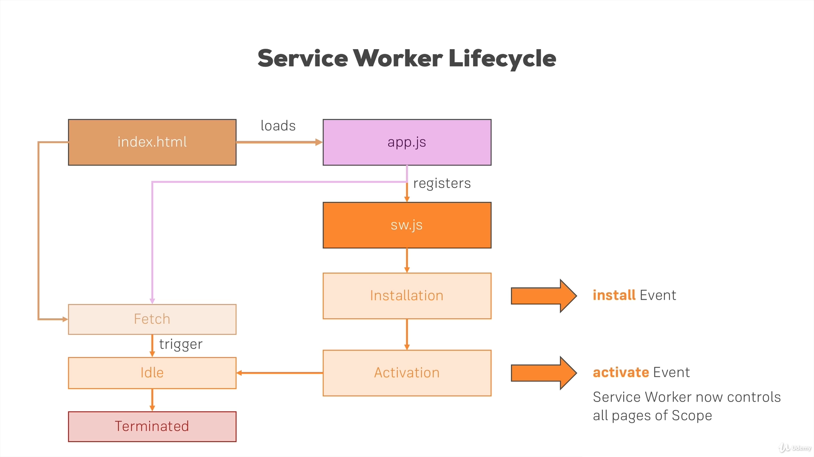
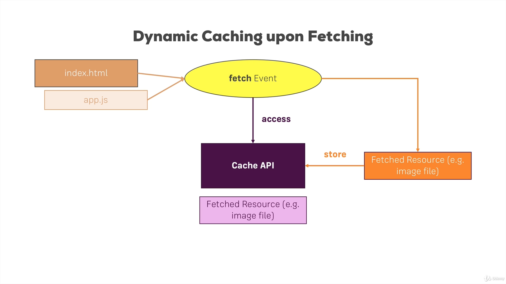
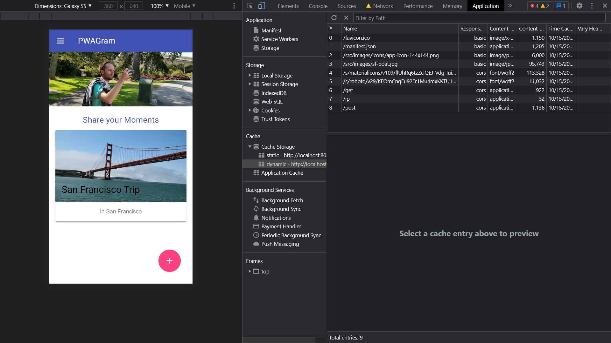

Started: 2021/10/10
End: 
Course Material: [Progressive Web App (PWA) - The Complete Guide](https://www.udemy.com/course/progressive-web-app-pwa-the-complete-guide/)

- [1. Understanding the App Manifest](#1-understanding-the-app-manifest)
  - [1.1. Using an App Manifest to Make your App Installable](#11-using-an-app-manifest-to-make-your-app-installable)
  - [1.2. Adding the Manifest](#12-adding-the-manifest)
  - [1.3. Understanding App Manifest Properties](#13-understanding-app-manifest-properties)
  - [1.4. Adding Properties to the App Manifest](#14-adding-properties-to-the-app-manifest)
  - [1.5. PWAs and Browser Support](#15-pwas-and-browser-support)
  - [1.6. Using the Chrome Developer Tools](#16-using-the-chrome-developer-tools)
  - [1.7. Simulating the Web App on an Emulator](#17-simulating-the-web-app-on-an-emulator)
  - [1.8. Installing the Web App - Prerequisties](#18-installing-the-web-app---prerequisties)
  - [1.9. Adding Properties for Safari](#19-adding-properties-for-safari)
  - [1.10. Adding Properties for the Internet Explorer](#110-adding-properties-for-the-internet-explorer)
- [2. The Service Workers](#2-the-service-workers)
  - [2.1. Why Service Workers are Aamazing](#21-why-service-workers-are-aamazing)
  - [2.2. Understanding Service Worker Events](#22-understanding-service-worker-events)
  - [2.3. The Service Worker Lifecycle](#23-the-service-worker-lifecycle)
  - [2.4. Service Worker Browser Support](#24-service-worker-browser-support)
  - [2.5. Registering a Service Worker](#25-registering-a-service-worker)
  - [2.6. Reacting to Incoming Events (in SW)](#26-reacting-to-incoming-events-in-sw)
  - [2.7. Updating and Activating Service Worker](#27-updating-and-activating-service-worker)
  - [2.8. Non-Lifecycle Events](#28-non-lifecycle-events)
  - [2.9. Getting that "App Install Banner"](#29-getting-that-app-install-banner)
  - [2.10. Testing the App on Real Device (and Installing the App)](#210-testing-the-app-on-real-device-and-installing-the-app)
  - [2.11. Deferring the App Install Banner](#211-deferring-the-app-install-banner)
  - [2.12. Service Worker FAQ](#212-service-worker-faq)
- [3. Promise and Fetch](#3-promise-and-fetch)
  - [3.1. Async Code in Javascript](#31-async-code-in-javascript)
  - [3.2. Promises - Basics](#32-promises---basics)
  - [3.3. Rejecting Promises](#33-rejecting-promises)
  - [3.4. Where we Use Promises in our Project](#34-where-we-use-promises-in-our-project)
  - [3.5. Fetch - Basics](#35-fetch---basics)
  - [3.6. Sending Post Requests via Fetch](#36-sending-post-requests-via-fetch)
  - [3.7. Fetch and CORS](#37-fetch-and-cors)
  - [3.8. Comparing Fetch and Ajax](#38-comparing-fetch-and-ajax)
  - [3.9. Adding Polyfills (for Legacy Browser Support)](#39-adding-polyfills-for-legacy-browser-support)
- [4. Service Workers - Caching](#4-service-workers---caching)
  - [4.1. Why Caching](#41-why-caching)
  - [4.2. Understanding the Cache API](#42-understanding-the-cache-api)
  - [4.3. Browser Support](#43-browser-support)
  - [4.4. Adjusting the Course Project](#44-adjusting-the-course-project)
  - [4.5. Indentifying (Pre-) Cacheable Items](#45-indentifying-pre--cacheable-items)
  - [4.6. Static Caching/Precaching](#46-static-cachingprecaching)
  - [4.7. Retrieving Items from the Cache](#47-retrieving-items-from-the-cache)
  - [4.8. Adding and Retrieving Multiple Files (to/from Cache)](#48-adding-and-retrieving-multiple-files-tofrom-cache)
  - [4.9. Cache Multiple Files with addAll](#49-cache-multiple-files-with-addall)
  - [4.10. Dynamic Caching - The Basics](#410-dynamic-caching---the-basics)
  - [4.11. Implementing Dynamic Caching](#411-implementing-dynamic-caching)
  - [4.12. Handling Errors](#412-handling-errors)
  - [4.13. Adding Cache Versioning](#413-adding-cache-versioning)
  - [4.14. Different Cache Versions and Cleanup](#414-different-cache-versions-and-cleanup)
  - [4.15. Optimizing Cache Management](#415-optimizing-cache-management)
  - [Assignment 2: Time to Practice: Service Workers and Caching](#assignment-2-time-to-practice-service-workers-and-caching)
- [5. Service Workers - Advanced Caching](#5-service-workers---advanced-caching)
  - [5.1. Module Preparation: Adding a Button](#51-module-preparation-adding-a-button)
  - [5.2. Offering "Cache on Demand"](#52-offering-cache-on-demand)
  - [5.3. Providing an Offline Fallback Page](#53-providing-an-offline-fallback-page)
  - [5.4. Strategy: Cache with Network Fallback](#54-strategy-cache-with-network-fallback)
  - [5.5. Strategy: Cache Only](#55-strategy-cache-only)
  - [5.6. Strategy: Network Only](#56-strategy-network-only)
  - [5.7. Strategy: Network with Cache Fallback](#57-strategy-network-with-cache-fallback)
  - [5.8. Strategy: Cache then Network](#58-strategy-cache-then-network)
  - [5.9. Cache then Network and Dynamic Caching](#59-cache-then-network-and-dynamic-caching)
  - [5.10. Cache then Network with Offline Support](#510-cache-then-network-with-offline-support)
  - [5.11. Cache Strategies and "Routing"](#511-cache-strategies-and-routing)
  - [5.12. Applying Cache Only](#512-applying-cache-only)
  - [5.13. A Better Way of Parsing Static Cache URLs](#513-a-better-way-of-parsing-static-cache-urls)
  - [5.14. A Better Way of Serving Fallback Files](#514-a-better-way-of-serving-fallback-files)
  - [5.15. Post Request and Cache API](#515-post-request-and-cache-api)
  - [5.16. Cleaning/Trimming the Cache](#516-cleaningtrimming-the-cache)
  - [5.17. Getting Rid of a Service Worker](#517-getting-rid-of-a-service-worker)
  - [5.18. Preparing the Project for the Next Steps](#518-preparing-the-project-for-the-next-steps)
- [6. IndexedDB and Dynamic Data](#6-indexeddb-and-dynamic-data)
  - [6.1. Understanding the Basics](#61-understanding-the-basics)
  - [6.2. Setting Up Firebase](#62-setting-up-firebase)
  - [6.3. Connecting Frontend to Backend](#63-connecting-frontend-to-backend)
  - [6.4. Dynamic Caching vs. Caching Dynamic Content](#64-dynamic-caching-vs-caching-dynamic-content)
  - [6.5. Introducing IndexedDB](#65-introducing-indexeddb)
  - [6.6. IndexedDB Browser Support](#66-indexeddb-browser-support)
  - [6.7. Adding the IDB File](#67-adding-the-idb-file)
  - [6.8. Storing Fetched Posts in IndexedDB](#68-storing-fetched-posts-in-indexeddb)
  - [6.9. Using IndexedDB in the Service Worker](#69-using-indexeddb-in-the-service-worker)
  - [6.10. Reading Data from IDB](#610-reading-data-from-idb)
  - [6.11. Clearing IDB and Handling Server-Client Mismatch](#611-clearing-idb-and-handling-server-client-mismatch)
  - [6.12. Implementing the Clear Database Method](#612-implementing-the-clear-database-method)
  - [6.13. Deleting Single Items from the Database](#613-deleting-single-items-from-the-database)
  - [6.14. IndexedDB and Caching Strategies](#614-indexeddb-and-caching-strategies)
- [7. Creating a Responsive user Interface (UI)](#7-creating-a-responsive-user-interface-ui)
  - [7.1. Responsive Design in this Course](#71-responsive-design-in-this-course)
  - [7.2. Responsive Design in this Course](#72-responsive-design-in-this-course)
  - [7.3. Understanding Responsive Design in our Project](#73-understanding-responsive-design-in-our-project)
  - [7.4. CSS and Media Queries](#74-css-and-media-queries)
  - [7.5. Using Images in a Responsive Way](#75-using-images-in-a-responsive-way)
  - [7.6. Adding Animations](#76-adding-animations)
  - [7.7. The Viewport and Scaling](#77-the-viewport-and-scaling)
- [8. Background Sync](#8-background-sync)
  - [8.1. Hwo does Background Sync Work](#81-hwo-does-background-sync-work)
  - [8.2. Adding the Basic Setup to our Project](#82-adding-the-basic-setup-to-our-project)
  - [8.3. Registering a Synchronization Task](#83-registering-a-synchronization-task)
  - [8.4. Storing our Post in IndexedDB](#84-storing-our-post-in-indexeddb)
  - [8.5. Adding a Fallback](#85-adding-a-fallback)
  - [8.6. Syncing Data in the Service Worker](#86-syncing-data-in-the-service-worker)
  - [8.7. Understanding Periodic Sync](#87-understanding-periodic-sync)
  - [8.8. Adding Server Side Code](#88-adding-server-side-code)
  - [8.9. Fixing Errors](#89-fixing-errors)
- [9. Web Push Notifications](#9-web-push-notifications)
  - [9.1. Why we need Web Push Notifications](#91-why-we-need-web-push-notifications)
  - [9.2. How Push and Notifications Work](#92-how-push-and-notifications-work)
  - [9.3. Displaying Notifications - Some Theory First](#93-displaying-notifications---some-theory-first)
  - [9.4. Browser Support](#94-browser-support)
  - [9.5. Requesting Permissions](#95-requesting-permissions)
  - [9.6. Displaying Notifications](#96-displaying-notifications)
  - [9.7. Notifications from Within the Service Worker](#97-notifications-from-within-the-service-worker)
  - [9.8. Understanding Notification Options](#98-understanding-notification-options)
  - [9.9. Advanced Options](#99-advanced-options)
  - [9.10. Adding Actions to Notifications](#910-adding-actions-to-notifications)
  - [9.11. Reacting to Notification Interaction - Clicks](#911-reacting-to-notification-interaction---clicks)
  - [9.12. Reacting to Notification Interaction - Closing](#912-reacting-to-notification-interaction---closing)
  - [9.13. From Notifications to Push Messages](#913-from-notifications-to-push-messages)
  - [9.14. Creating a Push Subscription](#914-creating-a-push-subscription)
  - [9.15. Storing Subscription](#915-storing-subscription)
  - [9.16. Connecting Server and Client (PWA)](#916-connecting-server-and-client-pwa)
  - [9.17. Sending Push Messges from the Server](#917-sending-push-messges-from-the-server)
  - [9.18. Listening to Push Message](#918-listening-to-push-message)
  - [9.19. Displaying Push Notification on a Real Device](#919-displaying-push-notification-on-a-real-device)
  - [9.20. Opening a Page upon User Interaction](#920-opening-a-page-upon-user-interaction)
  - [9.21. Improving our Code](#921-improving-our-code)
- [10. Native Device Features](#10-native-device-features)
  - [10.1. Preparing the Project](#101-preparing-the-project)
  - [10.2. Getting DOM Access](#102-getting-dom-access)
  - [10.3. Creating our own Polyfills](#103-creating-our-own-polyfills)
  - [10.4. Getting the Video Image](#104-getting-the-video-image)
  - [10.5. Hooking Up the Capture Button](#105-hooking-up-the-capture-button)
  - [10.6. Storing the Image on a Server](#106-storing-the-image-on-a-server)
  - [10.7. Accepting File Upload Example with Firebase](#107-accepting-file-upload-example-with-firebase)
  - [10.8. Testing the Camera and Upload](#108-testing-the-camera-and-upload)
  - [10.9. Implementing a Fallback](#109-implementing-a-fallback)
  - [10.10. Getting the User Position](#1010-getting-the-user-position)
  - [10.11. Fixing Bugs](#1011-fixing-bugs)
  - [10.12. Testing the App on a Real Device](#1012-testing-the-app-on-a-real-device)
- [11. Service Worker Management with Workbox](#11-service-worker-management-with-workbox)
  - [11.1. Understanding the Basics](#111-understanding-the-basics)
  - [11.2. Installing Workbox and Using it](#112-installing-workbox-and-using-it)
  - [11.3. Configuring Workbox Precaching](#113-configuring-workbox-precaching)
  - [11.4. Customizing the Service Worker](#114-customizing-the-service-worker)
  - [11.5. Implementing Routing with the Workbox Router](#115-implementing-routing-with-the-workbox-router)
  - [11.6. Expanding Dynamic Caching](#116-expanding-dynamic-caching)
  - [11.7. Options and Setting Up Strategies](#117-options-and-setting-up-strategies)
  - [11.8. Custom Handlers (Example: For IndexedDB)](#118-custom-handlers-example-for-indexeddb)
  - [11.9. Providing an Offline HTML Fallback](#119-providing-an-offline-html-fallback)
  - [11.10. Handling Background Synchronisation and Push Notification](#1110-handling-background-synchronisation-and-push-notification)
  - [11.11. Understanding the Workbox Documentation](#1111-understanding-the-workbox-documentation)
  - [11.12. Enhancing the Build Workflow](#1112-enhancing-the-build-workflow)
  - [11.13. Running our App on a Real Server](#1113-running-our-app-on-a-real-server)
  - [11.14. Auditing our Webpage with Lighthouse](#1114-auditing-our-webpage-with-lighthouse)
- [12. SPAs and PWAs](#12-spas-and-pwas)
  - [12.1. React with create-react-app](#121-react-with-create-react-app)
  - [12.2. A General Note about SPAs and PWAs](#122-a-general-note-about-spas-and-pwas)
  - [12.3. Angular with the CLI](#123-angular-with-the-cli)
  - [12.4. Vue with Vue CLI](#124-vue-with-vue-cli)

---

# 1. Understanding the App Manifest
## 1.1. Using an App Manifest to Make your App Installable
1. This `Manifest` is a single file that allows the users to add or "install" the web page on the home screen of a mobile device as an app.

## 1.2. Adding the Manifest
1. We can add `manifest.json` to the root directory of the web. In this case, we put in the `public` folder which is directory storing `index.html`.
2. Then we add a `link` referring to `manifest.json` in all the HTML file that we will serve. If we are creating a SPA with React or Vue, we can simply add this into the entry, single `index.html`.
  ```html
  <html>
    <link rel="manifest" href="/manifest.json">
  </html>
  ```

## 1.3. Understanding App Manifest Properties
1. We can give a `name` property for the PWA which is different from the "title" of the HTML file. This is the long name of the app and will show such as when using on the "Splashscreen".
2. A `short_name` can be given and will be shown belown the icon.
3. `start_url` is to indicate which page to load on startup. Note that this is very different from the URL we type in the search bar in a browser that is handled by a DNS. 
4. `scope` is to show which pages are included in the PWA experience. 
5. `display` can be set `standalone` to make the app looks like a standalone app. This includes options such as `standalone`, `fullscreen`, `minimal-ui`, `browser`. 
6. `background_color` can set the background color whilst loading and on Splashscreen. 
7. `theme_color` is the Theme color of the app which can affect components such as the top bar in task switcher.
8. `orientation` is used to set and enforce default orientation of the app. It may be `any`, `portrait`, `landscape`, `portrait-primary`.
9. Other properties can be also useful to set up in the manifest files in the JSON sample below.
  ```json
  // manifest.json
  {
    "name": "", // long name of the app (e.g. Splashscreen)
    "short_name": "", // short name of the app (e.g. below icon)
    "start_url" : "/index.html", // which page to load on startup
    "scope": ".", // which pages are included in "PWA experience"
    "display": "standalone", // should it look like a standalone app?
    "background_color": "#fff", // can set the background color whilst loading and on Splashscreen
    "theme_color": "#3F51B5", // theme color (e.g. on top bar in task switcher)
    "description": "Keep running", // description (e.g. favorite)
    "dir": "ltr", // read direction of the app
    "lang": "en-US", // main language of app
    "orientation": "portrait-primary", // set (and enforce) default orientation
    "icons": [ // configure icons (e.g. on homescreen)
      {
        "src": "/src/images/icons/app-icon-48x48.png", // icon path
        "type": "image/png", // image type
        "sizes": "48x48", // icon size, browser chooses best one for given device
      },
      {
        "src": "/src/images/icons/app-icon-96x96.png", // icon path
        "type": "image/png", // image type
        "sizes": "96x96", // icon size, browser chooses best one for given device
      },
    ], 
  },
  "related_application": [
    {
      "platform": "play",
      "url": "https://play.google.com/store/apps/details?id=com.example.app1",
      "id": "com.example.app1"
    }
  ]
  ```

## 1.4. Adding Properties to the App Manifest
```json
{
  "name": "Instagram as Progressive Web App",
  "short_name": "PWAGram",
  "icons": [
    {
      "src": "/src/images/icons/app-icon-48x48.png",
      "type": "image/png",
      "sizes": "48x48"
    },
    {
      "src": "/src/images/icons/app-icon-96x96.png",
      "type": "image/png",
      "sizes": "96x96"
    },
    {
      "src": "/src/images/icons/app-icon-144x144.png",
      "type": "image/png",
      "sizes": "144x144"
    },
    {
      "src": "/src/images/icons/app-icon-192x192.png",
      "type": "image/png",
      "sizes": "192x192"
    },
    {
      "src": "/src/images/icons/app-icon-256x256.png",
      "type": "image/png",
      "sizes": "256x256"
    },
    {
      "src": "/src/images/icons/app-icon-384x384.png",
      "type": "image/png",
      "sizes": "384x384"
    },
    {
      "src": "/src/images/icons/app-icon-512x512.png",
      "type": "image/png",
      "sizes": "512x512"
    }
  ],
  "start_url": "/index.html",
  "scope": ".",
  "display": "standalone",
  "orientation": "portrait-primary",
  "background_color": "#fff",
  "theme_color": "#3f51b5",
  "description": "A simple Instagram Clone, implementing a lot of PWA love.",
  "dir": "ltr",
  "lang": "en-US"
}
```

## 1.5. PWAs and Browser Support
1. Chrome at the time has the most compatibility to use PWA features.
2. We can check from "[caniuse](https://caniuse.com/?search=PWA)" to see if the browser has fully support on PWA features.

## 1.6. Using the Chrome Developer Tools
1. In Chrome browser, we can check on the developer console for detailed data.

## 1.7. Simulating the Web App on an Emulator
1. We can download android studio and install a virtual device on the computer to have an emulator of a sepcific android device. 
2. After installing android studio and the device, we can access the emulator from "Tools" > "AVD Manager".
3. However, if there's an android device available, we can access the local PWA via WIFI when starting up the project. Note that both the computer serving localhost and the mobile phone must connect to the same WIFI and there shouldn't be any gat threshold besides simple login connection.
4. The other way to work around is to have the android mobile phone having USB debugging and connect to computer with a cable. 

## 1.8. Installing the Web App - Prerequisties
1. We can visit [https://web.dev/customize-install/](https://web.dev/customize-install/) to check the latest requirements to prompt an install banner to let users easily download and add the PWA to their homescreens.

## 1.9. Adding Properties for Safari
1. We can add other tags in the HTML tag to enable the PWA works with Safari.
2. Note that Apple devices having their browser built on Safari and webkit, while these devices don't have fully support as the Chrome browsers on Android devices. 
3. For example, by the time learnig this course during Oct. 2021, "Push Notification" feature is still not available on PWAs on Apple devices.
  ```html
  <html>
    <!-- other tags of the HTML -->
    <link rel="manifest" href="/manifest.json" />
    <meta name="apple-mobile-web-app-capable" content="yes">
    <meta name="apple-mobile-web-app-status-bar-style" content="black">
    <meta name="apple-mobile-web-app-title" content="PWAGramiOS">
    <link rel="apple-touch-icon" href="/src/images/icons/app-icon-57x57.png" sizes="57x57">
    <link rel="apple-touch-icon" href="/src/images/icons/app-icon-60x60.png" sizes="60x60">
    <link rel="apple-touch-icon" href="/src/images/icons/app-icon-72x72.png" sizes="72x72">
    <link rel="apple-touch-icon" href="/src/images/icons/app-icon-114x114.png" sizes="114x114">
    <link rel="apple-touch-icon" href="/src/images/icons/app-icon-120x120.png" sizes="120x120">
    <link rel="apple-touch-icon" href="/src/images/icons/app-icon-144x144.png" sizes="144x144">
    <link rel="apple-touch-icon" href="/src/images/icons/app-icon-152x152.png" sizes="152x152">
    <link rel="apple-touch-icon" href="/src/images/icons/app-icon-180x180.png" sizes="180x180">
  </html>
  ```
## 1.10. Adding Properties for the Internet Explorer
1. For Internet Exploerer (though it's deprecated by Microsoft in Year 2021), we can specify some `meta` tags
  ```html
  <html>
    <meta name="msapplication-TileImage" content="/src/images/app-icon-144x144.png" />
    <meta name="msapplication-TileColor" content="#fff" />
    <!-- the following is a fallback which can be helpful on Chrome browser when manifest.json doesn't work -->
    <meta name="theme-color" content="#3F51B5" />
  </html>
  ```


# 2. The Service Workers
## 2.1. Why Service Workers are Aamazing
1. Service worker also works on one signle thread, while this thread is different from the regular context which attached to individual HTML pages.
2. It can be viewed as there is an additional thread, decoupled from HTML pages, and manage all pages of given scope. (e.g. all pages of a domain)

## 2.2. Understanding Service Worker Events
1. "Listenable" Events (in Service Worker) 
   1. **Fetch** - Browser or Page-related Javascript initiates a Fetch (Http request)
   2. **Push Notification** - Service worker receives Web Push Notification (from Server)
   3. **Notification Interaction** - User interacts with dsplayed Notification
   4. **Background Sync** - Service Worker receives Background Sync Event (e.g. Internet connection was restored)
   5. **Service Worker Lifecycle** - Service Worker Phase Changes

## 2.3. The Service Worker Lifecycle
1. When a page initiates, we can register a service worker to work on the background.


## 2.4. Service Worker Browser Support
1. We can check how different browsers in main stream supports service worker and PWA features.

## 2.5. Registering a Service Worker
1. To ensure service worker can work on all the pages, including pages in subfolders, we put the service worker registration javascript in the root directory. 
2. Note that we have the `npm start` script running with `-c-1` flag, which is to prevent browsers to use its default cache. 
3. Though we can put service worker directly in the HTML files, we will need to update all HTML files once the service worker is updated.
4. Besides, we can import the service worker to `app.js` in this case, as this file is used by both the `index.html` on the root and in `help` folder. Therefore, it can be a proper entry point for service worker. 
  ```js
  // app.js
  if ('serviceWorker' in navigator) {
    // this checks if browser supports service worker
    navigator.serviceWorker
      .register('/sw.js')
      .then(() => {
        console.log('service worker registered!');
      })
      .catch((err) => console.log(err));
  }
  ```

## 2.6. Reacting to Incoming Events (in SW)
1. We can pass a 2nd argument as an object when registering the service worker
  ```js
  // app.js
  if ('serviceWorker' in navigator) {
    // this checks if browser supports service worker
    navigator.serviceWorker
      .register('/sw.js', { scope: '/help/' }) // overwrite the scope
      .then(() => {
        console.log('service worker registered!');
      })
      .catch((err) => console.log(err));
  }
  ```
2. Service worker and manifest are 2 related files to PWAs but not compulsive to each other.
3. Besides, server worker only worker on HTTPS protocol. However, it does work on `localhost` for easier developing process.
  ```js
  self.addEventListener('install', (event) => {
    console.log('Service Worker Installing Service Worker...', event);
  });

  self.addEventListener('activate', (event) => {
    console.log('Service Worker Activating Service Worker...', event);
    return self.clients.claim();
  });
  ```

## 2.7. Updating and Activating Service Worker
1. When we reload the page, the service worker won't be activated immediately if it's updated because the browser tries to prevent 2 different versions of service having conflict.
2. In the developer console, we can click on "Update on reload" to update the service worker everytime it refreshes.

## 2.8. Non-Lifecycle Events
1. We can change the behavior of non-lifecycle event such as `fetch` in service worker.
2. This event handles all the fetching tasks such as importing css files with `link` tag and `img` tags for loading image and media.
  ```js
  // sw.js
  self.addEventListener('fetch', (event) => {
    console.log('Service Worker Fetching something...', event);
    event.respondWith(null); // this makes the page not accessible as nothing is fetched
    event.respondWith(fetch(event.request)); // this is like middleware to do something before fetching data
  });
  ```

## 2.9. Getting that "App Install Banner"
1. We can check the install criteria for PWAs. Chrome browser will prompt and ask if the user would like to install the PWA to the homescreen.
2. We can check more details at [https://web.dev/install-criteria/](https://web.dev/install-criteria)

## 2.10. Testing the App on Real Device (and Installing the App)
1. We can open debug mode on android devices and use USB cable to connect to a laptop or PC.
2. Follow the instruction from [https://developer.chrome.com/docs/devtools/remote-debugging/](https://developer.chrome.com/docs/devtools/remote-debugging/) to access the device from the desktop.
3. This process can be tricky to get them work on both the mobile and desktop device. Note that we may need to restart the service after certain changes.
4. This feature is to help developers to check app behavior on a real mobile device.
5. However, the approach didn't really work to allow adding the app from developer console to the homescreen.
6. This prompt is triggered automatically by Chrome browser when it meets the following criteria.
   1. The web app is not already installed
   2. Meets a user engagement heuristic
   3. Be served over HTTPS
   4. Includes a web app manifest that includes:
      1. `short_name` or `name`
      2. `icons` - must include a 192px and a 512px icon
      3. `start_url`
      4. `display` - must be one of `fullscreen`, `standalone`, or `minimal-ui`
      5. `prefer_related_applications` must not be present, or be false
   5.  Registers a service worker with a fetch handler

## 2.11. Deferring the App Install Banner
1. Besides the default installation prompt, we can change the behavior and all the app prompt installation to user by using `beforeinstallprompt` event handler.
2. 
  ```js
  // app.js
  var deferredPrompt; // take event argument from the callback function

  if ('serviceWorker' in navigator) {
    navigator.serviceWorker.register('/sw.js').then(function () {
      console.log('Service worker registered!');
    });
  }

  // change default beforeinstallprompt event
  window.addEventListener('beforeinstallprompt', function (event) {
    console.log('beforeinstallprompt fired');
    event.preventDefault();
    deferredPrompt = event;
    return false;
  });
  ```
2. In `feed.js`, we can update the event handler when the user clicks on adding new posts.
  ```js
  // feed.js
  function openCreatePostModal() {
    createPostArea.style.display = 'block';
    if (deferredPrompt) {
      deferredPrompt.prompt();

      deferredPrompt.userChoice.then(function (choiceResult) {
        console.log(choiceResult.outcome);

        if (choiceResult.outcome === 'dismissed') {
          console.log('User cancelled installation');
        } else {
          console.log('User added to home screen');
        }
      });

      deferredPrompt = null;
    }
  }
  ```

## 2.12. Service Worker FAQ
1. There some features of service workers that we may be aware of. 
2. If file of service worker is exactly the same, the browser won't reinstall the service worker though the page is reloaded.
3. However, if the file has been changed, even 1 byte, will trigger the process.
4. We can check service workers in `navigator` API and unregister them.
  ```js
  navigator.serviceWorker.getRegistrations().then(function(registrations) {
    for(let registration of registrations) {
      registration.unregister()
    } 
  });
  ```
5. Some useful links
   1. Are Service Workers Ready? - Check Browser Support: [https://jakearchibald.github.io/isserviceworkerready/](https://jakearchibald.github.io/isserviceworkerready/)
   2. Setting up Remote Debugging on Chrome: [https://developers.google.com/web/tools/chrome-devtools/remote-debugging/](https://developers.google.com/web/tools/chrome-devtools/remote-debugging/)
   3. Getting that "Web App Install Banner": [https://developers.google.com/web/fundamentals/engage-and-retain/app-install-banners/](https://developers.google.com/web/fundamentals/engage-and-retain/app-install-banners/)
   4. Getting Started with Service Workers: [https://developers.google.com/web/fundamentals/getting-started/primers/service-workers](https://developers.google.com/web/fundamentals/getting-started/primers/service-workers)


# 3. Promise and Fetch
## 3.1. Async Code in Javascript
1. Javascript in different context have different behavior.
2. We can use callback functions to work on the response provide asynchronous behavior. However, the functions will be nested 
  ```js  
  setTimeout(function () {
    resolve('This is executed once timer is done');
    // console.log('This is executed once timer is done');
  }, 3000);
  ```

## 3.2. Promises - Basics
## 3.3. Rejecting Promises
1. We can use `Promise` to handle asynchronous code in Javascript.
2. To work with `Promise` instance in Javascript, we can use `then` and `catch` method to handle with `resolve` and `reject` function according to the response.
  ```js
  var promise = new Promise((resolve, reject) => {
    setTimeout(function () {
      // resolve('This is executed once timer is done');
      // console.log('This is executed once timer is done');
      reject({ code: 500, message: 'An error occurred!' });
    }, 3000);
  });

  promise
    .then((text) => {
      console.log(text);
      return text;
    })
    .then((newText) => {
      console.log(newText);
    })
    .catch((err) => {
      console.log(err.code, err.message);
    });
  ```
3. Besides using `catch`, we can pass a 2nd argument to `then` to handle error response. Note that readability of this syntax is relatively low.

## 3.4. Where we Use Promises in our Project
1. In most of the cases, we don't need to create `Promise` instance by our own. 
2. We use it when using `fetch` API to requset data remotely. 

## 3.5. Fetch - Basics
```js
fetch(`https://httpbin.org/ip`)
  .then((res) => res.json())
  .then((data) => console.log(data))
  .catch((err) => console.log(err));
```

## 3.6. Sending Post Requests via Fetch
```js
fetch(`https://httpbin.org/post`, {
  method: 'POST',
  headers: {
    'Content-Type': 'application/json',
    Accept: 'application/json',
  },
  body: JSON.stringify({
    message: 'Does this work',
  }),
})
  .then((res) => res.json())
  .then((data) => console.log(data))
  .catch((err) => console.log(err));
```

## 3.7. Fetch and CORS
1. We can set `mode` as an option passing to `fetch` API which will turn the `body` of response as `null`. This can be used in some scenario that the app doesn't consume the data directly such as fetching image to render by `img` tag.
  ```js
  fetch(`https://httpbin.org/post`, {
    method: 'POST',
    headers: {  
      'Content-Type': 'application/json',
      Accept: 'application/json',
    },
    mode: 'cors', // no-cors
    body: JSON.stringify({
      message: 'Does this work',
    }),
  })
  ```

## 3.8. Comparing Fetch and Ajax
1. `xhr` has relatively complicated syntax when working on HTTP requests. 
2. Besides, it doesn't work in asynchronous scenario, so it can be better to use `fetch` API when fetching data with HTTP protocol.
```js
// using XMLHttpRequest
var xhr = new XMLHttpRequest();
xhr.open('GET', 'https://httpbin.org/ip');
xhr.responseType = 'json';

xhr.onload = function () {
  console.log(xhr.response);
};

xhr.onerror = function () {
  console.log('error');
};

xhr.send();
```

## 3.9. Adding Polyfills (for Legacy Browser Support)
1. Older browser doesn't work with native `fetch` and `Promise`.
2. We can use polyfill code with older Javascript syntax to work instead.
  ```js
  // app.js
  if (!window.Promise) { 
    // check if the browser supports native Promise
    // if not, it will use the code from polyfill 
    window.Promise = Promise;
  }
  ```


# 4. Service Workers - Caching
## 4.1. Why Caching
1. In some scenarios, such as poor connection, no connection (e.g. in an elevator), or poor WI-FI connection, this feature can be very useful.

## 4.2. Understanding the Cache API
1. The cache API provides another way to store data locally. It simply provdies `key (request)/value (response)` pair. 
2. Cache API can be accessed by both "service worker" and "normal" Javascript.
3. Cache data can be retrieved instead of sending Network Request.

## 4.3. Browser Support
[https://developer.mozilla.org/en-US/docs/Web/API/Cache](https://developer.mozilla.org/en-US/docs/Web/API/Cache)

## 4.4. Adjusting the Course Project
## 4.5. Indentifying (Pre-) Cacheable Items
1. The project has another card added to the app which is a (fake) dynamic content that the app fetched with `fetch` API.
2. In an App, we can cache the "shells" which are the static UI such as the top and side navigation bar, text, and buttons.

## 4.6. Static Caching/Precaching
1. We can create and store files as caches with `caches` API, which returns a `Promise` instance that we can use both `then` and `catch` to handle it.
2. If we update service worker, the app will reinstall the service.
3. However, until this point, it still doesn't work offline because we only store the cache but don't use it.
  ```js
  // sw.js
  self.addEventListener('install', function (event) {
    console.log('[Service Worker] Installing Service Worker ...', event);
    event.waitUntil(
      caches.open('static').then((cache) => {
        console.log('Service Worker Precaching App Shell');
        cache.add('/src/js/app.js');
      }),
    ); // event.waitUntil returns a promise
  });
  ```

## 4.7. Retrieving Items from the Cache
1. After storing the data in `caches` we can use `caches.match` to retrive data from cache API.
2. 
  ```js
  self.addEventListener('fetch', function (event) {
    // console.log('[Service Worker] Fetching something ....', event);
    event.respondWith(
      caches.match(event.request).then((response) => {
        if (response) return response;
        return fetch(event.request);
      }),
    );
  });
  ```

## 4.8. Adding and Retrieving Multiple Files (to/from Cache)
1. When we catch the data such as `index.html` on the root route, it doesn't fulfill when the user tries to access the root route as the user is trying to access `/` rather than `/index.html`.
2. Therefore, to ensure the user can access `index.html` in offline mode, we need to add both `/` and `/index.html` on cache.
  ```js
  self.addEventListener('install', function (event) {
    console.log('[Service Worker] Installing Service Worker ...', event);
    event.waitUntil(
      caches.open('static').then((cache) => {
        console.log('Service Worker Precaching App Shell');
        cache.add('/'); // this is cached to redner index.html
        cache.add('/index.html'); // this file will be rendered on root route '/'
        cache.add('/src/js/app.js');
      }),
    ); // event.waitUntil returns a promise
  });
  ```

## 4.9. Cache Multiple Files with addAll
1. With regular `add` approach, we may need to add on multiple files to make sure the app can work offline in different lines.
2. We can use `addAll` instead by passing an array of files that we want to cache.
3. We can ignore and don't add polyfill files to be cached as they have no use on modern browsers, and since old browser doesn't support such feature, there's no use to cache the files.
  ```js
  self.addEventListener('install', function (event) {
    console.log('[Service Worker] Installing Service Worker ...', event);
    event.waitUntil(
      caches.open('static').then((cache) => {
        console.log('Service Worker Precaching App Shell');
        cache.addAll([
          '/',
          '/index.html',
          '/src/js/app.js',
          '/src/js/feed.js',
          '/src/js/promise.js',
          '/src/js/fetch.js',
          '/src/js/material.min.js',
          '/src/css/app.css',
          '/src/css/feed.css',
          '/src/images/main-image.jpg',
          'https://fonts.googleapis.com/css?family=Roboto:400,700',
          'https://fonts.googleapis.com/icon?family=Material+Icons',
          'https://cdnjs.cloudflare.com/ajax/libs/material-design-lite/1.3.0/material.indigo-pink.min.css',
        ]);
      }),
    ); 
  });
  ```

## 4.10. Dynamic Caching - The Basics


## 4.11. Implementing Dynamic Caching
1. We can modify the `fetch` event on service worker.
2. If the app is going to fetch, it checks if the data is stored in cache. If not, it makes fetch request as in regular cases.
3. With dynamic caching, the app only caches the routes and data where the user visits. For example, if the user has never been to `/help` before turning to offline, the app doesn't work when the user access the route in offline mode because there's no data cached.
  ```js
  self.addEventListener('fetch', function (event) {
    // console.log('[Service Worker] Fetching something ....', event);
    event.respondWith(
      caches.match(event.request).then((response) => {
        if (response) {
          return response;
        } else {
          // chaining here as to deal only on real request
          return fetch(event.request).then((res) => {
            caches.open('dynamic').then((cache) => {
              console.log('dynamic');
              // put does similar to add but needs the developer to put key/value pair
              cache.put(event.request.url, res.clone());
              // without returning the response, the app doesn't work on the first fetch as it gets nothing back
              // it only works after the app reload as the response data is cached
              // we can prevent this behavior by returning the response from the first fetch
              console.log(res);
              return res;
            });
          });
        }
      }),
    );
  });
  ```
  

## 4.12. Handling Errors
1. We can add a catch on the promise. 
2. There's an error caused when the app is going to register the service worker in the offline mode.
3. We shouldn't register it because it can bring us into an infinitive loop that the app keeps using the older verion of the service worker from the cache.
  ```js
  // sw.js
  self.addEventListener('fetch', function (event) {
    event.respondWith(
      caches.match(event.request).then((response) => {
        if (response) {
          return response;
        } else {
          return fetch(event.request)
            .then((res) => {
              caches.open('dynamic').then((cache) => {
                cache.put(event.request.url, res.clone());
                return res;
              });
            })
            .catch((err) => {}); // add to catch error
        }
      }),
    );
  }
  ```

## 4.13. Adding Cache Versioning
1. In most of the cases, we wouldn't want to cache JSON data but files such as images, HTML, CSS, and Javascript. 
2. If we update the Javascript file for different features and behavior, the app isn't updated right away because it's using the older Javascript from the cache.
3. For example, we can adjust `feed.js` and use Javascript to change the color of the title in a card.
  ```js
  // feed.js
  function createCard() {
    var cardWrapper = document.createElement('div');
    cardWrapper.className = 'shared-moment-card mdl-card mdl-shadow--2dp';
    var cardTitle = document.createElement('div');
    cardTitle.className = 'mdl-card__title';
    cardTitle.style.backgroundImage = 'url("/src/images/sf-boat.jpg")';
    cardTitle.style.backgroundSize = 'cover';
    cardTitle.style.height = '180px';
    cardWrapper.appendChild(cardTitle);
    var cardTitleTextElement = document.createElement('h2');
    // change color to white
    cardTitleTextElement.style.color = 'white'; 
    
    cardTitleTextElement.className = 'mdl-card__title-text';
    cardTitleTextElement.textContent = 'San Francisco Trip';
    cardTitle.appendChild(cardTitleTextElement);
    var cardSupportingText = document.createElement('div');
    cardSupportingText.className = 'mdl-card__supporting-text';
    cardSupportingText.textContent = 'In San Francisco';
    cardSupportingText.style.textAlign = 'center';
    cardWrapper.appendChild(cardSupportingText);
    componentHandler.upgradeElement(cardWrapper);
    sharedMomentsArea.appendChild(cardWrapper);
  }
  ```
4. However, if we update `sw.js` for any trivial change such as adding comment which has no effect on the code itself, the service worker will be reinstalled and the Javascript is fetched again and get updated.
5. Nevertheless, this is no an ideal solution to update the content of `sw.js` for no specific purpose. 
6. In this case, we can create cache by `caches.open` with a different name.
  ```js
  // sw.js
  self.addEventListener('install', function (event) {
  console.log('[Service Worker] Installing Service Worker ...', event);
  event.waitUntil(
    // cache all files with different name for versioning
    caches.open('static-v2').then((cache) => {
      cache.addAll([
        // files to cache...
      ])
    });
  );
  ```
7. After updating both code and `sw.js`, we can reload the page and activate the new service worker from developer console.
8. However, as now we have 2 versions of caches, the app can find the required files from either of the caches. 
9. We can check the strategies and clean up the files to prevent using files in the wrong version.

## 4.14. Different Cache Versions and Cleanup
1. In service worker, there are different stages like lifecycle hooks in frontend framework.
2. For example, to clean up the cahces, we can do the process in `activate` event handler.
3. In this case, we remove all the caches that is not in the new version and in the `dynamic` category.
  ```js
  // sw.js
  self.addEventListener('activate', function (event) {
    console.log('[Service Worker] Activating Service Worker ....', event);
    event.waitUntil(
      caches.keys().then((keyList) => {
        // Promise.all method will wait for an array of promise instance to be done
        return Promise.all(
          keyList.map((key) => {
            if (key !== 'static-v2' && key !== 'dynamic') {
              console.log('[Service Worker] Removing old cache', key);
              return caches.delete(key);
            }
          }),
        );
      }),
    );
    return self.clients.claim();
  });
  ```
4. The solution is still not ideal that we have to keep updating the naming for the cache.
  ```js
  // sw.js
  self.addEventListener('install', function (event) {
    console.log('[Service Worker] Installing Service Worker ...', event);
    event.waitUntil(
      // this needs to update for different versions
      caches.open('static-v3').then((cache) => { 
        console.log('Service Worker Precaching App Shell');
        cache.addAll([
          // ...files to cache
        ]);
      }),
    );
  });

  self.addEventListener('activate', function (event) {
    console.log('[Service Worker] Activating Service Worker ....', event);
    event.waitUntil(
      caches.keys().then((keyList) => {
        // Promise.all method will wait for an array of promise instance to be done
        return Promise.all(
          keyList.map((key) => {
            // this needs to update for different versions of caches
            if (key !== 'static-v3' && key !== 'dynamic') {
              console.log('[Service Worker] Removing old cache', key);
              return caches.delete(key);
            }
          }),
        );
      }),
    );
    return self.clients.claim();
  });
  ```

## 4.15. Optimizing Cache Management
1. We can have a local variable to store the string name of the version we want, so we don't need to update the values in code directly but on the variables.
  ```js
  // sw.js
  const CACHE_STATIC_NAME = 'static-v4';
  const CACHE_DYNAMIC_NAME = 'dynamic-v2';
  ```

## Assignment 2: Time to Practice: Service Workers and Caching
1. When we firstly initiate the app for assignment, we may find the app on `http://localhost:8080` is still using the old caches from the other app. 
2. We can go to 'Application' in developer console and clear all site data to clear the caches and records.
  ```js
  // main.js
  if ('serviceWorker' in navigator) {
    navigator.serviceWorker
      .register('/sw.js')
      .then((registration) => {
        console.log('Service worker registered!');
        console.log(registration.scope);
      })
      .catch((error) => console.log(error));
  }
  
  // sw.js
  const CACHE_STATIC_NAME = 'static';
  const CACHE_DYNAMIC_NAME = 'dynamic';

  self.addEventListener('install', (event) => {
    console.log('skip waiting');
    self.skipWaiting();

    console.log('[Service Worker] Installing Service Worker ...', event);
    const precache = async () => {
      const cache = await caches.open(CACHE_STATIC_NAME);

      console.log('Service Worker Precaching App Shell');
      return cache.addAll([
        '/',
        '/index.html',
        '/src/css/app.css',
        '/src/css/main.css',
        '/src/js/main.js',
        '/src/js/material.min.js',
        'https://fonts.googleapis.com/css?family=Roboto:400,700',
        'https://fonts.googleapis.com/icon?family=Material+Icons',
        'https://cdnjs.cloudflare.com/ajax/libs/material-design-lite/1.3.0/material.indigo-pink.min.css',
      ]);
    };

    // waitUntil resolve Promise instances
    // precache returns a Promise which is created from cache.addAll
    // installation will be considered failed if the Promise can't be resolved
    event.waitUntil(precache());
  });

  self.addEventListener('activate', (event) => {
    console.log('[Service Worker] Activating Service Worker ....', event);
    event.waitUntil(
      caches.keys().then((keyList) => {
        return Promise.all(
          keyList.map((key) => {
            if (key !== CACHE_STATIC_NAME && key !== CACHE_DYNAMIC_NAME) {
              console.log('[Service Worker] Removing old cache', key);
              return caches.delete(key);
            }
          }),
        );
      }),
    );
    return self.clients.claim();
  });

  self.addEventListener('fetch', (event) => {
    // console.log('[Service Worker] Fetching something ....', event);
    event.respondWith(
      (async () => {
        // event.respondWith interacts with a response or a Promise instance
        try {
          const cachedResponse = await caches.match(event.request);
          if (cachedResponse) {
            // use files from caches
            return cachedResponse;
          } else {
            // dynamic caching
            const response = await fetch(event.request);
            const cache = await caches.open(CACHE_DYNAMIC_NAME);
            // response.clone is used as response can only be used once by it's nature
            // without cloning the response, the user can't get the response and can cause error
            cache.put(event.request.url, response.clone());
            return response;
          }
        } catch (err) {
          console.log(err);
        }
      })(),
    );
  });
  ```

# 5. Service Workers - Advanced Caching
## 5.1. Module Preparation: Adding a Button
## 5.2. Offering "Cache on Demand"
## 5.3. Providing an Offline Fallback Page
## 5.4. Strategy: Cache with Network Fallback
## 5.5. Strategy: Cache Only
## 5.6. Strategy: Network Only
## 5.7. Strategy: Network with Cache Fallback
## 5.8. Strategy: Cache then Network 
## 5.9. Cache then Network and Dynamic Caching
## 5.10. Cache then Network with Offline Support
## 5.11. Cache Strategies and "Routing"
## 5.12. Applying Cache Only
## 5.13. A Better Way of Parsing Static Cache URLs
## 5.14. A Better Way of Serving Fallback Files
## 5.15. Post Request and Cache API
## 5.16. Cleaning/Trimming the Cache
## 5.17. Getting Rid of a Service Worker
## 5.18. Preparing the Project for the Next Steps
# 6. IndexedDB and Dynamic Data
## 6.1. Understanding the Basics
## 6.2. Setting Up Firebase
## 6.3. Connecting Frontend to Backend
## 6.4. Dynamic Caching vs. Caching Dynamic Content
## 6.5. Introducing IndexedDB
## 6.6. IndexedDB Browser Support
## 6.7. Adding the IDB File
## 6.8. Storing Fetched Posts in IndexedDB
## 6.9. Using IndexedDB in the Service Worker
## 6.10. Reading Data from IDB
## 6.11. Clearing IDB and Handling Server-Client Mismatch
## 6.12. Implementing the Clear Database Method
## 6.13. Deleting Single Items from the Database
## 6.14. IndexedDB and Caching Strategies
# 7. Creating a Responsive user Interface (UI)
## 7.1. Responsive Design in this Course
## 7.2. Responsive Design in this Course
## 7.3. Understanding Responsive Design in our Project
## 7.4. CSS and Media Queries
## 7.5. Using Images in a Responsive Way
## 7.6. Adding Animations
## 7.7. The Viewport and Scaling
# 8. Background Sync
## 8.1. Hwo does Background Sync Work
## 8.2. Adding the Basic Setup to our Project
## 8.3. Registering a Synchronization Task
## 8.4. Storing our Post in IndexedDB
## 8.5. Adding a Fallback
## 8.6. Syncing Data in the Service Worker
## 8.7. Understanding Periodic Sync
## 8.8. Adding Server Side Code
## 8.9. Fixing Errors
# 9. Web Push Notifications
## 9.1. Why we need Web Push Notifications
## 9.2. How Push and Notifications Work
## 9.3. Displaying Notifications - Some Theory First
## 9.4. Browser Support
## 9.5. Requesting Permissions
## 9.6. Displaying Notifications
## 9.7. Notifications from Within the Service Worker
## 9.8. Understanding Notification Options
## 9.9. Advanced Options
## 9.10. Adding Actions to Notifications
## 9.11. Reacting to Notification Interaction - Clicks
## 9.12. Reacting to Notification Interaction - Closing
## 9.13. From Notifications to Push Messages
## 9.14. Creating a Push Subscription
## 9.15. Storing Subscription
## 9.16. Connecting Server and Client (PWA)
## 9.17. Sending Push Messges from the Server
## 9.18. Listening to Push Message
## 9.19. Displaying Push Notification on a Real Device
## 9.20. Opening a Page upon User Interaction
## 9.21. Improving our Code
# 10. Native Device Features
## 10.1. Preparing the Project
## 10.2. Getting DOM Access
## 10.3. Creating our own Polyfills
## 10.4. Getting the Video Image
## 10.5. Hooking Up the Capture Button
## 10.6. Storing the Image on a Server
## 10.7. Accepting File Upload Example with Firebase
## 10.8. Testing the Camera and Upload
## 10.9. Implementing a Fallback
## 10.10. Getting the User Position
## 10.11. Fixing Bugs
## 10.12. Testing the App on a Real Device
# 11. Service Worker Management with Workbox
## 11.1. Understanding the Basics
## 11.2. Installing Workbox and Using it
## 11.3. Configuring Workbox Precaching
## 11.4. Customizing the Service Worker
## 11.5. Implementing Routing with the Workbox Router
## 11.6. Expanding Dynamic Caching
## 11.7. Options and Setting Up Strategies
## 11.8. Custom Handlers (Example: For IndexedDB)
## 11.9. Providing an Offline HTML Fallback
## 11.10. Handling Background Synchronisation and Push Notification
## 11.11. Understanding the Workbox Documentation
## 11.12. Enhancing the Build Workflow
## 11.13. Running our App on a Real Server
## 11.14. Auditing our Webpage with Lighthouse
# 12. SPAs and PWAs
## 12.1. React with create-react-app
## 12.2. A General Note about SPAs and PWAs
## 12.3. Angular with the CLI
## 12.4. Vue with Vue CLI
