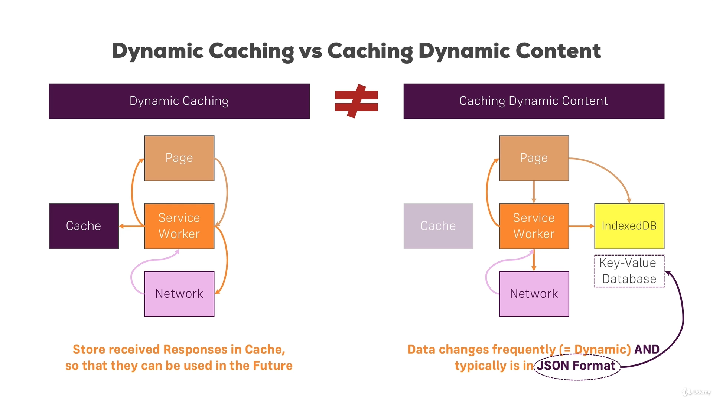
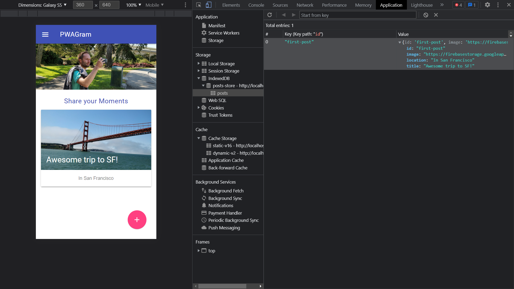
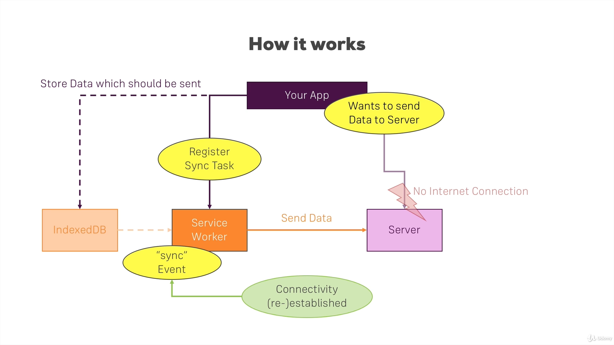
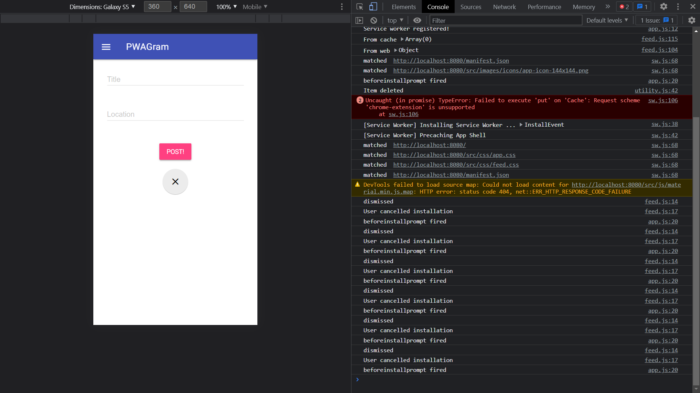
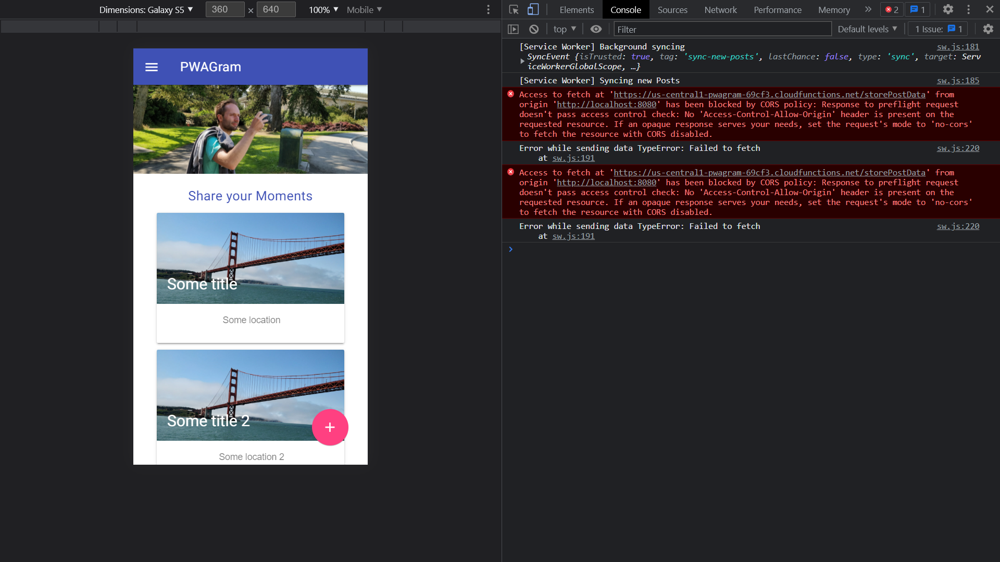
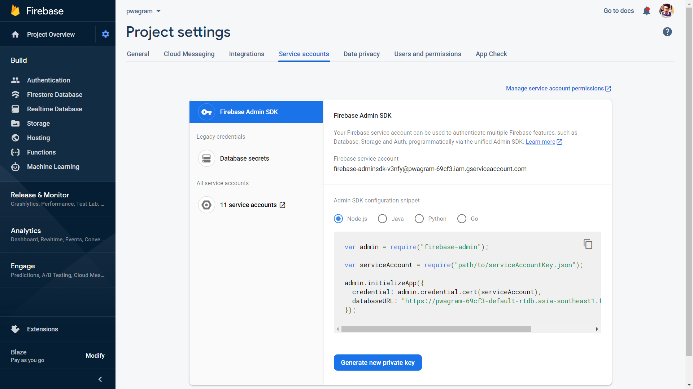
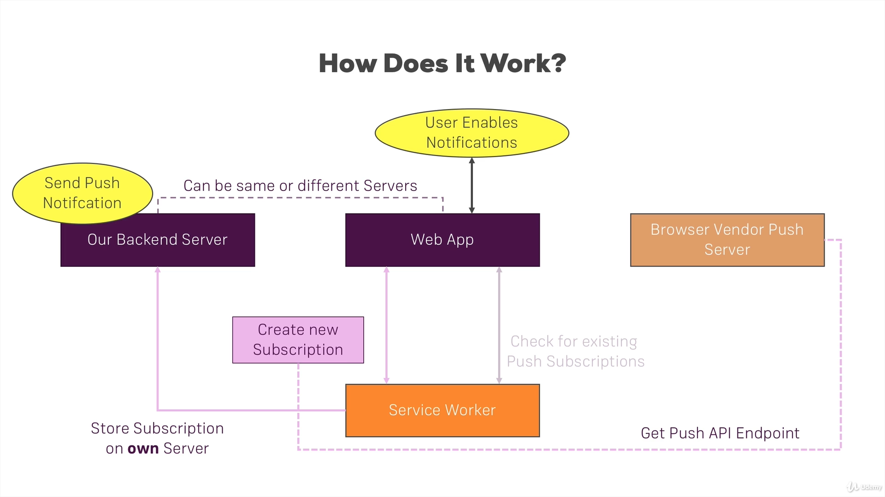
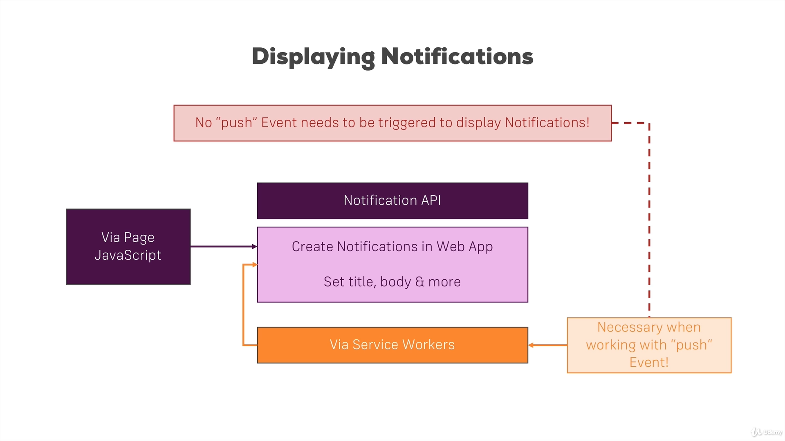

Started: 2021/10/10
End: 
Course Material: [Progressive Web App (PWA) - The Complete Guide](https://www.udemy.com/course/progressive-web-app-pwa-the-complete-guide/)

- [1. Understanding the App Manifest](#1-understanding-the-app-manifest)
  - [1.1. Using an App Manifest to Make your App Installable](#11-using-an-app-manifest-to-make-your-app-installable)
  - [1.2. Adding the Manifest](#12-adding-the-manifest)
  - [1.3. Understanding App Manifest Properties](#13-understanding-app-manifest-properties)
  - [1.4. Adding Properties to the App Manifest](#14-adding-properties-to-the-app-manifest)
  - [1.5. PWAs and Browser Support](#15-pwas-and-browser-support)
  - [1.6. Using the Chrome Developer Tools](#16-using-the-chrome-developer-tools)
  - [1.7. Simulating the Web App on an Emulator](#17-simulating-the-web-app-on-an-emulator)
  - [1.8. Installing the Web App - Prerequisties](#18-installing-the-web-app---prerequisties)
  - [1.9. Adding Properties for Safari](#19-adding-properties-for-safari)
  - [1.10. Adding Properties for the Internet Explorer](#110-adding-properties-for-the-internet-explorer)
- [2. The Service Workers](#2-the-service-workers)
  - [2.1. Why Service Workers are Aamazing](#21-why-service-workers-are-aamazing)
  - [2.2. Understanding Service Worker Events](#22-understanding-service-worker-events)
  - [2.3. The Service Worker Lifecycle](#23-the-service-worker-lifecycle)
  - [2.4. Service Worker Browser Support](#24-service-worker-browser-support)
  - [2.5. Registering a Service Worker](#25-registering-a-service-worker)
  - [2.6. Reacting to Incoming Events (in SW)](#26-reacting-to-incoming-events-in-sw)
  - [2.7. Updating and Activating Service Worker](#27-updating-and-activating-service-worker)
  - [2.8. Non-Lifecycle Events](#28-non-lifecycle-events)
  - [2.9. Getting that "App Install Banner"](#29-getting-that-app-install-banner)
  - [2.10. Testing the App on Real Device (and Installing the App)](#210-testing-the-app-on-real-device-and-installing-the-app)
  - [2.11. Deferring the App Install Banner](#211-deferring-the-app-install-banner)
  - [2.12. Service Worker FAQ](#212-service-worker-faq)
- [3. Promise and Fetch](#3-promise-and-fetch)
  - [3.1. Async Code in Javascript](#31-async-code-in-javascript)
  - [3.2. Promises - Basics](#32-promises---basics)
  - [3.3. Rejecting Promises](#33-rejecting-promises)
  - [3.4. Where we Use Promises in our Project](#34-where-we-use-promises-in-our-project)
  - [3.5. Fetch - Basics](#35-fetch---basics)
  - [3.6. Sending Post Requests via Fetch](#36-sending-post-requests-via-fetch)
  - [3.7. Fetch and CORS](#37-fetch-and-cors)
  - [3.8. Comparing Fetch and Ajax](#38-comparing-fetch-and-ajax)
  - [3.9. Adding Polyfills (for Legacy Browser Support)](#39-adding-polyfills-for-legacy-browser-support)
- [4. Service Workers - Caching](#4-service-workers---caching)
  - [4.1. Why Caching](#41-why-caching)
  - [4.2. Understanding the Cache API](#42-understanding-the-cache-api)
  - [4.3. Browser Support](#43-browser-support)
  - [4.4. Adjusting the Course Project](#44-adjusting-the-course-project)
  - [4.5. Indentifying (Pre-) Cacheable Items](#45-indentifying-pre--cacheable-items)
  - [4.6. Static Caching/Precaching](#46-static-cachingprecaching)
  - [4.7. Retrieving Items from the Cache](#47-retrieving-items-from-the-cache)
  - [4.8. Adding and Retrieving Multiple Files (to/from Cache)](#48-adding-and-retrieving-multiple-files-tofrom-cache)
  - [4.9. Cache Multiple Files with addAll](#49-cache-multiple-files-with-addall)
  - [4.10. Dynamic Caching - The Basics](#410-dynamic-caching---the-basics)
  - [4.11. Implementing Dynamic Caching](#411-implementing-dynamic-caching)
  - [4.12. Handling Errors](#412-handling-errors)
  - [4.13. Adding Cache Versioning](#413-adding-cache-versioning)
  - [4.14. Different Cache Versions and Cleanup](#414-different-cache-versions-and-cleanup)
  - [4.15. Optimizing Cache Management](#415-optimizing-cache-management)
  - [4.16. Assignment 2: Time to Practice: Service Workers and Caching](#416-assignment-2-time-to-practice-service-workers-and-caching)
- [5. Service Workers - Advanced Caching](#5-service-workers---advanced-caching)
  - [5.1. Module Preparation: Adding a Button](#51-module-preparation-adding-a-button)
  - [5.2. Offering "Cache on Demand"](#52-offering-cache-on-demand)
  - [5.3. Providing an Offline Fallback Page](#53-providing-an-offline-fallback-page)
  - [5.4. Strategy: Cache with Network Fallback](#54-strategy-cache-with-network-fallback)
  - [5.5. Strategy: Cache Only](#55-strategy-cache-only)
  - [5.6. Strategy: Network Only](#56-strategy-network-only)
  - [5.7. Strategy: Network with Cache Fallback](#57-strategy-network-with-cache-fallback)
  - [5.8. Strategy: Cache then Network](#58-strategy-cache-then-network)
  - [5.9. Cache then Network and Dynamic Caching](#59-cache-then-network-and-dynamic-caching)
  - [5.10. Cache then Network with Offline Support](#510-cache-then-network-with-offline-support)
  - [5.11. Cache Strategies and "Routing"](#511-cache-strategies-and-routing)
  - [5.12. Applying Cache Only](#512-applying-cache-only)
  - [5.13. Assignment - Advanced caching](#513-assignment---advanced-caching)
    - [5.13.1. Tasks](#5131-tasks)
    - [5.13.2. Solutions](#5132-solutions)
  - [5.14. A Better Way of Parsing Static Cache](#514-a-better-way-of-parsing-static-cache)
  - [5.15. A Better Way of Serving Fallback Files](#515-a-better-way-of-serving-fallback-files)
  - [5.16. Post Request and Cache API](#516-post-request-and-cache-api)
  - [5.17. Cleaning/Trimming the Cache](#517-cleaningtrimming-the-cache)
  - [5.18. Getting Rid of a Service Worker](#518-getting-rid-of-a-service-worker)
- [6. IndexedDB and Dynamic Data](#6-indexeddb-and-dynamic-data)
  - [6.1. Understanding the Basics](#61-understanding-the-basics)
  - [6.2. Setting Up Firebase](#62-setting-up-firebase)
  - [6.3. Connecting Frontend to Backend](#63-connecting-frontend-to-backend)
  - [6.4. Dynamic Caching vs. Caching Dynamic Content](#64-dynamic-caching-vs-caching-dynamic-content)
  - [6.5. Introducing IndexedDB](#65-introducing-indexeddb)
  - [6.6. IndexedDB Browser Support](#66-indexeddb-browser-support)
  - [6.7. Adding the IDB File](#67-adding-the-idb-file)
  - [6.8. Storing Fetched Posts in IndexedDB](#68-storing-fetched-posts-in-indexeddb)
  - [6.9. Using IndexedDB in the Service Worker](#69-using-indexeddb-in-the-service-worker)
  - [6.10. Reading Data from IDB](#610-reading-data-from-idb)
  - [6.11. Clearing IDB and Handling Server-Client Mismatch](#611-clearing-idb-and-handling-server-client-mismatch)
  - [6.12. Implementing the Clear Database Method](#612-implementing-the-clear-database-method)
  - [6.13. Deleting Single Items from the Database](#613-deleting-single-items-from-the-database)
  - [6.14. IndexedDB and Caching Strategies](#614-indexeddb-and-caching-strategies)
- [7. Creating a Responsive user Interface (UI)](#7-creating-a-responsive-user-interface-ui)
  - [7.1. Responsive Design in this Course](#71-responsive-design-in-this-course)
  - [7.2. Responsive Design in this Course](#72-responsive-design-in-this-course)
  - [7.3. Understanding Responsive Design in our Project](#73-understanding-responsive-design-in-our-project)
  - [7.4. CSS and Media Queries](#74-css-and-media-queries)
  - [7.5. Using Images in a Responsive Way](#75-using-images-in-a-responsive-way)
  - [7.6. Adding Animations](#76-adding-animations)
  - [7.7. The Viewport and Scaling](#77-the-viewport-and-scaling)
- [8. Background Sync](#8-background-sync)
  - [8.1. How does Background Sync Work](#81-how-does-background-sync-work)
  - [8.2. Adding the Basic Setup to our Project](#82-adding-the-basic-setup-to-our-project)
  - [8.3. Registering a Synchronization Task](#83-registering-a-synchronization-task)
  - [8.4. Storing our Post in IndexedDB](#84-storing-our-post-in-indexeddb)
  - [8.5. Adding a Fallback](#85-adding-a-fallback)
  - [8.6. Syncing Data in the Service Worker](#86-syncing-data-in-the-service-worker)
  - [8.7. Understanding Periodic Sync](#87-understanding-periodic-sync)
  - [8.8. Adding Server Side Code](#88-adding-server-side-code)
  - [8.9. Fixing Error](#89-fixing-error)
- [9. Web Push Notifications](#9-web-push-notifications)
  - [9.1. Why we need Web Push Notifications](#91-why-we-need-web-push-notifications)
  - [9.2. How Push and Notifications Work](#92-how-push-and-notifications-work)
  - [9.3. Displaying Notifications - Some Theory First](#93-displaying-notifications---some-theory-first)
  - [9.4. Browser Support](#94-browser-support)
  - [9.5. Requesting Permissions](#95-requesting-permissions)
  - [9.6. Displaying Notifications](#96-displaying-notifications)
  - [9.7. Notifications from Within the Service Worker](#97-notifications-from-within-the-service-worker)
  - [9.8. Understanding Notification Options](#98-understanding-notification-options)
  - [9.9. Advanced Options](#99-advanced-options)
  - [9.10. Adding Actions to Notifications](#910-adding-actions-to-notifications)
  - [9.11. Reacting to Notification Interaction - Clicks](#911-reacting-to-notification-interaction---clicks)
  - [9.12. Reacting to Notification Interaction - Closing](#912-reacting-to-notification-interaction---closing)
  - [9.13. From Notifications to Push Messages](#913-from-notifications-to-push-messages)
  - [9.14. Creating a Push Subscription](#914-creating-a-push-subscription)
  - [9.15. Storing Subscription](#915-storing-subscription)
  - [9.16. Connecting Server and Client (PWA)](#916-connecting-server-and-client-pwa)
  - [9.17. Sending Push Messges from the Server](#917-sending-push-messges-from-the-server)
  - [9.18. Listening to Push Message](#918-listening-to-push-message)
  - [9.19. Displaying Push Notification on a Real Device](#919-displaying-push-notification-on-a-real-device)
  - [9.20. Opening a Page upon User Interaction](#920-opening-a-page-upon-user-interaction)
  - [9.21. Improving our Code](#921-improving-our-code)
- [10. Native Device Features](#10-native-device-features)
  - [10.1. Preparing the Project](#101-preparing-the-project)
  - [10.2. Getting DOM Access](#102-getting-dom-access)
  - [10.3. Creating our own Polyfills](#103-creating-our-own-polyfills)
  - [10.4. Getting the Video Image](#104-getting-the-video-image)
  - [10.5. Hooking Up the Capture Button](#105-hooking-up-the-capture-button)
  - [10.6. Storing the Image on a Server](#106-storing-the-image-on-a-server)
  - [10.7. Accepting File Upload Example with Firebase](#107-accepting-file-upload-example-with-firebase)
  - [10.8. Testing the Camera and Upload](#108-testing-the-camera-and-upload)
  - [10.9. Implementing a Fallback](#109-implementing-a-fallback)
  - [10.10. Getting the User Position](#1010-getting-the-user-position)
  - [10.11. Fixing Bugs](#1011-fixing-bugs)
  - [10.12. Testing the App on a Real Device](#1012-testing-the-app-on-a-real-device)
- [11. Service Worker Management with Workbox](#11-service-worker-management-with-workbox)
  - [11.1. Installing Workbox and Using it](#111-installing-workbox-and-using-it)
  - [11.2. Configuring Workbox Precaching](#112-configuring-workbox-precaching)
  - [11.3. Customizing the Service Worker](#113-customizing-the-service-worker)
  - [11.4. Implementing Routing with the Workbox Router](#114-implementing-routing-with-the-workbox-router)
  - [11.5. Expanding Dynamic Caching](#115-expanding-dynamic-caching)
  - [11.6. Options and Setting Up Strategies](#116-options-and-setting-up-strategies)
  - [11.7. Custom Handlers (Example: For IndexedDB)](#117-custom-handlers-example-for-indexeddb)
  - [11.8. Providing an Offline HTML Fallback](#118-providing-an-offline-html-fallback)
  - [11.9. Handling Background Synchronization and Push Notification](#119-handling-background-synchronization-and-push-notification)
  - [11.10. Understanding the Workbox Documentation](#1110-understanding-the-workbox-documentation)
  - [11.11. Enhancing the Build Workflow](#1111-enhancing-the-build-workflow)
  - [11.12. Running our App on a Real Server](#1112-running-our-app-on-a-real-server)
  - [11.13. Auditing our Webpage with Lighthouse](#1113-auditing-our-webpage-with-lighthouse)
- [12. SPAs and PWAs](#12-spas-and-pwas)
  - [12.1. React with create-react-app](#121-react-with-create-react-app)
  - [12.2. A General Note about SPAs and PWAs](#122-a-general-note-about-spas-and-pwas)
  - [12.3. Angular with the CLI](#123-angular-with-the-cli)
  - [12.4. Vue with Vue CLI](#124-vue-with-vue-cli)

---

# 1. Understanding the App Manifest
## 1.1. Using an App Manifest to Make your App Installable
1. This `Manifest` is a single file that allows the users to add or "install" the web page on the home screen of a mobile device as an app.

## 1.2. Adding the Manifest
1. We can add `manifest.json` to the root directory of the web. In this case, we put in the `public` folder which is directory storing `index.html`.
2. Then we add a `link` referring to `manifest.json` in all the HTML file that we will serve. If we are creating a SPA with React or Vue, we can simply add this into the entry, single `index.html`.
  ```html
  <html>
    <link rel="manifest" href="/manifest.json">
  </html>
  ```

## 1.3. Understanding App Manifest Properties
1. We can give a `name` property for the PWA which is different from the "title" of the HTML file. This is the long name of the app and will show such as when using on the "Splashscreen".
2. A `short_name` can be given and will be shown belown the icon.
3. `start_url` is to indicate which page to load on startup. Note that this is very different from the URL we type in the search bar in a browser that is handled by a DNS. 
4. `scope` is to show which pages are included in the PWA experience. 
5. `display` can be set `standalone` to make the app looks like a standalone app. This includes options such as `standalone`, `fullscreen`, `minimal-ui`, `browser`. 
6. `background_color` can set the background color whilst loading and on Splashscreen. 
7. `theme_color` is the Theme color of the app which can affect components such as the top bar in task switcher.
8. `orientation` is used to set and enforce default orientation of the app. It may be `any`, `portrait`, `landscape`, `portrait-primary`.
9. Other properties can be also useful to set up in the manifest files in the JSON sample below.
  ```json
  // manifest.json
  {
    "name": "", // long name of the app (e.g. Splashscreen)
    "short_name": "", // short name of the app (e.g. below icon)
    "start_url" : "/index.html", // which page to load on startup
    "scope": ".", // which pages are included in "PWA experience"
    "display": "standalone", // should it look like a standalone app?
    "background_color": "#fff", // can set the background color whilst loading and on Splashscreen
    "theme_color": "#3F51B5", // theme color (e.g. on top bar in task switcher)
    "description": "Keep running", // description (e.g. favorite)
    "dir": "ltr", // read direction of the app
    "lang": "en-US", // main language of app
    "orientation": "portrait-primary", // set (and enforce) default orientation
    "icons": [ // configure icons (e.g. on homescreen)
      {
        "src": "/src/images/icons/app-icon-48x48.png", // icon path
        "type": "image/png", // image type
        "sizes": "48x48", // icon size, browser chooses best one for given device
      },
      {
        "src": "/src/images/icons/app-icon-96x96.png", // icon path
        "type": "image/png", // image type
        "sizes": "96x96", // icon size, browser chooses best one for given device
      },
    ], 
  },
  "related_application": [
    {
      "platform": "play",
      "url": "https://play.google.com/store/apps/details?id=com.example.app1",
      "id": "com.example.app1"
    }
  ]
  ```

## 1.4. Adding Properties to the App Manifest
```json
{
  "name": "Instagram as Progressive Web App",
  "short_name": "PWAGram",
  "icons": [
    {
      "src": "/src/images/icons/app-icon-48x48.png",
      "type": "image/png",
      "sizes": "48x48"
    },
    {
      "src": "/src/images/icons/app-icon-96x96.png",
      "type": "image/png",
      "sizes": "96x96"
    },
    {
      "src": "/src/images/icons/app-icon-144x144.png",
      "type": "image/png",
      "sizes": "144x144"
    },
    {
      "src": "/src/images/icons/app-icon-192x192.png",
      "type": "image/png",
      "sizes": "192x192"
    },
    {
      "src": "/src/images/icons/app-icon-256x256.png",
      "type": "image/png",
      "sizes": "256x256"
    },
    {
      "src": "/src/images/icons/app-icon-384x384.png",
      "type": "image/png",
      "sizes": "384x384"
    },
    {
      "src": "/src/images/icons/app-icon-512x512.png",
      "type": "image/png",
      "sizes": "512x512"
    }
  ],
  "start_url": "/index.html",
  "scope": ".",
  "display": "standalone",
  "orientation": "portrait-primary",
  "background_color": "#fff",
  "theme_color": "#3f51b5",
  "description": "A simple Instagram Clone, implementing a lot of PWA love.",
  "dir": "ltr",
  "lang": "en-US"
}
```

## 1.5. PWAs and Browser Support
1. Chrome at the time has the most compatibility to use PWA features.
2. We can check from "[caniuse](https://caniuse.com/?search=PWA)" to see if the browser has fully support on PWA features.

## 1.6. Using the Chrome Developer Tools
1. In Chrome browser, we can check on the developer console for detailed data.

## 1.7. Simulating the Web App on an Emulator
1. We can download android studio and install a virtual device on the computer to have an emulator of a sepcific android device. 
2. After installing android studio and the device, we can access the emulator from "Tools" > "AVD Manager".
3. However, if there's an android device available, we can access the local PWA via WIFI when starting up the project. Note that both the computer serving localhost and the mobile phone must connect to the same WIFI and there shouldn't be any gat threshold besides simple login connection.
4. The other way to work around is to have the android mobile phone having USB debugging and connect to computer with a cable. 

## 1.8. Installing the Web App - Prerequisties
1. We can visit [https://web.dev/customize-install/](https://web.dev/customize-install/) to check the latest requirements to prompt an install banner to let users easily download and add the PWA to their homescreens.

## 1.9. Adding Properties for Safari
1. We can add other tags in the HTML tag to enable the PWA works with Safari.
2. Note that Apple devices having their browser built on Safari and webkit, while these devices don't have fully support as the Chrome browsers on Android devices. 
3. For example, by the time learnig this course during Oct. 2021, "Push Notification" feature is still not available on PWAs on Apple devices.
  ```html
  <html>
    <!-- other tags of the HTML -->
    <link rel="manifest" href="/manifest.json" />
    <meta name="apple-mobile-web-app-capable" content="yes">
    <meta name="apple-mobile-web-app-status-bar-style" content="black">
    <meta name="apple-mobile-web-app-title" content="PWAGramiOS">
    <link rel="apple-touch-icon" href="/src/images/icons/app-icon-57x57.png" sizes="57x57">
    <link rel="apple-touch-icon" href="/src/images/icons/app-icon-60x60.png" sizes="60x60">
    <link rel="apple-touch-icon" href="/src/images/icons/app-icon-72x72.png" sizes="72x72">
    <link rel="apple-touch-icon" href="/src/images/icons/app-icon-114x114.png" sizes="114x114">
    <link rel="apple-touch-icon" href="/src/images/icons/app-icon-120x120.png" sizes="120x120">
    <link rel="apple-touch-icon" href="/src/images/icons/app-icon-144x144.png" sizes="144x144">
    <link rel="apple-touch-icon" href="/src/images/icons/app-icon-152x152.png" sizes="152x152">
    <link rel="apple-touch-icon" href="/src/images/icons/app-icon-180x180.png" sizes="180x180">
  </html>
  ```
## 1.10. Adding Properties for the Internet Explorer
1. For Internet Exploerer (though it's deprecated by Microsoft in Year 2021), we can specify some `meta` tags
  ```html
  <html>
    <meta name="msapplication-TileImage" content="/src/images/app-icon-144x144.png" />
    <meta name="msapplication-TileColor" content="#fff" />
    <!-- the following is a fallback which can be helpful on Chrome browser when manifest.json doesn't work -->
    <meta name="theme-color" content="#3F51B5" />
  </html>
  ```


# 2. The Service Workers
## 2.1. Why Service Workers are Aamazing
1. Service worker also works on one signle thread, while this thread is different from the regular context which attached to individual HTML pages.
2. It can be viewed as there is an additional thread, decoupled from HTML pages, and manage all pages of given scope. (e.g. all pages of a domain)

## 2.2. Understanding Service Worker Events
1. "Listenable" Events (in Service Worker) 
   1. **Fetch** - Browser or Page-related Javascript initiates a Fetch (Http request)
   2. **Push Notification** - Service worker receives Web Push Notification (from Server)
   3. **Notification Interaction** - User interacts with dsplayed Notification
   4. **Background Sync** - Service Worker receives Background Sync Event (e.g. Internet connection was restored)
   5. **Service Worker Lifecycle** - Service Worker Phase Changes

## 2.3. The Service Worker Lifecycle
1. When a page initiates, we can register a service worker to work on the background.


## 2.4. Service Worker Browser Support
1. We can check how different browsers in main stream supports service worker and PWA features.

## 2.5. Registering a Service Worker
1. To ensure service worker can work on all the pages, including pages in subfolders, we put the service worker registration javascript in the root directory. 
2. Note that we have the `npm start` script running with `-c-1` flag, which is to prevent browsers to use its default cache. 
3. Though we can put service worker directly in the HTML files, we will need to update all HTML files once the service worker is updated.
4. Besides, we can import the service worker to `app.js` in this case, as this file is used by both the `index.html` on the root and in `help` folder. Therefore, it can be a proper entry point for service worker. 
  ```js
  // app.js
  if ('serviceWorker' in navigator) {
    // this checks if browser supports service worker
    navigator.serviceWorker
      .register('/sw.js')
      .then(() => {
        console.log('service worker registered!');
      })
      .catch((err) => console.log(err));
  }
  ```

## 2.6. Reacting to Incoming Events (in SW)
1. We can pass a 2nd argument as an object when registering the service worker
  ```js
  // app.js
  if ('serviceWorker' in navigator) {
    // this checks if browser supports service worker
    navigator.serviceWorker
      .register('/sw.js', { scope: '/help/' }) // overwrite the scope
      .then(() => {
        console.log('service worker registered!');
      })
      .catch((err) => console.log(err));
  }
  ```
2. Service worker and manifest are 2 related files to PWAs but not compulsive to each other.
3. Besides, server worker only worker on HTTPS protocol. However, it does work on `localhost` for easier developing process.
  ```js
  self.addEventListener('install', (event) => {
    console.log('Service Worker Installing Service Worker...', event);
  });

  self.addEventListener('activate', (event) => {
    console.log('Service Worker Activating Service Worker...', event);
    return self.clients.claim();
  });
  ```

## 2.7. Updating and Activating Service Worker
1. When we reload the page, the service worker won't be activated immediately if it's updated because the browser tries to prevent 2 different versions of service having conflict.
2. In the developer console, we can click on "Update on reload" to update the service worker everytime it refreshes.

## 2.8. Non-Lifecycle Events
1. We can change the behavior of non-lifecycle event such as `fetch` in service worker.
2. This event handles all the fetching tasks such as importing css files with `link` tag and `img` tags for loading image and media.
  ```js
  // sw.js
  self.addEventListener('fetch', (event) => {
    console.log('Service Worker Fetching something...', event);
    event.respondWith(null); // this makes the page not accessible as nothing is fetched
    event.respondWith(fetch(event.request)); // this is like middleware to do something before fetching data
  });
  ```

## 2.9. Getting that "App Install Banner"
1. We can check the install criteria for PWAs. Chrome browser will prompt and ask if the user would like to install the PWA to the homescreen.
2. We can check more details at [https://web.dev/install-criteria/](https://web.dev/install-criteria)

## 2.10. Testing the App on Real Device (and Installing the App)
1. We can open debug mode on android devices and use USB cable to connect to a laptop or PC.
2. Follow the instruction from [https://developer.chrome.com/docs/devtools/remote-debugging/](https://developer.chrome.com/docs/devtools/remote-debugging/) to access the device from the desktop.
3. This process can be tricky to get them work on both the mobile and desktop device. Note that we may need to restart the service after certain changes.
4. This feature is to help developers to check app behavior on a real mobile device.
5. However, the approach didn't really work to allow adding the app from developer console to the homescreen.
6. This prompt is triggered automatically by Chrome browser when it meets the following criteria.
   1. The web app is not already installed
   2. Meets a user engagement heuristic
   3. Be served over HTTPS
   4. Includes a web app manifest that includes:
      1. `short_name` or `name`
      2. `icons` - must include a 192px and a 512px icon
      3. `start_url`
      4. `display` - must be one of `fullscreen`, `standalone`, or `minimal-ui`
      5. `prefer_related_applications` must not be present, or be false
   5.  Registers a service worker with a fetch handler

## 2.11. Deferring the App Install Banner
1. Besides the default installation prompt, we can change the behavior and all the app prompt installation to user by using `beforeinstallprompt` event handler.
2. 
  ```js
  // app.js
  var deferredPrompt; // take event argument from the callback function

  if ('serviceWorker' in navigator) {
    navigator.serviceWorker.register('/sw.js').then(function () {
      console.log('Service worker registered!');
    });
  }

  // change default beforeinstallprompt event
  window.addEventListener('beforeinstallprompt', function (event) {
    console.log('beforeinstallprompt fired');
    event.preventDefault();
    deferredPrompt = event;
    return false;
  });
  ```
2. In `feed.js`, we can update the event handler when the user clicks on adding new posts.
  ```js
  // feed.js
  function openCreatePostModal() {
    createPostArea.style.display = 'block';
    if (deferredPrompt) {
      deferredPrompt.prompt();

      deferredPrompt.userChoice.then(function (choiceResult) {
        console.log(choiceResult.outcome);

        if (choiceResult.outcome === 'dismissed') {
          console.log('User cancelled installation');
        } else {
          console.log('User added to home screen');
        }
      });

      deferredPrompt = null;
    }
  }
  ```

## 2.12. Service Worker FAQ
1. There some features of service workers that we may be aware of. 
2. If file of service worker is exactly the same, the browser won't reinstall the service worker though the page is reloaded.
3. However, if the file has been changed, even 1 byte, will trigger the process.
4. We can check service workers in `navigator` API and unregister them.
  ```js
  navigator.serviceWorker.getRegistrations().then(function(registrations) {
    for(let registration of registrations) {
      registration.unregister()
    } 
  });
  ```
5. Some useful links
   1. Are Service Workers Ready? - Check Browser Support: [https://jakearchibald.github.io/isserviceworkerready/](https://jakearchibald.github.io/isserviceworkerready/)
   2. Setting up Remote Debugging on Chrome: [https://developers.google.com/web/tools/chrome-devtools/remote-debugging/](https://developers.google.com/web/tools/chrome-devtools/remote-debugging/)
   3. Getting that "Web App Install Banner": [https://developers.google.com/web/fundamentals/engage-and-retain/app-install-banners/](https://developers.google.com/web/fundamentals/engage-and-retain/app-install-banners/)
   4. Getting Started with Service Workers: [https://developers.google.com/web/fundamentals/getting-started/primers/service-workers](https://developers.google.com/web/fundamentals/getting-started/primers/service-workers)


# 3. Promise and Fetch
## 3.1. Async Code in Javascript
1. Javascript in different context have different behavior.
2. We can use callback functions to work on the response provide asynchronous behavior. However, the functions will be nested 
  ```js  
  setTimeout(function () {
    resolve('This is executed once timer is done');
    // console.log('This is executed once timer is done');
  }, 3000);
  ```

## 3.2. Promises - Basics
## 3.3. Rejecting Promises
1. We can use `Promise` to handle asynchronous code in Javascript.
2. To work with `Promise` instance in Javascript, we can use `then` and `catch` method to handle with `resolve` and `reject` function according to the response.
  ```js
  var promise = new Promise((resolve, reject) => {
    setTimeout(function () {
      // resolve('This is executed once timer is done');
      // console.log('This is executed once timer is done');
      reject({ code: 500, message: 'An error occurred!' });
    }, 3000);
  });

  promise
    .then((text) => {
      console.log(text);
      return text;
    })
    .then((newText) => {
      console.log(newText);
    })
    .catch((err) => {
      console.log(err.code, err.message);
    });
  ```
3. Besides using `catch`, we can pass a 2nd argument to `then` to handle error response. Note that readability of this syntax is relatively low.

## 3.4. Where we Use Promises in our Project
1. In most of the cases, we don't need to create `Promise` instance by our own. 
2. We use it when using `fetch` API to requset data remotely. 

## 3.5. Fetch - Basics
```js
fetch(`https://httpbin.org/ip`)
  .then((res) => res.json())
  .then((data) => console.log(data))
  .catch((err) => console.log(err));
```

## 3.6. Sending Post Requests via Fetch
```js
fetch(`https://httpbin.org/post`, {
  method: 'POST',
  headers: {
    'Content-Type': 'application/json',
    Accept: 'application/json',
  },
  body: JSON.stringify({
    message: 'Does this work',
  }),
})
  .then((res) => res.json())
  .then((data) => console.log(data))
  .catch((err) => console.log(err));
```

## 3.7. Fetch and CORS
1. We can set `mode` as an option passing to `fetch` API which will turn the `body` of response as `null`. This can be used in some scenario that the app doesn't consume the data directly such as fetching image to render by `img` tag.
  ```js
  fetch(`https://httpbin.org/post`, {
    method: 'POST',
    headers: {  
      'Content-Type': 'application/json',
      Accept: 'application/json',
    },
    mode: 'cors', // no-cors
    body: JSON.stringify({
      message: 'Does this work',
    }),
  })
  ```

## 3.8. Comparing Fetch and Ajax
1. `xhr` has relatively complicated syntax when working on HTTP requests. 
2. Besides, it doesn't work in asynchronous scenario, so it can be better to use `fetch` API when fetching data with HTTP protocol.
```js
// using XMLHttpRequest
var xhr = new XMLHttpRequest();
xhr.open('GET', 'https://httpbin.org/ip');
xhr.responseType = 'json';

xhr.onload = function () {
  console.log(xhr.response);
};

xhr.onerror = function () {
  console.log('error');
};

xhr.send();
```

## 3.9. Adding Polyfills (for Legacy Browser Support)
1. Older browser doesn't work with native `fetch` and `Promise`.
2. We can use polyfill code with older Javascript syntax to work instead.
  ```js
  // app.js
  if (!window.Promise) { 
    // check if the browser supports native Promise
    // if not, it will use the code from polyfill 
    window.Promise = Promise;
  }
  ```


# 4. Service Workers - Caching
## 4.1. Why Caching
1. In some scenarios, such as poor connection, no connection (e.g. in an elevator), or poor WI-FI connection, this feature can be very useful.

## 4.2. Understanding the Cache API
1. The cache API provides another way to store data locally. It simply provdies `key (request)/value (response)` pair. 
2. Cache API can be accessed by both "service worker" and "normal" Javascript.
3. Cache data can be retrieved instead of sending Network Request.

## 4.3. Browser Support
[https://developer.mozilla.org/en-US/docs/Web/API/Cache](https://developer.mozilla.org/en-US/docs/Web/API/Cache)

## 4.4. Adjusting the Course Project
## 4.5. Indentifying (Pre-) Cacheable Items
1. The project has another card added to the app which is a (fake) dynamic content that the app fetched with `fetch` API.
2. In an App, we can cache the "shells" which are the static UI such as the top and side navigation bar, text, and buttons.

## 4.6. Static Caching/Precaching
1. We can create and store files as caches with `caches` API, which returns a `Promise` instance that we can use both `then` and `catch` to handle it.
2. If we update service worker, the app will reinstall the service.
3. However, until this point, it still doesn't work offline because we only store the cache but don't use it.
  ```js
  // sw.js
  self.addEventListener('install', function (event) {
    console.log('[Service Worker] Installing Service Worker ...', event);
    event.waitUntil(
      caches.open('static').then((cache) => {
        console.log('Service Worker Precaching App Shell');
        cache.add('/src/js/app.js');
      }),
    ); // event.waitUntil returns a promise
  });
  ```

## 4.7. Retrieving Items from the Cache
1. After storing the data in `caches` we can use `caches.match` to retrive data from cache API.
2. 
  ```js
  self.addEventListener('fetch', function (event) {
    // console.log('[Service Worker] Fetching something ....', event);
    event.respondWith(
      caches.match(event.request).then((response) => {
        if (response) return response;
        return fetch(event.request);
      }),
    );
  });
  ```

## 4.8. Adding and Retrieving Multiple Files (to/from Cache)
1. When we catch the data such as `index.html` on the root route, it doesn't fulfill when the user tries to access the root route as the user is trying to access `/` rather than `/index.html`.
2. Therefore, to ensure the user can access `index.html` in offline mode, we need to add both `/` and `/index.html` on cache.
  ```js
  self.addEventListener('install', function (event) {
    console.log('[Service Worker] Installing Service Worker ...', event);
    event.waitUntil(
      caches.open('static').then((cache) => {
        console.log('Service Worker Precaching App Shell');
        cache.add('/'); // this is cached to redner index.html
        cache.add('/index.html'); // this file will be rendered on root route '/'
        cache.add('/src/js/app.js');
      }),
    ); // event.waitUntil returns a promise
  });
  ```

## 4.9. Cache Multiple Files with addAll
1. With regular `add` approach, we may need to add on multiple files to make sure the app can work offline in different lines.
2. We can use `addAll` instead by passing an array of files that we want to cache.
3. We can ignore and don't add polyfill files to be cached as they have no use on modern browsers, and since old browser doesn't support such feature, there's no use to cache the files.
  ```js
  self.addEventListener('install', function (event) {
    console.log('[Service Worker] Installing Service Worker ...', event);
    event.waitUntil(
      caches.open('static').then((cache) => {
        console.log('Service Worker Precaching App Shell');
        cache.addAll([
          '/',
          '/index.html',
          '/src/js/app.js',
          '/src/js/feed.js',
          '/src/js/promise.js',
          '/src/js/fetch.js',
          '/src/js/material.min.js',
          '/src/css/app.css',
          '/src/css/feed.css',
          '/src/images/main-image.jpg',
          'https://fonts.googleapis.com/css?family=Roboto:400,700',
          'https://fonts.googleapis.com/icon?family=Material+Icons',
          'https://cdnjs.cloudflare.com/ajax/libs/material-design-lite/1.3.0/material.indigo-pink.min.css',
        ]);
      }),
    ); 
  });
  ```

## 4.10. Dynamic Caching - The Basics


## 4.11. Implementing Dynamic Caching
1. We can modify the `fetch` event on service worker.
2. If the app is going to fetch, it checks if the data is stored in cache. If not, it makes fetch request as in regular cases.
3. With dynamic caching, the app only caches the routes and data where the user visits. For example, if the user has never been to `/help` before turning to offline, the app doesn't work when the user access the route in offline mode because there's no data cached.
  ```js
  self.addEventListener('fetch', function (event) {
    // console.log('[Service Worker] Fetching something ....', event);
    event.respondWith(
      caches.match(event.request).then((response) => {
        if (response) {
          return response;
        } else {
          // chaining here as to deal only on real request
          return fetch(event.request).then((res) => {
            caches.open('dynamic').then((cache) => {
              console.log('dynamic');
              // put does similar to add but needs the developer to put key/value pair
              cache.put(event.request.url, res.clone());
              // without returning the response, the app doesn't work on the first fetch as it gets nothing back
              // it only works after the app reload as the response data is cached
              // we can prevent this behavior by returning the response from the first fetch
              console.log(res);
              return res;
            });
          });
        }
      }),
    );
  });
  ```
  

## 4.12. Handling Errors
1. We can add a catch on the promise. 
2. There's an error caused when the app is going to register the service worker in the offline mode.
3. We shouldn't register it because it can bring us into an infinitive loop that the app keeps using the older verion of the service worker from the cache.
  ```js
  // sw.js
  self.addEventListener('fetch', function (event) {
    event.respondWith(
      caches.match(event.request).then((response) => {
        if (response) {
          return response;
        } else {
          return fetch(event.request)
            .then((res) => {
              caches.open('dynamic').then((cache) => {
                cache.put(event.request.url, res.clone());
                return res;
              });
            })
            .catch((err) => {}); // add to catch error
        }
      }),
    );
  }
  ```

## 4.13. Adding Cache Versioning
1. In most of the cases, we wouldn't want to cache JSON data but files such as images, HTML, CSS, and Javascript. 
2. If we update the Javascript file for different features and behavior, the app isn't updated right away because it's using the older Javascript from the cache.
3. For example, we can adjust `feed.js` and use Javascript to change the color of the title in a card.
  ```js
  // feed.js
  function createCard() {
    var cardWrapper = document.createElement('div');
    cardWrapper.className = 'shared-moment-card mdl-card mdl-shadow--2dp';
    var cardTitle = document.createElement('div');
    cardTitle.className = 'mdl-card__title';
    cardTitle.style.backgroundImage = 'url("/src/images/sf-boat.jpg")';
    cardTitle.style.backgroundSize = 'cover';
    cardTitle.style.height = '180px';
    cardWrapper.appendChild(cardTitle);
    var cardTitleTextElement = document.createElement('h2');
    // change color to white
    cardTitleTextElement.style.color = 'white'; 
    
    cardTitleTextElement.className = 'mdl-card__title-text';
    cardTitleTextElement.textContent = 'San Francisco Trip';
    cardTitle.appendChild(cardTitleTextElement);
    var cardSupportingText = document.createElement('div');
    cardSupportingText.className = 'mdl-card__supporting-text';
    cardSupportingText.textContent = 'In San Francisco';
    cardSupportingText.style.textAlign = 'center';
    cardWrapper.appendChild(cardSupportingText);
    componentHandler.upgradeElement(cardWrapper);
    sharedMomentsArea.appendChild(cardWrapper);
  }
  ```
4. However, if we update `sw.js` for any trivial change such as adding comment which has no effect on the code itself, the service worker will be reinstalled and the Javascript is fetched again and get updated.
5. Nevertheless, this is no an ideal solution to update the content of `sw.js` for no specific purpose. 
6. In this case, we can create cache by `caches.open` with a different name.
  ```js
  // sw.js
  self.addEventListener('install', function (event) {
  console.log('[Service Worker] Installing Service Worker ...', event);
  event.waitUntil(
    // cache all files with different name for versioning
    caches.open('static-v2').then((cache) => {
      cache.addAll([
        // files to cache...
      ])
    });
  );
  ```
7. After updating both code and `sw.js`, we can reload the page and activate the new service worker from developer console.
8. However, as now we have 2 versions of caches, the app can find the required files from either of the caches. 
9. We can check the strategies and clean up the files to prevent using files in the wrong version.

## 4.14. Different Cache Versions and Cleanup
1. In service worker, there are different stages like lifecycle hooks in frontend framework.
2. For example, to clean up the cahces, we can do the process in `activate` event handler.
3. In this case, we remove all the caches that is not in the new version and in the `dynamic` category.
  ```js
  // sw.js
  self.addEventListener('activate', function (event) {
    console.log('[Service Worker] Activating Service Worker ....', event);
    event.waitUntil(
      caches.keys().then((keyList) => {
        // Promise.all method will wait for an array of promise instance to be done
        return Promise.all(
          keyList.map((key) => {
            if (key !== 'static-v2' && key !== 'dynamic') {
              console.log('[Service Worker] Removing old cache', key);
              return caches.delete(key);
            }
          }),
        );
      }),
    );
    return self.clients.claim();
  });
  ```
4. The solution is still not ideal that we have to keep updating the naming for the cache.
  ```js
  // sw.js
  self.addEventListener('install', function (event) {
    console.log('[Service Worker] Installing Service Worker ...', event);
    event.waitUntil(
      // this needs to update for different versions
      caches.open('static-v3').then((cache) => { 
        console.log('Service Worker Precaching App Shell');
        cache.addAll([
          // ...files to cache
        ]);
      }),
    );
  });

  self.addEventListener('activate', function (event) {
    console.log('[Service Worker] Activating Service Worker ....', event);
    event.waitUntil(
      caches.keys().then((keyList) => {
        // Promise.all method will wait for an array of promise instance to be done
        return Promise.all(
          keyList.map((key) => {
            // this needs to update for different versions of caches
            if (key !== 'static-v3' && key !== 'dynamic') {
              console.log('[Service Worker] Removing old cache', key);
              return caches.delete(key);
            }
          }),
        );
      }),
    );
    return self.clients.claim();
  });
  ```

## 4.15. Optimizing Cache Management
1. We can have a local variable to store the string name of the version we want, so we don't need to update the values in code directly but on the variables.
  ```js
  // sw.js
  const CACHE_STATIC_NAME = 'static-v4';
  const CACHE_DYNAMIC_NAME = 'dynamic-v2';
  ```

## 4.16. Assignment 2: Time to Practice: Service Workers and Caching
1. When we firstly initiate the app for assignment, we may find the app on `http://localhost:8080` is still using the old caches from the other app. 
2. We can go to 'Application' in developer console and clear all site data to clear the caches and records.
  ```js
  // main.js
  if ('serviceWorker' in navigator) {
    navigator.serviceWorker
      .register('/sw.js')
      .then((registration) => {
        console.log('Service worker registered!');
        console.log(registration.scope);
      })
      .catch((error) => console.log(error));
  }
  
  // sw.js
  const CACHE_STATIC_NAME = 'static';
  const CACHE_DYNAMIC_NAME = 'dynamic';

  self.addEventListener('install', (event) => {
    console.log('skip waiting');
    self.skipWaiting();

    console.log('[Service Worker] Installing Service Worker ...', event);
    const precache = async () => {
      const cache = await caches.open(CACHE_STATIC_NAME);

      console.log('Service Worker Precaching App Shell');
      return cache.addAll([
        '/',
        '/index.html',
        '/src/css/app.css',
        '/src/css/main.css',
        '/src/js/main.js',
        '/src/js/material.min.js',
        'https://fonts.googleapis.com/css?family=Roboto:400,700',
        'https://fonts.googleapis.com/icon?family=Material+Icons',
        'https://cdnjs.cloudflare.com/ajax/libs/material-design-lite/1.3.0/material.indigo-pink.min.css',
      ]);
    };

    // waitUntil resolve Promise instances
    // precache returns a Promise which is created from cache.addAll
    // installation will be considered failed if the Promise can't be resolved
    event.waitUntil(precache());
  });

  self.addEventListener('activate', (event) => {
    console.log('[Service Worker] Activating Service Worker ....', event);
    event.waitUntil(
      caches.keys().then((keyList) => {
        return Promise.all(
          keyList.map((key) => {
            if (key !== CACHE_STATIC_NAME && key !== CACHE_DYNAMIC_NAME) {
              console.log('[Service Worker] Removing old cache', key);
              return caches.delete(key);
            }
          }),
        );
      }),
    );
    return self.clients.claim();
  });

  self.addEventListener('fetch', (event) => {
    // console.log('[Service Worker] Fetching something ....', event);
    event.respondWith(
      (async () => {
        // event.respondWith interacts with a response or a Promise instance
        try {
          const cachedResponse = await caches.match(event.request);
          if (cachedResponse) {
            // use files from caches
            return cachedResponse;
          } else {
            // dynamic caching
            const response = await fetch(event.request);
            const cache = await caches.open(CACHE_DYNAMIC_NAME);
            // response.clone is used as response can only be used once by it's nature
            // without cloning the response, the user can't get the response and can cause error
            cache.put(event.request.url, response.clone());
            return response;
          }
        } catch (err) {
          console.log(err);
        }
      })(),
    );
  });
  ```

# 5. Service Workers - Advanced Caching
This section uses `adv-caching-01--prepared-project`

## 5.1. Module Preparation: Adding a Button
1. In some cases, we'd like to cache the files and data according to user event rather than dynamically caching all the data of the app.
2. For example, in this sample app, we can cache the post that the user just made. The caching process will execute in the regular Javascript rather than the service worker file.
3. In this case, we can turn off the dynamic caching in service worker.
  ```js
  // sw.js
  self.addEventListener('fetch', function(event) {
    event.respondWith(
      caches.match(event.request)
        .then(function(response) {
          if (response) {
            return response;
          } else {
            return fetch(event.request)
              .then(function(res) {
                return caches.open(CACHE_DYNAMIC_NAME)
                  .then(function(cache) {
                    // turn off dynamic caching
                    // cache.put(event.request.url, res.clone());
                    return res;
                  })
              })
              .catch(function(err) {

              });
          }
        })
    );
  });
  ```
4. The card is created when the user add new post which controlled in `feed.js`.
5. We can add a button to allow the user to "save" the post on the device.
  ```js
  // feed.js
  var cardSaveButton = document.createElement('button');
  cardSaveButton.textContent = 'Save';
  cardSaveButton.addEventListener('click', onSaveButtonClicked);

  function onSaveButtonClicked(event) {
    console.log('clicked');
  }
  ```

## 5.2. Offering "Cache on Demand"
1. We can not only access `caches` from service worker but also frontend Javascript code.
2. From the last section, we can continue working on the event handler after the user clicks the button.
  ```js
  // feed.js
  function onSaveButtonClicked(event) {
    console.log('clicked');
    if ('caches' in window) {
      // we check if caches is available on the browser
      // to prevent prompting error when the user clicks 'save'
      caches
        .open('user-requested')
        .then((cache) => {
          cache.add('https://httpbin.org/get');
          cache.add('/src/images/sf-boat.jpg');
        })
        .catch((err) => console.log(err));
    }
  }
  ```
3. After testing the feature, we can comment out the "save" button on the card and resume the dynamic caching feature.

## 5.3. Providing an Offline Fallback Page
1. For pages that we cache the data and files dynamically, if the user hasn't visited the path, the app will prompt an error as there's nothing to show when it's offline.
2. In this case, we can create `offline.html` and use the code from `index.html` to use the same app shell.
  ```html
  <!-- offline.html -->
  <!DOCTYPE html>
  <html lang="en">
    <head>
      <meta charset="UTF-8" />
      <meta
        name="viewport"
        content="width=device-width, user-scalable=no, initial-scale=1.0, maximum-scale=1.0, minimum-scale=1.0"
      />
      <meta http-equiv="X-UA-Compatible" content="ie=edge" />
      <title>PWAGram</title>
      <link
        href="https://fonts.googleapis.com/css?family=Roboto:400,700"
        rel="stylesheet"
      />
      <link
        rel="stylesheet"
        href="https://fonts.googleapis.com/icon?family=Material+Icons"
      />
      <link
        rel="stylesheet"
        href="https://cdnjs.cloudflare.com/ajax/libs/material-design-lite/1.3.0/material.indigo-pink.min.css"
      />
      <link rel="stylesheet" href="/src/css/app.css" />
      <link rel="stylesheet" href="/src/css/feed.css" />
      <link rel="manifest" href="/manifest.json" />
      <meta name="apple-mobile-web-app-capable" content="yes" />
      <meta name="apple-mobile-web-app-status-bar-style" content="black" />
      <meta name="apple-mobile-web-app-title" content="PWAGram" />
      <link
        rel="apple-touch-icon"
        href="/src/images/icons/apple-icon-57x57.png"
        sizes="57x57"
      />
      <link
        rel="apple-touch-icon"
        href="/src/images/icons/apple-icon-60x60.png"
        sizes="60x60"
      />
      <link
        rel="apple-touch-icon"
        href="/src/images/icons/apple-icon-72x72.png"
        sizes="72x72"
      />
      <link
        rel="apple-touch-icon"
        href="/src/images/icons/apple-icon-76x76.png"
        sizes="76x76"
      />
      <link
        rel="apple-touch-icon"
        href="/src/images/icons/apple-icon-114x114.png"
        sizes="114x114"
      />
      <link
        rel="apple-touch-icon"
        href="/src/images/icons/apple-icon-120x120.png"
        sizes="120x120"
      />
      <link
        rel="apple-touch-icon"
        href="/src/images/icons/apple-icon-144x144.png"
        sizes="144x144"
      />
      <link
        rel="apple-touch-icon"
        href="/src/images/icons/apple-icon-152x152.png"
        sizes="152x152"
      />
      <link
        rel="apple-touch-icon"
        href="/src/images/icons/apple-icon-180x180.png"
        sizes="180x180"
      />
      <meta
        name="msapplication-TileImage"
        content="/src/images/icons/app-icon-144x144.png"
      />
      <meta name="msapplication-TileColor" content="#fff" />
      <meta name="theme-color" content="#3f51b5" />
    </head>
    <body>
      <div id="app">
        <div class="mdl-layout mdl-js-layout mdl-layout--fixed-header">
          <header class="mdl-layout__header">
            <div class="mdl-layout__header-row">
              <!-- Title -->
              <span class="mdl-layout-title">PWAGram</span>
              <!-- Add spacer, to align navigation to the right -->
              <div class="mdl-layout-spacer"></div>
              <!-- Navigation. We hide it in small screens. -->
              <nav class="mdl-navigation mdl-layout--large-screen-only">
                <a class="mdl-navigation__link" href="/">Feed</a>
                <a class="mdl-navigation__link" href="/help">Help</a>
                <div class="drawer-option">
                  <button
                    class="
                      enable-notifications
                      mdl-button mdl-js-button
                      mdl-button--raised mdl-button--colored
                      mdl-color--accent
                    "
                  >
                    Enable Notifications
                  </button>
                </div>
              </nav>
            </div>
          </header>
          <div class="mdl-layout__drawer">
            <span class="mdl-layout-title">PWAGram</span>
            <nav class="mdl-navigation">
              <a class="mdl-navigation__link" href="/">Feed</a>
              <a class="mdl-navigation__link" href="/help">Help</a>
              <div class="drawer-option">
                <button
                  class="
                    enable-notifications
                    mdl-button mdl-js-button
                    mdl-button--raised mdl-button--colored
                    mdl-color--accent
                  "
                >
                  Enable Notifications
                </button>
              </div>
            </nav>
          </div>
          <main class="mdl-layout__content mat-typography">
            <div class="page-content">
              <h5 class="text-center mdl-color-text--primary">
                We're sorry. This page hasn't been cached yet.
              </h5>
              <p>But why don't you try one of our <a href="/">other pages</a>?</p>
            </div>
          </main>
        </div>
      </div>
      <script defer src="/src/js/material.min.js"></script>
      <script src="/src/js/promise.js"></script>
      <script src="/src/js/fetch.js"></script>
      <script src="/src/js/app.js"></script>
      <script src="/src/js/feed.js"></script>
    </body>
  </html>
  ```
3. After setting up the HTML file, we can register it to be cached in the service worker.
4. We then can put the fallback catach all page in the error catch when the service worker can't either find the data or file from cache or the internet.
  ```js
  // sw.js
  self.addEventListener('fetch', (event) => {
    event.respondWith(
      caches.match(event.request).then((response) => {
        if (response) {
          return response;
        } else {
          return fetch(event.request)
            .then((res) => {
              return caches.open(CACHE_DYNAMIC_NAME).then((cache) => {
                cache.put(event.request.url, res.clone());
                return res;
              });
            })
            .catch(function (err) {
              // return the fallback page if there's nothing in the cache
              return caches.open(CACHE_STATIC_NAME).then((cache) => {
                return cache.match('/offline.html');
              });
            });
        }
      }),
    );
  });
  ```

## 5.4. Strategy: Cache with Network Fallback
1. The current strategy of loading the app is to check at the service worker as the intercept and check if there's any cache available to load. 
2. The pros on this strategy is that the app can be loaded instantly when the user opens it.
3. However, on the down turn, the app may be up to date as the service worker will take the data in the cache as the priority.

## 5.5. Strategy: Cache Only
1. We can turn off and allow the app to use the data only from the cache without accessing any resource from the network though the internet is available.
2. This strategy wouldn't be useful as the app is totally disconnected from the network and can't be updated.
  ```js
  // sw.js
  Listener('fetch', function (event) {
    event.respondWith(caches.match(event.request));
  });
  ```

## 5.6. Strategy: Network Only
1. If we don't use any caches, the app is a regular web app that we can even work with it without any service worker.
2. The only function of the service worker is as the intercept and let the network requests bypass. 
3. Though the files and data will be cached, the app doesn't use any benefit from the caches and thus it isn't different from regular web apps.
  ```js
  // sw.js
  self.addEventListener('fetch', function (event) {
    event.respondWith(fetch(event.request));
  });
  ```

## 5.7. Strategy: Network with Cache Fallback
1. This strategy can be useful that the app will try to access the resources through network and use data from caches when the `fetch` fails.
2. However, the potential issue on this strategy can happen when the internet connection is poor that the app wouldn't use files from caches right away. 
3. This can significantly degrade the user experience, as the user may need to wait for a while to let the connections getting timeout to let the app reach the caches.
  ```js
  // sw.js
  self.addEventListener('fetch', function (event) {
    event.respondWith(
      fetch(event.request)
        .then((res) => {
          // allows dynamic caching
          return caches.open(CACHE_DYNAMIC_NAME).then((cache) => {
            cache.put(event.request.url, res.clone());
            return res;
          });
        })
        .catch((err) => {
          // works only when the network isn't available
          return caches.match(event.request);
        }),
    );
  });
  ```

## 5.8. Strategy: Cache then Network
1. This strategy can be useful in most of the cases that the app will get the required resources from caches as fast as possible to be responsive to the user while fetching and updating the app by getting resource through the network.
2. The app firstly access data and files from caches without passing through service worker.
3. Note that the app can access caches from `caches` API directly without using service worker. We can check the implementation earlier in [section 5.2](#52-offering-cache-on-demand).
4. However, we'd be aware that if the app gets resource faster from the network than from the caches, we should avoid overwriting the data from network by the data from caches.
5. Besides, we create another function `clearCards` to clear duplicate cards before rendering to the app.
  ```js
  // feed.js
  function clearCards() {
    while (sharedMomentsArea.hasChildNodes()) {
      sharedMomentsArea.removeChild(sharedMomentsArea.lastChild);
    }
  }

  const url = 'https://httpbin.org/get';
  // this checks if the app should use files from caches
  let networkDataReceived = false;

  fetch(url)
    .then(function (res) {
      return res.json();
    })
    .then(function (data) {
      // change the state to be true and prevent the app use data from caches
      networkDataReceived = true;
      console.log('From web', data);
      clearCards();
      createCard();
    });

  if ('caches' in window) {
    caches
      .match(url)
      .then((res) => {
        if (res) {
          return res.json();
        }
      })
      .then((data) => {
        console.log('From cache', data);
        if (!networkDataReceived) {
          // triggeres only when data caches is loaded faster than data from network
          clearCards();
          createCard();
        }
      });
  }
  ```

## 5.9. Cache then Network and Dynamic Caching
1. From the previous section, we let the app access data and files stored in caches directly and check with service worker to fetch from the network.
2. However, the data and files from the networks hasn't been cached locally yet.
3. We can store the data in the dynamic cache. When we open the cache at the first time, it is empty since nothing has been fetched through the network.
4. We then store everything that the app requested from the network.
5. This strategy will also let the app caches all the data and files that have been pre-cached.
6. However, though all the data and files have been cached, the current strategy still doesn't allow the app to work offline.
  ```js
  // sw.js
  self.addEventListener('fetch', function (event) {
    event.respondWith(
      caches.open(CACHE_DYNAMIC_NAME).then((cache) => {
        return fetch(event.request).then((res) => {
          cache.put(event.request, res.clone());
          return res;
        });
      }),
    );
  });
  ```

## 5.10. Cache then Network with Offline Support
1. From the previous strategy, we can notice that the app does cache the data fetched from the network but doesn't use the caches in any circumstances.
2. To use the benefits from caches and allow the app works offline, we should check what data and files the app is fetching and ensure `app.js` and `feed.js` are loaded first in the offline mode.
3. We update the service worker and check if the app is requesting data from certain endpoint such as the API for creating a post card component.
4. We can use `indexOf` to check if the requesting endpoint includes certain string. 
5. If the app is not going to request for the dynamic data from a certain endpoint, we can let the app checks and fetches from caches and only request from the network if it is not found in caches.
  ```js
  // sw.js
  self.addEventListener('fetch', function (event) {
    const url = 'https://httpbin.org/get';

    if (event.request.url.indexOf(url) > -1) {
      // check if the data is fetching from certain url
      event.respondWith(
        caches.open(CACHE_DYNAMIC_NAME).then((cache) => {
          return fetch(event.request).then((res) => {
            cache.put(event.request, res.clone());
            return res;
          });
        }),
      );
    } else {
      // if not, allow the app to load data and files with cache first strategy
      // the app will only fetch data from network when it's not available from caches
      event.respondWith(
        caches.match(event.request).then((response) => {
          if (response) {
            return response;
          } else {
            return fetch(event.request)
              .then((res) => {
                return caches.open(CACHE_DYNAMIC_NAME).then((cache) => {
                  cache.put(event.request.url, res.clone());
                  return res;
                });
              })
              .catch((err) => {
                return caches.open(CACHE_STATIC_NAME).then((cache) => {
                  return cache.match('/offline.html');
                });
              });
          }
        }),
      );
    }
  });
  ```

## 5.11. Cache Strategies and "Routing"
1. We now have a fallback page when the `fetch` API doesn't work. However, it can be confusing in some scenarios as if the app fails to fetch CSS files.
2. Therefore, we can use conditions to check which route the user intends to visit and decide whether to show the fallback page when the app works in offline mode.
  ```js
  // sw.js
  self.addEventListener('fetch', function (event) {
    const url = 'https://httpbin.org/get';

    if (event.request.url.indexOf(url) > -1) {
      event.respondWith(
        caches.open(CACHE_DYNAMIC_NAME).then((cache) => {
          return fetch(event.request).then((res) => {
            cache.put(event.request, res.clone());
            return res;
          });
        }),
      );
    } else {
      event.respondWith(
        caches.match(event.request).then((response) => {
          if (response) {
            return response;
          } else {
            return fetch(event.request)
              .then((res) => {
                return caches.open(CACHE_DYNAMIC_NAME).then((cache) => {
                  cache.put(event.request.url, res.clone());
                  return res;
                });
              })
              .catch((err) => {
                return caches.open(CACHE_STATIC_NAME).then((cache) => {
                  if (event.request.url.indexOf('/help')) {
                    // show offline fallback page 
                    // only when the user visits '/help' related routes in offline mode
                    return cache.match('/offline.html');
                  }
                });
              });
          }
        }),
      );
    }
  });
  ```

## 5.12. Applying Cache Only
1. Though cache only strategy may not be useful and doesn't make sense in some cases, we can use this strategy when the app keeps updating its static files if we can ensure the cache always have the latest data.
2. When we update any data that is listed in the static files, the app will push a new service worker to the frontend, so we can ensure the app has always had the latest data. 
3. We can have another condition in `else if` for `fetch` event handler in service worker.
4. In this case, we use regular expression to help checking if the requesting URL matches any of the endpoints in the static file list.
5. If the data is the static file list, the app will only get the data from caches.
6. However, this approach still has an issue that if the user has never visit the site and cache the app shells from the static file list in advance, this strategy will still cause problems that the app won't be able to get any data listed in the static files list through the network.
  ```js
  // sw.js
  self.addEventListener('fetch', function (event) {
    const url = 'https://httpbin.org/get';

    if (event.request.url.indexOf(url) > -1) {
      event.respondWith(
        caches.open(CACHE_DYNAMIC_NAME).then((cache) => {
          return fetch(event.request).then((res) => {
            cache.put(event.request, res.clone());
            return res;
          });
        }),
      );
      // use regualr expression to help checking the url that 
      // the app is going to fetch data from 
    } else if (
      new RegExp('\\b' + STATIC_FILES.join('\\b|\\b') + '\\b').test(
        event.request.url,
      )
    ) {
      // if the app is fetching any of the static files
      // the app will only fetch from caches rather than the network
      self.addEventListener('fetch', function (event) {
        event.respondWith(caches.match(event.request));
      });
    } else {
      event.respondWith(
        caches.match(event.request).then((response) => {
          if (response) {
            return response;
          } else {
            return fetch(event.request)
              .then((res) => {
                return caches.open(CACHE_DYNAMIC_NAME).then((cache) => {
                  cache.put(event.request.url, res.clone());
                  return res;
                });
              })
              .catch((err) => {
                return caches.open(CACHE_STATIC_NAME).then((cache) => {
                  if (event.request.url.indexOf('/help')) {
                    return cache.match('/offline.html');
                  }
                });
              });
          }
        }),
      );
    }
  });
  ```

## 5.13. Assignment - Advanced caching
### 5.13.1. Tasks
1. Identify the strategy we currently use in the Service Worker (for caching)
2. Replace it with a "Network only" strategy => Clear Storage (in Dev Tools), reload & try using your app offline
3. Replace it with a "Cache only" strategy => Clear Storage (in Dev Tools), reload & try using your app offline
4. Replace it with "Network, cache fallback" strategy =>  => Clear Storage (in Dev Tools), reload & try using your app offline
5. Replace it with a "Cache, then network" strategy => Clear Storage (in Dev Tools), reload & try using your app offline
6. Add "Routing"/ URL Parsing to pick the right strategies: Try to implement "Cache, then network", "Cache with network fallback" and "Cache only" (all of these, with appropriate URL selection)

### 5.13.2. Solutions
1. Service worker strategy
   1. The app uses caches-first strategy that it will fetch data from caches if it's available and only fetch from the network if the cache has no required data.
   2. All the data and files will be cached in the dynamic routes. 
   3. This is cache, fallback to network strategy (with dynamic caching).
2. Network only strategy
   1. The serviec worker is only an intercept before getting data from the network.
   2. By using this strategy, the app can't work offline.
    ```js
    // sw.js
    // network only strategy
    self.addEventListener('fetch', function (event) {
      event.respondWith(
        fetch(event.request)
      );
    });
    ```
3. Cache only strategy
   1. By changing to cache only, the app only fetch data from caches and doesn't get any data through the network.
   2. The app does work normally at the first time when everything is fetched from the network and cached locally. 
   3. However, after first reload on the page, some of the resources such as the icons are not loaded. 
   4. Besides, the resources in dynamic route are listed in the static files when the service worker is installed. 
   5. Therefore, the app prompts an error when we try to visit `/dynamic` route.
    ```js
    // sw.js
    // cache only strategy
    self.addEventListener('fetch', function (event) {
      event.respondWith(
        caches.match(event.request)
      );
    });
    ```
4. Network, cache fallback strategy
  1. There may have 2 solutions for this. We can bypass the response directly if the data and resources can be fetched through the network.
   ```js
   // sw.js
   // network, fallback to cache
   self.addEventListener('fetch', function(event) {
     event.respondWith(
       fetch(event.request)
         .catch(err => {
           return caches.match(event.request);
         })
     );
   });
   ```
  2. The other choice is to cache all the resource dynamically.
   ```js
   // sw.js
   // network, fallback to cache with dynamic caching
   const CACHE_DYNAMIC_NAME = 'dynamic-v1';
   self.addEventListener('fetch', function (event) {
     event.respondWith(
       fetch(event.request)
         .then((res) => {
           return caches.open(CACHE_DYNAMIC_NAME).then((cache) => {
             cache.put(event.request.url, res.clone());
             return res;
           });
         })
         .catch((err) => {
           return caches.match(event.request);
         }),
     );
   });
   ```
5. Cache, then network strategy
    1. We can update from the service worker with cache first and network strategy.
      ```js
      // sw.js
      self.addEventListener('fetch', function (event) {
        event.respondWith(
          caches.open(CACHE_DYNAMIC_CACHE)
           .then((cache) => {
             return fetch(event.request)
               .then(res => {
                 cache.put(event.request.url, res.clone());
                 return res;
               })
           })
        );
      });
      ```
    2. We can update in `main.js` with a condition that if the app fetches data from network faster than from caches, the app won't use the data stored in caches to prevent overwriting the app with older data.
      ```js
      // main.js
      const url = 'https://httpbin.org/ip';
      let networkDataReceived = false;

      fetch(url)
        .then(function (res) {
          networkDataReceived = true;
          return res.json();
        })
        .then(function (data) {
          console.log('From network', data);
          // console.log(data.origin);
          box.style.height = data.origin.substr(0, 2) * 5 + 'px';
        });

      if ('caches' in window) {
        caches
          .match(url)
          .then((res) => {
            if (res) {
              return res.json();
            }
          })
          .then((data) => {
            console.log('From cache', data);
            if (!networkDataReceived) {
              // triggeres only when data caches is loaded faster than data from network
              box.style.height = data.origin.substr(0, 2) * 20 + 'px';
            }
          });
      }
      ```
    3. However, this strategy and solution doesn't allow the app works offline.
6. Routing"/ URL Parsing to pick the right strategies
  ```js
  // sw.js
  // helper function
  function isInArray(string, array) {
    for (let i = 0; i < array.length; i++) {
      if (array[i] === string) return true;
      return false;
    }
  }

  // Dynamic caching for Cache, then network strategy
  self.addEventListener('fetch', (event) => {
    if (event.request.url.indexOf('https://httpbin.org/ip')) {
      event.respondWith(
        caches.open(CACHE_DYNAMIC_NAME).then((cache) => {
          return fetch(event.request).then((res) => {
            cache.put(event.request.url, res.clone());
            return res;
          });
        }),
      );
    } else if (isInArray(event.request.url, STATIC_FILES)) {
      // cache only
      event.respondWith(caches.match(event.request));
    } else {
      // cache, network fallback strategy
      event.respondWith(
        caches.match(event.request).then(function (response) {
          if (response) {
            return response;
          } else {
            return fetch(event.request)
              .then(function (res) {
                return caches.open(CACHE_DYNAMIC_NAME).then(function (cache) {
                  cache.put(event.request.url, res.clone());
                  return res;
                });
              })
              .catch(function (err) {});
          }
        }),
      );
    }
  });
  ```

## 5.14. A Better Way of Parsing Static Cache 
1. Besides, using regular expression, we can use helper function as we made in the assignment to iterate through the list of static files in the array to check whether the app can request the resource from caches.
  ```js
  // helper function to check from the list of static resources
  const STATIC_FILES = [
    '/',
    '/index.html',
    '/src/css/app.css',
    '/src/css/main.css',
    '/src/js/main.js',
    '/src/js/material.min.js',
    'https://fonts.googleapis.com/css?family=Roboto:400,700',
    'https://fonts.googleapis.com/icon?family=Material+Icons',
    'https://cdnjs.cloudflare.com/ajax/libs/material-design-lite/1.3.0/material.indigo-pink.min.css',
  ];

  function isInArray(string, array) {
    for (let i = 0; i < array.length; i++) {
      if (array[i] === string) {
        return true
      };
      return false;
    }
  }

  // a better version to match the strings
  function isInArray(string, array) {
    var cachePath;
    if (string.indexOf(self.origin) === 0) { // request targets domain where we serve the page from (i.e. NOT a CDN)
      console.log('matched ', string);
      cachePath = string.substring(self.origin.length); // take the part of the URL AFTER the domain (e.g. after localhost:8080)
    } else {
      cachePath = string; // store the full request (for CDNs)
    }
    return array.indexOf(cachePath) > -1;
  }
  ```

## 5.15. A Better Way of Serving Fallback Files
1. Our current solution can only take route one by one, and it can becomes hard to manage if we have more than 1 route to have fallback catches in offline mode.
  ```js
  // sw.js
  self.addEventListener('fetch', function (event) {
    const url = 'https://httpbin.org/get';

    if (event.request.url.indexOf(url) > -1) {
      event.respondWith(
        caches.open(CACHE_DYNAMIC_NAME).then((cache) => {
          return fetch(event.request).then((res) => {
            cache.put(event.request, res.clone());
            return res;
          });
        }),
      );
    } else if (isInArray(event.request.url, STATIC_FILES)) {
      event.respondWith(caches.match(event.request));
    } else {
      event.respondWith(
        caches.match(event.request).then((response) => {
          if (response) {
            return response;
          } else {
            return fetch(event.request)
              .then((res) => {
                return caches.open(CACHE_DYNAMIC_NAME).then((cache) => {
                  cache.put(event.request.url, res.clone());
                  return res;
                });
              })
              .catch((err) => {
                return caches.open(CACHE_STATIC_NAME).then((cache) => {
                  // the fallback works only on '/help'
                  if (event.request.url.indexOf('/help')) {
                    return cache.match('/offline.html');
                  }
                });
              });
          }
        }),
      );
    }
  });
  ```
2. We can update the code in `catch` to show the fallback HTML when the user tries to access any HTML file that is not available at the time. 
  ```js
  // sw.js
  self.addEventListener('fetch', function (event) {
    const url = 'https://httpbin.org/get';

    if (event.request.url.indexOf(url) > -1) {
      event.respondWith(
        caches.open(CACHE_DYNAMIC_NAME).then((cache) => {
          return fetch(event.request).then((res) => {
            cache.put(event.request, res.clone());
            return res;
          });
        }),
      );
    } else if (isInArray(event.request.url, STATIC_FILES)) {
      event.respondWith(caches.match(event.request));
    } else {
      event.respondWith(
        caches.match(event.request).then((response) => {
          if (response) {
            return response;
          } else {
            return fetch(event.request)
              .then((res) => {
                return caches.open(CACHE_DYNAMIC_NAME).then((cache) => {
                  cache.put(event.request.url, res.clone());
                  return res;
                });
              })
              .catch((err) => {
                return caches.open(CACHE_STATIC_NAME).then((cache) => {
                  // this handles all the request to html files
                  // if the html file is not static, 
                  // the app will direct to the fallback page
                  if (event.request.headers.get('accept').includes('text/html')) {
                    return cache.match('/offline.html');
                  }
                });
              });
          }
        }),
      );
    }
  });
  ```

## 5.16. Post Request and Cache API
1. Technically, caches can't store POST request but the response from the POST request. 
2. Though the data is cached, the POST request will fail when the app goes offline.

## 5.17. Cleaning/Trimming the Cache
1. We can create a helper function to clear caches. In this case, we have maximum cached files at 4.
2. Note that the app can not only access caches from service worker but regular frontend Javascript.
  ```js
  // sw.js
  function trimCache(cacheName, maxItems) {
    caches.open(cacheName).then((cache) => {
      return cache.keys().then((keys) => {
        if (keys.length > maxItems) {
          cache.delete(keys[0]).then(trimCache(cacheName, maxItems));
        }
      });
    });
  }

  // allow only up to 3 files to be cached
  trimCache(CACHE_DYNAMIC_NAME, 3);
  ```

## 5.18. Getting Rid of a Service Worker
1. In some cases, we'd like to remove service worker.
2. We can firstly check if the service worker is available in the browser and iterate through the registration and clear the registered service workers.
  ```js
  // feed.js
  if ('serviceWorker' in navigator) {
    navigator.serviceWorker.getRegistration().then(function (registration) {
      for (let i = 0; i < registration.length; i++) {
        registration[i].unregister();
      }
    });
  }
  ```


# 6. IndexedDB and Dynamic Data
1. This lecture uses `adv-caching-11--final` from the last lecture. 

## 6.1. Understanding the Basics
1. We will set up a simple backend to work with dynamic data.

## 6.2. Setting Up Firebase
1. We use `Realtime Database` rather than "Firebase Database" to handle data.
  ```json
  // rules for realtime database
  {
    "rules": {
      ".read": true,
      ".write": true
    }
  }
  ```
2. We can upload images to `storage` which can generate a public URL that can access the image with GET request. 

## 6.3. Connecting Frontend to Backend
1. Rather than fetching data from the dummy source, we can fetch data from the realtime database from firebase.
2. We can access it to the table and follows with `.json` work on the dataset as RESTFul API. 
3. We can update the url in service worker to cache dynamic data if the `fetch` event is requesting data from firebase.
4. We can update `createCard` function to create the card component from the dynamic data.
  ```js
  // feed.js
  function createCard(data) {
    var cardWrapper = document.createElement('div');
    cardWrapper.className = 'shared-moment-card mdl-card mdl-shadow--2dp';
    var cardTitle = document.createElement('div');
    cardTitle.className = 'mdl-card__title';
    cardTitle.style.backgroundImage = `url("${data.image}")`; // use the image url
    cardTitle.style.backgroundSize = 'cover';
    cardTitle.style.height = '180px';
    cardWrapper.appendChild(cardTitle);
    var cardTitleTextElement = document.createElement('h2');
    cardTitleTextElement.style.color = 'white';
    cardTitleTextElement.className = 'mdl-card__title-text';
    cardTitleTextElement.textContent = `${data.title}`; // title for the card
    cardTitle.appendChild(cardTitleTextElement);
    var cardSupportingText = document.createElement('div');
    cardSupportingText.className = 'mdl-card__supporting-text';
    cardSupportingText.textContent = `${data.location}`; // location of the post
    cardSupportingText.style.textAlign = 'center';
    cardWrapper.appendChild(cardSupportingText);
    componentHandler.upgradeElement(cardWrapper);
    sharedMomentsArea.appendChild(cardWrapper);
  }

  function updateUI(data) {
    for (let i = 0; i < data.length; i++) {
      createCard(data[i]);
    }
  }

  fetch(url)
    .then(function (res) {
      return res.json();
    })
    .then(function (data) {
      networkDataReceived = true;
      console.log('From web', data);
      const dataArray = [];
      for (let key in data) {
        dataArray.push(data[key]);
      }
      clearCards();
      updateUI(dataArray);
    });

  if ('caches' in window) {
    caches
      .match(url)
      .then(function (response) {
        if (response) {
          return response.json();
        }
      })
      .then(function (data) {
        console.log('From cache', data);
        if (!networkDataReceived) {
          const dataArray = Object.values(data);
          clearCards();
          updateUI(dataArray);
        }
      });
  }
  ```

## 6.4. Dynamic Caching vs. Caching Dynamic Content
1. Dynamic caching is not caching dynamic content
2. Dynamic caching is to store received response in cache, so that they can be used in the future.
3. Caching dynamic content we can use IndexedDB to store the data in browser based database which using JSON format and in key-value pairs.
  

## 6.5. Introducing IndexedDB
1. IndexedDB is a transactional "Key-Value" Database in the Browser.
2. If one action within a Transaction fails, none of the Actions of that Transaction are applied.
3. IndexedDB can store significant amounts of unstructured data, including Files/Blobs.
4. Data in IndexedDB can be accessed asynchronously.

## 6.6. IndexedDB Browser Support
1. Most of the modern browser support the feature. 

## 6.7. Adding the IDB File
1. The regular way to work with IndexedDB is using callback functions which could be very complex and hard to understand. 
2. We can use [`IDB`](https://www.npmjs.com/package/idb) package which allow us to work with Promise based code.
3. We can add `idb.js` code in `/src/js/idb.js` and import the file in `index.html`.

## 6.8. Storing Fetched Posts in IndexedDB
1. We use "**idb-03--write-data**" repo in this case.
2. We can import `idb` to use in service worker as well.
3. In service worker, it has a special syntax to import other Javascript code using `importScripts`. 
4. Besides, we can cache the `idb` code in the static file.
  ```js
  // sw.js
  importScripts('/src/js/idb.js');

  var CACHE_STATIC_NAME = 'static-v16';
  var CACHE_DYNAMIC_NAME = 'dynamic-v2';
  var STATIC_FILES = [
    '/',
    '/index.html',
    '/offline.html',
    '/src/js/app.js',
    '/src/js/feed.js',
    '/src/js/idb.js',
    // ...
  ]
  ```
4. We then can access `idb` and check and create a new database in IndexedDB. 3 arguments can be given.
   1. The 1st argument is the name of the database we'd want to open or create.
   2. The 2nd argument is the version of the database.
   3. The 3rd argument is a callback function to execute which we can use it open and access the database.
  ```js
  var dbPromise = idb.open('posts-store', 1, function(db) {
      // check if the database has existed
    if (!db.objectStoreNames.contains('posts')) {
      // create a database if it doesn't exist
      db.createObjectStore('posts', { keyPath: 'id' });
    }
  });
  ```
5. We can remove the callback to store the response in `caches`.
  ```js
  // sw.js
  self.addEventListener('fetch', function (event) {
    var url = 'your_firebase_url';
    if (event.request.url.indexOf(url) > -1) {
      event.respondWith(fetch(event.request)
        .then(function (res) {
          // clone one and return the original
          var clonedRes = res.clone();
          // handle as regular response object
          clonedRes.json().then(function (data) {
            // save data of posts from firebase
            for (var key in data) {
              dbPromise.then(function (db) {
                // create transaction with target and type
                var tx = db.transaction('posts', 'readwrite');
                var store = tx.objectStore('posts');
                // write in data
                store.put(data[key]);
                return tx.complete;
              });
            }
          });
          // return the response to ensure the code works
          return res;
        })
      );
    }
    // ...
  });
  ```
  

## 6.9. Using IndexedDB in the Service Worker
1. We can create a utility that can be shared in both `sw.js` and `feed.js`.
  ```js
  // src/utility.js
  var dbPromise = idb.open('posts-store', 1, function (db) {
    if (!db.objectStoreNames.contains('posts')) {
      db.createObjectStore('posts', { keyPath: 'id' });
    }
  });

  function writeData(st, data) {
    return dbPromise.then(function (db) {
      var tx = db.transaction(st, 'readwrite');
      var store = tx.objectStore(st);
      store.put(data);
      return tx.complete;
    });
  }
  ```

## 6.10. Reading Data from IDB
1. We add another funciton in `utility.js` to read data from IndexedDB.
  ```js
  // utlity.js
  function readAllData(st) {
    return dbPromise.then(function (db) {
      var tx = db.transaction(st, 'readonly');
      var store = tx.objectStore(st);
      return store.getAll();
    });
  }
  ```
2. In `feed.js`, since we don't use data from `caches`, we can check if `indexedDB` is supported by the browser. The following code only works when the browser is offline and can't fetch data from the network.
3. Note that though indexedDB has store the image, it's only the URL pointing to the source of the image. 
4. The image medai itself is stored in the dynamic cache which allows the app to check the image in offline mode.
  ```js
  // feed.js
  if ('indexedDB' in window) {
    readAllData('posts').then(function (data) {
      if (!networkDataReceived) {
        console.log('From cache', data);
        updateUI(data);
      }
    });
  }
  ```

## 6.11. Clearing IDB and Handling Server-Client Mismatch
1. As we use `writeData` function in `utility.js`, if the data respond from data changes, the data will be updated in `IndexedDB` on browser as we use `store.put` to modify the data.
2. However, this code doesn't cover the scenario that if the data is actually removed. 
3. For example, we get an array of posts from the database to create "post cards" component in the web app. 
4. If the same "key" isn't in the array, `IndexedDB` won't get it updated or remove the data if it doesn't exist.
5. Therefore, with the current strategy, we will still find the old data in the offline mode, as the data is stored in IndexeDB.
  ```js
  // utility.js
  function writeData(st, data) {
    return dbPromise.then(function (db) {
      var tx = db.transaction(st, 'readwrite');
      var store = tx.objectStore(st);
      // this only add or update data from response
      store.put(data);
      return tx.complete;
    });
  }
  ```
6. In this case, we can update the code in service worker to clear out all the data in IndexedDB before writing in new data from the response.

## 6.12. Implementing the Clear Database Method
1. We create a new utility function in `utility.js`.
  ```js
  // utility.js
  function clearAllData(st) {
    return dbPromise
      .then(function(db) {
        var tx = db.transaction(st, 'readwrite');
        var store = tx.objectStore(st);
        store.clear();
        return tx.complete;
      });
  }
  ```
2. We then update the service worker strategy to clear all data before writing in new data from response.
  ```js
  // sw.js
  self.addEventListener('fetch', function (event) {
    var url = `your_firebase_url`;
    if (event.request.url.indexOf(url) > -1) {
      event.respondWith(
        fetch(event.request).then(function (res) {
          var clonedRes = res.clone();
          // clear all data in IndexedDB
          clearAllData('posts').then(function () {
            // write the data into IndexedDB after all data is cleared
            return clonedRes.json().then(function (data) {
              for (var key in data) {
                writeData('posts', data[key]);
              }
            });
          });
          return res;
        }),
      );
    }
  });
  ```

## 6.13. Deleting Single Items from the Database
1. We can use `delete` method on the store object to remove a single entry in IndexedDB.
2. We create a utlity function in `utility.js`.
  ```js
  // utility.js
  function deleteItemFromData(st, id) {
    dbPromise
      .then(function (db) {
        var tx = db.transaction(st, 'readwrite');
        var store = tx.objectStore(st);
        store.delete(id);
        return tx.complete;
      })
      .then(function () {
        console.log('Item deleted');
      });
  }
  ```
3. We can update in service worker. In this case, we add the function in the `then` after the data is written into IndexedDB for demo purpose.
  ```js
  // sw.js
  self.addEventListener('fetch', function (event) {
    var url = `your_firebase_url`;
    if (event.request.url.indexOf(url) > -1) {
      event.respondWith(
        fetch(event.request).then(function (res) {
          var clonedRes = res.clone();
          clearAllData('posts').then(function () {
            return clonedRes.json().then(function (data) {
              for (var key in data) {
                writeData('posts', data[key]).then(function () {
                  // remove the item immediately right after the item is added
                  deleteItemFromData('posts', key);
                });
              }
            });
          });
          return res;
        }),
      );
    }
  });
  ```

## 6.14. IndexedDB and Caching Strategies
1. We now have different tools and strategy to store data on user's browser by using `caches` or `IndexedDB`.


# 7. Creating a Responsive user Interface (UI)
## 7.1. Responsive Design in this Course
## 7.2. Responsive Design in this Course
## 7.3. Understanding Responsive Design in our Project
## 7.4. CSS and Media Queries
## 7.5. Using Images in a Responsive Way
## 7.6. Adding Animations
## 7.7. The Viewport and Scaling


# 8. Background Sync
## 8.1. How does Background Sync Work
1. In regular conditions, the app wants to send data as a request to the server and manipulate with the response.
2. When the network is not available, the process can't work normally. 
3. Besides, service worker can't cache response from POST but GET requests.
4. However, we can register "sync tasks" on service worker which is the "request" rather the response. 
5. In addition, we can store this data in IndexedDB. Note that we can store image and media data in IndexedDB as well.
6. When the network connection is available a "sync" event will be trigger.
7. Service worker will the create a fetch request to the server. The amazing feature of this is process works even when the tab, browser, or the device is turned off.
  

## 8.2. Adding the Basic Setup to our Project
This section use "background-sync-01--access-form"
1. To use the benefits from background sync, we can update the create post feature on the page as this function sends data to the server and create a new post by the user.
2. Therefore, the background sync can be triggered when the user clicks "POST!" in the web app.+
  ```js
  // src/feed.js
  var form = document.querySelector('form');
  var titleInput = document.querySelector('#title');
  var locationInput = document.querySelector('#location');

  function closeCreatePostModal() {
    createPostArea.style.transform = 'translateY(100vh)';
    // createPostArea.style.display = 'none';
  }

  form.addEventListener('submit', function (event) {
    event.preventDefault();

    if (titleInput.value.trim() === '' || locationInput.value.trim() === '') {
      alert('Please enter valid data!');
      return;
    }

    closeCreatePostModal();
  });
  ```
  

## 8.3. Registering a Synchronization Task
1. To use background synchronization, we need to check if the browser supports both `serviceWorker` in `navigator` and `SyncManager` in `window`.
2. However, by the time of learning (2021/10/31), only Google Chrome and Microsoft Edge browser supports `SyncManager`. This `SyncManager` API is still not available on both Apple Safari and FireFox.
3. We can continue working on the event handler on the post button.
4. When the user clicks on the event, we can check if both service worker and SyncManager in window are available.
5. We can check by `navigator.serviceWorker.ready` which returns a Promise then we can keep working on the service worker if it's registered and ready. The promise has the "service worker" returned in the Promise as if it's ready.
6. Note that we add the code and maniuplate service worker in `feed.js` because we can't listen to the event in `sw.js`.
7. If the service worker is ready, we can use `.sync.register` method which takes a "tag" as the argument to register the synchronizing event.
  ```js
  // src/feed.js
  form.addEventListener('submit', function (event) {
    event.preventDefault();

    if (titleInput.value.trim() === '' || locationInput.value.trim() === '') {
      alert('Please enter valid data!');
      return;
    }

    closeCreatePostModal();

    // check if both service worker and SyncManager in window are available
    if ('serviceWorker' in navigator && 'SyncManager' in window) {
      // check if service worker is registred and ready to be used
      // serviceWorker.ready returns a Promise
      navigator.serviceWorker.ready.then(function (sw) {
        // the Promise returns the service worker if it's ready
        // we register the sync event as 'sync-new-post'
        sw.sync.register('sync-new-post');
      });
    }
  });
  ```

## 8.4. Storing our Post in IndexedDB
1. After registering the background sync event, we can store or cache the data that we want to send to server in IndexedDB (because background sync itself doesn't store or cache data).
2. We then can use the functions we create in `utility.js` to work with IndexedDB.
  ```js
  // src/feed.js
  form.addEventListener('submit', function (event) {
    event.preventDefault();

    if (titleInput.value.trim() === '' || locationInput.value.trim() === '') {
      alert('Please enter valid data!');
      return;
    }

    closeCreatePostModal();

    if ('serviceWorker' in navigator && 'SyncManager' in window) {
      navigator.serviceWorker.ready.then(function (sw) {
        var post = {
          id: new Date().toISOString(),
          title: titleInput.value,
          location: locationInput.value,
        };

        // ensure data is stored in IndexedDB and the background sync event is registered
        writeData('sync-posts', post)
          .then(function () {
            sw.sync.register('sync-new-post');
          })
          .then(function () {
            // the followings are showing snackbar to prompt user for info. which is not necessary
            var snackbar = document.querySelector('#confirmation-toast');
            var data = { message: 'Your Post was saved for syncing!' };
            snackbarContainer.MaterialSnackbar.showSnackbar(data);
          })
          .catch(function (err) {
            console.log(err);
          });
      });
    }
  });
  ```

## 8.5. Adding a Fallback
1. If the browser doesn't support service worker and `SyncManager`, we'd still want the app can work normally.
2. We can create a fallback function to run if those APIs aren't supported in the browser.
3. Note that the following solution works only in `feed.js` which we should handle the fetch request in service worker `sw.js`.
  ```js
  // src/feed.js
  function sendData() {
    fetch(
      'https://pwagram-69cf3-default-rtdb.asia-southeast1.firebasedatabase.app/posts.json',
      {
        method: 'POST',
        headers: {
          'Content-Type': 'application/json',
          Accept: 'application/json',
        },
        body: JSON.stringify({
          id: new Date().toISOString(),
          title: titleInput.value,
          location: locationInput.value,
          image:
            'https://firebasestorage.googleapis.com/v0/b/pwagram-69cf3.appspot.com/o/sf-boat.jpg?alt=media&token=6f3fec36-0242-4a6b-89aa-a27d9413e824',
        }),
      },
    ).then(function (res) {
      console.log('Sent data', res);
      updateUI();
    });
  }

  if ('serviceWorker' in navigator && 'SyncManager' in window) {
      // if both service worker and background sync work
    } else {
      // a fallback logic works when service worker and background sync aren't available
      sendData();
    }
  ```

## 8.6. Syncing Data in the Service Worker
1. We add a new event handler in `sw.js` for `sync` event.
  ```js
  // sw.js
  self.addEventListener('sync', function (event) {
    console.log('[Service Worker] Background syncing', event);
    // check tag from sync event registered in feed.js
    if (event.tag === 'sync-new-posts') {
      // if there's more tags or conditions, we can use switch rather than if/else statement
      console.log('[Service Worker] Syncing new Posts');
      // wait until the request finishes sending data
      event.waitUntil(
        // fetch data from IndexedDB by using function declared in utility.js
        readAllData('sync-posts').then(function (data) {
          for (var dt of data) {
            fetch(
              'https://pwagram-69cf3-default-rtdb.asia-southeast1.firebasedatabase.app/posts.json',
              {
                method: 'POST',
                headers: {
                  'Content-Type': 'application/json',
                  Accept: 'application/json',
                },
                body: JSON.stringify({
                  id: dt.id,
                  title: dt.title,
                  location: dt.location,
                  image:
                    'https://firebasestorage.googleapis.com/v0/b/pwagram-69cf3.appspot.com/o/sf-boat.jpg?alt=media&token=6f3fec36-0242-4a6b-89aa-a27d9413e824',
                }),
              },
            )
              .then(function (res) {
                console.log('Sent data', res);
                // clear post that has been requested
                // use function declared in utility.js
                if (res.ok) {
                  // ensure the request is successful and remove from IndexedDB
                  deleteItemFromData('sync-post', dt.id);
                }
              })
              .catch(function (err) {
                console.log('Error while sending data', err);
              });
          }
        }),
      );
    }
  });
  ```
2. Note that the lecture intentionally introduced a type to remind that we should be careful for naming the tag for sync event when register it in the code. 
3. For example, we had a typo in `feed.js` when registering the sync event.
  ```js
  // feed.js
  // in 'then' block after storing data in IndexedDB
  sw.sync.register('sync-new-posts');
  ```
4. If we can't write data into the firebase endpoint, we can update the database rules and turn both read and write into true without any authentication.
  ```json
  // realtime database rules
  {
    "rules": {
      ".read": true,
      ".write": true
    }
  }
  ```
5. Besides, the `deleteItemFromData` function doesn't work correctly as we don't use the id responded from the server.
6. At this point we set up the background sync, we can test the feature by disconnect the network connection on the device.
7. Note that this doesn't work if we use "offline" simulation on the browser. We should disconnect the network by turning WiFi off.
8. Since the app is set up as PWA and can work offline, we have saved the request in IndexedDB and register in background sync.
9. This will work when we turn back on the WiFi connection. The request will be synced and sent to the server.
10. We can then refresh the app and check there's a new Post created as we have more data stored in database.

## 8.7. Understanding Periodic Sync
1. "Periodic Sync" is used to get data from server periodically.
2. When we register periodic sync task, we can include a "schedule" in service worker.
3. The schedule will then trigger the periodic sync event to request data from server.
4. However, this API isn't supported by all browsers.

## 8.8. Adding Server Side Code
1. In this case, we will use `firebase-tools` which can be installed with `npm install -g firebase-tools`.
2. After installing firebase tools, we can use `firebase init` to start a firebase project, but before it works, we should use `firebase login` to login to use firebase CLI tools.
3. To init the project, we slect "Functions: COnfigure a Cloud Functions directory and its files" and "Hosting: Configure files for Firebase Hosting and (optionally) set up GitHub Action deploys".
4. We then select the project is set set up on Firebase and install the dependencies.
5. We are not using SPA (single page application) and can use the `index.html` we have setup without rewriting it.
6. After initiate the project, firebase tools will generate `firebase.json`, `.firebaserc`, and a `404.html` and `functions` folder at the root directory.
7. This `functions` directory is actually a server that we can deploy with firebase tools.
8. We can configure `index.js` in `functinos`. In this case, we need to install and use `firebase-admin` and `cors` packages.
  ```js
  // index.js in functions
  const functions = require('firebase-functions');
  const admin = require('firebase-admin');
  const cors = require('cors')({ origin: true });

  // // Create and Deploy Your First Cloud Functions
  // // https://firebase.google.com/docs/functions/write-firebase-functions
  //
  exports.storePostData = functions.https.onRequest((request, response) => {
    functions.logger.info('Hello logs!', { structuredData: true });
    response.send('Hello from Firebase!');
    cors(function (req, res) {
      admin
        .database()
        .ref('posts')
        .push({
          id: request.body.id,
          title: request.body.title,
          location: request.body.location,
          image: request.body.image,
        })
        .then(function () {
          response.status(201).json({ message: 'Data stored', id: req.body.id });
        })
        .catch((err) => {
          response.status(500).json({ error: err });
        });
    });
  });
  ```
9. After deployment, firebase tool will generate the URL endpoint to connect to. In this case, we should use the "Function URL" and update this URL for the `sync` event handler in `sw.js` and for `sendData` function in `feed.js`. We then can update service worker and test the endpoint.
10. Besides, our previous code doesn't remove the synced request frmo IndexedDB correclty. It is because the local is created by `new Date().toISOString()` while firebase creates another unique ID when it write the data.
11. Therefore, we can update the service worker and use the id from the response from firebase.
  ```js
  // sw.js
  self.addEventListener('sync', function (event) {
    console.log('[Service Worker] Background syncing', event);
    // check tag from sync event registered in feed.js
    if (event.tag === 'sync-new-posts') {
      // if there's more tags or conditions, we can use switch rather than if/else statement
      console.log('[Service Worker] Syncing new Posts');
      // wait until the request finishes sending data
      event.waitUntil(
        // fetch data from IndexedDB by using function declared in utility.js
        readAllData('sync-posts').then(function (data) {
          for (var dt of data) {
            fetch(
              'https://us-central1-pwagram-69cf3.cloudfunctions.net/storePostData',
              {
                method: 'POST',
                headers: {
                  'Content-Type': 'application/json',
                  Accept: 'application/json',
                },
                body: JSON.stringify({
                  id: dt.id,
                  title: dt.title,
                  location: dt.location,
                  image:
                    'https://firebasestorage.googleapis.com/v0/b/pwagram-69cf3.appspot.com/o/sf-boat.jpg?alt=media&token=6f3fec36-0242-4a6b-89aa-a27d9413e824',
                }),
              },
            )
              .then(function (res) {
                console.log('Sent data', res);
                // clear post that has been requested
                // use function declared in utility.js
                if (res.ok) {
                  // ensure the request is successful and remove from IndexedDB
                  res.json().then(function (resData) {
                    // use data from the response to remove data from IndexedDB
                    deleteItemFromData('sync-post', resData.id);
                  });
                }
              })
              .catch(function (err) {
                console.log('Error while sending data', err);
              });
          }
        }),
      );
    }
  });
  ```
12. After configuring the service worker, we can try offline by turning off WiFi and create several posts in queue and resume network connection.
  

## 8.9. Fixing Error  
1. The error from the previous lecture is from the incorrect configuration in firebase function when setting up the server.
2. We need to download the certificate as the private key to deploy firebase function.
  
3. Besides, we can notice that the data is still queued up in IndexedDB as they aren't sent as requests correctly.
    ```js
    // functions/index.js
    const admin = require('firebase-admin');
    const serviceAccount = require('./pwagram-fb-key.json');

    admin.initializeApp({
      credential: admin.credential.cert(serviceAccount),
      databaseURL:
        'https://pwagram-69cf3-default-rtdb.asia-southeast1.firebasedatabase.app/',
    });

    exports.storePostData = functions.https.onRequest((request, response) => {
      // cors take 3 arguments (request, response, function)
      cors(req, res, function () {
        admin
          .database()
          .ref('posts')
          .push({
            id: request.body.id,
            title: request.body.title,
            location: request.body.location,
            image: request.body.image,
          })
          .then(function () {
            response.status(201).json({ message: 'Data stored', id: req.body.id });
          })
          .catch((err) => {
            response.status(500).json({ error: err });
          });
      });
    });
    ```
4. After redeploy the firebase function, we can try to create a new post in offline mode.
5. If the post data successfully creates a post in firebase, it will be removed from IndexedDB, if the request has never been successful, it will be kept in IndexedDB.


# 9. Web Push Notifications
## 9.1. Why we need Web Push Notifications
1. Show up even if App (and Browser) is closed.
2. Driver User Engagement
3. Mobile-App-Like Experience

## 9.2. How Push and Notifications Work
1. To use notification, the user must enable and allow notification. This is on the browser to prompt the user if s/he allows the app to push notification at certain domain.
2. With permission, backend server of the web app can push notification to the web app.
3. Check for existing push subscription. If not, the app can create new subscription.
4. Though we can use websocket to push notification from the server, it's different technology which can be applied in different scenarios. Besides, it only works when the app is still opened and active.
5. Every browser has its own push notification server. We use Javascript to get Push API endpoint to access to service "**Browser Vendor Push Server**".
6. Besides, we should be aware of the security of the push notification endpoint and prevent any outsider or 3rd party to push messages to app users.
7. The backend server to the web app can be integrated or separated (fullstack app with SSR or SPA with separated front and back).
8. After connecting to the backend server, the service worker can store subscription on the backend server with persistent data storage.
9. When the app would like to send push notification, the event triggers from the backend server.
   1.  Backend server sends push notification to browser vendor push server.
   2.  Browser vendor push server sends a "push" event to the service worker.
   3.  Service worker handle the push event and react on the web app.
  

## 9.3. Displaying Notifications - Some Theory First
1. To display notifications, we don't actually need "push" event to be triggered.
2. The notification is executed with "Notification API" which can be accessed without service worker.
3. However, we do need to use both notification API with service worker to handle "push" event.
  

## 9.4. Browser Support
1. By the time of learning, Apple still hasn't allowed to use push notification on the mobile versions on iOS.
2. Therefore, only mobiles with Android system and Desktop can use Notification API.

## 9.5. Requesting Permissions
1. In this project, we have buttons to enable push notifications on both the top navigation and the side panel.
2. We can register the event handler in `app.js` as the buttons for enabling notifications are general and are shown on every page.
3. We firstly check if the browser supports `Notification` by checking the property in `window` on the global scope.
4. If it's available, we then iterate through all the buttons to add styling and `click` event listener.
5. Note that when we request permission to user for push notification, the users will grante 2 permissions for both `Notification` and `push` event from the server.
6. When users click on the enabling button, the browesr will prompt and ask the user if s/he wants to grant permission to the feature.
7. However, the browser userflow on granting permission can be tricky as this feature can easily be abused for inproper purposes, such as scamming and create annoying alarms.
8. Besides, granting permission is an one-time event that if the user grants permission, the feature will be enabled. However, the default behavior wouldn't prompt to the user directly and will turn notifcation off by default.
9. Once the user denies permission, the user must go to setting to the browser to re-enable the feature for certain website or domain.
10. After the user has responded to notification request, the app will only get message to check if the feature is granted and CAN NOT prompt to the user again.
  ```js
  // src/app.js
  function askForNotificationPermission() {
    Notification.requestPermission(function(result) {
      console.log('User Choice', result);
      if (result !== 'granted') {
        console.log('No notification permission granted!');
      } else {

      }
    });
  }

  // check if the browser supports Notification API
  if ('Notification' in window) {
    for (var i = 0; i < enableNotificationsButtons.length; i++) {
      enableNotificationsButtons[i].style.display = 'inline-block';
      enableNotificationsButtons[i].addEventListener('click', askForNotificationPermission);
    }
  }
  ```

## 9.6. Displaying Notifications
1. After registering the notification API and ensure users has granted permission to the feature, we can use `Notifacation` to prompt system notification with mulitple options.
2. We can simply execute the function below if the notifcation feature is allowed.
3. The 1st argument for the feature is the "title" of the notification, while we can pass an option which has other features such as setting up the body message of the notification.
  ```js
  // app.js
  function displayConfrimNotification() {
    var options = {
      body: 'You successfully subscribed to our Notifaction service',
    };
    new Notification('Successfully subscribed!', options); // title
  }
  ```

## 9.7. Notifications from Within the Service Worker
1. We can work on push notification with service worker by updating `displayConfrimNotification` in `app.js`.
2. We can check with `navigator.serviceWorker.ready` which returns a `Promise` if service worker is registered and activated for the web app.
3. We then can call `showNotification` method which is the same as calling `new Notification()` to prompt the system notification.
  ```js
  // app.js
  function displayConfrimNotification() {
    // check if the browser supports service worker
    if ('serviceWorker' in navigator) {
      var options = {
        body: 'You successfully subscribed to our Notifaction service',
      };
      // navigator.serviceWorker.ready returns a Promise
      navigator.serviceWorker.ready.then(function (swreg) {
        // swreg is the service worker reistered and active service worker that the web app uses
        swreg.showNotification('Successfully subscribed (from SW)!', options);
      });
    }
  }
  ```

## 9.8. Understanding Notification Options


## 9.9. Advanced Options


## 9.10. Adding Actions to Notifications


## 9.11. Reacting to Notification Interaction - Clicks


## 9.12. Reacting to Notification Interaction - Closing


## 9.13. From Notifications to Push Messages


## 9.14. Creating a Push Subscription


## 9.15. Storing Subscription


## 9.16. Connecting Server and Client (PWA)


## 9.17. Sending Push Messges from the Server


## 9.18. Listening to Push Message


## 9.19. Displaying Push Notification on a Real Device


## 9.20. Opening a Page upon User Interaction


## 9.21. Improving our Code


# 10. Native Device Features
## 10.1. Preparing the Project
## 10.2. Getting DOM Access
## 10.3. Creating our own Polyfills
## 10.4. Getting the Video Image
## 10.5. Hooking Up the Capture Button
## 10.6. Storing the Image on a Server
## 10.7. Accepting File Upload Example with Firebase
## 10.8. Testing the Camera and Upload
## 10.9. Implementing a Fallback
## 10.10. Getting the User Position
## 10.11. Fixing Bugs
## 10.12. Testing the App on a Real Device


# 11. Service Worker Management with Workbox
## 11.1. Installing Workbox and Using it
1. In this section, we work with `workbox-01--basic-setup` repo and install an older version of workbox by `npm install --save-dev workbox-cli@^2`.
2. After install the the dev dependency, we can update `scripts` in `package.json` to generate the service worker by `workbox`.
    ```json
    // package.json
    {
      "scripts": {
        "generate-sw": "workbox generate:sw"
      }
    }
    ```
3. By executing the workbox cli tool, it prompts several questions such as checking the target root directory for the webapp and the types of files that we want to cache.
4. It then generate several files in the target directory which is `public` in this case. The generated files including `service -worker.js` which list all the files available in the `public` directory and give hashes to each of the files.
5. The hashes is used to check every time we run the workbox generate command to check if any of the files is modified.
6. This step is the same as what we did manually in the `install` step which import the list of files that we want the PWA to cache.
7. Then this cached files will be used in the `fetch` event and be used as fallback when network is not available in offline mode.
8. Note that since we have the new service worker generated by `workbox`, we need to register the correct service worker in `src/js/app.js`.
9. We can re-open the app in browser and clear the site data to have a clear start. 
10. However, though current version allows in offline mode, a lot of feature including stylings are note cached, so the app doesn't work correctly in offline mode.

## 11.2. Configuring Workbox Precaching
1. The default service worker doesn't cache the files the app needs or the css imported from CDN.
2. After selecting the options when running `npm run generate-sw`, the CLI tool generates `workbox-cli-config.js` in the root directory (`public`).
3. This workbox configuration file includes some properties such as `swDest` to generate the service worker that will be used in the project and `globPatterns` to cache all the required files in a generic way.
4. In this case, we cache only the images in `src/images/` with files having `jpg` and `png` as suffix.
5. If we'd like to cache all the files in the subfolders, we can use `**/*.{[file_suffix]}`.
6. Note that we have to be careful with the other file paths caching the files.
    ```js
    // workbox-cli-config.js
    module.exports = {
      globDirectory: 'public/',
      globPatterns: [
        '**/*.{html,ico,json,css,png,jpg,js}', // this will cache all the jpg and png files as in subfolders which turn the following pattern invalid
        'src/images/*.{jpg,png}', // this caches only the files in src/images without files in subfolders such as 'icons'
        // be careful having conflict and overlapping with other patterns
      ],
      swDest: 'public/service-worker.js',
      globIgnores: [
        '../workbox-cli-config.js',
        'help/**', // everything will be ignored in 'help' folder
      ],
    };
    ```
7. However, the current setting still doesn't cache the data imported from CDN.

## 11.3. Customizing the Service Worker
1. In previous lectures, we can deploy conditions to check in `fetch` event in service worker to cache data on if the app fetch from certain route.
2. For example, the current setting is to cache data from `posts`.
   1. Cache data from `posts` endpoint.
   2. Cache static data from the list.
   3. Cache other data and files in dynamic cache.
    ```js
    // manual service worker
    // sw.js
    self.addEventListener('fetch', function (event) {
      // cache data from posts in IndexedDB if the data is from certain route
      var url = 'https://pwagram-99adf.firebaseio.com/posts';
      if (event.request.url.indexOf(url) > -1) {
        event.respondWith(fetch(event.request)
          .then(function (res) {
            var clonedRes = res.clone();
            clearAllData('posts')
              .then(function () {
                return clonedRes.json();
              })
              .then(function (data) {
                for (var key in data) {
                  writeData('posts', data[key])
                }
              });
            return res;
          })
        );
      // cache static files in the list
      } else if (isInArray(event.request.url, STATIC_FILES)) {
        event.respondWith(
          caches.match(event.request)
        );
      } else {
        event.respondWith(
          caches.match(event.request)
            .then(function (response) {
              if (response) {
                return response;
              } else {
                return fetch(event.request)
                  .then(function (res) {
                    return caches.open(CACHE_DYNAMIC_NAME)
                      .then(function (cache) {
                        // trimCache(CACHE_DYNAMIC_NAME, 3);
                        cache.put(event.request.url, res.clone());
                        return res;
                      })
                  })
                  .catch(function (err) {
                    return caches.open(CACHE_STATIC_NAME)
                      .then(function (cache) {
                        if (event.request.headers.get('accept').includes('text/html')) {
                          return cache.match('/offline.html');
                        }
                      });
                  });
              }
            })
        );
      }
    });
    ```
3. Therefore, we can update `workbox-cli-config.js` generated by workbox CLI.
4. We can have a base service worker and change the workbox command from `workbox generate-sw` to `workbox inject:manifest`.
    ```js
    // workbox-cli-config.js
    module.exports = {
      globDirectory: 'public/',
      globPatterns: [
        '**/*.{html,ico,json,css,js}',
        'src/images/*.{jpg,png}', // this caches only the files in src/images without files in subfolders such as 'icons'
      ],
      swSrc: 'public/sw-base.js',
      swDest: 'public/service-worker.js',
      globIgnores: [
        '../workbox-cli-config.js',
        'help/**', // everything will be ignored in 'help' folder
      ],
    };
    ```
5. `workbox inject:manifest` will update the data generated by workbox and inject into a dedicated service worker.
6. In the custom file (`sw-base.js` in this case), we have to import the script to allow workbox the relationship between files.
    ```js
    // sw-base.js
    importScripts('workbox-sw.prod.v2.1.3.js');

    const workboxSW = new self.WorkboxSW();
    workboxSW.precache([]); // give an empty array for workbox cli to inject the list
    ```
7. After we run `npm run generate-sw` (which is updated to `workbox inject:manifest`), it will generate `service-worker.js` based on the configuration we made in `sw-base.js`.
8. We will update the setting to cache data and files from CDN in the next lecture.

## 11.4. Implementing Routing with the Workbox Router
1. Before workbox instance precache the routes, we can do something to cache from the CDN resources.
2. We use `router.registerRoute` method which takes 2 arguments.
   1. The route we want to cache or place a regular expression to check if the URL matches certain pattern.
   2. The action to take if the route matches. 
3. We then can use `workboxSW.strategies.staleWithRevalidate` method which works similar to "cache and network" strategy.
4. The app serves data from the cache while sending a `fetch` to get the lastest data.
5. If the `fetch` gets new data, new data will be cached and be served in the next udpate such as refresh the page or change tab.
6. We can pass an object to `staleWithRevalidate` to configure the method. For example, since we cache the data from google fonts, we can set the cache name aligned to it.
    ```js
    // sw-base.js
    importScripts('workbox-sw.prod.v2.1.3.js');

    const workboxSW = new self.WorkboxSW();

    // given Express styling routes or Regular Expression
    // 1st argument is to check if the URL matches
    // 2nd argument is the action to take if it matches
    workboxSW.router.registerRoute(
      /.*(?:googleapis|gstatic)\.com.*$/g,
      workboxSW.strategies.staleWhileRevalidate({
        cacheName: 'google-font'
      }),
    );
    // stateWithRevalidate takes an object for config

    workboxSW.precache([]); // give an empty array for workbox cli to inject the list
    ```
6. We can register more routes with different strategy and cache the data.
7. Note that the current regular expression will cache the images files from firebase as the URL also includes `googleapis`.

## 11.5. Expanding Dynamic Caching
1. We can register another route for different resources from CDN. For example, the material design CSS file.
2. Besides, to prevent the images from firebase cached with `google-font`, we can register the other route. If the request has a better match to a route, it won't be cached by the other route though it also matches.
    ```js
    // sw-base.js
    importScripts('workbox-sw.prod.v2.1.3.js');

    const workboxSW = new self.WorkboxSW();

    workboxSW.router.registerRoute(
      /.*(?:googleapis|gstatic)\.com.*$/g,
      workboxSW.strategies.staleWhileRevalidate({
        cacheName: 'google-font',
      }),
    );

    // use same strategy 'staleWhileRevalidate' 
    workboxSW.router.registerRoute(
      'https://cdnjs.cloudflare.com/ajax/libs/material-design-lite/1.3.0/material.indigo-pink.min.css',
      workboxSW.strategies.staleWhileRevalidate({
        cacheName: 'material-css',
      }),
    );

    // cache data from firebase
    // image from firebase.googleapis won't be cached in 'google-fonts'
    workboxSW.router.registerRoute(
      /.*(?:firebasestorage\.googleapis)\.com.*$/g,
      workboxSW.strategies.staleWhileRevalidate({
        cacheName: 'post-images',
      }),
    );

    workboxSW.precache([]);
    ```

## 11.6. Options and Setting Up Strategies
1. We can refer to [https://developers.google.com/web/tools/workbox/reference-docs/latest/module-workbox-strategies](https://developers.google.com/web/tools/workbox/reference-docs/latest/module-workbox-strategies) for strategies in workbox.
2. Besides, we can set up options to the strategies (which now becomes plugins) [strategy options](https://developers.google.com/web/tools/workbox/modules/workbox-strategies?hl=en#using_plugins). Therefore various options we can configure such as `cacheExpires`.
3. Some options can be useful such as `cacheableResponse` to deal with response with certain status code (such as `200` or `404`) and the `headers` property in the response.
    ```js
    // sw-base.js
    importScripts('workbox-sw.prod.v2.1.3.js');

    const workboxSW = new self.WorkboxSW();

    // cache google fonts
    workboxSW.router.registerRoute(
      /.*(?:googleapis|gstatic)\.com.*$/g,
      workboxSW.strategies.staleWhileRevalidate({
        cacheName: 'google-font',
        cacheExpiration: {
          maxEntries: 3,
          maxAgeSeconds: 60 * 60 * 24 * 30, // a month
        },
      }),
    );

    // cache material design CSS
    workboxSW.router.registerRoute(
      'https://cdnjs.cloudflare.com/ajax/libs/material-design-lite/1.3.0/material.indigo-pink.min.css',
      workboxSW.strategies.staleWhileRevalidate({
        cacheName: 'material-css',
      }),
    );

    // cache data from firebase
    workboxSW.router.registerRoute(
      /.*(?:firebasestorage\.googleapis)\.com.*$/g,
      workboxSW.strategies.staleWhileRevalidate({
        cacheName: 'post-images',
      }),
    );

    workboxSW.precache([]);
    ```
4. Note that the version on the website and maintained by Google is very different from the lecture. The verion used in the lecture is `v-2` while it's now `v-6` by the time checking the package (in year 2021).

## 11.7. Custom Handlers (Example: For IndexedDB)
1. We now have had registered routes and precache data, but the service worker from workbox doesn't handle `posts` from firebase and the offline fallback HTML page.
2. We can write other code for service worker in `sw-base.js` which for workbox to refer and generate new service workers based on it. For example, we can import both `idb` and the `utility.js` used to work with IndexedDB.
3. Besides using strategies defined by workbox, we can create our own handler function as the 2nd argument. We can refer to [workbox routing](https://developers.google.com/web/tools/workbox/modules/workbox-routing) for more details.
4. We can duplicate the logic from the manual service worker `sw.js` to cache posts from firebase in IndexedDB.
    ```js
    // sw-base.js
    importScripts('/src/js/idb.js');
    importScripts('/src/js/utility.js');

    const url =
      '[your_firebase_url]/posts.json';
    workboxSW.router.registerRoute(url, function (args) {
      return fetch(args.event.request).then(function (res) {
        var clonedRes = res.clone();
        clearAllData('posts')
          .then(function () {
            return clonedRes.json();
          })
          .then(function (data) {
            for (var key in data) {
              writeData('posts', data[key]);
            }
          });
        return res;
      });
    });
    ```
5. Note that the fallback HTML page is still not available yet.

## 11.8. Providing an Offline HTML Fallback
1. Both arguments for `workboxSW.router.registerRoute` can be functions. 
2. In the previous case, we pass the 1st argument as a plain text (`string`) or regular expression. 
3. This argument can be a function that returns boolean value to notice the service worker whether to take actions on the 2nd argument.
4. In this case, we check if the request is asking for a HTML file which can mean that the user wants to navigate to a route in the web app. We can check if the request has a header of request `text/html` which is to request a HTML file from the server.
    ```js
    // function to check whether to take actions
    function (routeData) {
      // we can check url from routeData.url
      return routeData.event.request.headers.get('accept').includes('text/html');
    }

    // routeData can be destructive with ES6 syntax
    ({ url, event }) => {
      return event.request.headers.get('accept').includes('text/html');
    }
    ```
5. We can refer to the function to work on fallback HTML page in the manual service worker `sw.js`.
    ```js
    // sw-base.js
    // fallback html
    workboxSW.router.registerRoute(
      function (routeData) {
        return routeData.event.request.headers.get('accept').includes('text/html');
      },
      function (args) {
        return caches.match(args.event.request).then(function (response) {
          if (response) {
            // found in cache
            return response;
          } else {
            return fetch(args.event.request)
              .then(function (res) {
                // cache the data in 'dynamic' cache
                return caches.open('dynamic').then(function (cache) {
                  cache.put(args.event.request.url, res.clone());
                  return res;
                });
              })
              .catch(function (err) {
                // return 'offline.html' if the cache and network aren't available
                return caches.match('/offline.html').then(function (res) {
                  return res;
                });
              });
          }
        });
      },
    );
    ```

## 11.9. Handling Background Synchronization and Push Notification
1. We can copy and use the logic from the manual service worker to deal with background sync and push notification.
2. Note that `sw-base.js` is a regular service worker that we can write service worker code here direclty.
3. Besides, when any of the file is modified, including the service worker, we need to run `npm run generate-sw` to regenerate the service worker by workbox.
    ```js
    // sw-base.js
    self.addEventListener('sync', function(event) {
      console.log('[Service Worker] Background syncing', event);
      if (event.tag === 'sync-new-posts') {
        console.log('[Service Worker] Syncing new Posts');
        event.waitUntil(
          readAllData('sync-posts')
            .then(function(data) {
              for (var dt of data) {
                var postData = new FormData();
                postData.append('id', dt.id);
                postData.append('title', dt.title);
                postData.append('location', dt.location);
                postData.append('rawLocationLat', dt.rawLocation.lat);
                postData.append('rawLocationLng', dt.rawLocation.lng);
                postData.append('file', dt.picture, dt.id + '.png');

                fetch('https://us-central1-pwagram-99adf.cloudfunctions.net/storePostData', {
                  method: 'POST',
                  body: postData
                })
                  .then(function(res) {
                    console.log('Sent data', res);
                    if (res.ok) {
                      res.json()
                        .then(function(resData) {
                          deleteItemFromData('sync-posts', resData.id);
                        });
                    }
                  })
                  .catch(function(err) {
                    console.log('Error while sending data', err);
                  });
              }

            })
        );
      }
    });

    self.addEventListener('notificationclick', function(event) {
      var notification = event.notification;
      var action = event.action;

      console.log(notification);

      if (action === 'confirm') {
        console.log('Confirm was chosen');
        notification.close();
      } else {
        console.log(action);
        event.waitUntil(
          clients.matchAll()
            .then(function(clis) {
              var client = clis.find(function(c) {
                return c.visibilityState === 'visible';
              });

              if (client !== undefined) {
                client.navigate(notification.data.url);
                client.focus();
              } else {
                clients.openWindow(notification.data.url);
              }
              notification.close();
            })
        );
      }
    });

    self.addEventListener('notificationclose', function(event) {
      console.log('Notification was closed', event);
    });

    self.addEventListener('push', function(event) {
      console.log('Push Notification received', event);

      var data = {title: 'New!', content: 'Something new happened!', openUrl: '/'};

      if (event.data) {
        data = JSON.parse(event.data.text());
      }

      var options = {
        body: data.content,
        icon: '/src/images/icons/app-icon-96x96.png',
        badge: '/src/images/icons/app-icon-96x96.png',
        data: {
          url: data.openUrl
        }
      };

      event.waitUntil(
        self.registration.showNotification(data.title, options)
      );
    });
    ``` 

## 11.10. Understanding the Workbox Documentation
1. `https://workboxjs.org/` has been changed to `https://developers.google.com/web/tools/workbox/`.
2. There are many modules we can use in workbox package. The main entry package that includes all the other modules is [`workbox-sw`](https://www.npmjs.com/package/workbox-sw).
3. The syntax has changed a lot in different versions. The lecture used `v2` which is class based syntax to work with workbox instance with `workbox-cli`.
4. In the [tutorial from Google](https://developers.google.com/web/tools/workbox/guides/get-started), developers can create a `service-worker.js` in root directory and register with the regular Javascript code as we did for a manual service worker.
5. Remember that we get the benefits from workbox CLI that it iterate and parse through the whole project directories and add the file paths to register as the static files.

## 11.11. Enhancing the Build Workflow
1. We can use `uglify-js` to compile and minimize the Javascript code. Note that we install this package as dev dependency rather than using it in production.
2. After installing the package, we can add npm script in `package.json`
3. We can use `-o` flag as the "output" to specify the export path and name of the file.
4. Besides, we add another 2 commands `compress` and `mangle` to make the output as small as possible.
    ```json
    // package.json
    {
      "scripts": {
        "start": "http-server -c-1",
        "minify": "uglifyjs public/src/js/app.js -o public/src/js/app.min.js --compress --mangle",
        "generate-sw": "workbox inject:manifest"
      }
    }
    ```
5. We then can add all files and paths that we want to compress and uglified.
6. After setting up the command, we add another command `build` to run both `minify` and `generate-sw` to build the production code.
    ```json
    // package.json
    {
      "scripts": {
        "start": "http-server -c-1",
        "minify": "uglifyjs public/src/js/app.js -o public/src/js/app.min.js --compress --mangle && uglifyjs public/src/js/feed.js -o public/src/js/feed.min.js --compress --mangle && uglifyjs public/src/js/fetch.js -o public/src/js/fetch.min.js --compress --mangle && uglifyjs public/src/js/idb.js -o public/src/js/idb.min.js --compress --mangle && uglifyjs public/src/js/promise.js -o public/src/js/promise.min.js --compress --mangle && uglifyjs public/src/js/utility.js -o public/src/js/utility.min.js --compress --mangle",
        "generate-sw": "workbox inject:manifest",
        "build": "npm run minify && npm run generate-sw"
      }
    }
    ```
7. Nevertheless, we need to update the import script tags in `index.html` to import the code from minified Javascript code.
8. In addition, we need to cache the minified script file rather than the original ones in service worker. We can adjust this in `workbox-cli-config.js`
    ```js
    // workbox-cli-config.js
    module.exports = {
      globDirectory: 'public/',
      globPatterns: [
        '**/*.{html,ico,json,css}', // remove js
        'src/images/*.{jpg,png}',
        'src/js/*.min.js', // cache only .min.js files
      ],
      swSrc: 'public/sw-base.js',
      swDest: 'public/service-worker.js',
      globIgnores: [
        '../workbox-cli-config.js',
        'help/**',
      ],
    };
    ```

## 11.12. Running our App on a Real Server
1. We can deploy the app on firebase hosting as using Heroku service.
2. We'd need to be aware of how firebase store and handle the `404.html` file in root directory.
3. In this case, workbox fails to precache the file as it's not at where it is. `404.html` is considered a path of the web app.
4. Therefore, we can add this in `workbox-cli-config.js` to ignore when precache the file.
    ```js
    // workbox-cli-config.js
    module.exports = {
      globDirectory: 'public/',
      globPatterns: [
        '**/*.{html,ico,json,css}', // remove js
        'src/images/*.{jpg,png}',
        'src/js/*.min.js', // cache only .min.js files
      ],
      swSrc: 'public/sw-base.js',
      swDest: 'public/service-worker.js',
      globIgnores: [
        '../workbox-cli-config.js',
        'help/**',
        '404.html',
      ],
    };
    ```

## 11.13. Auditing our Webpage with Lighthouse
1. We can use "lighthouse" which is installed as the internal feature in Chrome browser or can be installed as an extension.
2. We can run audit the web app to check if the app follows best practice of PWAs.
3. Lighthouse as gives hints and directions to improve the app.


# 12. SPAs and PWAs
## 12.1. React with create-react-app
## 12.2. A General Note about SPAs and PWAs
## 12.3. Angular with the CLI
## 12.4. Vue with Vue CLI
