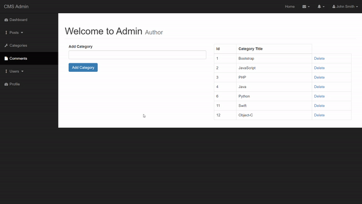

PHP for Beginners - Become a PHP Master - CMS Project
Start: 2020/08/29
End: 

1. [Data Types and More](#Data-Types-and-More)
1. [Control Structures](#Control-Structures)
1. [Custom Functions](#Custom-Functions)
1. [PHP Built-in Functions](#PHP-Built-in-Functions)
1. [How to Use Form Data in PHP](#How-to-Use-Form-Data-in-PHP)
1. [How to Use Databases in PHP](#How-to-Use-Databases-in-PHP)
1. [PHP Security](#PHP-Security)
1. [PHP and the Web](#PHP-and-the-Web)
1. [Object Oriented PHP Introduction](#Object-Oriented-PHP-Introduction)
1. [Working with files](#Working-with-files)
1. [CMS Project / Blogging System - Front End and First Steps](#CMS-Project-/-Blogging-System---Front-End-and-First-Steps)
1. [CMS - Categories & More...](#CMS---Categories-&-More...)
1. [CMS - POSTS](#CMS---POSTS)
1. [CMS - COMMENTS](#CMS---COMMENTS)
1. [CMS - USERS](#CMS-USERS)
1. [CMS - Login](#CMS-Login)
1. [CMS - Profile](#CMS-Profile)
1. [CMS - Dashboard](#CMS-Dashboard)
1. [Improving Our CMS](#Improving-Our-CMS)
1. [CMS - Extra Features](#CMS---Extra-Features)
1. [CMS - Extra Features - Users Registration](#CMS---Extra-Features---Users-Registration)
1. [CMS - Extra Features - Author related Posts](#CMS-Extra-Features-Author-related-Posts)
1. [Pagination](#Pagination)
1. [CMS - Extra Feature - Users ONLINE](#CMS---Extra-Feature---Users-ONLINE)
1. [CMS - Extra Feature - NEW Simple Password Encrypting and Login System](#CMS---Extra-Feature---NEW-Simple-Password-Encrypting-and-Login-System)
1. [CMS - Extra Feature - Improved Comment system count and display](#CMS---Extra-Feature---Improved-Comment-system-count-and-display)
1. [CMS - Extra FEature - Post for Specific User in admin](#CMS---Extra-FEature---Post-for-Specific-User-in-admin)
1. [CMS - More Security](#CMS---More-Security)
1. [Taking the Project to the Internet](#Taking-the-Project-to-the-Internet)
1. [Sending Emails](#Sending-Emails)
1. [Bootstrap Modal Delete Confirm Feature](#Bootstrap-Modal-Delete-Confirm-Feature)
1. [No posts or category message feature](#No-posts-or-category-message-feature)
1. [Some miscellaneous features](#Some-miscellaneous-features)
1. [Having fun with bugs](#Having-fun-with-bugs)
1. [Refactoring part 1](#Refactoring-part-1)
1. [New registration system](#New-registration-system)
1. [Adding prepare statements to our application for security](#Adding-prepare-statements-to-our-application-for-security)
1. [CMS Extra feature - Pretty URL's](#CMS-Extra-feature---Pretty-URL's)
1. [CMS Extra feature - Forget Password System](#CMS-Extra-feature---Forget-Password-System)
1. [CMS Extra feature - Forget Password System - Sending Email](#CMS-Extra-feature---Forget-Password-System---Sending-Email)
1. [CMS Extra feature - Realtime Notification with Pusher](#CMS-Extra-feature---Realtime-Notification-with-Pusher)
1. [CMS Extra feature - POST Likes](#CMS-Extra-feature---POST-Likes)
1. [CMS Extra feature - Creating A Separate Admin for Logged In Users](#CMS-Extra-feature---Creating-A-Separate-Admin-for-Logged-In-Users)
1. [CMS Extra feature - Multi-Language Feature](#CMS-Extra-feature---Multi-Language-Feature)

# Data Types and More
### Variables in PHP
1. Variables in PHP start with a dollar sign `$`. 
1. In convention, variables are named in camelCase. 
1. A dot `.` in PHP is for value concatenation.
    ```php
    $name = 'Allen';
    $NUMBER = 100;

    echo $name . " " . $NUMBER;
    ```

### Math
1. We can use `+`, `-`, `*`, and `/` to do basic math operations.
1. Rather than using integers and floats directly, we can use variable to keep the values and work on math operations. 

### Arrays
1. We can store multiple data in a single container. 
1. PHP arrays can be declared with `array()` or square brackets `[]` (newer version).
1. Position of elements in an array starts from index `0`.
    ```php
    $numberList = array(267,8765,345,'5345',345,'<h1>Hello</h1>');
    print_r($numberList);
    echo $numberList[0]; // 267
    ```

### Associative Arrays
1. We can "label" by using a key to index a value rather than using numbers. 
    ```php
    // regular array
    $number = array(10, 20, 49);
    echo $number[2] . "<br>";

    // associative array
    $names = array('first_name' => 'Allen', 'last_name' => 'Lin');
    print_r($names);
    echo "<br>";
    echo $names['first_name'] . ' ' . $names['last_name']; // Allen Lin
    ```

### Practice Section 2
1. Make 2 variables called number1 and number2 and set 1 to value 10 and the other 20.
1. Add the 2 variables and display the sum with `echo`.
1. Make 2 arrays with the same values, one regular and the other associative.
    ```php
    $number1 = 10;
    $number2 = 20;

    echo $number1 + $number2 . "<br>"; // 30

    $lists = array(1,2,3,4,5,6);
    $assocLists = array("number"=>10);

    echo $lists[0] . "<br>"; // 1
    echo $assocLists['number'] . "<br>"; // 10
    ```

# Control Structures
### if Statement
1. If statement can be used to control the state and the flow to decide what statement or expression will be executed in the given condition. 
    ```php
    if (3 > 10) {
        echo 'three is less than ten';
    } else if (4 < 5) {
        echo 'of course four is less than five';
    } else {
        echo 'it is not';
    }
    ```

### Comparison and Logical Operators
1. Comparison Operators
    1. equal `==`
    1. identical `===`
    1. compare `>`, `<`, `>=`, `<=`, `<>`
    1. not equal `!=`
    1. not identical `!==`
1. Logical Operators
    1. and `&&`
    1. or `||`
    1. not `!`
    ```php
    if (4 == '4' && 5 < 10) {
        echo 'it is true';
    }
    ```

### Switch Statements in PHP
1. By using `switch` statements, we can use one condition to check mulitple values. 
    ```php
    $number = 24; 
    switch($number) {
        case 34: 
            echo 'is it 34';
            break;
        case 37:
            echo 'is it 37';
            break;
        case 35:
            echo 'is it 35';
            break;
        case 24:
            echo 'is it 24';
            break;
        default: 
            echo 'we could not find anything';
            break;
    }
    ```

### While Loop in PHP
1. We can create a loop and keep iterating through a function or code if the given condition is `true`. 
    ```php
    $counter = 0;
    while ($counter <= 10) {
        echo $counter . '<br>';
        $counter++;
    }
    ```

### For Loop in PHP
1. In a for loop, we can create a variable as the counter, a condition to scope the iterations, and the logic to execute the loop. 
    ```php
    for ($counter = 0; $counter < 10; $counter++) {
        echo $counter . "<br>";
    }
    ```

### ForEach Loop in PHP
1. This is very similar to `Array.forEach()` method in JavaScript that we can use this function in PHP to iterate through the elements of an array.
    ```php
    $numbers = [1,2,3,4,5];
    foreach($numbers as $number) {
        echo $number . "<br>";
    }
    ```

### Practice Section 3
1. Make an `IF` statement with `elseif` and `else` to finally display string, I love PHP.
1. Make a `for` loop that displays 10 numbers.
1. Make a `switch` statement that test against one condition with 5 cases. 
    ```php
    $text = 'I love PHP';
    if (true) {
        echo $text;
    } else if (true) {
        echo $text;
    } else {
        echo $text;
    }

    echo "<br>";
    
    $numbers = [0,1,2,3,4,5,6,7,8,9];
    foreach($numbers as $number) {
        echo $number . "<br>";
    }

    echo "<br>";

    $number = 10;
    switch($number) {
        case 10:
            echo 'This is $number';
        break;
        case 20:
            echo 'This is correct';
        break;
        case 30:
            echo 'This is correct';
        break;
        case 1:
            echo 'This is correct';
        break;
        case 0:
            echo 'This is correct';
        break;
        default:
            echo 'This is default';
    }
    ```

# Custom Functions
### Defining Functions
1. We can group a block of code into a function and use it repeatly.
1. Naming a function is critical that the name should reveal that what does the function do.
1. We can model functions as smaller pieces in a bigger function.
1. PHP also has hoisting as JavaScript that functions can be declared after they are called in the script.
    ```php
    init();
    function init () {
        sayHi();
        echo "<br>";
        calculate(1,2);
    }

    function sayHi() {
        echo 'Hello World!';
    }

    function calculate($num1, $num2) {
        echo $num1 + $num2;
    }
    ```

### Function Parameters
1. We can pass parameters to functions to make the function more flexible to be used.
    ```php
    function greeting($message){
        echo $message;
    }
    greeting('Hello Everyone!');

    echo "<br>";

    function addNumbers($num1, $num2) {
        $sum = $num1 + $num2;
        echo $sum;
    }
    addNumbers(12, 24);
    ```

### Return Values From Functions
1. By using `return` keyword, we can assign the returend value from a function to a variable for other use.
    ```php
    function addNumbers($num1, $num2) {
        $sum = $num1 + $num2;
        return $sum;
    }

    $result = addNumbers(12, 24);

    echo $result . "<br>"; // 36

    $result = addNumbers(13, $result);
    echo $result; // 49
    ```

### Global Variable and Scope
1. We can use `global` keyword in a function to indicate that a variable is from the global scope which is out of the function block. This feature is very different from JavaScript that JavaScript functions can use global variables and change their directly. Besides, global variables are usually avoid to prevent unexpected bugs and problems. 
    ```php
    $x = 'outside';
    function convert(){
        global $x;
        $x = 'inside';
    }

    echo $x;
    echo "<br>";
    convert();
    echo $x;
    ```

### Constants
1. We can use `define()` function to declare a constant which is a variable which value is immutable. In JavaScript ES6, we can use `const` keyword to declare a variable as a constant.
1. Before PHP 5.6, only scalar data (boolean, integer, float, and string) can be contained in constants. From PHP 5.6 onwards, we can define not only scalar data but an array as a constant. 
1. Besides, we now can also use `const` in PHP to declare a constant, though it's not exactly the same as using `define()`.
    ```php
    $number = 10;
    $number = 1000;
    $number = 'Allen';
    echo $number . "<br>";
    define("NAME", 1000);
    echo NAME;
    // Works as of PHP 5.3.0 
    const CONSTANT = 'Hello World';        
    echo CONSTANT . "<br>";;
    
    // Works as of PHP 5.6.0    
    const ANOTHER_CONST = CONSTANT.'; Goodbye World';    
    echo ANOTHER_CONST . "<br>";  
    const ANIMALS = array('dog', 'cat', 'bird');    
    echo ANIMALS[1] . "<br>"; // outputs "cat"
        
    // Works as of PHP 7    
    define('ANIMALS', array(    
    'dog',    
    'cat',    
    'bird'    
    ));
    
    echo ANIMALS[1]. "<br>"; // outputs "cat"
    ```

### Practice Section 4
1. Define a function and make it return a calculation of 2 numbers
1. Make a function that passes parameters and call it using parameters values
    ```php
    function calculation(){
        $num1 = 20;
        $num2 = 50;
        $sum = $num1 + $num2;
        return $sum;
    }
    echo calculation() . "<br>"; // 70

    function addNumbers($num1, $num2){
        return $num1 + $num2;
    }
    echo addNumbers(1,2) . "<br>"; // 3
    ```

# PHP Built-in Functions
### Math Functions
1. `pow(base, power)` power of a base.
1. `rand(min, max)` to create a random number. We can give first argument as the minimum of the number, and the 2nd argument as the maximum number.
1. `sqrt([number])` to get the sqaure root of the number passed into the function.
1. `ceil([number])` to round up the number given to the function. 
1. `floor([number])` to round down the number given to the function.
1. `round([number])` to round the number given to the function. If the decimal is less than or equal to 0.4, it will be round down. On the other hand, if the decimal is greater than or equal to 0.5, it will be rounded up. 
    ```php
    echo pow(2,7); // 128 

    echo "<br>";

    echo rand(1, 1000); // a random number from 1 to 1000

    echo "<br>";
    
    echo sqrt(100); // 10
    
    echo "<br>";

    echo ceil(4.6);
    
    echo "<br>";
    
    echo floor(4.6);
    
    echo "<br>";
    
    echo round(4.5); // 5
    echo "<br>";
    echo round(3.3); // 3
    ```
### String Functions
1. Similar to MDN, we can check most of the PHP functions at [https://www.php.net/](https://www.php.net/). Besides, we can check string methods at [https://www.php.net/manual/en/ref.strings.php](https://www.php.net/manual/en/ref.strings.php). 
1. Similar to JavaScript, we can check `.length` property of a string to get the number of characters of the string value. 
    1. `String.toUpperCase()` is a JavaScript string method to turn all characters into capital.
    1. `String.toLowerCase()` is a JavaScript string method to turn all characters into lowercase.
    ```php
    $string = 'Hello World! How are you today?';
    echo strlen($string) . '<br>'; // 31

    echo strtoupper($string) . '<br>'; // HELLO WORLD! HOW ARE YOU TODAY?

    echo strtolower($string) . '<br>'; // hello world! how are you today?
    ```

### Array Functions
1. We can use `max()` and `min()` function to get the maximum or minimum value in an array.
1. `sort()` function can be used to sort the elemenets of an array to be in ascending order. Note that the function works on the array directly without returning any value. 
1. `in_array()` can be used to check if a value is an element in the given array. This function returns a boolean value, either `true` or `false`. In JavaScript, we can use `Array.includes()` to check if a value is an element of an array.
1. We can check and use other array methods at [https://www.php.net/manual/en/ref.array.php](https://www.php.net/manual/en/ref.array.php).
    ```php
    $arr1 = [1,2,3,4,5,6,7,8,9];
    $arr2 = array(99,88,77,66,55,44,33,22,11);
    $arr3 = [5213,56,266,82,44533,221,110,3334];

    echo max($arr1) . "<br>"; // 9

    echo min($arr2) . "<br>"; // 11
        
    print_r($arr3);
    ```

### Practice Section 5
1. Use a pre-built math function here and echo it
1. Use a pre-built string function here and echo it
1. Use a pre-built array function here and echo it
    ```php
    echo rand(1, 999) . "<br>"; // a random number from 1 to 999

    $text = "some gibberish words that has no meaning. Maybe I can try lorem ipsum next time.";
    echo strlen($text) . "<br>"; // 80

    $arr = [1235,6,23,488,32354,'01',2312,32,48,36,564,56789,$text];
    if (in_array($text, $arr)) {
        echo '$text is in the array';
    }
    ```

# How to Use Form Data in PHP
### Checking for Form Submission
1. `$_POST` is a global variable that collects the data send through HTML `<form>` element with HTTP POST method.
1. `$_POST` will return an associative array (object in JavaScript or dictionary in Python) which key is from the `name` attribute from the `input` element to keep the value from the input given by the user.
1. In the following case, we put PHP script on the top before the HTML elements. If we submit the form with value, we can see the last input are kept in the associative array `$_POST` and be printed on the top of the page.
    ```php
    <?php
        if (isset($_POST['submit'])) {
            echo 'yes it works' . '<br>';
            print_r($_POST); // Array ( [username] => 123 [password] => 321 [submit] => Submit )
        }
    ?>

    <body>
        <form action="form.php" method="POST">
            <input type="text" name="username" placeholder="Enter Name">
            <input type="password" name="password">
            <br>
            <input type="submit" name="submit">
        </form>
        
    </body>
    ```

### Extracting Information from Form
1. As using associative array, we can use square bracket notations to extract value from associative array. The global `$_POST` is the associative array that keeps all the input in the form from the last submit.
    ```php
    <?php
        if (isset($_POST['submit'])) {
            $username = $_POST['username'];
            $password = $_POST['password'];
            echo 'The username is ' . $username . "<br>";
            echo 'The password is ' . $password . "<br>";
        }
    ?>

    <body>
        <form action="form.php" method="POST">
            <input type="text" name="username" placeholder="Enter Name">
            <input type="password" name="password">
            <br>
            <input type="submit" name="submit">
        </form>
    </body>
    ```

### Validating the Form Values
1. We can use `isset()` to check if a key is in an associative array. `isset()` function check if a variable is assigned with value which is not `null`. If the variable does have value, `isset()` returns `true`. 
1. In this case, we can use `IF` statement with some logical conditions to check the conditions and return feedback to the user. For example, username should be longer than 5 and shorter than 10. If the username is in the array stored (which can be data from database in real practice), we can notice the user that the access is authenticated. 
    ```php
    <?php
        if (isset($_POST['submit'])) {
            $name = array('Allen', 'Peter', 'Tom', 'John', 'Tom');
            
            $minimum = 5;
            $maxmimum = 10;

            $username = $_POST['username'];
            $password = $_POST['password'];

            if (strlen($username) < 5) {
                echo 'Username has to be longer than five' . '<br>';
            }
            if (strlen($username) > $maxmimum) {
                echo 'Username cannot be longer than 10' . '<br>';
            }
            if (!in_array($username, $name)) {
                echo 'Sorry you are not allowed' . '<br>';
            } else {
                echo 'Welcome back!' . '<br>';
            }
        }
    ?>

    <body>
        <form action="form.php" method="POST">
            <input type="text" name="username" placeholder="Enter Name">
            <input type="password" name="password">
            <br>
            <input type="submit" name="submit">
        </form>
    </body>
    ```
### External Page Submission
1. In the `action` attribute of the `<form>` tag, if we change the file of action, the page will be redirected to the page given in the `action` after the user submits the form. 
1. Therefore, we can separate the page and model the functions into different files.
    ```html
    <!-- this is code is in form.php -->
    <body>
        <form action="form_process.php" method="POST">
            <input type="text" name="username" placeholder="Enter Name">
            <input type="password" name="password">
            <br>
            <input type="submit" name="submit">
        </form>        
    </body>
    ```
1. We can keep the code in `form_process.php`
    ```php
    // keep the logical operations in a separeted file
    if (isset($_POST['submit'])) {
        $name = array('Allen', 'Peter', 'Tom', 'John', 'Tom');
        
        $minimum = 5;
        $maxmimum = 10;

        $username = $_POST['username'];
        $password = $_POST['password'];

        if (strlen($username) < 5) {
            echo 'Username has to be longer than five' . '<br>';
        }
        if (strlen($username) > $maxmimum) {
            echo 'Username cannot be longer than 10' . '<br>';
        }
        if (!in_array($username, $name)) {
            echo 'Sorry you are not allowed' . '<br>';
        } else {
            echo 'Welcome back!' . '<br>';
        }
    }
    ```

### Practice Section 6
1. Make a form that submits one value to POST super global.
    ```php
    <form action="ps6.php" method="POST">
        <input type="text" name="input">
        <input type="submit" value="submit" name="submit">
    </form>
    <?php
        if (isset($_POST['submit'])) {
            $userInput = $_POST['input'];
            echo "The user gives " . $userInput;
        }
    ?>
    ```

# How to Use Databases in PHP
### Introduction to Databases
1. A database is simply a collection of related data in a organized format.
1. In this case, we use MYSQL database. A table in the database is created with columns and rows with a field (as a cell) in the table.

### Introduction to PHPmyadmin
1. By opening xampp with Apache server and MySQL service to access phpMyAdmin at `http://localhost/phpmyadmin`.

### Creating a Database in PHPmyadmin
1. We can either click the button on the top to create a table in the panel of the left or use SQL commands such as `CREATE DATABASE [databaseName]` to create a database. 

### Creating Tables and Inserting Data in PHPmyadmin
1. We create a new table `users` in `loginapp` database with 3 columns `id`, `username`, and `password`. 
    1. `id` has type as `INT` which is integer and set to be auto incremented with maximum length at 11.
    1. `username` has type as `VARCHAR` which can take all the characters as input and with length at 32. 
    1. `password` has the same configuration as `username`.
    
1. We can use GUI with `insert` tab to create new input in the table, while we may also use SQL commands to insert new input to the table. 
    ```sql
    INSERT INTO `users` (`id`, `username`, `password`) VALUES (NULL, 'allen', 'password');
    ```
1. We can select a row of input and `drop` to remove it from the table. 
1. Besides, we can also edit the input of each row in the table directly. 

### Markup for Login Page
1. We make a simple markup page with login and password input with a submit button.
    ```html
    <div class="container">
        <div class="col-xs-6">
            <form action="login.php" method="post">
                <div class="form-group">
                    <label for="username">Username</label>
                    <input type="text" name="username" class="form-control">
                </div>
                <div class="form-group">
                    <label for="password">Password</label>
                    <input type="password" name="password" id="" class="form-control">
                </div>
                <input class="btn btn-primary" type="submit" value="submit" name="submit">
            </form>
        </div>
    </div>
    ```

### Receiving Post Data From Check
1. We can use global `POST` variable to manipulate the input sent through HTML `<form>` tag with `method` attribute which is `POST`. 
    ```php
    if(isset($_POST['submit'])) {
        $username = $_POST['username'];
        $password = $_POST['password'];

        echo $username . "<br>";
        echo $password . "<br>";
    }
    ```

### Connecting to the Database using PHP
1. We can use `mysqli_connect` to connect to the database.

### Creating Records into the database table with PHP
1. We can put SQL commands as Strings in PHP script and allow the program to interact with the database. 
    ```php
    if(isset($_POST['submit'])) {
        $username = $_POST['username'];
        $password = $_POST['password'];

        $connection = mysqli_connect('localhost', 'root', 'password', 'loginapp');
        if ($connection) {
            echo "DB is connected" . "<br>";
        } else {
            die("Database connection failed");
        }

        $query = "INSERT INTO users(username,password) ";
        $query .= "VALUES ('$username', '$password')";

        $result = mysqli_query($connection, $query);

        if (!$result) {
            die('Query failed' . mysqli_error());
        }
    }
    ```

### Reading Information in the Database with PHP
1. After connecting to the database, we can use `mysqli_fetch_row([variable])` to read the data as an array. 
1. Besides, we can use `mysqli_fetch_assoc([variable])` to read the data as associative array where title of the column is the key of the object. 
    ```php
    $connection = mysqli_connect('localhost', 'root', 'password', 'loginapp');
    if ($connection) {
        echo "DB is connected" . "<br>";
    } else {
        die("Database connection failed");
    }

    $query = "INSERT INTO users(username,password) ";
    $query .= "VALUES ('$username', '$password')";

    $result = mysqli_query($connection, $query);

    if (!$result) {
        die('Query failed' . mysqli_error());
    }

    // read user data as regular array
    while($row = mysqli_fetch_row($result)) {
        print_r($row);
    }

    // read user data as associative array
    while($row = mysqli_fetch_assoc($result)) {
        print_r($row);
    }
    ```
1. We can put each row from the result into `<pre>` tags
    ```php
    <?php
        while($row = mysqli_fetch_assoc($result)) {
    ?>
    <pre>
    <?php         
            print_r($row);
            ?>
    </pre>
    <?php        
    }
    ?>
    ```

### Creating the Update Records Form
1. We can take the connection code out to model the code. For example, we can create a `db.php` in the same directory. 
    ```php
    // db.php
    $connection = mysqli_connect('localhost', 'root', 'password', 'loginapp');
    if ($connection) {
        echo "DB is connected" . "<br>";
    } else {
        die("Database connection failed");
    }
    ```
1. We then use `include "[php file]"` right after `<?php include "db.php"` to import the code. Thus, we can reuse the code without duplicating it in every file. Besides, it will be easier to manage if we change the database.
1. In this case, we can select the `id` of an user from the databsae and give new input to edit the values, such as username and password. We use `<select>` and `<option>` HTML elements to create a list for user to select the desirable user `id`.
    ```php
    <div class="container">
        <div class="col-xs-6">
        <form action="login.php" method="post">
            <div class="form-group">
                <label for="username">Username</label>
                <input type="text" name="username" class="form-control">
            </div>
            <div class="form-group">
                <label for="password">Password</label>
                <input type="password" name="password" id="" class="form-control">
            </div>
            <select name="" id="">
                <option value="">1</option>
            </select>
            <input class="btn btn-primary" type="submit" value="submit" name="submit">
        </form>        
        </div>
    </div>
    ```

### Fixing Name Attribute Value
1. This part is only to add `name` attribute in `<select>` element from the last section.

### Query to Read Id's
1. We can put a `while` loop in the `<select>` tag.
    ```php
    <select name="id" id="">
        <?php
            while($row = mysqli_fetch_assoc($result)) {
                $id = $row['id'];
                echo "<option value='$id'>$id</option>";
            }
        ?>
    </select>
    ```
1. We then model the code into a separate file, `functios.php`. Note that we should also include `db.php` into this file. Besides, we need `$connection` from the global scope. We can use `global` keyword in this case. 
    ```php
    include "db.php";
    function showAllData(){
        global $connection;
        $query = "SELECT * FROM users";
        
        $result = mysqli_query($connection, $query);
        
        if (!$result) {
            die('Query failed' . mysqli_error());
        }
        
        while($row = mysqli_fetch_assoc($result)) {
            $id = $row['id'];
            echo "<option value='$id'>$id</option>";
        }
    }
    ```

### Query to Update Username and Password
1. This section is the final step to update the username and password in to the data according to user's `id`.
1. We can use `mysqli_error()` to check if there's any problem from the `$connection`. 
1. Note that we should be careful about the SQL syntax by using `.=` to concatenate the command in one single line. The space and comma matters, because, after all, it is one single line command.
    ```php
    if(isset($_POST['submit'])) {
        $username = $_POST['username'];
        $password = $_POST['password'];
        $id = $_POST['id'];

        // be aware with space and comma
        $query = "UPDATE users SET ";
        $query .= "username = '$username', ";
        $query .= "password = '$password' ";
        $query .= "WHERE id = $id";

        $result = mysqli_query($connection, $query);
        if(!$result) {
            die("Query FAILED!" . mysqli_error($connection));
        }
    }
    ```

### Refactoring The Update Query into a Function
1. We can model the code into `functions.php` as well. 
    ```php
    // functions.php
    function updateTable() {
        global $connection;
        $username = $_POST['username'];
        $password = $_POST['password'];
        $id = $_POST['id'];

        $query = "UPDATE users SET ";
        $query .= "username = '$username', ";
        $query .= "password = '$password' ";
        $query .= "WHERE id = $id";

        $result = mysqli_query($connection, $query);
        if(!$result) {
            die("Query FAILED!" . mysqli_error($connection));
        }
    }

    // login_update.php
    if(isset($_POST['submit'])) {
        updateTable();
    }
    ```

### Delete Records From Database with PHP
1. We create another PHP file `login_delete.php` and add a new function in `functions.php`.
1. The overall structure of the page and PHP code is similar to `login_update.php`. The main differences between 2 are the SQL command changing from `SET` to `DELETE`. Besides, we don't actually need username and password in this case.
1. We can change the `value` attribute of the last `<input>` tag from `update` to `delete` for a better UX.
    ```php
    // functions.php
    function deleteRows() {
        global $connection;
        $username = $_POST['username'];
        $password = $_POST['password'];
        $id = $_POST['id'];

        $query = "DELETE from users ";
        $query .= "WHERE id = $id";

        $result = mysqli_query($connection, $query);
        if(!$result) {
            die("Query FAILED!" . mysqli_error($connection));
        }
    }

    // call the function above in login_delete.php
    ```

### Refactoring all Databases Query Code into Functions
### Making All Files Modular and Refactoring
1. These sections are just refactoring and optimizing the code. 
1. We separate `headers` and `footers` into separated file and use `include` to import to the page.

### Practice Section 7
1. Create a database in PHPMyAdmin
1. Create a table like the one from the lecture
1. Insert some data
1. Connect to database and read data

**Solution**
1. We can create a databse with a table in PHPMyAdmin directly by setting schema.
1. Use `mysqli_connect('localhost', 'root', 'password', '[newCreatedList]')` to use PHP to connect to the database.
1. Create a variable to hold the SQL query string after connecting to database.
    ```php
    // create a connection to the database
    $connection = mysqli_connect('localhost', 'root', 'password', '[newCreatedList]');
    if(!$connection) {
        die("Database connection failed...") . mysqli_error($connection);
    } else {
        echo "The database is connected";
    }

    // create variable to hold SQL query string
    $query = "SELECT * FROM [tableName]";

    $result = mysqli_query($connect, $query);
    if (!$result) {
        die("Query Failed...");
    }

    // use while loop to check each row retrieved from the table
    // use print_r or echo to render the result on the page
    while($records = mysqli_fetch_assoc($result)) {
        print_r($records);
    }
    ```

# PHP Security
### SQL Injection - How to Prevent it
1. SQL injection is that users intentionally give SQL commands as the input to send to Database. For example, a user can give `DROP TABLE` as the input for `username` and this SQL string may delete the table which we store user data in the database or cause other damages.
1. We can use `mysqli_real_escape_string()` function to prevent SQL injection. Therefore, all the input will consider regular string input (characters and text) without affecting or abusing the database.
    ```php
    if (isset($_POST['submit'])) {
        global $connection;

        $username = $_POST['username'];
        $password = $_POST['password'];

        $username = mysqli_real_escape_string($connection, $username);
        $password = mysqli_real_escape_string($connection, $password);

        $query = "INSERT INTO users(username, password) ";
        $query .= "VALUES ('$username', '$password')";

        $result = mysqli_query($connection, $query);
        if (!$result) {
            die('Query Failed' . mysqli_error());
        }
    }
    ```

### Password Encryption
1. It's very risky to store password directly in the database, so we can "encrypt" the code into something else, such as a string in more than 20 characters with letters, numbers, and special symbols.
1. In PHPMyAdmin, we can change schema of a table by accessing `Struture` tab on the top. For example, we can change the type of data in `VARCHAR` with length `32` to `200` which means the input can be up to 200 characters.
1. We can use PHP built-in function [`crypt()`](https://www.php.net/manual/en/function.crypt.php) to create hashed string. 
1. Note that the hashed string by default is relatively weak. We can add `salt` to the hashing algorithm to make it stronger. According to PHP documentation, we can use `CRYPT_BLOWFISH` to encrypt the password. For example, the **salt** can be `$2y$10$` which means to run `$2y$` hashing 10 times.
1. Note that the number of characters used for `salt` should be at least **22** characters.
    ```php
    if (isset($_POST['submit'])) {
        global $connection;

        $username = $_POST['username'];
        $password = $_POST['password'];

        // prevent SQL injection
        $username = mysqli_real_escape_string($connection, $username);
        $password = mysqli_real_escape_string($connection, $password);

        // create the salt for hashing
        $hashFormat = "$2y$10$";
        // salt should have at least 22 characters for blowfish
        $salt = "somethingWeMadeUpButShouldBeMuchLonger";
        $hashF_and_salt = $hashFormat . $salt;

        // use crypt() to hash password
        $encrypt_password = crypt($password, $hashF_and_salt);
        
        $query = "INSERT INTO users(username, password) ";
        $query .= "VALUES ('$username', '$password')";

        $result = mysqli_query($connection, $query);
        if (!$result) {
            die('Query Failed' . mysqli_error());
        }
    }
    ```

### Practice Section 8
1. Make a variable with some text as value
1. Use `crypt()` function to encrypt it
1. Assign the encrypted result to a variable
1. Echo the variable
    ```php
    $password = "mysecretpassword";
    $hashFormat = "$2y$10$";
    $salt = "ThisIsASaltThatLengthShouldBeMoreThan22Characters";
    $hashF_and_salt = $hashFormat . $salt;
    $password_encrypted = crypt($password, $hashF_and_salt);

    echo $password_encrypted . "<br>";
    ```


# PHP and the Web
### Introduction to HTTP Requests and more
1. PHP is meant to be used for the web. We can use the following methods to collect information and data from users.
    1. Forms
    1. URL / Links
    1. Cookies
    1. Sessions

### Using the GET Super global
1. We can pass parameters in URL and send to the server with question mark `?` with `[key]=[value]` pairs. For example, `http://localhost/webPHP/get.php?key=value`. We can use `$_GET` to read the parameters in the URL. Besides, we can use ampersand `&` to pass multiple parameters from client to server. 
    ```php
    <?php
        print_r($_GET);
    ?>
    <a href="get.php?id=200">Click Me</a>
    ```
1. Besides, we can generate the parameters in the anchor tag dynamically. 
    ```php
    <?php
        $id = 10;
        $button = "Submit";
    ?>
    <a href="get.php?id=<?php echo $id;?>"><?php echo $button;?></a>
    ```

### Using the POST Super global
1. We have been using this variable `$_POST` with `<form>` tag.
    ```php
    <?php
        echo $_POST['name'];
    ?>
    <form action="post.php" method="POST">
        <input type="text" name="name">
        <input type="submit" value="Submit" name="submit">
    </form>
    ```

### About Cookies in PHP
1. When a user use browser to visit a website, the server (of the website) may send a cookie to user and store locally at user's machine. For example, in Google Chrome, we can go to "settings" > "privacy" > "cookies and other site data" to check the cookies store in the machine.
1. Servers can check cookies and verify the data such as the browsing and history records of the user to provide relative and personalized information to improve user experience or convert sales. 

### Setting Cookies with PHP
1. We can check `$_COOKIE` variable which is an associative array that we can retreive data from cookies stored on user's machine.
1. We can use `setcookie()` function to set up cookies on client side. The function takes 3 parameters, `name`, `value`, and `expiration`. Note that `expiration` is in seconds. We can use `time()` function to get current time in seconds since 1970/01/01 00:00 (a conventional benchmark time in computers.) and add up with duration for the cookie to be valid.
    ```php
    $name = "SomeName";
    $value = 100;
    // duration for a week in seconds
    $expiration = time() + (60*60*24*7);

    setcookie($name, $value, $expiration);
    ```
    

### Reading Cookies in PHP
1. From the last section, we can set up a cookie and be stored at user's machine. We can use `isset()` function to check if there is any `cookie` set. We then can use the info and data from the cookie and provide personalized user experience. 
    ```php
    $name = "SomeName";
    $value = 100;
    // duration for a week in seconds
    $expiration = time() + (60*60*24*7);

    setcookie($name, $value, $expiration);

    if (isset($_COOKIE['SomeName'])) {
        $someOne = $_COOKIE['SomeName']; 
        echo $someOne;
    } else {
        $someOne = "";
    }
    ```

### How use Sessions in PHP
1. We can start a session with `session_start()`. The function will set a cookie for the user as the reference for the session. However, this method saves much more storage and code for the purpose.
1. Every page that uses session should call `session_start()` to be able to access `$_SESSION` variable. When users browsing from a page to another, server can keep the data when the user has done something to be able to track on user behavior.
    ```php
    // session1.php
    session_start();
    $_SESSION['greeting'] = "Hello World. This is some extra text";

    // session2.php
    session_start();
    echo $_SESSION['greeting'];
    ```
    

### Practice Section 9
1. Create a link saying `Click Here` and set the link `href` attribute to pass some parameters and use the `GET` super global.
1. Set a cookie that expires in one week.
1. Start a session and set it to value.
    ```php
    <?php
        // print out parameters from the anchor tag
        print_r($_GET);

        // set up, configure and print out the cookie
        $name = "ThisIsACookie";
        $value = "CookieValue";
        $expireation = time() + (60*60*24*7);
        setcookie($name, $value, $expireation);
        print_r($_COOKIE);

        // set up and print out the session
        session_start();
        $_SESSION['message'] = "How are you?";
        print_r($_SESSION);
    ?>
    <!DOCTYPE html>
    <html lang="en">
    <head>
        <meta charset="UTF-8">
        <meta name="viewport" content="width=device-width, initial-scale=1.0">
        <title>Document</title>
    </head>
    <body>
        <?php $params="value";?>
        <a href="ps9.php?key=<?php echo $params;?>">Click Me</a>
    </body>
    </html>
    ```
1. For `$_GET` to retrieve the data from URL parameters, we can use `isset()` to check if the associative array is not empty.
    ```php
    if (isset($_GET)) {
        print_r($_GET);
    }
    ```

# Object Oriented PHP Introduction
### What are Classes and Objects Introduction
1. A `class` is a "blue print", "definitio", or "description of something in the program" and defines two things, `Properties` and `Methods`.
    1. `Property` can be variables, arrays, or data. 
    1. `Method` are functions / behaviors.
1. A class describe an object. An object can be a variable, a function, or a data structure in the program. For example, a `Car` object can have several properties and methods
    1. Properties - Wheels, Seats, Radio
    1. Methods - Move Wheel, Move Seats, Turn on Radio

### What are Classes and How to Define Them in PHP
1. We can use `class` keyword to create a Class in PHP. Besides, we can use `class_exists()` function to check if a class exists.
    ```php
    class Car {
        
    }

    if (class_exists("Car")) {
        echo "Yes Car class exists";
    } else {
        echo "no";
    }
    ```

### What are Class Methods and How to Create Them
1. We can use `method_exists()` to check if a method exists in the given class. This function takes 2 arguments, 1st is the class, while the 2nd if the method that we want to check.
    ```php
    class Car {
        function moveWheels() {
            echo "Wheels move";
        }
    }

    if (method_exists("Car", "MoveWheels")) {
        echo "The method exists";
    } else {
        echo "No the method doesn't exist";
    }
    ```

### How to Instantiate a Class
1. We can use `new` keyword (the same as JavaScript) to create new instance (object) of a class. 
1. To call a method of an object, we can use `->` arrow notation to call the method. 
    ```php
    class Car {
        function moveWheels() {
            echo "Wheels move";
        }
    }

    $car1 = new Car();
    $car1->moveWheels();
    ```

### Adding Properties to Our Class
1. We can use keyword `var` to create properties in a class. This syntax is similar to decalre a variable with `var` in JavaScript. However, to call the property, we don't put dollar sign but the variable name itself.
1. Similar to JavaScript, we can change the property value of an instance of a class. Besides, we can use `$this` keyword to refer back to the object itself (as `this` keyword in JavaScript which refers to the current object) and change the property from its own method.
    ```php
    class Car {
        var $wheels = 4;
        var $hood = 1;
        var $engine = 1;
        var $doors = 4;

        function moveWheels() {
            $this->wheels = 10;
            echo "Wheels move";
        }

        function createDoors() {
            $this->doors = 6;
        }
    }

    $sedan = new Car();
    echo $sedan->wheels . "<br>"; // 4
    $sedan->moveWheels() . "<br>";  // Wheels move
    echo $sedan->wheels . "<br>"; // 10 
    $sedan->wheels = 8;
    echo $sedan->wheels . "<br>"; // 8

    $truck = new Car();
    echo $truck->wheels . "<br>"; // 4
    echo $truck->wheels = 10 . "<br>"; // 10
    $truck->createDoors();
    echo $truck->doors . "<br>"; // 6
    ```

### Class Inheritance
1. Inheritance is very useful for extensions. Therefore, we can create a new class without rewriting all the properties and functions of a class. In PHP, we can use `extends` keyword to inherit properties and methods from another class. 
    ```php
    class Car {
        var $wheels = 4;
        var $hood = 1;
        var $engine = 1;
        var $doors = 4;

        function moveWheels() {
            $this->wheels = 10;
            echo "Wheels move";
        }

        function createDoors() {
            $this->doors = 6;
        }
    }
    
    $car = new Car();

    class Plane extends Car {
        var $wheels = 20;
    }

    $jet = new Plane();
    echo $jet->MoveWheels() . "<br>"; // Wheels move
    echo $jet->wheels . "<br>"; // 10 
    ```

### Constructors 
1. We can use `__construct` to create a method (function) in a class. This constructor function will be called and executed immediately when the instance is created. Besides, this method is usally set up to give default value to a new instance when the object is created. 
    ```php
    class Car {
        var $wheels = 4;
        var $hood = 1;
        var $engine = 1;
        var $doors = 4;

        function __construct() {
            echo $this->wheels = 10;
        }

    }
    
    $car = new Car(); // 10
    ```

### Data Access
1. Properties of a class can be declared by different keyword to work in different scopes, `var`, `public`, `protected`, and `private`.
    1. `var` is the regular keyword to be used to declare the property of a class.
    1. `public` will make the data accessible in the global scope through out the program. This keyword works similar to `var`.
    1. `protected` will limit the property to be used on the class and sub-class, such as a class inherited properties and methods. For example, this property can only be accessed by calling a method that use `$this` to access the property.
    1. `private` will limit the property to be accessible only in the current class. In the following example, `Truck` inherits properties and methods from `Car`, but can use `engine` property from `Car` class, as it `private`.
    ```php
    class Car {
        public $wheels = 4;
        protected $hood = 1;
        private $engine = 1;
        var $doors = 4;

        // hood is protected, so can only be accessed by the method of the class
        function showProperty() {
            return $this->hood;
        }

    }
    
    $car = new Car();
    echo "Car has " . $car->showProperty() . " hood <br>"; // Car has 1 hood

    class Taxi extends Car {

    }

    $taxi = new Taxi();
    echo "Taxi has " . $taxi->showProperty() . "hood <br>"; // Taxi has 1 hood 
    
    class Truck extends Car {
        function showProperty() {
            return $this->$engine;
        }
    }

    $truck = new Truck();

    echo "Truck has " . $truck->showProperty() . " engine <br>"; // Truck has  engine
    ```

### Static Data in Classes
1. We can use `static` rather tha `var` or other keywords to decalre a static property for the class and its instances. Note that we can't use regular arrow notation `->` to call the property, but call the class name directly with double column `::`. Besides, as the static becomes a variable, we need to put dollar sign to call it.
    ```php
    class Car {
        static $wheels = 4;
        var $doors = 4;

        // hood is protected, so can only be accessed by the method of the class
        function showProperty() {
            Car::$wheels = 10;
        }

    }
    
    $car = new Car();
    echo Car::$wheels . "<br>"; // 4

    Car::showProperty();
    
    echo Car::$wheels . "<br>"; // 10
    ```

### Practice Section 10
1. Make a class called `Dog`
1. Set some properties for `Dog`. For example, eye colors, nose, or fur color.
1. Make a method named `showAll` that prints all the properties of `Dog` instance. 
1. Instantiate the class and create a sub-class `Pitbull`.
1. Call the method `showAll`
    ```php
    class Dog {
        var $eyeColor = "brown";
        var $nose = 1;
        var $furColor = "white";

        function showAll(){
            echo "Eye color is " . $this->eyeColor . "<br>";
            echo "This dog has " . $this->nose . " nose <br>";
            echo "Fur color is " . $this->furColor . "<br>";
            return [$this->eyeColor, $this->nose, $this->furColor];
        }
    }

    $dog = new Dog();
    $properties = $dog->showAll();
    print_r($properties);
    echo "<br>";

    class Pitbull extends Dog {
        var $furColor = "dark grey";
    }

    $pitbull = new Pitbull();
    echo $pitbull->eyeColor . "<br>"; 
    echo $pitbull->nose . "<br>"; 
    echo $pitbull->furColor . "<br>"; 
    print_r($pitbull->showAll());
    ```

# Working with files
### Opening and Creating Files
### Writing to Files
1. We can use `fopen()` function in PHP to run on apache2 server. Note that the instructor noticed there would be permission issues for Mac and Linux users. However, I have run the function on WSL which has no problem for the function to create and write in the file. 
1. We can use `IF` statement to check if `fopen()` runs, and use `fwrite()` to modify the file. Note that the function will overwrite the whole content of the file with the 2nd argument rather than append new contents in the file.
1. After writing into the file, we should use `fclose()` to close the file to release working memory of the server. 
    ```php
    $file = "example.txt";

    if ($handle = fopen($file, 'w')) {
        
        fwrite($handle, "I love PHP, though it's very weird");

        fclose($handle);
    } else {
        echo "The file could not be written.";
    }
    ```

### Reading Files
1. We can use `fread()` to read a file in the same directory of the PHP file. Note that `fread()` function takes 2 arguments, 1st is the file, and the 2nd is the size of the file. 1 byte means 1 character of the file, if it's a text file. For exmaple, if we give the 2nd argument as `5`, the program returns only the first 5 characters of the text file.
1. In addition, we can use `filesize()` function which takes the file to check its size, so we can get the whole file read and returned by the function. 
1. We should close the file after reading as writing it to release working memory of the server. 
    ```php
    $file = "example.txt";

    if ($handle = fopen($file, 'r')) {
        
        echo $content = fread($handle, filesize($file)); // Each bite equals a character

        fclose($handle);
    } else {
        echo "The file could not be read.";
    }
    ```

### Deleting Files
1. To delete a file, we can simply use `unlink([fileNameWithPath])` to delete the file.
    ```php
    unlink("[fileToDelete]");
    ```


# CMS Project / Blogging System - Front End and First Steps
### Intro Tour of the CMS
1. We will build several functions on the bloging website which can also be used with content management. This site is as a CMS similar to WordPress. 
1. Users can leave comments on each post of blog and articles, while the comments should be approved to be shown on the page. 
1. A search function is available on the site for visitors to search for certain contents on the site. 
1. An admin and management backend is available to manage the website in different sectors, such as posts, comments, users (writer), and media and graphics of the website.
1. The website owner can write new posts and edit posts and manage categories to group articles.
1. On the management, users can check comments, traffic, and other statistics of performance of the website.
1. The data and information are genereated dynamically from the data from the database.
1. The website is responsive and mobile friendly.

### Turning on Some Important Features
1. We can turn on `display_errors` to show the issues of the code when we run it on apache2 server. In WSL the file `php.ini` is on `/etc/php/7.2/apache2/php.ini`. We can use `sudo nano php.ini` and search for `display_errors` in the file to turn the feature on. Note that it should be `On` with O in capital.
1. After changing the setting, we can use `sudo service apache2 restart` to restart the server. 
1. Besides, we can change `output_buffering=4096` to ensure its value is `4096`. The reason to turn this feature on is that, if we use `header()` to send data, it sometimes carry with several lines of whitespaces, which can cause error on the server.

### Adding our Assets / Working Structure
1. This section is to download the files from the lecture.
    1. `/admin`
    1. `/css`
    1. `/fonts`
    1. `/js`
    1. `index.php`
    1. `post.php`
1. We create an extra folder for `images` in both root directory and `admin` folder. 

### Creating database and Category Table for the CMS
1. If the OS and environment is apache2 server and there's an index.php at the root directory, the server will use the file as the homepage, so we don't need to specify the file name on the URL. 
1. In this lecture, we should check if the PHP version we are using supports `mysqli` API.
1. We can create a new database `cms` and creat a table for categories named `category` with for 2 columns. 
    1. `cat_id` is the primary key as `INT` and length up to `3`, which means we can create up to 999 categories in the database.
    1. `cat_title` is the name in the category which we can set as `VARCHAR` with length up to `255`. 

### Connecting to the Database with PHP
1. As the files and data will be on public server, we can use `PHP` program as the middleware to connect to the database to verify and validate the inputs from users before the info. are sent to the database to prevent potential risks such as SQL injection.
1. In this case, we create a `includes` folder in the root directory and create a file `db.php` which is used to make connection between the main PHP program and the database.
1. Note that we can set up environment variable in Linux and use `getenv('key')` to increase security of keeping password. Besides, the value of the envrionment variable will only be print in the terminal by using `php filePath`. It won't be printed on the browser. Check how to set environment variable in WSL [here](https://github.com/allenlin90/programmingLearning/tree/master/linuxOs). However, this `getenv()` function is only available on the server side, so we can't use this to retrieve environment variable and render the value to our webpage. Therefore, we need to use `SetEnv` and setup the variable in `/etc/apache2/sites-enabled/000-default.conf`.
1. We can use associative array to store the values and use `foreach` loop to create constants. Besides, we can use `strtoupper()` function to turn the string into uppercase. We can review how to create [constants](#Constants). Recalling that constants in PHP doesn't have dollar sign `$` as regular, mutable variables.
    ```php
    $db['db_host'] = 'localhost';
    $db['db_user'] = 'root';
    $db['db_name'] = 'cms';

    foreach($db as $key => $value) {
        define(strtoupper($key), $value);
    }

    $pw = getenv('mysqlpw');
    // echo $pw."\n";
    $connection = mysqli_connect(DB_HOST, DB_USER, $pw, DB_NAME);

    if ($connection) {
        echo "We are connected" . "\n";
    }
    ```

### Making our Files Reuseable
1. We can make some repeatitive code and data in a separated file and be included if it is required. In this case, we can create `header`, `footer`, `sidebar`, and `navigation` for the webpage. We keep the files in the same directory with `db.php`.
    ```php
    <?php include "includes/header.php";?>
    <!-- Navigation -->
    <?php include "includes/navigation.php";?>

    <!-- Page Content -->
    <div class="container">

    <div class="row">

        <!-- Blog Entries Column -->
        <div class="col-md-8">

            <h1 class="page-header">
                Page Heading
                <small>Secondary Text</small>
            </h1>

            <!-- First Blog Post -->
            <h2>
                <a href="#">Blog Post Title</a>
            </h2>
            <p class="lead">
                by <a href="index.php">Start Bootstrap</a>
            </p>
            <p><span class="glyphicon glyphicon-time"></span> Posted on August 28, 2013 at 10:00 PM</p>
            <hr>
            
            <hr>
            <p>Lorem ipsum dolor sit amet, consectetur adipisicing elit. Dolore, veritatis, tempora, necessitatibus inventore nisi quam quia repellat ut tempore laborum possimus eum dicta id animi corrupti debitis ipsum officiis rerum.</p>
            <a class="btn btn-primary" href="#">Read More <span class="glyphicon glyphicon-chevron-right"></span></a>

            <hr>

        </div>

        <!-- Blog Sidebar Widgets Column -->
        <?php include "includes/sidebar.php";?>

    </div>
    <!-- /.row -->

    <hr>
    <!-- footer -->
    <?php include "includes/footer.php";?>
    ```
    

### Inserting Data into Category Table and Displaying it
1. We can create 2 new inputs to `categories` table in the database. Note that we can navigate to Ooperations' tab on the top after clicking the database or table we'd like to interact with and change its name. We then create 2 new inputs in the table. These input will be used to create items in the list of navigation on the webpage. 
1. Besides, we can insert multiple inputs to the table. In this case, we put `Bootstrap`, `JavaScript`, `PHP`, and `Java`.
    ```php
    $query = "SELECT * FROM categories";
    $selectAllCategoriesQuery = mysqli_query($connection, $query);
    while($row = mysqli_fetch_assoc($selectAllCategoriesQuery)) {
        $catTitle = $row['cat_title'];
        echo "<li><a href='#'>{$catTitle}</a></li>";
    }
    ```
    
    
### Creating the Posts Table
1. We create another table in `cms` database to store the data for posts in `index.php` with 10 columns
    1. `post_id` is INT type with length at 3. 
    1. `post_category_id` is INT type with length at 3 and will be alinged with the `category_id` in `categories` table.
    1. `post_title` is VARCHAR type with length at 255.
    1. `post_author` is VARCHAR type with length at 255.
    1. `post_date` is DATE type.
    1. `post_image` is TEXT type.
    1. `post_content` is TEXT type.
    1. `post_tag` is VARCHAR type with length at 255.
    1. `post_comment_count` is VARCHAR type with length at 255.
    1. `post_status` is VARCHAR type with length at 255 and `default` as "**draft**".
    

### Post Comment Count Update 
1. This section is only to modify the type of `post_comment_count` field from VARCHAR to INT, as it's a incrementing number. Besides, we can set its length to be up to `11` as `255` is too much.
1. We can go to the table and select `CHANGE` on the row to modify the schema.

### Inserting Data into the Posts Table and Displaying it
1. We can create some input in `posts` table. For example, we follow the schema to create a post in `posts` table. We then can retrieve the data from database and render the information on `index.php`. We can use the HTML template as the layout and put PHP script in for the dynamic value that we retreive from the database. 
    ```php
    <?php include "includes/db.php";?>
    <?php include "includes/header.php";?>
    <!-- Navigation -->
    <?php include "includes/navigation.php";?>

    <!-- Page Content -->
    <div class="container">

    <div class="row">

        <!-- Blog Entries Column -->
        <div class="col-md-8">

            <?php 
                $query = "SELECT * FROM posts";

                $selectAllPostsQuery = mysqli_query($connection, $query);

                while($row = mysqli_fetch_assoc($selectAllPostsQuery)) {
                    $postTitle = $row['post_title'];
                    $postAuthor = $row['post_author'];
                    $postDate = $row['post_date'];
                    $postImage = $row['post_image'];
                    $postContent = $row['post_content'];
            ?>            

            <h1 class="page-header">
                Page Heading
                <small>Secondary Text</small>
            </h1>

            <!-- First Blog Post -->
            <h2>
                <a href="#"><?php echo $postTitle?></a>
            </h2>
            <p class="lead">
                by <a href="index.php"><?php echo $postAuthor?></a>
            </p>
            <p><span class="glyphicon glyphicon-time"></span> Posted on <?php echo $postDate?></p>
            <hr>
            
            <hr>
            <p><?php echo $postContent?></p>
            <a class="btn btn-primary" href="#">Read More <span class="glyphicon glyphicon-chevron-right"></span></a>

            <hr>

            <?php }?>
        </div>

        <!-- Blog Sidebar Widgets Column -->
        <?php include "includes/sidebar.php";?>

    </div>
    <!-- /.row -->

    <hr>
    <!-- footer -->
    <?php include "includes/footer.php";?>
    ```

### Inserting the Post Image and Displaying it
1. We can create a new folder for `images` in the root directory. The `post_image` field in the `posts` table will keep the path of the file rather than the file itself. For example, we have an image `image_1.jpg` in `images`. We can update this value in the database for related folder
1. We update the image tag in `index.php`.
    ```php
    " alt="">
    ```
    

### Creating a Custom Search Engine Part 1
1. In this section, we will make a function to allow users to search for posts on the website. This part of HTML elements have been taken out and kept in `includes/sidebar.php`.
    
1. In this case, the target is just to enable the function on the frontend. We modify the section of Blog Search function by adding `<form>` tag with POST method, give `name` attribute to both `<input>` and `<button>` tag. Besides, we can use `isset()` function with `IF` statement to check if `$_POST['submit']` has been made.
    ```php
    <?php
        if (isset($_POST['search'])) {
            $search = $_POST['search'];
        }
    ?>
    <!-- Blog Search Well -->
    <div class="well">
        <h4>Blog Search</h4>
        <form action="" method="post">
        <div class="input-group">
            <input name="search" type="text" class="form-control">
            <span class="input-group-btn">
                <button name="submit" class="btn btn-default" type="submit">
                    <span class="glyphicon glyphicon-search"></span>
            </button>
            </span>
        </div>
        <!-- /.input-group -->
        </form>
    </div>
    ```

### Creating a Custom Search Engine Part 2
1. Since the frontend UI is ready, we can enable it to interactive with database to manipulate the real data from the search.
1. In this case, we use `LIKE` rather than `=` and followed with percentage `%` to find similar or related text in the database. We can look up for more details of how SQL works. 
    ```php
    if (isset($_POST['search'])) {
        $search = $_POST['search'];

        $query = "SELECT * FROM posts WHERE post_tags LIKE '%$search%'";
        $searchQuery = mysqli_query($connection, $query);

        if(!$searchQuery) {
            die("QUERY FAILED" . mysqli_error($connection));
        }

        $count = mysqli_num_rows($searchQuery);

        if($count == 0) {
            echo "<h1> NO RESULT </h1>";
        } else {
            echo "<h1> It's a valid search! </h1>";
        }
    }
    ```

### Creating a Custom Search Engine Part 3
1. We redirect the user from `index.php` to `search.php` with the search result. Therefore, we just copy and integrate the code from both `index.php` and `includes/sidebar.php` and make `search.php` in the root directory. Besides, we need to change the `action` attribute in `<form>` element in `sidebar.php` to use the function on `search.php`.
1. In this case, we take the original `$query` with `SELECT * FROM posts` off, as we'd like the query to render only the searched results from the database. Therefore, the page will only render the results from query if there's any. If not, it returns the result in the `IF` statement as `NO RESULT`.
    ```php
    // search.php (a duplicate and integration with index.php and sidebar.php)
    <?php include "includes/db.php";?>
    <?php include "includes/header.php";?>
    <!-- Navigation -->
    <?php include "includes/navigation.php";?>

    <!-- Page Content -->
    <div class="container">

        <div class="row">

            <!-- Blog Entries Column -->
            <div class="col-md-8">

                <?php
                    if (isset($_POST['search'])) {
                        $search = $_POST['search'];

                        $query = "SELECT * FROM posts WHERE post_tags LIKE '%$search%'";
                        $searchQuery = mysqli_query($connection, $query);

                        if(!$searchQuery) {
                            die("QUERY FAILED" . mysqli_error($connection));
                        }

                        $count = mysqli_num_rows($searchQuery);

                        if($count == 0) {
                            echo "<h1> NO RESULT </h1>";
                        } else {
                            while($row = mysqli_fetch_assoc($searchQuery)) {
                                $postTitle = $row['post_title'];
                                $postAuthor = $row['post_author'];
                                $postDate = $row['post_date'];
                                $postImage = $row['post_image'];
                                $postContent = $row['post_content'];
                            ?>            

                            <h1 class="page-header">
                                Page Heading
                                <small>Secondary Text</small>
                            </h1>

                            <!-- First Blog Post -->
                            <h2>
                                <a href="#"><?php echo $postTitle?></a>
                            </h2>
                            <p class="lead">
                                by <a href="index.php"><?php echo $postAuthor?></a>
                            </p>
                            <p><span class="glyphicon glyphicon-time"></span> Posted on <?php echo $postDate?></p>
                            <hr>
                            " alt="">
                            <hr>
                            <p><?php echo $postContent?></p>
                            <a class="btn btn-primary" href="#">Read More <span class="glyphicon glyphicon-chevron-right"></span></a>

                            <hr>
                        <?php }
                        }
                    }?>
            </div>

            <!-- Blog Sidebar Widgets Column -->
            <?php include "includes/sidebar.php";?>

        </div>
        <!-- /.row -->

        <hr>
        <!-- footer -->
        <?php include "includes/footer.php";?>
    ```

### Adding Categories to the Sidebar
1. After blog searching function, we work on `Blog Category Section` in `sidebar.php`.
1. We can take the code to retrieve data of `categories` in `includes/navigation.php`. Besides, rather than keep replicating the whole `<ul>` list. we can put the `while` loop in the `<ul>` tag and generate `<li><a></a></li>` tags.
1. In addition, we can limit the number of result of query in the database. For example, if we change the query statement to `SELECT * FROM categories LIMIT 2`, only 2 results will be returned from the query.
    ```php
    // sidebar.php
    <!-- Blog Categories Well -->
    <div class="well">
        <?php
            $query = "SELECT * FROM categories LIMIT 2"; // limit the results from query to be only 2
            $selectCategoriesSidebar = mysqli_query($connection, $query);
            
        ?>
        <h4>Blog Categories</h4>
        <div class="row">
            <div class="col-lg-6">
                <ul class="list-unstyled">
                    <?php 
                        while($row = mysqli_fetch_assoc($selectCategoriesSidebar)) {
                        $catTitle = $row['cat_title'];
                        echo "<li><a href='#'>{$catTitle}</a></li>";
                    }?>                    
                </ul>
            </div>
            <!-- /.col-lg-6 -->
            <div class="col-lg-6">
                <ul class="list-unstyled">
                    <li><a href="#">Category Name</a>
                    </li>
                    <li><a href="#">Category Name</a>
                    </li>
                    <li><a href="#">Category Name</a>
                    </li>
                    <li><a href="#">Category Name</a>
                    </li>
                </ul>
            </div>
            <!-- /.col-lg-6 -->
        </div>
        <!-- /.row -->
    </div>
    ```
1. For the widget section below, we keep the code in a separated file `widget.php` in `includes` folder.
    ```php
    // sidebar.php
    include "widget.php";

    // widget.php
    <div class="well">
        <h4>Side Widget Well</h4>
        <p>Lorem ipsum dolor sit amet, consectetur adipisicing elit. Consequatur nam odit reiciendis distinctio officia quisquam deleniti voluptate voluptatum consectetur est.</p>
    </div>
    ```

# CMS - Categories & More...
### Creating Reuseable Code in the Admin
1. In this case, we focus on the files in `admin` to enable admin management function of the website.
1. In `navigation.php`, we can add another link to direct the user to the admin page. 
1. In `admin/index.php`, we modify the items in the navigation bar of the top for user to direct back to homepage easily by adding an anchor tag. 
    ```html
    <ul class="nav navbar-right top-nav">
        <li><a href="../index.php">Home</a></li>
        ...
    </ul>
    ```
1. We can also have files modeled and managed in `admin`, so we create an `includes` folder in `admin`. In this case, we create `header.php`, `footer.php`, and `navigation.php`.

### Creating the Navigation Links in Admin
1. This section is to modify `admin/includes/navigation.php` as the followings. This will affect to the side navigation bar in the admin page.
    1. Dashboard
    1. Posts (dropdown)
    1. Categories
    1. Comments
    1. Users (dropdown)
    1. Profile
    ```html
    <nav class="navbar navbar-inverse navbar-fixed-top" role="navigation">
    <!-- Brand and toggle get grouped for better mobile display -->
    <div class="navbar-header">
        <button type="button" class="navbar-toggle" data-toggle="collapse" data-target=".navbar-ex1-collapse">
            <span class="sr-only">Toggle navigation</span>
            <span class="icon-bar"></span>
            <span class="icon-bar"></span>
            <span class="icon-bar"></span>
        </button>
        <a class="navbar-brand" href="index.html">CMS Admin</a>
    </div>
    <!-- Top Menu Items -->
    <ul class="nav navbar-right top-nav">
        <li><a href="../index.php">Home</a></li>
        <li class="dropdown">
            <a href="#" class="dropdown-toggle" data-toggle="dropdown"><i class="fa fa-envelope"></i> <b class="caret"></b></a>
            <ul class="dropdown-menu message-dropdown">
                <li class="message-preview">
                    <a href="#">
                        <div class="media">
                            <span class="pull-left">
                                
                            </span>
                            <div class="media-body">
                                <h5 class="media-heading">
                                    <strong>John Smith</strong>
                                </h5>
                                <p class="small text-muted"><i class="fa fa-clock-o"></i> Yesterday at 4:32 PM</p>
                                <p>Lorem ipsum dolor sit amet, consectetur...</p>
                            </div>
                        </div>
                    </a>
                </li>
                <li class="message-preview">
                    <a href="#">
                        <div class="media">
                            <span class="pull-left">
                                
                            </span>
                            <div class="media-body">
                                <h5 class="media-heading">
                                    <strong>John Smith</strong>
                                </h5>
                                <p class="small text-muted"><i class="fa fa-clock-o"></i> Yesterday at 4:32 PM</p>
                                <p>Lorem ipsum dolor sit amet, consectetur...</p>
                            </div>
                        </div>
                    </a>
                </li>
                <li class="message-preview">
                    <a href="#">
                        <div class="media">
                            <span class="pull-left">
                                
                            </span>
                            <div class="media-body">
                                <h5 class="media-heading">
                                    <strong>John Smith</strong>
                                </h5>
                                <p class="small text-muted"><i class="fa fa-clock-o"></i> Yesterday at 4:32 PM</p>
                                <p>Lorem ipsum dolor sit amet, consectetur...</p>
                            </div>
                        </div>
                    </a>
                </li>
                <li class="message-footer">
                    <a href="#">Read All New Messages</a>
                </li>
            </ul>
        </li>
        <li class="dropdown">
            <a href="#" class="dropdown-toggle" data-toggle="dropdown"><i class="fa fa-bell"></i> <b class="caret"></b></a>
            <ul class="dropdown-menu alert-dropdown">
                <li>
                    <a href="#">Alert Name <span class="label label-default">Alert Badge</span></a>
                </li>
                <li>
                    <a href="#">Alert Name <span class="label label-primary">Alert Badge</span></a>
                </li>
                <li>
                    <a href="#">Alert Name <span class="label label-success">Alert Badge</span></a>
                </li>
                <li>
                    <a href="#">Alert Name <span class="label label-info">Alert Badge</span></a>
                </li>
                <li>
                    <a href="#">Alert Name <span class="label label-warning">Alert Badge</span></a>
                </li>
                <li>
                    <a href="#">Alert Name <span class="label label-danger">Alert Badge</span></a>
                </li>
                <li class="divider"></li>
                <li>
                    <a href="#">View All</a>
                </li>
            </ul>
        </li>
        <li class="dropdown">
            <a href="#" class="dropdown-toggle" data-toggle="dropdown"><i class="fa fa-user"></i> John Smith <b class="caret"></b></a>
            <ul class="dropdown-menu">
                <li>
                    <a href="#"><i class="fa fa-fw fa-user"></i> Profile</a>
                </li>
                <li>
                    <a href="#"><i class="fa fa-fw fa-envelope"></i> Inbox</a>
                </li>
                <li>
                    <a href="#"><i class="fa fa-fw fa-gear"></i> Settings</a>
                </li>
                <li class="divider"></li>
                <li>
                    <a href="#"><i class="fa fa-fw fa-power-off"></i> Log Out</a>
                </li>
            </ul>
        </li>
    </ul>
    <!-- Sidebar Menu Items - These collapse to the responsive navigation menu on small screens -->
    <div class="collapse navbar-collapse navbar-ex1-collapse">
        <ul class="nav navbar-nav side-nav">
            <li>
                <a href="index.html"><i class="fa fa-fw fa-dashboard"></i> Dashboard</a>
            </li>
            <li>
                <a href="javascript:;" data-toggle="collapse" data-target="#posts_dropdown"><i class="fa fa-fw fa-arrows-v"></i> Posts <i class="fa fa-fw fa-caret-down"></i></a>
                <ul id="posts_dropdown" class="collapse">
                    <li>
                        <a href="#">View All Posts</a>
                    </li>
                    <li>
                        <a href="#">Add Post</a>
                    </li>
                </ul>
            </li>
            <li>
                <a href="bootstrap-grid.html"><i class="fa fa-fw fa-wrench"></i> Categories</a>
            </li>
            <li class="active">
                <a href="blank-page.html"><i class="fa fa-fw fa-file"></i> Comments</a>
            </li>
            <li>
                <a href="javascript:;" data-toggle="collapse" data-target="#demo"><i class="fa fa-fw fa-arrows-v"></i> Users <i class="fa fa-fw fa-caret-down"></i></a>
                <ul id="demo" class="collapse">
                    <li>
                        <a href="#">Dropdown Item</a>
                    </li>
                    <li>
                        <a href="#">Dropdown Item</a>
                    </li>
                </ul>
            </li>
            <li>
                <a href="index-rtl.html"><i class="fa fa-fw fa-dashboard"></i> Profile</a>
            </li>
        </ul>
    </div>
    <!-- /.navbar-collapse -->
    </nav>
    ```

### Creating the Admin Category Page Part 1
1. As to connect to database, we can include the `db.php` file in `includes` folder in the `header.php` of the admin page, so we can use `"../includes/db.php"` in the header.
1. We copy the code from `admin/index.php` to have a duplicate as `categories.php` and add a `<form>` tag to collect user input.
    ```html
    <div class="row">
        <div class="col-lg-12">
            <h1 class="page-header">
                Welcome to Admin
                <small>Author</small>
            </h1>
            <div class="col-xs-6">                        
                <form action="" method="post">
                    <div class="form-group">
                        <label for="cat_title">Add Category</label>
                        <input class="form-control" type="text" name="cat_title">
                    </div>
                    <div class="form-group">
                        <input class="btn btn-primary" type="submit" name="submit" value="Add Category">
                    </div>
                </form>
            </div>
        </div>
    </div>
    ```
    

### Creating the Admin Category Page Part 2
1. From the last section, we will make a table to show the data retrieved from the database for the categories that we have had. We add another half on the `<div class="row">` for the grid system and use some bootstrap classes `table`, `table-bordered`, and `table-hover` to decorate the `<table>` element.
1. Note we are just making the structure and template of the file. We will use PHP to retrieve data from database and render into the table.
    ```html
    <div class="col-xs-6">
        <table class="table table-bordered table-hover">
            <thead>
                <tr>
                    <th>Id</th>
                    <th>Category Title</th>
                </tr>
            </thead>
            <tbody>
                <tr>
                    <td>Baseball</td>
                    <td>Basketball</td>
                </tr>
            </tbody>
        </table>
    </div>
    ```
    

### Displaying data in Category Page
1. In this case, we copy the code from `sidebar.php` to retrieve the data of categories from the database and render the rows in the table.
    ```php
    <div class="col-xs-6">
        <?php
            $query = "SELECT * FROM categories";
            $selectCategories = mysqli_query($connection, $query);
        ?>
        <table class="table table-bordered table-hover">
            <thead>
                <tr>
                    <th>Id</th>
                    <th>Category Title</th>
                </tr>
            </thead>
            <tbody>                                
                <?php 
                    while ($row = mysqli_fetch_assoc($selectCategories)){
                        $cat_id = $row['cat_id'];
                        $cat_title = $row['cat_title'];
                        echo "<tr>";
                        echo "<td>{$cat_id}</td>";
                        echo "<td>{$cat_title}</td>";
                        echo "</tr>";
                    }
                ?>
            </tbody>
        </table>
    </div>
    ```
    

### Adding Categories
1. We add the query function right before the `<form>` element on the page. 
    ```php
    if (isset($_POST['submit'])){
        $cat_title = $_POST['cat_title'];
        if($cat_title == "" || empty($cat_title)) {
            echo "This field should not be empty";
        } else {
            $query = "INSERT INTO categories(cat_title) ";
            $query .= "VALUE('{$cat_title}') ";

            $createCategoryQuery = mysqli_query($connection, $query);
            
            if (!$createCategoryQuery) {
                die("QUERY FAILED" . mysqli_error($connection));
            }
        }
    }
    ```

### Adding a Special Function to our Header File
1. Use `ob_start()` is to send the data in the `header` of a request. This should be initiated if we'd like to send data through `body` of a `header` in a HTTP request.
    ```php
    // /admin/includes/header.php
    <?php ob_start();?>
    ```

### Deleting Categories
1. In `categories.php`, we modify the code of category table and add a new column for delete button to remove category from from the table and database. In this case, we use GET request and set parameters through URL. 
1. At this stage, if use only `mysqli_query()` with `<a>` tag, we have to click the hyper link twice to refresh the page. Therefore, we can use `header()` function to redirect the user to `categories.php`, so the parameters won't be shown in the URL search bar.
    ```php
    <tbody>                                
        <?php // find all categories
            $query = "SELECT * FROM categories";
            $selectCategories = mysqli_query($connection, $query);
            while ($row = mysqli_fetch_assoc($selectCategories)){
                $cat_id = $row['cat_id'];
                $cat_title = $row['cat_title'];
                echo "<tr>";
                echo "<td>{$cat_id}</td>";
                echo "<td>{$cat_title}</td>";
                echo "<td><a href='categories.php?delete={$cat_id}'>Delete</a></td>";
                echo "</tr>";
            }
        ?>

        <?php
            if(isset($_GET['delete'])){
                $catId = $_GET['delete'];
                $query = "DELETE FROM categories WHERE cat_id = {$catId} ";
                $deleteQuery = mysqli_query($connection, $query);
                header("Location: categories.php");
            }
        ?>
    </tbody>
    ```
    

### Updating or Editing Categories Part 1
1. We add a new column in the category title table for "edit" button. This will show an input text bar on the left with adding new category when the user clicks "edit" button. Therefore, we can use the feature to update the category title. 
1. Note that the update button doesn't work correctly in this stage, as we haven't updated with aligned code, as the `<form>` tag is using POST request, and the current code is actually adding a new item into the database. 
    ```php
    <div class="col-xs-6">
        <?php 
            if (isset($_POST['submit'])){
                $cat_title = $_POST['cat_title'];
                if($cat_title == "" || empty($cat_title)) {
                    echo "This field should not be empty";
                } else {
                    $query = "INSERT INTO categories(cat_title) ";
                    $query .= "VALUE('{$cat_title}') ";

                    $createCategoryQuery = mysqli_query($connection, $query);
                    
                    if (!$createCategoryQuery) {
                        die("QUERY FAILED" . mysqli_error($connection));
                    }
                }
            }
        ?>
        <form action="categories.php" method="post">
            <div class="form-group">
                <label for="cat_title">Add Category</label>
                <input class="form-control" type="text" name="cat_title">
            </div>
            <div class="form-group">
                <input class="btn btn-primary" type="submit" name="submit" value="Add Category">
            </div>
        </form>
        
        <form action="categories.php" method="post">
            <div class="form-group">
                <label for="cat_title">Edit Category</label>
                <?php 
                    if(isset($_GET['edit'])) {
                        $cat_id = $_GET['edit'];
                        $query = "SELECT * FROM categories WHERE cat_id = $cat_id ";
                        $selectCategoriesId = mysqli_query($connection, $query);

                        while($row = mysqli_fetch_assoc($selectCategoriesId)) {
                            $cat_id = $row['cat_id'];
                            $cat_title = $row['cat_title'];
                ?>
                <input class="form-control" value="<?php if(isset($cat_title)){echo $cat_title;}?>" type="text" name="cat_title">
                <?php }} ?>
            </div>
            <div class="form-group">
                <input class="btn btn-primary" type="submit" name="submit" value="Update Category">
            </div>
        </form>
    </div>
    <div class="col-xs-6">
        <table class="table table-bordered table-hover">
            <thead>
                <tr>
                    <th>Id</th>
                    <th>Category Title</th>
                </tr>
            </thead>
            <tbody>                                
                <?php // find all categories
                    $query = "SELECT * FROM categories";
                    $selectCategories = mysqli_query($connection, $query);
                    while ($row = mysqli_fetch_assoc($selectCategories)){
                        $cat_id = $row['cat_id'];
                        $cat_title = $row['cat_title'];
                        echo "<tr>";
                        echo "<td>{$cat_id}</td>";
                        echo "<td>{$cat_title}</td>";
                        echo "<td><a href='categories.php?delete={$cat_id}'>Delete</a></td>";
                        echo "<td><a href='categories.php?edit={$cat_id}'>Edit</a></td>";
                        echo "</tr>";
                    }
                ?>

                <?php
                    if(isset($_GET['delete'])){
                        $catId = $_GET['delete'];
                        $query = "DELETE FROM categories WHERE cat_id = {$catId} ";
                        $deleteQuery = mysqli_query($connection, $query);
                        header("Location: categories.php");
                    }
                ?>
            </tbody>
        </table>
    </div>
    ```

### Updating or Editing Categories Part 2
1. We separate the update form into an another file `updateCategories.php`. Note that we should be aware of SQL syntax. If we'd like to pass a string as text value to SQL command in PHP, we should use single quote and curly braces `'{$phpStringVariable}'` to wrap the PHP variable.
    ```php
    // updateCategories.php
    <form action="" method="post">
        <div class="form-group">
            <label for="cat_title">Edit Category</label>
            <?php 
                if(isset($_GET['edit'])) {
                    $cat_id = $_GET['edit'];
                    $query = "SELECT * FROM categories WHERE cat_id = $cat_id ";
                    $selectCategoriesId = mysqli_query($connection, $query);

                    while($row = mysqli_fetch_assoc($selectCategoriesId)) {
                        $cat_id = $row['cat_id'];
                        $cat_title = $row['cat_title'];
            ?>
            <input class="form-control" value="<?php if(isset($cat_title)){echo $cat_title;}?>" type="text" name="cat_title">
            <?php }} ?>
            <?php // update query
                if(isset($_POST['update_category'])){
                    $theCatTitle = $_POST['cat_title'];
                    $query = "UPDATE categories SET cat_title = '{$theCatTitle}' WHERE cat_id = $cat_id ";
                    $update_query = mysqli_query($connection, $query);
                    if (!$update_query) {
                        die($query . "QUERY FAILED " . mysqli_error($connection));
                    }
                }
            ?>
        </div>
        <div class="form-group">
            <input class="btn btn-primary" type="submit" name="update_category" value="Update Category">
        </div>
    </form>
    ```
1. In `categories.php`, we can use include and keep the code succinct.
    ```php
    // categories.php
    if(isset($_GET['edit'])){
        $cat_id = $_GET['edit'];
        include "includes/updateCategories.php";
    }
    ```

### Refactoring Category Code Part 1 
1. We can take the code for submit function to add a new element to categories into a separated file `functions.php` in `admin` directory. We can `include` this file in header on the top of the file. Note that as the function needs the `$connection` variable from global scope, we need to use `global $connection` to declare the function.
    ```php
    // functions.php
    function insert_categories() {
        global $connection;
        if (isset($_POST['submit'])){
            $cat_title = $_POST['cat_title'];
            if($cat_title == "" || empty($cat_title)) {
                echo "This field should not be empty";
            } else {
                $query = "INSERT INTO categories(cat_title) ";
                $query .= "VALUE('{$cat_title}') ";

                $createCategoryQuery = mysqli_query($connection, $query);
                
                if (!$createCategoryQuery) {
                    die("QUERY FAILED" . mysqli_error($connection));
                }
            }
        }
    }
    ```

### Refactoring Category Code Part 2
1. We refactor and organize some of the code to be functions in the `functions.php` file.
    ```php
    function insert_categories() {
        global $connection;
        if (isset($_POST['submit'])){
            $cat_title = $_POST['cat_title'];
            if($cat_title == "" || empty($cat_title)) {
                echo "This field should not be empty";
            } else {
                $query = "INSERT INTO categories(cat_title) ";
                $query .= "VALUE('{$cat_title}') ";

                $createCategoryQuery = mysqli_query($connection, $query);
                
                if (!$createCategoryQuery) {
                    die("QUERY FAILED" . mysqli_error($connection));
                }
            }
        }
    }

    function findAllCategories(){
        global $connection;
        $query = "SELECT * FROM categories";
        $selectCategories = mysqli_query($connection, $query);

        while ($row = mysqli_fetch_assoc($selectCategories)){
            $cat_id = $row['cat_id'];
            $cat_title = $row['cat_title'];
            echo "<tr>";
            echo "<td>{$cat_id}</td>";
            echo "<td>{$cat_title}</td>";
            echo "<td><a href='categories.php?delete={$cat_id}'>Delete</a></td>";
            echo "<td><a href='categories.php?edit={$cat_id}'>Edit</a></td>";
            echo "</tr>";
        }
    }

    function deleteCategories(){
        if(isset($_GET['delete'])){
            $catId = $_GET['delete'];
            $query = "DELETE FROM categories WHERE cat_id = {$catId} ";
            $deleteQuery = mysqli_query($connection, $query);
            header("Location: categories.php");
        }
    }
    ```

# CMS - POSTS
### Creating a HTML Table in Admin to Display a List of Posts
1. We update the navigation bar in `admin` for the correct links of the anchor tags. We create another page to view all posts on the website (or of the account). We copy the layout to use the same pattern from `categories.php`. The main content of the page is the table as list of the posts of the account. 
    ```php
    // posts.php
    <?php include "includes/header.php";?>

        <div id="wrapper">

            <!-- Navigation -->
            <?php include "includes/navigation.php"?>

            <div id="page-wrapper">

                <div class="container-fluid">

                    <!-- Page Heading -->
                    <div class="row">
                        <div class="col-lg-12">
                            <h1 class="page-header">
                                Welcome to Admin
                                <small>Author</small>
                            </h1>
                            <table class="table table-bordered table-hover">
                                <thead>
                                    <tr>
                                        <th>Id</th>
                                        <th>Author</th>
                                        <th>Title</th>
                                        <th>Category</th>
                                        <th>Status</th>
                                        <th>Image</th>
                                        <th>Tags</th>
                                        <th>Comments</th>
                                        <th>Date</th>
                                    </tr>
                                </thead>
                                <tbody>
                                    <tr>
                                        <td>10</td>
                                        <td>John Doe</td>
                                        <td>JavaScript Framework</td>
                                        <td>JavaScript</td>
                                        <td>Status</td>
                                        <td>Image</td>
                                        <td>Tags</td>
                                        <td>Comments</td>
                                        <td>Date</td>
                                    </tr>
                                </tbody>
                            </table>
                        </div>
                    </div>
                    <!-- /.row -->

                </div>
                <!-- /.container-fluid -->

            </div>
            <!-- /#page-wrapper -->

        </div>
        <!-- /#wrapper -->
    <?php include "includes/footer.php";?>
    ```
    

### Displaying Posts List in Admin
1. We update the PHP code in `<tbody>` tag to return data from the data base in the table.
    ```php
    $query = "SELECT * FROM posts";
    $selectPosts = mysqli_query($connection, $query); 

    while ($row = mysqli_fetch_assoc($selectPosts)){
        $postId = $row['post_id'];
        $postAuthor = $row['post_author'];
        $postTitle = $row['post_title'];
        $postCategoryId = $row['post_category_id'];
        $postStatus = $row['post_status'];
        $postImage = $row['post_image'];
        $postTags = $row['post_tags'];
        $postCommentCount = $row['post_comment_count'];
        $postDate = $row['post_date'];
        
        echo "<tr>";
        echo "<td>$postId</td>";
        echo "<td>$postAuthor</td>";
        echo "<td>$postTitle</td>";
        echo "<td>$postCategoryId</td>";
        echo "<td>$postStatus</td>";
        echo "<td></td>";
        echo "<td>$postTags</td>";
        echo "<td>$postCommentCount</td>";
        echo "<td>$postDate</td>";
        echo "</tr>";
    }
    ```
    

### Including Pages Based on Condition Technique
1. We create a new file `viewAllPosts.php` in `includes` in `admin` that has the `<table>` element of the `posts.php`. We then use `IF` and `SWITCH` statement to decide what contents will be retrieved from the database and show to the user.
1. Therefore, we can pass parameters in URL as GET request. For example, with the following code, if we pass `34` in the URL, the page shows only `It works` according to the `SWITCH` condition.
    ```php
    // posts.php    
    if(isset($_GET['source'])){
        $source = $_GET['source'];

    } else {
        $source = "";
    }
    switch($source) {
        case '34';
        echo "It works";
        break;

        default:
            include "includes/viewAllPosts.php";
        break;
    }
    ```
    

### Creating Post HTML Form in Admin
1. We create another file `addPost.php` in `includes` to return a pre-built `<form>` element if the GET request in `posts.php` has `source=add_post`.
1. As we will upload an image here, we need to add an attribute `enctype` in `<form>` tag to indicate which type of encryption will we add to the file. In this case, we use `enctype="multipart/form-data"`.
    ```html
    <form action="" method="POST" enctype="multipart/form-data">
        <div class="form-group">
            <label for="title">Post Title</label>
            <input type="text" class="form-control" name="title">
        </div>
        <div class="form-group">
            <label for="post_category">Post Category Id</label>
            <input type="text" class="form-control" name="post_category_id">
        </div>
        <div class="form-group">
            <label for="title">Post Author</label>
            <input type="text" class="form-control" name="author">
        </div>
        <div class="form-group">
            <label for="title">Post Image</label>
            <input type="file" name="image">
        </div>
        <div class="form-group">
            <label for="title">Post Tags</label>
            <input type="text" class="form-control" name="post_tags">
        </div>
        <div class="form-group">
            <label for="title">Post Content</label>
            <textarea class="form-control" name="post_content" rows="10" cols="30"></textarea>
        </div>
        <div class="form-group">
            <input type="submit" class="btn btn-primary" name="create_post" value="Publish">
        </div>
    </form>
    ```
    
1. In this case, we use a global variable `$_FILES` to manipulate the uploaded image. The object has 2 dimension. 1st is the name of the input (which is the value of `name` attribute of the `<input>` tag.), and the 2nd is the name of the attribute (which is `name` in this case). The image will be stored in a temporary folder. 
1. We can use `move_uploaded_file()` function to move the image from the temporary folder into the destination directory. The function takes 2 arguments which is the temporary file and the destination directory with the file name. In this case, the uploaded image will be stored in the `images` folder in the root directory.
    ```php
    // addPost.php
    if(isset($_POST['submit'])){
        $post_title = $_POST['title'];
        $post_category_id = $_POST['post_category_id'];
        $post_author = $_POST['author'];
        $post_status = $_POST['post_status'];
        
        // use $_FILE super global
        $post_image = $_FILES['image']['name'];
        $post_image_temp = $_FILES['image']['tmp_name'];

        $post_tags = $_POST['post_tags'];
        $post_content = $_POST['post_content'];
        $post_date = date('d-m-y');
        $post_comment_count = 4;

        // move image file from temporary folder to destination
        move_uploaded_file($post_image_temp, "../images/$post_image");
    }
    ```

### Inserting Post Data From Admin
1. From the last section, we can collect and manipulate the data collected. We then write a query function to send the data to the database. We put the `confirmQuery()` function in `functions.php`, so we can call to use the function directly without rewriting it all the time.
    ```php
    // functions.php
    function confirmQuery($result){
        global $connection;
        if(!$result) {
            die("QUERY FAILED" . mysqli_error($connection));
        }
    }
    ```
1. As the route wasn't set correctly, the path of the uploaded image can't be found on the homepage. Therefore, I added the string to ensure the path write into database is correct, so the image will also show on the homepage.
    ```php
    // addPost.php
    $query = "INSERT INTO posts(post_category_id, post_title, post_author, post_date, post_image, post_content, post_tags, post_comment_count, post_status) ";
    $query .= "VALUES({$post_category_id}, '{$post_title}', '{$post_author}', now(), 'images/{$post_image}', '{$post_content}','{$post_tags}', '{$post_comment_count}', '{$post_status}') ";

    $create_post_query = mysqli_query($connection, $query);

    confirmQuery($create_post_query);
    ```

### Deleting Posts in Admin
1. In `viewAllPosts.php`, we add a new column for the `delete` button on the page for user to delete the content. Therefore, if the `while` loop which we render for the rows of table, we add 
    ```php
    $query = "SELECT * FROM posts";
    $selectPosts = mysqli_query($connection, $query); 

    while ($row = mysqli_fetch_assoc($selectPosts)){
        $postId = $row['post_id'];
        echo "<td><a href='posts.php?delete=$postId'>Delete</a></td>";
    }
    ```
1. Since we have added the link with parameter, we can check with GET super global for conditions. If the user click the button, we can send a query commnad to the database and delete the content. Besides, we can use `header()` function to redirect the page to `posts.php`, so the contents on the page will be updated.
    ```php
    // viewAllPosts.php
    if(isset($_GET['delete'])){
        $thePostId = $_GET['delete'];
        $query = "DELETE FROM posts WHERE post_id = $thePostId";
        $deleteQuery = mysqli_query($connection, $query);
        
        confirmQuery($deleteQuery);
        header("Location: posts.php");
    }
    ```

### Creating the HTML Edit From Post Page
1. We can use the `<form>` tag that we made for `addPost.php` directly and create a new file `editPost.php` for editing contents in the database. We put `editPost.php` inside `includes` with `addPost.php`.
1. We update the route with `SWITCH` statement in `posts.php` to decide which PHP file to be included to the page.
    ```php
    // posts.php
    if(isset($_GET['source'])){
        $source = $_GET['source'];

    } else {
        $source = "";
    }
    switch($source) {
        case 'add_post';
            include "includes/addPost.php";
        break;

        case 'edit_post';
            include "includes/editPost.php";
        break;

        default:
            include "includes/viewAllPosts.php";
        break;
    }
    ```

### Displaying the Edit Data in Post Edit Page
1. Since we have copied and made the HTML form in `editPost.php`, we can retrieve data from the database according to the id passed in the URL parameter. In this case, we add a new button `edit`, as we did for `delete` to allow users to remove a blog.
    ```php
    // viewAllPosts.php
    $query = "SELECT * FROM posts";
    $selectPosts = mysqli_query($connection, $query); 

    while ($row = mysqli_fetch_assoc($selectPosts)){
        $postId = $row['post_id'];        
        echo "<td><a href='posts.php?source=edit_post&p_id=$postId'>Edit</a></td>";
    }
    ```
1. We modify the `value` attribute in each `<input>` tag in the form with the data retreived from the database. Note that we leave image section to be blank and haven't given the solution in this section. Besides, the query actually retrieve all the posts from `posts` table and if we don't use `WHERE post_id = [post_id]`, the query will return the last input in the database.
    ```php
    <?php 
        if(isset($_GET['p_id'])) {
            $postIdToEdit = $_GET['p_id'];
        }

        $query = "SELECT * FROM posts";
        $selectPostsById = mysqli_query($connection, $query); 

        while ($row = mysqli_fetch_assoc($selectPostsById)){
            $postId = $row['post_id'];
            $postAuthor = $row['post_author'];
            $postTitle = $row['post_title'];
            $postCategoryId = $row['post_category_id'];
            $postStatus = $row['post_status'];
            $postImage = $row['post_image'];
            $postContent = $row['post_content'];
            $postTags = $row['post_tags'];
            $postCommentCount = $row['post_comment_count'];
            $postDate = $row['post_date'];
        }
    ?>

    <form action="" method="POST" enctype="multipart/form-data">
        <div class="form-group">
            <label for="title">Post Title</label>
            <input value="<?php echo $postTitle;?>" type="text" class="form-control" name="title">
        </div>
        <div class="form-group">
            <label for="post_category">Post Category Id</label>
            <input value="<?php echo $postId;?>" type="text" class="form-control" name="post_category_id">
        </div>
        <div class="form-group">
            <label for="title">Post Author</label>
            <input value="<?php echo $postAuthor;?>" type="text" class="form-control" name="author">
        </div>
        <div class="form-group">
            <label for="title">Post Status</label>
            <input value="<?php echo $postStatus;?>" type="text" class="form-control" name="post_status">
        </div>
        <div class="form-group">
            <label for="title">Post Image</label>
            <input type="file" name="image">
        </div>
        <div class="form-group">
            <label for="title">Post Tags</label>
            <input value="<?php echo $postTags;?>" type="text" class="form-control" name="post_tags">
        </div>
        <div class="form-group">
            <label for="title">Post Content</label>
            <textarea class="form-control" name="post_content" rows="10" cols="30"><?php echo $postContent;?></textarea>
        </div>
        <div class="form-group">
            <input type="submit" class="btn btn-primary" name="submit" value="Publish">
        </div>
    </form>
    ```
    

### Dynamic Category Editing / Image Display
1. The solution for displaying the image is to use `` tag directly. Therefore, we take off the `<label>` and `<input>` tag in `<div class="form-group">`.
    ```php
    // editPost.php
    <div class="form-group">
        " alt="image">
    </div>
    ```
1. Besides image, we can change category ID to `<select>` element to create a dropdown list which is according to the categories in the database. 
    ```php
    <select name="post_category" id="post_category">
        <?php
            $query = "SELECT * FROM categories ";
            $select_categories = mysqli_query($connection, $query);

            confirmQuery($select_categories);

            while($row = mysqli_fetch_assoc($select_categories)) {
                $cat_id = $row['cat_id'];
                $cat_title = $row['cat_title'];

                echo "<option value='$cat_id'>$cat_title</option>";
            }
        ?>
    </select>
    ```

### Finally Updating Posts
1. We update the SQL query with the specific post ID. The query string is updated as `SELECT * FROM posts WHERE post_id = $postIdToEdit`, which `$postIdToEdit` is retrieve from the parameter of the GET request.
1. In this case, we should be aware that if we don't upload new image without setting condition, the image variable will be empty and updated. It means the that last image will be removed. We thus use an `IF` statement with query function to ensure the variable at least has its current variable if there's no new image updated.
1. As to update the page with latest result immediately, we can use `header()` function to ensure the page is redirected and everything is updated.
    ```php
    if(isset($_POST['submit'])) {
        $post_author = $_POST['post_author'];
        $post_title = $_POST['post_title'];
        $post_category_id = $_POST['post_category'];
        $post_status = $_POST['post_status'];
        $post_image = $_FILES['image']['name'];
        $post_image_temp = $_FILES['image']['tmp_name'];
        $post_content = $_POST['post_content'];
        $post_tags = $_POST['post_tags'];

        move_uploaded_file($post_image_temp, "../images/$post_image");

        // prevent removing the image if there's no new image updated
        if(empty($post_image)){
            $query = "SELECT * FROM posts WHERE post_id = $postIdToEdit";
            $selectImage = mysqli_query($connection, $query);
            while($row = mysqli_fetch_assoc($selectImage)) {
                $post_image = $row['post_image'];
            }
        }

        $query = "UPDATE posts SET ";
        $query .= "post_title = '{$post_title}', ";
        $query .= "post_category_id = '{$post_category_id}', ";
        $query .= "post_date = now(), ";
        $query .= "post_author = '{$post_author}', ";
        $query .= "post_status = '{$post_status}', ";
        $query .= "post_tags = '{$post_tags}', ";
        $query .= "post_content = '{$post_content}', ";
        $query .= "post_image = '{$post_image}' ";
        $query .= "WHERE post_id = {$postIdToEdit} ";

        $updateQuery = mysqli_query($connection, $query);
        confirmQuery($updateQuery);
        header("Location: posts.php?source=edit_post&p_id=$postIdToEdit");
    }
    ```

### Relating Categories to Posts and Displaying it
1. In `viewAllPosts.php`, we add conditions to render `category` column, so we can have the `cat_title` of the category rather than only the category ID. Note that we can use the code in `updateCategories.php`. 
1. Note that there's an issue at this stage that if we have single quote `'` in the string content, such as the `post_content`, the SQL query will fail due to syntax issue. 
    ```php
    // viewAllPosts.php
    $query = "SELECT * FROM categories WHERE cat_id = $postCategoryId ";
    $selectCategoriesId = mysqli_query($connection, $query);
    while($row = mysqli_fetch_assoc($selectCategoriesId)) {
        $cat_id = $row['cat_id'];
        $cat_title = $row['cat_title'];
    }
    echo "<td>$cat_title</td>";
    ```

### Adding Category Dropdown to the Add Post Page
1. This is similar to edit post function to create a dropdown list for user to select when editing the post. 
    ```php
    // addPost.php
    <select name="post_category">
        <?php
            $query = "SELECT * FROM categories ";
            $select_categories = mysqli_query($connection, $query);

            confirmQuery($select_categories);
            while($row = mysqli_fetch_assoc($select_categories)) {
                $cat_id = $row['cat_id'];
                $cat_title = $row['cat_title'];

                echo "<option value='$cat_id'>$cat_title</option>";
            }
        ?>
    </select>
    ```

### Adding Individual Post Page and Link
1. We have almost done the admin page and functions. This section moves to every single post which can be accessed from the homepage. In this case, we copy the code from `index.php` and modify it to be used in `post.php`. Note that these 2 files both are in the root directory.
1. When user (vistor) click "read more" of a post, the link should send a GET request for the `id` of the post and redirect the user to the page of the post. In `index.php`, we can add ID to the anchor tag, so when the user clicks it, it directs the user to `post.php` with a parameter.
    ```php
    // index.php
    <!-- First Blog Post -->
    <h2>
        <a href="post.php?p_id=<?php echo $post_id;?>"><?php echo $postTitle;?></a>
    </h2>
    <p class="lead">
        by <a href="index.php"><?php echo $postAuthor;?></a>
    </p>
    <p><span class="glyphicon glyphicon-time"></span> Posted on <?php echo $postDate;?></p>
    <hr>
    " alt="image">
    <hr>
    <p><?php echo $postContent;?></p>
    <a class="btn btn-primary" href="post.php?p_id=<?php echo $post_id;?>">Read More <span class="glyphicon glyphicon-chevron-right"></span></a>

    <hr>
    ```
1. In `post.php`, we can use the post id sent from the GET request in the URL to retrieve certain post and its data from database.
    ```php
    // post.php
    <?php include "includes/db.php";?>
    <?php include "includes/header.php";?>
    <!-- Navigation -->
    <?php include "includes/navigation.php";?>

    <!-- Page Content -->
    <div class="container">

        <div class="row">

            <!-- Blog Entries Column -->
            <div class="col-md-8">

                <?php                
                    if(isset($_GET['p_id'])) {
                        $postId = $_GET['p_id'];
                    }

                    $query = "SELECT * FROM posts WHERE post_id = $postId";

                    $selectAllPostsQuery = mysqli_query($connection, $query);

                    while($row = mysqli_fetch_assoc($selectAllPostsQuery)) {
                        $post_id = $row['post_id'];
                        $postTitle = $row['post_title'];
                        $postAuthor = $row['post_author'];
                        $postDate = $row['post_date'];
                        $postImage = $row['post_image'];
                        $postContent = $row['post_content'];
                ?>            

                <h1 class="page-header">
                    Page Heading
                    <small>Secondary Text</small>
                </h1>

                <!-- First Blog Post -->
                <h2>
                    <a href="post.php?p_id=<?php echo $post_id;?>"><?php echo $postTitle;?></a>
                </h2>
                <p class="lead">
                    by <a href="index.php"><?php echo $postAuthor;?></a>
                </p>
                <p><span class="glyphicon glyphicon-time"></span> Posted on <?php echo $postDate;?></p>
                <hr>
                " alt="">
                <hr>
                <p><?php echo $postContent;?></p>
                <a class="btn btn-primary" href="#">Read More <span class="glyphicon glyphicon-chevron-right"></span></a>

                <hr>

                <?php }?>

                <div class="well">
                    <h4>Leave a Comment:</h4>
                    <form action="#" method="post" role="form">
                        <div class="form-group">
                            <label for="Author">Author</label>
                            <input type="text" name="comment_author" class="form-control" name="comment_author">
                        </div>

                        <div class="form-group">
                            <label for="Author">Email</label>
                            <input type="email" name="comment_email" class="form-control" name="comment_email">
                        </div>

                        <div class="form-group">
                            <label for="comment">Your Comment</label>
                            <textarea name="comment_content" class="form-control" rows="3"></textarea>
                        </div>
                        <button type="submit" name="create_comment" class="btn btn-primary">Submit</button>
                    </form>
                </div>
                <!-- Comment -->
                <div class="media">
                    <a class="pull-left" href="#">
                        
                    </a>
                    <div class="media-body">
                        <h4 class="media-heading">Start Bootstrap
                            <small>August 25, 2014 at 9:30 PM</small>
                        </h4>
                        Cras sit amet nibh libero, in gravida nulla. Nulla vel metus scelerisque ante sollicitudin commodo. Cras purus odio, vestibulum in vulputate at, tempus viverra turpis. Fusce condimentum nunc ac nisi vulputate fringilla. Donec lacinia congue felis in faucibus.
                    </div>
                </div>

                <!-- Comment -->
                <div class="media">
                    <a class="pull-left" href="#">
                        
                    </a>
                    <div class="media-body">
                        <h4 class="media-heading">Start Bootstrap
                            <small>August 25, 2014 at 9:30 PM</small>
                        </h4>
                        Cras sit amet nibh libero, in gravida nulla. Nulla vel metus scelerisque ante sollicitudin commodo. Cras purus odio, vestibulum in vulputate at, tempus viverra turpis. Fusce condimentum nunc ac nisi vulputate fringilla. Donec lacinia congue felis in faucibus.
                        <!-- Nested Comment -->
                        <div class="media">
                            <a class="pull-left" href="#">
                                
                            </a>
                            <div class="media-body">
                                <h4 class="media-heading">Nested Start Bootstrap
                                    <small>August 25, 2014 at 9:30 PM</small>
                                </h4>
                                Cras sit amet nibh libero, in gravida nulla. Nulla vel metus scelerisque ante sollicitudin commodo. Cras purus odio, vestibulum in vulputate at, tempus viverra turpis. Fusce condimentum nunc ac nisi vulputate fringilla. Donec lacinia congue felis in faucibus.
                            </div>
                        </div>
                        <!-- End Nested Comment -->
                    </div>
                </div>
            </div>

            <!-- Blog Sidebar Widgets Column -->
            <?php include "includes/sidebar.php";?>

        </div>
        <!-- /.row -->

        <hr>
        <!-- footer -->
        <?php include "includes/footer.php";?>
    ```

### Creating the Category Page
1. We go to `includes/navigation.php` to change the link of the anchor tag in the navigation bar on the top. 
    ```php
    // modify destination of anchor tag in the navigation bar
    <a class="navbar-brand" href="index.php">Start Bootstrap</a>
    ```
1. In this section, we can modify and enable the category section on the side. We go to `includes/siderbar.php` to change the link and create a new `category.php` in root directory.
    ```php
    // sidebar.php
    while($row = mysqli_fetch_assoc($selectCategoriesSidebar)) {
        $catTitle = $row['cat_title'];
        $cat_id = $row['cat_id'];
        echo "<li><a href='category.php?cateogry=$cat_id'>{$catTitle}</a></li>";
    }
    ```
1. Create `category.php` in the root directory. This only shows the post in a certain category that the user clicks.
    ```php
    <?php include "includes/db.php";?>
    <?php include "includes/header.php";?>
    <!-- Navigation -->
    <?php include "includes/navigation.php";?>

    <!-- Page Content -->
    <div class="container">

        <div class="row">

            <!-- Blog Entries Column -->
            <div class="col-md-8">

                <?php
                    if (isset($_GET['category'])) {
                        $post_category_id = $_GET['category'];
                    }
                    $query = "SELECT * FROM posts WHERE post_category_id = $post_category_id ";

                    $selectAllPostsQuery = mysqli_query($connection, $query);              
                    
                    while($row = mysqli_fetch_assoc($selectAllPostsQuery)) {
                        $post_id = $row['post_id'];
                        $postTitle = $row['post_title'];
                        $postAuthor = $row['post_author'];
                        $postDate = $row['post_date'];
                        $postImage = $row['post_image'];
                        $postContent = $row['post_content'];
                ?>            

                <h1 class="page-header">
                    Page Heading
                    <small>Secondary Text</small>
                </h1>

                <!-- First Blog Post -->
                <h2>
                    <a href="post.php?p_id=<?php echo $post_id;?>"><?php echo $postTitle;?></a>
                </h2>
                <p class="lead">
                    by <a href="index.php"><?php echo $postAuthor;?></a>
                </p>
                <p><span class="glyphicon glyphicon-time"></span> Posted on <?php echo $postDate;?></p>
                <hr>
                " alt="image">
                <hr>
                <p><?php echo $postContent;?></p>
                <a class="btn btn-primary" href="post.php?p_id=<?php echo $post_id;?>">Read More <span class="glyphicon glyphicon-chevron-right"></span></a>

                <hr>

                <?php }?>
            </div>

            <!-- Blog Sidebar Widgets Column -->
            <?php include "includes/sidebar.php";?>

        </div>
        <!-- /.row -->

        <hr>
        <!-- footer -->
        <?php include "includes/footer.php";?>
    ```

### Setting up Some Links and Making and Making an Excerpt
1. This section is just to fix anchor tags to direct user to the correct destination as it shows. We can fix this at `admin/includes/navigation.php`.
    1. `CMS Admin`
    1. `dashboard`
1. We can also shorten the content of a post to be rendered on the homepage. Users can have a succinct page and check details by clicking "read more". In this case, we can use `substr()` function to split the text into chunks. This function takes 3 arguments, the 1st is the whole string to be sliced, the 2nd is the position index of the starting point to slice the string, the 3rd is the position index of the ending point. If we give `0` and `50`, it means the string will be sliced from the first character to the 50th. We can use this function at both `index.php` and `category.php`.
    ```php
    $post_content = substr($row['post_content'], 0, 50);
    ```


# CMS - COMMENTS
### Creating the Comments Table and Inserting Data
1. To store comments, we create a new table `comments` in `cms` database. In this case, a post has 7 fields.
    1. `comment_id` is INT with length at 3 which is the primary key.
    1. `comment_post_id` is INT with length at 3 which is aligned to the post which the comment is made for.
    1. `comment_author` is VARCHAR with length at 255.
    1. `comment_email` is VARCHAR with length at 255.
    1. `comment_content` is TEXT.
    1. `comment_status` is VARCHAR with length at 255.
    1. `comment_date` is DATE.

### Creating the Comments Page and HTML Form in Admin
1. After inserting data to `comments`, we can retrieve the data and render them on the page. The concept is similar to `viewAllPosts.php`.
1. We create `comments.php` in `admin` folder and `includes/viewAllComments.php`. Besides, we fix the anchor tag in `admin/includes/navigation.php` for the hyperlink.

### Creating the Query for Displaying Comments in Admin Part 1
### Creating the Query for Displaying Comments in Admin Part 2
1. This parts focus on refactoring the code which similar to `viewAllPosts.php`. However, for comments, we can "approve" or "unapprove" rather than editing the content of the comment.
    ```php
    <table class="table table-bordered table-hover">
        <thead>
            <tr>
                <th>Id</th>
                <th>Author</th>
                <th>Comment</th>
                <th>Email</th>
                <th>Status</th>
                <th>In Response to</th>
                <th>Date</th>
                <th>Approve</th>
                <th>Unapprove</th>
                <th>Delete</th>
            </tr>
        </thead>
        <tbody>
            <?php 
                $query = "SELECT * FROM comments" ;
                $select_comments = mysqli_query($connection, $query); 

                while ($row = mysqli_fetch_assoc($select_comments)){
                    $comment_id = $row['comment_id'];
                    $comment_post_id = $row['comment_post_id'];
                    $comment_author = $row['comment_author'];
                    $comment_email = $row['comment_email'];
                    $comment_content = $row['comment_content'];
                    $comment_status = $row['comment_status'];
                    $comment_date = $row['comment_date'];
                    
                    echo "<tr>";
                    echo "<td>$comment_id</td>";
                    echo "<td>$comment_author</td>";
                    echo "<td>$comment_content</td>";
                    echo "<td>$comment_email</td>";
                    echo "<td>$comment_status</td>";

                    $query = "SELECT * FROM posts WHERE post_id = $comment_post_id ";
                    $select_posts = mysqli_query($connection, $query);
                    while ($row = mysqli_fetch_assoc($select_posts)) {
                        $post_title = $row['post_title'];
                        echo "<td>$post_title</td>";
                    }

                    echo "<td>$comment_date</td>";
                    echo "<td><a href='posts.php?source=approve_comment&c_id=$comment_id'>Approve</a></td>";
                    echo "<td><a href='posts.php?source=unapprove_comment&c_id=$comment_id'>Unapprove</a></td>";
                    echo "<td><a href='posts.php?delete=$comment_id'>Delete</a></td>";
                    echo "</tr>";
                }
            ?>
        </tbody>
    </table>
    <?php 
        if(isset($_GET['delete'])){
            $thePostId = $_GET['delete'];
            $query = "DELETE FROM posts WHERE post_id = $comment_id";
            $deleteQuery = mysqli_query($connection, $query);
            
            confirmQuery($deleteQuery);
            header("Location: comments.php");
        }
    ?>
    ```

### Inserting New Fields in Front End Comment Form and Testing it
### Creating the Front End Comment Insert Query
### Finishing the Query to Send Comment Data (Front End)
1. We create the form to collect comments from users and query string to send the POST request to the database.
    ```php
    <?php 
        if(isset($_POST['create_comment'])) {
            $postId = $_GET['p_id'];
            $comment_author = $_POST['comment_author'];
            $comment_email = $_POST['comment_email'];
            $comment_content = $_POST['comment_content'];

            $query = "INSERT INTO comments (comment_post_id, comment_author, comment_email, comment_content, comment_status, comment_date) ";
            $query .= "VALUES($postId, '{$comment_author}', '{$comment_email}', '{$comment_content}', 'unapproved', now()) ";

            $create_comment_query = mysqli_query($connection, $query);

            if(!$create_comment_query) {
                die("QUERY FAILED " . myslqi_error($create_comment_query));
            };
        }
    ?>

    <div class="well">
        <h4>Leave a Comment:</h4>
        <form action="" method="post" role="form">
            <div class="form-group">
                <label for="Author">Author</label>
                <input type="text" class="form-control" name="comment_author">
            </div>

            <div class="form-group">
                <label for="Author">Email</label>
                <input type="email" class="form-control" name="comment_email">
            </div>

            <div class="form-group">
                <label for="comment">Your Comment</label>
                <textarea name="comment_content" class="form-control" rows="3"></textarea>
            </div>
            <button type="submit" name="create_comment" class="btn btn-primary">Submit</button>
        </form>
    </div>
    ```

### Relating Comments to Posts
1. We upate the content in the column "In Response To" to show a link to the post by the post id.
    ```php
    // viewAllComments.php
    $query = "SELECT * FROM posts WHERE post_id = $comment_post_id ";
    $select_posts = mysqli_query($connection, $query);
    while ($row = mysqli_fetch_assoc($select_posts)) {
        $post_title = $row['post_title'];
        echo "<td><a href='../post.php?p_id=$comment_post_id'>$post_title</a></td>";
    }
    ```

### Deleting Comments
1. This part is similar to "delete" function in `viewAllPosts.php` to send parameter via GET request to delete certain comment in the database.
    ```php
    // viewAllComments.php
    echo "<td><a href='comments.php?delete=$comment_id'>Delete</a></td>";

    if(isset($_GET['delete'])){
        $thePostId = $_GET['delete'];
        $query = "DELETE FROM comments WHERE comment_id = $comment_id";
        $deleteQuery = mysqli_query($connection, $query);
        
        confirmQuery($deleteQuery);
        header("Location: comments.php");
    }
    ```

### Approving and Unapproving Comments
1. We allow the link redirect the user with parameters to either approve or unapprove the comment on a post. 
    ```php
    echo "<td><a href='comments.php?approve=$comment_id'>Approve</a></td>";
    echo "<td><a href='comments.php?unapprove=$comment_id'>Unapprove</a></td>";

    if(isset($_GET['approve'])){
        $comment_id = $_GET['approve'];
        $query = "UPDATE comments SET comment_status = 'approved' WHERE comment_id = $comment_id ";
        $approve_comment_query = mysqli_query($connection, $query);

        confirmQuery($approve_comment_query);
        header("Location: comments.php");
    }

    if(isset($_GET['unapprove'])){
        $comment_id = $_GET['unapprove'];
        $query = "UPDATE comments SET comment_status = 'unapproved' WHERE comment_id = $comment_id ";
        $unapprove_comment_query = mysqli_query($connection, $query);

        confirmQuery($unapprove_comment_query);
        header("Location: comments.php");
    }
    ```

### Displaying Comments Based on Approval
1. The comments will only be shown on a post when it is approved. Therefore, we can check both the `comment_post_id` and `comment_status` to decide whether to render which comment on a post.
    ```php
    // post.php
    <?php
        $query = "SELECT * FROM comments WHERE comment_post_id = {$postId} ";
        $query .= "AND comment_status = 'approved' ";
        $query .= "ORDER BY comment_id DESC";

        $select_comment_query = mysqli_query($connection, $query);
        if(!$select_comment_query) {
            die('QUERY FAILED' . mysqli_error($connection));
        }

        while($row = mysqli_fetch_assoc($select_comment_query)) {
            $comment_date = $row['comment_date'];
            $comment_content = $row['comment_content'];
            $comment_author = $row['comment_author'];
        ?>
        <div class="media">
        <a class="pull-left" href="#">
            
        </a>
        <div class="media-body">
            <h4 class="media-heading"><?php echo $comment_author;?>
                <small><?php echo $comment_date;?></small>
            </h4>
            <?php echo $comment_content;?>
        </div>
    </div>
    <?php }?>
    ```

### Increasing Comments Count
1. We will udpate to the database directly everytime when a user leaves a comment on a post. Though the feature is not introduced in this lecture yet, we can reduce the number of commnet counts of a post when a comment is deleted.
    ```php
    // post.php
    $query = "UPDATE posts SET post_comment_count = post_comment_count + 1 ";
    $query .= "WHERE post_id = $postId";

    $updateCommentCount = mysqli_query($connection, $query);

    if(!$updateCommentCount) {
        die("QUERY FAILED " . mysqli_error($connection));
    }
    ```

### Adjustments to Visual for Comments
1. This part is just to update `header()` function in `viewAllPosts.php` to ensure the page refreshes when the data is updated.
    ```php
    // viewAllPosts.php
    if(isset($_GET['delete'])){
        $thePostId = $_GET['delete'];
        $query = "DELETE FROM posts WHERE post_id = $thePostId";
        $deleteQuery = mysqli_query($connection, $query);
        
        confirmQuery($deleteQuery);
        header("Location: posts.php");
    }
    ```

### Adjustments for comments and Displaying Post Based on Status
1. We update the query string `index.php` in the root directory to ensure the status of the post is `published` rather than `draft` or other status.
    ```php
    $query = "SELECT * FROM posts WHERE post_status = 'published'";
    ```
1. On the other hand, we can also retreive all the data from the database while using `post_status` in `IF` statement. Note that we can udpate the database for the options and allow user to select and update the status from a list rather than typing it.
    ```php
    <div class="col-md-8">
        <?php
            $query = "SELECT * FROM posts ";

            $selectAllPostsQuery = mysqli_query($connection, $query);

            while($row = mysqli_fetch_assoc($selectAllPostsQuery)) {
                $post_id = $row['post_id'];
                $postTitle = $row['post_title'];
                $postAuthor = $row['post_author'];
                $postDate = $row['post_date'];
                $postImage = $row['post_image'];
                $postContent = substr($row['post_content'], 0, 50);
                $postStatus = $row['post_status'];
                
                if ($postStatus === 'published') {
        ?>

        <h1 class="page-header">
            Page Heading
            <small>Secondary Text</small>
        </h1>

        <!-- First Blog Post -->
        <h2>
            <a href="post.php?p_id=<?php echo $post_id;?>"><?php echo $postTitle;?></a>
        </h2>
        <p class="lead">
            by <a href="index.php"><?php echo $postAuthor;?></a>
        </p>
        <p><span class="glyphicon glyphicon-time"></span> Posted on <?php echo $postDate;?></p>
        <hr>
        " alt="image">
        <hr>
        <p><?php echo $postContent;?></p>
        <a class="btn btn-primary" href="post.php?p_id=<?php echo $post_id;?>">Read More <span class="glyphicon glyphicon-chevron-right"></span></a>

        <hr>

        <?php 
        }}?>
    </div>
    ```


# CMS - USERS
### Creating the Users Table and Data Insert
1. We create a new table `users` in `cms` which stores the registered users on the website.
    1. `user_id` is INT with length at 3 which is the primary key. 
    1. `username` is VARCHAR with length at 255 and is the account or the username of the user.
    1. `user_password` is VARCHAR with length at 255 and is the password of the user account.
    1. `user_firstname` is VARCHAR with length at 255. 
    1. `user_lastname` is VARCHAR with length at 255. 
    1. `user_email` is VARCHAR with length at 255. 
    1. `user_image` is TEXT. 
    1. `user_role` is VARCHAR with length at 255. 
    1. `randSalt` is VARCHAR with length at 255. 


### Creating Users Pages and Links
1. As this feature is very similar to posts and comments, we can duplicate the code from `comments.php`, `addPost.php`, and `editPost.php` to enable the admin accounts to modify and manage other registered users on the website. Besides, we need to update the dropdown list in `navigation.php`.

### Modifying User Table Heading
### Creating the Display Query for Users
### Displaying Users in Admin
1. We modify `users.php` page to change the destination in `SWITCH` statement to add, edit, and for default to render all user information in the table.
    ```php
    // viewAllUsers.php
    <table class="table table-bordered table-hover">
        <thead>
            <tr>
                <th>Id</th>
                <th>Username</th>
                <th>Firstname</th>
                <th>Lastname</th>
                <th>Email</th>
                <th>Role</th>
                <th>Date</th>
            </tr>
        </thead>
        <tbody>
            <?php 
                $query = "SELECT * FROM users" ;
                $select_comments = mysqli_query($connection, $query); 

                while ($row = mysqli_fetch_assoc($select_comments)){
                    $user_id = $row['user_id'];
                    $username = $row['username'];
                    $user_password = $row['user_password'];
                    $user_firstname = $row['user_firstname'];
                    $user_lastname = $row['user_lastname'];
                    $user_email = $row['user_email'];
                    $user_image = $row['user_image'];
                    $user_role = $row['user_role'];
                    
                    echo "<tr>";
                    echo "<td>$user_id</td>";
                    echo "<td>$username</td>";
                    echo "<td>$user_firstname</td>";
                    echo "<td>$user_lastname</td>";
                    echo "<td>$user_email</td>";
                    echo "<td>$user_role</td>";
                    echo "<td><a href='users.php?source=edit_user&u_id=$user_id'>Edit</a></td>";
                    echo "<td><a href='users.php?delete=$user_id'>Delete</a></td>";
                    echo "</tr>";
                }
            ?>
        </tbody>
    </table>
    <?php
        if(isset($_GET['delete'])){
            $user_id = $_GET['delete'];
            $query = "DELETE FROM users WHERE user_id = $user_id";
            $deleteQuery = mysqli_query($connection, $query);
            
            confirmQuery($deleteQuery);
            header("Location: users.php");
        }
    ?>
    ```

### Adding Users in Admin Part 1
### Adding Users in Admin Part 2
### Adding Users in Admin Part 3
### Adding Users in Admin Part 4 and Final
### Deleting Users
### Changing Users Roles
1. These sections used concepts and methods similar to post management. Therefore, we can simply copy the code and modify it to work on user management.
    ```php
    // viewAllUsers.php
    <table class="table table-bordered table-hover">
        <thead>
            <tr>
                <th>Id</th>
                <th>Username</th>
                <th>Firstname</th>
                <th>Lastname</th>
                <th>Image</th>
                <th>Email</th>
                <th>Role</th>
                <th>Edit</th>
                <th>Chnage to Admin</th>
                <th>Chnage to Subscriber</th>
                <th>Delete</th>
            </tr>
        </thead>
        <tbody>
            <?php 
                $query = "SELECT * FROM users" ;
                $select_comments = mysqli_query($connection, $query); 

                while ($row = mysqli_fetch_assoc($select_comments)){
                    $user_id = $row['user_id'];
                    $username = $row['username'];
                    $user_password = $row['user_password'];
                    $user_firstname = $row['user_firstname'];
                    $user_lastname = $row['user_lastname'];
                    $user_email = $row['user_email'];
                    $user_image = $row['user_image'];
                    $user_role = $row['user_role'];
                    
                    echo "<tr>";
                    echo "<td>$user_id</td>";
                    echo "<td>$username</td>";
                    echo "<td>$user_firstname</td>";
                    echo "<td>$user_lastname</td>";
                    echo "<td></td>";
                    echo "<td>$user_email</td>";
                    echo "<td>$user_role</td>";

                    // $query = "SELECT * FROM posts WHERE post_id = $comment_post_id ";
                    // $select_posts = mysqli_query($connection, $query);
                    // while ($row = mysqli_fetch_assoc($select_posts)) {
                    //     $post_title = $row['post_title'];
                    //     echo "<td><a href='../post.php?p_id=$comment_post_id'>$post_title</a></td>";
                    // }

                    echo "<td><a href='users.php?source=edit_user&u_id=$user_id'>Edit</a></td>";
                    echo "<td><a href='users.php?change_to_admin=$user_id'>Admin</a></td>";
                    echo "<td><a href='users.php?change_to_sub=$user_id'>Subscriber</a></td>";
                    echo "<td><a href='users.php?delete=$user_id'>Delete</a></td>";
                    echo "</tr>";
                }
            ?>
        </tbody>
    </table>
    <?php
        if(isset($_GET['change_to_admin'])){
            $user_id = $_GET['change_to_admin'];
            $query = "UPDATE users SET user_role = 'admin' WHERE user_id = $user_id";
            $change_to_admin_query = mysqli_query($connection, $query);
            
            confirmQuery($change_to_admin_query);
            header("Location: users.php");
        }
        
        if(isset($_GET['change_to_sub'])){
            $user_id = $_GET['change_to_sub'];
            $query = "UPDATE users SET user_role = 'subscriber' WHERE user_id = $user_id";
            $change_to_subscriber_query = mysqli_query($connection, $query);
            
            confirmQuery($change_to_subscriber_query);
            header("Location: users.php");
        }

        if(isset($_GET['delete'])){
            $user_id = $_GET['delete'];
            $query = "DELETE FROM users WHERE user_id = $user_id";
            $deleteQuery = mysqli_query($connection, $query);
            
            confirmQuery($deleteQuery);
            header("Location: users.php");
        }
    ?>
    ```

### Setting Up the Edit User Page
### Displaying User Values in Edit Page
### Adding Select Options to User Role
### Updating User
1. Similar to the previous sections, we can use the concepts and solutions from `editPost.php`
    ```php
    // editUser.php
    <?php
        if(isset($_GET['u_id'])) {
            $userIdToEdit = $_GET['u_id'];
        }

        $query = "SELECT * FROM users WHERE user_id = $userIdToEdit ";
        $selectUsersById = mysqli_query($connection, $query); 

        while ($row = mysqli_fetch_assoc($selectUsersById)){
            $username = $row['username'];
            $user_password = $row['user_password'];
            $user_firstname = $row['user_firstname'];
            $user_lastname = $row['user_lastname'];
            $user_email = $row['user_email'];
            $user_role = $row['user_role'];
            $user_image = $row['user_image'];
        }

        if(isset($_POST['submit'])) {
            $username = $_POST['username'];
            $user_password = $_POST['user_password'];
            $user_firstname = $_POST['user_firstname'];
            $user_lastname = $_POST['user_lastname'];
            $user_email = $_POST['user_email'];
            $user_role = $_POST['user_role'];

            $user_image = $_FILES['image']['name'];
            $user_image_temp = $_FILES['image']['tmp_name'];
            move_uploaded_file($user_image_temp, "../images/$user_image");

            // prevent removing the image if there's no new image updated
            if(empty($user_image)){
                $query = "SELECT * FROM users WHERE user_id = $userIdToEdit";
                $selectImage = mysqli_query($connection, $query);
                while($row = mysqli_fetch_assoc($selectImage)) {
                    $user_image = $row['user_image'];
                }
            }

            $query = "UPDATE users SET ";
            $query .= "username = '{$username}', ";
            $query .= "user_password = '{$user_password}', ";
            $query .= "user_firstname = '{$user_firstname}', ";
            $query .= "user_lastname = '{$user_lastname}', ";
            $query .= "user_email = '{$user_email}', ";
            $query .= "user_role = '{$user_role}', ";
            $query .= "user_image = '{$user_image}' ";
            $query .= "WHERE user_id = {$userIdToEdit} ";

            $updateQuery = mysqli_query($connection, $query);
            confirmQuery($updateQuery);
            header("Location: users.php");
        }
    ?>

    <form action="" method="POST" enctype="multipart/form-data">
        <div class="form-group">
            <label for="title">Username</label>
            <input value="<?php echo $username;?>" type="text" class="form-control" name="username">
        </div>
        <div class="form-group">
            <label for="title">Password</label>
            <input value="<?php echo $user_password;?>" type="password" class="form-control" name="user_password">
        </div>
        <div class="form-group">
            <label for="post_category">Role</label>
            <br>
            <select name="user_role">
                <option value="<?php echo $user_role;?>"><?php echo $user_role;?></option>
                <?php 
                    if ($user_role === 'admin') {
                        echo "<option value='subscriber'>subscriber</option>";
                    } else {
                        echo "<option value='admin'>admin</option>";
                    }
                ?>
            </select>
        </div>
        <div class="form-group">
            <label for="title">Firstname</label>
            <input value="<?php echo $user_firstname;?>" type="text" class="form-control" name="user_firstname">
        </div>
        <div class="form-group">
            <label for="title">Lastname</label>
            <input value="<?php echo $user_lastname;?>" type="text" class="form-control" name="user_lastname">
        </div>
        <div class="form-group">
            " alt="image">
            <input type="file" name="image" id="">
        </div>
        <div class="form-group">
            <label for="title">Email</label>
            <input value="<?php echo $user_email;?>" type="email" class="form-control" name="user_email">
        </div>
        <div class="form-group">
            <input type="submit" class="btn btn-primary" name="submit" value="Update">
        </div>
    </form>
    ```


# CMS - Login
### Creating the Login Form 
1. We copy the form HTML elements in `includes/sidebar.php` and create `<form>` element to collect uesr input for accoutn and password to login.
    ```html
    <!-- includes/sidebar.php -->
    <div class="well">
        <h4>Login</h4>
        <form action="includes/login.php" method="post">
            <div class="form-group">
                <div class="form-group">
                    <input name="username" type="text" class="form-control" placeholder="Enter Username">
                </div>
                <div class="form-group">
                    <input name="password" type="password" class="form-control" placeholder="Password">
                </div>
                <span class="input-group-btn">
                    <button class="btn btn-primary" name="login" type="submit">Login</button>
                </span>
            </div>
        <!-- /.input-group -->
        </form>
    </div>
    ```

### Making the Login Page
### Select User Query
### Validating User Query Front End
1. We create `login.php` in `includes` which is in the root directory. In this case, if the user gives correct username and pasword, it redirect the user to the admin page. Otherwise, the user will be redirect to the current page `index.php`.
    ```php
    // ./includes/login.php
    include "db.php";

    if(isset($_POST['login'])){
        $username = $_POST['username'];
        $password = $_POST['password'];

        // clean the string to prevent injection and security issues
        $username = mysqli_real_escape_string($connection, $username);
        $password = mysqli_real_escape_string($connection, $password);

        $query = "SELECT * FROM users WHERE username = '{$username}' ";
        $select_user_query = mysqli_query($connection, $query);

        if (!$select_user_query) {
            die("QUERY FAILED " . mysqli_error($connection));
        }

        while($row = mysqli_fetch_assoc($select_user_query)) {
            $db_user_id = $row['user_id'];
            $db_username = $row['username'];
            $db_user_password = $row['user_password'];
            $db_user_firstname = $row['user_firstname'];
            $db_user_lastname = $row['user_lastname'];
            $db_user_role = $row['user_role'];
        }

        if($username !== $db_username && $password !== $db_user_password) {
            header("Location: ../index.php ");
        } elseif ($username === $db_username && $password === $db_user_password) {
            header("Location: ../admin");
        } else {
            header("Location: ../index.php ");
        }
    }
    ```

### Setting Values with Sesssions
1. In this case, in order to tracking on which user logged in with valid account, we can keep the record and data in `sessions` on server-side. To use session, we should use `session_start()` at the beginning of the code to enable the function. We then can assign desirable values and data when the user visits other directory on the website.
    ```php
    // include/login.php
    session_start();
    elseif ($username === $db_username && $password === $db_user_password) {
        $_SESSION['username'] = $db_username;
        $_SESSION['firstname'] = $db_user_firstname;
        $_SESSION['lastname'] = $db_user_lastname;
        $_SESSION['user_role'] = $db_user_role;

        header("Location: ../admin");
    }
    ```
1. To use the data in the session, we need to enable it in the other page. Since a logged in user will be redirected to admin page, we can udpate `admin/includes/header.php` with `session_start()` on the top of the file. Therefore, we can use data in the session for customized user experience. For example, we can udpate `admin/index.php` and print out the username when the user logged in.
    ```php
    // admin/includes/header.php
    session_start();

    // admin/index.php
    echo $_SESSION['username'];
    ```

### Validating User Admin
1. In this CMS case, we have only 2 roles `admin` and `subscriber`. Therefore, we can set up a logic to check if the user can access admin page or not by its `user_role`.
1. Until this point, there's still an issue that though we may edit/update the user information, the session still keeps the old data when the user logs in. For example, when the user logged in, the `user_role` can be `admin`, but this field can be changed on the admin page to be `subscriber`. However, the account can still access admin page because in the session data, the `user_role` is still `admin` which is not updated.
    ```php
    // admin/includes/header.php
    session_start();
    if(isset($_SESSION['user_role'])) {
        if ($_SESSION['user_role'] !== 'admin') {
            header("Location: ../index.php");
        }
    }
    ```

### Logout Page Improved Validation 
1. We update the anchor tag on the side bar for `admin/index.php`, so user may log out their account on the dropdown menu on the top right corner. Therefore, when the user goes to the page, it will assign `null` to all the properties that we set up on the `$_SESSION` object and use `header()` to redirect the user back to `index.php` on the root directory.
    ```php
    session_start();

    $_SESSION['username'] = null;
    $_SESSION['firstname'] = null;
    $_SESSION['lastname'] = null;
    $_SESSION['user_role'] = null;
    header("Location: ../index.php")
    ```
1. However, we haven't limited the condition that admin pages can only be accessed when there's a session, as an admin user has logged in. We go back to `admin/includes/header.php` to update the condition that if there's no session is set at all, the program should redirect the user back to `index.php`. For example, if the property IS NOT set, we can redirect the visitor back to homepage.
    ```php
    // admin/includes/header.php
    if(!isset($_SESSION['user_role'])) {
        header("Location: ../index.php");
    }
    ```

### Login improved
1. This section is only to simplify the code in `includes/login.php`.
    ```php
    if ($username === $db_username && $password === $db_user_password) {
        $_SESSION['username'] = $db_username;
        $_SESSION['firstname'] = $db_user_firstname;
        $_SESSION['lastname'] = $db_user_lastname;
        $_SESSION['user_role'] = $db_user_role;

        header("Location: ../admin");
    } else {
        header("Location: ../index.php ");
    }
    ```


# CMS - Profile
### Creating the Profile Page
### Displaying User Data 
### Updating User Data
1. In this case, we update the anchor tag in the `admin/includes/navigation.php` and create `profile.php` in `admin`. Besides, we can use the layout and copy the `<form>` elements in the `admin/includes/editUser.php`.
1. Note that since we haven't updated data in session yet.
    ```php
    include "includes/header.php";
    if(isset($_SESSION['username'])) {
        $username = $_SESSION['username'];
        $query = "SELECT * FROM users WHERE username = '{$username}' ";
        $select_user_profile_query = mysqli_query($connection, $query);
        confirmQuery($select_user_profile_query);

        while($row = mysqli_fetch_assoc($select_user_profile_query)) {
            $user_id = $row['user_id'];
            $username = $row['username'];
            $user_password = $row['user_password'];
            $user_firstname = $row['user_firstname'];
            $user_lastname = $row['user_lastname'];
            $user_email = $row['user_email'];
            $user_image = $row['user_image'];
            $user_role = $row['user_role'];
        }
    }

    if(isset($_POST['submit'])) {
        $username = $_POST['username'];
        $user_password = $_POST['user_password'];
        $user_firstname = $_POST['user_firstname'];
        $user_lastname = $_POST['user_lastname'];
        $user_email = $_POST['user_email'];
        $user_role = $_POST['user_role'];

        $user_image = $_FILES['image']['name'];
        $user_image_temp = $_FILES['image']['tmp_name'];
        move_uploaded_file($user_image_temp, "../images/$user_image");

        // prevent removing the image if there's no new image updated
        if(empty($user_image)){
            $query = "SELECT * FROM users WHERE user_id = $user_id ";
            $selectImage = mysqli_query($connection, $query);
            while($row = mysqli_fetch_assoc($selectImage)) {
                $user_image = $row['user_image'];
            }
        }

        $query = "UPDATE users SET ";
        $query .= "username = '{$username}', ";
        $query .= "user_password = '{$user_password}', ";
        $query .= "user_firstname = '{$user_firstname}', ";
        $query .= "user_lastname = '{$user_lastname}', ";
        $query .= "user_email = '{$user_email}', ";
        $query .= "user_role = '{$user_role}', ";
        $query .= "user_image = '{$user_image}' ";
        $query .= "WHERE user_id = {$user_id} ";

        $updateQuery = mysqli_query($connection, $query);
        confirmQuery($updateQuery);
        header("Location: profile.php");
    }
        
    include "includes/footer.php"
    ```
    ```html
    <div id="wrapper">
        <!-- Navigation -->
        <?php include "includes/navigation.php"?>

        <div id="page-wrapper">

            <div class="container-fluid">

                <!-- Page Heading -->
                <div class="row">
                    <div class="col-lg-12">
                        <h1 class="page-header">
                            Welcome to Admin
                            <small><?php echo $username;?></small>
                        </h1>
                        
                        <form action="" method="POST" enctype="multipart/form-data">
                            <div class="form-group">
                                <label for="title">Username</label>
                                <input value="<?php echo $username;?>" type="text" class="form-control" name="username">
                            </div>
                            <div class="form-group">
                                <label for="title">Password</label>
                                <input value="<?php echo $user_password;?>" type="password" class="form-control" name="user_password">
                            </div>
                            <div class="form-group">
                                <label for="post_category">Role</label>
                                <br>
                                <select name="user_role">
                                    <option value="<?php echo $user_role;?>"><?php echo $user_role;?></option>
                                    <?php 
                                        if ($user_role === 'admin') {
                                            echo "<option value='subscriber'>subscriber</option>";
                                        } else {
                                            echo "<option value='admin'>admin</option>";
                                        }
                                    ?>
                                </select>
                            </div>
                            <div class="form-group">
                                <label for="title">Firstname</label>
                                <input value="<?php echo $user_firstname;?>" type="text" class="form-control" name="user_firstname">
                            </div>
                            <div class="form-group">
                                <label for="title">Lastname</label>
                                <input value="<?php echo $user_lastname;?>" type="text" class="form-control" name="user_lastname">
                            </div>
                            <div class="form-group">
                                " alt="image">
                                <input type="file" name="image" id="">
                            </div>
                            <div class="form-group">
                                <label for="title">Email</label>
                                <input value="<?php echo $user_email;?>" type="email" class="form-control" name="user_email">
                            </div>
                            <div class="form-group">
                                <input type="submit" class="btn btn-primary" name="submit" value="Update Profile">
                            </div>
                        </form>

                    </div>
                </div>
                <!-- /.row -->

            </div>
            <!-- /.container-fluid -->

        </div>
        <!-- /#page-wrapper -->

    </div>
    <!-- /#wrapper -->
    ```


# CMS - Dashboard
### Adding Widgets 
1. We just copy the following HTML elements into `admin/index.php`
    ```html
    <div class="row">
        <div class="col-lg-3 col-md-6">
            <div class="panel panel-primary">
                <div class="panel-heading">
                    <div class="row">
                        <div class="col-xs-3">
                            <i class="fa fa-file-text fa-5x"></i>
                        </div>
                        <div class="col-xs-9 text-right">
                    <div class='huge'>12</div>
                            <div>Posts</div>
                        </div>
                    </div>
                </div>
                <a href="posts.php">
                    <div class="panel-footer">
                        <span class="pull-left">View Details</span>
                        <span class="pull-right"><i class="fa fa-arrow-circle-right"></i></span>
                        <div class="clearfix"></div>
                    </div>
                </a>
            </div>
        </div>
        <div class="col-lg-3 col-md-6">
            <div class="panel panel-green">
                <div class="panel-heading">
                    <div class="row">
                        <div class="col-xs-3">
                            <i class="fa fa-comments fa-5x"></i>
                        </div>
                        <div class="col-xs-9 text-right">
                        <div class='huge'>23</div>
                        <div>Comments</div>
                        </div>
                    </div>
                </div>
                <a href="comments.php">
                    <div class="panel-footer">
                        <span class="pull-left">View Details</span>
                        <span class="pull-right"><i class="fa fa-arrow-circle-right"></i></span>
                        <div class="clearfix"></div>
                    </div>
                </a>
            </div>
        </div>
        <div class="col-lg-3 col-md-6">
            <div class="panel panel-yellow">
                <div class="panel-heading">
                    <div class="row">
                        <div class="col-xs-3">
                            <i class="fa fa-user fa-5x"></i>
                        </div>
                        <div class="col-xs-9 text-right">
                        <div class='huge'>23</div>
                            <div> Users</div>
                        </div>
                    </div>
                </div>
                <a href="users.php">
                    <div class="panel-footer">
                        <span class="pull-left">View Details</span>
                        <span class="pull-right"><i class="fa fa-arrow-circle-right"></i></span>
                        <div class="clearfix"></div>
                    </div>
                </a>
            </div>
        </div>
        <div class="col-lg-3 col-md-6">
            <div class="panel panel-red">
                <div class="panel-heading">
                    <div class="row">
                        <div class="col-xs-3">
                            <i class="fa fa-list fa-5x"></i>
                        </div>
                        <div class="col-xs-9 text-right">
                            <div class='huge'>13</div>
                            <div>Categories</div>
                        </div>
                    </div>
                </div>
                <a href="categories.php">
                    <div class="panel-footer">
                        <span class="pull-left">View Details</span>
                        <span class="pull-right"><i class="fa fa-arrow-circle-right"></i></span>
                        <div class="clearfix"></div>
                    </div>
                </a>
            </div>
        </div>
    </div>
    ```
    

### Posts Dynamic Data in Widget
1. Besides regualr query function, we can use `mysqli_num_rows()` to count number of posts managed by the CMS program. In this case, we only update the number of posts, while we can use the concept to apply on other useful information, such as number of comments, number of users, and number of categories.
    ```php
    // admin/index.php
    $query = "SELECT * FROM posts";
    $select_all_post = mysqli_query($connection, $query);
    
    // number of posts
    $post_counts = mysqli_num_rows($select_all_post);
    ```

### Using Dynamic Data in all Wiedgets
### Adjust Widget Links 
1. These sections are using the similar concept introduced to bring dynamic data on the website and change the `href` attribute to direct users to the correct destination.
    ```php
    <div class="row">
        <div class="col-lg-3 col-md-6">
            <div class="panel panel-primary">
                <div class="panel-heading">
                    <div class="row">
                        <div class="col-xs-3">
                            <i class="fa fa-file-text fa-5x"></i>
                        </div>
                        <div class="col-xs-9 text-right">
                            <?php 
                                $query = "SELECT * FROM posts";
                                $select_all_posts = mysqli_query($connection, $query);
                                
                                // number of posts
                                $post_counts = mysqli_num_rows($select_all_posts);

                                echo "<div class='huge'>$post_counts</div>";
                            ?>
                            <div>Posts</div>
                        </div>
                    </div>
                </div>
                <a href="posts.php">
                    <div class="panel-footer">
                        <span class="pull-left">View Details</span>
                        <span class="pull-right"><i class="fa fa-arrow-circle-right"></i></span>
                        <div class="clearfix"></div>
                    </div>
                </a>
            </div>
        </div>
        <div class="col-lg-3 col-md-6">
            <div class="panel panel-green">
                <div class="panel-heading">
                    <div class="row">
                        <div class="col-xs-3">
                            <i class="fa fa-comments fa-5x"></i>
                        </div>
                        <div class="col-xs-9 text-right">
                            <?php 
                                $query = "SELECT * from comments ";
                                $select_all_comments = mysqli_query($connection, $query);
                                $comment_count = mysqli_num_rows($select_all_comments);
                                echo "<div class='huge'>$comment_count</div>";
                            ?>
                            <div>Comments</div>
                        </div>
                    </div>
                </div>
                <a href="comments.php">
                    <div class="panel-footer">
                        <span class="pull-left">View Details</span>
                        <span class="pull-right"><i class="fa fa-arrow-circle-right"></i></span>
                        <div class="clearfix"></div>
                    </div>
                </a>
            </div>
        </div>
        <div class="col-lg-3 col-md-6">
            <div class="panel panel-yellow">
                <div class="panel-heading">
                    <div class="row">
                        <div class="col-xs-3">
                            <i class="fa fa-user fa-5x"></i>
                        </div>
                        <div class="col-xs-9 text-right">
                            <?php 
                                $query = "SELECT * from users ";
                                $select_all_users = mysqli_query($connection, $query);
                                $user_count = mysqli_num_rows($select_all_users);
                                echo "<div class='huge'>$user_count</div>";
                            ?>
                            <div> Users</div>
                        </div>
                    </div>
                </div>
                <a href="users.php">
                    <div class="panel-footer">
                        <span class="pull-left">View Details</span>
                        <span class="pull-right"><i class="fa fa-arrow-circle-right"></i></span>
                        <div class="clearfix"></div>
                    </div>
                </a>
            </div>
        </div>
        <div class="col-lg-3 col-md-6">
            <div class="panel panel-red">
                <div class="panel-heading">
                    <div class="row">
                        <div class="col-xs-3">
                            <i class="fa fa-list fa-5x"></i>
                        </div>
                        <div class="col-xs-9 text-right">
                            <?php 
                                $query = "SELECT * from categories ";
                                $select_all_categories = mysqli_query($connection, $query);
                                $category_count = mysqli_num_rows($select_all_categories);
                                echo "<div class='huge'>$category_count</div>";
                            ?>
                            <div>Categories</div>
                        </div>
                    </div>
                </div>
                <a href="categories.php">
                    <div class="panel-footer">
                        <span class="pull-left">View Details</span>
                        <span class="pull-right"><i class="fa fa-arrow-circle-right"></i></span>
                        <div class="clearfix"></div>
                    </div>
                </a>
            </div>
        </div>
    </div>
    ```

### Adding an AWESOME Chart to Admin
1. We will use template and code from [Google charts](https://developers.google.com/chart/interactive/docs/gallery/columnchart) in this case. 
    ```html
    <!-- admin/includes/header.php -->
    <script type="text/javascript" src="https://www.gstatic.com/charts/loader.js"></script>
    <div class="row">
        <script type="text/javascript">
            google.charts.load('current', {'packages':['bar']});
            google.charts.setOnLoadCallback(drawChart);

            function drawChart() {
                var data = google.visualization.arrayToDataTable([
                ['Year', 'Sales', 'Expenses', 'Profit'],
                ['2014', 1000, 400, 200],
                ['2015', 1170, 460, 250],
                ['2016', 660, 1120, 300],
                ['2017', 1030, 540, 350]
                ]);

                var options = {
                chart: {
                    title: 'Company Performance',
                    subtitle: 'Sales, Expenses, and Profit: 2014-2017',
                }
                };

                var chart = new google.charts.Bar(document.getElementById('columnchart_material'));

                chart.draw(data, google.charts.Bar.convertOptions(options));
            }
        </script>
        <!-- element to render the chart from the data -->
        <div id="columnchart_material" style="width: 800px; height: 500px;"></div>
    </div>
    ```
### Cleaning up the Chart a Little
1. As the width of the chart is set at `width: 800px`, we can change to `auto` to make the chart responsive to screen size of the user. Besides, we can modify the array and title of the chart. 
    ```html
    <script type="text/javascript">
        google.charts.load('current', {'packages':['bar']});
        google.charts.setOnLoadCallback(drawChart);

        function drawChart() {
            var data = google.visualization.arrayToDataTable([
            ['Data', 'Sales'],
                // <?php // retrieve data from database?>
            ['Posts', 1000],
            ]);

            var options = {
            chart: {
                title: '', // take off placeholder
                subtitle: '', // take off placeholder
            }
            };

            var chart = new google.charts.Bar(document.getElementById('columnchart_material'));

            chart.draw(data, google.charts.Bar.convertOptions(options));
        }
    </script>
    <div id="columnchart_material" style="width: 'auto'; height: 500px;"></div> // change width to auto
    ```

### Displaying Dynamic Data in Chart Part 1
1. As we look into the JavaScript code to render the column chart, we can see that the bars are created according to the 2-dimensional array. Therefore, we can use PHP to create JavaScript code dynamically. 
    ```html
    <script type="text/javascript">
        google.charts.load('current', {'packages':['bar']});
        google.charts.setOnLoadCallback(drawChart);

        function drawChart() {
            var data = google.visualization.arrayToDataTable([
            ['Data', 'Count'],
            <?php
                $elements_text = ['Active Posts', 'Comments', 'Users', 'Categories'];
                $elements_count = [$post_count, $comment_count, $user_count, $category_count];

                for($i = 0; $i < count($elements_text); $i++) {
                    echo "['{$elements_text[$i]}', $elements_count[$i]],";
                }
            ?>
            ]);

            var options = {
            chart: {
                title: '',
                subtitle: '',
            }
            };

            var chart = new google.charts.Bar(document.getElementById('columnchart_material'));

            chart.draw(data, google.charts.Bar.convertOptions(options));
        }
    </script>
    <div id="columnchart_material" style="width: 'auto'; height: 500px;"></div>
    ```
### Displaying Dynamic Data in Chart Part 2
1. In this section, we use query string to retrieve data from the database right before rendering the data to JavaScipt, so we can generate dynamic arrays to create the column chart.
    ```php
    // draft posts
    $query = "SELECT * FROM posts WHERE post_status = 'draft' ";
    $select_all_draft_posts = mysqli_query($connection, $query);
    $post_draft_count = mysqli_num_rows($select_all_draft_posts);
    
    // unapproved comments
    $query = "SELECT * FROM comments WHERE comment_status = 'unapproved' ";
    $unapproved_comments_query = mysqli_query($connection, $query);
    $unapproved_comment_count = mysqli_num_rows($unapproved_comments_query);
    
    // number of subscribers
    $query = "SELECT * FROM users WHERE user_role = 'subscriber' ";
    $select_all_subscribers = mysqli_query($connection, $query);
    $subscriber_count = mysqli_num_rows($select_all_subscribers);
    ```
    ```html
    <!-- column chart -->
    <div class="row">
        <script type="text/javascript">
            google.charts.load('current', {'packages':['bar']});
            google.charts.setOnLoadCallback(drawChart);

            function drawChart() {
                var data = google.visualization.arrayToDataTable([
                ['Data', 'Count'],
                <?php 
                    $elements_text = ['Active Posts', 'Draft Posts', 'Comments', 'Pending Comments', 'Users', 'Subscribers', 'Categories'];
                    $elements_count = [$post_count, $post_draft_count, $comment_count, $unapproved_comment_count, $user_count, $subscriber_count, $category_count];

                    for($i = 0; $i < count($elements_text); $i++) {
                        echo "['{$elements_text[$i]}', $elements_count[$i]],";
                    }
                ?>
                ]);

                var options = {
                chart: {
                    title: '',
                    subtitle: '',
                }
                };

                var chart = new google.charts.Bar(document.getElementById('columnchart_material'));

                chart.draw(data, google.charts.Bar.convertOptions(options));
            }
        </script>
        <div id="columnchart_material" style="width: 'auto'; height: 500px;"></div>
    </div>
    ```

# Improving Our CMS
### Adjusting Post Echo
### Removing Read More Button
### Adding Notification to Add User Page
1. These sections are just some adjustment to the CMS system such as the "Read More" button in a post and redirect user to `uesrs.php` page after a new user is created.


# CMS - Extra Features
### Adding Dynamic Category Selection for Edit Post Page
1. We can modify the code to allow users to change the status of a post accordingly. Besides, we can use `<select>` element to make a dropdown list for users to select.
    ```php
    // admin/includes/editPost.php
    <div class="form-group">
        <label for="title">Post Status</label>
        <br>
        <select name="post_status" id="">
                <option value="<?php echo $postStatus;?>"><?php echo $postStatus;?></option>
                <?php 
                    if($postStatus !== 'draft'){
                        echo "<option value='draft'>draft</option>";
                    } else {
                        echo "<option value='published'>published</option>";
                    }
                ?>
        </select>
    </div>
    ```

### Adding Extra Element to Dashboard
1. We current have `All Posts`, `Draft Posts`, `Comments`, `Pending Comments`, `Users`, `Subscribers`, and `Categories` shown on the dashboard. In this case, we just update `admin/index.php` to add "published" posts which posts have their status as `published`.
    ```php
    // published posts
    $query = "SELECT * FROM posts WHERE post_status = 'published' ";
    $select_all_published_posts = mysqli_query($connection, $query);
    $post_published_count = mysqli_num_rows($select_all_published_posts);

    // update to generate JavaScript code
    $elements_text = ['All Posts', 'Active Posts', 'Draft Posts', 'Comments', 'Pending Comments', 'Users', 'Subscribers', 'Categories'];
    $elements_count = [$post_count, $post_published_count, $post_draft_count, $comment_count, $unapproved_comment_count, $user_count, $subscriber_count, $category_count];

    for($i = 0; $i < count($elements_text); $i++) {
        echo "['{$elements_text[$i]}', $elements_count[$i]],";
    }
    ```

### Adding the WYSIWYG Editor
1. We can use WYSIWYG text editor widget for content editing when users create a post or edit the post. It gives an easy to use UI for users to work on posts. We can visit [ckeditor](https://ckeditor.com/) to use CDN and the HTML code to enable the feature. Besides, we need to create `scripts.js` and put it in `admin/includes/header.php`.
    ```html
    <!-- admin/includes/header.php -->
    <script src="https://code.jquery.com/jquery-3.5.1.min.js" integrity="sha256-9/aliU8dGd2tb6OSsuzixeV4y/faTqgFtohetphbbj0=" crossorigin="anonymous"></script>
    <script src="https://cdn.ckeditor.com/ckeditor5/22.0.0/classic/ckeditor.js"></script>
    <script type="text/javascript" src="includes/scripts.js"></script>
    ```
1. We can use jQuery method `.ready()` to ensure the code will be loaded only after the page is fully loaded.
    ```js
    // admin/includes/scripts.js
    $(document).ready(function () {
        // EDITOR CKEDITOR
        ClassicEditor
            .create(document.querySelector('#body')) // select the textarea element to enable texteditor features
            .catch(error => {
                console.error(error);
            });
    })
    ```
1. In the `<textarea>` elements in `addPost.php` and `editPost.php`, we should put `id` attribute to allow the editor feature enable on the 

### Adding Links to Post Images and Read More Button
1. We can turn the picture of the post in `index.php` into link, so users can not only access the detail of the post from its title and "Read More" button below but by clicking the picture.

### Adding Post Update Notification
1. This is to add links as status update after user edit/update and submit the post. The notification will have 2 links in green background on the top.
    ```php
    // admin/includes/editPost.php
    echo "<p class='bg-success'>Post is updated. <a href='../post.php?p_id=$postId'>View Post</a> or <a href='posts.php'>Edit More Posts</a></p>";
    ```
    

### Adding Post Edit Link in Front End
1. We can edit a post directly if user is logged in with an account which has role as `admin`. We can put this button on navigation to allow the user to edit the post directly without going to the backend admin management page. 
1. Note that we may haven't use `session_start()` in the root `index.php`, so we can't find the variable `$_SESSION`.
    ```php
    if (isset($_SESSION['user_role'])) {
        if ($_SESSION['user_role'] === 'admin'){
            if (isset($_GET['p_id'])){
                $post_id = $_GET['p_id'];
                echo "<li><a href='admin/posts.php?source=edit_post&p_id=$post_id'>Edit Post</a></li>";
            }                        
        }
    }
    ```

### Adding Bulk Options Posts, Part 1
1. In this case, we can add a form on the top of the page and modify multiple posts at the same time. For example, we can publish multiple posts if they are still in "draft" status, delete multiple posts at the same time, or hide published posts by turning their status into "draft".
1. We use `<form>` tag to wrap up the whole table in `viewAllPosts.php`. 
    ```html
    <!-- viewAllPosts.php -->
    <form action="" method="POST">
        <div id="bulkOptionsContainer" class="col-xs-4">
            <select class="form-control" name="" id="">
                <option value="">Select Options</option>
                <option value="">Publish</option>
                <option value="">Draft</option>
                <option value="">Delete</option>
            </select>
        </div>
        <div class="col-xs-4">
            <input type="submit" name="submit" class="btn btn-success" value="Apply">
            <a class="btn btn-primary" href="add_post.php">Add New</a>
        </div>
        <table class="table table-bordered table-hover">
    ...
    ```
    

### Adding Bulk Options Posts, Part 2
1. In order to select the items, we can put checkboxes before the items on the row. We therefore update the table as the following that we have a checkbox at the beginning as select all. Besides, we put a checkbox at the beginning of each row which `value` attribute is the id of the post.
1. In this case, we can close the PHP code, put the HTML element in the while loop, and start the PHP code again to indicate the purpose to put a `<input type="checkbox">` at the beginning of each row. Note that in PHP, we can open PHP tag and close in the middle of HTML. If HTML elements are in the loop, either `FOR` or `WHILE` loop, the elements will be affected in the iterations.
1. In addition, the most important structure we build here is to have an `Array` to collects the information of the "**value**" of each item in the table. Note that we can put an empty pair of square brackets `[]` after the variable in `name` attribute of `<input>` element to declare that the key contains an array.
    ```html
    <table class="table table-bordered table-hover">
        <thead>
            <tr>
                <th><input type="checkbox" id="selectAllBoxes"></th>
                <th>Id</th>
                <th>Author</th>
                <th>Title</th>
                <th>Category</th>
                <th>Status</th>
                <th>Image</th>
                <th>Tags</th>
                <th>Comments</th>
                <th>Date</th>
                <th>Edit</th>
                <th>Delete</th>
            </tr>
        </thead>
        <tbody>
            <?php 
                $query = "SELECT * FROM posts";
                $selectPosts = mysqli_query($connection, $query); 

                while ($row = mysqli_fetch_assoc($selectPosts)){
                    $postId = $row['post_id'];
                    $postAuthor = $row['post_author'];
                    $postTitle = $row['post_title'];
                    $postCategoryId = $row['post_category_id'];
                    $postStatus = $row['post_status'];
                    $postImage = $row['post_image'];
                    $postTags = $row['post_tags'];
                    $postCommentCount = $row['post_comment_count'];
                    $postDate = $row['post_date'];
                    
                    echo "<tr>";
            ?>
            
            <td><input type='checkbox' class='checkBoxes' name='checkBoxArray' value='<?php echo $postId;?>'></td>
            
            <?php
                    echo "<td>$postId</td>";
                    echo "<td>$postAuthor</td>";
                    echo "<td>$postTitle</td>";

                    $query = "SELECT * FROM categories WHERE cat_id = $postCategoryId ";
                    $selectCategoriesId = mysqli_query($connection, $query);
                    while($row = mysqli_fetch_assoc($selectCategoriesId)) {
                        $cat_id = $row['cat_id'];
                        $cat_title = $row['cat_title'];
                    }
                    echo "<td>$cat_title</td>";
                    
                    echo "<td>$postStatus</td>";
                    echo "<td></td>";
                    echo "<td>$postTags</td>";
                    echo "<td>$postCommentCount</td>";
                    echo "<td>$postDate</td>";
                    echo "<td><a href='posts.php?source=edit_post&p_id=$postId'>Edit</a></td>";
                    echo "<td><a href='posts.php?delete=$postId'>Delete</a></td>";
                    echo "</tr>";
                }
            ?>
        </tbody>
    </table>
    ```

### Adding Bulk Options Posts, Part 3
### Adding Bulk Options Posts, Part 4
### Adding Bulk Options Posts, Part 5
1. As we use create checkboxes with their `name` attribute with `array` to collect values as the `post_id` of the item on each row, we can use `foreach()` loop to iterate through the array.
1. In this case, we can use `SWITCH` statement for the same statement to check on different conditions.
    ```php
    // viewAllPosts.php
    if(isset($_POST['checkBoxArray'])){
        foreach($_POST['checkBoxArray'] as $postValueId) {
            $bulk_options = $_POST['bulk_options'];
            switch($bulk_options) {
                case 'published':
                    $query = "UPDATE posts SET post_status = '{$bulk_options}' WHERE post_id = $postValueId ";
                    $update_to_published_status = mysqli_query($connection, $query);
                    confirmQuery($update_to_published_status);
                    break;
                case 'draft':
                    $query = "UPDATE posts SET post_status = '{$bulk_options}' WHERE post_id = $postValueId ";
                    $update_to_draft_status = mysqli_query($connection, $query);
                    confirmQuery($update_to_draft_status);
                    break;
                case 'delete':
                    $query = "DELETE FROM posts WHERE post_id = $postValueId ";
                    $update_to_delete_status = mysqli_query($connection, $query);
                    confirmQuery($update_to_delete_status);
                    break;
            }
        }
    }
    ```
1. We also need to update the HTML elements with their `name` attribute to ensure PHP can retrieve data correctly.
    ```html
    <!-- admin/includes/viewAllPosts.php -->
    <!-- update value attribute -->
    <div id="bulkOptionsContainer" class="col-xs-4">
        <select class="form-control" name="bulk_options" id="">
            <option value="">Select Options</option>
            <option value="published">Publish</option>
            <option value="draft">Draft</option>
            <option value="delete">Delete</option>
        </select>
    </div>

    <!-- Ensure php take this name attriburte in $_POST as an array -->
    <td><input type='checkbox' class='checkBoxes' name='checkBoxArray[]' value='<?php echo $postId;?>'></td>
    ```
1. We modify `<div id="bulkOptionsContainer">` to make it aligns with the following elements on the page. Besides modifying the CSS, we can add the `<style>` tag in `header.php` directly.
    ```html
    <!-- admin/includes/header.php -->
    <style>
        #bulkOptionsContainer {
            padding: 0px;
        }
    </style>
    ```

### Adding Bulk Options Posts, Part 6
1. This section is about the JavaScript that when we select the checkbox on the top, all the following checkboxes should be selected. We can design this feature as to "toggle" the state of checkboxes or "check" all the checkboxes below.
    ```js
    // admin/includes/scripts.js
    $(document).ready(function(){
        $('#selectAllBoxes').change(function () {
            if (this.checked) {
                $('.checkBoxes').prop('checked', true);
            } else {
                $('.checkBoxes').prop('checked', false);
            }
        });
    });

    // solution from the lecture
    $('#selectAllBoxes').click(function(){
        if($(this).checked) {
            $('.checkBoxes').each(function(){
                this.checked = true;
            });
        } else {
            $('.checkBoxes').each(function(){
                this.checked = false;
            });
        }
    })
    ``` 

### Adding Dropdown Option for Add Post Page
### Adding Post Creation Notice to Add Post Page
1. We can use `<select>` to create a dropdown list for users to choose.
    ```html
    <div class="form-group">
        <label for="title">Post Status</label>
        <select name="post_status" id="">
                <option value="draft">Select Options</option>
                <option value="draft">Draft</option>
                <option value="published">Published</option>
        </select>
    </div>
    ```
1. We can also create a notification as in edit post that users can go to view the post directly after the new post is created. We can use `mysqli_insert_id()` to check the latest insert to the database.
    ```php
    $postId = mysqli_insert_id($conneciton);
    echo "<p class='bg-success'>Post is updated. <a href='../post.php?p_id=$postId'>View Post</a> or <a href='posts.php'>Edit More Posts</a></p>";
    ```

### Adding Link to Add New Button in Post Page
1. This is just to update the anchor tag `href` attribute to direct user to post adding page. 
    ```html
    <!-- admin/includes/viewAllPosts.php -->
    <a class="btn btn-primary" href="posts.php?source=add_post">Add New</a>
    ```

### Adding Link to View Posts from Admin
1. This section is to add the link in `viewAllPosts.php` to generate anchor tags for users to view the post directly from the table. In this case, rather than add a new column to the table, I turn the title of the post into a link to direct the user to view the post. 
    ```php
    // admin/includes/viewAllPosts.php
    echo "<td><a href='../post.php?p_id=$postId'>$postTitle</a></td>";
    ```

### Adding Dynamic Personalization to Admin
1. This section is to use the username in `$_SESSION` to have a dynamic value printed on the navigation bar.
    ```html
    <?php 
        if(issset($_SESSION['username'])) {
            $username = $_SESSION['username'];
        }
    ?>
    <ul class="nav navbar-right top-nav">
        <li class="dropdown">
        <a href="#" class="dropdown-toggle" data-toggle="dropdown"><i class="fa fa-user"></i> <?php echo $username;?> <b class="caret"></b></a>
            <ul>
                <li>
                </li>
            </ul>
        </li>
    </ul>
    ```

### Adding Validation to Comments in Post Page
1. We add JavaScript with `<script>` tag on the page directly. Note that 
    ```php
    // post.php
    if(isset($_POST['create_comment'])) {
        $postId = $_GET['p_id'];
        $comment_author = $_POST['comment_author'];
        $comment_email = $_POST['comment_email'];
        $comment_content = $_POST['comment_content'];
        
        if(!empty($comment_author) && !empty($comment_email && !empty($comment_content))){
            $query = "INSERT INTO comments (comment_post_id, comment_author, comment_email, comment_content, comment_status, comment_date) ";
            $query .= "VALUES($postId, '{$comment_author}', '{$comment_email}', '{$comment_content}', 'unapproved', now()) ";

            $create_comment_query = mysqli_query($connection, $query);

            if(!$create_comment_query) {
                die("QUERY FAILED " . mysqli_error($connection));
            }
        
            $query = "UPDATE posts SET post_comment_count = post_comment_count + 1 ";
            $query .= "WHERE post_id = $postId";

            $updateCommentCount = mysqli_query($connection, $query);

            if(!$updateCommentCount) {
                die("QUERY FAILED " . mysqli_error($connection));
            }
        } else {
            echo "<script>alert('Fields cannot be empty')</script>";
        }
    }
    ```

# CMS - Extra Features - Users Registration
### Downloading & Placing Form Markup
1. We download and include a PHP file from the lecturer. This page is to allow users to register an account on the website.
    ```html
    // registration.php
    <?php  include "includes/db.php"; ?>
    <?php  include "includes/header.php"; ?>

        <!-- Navigation -->
        
        <?php  include "includes/navigation.php"; ?>       
    
        <!-- Page Content -->
        <div class="container">
        
    <section id="login">
        <div class="container">
            <div class="row">
                <div class="col-xs-6 col-xs-offset-3">
                    <div class="form-wrap">
                    <h1>Register</h1>
                        <form role="form" action="registration.php" method="post" id="login-form" autocomplete="off">
                            <div class="form-group">
                                <label for="username" class="sr-only">username</label>
                                <input type="text" name="username" id="username" class="form-control" placeholder="Enter Desired Username">
                            </div>
                            <div class="form-group">
                                <label for="email" class="sr-only">Email</label>
                                <input type="email" name="email" id="email" class="form-control" placeholder="somebody@example.com">
                            </div>
                            <div class="form-group">
                                <label for="password" class="sr-only">Password</label>
                                <input type="password" name="password" id="key" class="form-control" placeholder="Password">
                            </div>
                    
                            <input type="submit" name="submit" id="btn-login" class="btn btn-custom btn-lg btn-block" value="Register">
                        </form>
                    
                    </div>
                </div> <!-- /.col-xs-12 -->
            </div> <!-- /.row -->
        </div> <!-- /.container -->
    </section>

            <hr>

    <?php include "includes/footer.php";?>
    ```

### Testing Registration Form
### Extracting Form Values and Escaping
### Starting Query and Default Tables Values
### Fetching our Database for Default Values
### Registering Users
### Validating Fields
1. We can look up the secuirty section or go visit on [PHP](https://www.php.net/manual/en/function.crypt.php). In this case, we use blowfish method to encrypt user password which requires 22 character as the "**salt**". Besides, we need to go to the database to give default value to `randSalt`. In this case, we set `$2y$10$iusesomecrazystrings22`. 
    
1. We put query string to insert the new registered account into data. Note that here's a problem that the new account is not logged and the session is not updated. So here is actually no difference with the add user page in admin yet. Besides, there's no validation to the value that if we submit empty data, this will create a new user with empty string in the database.
1. We put some validation methods with `IF` statement. 
    ```php
    if(isset($_POST['submit'])){
        $username = mysqli_real_escape_string($connection, $_POST['username']);
        $email = mysqli_real_escape_string($connection, $_POST['email']);
        $password = mysqli_real_escape_string($connection, $_POST['password']);

        if(!empty($username) && !empty($email) && !empty($password)) {
            $query = "SELECT randSalt from users";
            $select_randsalt_query = mysqli_query($connection, $query);
            
            if(!$select_randsalt_query) {
                die("QUERY FAILED " . mysqli_error($connection));
            }
            
            $row = mysqli_fetch_array($select_randsalt_query);
            
            $salt = $row['randSalt'];
            
            $query = "INSERT INTO users (username, user_email, user_password, user_role) ";
            $query .= "VALUES('{$username}', '{$email}', '{$password}', 'subscriber') ";
            $register_user_query = mysqli_query($connection, $query);
            if (!$register_user_query) {
                die("QUERY FAILED " . mysqli_error($connection));
            }

            $message = "Your account is registered.";

        } else {
            $message = "Fields cannot be empty!";
        }
    } else {
        $message = "";
    }
    ``` 

### Encrypting User Passwords
1. We can use `crypt()` and add salt to encrypt the password.
    ```php
    $row = mysqli_fetch_array($select_randsalt_query);
    $salt = $row['randSalt'];
    $password = crypt($password, $salt);
    ```

### Updating Our CMS due to Password Field
1. Since we encrypt the password with hashing method, we must adjust the login function and transfer user password to our encrypting method to allow users to login. We can use `crypt()` function with the password from the database, so it will be return to be the password that the user gives, so the program can allow validate the user and allow the user to login.
1. However, the accounts that we create before hashing can't be converted directly. We can either update the password manually after they are hashed or use PHP logic to avoid encrypting the accounts.
1. In addition, in edit account, we haven't updated the method to encrypt the new given password, so the program will still store the direct input from the user. 
    ```php
    // includes/login.php
    $password = crypt($password, $db_user_password);

    // encrypt the password
    $saltFormat = "$2y$10$";
    $salt = "iusesomecrazystrings22";
    $password = crypt("password", $saltFormat.$salt);
    ```

### User Page Display Shorter Password Field
1. This section is to ensure the new given password to update a user account will be encrypted. 
    ```php
    // admin/includes/editUser.php
    $query = "SELECT randSalt FROM users";
    $select_randsalt_query = mysqli_query($connection, $query);
    confirmQuery($select_randsalt_query);
    $row = mysqli_fetch_array($select_randsalt_query);
    $salt = $row['randSalt'];
    $user_password = crypt($user_password, $salt); // update this to database
    ```

### User Page Dropdown Default Value Change
1. This part just use PHP to render dynamic value from the database. 
    ```php
    // admin/includes/editUser.php    
    <div class="form-group">
        <label for="post_category">Role</label>
        <br>
        <select name="user_role">
            <option value="<?php echo $user_role;?>"><?php echo $user_role;?></option>
            <?php 
                if ($user_role === 'admin') {
                    echo "<option value='subscriber'>subscriber</option>";
                } else {
                    echo "<option value='admin'>admin</option>";
                }
            ?>
        </select>
    </div>
    ```

### PHP and JavaScript Confirm Before Action
1. This is to provide a double confirm with JavaScript to ensure the user really wants to take certain action such as deleting a post or user. In this case, we use `onClick` attribute in anchor tag and use `confirm` function to check if the user really wants to proceed.
1. Besides the posts, we can add this to `viewAllUsers.php`, `viewAllComments.php`, and `admin/functions.php` to ensure the user really wants to delete the instance from the database.
    ```php
    // viewAllPosts.php
    echo "<td><a onClick=\"javascript: return confirm('Are you sure you want to delete?');\" href='posts.php?delete=$postId'>Delete</a></td>";
    ```

### Get Your Certificate
### Wrapping this up! (IMPORTANT)
### Make Your Feature Requests Here
1. This is just about how to get the certificate from Udemy.


# CMS - Extra Features - Author related Posts
### Relating Posts to Their Authors Part 1
1. This feature will allow users to click on the name of the author and check all the posts from the same author on the website.
1. We modify the anchor tag on the author of a post.
    ```html
    <!-- index.php -->
    <p class="lead">
        by <a href="authorPosts.php?author=<?php echo $postAuthor;?>&p_id=<?php echo $post_id;?>"><?php echo $postAuthor;?></a>
    </p>
    ```

### Relating Posts to Their Authors Part 2
1. We copy and create a new file `authorPosts.php` for the new feature which query all the posts of an author. 
    ```php
    // authorPosts.php
    <?php include "includes/db.php";?>
    <?php include "includes/header.php";?>
    <!-- Navigation -->
    <?php include "includes/navigation.php";?>

    <!-- Page Content -->
    <div class="container">

        <div class="row">

            <!-- Blog Entries Column -->
            <div class="col-md-8">

                <?php                
                    if(isset($_GET['p_id'])) {
                        $postId = $_GET['p_id'];
                        $post_author = $_GET['author'];
                    }

                    $query = "SELECT * FROM posts WHERE post_author = '{$post_author}' ";

                    $selectAllPostsQuery = mysqli_query($connection, $query);

                    while($row = mysqli_fetch_assoc($selectAllPostsQuery)) {
                        $post_id = $row['post_id'];
                        $postTitle = $row['post_title'];
                        $postAuthor = $row['post_author'];
                        $postDate = $row['post_date'];
                        $postImage = $row['post_image'];
                        $postContent = $row['post_content'];
                ?>            

                <h1 class="page-header">
                    Page Heading
                    <small>Secondary Text</small>
                </h1>

                <!-- First Blog Post -->
                <h2>
                    <a href="post.php?p_id=<?php echo $post_id;?>"><?php echo $postTitle;?></a>
                </h2>
                <p class="lead">
                    by <a href="index.php"><?php echo $postAuthor;?></a>
                </p>
                <p><span class="glyphicon glyphicon-time"></span> Posted on <?php echo $postDate;?></p>
                <hr>
                " alt="">
                <hr>
                <p><?php echo $postContent;?></p>

                <br>

                <?php }?>
            </div>

            <!-- Blog Sidebar Widgets Column -->
            <?php include "includes/sidebar.php";?>

        </div>
        <!-- /.row -->

        <hr>
        <!-- footer -->
        <?php include "includes/footer.php";?>
    ```

### Cloning Posts NEW Feature
1. This is extension on the bulk udpate option on `viewAllPosts.php`. We current has 3 options and will add another one `clone` which is used to allow users to duplicate singel or multiple posts at the same time. 
1. As user may have single quote in the post contents, we need to use `mysqli_escape_string()` to escape the special characters in the content. 
    ```php
    // viewAllPosts.php
    case 'clone':
        $query = "SELECT * FROM posts WHERE post_id = $postValueId ";
        $select_post_query = mysqli_query($connection, $query);
        while ($row = mysqli_fetch_assoc($select_post_query)) {
            $post_author = $row['post_author'];
            $post_title = $row['post_title'];
            $post_category_id = $row['post_category_id'];
            $post_status = $row['post_status'];
            $post_image = $row['post_image'];
            $post_tags = $row['post_tags'];
            $post_content = mysqli_escape_string($connection, $row['post_content']);
            $post_date = $row['post_date'];
        }
        
        $query = "INSERT INTO posts(post_author, post_title, post_category_id, post_status, post_image, post_tags, post_content, post_date) ";
        $query .= "VALUES('{$post_author}', '{$post_title}', $post_category_id, '{$post_status}', '{$post_image}', '{$post_tags}', '{$post_content}', '{$post_date}') ";

        $copy_query = mysqli_query($connection, $query);
        if(!$copy_query) {
            die("QUERY FAILED " . mysqli_error($connection));
        }

        break;
    ```
1. In addition, we can modify the query string to have an descending order to render the table with the latest post on the top and the oldest at the bottom in the table.
    ```sql
    SELECT * FROM posts ORDER BY post_id DESC
    ```

### Adding a LOADER to CMS Admin
1. This is using ajax and have a circle image to rotate during tranmitting between pages.
1. We create a new style sheet `styles.css` in `admin/css` folder. Note that we should include this CSS sheet in `admin/header.php` as well. 
1. Note that we should be aware of the file path. In this case, it should be `../../images/[image.png]`
    ```css
    /* background of the animation */
    #load-screen {
        background: url(../../images/header-back.png);
        position: fixed;
        z-index: 10000;
        top:0px;
        width: 100%;
        height: 1600px;
    }
    
    /* the animation itself */
    #loading {   
        width: 500px;
        height: 500px;
        margin: 10% auto;
        background: url(../../images/loader.gif);
        background-size: 40%;
        background-repeat: no-repeat;
        background-position: center;
    }
    ```
1. We can use jQuery method `.prepend()` to put new elements right before the `<body>` element and use `.delay()` and `.fadeOut()` to create animated effects for page transmission.
    ```js
    // admin/includes/scripts.js
    const div_box = "<div id='load-screen'><div id='loading'></div></div>";
    $('body').prepend(div_box);
    $('#load-screen').delay(700).fadeOut(600, function () {
        $(this).remove();
    });
    ```
    

### Adding Views Functionality to Posts
1. We can add an extra column to collect number of views of a certain post. In this case, we can go to database and add a new column `post_view_count` which is an INT with length at `11`.
    ```php
    // post.php
    $view_query = "UPDATE posts SET post_view_count = post_view_count + 1 WHERE post_id = $postId";
    $send_query = mysqli_query($connection, $view_query);
    ```
1. We then update `viewAllPosts.php` to render the data from the database as well. 
    ```php
    // admin/includes/viewAllPosts.php
    $postViewCount = $row['post_view_count'];
    echo "<td>{$postViewCount}</td>";
    ```

### Reseting Views Feature
1. We can set the views as a link to send parameters, so we can set a query string to reset the number of views if the user clicks it.
    ```php
    echo "<td><a onClick=\"javascript: return confirm('Are you sure you want to reset views?');\" href='posts.php?reset=$postId'>{$postViewCount}</a></td>";

    if(isset($_GET['reset'])){
        $thePostId = $_GET['reset'];
        $thePostId = mysqli_escape_string($connection, $thePostId);
        $query = "UPDATE posts SET post_view_count = 0 WHERE post_id = $thePostId";

        $resetQuery = mysqli_query($connection, $query);
        confirmQuery($resetQuery);
        header("Location: posts.php");
    }
    ```


# Pagination
### Pagination Intro and Part 1

### Pagination Intro and Part 2 - Links and Get Request

### Pagination Intro and Part 3 - Get Request Processing

### Pagination Intro and Part 4 - Assigning a Variable to the per Page Value

### Pagination Intro and Part 5 - Adding Some Style to Current Page


# CMS - Extra Feature - Users ONLINE
### Creating the User Online Table and Setup

### Creating the PHP Code and Queries

### Displaying Users Online

### Displaying Users Online in Navigation

### Instant Users Online Count Without Refreshing Part 1

### Instant Users Online Count Without Refreshing Part 2


# CMS - Extra Feature - NEW Simple Password Encrypting and Login System
### Explanation of New Functionand Implementation

### Login in Users with New System

### Adding New System to Add Users in Admin

### Adding New Password System to Edit User Page Part 1

### Adding New Password System to Edit User Page Part 2

### Cleaning Up Edit User Page


# CMS - Extra Feature - Improved Comment system count and display
### Comment Count and Amount Display

### Creating a Link in Comment Count and Sending a GET Request

### Comments Page to Specific Posts

### Deleting in the Same Page


# CMS - Extra FEature - Post for Specific User in admin
### Part 1 - Add Page

### Part 2 - Insertion

### Part 3 - Fixing User Display Issue

### Part 4 - Edit Post Page Update

### Part 5 - Upgrading Front End


# CMS - More Security
### URL and MySQL Injection Protection


# Taking the Project to the Internet
### WARNING BEFORE GOING ONLINE

### Hosting Setup

### Displaying Errors Online

### Uploading Files

### Creating the Online Database

### Importing Database

### Fixing Access to Application!

### Getting the Right PHP Online Version


# Sending Emails
### Creating a Contact Page 

### Uploading Contact Page

### Sending Emails

### Modifying Email Headers


# Bootstrap Modal Delete Confirm Feature
### Intro

### Creating the Markup

### Writing the Code


# No posts or category message feature
### Intro

### No Posts Feature Home Page

### No Categories Feature

### Don't Show Draft to Visitors But Everything to Admin

### Applying Funcitonality to Mayor Pages


# Some miscellaneous features
### Active Navigation Links

### Login Form Visibility When Logged in or Logged Out


# Having fun with bugs
### Duplicate Category Improvement

### Fixing Bug in Our Edit Post JavaScript Editor

### Cloning Empty Fields and Table Shifting Fix


# Refactoring part 1
### Refactoring Index in Admin Part 1

### Refactoring Index in Admin Part 2

### Refactoring Our View All Posts by JOINING TABLES part 1

### Refactoring Our View All Posts by JOINING TABLES part 2


# New registration system
### Create a Better Admin Detection Feature

### Duplicate Username Function

### Duplicate Email Function

### Validation for Registration

### Setting up our Login User Function

### Adding Some User Friendly Code

### Displaying Inline Errors in Form

### Registration Users with the New Function

### Login Users with the New Function

### Deleting via POST


# Adding prepare statements to our application for security
### Fetching posts in the category page using prepared statements part 1

### Fetching posts in the category page using prepared statements part 2

### Fetching posts in the category page using prepared statements part 3

### Inserting Categories with Prepare Statement

### Updating Categories with Prepare Statement

### Closing Statements


# CMS Extra feature - Pretty URL's
### Intro 

### Turning on the Rewrite Engine

### Rewriting Index, Contact and Registration

### Rewriting Post Page and Query String

### Rewriting Category Page and Fixing Links


# CMS Extra feature - Forget Password System
### Intro to What we are Building

### Creating Some Helper Functions the New System

### Restructuring Login Page

### Creating the Forgot Password Page

### Forgot Password - Checking Form Values

### Updating Database with Token Values


# CMS Extra feature - Forget Password System - Sending Email
### Intro

### Download all the Files Needed

### Installing 3rd Part Library with Composer

### New - How to Send Emails

### Updated - Sending Email

### Autoloading Classes and Setting up UTF-8 for Emails

### Sending Code Over Email

### Creating the Reset Page

### Pulling Data and Testing It

### Unique Database Values

### Updating Password and Token Columns

### Making it Everything Work

### Update search feature to work with the forgot password system code

### Data Based on Current User

### Image Fallback and Comment Display Fix!


# CMS Extra feature - Realtime Notification with Pusher
### New - Real Time Notification Feature

### Adding Styles to Notifications


# CMS Extra feature - POST Likes
### What we are Creating?

### Creaing the Like Button

### Attaching the Click Event to the Button

### Setting up the Like AJAX Request

### Fetching the Posts

### Updating Post with Likes

### Creating Our First Like

### Unliking Posts

### Creating a helper function to the get the Logged-in User id - part 1

### Creating a helper function to the get the Logged-in User id - part 2

### Creating a helper function to detect if the user Likes a specific post

### Updating our Like button to be more dynamic

### Fetching all Like in the Post

### Finishing Likes

### Let's Add a Tooltip Feature


# CMS Extra feature - Creating A Separate Admin for Logged In Users
### Intro

### Refactoring Dashboard a Little with Some Helper Functions

### Getting All the User's Posts

### Getting All the User's Comments

### Getting All the User's Categories

### Getting All the User's Published and Draft Posts

### Getting all the User's post approved and unapproved comments


# CMS Extra feature - Multi-Language Feature
### Intro

### Creating Language Files

### Creating the Form Part 1

### Creating the Form Part 2

### Creating the Form Part 3
