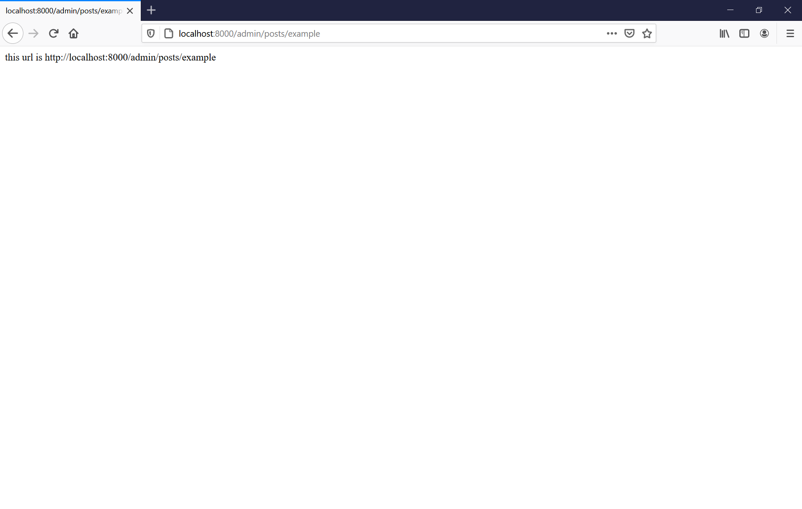
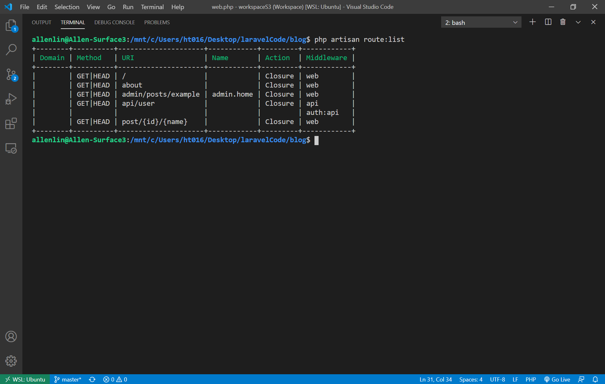
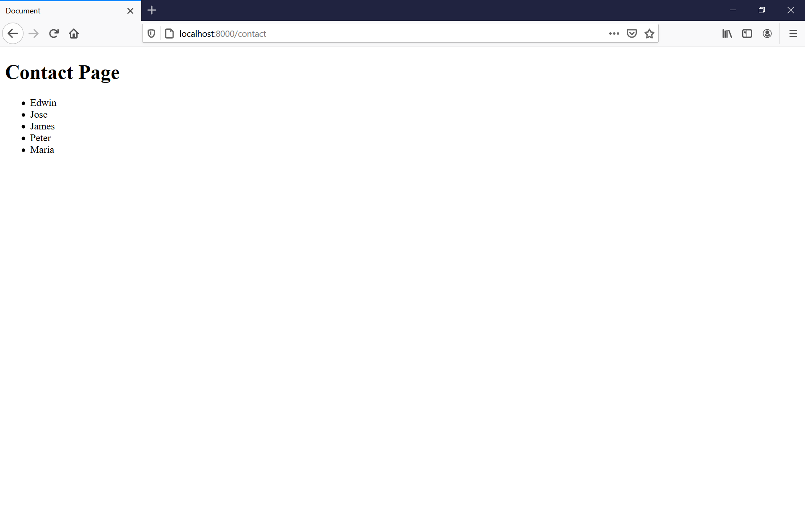

PHP with Laravel for Beginners - Become a Master in Laravel
Start: 2020/09/22
End: 

1. [Laravel Fundamentals - Routes](#Laravel-Fundamentals---Routes)
1. [Laravel Fundamentals - Controllers](#Laravel-Fundamentals---Controllers)
1. [Laravel Fundamentals - Views](#Laravel-Fundamentals---Views)
1. [Laravel Fundamentals - Laravel Blade Templating Engine](#Laravel-Fundamentals---Laravel-Blade-Templating-Engine)
1. [Laravel Fundamentals - Database - Laravel Migration](#Laravel-Fundamentals---Database---Laravel-Migration)
1. [Laravel Fundamentals - Raw SQL Queries](#Laravel-Fundamentals---Raw-SQL-Queries)
1. [Laravel Fundamentals - Database - Eloquent/ORM](#Laravel-Fundamentals---Database---Eloquent/ORM)
1. [Laravel Fundamentals - Database - Eloquent Relationship](#Laravel-Fundamentals---Database---Eloquent-Relationship)
1. [Laravel Fundamentals - Database - Tinker](#Laravel-Fundamentals---Database---Tinker)
1. [Database - Eloquent One to One Relationship CRUD](#Database---Eloquent-One-to-One-Relationship-CRUD)
1. [Database - Eloquent One to Many Relationship CRUD](#Database---Eloquent-One-to-Many-Relationship-CRUD)
1. [Database - Eloquent Many to Many Relationship CRUD](#Database---Eloquent-Many-to-Many-Relationship-CRUD)
1. [Database - Eloquent Polymorphic Relationship CRUD](#Database---Eloquent-Polymorphic-Relationship-CRUD)
1. [Database - Eloquent Polymorphic Many to Many Relationship](#Database---Eloquent-Polymorphic-Many-to-Many-Relationship-CRUD)
1. [Forms and Validation](#Forms-and-Validation)
1. [Forms - Package and Validation](#Forms---Package-and-Validation)
1. [Database - Some More Model Manipulation](#Database---Some-More-Model-Manipulation)
1. [Forms - Uploading Files](#Forms---Uploading-Files)
1. [Forms - Login](#Forms---Login)
1. [Middleware - Security/Protection](#Middleware---Security/Protection)
1. [Laravel Sessions](#Laravel-Sessions)
1. [Laravel - Sending Email/API](#Laravel---Sending-Email/API)
1. [Git and Github - Version Control](#Git-and-Github---Version-Control)
1. [New - Laravel 7 - Front-End](#New---Laravel-7---Front-End)
1. [Laravel Data Seeding](#Laravel-Data-Seeding)
1. [New - Laravel Components](#New---Laravel-Components)
1. [New Application - Laravel 7](#New-Application---Laravel-7)
1. [New Application - Laravel 7 - Roles and Permissions - Migrations & Relationships](#New-Application---Laravel-7---Roles-and-Permissions---Migrations-&-Relationships)
1. [New Application - Laravel 7 - Admin Users](#New-Application---Laravel-7---Admin-Users)
1. [New Application - Laravel 7 - User Profile Roles](#New-Application---Laravel-7---User-Profile-Roles)
1. [New Application - Laravel 7 - Permissions & Roles - CRUD](#New-Application---Laravel-7---Permissions-&-Roles---CRUD)
1. [Application - Legacy Version 5.2](#Application---Legacy-Version-5.2)
1. [Application - Posts - Legacy Version 5.2](#Application---Posts---Legacy-Version-5.2)
1. [Application - Categories - Legacy Version 5.2](#Application---Categories---Legacy-Version-5.2)
1. [Application - Media - Legacy Version 5.2](#Application---Media---Legacy-Version-5.2)
1. [Application - Comments - Legacy Version 5.2](#Application---Comments---Legacy-Version-5.2)
1. [Extra Features - Legacy Version 5.2](#Extra-Features---Legacy-Version-5.2)
1. [Upgrade to Laravel 5.3](#Upgrade-to-Laravel-5.3)
1. [Extra Feature - WYSIWYG and File Management Installation](#Extra-Feature---WYSIWYG-and-File-Management-Installation)
1. [Extra Feature - Disqus Comment System](#Extra-Feature---Disqus-Comment-System)
1. [Extra Feature - Bulk Media Delete](#Extra-Feature---Bulk-Media-Delete)
1. [Extra Feature: Deploying Our App to a Shared Hosting Account](#Extra-Feature:-Deploying-Our-App-to-a-Shared-Hosting-Account)
1. [Upgrade to Laravel 5.4](#Upgrade-to-Laravel-5.4)
1. [Upgrade to Laravel 5.5](#Upgrade-to-Laravel-5.5)
1. [Extra - Adjustments And More Features](#Extra---Adjustments-And-More-Features)
1. [Upgrade to Laravel 5.6](#Upgrade-to-Laravel-5.6)
1. [Upgrade from 5.6 to 5.7 & 5.7 to 5.8](#Upgrade-from-5.6-to-5.7-&-5.7-to-5.8)
1. [Upgrade from 5.8 to 6.0](#Upgrade-from-5.8-to-6.0)

# Windows - Local Environment Setup
1. Several apps and programs are installed
    1. XAMPP
    1. Git
    1. VSCode or PHPStorm (form Adobe) as code editor
    1. Composer
    1. Node.js
1. When [installing Laravel](https://laravel.com/docs/7.x/installation#installing-laravel), we can direct the working directory to the folder that we want to create the project and use `composer create-project --prefer-dist laravel/laravel:^7.0 blog`. We have to ensure php and composer have been installed on the machine. Note that we can use "**GitBash**" to create a Laravel project on Windows machine.
1. On the other hand, we may use `composer global require laravel/installer` to install Laravel globally on the machine, so we can simply use `laravel new [projectName]` to start a new Laravel project in any directory.
1. If composer can't download the dependencies correctly, we can use `composer config -g repo.packagist composer https://packagist.org` to change the repo and try to create the project again.
1. On the other hand, we may refer to [this post](https://dev.to/tylerwel/setting-up-laravel-and-react-in-wsl-1l42) to install Composer and Laravel in WSL, or check [the note](https://github.com/allenlin90/programmingLearning/tree/master/php).
1. After the project is created, we MUST `cd` into the project directory and run `php artisan serve` to run a local server on `http://127.0.0.1:8000`.

# MAC - Local Environment Setup
1. This part is skipped

# Laravel Fundamentals - Routes
### Serving the App - Homestead
1. We can set up `homestead` or `valet` depending on requirements. Both of those provide simulated environment for developing purpose. Note that `valet` is only available for Mac or Linux users.

### Route update
1. The new route files (in Laravel 7.x) are stored in `routes/web.php` which is in the root directory.

### Laravel Structure Overview
1. `app` is where to keep models and controllers.
1. `bootstrap` is all the files and data used to boot or start up the program.
1. `config` is all the files for configurations, such as connections to database.
1. In `database`, we can use `factories` and `seeds` to create data to test the program.
1. `public` is to store the front-end files or other data or files that can reveal to the public.
1. `resources` are the files that need to be compiled by using webpack. For example, we can bundle multiple JavaScript file into one single file. `views` folder is also where to keep the HTML files (main contents). Some files will be moved to `public` directory after they are compiled.
1. `routes` is where to keep all the routes of the application.
1. `storage` is more advanced that it's not introduced in this section yet.
1. `vendor` is the folder to keep all the dependencies downloaded by composer.
1. `.env` is where to keep the environment variable and sensitive data.
1. `artisan` is used to generate multiple stuffs in Laravel, such as models and controllers.
1. `composer.json` is similar to `package.json` in for npm that keeps the list of dependencies that we can use composer to download the 3rd party libraries.
1. `server.php` can use to emulate apache server, so that we can use `php artisan serve` to start a local server directly. 
1. `webpack.mix.js` is used to compile data. For example, by default, we can compile the JavaScript file in `rsources` and bundle it with other files and store in `public`.
    ```js
    mix.js('resources/js/app.js', 'public/js')
    .sass('resources/sass/app.scss', 'public/css');
    ```

### Routes 
1. We can create and manage routes in `./routes/web.php` which starts from the root directory. It starts with a `Route` object with double columns `::` with `get`, `post`, `any`, or `group`. The callback fuction is to present or direct the user to the correct PHP file. For exmpale, the default path is set up to link to `welcome.blade.php` in `resources/views/` directory.
    ```php
    Route::get('/', function(){
        return view('welcome');
    });
    ```
1. Besides returning a page, we can return simple data such as `String` as well. 
    ```php
    Route::get('/', function(){
        return 'Hello World';
    });
    ```
1. We can also parse the paramters passed in the URL and pass it to the callback function. For example, we have posts with certain ID. When creating the route, we can use curly braces to create the placeholder. Besides, we can pass multiple paramters.
    ```php
    Route::get('/post/{id}/{name}', function ($id, $name) {
        return "This is post number " . $id . " " . $name;
    });
    ````
    

### Naming Routes
1. We can create an associative array and use Laravel function `route()` to keep the whole URL in an abbreviation.
    ```php
    Route::get('admin/posts/example', array('as'=>'admin.home', function(){
        $url = route('admin.home');
        return "this url is " . $url;
    }));

    Route::get('/admin', function () {
        $url = route('admin.home');
        return "<a href='$url'> Click Here </a>";
    });
    ```
    
1. We can use `php artisan route:list` in the project directory to check the routes of the current project.
    


# Laravel Fundamentals - Controllers
### Creating Controllers
1. The controllers are stored in `./app/Http/Controllers` by default. We can create sub directory in the folder to categorize and manage the controllers.
1. In this case, we have 2 keywords `namepsace` and `use` to be used to manipulate the controllers. 
1. `namespace` is used to separate the functions if they have the same name. For exmaple, we may have `query` function in multiple controllers and files, so we can use `namespace` to separate them.
1. `use` is used to import certain "Class" which file is declared by `namespace`. 
1. Note that as the controllers to be created here are "**Classes**". We can name the classes with camelCase while keep the first letter in capital. We can create a new controller by simply creating a new PHP file with a proper name in the directory. Besides, at the project directory, we may also use `php artisan make:controller [ControllerName]` to create a controller in the terminal. 
    ```php
    namespace App\Http\Controllers;

    use Illuminate\Http\Request;

    class PostsController extends Controller
    {
        //
    }
    ```
1. In addition, we can add on `--resource` so that Laravel with creat a new controller that has CRUD (create, remove, update, and delete) methods to manipulate with the database. The whole command will be `php artisan make:controller --resource PostsController`
    ```php
    namespace App\Http\Controllers;

    use Illuminate\Http\Request;

    class PostsController extends Controller
    {
        /**
        * Display a listing of the resource.
        *
        * @return \Illuminate\Http\Response
        */
        public function index()
        {
            //
        }

        /**
        * Show the form for creating a new resource.
        *
        * @return \Illuminate\Http\Response
        */
        public function create()
        {
            //
        }

        /**
        * Store a newly created resource in storage.
        *
        * @param  \Illuminate\Http\Request  $request
        * @return \Illuminate\Http\Response
        */
        public function store(Request $request)
        {
            //
        }

        /**
        * Display the specified resource.
        *
        * @param  int  $id
        * @return \Illuminate\Http\Response
        */
        public function show($id)
        {
            //
        }

        /**
        * Show the form for editing the specified resource.
        *
        * @param  int  $id
        * @return \Illuminate\Http\Response
        */
        public function edit($id)
        {
            //
        }

        /**
        * Update the specified resource in storage.
        *
        * @param  \Illuminate\Http\Request  $request
        * @param  int  $id
        * @return \Illuminate\Http\Response
        */
        public function update(Request $request, $id)
        {
            //
        }

        /**
        * Remove the specified resource from storage.
        *
        * @param  int  $id
        * @return \Illuminate\Http\Response
        */
        public function destroy($id)
        {
            //
        }
    }
    ```

### Routing Controllers
1. Note that since Laravel 8, the route must be given in the whole Windows style path (with backslash `\` for the path). For example, we should put the controller path as `\App\Http\Controller\[ControllerFile@function]`.
1. However, this is not required in Laravel 7. For example, we create a `./app/Http/Controller/PostsController.php` with `php artisan make:controller --resource PostsController`. We then can set up a route and include and use the controller. Note that the controller file must be in the default directory, which is `./app/Http.Controller/`.
    ```php
    Route::get('/post', 'PostsController@index');
    ```

### Passing data
1. We can pass parameters through URL and modify the controller to parse it. 
    ```php
    // routes/web.php
    Route::get('/post/{id}', 'PostsController@index');

    // ./app/Http/Controller/PostsController
    class PostsController extends Controller {
        public function index($id) {
            return "It's working " . $id;
        }
    }
    ```

### Resources and Controllers
1. Besides regualr methods, we can use `resource` which will create path for the methods according to the controller automatically. We therefore can look up the routes and methods and edit the methods of `PostsController` class accordingly. We can use `php artisan route:list` to check available routes in the program.
    1. `http://losthost:8000/posts/create`
    1. `http://losthost:8000/posts/id`
    ```php
    // ./routes/web.php
    Route::resource('posts', 'PostsController');
    ```
    


# Laravel Fundamentals - Views
### Creating Views and Custom Method
1. Views are the files that presents the front and image that users interact with. The files are stored at `./resources/views`. Note that all the files should be named `[fileName.blade.php]`.
1. In a `.blade.php` file, we can use double curly braces `{{$variable}}` to `echo` a PHP variable. 
1. `blade` is the template rendering system that Laravel used. This is similar to `hbs` or `ejs` in JavaScript framework that is used to generate HTML pages.
    ```php
    // ./routes/web.php
    Route::get('/contact', 'PostsController@show_my_view');

    // ./app/Http/Controllers/PostsControllers.php
    public function show_my_view() {
        return view('pages/contact');
    }

    // resources/views/pages/contact.blade.php
    <body>
        <?php $var = 'Contact';?>
        <h1>{{$var}} Page</h1>
    </body>
    ```

### Passing Data to Views
1. We can put parameters in the URL and pass it to the view page. 
1. A `view` function used in controller is with a `with` method that can pass the argument sent through the function. `with` method takes first argument as the name of the variable, and the 2nd is the argument from the function.
1. In the `blade` tempalte, we can use double cruly braces to manipulate the variable.
    ```php
    // ./routes/web.php
    Route::get('/post/{id}', 'PostsController@show_post');

    // ./Http/Controllers/PostsController.php
    public function show_post($id, $username){
        return view('pages/post')->with('id', $id);
    }

    // ./resources/views/pages/post.blade.php
    <h1>Post {{$id}}</h1>
    ```
1. In addition, we can use `compact` function as the 2nd argument in `view` function. With `compact` function, we can pass the name for the variable directly, and we can pass it to the view file.
    ```php
    // ./Http/Controllers/PostsController.php
    public function show_post($id, $username){
        return view('pages/post', compact('id', 'username'));
    }

    // ./resources/views/pages/post.blade.php
    <h1>Post {{$id}} From {{$username}}</h1>
    ```
    


# Laravel Fundamentals - Laravel Blade Templating Engine
### Master Layout Setup
1. If we have a main layout or HTML elements for the website, such as the navigation that can be used on every page, we can keep the layout and styling in a separated file. For example, we can create `app.blade.php` in `layout` folder in the `views` directory.
1. In `app.blade.php`, we can use `@yield()` to create the section on the page. In the pages in `views`, we can use `@section()` to import the section that will be applied to the layout.
    ```php
    // ./resources/views/layout/app.blade.php
    <div class="container">
    
        @yield('content')

    </div>

    @yield('footer')
    ```
1. We then can update `contact.blade.php` with the template. We can use `@extends` to use the templated layout. 
    ```php
    // ./resources/views/pages/contact.blade.php
    @extends('layouts.app')

    @section('content')

        <h1>Contact Page</h1>

    @stop
    ```
1. We can use different `@yields` and `@section` on the page to include different parts on the page. For example, we have JavaScript code in `post.blade.php` but not in `contact.blade.php`.
    ```php
    // ./resources/views/pages/post.blade.php
    @extends('layouts.app')

    @section('content')

        <h1>Post {{$id}} from {{$username}}</h1>

    @stop

    @section('footer')

        <script>
            alert('Hello World');
        </script>

    @stop
    ```

### Some More Blade Features 
1. We can not only use `@yield` and `@section` in the blade templating system but also `@if` and `@foreach` or other PHP statements. Note that we should use `@endif` or `@endforeach` to close the statement. For example, we can pass an array in the controller. Therefore, we can use `foreach` loop to iterate through the array and render all the elements as in the list.
    ```php
    // ./routes/web.php
    Route::get('/contact', 'PostsController@contact');

    // ./app/Http/Controller/PostsController.php
    public function contact(){
        $people = ['Edwin', 'Jose', 'James', 'Peter', 'Maria'];

        return view('pages/contact', compact('people'));
    }

    // ./resources/views/pages/contact.blade.php
    @extends('layouts.app')

    @section('content')

        <h1>Contact Page</h1>

        @if (count($people))
            <ul>
            @foreach($people as $person)
                <li>{{$person}}</li>
            @endforeach
            </ul>
        @endif

    @stop

    @section('footer')

    @stop
    ```
    


# Laravel Fundamentals - Database - Laravel Migration
# Laravel Fundamentals - Raw SQL Queries
# Laravel Fundamentals - Database - Eloquent/ORM
# Laravel Fundamentals - Database - Eloquent Relationship
# Laravel Fundamentals - Database - Tinker
# Database - Eloquent One to One Relationship CRUD
# Database - Eloquent One to Many Relationship CRUD
# Database - Eloquent Many to Many Relationship CRUD
# Database - Eloquent Polymorphic Relationship CRUD
# Database - Eloquent Polymorphic Many to Many Relationship CRUD
# Forms and Validation
# Forms - Package and Validation
# Database - Some More Model Manipulation
# Forms - Uploading Files
# Forms - Login
# Middleware - Security/Protection
# Laravel Sessions
# Laravel - Sending Email/API
# Git and Github - Version Control
# New - Laravel 7 - Front-End
# Laravel Data Seeding
# New - Laravel Components
# New Application - Laravel 7
# New Application - Laravel 7 - Roles and Permissions - Migrations & Relationships
# New Application - Laravel 7 - Admin Users
# New Application - Laravel 7 - User Profile Roles
# New Application - Laravel 7 - Permissions & Roles - CRUD
# Application - Legacy Version 5.2
# Application - Posts - Legacy Version 5.2
# Application - Categories - Legacy Version 5.2
# Application - Media - Legacy Version 5.2
# Application - Comments - Legacy Version 5.2
# Extra Features - Legacy Version 5.2
# Upgrade to Laravel 5.3
# Extra Feature - WYSIWYG and File Management Installation
# Extra Feature - Disqus Comment System
# Extra Feature - Bulk Media Delete
# Extra Feature: Deploying Our App to a Shared Hosting Account
# Upgrade to Laravel 5.4
# Upgrade to Laravel 5.5
# Extra - Adjustments And More Features
# Upgrade to Laravel 5.6
# Upgrade from 5.6 to 5.7 & 5.7 to 5.8
# Upgrade from 5.8 to 6.0