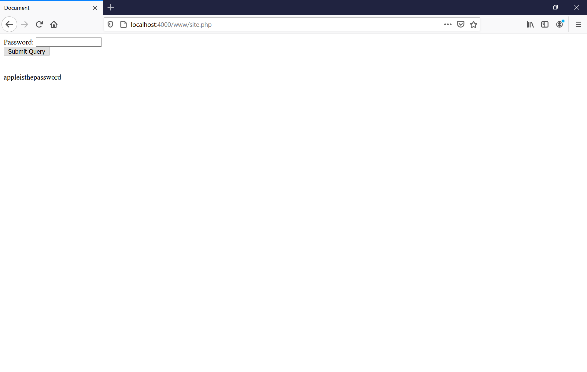

PHP Programming Language Tutorial - Full Course
Length: 4:36:38 
[Link](https://youtu.be/OK_JCtrrv-c) - https://youtu.be/OK_JCtrrv-c
1. [Setting up PHP](#Setting-up-PHP)
1. [Hello World and Setup](#Hello-World-and-Setup)
1. [Variables](#Variables)
1. [Data Types](#Data-Types)
1. [Working with Strings](#Working-with-Strings)
1. [Working with Numbers](#Working-with-Numbers)
1. [Getting User Input](#Getting-User-Input)
1. [URL Parameters](#URL-Parameters)
1. [POST vs GET](#post-vs-get)
1. [Arrays](#arrays)
1. [Using Checkboxes](#using-checkboxes)
1. [Associative Arrays](#associative-arrays)
1. [Functions](#functions)
1. [Return Statements](#return-statements)
1. [If Statements](#if-statements)
1. [If Statements (con't)](#If-Statements-(con't))
1. [Building a Better Calculator](#Building-a-Better-Calculator)
1. [Switch Statements](#switch-statements)
1. [While Loops](#while-loops)
1. [For Loops](#for-loops)
1. [Comments](#comments)
1. [Including HTML](#including-html)
1. [Include: PHP](#includ:-php)
1. [Classes & Objects](#classes-&-objects)
1. [Constructors](#constructors)
1. [Object Functions](#object-functions)
1. [Getters & Setters](#getters-&-setters)
1. [Inheritance](#inheritance)


# Setting up PHP
1. In WSL we can download the language with `sudo apt install php7.2-cli`. 
1. We can following command to start a server. PHP will find the site code to run in the default directory, which is the path we type the code `php -S localhost:4000`. In this case, we create a `site.php` file in `www` folder in the root directory. 
    ```php
    <!DOCTYPE html>
    <html lang="en">
    <head>
        <meta charset="UTF-8">
        <meta name="viewport" content="width=device-width, initial-scale=1.0">
        <title>Document</title>
    </head>
    <body>
        
        <?php
            echo("Hellow World");
        ?>

    </body>
    </html>
    ```
1. The root directly will be the root folder of the website. For example, if we have `site.php` file in `www` folder, we can access it thourgh `http://localhost:4000/www/site.php`. In this case, we have a simple command `echo("Hello World")`, which prints `Hello World` in the HTML file and render the the page in the browser. 
1. At the end of every line of code, we should have a semi-column `;` to end the statement. 

# Hello World and Setup
1. `echo` is similar to `print()` function in Python and `console.log()` in JavaScript.
1. We can use `echo()` to render text and HTML elemetns from the PHP file. 
    ```php
    echo "<h1>Allen's Site</h1>";
    ```
1. Every time the user refresh the webpage, it makes a new request to the server, and the script runs. As other programming languages, PHP runs the script in an order from top to bottom. 

# Variables 
1. Variables are like containers that we can store values in the varible and use it in somewhere else. 
1. PHP variables are declared by dollar sign `$variable` and followed with variable name. Similar to JavaScript, we can declare the variable without specifying the type of the value and change it directly. Besides, we can change the value to other primitive types of value direclty. 
    ```php
    $characterName = "John";
    $characterAge = 35;
    echo "There once was a man named $characterName <br>";
    echo "He was $characterAge years old <br>";
    $characterName = "Mike";
    echo "He really liked the name $characterName <br>";
    echo "But didn't like being $characterAge <br>";
    ```

# Data Types 
1. `String` is a plain text. If the value is wrapped with quotation marks `"` (it can be single or double quotes). 
1. `Integer` is a whole number without decimal points. In PHP, integers and floats are different type. 
1. `Float` is numbers with decimals such as `30.0`. 
1. `Boolean` is `true` and `false`. 
1. `null` stands for `null` value (no value) in PHP. 

# Working With Strings 
1. Use `strtolower()` function to convert a string to all lowercase. 
1. Use `strtoupper()` function to convert a string to all uppercase. 
1. Use `strlen()` to check the length of a string (number of characters). 
1. Use square brackets `[]` and index to access a certain character in the string. 
    ```php
    $phrase = "Giraffe Academy";
    echo strtolower($phrase);
    echo strtoupper($phrase);
    echo strlen($phrase);
    echo $phrase[0];
    ```
1. Unlike JavaScript, `String` type values are mutable in PHP. We can use square brackets with index to access a position in a string and repalce the character. 
    ```php
    $phrase = "Giraffe Academy";
    $phrase[0] = "B";
    echo $phrase; 
    ```
1. We can replace a bunch of characters by using `str_replace()`. The 1st argument is the string to be replaced, the 2nd is the new string to replace, and the 3rd (last) one is the variable. In JavaScript, we can only duplicate the variable and replace part of the value. 
    ```php
    $phrase = "Giraffe Academy";
    echo str_replace("Giraffe", "Panda", $phrase); 
    ```
1. We can use `substr()` function to retrieve part of the string. The 1st argument is the variable, and the 2nd argument is the starting index of the character in string, so PHP will retrieve the phrase from the given starting position to the end of the string. We can give a 3rd argument which is the length of the string to be retrieved. For example, if we give 3, only 3 characters from the given starting position will be retrieved. 
    ```php
    $phrase = "Giraffe Academy";
    substr($phrase, 8); // Academy
    substr($phrase, 8, 3); // Aca
    ```

# Working with Numbers 
1. We can give numbers directly without other characters. 
1. PHP can handle negative numbers that is with a dash or minus sign `-`. 
1. `Integers` and `Floats` are different types of value in PHP. 
1. If we put expression in `echo` directly such as `echo 3 + 5`, PHP returns the result of the operation. 
1. Percentage sign `%` in PHP works the same as it works in JavaScript that the operator means `mod` that it return the remainder after division. For example, `5 % 3` results in 2. 
1. PHP math operations works as regular math that expression in parenthesis and mutiplication and division have higher priority than plus and minus operations. 
1. We can assign number value to variables as well. The math operations in PHP is similar to those in JavaScript. 
    ```php
    $num = 10;
    $num++ // adds 1 to num variable 
    $num-- // substract 1 to num variable 
    $num = $num + 25; // adds 25 to num 
    $num += 25; // shorthand to add 25 to num 
    $num *= 25; // shorthand to mutiply num by 25 
    ```
1. There are other math function such as `Math` module in JavaScript
    1. Return the absolute number with `abs()`. Similar to `Math.abs()` method in JavaScript. 
    1. Return the power of a base with `pow()`. Similar to `Math.pow()` method in JavaScript. 
    1. Return the sqaure root of a number `sqrt()`. Similar to `Math.sqrt()` in JavaScript. 
    1. Return the largest value from the given value `max()`. Similar to `Math.max()` in JavaScript. 
    1. Return the lowest value from the given value `min()`. Similar to `Math.min()` in JavaScript. 
    1. Return the rounded number `round()`. Similar to `Math.round()` in JavaScript. 
    1. Return the rounded up number `ceil()`. Similar to `Math.ceil()` in JavaScript.
    1. Return the rounded down number `floor()`. Similar to `Math.floor()` in JavaScript.
    ```php
    echo abs(-100); // 100 
    echo pow(2, 4); // 16
    echo sqrt(144); // 12
    echo max(2, 10); // 10
    echo min(2, 10); // 2
    echo round(3.2); // 3
    echo ceil(3.1); // 4
    echo floor(3.9); // 3
    ```

# Getting User Input
1. We can create a HTML `form` with `input` tag to collect input from users. `form` element has 2 attributes to be used here is the action that this `<form>` elemenet will be handled with `site.php` script with a HTTP method `GET`, as we are going to retrieve the data. In the `<input>` tag, we can specify the input value to be stored in the variable with attribute `name`. 
1. In PHP script, we can use `$_GET[]` to get the variable from the HTML elements. 
    ```php 
    <form action="site.php" method="GET">
        Name: <input type="text" name="userName">
        <br>
        Age: <input type="text" name="age">
        <br>
        <input type="submit">
    </form>
    <br>
    Your name is <?php echo $_GET["userName"];?>
    <br>
    Your age is <?php echo $_GET["age"];?>
    ```

# Building a Basic Calculator
1. Similar to get user input, we can have a calculating function to manipulate user input. 
1. Note that user input will be sent to the server as parameters in the URL which is after question mark `?` in the URL. If we change it directly, we can modify the result printed on by the PHP function directly. 
1. Every time a input given in the submit form, the key/value pair will be sent to the sever in the URL. 
    ```php
    <form action="site.php" method="GET">
        <input type="number" name="num1">
        <br>
        <input type="number" name="num2">
        <br>
        <input type="submit">
    </form>

    Answer: <?php
        echo $_GET["num1"] + $_GET["num2"];
    ?>
    ```
    

# Building a Mad Libs Game
1. The purpose is to collect user input from the `form` tag and render the collected input into the pre-built template. 
1. Similar to the function for numbering operations, the input will be stored and passed to the PHP file through URL parameters. 
    ```php
    <form action="site.php" method="GET">
        Color: <input type="text" name="color"> <br>
        Plural Noun: <input type="text" name="pluralNoun"> <br>
        Celebrity: <input type="text" name="celebrity"> <br>
        <input type="submit">
    </form>

    <?php
        $color = $_GET["color"];
        $pluralNoun = $_GET["pluralNoun"];
        $celebrity = $_GET["celebrity"];
        echo "Roses are $color <br>";
        echo "$pluralNoun are blue <br>";
        echo "I love $celebrity <br>";
    ?>
    ```

# URL Parameters
1. When we submit a form with input, the value will be sent from client to server through URL as parameters. 
1. The parameters in the URL is key/value pair that passed after the route of the website and starts with a question mark `?`. Besides, we can pass multiple parameters that are concatenate with ampersand `&`.
1. Therefore, though we can store value in the URL, the method is not secure, as they are visible. Besides, it's very easy to be modified. 

# POST vs GET
1. When we use a `GET` method, data will be sent through URL parameter from client to server, so the data transfer isn't secure, as the data will be visible, especially for sending sesitive data such as password. Besides, it can also be changed directly on the search bar. Note that the value sending from client to server through parameters in URL. 
1. In this case for transferring sensitive data, we can use `POST` method to send the data. By using `POST` method, the data will not be shown in the URL when sending request from client to server, which is a safer method. 
    ```php
    <form action="site.php" method="POST">
        Password: <input type="password" name="password"> <br>
        <input type="submit">
    </form>
    <br><br>
    <?php
        echo $_POST["password"];
    ?>
    ```
    
1. In most of the cases, in order to secure the data transmission, developers tend to use `POST` request rather than `GET`. 

# Arrays
1. We can use a larger container as a variable to store multiple information in it. 
1. We can declare a variable and assign it with `array()` function to decalre an `Array`. Each element of the array is separated by comma. For example, `$friends = array("Kevin", "Karen", "Oscar", "Jim");`
1. We can use square brackets with index to access certain element at the given position. As other progarmming language, the index position starts from `0`.
1. We can use index to access a position of an array and modify its value. 
1. We can add additional element with the given position. 
1. We can use `count` which is similar to `Array.length` in JavaScript to check the number of elements of an array. 
    ```php
    $friends = array("Kevin", "Karen", "Oscar", "Jim");
    echo $friends[1]; // Karen
    
    // modify information
    $friends[2] = "Tim"; 
    echo $friends[2]; // Tim

    // add additional element 
    $friends[4] = "Jane";
    echo $friends[4]; // Jane

    echo count($friends); // 5 
    ```

# Using Checkboxes
1. When receiving mutiple, pre-built options for users to choose, we can use checkboxes for users to select and submit the selections at once. 
1. In the input tag, we can specify the `name` attribute with square brackets that, we'd like the data to be stored in the array. We then can use PHP script to retrieve the data input from the user. 
    ```php
    <form action="site.php" method="POST">
        Apples: <input type="checkbox" name="fruits[]" value="apples"><br>
        Oranges: <input type="checkbox" name="fruits[]" value="oranges"><br>
        Pears: <input type="checkbox" name="fruits[]" value="pears"><br>
        <input type="submit">
    </form>
    
    <?php 
        $fruits = $_POST["fruits"];
        echo $fruits[1];
    ?>
    ```

# Associative Arrays
1. Associative Arrays can not only stored multiple elements but also key/value pairs. This is similar to objects in JavaScript and dictionaries in Python. A key and value pair is declared with an equal sign and greater than sign `=>`, as an arrow in JavaScript. 
1. For example, we have a class of students and would like to store the grades of each student. Besides, we can modify the value of a key in the associate array. 
    ```php
    $grades = array("Jim"=>"A+", "Pam"=>"B-", "Oscar"=>"C+");
    echo $grades["Jim"];
    echo $grades["Pam"];
    echo $grades["Oscar"];
    echo count($grades);

    // modify value of a key 
    $grades["JIM"] = "F"; 
    echo $grades["JIM"]; // F
    ```
1. If the features introduced above, we can use user input to access to the value of a certain key. For example, we allow the user give the student's name that we want to check the grade. 
    ```php
    <form action="site.php" method="POST">
        <input type="text" name="student">
        <input type="submit">
    </form>
    
    <?php 
        $grades = array("Jim"=>"A+", "Pam"=>"B-", "Oscar"=>"C+");
        echo $grades[$_POST["student"]];
    ?>
    ```

# Functions
1. We can use functions to group code to work on tasks. A function is like a container that we can reuse the code at different places. 
1. A function statement in PHP is very similar to that in JavaScript. After declaring the function, we should call the function to execute it. 
1. We can pass parameters (arguments) to functions. The syntax is very similar to `String` template in JavaScript that uses backticks "**\`**" and `${}`.
    ```php
    function sayHi($name, $age) {
        echo "Hello $name, you are $age <br>";
    }

    sayHi("Allen", 40); // Hello Allen, you are 40
    sayHi("Dave", 13); // Hello Dave, you are 13 
    sayHi("Oscar", 80); // Hello Oscar, you are 80
    ```

# Return Statements
1. Besides using `echo` to print out the value, we can use `return` keyword to simply return the value back, so we can use the value further for other purpose. 
1. In PHP (and same in JavaScript), a `return` keyword in the function will stop executing the code after the keyword a function. 
    ```php
    function cube($num) {
        return $num * $num * $num;
        echo "this will not be printed"; 
    }

    $cubeResult = cube(4); 

    echo $cubeResult; // 64
    ```

# If Statements
1. In PHP, we can use `IF` statement which is similar to the syntax of JavaScript. 
1. `AND` in PHP is `&&`. 
1. `OR` in PHP is `||`.
1. We can either separate `else if` or concatenate `elseif`.
    ```php
    $isMale = true;
    $isTall = true;
    if ($isMale && $isTall){
        echo "You are a tall male";
    } elseif ($isMale && !$isTall) { // elseif can be concatenated 
        echo "You are a short male";
    } else if (!$isMale && $isTall){ // else if can be separated 
        echo "You are not male but are tall";
    } else {
        echo "You are not male and not tall";
    }
    ```

# If Statements (con't)
1. In PHP, we have comparison operators `>`, `<`, and `==`. We can also check if variables are greater than and equal to and less than an equal to. 
    ```php
    function getMax($num1, $num2, $num3) {
        if ($num1 >= $num2 && $num1 >= $num3) {
            return $num1;
        } else if ($num2 >= $num1 && $num2 >= $num3) {
            return $num2;
        } else {
            return $num3;
        }
    }

    echo getMax(3000, 3000, 400);
    ```

# Building a Better Calculator
1. We can use `IF` statements to verify the user input and operate the calculation accordingly. 
1. Note that the following operations can only operate decimal numbers if we specify the `step` attribute in the HTML element. (We still can operator decimal number with PHP, while this issue is from HTML).
    ```php
    <form action="site.php" method="post">
        First Num: <input type="number" step="0.001" name="num1"> <br>
        OP: <input type="text" name="op"> <br>
        Second Num: <input type="number" name="num2"> <br>
        <input type="submit">
    </form>  
    <?php 
        $num1 = $_POST["num1"];
        $num2 = $_POST["num2"];
        $op = $_POST["op"];

        if ($op == "+") {
            echo $num1 + $num2; 
        } else if ($op == "-") {
            echo $num1 - $num2; 
        } else if ($op == "/") {
            echo $num1 / $num2; 
        } else if ($op == "*") {
            echo $num1 * $num2; 
        } else {
            echo "Invalid Operator";
        }
    ?>
    ```

# Switch Statements
1. `Switch` statements are similar to `IF` statement, while a value can be compared with multiple values. Though `IF` statement can work exactly as `switch`, `switch` provides a succinct syntax for the conditions. 
1. We can set a `default` case if the input is not in the pre-built condition, which works as `else` in `IF` statement. 
    ```php
    <form action="site.php" method="post">
        What is your grade? <br>
        <input type="text" name="grade"> <br>
        <input type="submit">
    </form>  
    <?php 
        $grade = $_POST["grade"];
        switch($grade) {
            case "A": 
                echo "You did amazing!";
                break;
            case "B":
                echo "You did pretty good";
                break;
            case "C":
                echo "You did poorly";
                break;
            case "D": 
                echo "You did very bad";
                break;
            case "F":
                echo "YOU FAIL!";
                break;
            default:
                echo "Invalid Grade";
        }
    ?>
    ```
# While Loops
1. `while` loops iterate through the tasks until the condition is `false`. 
1. We should be aware and prevent infinite loop to keep running the function. For example, if we take `$index++` out from the code block, the while loop becomes infinite as the condition `$index <= 5` will always be true. 
    ```php
    $index = 1;
    while($index <= 5){
        echo "$index <br>";
        $index++;
    }
    ```
1. `do...while` loop will ensure the code at least run once. This has very similar syntax in JavaScript for a `do...while` loop. 
    ```php
    $index = 6;
    do{
        echo "$index <br>";
        $index++;
    }while($index <= 5);
    ```

# For Loops
1. `for` loop in PHP works exactly the same as that in JavaScript. We can declare a counter, set the condition, and operations ot the counter. 
    ```php
    for($i = 1; $i <= 5; $i++) {
        echo "$i <br>";
    }

    $luckyNumbers = array(4, 8, 15, 16, 23, 42);
    for ($i = 0; $i < count($luckyNumbers); $i++) {
        echo "$luckyNumbers[$i] <br>";
    }
    ```

# Comments
1. Comments in PHP is the same as JavaScript that it uses 2 forward slashes `//`.
1. We can use `/* comments */` to make muti-line comments which is using the same syntax as JavaScript. 

# Including HTML
1. We can use `include` keyword to import other HTML or PHP files to the current file. 
1. For example, we can reuse header and footer of all the webpages for a website. In this case, we create `header.html` and `footer.html` in the `www` folder which is the same as `site.php`.
    ```php
    <?php include "header.html" ?>
        <p>Hello World</p>
    <?php include "footer.html" ?>
    ```
1. Therefore, we can only edit the header or footer file to modify all the header and footer of the webpages of the website. 

# Include: PHP
1. We can import not only include HTML but also PHP file. This feature is similar to client-side JavaScript that the imported files can be seem as a single script from top to bottom. 
1. Therefore, we can separate the code in to different files and modules and imported to keep the files managed and simple. 
    ```php
    // article-header.php
    <h2><?php echo $title; ?></h2>
    <h4><?php echo $author; ?></h4>
    word count: <?php echo $wordCount; ?>

    // useful-tools.php
    <?php 
    $feetInMile = 5280;
        function sayHi($name) {
            echo "Hello $name";
        }
    ?>

    // site.php 
    <?php 
        $title = "My First Post";
        $author = "Allen";
        $wordCount = 400;
        include "article-header.php"
    ?>

    <?php 
        include "useful-tools.php";
        sayHi("Allen");
        echo $feetInMile; 
    ?>
    ```

# Classes & Objects
1. In some cases, we can't use the primitive types in PHP to present the objects we need. Therefore, we can create a customized data type as a `class`. A class is similar to a blueprint that we can ensure the instances of a class will have certain attributes (properties).
1. In convention (so as in JavaScript), a class name starts with a Capital letter. The object (an instance of a class) in PHP has attibutes (which is similar to property of an Object in JavaScript). In PHP, an object is an instance of a class. 
1. A new instance is created with `new` keyword, which is much similar to that in JavaScript with `new` keyword and constructor functions. 
1. We can use arrow sign with dash and greater than sign `->` to access an attribute of an object in PHP. Note that we can use square brackets to access properties of an Object in JavaScript. 
1. The syntax is much similar to the `class` keyword in ES6 JavaScript. 
    ```php
    class Book {
        var $title;
        var $author; 
        var $pages;
    }

    $book1 = new Book; 
    $book1->title = "Harry Potter";
    $book1->author = "JK Rowling";
    $book1->pages = 400;

    echo $book1->title; // Harry Potter
    echo $book1->author; // JK Rowling
    echo $book1->pages; // 400

    $book2 = new Book; 
    $book2->title = "Lord of the Rings";
    $book2->author = "Tolkien";
    $book2->pages = 700;

    echo $book2->title; // Lord of the Rings
    echo $book2->author; // Tolkien
    echo $book2->pages; // 700
    ```

# Constructors
1. Constructors are special functions that we can put in a class, so the instances can have default values. A constructor function must be declared with `function __construct(){}` in a class. Besides, it can take arguments when the object is created. 
    ```php
    class Book {
        var $title;
        var $author; 
        var $pages;

        function __construct($name){
            echo $name;
        }
    }

    $book1 = new Book("Mike"); // Mike 
    $book1->title = "Harry Potter";
    $book1->author = "JK Rowling";
    $book1->pages = 400;
    
    $book2 = new Book("Tom"); // Tom
    $book2->title = "Lord of the Rings";
    $book2->author = "Tolkien";
    $book2->pages = 700;
    ```
1. However, the method above that we create an object is very redendant. We can use constructor function to take arguments and pass them to the attributes of the object. `$this` in PHP refer to the current object that is created. This works almost the same as `this` keyword in JavaScript for `Objects`. 
1. Similar to JavaScript, we can modify the attributes of an object after it is created. 
    ```php
    class Book {
        var $title;
        var $author; 
        var $pages;

        function __construct($aTitle, $aAuthor, $aPages){
            $this->title = $aTitle;
            $this->author = $aAuthor;
            $this->pages = $aPages;
        }
    }

    $book1 = new Book("Harry Potter", "JK Rowling", 400); 
    $book2 = new Book("Lord of the Rings", "Tolkien", 700); 

    echo $book1->title; // Harry Potter 
    $book1->title = "Hunger Games";
    echo $book1->title; // Hunger Games 
    ```

# Object Functions 
1. We can build functions of an object, which is similar to create a method for objects in JavaScript. 
    ```php
    class Student {
        var $name;
        var $major; 
        var $gpa;

        function __construct($name, $major, $gpa){
            $this->name = $name;
            $this->major = $major;
            $this->gpa = $gpa;
        }

        function hasHonors(){
            if ($this->gpa >= 3.5) {
                return "true"; 
            } else {
                return "false";
            }
        }
    }

    $student1 = new Student("Jim", "Business", 2.8);
    $student2 = new Student("Pam", "Art", 3.6);

    echo $student1->hasHonors(); // false (in string)
    echo $student2->hasHonors(); // true (in string)
    ```

# Getters & Setters
1. Visibility modifiers is to control whether an attribute of an object in PHP can be modified. Besides, `var`, we can use `public` to declare an attribute to set up attributes of instances of a class. `var` and `public` basically work the same. However, it has an issue that the attribute of the object can be modified and can't be limited. For example, we have a Movie class that each movie has a rating attribute. However, we can't limit it to the regular or standard rating terms. Besides, it could be modified to something else. Therefore, we'd like to limit the scope and only allow the attribute to be modified in the class constructor. 
1. We can use `private` rather than `public` to declare the properties of an object in a class. 
1. As the private property can be accessed and modified from the outside of `class` declaration, we can use "**getter function**" to retrive the property of the object. 
1. On the other hand, we can use a "**setter function**" to modify the property of the object. 
1. Besides, we can use `IF` statement to limit input from the user. In this case, if the given rating of the movie is not in the given conditions, the rating will be `NR` which is no rating.
    ```php
    class Movie {
        public $title; // this property is accessible from the outside and can be modified 
        private $rating; // this property can only be modified in the code block of class 

        function __construct($title, $rating){
            $this->title = $title;
            $this->rating = $rating;
        }

        // getter function 
        function getRating(){
            return $this->rating;
        }

        // setter function 
        function setRating($rating){
            if ($rating == "G" || $rating == "PG" || $rating == "PG-13" || $rating == "R") {
                $this->rating = $rating;
            } else {
                $this->rating = "NR"; 
            }
        }
    }

    $avengers = new Movie("Avengers", "PG-13");
            // G, PG, PG-13, R, NR

    echo $avengers->title; // Avengers
    $avengers->title = "Justice League"; 
    echo $avengers->title; // Justice League
    echo $avengers->rating; // error as this property is priavte 
    echo $avengers->getRating(); // PG-13
    $avengers->setRating("R");
    echo $avengers->getRating(); // R
    ```
1. However, we still have problems that users can give invalid property values when creating an object with `new` keyword and constructor. We can use the setter function to limit the value assigned to the property. Therefore, if user gives an invalid value to create an object, PHP will follow the condition in the "**setter function**" to handle the issue. 
    ```php
    function __construct($title, $rating){
        $this->title = $title;
        $this->setRating($rating); // use setter function 
    }
    ```
1. In summary, to verify the given value to create an object of a class, we can 
    1. Use `private` keyword for the property to prevent modification from the outside. 
    1. Use "**getter function**" which is declared in the class to retrive the value of the property. 
    1. Use "**setter function**" which is declared in the class to modify the value of the property. 
    1. Use "**setter function**" to set up conditions to verify the given input to set up the object. 
1. In addition, `var` is not a common keyword used to declare properties of an object. 

# Inheritance
1. We can use `extends` keyword to make a new class "**inherit**" properties from another class to its instances. Besides, we can overwrite the properties and functions of the new class though it has inherited the same property from its ancestor. 
    ```php
    class Chef {
        function makeChicken(){
            echo "The chef makes chicken <br>";
        }
        function makeSalad(){
            echo "The chef makes salad <br>";
        }
        function makeSpecialDish(){
            echo "The chef makes bbq ribs <br>";
        }
    }

    class ItalianChef extends Chef {
        function makePasta(){
            echo "The chef makes pasta";
        }
        function makeSpecialDish(){
            echo "The chef makes chicken parm";
        }
    }

    $chef = new Chef();
    $chef->makechicken(); // The chef makes chicken
    $chef->makeSpecialDish();

    $italianChef = new ItalianChef();
    $italianChef->makePasta(); // The chef makes pasta 
    $chef->makeSpecialDish(); // The chef makes chicken parm

    $chef->makePasta(); // error
    ```