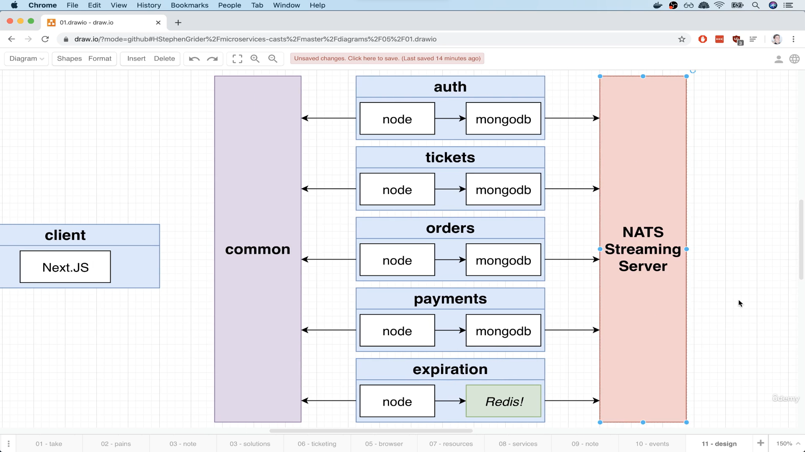

- [1. Architecture of Multi-service apps](#1-architecture-of-multi-service-apps)
  - [1.1. App overview - Ticketing App](#11-app-overview---ticketing-app)
  - [1.2. Resource Types](#12-resource-types)
  - [1.3. Service Types](#13-service-types)
- [2. NATS streaming server - An event bus implementation](#2-nats-streaming-server---an-event-bus-implementation)
  - [2.1. NATS streaming server deployment](#21-nats-streaming-server-deployment)
  - [2.2. Event handling between services](#22-event-handling-between-services)
  - [2.3. NATS test project](#23-nats-test-project)
  - [2.4. Queue group](#24-queue-group)
  - [2.5. Manual Ack mode](#25-manual-ack-mode)
  - [2.6. Client health check](#26-client-health-check)
  - [2.7. Graceful client shutdown](#27-graceful-client-shutdown)
  - [2.8. Core concurrent issue](#28-core-concurrent-issue)
    - [2.8.1. Solution](#281-solution)
    - [2.8.2. Service resilience](#282-service-resilience)

# 1. Architecture of Multi-service apps
## 1.1. App overview - Ticketing App
- e.g. [https://www.stubhub.com](https://www.stubhub.com)
1. Users can list a ticket for an event (concert, sports) for sale
2. Other users can purchase this ticket
3. Any user can list tickets for sale and purchase ticket
4. When a user attempts to purchase a ticket, the ticket is 'locked' for 15 minutes. The user has 15 mins to enter their payment info.
5. While locked, no other user can purchase the ticket. After 15 minutes, the ticket should 'unlock'.
6. Ticket prices can be edited if they are not locked. 
7. Users can sign-in/sign-out.
8. Users can check their orders in history.
9. Users can insert credit cards (using Stripe) to make a purchase.

## 1.2. Resource Types

`Users`
| Name     | Type   |
| -------- | ------ |
| email    | string |
| password | string |

`Ticket`
| Name    | Type         |
| ------- | ------------ |
| title   | string       |
| price   | number       |
| userId  | Ref to User  |
| orderId | Ref to Order |

`Order`
| Name      | Type                                            |
| --------- | ----------------------------------------------- |
| userId    | Ref to User                                     |
| status    | created, cancelled, awaiting_payment, completed |
| ticketId  | Ref to Ticket                                   |
| expiresAt | Date                                            |

`Charge`
| Name           | Type                       |
| -------------- | -------------------------- |
| orderId        | Ref to Order               |
| status         | created, failed, completed |
| amount         | number                     |
| stripeId       | string                     |
| stripeRefundId | string                     |

## 1.3. Service Types
1. auth
   1. Everything related to user sign-up/sign-in/sign-out
2. tickets
   1. Ticket creation/editing.
   2. Knows wether a ticket can be updated.
3. orders
   1. Order creation/editing.
4. expiration
   1. Watches for orders to be created, cancels them after 15 mins.
5. payments
   1. Handle credit card payments.
   2. Cancels orders if payment fails, completes if payment succeeds. 



# 2. NATS streaming server - An event bus implementation

## 2.1. NATS streaming server deployment

1. NATS streaming server is a deprecated service. This course is mainly for tutorial and introduction to micro service concept, not production ready solution.
2. In this case, we don't create a consistent `NodePort` service but forward the port we want to access directly. 
3. Note that port forwarding services is like running a process in terminal. 
4. We can use `kubectl port-forward [pod-id] [target-port]:[port]` and allow us to access the pod at certain port directly on `localhost`. 

```yml
# infra/k8s/nats-depl.yml
apiVersion: apps/v1
kind: Deployment
metadata:
  name: nats-depl
spec:
  replicas: 1
  selector:
    matchLabels:
      app: nats
  template:
    metadata:
      labels:
        app: nats
    spec:
      containers:
        - name: nats
          image: nats-streaming:0.17.0
          args: # commands/flags when starting up
            [
              '-p',
              '4222',
              '-m',
              '8222',
              '-hbi',
              '5s',
              '-hbt',
              '5s',
              '-hbf',
              '2',
              '-SD',
              '-cid',
              'ticketing',
            ]
---
apiVersion: v1
kind: Service
metadata:
  name: nats-srv
spec:
  selector:
    app: nats
  ports:
    - name: client
      protocol: TCP
      port: 4222
      targetPort: 4222
    - name: monitoring
      protocol: TCP
      port: 8222
      targetPort: 8222
```

## 2.2. Event handling between services

1. Using [node-nats-streaming](https://www.npmjs.com/package/node-nats-streaming).
2. In the custom event bus made with `express` and `axios`, it simply broadcasts all the events to all the subscribers and let the subscribers decide how to handle the incoming events.
3. With NATS streaming, it creates different `channels` (or `topics`) and each subscriber needs to subscribe channels of their interests. 
4. Besides, all events are only stored in RAM in the customer `express` event bus, while `NATS` can store events to DB for persistence. 

## 2.3. NATS test project
1. Short-term goals
   1. Create a new sub-project with typescript support.
   2. Install `node-nats-streaming` library and connect to nats streaming server.
   3. We should have 2 `npm` scripts, one to run code to `emit` events, and one to run code to `listen` for events. 
   4. This program will be ran outside of k8s. 
2. The 2nd argument passing to `nats.connect` is the client ID that the instance wants to register when connecting to `NATS`. 
3. If we try to run a static client ID to connect to the same `NATS` cluster, the 2nd connection will be blocked by re-using the same client ID.

```ts
// publisher.ts
import nats from 'node-nats-streaming';

const stan = nats.connect('ticketing', 'abc', {
  url: 'http://localhost:4222',
});

stan.on('connect', () => {
  console.log('Publisher connected to NATS');

  const data = JSON.stringify({
    id: '123',
    title: 'concert',
    price: 20,
  });

  stan.publish('ticket:created', data, () => {
    console.log('Event published');
  });
});
```

```ts
// listener.ts
import nats, { Message } from 'node-nats-streaming';

console.clear();

// generate random client ID
const stan = nats.connect('ticketing', randomBytes(4).toString('hex'), {
  url: 'http://localhost:4222',
});

stan.on('connect', () => {
  console.log('Listener connected to NATS');

  const subscription = stan.subscribe('ticket:created');

  subscription.on('message', (msg: Message) => {
    console.log('Message received');

    const data = msg.getData();

    if (typeof data === 'string') {
      console.log(`Received event #${msg.getSequence()}, with data: ${data}`);
    }
  });
});
```

## 2.4. Queue group
1. When there's multiple listeners pending to handle certain events, we can create queue groups to separate and manage the traffic. 
2. For example, we'd like the event to be handled only once such as creating a comment to a post in a blog which should be made once for a single request. 
3. Without queue group, all the listeners may try to handle the same event and create identical,duplicate comments for the post. 
4. If we have more services want to handle the same event, we can allow it subscribe to the same subject while excluded from the queue group.
5. On the `stan.subscription` method, we can give a 2nd argument to specify the queue group it wants to join. 
6. We only need to pass the same string to all the service listeners. 

```ts
// listener.ts
import nats, { Message } from 'node-nats-streaming';
import { randomBytes } from 'crypto';

console.clear();

const stan = nats.connect('ticketing', randomBytes(4).toString('hex'), {
  url: 'http://localhost:4222',
});

stan.on('connect', () => {
  console.log('Listener connected to NATS');

  const subscription = stan.subscribe(
    'ticket:created',
    'orders-service-queue-group' // dedicated queue group to join 
  );

  subscription.on('message', (msg: Message) => {
    console.log('Message received');

    const data = msg.getData();

    if (typeof data === 'string') {
      console.log(`Received event #${msg.getSequence()}, with data: ${data}`);
    }
  });
});
```

## 2.5. Manual Ack mode
1. By default, event based architecture doesn't run as processing transaction in DB.
2. If an event was sent over while the service has any error or issue processing it, the event simply get lost. 
3. It means the event isn't handled successfully. In some cases, the publisher may need to be acknowledged to send an identical event to process the event or handle the error 
4. For example, the publisher sends a **payment** related event which is very critical to the services. 
5. If the process fails, it needs to respond or notify the user that such payment fails. 
6. By default, if `NATS` doesn't receive acknowledgement of receiving an event, it will try to resend the event to the same client or the other client in the same queue group by interval (e.g. retry every 30 seconds). 
7. To acknowledge the event, we can call `msg.ack()` in the `message` callback. 

```ts
// listener.ts
import nats, { Message } from 'node-nats-streaming';
import { randomBytes } from 'crypto';

console.clear();

const stan = nats.connect('ticketing', randomBytes(4).toString('hex'), {
  url: 'http://localhost:4222',
});

stan.on('connect', () => {
  console.log('Listener connected to NATS');

  const options = stan.subscriptionOptions().setManualAckMode(true);

  const subscription = stan.subscribe(
    'ticket:created',
    'orders-service-queue-group',
    options
  );

  subscription.on('message', (msg: Message) => {
    console.log('Message received');

    const data = msg.getData();

    if (typeof data === 'string') {
      console.log(`Received event #${msg.getSequence()}, with data: ${data}`);
    }

    // manually acknowledge receiving event
    msg.ack();
  });
});
```

## 2.6. Client health check
1. We can forward the other port `8222` from k8s to access to NATS server.
2. We visit `http://localhost:8222/streaming` and checks on the `channels`. 
3. To check on the subscriptions of channels, we can pass a query string `subs=1` to list all subscribers to a channel. 
4. When we restart a subscriber instance, there will be a period of time `NATS` still thinks the shut-down instance is still subscribing to it. 
5. `NATS` doesn't immediately know if there's a subscriber disconnect/unsubscribe without explicit acknowledge. 
6. When we spin up the `NATS` streaming server with k8s, we pass several arguments.
7. Some of those start with `-hb` which means `heartbeat`.
   1. `hbi` - how often should `NATS` request and check its clients.
   2. `hbt` - how long should the client respond to `NATS`.
   3. `hbf` - how many times of failure before `NATS` decide if a client is down. 
8. In this case, we set `--hbt 5s --hbt 5s --hbf 2`, so in the worst case scenario, it can take up to 20 seconds `(5 + 5) * 2 = 20` to decide if a client is down. 

## 2.7. Graceful client shutdown
1. We can add `SIGINT` and `SIGTERM` event handler on `node.js` `process` to trigger certain callback when the process is going to restart or to be terminated. 

```js
// intercept when process restarts
process.on('SIGINT', () => stan.close());
// terminate when process ends
process.on('SIGTERM', () => stan.close());
```

## 2.8. Core concurrent issue
1. When working with event based architecture, a common concurrent process issue can occur. Especially when working with finance, transaction, wallet, and any money related process.
2. For example, when working with wallet or bank account system, it can easily have balancing issue when the user withdraw/deposit money to the account. 
3. The order processing each action event is critical to the account and its balance. 
   1. User has `100` USD as account balance.
   2. User deposits `40` USD.
   3. User withdraw `120` USD. 
4. Though the user may process `deposit` before `withdraw`, if the transaction process is not done and committed, the user can have face error with insufficient fund though the deposit has been made first. 
5. Besides, if the query or reading from DB is longer than event handling timeout, event bus or `NATS` in this case may consider if the event is not successfully handled. For example, 
   1. User makes a request to `withdraw` money. 
   2. It takes up to `29.99` seconds to query current account balance from DB.
   3. It takes up to `1` second to process transaction. 
   4. The total time to process the transaction can be up to `30.99` seconds. 
   5. Event bus times out in `30` seconds if there's no response or event acknowledgement. 
   6. The request to process `withdraw` on the first event listener fails but the service may still proceed. 
   7. The event bus thought the request to the first event listener fails and send the request to the other listener. 
   8. There's in total `2` requests of `withdraw` have been triggered and processed. 
   9. Multiple result/output can happen
      1. The account balance may be deducted more than once if balance is enough. 
      2. The request is responded as `failed` though money is actually deducted by the timeout event(s).
      3. The events can be emitted multiple times to deduct money until the account has insufficient balance. 
6.  In short, it means the workflow and event bus is out of sync for the actual request/response state.

### 2.8.1. Solution
1. For process transactions or other similar operations having orders and sequence, we can add an additional field to record the latest process that is made. 
2. For example, in transaction service, withdrawal process can only be processed if there's enough money on the account.
3.  Besides, we want to precisely trace on the account activities when money is either withdraw or deposit. 
4.  In this case, we can add the number of sequence of an entity (such as a user's account) of the transaction.

### 2.8.2. Service resilience
1. In the event based architecture, if the listener service are down, events emitted during service downtime are not processed and stack up in event bus records. 
2. With `NATS` we can configure the event listener to get all available events when it starts up. 
3. In this case, we call `setDeliverAllAvailable` method on `stan` options.
4. However, this simple setup can have a downside on the long run. As if the events can stack up to hundreds of thousands or even millions after starting services. 
5. When ever we restart to initiate a new listener service instance, all events will flood into the new service instance. 
6. Note that in this case, we also remove the subscription from queue group to inspect `NATS` behavior. 

  ```ts
  const options = stan
    .subscriptionOptions()
    .setManualAckMode(true)
    // get all available events from NATS when boot up
    // this can be overwhelmed if there's thousands or even millions events sent from event bus. 
    .setDeliverAllAvailable();
  
  const subscription = stan.subscribe(
    'ticket:created',
    // 'orders-service-queue-group',
    options
  );
  ```

6. We can use **durable subscription** which is creating the other channel on event bus to indicate that certain events belong to a specific listener service. 
7. We can chain `setDurableName` after `setDeliverAllAvailable` on the `stan.options`. 
8. However, `NATS` has its mechanism to clear the durable subscription channel if no subscriber is listening to the channel. 
9. Besides, all events will be given when a new listener subscribe to `NATS` because of using `setDeliveryAllAvailable` though with a specific `durable` subscription.
10. For example, if we have only 1 subscriber to the durable subscription, when it disconnect or restarts all the records in the durable subscription will be cleared.
11. Thus, `NATS` will provide all events as if it's firstly initiated the durable subscription. 
12. Therefore, we can put subscription to the queue back to ensure the durable subscription persists though the subscriber disconnects or drops.
13. If we try to start up the other listener service which subscribe to the same queue group and durable, the new instance won't get the previous events that is handled in the same queue group and durable. 

```ts
// listener.ts
import nats, { Message } from 'node-nats-streaming';
import { randomBytes } from 'crypto';

console.clear();

const stan = nats.connect('ticketing', randomBytes(4).toString('hex'), {
  url: 'http://localhost:4222',
});

stan.on('connect', () => {
  console.log('Listener connected to NATS');

  stan.on('close', () => {
    console.log('NATS connection closed!');
    process.exit();
  });

  const options = stan
    .subscriptionOptions()
    .setManualAckMode(true)
    .setDeliverAllAvailable()
    .setDurableName('accounting-service');

  const subscription = stan.subscribe(
    'ticket:created',
    'orders-service-queue-group',
    options
  );

  subscription.on('message', (msg: Message) => {
    console.log('Message received');

    const data = msg.getData();

    if (typeof data === 'string') {
      console.log(`Received event #${msg.getSequence()}, with data: ${data}`);
    }

    msg.ack();
  });
});

// intercept when process restarts
process.on('SIGINT', () => stan.close());
// terminate when process ends
process.on('SIGTERM', () => stan.close());
```