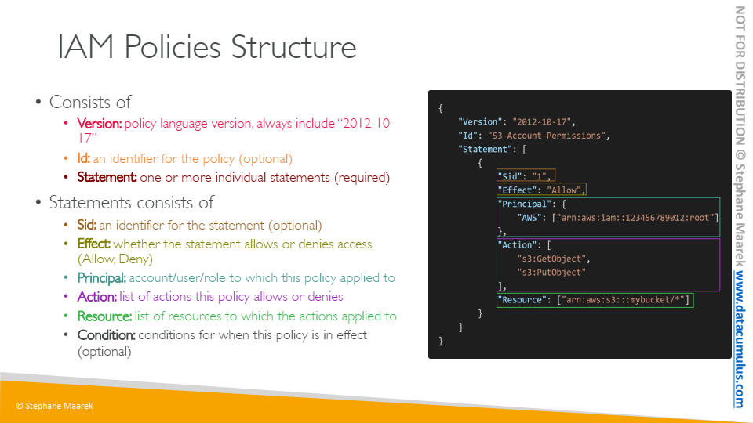

- [1. Course Introduction](#1-course-introduction)
  - [1.1. Estimated Cost to use services on AWS](#11-estimated-cost-to-use-services-on-aws)
  - [1.2. Different types of cloud computing](#12-different-types-of-cloud-computing)
- [2. What is Cloud Computing](#2-what-is-cloud-computing)
  - [2.1. AWS Cloud Overview](#21-aws-cloud-overview)
- [3. IAM - Identity and Access Management](#3-iam---identity-and-access-management)
  - [3.1. IAM Introduction Users, Gruops, Policies](#31-iam-introduction-users-gruops-policies)
  - [3.2. IAM Users and Groups hands-on](#32-iam-users-and-groups-hands-on)
  - [3.3. IAM Policies](#33-iam-policies)
  - [3.4. IAM Policies hands-on](#34-iam-policies-hands-on)
  - [3.5. IAM MFA Overview](#35-iam-mfa-overview)
  - [3.6. IAM MFA hands-on](#36-iam-mfa-hands-on)
  - [3.7. AWS Access Key, CLI and SDK](#37-aws-access-key-cli-and-sdk)
  - [3.8. AWS CLI Setup on Windows](#38-aws-cli-setup-on-windows)
  - [3.9. AWS CLI Setup on Mac](#39-aws-cli-setup-on-mac)
  - [3.10. AWS CLI Setup on Linux](#310-aws-cli-setup-on-linux)
  - [3.11. AWS CLI hands-on](#311-aws-cli-hands-on)
  - [3.12. AWS CloudShell](#312-aws-cloudshell)
  - [3.13. IAM Roles for AWS Services](#313-iam-roles-for-aws-services)
  - [3.14. IAM Roles hands-on](#314-iam-roles-hands-on)
  - [3.15. IAM Security Tools](#315-iam-security-tools)
  - [3.16. IAM Security Tools hands-on](#316-iam-security-tools-hands-on)
  - [3.17. IAM Best Practices](#317-iam-best-practices)
  - [3.18. Shared Responsibility Model for IAM](#318-shared-responsibility-model-for-iam)
  - [3.19. IAM Summary](#319-iam-summary)
- [4. EC2 - Elastic Compute Cloud](#4-ec2---elastic-compute-cloud)
  - [4.1. AWS Budget Setup](#41-aws-budget-setup)
  - [4.2. EC2 Basics](#42-ec2-basics)
  - [4.3. Create an EC2 Instance with EC2 User Data to have a Website hands-on](#43-create-an-ec2-instance-with-ec2-user-data-to-have-a-website-hands-on)
  - [4.4. EC2 Instance type basics](#44-ec2-instance-type-basics)
    - [4.4.1. General purpose](#441-general-purpose)
    - [4.4.2. Compute optimized](#442-compute-optimized)
    - [4.4.3. Memory optimized](#443-memory-optimized)
    - [4.4.4. Storage optimized](#444-storage-optimized)
  - [4.5. Security groups and classic ports overview](#45-security-groups-and-classic-ports-overview)
  - [4.6. Security group hands on](#46-security-group-hands-on)
  - [4.7. SSH Overview](#47-ssh-overview)
  - [4.8. How to SSH using Linux or Mac](#48-how-to-ssh-using-linux-or-mac)
  - [4.9. EC2 Instance Connect](#49-ec2-instance-connect)
  - [4.10. EC2 Roles Demo](#410-ec2-roles-demo)
  - [4.11. EC2 instance purchasing options](#411-ec2-instance-purchasing-options)
    - [4.11.1. EC2 On Demand](#4111-ec2-on-demand)
    - [4.11.2. EC2 Reserved Instances](#4112-ec2-reserved-instances)
    - [4.11.3. EC2 Savings Plans](#4113-ec2-savings-plans)
    - [4.11.4. EC2 Spot Instances](#4114-ec2-spot-instances)
    - [4.11.5. EC2 Dedicated Host](#4115-ec2-dedicated-host)
    - [4.11.6. EC2 Dedicated Instances](#4116-ec2-dedicated-instances)
    - [4.11.7. EC2 Capacity Reservations](#4117-ec2-capacity-reservations)
    - [4.11.8. Which purchasing option is right for me?](#4118-which-purchasing-option-is-right-for-me)
  - [4.12. IP Address Charges in AWS](#412-ip-address-charges-in-aws)
  - [4.13. Shared Responsibility Model for EC2](#413-shared-responsibility-model-for-ec2)
  - [4.14. EC2 Summary](#414-ec2-summary)
  - [4.15. EC2 quiz](#415-ec2-quiz)

---

# 1. Course Introduction

## 1.1. Estimated Cost to use services on AWS

1. Registrar: $12.00
1. Route53: $0.50
1. Config: $0.18
1. kms: $0.02
1. Other Services: $0.00
1. Total: $12.7

## 1.2. Different types of cloud computing

1. The scope of management on the application is different
   1. Iaas - Infrastructure as a Service
      1. Amazon EC2
      1. Google Cloud Platform, Digital Ocean
   1. Paas - Platform as a Service
      1. Elastic Ebanstalk
      1. Heroku, Google App Engine, Windows Azure
   1. Saas - Software as a Service
      1. Gmail, Zoom, etc.

# 2. What is Cloud Computing

## 2.1. AWS Cloud Overview

1. AWS Global Infrastructure
   1. AWS Regions
   1. AWS Availability Zones
   1. AWS Data Centers
   1. AWS Edge Locations / Points of Presence
1. We can check the detials at [https://aws.amazon.com/about-aws/global-infrastructure/regions_az/](https://aws.amazon.com/about-aws/global-infrastructure/regions_az/)
1. Factors to choose an AWS region
   1. Compliance with data goverance and legal requirements: data never leaves a region without your explicit permission.
   1. Proximity to customers: reduced latency.
   1. Available services within a region: new services and new features aren't available in every region.
   1. Pricing: Pricing varies region to region and is transparent in the service pricing page.
1. AWS console
   1. Global Services
      1. Identity and Access Management (IAM)
      1. Route 53 (DNS service)
      1. CloudFront (Content Delivery Network, CDN)
      1. WAF (Web Application Firewall)
   1. Most AWS services are region-scoped
      1. Amazon EC2 (IaaS)
      1. Elastic Beanstalk (PaaS)
      1. Lambda (FaaS)
      1. Rekognition (Saas)

# 3. IAM - Identity and Access Management

## 3.1. IAM Introduction Users, Gruops, Policies

1. IAM stands for Identity and Access Management, which is a Global service.
1. Root account created by default, should be used or shared.
1. Users are people within your organization, and can be grouped.
1. Groups only contain users, not other groups.
1. A user can be isolated and not in any group.
1. A user can be in multiple groups.
1. IAM Permissions can be assigned by "**policies**" in JSON format. The policies define the permissions of the users
1. In AWS, we usually apply the least privilege principle. It means we don't provide additional permissions which the user doesn't need.

## 3.2. IAM Users and Groups hands-on

1. Though we may have root user which can access all the functions in the console, we should have a separated "admin" with scoped privilege.
1. Note that IAM is a global service which policies can be applied to all the regions that the organization has.
1. Add a new user and create a group
   1. In IAM, we can add a new user by giving "AWS Management Console access" which is an admin role. We can allow user using custom password or generated by the first time and allow the user to reset the password upon 2nd use and so on.
   1. After the user is created, we can create a group and select the privileges we want to assign. For example, admins can have "**AdministratorAccess**".
   1. We then can add tags and values as description as the metadata of the user.
   1. After the user is created, we can review the user profile and download the list of users in the organization in CSV.
1. In IAM dashboard, we can check the sign-in URL for IAM users. We can also create alias to have a custom URL link.
1. In AWS management console login page, we can select to login as a root user or IAM. To select the AWS account, we can either use the account ID or the alias we created in IAM dashboard and provide IAM user name with password to login.

## 3.3. IAM Policies

1. IAM Policies scope and groups
   
1. IAM Policies Structure
   

## 3.4. IAM Policies hands-on

1. Remove permission of users by the root user account.
1. Give the user privilege "IAMReadOnlyAccess" which only allows the user to view the data but can't edit the user groups.
1. Create another group with difference privilege(s) and add user to the group.
1. After configure the settings for a user, we can check a user that which group(s) is the user in and what privilege does the user have.

## 3.5. IAM MFA Overview

1. In AWS, we can setup a password policy
   1. Set a minimum password length
   1. Require specific character types
   1. Allow all IAM users to change their own passwords
   1. Require users to change their password after some time (password expiration)
   1. Prevent password re-use
1. Multi Factor Authentication - MFA
   1. Users have access to your account and can possibly change configurations or delete resources in your AWS account.
   1. You want to protect your Root Accounts and IAM users.
   1. MFA = password you know + security device you own.
1. The main benefit from the feature is if a password is stolen or hacked, the account is not compromised.
1. MFA devices options including Virtual MFA device such as
   1. Google Authenticator (phone only)
   1. Authy (multi-device)
1. MFA devices options can also use Universal 2nd Factor (U2F) Security Key, such as YubiKey by Yubico which is a 3rd party device.
   
   

## 3.6. IAM MFA hands-on

1. We can create and change password policy in "Account settings" in IAM.
   
1. After setup the device for MFA, the AWS management console will ask to use passcode from MFA when login. This feature can be very useful to secure root user for AWS account.

## 3.7. AWS Access Key, CLI and SDK

1. To access AWS, we can use the following options
   1. AWS Management Console (protected by password + MFA). This is web-based user interface.
   1. AWS Command Line Interface (CLI) (protected by access key)
   1. AWS Software Developer Kit (SDK) (protected by access key)
1. Access keys are generated through the AWS console
1. Users manage their own access keys
1. Access Key ID is similar to username
1. Secret Access Key is similar to password
1. AWS CLI
   1. AWS CLI is a tool to interact with AWS services using commands in command-line shell
   1. Direct access to the public APIs of AWS services
   1. We can develop custom scripts to manage your resources
   1. It's an alternative to using AWS management console
1. AWS SDK
   1. AWS SDK is language-specific APIs (set of libraries)
   1. This enables users to access and manage AWS services programmatically

## 3.8. AWS CLI Setup on Windows

## 3.9. AWS CLI Setup on Mac

## 3.10. AWS CLI Setup on Linux

1. We can download AWS CLI version 2 for the OS system we are using from [https://docs.aws.amazon.com/cli/latest/userguide/install-cliv2.html](https://docs.aws.amazon.com/cli/latest/userguide/install-cliv2.html)
1. After installing, we can use `aws --version` to check in the command-line shell.

## 3.11. AWS CLI hands-on

1. In IAM, we can check a user from "users" and create security credentials which is a key/value pair. Note that the key value pair can only be checked when it's created. The secret will be hidden and can't be revoked once we lost it. It's user's responsibility to keep the access key secret safe.
1. We can configure AWS with `aws configure`, so we can set up the user to login from the command-line shell.
1. After setting up, we can use `aws iam list-users` to check users created for the AWS account. Note that if the logged in user doesn't have the privilege to access, we can't check the data. This part is similar to the webpage checking "users" in IAM service on AWS management console.

## 3.12. AWS CloudShell

1. This feature is only available in some of the regions. We can check the [list](https://aws.amazon.com/cloudshell/) if the region we are going access has the feature enabled.
1. This interface is similar to AWS CLI which is web-based. Besides, we can use this tool to easily upload or download the file to the server.

## 3.13. IAM Roles for AWS Services

1. Some AWS service will need to perform actions on your behalf. We can assign permissions to AWS services with "IAM Roles". This is to allow AWS services execute certain functions by under controlled with IAM privileges.
1. For example, we have an EC2 instance (virtual server) to do perform certain functions to AWS account. This can be applied to other AWS services such as LAMBDA.

## 3.14. IAM Roles hands-on

1. In AWS management console, we can check "Roles" tab and create a new "role" for AWS service.
1. We can create a role for certain AWS services. The common services to apply are "EC2" and "LAMBDA".

## 3.15. IAM Security Tools

1. IAM credentials reports (account-level)
   1. A report that lists all the AWS account's users and the status of their various credentials.
1. IAM Access Advisor (user-level)
   1. Access advisor shows the service permissions granted to a user and when those services were last accessed.
   1. We can use the information to revise IAM policies.

## 3.16. IAM Security Tools hands-on

1. In IAM, we can look up "credential report" to download all the users and settings in CSV.
1. For each user in "users", we can check "Access Advisor" to check what permission(s) is assigned to the user and when did the user last access the permission.

## 3.17. IAM Best Practices


## 3.18. Shared Responsibility Model for IAM

1. The main take away is that AWS obvious is responsible for all the infrastructure and hardware maintenance an AWS user subscribes. The user must be responsible for the security, management, and monitoring the usage of AWS services of the AWS account.
   

## 3.19. IAM Summary


# 4. EC2 - Elastic Compute Cloud

## 4.1. AWS Budget Setup

1. In account settings for billing, we can check to enable `IAM user and role access to Billing information` to allow IAM `admin` users to work on billing related tasks.
   1. [https://console.aws.amazon.com/billing/home#/account](https://console.aws.amazon.com/billing/home#/account)
2. We can check the bill of an AWS account firstly with Root user access. By clicking the account and go to "My Bill Dashboard".
3. We can check "Bills" in the navigation panel on the left. This shows the services the account used and list of service fee on each service.
   1. Each services groups regions that the AWS account access and uses the service at.
   2. The region group includes all the details in the list that how the account uses the service.
4. We can navigate back to the "Home" page of bills to check usage on free-tier services on AWS.
5. To create a limited budget spending for each billing cycle, we can create a budget plan in "Budgets".

## 4.2. EC2 Basics

1. We can rent a virtual server from AWS with specific hardware.
   
   
   
2. We can also setup "**EC2 User data**" script to bootstrap an instance when the machine starts.
   

## 4.3. Create an EC2 Instance with EC2 User Data to have a Website hands-on

1. In EC2, we can check "Instances" under Instances and create a new instance by clicking "Launch Instances". It takes several steps to setup a new instance
   1. Choose AMI
      1. This is to select the image for OS and environment of the machine. For example, we can choose Ubuntu 18.04.
   2. Choose Instance Type
      1. This is the hardware specs such as how many CPU and how much RAM we'd like to have for the machine.
   3. Configure Instance
      1. We can configure the instance with "User data" in "Advanced Details" down below. This scripts will execute when the machine starts or reboot.
   4. Add Storage
      1. We can have this by default and set if the extra storage should be bound to the instance, so when the instance is removed, the attached storage will be removed.
   5. Add Tags
      1. We can attach tags with key/value pairs on the instance for up to 50 tags.
   6. Configure Security Group
      1. This allows the server open certain ports to allow connection with specified protocol.
      2. For example, the instance has port `22` for TCP connection to allow users to connect through SSH.
      3. We can set up port `80` for TCP connection with HTTP and allow the source at `0.0.0.0/0, ::/0` which means granted all requests that accepts connection from any other machine. This will allow users to connect to the server for website contents with a regular browser.
   7. Review
      1. AWS may give a warning as we open the instance to the world by setting source at `0.0.0.0/0, ::/0`. We may ignore this since we intend to setup the server for website hosting and allow all users to visit the website.
      2. After clicking launch, AWS will ask to select an existing key pair or create a new one. This is to allow the AWS user to connect to the instance through SSH.
      3. Note that the `.pem` file is critical for SSH connection as the password and can only be downloaded once. Besides, anyone has the `.pem` file can connect to the instance through SSH. For security reason, we should carefully manage the file.
2. After creating a new instance, we can manage instances to start, stop, or terminate and dispose the instance if we don't need it.
3. Note that every time the instance stop and start as rebooting, the public IPv4 address will change.

## 4.4. EC2 Instance type basics

1. There are several [EC2 instance types](https://aws.amazon.com/ec2/instance-types/) focusing on different purposes.
2. List of EC2 instances [https://ec2instances.info/](https://ec2instances.info/) and [https://instances.vantage.sh/](https://instances.vantage.sh/)
3. We can tell the instance type, generation, and size from its name.


4. In this course, we use `t2.micro` in free tier which is a general purpose instance.

### 4.4.1. General purpose

1. Great for a diversity of workloads such as web servers or code repositories.
2. It's balanced between

   1. Compute
   2. Memory
   3. Networking

    

### 4.4.2. Compute optimized

1. Great for compute intensive tasks that require high performance processors.

   1. Batch processing workloads
   2. Media transcoding
   3. High performance web servers
   4. High performance computing (HPC)
   5. Scientific modeling and machine learning
   6. Dedicated gaming servers

    

### 4.4.3. Memory optimized

1. Fast performance for workloads that process large data sets in memory.

   1. High performance, relational/non-relational databases
   2. Distributed web scale cache stores
   3. In-memory databases optimized for BI (business intelligence)
   4. Applications performing real-time processing of big unstructured data

    

### 4.4.4. Storage optimized

1. Great for storage-intensive tasks that require high, sequential read and write access to large data sets on local storage.

   1. High frequency online transaction processing (OLTP) systems
   2. Relational and NoSQL databases
   3. Cache for in-memory databases (for example, Redis)
   4. Data warehousing applications
   5. Distributed file systems

    

    

## 4.5. Security groups and classic ports overview

1. Security groups are the fundamental of network security in AWS.
2. They control how traffic is allowed into or out of our EC2 instances.
3. Security groups only contain allow rules.
4. Security groups rules can reference by IP or by security group.
5. Security groups are acting as "**firewall**" on EC2 instances.
6. They regulate

   1. access to ports
   2. Authorized IP ranges - IPv4 and IPv6
   3. Control of inbound network (from other to the instance)
   4. Control of outbound network (from the instance to other)

    
    

7. Security group good to know

   1. A security group can be attached to multiple instances, while an instance can attach multiple security groups too.
   2. Security group is locked down to the region/VPC combination.
   3. Security group lives outside the EC2. It means that if the traffic is blocked, the EC2 instance won't see the request/traffic.
   4. It's good to maintain one separate security group for SSH access.
   5. Usually if an application is not accessible (timeout), it can be an issue from security group.
   6. On the other hand, if the connection gets a "connection refused" error, it can be an error from the application in EC2 or the app is not even running.
   7. All inbound traffic is **blocked** by default.
   8. All outbound traffic is **authorized** by default.

    

8. A security group can reference other security groups.
9. For example, we can specify if traffic from security group 1 and 2 is authorized, so if there's any other instances applying security group other than 1 and 2 (such as applying 3), the request will be blocked.

   

10. Classic ports to know
    1. `22` - SSH (Secure Shell) - log into a linux instance.
    2. `21` - FTP (File Transfer Protocol) - upload files into a file share.
    3. `22` - SFTP (Secure File transfer Protocol) - upload files using SSH.
    4. `80` - HTTP - access unsecured websites
    5. `443` - HTTPS - access secured websites
    6. `3389` - RDP (Remote Desktop Protocol) - log into a Windows instance.
11. `22` and `3389` are like counterparts for connecting to instances using different OS.

    

## 4.6. Security group hands on

1. When checking on an EC2 instance, we can check on its **security** which shows the security group attaching to it.
2. The security tab shows the overview of the inbound and outbound rule of the instance.
3. In addition, we can review the details of the security group from the network and security section in the left panel.
4. If we have a web app server app running on the instance and open port `80` for inbound HTTP traffic, we can access the web app by visiting its IP address.
5. Note that if the connection to the EC2 instance times out (keeping loading in the client such as browser or SSH), it's usually an issue from security group setup.
6. An EC2 instance can attach multiple security groups.
7. All the outbound traffic are allowed by default.

## 4.7. SSH Overview


## 4.8. How to SSH using Linux or Mac

1. In the security group section, the security rule allows `SSH` inbound traffic through port `22` from any address `0.0.0.0/0`.
2. We can put the `.pem` file we downloaded when setting up EC2 and use SSH client to access the EC2 instance with its public IPv4 address.
3. Note that for simplicity, we can change directory to where the `.pem` file is and use SSH client.
4. Besides, the ownership of the file should be set as `chmod 0400`

   ```shell
   # cd to the directory where the .pem file locates
   chmod 0400 {{your_pem_file}}.pem
   # ec2-user is setup by AWS by default
   ssh -i {{your_pem_file}}.pem ec2-user@{{your_ec2_public_ipv4_address}}
   ```

## 4.9. EC2 Instance Connect


## 4.10. EC2 Roles Demo

1. As for security, never keep IAM API key in the server EC2 instance directly.
2. The AWS credentials should be provided through IAM roles only.
3. Note that AWS CLI tool is installed in the EC2 instance by default.
4. In the managing console, we can attach an IAM role to the EC2 instance
   1. Instance > Action > Security
5. Note that it can take some time (few seconds for update to IAM reflecting to the instance).

```shell
# aws users and credentials
aws iam list-users
```

## 4.11. EC2 instance purchasing options


### 4.11.1. EC2 On Demand

1. Pay for what you use
   1. Linux or Windows - billing per second, after the first minute
   2. All other operating systems - billing per hour
2. Has the highest cost but no upfront payment
3. No long-term commitment
4. Recommended for short-term and un-interrupted workloads, where you can't predict how the application will behave.


### 4.11.2. EC2 Reserved Instances

1. Higher amount of discount compared to on-demand.
   1. The discount rate can change over time.
2. You reserve a specific instance attributes (Instance type, Region, Tenancy, OS).
3. Reservation period - 1 year (discount) or 3 years (discount++).
4. Payment options
   1. No upfront
   2. Partial upfront
   3. All upfront
5. Reserved instance's scope - Regional or Zonal (reserve capacity in an AZ).
6. Recommended for steady-state usage applications (think database).
7. You can buy and sell in the reserved instance marketplace.
8. Convertible reserved instance is a special instance type that
   1. can change the EC2 instance type, instance family, OS, scope and tenancy.


### 4.11.3. EC2 Savings Plans

1. Get a discount based on long-term usage (up to 72% - same as RIs).
2. Commit to a certain type of usage ($10/hour for 1 or 3 years).
3. Usage beyond EC2 savings plans is billed at the on-demand price.
4. Locked to a specific instance family and AWS region (e.g. M5 in us-east-1)
5. Flexible across
   1. Instance size (e.g. m5.xlarge, m5.2xlarge)
   2. OS (e.g. Linux, Windows)

### 4.11.4. EC2 Spot Instances

1. Can get a discount of up to 90% compared to on-demand.
2. Instances that you can "lose" at any point of time if your max price is less than the current spot price.
3. The **MOST cost-efficient** instances in AWS.
4. Useful for workloads that are resilient to failure.
   1. Batch jobs
   2. Data analysis
   3. Image processing
   4. Any distributed workloads
   5. Workloads with a flexible start and end time
5. Not suitable for critical jobs or database


### 4.11.5. EC2 Dedicated Host

1. A physical server with EC2 instance capacity fully dedicated to your use.
2. Allows you address compliance requirements and use your existing server-bound software licenses (per-socket, per-core, pe-vm software licenses).
3. Purchasing options
   1. On-demand - pay per second for active dedicated host
   2. Reserved - 1 or 3 years (No upfront, partial upfront, all upfront)
4. The most expensive option
5. Useful for software that have complicated licensing model (BYOL - Bring your own license)
6. Or for companies that have strong regulatory or compliance needs


### 4.11.6. EC2 Dedicated Instances

1. Instances run on hardware that's dedicated to you.
2. May share hardware with other instances in same account.
3. No control over instance placement (can move hardware after stop/start)


### 4.11.7. EC2 Capacity Reservations

1. Reserve on-demand instances capacity in a specific AZ for any duration.
2. You always have access to EC2 capacity when you need it.
3. No time commitment (create/cancel anytime), no billing discounts.
4. Combine with **Regional Reserved Instances** and **Saving Plans** to benefit from billing discounts.
5. You're charged at on-demand rate whether you run instance or not.
6. Suitable for short-term, uninterrupted workloads that needs to be in a specific AZ.

### 4.11.8. Which purchasing option is right for me?

1. **On demand**: coming and staying in resort whenever we like, we pay the full price.
2. **Reserved**: like planning ahead and if we plan to stay for a long time, we may get a good discount.
3. **Saving plans**: pay a certain amount per hour for certain period and stay in any room type (e.g. King, Suite, Sea view,...).
4. **Spot instances**: The hotel allows people to bid for the empty rooms and the highest bidder keeps the rooms. You can get kicked out at any time.
5. **Dedicated host**: We book an entire building of the resort.
6. **Capacity reservations**: You book a room for a period with full price even you don't stay in it.


- Price difference between plans of the same instance type


## 4.12. IP Address Charges in AWS

1. Starting from Feb. 2024, there's a charge for all public IPv4 created in the account.
2. `$0.005` per hour, which is $3.6 per month.
3. AWS only proves 750 hours/month for free tier on EC2.
4. Anything beyond the free tier will have additional charges.
5. For example, if we have a database and want to connect it from the public, it needs the other public IPv4 which will have extra costs.
6. Though public IPv6 is free from AWS at the moment, many ISPs don't support it.
7. We can check from bill and costs management to verify costs if there's addition IPv4 charges.
8. Besides, we can check IP address at IPAM (Amazon VPC IP Address Manager) to check on public IP addresses.

## 4.13. Shared Responsibility Model for EC2

| AWS                                      | User                                                     |
| ---------------------------------------- | -------------------------------------------------------- |
| Infrastructure (global network security) | Security Group rules                                     |
| Isolation on physical hosts              | Operating-system patches and updates                     |
| Replacing faulty hardware                | Software and utilities installed on the EC2 instance     |
| Compliance validation                    | IAM roles assigned to EC2 and IAM user access management |
|                                          | Data security on your instance                           |


## 4.14. EC2 Summary

1. EC2 instance: AMI (OS) + Instance Size (CPU + RAM) + Storage + security groups + EC2 user data
2. Security groups: Firewall attached to the EC2 instance
3. EC2 user data: Script launched at the first start of an instance
4. SSH: Start a terminal into our EC2 instances (port 22)
5. EC2 Instance Role: Link to IAM roles
6. Purchasing Options: On-demand, Spot, Reserved (Standard + Convertible), Dedicated Host, Dedicated Instance


## 4.15. EC2 quiz

1. Which EC2 purchasing option can provide the biggest discount, but is not suitable for critical jobs or databases?
   1. Reserved instances
   2. Convertible instances
   3. Dedicated instances
   4. Spot instances
