Start learning on 2021/03/24
Finished on 

Course Link [https://www.udemy.com/course/advanced-css-and-sass/](https://www.udemy.com/course/advanced-css-and-sass/)
---
1. [Natours Project - Setup and First Steps (Part 1)](#Natours-Project---Setup-and-First-Steps-(Part-1))
    1. [Project Overview](#Project-Overview)
    1. [Building the Header - Part 1](#Building-the-Header---Part-1)
    1. [Building the Header - Part 2](#Building-the-Header---Part-2)
    1. [Building a Complex Animated Button - Part 1](#Building-a-Complex-Animated-Button---Part-1)
    1. [Building a Complex Animated Button - Part 2](#Building-a-Complex-Animated-Button---Part-2)
1. [How CSS Works: A Look Behind the Scenes](#How-CSS-Works-A-Look-Behind-the-Scenes)
    1. [Three Pillars of Writing Good HTML and CSS](#Three-Pillars-of-Writing-Good-HTML-and-CSS)
    1. [How CSS Works Behind the Scenes: An Overview](#How-CSS-Works-Behind-the-Scenes-An-Overview)
    1. [How CSS is Parsed, Part 1: The Cascade and Specificity](#How-CSS-is-Parsed,-Part-1-The-Cascade-and-Specificity)
    1. [How CSS is Parsed, Part 2: Value Processing](#How-CSS-is-Parsed,-Part-2-Value-Processing)
    1. [How CSS is Parsed, Part 3: Inheritance](#How-CSS-is-Parsed,-Part-3-Inheritance)
    1. [Converting px to rem: An effective Workflow](#Converting-px-to-rem-An-effective-Workflow)
    1. [How CSS Renders a Website: The Visual Formatting Model](#How-CSS-Renders-a-Website-The-Visual-Formatting-Model)
        1. [The Box Model](#The-Box-Model)
        1. [Box Types](#Box-Types)
    1. [CSS Architecture, Components and BEM](#CSS-Architecture,-Components-and-BEM)
    1. [Implementing BEM in the Natours project](#Implementing-BEM-in-the-Natours-project)
1. [Introduction to Sass and NPM](#Introduction-to-Sass-and-NPM)
    1. [What is Sass](#What-is-Sass)
    1. [First Steps with Sass: Variables and Nesting](#First-Steps-with-Sass-Variables-and-Nesting)
    1. [First Steps with Sass: Mixins, Extends, and Functions](#First-Steps-with-Sass-Mixins,-Extends,-and-Functions)
1. [Natours Project - Using Advanced CSS and Sass (Part 2)](#Natours-Project---Using-Advanced-CSS-and-Sass-(Part-2))
    1. [Converting Our CSS Code to Sass: Variables and Nesting](#Converting-Our-CSS-Code-to-Sass-Variables-and-Nesting)
    1. [Implementing the 7-1 CSS Architecture with Sass](#Implementing-the-7-1-CSS-Architecture-with-Sass)
    1. [Review: Basic Principles of Responsive Design and Layout Types](#Review-Basic-Principles-of-Responsive-Design-and-Layout-Types)
    1. [Building a Custom Grid with Floats](#Building-a-Custom-Grid-with-Floats)
    1. [Building the About Section - Part 1](#Building-the-About-Section---Part-1)
    1. [Building the About Section - Part 2](#Building-the-About-Section---Part-2)
    1. [Building the About Section - Part 3](#Building-the-About-Section---Part-3)
    1. [Building the Features Section](#Building-the-Features-Section)
    1. [Building the Tours Section - Part 1](#Building-the-Tours-Section---Part-1)
    1. [Building the Tours Section - Part 2](#Building-the-Tours-Section---Part-2)
    1. [Building the Tours Section - Part 3](#Building-the-Tours-Section---Part-3)
    1. [Building The Stories Section - Part 1](#Building-The-Stories-Section---Part-1)
    1. [Building The Stories Section - Part 2](#Building-The-Stories-Section---Part-2)
    1. [Building The Stories Section - Part 3](#Building-The-Stories-Section---Part-3)
    1. [Building the Booking Section - Part 1](#Building-the-Booking-Section---Part-1)
    1. [Building the Booking Section - Part 2](#Building-the-Booking-Section---Part-2)
    1. [Building the Booking Section - Part 3](#Building-the-Booking-Section---Part-3)
    1. [Building the Footer](#Building-the-Footer)
    1. [Building the Navigation - Part 1](#Building-the-Navigation---Part-1)
    1. [Building the Navigation - Part 2](#Building-the-Navigation---Part-2)
    1. [Building the Navigation - Part 3](#Building-the-Navigation---Part-3)
    1. [Building a Pure CSS Popup - Part 1](#Building-a-Pure-CSS-Popup---Part-1)
    1. [Building a Pure CSS Popup - Part 2](#Building-a-Pure-CSS-Popup---Part-2)
1. [Natours Project - Advanced Responsive Design (Part 3)](#Natours-Project---Advanced-Responsive-Design-(Part-3))
    1. [Mobile-First vs Desktop-First and Berakpoints](#Mobile-First-vs-Desktop-First-and-Berakpoints)
    1. [Let's Use the Power of Sass Mixins to Write Media Queries](#Let's-Use-the-Power-of-Sass-Mixins-to-Write-Media-Queries)
    1. [Writing Media Queries - Base, Typography and Layout](#Writing-Media-Queries---Base,-Typography-and-Layout)
    1. [Writing Media Queries - Layout, About and Features Sections](#Writing-Media-Queries---Layout,-About-and-Features-Sections)
    1. [Writing Media Queries - Tours, Stories, and Booking Sections](#Writing-Media-Queries---Tours,-Stories,-and-Booking-Sections)
    1. [An Overview of Responsive Images](#An-Overview-of-Responsive-Images)
    1. [Responsive Images in HTML - Art Direction and Density   Switching](#Responsive-Images-in-HTML---Art-Direction-and-Density-Switching)
    1. [Responsive Images in HTML - Desity and Resolution Switching](#Responsive-Images-in-HTML---Desity-and-Resolution-Switching)
    1. [Responsive Images in CSS](#Responsive-Images-in-CSS)
    1. [Testing for Browsers Support with @supports](#Testing-for-Browsers-Support-with-@supports)
    1. [Setting up a Simple Build Process with NPM Scripts](#Setting-up-a-Simple-Build-Process-with-NPM-Scripts)
    1. [Wrapping up the Natours Project: Final Considerations](#Wrapping-up-the-Natours-Project-Final-Considerations)
1. [Trillo Project - Master Flexbox](#Trillo-Project---Master-Flexbox)
    1. [Why Flexbox: An Overview of the Philosophy Behind Flexbox](#Why-Flexbox-An-Overview-of-the-Philosophy-Behind-Flexbox)
    1. [A Basic Intro to Flexbox: The Flex Container](#A-Basic-Intro-to-Flexbox-The-Flex-Container)
    1. [A Basic Intro to Flexbox: Flex Items](#A-Basic-Intro-to-Flexbox-Flex-Items)
    1. [A Basic Intro to Flexbox: Adding More Flex Items](#A-Basic-Intro-to-Flexbox-Adding-More-Flex-Items)
    1. [Project Overview](#Project-Overview)
    1. [Defining Project Settings and Custom Properties](#Defining-Project-Settings-and-Custom-Properties)
    1. [Building the Overall Layout](#Building-the-Overall-Layout)
    1. [Building the Header - Part 1](#Building-the-Header---Part-1)
    1. [Building the Header - Part 2](#Building-the-Header---Part-2)
    1. [Building the Header - Part 3](#Building-the-Header---Part-3)
    1. [Building the Navigation - Part 1](#Building-the-Navigation---Part-1)
    1. [Building the Navigation - Part 2](#Building-the-Navigation---Part-2)
    1. [Building the Hotel Overview - Part 1](#Building-the-Hotel-Overview---Part-1)
    1. [Building the Hotel Overview - Part 2](#Building-the-Hotel-Overview---Part-2)
    1. [Building the Description Section - Part 1](#Building-the-Description-Section---Part-1)
    1. [Building the Description Section - Part 2](#Building-the-Description-Section---Part-2)
    1. [Building User Reviews Section](#Building-User-Reviews-Section)
    1. [Building the CTA Section](#Building-the-CTA-Section)
    1. [Writing Media Queries - Part 1](#Writing-Media-Queries---Part-1)
    1. [Writing Media Queries - Part 2](#Writing-Media-Queries---Part-2)
    1. [Wrapping up the Trillo Project: Final Considerations](#Wrapping-up-the-Trillo-Project-Final-Considerations)
1. [A Quick Introduction to CSS Grid Layouts](A-Quick-Introduction-to-CSS-Grid-Layouts)
    1. [Why CSS Grid: A Whole new Mindset](#Why-CSS-Grid-A-Whole-new-Mindset)
    1. [Quick Setup for This Section](#Quick-Setup-for-This-Section)
    1. [Creating Our First Grid](#Creating-Our-First-Grid)
    1. [Getting Familiar with the fr unit](#Getting-Familiar-with-the-fr-unit)
    1. [Positioning Grid Items](#Positioning-Grid-Items)
    1. [Spanning Grid Items](#Spanning-Grid-Items)
    1. [Grid Challenge](#Grid-Challenge)
    1. [Grid Challenge: A Basic Solution](#Grid-Challenge-A-Basic-Solution)
    1. [Naming Grid Lines](#Naming-Grid-Lines)
    1. [Naming Grid Areas](#Naming-Grid-Areas)
    1. [Implicit Grid vs. Explicit Grids](#Implicit-Grid-vs.-Explicit-Grids)
    1. [Aligning Grid Items](#Aligning-Grid-Items)
    1. [Aligning Tracks](#Aligning-Tracks)
    1. [Using min-content, max-content and the minmax() function](#Using-min-content,-max-content-and-the-minmax()-function)
    1. [Responsive Layouts with auto-fit and auto-fill](#Responsive-Layouts-with-auto-fit-and-auto-fill)
1. [Nexter Project - Master CSS Grid Layouts](#Nexter-Project---Master-CSS-Grid-Layouts)
    1. [Project Overview and Setup](#Project-Overview-and-Setup)
    1. [Building the Overall Layout - Part 1](#Building-the-Overall-Layout---Part-1)
    1. [Building the Overall Layout - Part 2](#Building-the-Overall-Layout---Part-2)
    1. [Building the Features Section - Part 1](#Building-the-Features-Section---Part-1)
    1. [Building the Features Section - Part 2](#Building-the-Features-Section---Part-2)
    1. [Building the Story Section - Part 1](#Building-the-Story-Section---Part-1)
    1. [Building the Story Section - Part 2](#Building-the-Story-Section---Part-2)
    1. [Building the Homes Section - Part 1](#Building-the-Homes-Section---Part-1)
    1. [Building the Homes Section - Part 2](#Building-the-Homes-Section---Part-2)
    1. [Building the Gallery - Part 1](#Building-the-Gallery---Part-1)
    1. [Building the Gallery - Part 2](#Building-the-Gallery---Part-2)
    1. [Building the Footer](#Building-the-Footer)
    1. [Building the Sidebar](#Building-the-Sidebar)
    1. [Building the Header - Part 1](#Building-the-Header---Part-1)
    1. [Building the Header - Part 2](#Building-the-Header---Part-2)
    1. [Building the Realtors Section](#Building-the-Realtors-Section)
    1. [Writing Media Queries - Part 1](#Writing-Media-Queries---Part-1)
    1. [Writing Media Queries - Part 2](#Writing-Media-Queries---Part-2)
    1. [Browser Supprot for CSS Grid](#Browser-Supprot-for-CSS-Grid)
    1. [Warpping up the NExter Project: Final Considerations](#Warpping-up-the-NExter-Project-Final-Considerations)

---
# Natours Project - Setup and First Steps (Part 1)
## Project Overview
1. [Porject Link](https://wonderful-goldwasser-8b2175.netlify.app/irresponsive_natours/index.html)
1. Put the link of final builtup here after finishing practicing
1. Use pure CSS without JavaScript to create the following effects
    1. A "**Hover Effect**" that the card flips when the user put the cursor on the element. 
    1. A whole page "**Pop up**" when user clicks an element. 
    1. "**Playing video**" as background.
    1. A modern look "**Form**" that the placeholder in the input will "**slide down**" when the user tries to input something.
    1. A fixed menu bottom on the top and creates a whole page menu list when the user clicks it.

## Building the Header - Part 1
1. Learning targets
    1. The best way to perform a basic reset using the universal selector
    1. How to set project-wide font definitions
    1. How to clip parts of elements using `clip-path`
1. Universal reset is used to be essential to set up the initial configuration for a project. However, this process is not necessary as modern brwosers has been better for this issue. 
1. Note that setting for "**fonts**" in the parent elements will be passed down to all its child elements.
    ```css
    * {
        margin: 0;
        padding: 0;
        box-sizing: border-box;
    }

    body {
        font-family: "Lato", sans-serif; /* we have imported the font in HTML already*/
        font-weight: 400;
        font-size: 16px;
        line-height: 1.7; /* line height is different */
        color: #777;
        padding: 30px;
    }
    ```
1. Background image for header tag.
    1. [`background-size`](https://www.w3schools.com/cssref/css3_pr_background-size.asp) is set to `cover` to ensure the image fits to the size of its container.
    1. [`background-position`](https://www.w3schools.com/cssref/pr_background-position.asp) sets the starting position of a background image. By default, a background-image is placed at the top-left corner of an element, and repeated both vertically and horizontally.
    1. We can stack up elements for background images and separate teh given elements with comma `,`. 
    1. As we want a filter made [`linear-gradient`](https://www.w3schools.com/css/css3_gradients.asp) with `Light green: #7ed56f` and `Medium green: #55c57a`. Besides, we can set the direction as `right bottom`, so the gradient will start from top left to bottom right.
    1. We can use [`clip-path`](https://www.w3schools.com/cssref/css3_pr_clip-path.asp) to set the image as `polygon`, such as triangle or pentagon. Besides, we can use [https://bennettfeely.com/clippy/](https://bennettfeely.com/clippy/) to help setting up the shape. 
    ```css
    .header {
        height: 95vh;
        background-image: linear-gradient(
            to right bottom, 
            rgba(126, 213, 111, 0.8), 
            rgba(40,180,131,0.8)), 
            url(../img/hero.jpg);
        background-size: cover;
        background-position: top;
        clip-path: polygon(0 0, 100% 0, 100% 75vh, 0 100%);
    }
    ```
    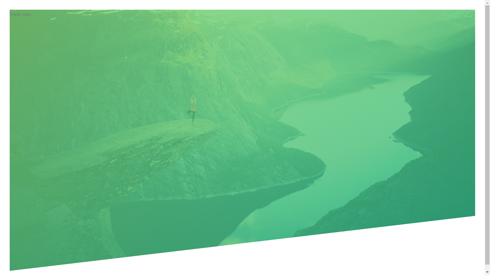

## Building the Header - Part 2
1. When we align elements to each other, we can set the parent elemetn as `position: relative`, and its child to be `position: absolute`. We then can use `top`, `left`, `right`, `bottom` properties to set the position of the element according to its parent. 
1. This `position: absolute` property is setting to the element to its parent element. The left edge of the nested element will be on the center of the parent element. This effect makes the element looks shifted futher than the center point. The middle of the nested element IS NOT at the center of its parement element.
    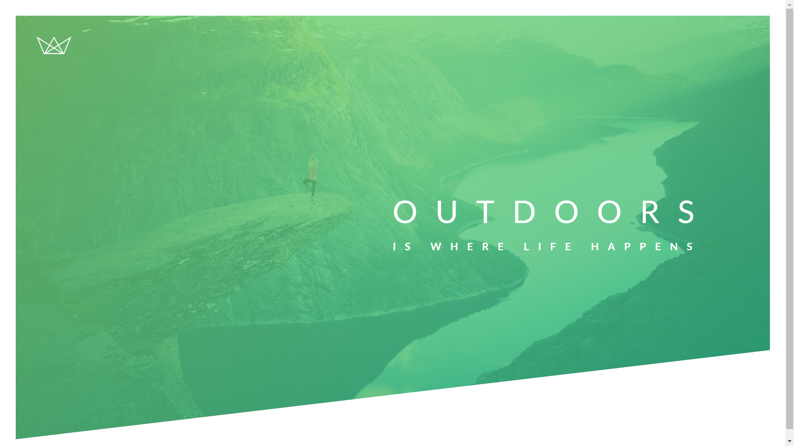
1. In this case, we can use `transform: translate` to push the element back to the middle. `translate` is the property that shift from the center of the selected element. 
1. For example, if a 250px-wide block element is nested in a 500px-wide element, the left edge will be right at the middle of its container when using `position: absolute`, `top:50%`, and `left: 50%`. Thus, we can use `transform: translate` to shift the element half of its own width, which is `125px`. The element will then looks exactly at the middle of the container.
    ```css
    .logo-box {
        position: absolute;
        top: 40px;
        left: 40px;
    }

    .logo {
        height: 35px;
    }

    .text-box {
        position: absolute;
        top: 40%;
        left: 50%;
        transform: translate(-50%, -50%);
    }

    .heading-primary {
        color: #fff;
        text-transform: uppercase;
    }

    .heading-primary-main {
        display: block;
        font-size: 60px;
        font-weight: 400;
        letter-spacing: 35px;
    }

    .heading-primary-sub {
        display: block;
        font-size: 20px;
        font-weight: 700;
        letter-spacing: 17.4px;
    }
    ```
    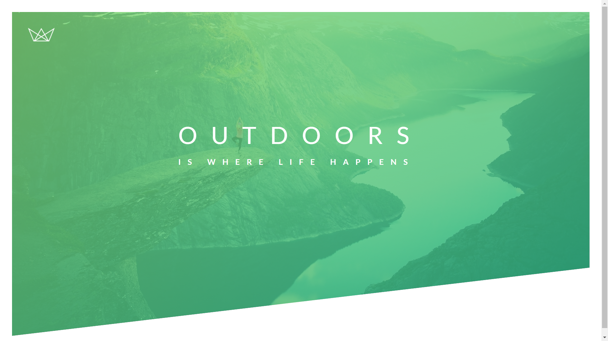
    
1. We can use `@keyframes` to create animations. The percentage in the keyframes means the stage of the animation during process that we can set the element in different conditions, location, or shape. There are some frequent use property though we can put them in one line as `animation`.
    1. `animation-name`
    1. `animation-duration`
    1. `animation-timing-function`
    1. `animation-duration`
    1. `animation-delay`
    ```css
    .heading-primary {
        color: #fff;
        text-transform: uppercase;

        backface-visibility: hidden;
    }

    .heading-primary-main {
        display: block;
        font-size: 60px;
        font-weight: 400;
        letter-spacing: 35px;

        animation-name: moveInLeft;
        animation-duration: 1s;
        animation-timing-function: ease-out;
        
        /* animation-iteration-count: 3; */
        /* animation-delay: 1s; */
    }

    .heading-primary-sub {
        display: block;
        font-size: 20px;
        font-weight: 700;
        letter-spacing: 17.4px;

        animation: moveInRight 1s ease-out;
    }

    @keyframes moveInLeft {
        0% {
            opacity: 0;
            transform: translateX(-100px);
        }

        80% {
            opacity: 1;
            transform: translateX(10px);
        }

        100% {
            transform: translateX(0);
        }
    }

    @keyframes moveInRight {
        0% {
            opacity: 0;
            transform: translateX(100px);
        }

        80% {
            opacity: 1;
            transform: translateX(-10px);
        }

        100% {
            transform: translateX(0);
        }
    }
    ```
    

## Building a Complex Animated Button - Part 1
1. Learning targets 
    1. What pseudo-elements and pseudo-classes are
    1. How and why to use the `::after` pseudo-element
    1. How to create a creative hover animation effect using the `transition` property.
1. We use pseudo selector to modify an element when the user interacts with it.
    1. `link` - The original state of an anchor tag, usualy styled with underline and deep blue color.
    1. `visited` - The state of an anchor tag after visited, usually turned from deep blue to purple. 
    1. `hover` - This triggers when the mouse cursor hovers on the element. 
    1. `active` - This triggers when the user clicks or tap on the element with touch screen.
1. To center an `inline-block` element, we can set `text-align: center` on its container to put the element in the middle.
    ```css
    .btn:link,
    .btn:visited {
        text-transform: uppercase;
        text-decoration: none;
        padding: 15px 40px;
        display: inline-block;
        border-radius: 100px;
        transition: all .2s;
    }

    .btn:hover {
        transform: translateY(-3px);
        box-shadow: 0 10px 20px rgba(0,0,0,0.2);
    }

    .btn:active {
        transform: translateY(-1px);
        box-shadow: 0 5px 10px rgba(0,0,0,0.2);
    }

    .btn-white {
        background-color: #fff;
        color: #777;
    }
    ```
    

## Building a Complex Animated Button - Part 2
1. We can use pseudo element `::after` to create a virtual element like the child element of the selected element. 
1. To use the feature, it must have `content` property which can be set as empty string. The element won't work without this proerty. 
1. The pseudo element has its `width` and `height` inherited from the parent. THerefore, we can set the properties both to `100%` to match the size of its parent which is the element with `.btn` class.
    ```css
    .btn::after {
        content: "";
        display: inline-block;
        height: 100%;
        width: 100%;
        border-radius: 100px;
    }
    ```
1. If we'd like the pseudo element overlay on each other, we can use `position: absolute` to set the position. Note that the parent element should have `position: relative` to enable absolute feature. Besides, we set `z-index: -1` to put the pseudo element behind the parent element as the background. 
    ```css
    .btn:link,
    .btn:visited {
        position: relative;
    }
    .btn::after{
        position: absolute;
        top: 0;
        left:0;
        z-index: -1;
    }
    ```
1. As we may have different color for the background of the pseudo element according to the class, we can change color by the class. In this case, we give the background color on `btn-white`. 
1. We'd like the effect to expand or scale up the element when the user hovers the cursor on top of the element. We can use `.tn:hover::after` to assign certain properties when the element gets hovered on. 
1. We change the `opacity: 0` to make the element looks transparent. 
1. We then can set up `transition: all .4s` to its parent element which is `.btn::after` for the animation. 
    ```css
    .btn::after {
        transition: all .4s;
    }

    /* assign color by class with name rather than the universal btn class */
    .btn-white::after { 
        background-color: #fff;
    }

    .btn:hover::after {
        transform: scaleX(1.5) scaleY(1.6);
        opacity: 0;
    }
    ```
    
1. To create the animation to let the button floating up, we can use `@keyframes` for animations as we do for the titles `moveInLeft` and `moveInRight`. However, the element is in the HTML file and is at the original place before the animation starts.
    
1. To prevent the effect, we can use [`animatino-fill-mode`](https://www.w3schools.com/cssref/css3_pr_animation-fill-mode.asp) that the element will get the style values that is set by the first keyframe (depends on animation-direction), and retain this during the animation-delay period.
    ```css
    @keyframes moveInBottom {
        0% {
            opacity: 0;
            transform: translateY(30px);
        }

        100% {
            transform: translateX(0);
        }
    }
        
    .btn-animated {
        animation: moveInBottom .5s ease-out .75s;
        animation-fill-mode: backwards;
    }
    ```
    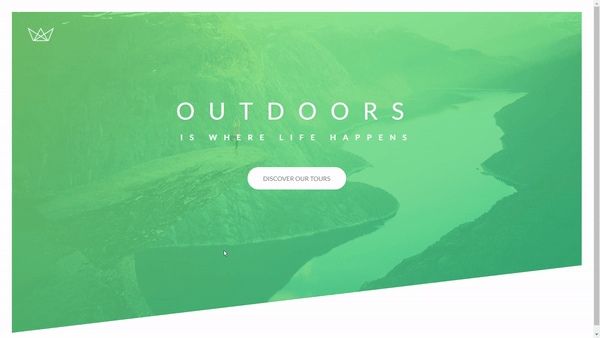


# How CSS Works: A Look Behind the Scenes
## Three Pillars of Writing Good HTML and CSS
1. Responsive Design 
    1. Fluid layouts
    1. Media queries
    1. Responsive images
    1. Correct units
    1. Desktop-first vs mobile-first
1. Maintainable and scalable code
    1. Clean
    1. Easy-to-understand
    1. Growth
    1. Reusable
    1. How to organize files
    1. How to name classes
    1. How to structure HTML
1. Web Performance
    1. Less HTTP requests
    1. Less code
    1. Compress code
    1. Use a CSS preprocessor
    1. Less images
    1. Compress images

## How CSS Works Behind the Scenes: An Overview
1. What happens to CSS when we load up a webpage
    1. Load HTML
    1. Parse HTML to have DOM (Document Object Model)
    1. Load CSS
    1. Parse CSS to have CSSOM (CSS Object Model)
        1. Resolve conflicting CSS declaration (cascade)
        1. Process final CSS values
    1. After having both "DOM" and "CSSOM", we will have "Render Tree"
    1. Website rendering tehvisual formatting model
    1. Final rendered website
    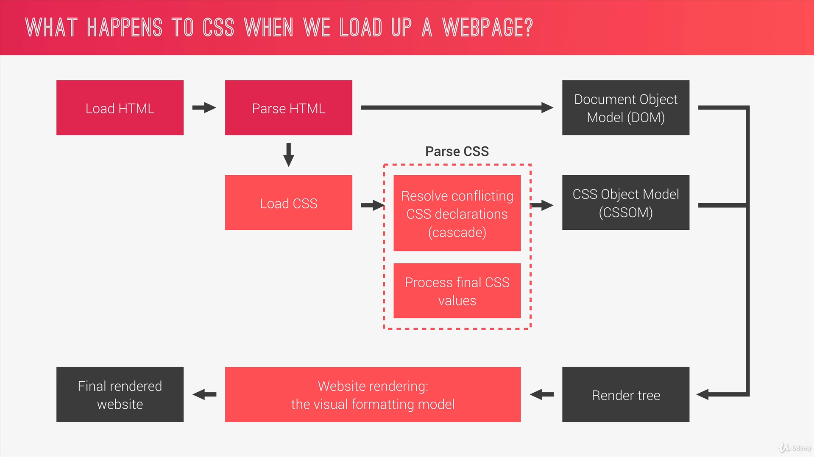

## How CSS is Parsed, Part 1: The Cascade and Specificity
1. The ordinary CSS syntax includes "selector" and "declaration block". In the "declaration block", there are "declarations", each of which is composed by "property" and "declared value" that we we want to modify the selected element. 
1. "**Cascade**" represents the "C" in CSS. As CSS can be combined and sourced from different sheets, casacde is an essential feature that it resolves conflicts between different CSS rules and declarations, when more than one rule appleis to a certain element. 
1. When processing the sheet, the engine looks from the following order to decide which decoration to apply to the selected element.
    1. Importance
        1. User `!important` declarations
        1. Author `!important` declarations
        1. Author declarations
        1. User declarations
        1. Default browser declarations
    1. Sepcificity
        1. Inline styles (in HTML file)
        1. IDs
        1. Classes, pseudo-classes, attribute
        1. Elements, pseudo-elements
    1. Source Order 
1. CSS declarations marked with `!important` have the highest priority.
1. However, only use `!important` as a last resource. It's better to use correct specifications, so the code can be more maintainable. 
1. Inline styles will always have priority over styles in external stylesheets. 
1. A selector that contains 1 ID is more specific than one with 1000 classes.
1. A selector that contains 1 class is more specific than one with 1000 elements
1. The universal selector * has no specificity value (0,0,0,0)
1. Rely more on specificity than on the order of selectors
1. But rely on order when using 3rd-party stylesheets - always put the author sheet the last.
1. We can check at this [CSS Specificity Calculator](https://specificity.keegan.st/) to check the score.

## How CSS is Parsed, Part 2: Value Processing
1. CSS values are proceeded in the following process
    1. Declared value (author declaration)
    1. Cascaded value (after the cascade)
    1. Specified value (defaulting, if there is no cascaded value)
    1. Computed value (converting relative values to absolute)
    1. Used value (final calculations, based on layout)
    1. Actual value (browser and device restrictions)
    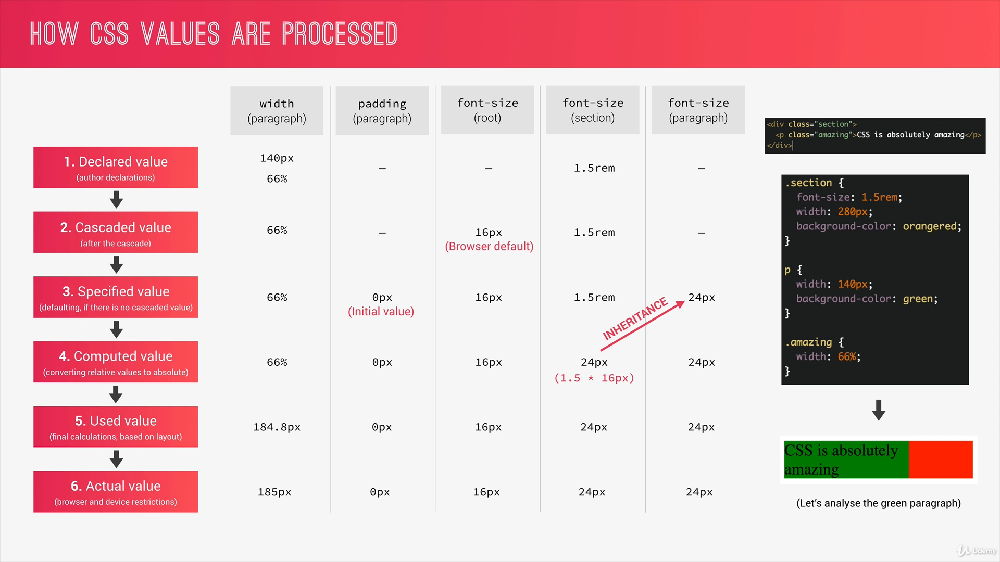
1. When converting from relative to absolute values, the relative units `em` for **font** is based on the parent element's size, while for "**length**", it is based on the element itself. 
    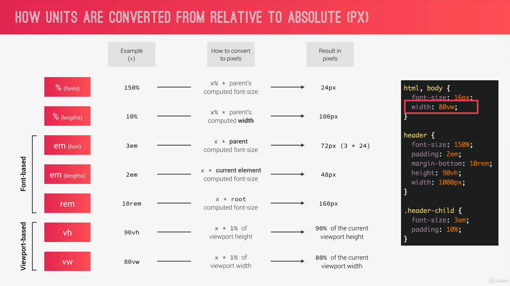
1. Each property has an initial value, used if nothing is declared.
1. Browsers specify a "root" `font-size` for each page (usually 16px).
1. Percentages and relative values are always converted to pixels.
1. Percentages are measured relative to their parent's `font-size`, if used to specify `font-size`.
1. Percentages are measured relative to their their parent's `width`, if used to specify lengths.
1. `em` are measured relative to their parent `font-size`, if used to specify `font-size`.
1. `em` are measured relative to current `font-size`, if used to specify lengths.
1. `rem` are always measured relative to the document's root `font-size`.
1. `vh` and `vw` are simply precentage measurements of the viewport's `height` and `width`.

## How CSS is Parsed, Part 3: Inheritance
1. Every CSS property must have a value
1. Is there a cascaded value?
    1. Yes - Specified value = Cascaded value
    1. No - Is the property inherited? (specific to each property)
        1. Yes - Specified value = Computed value of parent element
        1. No - Specified value = Initial value (specific to each property)
        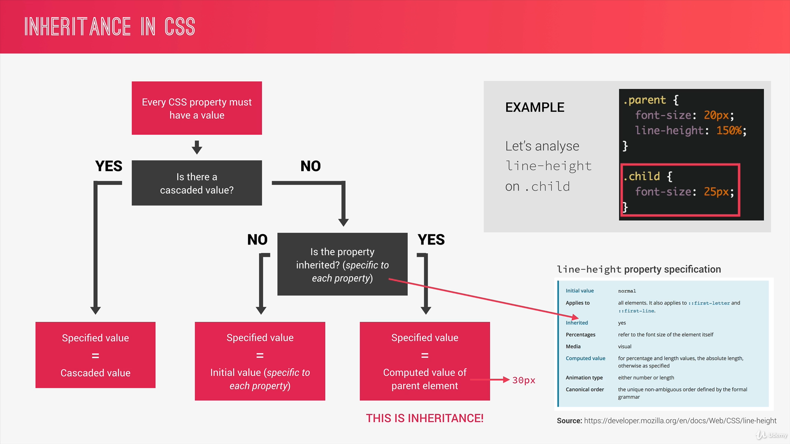
1. Inheritance passes the values for some specific properties from parents to children - more maintainable code.
1. Properties related to text are inherited: `font-family`, `font-size`, `color`, etc.
1. The `inherit` keyword forces inheritance on a certain property.
1. The initial keyword resets a property to its initial value.

## Converting px to rem: An effective Workflow
1. Learning targets
    1. How and why to use `rem` units in projects
    1. A great workflow for converting `px` to `rem`
1. We can set the root `font-size` on `html` element the `rem` will be aligned to the given size. 
    ```css
    html {
        font-size: 10px;
    }
    ```
1. When we have `100%` as the `font-size` in `html` element, it uses the default font-size given from the browser. Since the modern browsers are using `16px` as the defulat `font-size`, we can set it as `62.5%` which is `10px` if the defulat is `16px`. This can make the element become responsive according to user's setting.
    ```css
    html {
        font-size: 62.5%;
    }
    ```
1. Besides `font-size`, we can use the power of inheritance on `box-sizing` feature that we can the universal selector for box-sizing `inherit` and `box-sizing: border-box` in `body` tag. 
1. In addition, we'd like all the elements, including virtual ones created from `::bfore` and `::after` to apply the property. We can add those with the universal selectors as well. 
    ```css
    *,
    *::before,
    *::after {
        margin: 0;
        padding: 0;
        box-sizing: inherit;    
    }

    body {
        font-family: "Lato", sans-serif;
        font-weight: 400;
        /* font-size: 16px; */
        line-height: 1.7;
        color: #777;
        padding: 3rem;

        box-sizing: border-box;
    }
    ```

## How CSS Renders a Website: The Visual Formatting Model
1. The visual formatting model is an algorithm that calculates boxes and determines the layout of these boxes, for each element in the render tree, in order to determine the final layout of the page.
1. The algorithm takes the followings into account
    1. **Dimensions** of boxes: the box model
    1. **Box type**: inline, block, and inline-block
    1. **Positioning scheme**: floats and positioning
    1. **Stacking contexts**
    1. Other elements in the render tree
    1. Viewport size, dimensions of images, etc.

### The Box Model
    1. Content: text, images, etc.
    1. Padding: transparent area aroudn the content, inside of the box
    1. Border: goes around the padding and the content
    1. Margin: space between boxes
    1. Fill area: area that gets filled with background color or background image
    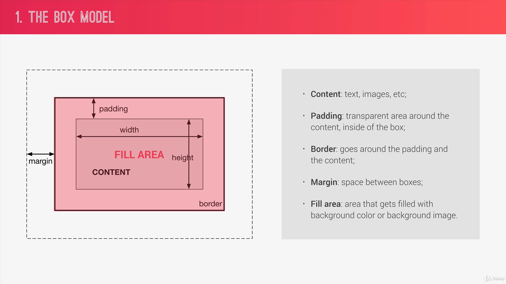
1. Heights and Width in default setting
    1. Total Width = right border + right padding + specified width + left padding + left border
    1. Total Height = top border + top padding + specified height + bottom padding + bottom border
1. If we apply `box-sizing: border-box`, this will include the padding the and border of the element into the specified width and height. 
    1. Total Width = specified width
    1. Total Height = specified height

### Box Types
1. Block-level boxes 
    1. Elements formatted visually as blocks
    1. 100% of parent's width
    1. Vertically, one after another
    1. Box-model applies as showed
    ```css
    html {
        display: block;
        display: flex;
        display: list-item;
        display: table;
    }
    ```
1. Inline boxes
    1. Content is distributed in lines
    1. Occupies only content's space
    1. No line-breaks
    1. No heights and widths
    1. Padding and margins only horizontal (left and right)
    ```css
    html {
        display: inline-block;
    }
    ```
1. Inline-block boxes
    1. A mix of block and inline
    1. Occupies only content's space
    1. No line-breaks
    1. Box-model applies as showed
    ```css
    html {
        display: inline;
    }
    ```
    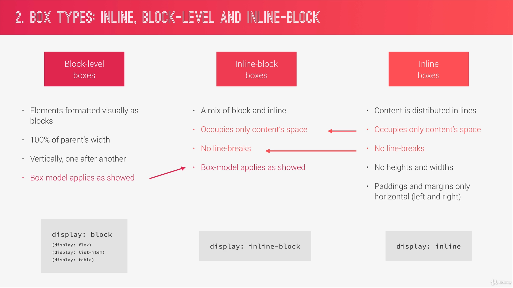

### Positioning Schemes
1. Normal flow
    1. Default positioning scheme
    1. NOT floated
    1. NOT absolutely positioned
    1. Elements laid out according to their source order
    ```css
    html {
        position: relative;
    }
    ```
1. Floats
    1. Elements is removed from the normal flow
    1. Text and inline elements will wrap around teh floated element
    1. The container will not adjust its height to the element
    ```css
    html {
        float: right;
        float: left;
    }
    ```
1. Absolute positioning
    1. Element is removed from the normal flow
    1. No impact on surrounding content or elements
    1. We use `top`, `bottom`, `left`, and `right` to offset the element from its relatively positioned container. 
    ```css
    html {
        position: absolute;
        position: fixed;
    }
    ```
    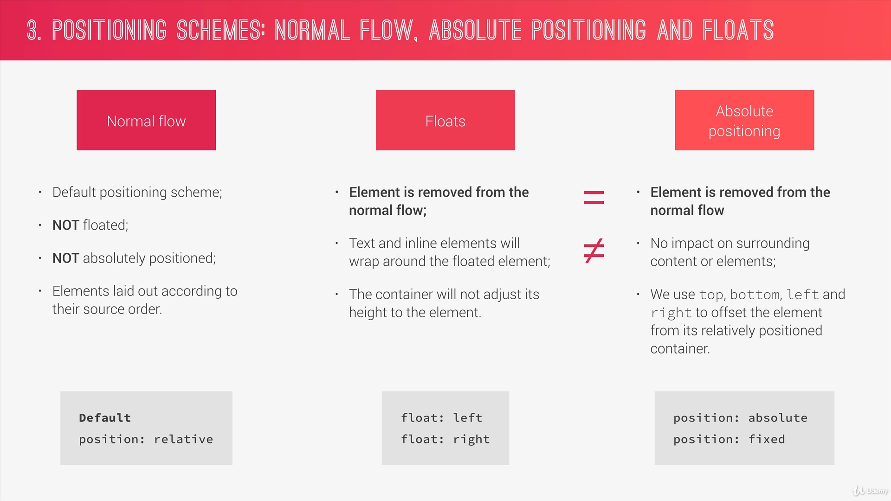

### Stacking Contexts
1. Though we can set the `position` and `z-index` to stack the elements up in certain context, other properties such as `opacity`, `transform`, and `filter` may create stacking context as well.  
    ```css
    #div_parent {
        position: relative;
    }

    #div3 {
        z-index: 3;
        position: absolute;
    }
    #div2 {
        z-index: 2;
        position: absolute;
    }
    #div1 {
        z-index: 1;
        position: absolute;
    }
    ```

## CSS Architecture, Components and BEM
1. The Think, Build, Architect mindset
    1. Think - Think about the layout of the webpage or web app before writing code
    1. Build - Build the layout in HTML and CSS with a consistent strcuture for naming classes
    1. Architect - Create a logical architecture for the CSS with files and folders
1. Thinking about the layout
    1. Component-driven design
    1. **Modular building blocks** taht make up interfaces
    1. Held together by the **layout** of the page
    1. **Re-usable** across a project, and between different projects
    1. **Independent** allowing us to use them anywhere on the page
1. Building with meaningful class names
    1. BEM stands for Block Element Modifier
    1. Block - standalone component that is meaningful on its own
    1. Element - part of a block that has no standalone meaning
    1. Modifier - a different version of a block or an element
    ```css
    .block{}
    .blocK__element{}
    .block__element--modifier{}
    ```
1. Architecting with files and folders
    1. The 7-1 pattern
    1. 7 different folders for partial Sass files, and 1 main Sass file to import all other files into a compiled CSS stylesheet.
        1. base/
        1. component/
        1. layout/
        1. pages/
        1. themes/
        1. abstracts/
        1. vendors/

## Implementing BEM in the Natours project
1. HTML
    ```html
    <header class="header">
            <div class="header__logo-box">
                
            </div>
            <div class="header__text-box">
                <h1 class="heading-primary">
                    <span class="heading-primary--main">outdoors</span>
                    <span class="heading-primary--sub">is where life happens</span>
                </h1>
                <a href="#" class="btn btn--white btn--animated">Discover our tours</a>
            </div>
        </header>
    ```
1. CSS
    ```css
    *,
    *::before,
    *::after {
        margin: 0;
        padding: 0;
        box-sizing: inherit;
    }

    html {
        font-size: 62.5%;
    }

    body {
        font-family: "Lato", sans-serif;
        font-weight: 400;
        /* font-size: 16px; */
        line-height: 1.7;
        color: #777;
        padding: 3rem;

        box-sizing: border-box;
    }

    .header {
        height: 95vh;
        background-image: linear-gradient(
            to right bottom,
            rgba(126, 213, 111, 0.8), 
            rgba(40,180,131,0.8)), 
            url(../img/hero.jpg);
        background-size: cover;
        background-position: top;
        position: relative;
        clip-path: polygon(0 0, 100% 0, 100% 75vh, 0 100%);
    }

    .header__logo-box {
        position: absolute;
        top: 4rem;
        left: 4rem;
    }

    .header__logo {
        height: 3.5rem;
    }

    .header__logo:hover {
        animation: moveInRight 1s ease-out;
    }

    .header__text-box {
        position: absolute;
        top: 40%;
        left: 50%;
        transform: translate(-50%, -50%);
        text-align: center;
    }

    .heading-primary {
        color: #fff;
        text-transform: uppercase;

        backface-visibility: hidden;
        margin-bottom: 6rem;
    }

    .heading-primary--main {
        display: block;
        font-size: 6rem;
        font-weight: 400;
        letter-spacing: 3.5rem;

        animation-name: moveInLeft;
        animation-duration: 1s;
        animation-timing-function: ease-out;
        
        /* animation-iteration-count: 3; */
        /* animation-delay: 1s; */
    }

    .heading-primary--sub {
        display: block;
        font-size: 2rem;
        font-weight: 700;
        letter-spacing: 1.74rem;

        animation: moveInRight 1s ease-out;
    }

    @keyframes moveInLeft {
        0% {
            opacity: 0;
            transform: translateX(-10rem);
        }

        80% {
            opacity: 1;
            transform: translateX(1rem);
        }

        100% {
            transform: translateX(0);
        }
    }

    @keyframes moveInRight {
        0% {
            opacity: 0;
            transform: translateX(10rem);
        }

        80% {
            opacity: 1;
            transform: translateX(-1rem);
        }

        100% {
            transform: translateX(0);
        }
    }

    @keyframes moveInBottom {
        0% {
            opacity: 0;
            transform: translateY(3rem);
        }

        100% {
            transform: translateX(0);
        }
    }

    .btn:link,
    .btn:visited {
        text-transform: uppercase;
        text-decoration: none;
        padding: 1.5rem 4rem;
        display: inline-block;
        border-radius: 10rem;
        transition: all .2s;
        position: relative;
        font-size: 1.6rem;
    }

    .btn:hover {
        transform: translateY(-3px);
        box-shadow: 0 1rem 2rem rgba(0,0,0,0.2);
    }

    .btn:active {
        transform: translateY(-1px);
        box-shadow: 0 .5rem 1rem rgba(0,0,0,0.2);
    }

    .btn--white {
        background-color: #fff;
        color: #777;
    }

    .btn::after {
        content: "";
        display: inline-block;
        height: 100%;
        width: 100%;
        border-radius: 100px;
        position: absolute;
        top: 0;
        left:0;
        z-index: -1;
        transition: all .4s;
    }

    .btn--white::after {
        background-color: #fff;
    }

    .btn:hover::after {
        transform: scaleX(1.5) scaleY(1.6);
        opacity: 0;
    }

    .btn--animated {
        animation: moveInBottom .5s ease-out .75s;
        animation-fill-mode: backwards;
    }
    ```


# Introduction to Sass and NPM
## What is Sass
1. Sass is a CSS preprocessor, an extension of CSS that adds power and elegance to the basic language. We can use Sass compiler to turn SASS source code into compiled CSS Code. 
1. Sass provide the following featuers to make it more useful. 
    1. Variables - for reusable values such as colors, font-sizes, spacing, etc.
    1. Nesting - to nest selectors inside of one another, allowing us to write less code.
    1. Operators -  for mathematical operations right inside of CSS.
    1. Partials and imports - to write CSS in different files and importing them all into one single file. 
    1. Mixins - to write reusable pieces of CSS code
    1. Functions - similar to mixins, with the difference that they produce a value that can be used 
    1. Extends - to make different seelctors inherit declarations that are common to all of them
    1. Control directives - for writing complex code using conditional and loops (not covered in this course)
1. Sass and Scss syntax
    1. Sass
    ```sass
    .navigation
        list-style: none
        float: left
        & li
        display: inline-block
        margin-left: 30px
    ```
    1. Scss
    ```scss
    .navigation {
        list-style: none;
        float: left;

        & li {
            display: inline-block;
            margin-left: 30px;
        }
    }
    ```

## First Steps with Sass: Variables and Nesting
1. We can use [CodePen](https://codepen.io/) environment without installing the required packages locally.
1. We can check this practice at [https://codepen.io/allenlin90/pen/VwPbzaG](https://codepen.io/allenlin90/pen/VwPbzaG)
1. In Scss, an ampersand `&` represents as the current selector when it's nested in the selector, so we can use it chain futher as more specific selector. 
1. When an element using `float`, its parent element will lose its height if all the child elements are floated. Therefore, we can use pseudo `::after` to create an empty content to fix the issue. In this case, we have both `navigation` and `buttons` classes floated, so the `nav` element loses its height.
    ```css
    nav {
        margin: 30px;
        background-color: #f9ed69;
    }
    nav::after { /* fix missing height of float elements */
        content: "";
        clear: both;
        display: table;
    }
    ```
1. HTML 
    ```html
    <nav class="clearfix">
        <ul class="navigation">
            <li><a href="#">About us</a></li>
            <li><a href="#">Pricing</a></li>
            <li><a href="#">Contact</a></li>  
        </ul>
        <div class="buttons">
            <a href="#" class="btn-main">Sign up</a>
            <a href="#" class="btn-hot">Get a quote</a>
        </div>
    </nav>
    ```
1. Scss
    ```scss
    * {
        margin: 0;
        padding: 0;
    }

    $color-primary: #f9ed69; // yellow color
    $color-secondary: #f08a5d; // orange
    $color-tertiary: #b83b5e; // pink
    $color-text-dark: #333;
    $color-text-light: #eee;

    $width-button: 150px;

    nav {
        margin: 30px;
        background-color: $color-primary;
        
        &::after { // this is to fix the issues from floating elements 
            content: "";
            clear: both;
            display: table;
        }
    }

    .navigation {
        list-style: none;
        float: left;
        
        li {
            display: inline-block;
            margin-left: 30px; 
            &:first-child {
                margin: 0;
            }
            
            a:link {
                text-decoration: none;
                text-transform: uppercase;
                color: $color-text-dark;
            }
        }
    }

    .buttons {
        float: right;
    }

    .btn-main:link,
    .btn-hot:link {
        padding: 10px;
        display: inline-block;
        text-align: center;
        border-radius: 100px;
        text-decoration: none;
        text-transform: uppercase;
        width: $width-button;
        color: $color-text-light;
    }

    .btn-main {
        &:link {
            background-color: $color-secondary;
        }
        
        &:hover {
            background-color: darken($color-secondary, 15%);
        }
    }

    .btn-hot {
        &:link {
            background-color: $color-tertiary;
        }
        
        &:hover {
            background-color: lighten($color-tertiary, 10%);
        }
    }
    ```
1. Compiled CSS
    ```css
    * {
        margin: 0;
        padding: 0;
    }

    nav {
        margin: 30px;
        background-color: #f9ed69;
    }
    nav::after {
        content: "";
        clear: both;
        display: table;
    }

    .navigation {
        list-style: none;
        float: left;
    }
    .navigation li {
        display: inline-block;
        margin-left: 30px;
    }
    .navigation li:first-child {
        margin: 0;
    }
    .navigation li a:link {
        text-decoration: none;
        text-transform: uppercase;
        color: #333;
    }

    .buttons {
        float: right;
    }

    .btn-main:link,
    .btn-hot:link {
        padding: 10px;
        display: inline-block;
        text-align: center;
        border-radius: 100px;
        text-decoration: none;
        text-transform: uppercase;
        width: 150px;
        color: #eee;
    }

    .btn-main:link {
        background-color: #f08a5d;
    }
    .btn-main:hover {
        background-color: #ea5717;
    }

    .btn-hot:link {
        background-color: #b83b5e;
    }
    .btn-hot:hover {
        background-color: #cb5b7b;
    }
    ```

## First Steps with Sass: Mixins, Extends, and Functions
1. Mixins are chunks of code that can be reused in different selectors. For example, we have to fix floating issues when to get the height of the element back. 
    ```scss
    @mixin clearfix {
        &::after {
            content: "";
            clear: both;
            display: table;
        }
    }

    nav {
        @include clearfix;
    }
    ```
1. We can pass arguments to `mixin` as functions. For example, we decorate anchor tags with similar properties such as taking off underline text decoration and transform text to uppercase. However, the text color should be changed accordingly to either light or dark color.
    ```scss
    @mixin clearfix {
        &::after {
            content: "";
            clear: both;
            display: table;
        }
    }

    @mixin style-link-text($col) {
        text-decoration: none;
        text-transform: uppercase;
        color: $col;
    }

    .navigation {
        list-style: none;
        float: left;
        
        li {
            display: inline-block;
            margin-left: 30px; 
            &:first-child {
                margin: 0;
            }
            
            a:link {
                @include style-link-text($color-text-dark);
            }
        }
    }

    .btn-main:link,
    .btn-hot:link {
        padding: 10px;
        display: inline-block;
        text-align: center;
        border-radius: 100px;
        width: $width-button;
        @include style-link-text($color-text-light);
    }
    ```
1. Besides `mixin`, we can use `function` to do calculation on the given arguments. Note that the function can return only the calculated number, so we need to pass units to it to enable the property. 
    ```scss
    @function divide($a, $b) {
        @return $a / $b;
    }

    nav {
        margin: divide(60, 2) * 1px; // 30px
        background-color: $color-primary;
        
        @include clearfix;
    }
    ```
1. For common styling that shared by multiple selectors, we can use `extend` instead of `mixin`. `extend` and `mixin` work simialr but in a totally different way. 
1. `mixin` is to add certain properties and values to a given selector, while `extend` is to create a duplicated  selector from the given one and give it the properties and values from the defined `extend`.
    ```scss
    // Scss
    * {
        margin: 0;
        padding: 0;
    }

    $color-primary: #f9ed69; // yellow color
    $color-secondary: #f08a5d; // orange
    $color-tertiary: #b83b5e; // pink
    $color-text-dark: #333;
    $color-text-light: #eee;

    $width-button: 150px;

    @mixin clearfix {
        &::after {
            content: "";
            clear: both;
            display: table;
        }
    }

    @mixin style-link-text($col) {
        text-decoration: none;
        text-transform: uppercase;
        color: $col;
    }

    @function divide($a, $b) {
        @return $a / $b;
    }

    nav {
        margin: divide(60, 2) * 1px; // 30px
        background-color: $color-primary;
        
        @include clearfix;
    }

    .navigation {
        list-style: none;
        float: left;
        
        li {
            display: inline-block;
            margin-left: 30px; 
            &:first-child {
                margin: 0;
            }
            
            a:link {
                @include style-link-text($color-text-dark);
            }
        }
    }

    .buttons {
        float: right;
    }

    %btn-placeholder {
        padding: 10px;
        display: inline-block;
        text-align: center;
        border-radius: 100px;
        width: $width-button;
        @include style-link-text($color-text-light);
    }

    .btn-main {
        &:link {
            @extend %btn-placeholder;
            background-color: $color-secondary;
        }
        
        &:hover {
            background-color: darken($color-secondary, 15%);
        }
    }

    .btn-hot {
        &:link {
            @extend %btn-placeholder;
            background-color: $color-tertiary;
        }
        
        &:hover {
            background-color: lighten($color-tertiary, 10%);
        }
    }
    ```
1. Compiled CSS
    ```css
    /* compiled CSS */
    * {
        margin: 0;
        padding: 0;
    }

    nav {
        margin: 30px;
        background-color: #f9ed69;
    }
    nav::after {
        content: "";
        clear: both;
        display: table;
    }

    .navigation {
        list-style: none;
        float: left;
    }
    .navigation li {
        display: inline-block;
        margin-left: 30px;
    }
    .navigation li:first-child {
        margin: 0;
    }
    .navigation li a:link {
        text-decoration: none;
        text-transform: uppercase;
        color: #333;
    }

    .buttons {
        float: right;
    }

    .btn-hot:link, .btn-main:link {
        padding: 10px;
        display: inline-block;
        text-align: center;
        border-radius: 100px;
        width: 150px;
        text-decoration: none;
        text-transform: uppercase;
        color: #eee;
    }

    .btn-main:link {
        background-color: #f08a5d;
    }
    .btn-main:hover {
        background-color: #ea5717;
    }

    .btn-hot:link {
        background-color: #b83b5e;
    }
    .btn-hot:hover {
        background-color: #cb5b7b;
    }
    ```

## NPM Packages: Let's Install Sass Locally
1. The section for command line is skipped.
1. The only NPM package we need at this moment is `node-sass`. Besides, this is a developing tool to compile the Scss file into regular CSS file.
1. In package.json, we can change the script to `"compile:sass": "node-sass sass/main.scss css/style.css -w"`. This will enable the npm package to keep "watching" and apply when the file changes.
    ```json
    {
        "name": "natours",
        "version": "1.0.0",
        "description": "",
        "main": "index.js",
        "scripts": {
            "compile:sass": "node-sass sass/main.scss css/style.css -w"
        },
        "keywords": [],
        "author": "",
        "license": "ISC",
        "devDependencies": {
            "node-sass": "^5.0.0"
        }
    }
    ```
1. However, there's another way that we can use 2 extensions from VSCode editor which can hot reload the webpage when there's any changes to the file.
    1. Live Server - [https://marketplace.visualstudio.com/items?itemName=ritwickdey.LiveServer](https://marketplace.visualstudio.com/items?itemName=ritwickdey.LiveServer)
    1. Live Sass - [https://marketplace.visualstudio.com/items?itemName=ritwickdey.live-sass](https://marketplace.visualstudio.com/items?itemName=ritwickdey.live-sass)
    1. The solutions are suggested in the Q&A of this section [28](https://www.udemy.com/course/advanced-css-and-sass/learn/lecture/8274464#questions/5766057)


# Natours Project - Using Advanced CSS and Sass (Part 2)
## Converting Our CSS Code to Sass: Variables and Nesting
1. In this section, we just rewrite the CSS into Scss syntax and use variables
    ```scss
    $color-primary: #55c57a;
    $color-primary-light: #7ed56f;
    $color-primary-dark: #28b485;

    $color-grey-dark: #777;
    $color-white: #fff;
    $color-black: #000;

    *,
    *::before,
    *::after {
        margin: 0;
        padding: 0;
        box-sizing: inherit;
    }

    html {
        font-size: 62.5%;
    }

    body {
        font-family: "Lato", sans-serif;
        font-weight: 400;
        /* font-size: 16px; */
        line-height: 1.7;
        color: $color-grey-dark;
        padding: 3rem;

        box-sizing: border-box;
    }

    .header {
        height: 95vh;
        background-image: linear-gradient(
            to right bottom,
            rgba($color-primary-light, 0.8), 
            rgba($color-primary-dark, 0.8)), 
            url(../img/hero.jpg);
        background-size: cover;
        background-position: top;
        position: relative;
        
        clip-path: polygon(0 0, 100% 0, 100% 75vh, 0 100%);

        &__logo-box {
            position: absolute;
        top: 4rem;
        left: 4rem;
        }
        
        &__logo {
            height: 3.5rem;
        }
        
        &__logo:hover {
            animation: moveInRight 1s ease-out;
        }
        
        &__text-box {
            position: absolute;
            top: 40%;
            left: 50%;
            transform: translate(-50%, -50%);
            text-align: center;
        }
    }
        
    .heading-primary {
        color: $color-white;
        text-transform: uppercase;

        backface-visibility: hidden;
        margin-bottom: 6rem;

        &--main {
            display: block;
            font-size: 6rem;
            font-weight: 400;
            letter-spacing: 3.5rem;

            animation-name: moveInLeft;
            animation-duration: 1s;
            animation-timing-function: ease-out;
            
            /* 
            animation-iteration-count: 3; 
            animation-delay: 1s; 
            */
        }

        &--sub {
            display: block;
            font-size: 2rem;
            font-weight: 700;
            letter-spacing: 1.74rem;

            animation: moveInRight 1s ease-out;
        }
    }

    @keyframes moveInLeft {
        0% {
            opacity: 0;
            transform: translateX(-10rem);
        }

        80% {
            opacity: 1;
            transform: translateX(1rem);
        }

        100% {
            transform: translateX(0);
        }
    }

    @keyframes moveInRight {
        0% {
            opacity: 0;
            transform: translateX(10rem);
        }

        80% {
            opacity: 1;
            transform: translateX(-1rem);
        }

        100% {
            transform: translateX(0);
        }
    }

    @keyframes moveInBottom {
        0% {
            opacity: 0;
            transform: translateY(3rem);
        }

        100% {
            transform: translateX(0);
        }
    }

    .btn {
        &:link,
        &:visited {
            text-transform: uppercase;
            text-decoration: none;
            padding: 1.5rem 4rem;
            display: inline-block;
            border-radius: 10rem;
            transition: all .2s;
            position: relative;
            font-size: 1.6rem;
        }

        &:hover {
            transform: translateY(-3px);
            box-shadow: 0 1rem 2rem rgba($color-black, 0.2);

            &::after {
                transform: scaleX(1.5) scaleY(1.6);
                opacity: 0;
            }
        }

        &:active {
            transform: translateY(-1px);
            box-shadow: 0 .5rem 1rem rgba($color-black, 0.2);
        }

        &--white {
            background-color: $color-white;
            color: $color-grey-dark;

            &::after {
                background-color: $color-white;
            }
        }

        &::after {
            content: "";
            display: inline-block;
            height: 100%;
            width: 100%;
            border-radius: 100px;
            position: absolute;
            top: 0;
            left:0;
            z-index: -1;
            transition: all .4s;
        }    

        &--animated {
            animation: moveInBottom .5s ease-out .75s;
            animation-fill-mode: backwards;
        }
    }
    ```

## Implementing the 7-1 CSS Architecture with Sass
1. We separate the code into different files according to its purpose. In this case, we follow 7-1 architecture guideline to manage the directories and files.
    ```scss
    // sass/main.scss
    @import "abstracts/functions";
    @import "abstracts/mixins";
    @import "abstracts/variables";

    @import "base/animations";
    @import "base/base";
    @import "base/typography";
    @import "base/utilities";

    @import "components/buttons";

    @import "layout/header";

    @import "pages/home";
    ```

## Review: Basic Principles of Responsive Design and Layout Types
1. Fluid Grids and Layouts - To allow content to easily adapt to the current viewport width used to browser the website. Uses `%` rather than `px` fort all layout-related lengths.
1. Flexible/Responsive Images - Images behave differently than text content, and so we need to ensure that they also adpat nicely to the current viewport.
1. Media Queries - To change styles on certain viewport widths (breakpoints), allowing us to create different version of our website for different widths.
1. Layout Types
    1. Float Layouts (1st project in this course, Natours)
    1. Flexbox (2nd project in this course, Trillo)
    1. CSS Grid (3rd project in this course, Nexter)

## Building a Custom Grid with Floats
1. Learning targets in this lecture
    1. How to architect and build a simple grid system
    1. How the attribute selectors works
    1. How the `:not` pseudo-class works
    1. How `calc()` works, and what's the difference between `calc()` and simple Sass operations
1. A grid is 2-dimentional system that each element has its own width and height that covers different spans of rows and columns.
1. We firstly prepare the Grid System in HTML. Our custom grid system has 4 columns and each element should be place on the same row but may cross multiple columns.
1. We'd like to have `margin-bottom` for all the elements except the last row in the grid. For this case, we can use `:not` selector select all the the other elements besides the given one. 
1. Since all the `div` tags in the `.row` has class that starts with `col-`, we can use specific CSS selector to select only elements that has the specific attributes. In addition, we can use certain characters to have advanced selecting feature such as `^`, `~`, and `$` which is simialr to regular expression. We can check more info. for [CSS attribute selector](https://www.w3schools.com/css/css_attribute_selectors.asp). 
1. [`calc()`](https://www.w3schools.com/cssref/func_calc.asp) is a special and powerful feature in CSS that we can calculate the numbers from different units. In addition, to use Sass variable in the expression, we should use ["Interpolation"](https://sass-lang.com/documentation/interpolation), `#{$sass_variable}`, which is similar to [template literals](https://developer.mozilla.org/en-US/docs/Web/JavaScript/Reference/Template_literals) in JavaScript.
    ```html
    <section class="grid-test">
        <div class="row">
            <div class="col-1-of-2">
                Col 1 of 2
            </div>
            <div class="col-1-of-2">
                Col 1 of 2
            </div>
        </div>

        <div class="row">
            <div class="col-1-of-3">
                Col 1 of 3
            </div>
            <div class="col-1-of-3">
                Col 1 of 3
            </div>
            <div class="col-1-of-3">
                Col 1 of 3
            </div>
        </div>

        <div class="row">
            <div class="col-1-of-3">
                Col 1 of 3
            </div>
            <div class="col-2-of-3">
                Col 2 of 3
            </div>
        </div>

        <div class="row">
            <div class="col-1-of-4">
                Col 1 of 4
            </div>
            <div class="col-1-of-4">
                Col 1 of 4
            </div>
            <div class="col-1-of-4">
                Col 1 of 4
            </div>
            <div class="col-1-of-4">
                Col 1 of 4
            </div>
        </div>

        <div class="row">
            <div class="col-1-of-4">
                Col 1 of 4
            </div>
            <div class="col-1-of-4">
                Col 1 of 4
            </div>
            <div class="col-2-of-4">
                Col 2 of 4
            </div>
        </div>

        <div class="row">
            <div class="col-1-of-4">
                Col 1 of 4
            </div>
            <div class="col-3-of-4">
                Col 3 of 4
            </div>
        </div>
    </section>
    ```
1. We put the clear float properties in `mixins` as this can be used for multiple places by different elements.
    ```scss
    // abstracts/_mixins.scss
    @mixin clearfix {
        &::after {
            content: "";
            display: table;
            clear: both;
        }
    }
    ```
1. We can the variables for with with the colors in `_variables.scss`.
    ```scss
    // abstracts/_variables.scss
    // COLORS
    $color-primary: #55c57a;
    $color-primary-light: #7ed56f;
    $color-primary-dark: #28b485;

    $color-grey-dark: #777;
    $color-white: #fff;
    $color-black: #000;

    // GRID
    $grid-width: 114rem;
    $gutter-vertical: 8rem;
    $gutter-horizontal: 6rem;
    ```
1. Scss
    ```scss
    // layout/_grid.scss
    .row {
        max-width: $grid-width;
        background-color: #eee;
        margin: 0 auto;

        // not pseudo selector
        &:not(:last-child) {
            margin-bottom: $gutter-vertical;
        }

        @include clearfix;

        // attriute selector to select class name starts with 'col-'
        [class^="col-"] {
            background-color: orangered;
            float: left;

            &:not(:last-child) {
                margin-right: $gutter-horizontal;
            }
        }

        .col-1-of-2 {
            width: calc((100% - #{$gutter-horizontal})/2);      
        }

        .col-1-of-3 {
            width: calc((100% - 2 * #{$gutter-horizontal}) / 3);
        }

        .col-2-of-3 {
            width: calc(2 * ((100% - 2 * #{$gutter-horizontal}) / 3) + #{$gutter-horizontal} );
        }

        .col-1-of-4 {
            width: calc((100% - 3 * #{$gutter-horizontal}) / 4);
        }

        .col-2-of-4 {
            width: calc(2 * ((100% - 3 * #{$gutter-horizontal}) / 4) + #{$gutter-horizontal} );
        }

        .col-3-of-4 {
            width: calc(3 * ((100% - 3 * #{$gutter-horizontal}) / 4) + 2 * #{$gutter-horizontal} );
        }
    }
    ```
    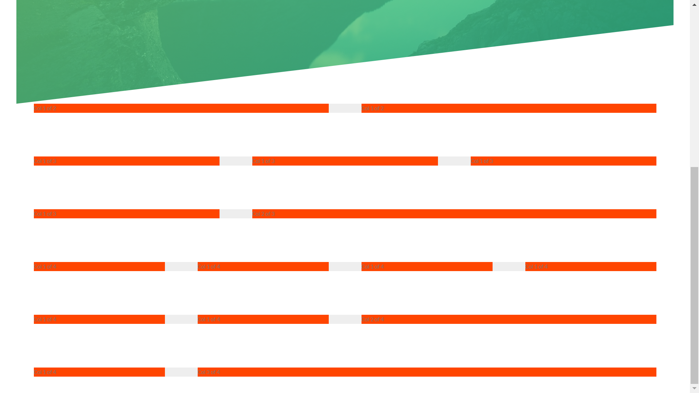

## Building the About Section - Part 1
1. Learning targets
    1. Thinking about components
    1. How and why to use utility classes
    1. How to use the `background-clip` property
    1. How to `transform` multiple properties simultaneously
    1. How to use the outline-offset property together with `outline`
    1. How to style elements that are NOT hovered while others are
1. We prepare HTML elements
    ```html
    <main>
        <section class="section-about">
            <div class="u-centered-text u-margin-bottom-8">
                <h2 class="heading-secondary">
                    Exciting tours for adventurous people
                </h2>
            </div>

            <div class="row">
                <div class="col-1-of-2">
                    Text content
                </div>
                <div class="col-1-of-2">
                    Image composition
                </div>
            </div>
        </section>
    </main>
    ```
1. We add one more variable `$color-grey-light-1: #f7f7f7`, which is very light grey color for the background.
    ```scss
    // abstracts/_variables.scss
    $color-grey-light-1: #f7f7f7;
    ```
1. For the main elements in the home page, we put the code in `_home.scss` under `page` directory, as these properties are only used at the homepage. 
    1. Use negative values on `margin-top` to lift the element up and fill the void left by the header polygon. The size to lift is according to the header element. In this case, the header height is 95vh, while the polygon is set at 75vh on the side. Therefore, we can have `-20vh` to lift the main element to fill the void area.
    ```scss
    // page/_home.scss
    .section-about {
        background-color: $color-grey-light-1;
        padding: 25rem 0;
        margin-top: -20vh;
    }
    ```
1. We add effects on the heading text when the user hovers the cursor on it.
    1. Use `background-image` with `linear-gradient` as in the `header` to create the gradient green color. 
    1. Use `-webkit-background-clip` to have the background image (color) only applies on the text rather than the element of the text.
    1. Change text color to `transparent`, so the gradient color can fill up the text.
    1. Use `transition` for a smoother animation when the cursor hovers on the element. 
    1. When the user hovers on the element. 
        1. Use `skewX` and `skewY` to tilt the element on different direction and degree. 
        1. Use `text-shadow` to have shadows as 3-dimentional effect on the element.
    ```scss
    // base/_typography.scss
    .heading-secondary {
        font-size: 3.5rem;
        text-transform: uppercase;
        font-weight: 700;
        display: inline-block;
        background-image: linear-gradient(to right, $color-primary-light, $color-primary-dark);
        -webkit-background-clip: text;
        color: transparent;
        letter-spacing: 2px;
        transition: all .2s;

        &:hover {
            transform: skewY(2deg) skewX(15deg) scale(1.1);
            text-shadow: .5rem 1rem 2rem rgba($color-black, .2);
        }
    }
    ```
1. As the element is an `inline-block`, we can use `text-align: center` on its parent element to center the element on the page. Note that there are multiple ways to center items in the block, such as `margin: 0 auto;` to create margin on the side of a `block` element.
1. The header can be used in multiple components or elements. As we may require different margin bottom according to design and scanrios, we should modify the property on the header directly. Therefore, we can use utilities as to align the text that we can add margin bottom on the parent element. 
    ```scss
    // base/_utilities.scss
    .u-centered-text {
        text-align: center;
    }

    .u-margin-bottom-8 {
        margin-bottom: 8rem;
    }
    ```
    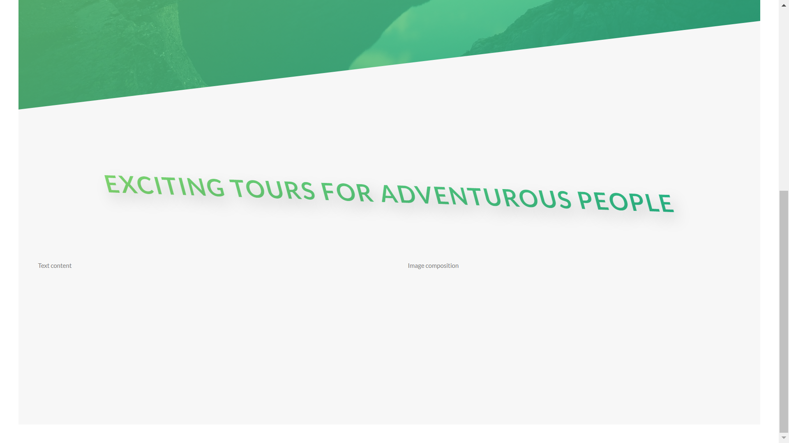

## Building the About Section - Part 2
1. We modify the section below the `h2` header in the about section. Besides images and icons, we can use [HTML symbols](https://www.w3schools.com/html/html_symbols.asp) directly for special characters such as an arrow &rarr; `&rarr;`.
    ```html
    <div class="row">
        <div class="col-1-of-2">
            <h3 class="heading-tertiary u-margin-bottom-small">You're going to fall in love with nature</h3>
            <p class="paragraph">
                Lorem ipsum dolor sit amet consectetur adipisicing elit. Non neque ut, id aliquam autem a
                deserunt odit quia maiores perferendis esse dolores doloribus soluta commodi ipsum vitae sint
                magnam cum.
            </p>
            <h3 class="heading-tertiary u-margin-bottom-small">Live adventures like you never have before</h3>
            <p class="paragraph">
                Lorem ipsum dolor sit amet consectetur adipisicing elit. Asperiores quaerat aperiam tenetur,
                optio placeat maiores!
            </p>

            <a href="#" class="btn-text">Learn more &rarr;</a>
        </div>
        <div class="col-1-of-2">
            Image composition
        </div>
    </div>
    ```
    
1. Since we'd like all buttons and some elements set to have `1.6rem` (`16px`) as the fontsize, we can have another variable for the value. 
    ```scss
    // abstract/_variables.scss
    $default-font-size: 1.6rem;
    ```
1. We add more elements to the about part, which has its own header and content
    ```scss
    // abstracts/_utilities.scss
    .heading-tertiary {
        font-size: $default-font-size;
        font-weight: 700;
        text-transform: uppercase;
    }

    .paragraph {
        font-size: $default-font-size;

        &:not(:last-child) {
            margin-bottom: 3rem;
        }
    }
    ```
1. As we require different size of `margin-bottom`, we can modify them in the `_utilities` with different sizes and naming for different purpose. 
    ```scss
    .u-margin-bottom-small {margin-bottom: 1.5rem; }
    .u-margin-bottom-mdium {margin-bottom: 4rem; }
    .u-margin-bottom-big {margin-bottom: 8rem; }
    ```
1. We create another type of buttons which is a text link that has effects when the user hovers or clicks it.  
    ```scss
    .btn-text {
        &:link,
        &:visited {
            font-size: $default-font-size;
            color: $color-primary;
            display: inline-block;
            text-decoration: none;
            border-bottom: 1px solid $color-primary;
            padding: 3px;
            transition: all .2s;
        }

        &:hover {
            background-color: $color-primary;
            color: $color-white;
            box-shadow: 0 1rem 2rem rgba($color-black, .15);
            transform: translateY(-2px);
        }

        &:active {
            box-shadow: 0 .5rem 1rem rgba($color-black, .15);
            transform: translateY(-2px);
        }
    }
    ```
    
    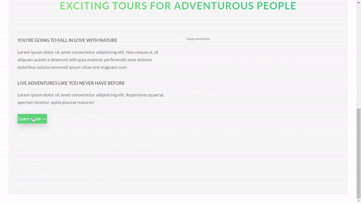

## Building the About Section - Part 3
1. This part is to create the image gallery on the right part of the "about" section in `main` tag. When the user hovers on any of the image, the image floats, zooms in, and gets green border.
    ```html
    <div class="col-1-of-2">
        <div class="composition">
            
            
            
        </div>
    </div>
    ```
1. We use CSS to create interactive effects when the user hovers on any of the images of the composition.
    1. Positioning elements
        1. To have images scattered in the block, we can have them in `position: absolute`, while its parent element should be in `position: relative`.
        1. When setting the position, we could use percentage rather than absolute values to allow the elements being responsive.
    1. For `box-shadow`, usually we don't give value on the x-axis, so the first value is usually `0`.
    1. Outline Property
        1. In this case, to have gap between the border and the image inside, we can use `outline` rather than `border`. The `border` of an element is counted as part of the dimention of the element and is inside the margin of the element. On the other hand, `outline` is out of margin and could overlap the elements outside. The total width of the element is not affected by the `outline` of the element.
        1. The have the gap between the image and the outline, we can use `outline-offset` to have the gap between the outline and element. 
    1. We can select all the other elements when one of the image is triggered `:hover`, while others are not triggered to apply `scale(.95)`. This is a relatively complicated selector `.composition:hover composition__photo:not(:hover)`.
    ```scss
    // components/_compositions.scss
    .composition {
        position: relative; // to enable position: absolute

        &__photo {
            width: 55%;
            box-shadow: 0 1.5rem 4rem rgba($color-black, .4);
            border-radius: 2px;
            position: absolute;
            transition: all .2s;
            outline-offset: 2rem; // to have gap between image and the green border

            &--p1 {
                left: 0; // on the edge of left side of the container
                top: -2rem;
            }

            &--p2 {
                right: 0; // on the edge of right side of the container
                top: 2rem;
            }

            &--p3 {
                left: 20%;
                top: 10rem;
            }

            &:hover {
                outline: 1.5rem solid $color-primary;
                transform: scale(1.05);
                box-shadow: 0 2.5rem 4rem rgba($color-black, .5);
                z-index: 20;
            }
        }

        &:hover &__photo:not(:hover) {
            transform: scale(.95);
        }
        // .composition:hover composition__photo:not(:hover)
    }
    ```
    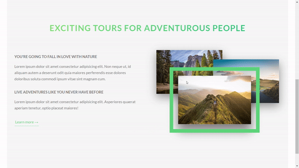

## Building the Features Section
1. Learning targets
    1. How to include and use and icon font
    1. Another way of creating "**skewed section**"
    1. How and when to use the direct child selector
1. We can download and install fonts from [Linea](https://linea.io/). In this case, we only need the following file and folder. We can put this file in the same folder in `css/` and rename the css file to `icon-font.css`. To use the icons, we can check the reference at `_basic/_ICONFONT/icons-reference.html`. 
    1. `_basic/_ICONFONT/styles.css`
    1. `_basic/_ICONFONT/font/`
    ```html
    <i class="icon-basic-world"></i>
    ```
1. HTML
    ```html
    <section class="section-features">
        <div class="row">
            <div class="col-1-of-4">
                <div class="feature-box">
                    <i class="feature-box__icon icon-basic-world"></i>
                    <h3 class="heading-tertiary u-margin-bottom-small">Explore the world</h3>
                    <p class="feature-box__text">Lorem ipsum, dolor sit amet consectetur adipisicing elit. Iste,
                        repellendus.</p>
                </div>
            </div>

            <div class="col-1-of-4">
                <div class="feature-box">
                    <i class="feature-box__icon icon-basic-compass"></i>
                    <h3 class="heading-tertiary u-margin-bottom-small">Meet nature</h3>
                    <p class="feature-box__text">Lorem ipsum, dolor sit amet consectetur adipisicing elit. Iste,
                        repellendus.</p>
                </div>
            </div>

            <div class="col-1-of-4">
                <div class="feature-box">
                    <i class="feature-box__icon icon-basic-map"></i>
                    <h3 class="heading-tertiary u-margin-bottom-small">Find your way</h3>
                    <p class="feature-box__text">Lorem ipsum, dolor sit amet consectetur adipisicing elit. Iste,
                        repellendus.</p>
                </div>
            </div>

            <div class="col-1-of-4">
                <div class="feature-box">
                    <i class="feature-box__icon icon-basic-heart"></i>
                    <h3 class="heading-tertiary u-margin-bottom-small">Live a healthier life</h3>
                    <p class="feature-box__text">Lorem ipsum, dolor sit amet consectetur adipisicing elit. Iste,
                        repellendus.</p>
                </div>
            </div>
        </div>
    </section>
    ```
    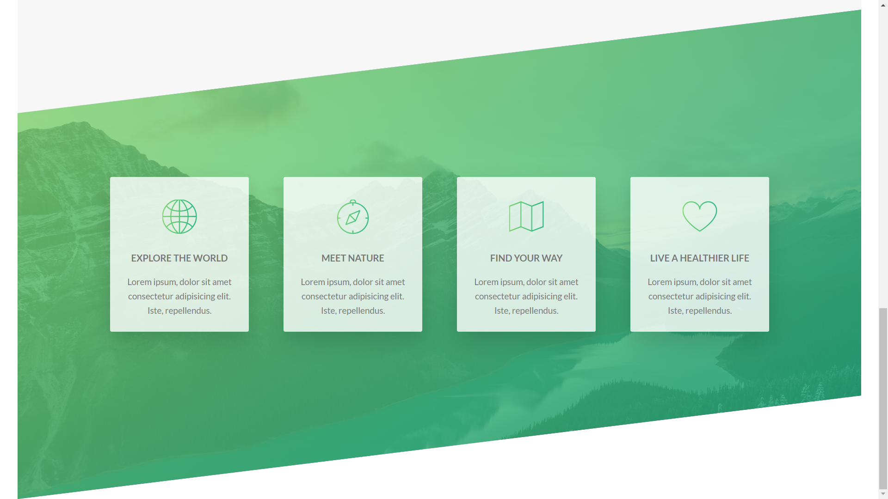
1. For the properties on page `_home.scss`.
    1. Use `linear-gradient`
    1. `skewY()` and compensate by the directly child. 
    1. We use direct child selector `>` to have the direct child in `.section-features` which is `div.row` in this case. If we don't have direct selector and select all the child elements inside, the inner the layer will apply multiple times of the effect which can make the layout become funny.
    1. We use universal selector `*` here as this could be any element in the section. 
    ```scss
    // pages/_home.scss
    .section-features {
        padding: 20rem 0;
        background-image: linear-gradient(
            to right bottom,
            rgba($color-primary-light, 0.8), 
            rgba($color-primary-dark, 0.8)), 
            url(../img/nat-4.jpg);
        background-size: cover;

        transform: skewY(-7deg);

        & > * {
            transform: skewY(7deg);
        }
    }
    ```
1. For the properties on page `_feature-box.css`.
    1. Use similar feature as for the title in `header` and "**about section**". We use `linear-gradient` to change the background color, turn the text color into `transparent`, and use `-webkit-background-clip` to change only the area right on the text itself.
    1. Have `transform` property to "lift" the element when the user hovers on it. 
    ```scss
    // components/_feature-box.scss
    .feature-box {
        background-color: rgba($color-white, .8);
        font-size: 1.5rem;
        padding: 2.5rem;
        text-align: center;
        border-radius: 3px;
        box-shadow: 0 1.5rem 4rem rgba($color-black, .15);
        transition: transform .3s;

        &__icon {
            font-size: 6rem;
            margin-bottom: .5rem;
            background-image: linear-gradient(to right, $color-primary-light, $color-primary-dark);
            color: transparent;
            -webkit-background-clip: text;
        }

        &:hover {
            transform: translateY(-1.5rem) scale(1.03);
        }
    }
    ```

## Building the Tours Section - Part 1
1. Learning targets
    1. How to build an amazing, rotating card
    1. How to use `perspective` in CSS
    1. How use the `backface-visibility` property
    1. Using background blend modes
    1. How and when to use `box-decoration-break`
1. The styling on the page `page/_home.scss`
    1. We firstly set up background color to the light grey and use negative value on `margin-top` to lift up the element to cover the void space of "**features**".
    ```scss
    // page/_home.scss
    .section-tours {
        background-color: $color-grey-light-1;
        padding: 25rem 0 50rem 0;
        margin-top: -10rem;
    }
    ```
1. The card component `components/_card.scss`
    1. `perspective` property
        1. We can use `transform: rotateY()` to flip the element against its y-axis. However, the default fliping is to flip into the monitor to the other side. Therefore, we can use [`perspective`](https://www.w3schools.com/cssref/css3_pr_perspective.asp) to change the behavior.
        1. Note that we should put the `perspective` property on the parent element, as only the child element will be affected. Besides, the value defines the distance between the element to the monitor (as to the user). In our case, we'd like it to be as far as it could, so the element can look like fliping itself on the same spot. 
            ```html
            <div class="row">
                <div class="col-1-of-3">
                    <div class="card">
                        <div class="card__side">
                            TEXT
                        </div>                        
                    </div>
                </div>
                <div class="col-1-of-3">
                    Col 1 of 3
                </div>
                <div class="col-1-of-3">
                    Col 1 of 3
                </div>
            </div>
            ```
        1. Definition to `perspective`
            1. he perspective property is used to give a 3D-positioned element some perspective.
            1. The perspective property defines how far the object is away from the user. So, a lower value will result in a more intensive 3D effect than a higher value.
            1. When defining the perspective property for an element, it is the CHILD elements that get the perspective view, NOT the element itself.            
            ```scss
            // components/_card.scss
            .card {
                perspective: 150rem;
                -moz-perspective: 150rem;

                &__side {
                    background-color: orangered;
                    color: #fff;
                    height: 50rem;
                    transition: all .8s;
                }

                &:hover &__side {
                    transform: rotateY(180deg);
                }
            }
            ```
    1. Two sides of the `card` component
        1. We modify the HTML tag to have contents for both 2 sides of the `card`.
            ```html
            <div class="row">
                <div class="col-1-of-3">
                    <div class="card">
                        <div class="card__side card__side--front">
                            FRONT
                        </div>
                        <div class="card__side card__side--back">
                            BACK
                        </div>
                    </div>
                </div>
                <div class="col-1-of-3">
                    Col 1 of 3
                </div>
                <div class="col-1-of-3">
                    Col 1 of 3
                </div>
            </div>
            ```        
        1. As we have 2 sides of the card
            1. We create new modifiers `card__side--front` and `card__side--back` for each side of the card.
            1. One card (back) is flipped `180` degrees by default. When the user hovers on the element, it will be flipped back to `0`, while the front one will be flipped by `180` degrees to the back. Note that we shouldn't flip the element by another `180` but just flip it back to `0`.
        1. As we use `position: absolute` on the child elements, the parent element loses its height, so the effect can become weird. Therefore, we can simply add the `height` as its children back, which is `height: 50rem` in this case.
        1. We use [`backface-visibility: hidden`](https://www.w3schools.com/cssref/css3_pr_backface-visibility.asp) to hide the element which its flipped, so its mirror image won't show or overlap on the displayed element.
        1. We set another value `ease` on the `trasition` property to provide a smoother animation. Note that the default value for this `transition-timing-function` is `linear`.
            ```scss
            // components/_card.scss
            .card {
                perspective: 150rem;
                -moz-perspective: 150rem;
                position: relative;
                height: 50rem; // to fix the issue for showing perspective

                &__side {
                    color: #fff;
                    font-size: 2rem;

                    height: 50rem;
                    transition: all .8s ease;
                    position: absolute;
                    top: 0;
                    left: 0;
                    width: 100%; // ensure its width is extended to the the width of its parent
                    backface-visibility: hidden; // hide the other side when the card is flipped

                    &--front {
                        background-color: $color-white;
                    }

                    &--back {
                        background-color: green;
                        transform: rotateY(180deg);
                    }
                }

                &:hover &__side--front {
                    transform: rotateY(180deg);
                }

                &:hover &__side--back {
                    transform: rotateY(0);
                }
            }
            ```
    1. Set colors for `linear-gradient` as the background in `_variables`.
        1. We firstly modify the HTML elements and add a modifer on the card
            ```html
            <div class="row">
                <div class="col-1-of-3">
                    <div class="card">
                        <div class="card__side card__side--front">
                            FRONT
                        </div>
                        <div class="card__side card__side--back card__side--back-1">
                            BACK
                        </div>
                    </div>
                </div>
                <div class="col-1-of-3">
                    Col 1 of 3
                </div>
                <div class="col-1-of-3">
                    Col 1 of 3
                </div>
            </div>
            ```
        1. Add new variables to `abstracts/_variables.scss` for <span style="color: #000; background: #ffb900;">orange</span> color and <span style="color: #000; background: #2998ff;">blue</span> color. 
            ```scss
            // abstracts/_variables.scss
            $color-secondary-light: #ffb900;
            $color-secondary-dark: #ff7730;

            $color-tertiary-light: #2998ff;
            $color-tertiary-dark: #5643fa;
            ```
        1. We add `box-shadow` to the card `box-shadow: 0 1.5rem 4rem rgba($color-black, .15);` and have a small rounded corner on the element for `border-radius: 3px;`.
        1. As setting `linear-gradient` background color on other elements, we use `background-image` (not `background-color`!) with the new variables for orange color.
            ```scss
            // components/_card.scss
            .card {
                perspective: 150rem;
                -moz-perspective: 150rem;
                position: relative;
                height: 50rem; // to fix the issue for showing perspective

                &__side {        
                    color: #fff;
                    font-size: 2rem;

                    height: 50rem;
                    transition: all .8s ease;
                    position: absolute;
                    top: 0;
                    left: 0;
                    width: 100%; // ensure its width is extended to the the width of its parent
                    backface-visibility: hidden; // hide the other side when the card is flipped
                    border-radius: 3px;
                    box-shadow: 0 1.5rem 4rem rgba($color-black, .15);

                    &--front {
                        background-color: $color-white;
                    }

                    &--back {            
                        transform: rotateY(180deg);

                        &-1 {
                            background-image: linear-gradient(to right bottom, $color-secondary-light, $color-secondary-dark);
                        }
                    }
                }

                &:hover &__side--front {
                    transform: rotateY(180deg);
                }

                &:hover &__side--back {
                    transform: rotateY(0);
                }
            }
            ```
            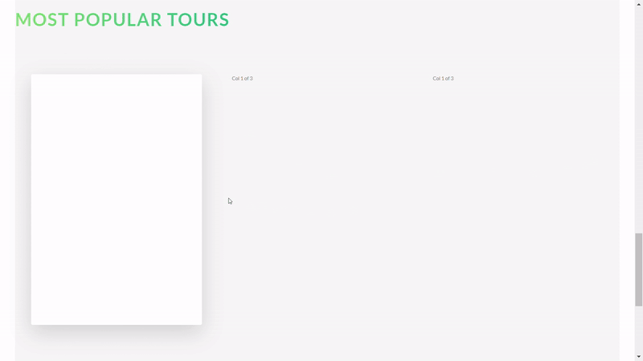

## Building the Tours Section - Part 2
1. The card is now flipping to the wrong side. Therefore, we can corret effect with negative value.
    ```scss
    // components/_card.scss
    .card {
        &:hover &__side--front {
            transform: rotateY(-180deg);
        }
    }
    ```
1. We modify the HTML for the card comopnent. We firstly work on the front side of the card which has 3 sections, picture, header, and detail contents.
    ```html
    <div class="card">
        <div class="card__side card__side--front">
            <div class="card__picture card__picture--1">
                &nbsp;
            </div>
            <div class="card__heading">
                Heading
            </div>
            <div class="card_details">
                Details
            </div>
        </div>
        <div class="card__side card__side--back card__side--back-1">
            BACK
        </div>
    </div>
    ```
1. Update `card` component
    1. The card image
        1. We then use `background-image` to import the image file and use `linear-gradient` to overlap it. Besides, we can use a modern feature [`background-blend-mode`](https://www.w3schools.com/cssref/pr_background-blend-mode.asp) which is only available in modern browsers. We use `screen` in this case, though it has several other options, such as `color`, `overlay`, `color-burn`, `color-dodge`, `saturation`, and `luminosity`. This property provide some feature that is only available in some professional program such as photoshop.
        1. As the image is overlapping the card element the top corners doesn't have rounded corners from `border-radius`. Note that it's not obvious since we give only `3px` in this case. It will be more obvious when we change to `border-radius: 30px`. Therefore, we can use `overflow: hidden` to hide the image that overflows the container.
        1. Use `clip-path: polygon()` to create a trapezoid shape like the one in the header. Note that this is a modern feature, so we need to use `-webkit-clip-path` to specify and ensure its workign in the supported browsers. 
        ```scss
        // component/_card.scss
        .card {
            &__side {
                border-radius: 3px;
                overflow: hidden;                
            }

            // FRONT SIDE STYLING
            &__picture {
                background-size: cover;
                height: 23rem;
                background-blend-mode: screen; // blend the linear-gradient color and the image
                -webkit-clip-path: polygon(0 0, 100% 0, 100% 85%, 0 100%);
                clip-path: polygon(0 0, 100% 0, 100% 85%, 0 100%);
                
                &--1 {
                    background-image: linear-gradient(to right bottom, $color-secondary-light, $color-secondary-dark), url(../img/nat-5.jpg);
                }

                &--2 {
                    background-image: url(../img/nat-5.jpg);
                }

                &--3 {
                    background-image: url(../img/nat-5.jpg);
                }
            }
        }
        ```
    1. The card heading
        1. We firstly modify the header with semantic HTML tag. In this case, we change the `div` tag to `h4`.
            ```html
            <h4 class="card__heading">
                <span class="card__heading--span card__heading--span--1">the sea explore</span>
            </h4>
            ```
        1. We'd like the wording break into 2nd line, so we don't give width at `100%`. In this case, we give `70%`. Thought it's `75%` in the course, this property depends on the width of the computer screen. After testing, I found the suitable width for my laptop is at `70%`. 
        1. Use `background-image: linear-gradient()` to have the gradient color background. Besides, we use `rgba()` here as to make the element transparent.
        1. As to break the line of header into 2, we give some padding to expand the element. 
        1. We then can use [`box-decoration-break`](https://www.w3schools.com/cssref/css3_pr_box-decoration-break.asp) to apply the CSS properties on the broken lines. Though the text is in the same `span` tag, it is considered 2 elements by using the property. 
        1. The box-decoration-break property specifies how the background, padding, border, border-image, box-shadow, margin, and clip-path of an element is applied when the box for the element is fragmented.
            ```scss
            // components/_card.scss
            .card {
                &__heading {
                    font-size: 2.8rem;
                    font-weight: 300;
                    text-transform: uppercase;
                    text-align: right;
                    color: $color-white;
                    position: absolute;
                    top: 12rem;
                    right: 2rem;
                    width: 70%;
                }

                &__heading--span {
                    padding: 1rem 1.5rem;
                    -webkit-box-decoration-break: clone;
                    box-decoration-break: clone;
                    &--1 {
                        background-image: linear-gradient(to right bottom, 
                        rgba($color-secondary-light, .85), 
                        rgba($color-secondary-dark, .85));
                    }
                }
            }
            ```
    1. The list in the card
        1. We add the HTML elements. The list can be an unordered list. 
            ```html
            <div class="card__details">
                <ul>
                    <li>3 day tours</li>
                    <li>Up to 30 people</li>
                    <li>2 tour guides</li>
                    <li>Sleep in cozy hotels</li>
                    <li>Difficulty: easy</li>
                </ul>
            </div>
            ```
        1. Add another light grey in the variables
            ```scss
            // abstracts/_variables.scss
            $color-grey-light-2: #eee;
            ```
        1. We can have the list narrowed by adding `padding: 3rem;`, set its width as `width: 80%;`, and use `margin: 0 auto;` to align it to the center of its container.
        1. Use `list-style: none` to clear the decoration on the list.
        1. We add `border-bottom` to each `li` in the list as the underline effect. However, we don't want the last item in the list has the effect, so we can use `not` pseudo selector to select all the other items except the last one.
            ```scss
            // components/_card.scss
            .card {
                &__details {
                    padding: 3rem;

                    ul {
                        list-style: none;
                        width: 80%;
                        margin: 0 auto;

                        li {
                            text-align: center;
                            font-size: 1.5rem;
                            padding: 1rem;

                            &:not(:last-child) {
                                border-bottom: 1px solid $color-grey-light-2;
                            }
                        }
                    }
                }
            }
            ```
            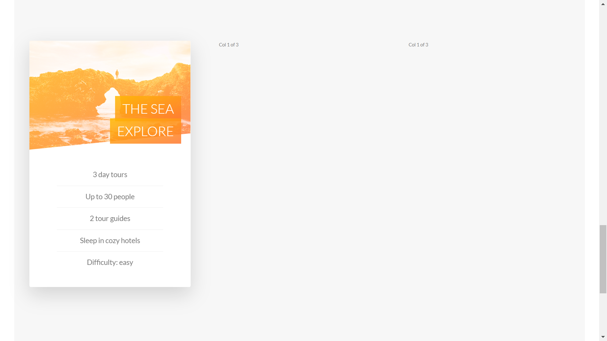

## Building the Tours Section - Part 3
1. This part is the final step that we will work on the back side of the card.
    ```html
    <div class="card__side card__side--back card__side--back-1">
        <div class="card__cta">
            <div class="card__price-box">
                <p class="card__price-only">Only</p>
                <p class="card__price-value">$297</p>
            </div>
            <a href="#" class="btn btn--white">Book now!</a>
        </div>
    </div>
    ```
1. We have the whole `.card__cta` element center in the middle of the backside of the card by using `position: absolute`, `top: 50%`, `left: 50%`, `transform(-50%, -50%)`, and `text-align: center`
    ```scss
    // components/_card.scss
    .card {
        // FRONT SIDE STYLING
        &__cta {
            position: absolute;
            top: 50%;
            left: 50%;
            transform: translate(-50%, -50%);
            width: 90%;
            text-align: center;
        }

        &__price-box{
            text-align: center;
            color: $color-white;
            margin-bottom: 8rem;
        }

        &__price-only {
            font-size: 1.4rem;
        }

        &__price-value {
            font-size: 6rem;
            font-weight: 100;
        }
    }
    ```
    
1. Final HTML
    ```html
    <main>
        <section class="section-about">
            <div class="u-centered-text u-margin-bottom-huge">
                <h2 class="heading-secondary">
                    Exciting tours for adventurous people
                </h2>
            </div>

            <div class="row">
                <div class="col-1-of-2">
                    <h3 class="heading-tertiary u-margin-bottom-small">You're going to fall in love with nature</h3>
                    <p class="paragraph">
                        Lorem ipsum dolor sit amet consectetur adipisicing elit. Non neque ut, id aliquam autem a
                        deserunt odit quia maiores perferendis esse dolores doloribus soluta commodi ipsum vitae sint
                        magnam cum.
                    </p>
                    <h3 class="heading-tertiary u-margin-bottom-small">Live adventures like you never have before</h3>
                    <p class="paragraph">
                        Lorem ipsum dolor sit amet consectetur adipisicing elit. Asperiores quaerat aperiam tenetur,
                        optio placeat maiores!
                    </p>

                    <a href="#" class="btn-text">Learn more &rarr;</a>
                </div>
                <div class="col-1-of-2">
                    <div class="composition">
                        
                        
                        
                    </div>
                </div>
            </div>
        </section>

        <section class="section-features">
            <div class="row">
                <div class="col-1-of-4">
                    <div class="feature-box">
                        <i class="feature-box__icon icon-basic-world"></i>
                        <h3 class="heading-tertiary u-margin-bottom-small">Explore the world</h3>
                        <p class="feature-box__text">Lorem ipsum, dolor sit amet consectetur adipisicing elit. Iste,
                            repellendus.</p>
                    </div>
                </div>

                <div class="col-1-of-4">
                    <div class="feature-box">
                        <i class="feature-box__icon icon-basic-compass"></i>
                        <h3 class="heading-tertiary u-margin-bottom-small">Meet nature</h3>
                        <p class="feature-box__text">Lorem ipsum, dolor sit amet consectetur adipisicing elit. Iste,
                            repellendus.</p>
                    </div>
                </div>

                <div class="col-1-of-4">
                    <div class="feature-box">
                        <i class="feature-box__icon icon-basic-map"></i>
                        <h3 class="heading-tertiary u-margin-bottom-small">Find your way</h3>
                        <p class="feature-box__text">Lorem ipsum, dolor sit amet consectetur adipisicing elit. Iste,
                            repellendus.</p>
                    </div>
                </div>

                <div class="col-1-of-4">
                    <div class="feature-box">
                        <i class="feature-box__icon icon-basic-heart"></i>
                        <h3 class="heading-tertiary u-margin-bottom-small">Live a healthier life</h3>
                        <p class="feature-box__text">Lorem ipsum, dolor sit amet consectetur adipisicing elit. Iste,
                            repellendus.</p>
                    </div>
                </div>
            </div>
        </section>

        <section class="section-tours">
            <div class="u-center-text u-margin-bottom-big">
                <h2 class="heading-secondary">
                    Most popular tours
                </h2>
            </div>

            <div class="row">
                <div class="col-1-of-3">
                    <div class="card">
                        <div class="card__side card__side--front">
                            <div class="card__picture card__picture--1">
                                &nbsp;
                            </div>
                            <h4 class="card__heading">
                                <span class="card__heading--span card__heading--span--1">the sea explore</span>
                            </h4>
                            <div class="card__details">
                                <ul>
                                    <li>3 day tours</li>
                                    <li>Up to 30 people</li>
                                    <li>2 tour guides</li>
                                    <li>Sleep in cozy hotels</li>
                                    <li>Difficulty: easy</li>
                                </ul>
                            </div>
                        </div>
                        <div class="card__side card__side--back card__side--back-1">
                            <div class="card__cta">
                                <div class="card__price-box">
                                    <p class="card__price-only">Only</p>
                                    <p class="card__price-value">$297</p>
                                </div>
                                <a href="#" class="btn btn--white">Book now!</a>
                            </div>
                        </div>
                    </div>
                </div>
                <div class="col-1-of-3">
                    <div class="card">
                        <div class="card__side card__side--front">
                            <div class="card__picture card__picture--2">
                                &nbsp;
                            </div>
                            <h4 class="card__heading">
                                <span class="card__heading--span card__heading--span--2">the forest hiker</span>
                            </h4>
                            <div class="card__details">
                                <ul>
                                    <li>7 day tours</li>
                                    <li>Up to 40 people</li>
                                    <li>6 tour guides</li>
                                    <li>Sleep in provided tents</li>
                                    <li>Difficulty: medium</li>
                                </ul>
                            </div>
                        </div>
                        <div class="card__side card__side--back card__side--back-2">
                            <div class="card__cta">
                                <div class="card__price-box">
                                    <p class="card__price-only">Only</p>
                                    <p class="card__price-value">$497</p>
                                </div>
                                <a href="#" class="btn btn--white">Book now!</a>
                            </div>
                        </div>
                    </div>
                </div>
                <div class="col-1-of-3">
                    <div class="card">
                        <div class="card__side card__side--front">
                            <div class="card__picture card__picture--3">
                                &nbsp;
                            </div>
                            <h4 class="card__heading">
                                <span class="card__heading--span card__heading--span--3">the snow adventurer</span>
                            </h4>
                            <div class="card__details">
                                <ul>
                                    <li>5 day tours</li>
                                    <li>Up to 15 people</li>
                                    <li>3 tour guides</li>
                                    <li>Sleep in provided tents</li>
                                    <li>Difficulty: hard</li>
                                </ul>
                            </div>
                        </div>
                        <div class="card__side card__side--back card__side--back-3">
                            <div class="card__cta">
                                <div class="card__price-box">
                                    <p class="card__price-only">Only</p>
                                    <p class="card__price-value">$897</p>
                                </div>
                                <a href="#" class="btn btn--white">Book now!</a>
                            </div>
                        </div>
                    </div>
                </div>
            </div>

            <div class="u-center-text u-margin-top-big">
                <a href="#" class="btn btn--green">Discover all tours</a>
            </div>
        </section>
    </main>
    ```
1. Final Scss
    1. Add new utilities for margin top
        ```scss
        .u-margin-top-big {margin-top: 8rem; }
        .u-margin-top-huge {margin-top: 10rem; }
        ```
    1. Add green button
        ```scss
        // components/_buttons.scss
        .btn {
            &:link,
            &:visited {
                text-transform: uppercase;
                text-decoration: none;
                padding: 1.5rem 4rem;
                display: inline-block;
                border-radius: 10rem;
                transition: all .2s;
                position: relative;
                font-size: $default-font-size;
            }

            &:hover {
                transform: translateY(-3px);
                box-shadow: 0 1rem 2rem rgba($color-black, 0.2);

                &::after {
                    transform: scaleX(1.5) scaleY(1.6);
                    opacity: 0;
                }
            }

            &:active {
                transform: translateY(-1px);
                box-shadow: 0 .5rem 1rem rgba($color-black, 0.2);
            }

            &--white {
                background-color: $color-white;
                color: $color-grey-dark;

                &::after {
                    background-color: $color-white;
                }
            }

            &--green {
                background-color: $color-primary;
                color: $color-white;

                &::after {
                    background-color: $color-primary;
                }
            }

            &::after {
                content: "";
                display: inline-block;
                height: 100%;
                width: 100%;
                border-radius: 100px;
                position: absolute;
                top: 0;
                left:0;
                z-index: -1;
                transition: all .4s;
            }    

            &--animated {
                animation: moveInBottom .5s ease-out .75s;
                animation-fill-mode: backwards;
            }
        }

        .btn-text {
            &:link,
            &:visited {
                font-size: $default-font-size;
                color: $color-primary;
                display: inline-block;
                text-decoration: none;
                border-bottom: 1px solid $color-primary;
                padding: 3px;
                transition: all .2s;
            }

            &:hover {
                background-color: $color-primary;
                color: $color-white;
                box-shadow: 0 1rem 2rem rgba($color-black, .15);
                transform: translateY(-2px);
            }

            &:active {
                box-shadow: 0 .5rem 1rem rgba($color-black, .15);
                transform: translateY(-2px);
            }
        }
        ```
    1. Reduced bottom padding
        ```scss
        // page/_home.scss
        .section-about {
            background-color: $color-grey-light-1;
            padding: 25rem 0;
            margin-top: -20vh;
        }

        .section-features {
            padding: 20rem 0;
            background-image: linear-gradient(
                to right bottom,
                rgba($color-primary-light, 0.8), 
                rgba($color-primary-dark, 0.8)), 
                url(../img/nat-4.jpg);
            background-size: cover;

            transform: skewY(-7deg);
            margin-top: -10rem;

            & > * {
                transform: skewY(7deg);
            }
        }

        .section-tours {
            background-color: $color-grey-light-1;
            padding: 25rem 0 15rem 0;
            margin-top: -10rem;
        }
        ```
    1. The card component
        ```scss
        // components/_card.scss
        .card {
            perspective: 150rem;
            -moz-perspective: 150rem;
            position: relative;
            height: 52rem; // to fix the issue for showing perspective

            &__side {        
                height: 52rem;
                transition: all .8s ease;
                position: absolute;
                top: 0;
                left: 0;
                width: 100%; // ensure its width is extended to the the width of its parent
                backface-visibility: hidden; // hide the other side when the card is flipped
                border-radius: 3px;
                overflow: hidden;
                box-shadow: 0 1.5rem 4rem rgba($color-black, .15);

                &--front {
                    background-color: $color-white;
                }

                &--back {            
                    transform: rotateY(180deg);

                    &-1 {
                        background-image: linear-gradient(to right bottom, $color-secondary-light, $color-secondary-dark);
                    }

                    &-2 {
                        background-image: linear-gradient(to right bottom, $color-primary-light, $color-primary-dark);
                    }

                    &-3 {
                        background-image: linear-gradient(to right bottom, $color-tertiary-light, $color-tertiary-dark);
                    }
                }
            }

            &:hover &__side--front {
                transform: rotateY(-180deg);
            }

            &:hover &__side--back {
                transform: rotateY(0);
            }

            // FRONT SIDE STYLING
            &__picture {
                background-size: cover;
                height: 23rem;
                background-blend-mode: screen;
                -webkit-clip-path: polygon(0 0, 100% 0, 100% 85%, 0 100%);
                clip-path: polygon(0 0, 100% 0, 100% 85%, 0 100%);
                // fixed the missing border-radius of the top corners on the card
                border-top-left-radius: 3px;
                border-top-right-radius: 3px;
                
                &--1 {
                    background-image: linear-gradient(to right bottom, $color-secondary-light, $color-secondary-dark), url(../img/nat-5.jpg);
                }

                &--2 {
                    background-image: linear-gradient(to right bottom, $color-primary-light, $color-primary-dark), url(../img/nat-6.jpg);
                }

                &--3 {
                    background-image: linear-gradient(to right bottom, $color-tertiary-light, $color-tertiary-dark), url(../img/nat-7.jpg);
                }
            }

            &__heading {
                font-size: 2.8rem;
                font-weight: 300;
                text-transform: uppercase;
                text-align: right;
                color: $color-white;
                position: absolute;
                top: 12rem;
                right: 2rem;
                width: 70%;
            }

            &__heading--span {
                padding: 1rem 1.5rem;
                -webkit-box-decoration-break: clone;
                box-decoration-break: clone;
                &--1 {
                    background-image: linear-gradient(to right bottom, 
                    rgba($color-secondary-light, .85), 
                    rgba($color-secondary-dark, .85));
                }

                &--2 {
                    background-image: linear-gradient(to right bottom, 
                    rgba($color-primary-light, .85), 
                    rgba($color-primary-dark, .85));
                }
                &--3 {
                    background-image: linear-gradient(to right bottom, 
                    rgba($color-tertiary-light, .85), 
                    rgba($color-tertiary-dark, .85));
                }
            }

            &__details {
                padding: 3rem;

                ul {
                    list-style: none;
                    width: 80%;
                    margin: 0 auto;

                    li {
                        text-align: center;
                        font-size: 1.5rem;
                        padding: 1rem;

                        &:not(:last-child) {
                            border-bottom: 1px solid $color-grey-light-2;
                        }
                    }
                }
            }

            // FRONT SIDE STYLING
            &__cta {
                position: absolute;
                top: 50%;
                left: 50%;
                transform: translate(-50%, -50%);
                width: 90%;
                text-align: center;
            }

            &__price-box{
                text-align: center;
                color: $color-white;
                margin-bottom: 8rem;
            }

            &__price-only {
                font-size: 1.4rem;
            }

            &__price-value {
                font-size: 6rem;
                font-weight: 100;
            }
        }
        ```

## Building The Stories Section - Part 1
1. Learning targets
    1. How to make text flow around shapes with `shape-outside` and `float`.
    1. How to apply a `filter` to images
    1. How to create a background video covering an entire section
    1. How to use the `video` HTML element
    1. How and when to use the `object-fit` property
        ```html
        <section class="section-stories">
            <div class="u-center-text u-margin-bottom-huge">
                <h2 class="heading-secondary">
                    We make people genuienly happy
                </h2>
            </div>

            <div class="row">
                <div class="story">
                    <figure class="story__shape">
                        
                    </figure>
                    <div class="story__text">
                        <h3 class="heading__tertiary u-margin-bottom-small">I had best week ever with my family</h3>
                        <p>Lorem ipsum dolor sit, amet consectetur adipisicing elit. Totam repellendus assumenda
                            voluptas error quisquam reiciendis, pariatur laboriosam nostrum dolores ad quis impedit
                            laudantium sapiente at praesentium cumque ipsa? Totam autem ratione, nemo incidunt eaque
                            nesciunt!</p>
                    </div>
                </div>
            </div>
        </section>
        ```
1. For the story section, we can simply use style it with light grey color.
    ```scss
    // page/_home.scss
    .section-stories {
        padding: 15rem 0;
        background-color: $color-grey-light-1;    
    }
    ```
1. [`shape-outside`](https://developer.mozilla.org/en-US/docs/Web/CSS/shape-outside) defines a shape—which may be non-rectangular—around which adjacent inline content should wrap. By default, inline content wraps around its margin box; shape-outside provides a way to customize this wrapping, making it possible to wrap text around complex objects rather than simple boxes.
    
1. `shape-outside` only works when the has `width` and `height` and has `float: left` or `float: right`. However, this only defines how the text around the element wrapping it rather than changing the shape into a figure.
1. To change the shape of the element, we should use `clip-path` with `polygon()`, `circle()`, `ellipse()`, or `url()`.
    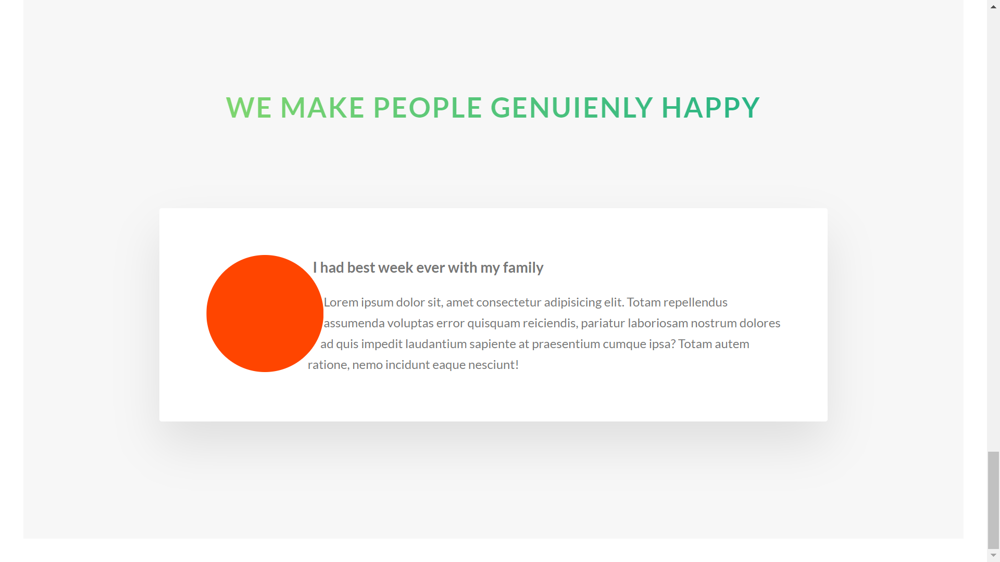
1. When an element is "**floated**", it's best to use `transform: translate()` to move it rather than using `margin`. Besides, the shifted figure has overlayed on the padding on the left side, so we can add another 3rem space, which can be `padding-left: 9rem;` for the trick.
    
1. We then can use `transform: skewX(12deg)` to skew the container of the review. Note that we used to use universal selector `*` to select the dierct child in the container to skew it back, so the contents can be normal. However, we can only use `transform` property once on an element.
1. Since, we have applied `transform: translateX()` on `.story__shape` to shift it to the left.
    ```scss
    // component/_story.scss
    .story {
        width: 75%;
        margin: 0 auto;
        box-shadow: 0 3rem 6rem rgba($color-black, .1);
        background-color: $color-white;
        border-radius: 3px;
        padding: 6rem;
        padding-left: 9rem;
        font-size: $default-font-size;
        transform: skewX(-12deg);

        /*
        & > * { // this doesn't work on the image because the shape has used `transform: translateX()`
            transform: skewX(12deg);
        }
        */

        &__shape {
            width: 15rem;
            height: 15rem;
            float: left;
            // shape-outside only works if the element has width and height and float: left or float: right
            -webkit-shape-outside: circle(50% at 50% 50%);
            // shape-outside is only to make the element around to wrap the shape
            shape-outside: circle(50% at 50% 50%);

            // clip-path with circle or polygon can really shape the figure
            -webkit-clip-path: circle(50% at 50% 50%);
            clip-path: circle(50% at 50% 50%);
            transform: translateX(-3rem) skewX(12deg); // have skewX() to skew the content back
        }

        &__img {
            height: 100%;
        }

        &__text {
            transform: skewX(12deg);
        }
    }
    ```
    

## Building The Stories Section - Part 2
1. With [`figure`](https://www.w3schools.com/tags/tag_figure.asp) tag, we can have `figcaption` to add descriptive text to the figure.
    ```html
    <figure class="story__shape">
        
        <figcaption class="story__caption">Mary Smith</figcaption>
    </figure>
    ```
1. We start to style the caption for the figure. As the text is at the bottom of the `figure` by default, we can use `position: absolute` to center the element to the middle of its container.
1. Since we'd like the text (name of the reviewer) floated up, we can set its `translate` on y-axis as `20%`, so it will be 20% further down the middle.
1. We set its `opacity` to `0`, as to "**hide**" the text before the user hovers on.
1. Set another selector to choose the caption when the whole `story` item is hovered. Note that we can't use `transform: translateY()` as it will set `translateX()` to default value which can cause unexpected result.
1. To filter the image when hovers on the element, we can use `filter` property with `blur` and `brightness`.
    ```scss
    // component/_story.scss
    .story {
        &__caption {
            position: absolute;
            top: 50%;
            left: 50%;
            transform: translate(-50%, 20%);
            color: $color-white;
            text-transform: uppercase;
            font-size: 1.7rem;
            text-align: center;
            opacity: 0;
            transition: all .5s;
            backface-visibility: hidden; // prevent the glitch when the text floats up
        }

        &:hover &__caption {
            opacity: 1;
            transform: translate(-50%, -50%);
        }

        &:hover &__img {
            transform: translateX(-4rem) scale(1);
            filter: blur(3px) brightness(80%);
        }
    }
    ```
    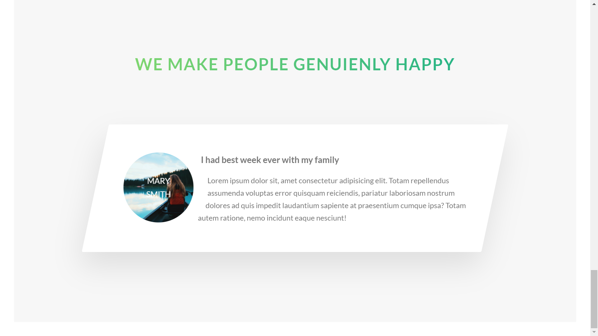
1. Add text button at the bottom of the section.
    ```html
    <div class="row">
        <div class="story">
            <figure class="story__shape">
                
                <figcaption class="story__caption">Mary Smith</figcaption>
            </figure>
            <div class="story__text">
                <h3 class="heading__tertiary u-margin-bottom-small">I had best week ever with my family</h3>
                <p>Lorem ipsum dolor sit, amet consectetur adipisicing elit. Totam repellendus assumenda
                    voluptas error quisquam reiciendis, pariatur laboriosam nostrum dolores ad quis impedit
                    laudantium sapiente at praesentium cumque ipsa? Totam autem ratione, nemo incidunt eaque
                    nesciunt!</p>
            </div>
        </div>
    </div>
    <div class="row">
        <div class="story">
            <figure class="story__shape">
                
                <figcaption class="story__caption">Jack Wilson</figcaption>
            </figure>
            <div class="story__text">
                <h3 class="heading__tertiary u-margin-bottom-small">WOW! My life is completely different now
                </h3>
                <p>Lorem ipsum dolor sit, amet consectetur adipisicing elit. Totam repellendus assumenda
                    voluptas error quisquam reiciendis, pariatur laboriosam nostrum dolores ad quis impedit
                    laudantium sapiente at praesentium cumque ipsa? Totam autem ratione, nemo incidunt eaque
                    nesciunt!</p>
            </div>
        </div>
    </div>

    <div class="u-center-text u-margin-top-big">
        <a href="#" class="btn-text">Read all stories</a>
    </div>
    ```
1. Scss
    ```scss
    .story {
        width: 75%;
        margin: 0 auto;
        box-shadow: 0 3rem 6rem rgba($color-black, .1);
        background-color: $color-white;
        border-radius: 3px;
        padding: 6rem;
        padding-left: 9rem;
        font-size: $default-font-size;
        transform: skewX(-12deg);

        &__shape {
            width: 15rem;
            height: 15rem;
            float: left;
            // shape-outside only works if the element has width and height and float: left or float: right
            -webkit-shape-outside: circle(50% at 50% 50%);
            // shape-outside is only to make the element around to wrap the shape
            shape-outside: circle(50% at 50% 50%);

            // clip-path with circle or polygon can really shape the figure
            -webkit-clip-path: circle(50% at 50% 50%);
            clip-path: circle(50% at 50% 50%);
            transform: translateX(-3rem) skewX(12deg);
            position: relative;
        }

        &__img {
            height: 100%;
            transform: translateX(-4rem) scale(1.4);
            backface-visibility: hidden;
            transition: all .5s;
        }

        &__text {
            transform: skewX(12deg);
        }

        &__caption {
            position: absolute;
            top: 50%;
            left: 50%;
            transform: translate(-50%, 20%);
            color: $color-white;
            text-transform: uppercase;
            font-size: 1.7rem;
            text-align: center;
            opacity: 0;
            transition: all .5s;
            backface-visibility: hidden;
        }

        &:hover &__caption {
            opacity: 1;
            transform: translate(-50%, -50%);
        }

        &:hover &__img {
            transform: translateX(-4rem) scale(1);
            filter: blur(3px) brightness(80%);
        }
    }
    ```
    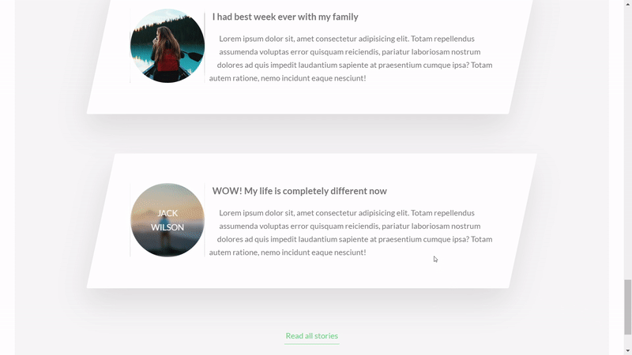

## Building The Stories Section - Part 3
1. In this section, we are going to use an video as the background which covers the whole section. We use both [`video`](https://www.w3schools.com/html/html5_video.asp) and `source` tag in this case. 
    1. We don't use `src` attribute in `video` tag directly. We use `source` tag nested in the `video` tag instead as it allows the browsers to choose from the alternative video source that the browser supports.
    1. We can put some text as the content in the `video` tag. This works similar to `alt` attribute for `img` tag that if the browser doesn't support playing the video, this text will show to indicate to the user. 
    1. We can specify `autoplay`, `muted`, and `loop` when playing the video.
        ```html
        <section class="section-stories">
            <div class="bg-video">
                <video class="bg-video__content" autoplay muted loop>
                    <source src="img/video.mp4" type="video/mp4">
                    <source src="img/video.webm" type="video/webm">
                    Your browser is not support playing video!
                </video>
            </div>
        </section>
        ```
1. We should also take off the `background-color` from the element itself. Besides, we can give negative value on `z-index` to ensure all the other elements can overlay on the video.
    ```scss
    // page/_home.scss
    .section-stories {
        position: relative;
        padding: 15rem 0;
        // take off the testing background
    }
    ```
1. We add `opacity: .15;` on the video. Since we'd like the background of each story section can be seen through, we can use `rgba($color-white, .6)` on the story component. Note that we can't use the property on the whole story section directly or the context (text) will also be faded.
    ```scss
    // components/_bg-video.scss
    .bg-video {
        opacity: .15;
    }

    // components/_story.scss
    .story {
        background-color: rgba($color-white, .6);
    }
    ```
1. To make the video fit to the background of the section and keep its ratio, we can use `object-fit: cover;` which is similar to `background-size: cover` that can adjust the image by CSS. [`object-fit`](https://www.w3schools.com/css/css3_object-fit.asp) is used to specify how an `` or `<video>` should be resized to fit its container.
    1. `fill` - This is default. The image is resized to fill the given dimension. If necessary, the image will be stretched or squished to fit
    1. `contain` - The image keeps its aspect ratio, but is resized to fit within the given dimension
    1. `cover` - The image keeps its aspect ratio and fills the given dimension. The image will be clipped to fit
    1. `none` - The image is not resized
    1. `scale-down` - the image is scaled down to the smallest version of none or contain
        ```scss
        .bg-video {
            &__content {
                object-fit: cover;
            }
        }
        ```
1. The video background Scss
    ```scss
    // components/_bg-video.scss
    .bg-video {
        position: absolute;
        top: 0;
        left: 0;
        height: 100%;
        width: 100%;
        z-index: -1;
        opacity: .15;
        overflow: hidden;

        &__content {
            height: 100%;
            width: 100%;
            object-fit: cover;
        }
    }
    ```
    

## Building the Booking Section - Part 1
1. Learning targets
    1. How to implement "solid-color gradients"
    1. How the general and adjacent sibling selectors work and why we need them
    1. How to use the `::input-placeholder` pseudo-element
    1. How and when to use the `:focus`, `:invalid`, `placeholder-shown`, and `:checked` pseudo-classes
    1. Techniques to build custom radio buttons
1. For the `form` we will build here, the element can be used somewhere else at the site while its styling could be different from page to page. Therefore, we can keep the `form` as a component while have the decorations in `_home.scss`, as we will only use the styles on this main page.
    ```html
    <section class="section-book">
        <div class="row">
            <div class="book">
                <div class="book__form">
                    <form action="#" class="form">
                        <div class="u-margin-bottom-medium">
                            <h2 class="heading-secondary">
                                Start booking now
                            </h2>
                        </div>
                        <div class="form__group">
                            <input id="name" type="text" class="form__input" placeholder="Full aame" required>
                            <label for="name" class="form__label">Full Name</label>
                        </div>

                        <div class="form__group">
                            <input id="email" type="email" class="form__input" placeholder="Email address" required>
                            <label for="email" class="form__label">Email address</label>
                        </div>
                    </form>
                </div>
            </div>
        </div>
    </section>
    ```
1. To have the background shown without having any content, we can firstly provide some `height` to the element to let it have size by itself.
1. We can not only use the given options for `background-size` such as `cover` but also percentage. For example, using `100%` can work exactly the same as using `cover`.
1. Though we can use another element and apply `clip-path: polygon()` to create a specific figure and overlay on the other element or stay in the contaier, we can use solid gradient which is similar to using `linear-gradient` that we can have the solid color extend to the specific position and turn into transparent, so it will look like the desirable shape.
1. This technique is useful that we don't have the styling on the component directly, so we can be easy to reuse the component in the other section.
1. In `linear-gradient`, we can also specify the location where we want the color to starts. For example, we can give the initial color at `0%` and have the 2nd color at `50%`, so the  color gradient will only be shown from 0% to 50%, while after `50%`, the color will be solid 2nd color.
    ```scss
    .book {
        background-image: linear-gradient(105deg, 
        rgba($color-white, .9) 0%, 
        orangered 50%), 
        url(../img/nat-10.jpg);
        background-size: 100%;
        border-radius: 3px;
        box-shadow: 0 1.5rem 4rem rgba($color-black, .2);

        height: 50rem; // testing value, as there's no content yet
    }
    ```
    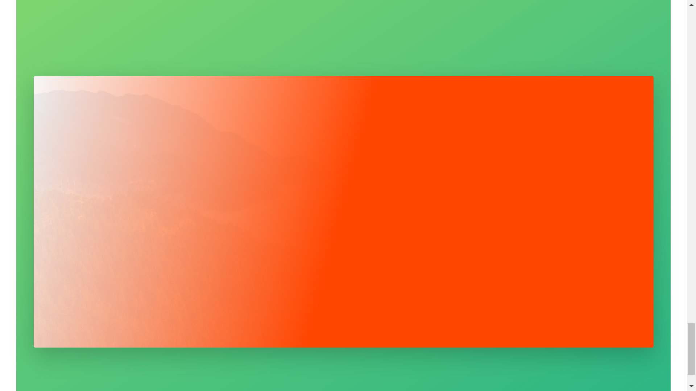
1. If we put another `white` color from `0%` to `50%`, the solid color will be half of the element. Note that we have the color shape because we use `105deg` to rotate it. The original direction of `linear-gradient` is from top to the bottom.
    ```scss
    .book {
        background-image: linear-gradient(105deg, 
        rgba($color-white, .9) 0%, 
        rgba($color-white, .9) 50%, 
        orangered 50%), 
        url(../img/nat-10.jpg);
        background-size: 100%;
        border-radius: 3px;
        box-shadow: 0 1.5rem 4rem rgba($color-black, .2);

        height: 50rem; // testing value, as there's no content yet
    }
    ```
    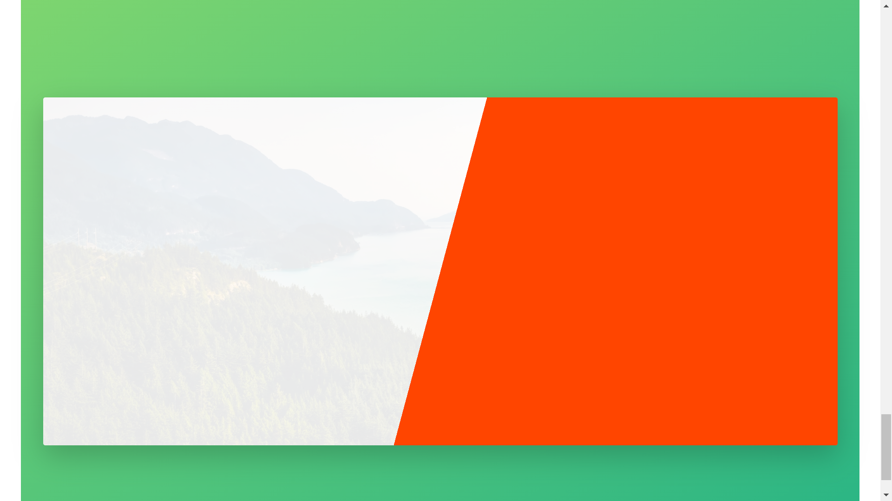
1. Final Scss
    ```scss
    // page/_home.scss
    .book {
        background-image: linear-gradient(105deg, 
        rgba($color-white, .9) 0%, 
        rgba($color-white, .9) 50%, 
        transparent 50%), 
        url(../img/nat-10.jpg);
        background-size: 100%;
        border-radius: 3px;
        box-shadow: 0 1.5rem 4rem rgba($color-black, .2);

        height: 50rem;

        &__form {
            width: 50%;
            padding: 6rem;
        }
    }
    ```
    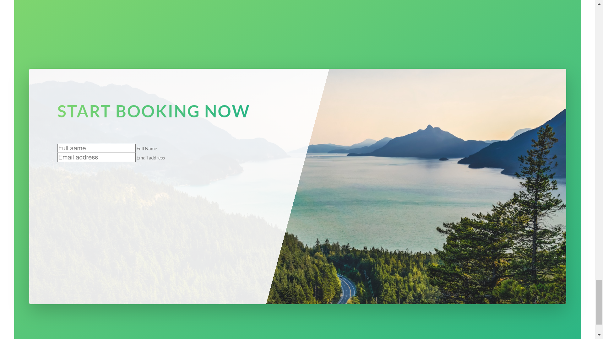

## Building the Booking Section - Part 2
1. HTML
    ```html
    <div class="book">
        <div class="book__form">
            <form action="#" class="form">
                <div class="u-margin-bottom-medium">
                    <h2 class="heading-secondary">
                        Start booking now
                    </h2>
                </div>
                <div class="form__group">
                    <input id="name" type="text" class="form__input" placeholder="Full name" required>
                    <label for="name" class="form__label">Full Name</label>
                </div>

                <div class="form__group">
                    <input id="email" type="email" class="form__input" placeholder="Email address" required>
                    <label for="email" class="form__label">Email address</label>
                </div>
            </form>
        </div>
    </div>
    ```
1. We change the styling 
    ```scss
    // component/_form.scss
    .form {
        &__input {
            font-size: 1.5rem;
            font-family: inherit; // get from the parent element
            color: inherit;
            padding: 1.5rem 2rem;
            border-radius: 2px;
            background-color: rgba($color-white, .5);
            border: none;
            border-bottom: 3px solid transparent;
            width: 90%;
            display: block;
        }
    }
    ```
1. Change the style when the user focus on the `input`. We can clear the border which could be `blue` or `black` on the border by `outline`. We add the <span style="background: #55c57a; color: black;">green</span> `border-bottom`. Note that this bordre will affect to the overall height of the element. Thus, we can firstly add a transparent border-bottom when it's not focused. 
1. For chrome and Safari browser, we can use [`-webkit-input-placeholder`](https://www.w3schools.com/cssref/sel_placeholder.asp) pseudo selector to change the color of placeholder in the input tag.
    ```scss
    // components/_form.scss
    .form {
        &__input {
            border-bottom: 3px solid transparent;

            &:focus {
                outline: none; // clear the border on the input tag when it's focused
                box-shadow: 0 1rem 2rem rgba($color-black, .1);
                border-bottom: 3px solid $color-primary;
            }

            &::-webkit-input-placeholder { // this only works no Safari and Chrome
                color: $color-grey-dark-2;
            }
        }
    }
    ```
1. We can have different decoration when the input has [invalid](https://www.w3schools.com/cssref/sel_invalid.asp) values. For example, when we configure the tag as `<input type="email">`, the browser will check the value by default and show if it's invalid. When the input value is valid, it will apply regular `.form:focus` styles on it.
    ```scss
    // components/_form.scss
    .form {
        &:focus {
            border-bottom: 3px solid $color-primary;
        }

        &:focus:invalid {
            border-bottom: 3px solid $color-secondary-dark;
        }
    }
    ```
1. We then can style on the `label` to let the text goes down when the user is inserting values. In this case, we'd like the `label` looks like sliding from the placeholder to the bottom of the input tag. We can check the input state with [`:placeholder-shown`](https://developer.mozilla.org/en-US/docs/Web/CSS/:placeholder-shown) selector and use [CSS sibling combinator](https://www.w3schools.com/css/css_combinators.asp) to select the adjacent element right next to the selected element with a plus sign `+`. Note that if the the element doesn't directly follow the element in HTML, we should use tilde symbol `~`. 
    1. `:placeholder-shown` represents any `input` or `textarea` element that is currently displaying placeholder text. Usually it means there's no value in the `input` or `textarea` element yet.
    1. CSS sibling combinator can select elements in the same container (HTML element). 
        1. If the element is right after the selected element, we can use `+` as the adjacent sibling selector. Note this selects only a single element. 
        1. Otherwise, we can use `~` to select all the elements in the same container. 
1. In orginal state (which is when the placeholder is shown) of the `label`, it can be moved up by y-axis with both `opacity: 0` and `visibility: 0`.
    1. `opacity: 0` is to hide text and make it invisible at the original state (when placeholder of the input is shown). Though this is not necessary for the effect, it provides a smoother animatino during transition from invisible to visible. Otherwise, the text may look like just showing up and moved down. 
    1. `visibility: hidden` is to hide the text why prevent user selecting the element. The main difference between `visibility: hidden` and `display: none` is that though the element is invisible by `visibilty: hidden`, it still takes up space on the page. However, `display: none` totally removes the element from the page. 
1. We need to use both `opacity: 0` and `visibility: hidden` on the element to provide smoother transition. Using `display: none` could do similar effect but may looks funny, as it doesn't have transition between states of the element. 
    ```scss
    // components/_form.scss
    .form {
        &__label {
            font-size: 1.2rem;
            font-weight: 700;
            margin-left: 2rem;
            margin-top: .7rem;
            display: block;
            transition: all .3s;
        }

        &__input:placeholder-shown + &__label {
            opacity: 0;
            visibility: hidden;
            transform: translateY(-4rem);
        }
    }
    ```
1. Final Scss
    ```scss
    // components/_form.scs
    .form {
        &__group:not(:last-child) {
            margin-bottom: 2rem;
        }

        &__input {
            font-size: 1.5rem;
            font-family: inherit; // get from the parent element
            color: inherit;
            padding: 1.5rem 2rem;
            border-radius: 2px;
            background-color: rgba($color-white, .5);
            border: none;
            border-bottom: 3px solid transparent;
            width: 90%;
            display: block;
            
            &:focus {
                outline: none; // clear the border on the input tag when it's focused
                box-shadow: 0 1rem 2rem rgba($color-black, .1);
                border-bottom: 3px solid $color-primary;
            }

            &:focus:invalid {
                border-bottom: 3px solid $color-secondary-dark;
            }

            &::-webkit-input-placeholder { // this only works no Safari and Chrome
                color: $color-grey-dark-2;
            }
        }

        &__label {
            font-size: 1.2rem;
            font-weight: 700;
            margin-left: 2rem;
            margin-top: .7rem;
            display: block;
            transition: all .3s;
        }

        &__input:placeholder-shown + &__label {
            opacity: 0;
            visibility: hidden;
            transform: translateY(-4rem);
        }
    }
    ```
    

## Building the Booking Section - Part 3
1. We add `transition` to let the animation works smoother
    ```scss
    // components/_form.scss
    .form {
        &__input {
            transition: all .3s;
        }
    }
    ```
1. In this section, we will build the customized radio buttons. 
1. For radio buttons, it's similar to other `input` tags. However, we can give `name` attribute on each radio buttno in the same `form` to indicate that only one of the options can be selected. 
1. We then create another `span` element in the `label` tag. 
    1. The idea here is to hide the real `input` tag and show the styled button nested in the `label`. 
    1. Note that when we group a `label` and `input` in the same container and assign `id` and `for` to link them, when the user clicks on the label, the `input` will be "**focused**" or "**selected**".
    ```html
    <form class="form">
        <div class="form__group">
            <div class="form__radio-grouop">
                <input type="radio" class="form__radio-input" id="small" name="size">
                <label for="small" class="form__radio-label">
                    <span class="form__radio-button"></span>
                    Small tour group
                </label>
            </div>

            <div class="form__radio-grouop">
                <input type="radio" class="form__radio-input" id="large" name="size">
                <label for="large" class="form__radio-label">
                    <span class="form__radio-button"></span>
                    Large tour group
                </label>
            </div>
        </div>
        <div class="form__group">
            <button class="btn btn--green">Next step &rarr;</button>
        </div>
    </form>
    ```
1. Use `display: none` to hide the input tag, so the element won't show and occupy any space on the page.
1. Use `cursor: pointer` to make the `label` and the `span`inside clickable.
1. We work on the customized radio button. 
    1. Turn the `span` (`.form__radio-button`) in the label into `display: inline-block` to assign both `width` and `height`.
    1. As the figure isn't ailgned, we use negative `top: -.4rem` to lift up the element.
    1. Use `::after` to create pseudo element and give `position: absolute`. Note that `position:absolute` works only if the parent element has a specified `position` property. It will align to the nearest parenet element that has `position: relative`. Since we have both `.form__radio-button` and `.form__radio-button::after` align on the same parent. It has no problem in this case.
    1. We use both `position: absolute;`, `top: 50%;`, `left:50%;`, and `transform: translate(-50%, -50%);` to center the `::after` pseudo element right at the middle. 
    1. For both `.form__radio-button` and `.form__radio-button::after`, we make them both look like a circle by using `border-radius: 50%;`.
    1. The initial `opacity: 0` is set to `0` in order to hide the inner circle when the radio button isn't selected. 
    1. Use general sibling selector tilde symbol `~` to select the child of the adjacent element. This is a relatively complicated selector. 
        ```html
        <!-- select the child of the sibling element -->
        <!-- selector ~ sibling child -->
        <div class="form__radio-group">
            <input type="radio" class="form__radio-input" id="small" name="size">
            <label for="small" class="form__radio-label">
                <span class="form__radio-button"></span>
                Small tour group
            </label>
        </div>
        ```
        ```scss
        // components/_form.scss
        .btn {
            &__radio-group {
                width: 45%;
                display: inline-block;
            }

            &__radio-input { // hide the real input tag
                display: none;
            }
            
            &__radio-label {
                font-size: $default-font-size;
                cursor: pointer;
                position: relative;
                padding-left: 4.5rem;
            }

            &__radio-button {
                height: 3rem;
                width: 3rem;
                border: 5px solid $color-primary;
                border-radius: 50%;
                display: inline-block;
                position: absolute;
                left: 0;
                top: -.4rem;

                &::after {
                    content: "";
                    display: block;
                    height: 1.3rem;
                    width: 1.3rem;
                    border-radius: 50%;
                    position: absolute;
                    top: 50%;
                    left: 50%;
                    transform: translate(-50%, -50%);
                    background-color: $color-primary;
                    opacity: 0;
                    transition: opacity .2s;
                }
            }

            &__radio-input:checked ~ &__radio-label &__radio-button::after {
                opacity: 1;
            }
        }
        ```
1. As we only set up `btn` to style anchor tags, it doesn't work correctly on `button` tags. 
    1. As `:link` and `:visited` is the state on anchor tags, the styles doesn't work for a `button` if we just use the decoration on it. Therefore, we can simply give an ampersand `&` for the case.
    1. When clicking the button, it's in "**focus**" state which is similar to "**active**" when an achor tag is clicked. 
    ```scss
    // components/_buttons.scss
    .btn {
        &, // ensure this works with button tag
        &:link,
        &:visited {
            text-transform: uppercase;
            text-decoration: none;
            padding: 1.5rem 4rem;
            display: inline-block;
            border-radius: 10rem;
            transition: all .2s;
            position: relative;
            font-size: $default-font-size;

            // change for the <button> element
            border: none;
            cursor: pointer;
        }

        &:active,
        &:focus { // add 'focus' state
            outline: none;
            transform: translateY(-1px);
            box-shadow: 0 .5rem 1rem rgba($color-black, 0.2);
        }
    }
    ```
1. We make all the utilities stylnig with `!important` because some of the selectors can be more specific than the utilities. Therefore, we can use `!important` here to ensure it's working. 
    ```scss
    // base/_utilities.scss
    .u-center-text { text-align: center !important; }

    .u-margin-bottom-small {margin-bottom: 1.5rem !important; }
    .u-margin-bottom-medium {margin-bottom: 4rem !important; }
    .u-margin-bottom-big {margin-bottom: 8rem !important; }
    .u-margin-bottom-huge {margin-bottom: 10rem !important; }

    .u-margin-top-big {margin-top: 8rem !important; }
    .u-margin-top-huge {margin-top: 10rem !important; }
    ```
1. Final Scss
    ```scss
    // components/_form.scss
    .form {
        &__group:not(:last-child) {
            margin-bottom: 2rem;
        }

        &__input {
            font-size: 1.5rem;
            font-family: inherit; // get from the parent element
            color: inherit;
            padding: 1.5rem 2rem;
            border-radius: 2px;
            background-color: rgba($color-white, .5);
            border: none;
            border-bottom: 3px solid transparent;
            width: 90%;
            display: block;
            transition: all .3s;
            
            &:focus {
                outline: none; // clear the border on the input tag when it's focused
                box-shadow: 0 1rem 2rem rgba($color-black, .1);
                border-bottom: 3px solid $color-primary;
            }

            &:focus:invalid {
                border-bottom: 3px solid $color-secondary-dark;
            }

            &::-webkit-input-placeholder { // this only works no Safari and Chrome
                color: $color-grey-dark-2;
            }
        }


        &__label {
            font-size: 1.2rem;
            font-weight: 700;
            margin-left: 2rem;
            margin-top: .7rem;
            display: block;
            transition: all .3s;
        }

        &__input:placeholder-shown + &__label {
            opacity: 0;
            visibility: hidden;
            transform: translateY(-4rem);
        }

        &__radio-group {
            width: 45%;
            display: inline-block;
        }

        &__radio-input { // hide the real input tag
            display: none;
        }

        &__radio-label {
            font-size: $default-font-size;
            cursor: pointer;
            position: relative;
            padding-left: 4.5rem;
        }

        &__radio-button {
            height: 3rem;
            width: 3rem;
            border: 5px solid $color-primary;
            border-radius: 50%;
            display: inline-block;
            position: absolute;
            left: 0;
            top: -.4rem;

            &::after {
                content: "";
                display: block;
                height: 1.3rem;
                width: 1.3rem;
                border-radius: 50%;
                position: absolute;
                top: 50%;
                left: 50%;
                transform: translate(-50%, -50%);
                background-color: $color-primary;
                opacity: 0;
                transition: opacity .2s;
            }
        }

        &__radio-input:checked ~ &__radio-label &__radio-button::after {
            opacity: 1;
        }
    }
    ```
    

## Building the Footer
1. The learning target in this section is to understand how to design a simple website footer.
1. In the footer, we have logo image and a row that has 2 parts of contents. 
    ```html
    <!-- This section is below the <main> tag -->
    <footer class="footer">
        <div class="footer__logo-box">
            
        </div>
        <div class="row">
            <div class="col-1-of-2">
                <div class="footer__navigation">
                    <ul class="footer__list">
                        <li class="footer__item"><a href="#" class="footer__link">Company</a></li>
                        <li class="footer__item"><a href="#" class="footer__link">Contact us</a></li>
                        <li class="footer__item"><a href="#" class="footer__link">Careers</a></li>
                        <li class="footer__item"><a href="#" class="footer__link">Privacy policy</a></li>
                        <li class="footer__item"><a href="#" class="footer__link">Terms</a></li>
                    </ul>
                </div>
            </div>
            <div class="col-1-of-2">
                <p class="footer__copyright">
                    Built by <a href="#" class="footer__link">Allen</a> for advance CSS design from <a href="#"
                        class="footer__link">Advanced CSS and Sass</a>. Copyright &copy; You are 100% allowed to
                    use this webpage for both personal and commerical use, but NOT to claim it as your own design.
                </p>
            </div>
        </div>
    </footer>
    ```
1. We add a new grey color in variables
    ```scss
    // abstract/_variables.scss
    $color-grey-dark-3: #333;
    ```
1. We can center the image element with certain `width` and `height` as long as it's `display: inline` or `display: inline-block`.
1. As we'd like to narrow the "**copyright**" section by giving `width: 80%`, the content is aligned to the left-side of the container. Therefore, we can use `float: right` to align the whole element and its children to the right. 
    ```scss
    // layout/_footer.scss
    .footer {
        background-color: $color-grey-dark-3;
        padding: 10rem;
        font-size: 1.4rem;
        color: $color-grey-light-1;

        &__logo-box {
            text-align: center;
            margin-bottom: 8rem;
        }

        &__logo {
            width: 15rem;
            height: auto;
        }

        &__navigation {
            border-top: 1px solid $color-grey-dark;
            padding-top: 2rem;
            display: inline-block;
        }

        &__list {
            list-style: none;
        }

        &__item {
            display: inline-block;

            &:not(:last-child) {
                margin-right: 1.5rem;
            }
        }

        &__link {
            &:link,
            &:visited {
                color: $color-grey-light-1;
                background-color: $color-grey-dark-3;
                text-decoration: none;
                text-transform: uppercase;
                display: inline-block;
                transition: all .2s;
            }

            &:hover,
            &:active {
                color: $color-primary;
                box-shadow: 0 1rem 2rem rgba($color-black, .4);
                transform: rotate(5deg) scale(1.3);
            }
        }

        &__copyright {
            border-top: 1px solid $color-grey-dark;
            padding-top: 2rem;
            width: 80%;
            float: right;
        }
    }
    ```
    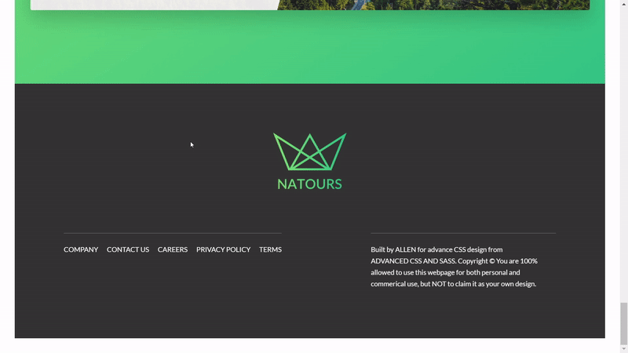

## Building the Navigation - Part 1
1. Learning targets
    1. What the "**checkbox hack**" is and how it works
    1. How to create custom animation timing functions using "**cubic bezier curves**"
    1. How to animate "**solid-color gradients**"
    1. How and why to use `transform-origin`
    1. In general: create an amazinly creative effect
1. Features of the navigation button
    1. The navigation is a floating button stayed on the top right corner and stay at where it is though the user scroll the page.
    1. When the user hovers it, the lines in the button will expand a bit
    1. When the user clicks it, it opens a navigation list which covers the whole viewport, and the symbol in the button changes from a burger (trigram) "☰" to "X".
    1. When the user hovers on any item of the list, the item get opposite color by default (background and font color). The animation effects slides in from the left.
1. In this case, we use similar hack that we did for the [customized radio buttons](#Building-the-Booking-Section---Part-3). However, we use a checkbox `<input type="checkbox">` for the trick. As long as the checkbox is checked, the menu is opened and expanded.
1. We firstly create the HTML elements on the very top of the document.
    ```html
    <div class="navigation">
        <input type="checkbox" class="navigation__checkbox" id="navi-toggle">
        <label for="navi-toggle" class="navigation__button">MENU</label>

        <div class="navigation__background">&nbsp;</div>

        <nav class="navigation__nav">
            <ul class="navigation__list">
                <li class="navigation__item"><a href="#" class="navigation__link"><span>01</span>About Natours</a></li>
                <li class="navigation__item"><a href="#" class="navigation__link"><span>02</span>Your benefits</a></li>
                <li class="navigation__item"><a href="#" class="navigation__link"><span>03</span>Popular tours</a></li>
                <li class="navigation__item"><a href="#" class="navigation__link"><span>04</span>Stories</a></li>
                <li class="navigation__item"><a href="#" class="navigation__link"><span>05</span>Book now</a></li>
            </ul>
        </nav>
    </div>
    ```
1. For the navigation button
    1. We hide the input tag with `display: none`. If we use JavaScript to check, we can know when the user clicks the button (label tag), the state of the input tag changes.
    1. In this case, we use [`radial-gradient`](https://www.w3schools.com/cssref/func_radial-gradient.asp) instead of `linear-gradient` to create the color gradient as backgound. Unlike `linear-gradient` that we can specify the direction of the color gradient, it starts color gradient from the center of the element to the edge of the figure.
    1. We use high value for `z-index` on both `.navigation__button` and `.navigation__background`, so the elements can overlay on other elements when the user scoll the page.
        ```scss
        // layout/_navigation.scss
        .navigation {
            &__checkbox { // hide the <input type="checkbox">
                display: none;
            }

            &__button {
                background-color: $color-white;
                height: 7rem;
                width: 7rem;
                position: fixed;
                top: 6rem;
                right: 6rem;
                border-radius: 50%;
                z-index: 2000;
            }

            &__background { // background of the navigation panel
                height: 6rem;
                width: 6rem;
                border-radius: 50%;
                position: fixed;
                top: 6.5rem;
                right: 6.5rem;
                background-image: radial-gradient($color-primary-light, $color-primary-dark);
                z-index: 1000;
            }
        }
        ```
    1. When the user clicks the navigation button 
        1. Scale the background element `<div class="navigation__background">&nbsp;</div>` should be scaled to cover the whole viewport (note that the value to be scales here is a approximate number. If the monitor is very large, it may not be enough to cover the whole viewport). 
        1. The navigation panel should occupy the whole viewport which can configured as `width: 100vw;` and `height: 100vh;`.
        1. We can give the navigation panel a `z-index` value between the background and the button.
        1. We use `position: absoltue`, `top: 50%`, `left: 50%` (it can also be `right: 50%`), and `transform: translate(-50%, -50%)` to center the wholte `ul` tag. Note that this `position` works because its container `<div class="navigation__nav">` has `position: fixed`.
            ```scss
            // layout/_navigation.scss
            .navigation {
                &__background {
                    transform: scale(80);
                }

                &__nav {
                    height: 100vh;
                    width: 100vw;
                    position: fixed;
                    top: 0;
                    left: 0;
                    z-index: 1500;
                }

                &__list {
                    position: absolute;
                    top: 50%;
                    left: 50%;
                    transform: translate(-50%, -50%);
                    list-style: none;
                    text-align: center;
                }

                &__item {
                    margin: 1rem;
                }
            }                
            ```
    1. Styling the items in the list
        1. We use `orangered` in this case to make the effect more obvious.
        1. For the opposite color effect, we can use `linear-gradient` with a given degree to rotate the color.
        1. We can change the value of `background-size` to have check the result of the effect. We then can use such feature with transition to have the color changing animation. 
        1. For example, we can have the `background-size: 250%` which is large enough to cover on each side of the color. 
            ```scss
            .navigation {
                &__link {
                    &:link,
                    &:visited {
                        font-size: 3rem;
                        font-weight: 300;
                        padding: 1rem 2rem;
                        color: $color-white;
                        text-decoration: none;
                        text-transform: uppercase;
                        background-image: linear-gradient(120deg, orangered 0%, orangered 50%, $color-white 50%);
                        background-size: 100%;
                    }
                }
            }
            ```
        1. `background-size: 100%`
            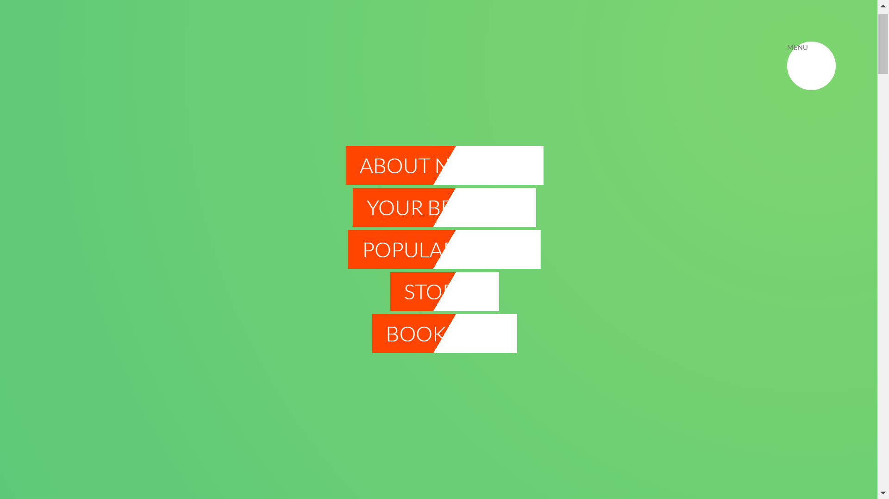
        1. `background-size: 175%`
            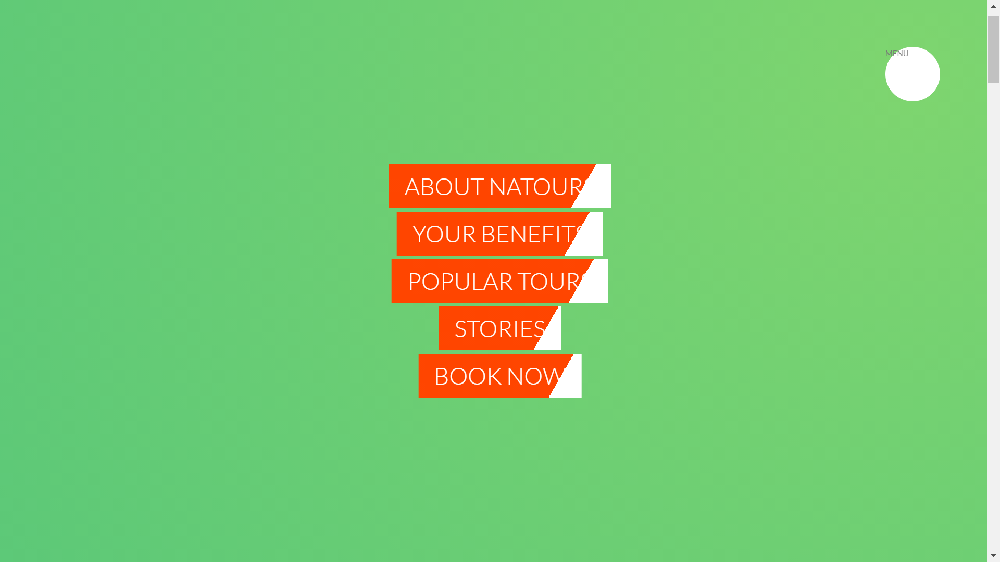
        1. `background-size: 250%`
            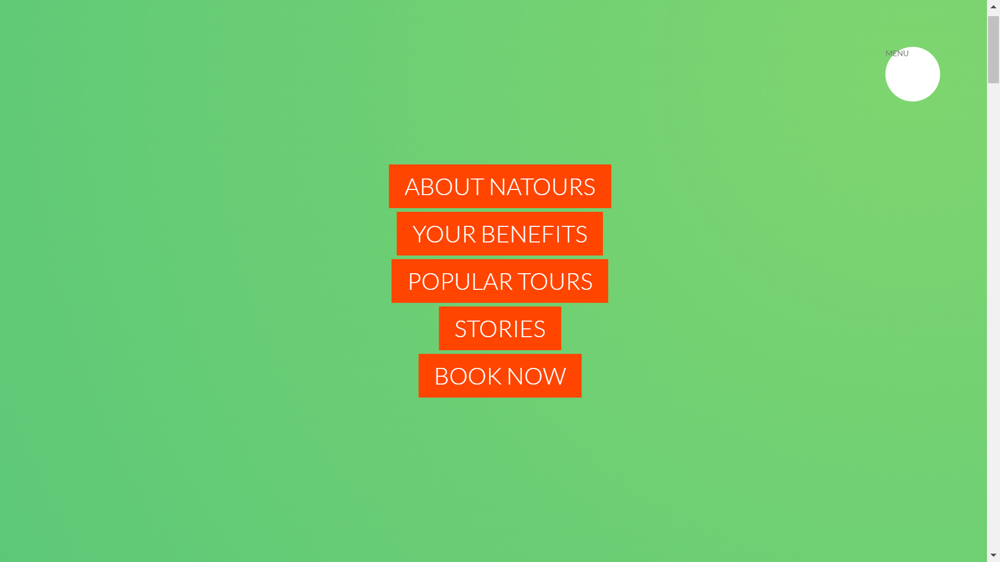
    1. When the user hovers on any of the items in the list. 
        1. We can use [`background-position`](https://www.w3schools.com/cssref/pr_background-position.asp) with percentage to shift the background color.
        1. Note that we can only makes `transform: translate()` works when the element is a `block` or `inline-block` element.
        1. As we have taken off the styling for `li` tags, we can add `span` and numbering the item. Note that `span` is `inline` elements that we can only add `margin` on both its left and right side when we turn it into `inline-block` or `block` element.
            ```scss
            // layout/_navigation.scss
            .navigation {
                &__link {
                    &:link,
                    &:visited {
                        display: inline-block;
                        font-size: 3rem;
                        font-weight: 300;
                        padding: 1rem 2rem;
                        color: $color-white;
                        text-decoration: none;
                        text-transform: uppercase;
                        background-image: linear-gradient(120deg, transparent 0%, transparent 50%, $color-white 50%);
                        background-size: 250%;
                        transition: all .4s;

                        span {
                            margin-right: 1rem;
                            display: inline-block;
                        }
                    }

                    &:hover,
                    &:active {
                        background-position: 100%;
                        color: $color-primary;
                        transform: translateX(1rem); // this works only when the element is inline-block or block
                    }
                }
            }
            ```
1. Final Scss
    ```scss
    // layout/_navigation.scss
    .navigation {
        &__checkbox {
            display: none;
        }

        &__button {
            background-color: $color-white;
            height: 7rem;
            width: 7rem;
            position: fixed;
            top: 6rem;
            right: 6rem;
            border-radius: 50%;
            z-index: 2000;
        }

        &__background {
            height: 6rem;
            width: 6rem;
            border-radius: 50%;
            position: fixed;
            top: 6.5rem;
            right: 6.5rem;
            background-image: radial-gradient($color-primary-light, $color-primary-dark);
            z-index: 1000;

            transform: scale(80);
        }

        &__nav {
            height: 100vh;
            width: 100vw;
            position: fixed;
            top: 0;
            left: 0;
            z-index: 1500;
        }

        &__list {
            position: absolute;
            top: 50%;
            left: 50%;
            transform: translate(-50%, -50%);
            list-style: none;
            text-align: center;
        }

        &__item {
            margin: 1rem;
        }

        &__link {
            &:link,
            &:visited {
                display: inline-block;
                font-size: 3rem;
                font-weight: 300;
                padding: 1rem 2rem;
                color: $color-white;
                text-decoration: none;
                text-transform: uppercase;
                background-image: linear-gradient(120deg, transparent 0%, transparent 50%, $color-white 50%);
                background-size: 250%;
                transition: all .4s;

                span {
                    margin-right: 1rem;
                    display: inline-block;
                }
            }

            &:hover,
            &:active {
                background-position: 100%;
                color: $color-primary;
                transform: translateX(1rem);
            }
        }
    }
    ```
    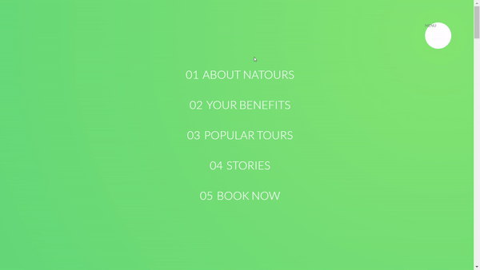

## Building the Navigation - Part 2
1. We will turn the navigation button into use in this section, so some of the previous Scss will be modified. Note that at this stage, we still let the navigation background image covers the whole viewport by default. 
1. Besides, we should hide the list by default. We can give `width: 0` and `opacity: 0` to hide the element. However, this solution has problem that its content still overflows the container, and the user can still see the mouse cursor changes when hovering to the left. Besides, users can click the links which can cause problems to user experience. To solve the problem, we can use `visiblity: hidden` or `overflow: hidden` or use both to solve this issue. However, if we use `visiblity: hidden`, we need to turn it back to `visible`.
1. There's [another solution](https://www.udemy.com/course/advanced-css-and-sass/learn/lecture/8274526#questions/12918320) given in the disucssion in the lecture.
    ```scss
    // layout/_navigation.scss
    .navigation{
        &__nav {
            opacity: 0;
            width: 0;
            visibility: hidden;
            overflow: hidden;
        }

        &__background {
            transform: scale(80); // this cause the background image covers the whole viewport
        }
    }
    ```
1. To allow the checkbox `input` works as a toggle button, we can use pseudo selector `:checked` to check the state of the element, and use general sibling selector `~` to select the nivgation panel and the background. 
1. We use `transition` to provide a smoother animation between states. However, we can see the background information animation extended from the top right corner. 
    ```scss
    .navigation {
        &__background{
            transition: transform .8s;
        }

        &__nav{
            transition: all .8s;
        }

        &__checkbox:checked ~ &__background {
            transform: scale(80);
        }

        &__checkbox:checked ~ &__nav {
            opacity: 1;
            width: 100%;
        }
    }
    ```
    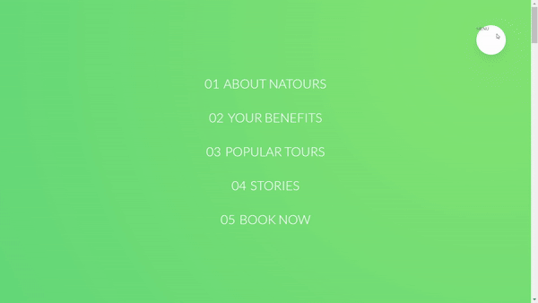
1. In addition, we can use [transition-timing-function: cubic-bezier](https://www.w3schools.com/cssref/func_cubic-bezier.asp). In addition we can use the following tools to fine the suitable values to configure.
    1. [https://cubic-bezier.com/](https://cubic-bezier.com/)
    1. [https://easings.net/](https://easings.net/)
1. We will use `easeInOutBack` which is `cubic-bezier(0.68, -0.6, 0.32, 1.6);` in this case. 
1. Final Scss
    ```scss
    // layout/_navigation.scss
    .navigation {
        &__checkbox {
            display: none;
        }

        &__button {
            background-color: $color-white;
            height: 7rem;
            width: 7rem;
            position: fixed;
            top: 6rem;
            right: 6rem;
            border-radius: 50%;
            z-index: 2000;
            box-shadow: 0 1rem 3rem rgba($color-black, .1);
        }

        &__background {
            height: 6rem;
            width: 6rem;
            border-radius: 50%;
            position: fixed;
            top: 6.5rem;
            right: 6.5rem;
            background-image: radial-gradient($color-primary-light, $color-primary-dark);
            z-index: 1000;
            transition: transform .8s cubic-bezier(0.68, -0.6, 0.32, 1.6);

            // transform: scale(80);
        }

        &__nav {
            height: 100vh;
            position: fixed;
            top: 0;
            left: 0;
            z-index: 1500;

            opacity: 0;
            overflow: hidden;
            width: 0;
            transition: all .8s;
        }

        &__list {
            position: absolute;
            top: 50%;
            left: 50%;
            transform: translate(-50%, -50%);
            list-style: none;
            text-align: center;
            width: 100%;
        }

        &__item {
            margin: 1rem;
        }

        &__link {
            &:link,
            &:visited {
                display: inline-block;
                font-size: 3rem;
                font-weight: 300;
                padding: 1rem 2rem;
                color: $color-white;
                text-decoration: none;
                text-transform: uppercase;
                background-image: linear-gradient(120deg, transparent 0%, transparent 50%, $color-white 50%);
                background-size: 250%;
                transition: all .4s;

                span {
                    margin-right: 1rem;
                    display: inline-block;
                }
            }

            &:hover,
            &:active {
                background-position: 100%;
                color: $color-primary;
                transform: translateX(1rem);
            }
        }

        &__checkbox:checked ~ &__background {
            transform: scale(80);
        }

        &__checkbox:checked ~ &__nav {
            opacity: 1;
            width: 100%;
        }
    }
    ```
    

## Building the Navigation - Part 3
1. To create the burger (trigram) "☰" symbol, we can use one `span` tag and use pseudo elements `::before` and `::after` to have three lines with one HTML element. We there for add a new `span` tag in the `label`. Besdies, we use HTML sybmol `&nbsp;` to leave a blank character.
    ```html
    <label for="navi-toggle" class="navigation__button">
        <span class="navigation__icon">&nbsp;</span>
    </label>
    ```
1. We can use the following styling to create the burger (trigram) "☰" symbol and the animation to turn the symbol into a "x" when the user clicks on it.
    ```scss
    .navigation {
        &__icon {
            position: relative;
            margin-top: 3.5rem;

            &,
            &::before,
            &::after {
                width: 3rem;
                height: 2px;
                background-color: $color-grey-dark-3;
                display: inline-block;
            }

            &::before,
            &::after {
                content: '';
                position: absolute;
                left: 0;
                transition: all .2s;
            }

            &::before { top: -.8rem; }
            &::after { top: .8rem; }
        }

        &__button:hover &__icon::before {
            top: -1rem;
        }

        &__button:hover &__icon::after {
            top: 1rem;
        }

        &__checkbox:checked + &__button &__icon {
            background-color: transparent;
        }

        &__checkbox:checked + &__button &__icon::before {
            top: 0;
            transform: rotate(135deg);
        }

        &__checkbox:checked + &__button &__icon::after {
            top: 0;
            transform: rotate(-135deg);
        }
    }
    ```
    

## Building a Pure CSS Popup - Part 1
1. Learning targets
    1. How to build a nice popup with only CSS
    1. How to use the `:target` pseudo-class
    1. How to create boxes with equeal height using `display: table-cell`
    1. How to create CSS text columns
    1. How to automatically hyphenate words using `hyphens`
1. HTML
    ```html
    <div class="popup">
        <div class="popup__content">
            <div class="popup__left">
                
                
            </div>
            <div class="popup__right">
                <h2 class="heading-secondary u-margin-bottom-small">Start booking now</h2>
                <h2 class="heading-tertiary u-margin-bottom-small">Important &ndash; Please read these terms before
                    booking</h2>
                <p class="popup__text">
                    Lorem ipsum dolor sit amet consectetur adipisicing elit. Itaque ipsa nobis inventore? Ullam id
                    repellendus nihil nulla debitis aperiam nobis modi, eaque libero adipisci praesentium ex minima
                    aliquid commodi doloribus provident facere at consequatur beatae dicta eos eius. Molestias, dolorum.
                    Modi beatae dicta quos quaerat pariatur nobis voluptatibus dignissimos doloremque!
                </p>
                <a href="#" class="btn btn--green">Book now</a>
            </div>
        </div>
    </div>
    ```
1. Styling the popup component
    1. We firstly give `height: 100vh`, `width: 100%` (or width: 100wh), `position: fixed` to extend and overlay the whole popup component on the viewport. Note that the navigation button has a very high `z-index`, so we can give a higher value in this case to overlay the all the elements.    
        ```scss
        // components/_popup.scss
        .popup {
            height: 100vh;
            width: 100%;
            position: fixed;
            top: 0;
            left: 0;
            background-color: rgba($color-black, 0.8);
            z-index: 9999;

            &__content {
                @include absCenter;
                width: 75%;
                box-shadow: 0 2rem 4rem rgba($color-black, .2);
                background-color: $color-white;
                border-radius: 3px;
                overflow: hidden; // to hide the corner of the overflow image
            }
        }
        ```
    1. Put the often used snippet `position: aboluste`, `top: 50%`, `left: 50%`, and `transform: translate(-50%, -50%)` as mixins `absCenter` in the `abstracts`.
        ```scss
        // abstracts/_mixins.scss
        @mixin absCenter {
            position: absolute;
            top: 50%;
            left: 50%;
            transform: translate(-50%, -50%);
        }
        ```
1. Separate the left and right popup
    1. We separate the left and right into 1/3 and 2/3 of the component.
    1. Though there are several ways to create containers in the same height, we can turn the element into a table-like item by `display: table` and its child elements with `display: table-cell`. By default, this will give the same height of each cell in the HTML table. 
    1. On the right side of the popup component, we can use `vertical-align: middle` to center the contents at the middle. Note that by giving any value such as `top` or `bottom` to `vertical-align`, HTML table will take off the white space to fit the contents and have 2 cells have the same height.
        ```scss
        // component/_popup.scss
        .popup {
            &__content {
                display: table;
            }

            &__left {
                width: 33.333333%;
                display: table-cell;
            }

            &__right {
                width: 66.666667%;
                display: table-cell;
                vertical-align: middle;
                padding: 3rem 5rem;
            }

            &__img {
                display: block;
                width: 100%;
            }
        }
        ```
1. Create columns
    1. We can use a modern CSS property [`column-count`](https://www.w3schools.com/cssref/css3_pr_column-count.asp) to create columns. This property can simply be used in a block element.
    1. Use `column-gap` to specify the space between each column and `column-rule` for styling the rule between each column.
        ```scss
        // component/_popup.scss
        .popup {           
            &__text {
                font-size: 1.4rem; // this turn 1em into 14px
                margin-bottom: 4rem;

                -moz-column-count: 2;
                -moz-column-gap: 4rem; 
                -moz-column-rule: 1px solid $color-grey-light-2;

                column-count: 2;
                column-gap: 4rem; //1em = 14px as in the same element
                column-rule: 1px solid $color-grey-light-2;

                -moz-hyphens: auto;
                -ms-hyphens: auto;
                -webkit-hyphens: auto;
                hyphens: auto;
            }
        }
        ```
1. Before breaking into columns
    
1. After breaking into columns
    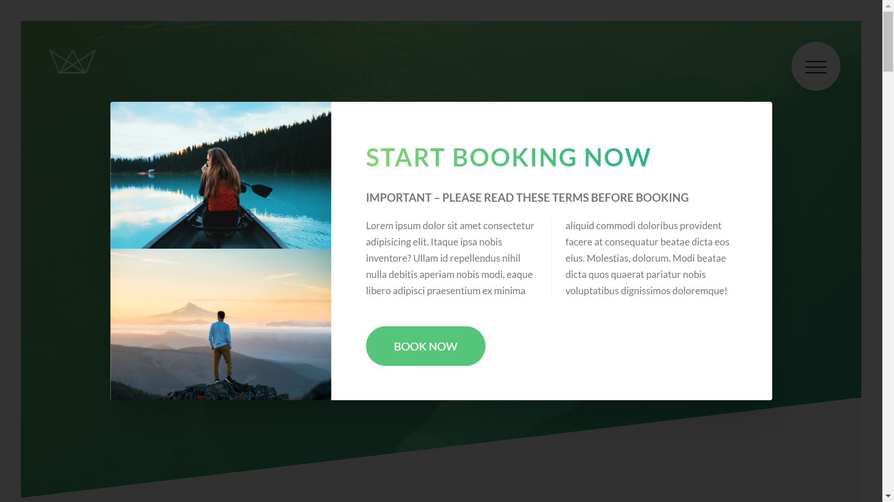

## Building a Pure CSS Popup - Part 2
1. Besides using `input` hack, we can use another feature "**anchor**" from HTML.
1. We can give `id` to an element, and user another achor tag `<a href="">` to point to the element by its `href` attribute. This works with [`:target`](https://www.w3schools.com/cssref/sel_target.asp) selector.
1. When URL in the browser search bar has a pound sign `#`, it means an element is "**targeted**".
1. We can set with an anchor tag `<a>` with its `href` attribute to target at certain element in the HTML. 
1. In this case, if the element with `id="popup"` is targeted when the user clicks on the link, it triggers the selector and change the CSS styling. Note that we haven't had solution to close the popup window yet. However, simply change the targeted element will change the state that the targeted element is changed from `popup` to something else.
    ```scss
    // component/_popup.scss
    .popup {
        opacity: 0;
        visibility: hidden;
        transition: all .3s;

        &:target {
            opacity: 1;
            visibility: visible;
        }
    }
    ```
1. We then update the HTML to have a close button when the `popup` shows up.
1. In this case, we set the close button targeted at the `section-tours` because this is where the user clicks and opens the `popup`, and when the targeted element changes, the `:target` selector doesn't work on `popup` component, so it will return back to its initial state which is `opacity: 0` and `visibility: hidden`.
1. We can use HTML symbol `&times;` which looks like a "X" and shows &times; in HTML or Markdown language.
    ```html
    <div class="popup__right">
        <a href="#section-tours" class="popup__close">&times;</a>
        <h2 class="heading-secondary u-margin-bottom-small">Start booking now</h2>
        <h2 class="heading-tertiary u-margin-bottom-small">Important &ndash; Please read these terms before
            booking</h2>
        <p class="popup__text">
            Lorem ipsum dolor sit amet consectetur adipisicing elit. Itaque ipsa nobis inventore? Ullam id
            repellendus nihil nulla debitis aperiam nobis modi, eaque libero adipisci praesentium ex minima
            aliquid commodi doloribus provident facere at consequatur beatae dicta eos eius. Molestias, dolorum.
            Modi beatae dicta quos quaerat pariatur nobis voluptatibus dignissimos doloremque!
        </p>
        <a href="#" class="btn btn--green">Book now</a>
    </div>
    ```
1. We then can decorate the anochor tag with the following CSS. We make the symbol &times; <span style="background: #55c57a; color: #000;">green</span> as <span style="background: #fff; color: #55c57a; font-weight: bold;">&times;</span>
    ```scss
    // component/_popup.scss
    .popup {
        &__close {
            &:link,
            &:visited {
                color: $color-grey-dark;
                position: absolute;
                top: 2.5rem;
                right: 2.5rem;
                font-size: 3rem;
                text-decoration: none;
                display: inline-block;
                transition: all .2s;
                line-height: 1;
            }

            &:hover {
                color: $color-primary;
            }
        }
    }
    ```
1. Popup animation
    1. This part makes the animation to zoom out the `popup` component from the center of the page to cover the whole page.
    1. Note that we need to specify `transform: translate(-50%, 50%)` again because a selector can only have one `transform` property working. By giving the 2nd `transform` the 1st `transform` will be overwritten.
    1. We should not only show the `popup` component, but the `.popup__content` child. We only turns `opacity` to `0` because we have given `visibility: hidden` on the whole `popup` component. 
    1. By using `:target` pseduo selector, the decoration only works on elements have `.popup` class. When the target changes (target after `#` in URL on search bar) the decoration will change back to initial state.
    ```scss
    // component/_popup.scss
    .popup {
        &__conent {
            @include absCenter
            // initial state of the popup component
            opacity: 0;
            transform: translate(-50%, -50%) scale(.25); // zoom in to the center
            transition: all .4s .2s;
            // we don't need visibility: hidden as the div.popup has been visibility: hidden
        }

        &:target {
            opacity: 1;
            visibility: visible;
        }

        &:target &__content {
            opacity: 1;
            transform: translate(-50%, -50%) scale(1); // zoom out
        }
    }
    ```
1. Final HTML
    ```html
    <div class="popup" id="popup">
        <div class="popup__content">
            <div class="popup__left">
                
                
            </div>
            <div class="popup__right">
                <a href="#section-tours" class="popup__close">&times;</a>
                <h2 class="heading-secondary u-margin-bottom-small">Start booking now</h2>
                <h2 class="heading-tertiary u-margin-bottom-small">Important &ndash; Please read these terms before
                    booking</h2>
                <p class="popup__text">
                    Lorem ipsum dolor sit amet consectetur adipisicing elit. Itaque ipsa nobis inventore? Ullam id
                    repellendus nihil nulla debitis aperiam nobis modi, eaque libero adipisci praesentium ex minima
                    aliquid commodi doloribus provident facere at consequatur beatae dicta eos eius. Molestias, dolorum.
                    Modi beatae dicta quos quaerat pariatur nobis voluptatibus dignissimos doloremque!
                </p>
                <a href="#" class="btn btn--green">Book now</a>
            </div>
        </div>
    </div>
    ```
1. Final Scss
    ```scss
    // component/_popup.scss
    .popup {
        height: 100vh;
        width: 100%;
        position: fixed;
        top: 0;
        left: 0;
        background-color: rgba($color-black, 0.8);
        z-index: 9999;
        opacity: 0;
        visibility: hidden;
        transition: all .3s;  
    
        &__content {
            @include absCenter;

            width: 75%;
            box-shadow: 0 2rem 4rem rgba($color-black, .2);
            background-color: $color-white;
            border-radius: 3px;
            display: table;
            overflow: hidden;
            opacity: 0;
            transform: translate(-50%, -50%) scale(.25);
            transition: all .4s .2s;
        }

        &__left {
            width: 33.333333%;
            display: table-cell;
        }

        &__right {
            width: 66.666667%;
            display: table-cell;
            vertical-align: middle;
            padding: 3rem 5rem;
        }

        &__img {
            display: block;
            width: 100%;
        }

        &__text {
            font-size: 1.4rem; // this turn 1em into 14px
            margin-bottom: 4rem;

            -moz-column-count: 2;
            -moz-column-gap: 4rem; 
            -moz-column-rule: 1px solid $color-grey-light-2;

            column-count: 2;
            column-gap: 4rem; //1em = 14px as in the same element
            column-rule: 1px solid $color-grey-light-2;

            -moz-hyphens: auto;
            -ms-hyphens: auto;
            -webkit-hyphens: auto;
            hyphens: auto;
        }

        &:target {
            opacity: 1;
            visibility: visible;
        }

        &:target &__content {
            opacity: 1;
            transform: translate(-50%, -50%) scale(1);
        }

        &__close {
            &:link,
            &:visited {
                color: $color-grey-dark;
                position: absolute;
                top: 2.5rem;
                right: 2.5rem;
                font-size: 3rem;
                text-decoration: none;
                display: inline-block;
                transition: all .2s;
                line-height: 1;
            }

            &:hover {
                color: $color-primary;
            }
        }
    }
    ```
    
1. [Project Link](https://wonderful-goldwasser-8b2175.netlify.app/irresponsive_natours/index.html)


# Natours Project - Advanced Responsive Design (Part 3)
## Mobile-First vs Desktop-First and Berakpoints
1. Responsive design strategies
    1. Desktop-first
        1. Start writing CSS for the desktop: large screen.
        1. Then, media queries shrink design to smaller screens
    1. Mobile-first
        1. Start writing CSS for mobile devices: small screen
        1. Then, media queries expand design to a large desktop screen
        1. Forces us to reduce websites and apps to the absolute essentials
1. Media queries don't add any importance or specificity to selectors, so code order matters - media queries at the end
1. For **Desktop-first**, we can use `max-width` in media query that if the viewport width is **_less_** than the given media query, the styling code in the media query will apply. 
1. For **Mobile-first**, we can use `min-width` in media query that if the viewport width is **_larger_** than the given media query, the styling code in the media query will apply. 
    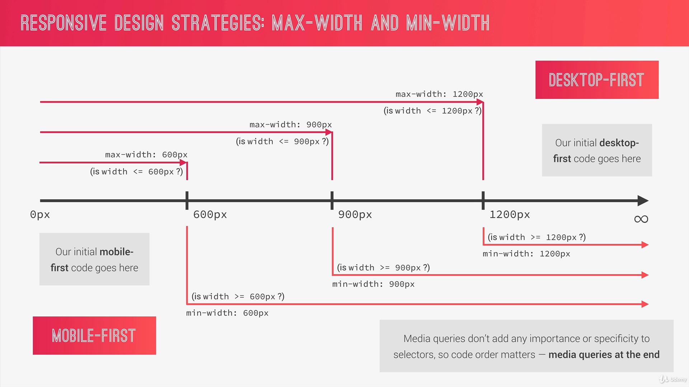
1. Pros of mobile-first design
    1. 100% optimized for the mobile experience
    1. Reduces websites and apps to the absolute essentials
    1. Results in smaller, faster and more effcienct products
    1. Prioritizes content over aesthetic design, which may be desirable
1. Cos of mobile-first design
    1. The desktop version might feel overly empty and simplistic
    1. More difficult and counterintuitive to develop
    1. Less creative freedom, making it more difficult to create distictive products
    1. Clients are used to see a desktpo version of the site as a prototype
    1. Do your users even use the mobile internet? What's the purpose of your website?
1. No matter what you do, alaways keep both desktop and mobile in mind
1. The options of the breakpoints
    1. BAD
        1. Using the width of certain devicse as the breakpoint, such as iPhone and iPad
        1. Each generation of devices may have different size and resolution
        1. This approach can cause problems for maintainence in the future 
    1. GOOD
        1. Group several similar devices such as mobile phones, tablets, laptop
        1. This consider devices has similar size and resolution can show similar results of the website
    1. PERFECT
        1. Design breaks which is totall according to the design pattern and consider little on the devices running the website
        1. It can be very hard to execute this approach
1. We can check the statistics from [https://gs.statcounter.com/screen-resolution-stats](https://gs.statcounter.com/screen-resolution-stats).
    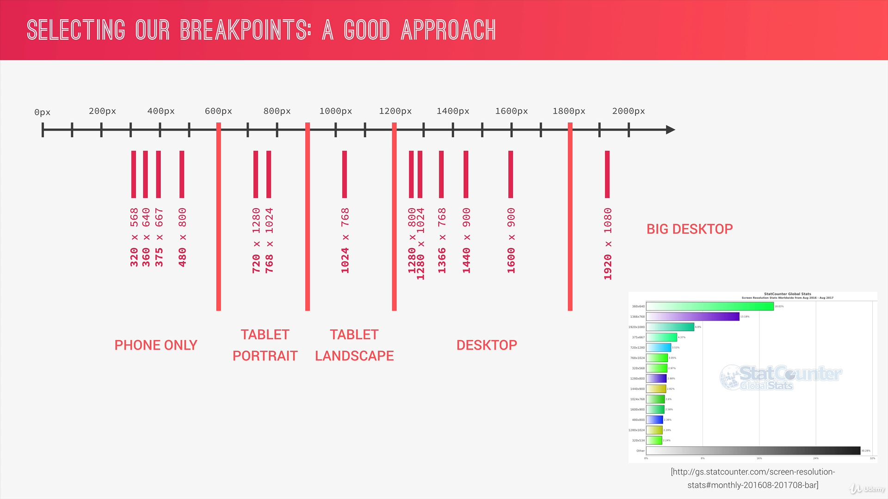

## Let's Use the Power of Sass Mixins to Write Media Queries
1. Learning targets
    1. How to use a powerful Sass mixin to write all our media queries
    1. Hwo to use the `@content` and `@if` Sass directives
    1. Taking advantage of Chrome DevTools for responsive design
1. With Sass, we can write the media query directly in the selector as other nested ones using ampersand `&`. The code will be compiled and have its own selector as regular CSS.
1. We can create a new `mixin` which holds the desirable device width for the media query, so in the future if we need to modify the device width, we can change in the mixin directly.
1. `mixin` can not only take arguments but take entire code block by usign [`@content`](https://sass-lang.com/documentation/at-rules/mixin#content-blocks). Therefore, we can `@include` the mixin and write the code inside directly.
    ```scss
    // abstracts/_mixins.scss
    // MEDIA QUERY MANAGER
    /*
    0 - 600px: Phone
    600 - 900px: Tablet portrait
    900 - 1200px: Tablet landscape
    [1200-1800] is where our normal styles apply
    1800px + : Big desktop
    */

    @mixin respond-phone {
        @media (max-width: 600px) { @content };
    }    
    ```
1. In the `base`, we can use the mixin to modify the font of the whole website.
    ```scss
    // base/_base.scss
    html {
        // This defines what 1rem is
        font-size: 62.5%;

        @include respond-phone {
            font-size: 50%;
        }
    }
    ```
1. However, by the previous approach, we still need to specify all the desirable or possible devices width for `media-queries` one by one.
1. We can create a "**media-query**" manager by `@if`. This feature can make Sass programming-like to decide which media query to apply. 
1. According to [this article - https://zellwk.com/blog/media-query-units/](https://zellwk.com/blog/media-query-units/), we can see that using `px` based media query may have funny and buggy results. This is suggested from the lecture as well that we can use `em` (not `rem`!) based media queries. 
    ```scss
    // abstracts/_mixins.scss
    /*
    - phone
    - tab-port
    - tab-land
    - big-desktop

    1em = 16px
    */

    @mixin respond($breakpoint) {
        @if $breakpoint == phone {
            @media (max-width: 37.5em) { @content }; // 600px
        }
        @if $breakpoint == tab-port {
            @media (max-width: 56.25em) { @content }; // 900 px
        }
        @if $breakpoint == tab-land {
            @media (max-width: 75em) { @content }; // 1200px
        }
        @if $breakpoint == big-desktop {
            @media (min-width: 112.5em) { @content }; // 1800px
        }
    }
    ```
1. It's import to follow the cascading behavior as media queries have no specificity on importance. That means only the code order in the file matters that the browser can decide which code of styling will be applied to the elements. 
1. With Desktop-first approach (using `max-width`), we can start with the big size media query.
1. Note that we use the same `font-size` for `tab-port` and `phone` in this case, so we take `@include respond(phone)` off, as it's considered duplicate.
    ```scss
    // base/_base.scss
    html {
        // This defines what 1rem is
        font-size: 62.5%; // 1rem = 10px; 10px/16px = 62.5%
        
        @include respond(tab-land) { // width < 1200?
            font-size: 56.25%; // 1rem = 9px, 9/16=56.25%
        }

        @include respond(tab-port) { // width < 900?
            font-size: 50%; // 1rem = 8px, 8/16=50%
        }

        /*
        @include respond(phone)) { // width < 600?
            font-size: 50%; // 1rem = 8px, 8/16=50%
        }
        */

        @include respond(big-desktop) {
            font-size: 75%; // 1rem = 12px, 12/16=75%
        }
    }
    ```

## Writing Media Queries - Base, Typography and Layout
1. ORDER: base + typography > general layout + grid > page layout > components
1. We take out the padding when the viewport width is less than `900px`. Besides, we move the `padding: 3rem` from `_typography.scss` to `_base.scss` in `body` selector.
    ```scss
    // base/_base.scss
    body {
        padding: 3rem;

        @include respond(tab-port) { // width < 900?
            padding: 0;
        }
    }
    ```
1. We adds media queries that we have done in the last section.
    ```scss
    // base/_typography.scss
    .heading-primary {
        &--main {
            @include respond(phone) {
                letter-spacing: 1rem;
                font-family: 5rem;
            }            
        }

        &--sub {
            @include respond(phone) {
                letter-spacing: 1rem;
            }
        }

        .heading-secondary {
            @include respond(tab-port) {
                font-size: 3rem;
            }
            @include respond(phone) {
                font-size: 2.5rem;
            }
        }
    }
    ```
1. We modify the styling on the grid, as when the viewport becomes narrower, the number of columns in a row should change.
    1. We can modify the `max-width` to limit the maximum column width when the viewport width is less than `900px`.
    1. For each `row`, we reduce the `margin-bottom` from `8rem` to `6rem`.
    1. Since there's only a single column in the row, we can remove the `margin-right`.
    1. Have little padding on the edge to push the contents a bit inside the `row` contianer.
        ```scss
        // layout/_grid.scss
        .row {
            max-width: $grid-width;

            &:not(:last-child) {
                margin-bottom: $gutter-vertical;
                @include respond(tab-port) { // reduce the gap between each row
                    margin-bottom: $gutter-vertical-small;
                }
            }

            @include respond(tab-port) { // constrain the maximum width of a column 
                max-width: 50rem;
                padding: 0 3rem;
            }

            @include clearfix;

            [class^="col-"] {
                float: left;

                &:not(:last-child) {
                    margin-right: $gutter-horizontal;

                    @include respond(tab-port) { 
                        margin-right: 0; // remove margin-right because there's only single column
                        margin-bottom: $gutter-vertical-small; // add space between each column
                    }
                }

                @include respond(tab-port) {
                    width: 100% !important; // ensure the columns change to a single one
                }
            }
        }
        ```
1. We change the `clip-path` shape to make the tilt less when the screen becomes smaller.
    ```scss
    // layout/_header.scss
    .header {        
        @include resopnd(phone) {
            -webkit-clip-path: polygon(0 0, 100% 0, 100% 85vh, 0 100%);
            clip-path: polygon(0 0, 100% 0, 100% 85vh, 0 100%);
        }
    }
    ```
1. Change the location of the navigation button on the top right corner.
    ```scss
    // layout/_navigation.scss
    .navigation {
        &__button {
            top: 6rem;
            right: 6rem;

            @include respond(tab-port) {
                top: 4rem;
                right: 4rem;
            }

            @include respond(phone) {
                top: 3rem;
                right: 3rem;
            }
        }

        &__background {
            top: 6.5rem;
            right: 6.5rem;

            @include respond(tab-port) {
                top: 4.5rem;
                right: 4.5rem;
            }

            @include respond(phone) {
                top: 3.5rem;
                right: 3.5rem;
            }
        }
    }
    ```
1. Fix the footer and change the content into a single conlumn. 
    ```scss
    // layout/_footer.scss
    .footer {
        padding: 10rem;

        @include respond(tab-port) {
            padding: 8rem 0;
        }

        &__navigation {
            @include respond(tab-port) {
                width: 100%;
                text-align: center;
            }
        }

        &__copyright {
            width: 80%;
            float: right;
            
            @include respond(tab-port) {
                width: 100%;
                float: none;
            }
        }
    }
    ```
    

## Writing Media Queries - Layout, About and Features Sections
1. In footer, we give more `margin-bottom` to the image when the screen size is smaller.
    ```scss
    // layout/_footer.scss
    .footer {
        &__logo-box {
            margin-bottom: 8rem;

            @include respond(tab-port) {
                margin-bottom: 6rem;
            }
        }
    }
    ```
1. In the overall home layout, we can reduce the padding of each section, as the current there's too much white space between the items. 
1. In this case, we reduce `5rem` on the padding on each section. However, we haven't modified on the "**booking**" section yet.
    ```scss
    // pages/_home.scss
    .section-about {
        padding: 25rem 0;

        @include respond(tab-port) {
            padding: 20rem 0;
        }
    }

    .section-features {
        padding: 20rem 0;

        @include respond(tab-port) {
            padding: 15rem 0;
        }
    }

    .section-tours {
        padding: 25rem 0 15rem 0;

        @include respond(tab-port) {
            padding: 20rem 0 10rem 0;
        }
    }

    .section-stories {
        padding: 15rem 0;

        @include respond(tab-port) {
            padding: 10rem 0;
        }
    }

    .section-book {
        padding: 15rem 0;

        @include respond(tab-port) {
            padding: 10rem 0;
        }
    }
    ```
1. Though we are using utilities such as `u-margin-bottom-small` to have space on HTML element, we can use media queries on these utilities as well. 
    ```scss
    // base/_utilities.scss
    .u-margin-bottom-medium {
        margin-bottom: 4rem !important; 

        @include respond(tab-port) {
            margin-bottom: 3rem !important;;
        }
    }

    .u-margin-bottom-big {
        margin-bottom: 8rem !important; 

        @include respond(tab-port) {
            margin-bottom: 5rem !important;;
        }
    }
    ```
1. We then start to modify the image `composition`.
1. In the large screen size, the images are floated on the right, so the section as 2 columns side by side. 
1. For smaller screens, we'd like to have it in a row.
1. We can different scales and position on the images.
    ```scss
    // components/_compositions.scss
    .composition {
        &__photo {
            width: 55%;
            box-shadow: 0 1.5rem 4rem rgba($color-black, .4);
            position: absolute;

            @include respond(tab-port) {
                float: left;
                position: relative;
                width: 33.3333333%;
                box-shadow: 0 1.5rem 3rem rgba($color-black, .2);
            }

            &--p1 {
                left: 0;
                top: -2rem;

                @include respond(tab-port) {
                    top: 0;
                    transform: scale(1.2);
                }
            }

            &--p2 {
                right: 0;
                top: 2rem;

                @include respond(tab-port) {
                    top: -1rem;
                    transform: scale(1.3);
                    z-index: 100;
                }
            }

            &--p3 {
                left: 20%;
                top: 10rem;

                @include respond(tab-port) {
                    top: 1rem;
                    left: 0;
                    transform: scale(1.1);
                }
            }
        }
    }
    ```
1. For the "feature-box" section, we have small adjustment 
    ```scss
    // components/_feature-box.scss
    .feature-box {
        padding: 2.5rem;

        @include respond (tab-port) {
            padding: 2rem;
        }

        &__icon {
            margin-bottom: .5rem;

            @include respond (tab-port) {
                margin-bottom: 0rem;
            }
        }
    }
    ```
1. We still find the white space created by `padding` is too large for the section, so we modify it in the home layout. 
    ```scss
    // pages/_home.scss
    .section-features {
        padding: 20rem 0;

        @include respond(tab-port) {
            padding: 10rem 0;
        }
    }
    ```

## Writing Media Queries - Tours, Stories, and Booking Sections
1. On touch screens, the user can't hover on the flipping card to trigger the effect, while the user can only click on the element to flip the card. 
1. In this case, we will rewrite the styling on `card` component when the device screen size is narrow. Since we are going to rewrite, we start a whole new chuck in `_card.scss`. The idea is to simply copy all the styling and take those out if we don't need to use. 
1. The final `card` component has only one side and the back side is pushed down to the bottom of the list of items. We then change the `padding` for adjust the layout.
1. We then use `clip-path` to create a shape which looks like the header.
1. Besides, the `shadow-box` effect should work on both the front and back side elements, and we can give white background to the back element.
    ```scss
    // components/_card.scss
    .card {
        @include respond(tab-port) {
            height: auto;
            border-radius: 3px; // this should work on the whole card rather than only the front 
            background-color: $color-white; 
            box-shadow: 0 1.5rem 4rem rgba($color-black, .15); // give box-shadow to whole card component

            &__side {        
                height: auto;            
                position: relative; // the card has only one side
                box-shadow: none; // cancel the box-shadow given from regular styling code
                
                &--back {            
                    transform: rotateY(0);
                    clip-path: polygon(0 15%, 100% 0, 100% 100%, 0 100%); // create the header-like shape
                }
            }

            &:hover &__side--front {
                transform: rotateY(0);
            }

            &__details {
                padding: 1rem 3rem;
            }
            
            // FRONT SIDE STYLING
            &__cta {
                position: relative;
                top: 0%;
                left: 0%;
                transform: translate(0);
                width: 100%;
                padding: 7rem 4rem 4rem 4rem;
            }

            &__price-box{            
                margin-bottom: 3rem;
            }

            &__price-value {
                font-size: 6rem;            
            }
        }
    }
    ```
1. After styling the `card` components, we can work with `story` components.
1. We basically turn off all the `skew` effects when the screen is in phone size.
    ```scss
    // components/_story.scss    
    .story {
        width: 75%;
        padding: 6rem;
        padding-left: 9rem;        
        transform: skewX(-12deg);

        @include respond(tab-port) {
            width: 100%;
            padding: 4rem;
            padding-left: 7rem;
        }

        @include respond(phone) {
            transform: skewX(0);
        }

        &__shape {            
            transform: translateX(-3rem) skewX(12deg);            

            @include respond(phone) {
                transform: translateX(-3rem) skewX(0);
            }
        }
        &__text {
            transform: skewX(12deg);

            @include respond(phone) {
                transform: skewX(0);
            }
        }
    }
    ```
1. After configuring `_story.scss`, we work with the home layout, which we didn't work with at the first place.
1. The elements starts to get weird since `tablet-landscape` width. Besides, we have the white filter cover the whole background image after `tablet-portrait` as the width is too narrow to show the regular styling.
    ```scss
    // pages/_home.scss
    .book {
        background-image: linear-gradient(105deg, 
            rgba($color-white, .9) 0%, 
            rgba($color-white, .9) 50%, 
            transparent 50%), 
            url(../img/nat-10.jpg);
        background-size: 100%;
        border-radius: 3px;
        box-shadow: 0 1.5rem 4rem rgba($color-black, .2);

        @include respond(tab-land) { // let the background image covers the whole background rather than repeating itself
            background-image: linear-gradient(105deg, 
                rgba($color-white, .9) 0%, 
                rgba($color-white, .9) 65%, 
                transparent 65%), 
                url(../img/nat-10.jpg);
            background-size: cover;
        }

        @include respond(tab-port) { // let the white filter covers the whole background image
            background-image: linear-gradient(105deg, 
                rgba($color-white, .9) 0%, 
                rgba($color-white, .9) 100%),            
                url(../img/nat-10.jpg);
        }

        &__form {
            width: 50%;
            padding: 6rem;

            @include respond(tab-land) {
                width: 65%;
            }

            @include respond(tab-port) {
                width: 100%; // occupy the whole width
            }
        }
    }
    ```
1. After fixing the booking layout, we can modify the inner component "radio buttons".
    ```scss
    // components/_form.scss
    .form {        
        &__input {            
            width: 90%;            

            @include respond(tab-port) {
                width: 100%;            
            }
        }
            
        &__radio-group {
            width: 45%;            

            @include respond(tab-port) {
                width: 100%;
                margin-bottom: 2rem;
            }
        }
    }
    ```

## An Overview of Responsive Images
1. The goal of responsive images is to serve the right image to the right screen size and device, in order to avoid downloading unnecessary large images on smaller screens.
    1. Resolution switching (Decrease image resolution on smaller screen)
    1. Density switching (Half the image resolution on @1x screen)
    1. Art direction (Different image on smaller screen)    
        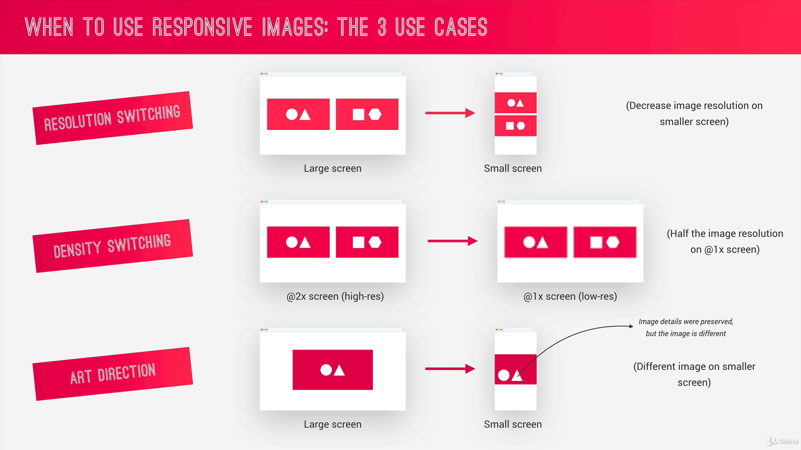

## Responsive Images in HTML - Art Direction and Density Switching
1. Learning targets
    1. How to use the `srcset` attribute on the `` and `<source>` elements, together with density descriptors.
    1. How and why to use the `picture` element for art direction.
    1. How to write media queries in HTML.
1. For density switching, we can use `srcset` attribute to let the browser decide which source of image to use.
    ```html
    <footer class="footer">
        <div class="footer__logo-box">
            
        </div>
    </footer>
    ```
1. For art direction, if we'd like to use media query in HTML, we can use [`picture`](https://www.w3schools.com/tags/tag_picture.asp) tag. In this case, the browser will look up to the medai query and decide which image to render on the page.
    1. The `<picture>` tag gives web developers more flexibility in specifying image resources.
    1. The most common use of the `<picture>` element will be for art direction in responsive designs. Instead of having one image that is scaled up or down based on the viewport width, multiple images can be designed to more nicely fill the browser viewport.
    1. The `<picture>` element contains two tags: one or more `<source>` tags and one `` tag.
    1. The browser will look for the first `<source>` element where the media query matches the current viewport width, and then it will display the proper image (specified in the srcset attribute). The `` element is required as the last child of the `<picture>` element, as a fallback option if none of the source tags matches.
        ```html
        <footer class="footer">
            <div class="footer__logo-box">

                <picture class="footer__logo">
                    <source srcset="img/logo-green-small-1x.png 1x, img/logo-green-small-2x.png 2x" media="(max-width: 37.5em)">
                    
                </picture>
                
            </div>
        </footer>
        ```

## Responsive Images in HTML - Desity and Resolution Switching
1. Learning target - How to allow the browser to decide the best image to download, using the `srcset` attribute, width descriptors, and the `sizes` attribute of the `` element.
1. In the browser DevTool, we can check the option of "**add device pixel ratio**" and change the resolution of the page to perform [resolution switching](https://developer.mozilla.org/en-US/docs/Learn/HTML/Multimedia_and_embedding/Responsive_images#resolution_switching_different_sizes).
    1. HTML using `1x` for low resolution
        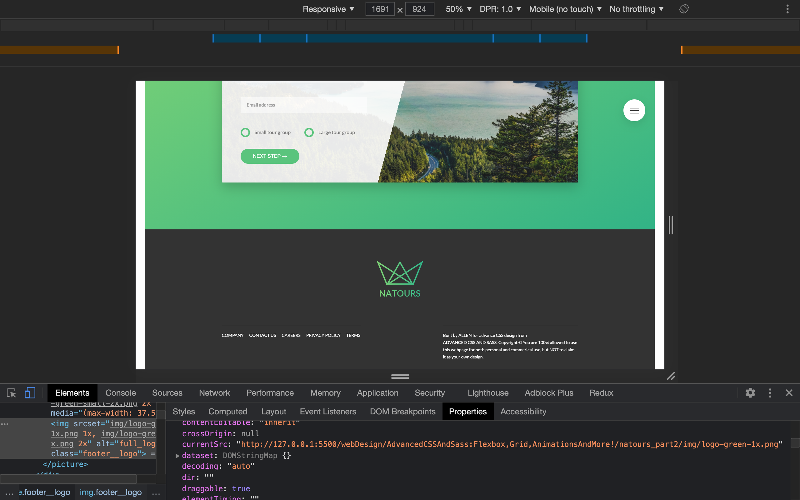
    1. HTML using `2x` for high resolution
        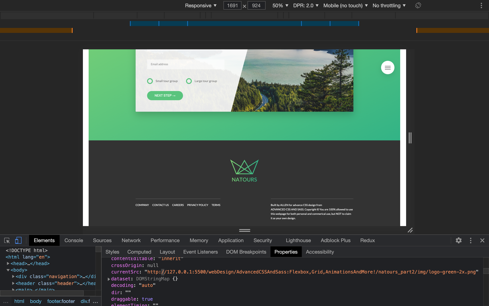
1. In this case, we'd like to update the image composition for different resolution.
    1. In the ``, we specify the image size by giving its actual width which is `300w` for small size and `1000w` for large size. Note that though the unit is in `w`, it's actually "**pixel**".
    1. We then add the breakpoints in `sizes` attribute to indicate to the HTML file that which image to render. Besides, we can give the default size as an option, which is `300xp` in this case. 
    1. We get `20vw` and `30vw` from the percentage of the actual width that we want to have. For example, the actual size in certain viewport is `176px` which is almost 20% of the size we want. Therefore, we use `20vw` for the case. 
    1. We use `src` attribute for another source in case that the browser doesn't support the feature. 
        ```html
        <main>
            <section class="section-about">            
                <div class="row">                
                    <div class="col-1-of-2">
                        <div class="composition">

                            
                                
                            

                            
                            
                            <!-- 
                            
                             -->
                        </div>
                    </div>
                </div>
            </section>
        </main>
        ```
1. We can do the same trick for the `footer`. 
    ```html
    <footer class="footer">
        <div class="footer__logo-box">
            <picture class="footer__logo">
                <source srcset="img/logo-green-small-1x.png 1x, img/logo-green-small-2x.png 2x" media="(max-width: 37.5em)">
                
            </picture>            
        </div>        
    </footer>
    ```

## Responsive Images in CSS
1. Learning targets 
    1. How to implement responsive images in CSS
    1. How to use resolution media queries to target high-resolution screens with `2x`
    1. How to combine multiple conditions in media queries
1. The target of this sections is to make the background image of each section responsive.
    1. If the resolution is higher than `192dpi`, which is the resolution of Apple retina devices.
    1. For smaller devices the density is usually 2x and the width is less than 600px.
    1. As density is 2x and largest breakpoint can be up to 600px, the resolution on the image can be rendered is 1200px (2 * 600).
    1. Thus, it doesn't make sense that to load image larger than 1200px on small devices.
    1. Therefore, we can add another media query for the viewport width.
    1. On the other hand, for large screen with low resolution, we can have another media query to handle the device.
    1. This also works on devices with high resolution.
    1. In the media query, we can give multiple conditions and separate by comma. 
    1. We can conver the `px` unit into `em`, which is `(600px / 16px) = 37.5em` and `(2000px / 16px) = 125em`.
        ```scss
        // layout/_header.scss
        .header {
            @media (min-resolution: 192dpi and (min-width: 37.5em)), (min-width: 125em) { 
                background-image: linear-gradient(
                    to right bottom,
                    rgba($color-secondary-light, 0.8), 
                    rgba($color-secondary-dark, 0.8)), 
                    url(../img/hero.jpg);
            }

            @include respond(phone) {
                -webkit-clip-path: polygon(0 0, 100% 0, 100% 85vh, 0 100%);
                clip-path: polygon(0 0, 100% 0, 100% 85vh, 0 100%);
            }
        }
        ```
1. We not only change the unit in CSS but also the unit in media query in HTML. The default size is `16xp`, so we divide every media query by the number to turn the unit into `em`. 
    1. 600px / 16px = 37.5em
    1. 900px / 16px = 56.25em
        ```html
        <main>
            <section class="section-about">
                <div class="row">
                    <div class="col-1-of-2">
                        <div class="composition">
                            

                            

                            
                        </div>
                    </div>
                </div>
            </section>
        </main>
        ```

## Testing for Browsers Support with @supports
1. For some modern CSS properties, we can use [https://caniuse.com/](https://caniuse.com/) to check if a browser supports certain property we'd like to use.
1. Learning target
    1. How to use `@supports` feature queries
    1. Implement gracefull degradation on selected properties
    1. How to use `backdrop-filter`
1. We can use `backdrop-filter` and `-webkit-backdrop-filter` with `blur()` to create a blurry filter which effects to the background. 
1. However, if some browser don't support the feature, we can use `@support` to check if the properties work. If the property does work, it will apply the styling in the code block. 
    ```scss
    // components/_popup.scss
    .popup {
        background-color: rgba($color-black, .8);

        @supports(-webkit-backdrop-filter: blue(10px)) or (backdrop-filter: blur(10px)) {
            // this only works if the browser supports
            -webkit-backdrop-filter: blur(10px);
            backdrop-filter: blur(10px);
            background-color: rgba($color-black, .3);
        }
    }
    ```
1. We have other fixes in the other components as well. 
    1. Card component
        ```scss
        // component/_card.scss
        .card {
            &__side {        
                -webkit-backface-visibility: hidden; // this works for safari
                backface-visibility: hidden; // hide the other side when the card is flipped
            }
        }
        ```
    1. Header Layout. 
        1. `min-resolution` doesn't work on Safari browser, so we need another property `-webkit-min-device-pixel-ratio` to check for Safari device.
        1. `clip-path` wouldn't work in Firefox browser, so we can also check with `@supports`.
            ```scss
            // layout/_header.scss
            .header {
                height: 85vh;
                background-image: linear-gradient(
                    to right bottom,
                    rgba($color-primary-light, 0.8), 
                    rgba($color-primary-dark, 0.8)), 
                    url(../img/hero-small.jpg);
                background-size: cover;
                background-position: top;
                position: relative;

                @supports (clip-path: polygon(0 0)) or (-webkit-clip-path: polygon(0 0)) {
                    -webkit-clip-path: polygon(0 0, 100% 0, 100% 75vh, 0 100%);
                    clip-path: polygon(0 0, 100% 0, 100% 75vh, 0 100%);
                    height: 95vh;
                }

                @media (min-resolution: 192dpi and (min-width: 37.5em)),
                    (-webkit-min-device-pixel-ratio: 2) and (min-width: 37.5em), // this ensure the media query works on Safari
                    (min-width: 125em) { 
                    // some browser may not support this media query
                    background-image: linear-gradient(
                        to right bottom,
                        rgba($color-primary-light, 0.8), 
                        rgba($color-primary-dark, 0.8)), 
                        url(../img/hero.jpg);
                }
            }
            ```
    1. Story component. `shape-outside` and `clip-path` wouldn't work in some browsers as well, so we can use `@supports` to check. If it's not working, we can use `border-radius` to create similar styling to the element. Besides, we need to turn `border-radius` off, if `shape-radius` is working.
        ```scss
        // component/_story.scss
        .story {
            &__shape {
                width: 15rem;
                height: 15rem;
                float: left;
                transform: translateX(-3rem) skewX(12deg);
                position: relative;
                overflow: hidden;
                border-radius: 50%;

                @supports (clip-path: polygon(0 0)) or (-webkit-clip-path: polygon(0 0)) {
                    -webkit-clip-path: circle(50% at 50% 50%);
                    clip-path: circle(50% at 50% 50%);
                    // shape-outside only works if the element has width and height and float: left or float: right
                    -webkit-shape-outside: circle(50% at 50% 50%);
                    // shape-outside is only to make the element around to wrap the shape
                    shape-outside: circle(50% at 50% 50%);
                    border-radius: none;
                }

                @include respond(phone) {
                    transform: translateX(-3rem) skewX(0);
                }
            }
        }
        ```

## Setting up a Simple Build Process with NPM Scripts
1. A build process. We'd like to concate the `icon-font.css` to our CSS file.
    1. Compliation
    1. Concatenation
    1. Prefixing
    1. Compressing
        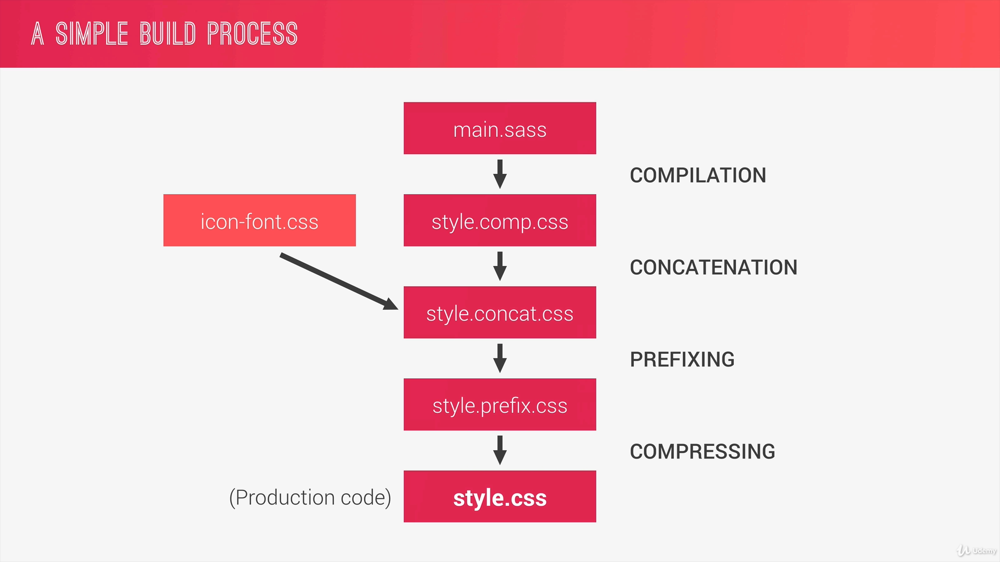
1. We can configure the build process in `package.json` for both development and production.
    1. For "**build**" process, we use `concat`, `postcss-cli`, `autoprefixer`, and `npm-run-all` npm packages
        1. We use `node-sass` to compile the Sass file to CSS.
        1. `concat` is used to concatenate CSS files.
        1. [`postcss-cli`](https://www.npmjs.com/package/postcss-cli) and [autoprefixer](https://www.npmjs.com/package/autoprefixer) are used to add headers to support in different versions of browsers. We can also specify how many versions that we want to support.
        1. To compress the CSS file, we can get back to use [`node-sass`](https://www.npmjs.com/package/node-sass#command-line-interface) package. Note that we need to specify `--output-style compressed` to have compressed CSS file.
        1. After all the required files are ready, we can use `npm-run-all` package to run all the process at one command. Therefore, we can simply run `npm run build:css` in the terminal to get the final CSS file `style.css`.
            ```json
            {
                "scripts": {
                    "compile:sass": "node-sass sass/main.scss css/style.comp.css",
                    "concat:css": "concat -o css/style.concat.css css/icon-font.css css/style.comp.css",
                    "prefix:css": "postcss --use autoprefixer -b 'last 10 versions' css/style.concat.css -o css/style.prefix.css",
                    "compress:css": "node-sass css/style.prefix.css css/style.css --output-style compressed",
                    "build:css": "npm-run-all compile:sass concat:css prefix:css compress:css"
                }
            }
            ```
    1. For developing process, we can configure the "**script**" with `npm-run-all`. 
        1. We can run `npm run start` and specify `--parallel` to run both command at the same time. 
        1. Without specifying `--parallel`, the commands will be executed in the given order.
        1. Both commands are ingoing commands, so if we don't specify to run them at the same time, one command won't be executed.
            ```json
            {
                "scripts": {
                    "watch:sass": "node-sass sass/main.scss css/style.css -w",
                    "devserver": "live-server",
                    "start": "npm-run-all --parallel devserver watch:sass"
                }
            }
            ```
1. Final JSON. Note that on Linux and Mac system, we may need to install those devDependencies globally or the commands wouldn't work.
    ```json
    {
        "name": "natours",
        "version": "1.0.0",
        "description": "",
        "main": "index.js",
        "scripts": {
            "watch:sass": "node-sass sass/main.scss css/style.css -w",
            "devserver": "live-server",
            "start": "npm-run-all --parallel devserver watch:sass",
            "compile:sass": "node-sass sass/main.scss css/style.comp.css",
            "concat:css": "concat -o css/style.concat.css css/icon-font.css css/style.comp.css",
            "prefix:css": "postcss --use autoprefixer -b 'last 10 versions' css/style.concat.css -o css/style.prefix.css",
            "compress:css": "node-sass css/style.prefix.css css/style.css --output-style compressed",
            "build:css": "npm-run-all compile:sass concat:css prefix:css compress:css"
        },
        "keywords": [],
        "author": "",
        "license": "ISC",
        "devDependencies": {
            "autoprefixer": "^10.2.5",
            "concat": "^1.0.3",
            "node-sass": "^5.0.0",
            "npm-run-all": "^4.1.5",
            "postcss-cli": "^8.3.1"
        }
    }
    ```

## Wrapping up the Natours Project: Final Considerations
1. We can add some feature when users select the text on the screen, so we can change the selected effect from default blue color to whatever we want to fit the style.
    ```scss
    // base/_base.scss
    ::selection {
        background-color: $color-primary;
        color: $color_white;
    }
    ```
1. In `mixin` and other media queries, we'd like to specify that these media queries should only work on the screen, so it won't affect when we choose to print the website. This can be simply achieved by adding `only screen and` before the other conditions on media queries.
    ```scss
    // abstracts/_mixins.scss
    @mixin respond($breakpoint) {
        @if $breakpoint == phone {
            @media only screen and (max-width: 37.5em) { @content }; // 600px
        }
        @if $breakpoint == tab-port {
            @media only screen and (max-width: 56.25em) { @content }; // 900 px
        }
        @if $breakpoint == tab-land {
            @media only screen and (max-width: 75em) { @content }; // 1200px
        }
        @if $breakpoint == big-desktop {
            @media only screen and (min-width: 112.5em) { @content }; // 1800px
        }
    }
    ```
1. In order to make the webpage responsive, we should ensure the following `meta` tag is available in the `head` tag. 
    ```html
    <html>
        <head>
            <meta name="viewport" content="width=device-width, initial-scale=1.0">
        </head>
    </html>
    ```
1. For smaller or mobile devies, users seldom use `hover` effect on the elements. For example, the users wouldn't expect the `card` component can be fliped when they clip or hover on it. Besides, it's not easy for touch devices to "**hover**" on the elements.
    1. Since we can't add conditions to `mixin` directly, we need to rewrite the whole media query ourselves.
    1. To check if a device can be touched, we can check with `hover: none` which means the user can't "**hover**" on the device.
    1. On the otherhand, we can use the other way to work around by checking `hover: hover` which means the user CAN "**hover**" on the device.
        ```scss
        // components/_card.scss
        .card {
            @media only screen and (max-width: 56.25em),
                only screen and (hover: none) {

                }
        }
        ```
1. Another reminder for the navigation button is that without JavaScript, we can't use the full feature of navigation to direct the user to certain section on the page and check the state of the input. This isn't achievable by using pure CSS.
1. For the `popup` component, the user should also be able to close the component by clicking anywhere outside the element rather than only the close button on the top right corner. However , this feature will only be available to work with JavaScript. 
1. In real projects, we can use more variables and give comments to co-work with other developers and changing or updating the whole CSS file.


# Trillo Project - Master Flexbox
## Why Flexbox: An Overview of the Philosophy Behind Flexbox
1. Flex box is a new module in CSS3 that makes it easy to align leements to one another, in different directions and orders.
1. The main idea behind flexbox is to give the container the ability to expand and to shrink elements to best use all the avaialble space. 
1. Flex repalces float layouts, using less, and more readable and logical code.
1. Flexbox completely changes the way that we build one-demensional layouts.
    ```css
    element {
        display: flex; 
        /* display: flex-inline */
    }
    ```
    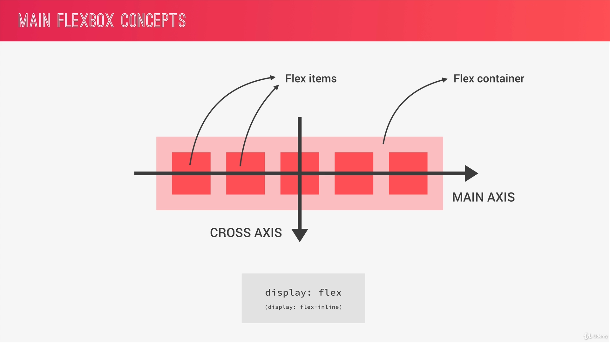
1. Flex container
    1. `flex-direction` which has `row` as default value. Besides, we can use `row-reverse`, `column`, and `column-reverse`.
    1. `flex-wrap` with `nowrap` as default, and we can use `wrap` and `wrap-reverse`.
    1. `justify-content` with `flex-start` as default, and we can use `flex-end`, `center`, `space-between`, `space-around`, and `space-evenly`.
    1. `align-items` with `strech` as default, and we can use `flex-start`, `flex-end`, `center`, `baseline`.
    1. `align-content` with `stretch` as default, and we can use `flex-start`, `flex-end`, `center`, `space-between`, and `space-around`.
1. Flex items
    1. [`align-self`](https://www.w3schools.com/cssref/css3_pr_align-self.asp) with `auto` as default, and we can use `strech`, `flex-start`, `flex-end`, `center`, `baseline`.
    1. [`order`](https://developer.mozilla.org/en-US/docs/Web/CSS/order) start from `0`, and we can give "**integer**" as values. If we give negative value for the item, the item with the lowest value will be the first item in the order. 
    1. We can have the followings shorthanded as `flex` property.
        1. [`flex-grow`](https://www.w3schools.com/cssref/css3_pr_flex-grow.asp) start from `0`, and we can give "**integer**" as values.
        1. [`flex-shrink`](https://www.w3schools.com/cssref/css3_pr_flex-shrink.asp) start from `1`, and we can give "**integer**" as values. The number specifies how much the item will shrink relative to the rest of the flexible items. If we give `0` to the property, the item won't be shrinked when the width of the viewport changes. 
        1. [`flex-basis`](https://www.w3schools.com/cssref/css3_pr_flex-basis.asp) with `auto` as default. This property provides the initial value for the element that the element will have the minimum width if it's available. Besides, this property makes the element the last element to start shrinking when the viewport is narrowing down. 
            ```css
            .flex_item {
                flex: 0 1 auto;
                /* <int> <int> <length> */
            }
            ```
            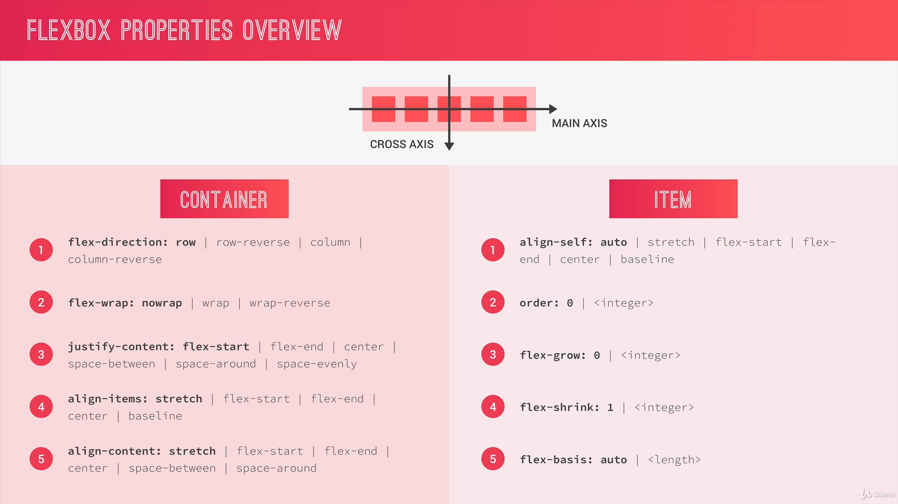
        1. If we gives only 1 argument to 1 `flex`, the value will be assigned and work as `flex-grow` property.

## A Basic Intro to Flexbox: The Flex Container
1. In this section, we try different properties and values and check how do they effect on the flexblox container and its child elements.
    1. `flex-direction: column`
    1. `justify-content: center`
    1. `align-items: flex-start`
    1. `align-items: flex-end`
    1. `align-items: baseline`
    1. `align-items: center`
1. We can test the features in the sandbox on codepen [https://codepen.io/allenlin90/pen/ZELvdra](https://codepen.io/allenlin90/pen/ZELvdra)

## A Basic Intro to Flexbox: Flex Items
1. For items in the flexbox container, we can use `align-self` to overwirte the property of `justify-content` and `align-items` of the flexbox container. Therefore, only the single item in the flexbox is affected rather than all the items.
1. With `order` property on flexbox items, the item will be ordered by the given order value from low to high. 
1. `order` property can be very useful when styling responsive design that we can change the order of the elements when the screnn size changes.
    ```html
    <!-- html elements -->
    <div class="container">
        <div class="item">1</div>
        <div class="item i2">2</div>
        <div class="item i3">3</div>
        <div class="item i4">4</div>
        <div class="item">5</div>
    </div>
    ```
    ```css
    /* css code */
    * {
        margin: 0;
        padding: 0;
        box-sizing: border-box;
    }

    .container {
        background-color: #ccc;
        padding: 10px;
        
        display: flex;
        flex-direction: row;
        justify-content: center;
        align-items: center;
    }

    .item {
        background-color: #f1425d;
        padding: 40px;
        margin: 30px;
        color: #fff;
        font-size: 40px;
    }

    .i2 {
        height: 200px;
    }

    .i3 {
        order: -1;
    }

    .i4 {
        align-self: flex-end;
        order: -1;
    }
    ```
1. To modify and distribute the space in the flexbox container, we can use [`flex-grow`](https://css-tricks.com/almanac/properties/f/flex-grow/). By giving any value to all the items in the flexbox container, the items will be expanded and occupy the space as much as they can. 

## A Basic Intro to Flexbox: Adding More Flex Items
1. In the flexbox container, we can use the following properties
    1. [`flex-wrap`](https://www.w3schools.com/cssref/css3_pr_flex-wrap.asp) specifies whether the flexible items should wrap or not. If the elements are not flexible items, the `flex-wrap` property has no effect.
    1. [`align-content`](https://css-tricks.com/almanac/properties/a/align-content/) which has 6 values that we can align the "lines" of the items in the container. Note that this property doesn't work if there's only a single line in the flexbox container.
    ```css
    .container {
        display: flex;
        flex-wrap: wrap;
        align-content: center;
    }
    ```

## Project Overview
1. We have the basic configuration for the page. We can get all the initial files from the github repo at [https://github.com/jonasschmedtmann/advanced-css-course](https://github.com/jonasschmedtmann/advanced-css-course).
1. HTML
    ```html
    <!DOCTYPE html>
    <html lang="en">

    <head>
        <meta charset="UTF-8">
        <meta name="viewport" content="width=device-width, initial-scale=1.0">

        <link href="https://fonts.googleapis.com/css?family=Open+Sans:300,400,600" rel="stylesheet">
        <link rel="stylesheet" href="css/style.css">
        <link rel="shortcut icon" type="image/png" href="img/favicon.png">

        <title>trillo &mdash; Your all-in-one booking app</title>
    </head>

    <body>
        Trillo
    </body>

    </html>
    ```
1. SCSS
    ```scss
    /*
    COLORS

    Primary: #eb2f64
    Primary light: #FF3366
    Primary dark: #BA265D

    Grey light 1: #faf9f9
    Grey light 2: #f4f2f2
    Grey light 3: #f0eeee
    Grey light 4: #ccc

    Grey dark 1: #333
    Grey dark 2: #777
    Grey dark 3: #999

    */

    * {
        margin: 0;
        padding: 0;
    }

    body {
        background-color: #eb2f64;
    }
    ```
1. `package.json`
    ```json
    {
        "name": "Trillo",
        "version": "1.0.0",
        "description": "trillo app",
        "main": "index.js",
        "scripts": {
            "watch:sass": "node-sass sass/main.scss css/style.css -w",
            "devserver": "live-server",
            "start": "npm-run-all --parallel devserver watch:sass",
            "compile:sass": "node-sass sass/main.scss css/style.comp.css",
            "prefix:css": "postcss --use autoprefixer -b 'last 10 versions' css/style.comp.css -o css/style.prefix.css",
            "compress:css": "node-sass css/style.prefix.css css/style.css --output-style compressed",
            "build:css": "npm-run-all compile:sass prefix:css compress:css"
        },
        "author": "Jonas",
        "license": "ISC",
        "devDependencies": {
            "autoprefixer": "^7.1.4",
            "concat": "^1.0.3",
            "node-sass": "^4.5.3",
            "npm-run-all": "^4.1.1",
            "postcss-cli": "^4.1.1"
        }
    }
    ```

## Defining Project Settings and Custom Properties
1. Learning target: How and why use CSS custom properties.
1. We create 3 Sass file `_base.scss`, `_layout.scss`, and `_components.scss` and import these files to `main.scss`.
1. We can use native CSS variables which can be called by using `var()` 
1. We then configure the `_base.scss` to setup the initial requirements of the page. 
    1. We use regular setup with universal selector `*` to select all the elements in the HTML. 
    1. Use `*::after` and `*::before` to select all the element to ensure they inherti the property of `box-sizing` from their parent element.
    1. We use `min-height` to extend the whole `body` tag for the whole page as there's no element in the body tag yet.
        ```scss
        // sass/_base.scss
        /*
        COLORS

        Primary: #eb2f64
        Primary light: #FF3366
        Primary dark: #BA265D

        Grey light 1: #faf9f9
        Grey light 2: #f4f2f2
        Grey light 3: #f0eeee
        Grey light 4: #ccc

        Grey dark 1: #333
        Grey dark 2: #777
        Grey dark 3: #999

        */

        :root {
            --color-primary: #eb2f64;
            --color-primary-light: #FF3366;
            --color-primary-dark: #BA265D;

            --color-grey-light-1: #faf9f9;
            --color-grey-light-2: #f4f2f2;
            --color-grey-light-3: #f0eeee;
            --color-grey-light-4: #ccc;

            --color-grey-dark-1: #333;
            --color-grey-dark-2: #777;
            --color-grey-dark-3: #999;
        }

        * {
            margin: 0;
            padding: 0;
        }

        *,
        *::before,
        *::after {
            box-sizing: inherit;
        }

        html {
            box-sizing: border-box;
            font-size: 62.5%; // 1rem = 10px, 10px/16px = 62.5%
        }

        body {
            font-family: 'Open Sans', sans-serif;
            font-weight: 400;
            line-height: 1.6;
            color: var(--color-grey-dark-2);
            background-image: linear-gradient(to right bottom, var(--color-primary-light), var(--color-primary-dark));
            background-size: cover;
            background-repeat: no-repeat;

            min-height: 100vh; // this works when there's no element, so this can extend the height to let background image cover the whole page
        }
        ```

## Building the Overall Layout
1. HTML structure. The web app has 2 main components in the `container` which are `header` and `content`, while in the `content`, it has `sidebar` and `hotel-view`.
    ```html
    <body>
        <div class="container">
            <header class="header">
                Header part
            </header>
            <div class="content">
                <nav class="sidebar">
                    Navigation
                </nav>
                <main class="hotel-view">
                    Hotel view
                </main>
            </div>
        </div>
    </body>
    ```
1. Variables in `_base.scss`
    ```scss
    /*
    COLORS

    Primary: #eb2f64
    Primary light: #FF3366
    Primary dark: #BA265D

    Grey light 1: #faf9f9
    Grey light 2: #f4f2f2
    Grey light 3: #f0eeee
    Grey light 4: #ccc

    Grey dark 1: #333
    Grey dark 2: #777
    Grey dark 3: #999

    */

    :root {
        --color-primary: #eb2f64;
        --color-primary-light: #FF3366;
        --color-primary-dark: #BA265D;

        --color-grey-light-1: #faf9f9;
        --color-grey-light-2: #f4f2f2;
        --color-grey-light-3: #f0eeee;
        --color-grey-light-4: #ccc;

        --color-grey-dark-1: #333;
        --color-grey-dark-2: #777;
        --color-grey-dark-3: #999;

        --shadow-dark: 0 2rem 6rem rgba(0,0,0,.3);
    }

    * {
        margin: 0;
        padding: 0;
    }

    *,
    *::before,
    *::after {
        box-sizing: inherit;
    }

    html {
        box-sizing: border-box;
        font-size: 62.5%; // 1rem = 10px, 10px/16px = 62.5%
    }

    body {
        font-family: 'Open Sans', sans-serif;
        font-weight: 400;
        line-height: 1.6;
        color: var(--color-grey-dark-2);
        background-image: linear-gradient(to right bottom, var(--color-primary-light), var(--color-primary-dark));
        background-size: cover;
        background-repeat: no-repeat;

        min-height: 100vh; // this works when there's no element, so this can extend the height to let background image cover the whole page
    }
    ```
1. In the `container`, we set up `min-height` so that the element will have at least `50rem` as its height if it doesn't have any child element, and we can use `max-width`, so that the maximum width of the component won't be over `120rem`.
1. The native CSS variable can not only take pure value but also a set of values for certain CSS properties. For example, as we keep using `box-shadow` to add the shadow effect to a container, we can keep the frequent used values as a CSS variable.
1. We'd like the `sidebar` and `view-hotel` component stay side by side in the `content` element. Therefore, we can use flexbox on the element. 
1. On the `sidebar`, we'd like the component to occupy only 18% of the width in its container. Besides, it shouldn't be streched or shrinked, so we can use `flex: 0 0 18%`, which will fix the item to have width that is 18% of its container width. Note that `18%` works as `flex-basis: 18%`.
1. For `hotel-view`, which is the sibling of `sidebar`, we can use `flex: 1` which works as `flex-grow: 1`. Therefore, the item will be expanded and fill the whole rest element that it can take. 
    ```scss
    // sass/_layout.scss
    .container {
        max-width: 120rem;
        margin: 8rem auto;
        background-color: var(--color-grey-light-2);
        box-shadow: var(--shadow-dark); // keep the config as CSS variable

        min-height: 50rem;
    }

    .header {
        height: 7rem;
        background-color: #fff;
        border-bottom: var(--color-grey-light-2);
    }

    .content {
        display: flex;
    }

    .sidebar {
        background-color: var(--color-grey-dark-1);

        flex: 0 0 18%;
    }

    .hotel-view {
        background-color: #fff;    
        background-color: orangered;
        flex: 1;
    }
    ```
    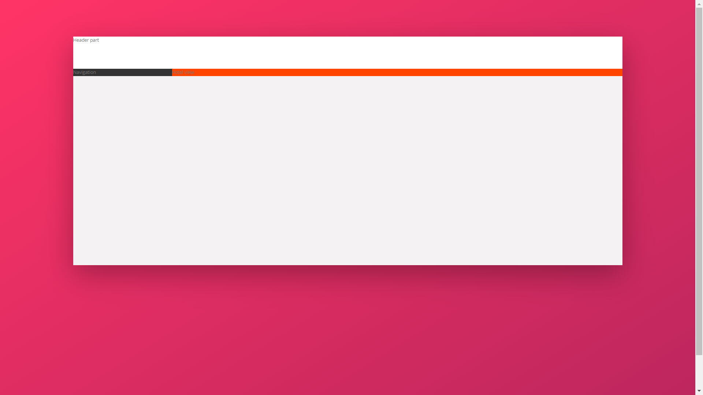

## Building the Header - Part 1
1. Learning targets
    1. Why to use SVG icons vs font icons.
    1. How to find, generate and use SVG sprites in HTML.
    1. How to change the color of an SVG icon in CSS.
    1. How to use more advanced flexbox alignment techniques, including `justify-content`, `align-self`, and `flex`.
1. In the `header`, we have the "logo", "search bar" and "user navigation" as the main 3 components in the header.
1. We use SVG instead of icon fonts, as some browser don't support and provide poor user experience for the usage. Therefore, SVG "**Scalable Vecotr Graphics**" are the better alternatives for the case.
1. When using SVG files, we can have all the required graphics stored in the same file and take each of the graphics by the time we need it. The integrated file can be named as `sprite.svg`.
1. We use the following structure to import the SVG file. Note that this only works on a web-server.
    ```html
    <svg class="search__icon">
        <use xlink:href="img/sprite.svg#icon-magnifying-glass"></use>
    </svg>
    ```
1. HTML file 
    ```html
    <header class="header">
        
        <form action="" class="search">
            <input type="text" class="search__input" placeholder="Search hotels">
            <button class="search__button">
                <svg class="search__icon">
                    <use xlink:href="img/sprite.svg#icon-magnifying-glass"></use>
                </svg>
            </button>
        </form>

        <nav class="user-nav">
            <div class="user-nav__icon-box">
                <svg class="user-nav__icon">
                    <use xlink:href="img/sprite.svg#icon-bookmark"></use>
                </svg>
                <span class="user-nav__notification">7</span>
            </div>
            <div class="user-nav__icon-box">
                <svg class="user-nav__icon">
                    <use xlink:href="img/sprite.svg#icon-chat"></use>
                </svg>
                <span class="user-nav__notification">13</span>
            </div>
            <div class="user-nav__user">
                
                <span class="user-nav__user-name">Allen</span>
            </div>
        </nav>
    </header>
    ```
1. To style SVG images, we can simply give `width` and `height` to the element directly. 
1. In this case, we just have all the required selectors in the Sass file. 
    ```scss
    // LOGO
    .logo {
        height: 3.25rem;
    }

    // SEARCH
    .search {
        &__input {

        }

        &__button {

        }

        &__icon {
            height: 2rem;
            width: 2rem;
        }
    }

    // USER NAVIGATION
    .user-nav {
        &__icon-box {

        }

        &__icon {
            height: 2.25rem;
            width: 2.25rem;
        }

        &__notification {

        }

        &__user {

        }

        &__user-photo {
            height: 3.75rem;
            width: 3.75rem;
            border-radius: 50%;
        }

        &__user-name {

        }
    }
    ```

## Building the Header - Part 2
1. To position the elements in the header, we can use flexbox to justify and align the items.
    ```scss
    // _layout.scss
    .header {
        display: flex;    
        justify-content: space-between;
        align-items: center;
    }
    ```
1. Since the `input` tag doesn't inherit `font-size` and `font-family` from the parent direclty, so we need to specify the property to apply the styling. 
1. To align the items in a flex item, we can turn the flex item into another flexbox container. 
1. We use `margin-right` with negative value to shift the element on the right to overlay on the styled element.
1. We can use `fill` property to change the color of a SVG graphic. 
    ```scss
    // _components.scss
    // LOGO
    .logo {
        height: 3.25rem;
        margin-left: 3rem;
    }

    // SEARCH
    .search {
        flex: 0 0 40%;

        display: flex;
        justify-content: center;
        align-items: center;
        
        &__input {
            font-family: inherit;
            font-size: inherit;
            color: inherit;
            background-color: var(--color-grey-light-2);
            border: none;
            padding: .7rem 2rem;
            border-radius: 100px;
            width: 90%;
            transition: all .2s;
            margin-right: -3.25rem; // make the icon overlay on the search bar area

            &:focus {
                outline: none;
                width: 100%;
                background-color: var(--color-grey-light-3);
            }

            &::-webkit-input-placeholder {
                font-weight: 100;
                color: var(--color-grey-light-4);
            }
        }

        &__input:focus + &__button {
            background-color: var(--color-grey-light-3);
        }

        &__button {
            border: none;
            background-color: var(--color-grey-light-2);

            &:focus{
                outline: none;
            }

            &:active {
                transform: translateY(2px);
            }
        }

        &__icon {
            height: 2rem;
            width: 2rem;
            fill: var(--color-grey-dark-3); // this is used to change color of a SVG graphic
        }
    }
    ```

## Building the Header - Part 3
1. We use direct child selector `>` to select all the elements in the user navigation and turn them into flexbox container.
1. We use `position: relative`, `position: absolute`, `top`, and `right` to position the red circle notification which overlays on the icon.
1. We can keep turning child elements into flexbox container though the element itself is a flexbox item.
    ```scss
    // sass/_components.scss
    // USER NAVIGATION
    .user-nav {
        align-self: stretch; // extend the element to fill the whole container

        display: flex;
        align-items: center;

        & > * {
            padding: 0 2rem;
            cursor: pointer;
            height: 100%;
            display: flex;
            align-items: center;
        }

        & > *:hover {
            background-color: var(--color-grey-light-2);
        }
        
        &__icon-box {
            position: relative;
        }

        &__icon {
            height: 2.25rem;
            width: 2.25rem;
            fill: var(--color-grey-dark-2);        
        }

        &__notification {
            font-size: .8rem;
            height: 1.75rem;
            width: 1.75rem;
            border-radius: 50%;
            background-color: var(--color-primary);
            color: #fff;
            position: absolute;
            top: 1.5rem;
            right: 1.1rem;

            // center the white text in the notification red circle
            display: flex;
            justify-content: center;
            align-items: center;
        }

        &__user-photo {
            height: 3.75rem;
            border-radius: 50%;
            margin-right: 1rem;
        }
    }
    ```
    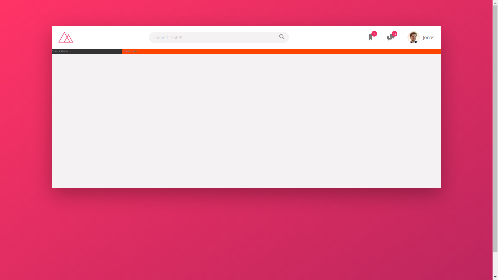

## Building the Navigation - Part 1
1. Learning targets
    1. How to use `scaleY` and multiple transition properties with different settings, to create a hover effect.
    1. How and why to use the `currentColor` CSS variable.
    1. How to use some more advanced flexbox alignment techniques, including `flex-direction`, `justify-content`, and `align-items`.
1. HTML
    ```html
    <nav class="sidebar">
        <ul class="side-nav">
            <li class="side-nav__item">
                <a href="#" class="side-nav__link">
                    <svg class="side-nav__icon">
                        <use xlink:href="img/sprite.svg#icon-home"></use>
                    </svg>
                    <span>Hotel</span>
                </a>
            </li>
            <li class="side-nav__item">
                <a href="#" class="side-nav__link">
                    <svg class="side-nav__icon">
                        <use xlink:href="img/sprite.svg#icon-aircraft-take-off"></use>
                    </svg>
                    <span>Flight</span>
                </a>
            </li>
            <li class="side-nav__item">
                <a href="#" class="side-nav__link">
                    <svg class="side-nav__icon">
                        <use xlink:href="img/sprite.svg#icon-key"></use>
                    </svg>
                    <span>Car rental</span>
                </a>
            </li>
            <li class="side-nav__item">
                <a href="#" class="side-nav__link">
                    <svg class="side-nav__icon">
                        <use xlink:href="img/sprite.svg#icon-map"></use>
                    </svg>
                    <span>Tours</span>
                </a>
            </li>
        </ul>

        <div class="legal">
            &copy; 2021 by trillo. All rights reserved.
        </div>
    </nav>
    ```
1. We can use turn the sidebar element into a flexbox container and use `flex-direction` to turn the container from row to column. Besides, we can use `justify-content: space-between`, so the items (2 elements) will be put on the top and bottom in the container.
    ```scss
    // _layout.scss        
    .sidebar {
        background-color: var(--color-grey-dark-1);

        flex: 0 0 18%;

        display: flex;
        flex-direction: column;
        justify-content: space-between;    
    }

    .hotel-view {
        background-color: #fff;    
        
        // test
        background-color: orangered;
        height: 80rem;

        flex: 1;
    }
    ```
1. In this case, we just set up the HTML structure and style the copyright text at the bottom of the sidebar.
    ```scss
    // _comopnents.scss
    // LEGAL TEXT
    .legal {
        font-size: 1.2rem;
        color: var(--color-grey-light-4);
        text-align: center;
        padding: 2.5rem;
    }
    ```

## Building the Navigation - Part 2
1. We firstly modify the font size and cancel the styling to items in `ul` by `list-style: none`.
1. We then create the hover effect by using the pseudo item `::before` to have an element expanded from the middle to top and bottom and from left to right. 
    1. Use `scaleY()` to shrink and expand the element on its y-axis. 
    1. As we would like to hide the background color in the initial stage, we can give `scaleY(0)`, so it will be shrinked down.
    1. We can have another class to apply on the item that is selected. However, this styling should be worked with JavaScript that when the user clicks on any other item rather than the current active one, the active class on the current item should be removed and assigned to the one which the user clicks. 
    1. In `transition`, we can give the property that we want to apply the animation as the first argument. The 2nd argument is the duration that how long will the animation works. The 3rd one is the time to delay. In this case, we can wait for the expand from the center to the top and bottom finishes and expand the color from left to right.
    1. We need to use `z-index` of the icon and text of the item. Otherwise it can be covered by the expanded background color. In addition, `z-index` only works when the element has a given `position` value. 
    1. For the icon, we can use `fill: currentColor`. This property will get the `color` from the current element (which could be inherited) or its parent element. This can be useful that the icon can automatically changes its color to be aligned with the text if we modify the theme and change the color of the text.
        ```scss
        // _components.scss
        // SIDE NAVIGATION
        .side-nav {
            font-size: 1.4rem;
            list-style: none;
            margin-top: 3.5rem;
            
            &__item {
                position: relative;

                &:not(:last-child) {
                    margin-bottom: .5rem;
                }
            }

            &__item::before {
                content: "";
                position: absolute;
                top: 0;
                left: 0;
                height: 100%;
                width: 3px;
                background-color: var(--color-primary);
                transform: scaleY(0);
                transition: transform .2s, 
                            width .4s cubic-bezier(1,0,0,1) .2s,
                            background-color .1s;
            }

            &__item:hover::before,
            &__item--active::before {
                transform: scaleY(1);
                width: 100%;
            }

            &__item:active::before {
                background-color: var(--color-primary-light);
            }

            &__link:link,
            &__link:visited {
                color: var(--color-grey-light-1);
                text-decoration: none;
                text-transform: uppercase;
                display: block;
                padding: 1.5rem 3rem;
                position: relative;
                z-index: 10;

                display: flex;
                align-items: center;
            }
            
            &__icon {
                width: 1.75rem;
                height: 1.75rem;
                margin-right: 2rem;
                fill: currentColor; // this gets the color from current or parent element. This can be used as combo with hover effect
            }
        }
        ```

## Building the Hotel Overview - Part 1
1. Learning targets
    1. How to create an infinite animation
    1. How to use `margin: auto` with flexbox, and why it's so powerful.
    1. Continue to use flexbox properties for easy positioning and alignemnt. 
1. HTML
    ```html
    <div class="overview">
        <h1 class="overview__heading">
            Hotel Las Palmas
        </h1>
        <div class="overview__stars">
            <svg class="overview__icon-star">
                <use xlink:href="img/sprite.svg#icon-star"></use>
            </svg>
            <svg class="overview__icon-star">
                <use xlink:href="img/sprite.svg#icon-star"></use>
            </svg>
            <svg class="overview__icon-star">
                <use xlink:href="img/sprite.svg#icon-star"></use>
            </svg>
            <svg class="overview__icon-star">
                <use xlink:href="img/sprite.svg#icon-star"></use>
            </svg>
            <svg class="overview__icon-star">
                <use xlink:href="img/sprite.svg#icon-star"></use>
            </svg>
        </div>

        <div class="overview__location">
            <svg class="overview__icon-location">
                <use xlink:href="img/sprite.svg#icon-location-pin"></use>
            </svg>
            <button class="btn-inline">Albufeira, Portugal</button>
        </div>

        <div class="overview__rating">
            <div class="overview__rating-average">8.6</div>
            <div class="overview__rating-count">429 votes</div>
        </div>
    </div>
    ```
1. We firstly turn the whole `overview` component as a flexbox container.
1. We can use `margin: auto` that CSS will give the margin that fit the contianer but keep the original size of the element with it, so the element won't be streched or extended to fit its container. 
1. This is similar to use `margin: 0 auto` to keep the element at the center of the container that it just given both margin on the left and right evenly (and have no margin on the top and bottom), so the element will be kept in the middle.
    ```scss
    // HOTEL OVERVIEW
    .overview {
        display: flex;

        &__heading {

        }

        &__stars {
            margin-right: auto;
        }

        &__icon-star,
        &__icon-location {
            width: 1.75rem;
            height: 1.75rem;
            fill: var(--color-primary);
        }

        &__location {
            
        }

        &__rating {

        }

        &__rating-average {

        }

        &__rating-count {
            
        }
    }
    ```

## Building the Hotel Overview - Part 2
1. We firstly set up the button with `background-color: transparent` and `border-bottom: currentColor` as this button could be used with other components with different background color.
1. We'd like the button text become grey when the user hovers on it, so we can use pseudo selector for the hover effect. 
1. When the button is clicked which means the button has "focus" or "active" state, we can define aniamtion by `@keyframe`. 
    1. In this case, we'd like 0% and 100% have exactly the same state while change 50% to the transformed state.
    1. We use `scale(1.05)` to slightly enlarge the element and `box-shadow: 0 1rem 4rem rgba(0,0,0,.25)` for the floating effect. 
        ```scss
        // _components.scss
        // BUTTON INLINE
        .btn-inline {
            border: none;
            color: var(--color-primary);
            font-size: inherit;
            border-bottom: 1px solid currentColor;
            padding: 2px;
            display: inline-block;
            background-color: transparent;
            cursor: pointer;
            transition: all .2s;

            &:hover {
                color: var(--color-grey-dark-1);
            }

            &:focus {
                outline: none;
                animation: pulsate 1s infinite; // requires infinite to keep looping the animation
            }
        }

        @keyframes pulsate {
            0% {
                transform: scale(1);
                box-shadow: none;
            }

            50% {
                transform: scale(1.05);
                box-shadow: 0 1rem 4rem rgba(0,0,0,.25);
            }

            100% {
                transform: scale(1);
                box-shadow: none;
            }
        }
        ```

## Building the Description Section - Part 1
1. Learning targets
    1. Continue use flexbox, including `flex-wrap` to build a multi-column list. 
    1. How and why to use CSS masks with `mask-image` and `mask-size`. 
1. HTML
    ```html
    <div class="description">
        <p class="paragraph">
            Lorem, ipsum dolor sit amet consectetur adipisicing elit. Hic voluptate obcaecati dolores ex eligendi error earum sed cumque harum, odit fugit, quae recusandae impedit natus ea unde distinctio neque deserunt.
        </p>
        <p class="paragraph">
            Lorem ipsum dolor sit amet consectetur adipisicing elit. Quidem reprehenderit repudiandae molestias sit corporis numquam?
        </p>
        <ul class="list">
            <li class="list__item">Close to the beach</li>
            <li class="list__item">Breakfast included</li>
            <li class="list__item">Free airport shuttle</li>
            <li class="list__item">Free wifi in all rooms</li>
            <li class="list__item">Air conditioning and heating</li>
            <li class="list__item">Pets allowed</li>
            <li class="list__item">We speak all languages</li>
            <li class="list__item">Perfect for families</li>
        </ul>

        <div class="recommend">
            <p class="recommend__count">
                Lucy and 3 other friends recommend this hotel.
            </p>
            <div class="recommend__friends">
                
                
                
                
            </div>
        </div>
    </div>
    ```
1. We have another 2 variables that we can use in `_base.scss`. Note that we can have another variable used in the CSS varialbe.
    ```scss
    // _base.scss
    :root {
        --shawdow-light: 0 2rem 5rem rgba(0,0,0,.06);

        --line: 1px solid var(--color-grey-light-2);
    }
    ```
1. As the styling is more related to the layout rather than the comopnent, we have the CSS code in `_layout.scss`. 
1. In most cases, if we set `flex-basis` of a flexbox item, we will have the first 2 arguments as `0` which are `flex-grow` and `flex-shrink`.
    ```scss
    // _layout.scss
    .detail {
        display: flex;
        padding: 4.5rem;
        background-color: var(--color-grey-light-1);
        border-bottom: var(--line);
    }

    .description {
        font-size: 1.4rem;
        background-color: #fff;
        box-shadow: var(--shawdow-light);
        padding: 3rem;
        flex: 0 0 60%;
        margin-right: 4.5rem;
    }

    .user-reviews {
        background-color: yellowgreen;
        flex: 1;
    }
    ```

## Building the Description Section - Part 2
1. Besides `last-child`, we can use [`last-of-type`](https://www.w3schools.com/cssref/sel_last-of-type.asp) which selects only the same type of elements. 
1. [`-webkit-mask-image: url()`](https://css-tricks.com/almanac/properties/m/mask-image/) can be used to make out the element which only the graphic area can be seen through, so that we can use this technique to change the color of a SVG graphic with CSS code. 
1. This feature works with `background-image` of the element. 
1. Besides, this property doesn't work on all the browser (only the webkit based), so we need to check if the property works or we can use regular `background-image: url()` for the case. 
    ```scss
    // _component.scss
    // LIST
    .list {
        list-style: none;
        margin: 3rem 0;
        padding: 3rem 0;
        border-top: var(--line);
        border-bottom: var(--line);

        display: flex;
        flex-wrap: wrap;

        &__item {
            flex: 0 0 50%;
            margin-bottom: .7rem;
        }

        &__item::before {
            content: "";
            display: inline-block;
            height: 1rem;
            width: 1rem;
            margin-right: .7rem;

            // Older browsers
            // background-image: url(../img/chevron-thin-right.svg);
            // background-size: cover;

            // Newer browsers - masks
            background-color: var(--color-primary);
            -webkit-mask-image: url(../img/chevron-thin-right.svg);
            -webkit-mask-size: cover;
            mask-image: url(../img/chevron-thin-right.svg);
            mask-size: cover;
        }
    }

    // RECOMMEND
    .recommend {
        font-size: 1.3rem;
        color: var(--color-grey-light-3);
        
        display: flex;
        align-items: center;

        &__count {
            margin-right: auto;
        }

        &__friends {

        }

        &__photo {
            box-sizing: content-box; // default setting of box-sizing
            height: 4rem;
            width: 4rem;
            border-radius: 50%;
            border: 3px solid #fff;

            &:not(:last-child) {
                margin-right: -1.5rem;
            }
        }
    }
    ```

## Building User Reviews Section
1. Learning target - Continue using and practicing flexbox
    ```html
    <div class="user-reviews">
        <figure class="review">
            <blockquote class="review__text">
                Lorem ipsum dolor sit, amet consectetur adipisicing elit. Ducimus rerum quo quis obcaecati odio reiciendis unde.
            </blockquote>
            <figcaption class="review__user">
                
                <div class="review__user-box">
                    <p class="review__user-name">Nick Smith</p>
                    <p class="review__user-date">Feb 23rd, 2021</p>
                </div>
                <div class="review__rating">7.8</div>
            </figcaption>
        </figure>
        <figure class="review">
            <blockquote class="review__text">
                Lorem ipsum dolor sit, amet consectetur adipisicing elit. Ducimus rerum quo quis obcaecati odio reiciendis unde.
            </blockquote>
            <figcaption class="review__user">
                
                <div class="review__user-box">
                    <p class="review__user-name">Mary Thomas</p>
                    <p class="review__user-date">Sep 13th, 2021</p>
                </div>
                <div class="review__rating">9.3</div>
            </figcaption>
        </figure>

        <button class="btn-inline">Show all <span>&rarr;</span></button>
    </div>
    ```
1. Since we'd like to center the items in the container, we can use `text-align: center` to align all the elements that is `inline` and `inline-block`. However, this will change the `p` tags in the child elements as well. 
1. As we want only the first tier of containers being aligned, we can turn the element into a flexbox container, change it to a column and use `align-items: center`.
    ```scss
    // _layout.scss
    .user-reviews {
        flex: 1;

        display: flex;
        flex-direction: column;
        align-items: center;
    }
    ```
1. To have special characters in HTML and CSS, we can look up the HTML entiteis. However, the code to import special characters in CSS is different from HTML. We can check the [snippets](https://css-tricks.com/snippets/html/glyphs/). In this case, we'd like to use "left double quotation mark" which ISOnum is `\201C`.
1. We have pseudo element `::before` to carry the special character and have lower `z-index` so that it does't overlay on the contents in the flexbox.
    ```scss
    // _components.scss
    .review {
        background-color: #fff;
        box-shadow: var(--shadow-light);
        padding: 3rem;
        margin-bottom: 3.5rem;
        position: relative;
        overflow: hidden;

        &__text {
            margin-bottom: 2rem;
            z-index: 10;
            position: relative;
        }

        &__user {
            display: flex;
            align-items: center;
        }

        &__photo {
            height: 4.5rem;
            width: 4.5rem;
            border-radius: 50%;
            margin-right: 1.5rem;
        }

        &__user-box {
            margin-right: auto;
        }

        &__user-name {
            font-size: 1.1rem;
            font-weight: 600;
            text-transform: uppercase;
            margin-bottom: .4rem;
        }

        &__user-date {
            font-size: 1rem;
            color: var(--color-grey-dark-3);
        }

        &__rating {
            color: var(--color-primary);
            font-size: 2rem;
            font-weight: 300;
        }

        &::before {
            content: "\201C";
            position: absolute;
            top: -2.75rem;
            left: -1rem;
            line-height: 1;
            font-size: 20rem;
            color: var(--color-grey-light-2);
            font-family: sans-serif;
            z-index: 1;
        }
    }
    ```

## Building the CTA Section
1. HTML
    ```html
    <div class="cta">
        <h2 class="cta__book-now">
            Good news! We have 4 free rooms for your selected dates!
        </h2>
        <button class="btn">
            <span class="btn__visible">Book now</span>
            <span class="btn__invisible">Only 4 rooms left!</span>
        </button>
    </div>
    ```
1. We have the structure that there are 2 `span` elements in the button contain different content. 
1. We can use `top: -100%` to lift up the element and put it back when the user hovers on it. 
    ```scss
    // CALL TO ACTION
    .cta {
        padding: 3.5rem 0;
        text-align: center;

        &__book-now {
            font-size: 2rem;
            font-weight: 300;
            text-transform: uppercase;
            margin-bottom: 2.5rem;
        }
    }

    .btn {
        font-size: 1.5rem;
        font-weight: 300;
        text-transform: uppercase;
        border-radius: 100px;
        border: none;
        background-image: linear-gradient(to right, var(--color-primary-light), var(--color-primary-dark));
        color: #fff;
        position: relative;
        overflow: hidden;
        cursor: pointer;

        & > * {
            display: inline-block;
            height: 100%;
            width: 100%;
            transition: all .2s;
        }

        &__visible {
            padding: 2rem 7.5rem;
        }

        &__invisible {
            position: absolute;
            padding: 2rem 0;
            left: 0;
            top: -100%; // move up exactly the size of the element
        }

        &:hover {
            background-image: linear-gradient(to left, var(--color-primary-light), var(--color-primary-dark));
        }

        &:hover &__visible {
            transform: translateY(100%);
        }

        &:hover &__invisible {
            top: 0;
        }

        &:focus {
            outline: none;
            animation: pulsate 1s infinite;
        }
    }
    ```

## Writing Media Queries - Part 1
1. We can't use native CSS variable in media query as the engine doesn't allow to do so. Therefore, we need to use Sass variables in case we want to store ceratin values as variables.
1. In this section, we mainly work on `1200px` and `900px` as the breakpoints for large mobile devices.
1. Base
    ```scss
    // _base.scss
    /*
    COLORS

    Primary: #eb2f64
    Primary light: #FF3366
    Primary dark: #BA265D

    Grey light 1: #faf9f9
    Grey light 2: #f4f2f2
    Grey light 3: #f0eeee
    Grey light 4: #ccc

    Grey dark 1: #333
    Grey dark 2: #777
    Grey dark 3: #999

    */

    :root {
        --color-primary: #eb2f64;
        --color-primary-light: #FF3366;
        --color-primary-dark: #BA265D;

        --color-grey-light-1: #faf9f9;
        --color-grey-light-2: #f4f2f2;
        --color-grey-light-3: #f0eeee;
        --color-grey-light-4: #ccc;

        --color-grey-dark-1: #333;
        --color-grey-dark-2: #777;
        --color-grey-dark-3: #999;

        --shadow-dark: 0 2rem 6rem rgba(0,0,0,.3);
        --shawdow-light: 0 2rem 5rem rgba(0,0,0,.06);

        --line: 1px solid var(--color-grey-light-2);
    }

    $bp-largest: 75em; // 1200px
    $bp-large: 68.75em; // 1100px
    $bp-medium: 56.25em; // 900px

    * {
        margin: 0;
        padding: 0;
    }

    *,
    *::before,
    *::after {
        box-sizing: inherit;
    }

    html {
        box-sizing: border-box;
        font-size: 62.5%; // 1rem = 10px, 10px/16px = 62.5%

        @media only screen and (max-width: $bp-large) {
            font-size: 50%;
        }
    }

    body {
        font-family: 'Open Sans', sans-serif;
        font-weight: 400;
        line-height: 1.6;
        color: var(--color-grey-dark-2);
        background-image: linear-gradient(to right bottom, var(--color-primary-light), var(--color-primary-dark));
        background-size: cover;
        background-repeat: no-repeat;

        min-height: 100vh; // this works when there's no element, so this can extend the height to let background image cover the whole page
    }
    ````
1. Layout
    ```scss
    // _layout.scss
    .container {
        max-width: 120rem;
        margin: 8rem auto;
        background-color: var(--color-grey-light-2);
        box-shadow: var(--shadow-dark);

        min-height: 50rem;

        @media only screen and (max-width: $bp-largest) {
            margin: 0;
            max-width: 100%;
            width: 100%;
        }
    }

    .header {
        font-size: 1.4rem;
        height: 7rem;
        background-color: #fff;
        border-bottom: var(--line);

        display: flex;    
        justify-content: space-between;
        align-items: center;
    }

    .content {
        display: flex;

        @media only screen and (max-width: $bp-medium) {
            flex-direction: column;
        }
    }

    .sidebar {
        background-color: var(--color-grey-dark-1);

        flex: 0 0 18%;

        display: flex;
        flex-direction: column;
        justify-content: space-between;    
    }

    .hotel-view {
        background-color: #fff;

        flex: 1;
    }

    .detail {
        font-size: 1.4rem;
        display: flex;
        padding: 4.5rem;
        background-color: var(--color-grey-light-1);
        border-bottom: var(--line);

        @media only screen and (max-width: $bp-medium) {
            padding: 3rem;
        }
    }

    .description {
        background-color: #fff;
        box-shadow: var(--shawdow-light);
        padding: 3rem;
        flex: 0 0 60%;
        margin-right: 4.5rem;
        
        @media only screen and (max-width: $bp-medium) {
            padding: 2rem;
            margin-right: 3rem;
        }
    }

    .user-reviews {
        flex: 1;

        display: flex;
        flex-direction: column;
        align-items: center;
    }
    ```
1. Components
    ```scss
    // _components.scss
    // LOGO
    .logo {
        height: 3.25rem;
        margin-left: 2rem;
    }

    // SEARCH
    .search {
        flex: 0 0 40%;

        display: flex;
        justify-content: center;
        align-items: center;
        
        &__input {
            font-family: inherit;
            font-size: inherit;
            color: inherit;
            background-color: var(--color-grey-light-2);
            border: none;
            padding: .7rem 2rem;
            border-radius: 100px;
            width: 90%;
            transition: all .2s;
            margin-right: -3.25rem;

            &:focus {
                outline: none;
                width: 100%;
                background-color: var(--color-grey-light-3);
            }

            &::-webkit-input-placeholder {
                font-weight: 100;
                color: var(--color-grey-light-4);
            }
        }

        &__input:focus + &__button {
            background-color: var(--color-grey-light-3);
        }

        &__button {
            border: none;
            background-color: var(--color-grey-light-2);

            &:focus{
                outline: none;
            }

            &:active {
                transform: translateY(2px);
            }
        }

        &__icon {
            height: 2rem;
            width: 2rem;
            fill: var(--color-grey-dark-3);
        }
    }

    // USER NAVIGATION
    .user-nav {
        align-self: stretch; // extend the element to fill the whole container

        display: flex;
        align-items: center;

        & > * {
            padding: 0 2rem;
            cursor: pointer;
            height: 100%;
            display: flex;
            align-items: center;
        }

        & > *:hover {
            background-color: var(--color-grey-light-2);
        }
        
        &__icon-box {
            position: relative;
        }

        &__icon {
            height: 2.25rem;
            width: 2.25rem;
            fill: var(--color-grey-dark-2);        
        }

        &__notification {
            font-size: .8rem;
            height: 1.75rem;
            width: 1.75rem;
            border-radius: 50%;
            background-color: var(--color-primary);
            color: #fff;
            position: absolute;
            top: 1.5rem;
            right: 1.1rem;

            // center the white text in the notification red circle
            display: flex;
            justify-content: center;
            align-items: center;
        }

        &__user-photo {
            height: 3.75rem;
            border-radius: 50%;
            margin-right: 1rem;
        }
    }

    // SIDE NAVIGATION
    .side-nav {
        font-size: 1.4rem;
        list-style: none;
        margin-top: 3.5rem;

        @media only screen and (max-width: $bp-medium) {
            display: flex;
            margin: 0;
        }
        
        &__item {
            position: relative;

            &:not(:last-child) {
                margin-bottom: .5rem;

                @media only screen and (max-width: $bp-medium) {
                    margin: 0;
                }
            }

            @media only screen and (max-width: $bp-medium) {
                flex: 1;
            }
        }

        &__item::before {
            content: "";
            position: absolute;
            top: 0;
            left: 0;
            height: 100%;
            width: 3px;
            background-color: var(--color-primary);
            transform: scaleY(0);
            transition: transform .2s, 
                        width .4s cubic-bezier(1,0,0,1) .2s,
                        background-color .1s;
        }

        &__item:hover::before,
        &__item--active::before {
            transform: scaleY(1);
            width: 100%;
        }

        &__item:active::before {
            background-color: var(--color-primary-light);
        }

        &__link:link,
        &__link:visited {
            color: var(--color-grey-light-1);
            text-decoration: none;
            text-transform: uppercase;
            display: block;
            padding: 1.5rem 3rem;
            position: relative;
            z-index: 10;

            display: flex;
            align-items: center;

            @media only screen and (max-width: $bp-medium) {
                justify-content: center;
                padding: 2rem;
            }
        }
        
        &__icon {
            width: 1.75rem;
            height: 1.75rem;
            margin-right: 2rem;
            fill: currentColor; // this gets the color from current or parent element. This can be used as combo with hover effect
        }
    }

    // LEGAL TEXT
    .legal {
        font-size: 1.2rem;
        color: var(--color-grey-light-4);
        text-align: center;
        padding: 2.5rem;

        @media only screen and (max-width: $bp-medium) {
            display: none;
        }
    }

    // GALLERY
    .gallery {
        display: flex;

        &__photo {
            width: 100%;
            display: block;
        }
    }

    // HOTEL OVERVIEW
    .overview {
        display: flex;
        align-items: center;
        border-bottom: var(--line);

        &__heading {
            font-size: 2.25rem;
            font-weight: 300;
            text-transform: uppercase;
            letter-spacing: 1px;
            padding: 1.5rem 3rem;
        }

        &__stars {
            margin-right: auto;
            display: flex;
        }

        &__icon-star,
        &__icon-location {
            width: 1.75rem;
            height: 1.75rem;
            fill: var(--color-primary);
        }

        &__location {
            font-size: 1.2rem;
            display: flex;
            align-items: center;
        }

        &__icon-location {
            margin-right: .5rem;
        }

        &__rating {
            background-color: var(--color-primary);
            color: #fff;
            margin-left: 3rem;
            padding: 0 2.25rem;
            align-self: stretch; // this makes the pink scoring on the right streched and cover the whole height

            display: flex;
            flex-direction: column;
            align-items: center;
            justify-content: center;
        }

        &__rating-average {
            font-size: 2.25rem;
            font-weight: 300;
            margin-bottom: -3px;
        }

        &__rating-count {
            font-size: .8rem;
            text-transform: uppercase;
        }
    }

    // BUTTON INLINE
    .btn-inline {
        border: none;
        color: var(--color-primary);
        font-size: inherit;
        border-bottom: 1px solid currentColor;
        padding: 2px;
        display: inline-block;
        background-color: transparent;
        cursor: pointer;
        transition: all .2s;

        & span {
            margin-left: 3px;
            transition: margin-left .2s;
        }

        &:hover {
            color: var(--color-grey-dark-1);

            span {
                margin-left: 8px;
            }
        }

        &:focus {
            outline: none;
            animation: pulsate 1s infinite; // requires infinite to keep looping the animation
        }
    }

    @keyframes pulsate {
        0% {
            transform: scale(1);
            box-shadow: none;
        }

        50% {
            transform: scale(1.05);
            box-shadow: 0 1rem 4rem rgba(0,0,0,.25);
        }

        100% {
            transform: scale(1);
            box-shadow: none;
        }
    }

    // PARAGRAPH
    .paragraph:not(:last-of-type) {
        margin-bottom: 2rem;
    }

    // LIST
    .list {
        list-style: none;
        margin: 3rem 0;
        padding: 3rem 0;
        border-top: var(--line);
        border-bottom: var(--line);

        display: flex;
        flex-wrap: wrap;

        &__item {
            flex: 0 0 50%;
            margin-bottom: .7rem;
        }

        &__item::before {
            content: "";
            display: inline-block;
            height: 1rem;
            width: 1rem;
            margin-right: .7rem;

            // Older browsers
            // background-image: url(../img/chevron-thin-right.svg);
            // background-size: cover;

            // Newer browsers - masks
            background-color: var(--color-primary);
            -webkit-mask-image: url(../img/chevron-thin-right.svg);
            -webkit-mask-size: cover;
            mask-image: url(../img/chevron-thin-right.svg);
            mask-size: cover;
        }
    }

    // RECOMMEND
    .recommend {
        font-size: 1.3rem;
        color: var(--color-grey-light-3);
        
        display: flex;
        align-items: center;

        &__count {
            margin-right: auto;
        }

        &__friends {
            display: flex;
        }

        &__photo {
            box-sizing: content-box; // default setting of box-sizing
            height: 4rem;
            width: 4rem;
            border-radius: 50%;
            border: 3px solid #fff;

            &:not(:last-child) {
                margin-right: -2rem;
            }
        }
    }

    // REVIEWS
    .review {
        background-color: #fff;
        box-shadow: var(--shadow-light);
        padding: 3rem;
        margin-bottom: 3.5rem;
        position: relative;
        overflow: hidden;

        @media only screen and (max-width: $bp-medium) {
            padding: 2rem;
            margin-bottom: 3rem;
        }

        &__text {
            margin-bottom: 2rem;
            z-index: 10;
            position: relative;
        }

        &__user {
            display: flex;
            align-items: center;
        }

        &__photo {
            height: 4.5rem;
            width: 4.5rem;
            border-radius: 50%;
            margin-right: 1.5rem;
        }

        &__user-box {
            margin-right: auto;
        }

        &__user-name {
            font-size: 1.1rem;
            font-weight: 600;
            text-transform: uppercase;
            margin-bottom: .4rem;
        }

        &__user-date {
            font-size: 1rem;
            color: var(--color-grey-dark-3);
        }

        &__rating {
            color: var(--color-primary);
            font-size: 2rem;
            font-weight: 300;
        }

        &::before {
            content: "\201C";
            position: absolute;
            top: -2.75rem;
            left: -1rem;
            line-height: 1;
            font-size: 20rem;
            color: var(--color-grey-light-2);
            font-family: sans-serif;
            z-index: 1;
        }
    }

    // CALL TO ACTION
    .cta {
        padding: 3.5rem 0;
        text-align: center;

        @media only screen and (max-width: $bp-medium) {
            padding: 2.5rem 0;
        }

        &__book-now {
            font-size: 2rem;
            font-weight: 300;
            text-transform: uppercase;
            margin-bottom: 2.5rem;
        }
    }

    .btn {
        font-size: 1.5rem;
        font-weight: 300;
        text-transform: uppercase;
        border-radius: 100px;
        border: none;
        background-image: linear-gradient(to right, var(--color-primary-light), var(--color-primary-dark));
        color: #fff;
        position: relative;
        overflow: hidden;
        cursor: pointer;

        & > * {
            display: inline-block;
            height: 100%;
            width: 100%;
            transition: all .2s;
        }

        &__visible {
            padding: 2rem 7.5rem;
        }

        &__invisible {
            position: absolute;
            padding: 2rem 0;
            left: 0;
            top: -100%; // move up exactly the size of the element
        }

        &:hover {
            background-image: linear-gradient(to left, var(--color-primary-light), var(--color-primary-dark));
        }

        &:hover &__visible {
            transform: translateY(100%);
        }

        &:hover &__invisible {
            top: 0;
        }

        &:focus {
            outline: none;
            animation: pulsate 1s infinite;
        }
    }
    ```

## Writing Media Queries - Part 2
## Wrapping up the Trillo Project: Final Considerations


# A Quick Introduction to CSS Grid Layouts
## Why CSS Grid: A Whole new Mindset
## Quick Setup for This Section
## Creating Our First Grid
## Getting Familiar with the fr unit
## Positioning Grid Items
## Spanning Grid Items
## Grid Challenge
## Grid Challenge: A Basic Solution
## Naming Grid Lines
## Naming Grid Areas
## Implicit Grid vs. Explicit Grids
## Aligning Grid Items
## Aligning Tracks
## Using min-content, max-content and the minmax() function
## Responsive Layouts with auto-fit and auto-fill


# Nexter Project - Master CSS Grid Layouts
## Project Overview and Setup
## Building the Overall Layout - Part 1
## Building the Overall Layout - Part 2
## Building the Features Section - Part 1
## Building the Features Section - Part 2
## Building the Story Section - Part 1
## Building the Story Section - Part 2
## Building the Homes Section - Part 1
## Building the Homes Section - Part 2
## Building the Gallery - Part 1
## Building the Gallery - Part 2
## Building the Footer
## Building the Sidebar
## Building the Header - Part 1
## Building the Header - Part 2
## Building the Realtors Section
## Writing Media Queries - Part 1
## Writing Media Queries - Part 2
## Browser Supprot for CSS Grid
## Warpping up the NExter Project: Final Considerations