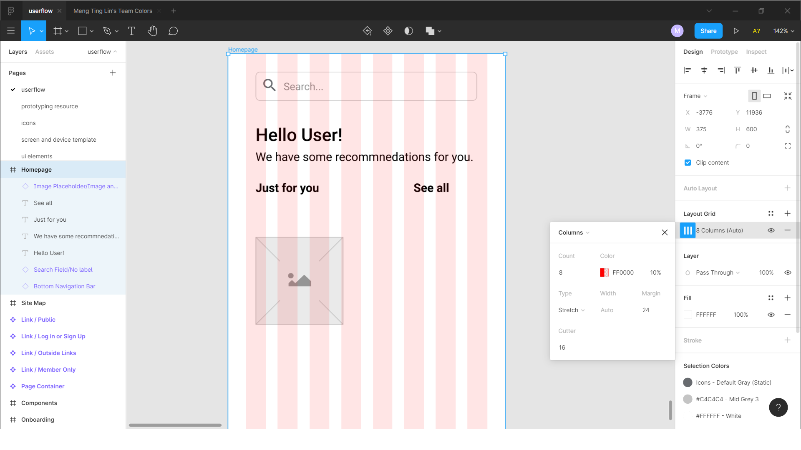
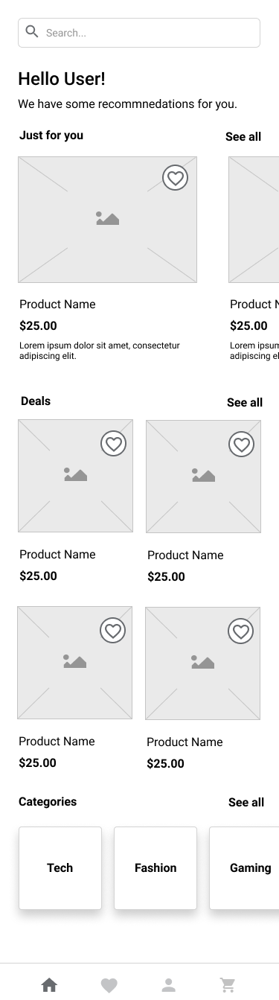
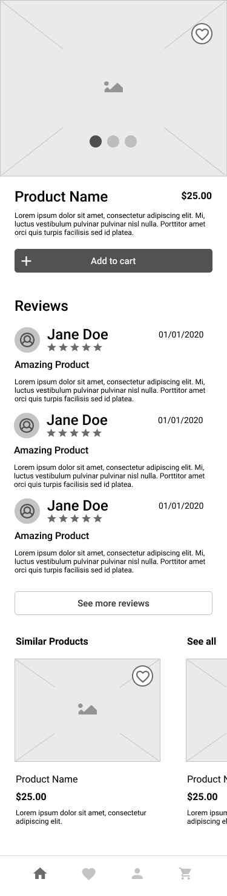
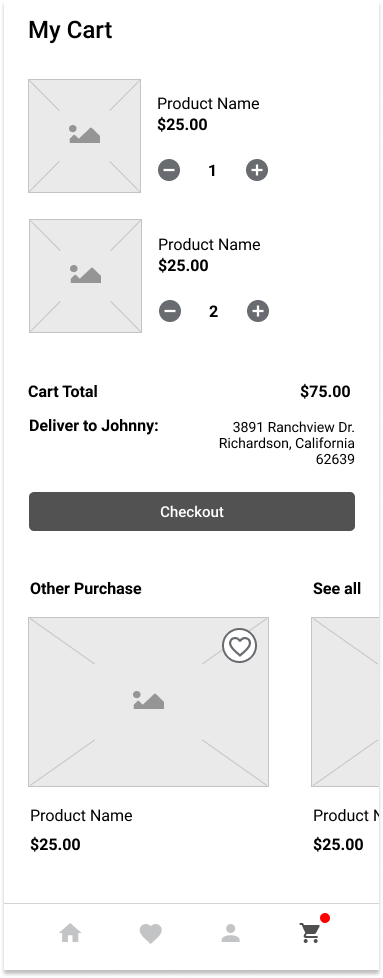
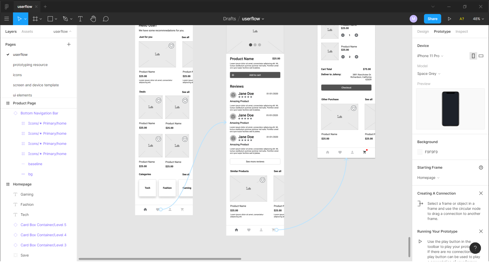
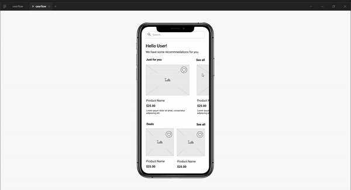
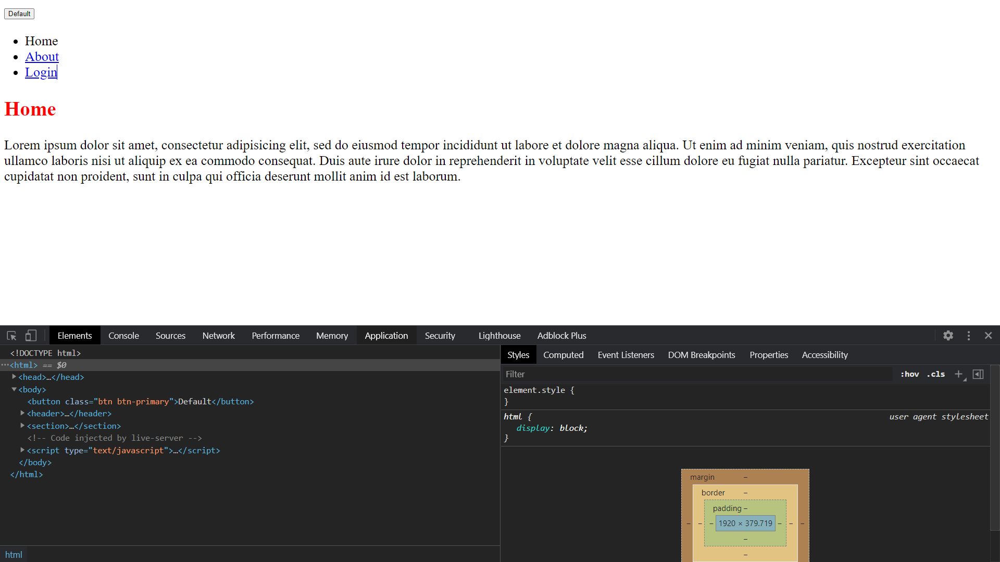

Start Course on 2020/10/26
Finish Course on 

# Course outline
1. Section 1: Getting started - Sketching, Inspiration, User Flows
    1. [Sketching](#sketching)
    1. [Inspiration](#inspiration)
    1. [User Flows](#User-Flows)
    1. [Sitemaps](#Sitemaps)

1. Section 2: Explore & Iterate - Wireframes, Prototyping, and Feedback
    1. [Wireframes](#wireframes)
    1. [Prototyping](#prototyping)
    1. [Feedback](#feedback)

1. Section 3: Visual Design - Design Theory + Accessibility
    1. [Spacing and the Grid](#Spacing-and-the-Grid)
    1. [Typography](#Typography)
    1. [Color](#Color)
    1. [Forms + UI Elements](#Forms-+-UI-Elements)
    1. [Visual Assets](#Visual-Assets)
    1. [Accessibility](#Accessibility)

1. Section 4: Design Exploration - Application Design + Design System
    1. [Design Patterns](#Design-Patterns)
    1. [Mobile Design](#Mobile-Design)
    1. [Visual Style + Exploration](#Visual-Style-+-Exploration)
    1. [Motion](#Motion)
    1. [Microinteractions](#Microinteractions)

1. Section 5: Putting it all Together - Design Systems and Final Composition
    1. [Design Systems](#Design-Systems)
    1. [Final Composition](#Final-Composition)
    1. [Working with a Client Revisited](#Working-with-a-Client-Revisited)
    1. [Where to Go From Here?](#Where-`to-Go-From-Here?)
    1. [Web Portfolio](#Web-Portfolio)
    1. [From Figma to Website: Building Our Landing Page](#From-Figma-to-Website:-Building-Our-Landing-Page)
    1. [Bonus: How the Internet Works](#Bonus:-How-the-Internet-Works)
    1. [Bonus: History of the Web](#Bonus:-History-of-the-Web)
    1. [Bonus: HTML5](#Bonus:-HTML5)
    1. [Bonus: CSS3](#Bonus:-CSS3)
    1. [Bonus: Boostrap, Templates, and Building Your Startup Landing Page](#Bonus:-Boostrap,-Templates,-and-Building-Your-Startup-Landing-Page)
    1. [Bonus: CSS Grid + CSS Layout](#Bonus:-CSS-Grid-+-CSS-Layout)


# Section 1: Getting started - Sketching, Inspiration, User Flows
## Sketching
### The Sketching Process
1. Be prepared
    1. Prepare tools beforehand, such as simple paper or pencil and tablet
    1. Define the goals
    1. Define who is the audience
    1. Time yourself by keeping a time limit and having little pressure
1. Start sketching
    1. Draw a frame for the device
    1. Start with more simple and redundant elements
    1. Move onto some more detailed interactions
    1. Annotate the sketches and keep the file and information safe
    1. Keep going
    1. Share the sketches
1. Refinement
    1. Add titles to the sketches
    1. Add annotations
    1. Use numbers or arrows to create the flow of using
        1. Page transition
        1. Interaction transition
    1. Add gestures if you want
    

### Sketching User Flow
1. We can use paper and pencil or tablets to map out and visualize the user flow. 
1. The instructor introduced **_Concepts_** App which is available on iPad, Android, and Windows. However, by the time of learning, the cross platform synchronizing is not available yet. 
1. To start the user flow, we can follow the following steps.
    1. Understand what to be drawn with the scope of this work. This can be a large journey or a simple interaction.
    1. Define starting point. This could be the exact starting point, middle of the journey, or the end of the process by reverse the workflow. 
    1. Define the next step which is the action to go after the starting point of this work.
1. When we create the flow, it the flow wouldn't be one liner and straight forward. It may be presented as a flowchart which has many scenarios.

### Sketching User Flow 2
1. We start to reason for the interactions that users may take with the pages and components.

### Sketching User Flow 3
1. This part is about the structure and navigation of the product. For example, we can have a homepage or landing page for certain feature. 
1. The main topic here is the relationship between different sections (such as pages) and functions with extendable features. The flow of the product introduced here is an e-commerce site.
    1. Home page
    1. Cart (Saved items)
    1. Checkout

### Sketching User Flow 4
1. This part goes deeper to each component on the page layout and how would those items interact with the user for different purposes and guidance. 

### Sketching Tips
1. Be lean and agile but don't be afraid of messing up.
1. Keep the sketching files safe
1. Always be prepared
1. Communicate and share to team


## Inspiration
### How to Stay Inspired
1. Creativity should be contantly stimulated. <br> Everyone has and can train his/her creativity.
1. Talk to peers. <br> People may get inspired during chats and casual talks.
1. Study others. <br> We can understand the reasoning flow with the process of reasoning rather than simply duplicating the same job.
1. Surround with great design. <br> It can be good inspiration and reminder for designers. 
1. Stay educated on a variety of topics. <br> We don't need to be expert in different areas, but we can refer to different knowledge and mindset for creative solutions.
1. Design for yourself. <br> We can sometimes escape from the current tasks and projects and change to focus on something we have passion of. 
1. Travel and explore the world. <br> Push yourself off the comfort zone.
1. Just take a walk. <br> Walking can boost creativity according to research. When changing mode of body conditions, we can have more refreshments and "Ah Ha" moments. 

### How to Find Inspiration
1. [**_Dribbble_**](https://dribbble.com/) is a platform where designers share their arts and works.
1. [**_Pinterest_**](https://www.pinterest.com/) is similar to Dribbble, while it covers more areas and topics of design. 
1. [**_Behance_**](https://www.behance.net/) is more about graphic design. 
1. [**_pttrns_**](https://pttrns.com/) is more about the smaller items and components within designs, such as buttons.
1. [**_awwwards_**](https://www.awwwards.com/) provides many good designed website layouts.

## User Flows
### What Are User Flows?
1. A **_user flow_** is the steps that users take to acheive a meaningful goal.
1. The user flow starts from "what the user sees and what the user does" to "what the user sees next and what the user does next".
    
1. Process of doing userflow
    1. Define the purpose of userflow
    1. User flows should head in one direction
    1. Describe each of the steps

### Do's and Don'ts
1. These process and concepts would be repetitive and redundant in some way. However, it helps to make the flow clear and easy to understand.
1. User flow should be clear
    1. Don't make the user flow vague.
    1. The user flow description should be descriptive and meaningful. 
1. User flow should be one direction
    1. Don't create flow maps to represent a user flow.
    1. Create distinct flows for different purposes.
1. Keeping the details in user flow
    1. Don't miss the details.
    1. We should put the right amount of details

### Speed up Workflow with Components
1. In this section, we start to use **_Figma_** to create the art works and user flow. 
1. In this case, we start with registration process for a user on the app. 
1. We can use <kbd>Alt</kbd> and mouse left key on an object to duplicate it. 
1. When selecting an object, we can choose to create a component by the button on the top, or <kbd>Ctrl + Alt + k</kbd>. Therefore, when the mother object is modified all the components created from that will be modified at the same time. 
1. However, if we modified a child component, the one will not be synchronized when the mother componenet is modified. That is the mother component can only synchronize modification with components that are created from the object and identical to it.
1. We can rename multiple objects with <kbd>Ctrl + r</kbd> at the same time and use <kbd>Ctrl + g</kbd> to group them. 
1. After grouping the objects, we can use <kbd>Ctrl + Alt + k</kbd> to create other groups of components.

### Creating Our Own User Flows
1. We start to build the user flow in this part. 
1. Press <kbd>f</kbd> and drag to create a frame, which is the background/canvas and can be used to group components and smaller objects.
1. Besids "layout" tab, we can check all the components in the "assests" tab to look the local components that we create. 
1. Use detachment with <kbd>Ctrl + Alt + b</kbd>. This command will bundle all the objects we combine and create a new item. Besides, we can also save it as a component.
1. Use mouse right click on a component and select "Go to Main Componenet". It will redirect us to the mother component in the file. 
    

### Creating Our Own User Flows 2
1. This part is to layout the user flow of searching a product. 
    
    
### Creating Our Own User Flows 3
1. This part is to layout the user flow of making a purchase. 
1. If we select multiple objects, we can use <kbd>Ctrl + Alt + Shift + h</kbd> to distribute the selected objects in the space evenly. We can also select it in the "Design" tab on the right panel.
    


## Sitemaps
### Introduction to Sitemap
1. Sitemaps are hierarchical diagrams that show how pages are organized.
1. We can start to build the sitemap right after the beginning of the project which can give us an overview of the whole work.

### Creating a Basic Sitemap
1. A sitemap object includes several components.
    1. Reference score - This is not neccessary, but could be useful when doing wireframe.
    1. Label - This is the name of the webpage.
        
1. The map can start from top to bottom or from left to right.
1. We can add legend to each page as tags or labels if it helps.
        
1. There are mainly 2 types of sitemaps.
    1. Flat Sitemaps - this good for small to medium size product, such as from 10 to 100 pages. It's suggested that we don't go too deep for the tiers, as within 4-level, unless it's necessary.
        
    1. Deep Sitemaps - this is more suitable of large sites, as for hundreds of hundreds of pages, such as e-commerce or blogging sites.
        
1. Sitemaps can help strategically place content where users can find it. It results in the creation of your navigation and hierarchies of the product.

### Before you start
1. This part is to refer back to the sketches that we have made when reasoning the user flow. 
1. We can get most of the resources and recommended plugins from [here](https://github.com/allenlin90/programmingLearning/blob/master/webDesign/completeWeb%26MobileDesignerIn2021/zerotomastery.io%2B-%2BDesign%2BResources.pdf).
1. There are some plugins can be very useful when doing design. 
    1. Unsplash - One of the most well known open source image collection.
    1. Logo Creator - Providing samples and collection from other companies for materials and inspiration.
    1. Autoflow - Auto setting arrows by using <kbd>Shift</kbd> to select multiple objects and create arrows.
    1. Wireframe - Providing templates for common use routes and functions, such as login page.

### Create a Sitemap
1. If we group items as an object in a "**frame**", we can modify "**Auto Layout**" on the right hand panel to rearrange the width and height of the frame and the space between the  objects or items in the frame.
1. We can duplicate a single object in a group of objects by using <kbd>Ctrl + Alt + b</kbd> to "Detach Instance", so we can modify a single item in the group of objects. For example, we can copy one of items in "page container" template with <kbd>Ctrl + d</kbd>.
1. Note since we are using the template which has pre-set instances in the object. We can change its attributes easily by switching the property in "**instance**" on the right panel.
1. There are some useful hot keys and commands such as 
    1. <kbd>f</kbd> to create a "**frame**" directly.
    1. <kbd>h</kbd> to change mouse cursor to a hand that we can drag and move the view on the canvas.
    1. <kbd>v</kbd> to change mouse cursor to an arrow which we can use to select items and objects on the canvas.
    1. <kbd>Ctrl + d</kbd> to duplicate a selected item, object, or component. 
    1. <kbd>t</kbd> to modify text in a textbox or object directly.
1. After building the layout with multipel objects, we can select all of them and in "Design" tab on the upper right corner on the top to distribute the selected objects horizontally in the space. We can also use <kbd>Ctrl + Alt + Shift + h</kbd> after selecting the objects.
1. In this case, we start to use the first plug-in `auto-flow` which allows users to create arrow flows between objects by simply selecting 2 objects with <kbd>shift</kbd>.
    

### Create a Sitemap 2
1. When users start to use the application, they may start from onboarding process, such as registration, rather than going to home page directly. 
1. In this case, we consider about the flows such as "login/registration" and "search" which are the main features of a e-commerce website.
1. After reasoning the user flow and possible functino, we can go further at some point to fill up the gap between each requirements.
    

### Tips for Getting Started
1. Try to be focused on the main features.
1. Consider sitemap with website userflow. 
1. Use colors in sitemap to differentiate individual or separated components.
1. In the intial stage, the sitemap no need to be finished and perfect.
1. Sitemap is a visualized tool that helps to work on wireframes and accelerate the process.

# Section 2: Explore & Iterate - Wireframes, Prototyping, and Feedback
## Wireframes
### What is a Wireframe
1. Wireframe presents the information that will be displayed, provides more details than sketches and user flows, and gives the outline and structure of the page, and conveys the overall direction and description of the user interface. 
1. Wireframes are a blue print of the product.
1. Past artifacts should influence the way you create the wireframes.
1. Wireframes help you understand how users will navigate the product.
1. Use wireframes to learn for the loop as "**build**", "**measure**", and "**learn**".
1. Wireframes can 
    1. Provide clarity and common understanding amongst the team.
    1. Test with users uncovers pain points and opportunities. For example, we can map the customer jounery to check users' conditions at different stages and pages on the website.
    1. Present to clients and stakeholders to get feedback.

### How to Create a Wireframe
1. Wireframes are good materials and resources that they can be polished and presented to clients. 
1. Ask important questions for the product and user journey.
1. Consult with the userflows and sitemap that have been defined. 
1. Tackle risky features first. 
1. Bring the working team into the process. 

### Wireframes in Figma
1. This section is to introduce the materials that we can save time for building in Figma. We can check the [resources](https://www.figma.com/file/rpGL8FzsxDiRm233tuJjD8/Wireframes-Resource?node-id=29460%3A0).

### Creating our Home Page
1. On a page, we can select mutiple objects and click to create multiple components on the top navigation bar. 
1. We can create styles in a library to be shared by projects and team members to prevent duplicating the work.
1. A plug-in "Text Style Generator" is useful that we can create multiple text styles at the same time. Note that we can use slash `/` to group styles. For example, we can create mutliple `H1` header tags with different font weight. 
    1. H1/Regular 38px
    1. H1/Medium 38px
    1. **H1/Bold 38px**
1. We can select the frame object on the canvas and choose to use "grid" in "Layout grid" option on the right panel. This can create a grid in the object for us to align items on it. The grid can be regular grid that covers the whole object or as columns which is similar to flexbox system in CSS. Besides, we can modify the margin and the thickness of each column in the layout. Note that we can use <kbd>Ctrl + Shirt + 4</kbd> to show/hide layout grid.
    
1. Since we have multiple small objects to create a large one, we can use <kbd>Ctrl + g</kbd> to group them and select or copy all of them at the same time.
1. We have done the mock-up for homepage in this section.
    

### Creating a Product Page
1. This part is the product page of the e-commerce app.
    

### Creating a Checkout Page
1. This part is the cart page of the e-commerce app.
    

## Prototyping
### Prototyping Basics in Figma
1. We can choose the "device" to work on prototype with on the right panel in "prototype" tab. 
1. We can change the model of the device and background color for presentation, then we can click the "play" button on the top right corner. Note that the presentation will have multiple pages according to the frames created on the canvas. 
1. In addition, we can also change the orientation of the device such as portrait or landscape.
1. Interactions on elements can also be set up to simulate real-world user activities. For example, we can appoint the icons on the navigation bar and direct to another frame
    
    
1. We can put on other effects such as changing styles when mouse cursor hovering and pressing the component. This is similar to "**Mouse enter**" and "**Mouse leave**", as the effect will be applied when the mouse is on the object, while chang back when the mouse leave the object. Similar concenpt can be applied on "**Touch Down**" and "**Touch Up**".
    

### Prototyping Basics in Figma 2

### Prototyping Basics in Figma 3

### Prototyping Basics in Figma 4

### Linking Together a Quick User Flow

### Working on Small Interactions


## Feedback

# Section 3: Visual Design - Design Theory + Accessibility
## Spacing and the Grid
## Typography
## Color
## Forms + UI Elements
## Visual Assets
## Accessibility

# Section 4: Design Exploration - Application Design + Design System
## Design Patterns
## Mobile Design
## Visual Style + Exploration
## Motion
## Microinteractions

# Section 5: Putting it all Together - Design Systems and Final Composition
## Design Systems
## Final Composition
## Working with a Client Revisited
## Where to Go From Here?
## Web Portfolio
## From Figma to Website: Building Our Landing Page
## Bonus: How the Internet Works
## Bonus: History of the Web

## Bonus: HTML5
### Build Your First Website
1. This section is introducing "sublime 3" and some basic configuration for using the text editor. 
1. Some HTML tags are introduced. Note that modern HTML files will have more meta data to respond to various types of devices and screen size. Besides, most of the modern text editors have the shorthand that we can create HTML boilerplate very easily.
    ```html
    <!DOCTYPE html>
    <html>
        <head>
            <title></title>
        </head>
        <body>
        </body>
    </html>
    ```
1. As we start to build a HTML file, we can open it in a browser such as "Chorme".

### DEVELOPER FUNDEMENTALS: III
1. This section is introducing `<!DOCTYPE html>` tag. This declaration is to indicate the browser that the file is a HTML file. 
1. The lecturer also explains that how important the seaching and problem solving skill of programmers is.
1. W3CSchool is one of the good websites that we can learn fundementals of HTML. 

### HTML Tags
1. Though there are many different HTML tags for use, we use part of them in regular development.
1. `<h1></h1>` is `h1` header 1 tag. Note that header tags with different sizes are from **1** to **6**.
1. `<p></p>` is for paragraph tag.
1. We can use `lorem ipsum` for gibberish text to fill out the elements.
1. `<b></b>` is to make the text in the element **bold**, while `<i></i>` can make text italic. However, this is a legacy element that some devices and browesers don't support. We can use `<strong></strong>` to make text bold and `<em></em>` to make text italic. 

### HTML Tags 2
1. `<ul></ul>` is to make unordered list which we can wrap `<li></li>`. We can use `<ol></ol>` for ordered list that is with numbers. Besides, we can make nested list as well.
    ```html
    <ul>
        <li>1</li>
        <li>2</li>
        <ul>
            <li>2.1</li>
            <li>2.2</li>
            <li>2.3</li>
        </ul>
    </ul>
    ```

### Self Closing HTML Tags
1. Self closing tags are elements that has single element without a closing element with slash `/`.
1. `<hr>` is horizontal line.
1. `<br>` is a break that we can change the line of the content.
1. `` is to refer to a image URL that we can put image to the page. Besides, it has some attributes.
    1. `src` is to link to the source of the image.
    1. `alt` is the alternative that shows the text when the image or link is not available, or the "description" of the image.
    1. `width` is to change the width of the image in case the size is too large to fit to the layout, element, or design.
    1. `height` is to change the height of the image.

### Anchor Tag
1. `<a></a>` has `href` attribute which stands for hyper text reference that can redirect the user to the appointed URL or destination. For example, the following anchor tag direct the user to the other page `newpage.html` in the same directory.
1. In addition, we can put other HTML elements in the anchor tag to create a special element to redirect users such as a button.
    ```html
    <a href="newpage.html">New Page</a>
    <a href="link.html">
        <h1>Link</h1>
    </a>
    ```

### Q&A: index.html
1. In convention, `index.html` is the default name of the homepage for the server to know that `index.html` is the homepage or the first page that the server should return when there's a request to the root directory which is the website URL. 

### Q&A: Relative vs Absolute Path
1. Relative page starts from the object that link to the other object, this is the shorthand rather than giving the whole path, which is the absolute path of the object. 
1. A URL link with HTTP or HTTPs is an absolute path. 

### HTML Forms
1. `<form></form>` is the form element that we can use it to collect user inputs.
1. There are several types of input and attributes we can use to build up the form tag. 
    1. `<input>`
        1. `text` is the regular input to collect text. 
        1. `email` has the basic validator to check if there's an `@` sign in the input.
        1. `password` will mask the input form the user with system default characters such as dots or asterisks `*`. Besides, we can use `min` attribute in this tag to indicate that how many characters are requried to set the password.
        1. `date` is a date picker that will show a system default calendar for users to choose the date.
        1. `radio` is single selection from multiple items. Note that we can use `name` attribute to group `inputs` that has the same `name` attribute.
        1. `checkbox` is a checkbox that returns boolean value as `true` or `false`.
        1. `submit` is to send the data in the form to the backend. 
        1. `reset` is to clear out all the inputs in the form tag.
    1. `name` is the attribute that we can use it to create variable to send requests to the backend, or group radio buttons so that the HTML file knows which radio buttons are in the same group. Thus, users can only select one of the options from the radio button list. 
    ```html
    <!DOCTYPE html>
    <html>
        <head>
            <title></title>
        </head>
        <body>
            <form>
                First Name: <input type="text"><br>
                Last Name: <input type="text"><br>
                Email: <input type="email" required><br>
                Password: <input type="password" min="8" required><br>
                Birthday: <input type="date"><br>
                Gender: <br>
                <input type="radio" name="gender">Male<br>
                <input type="radio" name="gender">Female<br>
                <input type="radio" name="gender">Other<br>
                Pets: <br>
                <input type="checkbox"> Cat<br>
                <input type="checkbox"> Dogs<br>
                <input type="submit" value="Register">
                <input type="reset" value="Reset">
            </form>
        </body>
    </html>
    ```

### HTML Forms 2
1. `<select></select>` tag can create a dropdown list for users to choose. There are some useful attributes on select tag as well. 
    1. `multiple` can make the select tag becomes multiple selection.
    ```html
    Cars: <br>
    <select multiple>
        <option>Volve</option>
        <option>Audi</option>
    </select>
    ```

### Submitting a form
1. We give all the `<input>` elements, which takes user input rather than `reset` or `submit`, a `name` attribute, which is used to collect the inputs from each element.
1. If we don't specify the `method` attribute in `<form>` open tag, the default method will be `GET` which will collect all the inputs and send the parameters through URL, which key is given in the `name` attribute in the `<input>` tag, and the value is the input from the user. 
1. Note that every any further setting the default behavior of submitting a form will send the collected inputs and reload the page.
1. All the parameters sending through URL start with a question mark `?` and will be concatenated with ampersand `&` if there's multiple variables.
1. In addition, the special characters which are out of ASCII will be encoded and represented with other characters. URL encoding replaces unsafe ASCII characters with a "`%`" followed by two hexadecimal digits. For example, `@` will become `%40`. We can look up more information at [W3Schools](https://www.w3schools.com/tags/ref_urlencode.ASP). 
1. Besides many programming languages have pre-built function to turn an URL with special characters into valid URL links, such as JavaScript with `encodeURIComponent()` and PHP with `rawurlencode()`.
1. The other usual method to send request is `POST` that the contents and data will be send in the body of the request itself. Besides, this method is more secure as the data won't be shown directly. 
1. There's another attribute `action` which was used in PHP programs to send the data collected from the form to an appointed PHP file on the server. However, there are other methods for such purpose in modern development techniques.
1. `value` attribute is another important components for HTMl elements that it provides value to selective elements such as `radio` and `select` with `option` when transmitting the data, as the elements didn't take any input directly from the user, while all the values are pre-built.
1. In the example below, if we don't give value to each `input[radio]` element, the value of `gender` will be `on` if one of the `radio` elements is selected. This is similar to `input[checkbox]`, though such option has only `on` and `off` as boolean `true` and `false`.
    ```html
    <!DOCTYPE html>
    <html>
        <head>
            <title></title>
        </head>
        <body>
            <form>
                First Name: <input type="text" name="firstname"><br>
                Last Name: <input type="text" name="lastname"><br>
                Email: <input type="email" name="email" required><br>
                Password: <input type="password" min="8" name="password" required><br>
                Birthday: <input type="date" name="birthday"><br>
                Gender: <br>
                <input type="radio" name="gender" value="male">Male<br>
                <input type="radio" name="gender" value="female">Female<br>
                <input type="radio" name="gender" value="other">Other<br>
                Pets: <br>
                <input type="checkbox" name="cat"> Cat<br>
                <input type="checkbox" name="dog"> Dogs<br>
                Cars: <br>
                <select multiple>
                    <option value="volve">Volve</option>
                    <option value="audi">Audi</option>
                </select><br>
                <input type="submit" value="Register">
                <input type="reset" value="Reset">
            </form>
        </body>
    </html>
    ```

### HTML Tags 3
1. To make a comment or share information in HTML file, we can use `<!-- comment -->` to wrap the message. Most of the text editors provides shortcuts such as <kbd>Ctrl + /</kbd> to turn a line or selected lines of text into comments. 
1. The followings are 2 common elements to wrap elements in HTML. These elements are useful that we can give them `class`, `id`, or other attributes to provide certain features or simply group the contents and modify them at the same time. 
    1. `<div></div>` is block element and creats blocks as sections in HTML. This block elements take defined space area in the layout. 
    1. `<span></span>` is similar to `div` while it's an inline element which takes only the space of the contents that is wrapped by `span`. 

### HTML vs HTML 5
1. Though HTML evolves and has been added with multiple features, the modern browsers can still read the early versions of HTML to ensure that the website can still work. 
1. The modern HTML is more semantic that the name of elements are more descriptive, so that seach engines or other programs can learn the layout of a website by the name of its elements. For example
    1. `header` is the header area of the website.
    1. `nav` is usually the navigation part on the website.
    1. `footer` is the footer area of the website. 
1. We can give other attributes to `input` elements for input restrictions such as set the `min` input from the user. We can check other attributes for [input restriction](https://www.w3schools.com/tags/tag_input.asp).

### Copy a Website
1. We can open the developer tool in brower and copy the elements which we use the code to duplicate any website on the internet. 
1. In this case, we check out "[wait but why](https://waitbutwhy.com/)".


## Bonus: CSS3
### Your First CSS
1. We can use `<link rel="stylesheet" type="text/css" href="style.css">` tag in HTML to connect the HTML file with the CSS styling sheet. Note that `link` is a self closing tag.
    ```html
    <link rel="stylesheet" type="text/css" href="style.css">
    ```
1. CSS stands for "**cascading style sheet**" which means the selector will select the last match to apply. For example, if 2 styles are applied to the same element, only the last styling property will be applied. 
    
1. Though there are 2 ways that we can style the HTML file, these methods are not usually used. 
    1. `<link>` tag, we can style the HTML elements in-line.
        ```html
        <header style="background-color: green; color: red">
        ```
    1. `<style></style>` can be used to wrap CSS code in HTML file directly. 
        ```html
        <style>
            h1 {
                background: red;
            }
        </style>
        ```
    
### CSS properties
1. [CSS tricks](https://css-tricks.com/almanac/) is a website that many developers refer to.
1. Besides using `` tag in HTML, we can use `background-image` property in CSS to link an image to the selected element. For example, we can select `body` element in HTML to put background on the whole page. 
1. We can choose RGB and HEX color code from [Paletton](https://paletton.com/#uid=1000u0kllllaFw0g0qFqFg0w0aF).
1. For colors, we can use mainly 3 types which are "text", "rgb code" and "hex code". Note there's a 4th property for `rgba` which is the transparency that is from 0 (transparent) to 1 (solid).
    ```css
    body {
        background-image: url(https://images.unsplash.com/photo-1604432952064-38b878fda1bd?ixlib=rb-1.2.1&ixid=eyJhcHBfaWQiOjEyMDd9&auto=format&fit=crop&w=935&q=80);
        background-size: cover;
    }

    h2 {
        color: red;
        text-align: center;
        border: 5px solid rgba(255, 176, 170, 0.5);
        cursor: pointer;
    }

    li {
        list-style: none;
        display: inline-block;
    }
    ```

### CSS Selectors
1. We can put the element directly before curly brackets to select all the same type of elements on the HTML page. 
1. `class` has notation with a dot `.` that is good for grouping elements with the same decoration.
1. `id` has notation with poundsign `#` that is good for a single element on the page. 
1. A asterisk `*` is like a wild card that it will select all the elements that match the selector conditions.
1. We can use comma `,` to apply the styling to multiple elements that is separated by comma.
1. If there's a space between elements, it will follow the nesting style that the selector goes from outter to inner from left to right. Note that this selector will apply to all the elements that is nested in the element no matter how many layers there are. 
    ```css
    div p {
        color: red;
    }
    ````
1. A greater sign is to select the element that is right nested in the element on the left. 
1. We can use column for advanced selecting method or for elements to react to events. 
    ```css
    div:hover {
        background: grey;
    }

    p:nth-child(even) {
        background: blue;
    }

    li:last-of-type {
        background: cyan;
    }
    ```
1. We can add `!important` will make a certain styling in higher priority. However, this method is not recommended as when the styling sheet goes bigger, it maybe harder to notice if a styling is given the attribute and hard to be check if the styling goes wrong. 
1. We can use some tools to check specificity of a CSS selector, such as [specificity calculator](https://specificity.keegan.st/).
1. We can check [flukeout](https://flukeout.github.io) to practice on CSS selectors.

### Text and Font
1. There are many decorators and properties we can use to modify the styles of fonts.
1. We can import font styles to ensure all the users can view the page in certain style though the user may not install the font. For example, [Google Fonts](https://fonts.google.com/).
    ```css
    p {
        text-decoration: line-through;
        font-style: italic;
        font-weight: bold;
        font-size: 1.4rem;
        font-family: "Arial";
    }
    ```

### Images in CSS
1. We can use `` tag to import images from other source and render on the page. Note that an image tag is an inline element.
1. We can use `float` property for image to be at the `left` or `right` that it will be wrapped by the elements around it.
1. As `float` property sometimes create funny output, we can use `clear` property right after the element using `float` to separate them apart. However, modern CSS has flebox and grid system that it is much easier to make the layout of them page. 
    ```css
    img {
        float: right;
    }

    footer {
        clear: both;
    }
    ```

### Box Model
1. All HTML elements have margin, border, and padding. Besides, each of them can be added by 4 directions from top, right, bottom, and left in clockwise.
1. We can change the size of the content of the element directly with `width` and `height`. 
    ```css
    div {
        border: red solid 2px;
        padding: 10px;
        width: 40px;
        height: 50px
    }
    ```

### px vs em vs rem
1. `px` is the absolute unit for the font size in a layout. 
1. `em` is related to the size of the parent element. For example, if the font size of the parent element is `14px`, giving `2em` will make the fontsize twice as its parent element. 
1. `rem` is related to the root font size which is usually 16px by default. This is better that the font size will always refer to the root font size rather than the parent element.

### Critical Render Path
1. When users use browser to browser websites, the browser sends request to the IP address which is repersented by URL. The request will then be sent to the server and respond with HTML.
1. When the browser reading the HTML, if there's a `<link>` tag referring to a CSS file, the browser will make another request to the server to ask for the CSS file. 
1. If the website use CDN or other links to import other files such as fonts, the browser will then make another request to the CDN endpoint. 
1. Note that if the website is relative small, we may not notice the delay between each request that the broweser make. However, when the website becomes bigger, it may seriously affect to the user experience. 
1. There are many methods to optimize the responding and reacting speed of the website, such as using preprocessor and minimizing the size of the files. 

### Flexbox
1. To use flexbox, we can start with a block element as container and use `display: flex` to apply flexbox styling to it and its descendants.
1. `flex-wrap: wrap` will limit the space and alignment of elements in a row that if the width exceeds the width of the view port, the elements will be moved to the next row. 
1. `justify-content` and `align-items` are the other 2 properties which are often used to locate the elements in the flexbox container. 
    ```html
    <style>
        .container {
            display: flex;
            flex-wrap: wrap;
            justify-content: center;
        }

        h1 {
            font-family: fantasy;
            font-size: 3em;
            border-bottom: 2px solid pink;
            border-right: 2px solid pink;
            width: 400px;
            text-align: center;
        }

        img {
            width: 450px;
            height: 300px;
            margin: 10px;
        }
    </style>
    <body>
        <h1>Life in the Wild</h1>
        <div class="container">
            
            
            
            
            
            
        </div>
    </body>
    ```

### CSS3
1. CSS3 is the latest version of CSS by the time of learning in yaer 2020. It has some useful properties that make animating styling becomes easier. For example, we can use `transition` to indicate that which "**property**" and "**duration**" of the transition from one to another. 
    ```css
    img {
        transition: all 1s;
    }

    img:hover {
        transform: scale(1.1);
    }
    ```
1. Note that some of the properties are not fully supported by some of the browsers. Therefore, we can refer to [browser support](https://www.w3schools.com/cssref/css3_browsersupport.asp) to check if the property is compatible to certain browsers. Besides, we can use "prefix" to ensure certain properties can work on indicated browsers
    ```css
    p {
        -ms-box-shadow: 4px 4px 5px #888888;
        -moz-box-shadow: 4px 4px 5px #888888;
        -webkit-box-shadow: 4px 4px 5px #888888;
    }
    ```
1. We can check for more details and information about ["transition" and "transform"](https://thoughtbot.com/blog/transitions-and-transforms).

### Responsive UI
1. We can use developer tool in browser to check the view on different devices such as different resolution or mobile devices such as smart phone and tablet. The main topic here is to ensure that the website is user friendly and can be viewed with different screen size and resolution. 

### Robot Animation
    ```html
    <style>
        h1 {
            text-align: center;
            font-family: 'Roboto', sans-serif;
        }

        .robots {
        }

        .head, 
        .left_arm, 
        .torso, 
        .right_arm, 
        .left_leg, 
        .right_leg {
            background-color: #5f93e8;
        }

        .head { 
            width: 200px; 
            margin: 0 auto; 
            height: 150px; 
            border-radius: 200px 200px 0 0; 
            margin-bottom: 10px;
        } 

        .eyes {
            
        }

        .head:hover {
            width: 300px;
            transition: 1s ease-in-out;
        }

        .upper_body { 
            width: 300px; 
            height: 150px;
            display: flex; 
        } 

        .left_arm, .right_arm { 
            width: 40px; 
            height: 125px;
            border-radius: 100px; 
        } 

        .left_arm { 
            margin-right: 10px; 
        } 

        .right_arm { 
            margin-left: 10px; 
        } 

        .torso { 
            width: 200px; 
            height: 200px;
            border-radius: 0 0 50px 50px; 
        } 

        .lower_body { 
            width: 200px; 
            height: 200px;
            /* This is another useful property. Hmm what do you think it does?*/
            margin: 0 auto;

        } 

        .left_leg, .right_leg { 
            width: 40px; 
            height: 120px;
            border-radius: 0 0 100px 100px; 
        } 

        .left_leg { 
            margin-left: 45px; 
        } 

        .left_leg:hover {
            -webkit-transform: rotate(20deg);
            -moz-transform: rotate(20deg);
            -o-transform: rotate(20deg);
            -ms-transform: rotate(20deg);
            transform: rotate(20deg);
        }

        .right_leg { 
            margin-left: 30px; 
        }

        .left_eye, .right_eye { 
            width: 20px; 
            height: 20px; 
            border-radius: 15px; 
            background-color: white;  
        } 

        .left_eye { 
            /* These properties are new and you haven't encountered
            in this course. Check out CSS Tricks to see what it does! */
            position: relative; 
            top: 100px; 
            left: 40px; 
        } 

        .right_eye { 
            position: relative; 
            top: 100px; 
            left: 120px; 
        }
    </style>

    <h1>Robot Friend</h1>
	<div class="robots">
		<div class="android"> 
			<div class="head"> 
				<div class="eyes"> 
					<div class="left_eye"></div> 
					<div class="right_eye"></div>
				</div> 
			</div> 
			<div class="upper_body"> 
				<div class="left_arm"></div> 
				<div class="torso"></div> 
				<div class="right_arm"></div> 
			</div> 
			<div class="lower_body"> 
				<div class="left_leg"></div> 
				<div class="right_leg"></div> 
			</div> 
		</div>
	</div>
    ```

## Bonus: Boostrap, Templates, and Building Your Startup Landing Page
## Bonus: CSS Grid + CSS Layout